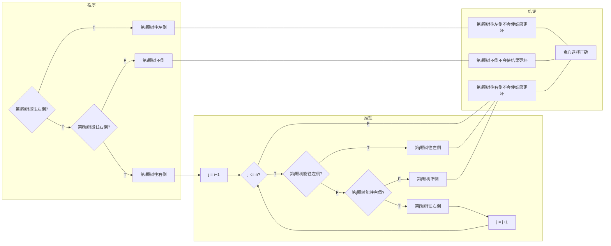

# Problems in Codeforces.com

Updated 1607 GMT+8 Nov 1, 2024

2020 fall, Complied by Hongfei Yan

==**How to find the problems?**==
Visit http://codeforces.com/, click 'PROBLEMSET', then click green checkmark (order=BY_SOLVED_DESC). That is, click http://codeforces.com/problemset?order=BY_SOLVED_DESC.

==**What is Codeforces? What kind of a site/resource is it?**==
Codeforces is a project joining people interested in and taking part in programming contests. On one hand, Codeforces is a social network dedicated to programming and programming contests. On the other hand, it is a platform where contests are held regularly, the participant's skills are reflected by their rating and the former contests can be used to prepare. 


如果想查看某个题目的测试数据（往年可以看到其他人提交的代码，目前2024年10月被屏蔽了），替换链接中数字和最后一个字母，例如查看580C 可以访问
http://codeforces.com/problemset/status/580/problem/C

Codeforces题目是英文，洛谷提供中文。方法是拿到CF题号，如：1749C，直接编辑这个link的相应题号位置，
https://www.luogu.com.cn/problem/CF1749C


# ==Basic Programming Exercises==

#. title, algorithm, ==difficulty==, link


## 1A. Theatre Square

math, 1000, http://codeforces.com/problemset/problem/1/A

Theatre Square in the capital city of Berland has a rectangular shape with the size *n* × *m* meters. On the occasion of the city's anniversary, a decision was taken to pave the Square with square granite flagstones. Each flagstone is of the size *a* × *a*.

What is the least number of flagstones needed to pave the Square? It's allowed to cover the surface larger than the Theatre Square, but the Square has to be covered. It's not allowed to break the flagstones. The sides of flagstones should be parallel to the sides of the Square.

**Input**

The input contains three positive integer numbers in the first line: *n*,  *m* and *a* (1 ≤  *n*, *m*, *a* ≤ 109).

**Output**

Write the needed number of flagstones.

Examples

input

```
6 6 4
```

output

```
4
```


用边长为a的正方形瓷砖铺满 m*n的广场，按长和宽算个数

```Python
import math
n, m, a = [int(x) for x in input().split()]
l = math.ceil(n/a)
w = math.ceil(m/a)
print(l*w)
```

short code

```Python
n,m,a=map(int,input().split())
print(-n//a*(-m//a))
```

==不用math.ceil，-5//4=-2，运算顺序相当于 (-n//a)*(-m//a)==


## 4A. Watermelon

brute force/math, 800, http://codeforces.com/problemset/problem/4/A

****

One hot summer day Pete and his friend Billy decided to buy a watermelon. They chose the biggest and the ripest one, in their opinion. After that the watermelon was weighed, and the scales showed *w* kilos. They rushed home, dying of thirst, and decided to divide the berry, however they faced a hard problem.

Pete and Billy are great fans of even numbers, that's why they want to divide the watermelon in such a way that each of the two parts weighs even number of kilos, at the same time it is not obligatory that the parts are equal. The boys are extremely tired and want to start their meal as soon as possible, that's why you should help them and find out, if they can divide the watermelon in the way they want. For sure, each of them should get a part of positive weight.

**Input**

The first (and the only) input line contains integer number *w* (1 ≤ *w* ≤ 100) — the weight of the watermelon bought by the boys.

**Output**

Print YES, if the boys can divide the watermelon into two parts, each of them weighing even number of kilos; and NO in the opposite case.

Examples

input

```
8
```

output

```
YES
```

Note

For example, the boys can divide the watermelon into two parts of 2 and 6 kilos respectively (another variant — two parts of 4 and 4 kilos)


将一个数分成两个偶数

```Python
w = int(input()) 
if 3<=w<=100 and (w-2) % 2 == 0: 
    print('YES') 
else: 
    print('NO')
```

short code 1

```python
i=int(input()) 
print(['YES','NO'][i%2 or i<3])
```

short code 2

```python
print("YNEOS"[2**int(input())%24<9::2]) 
```


## 25A. IQ test

brute force, 1300, http://codeforces.com/problemset/problem/25/A

Bob is preparing to pass IQ test. The most frequent task in this test is to find out which one of the given *n* numbers differs from the others. Bob observed that one number usually differs from the others in evenness. Help Bob — to check his answers, he needs a program that among the given *n* numbers finds one that is different in evenness.

**Input**

The first line contains integer *n* (3 ≤ *n* ≤ 100) — amount of numbers in the task. The second line contains *n* space-separated natural numbers, not exceeding 100. It is guaranteed, that exactly one of these numbers differs from the others in evenness.

**Output**

Output index of number that differs from the others in evenness. Numbers are numbered from 1 in the input order.

Examples

input

```
5
2 4 7 8 10
```

output

```
3
```

input

```
4
1 2 1 1
```

output

```
2
```


```python
n = int(input())
a = list(map(int, input().split()))
a = [i % 2 for i in a]
sum_val = sum(a)
if sum_val == 1:
    print(a.index(1) + 1)
else:
    print(a.index(0) + 1)
```


```python
n = int(input())
l = [int(x) for x in input().split()]

cnt_even = 0

for i in range(n):
    if l[i]%2==0:
        cnt_even += 1

if cnt_even == 1:
    for i in range(n):
        if l[i]%2==0:
            print(i+1)
            break
else:
    for i in range(n):
        if l[i]%2 != 0:
            print(i+1)
            break
```


```python
n = int(input())
l = input().split()
m = ''
for i in range(n):
    m = m + str(int(l[i])%2)

if m.count('1')==1:
    print(int(m.index('1'))+1)
else:
    print(int(m.index('0'))+1)
```


周晋飞

```python
useless = input()
a = [int(x)%2 for x in input().split()]
print(a.index(sum(a)==1)+1)
```


## 34B. Sale

greedy, sorting, 900, https://codeforces.com/problemset/problem/34/B

Once Bob got to a sale of old TV sets. There were *n* TV sets at that sale. TV set with index *i* costs $a_i$ bellars. Some TV sets have a negative price — their owners are ready to pay Bob if he buys their useless apparatus. Bob can «buy» any TV sets he wants. Though he's very strong, Bob can carry at most *m* TV sets, and he has no desire to go to the sale for the second time. Please, help Bob find out the maximum sum of money that he can earn.

**Input**

The first line contains two space-separated integers *n* and *m* (1 ≤ *m* ≤ *n* ≤ 100) — amount of TV sets at the sale, and amount of TV sets that Bob can carry. The following line contains *n* space-separated integers $a_i ( - 1000 ≤ a_i ≤ 1000)$ — prices of the TV sets.

**Output**

Output the only number — the maximum sum of money that Bob can earn, given that he can carry at most *m* TV sets.

Examples

Input

```
5 3
-6 0 35 -2 4
```

Output

```
8
```

Input

```
4 2
7 0 0 -7
```

Output

```
7
```


```python
n, m = map(int, input().split())
a = list(map(int, input().split()))
a.sort()
ans = 0
for i in range(m):
    if a[i] > 0:
        break
    ans += a[i]
print(-ans)
```


## 50A. Domino piling

greedy/math, 800, http://codeforces.com/problemset/problem/50/A

You are given a rectangular board of *M* × *N* squares. Also you are given an unlimited number of standard domino pieces of 2 × 1 squares. You are allowed to rotate the pieces. You are asked to place as many dominoes as possible on the board so as to meet the following conditions:

1. Each domino completely covers two squares.

2. No two dominoes overlap.

3. Each domino lies entirely inside the board. It is allowed to touch the edges of the board.

Find the maximum number of dominoes, which can be placed under these restrictions.

**Input**

In a single line you are given two integers *M* and *N* — board sizes in squares (1 ≤ *M* ≤ *N* ≤ 16).

**Output**

Output one number — the maximal number of dominoes, which can be placed.

Examples

input

```
2 4
```

output

```
4
```

input

```
3 3
```

output

```
4
```


2022fall-cs101，杨文可，哲学系。

首先竖着铺。如果n是偶数，就完成了。如果n是奇数，再在剩下来的一行里面横着铺。

```python
m, n = map(int, input().split())  
 
num = n // 2 * m  
if n % 2 != 0:  
    num += m // 2  
 
print(num)
```


不同 于 Theatre Square，多米诺骨牌可以横放或竖放，可以不铺满（其实最多空一格）可直接按面积相除取整

```python
M, N = [int(x) for x in input().split()] 
print(int(M*N/2))
```

short code

```python
print(eval('*'.join(input().split()))//2)
```

==eval会把字符 串当成算式计算也可返回相应的 list,tuple等==


## 58A. Chat room

greedy/strings, 1000, http://codeforces.com/problemset/problem/58/A

Vasya has recently learned to type and log on to the Internet. He immediately entered a chat room and decided to say hello to everybody. Vasya typed the word *s*. It is considered that Vasya managed to say hello if several letters can be deleted from the typed word so that it resulted in the word "hello". For example, if Vasya types the word "ahhellllloou", it will be considered that he said hello, and if he types "hlelo", it will be considered that Vasya got misunderstood and he didn't manage to say hello. Determine whether Vasya managed to say hello by the given word *s*.

**Input**

The first and only line contains the word *s*, which Vasya typed. This word consisits of small Latin letters, its length is no less that 1 and no more than 100 letters.

**Output**

If Vasya managed to say hello, print "YES", otherwise print "NO".

Examples

input

```
ahhellllloou
```

output

```
YES
```

input

```
hlelo
```

output

```
NO
```

2020fall-cs101，李受禧

```python
s = input()
s = s.lower()

dp = [0]*5
data = 'hello'
cnt = 0

for c in s:
    if c == data[cnt]:
        dp[cnt] += 1
        cnt += 1
    
    if cnt == 5:
        break

if sum(dp) == 5:
    print('YES')
else:
    print('NO')
```


```python
import re
s = input()
r = re.search('h.*e.*l.*l.*o', s)
print(['YES', 'NO'][r==None])
```


## 69A. Young Physicist

implementation/math, 1000, https://codeforces.com/problemset/problem/69/A

A guy named Vasya attends the final grade of a high school. One day Vasya decided to watch a match of his favorite hockey team. And, as the boy loves hockey very much, even more than physics, he forgot to do the homework. Specifically, he forgot to complete his physics tasks. Next day the teacher got very angry at Vasya and decided to teach him a lesson. He gave the lazy student a seemingly easy task: You are given an idle body in space and the forces that affect it. The body can be considered as a material point with coordinates (0; 0; 0). Vasya had only to answer whether it is in equilibrium. "Piece of cake" — thought Vasya, we need only to check if the sum of all vectors is equal to 0. So, Vasya began to solve the problem. But later it turned out that there can be lots and lots of these forces, and Vasya can not cope without your help. Help him. Write a program that determines whether a body is idle or is moving by the given vectors of forces.

**Input**

The first line contains a positive integer *n* (1 ≤ *n* ≤ 100), then follow *n* lines containing three integers each: the *x~i~* coordinate, the *y~i~* coordinate and the *z~i~* coordinate of the force vector, applied to the body ( - 100 ≤ *x~i~*, *y~i~*, *z~i~* ≤ 100).

**Output**

Print the word "YES" if the body is in equilibrium, or the word "NO" if it is not.

Examples

input

```
3
4 1 7
-2 4 -1
1 -5 -3
```

output

```
NO
```

input

```
3
3 -1 7
-5 2 -4
2 -1 -3
```

output

```
YES
```

```python
n = int(input())
x = 0
y = 0
z = 0
while n>0:
        n -= 1
        f = [int(i) for i in input().split()]
        x += f[0]
        y += f[1]
        z += f[2]

if x==y==z==0:
        print('YES')
else:
        print('NO')
```


```python
n = int(input())
suma = [0]*3
for i in range(n):
    s = list(map(int,input().split()))
    suma = list(map(lambda x, y: x + y, s, suma))
if suma == [0,0,0]:
    print('YES')
else:
    print('NO')
```


## 71A. Way Too Long Words

strings, 800, http://codeforces.com/problemset/problem/71/A

Sometimes some words like "*localization*" or "*internationalization*" are so long that writing them many times in one text is quite tiresome.

Let's consider a word *too long*, if its length is **strictly more** than 10 characters. All too long words should be replaced with a special abbreviation.

This abbreviation is made like this: we write down the first and the last letter of a word and between them we write the number of letters between the first and the last letters. That number is in decimal system and doesn't contain any leading zeroes.

Thus, "*localization*" will be spelt as "*l10n*", and "*internationalization*" will be spelt as "i18n".

You are suggested to automatize the process of changing the words with abbreviations. At that all too long words should be replaced by the abbreviation and the words that are not too long should not undergo any changes.

**Input**

The first line contains an integer *n* (1 ≤ *n* ≤ 100). Each of the following *n* lines contains one word. All the words consist of lowercase Latin letters and possess the lengths of from 1 to 100 characters.

**Output**

Print *n* lines. The *i*-th line should contain the result of replacing of the *i*-th word from the input data.

Examples

input

```
4
word
localization
internationalization
pneumonoultramicroscopicsilicovolcanoconiosis
```

output

```
word
l10n
i18n
p43s
```


长度大于10 的单词缩写为首字母+中间字母数+尾字母

```Python
n = int(input())
for i in range(n):
	word = input()
	length = len(word)
	if length >10:
		num = str(length-2)
		short = word[0]+num+word[-1]
		print(short)
	else:
		print(word)
```

==选择性输出，可以 在 print里 完成==

```python
for _ in range(int(input())):
	a = input()
	l = len(a)
	print(a if l<11 else a[0]+str(l-2)+a[l-1])
```


## 96A. Football

implementation/strings, 900, http://codeforces.com/problemset/problem/96/A

Petya loves football very much. One day, as he was watching a football match, he was writing the players' current positions on a piece of paper. To simplify the situation he depicted it as a string consisting of zeroes and ones. A zero corresponds to players of one team; a one corresponds to players of another team. If there are at least 7 players of some team standing one after another, then the situation is considered dangerous. For example, the situation 00100110111111101 is dangerous and 11110111011101 is not. You are given the current situation. Determine whether it is dangerous or not.

**Input**

**The first input lin**e contains a non-empty string consisting of characters "0" and "1", which represents players. The length of the string does not exceed 100 characters. There's at least one player from each team present on the field.

**Output**

Print "YES" if the situation is dangerous. Otherwise, print "NO".

Examples

input

```
001001
```

output

```
NO
```

input

```
1000000001
```

output

```
YES
```


```python
l = input()

n_0 = 0
n_1 = 0
for c in l:
        if c=='0':
                n_0 += 1
                if n_0==7: break
                n_1 = 0
        else:
                n_1 += 1
                if n_1==7: break
                n_0 = 0
                
if n_0==7 or n_1==7:
        print('YES')
else:
        print('NO')
```


```python
s=input()
print(['NO','YES']['0'*7 in s or '1'*7 in s])
```


## 112A. Petya and Strings

implementation/strings, 800, http://codeforces.com/problemset/problem/112/A

Little Petya loves presents. His mum bought him two strings of the same size for his birthday. The strings consist of uppercase and lowercase Latin letters. Now Petya wants to compare those two strings lexicographically. The letters' case does not matter, that is an uppercase letter is considered equivalent to the corresponding lowercase letter. Help Petya perform the comparison.

**Input**

Each of the first two lines contains a bought string. The strings' lengths range from 1 to 100 inclusive. It is guaranteed that the strings are of the same length and also consist of uppercase and lowercase Latin letters.

**Output**

If the first string is less than the second one, print "-1". If the second string is less than the first one, print "1". If the strings are equal, print "0". Note that the letters' case is not taken into consideration when the strings are compared.

Examples

input

```
aaaa
aaaA
```

output

```
0
```

input

```
abs
Abz
```

output

```
-1
```

input

```
abcdefg
AbCdEfF
```

output

```
1
```

Note

If you want more formal information about the lexicographical order (also known as the "dictionary order" or "alphabetical order"), you can visit the following site:

- http://en.wikipedia.org/wiki/Lexicographical_order


按字典方式排序，不考虑大小写。一个个字母比即可。

```python
s1 = input().lower()
s2 = input().lower()
num = 0
for i in range(len(s1)):
	if ord(s1[i]) < ord(s2[i]):
		print('-1')
		break
	elif ord(s1[i]) > ord(s2[i]):
		print('1')
		break
	else:
		num += 1
if num == len(s1):
	print('0')
```


可以直接比较字符串的大小，不用一个一个比较（比较字符串大小本来就是一个一个比较的，这样代码会比较简） （来自江雨翔）

```python
line1 = input()
line2 = input() 
if line1.lower() > line2.lower(): 
    print(1) 
elif line1.lower() < line2.lower(): 
    print(-1) 
else: 
    print(0)
```

short code

```python
i=input;a=i().lower();b=i().lower()
print((a>b) - (a<b))
```

==()表 判断，返回布尔值，加减运算 True是 1 False是 0==


C++，陆宸

```c++
#include <iostream>
#include <cstring>
using namespace std;
int main (){
        string str1, str2;
        int len;
        int cnt1, cnt2;
        cnt1 = 0;
        cnt2 = 0;
        cin >> str1 >> str2;
        len = str1.size();
        for (int i = 0; i < len; i++){
                if (str1[i] < 97){
                        str1[i] += 32;
                }
                if (str2[i] < 97){
                        str2[i] += 32;
                }
                if (str1[i] > str2[i]){
                        cout << 1;
                        break;
                }else if (str1[i] < str2[i]){
                        cout << -1;
                        break;
                }else if (str1[i] == str2[i] && i == len - 1){
                        cout << 0;
                        break;
                }
        }
        return 0;
}
```


## 118A. String Task

implementation/strings, 1000, http://codeforces.com/problemset/problem/118/A

Petya started to attend programming lessons. On the first lesson his task was to write a simple program. The program was supposed to do the following: in the given string, consisting if uppercase and lowercase Latin letters, it:

- deletes all the vowels,
- inserts a character "." before each consonant,
- replaces all uppercase consonants with corresponding lowercase ones.

Vowels are letters "A", "O", "Y", "E", "U", "I", and the rest are consonants. The program's input is exactly one string, it should return the output as a single string, resulting after the program's processing the initial string.

Help Petya cope with this easy task.

**Input**

The first line represents input string of Petya's program. This string only consists of uppercase and lowercase Latin letters and its length is from 1 to 100, inclusive.

**Output**

Print the resulting string. It is guaranteed that this string is not empty.

Examples

input

```
tour
```

output

```
.t.r
```

input

```
Codeforces
```

output

```
.c.d.f.r.c.s
```

input

```
aBAcAba
```

output

```
.b.c.b
```


去掉元音，并用.来连接剩余字母的小写

```python
str = input()
word = str.lower()
output = []
vowel = ['a','e','i','o','u','y']
for char in word:
	if char not in vowel:
		output.append('.')
		output.append(char)
print(''.join(output))
```

short code

```python
print(''.join('.'+l for l in input().lower() if l not in 'aeiouy'))
```


C++

```c++
#include <bits/stdc++.h>
char a[]="aoyeui",c;
int main(){
        while(std::cin>>c)
                if(!strchr(a,c|=32))
                        std::cout<<'.'<<c;
}
```


## 122A. Lucky Division

brute force, number theory, 1000, https://codeforces.com/problemset/problem/122/A

Petya loves lucky numbers. Everybody knows that lucky numbers are positive integers whose decimal representation contains only the lucky digits **4** and **7**. For example, numbers **47**, **744**, **4** are lucky and **5**, **17**, **467** are not.

Petya calls a number almost lucky if it could be evenly divided by some lucky number. Help him find out if the given number *n* is almost lucky.

**Input**

The single line contains an integer *n* (1 ≤ *n* ≤ 1000) — the number that needs to be checked.

**Output**

In the only line print "YES" (without the quotes), if number *n* is almost lucky. Otherwise, print "NO" (without the quotes).

Examples

input

```
47
```

output

```
YES
```

input

```
16
```

output

```
YES
```

input

```
78
```

output

```
NO
```

Note

Note that all lucky numbers are almost lucky as any number is evenly divisible by itself.

In the first sample 47 is a lucky number. In the second sample 16 is divisible by 4.


```python
n = int(input())

for i in {4,7,47,74,447,474,477,747,774}:
    if n%i == 0:
        print('YES')
        break
else:
    print('NO')
```

2020fall-cs101-赵春源

```Python
def check(x):
    s = str(x)
    for c in s:
        if c!= '4' and c!= '7':
            return False
    return True

n = int(input())
for i in range(1, n+1):
    if n%i == 0 and check(i) == True:
        print('YES')
        break
else:
    print('NO')
```

```python
def check(x):
    s = str(x)
    return [False, True][s.count('4') + s.count('7') ==len(s)]

n = int(input())
for i in range(1, n+1):
    if n%i == 0 and check(i) == True:
        print('YES')
        break
else:
    print('NO')
```

用len函数是多么简单好用，学到了~

```Python
n = int(input())
luckynumbers = []
for i in range(1, 1002):
    s = str(i)
    if s.count('4') + s.count('7') == len(s):
        luckynumbers.append(i)

b = 0
for i in luckynumbers:
    if n%i == 0:
        b = 1
print(['NO', 'YES'][b])
```

any(x)判断x对象是否为空对象，如果都为空、0、false，则返回false，如果不都为空、0、false，则返回true

all(x)如果all(x)参数x对象的所有元素不为0、''、False或者x为空对象，则返回True，否则返回False

```python
n = int(input())
print('NO' if all([n%i for i in (4,7,47,74,447,474,477,747,774)]) else 'YES')
```


2022fall-cs101，刘子芊。分解因数法。

```python
import re
#import sys
n = int(input())

#求因数
def factor(n):
    fac = []
    for i in range(1, (n+1)//2):
        if n%i == 0:
            fac.append(i)
            fac.append(n//i)
    return list(set(fac))

#分解因数+本身（无1）
facn = factor(n)

#因数中若出现lucky number则是almost lucky
pattern = r'^[47]+$'
for num in facn:
    if re.match(pattern, str(num)) != None:
        print('YES')
        #sys.exit()
        break
else:
    print('NO')
```


## 151A. Soft Drinking

implementation, math, 800, https://codeforces.com/problemset/problem/151/A

This winter is so cold in Nvodsk! A group of *n* friends decided to buy *k* bottles of a soft drink called "Take-It-Light" to warm up a bit. Each bottle has *l* milliliters of the drink. Also they bought *c* limes and cut each of them into *d* slices. After that they found *p* grams of salt.

To make a toast, each friend needs *nl* milliliters of the drink, a slice of lime and *np* grams of salt. The friends want to make as many toasts as they can, provided they all drink the same amount. How many toasts can each friend make?

**Input**

The first and only line contains **positive** integers *n*, *k*, *l*, *c*, *d*, *p*, *nl*, *np*, not exceeding 1000 and no less than 1. The numbers are separated by exactly one space.

**Output**

Print a single integer — the number of toasts each friend can make.

Examples

Input

```
3 4 5 10 8 100 3 1
```

Output

```
2
```

Input

```
5 100 10 1 19 90 4 3
```

Output

```
3
```

Input

```
10 1000 1000 25 23 1 50 1
```

Output

```
0
```

Note

A comment to the first sample:

Overall the friends have 4 * 5 = 20 milliliters of the drink, it is enough to make 20 / 3 = 6 toasts. The limes are enough for 10 * 8 = 80 toasts and the salt is enough for 100 / 1 = 100 toasts. However, there are 3 friends in the group, so the answer is *min*(6, 80, 100) / 3 = 2.


```python
n, k, l, c, d, p, nl, np = map(int, input().split())
print(min(k * l // nl, c * d, p // np) // n)
```


## 158A. Next Round

*special problem/implementation, 800, http://codeforces.com/problemset/problem/158/A

"Contestant who earns a score equal to or greater than the *k*-th place finisher's score will advance to the next round, as long as the contestant earns a positive score..." — an excerpt from contest rules.

A total of *n* participants took part in the contest (*n* ≥ *k*), and you already know their scores. Calculate how many participants will advance to the next round.

**Input**

The first line of the input contains two integers *n* and *k* (1 ≤ *k* ≤ *n* ≤ 50) separated by a single space.

The second line contains *n* space-separated integers *a*~1~, *a*~2~, ..., a~n~ (0 ≤ a~i~ ≤ 100), where a~i~ is the score earned by the participant who got the *i*-th place. The given sequence is non-increasing (that is, for all *i* from 1 to *n* - 1 the following condition is fulfilled: a~i~ ≥ a~i~ + 1).

**Output**

Output the number of participants who advance to the next round.

Examples

input

```
8 5
10 9 8 7 7 7 5 5
```

output

```
6
```

input

```
4 2
0 0 0 0
```

output

```
0
```

Note

In the first example the participant on the 5th place earned 7 points. As the participant on the 6th place also earned 7 points, there are 6 advancers.

In the second example nobody got a positive score.


统计不小于第k位选手得分的人数

```python
n, k = map(int, input().split())
score = [int(x) for x in input().split()]
num = 0
k_score = score[k-1]
for i in range(n):
	s = score[i]
	if s >= k_score and s>0:
		num += 1
print(num)
```

short code

```python
i=lambda:map(int,input().split())
n,k=i()
a=list(i())
print(sum([x>=(a[k-1] or 1) for x in a]))
```

==用or不能 用 and==


## 160A. Twins

greedy, sortings, 900, https://codeforces.com/problemset/problem/160/A


Imagine that you have a twin brother or sister. Having another person that looks exactly like you seems very unusual. It's hard to say if having something of an alter ego is good or bad. And if you do have a twin, then you very well know what it's like.

Now let's imagine a typical morning in your family. You haven't woken up yet, and Mom is already going to work. She has been so hasty that she has nearly forgotten to leave the two of her darling children some money to buy lunches in the school cafeteria. She fished in the purse and found some number of coins, or to be exact, *n* coins of arbitrary values $a_1, a_2, ..., a_n$. But as Mom was running out of time, she didn't split the coins for you two. So she scribbled a note asking you to split the money equally.

As you woke up, you found Mom's coins and read her note. "But why split the money equally?" — you thought. After all, your twin is sleeping and he won't know anything. So you decided to act like that: pick for yourself some subset of coins so that the sum of values of your coins is **strictly larger** than the sum of values of the remaining coins that your twin will have. However, you correctly thought that if you take too many coins, the twin will suspect the deception. So, you've decided to stick to the following strategy to avoid suspicions: you take the **minimum number of coins**, whose sum of values is strictly more than the sum of values of the remaining coins. On this basis, determine what **minimum** number of coins you need to take to divide them in the described manner.

**Input**

The first line contains integer *n* (1 ≤ *n* ≤ 100) — the number of coins. The second line contains a sequence of *n* integers $a_1, a_2, ..., a_n (1 ≤ a_i ≤ 100) $ — the coins' values. All numbers are separated with spaces.

**Output**

In the single line print the single number — the minimum needed number of coins.

Examples

input

```
2
3 3
```

output

```
2
```

input

```
3
2 1 2
```

output

```
2
```

Note

In the first sample you will have to take 2 coins (you and your twin have sums equal to 6, 0 correspondingly). If you take 1 coin, you get sums 3, 3. If you take 0 coins, you get sums 0, 6. Those variants do not satisfy you as your sum should be strictly more that your twins' sum.

In the second sample one coin isn't enough for us, too. You can pick coins with values 1, 2 or 2, 2. In any case, the minimum number of coins equals 2.


```python
n = int(input())
coins = [int(i) for i in input().split()]
fq = 101*[0]    #skip index 0
 
nSum = 0
for i in range(n):
        nSum += coins[i]
        fq[int(coins[i])] += 1
 
avg = nSum//2
 
n_coin = 0
value_n_coin = 0
 
stop_value = 0
for value in range(100,0,-1):
        if fq[value]==0: continue
 
        if fq[value]*value + value_n_coin > avg :
                stop_value = value
                break
 
        value_n_coin += fq[value]*value
        n_coin += fq[value]
 
for i in range(1,fq[stop_value]+1):
        if i*stop_value + value_n_coin > avg :
                n_coin += i
                break
 
print(n_coin)
```

这段代码实现了一个算法，用于解决一个特定的问题：给定一组硬币（每个硬币有一个非负整数值），目标是选择最少数量的硬币，使这些硬币的总值至少达到所有硬币总值的一半。这个算法的时间复杂度主要由几个部分组成：

1. **输入处理**：`n = int(input())` 和 `coins = [int(i) for i in input().split()]` 这两行代码用于读取输入数据。这里的时间复杂度为 O(n)，因为需要遍历一次输入的字符串来创建列表 `coins`。

2. **频率数组初始化与填充**：`fq = 101*[0]` 初始化一个大小为101的列表，用于存储每个可能的硬币值出现的次数（假设硬币值范围在1到100之间）。接着，通过循环 `for i in range(n):` 遍历所有硬币，更新它们在 `fq` 中对应的计数。这一部分的时间复杂度也是 O(n)。

3. **计算平均值**：`avg = nSum//2` 计算所有硬币总值的一半。这里的操作是常数时间复杂度 O(1)。

4. **寻找停止值**：接下来的循环 `for value in range(100,0,-1):` 从最大可能的硬币值开始，向最小值方向遍历，直到找到第一个满足条件的硬币值，即 `fq[value]*value + value_n_coin > avg`。这部分最坏情况下的时间复杂度为 O(100)，即 O(1)，因为循环最多执行100次。

5. **确定最终硬币数量**：最后一个循环 `for i in range(1,fq[stop_value]+1):` 用于确定在达到或超过平均值时需要添加多少个 `stop_value` 硬币。最坏情况下，这将执行 `fq[stop_value]` 次，但由于 `fq[stop_value]` 最多为 n，因此这部分的时间复杂度为 O(n)。

综上所述，整个算法的主要时间消耗在于输入处理和频率数组的填充上，即 O(n)。其他部分的时间复杂度要么是常数级别的，要么与硬币值的范围相关（在这里固定为100，因此可以视为常数时间）。因此，该算法的整体时间复杂度为 O(n)。

这个算法有效地解决了问题，因为它通过首先考虑高价值的硬币来尽可能快地达到目标值，从而确保了选择的硬币数量最少。


```python
n = int(input())
a = list(map(int, input().split()))
a.sort(reverse=True)
b = 0
c = sum(a)
k = 0
for i in a:
    b += i
    k += 1
    if b > c/2:
        break
print(k)
```

这段代码的目标是找出最少数量的硬币，使得这些硬币的总值大于所有硬币总值的一半。为了实现这个目标，它首先对硬币按照价值进行降序排序，然后依次累加硬币的值，直到总值超过所有硬币总值的一半。下面是对这段代码的时间复杂度分析：

1. **输入处理**：
   - `n = int(input())`：读取输入的硬币数量，时间复杂度为 O(1)。
   - `a = list(map(int, input().split()))`：读取并转换成整数列表，时间复杂度为 O(n)。

2. **排序**：
   - `a.sort(reverse=True)`：对硬币列表按降序排序。排序操作的时间复杂度通常为 O(n log n)，其中 n 是列表中的元素数量。

3. **求和**：
   - `c = sum(a)`：计算所有硬币的总值，时间复杂度为 O(n)。

4. **累加和判断**：
   - `for i in a:`：遍历排序后的硬币列表，时间复杂度为 O(n)。但在实际运行中，由于存在 `if b > c/2: break` 的条件，循环可能会提前终止，具体取决于硬币的分布情况。然而，在最坏的情况下，这个循环仍然需要遍历整个列表，所以时间复杂度仍为 O(n)。

综合以上各部分，这段代码的时间复杂度主要由排序操作决定，即 **O(n log n)**。这是因为排序操作的时间复杂度通常高于其他部分的操作，如输入处理、求和和累加判断等。


## 174A. Sum

implementation, 800, https://codeforces.com/problemset/problem/1742/A

You are given three integers 𝑎, 𝑏, and 𝑐. Determine if one of them is the sum of the other two.

**Input**

The first line contains a single integer 𝑡 (1≤𝑡≤9261) — the number of test cases.

The description of each test case consists of three integers 𝑎, 𝑏, 𝑐 (0≤𝑎,𝑏,𝑐≤20).

**Output**

For each test case, output "YES" if one of the numbers is the sum of the other two, and "NO" otherwise.

You can output the answer in any case (for example, the strings "yEs", "yes", "Yes" and "YES" will be recognized as a positive answer).

Example

Input

```
7
1 4 3
2 5 8
9 11 20
0 0 0
20 20 20
4 12 3
15 7 8
```

Output

```
YES
NO
YES
YES
NO
NO
YES
```

Note

In the first test case, 1+3=4.

In the second test case, none of the numbers is the sum of the other two.

In the third test case, 9+11=20.


```python
t = int(input())
for _ in range(t):
    a = list(map(int, input().split()))
    a.sort()
    if a[0] + a[1] == a[2]:
        print("YES")
    else:
        print("NO")
```


## 200B. Drinks

implementation, math, 800, https://codeforces.com/problemset/problem/200/B

Little Vasya loves orange juice very much. That's why any food and drink in his kitchen necessarily contains orange juice. There are *n* drinks in his fridge, the volume fraction of orange juice in the *i*-th drink equals *p~i~* percent.

One day Vasya decided to make himself an orange cocktail. He took equal proportions of each of the *n* drinks and mixed them. Then he wondered, how much orange juice the cocktail has.

Find the volume fraction of orange juice in the final drink.

**Input**

The first input line contains a single integer *n* (1 ≤ *n* ≤ 100) — the number of orange-containing drinks in Vasya's fridge. The second line contains *n* integers *p~i~* (0 ≤ *p~i~* ≤ 100) — the volume fraction of orange juice in the *i*-th drink, in percent. The numbers are separated by a space.

**Output**

Print the volume fraction in percent of orange juice in Vasya's cocktail. The answer will be considered correct if the absolute or relative error does not exceed 10^-4^.

Examples

input

```
3
50 50 100
```

output

```
66.666666666667
```

input

```
4
0 25 50 75
```

output

```
37.500000000000
```

Note

Note to the first sample: let's assume that Vasya takes *x* milliliters of each drink from the fridge. Then the volume of pure juice in the cocktail will equal  milliliters. The total cocktail's volume equals 3·*x* milliliters, so the volume fraction of the juice in the cocktail equals , that is, 66.(6) percent.


```Python
n=int(input())
p = list(map(int,input().split()))
print(sum(p)/n)
```


## 231A. Team

bruteforce/greedy, 800, http://codeforces.com/problemset/problem/231/A

One day three best friends Petya, Vasya and Tonya decided to form a team and take part in programming contests. Participants are usually offered several problems during programming contests. Long before the start the friends decided that they will implement a problem if at least two of them are sure about the solution. Otherwise, the friends won't write the problem's solution.

This contest offers *n* problems to the participants. For each problem we know, which friend is sure about the solution. Help the friends find the number of problems for which they will write a solution.

**Input**

The first input line contains a single integer *n* (1 ≤ *n* ≤ 1000) — the number of problems in the contest. Then *n* lines contain three integers each, each integer is either 0 or 1. If the first number in the line equals 1, then Petya is sure about the problem's solution, otherwise he isn't sure. The second number shows Vasya's view on the solution, the third number shows Tonya's view. The numbers on the lines are separated by spaces.

**Output**

Print a single integer — the number of problems the friends will implement on the contest.

Examples

input

```
3
1 1 0
1 1 1
1 0 0
```

output

```
2
```

input

```
2
1 0 0
0 1 1
```

output

```
1
```

Note

In the first sample Petya and Vasya are sure that they know how to solve the first problem and all three of them know how to solve the second problem. That means that they will write solutions for these problems. Only Petya is sure about the solution for the third problem, but that isn't enough, so the friends won't take it.

In the second sample the friends will only implement the second problem, as Vasya and Tonya are sure about the solution.


三人小队，至少两个人会才能答出问题

```python
n = int(input())
num = 0
for i in range(n):
	a, b, c = [int(x) for x in input().split()]
	if a + b + c >1:
		num += 1
print(num)
```

short code

```python
print(sum(input().count('1')>1 for x in range(int(input()))))
```

==print()也 很 耗 时间，如果 要多次输出，可以在 print()里套循环，减少调用次数==


## 236A. Boy or Girl

brute force/implementation/strings, 800, https://codeforces.com/problemset/problem/236/A

Those days, many boys use beautiful girls' photos as avatars in forums. So it is pretty hard to tell the gender of a user at the first glance. Last year, our hero went to a forum and had a nice chat with a beauty (he thought so). After that they talked very often and eventually they became a couple in the network.

But yesterday, he came to see "her" in the real world and found out "she" is actually a very strong man! Our hero is very sad and he is too tired to love again now. So he came up with a way to recognize users' genders by their user names.

This is his method: if the number of distinct characters in one's user name is odd, then he is a male, otherwise she is a female. You are given the string that denotes the user name, please help our hero to determine the gender of this user by his method.

**Input**

The first line contains a non-empty string, that contains only lowercase English letters — the user name. This string contains at most 100 letters.

**Output**

If it is a female by our hero's method, print "CHAT WITH HER!" (without the quotes), otherwise, print "IGNORE HIM!" (without the quotes).

Examples

input

```
wjmzbmr
```

output

```
CHAT WITH HER!
```

input

```
xiaodao
```

output

```
IGNORE HIM!
```

input

```
sevenkplus
```

output

```
CHAT WITH HER!
```

Note

For the first example. There are 6 distinct characters in "wjmzbmr". These characters are: "w", "j", "m", "z", "b", "r". So wjmzbmr is a female and you should print "CHAT WITH HER!".


```python
s = input()
fq = 26*[0]

for c in s:
        fq[ord(c) - ord('a')] += 1

nCount = 0
for i in range(26):
        if fq[i]!=0 :
                nCount += 1

if nCount%2 == 1:
        print('IGNORE HIM!')
else:
        print('CHAT WITH HER!')
```


```python
s = set()
s.update(input())
if len(s)%2 == 1:
    print('IGNORE HIM!')
else:
    print('CHAT WITH HER!')
```

update Method:

This method is used to return the union of a set and the set of elements from one or more iterable like string, list, set. It is very similar to **union()** method, with difference is that where union() method create and return a new set, containing all the elements ( distinct ) present in all the iterables, update() method updates the set on which this method is called with all the distinct elements present in all the iterables.


C++

```c++
#include <bits/stdc++.h>
using namespace std;
int main(){
        set<char> s; char c;
        while(cin>>c)
                s.insert(c);
        cout<<(s.size()&1?"IGNORE HIM!":"CHAT WITH HER!");
}
```


## 263A. Beautiful Matrix

implementation, 800, http://codeforces.com/problemset/problem/263/A

You've got a 5 × 5 matrix, consisting of 24 zeroes and a single number one. Let's index the matrix rows by numbers from 1 to 5 from top to bottom, let's index the matrix columns by numbers from 1 to 5 from left to right. In one move, you are allowed to apply one of the two following transformations to the matrix:

1. Swap two neighboring matrix rows, that is, rows with indexes *i* and *i* + 1 for some integer *i* (1 ≤ *i* < 5).
2. Swap two neighboring matrix columns, that is, columns with indexes *j* and *j* + 1 for some integer *j* (1 ≤ *j* < 5).

You think that a matrix looks *beautiful*, if the single number one of the matrix is located in its middle (in the cell that is on the intersection of the third row and the third column). Count the minimum number of moves needed to make the matrix beautiful.

**Input**

The input consists of five lines, each line contains five integers: the *j*-th integer in the *i*-th line of the input represents the element of the matrix that is located on the intersection of the *i*-th row and the *j*-th column. It is guaranteed that the matrix consists of 24 zeroes and a single number one.

**Output**

Print a single integer — the minimum number of moves needed to make the matrix beautiful.

Examples

input

```
0 0 0 0 0
0 0 0 0 1
0 0 0 0 0
0 0 0 0 0
0 0 0 0 0
```

output

```
3
```

input

```
0 0 0 0 0
0 0 0 0 0
0 1 0 0 0
0 0 0 0 0
0 0 0 0 0
```

output

```
1
```


```python
for i in range(5):
    s = input().split()
    if "1" in s:
        print(abs(i-2)+abs(s.index("1")-2))
        break
```

周晋飞

```python
matrix = [[int(x) for x in input().split()] for i in range(5)]

for i in range(5):
    if 1 in matrix[i]:
        j = matrix[i].index(1)
        print(abs(i-2)+abs(j-2))
        break
```

马玉娇，代码容易看懂

```python
a = input().split()
b = input().split()
c = input().split()
d = input().split()
e = input().split()
if '1' in a:
    print(abs(a.index('1')-2) +2)
if '1' in b:
    print(abs(b.index('1')-2) +1)
if '1' in c:
    print(abs(c.index('1')-2))
if '1' in d:
    print(abs(d.index('1')-2) +1)
if '1' in e:
    print(abs(e.index('1')-2) +2)
```

韩无极，代码容易看懂

```Python
for i in range(5):
    lis = list(map(int,input().split()))
    if 1 in lis:
        r = i
        break
for j in range(5):
    if lis[j]==1:
        c = j
print(abs(c-2)+abs(r-2))
```

庞翔升，代码不容易看懂

```python
c = 0
for i in range(5):
    exec('a%s=list(input().split())'%i)
for i in range(5):
    for o in range(5):
        exec('c=(a%s[o])'%i)
        if c=='1':
            print(abs(i-2)+abs(o-2))
```


```python
mx = [ [0]*5 for row in range(5) ]

for row in range(5):
    line = [int(j) for j in input().split()]
    if max(line)==1:
        for column in range(5):
            if line[column]==1:
                mx[row][column]=1
                break
	print(abs(row-2) + abs(column-2))
    break
```

short code

```python
l = [2,1,0,1,2]
for i in l:
    s = input()
    if "1" in s: 
        print(i + l[s.find("1")//2])
```


C++，陆宸

```c++
#include <iostream>
#include <cmath>
using namespace std;
int main (){
        int x[5][5];
        int r, c;
        for (int i = 0; i < 5; i++){
                for (int j = 0; j < 5; j++){
                        x[i][j] = 0;
                }
        }
        for (int w = 0; w < 5; w++){
                for (int t = 0; t < 5; t++){
                        cin >> x[w][t];
                }
        }
        for (int a = 0; a < 5; a++){
                for (int b = 0; b < 5; b++){
                        if (x[a][b] != 0){
                                r = a;
                                c = b;
                        }
                }
        }
        cout << abs (r-2) + abs (c-2);
        return 0;
}
```


## 266A. Stones on the Table

implementation, 800, http://codeforces.com/problemset/problem/266/A

There are *n* stones on the table in a row, each of them can be red, green or blue. Count the minimum number of stones to take from the table so that any two neighboring stones had different colors. Stones in a row are considered neighboring if there are no other stones between them.

**Input**

The first line contains integer *n* (1 ≤ *n* ≤ 50) — the number of stones on the table.

The next line contains string *s*, which represents the colors of the stones. We'll consider the stones in the row numbered from 1 to *n* from left to right. Then the *i*-th character *s* equals "R", if the *i*-th stone is red, "G", if it's green and "B", if it's blue.

**Output**

Print a single integer — the answer to the problem.

Examples

input

```
3
RRG
```

output

```
1
```

input

```
5
RRRRR
```

output

```
4
```

input

```
4
BRBG
```

output

```
0
```


```python
n = int(input())
l = input()

nCount = 0
p = l[0]
for i in range(1,n):
        if l[i]==p:
                nCount += 1
        else:
                p = l[i]

print(nCount)
```


## 270A. Fancy Fence

geometry/implementation/math, 1100, x23265, https://codeforces.com/problemset/problem/270/A

Emuskald needs a fence around his farm, but he is too lazy to build it himself. So he purchased a fence-building robot.

He wants the fence to be a regular polygon. The robot builds the fence along a single path, but it can only make fence corners at a single angle *a*.

Will the robot be able to build the fence Emuskald wants? In other words, is there a regular polygon which angles are equal to *a*?

**Input**

The first line of input contains an integer *t* (0 < *t* < 180) — the number of tests. Each of the following *t* lines contains a single integer *a* (0 < *a* < 180) — the angle the robot can make corners at measured in degrees.

**Output**

For each test, output on a single line "YES" (without quotes), if the robot can build a fence Emuskald wants, and "NO" (without quotes), if it is impossible.

Examples

input

```
3
30
60
90
```

output

```
NO
YES
YES
```

Note

In the first test case, it is impossible to build the fence, since there is no regular polygon with angle .

In the second test case, the fence is a regular triangle, and in the last test case — a square.


> 【黄旭，2020年秋】对于 n边形，其内角和为（n-2）*180°，内角为x度，有(n-2)\*180=n\*x。 则可以得到 n的表达式为 n=360/（180-x），若 n为整数，则可行，反之不可行。

```python
for i in range(int(input())):
    x=int(input())
    print(['NO','YES'][360%(180-x)==0])    
```

```python
n=int(input())
def check(x):
    if 360%(180-x)==0:
        return"YES"
    else:
        return"NO"

for i in range(n):
    x=int(input())
    print(check(x))
```


## 281A. Word Capitalization

implementation/strings, 800, http://codeforces.com/problemset/problem/281/A

Capitalization is writing a word with its first letter as a capital letter. Your task is to capitalize the given word.

Note, that during capitalization all the letters except the first one remains unchanged.

**Input**

A single line contains a non-empty word. This word consists of lowercase and uppercase English letters. The length of the word will not exceed 10^3^.

**Output**

Output the given word after capitalization.

Examples

input

```
ApPLe
```

output

```
ApPLe
```

input

```
konjac
```

output

```
Konjac
```


```python
line = input()
print(line[0].upper() + line[1:])
```


练习ASCII的转化

```python
a = input()
b = ord(a[0])
if b >= 97:
    b -= 32
print (chr(b),end = '')
print(a[1:])
```


C++

```c++
#include <iostream>
#include <cstring>
using namespace std;
int main(){
        string a;
        cin >> a;
        if (a[0] <= 90){
                cout << a;
        }else{
                a[0] -= 32;
                cout << a;
        }
        return 0;
}
```


## 282A. Bit++

implementation, 800, http://codeforces.com/problemset/problem/282/A

The classic programming language of Bitland is Bit++. This language is so peculiar and complicated.

The language is that peculiar as it has exactly one variable, called *x*. Also, there are two operations:

- Operation ++ increases the value of variable *x* by 1.
- Operation -- decreases the value of variable *x* by 1.

A statement in language Bit++ is a sequence, consisting of exactly one operation and one variable *x*. The statement is written without spaces, that is, it can only contain characters "+", "-", "X". Executing a statement means applying the operation it contains.

A programme in Bit++ is a sequence of statements, each of them needs to be executed. Executing a programme means executing all the statements it contains.

You're given a programme in language Bit++. The initial value of *x* is 0. Execute the programme and find its final value (the value of the variable when this programme is executed).

**Input**

The first line contains a single integer *n* (1 ≤ *n* ≤ 150) — the number of statements in the programme.

Next *n* lines contain a statement each. Each statement contains exactly one operation (++ or --) and exactly one variable *x* (denoted as letter «X»). Thus, there are no empty statements. The operation and the variable can be written in any order.

**Output**

Print a single integer — the final value of *x*.

Examples

input

```
1
++X
```

output

```
1
```

input

```
2
X++
--X
```

output

```
0
```


定义两种运算，++表示 +1，，--表示 -1 x的值不断更新

```python
n = int(input())
x = 0
for i in range(n):
	statement = input()
	if '++' in statement:
		x += 1
	else:
		x -= 1
print(x)
```

short code

```python
f=input
print(sum('+'in f() or -1 for i in range(int(f()))))
```


C++，陆宸

```c++
#include <iostream>
#include <cstring>
using namespace std;
int main (){
        short n;
        int x = 0;
        cin >> n;
        string a[n];
        for (short i = 0; i < n; i++){
                a[i] = "0";
        }
        for (short j = 0; j < n; j++){
                cin >> a[j];
        }
        for (short w = 0; w < n; w++){
                if (a[w] == "++X" || a[w] == "X++"){
                        x++;
                }else{
                        x--;
                }
        }
        cout << x;
        return 0;
}
```


## 313B. Ilya and Queries

dp/implementation, 1100 ,  https://codeforces.com/contest/313/problem/B

Ilya the Lion wants to help all his friends with passing exams. They need to solve the following problem to pass the IT exam.

You've got string *s* = s~1~s~2~... s~n~ (*n* is the length of the string), consisting only of characters "." and "#" and *m* queries. Each query is described by a pair of integers $l_i, r_i (1 ≤ l_i < r_i ≤ n)$. The answer to the query $l_i, r_i$ is the number of such integers $i (l_i ≤ i < r_i)$, that $s_i = s_i + 1$.

Ilya the Lion wants to help his friends but is there anyone to help him? Help Ilya, solve the problem.

**Input**

The first line contains string *s* of length *n* (2 ≤ *n* ≤ 10^5^). It is guaranteed that the given string only consists of characters "." and "#".

The next line contains integer *m* (1 ≤ *m* ≤ 10^5^) — the number of queries. Each of the next *m* lines contains the description of the corresponding query. The *i*-th line contains integers $l_i, r_i (1 ≤ l_i < r_i ≤ n)$.

**Output**

Print *m* integers — the answers to the queries in the order in which they are given in the input.

Examples

sample1 input

```
......
4
3 4
2 3
1 6
2 6
```

sample1 output

```
1
1
5
4
```

sample2 input

```
#..###
5
1 3
5 6
1 5
3 6
3 4
```

sample2 output

```
1
1
2
2
0
```


2020fall-cs101, 郭姵妤

```python
s = input()
out = 0
dp = [0]
for i in range(1,len(s)):
    if s[i] == s[i-1]:        
        out +=1    
    dp.append(out)

m=int(input())
for i in range(m):    
    left,right = map(int, input().split())
    print(dp[right-1] - dp[left-1])
```


2020fall-cs101, 李元锋

先把所有长度从 1到 i记录一遍放在 list里，之后对输入值做减法即可。这里也是需要把答案放在一个 list里全部输出，不然会超时。

```python
s = [str(i) for i in input()]
ans = [0]
num = 0
answer = []
for i in range(1, len(s)):
    if s[i]==s[i-1]:
        num += 1
    ans.append(num)

for i in range(int(input())):
    l,r = map(int, input().split())
    answer.append(str(ans[r-1] - ans[l-1]))

print('\n'.join(answer))   
```


## 339A. Helpful Maths

greedy/implementation/sortings/strings, 800, http://codeforces.com/problemset/problem/339/A

Xenia the beginner mathematician is a third year student at elementary school. She is now learning the addition operation.

The teacher has written down the sum of multiple numbers. Pupils should calculate the sum. To make the calculation easier, the sum only contains numbers 1, 2 and 3. Still, that isn't enough for Xenia. She is only beginning to count, so she can calculate a sum only if the summands follow in non-decreasing order. For example, she can't calculate sum 1+3+2+1 but she can calculate sums 1+1+2 and 3+3.

You've got the sum that was written on the board. Rearrange the summans and print the sum in such a way that Xenia can calculate the sum.

**Input**

The first line contains a non-empty string *s* — the sum Xenia needs to count. String *s* contains no spaces. It only contains digits and characters "+". Besides, string *s* is a correct sum of numbers 1, 2 and 3. String *s* is at most 100 characters long.

**Output**

Print the new sum that Xenia can count.

Examples

input

```
3+2+1
```

output

```
1+2+3
```

input

```
1+1+3+1+3
```

output

```
1+1+1+3+3
```

input

```
2
```

output

```
2
```

```python
s = input()
fq = 4*[0] # the first is no use.

for i in range(0, len(s), 2):
        fq[int(s[i])] += 1

ns = ''
for i in range(1,4) :
       while fq[i]>0 :
               fq[i] -= 1
               ns += str(i)

print('+'.join(ns))
```

short code

```python
s = [int(n) for n in input().split('+')]

s.sort()

print('+'.join(str(i) for i in s))
```


C++，陆宸

```c++
#include <iostream>
#include <cstring>
#include <vector>
#include <algorithm>
using namespace std;
int main (){
        string str;
        int len;
        int a;
        cin >> str;
        len = str.size();
        a = (len + 1)/2;

        vector<int> num(a, 0);
        for (int i = 0; i < len; i+= 2){
                num[i/2] = str[i]-48;
        }
        sort (num.begin(), num.end());
        for (int j = 0; j < a - 1; j++){
                cout << num[j] << "+";
        }
        cout << num[a-1];
        return 0;
}
```


## 427A. Police Recruits

implementation, 800, https://codeforces.com/problemset/problem/427/A

The police department of your city has just started its journey. Initially, they don’t have any manpower. So, they started hiring new recruits in groups.

Meanwhile, crimes keeps occurring within the city. One member of the police force can investigate only one crime during his/her lifetime.

If there is no police officer free (isn't busy with crime) during the occurrence of a crime, it will go untreated.

Given the chronological order of crime occurrences and recruit hirings, find the number of crimes which will go untreated.

**Input**

The first line of input will contain an integer $n (1 ≤ n ≤ 10^5)$, the number of events. The next line will contain *n* space-separated integers.

If the integer is -1 then it means a crime has occurred. Otherwise, the integer will be positive, the number of officers recruited together at that time. No more than 10 officers will be recruited at a time.

**Output**

Print a single integer, the number of crimes which will go untreated.

Examples

Input

```
3
-1 -1 1
```

Output

```
2
```

Input

```
8
1 -1 1 -1 -1 1 1 1
```

Output

```
1
```

Input

```
11
-1 -1 2 -1 -1 -1 -1 -1 -1 -1 -1
```

Output

```
8
```

Note

Lets consider the second example:

1. Firstly one person is hired.
2. Then crime appears, the last hired person will investigate this crime.
3. One more person is hired.
4. One more crime appears, the last hired person will investigate this crime.
5. Crime appears. There is no free policeman at the time, so this crime will go untreated.
6. One more person is hired.
7. One more person is hired.
8. One more person is hired.

The answer is one, as one crime (on step 5) will go untreated.


```python
n = int(input())
a = list(map(int, input().split()))
cnt = 0
officers = 0
for i in a:
    if i == -1 and officers == 0:
        cnt += 1
        continue
    if i > 0:
        officers += i
        continue
    officers -= 1

print(cnt)
```


## 433B. Kuriyama Mirai's Stones

dp, implementation, sorting, 1200

https://codeforces.com/problemset/problem/433/B

Kuriyama Mirai has killed many monsters and got many (namely *n*) stones. She numbers the stones from 1 to *n*. The cost of the *i*-th stone is $v_i$. Kuriyama Mirai wants to know something about these stones so she will ask you two kinds of questions:

1. She will tell you two numbers, *l* and *r* (1 ≤ *l* ≤ *r* ≤ *n*), and you should tell her $\sum\limits_{i=l}^rv_i$.  
2. Let $u_i$ be the cost of the *i*-th cheapest stone (the cost that will be on the *i*-th place if we arrange all the stone costs in non-decreasing order). This time she will tell you two numbers, *l* and *r* (1 ≤ *l* ≤ *r* ≤ *n*), and you should tell her $\sum\limits_{i=l}^ru_i$. 

For every question you should give the correct answer, or Kuriyama Mirai will say "fuyukai desu" and then become unhappy.

**Input**

The first line contains an integer *n* ($1 ≤ n ≤ 10^5$). The second line contains *n* integers: $v_1, v_2, ..., v_n (1 ≤ v_i ≤ 10^9)$ — costs of the stones. 

The third line contains an integer *m* ($1 ≤ m ≤ 10^5$) — the number of Kuriyama Mirai's questions. Then follow *m* lines, each line contains three integers *type*, *l* and *r* (1 ≤ *l* ≤ *r* ≤ *n*; 1 ≤ *type* ≤ 2), describing a question. If *type* equal to 1, then you should output the answer for the first question, else you should output the answer for the second one.

**Output**

Print *m* lines. Each line must contain an integer — the answer to Kuriyama Mirai's question. Print the answers to the questions in the order of input.

Examples

input

```
6
6 4 2 7 2 7
3
2 3 6
1 3 4
1 1 6
```

output

```
24
9
28
```

input

```
4
5 5 2 3
10
1 2 4
2 1 4
1 1 1
2 1 4
2 1 2
1 1 1
1 3 3
1 1 3
1 4 4
1 2 2
```

output

```
10
15
5
15
5
5
2
12
3
5
```

Note

Please note that the answers to the questions may overflow 32-bit integer type.


```python
def precompute_prefix_sums(arr):
    prefix_sums = [0] * (len(arr) + 1)
    for i in range(1, len(arr) + 1):
        prefix_sums[i] = prefix_sums[i - 1] + arr[i - 1]
    return prefix_sums

# Read input
n = int(input().strip())
v = list(map(int, input().strip().split()))
m = int(input().strip())

# Precompute prefix sums for the original and sorted lists
original_prefix_sums = precompute_prefix_sums(v)
sorted_v = sorted(v)
sorted_prefix_sums = precompute_prefix_sums(sorted_v)

# Process each query
results = []
for _ in range(m):
    query = list(map(int, input().strip().split()))
    q_type, l, r = query[0], query[1], query[2]
    if q_type == 1:
        result = original_prefix_sums[r] - original_prefix_sums[l - 1]
    else:
        result = sorted_prefix_sums[r] - sorted_prefix_sums[l - 1]
    results.append(result)

# Print results
for result in results:
    print(result)
```


## 456A. Laptops

sortings, 1100, https://codeforces.com/problemset/problem/456/A

One day Dima and Alex had an argument about the price and quality of laptops. Dima thinks that the more expensive a laptop is, the better it is. Alex disagrees. Alex thinks that there are two laptops, such that the price of the first laptop is less (strictly smaller) than the price of the second laptop but the quality of the first laptop is higher (strictly greater) than the quality of the second laptop.

Please, check the guess of Alex. You are given descriptions of *n* laptops. Determine whether two described above laptops exist.

**Input**

The first line contains an integer *n* (1 ≤ *n* ≤ 10^5^) — the number of laptops.

Next *n* lines contain two integers each, *a~i~* and *b~i~* (1 ≤ *a~i~*, *b~i~* ≤ *n*), where *a~i~* is the price of the *i*-th laptop, and *b~i~* is the number that represents the quality of the *i*-th laptop (the larger the number is, the higher is the quality).

All *a~i~* are distinct. All *b~i~* are distinct.

**Output**

If Alex is correct, print "Happy Alex", otherwise print "Poor Alex" (without the quotes). 

Examples

input

```
2
1 2
2 1
```

output

```
Happy Alex
```


```python
n = int(input())
s = [[int(x) for x in input().split()] for _ in range(n)]
s.sort(reverse=True)
 
for i in s[1:]:
    if i[1] > s[0][1]:
        print('Happy Alex')
        break
    
    s[0][1] = i[1] 
else:
    print('Poor Alex') 
```


## 460A. Vasya and Socks

brute force, implementation, math, 900, https://codeforces.com/problemset/problem/460/A

Vasya has *n* pairs of socks. In the morning of each day Vasya has to put on a pair of socks before he goes to school. When he comes home in the evening, Vasya takes off the used socks and throws them away. Every *m*-th day (at days with numbers *m*, 2*m*, 3*m*, ...) mom buys a pair of socks to Vasya. She does it late in the evening, so that Vasya cannot put on a new pair of socks before the next day. How many consecutive days pass until Vasya runs out of socks?

**Input**

The single line contains two integers *n* and *m* (1 ≤ *n* ≤ 100; 2 ≤ *m* ≤ 100), separated by a space.

**Output**

Print a single integer — the answer to the problem.

Examples

Input

```
2 2
```

Output

```
3
```

Input

```
9 3
```

Output

```
13
```

Note

In the first sample Vasya spends the first two days wearing the socks that he had initially. Then on day three he puts on the socks that were bought on day two.

In the second sample Vasya spends the first nine days wearing the socks that he had initially. Then he spends three days wearing the socks that were bought on the third, sixth and ninth days. Than he spends another day wearing the socks that were bought on the twelfth day.


```python
n,m = map(int, input().split())

t = n
while t//m>0:
        n += t//m
        t = t//m + t%m

print(n)
```


## 460B. Little Dima and Equation

brute force, implementation, math, number theory, 1500

https://codeforces.com/problemset/problem/460/B

Little Dima misbehaved during a math lesson a lot and the nasty teacher Mr. Pickles gave him the following problem as a punishment. 

Find all integer solutions x ($0 < x < 10^9$) of the equation:

$x = b·s(x)^a + c$, 

where *a*, *b*, *c* are some predetermined constant values and function *s*(*x*) determines the sum of all digits in the decimal representation of number *x*.

The teacher gives this problem to Dima for each lesson. He changes only the parameters of the equation: *a*, *b*, *c*. Dima got sick of getting bad marks and he asks you to help him solve this challenging problem.

**Input**

The first line contains three space-separated integers: *a*, *b*, *c* (1 ≤ *a* ≤ 5; 1 ≤ *b* ≤ 10000; - 10000 ≤ *c* ≤ 10000).

**Output**

Print integer *n* — the number of the solutions that you've found. Next print *n* integers in the increasing order — the solutions of the given equation. Print only integer solutions that are larger than zero and strictly less than $10^9$.

Examples

input

```
3 2 8
```

output

```
3
10 2008 13726 
```

input

```
1 2 -18
```

output

```
0
```

input

```
2 2 -1
```

output

```
4
1 31 337 967 
```


```python
def s(n):
    return sum([int(i) for i in str(n)])

a,b,c = map(int, input().split())
ans = []
for i in range(1,82):
    y = b * (i**a) + c
    if y <= 0 or y >= 10**9:
        continue
    if s(y) == i:
        ans.append(y)

print(len(ans))
if ans:
    print(*ans)
```


## 474A. Keyboard

implementation, 900, https://codeforces.com/problemset/problem/474/A

Our good friend Mole is trying to code a big message. He is typing on an unusual keyboard with characters arranged in following way:

```
qwertyuiop
asdfghjkl;
zxcvbnm,./
```

Unfortunately Mole is blind, so sometimes it is problem for him to put his hands accurately. He accidentally moved both his hands with one position to the left or to the right. That means that now he presses not a button he wants, but one neighboring button (left or right, as specified in input).

We have a sequence of characters he has typed and we want to find the original message.

**Input**

First line of the input contains one letter describing direction of shifting ('L' or 'R' respectively for left or right).

Second line contains a sequence of characters written by Mole. The size of this sequence will be no more than 100. Sequence contains only symbols that appear on Mole's keyboard. It doesn't contain spaces as there is no space on Mole's keyboard.

It is guaranteed that even though Mole hands are moved, he is still pressing buttons on keyboard and not hitting outside it.

**Output**

Print a line that contains the original message.

Examples

Input

```
R
s;;upimrrfod;pbr
```

Output

```
allyouneedislove
```


```python
d = input()
s = input()
kb = 'qwertyuiopasdfghjkl;zxcvbnm,./'

if d=='R':
        for c in s:
                print(kb[kb.index(c) - 1], end='')
else:
        for c in s:
                print(kb[kb.index(c) + 1], end='')

print()
```


## 489B. BerSU Ball

dfs and similar, dp, graph matchings, greedy, sortings, two pointers, 1200, 

https://codeforces.com/problemset/problem/489/B

The Berland State University is hosting a ballroom dance in celebration of its 100500-th anniversary! *n* boys and *m* girls are already busy rehearsing waltz, minuet, polonaise and quadrille moves.

We know that several boy&girl pairs are going to be invited to the ball. However, the partners' dancing skill in each pair must differ by at most one.

For each boy, we know his dancing skills. Similarly, for each girl we know her dancing skills. Write a code that can determine the largest possible number of pairs that can be formed from *n* boys and *m* girls.

**Input**

The first line contains an integer *n* (1 ≤ *n* ≤ 100) — the number of boys. The second line contains sequence *a*1, *a*2, ..., *a**n* (1 ≤ *a**i* ≤ 100), where *a**i* is the *i*-th boy's dancing skill.

Similarly, the third line contains an integer *m* (1 ≤ *m* ≤ 100) — the number of girls. The fourth line contains sequence *b*1, *b*2, ..., *b**m* (1 ≤ *b**j* ≤ 100), where *b**j* is the *j*-th girl's dancing skill.

**Output**

Print a single number — the required maximum possible number of pairs.

Examples

input

```
4
1 4 6 2
5
5 1 5 7 9
```

output

```
3
```

input

```
4
1 2 3 4
4
10 11 12 13
```

output

```
0
```

input

```
5
1 1 1 1 1
3
1 2 3
```

output

```
2
```


```python
n = int(input())
a = [int(i) for i in input().split()]
m = int(input())
b = [int(i) for i in input().split()]

a.sort()
b.sort()

cnt = 0
i, j = 0, 0

while i < n and j < m:
    if abs(a[i] - b[j]) <= 1:
        # 找到一个匹配，移动两个指针，并增加计数
        cnt += 1
        i += 1
        j += 1
    elif a[i] < b[j]:
        # 如果 a[i] 小于 b[j]，移动 a 的指针
        i += 1
    else:
        # 如果 a[i] 大于 b[j]，移动 b 的指针
        j += 1

print(cnt)
```


```python
n = int(input())
a = [int(i) for i in input().split()]
m = int(input())
b = [int(i) for i in input().split()]
 
a.sort()
b.sort()
 
cnt = 0
for i in range(n):
  for j in range(m):
    if abs(a[i]-b[j])<=1:
      b[j] = 1000;
      cnt += 1
      break
 
print(cnt)
```


## 492B. Vanya and Lanterns

binary search/implementation/math/sortings, 1200, https://codeforces.com/problemset/problem/492/B

Vanya walks late at night along a straight street of length $l$, lit by *n* lanterns. Consider the coordinate system with the beginning of the street corresponding to the point 0, and its end corresponding to the point $l$. Then the *i*-th lantern is at the point *a~i~*. The lantern lights all points of the street that are at the distance of at most $d$ from it, where $d$ is some positive number, common for all lanterns.

Vanya wonders: what is the minimum light radius $d$ should the lanterns have to light the whole street?

**Input**

The first line contains two integers $n$, $l$ (1 ≤ *n* ≤ 1000, 1 ≤ $l$ ≤ 10^9^) — the number of lanterns and the length of the street respectively.

The next line contains *n* integers *a~i~* (0 ≤ *a~i~* ≤ $l$). Multiple lanterns can be located at the same point. The lanterns may be located at the ends of the street.

**Output**

Print the minimum light radius $d$, needed to light the whole street. The answer will be considered correct if its absolute or relative error doesn't exceed 10^-9^.

Examples

input

```
7 15
15 5 3 7 9 14 0
```

output

```
2.5000000000
```

input

```
2 5
2 5
```

output

```
2.0000000000
```

Note

Consider the second sample. At *d* = 2 the first lantern will light the segment [0, 4] of the street, and the second lantern will light segment [3, 5]. Thus, the whole street will be lit.


```python
n,l=map(int,input().split())
a=list(map(int,input().split()))
ans=0
a.sort()
for i in range(n-1):
    ans = max(ans, (a[i+1]-a[i])/2)
print(max(ans, a[0], l-a[-1]))
```


## 508A. Pasha and Pixels

brute force, 1100, http://codeforces.com/problemset/problem/508/A

Pasha loves his phone and also putting his hair up... But the hair is now irrelevant.

Pasha has installed a new game to his phone. The goal of the game is following. There is a rectangular field consisting of *n* row with *m* pixels in each row. Initially, all the pixels are colored white. In one move, Pasha can choose any pixel and color it black. In particular, he can choose the pixel that is already black, then after the boy's move the pixel does not change, that is, it remains black. Pasha loses the game when a 2 × 2 square consisting of black pixels is formed.

Pasha has made a plan of *k* moves, according to which he will paint pixels. Each turn in his plan is represented as a pair of numbers *i* and *j*, denoting respectively the row and the column of the pixel to be colored on the current move.

Determine whether Pasha loses if he acts in accordance with his plan, and if he does, on what move the 2 × 2 square consisting of black pixels is formed.

**Input**

The first line of the input contains three integers *n*, *m*, *k* (1 ≤ *n*, *m* ≤ 1000, 1 ≤ *k* ≤ 10^5^) — the number of rows, the number of columns and the number of moves that Pasha is going to perform.

The next *k* lines contain Pasha's moves in the order he makes them. Each line contains two integers *i* and *j* (1 ≤ *i* ≤ *n*, 1 ≤ *j* ≤ *m*), representing the row number and column number of the pixel that was painted during a move.

**Output**

If Pasha loses, print the number of the move when the 2 × 2 square consisting of black pixels is formed.

If Pasha doesn't lose, that is, no 2 × 2 square consisting of black pixels is formed during the given *k* moves, print 0.

Examples

input

```
2 2 4
1 1
1 2
2 1
2 2
```

output

```
4
```

input

```
2 3 6
2 3
2 2
1 3
2 2
1 2
1 1
```

output

```
5
```

input

```
5 3 7
2 3
1 2
1 1
4 1
3 1
5 3
3 2
```

output

```
0
```


练习加保护圈。如果出现2*2黑，一定是新来这步造成的。

```python
# http://codeforces.com/contest/508/submission/44603553
n,m,k = map(int, input().split())
mx = [(m+2)*[0] for i in range(n+2)]

# if square 2 × 2 formed from black cells appears, and 
# cell (i, j) will upper-left, upper-right, bottom-left 
# or bottom-right of this squares.

def square_check(i,j):
    if mx[i][j+1] and mx[i+1][j] and mx[i+1][j+1]:
        return True
    if mx[i][j-1] and mx[i+1][j-1] and mx[i+1][j]:
        return True
    if mx[i-1][j] and mx[i-1][j+1] and mx[i][j+1]:
        return True
    if mx[i-1][j-1] and mx[i-1][j] and mx[i][j-1]:
        return True
    return False

for i in range(k):
    x,y = map(int, input().split())
    mx[x][y] = 1
    if square_check(x,y):
        print(i+1)
        break
else:
    print(0)
```


## 545D. Queue

greedy, implementation, sortings, 1300, https://codeforces.com/problemset/problem/545/D

Little girl Susie went shopping with her mom and she wondered how to improve service quality.

There are *n* people in the queue. For each person we know time $t_i$ needed to serve him. A person will be disappointed if the time he waits is more than the time needed to serve him. The time a person waits is the total time when all the people who stand in the queue in front of him are served. Susie thought that if we swap some people in the queue, then we can decrease the number of people who are disappointed.

Help Susie find out what is the maximum number of not disappointed people can be achieved by swapping people in the queue.

**Input**

The first line contains integer $n (1 ≤ n ≤ 10^5)$.

The next line contains *n* integers $t_i (1 ≤ ti ≤ 10^9)$, separated by spaces.

**Output**

Print a single number — the maximum number of not disappointed people in the queue.

Examples

input

```
5
15 2 1 5 3
```

output

```
4
```

Note

Value 4 is achieved at such an arrangement, for example: 1, 2, 3, 5, 15. Thus, you can make everything feel not disappointed except for the person with time 5.


```python
n=int(input())
t=[int(i) for i in input().split()]
t.sort()
wait=0
ans=0
for i in range(n):
    if t[i]>=wait:
        wait+=t[i]
        ans+=1
 
print(ans)
```


## 580A. Kefa and First Steps

brute force, dp, implementation, 900, https://codeforces.com/problemset/problem/580/A

Kefa decided to make some money doing business on the Internet for exactly *n* days. He knows that on the *i*-th day (1 ≤ *i* ≤ *n*) he makes $a_i$ money. Kefa loves progress, that's why he wants to know the length of the maximum non-decreasing subsegment in sequence $a_i$. Let us remind you that the subsegment of the sequence is its continuous fragment. A subsegment of numbers is called non-decreasing if all numbers in it follow in the non-decreasing order.

Help Kefa cope with this task!

**Input**

The first line contains integer $n (1 ≤ n ≤ 10^5)$.

The second line contains *n* integers $a_1,  a_2,  ...,  a_n (1 ≤ a_i ≤ 10^9)$.

**Output**

Print a single integer — the length of the maximum non-decreasing subsegment of sequence *a*.

Examples

Input

```
6
2 2 1 3 4 1
```

Output

```
3
```

Input

```
3
2 2 9
```

Output

```
3
```

Note

In the first test the maximum non-decreasing subsegment is the numbers from the third to the fifth one.

In the second test the maximum non-decreasing subsegment is the numbers from the first to the third one.


```python
n = int(input())
a = [int(i) for i in input().split()]
 
f = [0]*n
f[0] = 1
max_value = 1
for i in range(1,len(a)):
        if a[i]>=a[i-1]:
               f[i] = f[i-1] + 1
               if f[i]>max_value:
                       max_value = f[i]
        else:
               f[i] = 1
 
print(max_value)
```


## 615A. Bulbs

implementation, 800, http://codeforces.com/contest/615/problem/A 

Vasya wants to turn on Christmas lights consisting of *m* bulbs. Initially, all bulbs are turned off. There are *n* buttons, each of them is connected to some set of bulbs. Vasya can press any of these buttons. When the button is pressed, it turns on all the bulbs it's connected to. Can Vasya light up all the bulbs?

If Vasya presses the button such that some bulbs connected to it are already turned on, they do not change their state, i.e. remain turned on.

**Input**

The first line of the input contains integers *n* and *m* (1 ≤ *n*, *m* ≤ 100) — the number of buttons and the number of bulbs respectively.

Each of the next *n* lines contains *x~i~* (0 ≤ *x~i~*≤ *m*) — the number of bulbs that are turned on by the *i*-th button, and then *x~i~* numbers *y~ij~* (1 ≤ *y~ij~* ≤ *m*) — the numbers of these bulbs.

**Output**

If it's possible to turn on all *m* bulbs print "YES", otherwise print "NO".

Examples

input

```
3 4
2 1 4
3 1 3 1
1 2
```

output

```
YES
```

input

```
3 3
1 1
1 2
1 1
```

output

```
NO
```

Note

In the first sample you can press each button once and turn on all the bulbs. In the 2 sample it is impossible to turn on the 3-rd lamp.


```python
n, m = map(int, input().split())
s = set()
for _ in range(n):
    s.update(input().split()[1:])

print(['NO','YES'][len(s)==m])
```


## 705A. Hulk

implementation, 800, https://codeforces.com/problemset/problem/705/A

Dr. Bruce Banner hates his enemies (like others don't). As we all know, he can barely talk when he turns into the incredible Hulk. That's why he asked you to help him to express his feelings.

Hulk likes the Inception so much, and like that his feelings are complicated. They have *n* layers. The first layer is hate, second one is love, third one is hate and so on...

For example if *n* = 1, then his feeling is "I hate it" or if *n* = 2 it's "I hate that I love it", and if *n* = 3 it's "I hate that I love that I hate it" and so on.

Please help Dr. Banner.

**Input**

The only line of the input contains a single integer *n* (1 ≤ *n* ≤ 100) — the number of layers of love and hate.

**Output**

Print Dr.Banner's feeling in one line.

Examples

input

```
1
```

output

```
I hate it
```

input

```
2
```

output

```
I hate that I love it
```

input

```
3
```

output

```
I hate that I love that I hate it
```


2020fall-cs101-郭冠廷，

```python
say = []
for i in range(int(input())):
    say.append(['I hate', 'I love'][i % 2])
print(" that ".join(say), end=" it\n")
```


```python
n = int(input())
 
l = ""
for i in range(1,n):
    if i%2 == 0:
        l += " that I hate"
    else:
        l += " that I love"
 
print("I hate" + l + " it")
```


2020fall-cs101-成泽凯，解题思路：

”I hate that”和”I love that”用 while来输出，最后根据 n的奇偶来判断输出”I love it”还是”I hate it”

```python
n = int(input())
a = n
while n > 1:
    print("I hate that", end=" ")
    n -= 1
    if n > 1:
        print("I love that", end=" ")
        n -= 1

if a%2 == 0:
    print("I love it")
else:
    print("I hate it")
```


2021fall-cs101，黄靖涵。https://codeforces.com/problemset/problem/705/A

```python
n = int(input())

def f(n):
    if n==1:
        return "I hate it"
    if n%2 == 1:
        return f(n-1)[:-2] + "that I hate it"
    if n%2 == 0:
        return f(n-1)[:-2] + "that I love it"

print(f(n))
```

思考： 

1）递归

2）异或操作（异或也叫半加运算，其运算法则相当于不带进位的二进制加法）：二进制下用1 表示真，0 表示假。则异或的运算法则为：0⊕0=0，1⊕0=1，0⊕1=1，1⊕1=0（即，同为 0，异为 1）

```python
n = int(input())
f = 1
str = 'I hate it'

for x in range(1, n):
    if f^1:
        str = str.replace('it', 'that I hate it')
    else:
        str = str.replace('it', 'that I love it')
    
    f ^= 1

print(str)
```


## 723A. The New Year: Meeting Friends

implementation, math, sorting, 800, https://codeforces.com/problemset/problem/723/A

There are three friend living on the straight line *Ox* in Lineland. The first friend lives at the point $x_{1}$, the second friend lives at the point $x_{2}$, and the third friend lives at the point $x_{3}$. They plan to celebrate the New Year together, so they need to meet at one point. What is the minimum total distance they have to travel in order to meet at some point and celebrate the New Year?

It's guaranteed that the optimal answer is always integer.

**Input**

The first line of the input contains three **distinct** integers $x_{1}$, $x_{2}$ and $x_{3}$ (1 ≤ $x_{1}$, $x_{2}$,$x_{3}$  ≤ 100) — the coordinates of the houses of the first, the second and the third friends respectively.

**Output**

Print one integer — the minimum total distance the friends need to travel in order to meet together.

Examples

input

```
7 1 4
```

output

```
6
```

input

```
30 20 10
```

output

```
20
```

Note

In the first sample, friends should meet at the point 4. Thus, the first friend has to travel the distance of 3 (from the point 7 to the point 4), the second friend also has to travel the distance of 3 (from the point 1 to the point 4), while the third friend should not go anywhere because he lives at the point 4.


```python
x = list(map(int, input().split()))
x.sort()
print(x[-1] - x[0])
```


## 903C. Boxes Packing

greedy, 1200, https://codeforces.com/problemset/problem/903/C

Mishka has got *n* empty boxes. For every *i* (1 ≤ *i* ≤ *n*), *i*-th box is a cube with side length a~i~.

Mishka can put a box *i* into another box *j* if the following conditions are met:

- *i*-th box is not put into another box;
- *j*-th box doesn't contain any other boxes;
- box *i* is smaller than box *j* (a~i~ < a~j~).

Mishka can put boxes into each other an arbitrary number of times. He wants to minimize the number of *visible* boxes. A box is called *visible* iff it is not put into some another box.

Help Mishka to determine the minimum possible number of *visible* boxes!

**Input**

The first line contains one integer *n* (1 ≤ *n* ≤ 5000) — the number of boxes Mishka has got.

The second line contains *n* integers $a_1, a_2, ..., a_n (1 ≤ a_i ≤ 10^9)$, where $a_i$ is the side length of *i*-th box.

**Output**

Print the minimum possible number of *visible* boxes.

Examples

input

```
3
1 2 3
```

output

```
1
```

input

```
4
4 2 4 3
```

output

```
2
```

Note

In the first example it is possible to put box 1 into box 2, and 2 into 3.

In the second example Mishka can put box 2 into box 3, and box 4 into box 1.


```python
from collections import *
input()
print(max(Counter(input().split()).values()))
```


## 996A. Hit the Lottery

dp, greedy, 800, https://codeforces.com/problemset/problem/996/A

Allen has a LOT of money. He has 𝑛n dollars in the bank. For security reasons, he wants to withdraw it in cash (we will not disclose the reasons here). The denominations for dollar bills are 1, 5, 10, 20, 100. What is the minimum number of bills Allen could receive after withdrawing his entire balance?

**Input**

The first and only line of input contains a single integer $𝑛 (1≤𝑛≤10^9)$.

**Output**

Output the minimum number of bills that Allen could receive.

Examples

Input

```
125
```

Output

```
3
```

Input

```
43
```

Output

```
5
```

Input

```
1000000000
```

Output

```
10000000
```

Note

In the first sample case, Allen can withdraw this with a 100100 dollar bill, a 2020 dollar bill, and a 55 dollar bill. There is no way for Allen to receive 125125 dollars in one or two bills.

In the second sample case, Allen can withdraw two 2020 dollar bills and three 11 dollar bills.

In the third sample case, Allen can withdraw 100000000100000000 (ten million!) 100100 dollar bills.


```python
n = int(input())
denominations = [100, 20, 10, 5, 1]
cnt = 0
for i in denominations:
    cnt += n // i
    n %= i
print(cnt)
```


## 1154A. Restoring Three Numbers

math, 800, https://codeforces.com/problemset/problem/1154/A

Polycarp has guessed three positive integers 𝑎a, 𝑏b and 𝑐c. He keeps these numbers in secret, but he writes down four numbers on a board in arbitrary order — their pairwise sums (three numbers) and sum of all three numbers (one number). So, there are four numbers on a board in random order: 𝑎+𝑏, 𝑎+𝑐, 𝑏+𝑐 and 𝑎+𝑏+𝑐.

You have to guess three numbers 𝑎, 𝑏 and 𝑐 using given numbers. Print three guessed integers in any order.

Pay attention that some given numbers 𝑎, 𝑏 and 𝑐 can be equal (it is also possible that 𝑎=𝑏=𝑐).

**Input**

The only line of the input contains four positive integers $𝑥_1,𝑥_2,𝑥_3,𝑥_4 (2≤𝑥_𝑖≤10^9) $— numbers written on a board in random order. It is guaranteed that the answer exists for the given number $𝑥_1,𝑥_2,𝑥_3,𝑥_4$.

**Output**

Print such positive integers 𝑎a, 𝑏b and 𝑐c that four numbers written on a board are values 𝑎+𝑏, 𝑎+𝑐, 𝑏+𝑐 and 𝑎+𝑏+𝑐 written in some order. Print 𝑎a, 𝑏b and 𝑐c in any order. If there are several answers, you can print any. It is guaranteed that the answer exists.

Examples

Input

```
3 6 5 4
```

Output

```
2 1 3
```

Input

```
40 40 40 60
```

Output

```
20 20 20
```

Input

```
201 101 101 200
```

Output

```
1 100 100
```


```python
a = list(map(int, input().split()))
a.sort()
print(a[3]-a[0],a[3]-a[1],a[3]-a[2])
```


## 1328A. Divisibility Problem

math, 800, https://codeforces.com/problemset/problem/1328/A

You are given two positive integers 𝑎a and 𝑏b. In one move you can increase 𝑎 by 1 (replace 𝑎 with 𝑎+1). Your task is to find the minimum number of moves you need to do in order to make 𝑎a divisible by 𝑏. It is possible, that you have to make 0 moves, as 𝑎a is already divisible by 𝑏. You have to answer 𝑡 independent test cases.

**Input**

The first line of the input contains one integer $𝑡 (1≤𝑡≤10^4)$ — the number of test cases. Then 𝑡t test cases follow.

The only line of the test case contains two integers 𝑎a and $𝑏 (1≤𝑎,𝑏≤10^9)$.

**Output**

For each test case print the answer — the minimum number of moves you need to do in order to make 𝑎a divisible by 𝑏b.

Example

Input

```
5
10 4
13 9
100 13
123 456
92 46
```

Output

```
2
5
4
333
0
```


逐步加1尝试，回超时。

```python
t = int(input())
for _ in range(t):
    a, b = map(int, input().split())
    res = a % b
    if res == 0:
        print(0)
    else:
        print(b - res)
```


## 1335A. Candies and Two Sisters

math, 800, https://codeforces.com/problemset/problem/1335/A

There are two sisters Alice and Betty. You have 𝑛 candies. You want to distribute these 𝑛 candies between two sisters in such a way that:

- Alice will get 𝑎 (𝑎>0) candies;
- Betty will get 𝑏 (𝑏>0) candies;
- each sister will get some **integer** number of candies;
- Alice will get a greater amount of candies than Betty (i.e. 𝑎>𝑏);
- all the candies will be given to one of two sisters (i.e. 𝑎+𝑏=𝑛).

Your task is to calculate the number of ways to distribute exactly 𝑛 candies between sisters in a way described above. Candies are indistinguishable.

Formally, find the number of ways to represent 𝑛n as the sum of 𝑛=𝑎+𝑏, where 𝑎a and 𝑏b are positive integers and 𝑎>𝑏.

You have to answer 𝑡 independent test cases.

**Input**

The first line of the input contains one integer $𝑡 (1≤𝑡≤10^4)$ — the number of test cases. Then 𝑡t test cases follow.

The only line of a test case contains one integer $𝑛 (1≤𝑛≤2⋅10^9)$ — the number of candies you have.

**Output**

For each test case, print the answer — the number of ways to distribute exactly 𝑛n candies between two sisters in a way described in the problem statement. If there is no way to satisfy all the conditions, print 00.

Example

Input

```
6
7
1
2
3
2000000000
763243547
```

Output

```
3
0
0
1
999999999
381621773
```

Note

For the test case of the example, the 3 possible ways to distribute candies are:

- 𝑎=6, 𝑏=1;
- 𝑎=5, 𝑏=2;
- 𝑎=4, 𝑏=3.


```python
n = int(input())
for _ in range(n):
    n = int(input())
    if n % 2 == 0:
        print((n-2) // 2)
    else:
        print((n-1) // 2)
```


## 1352A. Sum of Round Numbers

implementation, math, 800, https://codeforces.com/problemset/problem/1352/A

A positive (strictly greater than zero) integer is called *round* if it is of the form d00...0. In other words, a positive integer is round if all its digits except the leftmost (most significant) are equal to zero. In particular, all numbers from 1 to 9 (inclusive) are round.

For example, the following numbers are round: 4000, 1, 99 800, 90. The following numbers are **not** round: 110, 707, 222, 1001.

You are given a positive integer $𝑛 (1≤𝑛≤10^4)$. Represent the number 𝑛n as a sum of round numbers using the minimum number of summands (addends). In other words, you need to represent the given number 𝑛n as a sum of the least number of terms, each of which is a round number.

**Input**

The first line contains an integer $𝑡 (1≤𝑡≤10^4)$ — the number of test cases in the input. Then 𝑡t test cases follow.

Each test case is a line containing an integer $𝑛 (1≤𝑛≤10^4)$.

**Output**

Print 𝑡t answers to the test cases. Each answer must begin with an integer 𝑘k — the minimum number of summands. Next, 𝑘k terms must follow, each of which is a round number, and their sum is 𝑛n. The terms can be printed in any order. If there are several answers, print any of them.

Example

Input

```
5
5009
7
9876
10000
10
```

Output

```
2
5000 9
1
7 
4
800 70 6 9000 
1
10000 
1
10 
```


```python
n = int(input())
for _ in range(n):
    s = input()
    cnt = 0
    res = []
    i = 0
    for c in s:
        i += 1
        if c != '0':
            cnt += 1
            res.append( int(c) * (10 ** (len(s) - i)) )
    print(cnt)
    print(*res)
```


## 1374B. Multiply by 2, divide by 6

math, 900, http://codeforces.com/problemset/problem/1374/B

You are given an integer *n*. In one move, you can either multiply *n* by two or divide *n* by *6* (if it is divisible by *6* without the remainder).

Your task is to find the minimum number of moves needed to obtain *1* from *n* or determine if it's impossible to do that.

You have to answer *t* independent test cases.

**Input**

The first line of the input contains one integer *t*(1≤t≤2⋅10^4^) — the number of test cases. Then t test cases follow.

The only line of the test case contains one integer *n* (1≤n≤10^9^).

**Output**

For each test case, print the answer — the minimum number of moves needed to obtain 1 from *n* if it's possible to do that or -1 if it's impossible to obtain 1 from *n*.

Example

input

```
7
1
2
3
12
12345
15116544
387420489
```

output

```
0
-1
2
-1
-1
12
36
```

Note

Consider the sixth test case of the example. The answer can be obtained by the following sequence of moves from the given integer 1511654415116544:

1. Divide by 66 and get 25194242519424;
2. divide by 66 and get 419904419904;
3. divide by 66 and get 6998469984;
4. divide by 66 and get 1166411664;
5. multiply by 22 and get 2332823328;
6. divide by 66 and get 38883888;
7. divide by 66 and get 648648;
8. divide by 66 and get 108108;
9. multiply by 22 and get 216216;
10. divide by 66 and get 3636;
11. divide by 66 and get 66;
12. divide by 66 and get 11.


```python
for _ in range(int(input())):
    t = int(input())
    cnt = 0
    while t!=1:
        if t%3==0 and t%2==0:
            t = t//6
            cnt += 1
        elif t%3==0 and t%2!=0:
            t *= 2
            cnt += 1
        else:
            print(-1); break
    else:
        print(cnt)
```


2020fall-cs101-顾臻宜的解题思路：只要 $𝑛=2^x 3^y$ 且 $𝑦≥𝑥,\ 𝑥,𝑦∈𝑁$ 即可，且最多进行 $2𝑙𝑜𝑔_3 𝑛$ 步。

小知识：import math之后math.log（真数N，底数a）就是 $𝑙𝑜𝑔_a 𝑁$。

```python
import math

for _ in range(int(input())):
    n = int(input())
    x = 0
    for i in range(2*(1+int(math.log(n,3)))):
        if n/6 == int(n/6):
            n /= 6
            x += 1
        else:
            if n/3 == int(n/3):
                n *= 2
                x += 1
    
print(x if n==1 else -1)
```

2020fall-cs101-黄旭思路：如果一个数在经过题目所说操作之后可以得到 1，那么一定在每一个步骤中都是 3的倍数，于是在循环中一旦发现该数不是 3的倍数，就跳出循环，反之就一直进行*2或者/6的操作，直到等于一为止，记录操作次数，若结果为 1则输出操作次数，反之输出-1。

```python
for i in range(int(input())):
    x = int(input())
    a = 0
    while x!=1:
        if x%3:
            break
        elif x%6==0:
            x=x/6
            a+=1
        else:
            x*=2
            a+=1
    print([a,-1][x!=1])
```

2021fall-cs101-吉祥瑞，解题思路：先一直将除以6，直至不能除尽。再一直将乘以2后除以6，即将除以3，直至不能除尽。若此时不是1，则说明无法实现。

```python
t = int(input())
for _ in range(t):
    n = int(input())
    s = 0
    while n%6 == 0:
        n = int(n/6)
        s += 1
    while n%3 == 0:
        n = int(n/3)
        s += 2
    if n == 1:
        print(s)
    else:
        print(-1)
```


```python
def min_moves_to_one(t, test_cases):
    results = []
    for n in test_cases:
        moves = 0
        while n != 1:
            if n % 6 == 0:
                n //= 6
            elif n % 3 == 0:
                n *= 2
            else:
                moves = -1
                break
            moves += 1
        if n == 1:
            results.append(moves)
        else:
            results.append(-1)
    return results

# Input reading
import sys
input = sys.stdin.read
data = input().split()

t = int(data[0])
test_cases = [int(data[i]) for i in range(1, t + 1)]

# Get results
results = min_moves_to_one(t, test_cases)

# Print results
for result in results:
    print(result)
```


## 1475A. Odd Divisor

math, number theory, 900, https://codeforces.com/problemset/problem/1475/A

You are given an integer 𝑛. Check if 𝑛 has an **odd** divisor, greater than one (does there exist such a number 𝑥 (𝑥>1) that 𝑛 is divisible by 𝑥 and 𝑥 is odd).

For example, if 𝑛=6, then there is 𝑥=3. If 𝑛=4, then such a number does not exist.

**Input**

The first line contains one integer $𝑡 (1≤𝑡≤10^4)$ — the number of test cases. Then 𝑡 test cases follow.

Each test case contains one integer $𝑛 (2≤𝑛≤10^{14})$.

Please note, that the input for some test cases won't fit into 32-bit integer type, so you should use at least 64-bit integer type in your programming language.

**Output**

For each test case, output on a separate line:

- "YES" if 𝑛n has an **odd** divisor, greater than one;
- "NO" otherwise.

You can output "YES" and "NO" in any case (for example, the strings yEs, yes, Yes and YES will be recognized as positive).

Example

Input

```
6
2
3
4
5
998244353
1099511627776
```

Output

```
NO
YES
NO
YES
YES
NO
```


```python
t = int(input())
for _ in range(t):
    n = int(input())
    
    # 不断除以 2 直到 n 是奇数
    while n % 2 == 0:
        n //= 2
    
    # 检查 n 是否大于 1
    if n > 1:
        print("YES")
    else:
        print("NO")
```


## 1829D. Gold Rush

brute force, dfs and similar, dp, implementation, *1000

https://codeforces.com/problemset/problem/1829/D

Initially you have a single pile with 𝑛 gold nuggets. In an operation you can do the following:

- Take any pile and split it into two piles, so that one of the resulting piles has exactly twice as many gold nuggets as the other. (All piles should have an integer number of nuggets.)


One possible move is to take a pile of size 6 and split it into piles of sizes 2 and 4, which is valid since 4 is twice as large as 2.

Can you make a pile with **exactly** 𝑚 gold nuggets using zero or more operations?

**Input**

The first line contains an integer 𝑡 (1≤𝑡≤1000) — the number of test cases.

The only line of each test case contains two integers 𝑛 and 𝑚 (1≤𝑛,𝑚≤10^7^) — the starting and target pile sizes, respectively.

**Output**

For each test case, output "YES" if you can make a pile of size exactly 𝑚, and "NO" otherwise.

You can output the answer in any case (for example, the strings "yEs", "yes", "Yes" and "YES" will be recognized as a positive answer).

Example

input

```
11
6 4
9 4
4 2
18 27
27 4
27 2
27 10
1 1
3 1
5 1
746001 2984004
```

output

```
YES
YES
NO
NO
YES
YES
NO
YES
YES
NO
NO
```

Note

The first test case is pictured in the statement. We can make a pile of size 4.

In the second test case, we can perform the following operations: {9}→{6,3}→{4,2,3}. The pile that is split apart is colored red before each operation.

In the third test case, we can't perform a single operation.

In the fourth test case, we can't end up with a larger pile than we started with.


```python
from functools import lru_cache

@lru_cache(maxsize=None)
def dfs(n,m):
    if n == m:
        return True
    if n < m or n%3 != 0:
        return False
    
    if dfs((n//3)*2, m):
        return True
    
    if dfs(n//3, m):
        return True
    
    return False
        

t = int(input())
for _ in range(t):
    n, m = map(int, input().split())
    
    if dfs(n, m):
        print('YES')
    else:
        print('NO')
```


## 1833B. Restore the Weather

greedy, sortings, 900, https://codeforces.com/problemset/problem/1833/B

You are given an array $𝑎_i$ containing the weather forecast for Berlandia for the last 𝑛 days. That is, $𝑎_𝑖$ — is the estimated air temperature on day 𝑖 (1≤𝑖≤𝑛).

You are also given an array 𝑏 — the air temperature that was actually present on each of the days. However, all the values in array 𝑏 are mixed up.

Determine which day was which temperature, if you know that the weather never differs from the forecast by more than 𝑘 degrees. In other words, if on day 𝑖 the real air temperature was 𝑐, then the equality $|𝑎_𝑖−𝑐|≤𝑘$ is always true.

For example, let an array 𝑎 = [1,3,5,3,9] of length 𝑛=5 and 𝑘=2 be given and an array 𝑏 = [2,5,11,2,4]. Then, so that the value of $𝑏_𝑖$ corresponds to the air temperature on day 𝑖, we can rearrange the elements of the array 𝑏 so: [2,2,5,4,11]. Indeed:

- On the 11st day, |𝑎1−𝑏1|=|1−2|=1, 1≤2=𝑘 is satisfied;
- On the 22nd day |𝑎2−𝑏2|=|3−2|=1, 1≤2=𝑘 is satisfied;
- On the 33rd day, |𝑎3−𝑏3|=|5−5|=0, 0≤2=𝑘 is satisfied;
- On the 44th day, |𝑎4−𝑏4|=|3−4|=1, 1≤2=𝑘 is satisfied;
- On the 55th day, |𝑎5−𝑏5|=|9−11|=2, 2≤2=𝑘 is satisfied.

**Input**

The first line of input data contains a single integer 𝑡 (1≤𝑡≤10^4^) — the number of test cases.

The description of the test cases follows.

The first line of each test case contains two integers 𝑛 (1≤𝑛≤10^5^) and 𝑘 (0≤𝑘≤10^9^) — the number of days and the maximum difference between the expected and actual air temperature on each day.

The second line of each test case contains exactly 𝑛 integers — elements of array 𝑎 ($−10^9≤𝑎_𝑖≤10^9$).

The third line of each test case contains exactly 𝑛 integers — elements of array 𝑏 ($−10^9≤𝑏_𝑖≤10^9$).

It is guaranteed that the sum of 𝑛 over all test cases does not exceed 10^5^, and that the elements of array 𝑏 can always be rearranged so that the equality |𝑎𝑖−𝑏𝑖|≤𝑘 is true for all 𝑖.

**Output**

On a separate line for each test case, output exactly  numbers — the values of air temperature on each of the days in the correct order.

If there is more than one answer — output any of them.

Example

input

```
3
5 2
1 3 5 3 9
2 5 11 2 4
6 1
-1 3 -2 0 -5 -1
-4 0 -1 4 0 0
3 3
7 7 7
9 4 8
```

output

```
2 2 5 4 11
0 4 -1 0 -4 0
8 4 9
```


这题的k几乎是冗余条件

```python
t = int(input())
for _ in range(t):
    j, k = map(int, input().split())

    l1 = list(map(int, input().split()))
    v = [(l1[i], i) for i in range(j)]
    v.sort()

    l2 = list(map(int, input().split()))
    l2.sort()

    z = [0] * j
    for i in range(j):
        z[v[i][1]] = l2[i]

    for data in z:
        print(data, end=" ")
    print()
```


## 1879B. Chips on the Board

constructive algorithms, greedy, 900, https://codeforces.com/problemset/problem/1879/B

You are given a board of size 𝑛×𝑛 (𝑛 rows and 𝑛 colums) and two arrays of positive integers 𝑎 and 𝑏 of size 𝑛n.

Your task is to place the chips on this board so that the following condition is satisfied for every cell (𝑖,𝑗):

- there exists at least one chip in the same column or in the same row as the cell (𝑖,𝑗). I. e. there exists a cell (𝑥,𝑦) such that there is a chip in that cell, and either 𝑥=𝑖 or 𝑦=𝑗 (or both).

The cost of putting a chip in the cell (𝑖,𝑗) is equal to $𝑎_𝑖+𝑏_𝑗$.

For example, for 𝑛=3, 𝑎=[1,4,1] and 𝑏=[3,2,2]. One of the possible chip placements is as follows:


<center>White squares are empty</center>


The total cost of that placement is (1+3)+(1+2)+(1+2)=10.

Calculate the minimum possible total cost of putting chips according to the rules above.

**Input**

The first line contains a single integer $𝑡 (1≤𝑡≤104)$ — the number of test cases.

The first line of each test case contains a single integer $𝑛 (1≤𝑛≤3⋅10^5)$.

The second line contains 𝑛n integers $𝑎_1,𝑎_2,…,𝑎_𝑛 (1≤𝑎_𝑖≤10^9)$.

The third line contains 𝑛n integers $𝑏_1,𝑏_2,…,𝑏_𝑛 (1≤𝑏_𝑖≤10^9)$.

The sum of 𝑛 over all test cases doesn't exceed $3⋅10^5$.

**Output**

For each test case, print a single integer — the minimum possible total cost of putting chips according to the rules.

Example

Input

```
4
3
1 4 1
3 2 2
1
4
5
2
4 5
2 3
5
5 2 4 5 3
3 4 2 1 5
```

Output

```
10
9
13
24
```

Note

The first test case of the example is described in the statement.


在一个 n×n 的网格里，我们设一个点$ (i,j)$的代价为 $a_i+b_j$，你要选出一些点，选取的点所在的横行或纵列会被填充，要求：
1.网格里的每一个点都被填充。
2.选择的点的代价之和最少。

要使每个点都满足，最少的芯片个数应该为 n。要么每一行各有一个芯片，要么每一列各有一个芯片，否则就会有格子影响不到，无法满足规则。
那么我们只要把所有芯片都放在代价最小的那一行（列）上，最后比较都放都放在同一行上代价小还是都放在同一列上代价小即可。
从数组a中找一个最小的数，分别和b数组相加；从数组b中找一个最小的数，分别和a数组相加。最后取较小者。

```python
t = int(input())
for _ in range(t):
    n = int(input())
    *a, = map(int, input().split())
    *b, = map(int, input().split())
    
    min_a = min(a)
    min_b = min(b)
    
    ans1 = sum([min_a + i for i in b])
    ans2 = sum([min_b + i for i in a])
    print(min(ans1, ans2))
```


# ==OPTIONAL PROBLEMS==

## 1B. Spreadsheets

implementation/math, 1600, https://codeforces.com/problemset/problem/1/B

In the popular spreadsheets systems (for example, in Excel) the following numeration of columns is used. The first column has number A, the second — number B, etc. till column 26 that is marked by Z. Then there are two-letter numbers: column 27 has number AA, 28 — AB, column 52 is marked by AZ. After ZZ there follow three-letter numbers, etc.

The rows are marked by integer numbers starting with 1. The cell name is the concatenation of the column and the row numbers. For example, BC23 is the name for the cell that is in column 55, row 23.

Sometimes another numeration system is used: RXCY, where X and Y are integer numbers, showing the column and the row numbers respectfully. For instance, R23C55 is the cell from the previous example.

Your task is to write a program that reads the given sequence of cell coordinates and produce each item written according to the rules of another numeration system.

**Input**

The first line of the input contains integer number *n* (1 ≤ *n* ≤ 10^5^), the number of coordinates in the test. Then there follow *n* lines, each of them contains coordinates. All the coordinates are correct, there are no cells with the column and/or the row numbers larger than 106 .

**Output**

Write *n* lines, each line should contain a cell coordinates in the other numeration system.

Examples

input

```
2
R23C55
BC23
```

output

```
BC23
R23C55
```


```python
import re
def solve(s):
    if re.match(r'R\d+C\d+', s):
        r, c = map(int, s[1:].split('C'))
        res = ''
        while c:
            c, remainder = divmod(c - 1, 26)
            res = chr(65 + remainder) + res
        return res + str(r)
    else:
        pos = 0
        while not s[pos].isdigit():
            pos += 1
        res = 'R' + s[pos:] + 'C'
        c = 0
        for ch in s[:pos]:
            c = c * 26 + ord(ch) - 64
        return res + str(c)

n = int(input().strip())
for _ in range(n):
    s = input().strip().split('\n')[0]
    print(solve(s))
```


另外，提供**正则表达式**练习的网站https://regex101.com

```python
import re

#https://regex101.com/r/wxd3I0/1
r1 = r"(R)([0-9]+)(C)([0-9]+)"

test_str = "R23C55"
matches = re.finditer(r1, test_str, re.MULTILINE)

for matchNum, match in enumerate(matches, start=1):
    print("Match {matchNum} was found at {start}-{end}: {match}".format(matchNum=matchNum, start=match.start(),
                                                                        end=match.end(), match=match.group()))

    for groupNum in range(0, len(match.groups())):
        groupNum = groupNum + 1
        print("Group {groupNum} found at {start}-{end}: {group}".format(groupNum=groupNum, start=match.start(groupNum),
                                                                        end=match.end(groupNum),
                                                                        group=match.group(groupNum)))
'''
Match 1 was found at 0-6: R23C55
Group 1 found at 0-1: R
Group 2 found at 1-3: 23
Group 3 found at 3-4: C
Group 4 found at 4-6: 55
'''

r2 = r"([A-Z]+)([0-9]+)"
test_str = "BC23"
matches = re.finditer(r2, test_str, re.MULTILINE)

for matchNum, match in enumerate(matches, start=1):
    print("Match {matchNum} was found at {start}-{end}: {match}".format(matchNum=matchNum, start=match.start(),
                                                                        end=match.end(), match=match.group()))

    for groupNum in range(0, len(match.groups())):
        groupNum = groupNum + 1
        print("Group {groupNum} found at {start}-{end}: {group}".format(groupNum=groupNum, start=match.start(groupNum),
                                                                        end=match.end(groupNum),
                                                                        group=match.group(groupNum)))
'''
Match 1 was found at 0-4: BC23
Group 1 found at 0-2: BC
Group 2 found at 2-4: 23
'''

```


## 20C. Dijkstra?

graphs, shortest paths, *1900

https://codeforces.com/problemset/problem/20/C

You are given a weighted undirected graph. The vertices are enumerated from 1 to *n*. Your task is to find the shortest path between the vertex 1 and the vertex *n*.

**Input**

The first line contains two integers *n* and $m (2 ≤ n ≤ 10^5, m ≤ 10^5)$, where *n* is the number of vertices and *m* is the number of edges. Following *m* lines contain one edge each in form ai, bi and wi (1 ≤ ai, bi ≤ *n*, 1 ≤ wi ≤ 10^6^), where ai, bi are edge endpoints and wi is the length of the edge.

It is possible that the graph has loops and multiple edges between pair of vertices.

**Output**

Write the only integer -1 in case of no path. Write the shortest path in opposite case. If there are many solutions, print any of them.

Examples

input

```
5 6
1 2 2
2 5 5
2 3 4
1 4 1
4 3 3
3 5 1
```

output

```
1 4 3 5 
```

input

```
5 6
1 2 2
2 5 5
2 3 4
1 4 1
4 3 3
3 5 1
```

output

```
1 4 3 5 
```


```python
# 主要步骤就是：先初始化，然后添加边和节点，然后运行Dijkstra算法，最后输出最短路径
from heapq import *
 
INF = 1 << 60 # 定义一个大数I作为初始化距离
 
n, m = map(int, input().split())
g = [[] for _ in range(n)]
d = [0] + [INF] * n # 初始距离全部设置为大数I，但是以0号节点为起点的距离为0
p = [-1] * n # 记录每一个节点的上一个节点，-1表示这个节点没有上一节点
q = [(0, 0)] # 把起点添加到优先队列q中
for _ in range(m): # 根据输入的边和权重构造邻接表
	u, v, w = map(int, input().split())
	g[u-1] += [(w, v-1)]
	g[v-1] += [(w, u-1)]
while q: # 只要优先队列不为空，就取出队列顶部的节点，查找它的邻接节点，如果通过这个节点到
            #邻接节点的距离比原先记录的短，就更新邻接节点的最短距离并加入优先队列
	u = heappop(q)[1]
	for e in g[u]:
		w, v = d[u] + e[0], e[1]
		if w < d[v]:
			d[v], p[v] = w, u
			heappush(q, (d[v], v))
if d[n-1] == INF: # 如果终点的最短距离仍然是I，表示不存在从起点到终点的路径
	print(-1);
else:
	x, a = n - 1, []
	while x != -1: # 按上一个节点的信息，从终点倒推到起点，得到最短路径
		a += [x + 1]
		x = p[x]
	a.reverse() # 因为得到的路径是反向的，所以需要反转一下
	print(' '.join(map(str, a)))
```


## 37C. Old Berland Language


data structures, greedy, trees, *1900

https://www.luogu.com.cn/problem/CF37C

https://codeforces.com/contest/37/problem/C

$Berland$的科学家知道，古老的$Berland$语言中有$n$个单词。这些单词的长度为$l_1$,$l_2$,...,$l_n$。每个单词由$0$和$1$组成。

尽管古代$Berland$人语速很快并且说话不停顿，但同时他们也能很好地理解对方。

可能的原因是：没有一个单词是另一个单词的前缀。字符串的前缀被认为是子串的其中一个开端。

请你帮助科学家确定，是否所有的古$Berland$语的单词都可以被重构。如果可以，输出单词本身。

**输入**

第一行：一个整数$n$，表示古$Berland$语言的单词个数，其中$1 \le n\le 10^3$。

第二行，有$n$个由空格隔开的整数$len$，分别为这$n$个单词的长度。其中$len\le 10^3$。

**输出**

如果没有任何符合的单词，只输出$NO$；

否则，在第一行输出$YES$，并在接下来的$n$行，按照输入顺序输出单词本身。

如果答案不唯一，输出任意一种。


Berland scientists know that the Old Berland language had exactly $ n $ words. Those words had lengths of $ l_{1},l_{2},...,l_{n} $ letters. Every word consisted of two letters, $ 0 $ and $ 1 $ . Ancient Berland people spoke quickly and didn’t make pauses between the words, but at the same time they could always understand each other perfectly. It was possible because no word was a prefix of another one. The prefix of a string is considered to be one of its substrings that starts from the initial symbol.

Help the scientists determine whether all the words of the Old Berland language can be reconstructed and if they can, output the words themselves.

**Input**

The first line contains one integer $ N $ ( $ 1<=N<=1000 $ ) — the number of words in Old Berland language. The second line contains $ N $ space-separated integers — the lengths of these words. All the lengths are natural numbers not exceeding $ 1000 $ .

**Output**

If there’s no such set of words, in the single line output NO. Otherwise, in the first line output YES, and in the next $ N $ lines output the words themselves in the order their lengths were given in the input file. If the answer is not unique, output any.

Examples

input

```
3
1 2 3
```

output

```
YES
0
10
110
```

input

```
3
1 1 1
```

output

```
NO
```


查达闻-23，CF37C 题解，2024-02-12 00:21:58

声明三点：

1. 提醒看其他楼的各位，[本题亲测有 SPJ](https://codeforces.com/contest/37/submission/245874817)；

2. 本题解法是位运算实现的，不涉及树，接下来讲解时为了便于理解会使用树的语言；

3. 提供的 AC 代码是提交版 Python 代码的美化版，非 Python 用户请自行翻译。

对一棵无限大的满二叉树，剪去任意一棵满二叉子树，若保留子树根节点，整棵树是完全二叉树，即：第 n+1层的所有节点数等于第 n 层非叶子结点数的二倍。

> 这个好像国内外定义不一样。国内定义n层满二叉树必须有2^n-1个节点，而完全二叉树只要是每个节点要么有两个儿子要么没有儿子就行。

所以，考虑自上而下的剪枝过程：

- 若在层内剪枝，当前层非叶子节点数减一；
- 若向下一层，当前层（此时层已更新）非叶子节点数翻倍（有点像动态规划的思想）；
- 若当前层已经没有非叶子节点，无法剪枝。

每次的剪枝目标取当前层最左侧节点即可，而在上述过程中，剪枝时最左侧节点编号加一，向下一层时最左侧节点编号乘二即可。而按本题要求以零为根节点的树可以以如下形式构造：

- 根节点编号为零（事实上这棵树可以上下无限延伸，方便讨论人为进行向上的剪枝，认为存在根节点）；
- 对节点 n，左儿子为 2n，右儿子为 2n+1。特别地，对于编号为零的节点，其右儿子是以一为根节点的无限大的满二叉树的根节点；整棵树可以看作在最左侧无限延伸的一群编号为零的节点，每个节点的右儿子都是以一为根节点的无限大的满二叉树的根节点。

所以初始化根节点编号为零，层数为一（字符串最短长度），按上述要求变化，记录答案即可。忽略 O(nlog⁡n)的排序，代码主体复杂度 O(n)。


> 满二叉树（Full Binary Tree）是一种特殊的二叉树，其中每个节点要么是叶子节点（没有子节点），要么具有两个子节点。换句话说，每个节点的度数要么为0，要么为2。满二叉树的特点是所有的非叶子节点都有两个子节点。
>
> 下面是一个示例图示：
>
> ```
>        A
>      /   \
>     B     C
>    / \   / \
>   D   E F   G
> ```
>
> 在这个示例中，每个节点都要么是叶子节点，要么有两个子节点，因此它是一个满二叉树。
>
> 完全二叉树（Complete Binary Tree）是一种二叉树，其中除了最后一层外，所有层的节点都被填满，并且最后一层的节点从左到右连续存在，不存在空缺节点。换句话说，除了最后一层可能不满，其他层的节点都是紧密排列的。
>
> 下面是一个示例图示：
>
> ```
>        A
>      /   \
>     B     C
>    / \   /
>   D   E F
> ```
>
> 在这个示例中，除了最后一层的节点不满，其他层的节点都被填满，并且最后一层的节点从左到右连续存在，因此它是一个完全二叉树。
>
> 需要注意的是，满二叉树是完全二叉树的一个特例，即每个节点都有两个子节点的完全二叉树是一个满二叉树。但是，并非所有的完全二叉树都是满二叉树，因为完全二叉树的最后一层可以不满。


题解中提供的 Python 代码是使用位运算实现的。代码的主要思路是对一棵无限大的满二叉树进行剪枝，每次的剪枝目标取当前层最左侧节点，剪枝时最左侧节点编号加一，向下一层时最左侧节点编号乘二。代码中使用了一个字典来保存答案，每个答案用过即销毁。

One of the easiest to understand solutions of this problem is as follows: sort the words in ascending order of length, while remembering their positions in the source list. We will consistently build our set, starting with the short strings: strings of length one can only be strings "0" and "1". If the number of words of length one in a set are more than two, hence there are no answers. Add the desired number of strings of length one to answer, and remove it from the current list. Then look at the string of length two: each of the remaining strings of length one can be extended in two ways (having added to each of these symbols 0 and 1). Add the desired number of strings of length two in our answer, and then increase the length of the remaining strings by one. Continue this process, until we get all words from the input set. You can see that if at some moment the number of allowable words exceeded the number of remaining, the extra words can be ignored and solution takes O (N * the maximum length of input set) time.

```python
#查达闻-23
input()#第一行对 Python 没用
cuts=list(map(int,input().split()))#剪枝，注意存储输入顺序

poss=2#剩余可能性数
floor=1#层数
ans={}#保存答案
node=0#层内最左节点编号

for cut in sorted(cuts):#从上到下排序
    if poss==0:#无法剪枝但是还有需求
        print('NO')
        exit()

    poss<<=cut-floor#向下层数左移（效果同乘二）
    node<<=cut-floor#同上

    tmp=bin(node)[2:]#记录答案
    node+=1#剪枝
    poss-=1#同上
    floor=cut#更新层数

    if cut in ans:#基础字典操作，小心 KeyError
        ans[cut].append('0'*(cut-len(tmp))+tmp)#用零补全位数
    else:
        ans[cut]=['0'*(cut-len(tmp))+tmp]

print('YES')
for i in cuts:
    print(ans[i].pop())#每个答案用过即销毁
```


```python
# LUOGU_RID: 146703301
input();a=list(map(int,input().split()));b=2;c=1;d={};e=0
for i in sorted(a):
    if b==0:print('NO');exit()
    if i-c:b<<=i-c
    b-=1;e<<=i-c;f=bin(e)[2:];e+=1;c=i
    if i in d:d[i].append('0'*(i-len(f))+f)
    else:d[i]=['0'*(i-len(f))+f]
print('YES')
for i in a:print(d[i].pop())
```


## 158B. Taxi

*special problem/greedy/implementation, 1100, https://codeforces.com/problemset/problem/158/B


After the lessons *n* groups of schoolchildren went outside and decided to visit Polycarpus to celebrate his birthday. We know that the *i*-th group consists of s~i~ friends (1 ≤ s~i~ ≤ 4), and they want to go to Polycarpus together. They decided to get there by taxi. Each car can carry at most four passengers. What minimum number of cars will the children need if all members of each group should ride in the same taxi (but one taxi can take more than one group)?

**Input**

The first line contains integer *n* (1 ≤ *n* ≤ 10^5^) — the number of groups of schoolchildren. The second line contains a sequence of integers $s_1, s_2, ..., s_n (1 ≤ s_i ≤ 4)$. The integers are separated by a space, s~i~ is the number of children in the *i*-th group.

**Output**

Print the single number — the minimum number of taxis necessary to drive all children to Polycarpus.

Examples

input

```
5
1 2 4 3 3
```

output

```
4
```

input

```
8
2 3 4 4 2 1 3 1
```

output

```
5
```

Note

In the first test we can sort the children into four cars like this:

- the third group (consisting of four children), 
- the fourth group (consisting of three children), 
- the fifth group (consisting of three children), 
- the first and the second group (consisting of one and two children, correspondingly). 

There are other ways to sort the groups into four cars.


数“1,2,3,4”出现的次数，3、4 人一组的直接算一辆，2 人的算两个座位，计算 1 人、3 人的组数能否刚好配对（若刚好，则 1 人直接与 3 人拼），加 3向上取整后整除 4。

```python
input()
 
a,b,c,d=map(input().count,('1','2','3','4'))
 
print(d+c+(b*2+max(0,a-c)+3)//4)
```


## 189A. Cut Ribbon

brute force/dp, 1300, https://codeforces.com/problemset/problem/189/A

Polycarpus has a ribbon, its length is *n*. He wants to cut the ribbon in a way that fulfils the following two conditions:

- After the cutting each ribbon piece should have length *a*, *b* or *c*.
- After the cutting the number of ribbon pieces should be maximum.

Help Polycarpus and find the number of ribbon pieces after the required cutting.

**Input**

The first line contains four space-separated integers *n*, *a*, *b* and *c* (1 ≤ *n*, *a*, *b*, *c* ≤ 4000) — the length of the original ribbon and the acceptable lengths of the ribbon pieces after the cutting, correspondingly. The numbers *a*, *b* and *c* can coincide.

**Output**

Print a single number — the maximum possible number of ribbon pieces. It is guaranteed that at least one correct ribbon cutting exists.

Examples

input

```
5 5 3 2
```

output

```
2
```

input

```
7 5 5 2
```

output

```
2
```

Note

In the first example Polycarpus can cut the ribbon in such way: the first piece has length 2, the second piece has length 3.

In the second example Polycarpus can cut the ribbon in such way: the first piece has length 5, the second piece has length 2.


思路：就是一个需要刚好装满的完全背包问题，只有三种商品a, b, c，能取无限件物品，每件物品价值是1，求最大价值。

```python
n, a, b, c = map(int, input().split())
dp = [0]+[float('-inf')]*n

for i in range(1, n+1):
    for j in (a, b, c):
        if i >= j:
            dp[i] = max(dp[i-j] + 1, dp[i])

print(dp[n])
```


2020fall-cs101，王君宇。这道题状态转移方程就是 d[i]=max(d[i-a],d[i-b],d[i-c])+1，其中初始量是 0.到达一个新节点的方法有三种：+a、+b、+c，选取最大增量即可，思路十分精巧。

2020fall-cs101，黄旭。找到递推公式 dp[i] = max(dp[i-a], dp[i-b], dp[i-c]) + 1就好了。

```python
n,a,b,c = map(int,input().split())
dp = [0]+[-4000]*4000
for i in range(1,n+1):
    dp[i] = max(dp[i-a], dp[i-b], dp[i-c]) + 1
print(dp[n])
```


https://python-forum.io/thread-23120.html

At the beginning of the procedure, the indexes `i-a, i-b, i-c` can be negative, which means that python is going to take values at the end of the array, because for example `d[-4]` is the 4th value from the right. Initializing the array to a large negative value in each cell is intended as giving the cell a "negative infinite" value for the `max` algorithm. At
every step, an increment of 1 is added, so the number is chosen large enough so that `-1e9 + 4000 < 0`

```python
n, a, b, c = map(int, input().split())
d = [0] + [-1e9] * 4000
for i in range(1, n + 1):
    d[i] = max(d[i - a], d[i - b], d[i - c]) + 1
print(d[n])
```


2020fall-cs101，赵春源。这是一个简单的DP思想，我们让f~i~等于把i按题意切开所得的最大段数，我们让$f_{0}=0$，其他的位置为负无穷，表示这个长度没法按题目的要求切开，我们考虑如何用较小的f推出较大的f，当然是把a,b,c三种切法都试一遍，最大长度就是$max(f[i-a], f[i-b], f[i-c])+1$

```python
n, a, b, c = map(int, input().split())
f = (n+1) * [-10000]
f[0] = 0
for i in range(1, n+1):
    if i >= a:
        f[i] = max(f[i], f[i - a] + 1)
    if i >= b:
        f[i] = max(f[i], f[i - b] + 1)
    if i >= c:
        f[i] = max(f[i], f[i - c] + 1)
print(f[n])
```


2022fall-cs101，朱骏豪，工程院

一开始想试着写枚举，竟然就过了

```python
n,a,b,c=[int(x) for x in input().split()]
num=[]
if a==1 or b==1 or c==1:
    print(n)
else:
    for i in range(int(n/a)+1):
        t=n-i*a
        for j in range(int(t/b)+1):
            w=t-j*b
            if w%c==0:
                num.append(i+j+int(w/c))
    print(max(num))
```


暴力，AC时间186ms

```python
# 冯全璟 24物理学院
n, a, b, c = map(int, input().split())
dui = sorted([a, b, c])
ans = 0

# 遍历 i 的所有可能值
for i in range(n // dui[2] + 1):
    da = n - i * dui[2]
    if da < 0:
        break  # 提前终止外层循环

    # 遍历 j 的所有可能值
    for j in range(da // dui[1] + 1):
        remaining = da - j * dui[1]
        if remaining < 0:
            break  # 提前终止内层循环

        if remaining % dui[0] == 0:
            k = remaining // dui[0]
            ans = max(ans, i + j + k)
            break  # 剪枝，找到一个解后跳出内层循环

print(ans)
```


2020fall-cs101，成泽恺。一开始直接想暴力循环，三个片段a，b，c，一开始假设他可以分成i个a和j个b，i，j初始值都为0，while a~i~和a~i~+b~j~比n小的时候循环判断能不能加c片段进去，如果可以用max函数拿到此刻的片段数目的最大值，直到最后输出num即可，但这样用python3会超时，pypy3可以过。

```python
n,a,b,c = map(int, input().split())
num = 0
i = 0
j = 0
while a*i <= n:
    j = 0
    while b*j+a*i <= n:
        d = n - a*i - b*j
        if d%c==0 and a*i+b*j<=n:
            num = max(num, i+j+d//c)
        j += 1

    i += 1
 
print(num)
```


暴力解法，在test 37超时。

Test: #37
Input
4000 1 1 1

```python
def f(n, a, b, c):
    num = 0

    # 优化外层循环的范围
    max_i = n // a
    for i in range(max_i + 1):
        remaining_n_after_a = n - a * i

        # 优化内层循环的范围
        max_j = remaining_n_after_a // b
        for j in range(max_j + 1):
            d = remaining_n_after_a - b * j

            # 检查 d 是否可以被 c 整除
            if d >= 0 and d % c == 0:
                k = d // c
                num = max(num, i + j + k)

    return num


n, a, b, c = map(int, input().split())
print(f(n, a, b, c))

```


题目需要用到动态规划，这个问题相当于一个完全背包，背包容量是n，有重量为a，b，c的物品，物品价值都是1，求取在恰好装满背包的情况下价值最大。因为题目保证有解，开一个长度为n+1的列表，初始值为-9999（避免背包不被恰好装满的情况出现），容量为0的时候价值为0，容量为i的时候判断能不能放下重量为a，b，c的片段，如果能查看背包剩余容量i-a可以放多少，如果i-a不能被恰好填满，由于初始值是很大的负值，在装进去之后仍然是负值，不会影响最终结果。循环n次，最后得到最优解。


2020fall-cs101，刘安澜。思路：看上去这个题和老师上课讲的dp是一个镜像关系的题目，所以就按照找硬币的dp思路写了最初始的一版。但是不同于找硬币必有一个解，剪丝带对于某些丝带长度是无法分割的，所以这也就造成了在某些不能分割的长度上输出错误的结果。所以对于这种情况需要我们将除0外所有的初始值都赋为一个很大的负数，这样就能很好避免不能分割的长度对于其它可分割长度答案的扰动。

```python
def dpcut( lengthlist, l, maxcuts ):
    for i in range( l + 1 ):
        for j in [ c for c in lengthlist if c <= i ]:
            if maxcuts[i-j] + 1 > maxcuts[i]:
                maxcuts[i] = maxcuts[i-j] + 1
    return maxcuts[l]

l,a,b,c = map(int,input().split())
lengthlist = [a, b, c]
maxcuts = [0] + [-1000000]*l

print( dpcut( lengthlist, l, maxcuts ) )
```


2022fall-cs101，杨文可

思路与课件上的找零问题完全一样。不同的是，有一些长度的彩带是剪不了的。要想办法避免这些长度参与递推之后影响最终的结果。单纯把它们赋值成-1不行，因为递推几次以后就变成正的了。所以要赋值成足够大的负数。

max() 的参数要么是一整个可迭代类型, 要么是逗号分隔的多个数值，不能是两者混合。

```python
n, a, b, c = map(int, input().split()) 
dp = [0] + [-4000] * n  
for i in range(n + 1):  
    dp[i] = max([dp[i - x] + 1 for x in [a, b, c] if x <= i] + 
[dp[i]])  
print(dp[-1])
```


2021fall-cs101，唐浴歌

经验总结的一点是，dp的题好像一般都只需两次遍历就能解决了：

1）第一次遍历（初始化）：首先要保证dp列表项数足够充裕。如求的是可及性的话，dp列表里的能被目标数整除的项都+1。2.第二次遍历（特殊化处理）：根据题目要求对完成初始化的dp作处理。由于有最优目标，每一次处理都会判断大小关系来迭代掉之前的结果。

闫老师批注：两遍处理的思路挺好。第一遍是数据预处理，这样第二遍就很清楚了。充实的寒假生活（http://cs101.openjudge.cn/practice/16528/），也可以如法炮制。

```python
# 2021fall-cs101, TAN Yuge
n, *m = map(int, input().split())
dp = [0] * (n + 1) 
for i in m:     
    for j in range(1, n + 1):         
        if j % i == 0:             
            dp[j] = max(j // i, dp[j])
            
for i in range(1, n +  1):    
    for j in m:         
        if i > j and dp[i - j]:             
            dp[i] = max(dp[i - j] + 1, dp[i])
print(dp[n])
```


扩欧（3个物品才比较优），枚举一个变量对另外两个解不定方程。

```python
# 高景行 24数学科学学院
def swap(a, b):
    return b, a

def exgcd(a, b):
    if not b:
        return a, 1, 0
    d, x, y = exgcd(b, a % b)
    return d, y, x - (a // b) * y

# 读取输入值
n, a, b, c = map(int, input().split())  # ax + by = n
if a < b:
    a, b = swap(a, b)

# 扩展欧几里得算法，求解最大公约数和初始解
d, x0, y0 = exgcd(a, b)
ans = 0

# 化简 a 和 b
a //= d
b //= d

# 枚举 i，计算可能的解
for i in range(n // c + 1):
    remainder = n - c * i
    if remainder % d != 0:
        continue

    C = remainder // d
    tmpx = (x0 * C % b + b) % b

    if C < a * tmpx:
        continue

    # 计算 ans，尝试取最大值
    ans = max(ans, tmpx + (C - a * tmpx) // b + i)

# 输出结果
print(ans)

```


思路：和小偷背包的思路很像，建立二维数组表示要切掉a，b，c中一段的最大段数，然后取最大值。

```python
# 陈一匡 24物理学院
n,a,b,c=map(int,input().split())
d=[a,b,c]
l=[[0]+[-1]*n for _ in range(3)]
for i in range(1,n+1):
    for j in range(3):
        if i>=d[j]:
            l[j][i]=max(l[0][i-d[j]],l[1][i-d[j]],l[2][i-d[j]])+1
            if l[j][i]==0:
                l[j][i]=-1
print(max(l[0][n],l[1][n],l[2][n]))
```


## 230B. T-primes

binary search/implementation/math/number theory, 1300, http://codeforces.com/problemset/problem/230/B

We know that prime numbers are positive integers that have exactly two distinct positive divisors. Similarly, we'll call a positive integer *t* Т-prime, if *t* has exactly three distinct positive divisors.

You are given an array of *n* positive integers. For each of them determine whether it is Т-prime or not.

**Input**

The first line contains a single positive integer, *n* (1 ≤ *n* ≤ 10^5^), showing how many numbers are in the array. The next line contains *n* space-separated integers *x~i~* (1 ≤ *x~i~* ≤ 10^12^).

Please, do not use the %lld specifier to read or write 64-bit integers in С++. It is advised to use the cin, cout streams or the %I64d specifier.

**Output**

Print *n* lines: the *i*-th line should contain "YES" (without the quotes), if number *x~i~* is Т-prime, and "NO" (without the quotes), if it isn't.

Examples

input

```
3
4 5 6
```

output

```
YES
NO
NO
```

Note

The given test has three numbers. The first number 4 has exactly three divisors — 1, 2 and 4, thus the answer for this number is "YES". The second number 5 has two divisors (1 and 5), and the third number 6 has four divisors (1, 2, 3, 6), hence the answer for them is "NO".


与这个题目类似，都是找平方数优化。01218:THE DRUNK JAILER，http://cs101.openjudge.cn/practice/01218/

这个题目实际上是DP思路。

数论是有趣和优美的数学分支。欧几里得对于素数无穷性的证明在今天看来仍和两千年前一样清晰和优雅。长久以来，计算机都被用来辅助数论研究，有很多精妙的算法能够帮上忙。

求解素数的三种方法，包括：试除法（trial division）、埃氏筛（Sieve of Eratosthenes）、欧拉筛（Sieve of Euler，线性法），https://blog.dotcpp.com/a/69737

数据类型时间复杂度，https://wiki.python.org/moin/TimeComplexity

埃氏筛法，时间复杂度为：O(n\*logn)。Python3, Accepted, 1154ms

```python
# http://codeforces.com/problemset/problem/230/B

# https://www.geeksforgeeks.org/python-program-for-sieve-of-eratosthenes/
# Python program to print all primes smaller than or equal to 
# n using Sieve of Eratosthenes 

def SieveOfEratosthenes(n, prime): 
    p = 2
    while (p * p <= n): 
      
    	# If prime[p] is not changed, then it is a prime 
    	if (prime[p] == True): 
          
        	# Update all multiples of p 
        	for i in range(p * 2, n+1, p): 
            	prime[i] = False
    	p += 1

n = int(input())
x = [int(i) for i in input().split()]

s = [True]*(10**6+1)

SieveOfEratosthenes(10**6, s)

for i in x:
    if i<4:
        print('NO')
        continue
    elif int(i**0.5)**2 != i:
        print('NO')
        continue
    print(['NO','YES'][s[int(i**0.5)]])
    #if s[int(i**0.5)]:
    #    print('YES')
    #else:
    #    print('NO')
```

小优化（原因如下，下面用到集合实现），第15行可以写成 **for** i **in** range(p * p, n+1, p):  则998ms可以AC. 


埃氏筛法，时间复杂度为：O(n\*loglogn)。Python3, Accepted, 1558ms

这里有一个小优化，j 从 i * i 而不是从 i + i开始，因为 i*(2~ i-1)在 2~i-1时都已经被筛去，所以从i * i开始。

According to [Python wiki: Time complexity](https://wiki.python.org/moin/TimeComplexity), **set** is implemented as a [hash table](https://en.wikipedia.org/wiki/Hash_table). So you can expect to lookup/insert/delete in **O(1)** average.  https://stackoverflow.com/questions/7351459/time-complexity-of-python-set-operations

```python
n = 1000000
a = [1] * n
s = set() 

#directly add the square of prime into a set, then check if num_input is in set.
for i in range(2,n):
    if a[i]:
        s.add(i*i)
        for j in range(i*i,n,i):
            a[j] = 0

input()
for x in map(int,input().split()):
    print(["NO","YES"][x in s])
```


埃氏筛法，by 2020fall-cs101, 汪元正,  Python3, Accepted, 1340ms

```python
a = [1]*(10**6)
a[0] = 0
for i in range(1,10**3,1):
    if a[i]==1:
        for j in range(2*i+1,10**6,i+1):
            a[j]=0

n = int(input())
l = [int(x) for x in input().split()]
for i in range(n):
    m = l[i]
    if m**0.5%1==0:
        r = int(m**0.5)
        if a[r-1]==1:
            print('YES')
        else:
            print('NO')
    else:
        print('NO')
```


线性筛（欧拉筛），时间复杂度为：O(n)。Python3, Accepted, 998ms。

> 欧拉筛法（也称为线性筛法）是一种高效的算法，用于在 O(n) 时间复杂度内找到一定范围内所有的素数。相比埃拉托斯特尼筛法，欧拉筛法通过确保每个合数只被其最小的素因子筛除一次，从而避免了重复标记，提高了效率。
>
> **欧拉筛法的基本思想**
>
> 1. **初始化**：创建一个布尔数组 `is_prime`，初始时所有元素设为 `True`，表示所有数都是素数。同时创建一个列表 `primes`，用于存储找到的素数。
> 2. **遍历**：从 2 开始遍历到 n，对于每个数 i：
>    - 如果 `is_prime[i]` 为 `True`，则 i 是素数，将其加入 `primes` 列表。
>    - 对于每个已知的素数 `p`，如果 `i * p` 不超过 n，将 `i * p` 标记为合数（设置 `is_prime[i * p]` 为 `False`）。
>    - 如果 `i` 能被 `p` 整除（即 `i % p == 0`），则停止当前的内层循环。这是因为 `i * p` 之后的合数会被 `i` 的更大倍数筛除，不需要重复标记。
>
> **代码实现**
>
> ```python
> def euler_sieve(n):
>     is_prime = [True] * (n + 1)
>     primes = []
>     for i in range(2, n + 1):
>         if is_prime[i]:
>             primes.append(i)
>         for p in primes:
>             if i * p > n:
>                 break
>             is_prime[i * p] = False
>             if i % p == 0:
>                 break
>     return primes
> 
> # 示例
> n = 50
> print(euler_sieve(n))
> ```
>
> ### 关键点
>
> - **避免重复标记**：通过 `if i % p == 0` 这个条件，确保每个合数只被其最小的素因子标记一次。
> - **时间复杂度**：O(n)，每个数只会被标记一次。
> - **空间复杂度**：O(n)，需要一个布尔数组来记录每个数是否为素数。
>
> ### 优点
>
> - **高效**：时间复杂度为 O(n)，适用于处理大规模数据。
> - **简洁**：实现相对简单，易于理解和维护。
>

```python
def euler_sieve(n):
    is_prime = [True] * (n + 1)
    is_prime[0] = is_prime[1] = False
    primes = []
    for i in range(2, n + 1):
        if is_prime[i]:
            primes.append(i)
        for p in primes:
            if i * p > n:
                break
            is_prime[i * p] = False
            if i % p == 0:
                break
    return is_prime
 
s = euler_sieve(1000000)
 
input()
for i in map(int,input().split()):
    sqrt_i = i**0.5
    if sqrt_i % 1 == 0:	# 对于浮点数，x % 1 == 0 用于检查 x 是否是一个整数。
        if s[int(sqrt_i)]:
            print('YES')
        else:
            print('NO')
    else:
        print('NO')
```


线性筛（欧拉筛），时间复杂度为：O(n)。Python3, Accepted, 1808ms。

```Python
# https://blog.dotcpp.com/a/69737
# https://blog.csdn.net/xuechen_gemgirl/article/details/79555123
def euler(r):
    prime = [0 for i in range(r+1)]
    common = []
    for i in range(2, r+1):
        if prime[i] == 0:
            common.append(i)
        for j in common:
            if i*j > r:
                break
            prime[i*j] = 1
            if i % j == 0:
                break
    return prime 

s = euler(1000000)
#print(s)

input()
for i in map(int,input().split()):
    if i<4:
        print('NO')
        continue
    elif int(i**0.5)**2 != i:
        print('NO')
        continue
    if s[int(i**0.5)]==0:
        print('YES')
    else:
        print('NO')
```


Python3, Accepted, 748ms。用到了埃式筛法，内置函数math.sqrt, math.isqrt，set，第8行循环从i*i开始，使用 sys.stdin.read() 一次性读取所有输入，缓存一次性输出。

```python
import math

def sieve(limit):
    is_prime = [True] * (limit + 1)
    is_prime[0] = is_prime[1] = False
    for i in range(2, int(math.sqrt(limit)) + 1):
        if is_prime[i]:
            for j in range(i * i, limit + 1, i):
                is_prime[j] = False
    return [i for i in range(limit + 1) if is_prime[i]]

def is_t_prime(x, primes_set):
    if x < 2:
        return False
    root = int(math.isqrt(x))
    return root * root == x and root in primes_set

def main():
    import sys
    input = sys.stdin.read
    data = input().split()
    
    n = int(data[0])
    numbers = list(map(int, data[1:n+1]))
    
    limit = 10**6
    primes = sieve(limit)
    primes_set = set(primes)
    
    results = []
    for number in numbers:
        if is_t_prime(number, primes_set):
            results.append("YES")
        else:
            results.append("NO")
    
    print("\n".join(results))

if __name__ == "__main__":
    main()
```


可以进一步优化，直接用is_prim列表。Python3, Accepted, 654ms。

```python
import math

def sieve(limit):
    is_prime = [True] * (limit + 1)
    is_prime[0] = is_prime[1] = False
    for i in range(2, int(math.sqrt(limit)) + 1):
        if is_prime[i]:
            for j in range(i * i, limit + 1, i):
                is_prime[j] = False
    #return [i for i in range(limit + 1) if is_prime[i]]
    return is_prime

#def is_t_prime(x, primes_set):
def is_t_prime(x, primes_list):
    if x < 2:
        return False
    root = int(math.isqrt(x))
    #return root * root == x and root in primes_set
    return root * root == x and primes_list[root]

def main():
    import sys
    input = sys.stdin.read
    data = input().split()

    n = int(data[0])
    numbers = list(map(int, data[1:n+1]))

    limit = 10**6
    primes = sieve(limit)
    #primes_set = set(primes)

    results = []
    for number in numbers:
        #if is_t_prime(number, primes_set):
        if is_t_prime(number, primes):
            results.append("YES")
        else:
            results.append("NO")

    print("\n".join(results))

if __name__ == "__main__":
    main()
```


## 368B. Sereja and Suffixes

data structures/dp, 1100,  https://codeforces.com/problemset/problem/368/B

Sereja has an array *a*, consisting of *n* integers a~1~, a~2~, ..., a~n~. The boy cannot sit and do nothing, he decided to study an array. Sereja took a piece of paper and wrote out *m* integers $l_1, l_2, ..., l_m~$ (1 ≤ $l_i$ ≤ *n*). For each number $l_i$ he wants to know how many distinct numbers are staying on the positions $l_i, l_{i + 1}, ..., n$. Formally, he want to find the number of distinct numbers among $a_{l_i}, a_{l_{i + 1}}, ..., a_n$.?

Sereja wrote out the necessary array elements but the array was so large and the boy was so pressed for time. Help him, find the answer for the described question for each $l_i$.

**Input**

The first line contains two integers *n* and *m* (1 ≤ *n*, *m* ≤ 10^5^). The second line contains *n* integers $a_1, a_2, ..., a_n (1 ≤ a_i ≤ 10^5)$ — the array elements.

Next *m* lines contain integers $l_1, l_2, ..., l_m$. The *i*-th line contains integer $l_i$ (1 ≤ $l_i$ ≤ *n*).

**Output**

Print *m* lines — on the *i*-th line print the answer to the number $l_i$.

**Examples**

input

```
10 10
1 2 3 4 1 2 3 4 100000 99999
1
2
3
4
5
6
7
8
9
10
```

output

```
6
6
6
6
6
5
4
3
2
1
```

 

**要求数据结构实现一次，dp实现一次**

DP方法：

2020fall-cs101，郭冠廷。本题的思路不困难，只需反序 dp即可（甚至看不出 dp）。为了节省时间，应用到了两个窍门：1）将已经读取的数据投入到 set中，这样能避免列表查找的缓速。2）将答案储存在一个列表中，同时输出。二者都是以空间换时间。

```python
n,m = map(int, input().split())
nl = [int(x) for x in input().split()]

out = 0
dp = []

tset = set()
for i in reversed(nl):
    if i not in tset:
        out += 1
        tset.add(i)
    dp.append(out)

for _ in range(m):
    pos = len(nl) - int(input())
    print(dp[pos])
```


2020fall-cs101，王康安。最开始用 in去判断，tle了。于是开一个到一万的桶，空间换时间，成功 AC。

```python
n,m = map(int,input().split())
seq = [int(x) for x in input().split()]
dp = [0]*(n-1)+[1]
barrel = [False]*(100000+1)
barrel[seq[n-1]] = True
for i in reversed(range(n-1)):
    if barrel[seq[i]]:        
        dp[i] = dp[i+1]
    else:        
        dp[i] = dp[i+1]+1        
        barrel[seq[i]] = True
for i in range(m):
    print(dp[int(input())-1])
```


data structures方法：

2020fall-cs101，蓝克轩。解题思路：先用dictionary记录每个元素数量，然后从第一个元素开始，每一个元素从dictionary减一，如果在dictionary对应对应的因素是0就去除，dictionary的长度即是不同元素的数量。

```python
n, m = map(int,input().split())
a = list(map(int, input().split()))
adic = {}
for i in range(n):
    if a[i] in adic:
        adic[a[i]] += 1
    else:
        adic[a[i]] = 1
 
ans = [0]*n
for i in range(n):
    if a[i] in adic:
        if adic[a[i]] == 1:
            adic.pop(a[i])
            ans[i] += 1
        else:
            adic[a[i]] -= 1
    ans[i] += len(adic)
 
for i in range(m):
    print(ans[int(input()) - 1])
```


## 431C. k-Tree

dp, implementation, trees, *1600

https://codeforces.com/problemset/problem/431/C

Quite recently a creative student Lesha had a lecture on trees. After the lecture Lesha was inspired and came up with the tree of his own which he called a *k*-tree.

A *k*-tree is an infinite rooted tree where:

- each vertex has exactly *k* children;
- each edge has some weight;
- if we look at the edges that goes from some vertex to its children (exactly *k* edges), then their weights will equal 1, 2, 3, ..., *k*.

The picture below shows a part of a 3-tree.


As soon as Dima, a good friend of Lesha, found out about the tree, he immediately wondered: "How many paths of total weight *n* (the sum of all weights of the edges in the path) are there, starting from the root of a *k*-tree and also containing at least one edge of weight at least *d*?".

Help Dima find an answer to his question. As the number of ways can be rather large, print it modulo 1000000007 (10^9^ + 7).

**Input**

A single line contains three space-separated integers: *n*, *k* and *d* (1 ≤ *n*, *k* ≤ 100; 1 ≤ *d* ≤ *k*).

**Output**

Print a single integer — the answer to the problem modulo 1000000007 (10^9^ + 7).

Examples

input

```
3 3 2
```

output

```
3
```

input

```
3 3 3
```

output

```
1
```

input

```
4 3 2
```

output

```
6
```

input

```
4 5 2
```

output

```
7
```


分类讨论，记忆化搜索。

```python
MOD = 1000000007
from functools import lru_cache
 
@lru_cache(maxsize=None)
def dfs(n, b):
    if n == 0 and b >= d:
        return 1
    if n < 0:
        return 0
 
    ans = 0
    for i in range(1, k+1):
        ans = (ans + dfs(n-i, max(i, b))) % MOD
 
    return ans
 
 
n, k, d = map(int, input().split())
print(dfs(n, 0))
```


```python
# 23工学院 蒋子轩
n,k,d=map(int,input().split())
mod = 10**9 + 7
# A[i]：总权重为i的路径数 ； B[i]：总权重为i且所有边权重小于d的路径数
A = [1] + [0] * n
B = [1] + [0] * n
# 路径数本质上就是整数划分问题
# 本题即求用不大于k的正整数划分i，用小于d的正整数划分i的方法数之差
for i in range(1, n + 1):
    for j in range(1, min(i,k)+1):
        A[i] = (A[i] + A[i - j]) % mod
    for j in range(1, min(d, i + 1)):
        B[i] = (B[i] + B[i - j]) % mod
print((A[n] - B[n]) % mod)

```


```python
# 23数院，胡睿诚
# 这题其实有点核电站的味道感觉
# 09267: 核电站
# http://cs101.openjudge.cn/practice/09267/

m = 10**9+7

def compute(n, k):
    if k == 0:
        return 0
    ans = [1]
    for i in range(k):
        ans.append((1 << i) % m)

    for i in range(k+1, n+1):
        ans.append((2*ans[i-1]-ans[i-k-1]) % m)

    return ans[n]


n, k, d = map(int, input().split())
print((compute(n, min(n, k))-compute(n, d-1)) % m)
```


## 455A. Boredom

dp, 1500, https://codeforces.com/contest/455/problem/A

Alex doesn't like boredom. That's why whenever he gets bored, he comes up with games. One long winter evening he came up with a game and decided to play it.

Given a sequence *a* consisting of *n* integers. The player can make several steps. In a single step he can choose an element of the sequence (let's denote it *a~k~*) and delete it, at that all elements equal to *a~k~* + 1 and *a~k~* - 1 also must be deleted from the sequence. That step brings *a~k~* points to the player.

Alex is a perfectionist, so he decided to get as many points as possible. Help him.

**Input**

The first line contains integer *n* (1 ≤ *n* ≤ 10^5^) that shows how many numbers are in Alex's sequence.

The second line contains *n* integers *a*~1~, *a*~2~, ..., *a~n~* (1 ≤ *a~i~* ≤ 10^5^).

**Output**

Print a single integer — the maximum number of points that Alex can earn.

Examples

input

```
2
1 2
```

output

```
2
```

input

```
3
1 2 3
```

output

```
4
```

input

```
9
1 2 1 3 2 2 2 2 3
```

output

```
10
```

Note

Consider the third test example. At first step we need to choose any element equal to 2. After that step our sequence looks like this [2, 2, 2, 2]. Then we do 4 steps, on each step we choose any element equals to 2. In total we earn 10 points.


> 【王康安，2020年秋】预处理做个桶。状态转移方程：dp[i] = max(dp[i-1], dp[i-2]+cnt[i]*i)。

```python
n = int(input())
arr = list(map(int,input().split()))
dp = [0]*(max(arr) + 1)
cnt = [0]*(max(arr) + 1)
for each in arr:    
    cnt[each] += 1

dp[0] = 0
dp[1] = cnt[1]
for i in range( 2, max(arr)+1 ):    
    dp[i] = max( dp[i-1], dp[i-2] + cnt[i]*i )

print(max(dp))
```


> 【李思哲，2020年秋】先将相同的数字打包求和，然后在有数的地方从前往后爬，每次只需要考虑是放弃这次还是上一次的数更好即可。这题虽然不难但是确实让我更加明白了动态规划是个怎样的过程。

> 【李宗远，2020年秋】以前没用过直接爆开一个大数的方法，然后无脑递归的方法......我听说Python是脚本语言之后一直以为这种方法是C++的专利。学到了学到了，真好用233

```python
input()
c = [0]*100001
for m in map(int, input().split()):
    c[m] += 1
    
dp = [0]*100001
for i in range(1, 100001):
    dp[i] = max( dp[i-1], dp[i-2] + i* c[i] )

print(max(dp))
```


```python
# ref: http://codeforces.com/blog/entry/13336
# maximize the sum of numbers that we took. Let precalc array cnt.
# cnt[x] — number of integers x in array a. Now we can easily calculate the DP:
# f(i) = max( f(i-1), f(i-2) + cnt[i]*i), 2<=i<=n
# f(1) = cnt[1]
# f(0) = 0
# The answer is f(n). Asymptotics - O(n)

n = int(input())
a = [int(i) for i in input().split()]

max_value = max(a)
#print(max_value)

cnt = (max_value+1)*[0]
for i in range(n):
        cnt[a[i]] += 1

f = (max_value+1)*[0]
f[0] = 0
f[1] = cnt[1]

for i in range(2,max_value+1):
        if f[i-1] > f[i-2] + cnt[i]*i :
                f[i] = f[i-1]
        else:
                f[i] = f[i-2] + cnt[i]*i

print(f[max_value])
```


[Python a, b = b, a +b - Stack Overflow](https://stackoverflow.com/questions/21990883/python-a-b-b-a-b)

In `a, b = b, a + b`, the expressions on the right hand side are evaluated before being assigned to the left hand side.

```python
n = input()
s=[0]*100002
for i in map(int, input().split()):
    s[i] += i

a=b=0
for d in s:
    a,b = max(a,b),a+d

print(a)
```


## 466C. Number of Ways

binary search/brute force/data structures/dp/two pointers, 1700, https://codeforces.com/problemset/problem/466/C

You've got array *a*[1], *a*[2], ..., *a*[*n*], consisting of *n* integers. Count the number of ways to split all the elements of the array into three contiguous parts so that the sum of elements in each part is the same.

More formally, you need to find the number of such pairs of indices *i*, *j* (2 ≤ *i* ≤ *j* ≤ *n* - 1), that  $\sum_{k=1}^{i-1} a_k$= $\sum_{k=i}^{j} a_k$ =$\sum_{k=j+1}^{n} a_k$

**Input**

The first line contains integer *n* (1 ≤ *n* ≤ 5·10^5^), showing how many numbers are in the array. The second line contains *n* integers *a*[1], *a*[2], ..., *a*[*n*] (|*a*[*i*]| ≤  10^9^) — the elements of array *a*.

**Output**

Print a single integer — the number of ways to split the array into three parts with the same sum.

Examples

input

```
5
1 2 3 0 3
```

output

```
2
```

input

```
4
0 1 -1 0
```

output

```
1
```

input

```
2
4 1
```

output

```
0
```


> 【汤建浩，2020年秋】难点在于总和能除以三的部分。由于是分成连续的三部分，每部分一样，只需要对列表一项项地加下去。其中一些节点非常重要，如前缀和达到1/3 和达到2/3，此两项都要满足，且存在前缀和达到1/3先于前缀和达到2/3的情况，才能分成连续三份。出现一次前缀和达到1/3 不能说明什么，但我们要记录下来s++，在它之后出现前缀和2/3，我们就把这个情况ans += s
>
> 【王君宇，2020年秋】这道题的最大坑点就是分割是有序的...我因为没认真审题而半天毫无头绪。既然是有序的，我们可以遍历逐个求和。如果总和不是 3的倍数显然不能分割，否则我们先得到sum/3，之后是 2*sum/3. 因此我们可以分成两步。当我们得到第一个分割之后，每得到一种便相应将二级种数加一。得到第二个分割后就将之前分割的总种数加起来。这里运用了类似于乘法原理的分布计数思想。另外，我们求和的终点应当是倒数第二个元素，防止 sum==0时总种数出错。
>
> 【黄旭，2020年秋】将列表中的元素进行累加，由于要将其三等分，所以计算总和的三分之一以及三分之二，并应该将能得到三分之一的方法数乘以能得到三分之二的方法数从而得到方法总数，方法能想到就不难，不然可能要想很久很久（比如昨晚做到很晚）

双指针，同向右走，前缀和2/3的指针一定在前缀和1/3的右侧，所以正确。

例如：

5

3		3		-3		3		3

双指针向右走的过程

​	ans=1			ans+=s

​		=>					=>

3		3		-3		3		3

->		->		->

s=1				s=2


```python
n = int(input())
a = [int(i) for i in input().split()]
s = sum(a)
x = 0
if s%3 == 0:
    d1 = s/3
    d2 = 2*d1
    z = t = 0
    for i in range(n-1):
        z += a[i]

        if z == d2:
            x += t
        if z == d1:
            t += 1
print(x)
```


解题思路：前缀和优化。当前缀和达到1/3时s++，达到2/3时候 ans += s

```python
n = int(input())
a = [0]
a.extend([int(x) for x in input().split()])

prefix_sum = [0]*(n+1)

for i in range(1, n+1):
    prefix_sum[i] = prefix_sum[i-1] + a[i]
    
if (prefix_sum[n]%3) != 0:
    print(0)
else:
    s = ans = 0
    for i in range(1, n+1):         
        if i>1 and i<n and prefix_sum[i]==(prefix_sum[n]*2//3):
            ans += s
        
        if prefix_sum[i] == (prefix_sum[n]//3):
            s += 1
            
    print(ans)
```


解题思路：tutorial, https://codeforces.com/blog/entry/13758 

First of all, notice that if sum of all elements is equal *S* then sum of each of three parts is equal$S/3$
Therefore, if *S* is not divided by 3 — then answer is 0.
Otherwise, let’s iterate the end of first part *i* (1 ≤ *i* ≤ *n* - 2) and if sum of 1..i elements is equal $S/3$  then it means that we have to add to the answer the amount of such *j* (*i* + 1 < *j*) that the sum of elements from *j*-th to *n*-tn also equals $S/3$.

Let’s create an array $cnt[]$, where  $cnt[i]$ equals 1, if the sum of elements from *i*-th to *n*-th equals $S/3$ and 0 — otherwise. Now, to calculate the answer we have to find the sum `cnt[j] + cnt[j+1] + ... + cnt[n]` faster then O(n). There are a lot of required ways to do this, but the easiest one is to create a new additional array `sums[]` where in *j*-th element will be `cnt[j] + cnt[j+1] + ... + cnt[n]`. It is easy to calculate in such way: `sums[n] = cnt[n]`, `sums[i] = sums[i+1] + cnt[i] (i < n)`.

Thus, we receive very simple solution: for each prefix of initial array 1..i with the sum that equals $S/3$ we need to add to the answer `sums[i+2]`.

**Complexity**: *O*(*n*)

```python
n = int(input())
a = [int(x) for x in input().split()]
s = sum(a)

if s%3 != 0:
    print(0)
else:
    s = s//3
    
    ss = 0
    cnt = [0]*1000010

    for i in range(n-1,-1,-1):
        ss += a[i]
        if ss == s:
            cnt[i] = 1

    for i in range(n-2,-1,-1):
        cnt[i] += cnt[i+1]

    ans = 0
    ss = 0
    for i in range(n-2):
        ss += a[i]
        if ss == s:
            ans += cnt[i+2]

    print(ans)
```


## 545C. Woodcutters

dp/greedy, 1500, https://codeforces.com/problemset/problem/545/C

Little Susie listens to fairy tales before bed every day. Today's fairy tale was about wood cutters and the little girl immediately started imagining the choppers cutting wood. She imagined the situation that is described below.

There are *n* trees located along the road at points with coordinates *x*~1~, *x*~2~, ..., *x~n~*. Each tree has its height *h~i~*. Woodcutters can cut down a tree and fell it to the left or to the right. After that it occupies one of the segments [*x~i~* - *h~i~*, *x~i~*] or [*x~i~*;*x~i~* + *h~i~*]. The tree that is not cut down occupies a single point with coordinate *x~i~*. Woodcutters can fell a tree if the segment to be occupied by the fallen tree doesn't contain any occupied point. The woodcutters want to process as many trees as possible, so Susie wonders, what is the maximum number of trees to fell.

**Input**

The first line contains integer *n* (1 ≤ *n* ≤ 10^5^) — the number of trees.

Next *n* lines contain pairs of integers *x~i~*, *h~i~* (1 ≤ *x~i~*, *h~i~* ≤ 10^9^) — the coordinate and the height of the *і*-th tree.

The pairs are given in the order of ascending *x~i~*. No two trees are located at the point with the same coordinate.

**Output**

Print a single number — the maximum number of trees that you can cut down by the given rules.

Examples

input

```
5
1 2
2 1
5 10
10 9
19 1
```

output

```
3
```

input

```
5
1 2
2 1
5 10
10 9
20 1
```

output

```
4
```

Note

In the first sample you can fell the trees like that:

- fell the 1-st tree to the left — now it occupies segment [ - 1;1]
- fell the 2-nd tree to the right — now it occupies segment [2;3]
- leave the 3-rd tree — it occupies point 5
- leave the 4-th tree — it occupies point 10
- fell the 5-th tree to the right — now it occupies segment [19;20]

In the second sample you can also fell 4-th tree to the right, after that it will occupy segment [10;19].


思路：如果一颗树可以向左倒而不与前一棵树重叠，就选择向左倒。否则，如果可以向右倒而且不与下一棵树重叠，就选择向右倒。如果都不可以，则该树保持不砍的状态。

2020fall-cs101-陈彦如

因为要让更多的树被砍到，而一棵树是否被砍倒只与临近的两颗树相关，所以能倒就倒，不能往左就往右，所以直接暴力判断了。（向右倒会占用下一棵树左边的空间，所以要比向左边倒的情况多考虑一点！）

```python
n = int(input())
s = [[int(x) for x in input().split()] for i in range(n)]
count = 2
if n == 1:
    print(1)
else:
    for i in range(1, n-1):
        if s[i][0] - s[i-1][0] > s[i][1]:
            count += 1
        elif s[i+1][0] - s[i][0] > s[i][1]:
            count += 1
            s[i][0] += s[i][1]
    
    print(count)
```


2020fall-cs101-黄旭

解题思路：先首尾两棵树肯定是可以砍的，接下来中间的树肯定是能砍就尽量砍，然后记录砍树之后的被占用最大值即可。

```python
x = int(input())
lt = []
n = 0
for i in range(x):
    lt.append([int(i) for i in input().split()])

for i in range(1,x-1):
    a, b = lt[i]
    if a - b > lt[i-1][0]:
        n += 1
    elif a+b < lt[i+1][0]:
        n += 1
        lt[i][0] = a + b
print([n+1,n+2][x!=1])
```


```python
n = int(input())

xh_pair = []
for i in range(n):
    x,h = map(int,input().split())
    xh_pair.append((x,h))
    
nCount = 1
pre = xh_pair[0][0]
for index in range(1,n-1):
    i = xh_pair[index]
    j = xh_pair[index+1]
    if i[0]-pre>i[1]:
        nCount += 1
        pre = i[0]
        #print(i)
        continue
    if i[0]+i[1]<j[0]:
        nCount += 1
        #print(i)
        pre = i[0]+i[1]
        continue
    

    pre = i[0]

if n==1:
    print(1)
else:
    print(nCount+1)
```

2021fall-cs101-吉祥瑞

https://codeforces.com/problemset/problem/545/C

解题思路：贪心策略是从左到右遍历每颗树，若能往左倒就往左倒，若不能往左倒但能往右倒就往右倒。原理如下图。



```python
n = int(input())
xh = [[int(a) for a in input().split()] for _ in range(n)]
s = 1
r = -xh[0][1]
for i in range(n-1):
    if xh[i][0]-xh[i][1] > r:
        s += 1
        r = xh[i][0]
    elif xh[i][0]+xh[i][1] < xh[i+1][0]:
        s += 1
        r = xh[i][0]+xh[i][1]
    else:
        r = xh[i][0]
print(s)
```

注：初始时`s = 1`是算入了最后一颗树。`r`用来标记已倒下的树的最右端，初始时`r = -xh[0][1]`是为了让第一颗树一定能往左倒。

心得：通过写两道选做题的解题思路，我有点体会到了贪心算法的共同模式。（1）把问题按某种顺序分解为一次次选择（“充实的寒假生活”(http://cs101.openjudge.cn/practice/16528/)按结束时间从早到晚遍历每个活动，“Woodcutters”从左到右遍历每颗树）；（2）确定每次做选择的策略（“充实的寒假生活”是”若能参加就参加“，“Woodcutters”是“若能往左倒就往左倒，若不能往左倒但能往右倒就往右倒”），使这种策略不会使结果更坏。这里对于贪心选择正确性的推理是“计算机式”的，需要反复迭代，如果要让推理更“数学”，可以用数学归纳法倒过来说。


```python
# DP 许慧琳 23心理与认知科学学院
n = int(input())
trees = []
for _ in range(n):
    c, h = map(int, input().split())
    trees.append([c, h])

if n == 1: # if only have one tree :)
    print(1)
    exit() # break version without while, not recommend in big program, can use sys.exit() to get an error code

# first tree, can always fall
stay = 0
left = 1
right = 1

for i in range(1, n):
    maxi = max(stay, left, right)
    stay = maxi # when i-th stay

    if right == maxi and left != maxi:
        if trees[i][0] - trees[i][1] > trees[i-1][0] + trees[i-1][1]: # special situation, previous one fall right and overlap with the present tree falling left
            left = maxi + 1
        else:
            left = maxi
    else: 
        if trees[i][0] - trees[i][1] > trees[i-1][0]: # can fall left
            left = maxi + 1
        else:
            left = maxi

    if i == n - 1 or (trees[i][0] + trees[i][1]) < trees[i+1][0]: # i-th fall right / the last (to prevent an error like above done bfr)
        right = maxi + 1
    else:
        right = maxi

print(max(stay, left, right))

```


本题dp更显然。

```python
# 高景行 24-数学科学学院
n = int(input())
a = []
for i in range(n):
    x, h = map(int, input().split())
    a.append([x, h])
a.append([float('inf'), 0])
dp = [[0, 0, 0] for _ in range(n)]  # 0 不变 1 left 2 right
if n == 1:
    print(1)
    exit(0)
dp[0][0] = dp[0][1] = 1
if a[0][0] + a[0][1] < a[1][0]: dp[0][2] = 1
for i in range(1, n):
    dp[i][0] = max(dp[i - 1][0], dp[i - 1][1])
    if a[i - 1][0] + a[i - 1][1] < a[i][0]: dp[i][0] = max(dp[i][0], dp[i - 1][2])
    if a[i - 1][0] + a[i][1] < a[i][0]:
        dp[i][1] = max(dp[i - 1][0] + 1, dp[i - 1][1] + 1)
        if a[i - 1][0] + a[i - 1][1] + a[i][1] < a[i][0]: dp[i][1] = max(dp[i][1], dp[i - 1][2] + 1)
    if a[i][0] + a[i][1] < a[i + 1][0]:
        dp[i][2] = max(dp[i - 1][0], dp[i - 1][1]) + 1
        if a[i - 1][0] + a[i - 1][1] < a[i][0]: dp[i][2] = max(dp[i][2], dp[i - 1][2] + 1)
mx = 0
mx = max(mx, dp[n - 1][0], dp[n - 1][1], dp[n - 1][2])
print(mx)
```

这个程序解决的是一个动态规划问题，目标是在给定的一系列点和高度的情况下，计算最多能选择多少个点，使得任意两个被选中的点之间的距离大于这两个点的高度之和。每个点由其位置 \(x\) 和高度 \(h\) 组成。以下是程序的详细解释：

**输入读取**

```python
n = int(input())
a = []
for i in range(n):
    x, h = map(int, input().split())
    a.append([x, h])
a.append([float('inf'), 0])
```

- 首先读取一个整数 \(n\)，表示点的数量。
- 接下来读取 \(n\) 行，每行包含两个整数 \(x\) 和 \(h\)，分别表示点的位置和高度。
- 将这些点存储在一个列表 `a` 中。
- 最后，为了简化边界条件处理，向 `a` 列表末尾添加一个特殊点 `[float('inf'), 0]`，表示一个无限远且高度为0的点。

**动态规划初始化**

```python
dp = [[0, 0, 0] for _ in range(n)] # 0 不变 1 left 2 right
if n == 1:
    print(1)
    exit(0)
dp[0][0] = dp[0][1] = 1
if a[0][0] + a[0][1] < a[1][0]: dp[0][2] = 1
```

- 初始化一个二维列表 `dp`，大小为 $n \times 3$，用于存储动态规划的状态。`dp[i][0]` 表示第 i 个点不改变状态时的最大选择数，`dp[i][1]` 表示第 i 个点向左移动时的最大选择数，`dp[i][2]` 表示第 i 个点向右移动时的最大选择数。
- 如果只有一个点，直接输出1并退出程序。
- 初始化第一个点的状态：`dp[0][0]` 和 `dp[0][1]` 都设为1，表示可以选择第一个点。
- 如果第一个点和第二个点之间的距离大于它们的高度之和，那么 `dp[0][2]` 也设为1，表示第一个点可以向右移动。

**动态规划状态转移**

```python
for i in range(1, n):
    dp[i][0] = max(dp[i - 1][0], dp[i - 1][1])
    if a[i - 1][0] + a[i - 1][1] < a[i][0]: dp[i][0] = max(dp[i][0], dp[i - 1][2])
    if a[i - 1][0] + a[i][1] < a[i][0]:
        dp[i][1] = max(dp[i - 1][0] + 1, dp[i - 1][1] + 1)
        if a[i - 1][0] + a[i - 1][1] + a[i][1] < a[i][0]: dp[i][1] = max(dp[i][1], dp[i - 1][2] + 1)
    if a[i][0] + a[i][1] < a[i + 1][0]:
        dp[i][2] = max(dp[i - 1][0], dp[i - 1][1]) + 1
        if a[i - 1][0] + a[i - 1][1] < a[i][0]: dp[i][2] = max(dp[i][2], dp[i - 1][2] + 1)
```

- 遍历每一个点（从第1个点到第 \(n-1\) 个点）。
- 更新 `dp[i][0]`，表示第 \(i\) 个点不改变状态时的最大选择数。它可以从 `dp[i-1][0]` 或 `dp[i-1][1]` 转移过来，如果前一个点向右移动且不冲突，还可以从 `dp[i-1][2]` 转移过来。
- 更新 `dp[i][1]`，表示第 \(i\) 个点向左移动时的最大选择数。如果前一个点和当前点不冲突，可以从 `dp[i-1][0] + 1` 或 `dp[i-1][1] + 1` 转移过来；如果前一个点向右移动且不冲突，还可以从 `dp[i-1][2] + 1` 转移过来。
- 更新 `dp[i][2]`，表示第 \(i\) 个点向右移动时的最大选择数。如果当前点和下一个点不冲突，可以从 `dp[i-1][0] + 1` 或 `dp[i-1][1] + 1` 转移过来；如果前一个点向右移动且不冲突，还可以从 `dp[i-1][2] + 1` 转移过来。

**输出结果**

```python
mx = 0
mx = max(mx, dp[n - 1][0], dp[n - 1][1], dp[n - 1][2])
print(mx)
```

- 计算并输出最大选择数 `mx`，它是 `dp[n-1][0]`、`dp[n-1][1]` 和 `dp[n-1][2]` 中的最大值。

这个程序通过动态规划的方法，有效地解决了在给定点和高度的情况下，最多能选择多少个点的问题。


## 550C. Divisibility by Eight

Brute force, dp, math, 1500, https://codeforces.com/contest/550/problem/C

You are given a non-negative integer *n*, its decimal representation consists of at most 100 digits and doesn't contain leading zeroes.

Your task is to determine if it is possible in this case to remove some of the digits (possibly not remove any digit at all) so that the result contains at least one digit, forms a non-negative integer, doesn't have leading zeroes and is divisible by 8. After the removing, it is forbidden to rearrange the digits.

If a solution exists, you should print it.

**Input**

The single line of the input contains a non-negative integer *n*. The representation of number *n* doesn't contain any leading zeroes and its length doesn't exceed 100 digits.

**Output**

Print "NO" (without quotes), if there is no such way to remove some digits from number *n*.

Otherwise, print "YES" in the first line and the resulting number after removing digits from number *n* in the second line. The printed number must be divisible by 8.

If there are multiple possible answers, you may print any of them.

Examples

input

```
3454
```

output

```
YES
344
```

input

```
10
```

output

```
YES
0
```

input

```
111111
```

output

```
NO
```


记忆式搜索，20-21是分叉。

```python
'''
应该递归后三位，而不是所有的位数。因为
A number is divisible by 8 if its last three digits are also divisible by 8
'''
from functools import lru_cache

@lru_cache(maxsize=None)
def dfs(n, i, depth):
    global bo, result
    if depth > 3 or bo:
        return
    if len(n) > 0 and int(n) % 8 == 0:
        result = n
        bo = True
        return
    if bo:
        return
    if i >= l:
        return
    dfs(n, i+1, depth)
    dfs(n+s[i], i+1, depth+1)


s = input()
l = len(s)
bo = False
result = ""
dfs('', 0, 0)
if bo:
    print('YES\n', result)
else:
    print('NO')
```


Brute force

```python
def check_divisibility_by_8(n):
    # A number is divisible by 8 if its last three digits are also divisible by 8
    
    # Check for single and double digit cases
    if int(n) % 8 == 0:
        return ("YES", n)
    for i in range(len(n)):
        if int(n[i]) % 8 == 0:
            return ("YES", n[i])
        for j in range(i + 1, len(n)):
            if int(n[i] + n[j]) % 8 == 0:
                return ("YES", n[i] + n[j])
            for k in range(j + 1, len(n)):
                if int(n[i] + n[j] + n[k]) % 8 == 0:
                    return ("YES", n[i] + n[j] + n[k])
    # If no divisibility by 8 found
    return ("NO",)
 
 
#inputs = ["3454","10","111111"]
 
 
#for number in inputs:
number = input()
result = check_divisibility_by_8(number)
if result[0] == "YES":
    print(result[0])
    print(result[1])
else:
    print(result[0])
```


## 580C. Kefa and Park

dfs and similar/graphs/trees, 1500,  https://codeforces.com/contest/580/problem/C

Kefa decided to celebrate his first big salary by going to the restaurant.

He lives by an unusual park. The park is a rooted tree consisting of *n* vertices with the root at vertex 1. Vertex 1 also contains Kefa's house. Unfortunaely for our hero, the park also contains cats. Kefa has already found out what are the vertices with cats in them.

The leaf vertices of the park contain restaurants. Kefa wants to choose a restaurant where he will go, but unfortunately he is very afraid of cats, so there is no way he will go to the restaurant if the path from the restaurant to his house contains more than *m* **consecutive** vertices with cats.

Your task is to help Kefa count the number of restaurants where he can go.

**Input**

The first line contains two integers, *n* and *m* (2 ≤ *n* ≤ 10^5^, 1 ≤ *m* ≤ *n*) — the number of vertices of the tree and the maximum number of consecutive vertices with cats that is still ok for Kefa.

The second line contains *n* integers a~1~, a~2~, ..., a~n~, where each a~i~ either equals to 0 (then vertex *i* has no cat), or equals to 1 (then vertex *i* has a cat).

Next *n* - 1 lines contains the edges of the tree in the format "x~i~ y~i~" (without the quotes) (1 ≤ x~i~, y~i~ ≤ *n*, x~i~ ≠ y~i~), where x~i~ and y~i~ are the vertices of the tree, connected by an edge.

It is guaranteed that the given set of edges specifies a tree.

**Output**

A single integer — the number of distinct leaves of a tree the path to which from Kefa's home contains at most *m* consecutive vertices with cats.

Examples

input

```
4 1
1 1 0 0
1 2
1 3
1 4
```

output

```
2
```

input

```
7 1
1 0 1 1 0 0 0
1 2
1 3
2 4
2 5
3 6
3 7
```

output

```
2
```

Note

Let us remind you that a *tree* is a connected graph on *n* vertices and *n* - 1 edge. A *rooted* tree is a tree with a special vertex called *root*. In a rooted tree among any two vertices connected by an edge, one vertex is a parent (the one closer to the root), and the other one is a child. A vertex is called a *leaf*, if it has no children.

Note to the first sample test:


The vertices containing cats are marked red. The restaurants are at vertices 2, 3, 4. Kefa can't go only to the restaurant located at vertex 2.

Note to the second sample test:


The restaurants are located at vertices 4, 5, 6, 7. Kefa can't go to restaurants 6, 7.


2020fall-cs101，林逸云

```python
# https://codeforces.com/contest/580/problem/C
# 2020fall-cs101, Yiyun LIN
cat = dict()
graph = dict()
visited = set()
queue = [1]
res = 0
n,m = map(int, input().split())
a = list(map(int, input().split()))
for _ in range(n-1):
    x,y = map(int, input().split())
    if x not in graph.keys():
        graph[x] = []
    if y not in graph.keys():
        graph[y] = []
    graph[x].append(y)
    graph[y].append(x)
    
cat[1] = a[0]
while len(queue)>0:
    x = queue.pop(0)
    visited.add(x)
    if cat[x]>m:
        continue
    b=0
    for k in graph[x]:
        if k not in visited:
            if a[k-1]==1:
                cat[k] = cat[x] + 1
            else:
                cat[k] = 0
            queue.append(k)
            b=1
    if b==0:
        res+=1
print(res)
```


常规做法应该是图的遍历。可以参考bfs：https://www.codespeedy.com/breadth-first-search-algorithm-in-python/

```python
# https://codeforces.com/contest/580/problem/C
n,m = [int(i) for i in input().split()]
cat = [0]+[int(i) for i in input().split()]
d = {}
t = 1
for i in range(n-1):
    x,y = [int(_) for _ in input().split()]
    # d.setdefault(x,[]).append(y)
    try:
        d[x].append(y)
    except:
        d[x] = [y]
    # d.setdefault(y,[]).append(x)    
    try:
        d[y].append(x)
    except:
        d[y] = [x]

rec = [(1,0,1)]
cnt = 0
while len(rec) != 0:
    i,c,prev = rec.pop()
    if cat[i]:
        c += 1
    else:
        c = 0
    if c > m:
        continue
    if i != 1 and len(d[i]) == 1:
        cnt += 1
        continue
    for j in d[i]:
        if j == prev:
            continue
        rec.append((j,c,i))
print(cnt)    
```


这段代码是dfs，AC了 580C.  用到了yield，装饰器，改造了栈递归。
https://codeforces.com/contest/580/submission/55059869

参考自：
C. Kefa and Park — Runtime Error in Python3
https://codeforces.com/blog/entry/67372
Abuse yield in python to create stackless recursion (https://codeforces.com/contest/580/submission/55059869). I made this thing a while back in order to do deep recursion in python and it has been working pretty nicely.

Python 函数装饰器。其中“2 篇笔记”部分，更容易看懂。
https://www.runoob.com/w3cnote/python-func-decorators.html

```python
# Not my code
# testing https://codeforces.com/contest/580/submission/55056991 code
# with my bootstraped recursion
 
# My magical way of doing recursion in python. This
# isn't the fastest, but at least it works.
from types import GeneratorType
def bootstrap(func, stack=[]):
    def wrapped_function(*args, **kwargs):
        if stack:
            return func(*args, **kwargs)
        else:
            call = func(*args, **kwargs)
            while True:
                if type(call) is GeneratorType:
                    stack.append(call)
                    call = next(call)
                else:
                    stack.pop()
                    if not stack:
                        break
                    call = stack[-1].send(call)
            return call
 
    return wrapped_function
 
@bootstrap
def go_child(node, path_cat, parent):
    # check if too more cat
    m_cat = 0
    if cat[node] == 0:
        m_cat = 0
    else:
        m_cat = path_cat + cat[node]
    # too many cats
    if m_cat > m:
        yield 0
    isLeaf = True
    sums = 0
    # traverse edges belongs to node
    for j in e[node]:
        # ignore parent edge
        if j == parent:
            continue
        # node has child
        isLeaf = False
        # dfs from child of node
        sums += yield go_child(j, m_cat, node)
    # achievable leaf
    if isLeaf:
        yield 1
    # return achievable leaves count
    yield sums
 
 
n, m = map(int, input().split())
cat = list(map(int, input().split()))
e = [[] for i in range(n)]
 
for i in range(n - 1):
    v1, v2 = map(int, input().split())
    # store undirected edge
    e[v1 - 1].append(v2 - 1)
    e[v2 - 1].append(v1 - 1)
# dfs from root
print(go_child(0, 0, -1))
```


2021fall-cs101，李博熙。这题需要手工建栈/队列dfs/bfs。

```python
# 2021fall-cs101，LI Boxi, manually construct stack
# https://codeforces.com/contest/580/problem/C
n,m=map(int,input().split())
cat=[-1]+list(map(int,input().split()))
dict0={}
for i in range(1,n+1):
    dict0[i]=[]
for i in range(n-1):
    x,y=map(int,input().split())
    dict0[x].append(y)
    dict0[y].append(x)
ans=set()
def dfs():
    stack=[]
    stack.append([1,0,[True]*(n+1)])#(position,cat0,status)
    while len(stack)>0:
        a=stack.pop()
        position=a[0]
        cat0=a[1]
        prev_status=a[2]
        prev_status[position]=False
        if cat[position]==1:
            cat0+=1
        else:
            cat0=0
        if cat0>m:
            continue
        if len(dict0[position])==1 and position!=1:
            ans.add(position)
            continue
        for w in dict0[position]:
            if prev_status[w]==True:
                stack.append([w,cat0,prev_status])
                
dfs()
print(len(ans))
```


2021fall-cs101，和沛淼。

这道题dfs 和bfs 我都试过了，都可以通过，代码的写法也不难。难的地方在于时间复杂度的控制。一开始超时怎么也不行，最后把储存访问过的点的列表（visited）改成集合立马就过了。（这要是考试还不把人坑死）

```python
# https://codeforces.com/contest/580/problem/C 
n,m=map(int,input().split())
L=list(map(int,input().split()))
s=dict()

for i in range(n):
    s.update({i+1:[]})
    
for _ in range(n-1):
    a,b=map(int,input().split())
    s[a].append(b)
    s[b].append(a)
    
ans=0
def dfs(q=list):
    visited=set()
    global ans
    while q!=[]:
        g=q.pop()
        now=g[0]
        t=g[1]
        if now not in visited:
            visited.add(now)
            if L[now-1]==1:
                t-=1
            else:
                t=m
            if t>=0:
                if now!=1 and len(s[now])==1:
                    ans+=1
                else:
                    for i in s[now]:
                        q.append([i,t])
    return
dfs([[1,m]])
print(ans)
```


2021fall-cs101，刘宇堃。这个题一开始没有注意到保证是树，按图来写的，然后就算 visited 了也有可能可以再走一次（如果从新的路上遇见更少的猫）

```python
# https://codeforces.com/contest/580/problem/C
n, m = map(int, input().split())
*l0, = map(int, input().split())
l1 = [0 for i in range(n)]
ans = 0
graph = {}
for _ in range(n-1):
    a, b = map(int, input().split())
    if a not in graph:
        graph[a] = [b]
    else:
        graph[a].append(b)
    if b not in graph:
        graph[b] = [a]
    else:
        graph[b].append(a)
queue = [1]
l1[0] = l0[0]
vis = {1}
while queue:
    vertex = queue.pop(0)
    if len(graph[vertex]) > 1 or vertex == 1:
        for x in graph[vertex]:
            a = [0, l1[vertex-1]+1][l0[x-1]]
            if x not in vis and a <= m:
                queue.append(x)
                vis.add(x)
                l1[x-1] = a
    else:
        ans += 1
print(ans)
```


2021fall-cs101，潘逸阳。

```python
n, m = map(int, input().split())
cat = [int(x) for x in input().split()]
cats = [cat[0]] + [0] * (n - 1)
link = [[] for _ in range(n)]
visit = [False] * n
for j in range(n - 1):
    a, b = (int(x) - 1 for x in input().split())
    link[b].append(a)
    link[a].append(b)
out = 0
queue = [0]
while queue:
    i = queue.pop(0)
    visit[i] = True
    if cats[i] > m: continue
    if len(link[i]) == 1:
        out += 1
        continue
    for j in link[i]:
        if visit[j]: continue
        if cat[j]: cats[j] = cats[i] + 1
        queue.append(j)
print(out)
```

广度优先搜索。事实上，将13行的pop(0)改为pop()后就是深度优先搜索，当然这个是在写了dfs在test35爆栈之后改了挺久才悟出来的，这个是改良之前的dfs.

```python
def dfs(x, cats, no):
    global out
    if cats > m:
        return
    if x and len(link[x]) == 1:
              out += 1
        return
    for y in link[x] - no:
        if cat[y] == 0: dfs(y, 0, {x})
        else: dfs(y, cats + 1, {x})
n, m = map(int, input().split())
cat = [int(x) for x in input().split()]
link = [set() for _ in range(n)]
for j in range(n - 1):
    a, b = (int(x) - 1 for x in input().split())
    link[b].add(a)
    link[a].add(b)
out = 0
dfs(0, cat[0], set())
print(out)
```

然后听到老师说需要自己建栈之后就开始改，改着改着就变成了这个样子

```python
n, m = map(int, input().split())
cat = [int(x) for x in input().split()]
cats = [cat[0]] + [0] * (n - 1)
link = [set() for _ in range(n)]
visit = set()
for j in range(n - 1):
    a, b = (int(x) - 1 for x in input().split())
    link[b].add(a)
    link[a].add(b)
out = 0
stack = [0]
while stack:
    i = stack.pop()
    visit.add(i)
    if cats[i] > m: continue
    if i and len(link[i]) == 1:
        out += 1
        continue
    for j in link[i] - visit:
        stack.append(j)
        if cat[j]: cats[j] = cats[i] + 1
print(out)
```

真的是一模一样。现在感觉写完自建stack才真正理解了回溯的含义，还有广搜和深搜之间的关系。而且dfs还比bfs要快，不知道为什么?

https://stackoverflow.com/questions/47222855/in-what-sense-is-dfs-faster-than-bfs
Memory requirements: The stack size is bound by the depth whereas the queue size is bound by the width. For a balanced binary tree with n nodes, that means the stack size would be log(n) but the queue size would b O(n). Note that an explicit queue might not be needed for a BFS in all cases -- for instance, in an array embedded binary tree, it should be possible to compute the next index instead.
Speed: I don't think that's true. For a full search, both cases visit all the nodes without significant extra overhead. If the search can be aborted when a matching element is found, BFS should typically be faster if the searched element is typically higher up in the search tree because it goes level by level. DFS might be faster if the searched element is typically relatively deep and finding one of many is sufficient.


2021fall-cs101，欧阳韵妍。

解题思路：如注释所示。关键点：（1）输入的数据有反向连接，所以输入一条链接后正反方向都要储存；（2）bfs 使用的 while，要预先建立一个队列，这个队列储存的就是一个水平内的信息（储存广度），这个水平走完了才走下一个水平。比如这张图：


3 个队列依次为：[1],[2,3],[4,5,6,7]，通过找队列中父节点的所有子节点方法找出下一水平的子节点。还要注意生成一个 visited 的 set 判断这个节点是不是已经走过了（比如已经算过了 2-1，就不能再算 1-2），这个 visited 也是用来看是不是已经走到终点的关键。Visited 要用 set（），不能用 list（），不然会超时！！！（记得很久之前的作业也有一道是用 list（）超时，改成 set（）就 AC 了）

```python
# https://codeforces.com/contest/580/problem/C
# 带注解版。注意在CF提交时候，不能有中文注释。
n,m = map(int,input().split())
cat1 = list(map(int,input().split()))
tree = {}
cat2 = [0]*(n+1) #连续多少只猫
cat2[1]=cat1[0] #要先把 1 这个点是否有猫记下来，后面的猫数以此为基础计算
for i in range(n-1):
    x,y = map(int,input().split())
    if x in tree.keys():
        tree[x].append(y)
    else:
        tree[x]=[y]
    if y in tree.keys(): #输入的数据有反向连接（比如 test8 中有且仅有的一条连线“2 1”）
        tree[y].append(x)
    else:
        tree[y]=[x] 
queue = [1] #从 1 开始看它子节点
restaurant = 0
visited = set() #如果用 list 就会超时
while queue!=[]:
    a = queue.pop() #a 是父节点
    visited.add(a)
    if cat2[a]>m: #猫数太多了，该父节点连带的所有树枝都丢弃
        continue
    flag = 1
    for i in tree[a]: #i 是子节点
        if i not in visited: #表明这个节点没有走过
            flag = 0
            if cat1[i-1]==1:
                cat2[i]=cat2[a]+1
            queue.append(i)
    if flag: #到达终点父节点时，它的子节点应该都走过了，flag 没有被标记为 0
        restaurant+=1
print(restaurant) 
```


## 698A. Vacations

dp, 1400, https://codeforces.com/problemset/problem/698/A

Vasya has *n* days of vacations! So he decided to improve his IT skills and do sport. Vasya knows the following information about each of this *n* days: whether that gym opened and whether a contest was carried out in the Internet on that day. For the *i*-th day there are four options:

1. on this day the gym is closed and the contest is not carried out;
2. on this day the gym is closed and the contest is carried out;
3. on this day the gym is open and the contest is not carried out;
4. on this day the gym is open and the contest is carried out.

On each of days Vasya can either have a rest or write the contest (if it is carried out on this day), or do sport (if the gym is open on this day).

Find the minimum number of days on which Vasya will have a rest (it means, he will not do sport and write the contest at the same time). The only limitation that Vasya has — *he does not want to do the same activity on two consecutive days: it means, he will not do sport on two consecutive days, and write the contest on two consecutive days*.

**Input**

The first line contains a positive integer *n* (1 ≤ *n* ≤ 100) — the number of days of Vasya's vacations.

The second line contains the sequence of integers *a*1, *a*2, ..., *a**n* (0 ≤ *a**i* ≤ 3) separated by space, where:

- *a**i* equals 0, if on the *i*-th day of vacations the gym is closed and the contest is not carried out;
- *a**i* equals 1, if on the *i*-th day of vacations the gym is closed, but the contest is carried out;
- *a**i* equals 2, if on the *i*-th day of vacations the gym is open and the contest is not carried out;
- *a**i* equals 3, if on the *i*-th day of vacations the gym is open and the contest is carried out.

**Output**

Print the minimum possible number of days on which Vasya will have a rest. Remember that Vasya refuses:

- to do sport on any two consecutive days,
- to write the contest on any two consecutive days.

Examples

input

```
4
1 3 2 0
```

output

```
2
```

input

```
7
1 3 3 2 1 2 3
```

output

```
0
```

input

```
2
2 2
```

output

```
1
```

Note

In the first test Vasya can write the contest on the day number 1 and do sport on the day number 3. Thus, he will have a rest for only 2 days.

In the second test Vasya should write contests on days number 1, 3, 5 and 7, in other days do sport. Thus, he will not have a rest for a single day.

In the third test Vasya can do sport either on a day number 1 or number 2. He can not do sport in two days, because it will be contrary to the his limitation. Thus, he will have a rest for only one day. 


**Plan**

1. Initialize a 2D list `dp` where `dp[i][0]` represents the minimum rest days up to day `i` if Vasya rests on day `i`, `dp[i][1]` represents the minimum rest days up to day `i` if Vasya participates in a contest on day `i`, and `dp[i][2]` represents the minimum rest days up to day `i` if Vasya goes to the gym on day `i`.
2. Initialize the first day's values based on the activity available on the first day.
3. Iterate through each day from the second day to the last day:
   - Update `dp[i][0]` as the minimum rest days if Vasya rests on day `i`.
   - Update `dp[i][1]` as the minimum rest days if Vasya participates in a contest on day `i`.
   - Update `dp[i][2]` as the minimum rest days if Vasya goes to the gym on day `i`.
4. The result will be the minimum value among `dp[n-1][0]`, `dp[n-1][1]`, and `dp[n-1][2]`.

**Code**

```python
def min_rest_days(n, activities):
    # Initialize dp array
    dp = [[float('inf')] * 3 for _ in range(n)]
    
    # Initialize the first day
    dp[0][0] = 1  # Rest
    if activities[0] == 1 or activities[0] == 3:
        dp[0][1] = 0  # Contest
    if activities[0] == 2 or activities[0] == 3:
        dp[0][2] = 0  # Gym
    
    # Fill the dp array
    for i in range(1, n):
        # Rest on day i
        dp[i][0] = min(dp[i-1]) + 1
        
        # Contest on day i
        if activities[i] == 1 or activities[i] == 3:
            dp[i][1] = min(dp[i-1][0], dp[i-1][2])
        
        # Gym on day i
        if activities[i] == 2 or activities[i] == 3:
            dp[i][2] = min(dp[i-1][0], dp[i-1][1])
    
    # The result is the minimum value on the last day
    return min(dp[n-1])

# Example usage:
n = int(input())
activities = list(map(int, input().split()))
print(min_rest_days(n, activities))
```


```python
n = int(input())
#n = 100
*a, = map(int, input().split())
#b = '3 2 3 3 3 2 3 1 3 2 2 3 2 3 3 3 3 3 3 1 2 2 3 1 3 3 2 2 2 3 1 0 3 3 3 2 3 \
#    3 1 1 3 1 3 3 3 1 3 1 3 0 1 3 2 3 2 1 1 3 2 3 3 3 2 3 1 3 3 3 3 2 2 2 1 3 \
#    1 3 3 3 3 1 3 2 3 3 0 3 3 3 3 3 1 0 2 1 3 3 0 2 3 3'
#*a, = map(int, b.split())
 
dp = [0]*n
if a[0] == 0:
    dp[0] = 1
 
i= 1
while i < n:
    if a[i] == 0:
        dp[i] = 1
        i += 1
        continue
 
    if a[i] == a[i-1] and a[i] != 3:
        a[i] = 0
        dp[i] = 1
        i += 1
        continue
 
    if a[i] == 3 and a[i-1]!=3:
        a[i] = 3 - a[i-1]
 
    i += 1
 
print(sum(dp))
```


## 706B. Interesting drink

binary search/dp/implementation, 1100,  https://codeforces.com/problemset/problem/706/B

Vasiliy likes to rest after a hard work, so you may often meet him in some bar nearby. As all programmers do, he loves the famous drink "Beecola", which can be bought in *n* different shops in the city. It's known that the price of one bottle in the shop *i* is equal to *x~i~* coins.

Vasiliy plans to buy his favorite drink for *q* consecutive days. He knows, that on the *i*-th day he will be able to spent *m~i~* coins. Now, for each of the days he want to know in how many different shops he can buy a bottle of "Beecola".

**Input**

The first line of the input contains a single integer *n* (1 ≤ *n* ≤ 100 000) — the number of shops in the city that sell Vasiliy's favourite drink.

The second line contains *n* integers *x~i~* (1 ≤ *x~i~* ≤ 100 000) — prices of the bottles of the drink in the *i*-th shop.

The third line contains a single integer *q* (1 ≤ *q* ≤ 100 000) — the number of days Vasiliy plans to buy the drink.

Then follow *q* lines each containing one integer *m~i~* (1 ≤ *m~i~* ≤ 10^9^) — the number of coins Vasiliy can spent on the *i*-th day.

**Output**

Print *q* integers. The *i*-th of them should be equal to the number of shops where Vasiliy will be able to buy a bottle of the drink on the *i*-th day.

Example

input

```
5
3 10 8 6 11
4
1
10
3
11
```

output

```
0
4
1
5
```

Note

On the first day, Vasiliy won't be able to buy a drink in any of the shops.

On the second day, Vasiliy can buy a drink in the shops 1, 2, 3 and 4.

On the third day, Vasiliy can buy a drink only in the shop number 1.

Finally, on the last day Vasiliy can buy a drink in any shop.


2021fall-cs101，刘佳霖，implementation

①用defaultdict 函数把字典默认值设为n，这样如果钱特别多就都给他买了，之后循环可以少点；
②需要考虑多家店同一价格的情况，这样加一块钱，能买的店会可能多好几家。

```python
from collections import defaultdict
n = int(input())
*x, = map(int, input().split())
x.sort()

d = defaultdict(lambda : n)
cnt = 0
for i in range(x[-1]):
    if i >= x[cnt]:
        while i >= x[cnt]:
            cnt += 1
            
    d[i] = cnt

ans = []
for _ in range(int(input())):
    i = int(input())
    ans.append(d[i])
print(*ans, sep='\n')
```


**要求二分实现一次，dp实现一次**

binary search实现

```python
import bisect

n = int(input())
x = [int(_) for _ in input().split()]
x.sort()

for _ in range(int(input())):
    m = int(input())
    print(bisect.bisect_right(x, m))
```


如果将此问题看作一个 dp 问题，其实这就变成了一个求累积和的问题，因为我们不仅需要知道小于等于某价格的店铺数量，而且还需要知道小于等于其他任何可能价格的店铺数量。每天我们都需要查询小于等于 mi 的店铺有多少个。

可以把所有价格进行排序然后使用 dp 保存每个价格以及之前所有价格的店铺总数量，也就是说 dp[i] = dp[i-1] + current_shop_number。然后就可以直接得出答案。

这就代表了在价格不大于 xi 的店铺中，可以购买 "Beecola" 的店铺数量。

```python
n = int(input())
prices = sorted(list(map(int, input().split())))
q = int(input())
coins = [int(input()) for _ in range(q)]

# 创建DP数组并初始化
dp = [0] * 100001
for price in prices:
    dp[price] += 1
for i in range(1, len(dp)):
    dp[i] += dp[i-1]

# 处理并输出每一天的结果
for coin in coins:
    if coin >= len(dp):
        print(dp[-1])
    else:
        print(dp[coin])
```


DP实现

```python
input()
x = [int(_) for _ in input().split()]
nm = max(x)
c = [0]*(nm+1)
for i in x:
    c[i] += 1
 
for i in range(2, nm+1):
    c[i] += c[i-1]
 
#ans = []
for _ in range(int(input())):
    m = int(input())
    if m > nm:
        print(c[nm])
    else:
        print(c[m])
    #ans.append(c[m])
  
#print('\n'.join(map(str,ans)))
```


2022/11/20 说明：CF706B. Interesting drink，可以用二分法AC。但是二分法不容易写对或者写简洁，我们统一下，都按照源码方式来写，这样可以避免错误。https://github.com/python/cpython/blob/main/Lib/bisect.py

这个题目虽然可以用bisect模块来完成，但是二分的写法是需要掌握的，有题目需要自己写二分，因为bisect模块满足不了要求。另外，这种双指针的策略，也是需要掌握的。


```python
n = int(input())
a = sorted(list(map(int,input().split())))
m = int(input())
for _ in range(m):
    x = int(input())
    lo = 0
    hi = len(a)
    while lo < hi:
        mid = (lo + hi) // 2
        if x < a[mid]:
            hi = mid
        else:
            lo = mid + 1
    print(lo)
```


2020fall-cs101, 成泽恺

706B 思路：暴力超时，用二分查找或者动态规划二分查找：一般二分查找会返回数的位置或者找不到，但这个题只需要找到价格中小于等于输入和大于等于输入的分界线即可，所以查找上界 left 和 right，在 while 循环中取 left>=mid 时right=mid-1，最后结果就是上界 right+1。

```python
n = int(input())
shop = sorted(list(map(int,input().split())))
m = int(input())
for i in range(m):
    a = int(input())
    l = 0
    r = n-1
    while l<=r:
        mid = (l+r)//2
        if a < shop[mid]:
            r = mid-1
        elif a >= shop[mid]:
            l = mid + 1
    print(r+1)
```


2020fall-cs101, 黄旭

解题思路：这道题试了一下用 bisect库做，觉得挺方便的

```Python
import bisect
input()
lt=sorted([int(i) for i in input().split()])
for i in range(int(input())):
    print(bisect.bisect(lt,int(input())))
```


2020fall-cs101, 邹京驰

思路：让区间[a,b]不断折半，且始终满足x[a] <= p < x[b] ；直到a = b – 1。  a就是我“刚好吃的起”的那个餐馆的位次，也即我吃得起的餐馆的总数量。binary search 也是第一次见。思考怎么实现时的第一反应：“这不就是高数里的闭区间套吗？”于是按自己的思路很快写出来了，并且一次submitAC. 很满意。

```python
def search(t):
    a = 0
    b = n
    while a != b-1:
        temp = (a+b)//2
        if x[temp] > t: 
            b = temp
        else:
            a = temp
        
    return a

n = int(input())
x = [int(x) for x in input().split()] 
q = int(input()) 
x.sort() 
x.insert(0, 0) 

for i in range(q):     
    p = int(input())     
    if p >= x[n]:         
        print(n)     
    else:        
        print(search(p)) 
```


## 803A. Maximal Binary Matrix

constructive algorithms, 1400, https://codeforces.com/problemset/problem/803/A

You are given matrix with *n* rows and *n* columns filled with zeroes. You should put *k* ones in it in such a way that the resulting matrix is symmetrical with respect to the main diagonal (the diagonal that goes from the top left to the bottom right corner) and is lexicographically maximal.

One matrix is lexicographically greater than the other if the first different number in the first different row from the top in the first matrix is greater than the corresponding number in the second one.

If there exists no such matrix then output -1.

**Input**

The first line consists of two numbers *n* and *k* (1 ≤ *n* ≤ 100, 0 ≤ *k* ≤ 106).

**Output**

If the answer exists then output resulting matrix. Otherwise output -1.

Examples

input

```
2 1
```

output

```
1 0 
0 0 
```

input

```
3 2
```

output

```
1 0 0 
0 1 0 
0 0 0 
```

input

```
2 5
```

output

```
-1
```


```python
n, k = map(int, input().split())
num = [[0] * n for _ in range(n)]
 
for i in range(n):
    for j in range(i, n):
        if k > 1 and i != j:
            num[i][j] = 1
            num[j][i] = 1
            k -= 2
        elif k > 0 and i == j:
            num[i][i] = 1
            k -= 1
 
if k == 0:
    for row in num:
        print(*row)
else:
    print("-1")
```


## 1000B. Light It Up

greedy, 1500, https://codeforces.com/problemset/problem/1000/B

Recently, you bought a brand new smart lamp with programming features. At first, you set up a schedule to the lamp. Every day it will turn power on at moment 0 and turn power off at moment M. Moreover, the lamp allows you to set a program of switching its state (states are "lights on" and "lights off"). Unfortunately, some program is already installed into the lamp.

The lamp allows only *good* programs. Good program can be represented as a non-empty array a, where 0<a~1~<a~2~<⋯<a~|a|~<M. All a~i~ must be integers. Of course, preinstalled program is a good program.

The lamp follows program a in next manner: at moment 0 turns power and light on. Then at moment a~i~ the lamp flips its state to opposite (if it was lit, it turns off, and vice versa). The state of the lamp flips instantly: for example, if you turn the light off at moment 1 and then do nothing, the total time when the lamp is lit will be 1. Finally, at moment M the lamp is turning its power off regardless of its state.

Since you are not among those people who read instructions, and you don't understand the language it's written in, you realize (after some testing) the only possible way to alter the preinstalled program. You can **insert at most one** element into the program a, so it still should be a *good* program after alteration. Insertion can be done between any pair of consecutive elements of a, or even at the beginning or at the end of a.

Find such a way to alter the program that the total time when the lamp is lit is maximum possible. Maybe you should leave program untouched. If the lamp is lit from x till moment y, then its lit for y−x units of time. Segments of time when the lamp is lit are summed up.

**Input**

First line contains two space separated integers n and M (1≤n≤10^5^, 2≤M≤10^9^) — the length of program a and the moment when power turns off.

Second line contains n space separated integers a~1~,a~2~,…,a~n~(0<a~1~<a~2~<⋯<a~n~<M) — initially installed program a.

**Output**

Print the only integer — maximum possible total time when the lamp is lit.

Examples

input

```
3 10
4 6 7
```

output

```
8
```

input

```
2 12
1 10
```

output

```
9
```

input

```
2 7
3 4
```

output

```
6
```

Note

In the first example, one of possible optimal solutions is to insert value x=3x=3 before a1a1, so program will be 3,4,6,7 and time of lamp being lit equals (3−0)+(6−4)+(10−7)=8(3−0)+(6−4)+(10−7)=8. Other possible solution is to insert x=5x=5 in appropriate place.

In the second example, there is only one optimal solution: to insert x=2x=2 between a1a1 and a2a2. Program will become 1,2,10, and answer will be (1−0)+(10−2)=9(1−0)+(10−2)=9.

In the third example, optimal answer is to leave program untouched, so answer will be (3−0)+(7−4)=6(3−0)+(7−4)=6.


```python
# ref: https://blog.csdn.net/tianwei0822/article/details/80884065
# 分析：加一次操作相当于把某个数字拆成两个，肯定为一开一关，让改变的这个区间长度开灯时间尽可能长，
#   即让开最大（即该数字-1）
#   操作之后的开灯时长为：该数字之前的总开灯时长+该数字之后的总关灯时长+本区间改变之后的开灯时长.
#
# 记录到第i次操作时亮灯时长，记为b[i].
#
# 如本区间长度大于1且为开灯状态，操作后开灯时长为：b[i] + m-a[i]-(b[n+1]-b[i]) - 1，
# 如本区间长度大于1且为关灯状态，操作后开灯时长为：b[i] + m-a[i]-(b[n+1]-b[i]) + a[i]-a[i-1]-1
# 所以遍历一遍维护最大值即可。另外可以不操作，此时开灯时长为b[n+1]。

f = 1 #switch
n, M = map(int, input().split())
a = [0] + [int(x) for x in input().split()] + [M]
 
b = [0]*(n+2)

for i in range(1,n+2):
    b[i] = b[i-1] + f*(a[i]-a[i-1])
    f ^= 1 #0->1 or 1->0
    
ans = b[n+1] #untouched

for i in range(1,n+2):
    if (a[i]-a[i-1]>1):
        if i&1:
            # ans = max(ans, b[i]+M-a[i]-(b[n+1]-b[i])-1)
            pass
        else:
            ans = max(ans, b[i]+a[i]-a[i-1]-1+M-a[i]-(b[n+1]-b[i]))

print(ans)
```


CF 1000B. greedy, 1500, https://codeforces.com/problemset/problem/1000/B

2020fall-cs101-顾臻宜，赵春源，解题思路和源码：

a~k~, 1≤k≤n;		b~k~=a~k~-a~k-1~, 1≤k≤n+1, a~0~=0, a~n+1~=M;		若不额外添加开关：ans = $\sum b_{2i-1}$

若额外添加开关：由题意，开灯的时间越长越好，所以就算额外添加开关，也必须在一次关灯a~i~的前或后1个时间单位添加。

计算ans：**添加处及之前的奇数项，加上添加处之后的（本来的）偶数项，再减去添加处与本来开灯的时间点相差的1个时间单位**。


先计算出不插入新操作的答案，再考虑怎么插有可能更新答案。

在位置$x$处插入的本质是使$x$后开着的时间变成关着的，关着的时间变成开着的。

经过画图思考知道在一次关灯的前后1个时间单位添加，是等效的，所以只考虑关灯后的下一个时刻（即关灯后的下一时刻是最优的，不会劣于其他情况）。我们枚举位置，计算答案取max即可。

```python
n, m = map(int, input().split())
a = [0] + [int(x) for x in input().split()] + [m]
tot = ans = s = 0
for i in range(1, len(a), 2):
    tot += a[i] - a[i-1]
ans = tot						  	#总开灯时间
for i in range(2, len(a), 2):
    s += a[i-1] - a[i-2]			#前 i 次开灯时间
    if a[i] > a[i-1] + 1:			#若关灯时长大于 1
        t = tot -s					#导出后 n-i 次开灯时间
        ans = max(ans, s + m-a[i-1]-t - 1)	#之前奇数项+之后偶数项-1
print(ans)
```


2022fall-cs101, 姜鑫

思路：算出分割后的时间段，从后往前，用开启时间段减去关闭时间段，取净时间，当净时间最小时，在前面的时间插入一个program，损失一个unit，但是后面的反转了，由净时间知开灯时间变长了，输出原来的开灯时间加上净时间减一即可。

```python
n,m=map(int,input().split())
n+=2
times=[0]+list(map(int,input().split()))+[m,0]
cha=[]
out=0
for i in range(1,n,2):
    a=times[i]-times[i-1]
    cha.append(a)
    out+=a
    cha.append(times[i]-times[i+1])
if n%2==0:cha.pop()
dp=[cha[-1]]
for i in range(2,n):
    dp.append(dp[i-2]+cha[-i])
mi=min(dp)
if mi <-1:print(out-mi-1)
else:print(out)
```


## 1163B2. Cat Party (Hard Edition)

data structures, implementation, 1600, https://codeforces.com/contest/1163/problem/B2

*This problem is same as the previous one, but has larger constraints.*

Shiro's just moved to the new house. She wants to invite all friends of her to the house so they can play monopoly. However, her house is too small, so she can only invite one friend at a time.

For each of the 𝑛 days since the day Shiro moved to the new house, there will be exactly one cat coming to the Shiro's house. The cat coming in the 𝑖-th day has a ribbon with color 𝑢𝑖. Shiro wants to know the largest number 𝑥, such that if we consider the streak of the first 𝑥 days, it is possible to remove **exactly one** day from this streak so that every ribbon color *that has appeared* among the remaining 𝑥−1−1 will have the same number of occurrences.

For example, consider the following sequence of 𝑢𝑖: \[2,2,1,1,5,4,4,5]. Then 𝑥=7 makes a streak, since if we remove the leftmost 𝑢𝑖=5, each ribbon color will appear exactly twice in the prefix of 𝑥−1 days. Note that 𝑥=8 doesn't form a streak, since you must remove exactly one day.

Since Shiro is just a cat, she is not very good at counting and needs your help finding the longest streak.

**Input**

The first line contains a single integer 𝑛 (1≤𝑛≤10^5^) — the total number of days.

The second line contains 𝑛 integers 𝑢1,𝑢2,…,𝑢𝑛 (1≤𝑢𝑖≤10^5^) — the colors of the ribbons the cats wear.

**Output**

Print a single integer 𝑥 — the largest possible streak of days.

Examples

input

```
13
1 1 1 2 2 2 3 3 3 4 4 4 5
```

output

```
13
```

input

```
5
10 100 20 200 1
```

output

```
5
```

input

```
1
100000
```

output

```
1
```

input

```
7
3 2 1 1 4 5 1
```

output

```
6
```

input

```
6
1 1 1 2 2 2
```

output

```
5
```

Note

In the first example, we can choose the longest streak of 13 days, since upon removing the last day out of the streak, all of the remaining colors 1, 2, 3, and 4 will have the same number of occurrences of 33. Note that the streak can also be 10 days (by removing the 10-th day from this streak) but we are interested in the longest streak.

In the fourth example, if we take the streak of the first 66 days, we can remove the third day from this streak then all of the remaining colors 1, 2, 3, 4 and 5 will occur exactly once.


当前如果满足，k+1是答案；如果前面的删除一个可以满足，(k-1)+1是答案。因为k步长是1，只需要考虑前面的删除一个。

```python
# 23 邓锦文
from collections import defaultdict
 
n = int(input())
colors = list(map(int, input().split()))
f = defaultdict(int)
mark_dict = defaultdict(int)
ans = 1
 
for k in range(1, n+1):
    color = colors[k-1]
    f[color] += 1
    mark_dict[f[color]] += 1
 
    if f[color]*mark_dict[f[color]] == k and k<n:
        #print(f'k1={k}')
        ans = k + 1
    elif f[color]*mark_dict[f[color]] == k-1:
        #print(f'k2={k}, {f[color]}, {mark_dict[f[color]]}')
        ans = k
 
print(ans)
```


We can iterate over all streaks and check for each streak if we can remove one day so that each color has the same number of cats.

There are 4 cases where we can remove a day from the streak to satisfy the condition:

- There is only one color in this streak.
- All appeared colors in this streak have the occurrence of 1 (i.e. every color has exactly 1 cat with that color).
- Every color has the same occurrence of cats, except for exactly one color which has the occurrence of 1.
- Every color has the same occurrence of cats, except for exactly one color which has the occurrence exactly 1 more than any other color.

All of these four conditions can be checked using counting techniques.

Complexity: 𝑂(𝑛).

```python
#使用一个数组 f 来记录每种颜色出现的次数，使用另一个数组 cnt 来统计每个次数的颜色数量。
#通过迭代颜色列表，并根据不同的条件判断，计算并更新最长的连续天数 ans。

n = int(input())
colors = list(map(int, input().split()))

N = 10**5 + 10
ans = 0
mx = 0
f = [0] * N
cnt = [0] * N

for i in range(1, n + 1):
    color = colors[i - 1]
    cnt[f[color]] -= 1
    f[color] += 1
    cnt[f[color]] += 1
    mx = max(mx, f[color])
    ok = False
    if cnt[1] == i:  # every color has occurrence of 1
        ok = True
    elif cnt[i] == 1:  # only one color has the maximum occurrence and the occurrence is i
        ok = True
    elif cnt[1] == 1 and cnt[mx] * mx == i - 1:  # one color has occurrence of 1 and other colors have the same occurrence
        ok = True
    elif cnt[mx - 1] * (mx - 1) == i - mx and cnt[mx] == 1:  # one color has the occurrence 1 more than any other color
        ok = True
    if ok:
        ans = i

print(ans)
```


## 1195C. Basketball Exercise

dp, 1400, https://codeforces.com/problemset/problem/1195/C

Finally, a basketball court has been opened in SIS, so Demid has decided to hold a basketball exercise session. 2⋅𝑛 students have come to Demid's exercise session, and he lined up them into two rows of the same size (there are exactly 𝑛 people in each row). Students are numbered from 11 to 𝑛 in each row in order from left to right.


Now Demid wants to choose a team to play basketball. He will choose players from left to right, and the index of each chosen player (excluding the first one **taken**) will be strictly greater than the index of the previously chosen player. To avoid giving preference to one of the rows, Demid chooses students in such a way that no consecutive chosen students belong to the same row. The first student can be chosen among all 2𝑛 students (there are no additional constraints), and a team can consist of any number of students.

Demid thinks, that in order to compose a perfect team, he should choose students in such a way, that the total height of all chosen students is maximum possible. Help Demid to find the maximum possible total height of players in a team he can choose.

**Input**

The first line of the input contains a single integer 𝑛 (1≤𝑛≤10^5^) — the number of students in each row.

The second line of the input contains 𝑛 integers $ℎ_{1,1},ℎ_{1,2},…,ℎ_{1,𝑛} (1≤ℎ_{1,𝑖}≤10^9)$, where $ℎ_{1,𝑖}$is the height of the 𝑖-th student in the first row.

The third line of the input contains 𝑛 integers $ℎ_{2,1},ℎ_{2,2},…,ℎ_{2,𝑛} (1≤ℎ_{2,𝑖}≤10^9)$, where $ℎ_{2,𝑖}$ is the height of the 𝑖-th student in the second row.

**Output**

Print a single integer — the maximum possible total height of players in a team Demid can choose.

Examples

input

```
5
9 3 5 7 3
5 8 1 4 5
```

output

```
29
```

input

```
3
1 2 9
10 1 1
```

output

```
19
```

input

```
1
7
4
```

output

```
7
```

Note

In the first example Demid can choose the following team as follows:


In the second example Demid can choose the following team as follows:


```python
n = int(input())
h1 = list(map(int, input().split()))
h2 = list(map(int, input().split()))

dp1 = [0] * n
dp2 = [0] * n

dp1[0] = h1[0]
dp2[0] = h2[0]

for i in range(1, n):
    dp1[i] = max(dp2[i - 1] + h1[i], dp1[i - 1])
    dp2[i] = max(dp1[i - 1] + h2[i], dp2[i - 1])

print(max(dp1[-1], dp2[-1]))
```


## 1221A. 2048 Game

brute force/greedy/math, 1000, http://codeforces.com/problemset/problem/1221/A

You are playing a variation of game 2048. Initially you have a multiset s of n integers. Every integer in this multiset is a power of two.

You may perform any number (possibly, zero) operations with this multiset.

During each operation you choose two **equal** integers from s, remove them from s and insert the number equal to their sum into s.

For example, if *s*={1,2,1,1,4,2,2}and you choose integers 2 and 2, then the multiset becomes {1,1,1,4,4,2}.

You win if the number 2048 belongs to your multiset. For example, if s={1024,512,512,4}you can win as follows: choose 512 and 512, your multiset turns into {1024,1024,4}. Then choose 1024 and 1024, your multiset turns into {2048,4} and you win.

You have to determine if you can win this game.

You have to answer *q* independent queries.

**Input**

The first line contains one integer q (1≤q≤100) – the number of queries.

The first line of each query contains one integer n (1≤n≤100) — the number of elements in multiset.

The second line of each query contains n integers s~1~,s~2~,…,s~n~ (1≤s~i~≤2^29^) — the description of the multiset. It is guaranteed that all elements of the multiset are powers of two.

**Output**

For each query print YES if it is possible to obtain the number 2048 in your multiset, and NO otherwise.

You may print every letter in any case you want (so, for example, the strings yEs, yes, Yes and YES will all be recognized as positive answer).

Example

input

```
6
4
1024 512 64 512
1
2048
3
64 512 2
2
4096 4
7
2048 2 2048 2048 2048 2048 2048
2
2048 4096
```

output

```
YES
YES
NO
NO
YES
YES
```

Note

In the first query you can win as follows: choose 512 and 512, and ss turns into {1024,64,1024}. Then choose 1024 and 1024, and ss turns into {2048,64} and you win.

In the second query s contains 2048 initially.


这个题目特别契合我们课程的教学目的——锻炼计算思维。

CF1221A 可以一题两做。从数学的角度考虑是不大于2048项求和，判断是否能不小于2048。从计算机的角度考虑有两种做法1）2021fall-cs101 黄钧霆 同学的思路：把这些数看成二进制数，累加过程是进位，而且不会跳过2048。2）2021fall-cs101 张凌睿 同学的思路：排序不大于2048项降序排，用2048逐个减，判断是否可以减到0。


```python
# SHEN Tianfang, 2020/10/13
q=int(input())
l=[1,2,4,8,16,32,64,128,256,512,1024]
for i in range(q):    
    n=int(input())    
    s=[int(x) for x in input().split()]    
    
    for i in range(11):        
        while s.count(l[i])>1:            
            s.remove(l[i])            
            s.remove(l[i])            
            s.append(2*l[i])    
    
    if 2048 in s:        
       	print('YES')    
    else:        
       	print('NO')
```


```Python
for t in range(int(input())):
	n = input()
	l = filter(lambda x : x <= 2048,  map(int, input().split()) )
	print('YES' if sum(l) >= 2048 else 'NO')
```


2020fall-cs101-邹京驰，版本 1：学习了列表型对象的 count方法。按照 2048原本玩法的逻辑顺序，对于先天没有 2048的情况，先把全部 1全部合成为 2（可能剩下单个 1无法合成，则略），再把 2（包括上一步用 1合成的）全部合成为 4，以此类推，直到把 1024全部合成为 2048，若合成出的 2048的数量大于 1则 YES，否则NO.

```python
q = int(input())
for i in range(0, q):
    n = int(input())
    s = list(map(int, input().split()))
    if 2048 in s:
        print('YES')
    else:
        t = 0
        for j in range(0, 11):
            t1 = s.count(2**j) + t
            t = t1//2
        if t > 0:
            print('YES')
        else:
            print('NO')
```


2020fall-cs101-邹京驰，版本 2：注意到数学：只需把小于等于 2048的元素加和大于等于 2048即满足条件。原因：在 2048一下因为落单而被舍弃的元素达到最多时加和为1+2+4+8+......+512+1024=2047 ，这一加和本来就不到 2048，且新增1~1024的任何一个元素就可以生成 2048.因此生成新的 2048当且仅当1~1024的元素直接加和达到 2048。再并入先天有 2048的情况，只需把小于等于 2048的元素加和大于等于 2048即满足条件。

```python
q = int(input())
for i in range(0, q):
    n = int(input())
    s = list(map(int, input().split()))
    su = 0
    for j in range(0, n):
        if s[j] <= 2048:
            su = su + s[j]

    if su >= 2048:
        print('YES')
    else:
        print('NO')
```


2022fall-cs101-王艾雨

做这道题主要是从 OJ01017.装箱问题（ http://cs101.openjudge.cn/practice/01017/ ）获得了灵感，就是**不要在一开始就对所有数字的个数进行讨论，而是让数字的个数随着一次次的运算进行变化，最终得到结果**。我将两个较小数合在一起获得的较大数的个数加上原本较大数的个数，一步步推导，最终顺利得到了2048的个数。

```python
a=int(input())
d=[]
for i in range(1,a+1):
    b=int(input())
    c=list(map(int,input().split()))
    n1=c.count(1)
    n2=c.count(2)
    n4=c.count(4)
    n8=c.count(8)
    n16=c.count(16)
    n32=c.count(32)
    n64=c.count(64)
    n128=c.count(128)
    n256=c.count(256)
    n512=c.count(512)
    n1024=c.count(1024)
    n2048=c.count(2048)
    
    n2+=n1//2
    n4+=n2//2
    n8+=n4//2
    n16+=n8//2
    n32+=n16//2
    n64+=n32//2
    n128+=n64//2
    n256+=n128//2
    n512+=n256//2
    n1024+=n512//2
    n2048+=n1024//2
    
    if n2048>=1:
        d.append("YES")
    else:
        d.append("NO")
print(*d)
```


## 1364A. XXXXX

brute force/data structures/number theory/two pointers, 1200, https://codeforces.com/problemset/problem/1364/A

Ehab loves number theory, but for some reason he hates the number 𝑥. Given an array 𝑎, find the length of its longest subarray such that the sum of its elements **isn't** divisible by 𝑥, or determine that such subarray doesn't exist.

An array 𝑎 is a subarray of an array 𝑏 if 𝑎 can be obtained from 𝑏 by deletion of several (possibly, zero or all) elements from the beginning and several (possibly, zero or all) elements from the end.

**Input**

The first line contains an integer 𝑡 (1≤𝑡≤5) — the number of test cases you need to solve. The description of the test cases follows.

The first line of each test case contains 2 integers 𝑛 and 𝑥 (1≤𝑛≤10^5^, 1≤𝑥≤10^4^) — the number of elements in the array 𝑎 and the number that Ehab hates.

The second line contains 𝑛 space-separated integers $𝑎_1, 𝑎_2, ……, 𝑎_𝑛 (0≤𝑎_𝑖≤10^4)$ — the elements of the array 𝑎.

**Output**

For each testcase, print the length of the longest subarray whose sum isn't divisible by 𝑥. If there's no such subarray, print −1.

Example

input

```
3
3 3
1 2 3
3 4
1 2 3
2 2
0 6
```

output

```
2
3
-1
```

Note

In the first test case, the subarray \[2,3\] has sum of elements 5, which isn't divisible by 3.

In the second test case, the sum of elements of the whole array is 6, which isn't divisible by 4.

In the third test case, all subarrays have an even sum, so the answer is −1.


数院-胡睿诚 证明：如果所有数的和不是x的倍数则不用去。现在设所有和是x倍数，如果头尾各去一段，设这两段的和分别为A, B。A和B一定至少有一个不是x倍数，那么去一头（不是x倍数的那头）就够了。


```python
from itertools import accumulate

def prefix_sum(nums):
    # prefix = []
    # total = 0
    # for num in nums:
    #     total += num
    #     prefix.append(total)
    # return prefix
    return list(accumulate(nums))

def suffix_sum(nums):
    # suffix = []
    # total = 0
    # # 首先将列表反转
    # reversed_nums = nums[::-1]
    # for num in reversed_nums:
    #     total += num
    #     suffix.append(total)
    # # 将结果反转回来
    # suffix.reverse()
    # return suffix
    return list(accumulate(reversed(nums)))[::-1]


t = int(input())
for _ in range(t):
    N, x = map(int, input().split())
    a = [int(i) for i in input().split()]
    aprefix_sum = prefix_sum(a)
    asuffix_sum = suffix_sum(a)

    left = 0
    right = N - 1
    if right == 0:
        if a[0] % x != 0:
            print(1)
        else:
            print(-1)
        continue

    leftmax = 0
    rightmax = 0
    while left != right:
        total = asuffix_sum[left]
        if total % x != 0:
            leftmax = right - left + 1
            break
        else:
            left += 1

    left = 0
    right = N - 1
    while left != right:
        total = aprefix_sum[right]
        if total % x != 0:
            rightmax = right - left + 1
            break
        else:
            right -= 1

    if leftmax == 0 and rightmax == 0:
        print(-1)
    else:
        print(max(leftmax, rightmax))
```


```python
for _ in range(int(input())):
    a, b = map(int, input().split())
    s = -1
    A = list(map(lambda x: int(x) % b, input().split()))
    if sum(A) % b:
        print(a)
        continue
    for i in range(a//2+1):
        if A[i] or A[~i]:
            s = a-i-1
            break
    print(s)
```


Pypy3 可以AC。使用tree segment，时间复杂度是O(n*logn)

```python
# CF 1364A
 
# def prefix_sum(nums):
#     prefix = []
#     total = 0
#     for num in nums:
#         total += num
#         prefix.append(total)
#     return prefix
 
# def suffix_sum(nums):
#     suffix = []
#     total = 0
#     # 首先将列表反转
#     reversed_nums = nums[::-1]
#     for num in reversed_nums:
#         total += num
#         suffix.append(total)
#     # 将结果反转回来
#     suffix.reverse()
#     return suffix
 
 
t = int(input())
ans = []
for _ in range(t):
    n, x = map(int, input().split())
    a = [int(i) for i in input().split()]


# Segment tree | Efficient implementation
# https://www.geeksforgeeks.org/segment-tree-efficient-implementation/

    # Max size of tree 
    tree = [0] * (2 * n); 

    def build(arr) : 

        # insert leaf nodes in tree 
        for i in range(n) : 
            tree[n + i] = arr[i]; 
        
        # build the tree by calculating parents 
        for i in range(n - 1, 0, -1) : 
            tree[i] = tree[i << 1] + tree[i << 1 | 1]; 

    # function to update a tree node 
    def updateTreeNode(p, value) : 
        
        # set value at position p 
        tree[p + n] = value; 
        p = p + n; 
        
        # move upward and update parents 
        i = p; 
        
        while i > 1 : 
            
            tree[i >> 1] = tree[i] + tree[i ^ 1]; 
            i >>= 1; 

    # function to get sum on interval [l, r) 
    def query(l, r) : 

        res = 0; 
        
        # loop to find the sum in the range 
        l += n; 
        r += n; 
        
        while l < r : 
        
            if (l & 1) : 
                res += tree[l]; 
                l += 1
        
            if (r & 1) : 
                r -= 1; 
                res += tree[r]; 
                
            l >>= 1; 
            r >>= 1
        
        return res; 
    #aprefix_sum = prefix_sum(a)
    #asuffix_sum = suffix_sum(a)
 
    build([i%x for i in a]);
    
    left = 0
    right = n - 1
    if right == 0:
        if a[0] % x !=0:
            print(1)
        else:
            print(-1)
        continue
 
    leftmax = 0
    rightmax = 0
    while left != right:
        #total = asuffix_sum[left]
        total = query(left, right+1)
        if total % x != 0:
            leftmax = right - left + 1
            break
        else:
            left += 1
 
    left = 0
    right = n - 1
    while left != right:
        #total = aprefix_sum[right]
        total = query(left, right+1)
        if total % x != 0:
            rightmax = right - left + 1
            break
        else:
            right -= 1
    
    if leftmax == 0 and rightmax == 0:
        #print(-1)
        ans.append(-1)
    else:
        #print(max(leftmax, rightmax))
        ans.append(max(leftmax, rightmax))

print('\n'.join(map(str,ans)))
```


如果用sum求和，O(n^2)，pypy3也会在test3 超时。


## 1398C. Good Subarrays

data structures, dp, math, 1600, https://codeforces.com/contest/1398/problem/C

You are given an array 𝑎1,𝑎2,…,𝑎𝑛 consisting of integers from 0 to 9. A subarray 𝑎𝑙,𝑎𝑙+1,𝑎𝑙+2,…,𝑎𝑟−1,𝑎𝑟 is good if the sum of elements of this subarray is equal to the length of this subarray ($∑_{𝑖=𝑙}^{𝑟}𝑎𝑖=𝑟−𝑙+1$).

For example, if 𝑎=[1,2,0], then there are 3 good subarrays: 𝑎1…1=[1],𝑎2…3=[2,0] and 𝑎1…3=[1,2,0].

Calculate the number of good subarrays of the array 𝑎.

**Input**

The first line contains one integer 𝑡 (1≤𝑡≤1000) — the number of test cases.

The first line of each test case contains one integer 𝑛 (1≤𝑛≤10^5) — the length of the array 𝑎.

The second line of each test case contains a string consisting of 𝑛 decimal digits, where the 𝑖-th digit is equal to the value of 𝑎𝑖.

It is guaranteed that the sum of 𝑛 over all test cases does not exceed 10^5.

**Output**

For each test case print one integer — the number of good subarrays of the array 𝑎.

Example

input

```
3
3
120
5
11011
6
600005
```

output

```
3
6
1
```

Note

The first test case is considered in the statement.

In the second test case, there are 6 good subarrays: 𝑎1…1, 𝑎2…2, 𝑎1…2, 𝑎4…4, 𝑎5…5 and 𝑎4…5.

In the third test case there is only one good subarray: 𝑎2…6.


```python
# 蒋子轩23工学院
for _ in range(int(input())):
    n = int(input())
    arr = input()
    cnt = [0] * (8 * n + 1)
    cnt[0] = 1
    total = 0
    sum = 0
    # 通过在遍历时对数字减1并累加构造一个’减去了长度的前缀和‘
    for num in arr:
        sum += int(num) - 1
        # 已遍历的位置中与当前前缀和相等的位置数即新增的good subarray个数
        total += cnt[sum]
        cnt[sum] += 1
    print(total)
```


胡睿诚：与这个题目类似，27141:完美的爱，http://cs101.openjudge.cn/practice/27141/。搞前缀和Sk,要求就是Sk-Sl=520(k-l)。


这段代码中的 `x(x-1)/2` 是为了计算具有相同 `p[i] - i` 值的前缀的组合数。

首先，让我们来理解一下 `p[i]` 的含义。在这个解决方案中，我们使用零索引（zero indexing）。我们还使用半开区间（half-closed interval），即子数组 `[l, r)` 表示为 `a[l], a[l+1], ..., a[r-1]`。

我们预先计算数组 `p`，其中 `p[i]` 表示 `a[0]` 到 `a[i-1]` 的元素之和。换句话说，`p[i]` 是 `a` 的前 `i` 个元素的累加和。

然后，当且仅当 `p[r] - p[l] = r - l` 时，子数组 `[l, r)` 才是好的（即满足条件的）子数组。换句话说，`p[r] - r = p[l] - l`。

因此，我们需要按照 `p[i] - i` 的值将所有前缀分组，对于具有相同 `p[i] - i` 值的前缀，我们需要计算它们的组合数。

而组合数公式为 `C(x, 2) = x(x-1)/2`，表示从 `x` 个元素中选择 2 个元素的组合数。

因此，在这段代码中，我们根据具有相同 `p[i] - i` 值的前缀的数量 `x`，将 `x(x-1)/2` 添加到答案中。

这样做的目的是计算具有相同 `p[i] - i` 值的前缀的所有可能组合数，以满足问题的要求。

希望这样解释能够帮助你理解这段代码的含义。如有需要，请随时提问。

```python
#for s in [*open(0)][2::2]:
for _ in range(int(input())):
    input()
    s = input()
    a = [1]+len(s)*8*[0]
    i = t = 0
    #for x in s[:-1]:
    for x in s:
        i += 1
        t += int(x)
        a[t-i] += 1
    print(sum(x*(x-1)//2 for x in a))
```


## 1425A. Arena of Greed

games/greedy, 1400, https://codeforces.com/problemset/problem/1425/A

Lately, Mr. Chanek frequently plays the game **Arena of Greed**. As the name implies, the game's goal is to find the greediest of them all, who will then be crowned king of Compfestnesia.

The game is played by two people taking turns, where Mr. Chanek takes the first turn. Initially, there is a treasure chest containing N gold coins. The game ends if there are no more gold coins in the chest. In each turn, the players can make one of the following moves:

- Take one gold coin from the chest.
- Take half of the gold coins on the chest. This move is only available if the number of coins in the chest is even.

Both players will try to maximize the number of coins they have. Mr. Chanek asks your help to find the maximum number of coins he can get at the end of the game if both he and the opponent plays optimally.

**Input**

The first line contains a single integer T (1≤T≤10^5^) denotes the number of test cases.

The next T lines each contain a single integer N (1≤N≤10^18^).

**Output**

T lines, each line is the answer requested by Mr. Chanek.

Example

input

```
2
5
6
```

output

```
2
4
```

**Note**

For the first case, the game is as follows:

1. Mr. Chanek takes one coin.
2. The opponent takes two coins.
3. Mr. Chanek takes one coin.
4. The opponent takes one coin.

For the second case, the game is as follows:

1. Mr. Chanek takes three coins.
2. The opponent takes one coin.
3. Mr. Chanek takes one coin.
4. The opponent takes one coin.


思路：为了获取最多的石子数量：

1. 数量为奇数时：只能取1个，然后对手进入情况2，我们只能取剩下的；
2. 数量为偶数时：为了尽可能最大化所能取的石子数量，我们尽可能使得对手只能取1个，即使得对手取时数量为奇数；同时使得我们取石子时数量为偶数。
   为了实现这个情况，判断一下当前石子数量的一半是否为奇数，如果是，我们就取一半；如果不是，我们就取一个，对应的，对手也只能取一个，之后所得到的偶数一般必然是个奇数。证明略。
3. 此外1和4是特殊情况，需要特判一下。


PyPy 3 AC. Python 3 Time limit exceeded on Test2.

```python
#input=__import__('sys').stdin.readline
ans = []
def solve(n):
    
    f = s = 0 # To distinguish between first and second hands.
    fs = True
    
    if n & 1:
        n -= 1
        fs = False
        
    while n:
        if n == 4:
            f += 3
            s += 1
            n = 0   # Special Judge
        elif (n//2) & 1: # The First Situation
            f += n//2
            s += 1
            n = (n//2) - 1;
        else:                   #The Second Situation
            f += 1
            s += 1
            n -= 2
    #print( [s+1, f][fs] )
    ans.append( [s+1, f][fs] )
 
 
coins = []
for _ in range(int(input())):
    coins.append(int(input()))
 
for i in coins:
    if i==1:
        ans.append(1)
        #print(1)
    else:
        solve(i)
 
print('\n'.join(map(str, ans)))
```


python提交超时了，简单优化是数据整体读入，一起处理。可以AC。

```python
import sys
input = sys.stdin.read

def solve(n):
    f = s = 0  # To distinguish between first and second hands.
    fs = True

    if n & 1:
        n -= 1
        fs = False

    while n:
        if n == 4:
            f += 3
            s += 1
            n = 0  # Special case
        elif (n // 2) & 1:  # The First Situation
            f += n // 2
            s += 1
            n = (n // 2) - 1
        else:  # The Second Situation
            f += 1
            s += 1
            n -= 2
    ans.append([s + 1, f][fs])

data = input().split()
t = int(data[0])
coins = list(map(int, data[1:t + 1]))

ans = []
for i in coins:
    if i == 1:
        ans.append(1)
    else:
        solve(i)

print('\n'.join(map(str, ans)))
```


2020fall-cs101，施惟明。

解题思路：简单试验可得，拿到偶数币时，除 4外，最优解法均为使对方拿到奇数币而只能取走一个；拿到奇数币时无法决策，被对方“控场”，对方获得币数-1的最优解。故据此进行迭代。

PyPy3 AC

```python
ans = []
def solve(n):
    
    f = s = 0 # To distinguish between first and second hands.
    fs = True
    
    if n & 1:	#如果起始硬币数量为奇数，那么先手方能拿到的最多硬币数转化为后手方的情形
        n -= 1
        fs = False
        
    while n:
        if n == 4:
            f += 3
            s += 1
            n = 0   # Special Judge
        elif (n//2) & 1: # The First Situation
            f += n//2
            s += 1
            n = (n//2) - 1;
        else:                   #The Second Situation
            f += 1
            s += 1
            n -= 2
    #print( [s+1, f][fs] )
    ans.append( [s+1, f][fs] )
 
 
coins = []
for _ in range(int(input())):
    coins.append(int(input()))
 
for i in coins:
    if i==1:
        ans.append(1)
        #print(1)
    else:
        solve(i)
 
print('\n'.join(map(str, ans)))
```


2020fall-cs101，李元锋。

思路：了解过博弈论的经典游戏的人应该可以很快写出代码。此游戏为完全信息博弈，故如果存在最优解，则所有玩家采取的策略是一样的，策略为让对方为奇数 > 让自己拿偶数，这里只有 4为特例，要注意，剩下的很简单就写出来了，麻烦在于超时，改了很多次才 AC，这里顺便学了一下异或运算来区别是谁的回合。

```python
output = []
for i in range(int(input())):
    n=int(input())
    ans, flag = 0, 1
    while n:
        test = 0
        if n%2==0 and n//2%2 or n==4:
            n //= 2
            test = n
        else:
            n -= 1
            test = 1
        if flag:
            ans += test
        flag ^= 1
    output.append(ans)
print('\n'.join(map(str,output)))
```


递归实现，pypy可以AC。

```python
# 刘家亦 24
import sys
#from functools import lru_cache
 
# 设置递归深度限制
sys.setrecursionlimit(30000)
 
 
#@lru_cache(maxsize=None)
def find_the_ans(n):
    if n == 1:
        return 1
    if n == 4:
        return 3
    if n % 2 == 0 and n % 4 != 0:
        return n - find_the_ans(n // 2)
    else:
        return n - find_the_ans(n - 1)
 
 
if __name__ == "__main__":
    # 读取所有输入数据
    input_data = sys.stdin.read().strip()
    lines = input_data.split('\n')
 
    T = int(lines[0])
    ans = []
 
    for i in range(1, T + 1):
        N = int(lines[i])
        ans.append(find_the_ans(N))
 
    # 打印结果
    print(*ans, sep='\n')
```


## 1427B. Chess Cheater

greedy/implementation/sortings, 1400, https://codeforces.com/problemset/problem/1427/B

You like playing chess tournaments online.

In your last tournament you played n games. For the sake of this problem, each chess game is either won or lost (no draws). When you lose a game you get 0 points. When you win you get 1 or 2 points: if you have won also the previous game you get 2 points, otherwise you get 1 point. If you win the very first game of the tournament you get 1 point (since there is not a "previous game").

The outcomes of the n games are represented by a string s of length n: the i-th character of s is W if you have won the i-th game, while it is L if you have lost the i-th game.

After the tournament, you notice a bug on the website that allows you to change the outcome of **at most** k of your games (meaning that at most k times you can change some symbol L to W, or W to L). Since your only goal is to improve your chess rating, you decide to cheat and use the bug.

Compute the maximum score you can get by cheating in the optimal way.

**Input**

Each test contains multiple test cases. The first line contains an integer t (1≤t≤20,000) — the number of test cases. The description of the test cases follows.

The first line of each testcase contains two integers n,k (1≤n≤100,000, 0≤k≤n) – the number of games played and the number of outcomes that you can change.

The second line contains a string s of length n containing only the characters W and L. If you have won the i-th game then s~i~=W, if you have lost the ii-th game then s~i~=L.

It is guaranteed that the sum of n over all testcases does not exceed 200,000.

**Output**

For each testcase, print a single integer – the maximum score you can get by cheating in the optimal way.

Example

input

```
8
5 2
WLWLL
6 5
LLLWWL
7 1
LWLWLWL
15 5
WWWLLLWWWLLLWWW
40 7
LLWLWLWWWLWLLWLWWWLWLLWLLWLLLLWLLWWWLWWL
1 0
L
1 1
L
6 1
WLLWLW
```

output

```
7
11
6
26
46
0
1
6
```

Note

**Explanation of the first testcase.** Before changing any outcome, the score is 2. Indeed, you won the first game, so you got 1 point, and you won also the third, so you got another 1 point (and not 2 because you lost the second game).

An optimal way to cheat is to change the outcomes of the second and fourth game. Doing so, you end up winning the first four games (the string of the outcomes becomes WWWWL). Hence, the new score is 7=1+2+2+2: 1 point for the first game and 2 points for the second, third and fourth game.

**Explanation of the second testcase.** Before changing any outcome, the score is 3. Indeed, you won the fourth game, so you got 1 point, and you won also the fifth game, so you got 2 more points (since you won also the previous game).

An optimal way to cheat is to change the outcomes of the first, second, third and sixth game. Doing so, you end up winning all games (the string of the outcomes becomes WWWWWW). Hence, the new score is 11=1+2+2+2+2+2: 1 point for the first game and 2 points for all the other games.


**思路：**https://www.bbsmax.com/A/WpdKEVpmJV/

请注意，分数等于 \[score =2⋅＃\{wins\} −＃\{winning\_streaks\}\]，连胜是连续获胜的最大顺序。

在下面的说明中，变量\(＃\{wins\}，＃\{winning\_streaks\}\) 始终与初始情况相关。

如果 \(k +＃\{wins\}≥n\)，则有可能赢得所有比赛，因此答案为 \(2n-1\) 。

否则，很明显，我们要转换k获胜中的k损失。因此，作弊后，获胜次数将为\(k +＃\{wins\}\)。考虑到以上公式，仍然仅是要减少获胜间隔的数量。

我们如何才能减少获胜间隔的数量？非常直观的是，我们将从长度最短的差距开始，以“填补”连续的获胜间隔之间的差距。可以证明，如果没有填补 g 个缺口（即在作弊之后，g个缺口仍然至少包含一个损失），则至少有g + 1个获胜间隔。  

实现过程如下。通过线性扫描，我们可以找到间隙的长度，然后对它们进行排序。最后，我们计算可以选择的总和 \(≤k\) 的数量。答案是

\[2⋅（k +＃\{wins\}）−＃\{winning\_streaks\} +＃\{gaps\_we\_can\_fill\}\]

解决方案的复杂度为 $O(log(n))$。


```c++
#include<bits/stdc++.h>
#define ms(a,b) memset(a,b);
using namespace std;
typedef long long ll;
int main() {
	//freopen("in.txt", "r", stdin);
	ios_base::sync_with_stdio(false), cin.tie(0), cout.tie(0);
	int T;
	cin >> T;
	for (int t = 1; t <= T; t++) {
		int N, K;
		cin >> N >> K;
		string S;
		cin >> S;
		int winning_streaks_cnt = 0;
		int wins = 0;
		int losses = 0;
		vector<int> losing_streaks;
		for (int i = 0; i < N; i++) {
			if (S[i] == 'W') {
				wins++;
				if (i == 0 or S[i - 1] == 'L') winning_streaks_cnt++;
			}
			if (S[i] == 'L') {
				losses++;
				if (i == 0 or S[i - 1] == 'W') losing_streaks.push_back(0);
				losing_streaks.back()++;
			}
		}
		if (K >= losses) {
			cout << 2 * N - 1 << "\n";
			continue;
		}
		if (wins == 0) {
			if (K == 0) cout << 0 << "\n";
			else cout << 2 * K - 1 << "\n";
			continue;
		}
		if (S[0] == 'L') losing_streaks[0] = 1e8;
		if (S[N - 1] == 'L') losing_streaks.back() = 1e8;
		sort(losing_streaks.begin(), losing_streaks.end());
		wins += K;
		for (int ls : losing_streaks) {
			if (ls > K) break;
			K -= ls;
			winning_streaks_cnt--;
		}
		cout << 2 * wins - winning_streaks_cnt << "\n";
	}
}
```


```python
# ref: https://www.bbsmax.com/A/WpdKEVpmJV/
for _ in range(int(input())):
    N,K = map(int, input().split())
    S = input()
    winning_steaks_cnt = wins = losses = 0
	losing_steaks = []

	for i in range(N):
    	if S[i] == 'W':
        	wins += 1
        	if i==0 or S[i-1]=='L':
            	winning_steaks_cnt += 1

    	if S[i]=='L':
        	losses += 1
        	if i==0 or S[i-1]=='W':
            	losing_steaks.append(0)
        	losing_steaks[-1] = losing_steaks[-1] + 1

    if K >= losses:
        print(2*N-1)
        continue

    if wins == 0:
        if K == 0:
            print(0)
        else:
            print(2*K-1)
        continue

    if S[0]=='L':
        losing_steaks[0] = 1e8
    if S[-1]=='L':
        losing_steaks[-1] = 1e8

    losing_steaks.sort()
    wins += K
    for ls in losing_steaks:
        if ls > K:
            break

        K -= ls
        winning_steaks_cnt -= 1

    print(2*wins - winning_steaks_cnt)
```


## 1443C. The Delivery Dilemma

binary search/greedy/sortings, 1400, https://codeforces.com/problemset/problem/1443/C

Petya is preparing for his birthday. He decided that there would be nn different dishes on the dinner table, numbered from 1 to n. Since Petya doesn't like to cook, he wants to order these dishes in restaurants.

Unfortunately, all dishes are prepared in different restaurants and therefore Petya needs to pick up his orders from nn different places. To speed up this process, he wants to order courier delivery at some restaurants. Thus, for each dish, there are two options for Petya how he can get it:

- the dish will be delivered by a courier from the restaurant $i$, in this case the courier will arrive in $a_i$ minutes,
- Petya goes to the restaurant $i$ on his own and picks up the dish, he will spend $b_i$ minutes on this.

Each restaurant has its own couriers and they start delivering the order at the moment Petya leaves the house. In other words, all couriers work in parallel. Petya must visit all restaurants in which he has not chosen delivery, he does this consistently.

For example, if Petya wants to order n=4 dishes and a=[3,7,4,5], and b=[2,1,2,4], then he can order delivery from the first and the fourth restaurant, and go to the second and third on your own. Then the courier of the first restaurant will bring the order in 3 minutes, the courier of the fourth restaurant will bring the order in 5 minutes, and Petya will pick up the remaining dishes in 1+2=3 minutes. Thus, in 5 minutes all the dishes will be at Petya's house.

Find the minimum time after which all the dishes can be at Petya's home.

**Input**

The first line contains one positive integer t (1≤t≤2⋅10^5^) — the number of test cases. Then tt test cases follow.

Each test case begins with a line containing one integer n (1≤n≤2⋅10^5^) — the number of dishes that Petya wants to order.

The second line of each test case contains n integers a~1~…a~n~ (1≤a~i~≤10^9^) — the time of courier delivery of the dish with the number i.

The third line of each test case contains n integers b~1~…b~n~ (1≤bi≤10^9^) — the time during which Petya will pick up the dish with the number i.

The sum of nn over all test cases does not exceed 2⋅10^5^.

**Output**

For each test case output one integer — the minimum time after which all dishes can be at Petya's home.

Example

input

```
4
4
3 7 4 5
2 1 2 4
4
1 2 3 4
3 3 3 3
2
1 2
10 10
2
10 10
1 2
```

output

```
5
3
2
3
```


> 【张聪，2020年秋】由于 delivery是并行的，pick 是串行的，很自然地想到 delivery 应该优先。所以构建二维数组并对其根据 delivery 时间排序，然后用 greedy 算法思想，找到最小的并行时间，要求其能够覆盖delivery 时间更长的 dish 的串行时间之和。
>
> 【施惟明，2020年秋】1）听闻此题 TLE 主要来源于读入数据的耗时，便考虑采用空间换时间的策略，先一波读入所有数据，再进行处理。2）处理部分仍然是 greedy，尽量自己取耗时长的外卖，当自己取的时长和外卖送到的最慢时长相等时为最佳。复杂度 O(nlogn)（上一次好像忘记考虑 sort 的复杂度了...）。
>
> 【成泽凯，2020年秋】首先将每个菜的配送用时a~i~和自取用时b~i~配对，然后按配送用时a~i~降序排。因为配送时每个餐馆同时送，所以实际上配送用时短的会被配送用时长的覆盖掉。从前向后遍历，并求自取用时的前缀和 sum[j]，当自取用时的前缀和比配送用时 a~j~ 大。
>
> （某同学感谢：由于 Test9 有 200000 个输入，所以一个一个输出处理会超时，经施惟明，成泽恺等同学提醒后，修改了Python代码，使得只输出一次，成功 AC 了。）
>
> 【王君宇，2020年秋】当我写完高数作业看群，群里的大佬说 python常规方法可以 AC ！！我们平时做这种多组 test问题都是直接循环每次 print，但是也可以将每次结果存到一个列表中，最后一起 print，这样能大大加快速度。确实我对于 python 中各个函数的运行速度还不够了解，这道题锻炼了我的程序思维，更让我加深了对 print 函数的理解。当我看到自己的代码 AC 的那一刻，这个下午的失败值得了！！！

```python
n = int(input())
ans = []
for i in range(n):
    m = int(input())
    a = list(map(int,input().split()))
    b = list(map(int,input().split()))
    c = sorted(list(zip(a,b)),reverse=True)
    
    d=0
    for i in range(m):
        d += c[i][1]
        if d >= c[i][0]:
            d = max(c[i][0],d-c[i][1])
            break      

    ans.append(d)

print('\n'.join(map(str, ans)))
```


1443C. 整体输出，相当于利用了output buffer。print()函数每次执行会清空buffer，相当于disable buffer，所以慢。
What Is Python Output Buffering and How to Disable It?
https://blog.finxter.com/what-is-python-output-buffering-and-how-to-disable-it/


```python
T = int(input())
to_print = []
while T:
    T -= 1       
    
    n = int(input())
    a = [int(x) for x in input().split()]
    b = [int(x) for x in input().split()]
    
    if n==1:
        to_print.append( min(a[0], b[0]) )     
        #print(min(a[0], b[0]))
        continue
        
    ab = list(zip(a,b))
    ab.sort()
    
    k = n - 1
    suffix_sum = 0
    while suffix_sum <= ab[k][0] and k>=0:
        suffix_sum += ab[k][1]
        k -= 1
    
    #print( min(ab[k+1][0], suffix_sum))
    to_print.append( ( min(ab[k+1][0], suffix_sum)) )

else:
    print('\n'.join(map(str, to_print)))
```


```Python
T = int(input())
to_print = []
while T:
    T -= 1
    n = int(input())
    a = [int(x) for x in input().split()]
    b = [int(x) for x in input().split()]
    
    if n==1:
        #print(min(a[0], b[0]))
        to_print.append( min(a[0], b[0]) )
        continue
    
    ab = list(zip(a,b))
    ab.sort( key = lambda x: (-x[0], x[1]))
    
    for i in range(1, n):
        ab[i] = ab[i][0], (ab[i][1]+ab[i-1][1])
    
    #print(ab)
    
    #print( max ( map(min, ab) )  )
    to_print.append( max ( map(min, ab) ) )
                    
else:
    print('\n'.join(map(str, to_print)))
```


> 【许浩哲，2020年秋】1443C 可以用Python AC的另外一种方法。就是把nput换成sys.stdin.readline，把print换成sys.stdout.write。https://codeforces.com/problemset/problem/1443/C

```python
import sys

n = int(input())
#n = int(sys.stdin.readline())
#ans = []
for i in range(n):
    #m = int(input())
    m = int(sys.stdin.readline())
    a = list(map(int,sys.stdin.readline().split()))
    b = list(map(int,sys.stdin.readline().split()))
    c = sorted(list(zip(a,b)),reverse=True)
    
    d=0
    for i in range(m):
        d += c[i][1]
        if d >= c[i][0]:
            d = max(c[i][0],d-c[i][1])
            break      

    sys.stdout.write('{}\n'.format(d))
    #ans.append(d)

#print('\n'.join(map(str, ans)))
```


GNU C++17 Accepted

```c++
#include <bits/stdc++.h>
using namespace std;
pair <int,int> a[200001];
int main(){
	int t;
	cin >> t;
	while(t--){
		int n;
		cin>>n;
		int k=0,sum=0;
		for(k=1;k<=n;k++)cin>>a[k].first;
		for(k=1;k<=n;k++)cin>>a[k].second;
		sort(a+1,a+n+1);
		k=n;
		while(sum<=a[k].first &&k >=1){
			sum += a[k].second;
			k--;
		}
		cout << min(a[k+1].first, sum) << endl;
	}
	return 0;
}
```


## 1729C. Jumping on Tiles

constructive algorithms/strings, 1100, https://codeforces.com/problemset/problem/1729/C

Polycarp was given a row of tiles. Each tile contains one lowercase letter of the Latin alphabet. The entire sequence of tiles forms the string 𝑠.

In other words, you are given a string 𝑠 consisting of lowercase Latin letters.

Initially, Polycarp is on the **first** tile of the row and wants to get to the **last** tile by jumping on the tiles. Jumping from 𝑖-th tile to 𝑗-th tile has a cost equal to $|𝑖𝑛𝑑𝑒𝑥(𝑠_𝑖)−𝑖𝑛𝑑𝑒𝑥(𝑠_𝑗)|$, where 𝑖𝑛𝑑𝑒𝑥(𝑐) is the index of the letter 𝑐 in the alphabet (for example, 𝑖𝑛𝑑𝑒𝑥('a')=1, 𝑖𝑛𝑑𝑒𝑥('b')=2, ..., 𝑖𝑛𝑑𝑒𝑥('z')=26) .

Polycarp wants to get to the 𝑛-th tile for the minimum total cost, but at the same time make **maximum** number of jumps.

In other words, among all possible ways to get to the last tile for the **minimum** total cost, he will choose the one with the **maximum** number of jumps.

Polycarp can visit each tile **at most once**.

Polycarp asks you to help — print the sequence of indices of string 𝑠s on which he should jump.

**Input**

The first line of the input contains an integer $𝑡 (1≤𝑡≤10^4)$ — the number of test cases in the test.

Each test case is given by the string $𝑠 (2≤|𝑠|≤2⋅10^5)$, where |𝑠|— is the length of string 𝑠. The string 𝑠 consists of lowercase Latin letters.

It is guaranteed that the sum of string lengths 𝑠 over all test cases does not exceed 2⋅10^5^.

**Output**

The answer to each test case consists of two lines.

In the first line print two integers 𝑐𝑜𝑠𝑡, 𝑚, where 𝑐𝑜𝑠𝑡 is the minimum total cost of the path, and 𝑚 is the maximum number of visited tiles Polycarp can make to get to 𝑛n-th tiles for the minimum total cost 𝑐𝑜𝑠𝑡 (i.e. the number of jumps is 𝑚−1).

In the next line print 𝑚 different numbers $𝑗_1,𝑗_2,…,𝑗_𝑚 (1≤𝑗_𝑖≤|𝑠|) $— the sequence of indices of the tiles Polycarp will jump on. The first number in the sequence must be 1 (that is, 𝑗~1~=1) and the last number must be the value of |𝑠| (that is, 𝑗~𝑚~=|𝑠|).

If there are multiple answers, print any of them.

Example

**input**

```
6
logic
codeforces
bca
aaaaaaaaaaa
adbaadabad
to
```

**output**

```
9 4
1 4 3 5
16 10
1 8 3 4 9 5 2 6 7 10
1 2
1 3
0 11
1 8 10 4 3 5 7 2 9 6 11
3 10
1 9 5 4 7 3 8 6 2 10
5 2
1 2
```

Note

In the first test case, the required path corresponds to the picture:


In this case, the minimum possible total cost of the path is achieved. Since 𝑖𝑛𝑑𝑒𝑥('l')=12, 𝑖𝑛𝑑𝑒𝑥('o')=15, 𝑖𝑛𝑑𝑒𝑥('g')=7, 𝑖𝑛𝑑𝑒𝑥('i')=9, 𝑖𝑛𝑑𝑒𝑥('c')=3, then the total cost of the path is |12−9|+|9−7|+|7−3|=3+2+4=9.


```python
for _ in range(int(input())):
    s = input()
    n=len(s)
    a=[]
    l, h = ord(s[0])-96, ord(s[-1])-96
    for i in range(1, n-1):
        a.append([ord(s[i])-96, i+1])
    a.sort()
    if l>h:a.reverse()
    res=[1]
    low, high = min(l, h), max(l, h)
    for v in a:
        if low<=v[0]<=high:
            res.append(v[1])
    res.append(n)
    print(high-low, len(res))
    print(*res)
```


## 1749C. Number Game

binary search/data structure/games/greedy/implementation, 1400, https://codeforces.com/problemset/problem/1749/C

Alice and Bob are playing a game. They have an array of positive integers 𝑎 of size 𝑛.

Before starting the game, Alice chooses an integer 𝑘≥0. The game lasts for 𝑘 stages, the stages are numbered from 1 to 𝑘. During the 𝑖-th stage, Alice must remove an element from the array that is less than or equal to $𝑘−𝑖+1$. After that, if the array is not empty, Bob must add $𝑘−𝑖+1$ to an arbitrary element of the array. Note that both Alice's move and Bob's move are two parts of the same stage of the game. If Alice can't delete an element during some stage, she loses. If the 𝑘-th stage ends and Alice hasn't lost yet, she wins.

Your task is to determine the maximum value of 𝑘 such that Alice can win if both players play optimally. Bob plays against Alice, so he tries to make her lose the game, if it's possible.

**Input**

The first line contains a single integer 𝑡 (1≤𝑡≤100) — the number of test cases.

The first line of each test case contains a single integer 𝑛 (1≤𝑛≤100) — the size of the array 𝑎.

The second line contains 𝑛n integers $𝑎_1,𝑎_2,…,𝑎_𝑛 (1≤𝑎_𝑖≤𝑛)$.

**Output**

For each test case, print one integer — the maximum value of 𝑘k such that Alice can win if both players play optimally.

Example

**input**

```
4
3
1 1 2
4
4 4 4 4
1
1
5
1 3 2 1 1
```

**output**

```
2
0
1
3
```


1749C - Nubmer Game Tutorial, https://codeforces.com/blog/entry/108269

Note that if Bob has increased some element, then Alice can't remove it on the next stages. Obviously, it is more profitable for Bob to "prohibit" the smallest element of the array. Using this fact, we can iterate over the value of 𝑘, and then simulate the game process. To simulate the game, we can maintain the set of elements that Alice can remove. On the 𝑖-th stage, Alice removes the maximum element 𝑥, such that $𝑥≤𝑘−𝑖+1$, if there are no such elements, then Alice lost. Bob always removes the minimum element of the set.

Thus, the complexity of the solution is $𝑂(𝑛^2log𝑛)$ for each test case.

There is another possible solution: we can notice that, if Alice wins, Bob will "prohibit" the elements on positions 1,2,…,𝑘−1 of the sorted array. So, Alice has to delete the next 𝑘 elements. So, if the segment [𝑘…2𝑘−1] of the sorted array can be deleted by Alice during the game phases, she wins with this value of 𝑘.


为了采取最优策略，Bob尽量从小的数开始增加k-i+1，而增加后的数将无法在以后的步骤中被Alice选取，为在后续步骤中能够继续选取，Alice尽量取满足条件的最大数来移除。

```python
#import sys
from bisect import bisect_right
#from collections import deque

def solve():
    n = int(input())
    a = list(map(int, input().split()))

    res = 0

    for k in range(1, n + 1):
        s = sorted(a)

        for i in range(1, k + 1):
            idx = bisect_right(s, k - i + 1)
            if idx == 0:
                break

            s.pop(idx - 1)

            if s:
                now = s.pop(0)
                s.append(now + k - i + 1)
                s.sort()

        if len(s) + k == n:
            res = k

    print(res)

def main():
    t = int(input())
    for _ in range(t):
        solve()

if __name__ == "__main__":
    main()
```


```python
# 2022fall-cs101, 梁力潇

t=int(input())
for i in range(t):
    n=int(input())
    l=list(map(int,input().split()))
    l.sort()
    if l.count(1)==0:
        print(0)
        continue
    
    c=min(l.count(1),(n+1)//2)
    l.remove(1)
    for j in range(1,c+1):
        if l.count(1)==0:
            print(j)
            break

        l.remove(1)
        d=[y for y in l if y<=j+1]
        if d==[]:
            print(j)
            break
        else:
            l.remove(max(d))
```


```python
#from collections import deque
#from bisect import bisect_left
 
for _ in range(int(input())):
    n = int(input())
    *nums, = map(int,input().split())
    numse = sorted(nums)
    
    flag = True
    if 1 not in nums:
        print(0)
        continue
    
    for k in range(n+1):
        nums = numse.copy()
        for i in range(1,k+1):
            if len(nums):
                d = k-i+1
                j = 0
                while j<len(nums) and nums[j]<= d:
                    j+=1
                if nums[j-1]> d:
                    flag = False
                    break
                else:
                    nums.pop(j-1)
                    if len(nums):
                        nums[0]+=d
                        nums.sort()
            else:
                break
        if not flag:
            break
    print(k-1 if not flag else k)
```


2022fall-cs101，杨昊昆。先考虑清楚最后一步必须取1，也就是 k<=1 的个数,这样就完成了第一次剪枝；其次，思考 Alice的策略是删掉最大的数，Bob 的策略是把 k-i+1 加到最小的数字上；然后再考虑“有效数字”的问题，例如第一步，如果数列中有若干个k，实际上最后也只能对一个 k 进行删除操作，因此 k 的有效数字就是 1。排除了无效数字的影响后，也就不难得出总有效数字>=2k-1 的条件了。


2022fall-cs101，陈思源。这个题目需要想到正确的贪法。注意这样的事情：最后一轮总是Alice 取走1 才能赢，所以Bob 的最优策略是破坏Alice 的1，而不是破坏Alice 即将拿走。


𝑘 至少对应 2𝑘-1 个数字，𝑘 步之后 Alice 要选择 𝑘-i+1 = 1，那么 n 个数中至少需要有 𝑘-1 个1。

```python
def solve():
 
    n = int(input())
    a = sorted(map(int, input().split()))
    ans = 0
    for i in range(n):
        l = 0; r = i 
        c = (i+2)//2
        chk = 0
        while l <= r:
            if a[r] <= c-l:
                r -= 1 ; l += 1
            else:
                chk = 1
                break
        if chk == 0:  ans = c
          
    print(ans)
 
if __name__ == "__main__":
    #for i in range(inp()):
    for i in range(int(input())):
        solve()
```


2022fall-cs101，朱信霖，物理学院

考虑用贪心算法，k从1逐渐增大。取出前k-1个1后，之后的k个数满足a[i]>i+1。当以上条件不满足时，计算结束。
运行时间：31ms。时当前CF上使用python3解题的最短耗时。

```python
t = int(input())
for _ in range(t):
    n = int(input())
    lis = [int(x) for x in input().split()]
    lis.sort()
    num = lis.count(1)
    s = min(num,n//2+n%2)
    check = False
    for k in range(1,s+1):
        lists = lis[k-1:2*k-1]
        for i in range(k):
            if lists[i] > i+1:
                check = True
                break
        if check:
            s = k-1
            break
    print(s)
```


2022fall-cs101，胡靖苑，生命科学学院

思路：这道题比想象中简单，找到两个人采取的策略，根据策略找到需要的条件就行了。

```python
import bisect
output=[]
for _ in range(int(input())):
	n=int(input())
	a=sorted(list(map(int,input().split())))
	k=a.count(1)
	while k>0:
		flag=1
		p=k
		while p>=1:
			j=bisect.bisect(a,p)
			if j<k+p-1:
				flag=0
				break
			else:
				p-=1
		if flag==1:
			output.append(str(k))
			break
		else:
			k-=1
	if k==0:
		output.append(str(0))

print('\n'.join(output))
```


2022fall-cs101，成凌宇，物理学院。

本来是打算期中考试之后再细想这个代码的思路，但是回寝室以后和同学讨论了一下，突然发现这个代码非常妙。下面给出我的看法，首先 Alice 一定从最大的开始去，Bob 一定是从最小的开始加，那么如果最后 Alice 赢，那么 Bob 一定取了前 k −1 个，所以要求 $a[k −1] ≤1, a[k] ≤2, ···, a[2k −2] ≤k$，即 $a[k −1 + i] ≤i + 1$，同时 $k −1 + i < n$。如果是我来做的话，可能想不到这种解法，应该是会按照题目的操作顺序去模拟，我觉得这样
是可能超时而且写代码可能会比较费劲。

```python
for _ in range(int(input())):
	n = int(input())
	a = sorted(list(map(int, input().split())))
	for k in range(n, -1, -1):
		if all(k - 1 + i < n and a[k - 1 + i] <= i + 1 for i in range(k)):
			print(k)
			break
```


## 1764C. Doremy's City Construction

graphs, greedy, 1400, https://codeforces.com/problemset/problem/1764/C

Doremy's new city is under construction! The city can be regarded as a simple undirected graph with 𝑛 vertices. The 𝑖-th vertex has altitude 𝑎𝑖. Now Doremy is deciding which pairs of vertices should be connected with edges.

Due to economic reasons, there should be no self-loops or multiple edges in the graph.

Due to safety reasons, there should not be **pairwise distinct** vertices 𝑢, 𝑣, and 𝑤 such that $𝑎_𝑢≤𝑎_𝑣≤𝑎_𝑤$ and the edges (𝑢,𝑣) and (𝑣,𝑤) exist.

Under these constraints, Doremy would like to know the maximum possible number of edges in the graph. Can you help her?

Note that the constructed graph is allowed to be disconnected.

**Input**

The input consists of multiple test cases. The first line contains a single integer $t (1≤𝑡≤10^4)$ — the number of test cases. The description of the test cases follows.

The first line of each test case contains a single integer $n (2≤𝑛≤2⋅10^5)$ — the number of vertices.

The second line of each test case contains 𝑛 integers $𝑎_1,𝑎_2,…,𝑎_𝑛 (1≤𝑎_𝑖≤10^6)$ — the altitudes of each vertex.

It is guaranteed that the sum of 𝑛 over all test cases does not exceed $2⋅10^5$.

**Output**

For each test case, output the maximum possible number of edges in the graph.

Example

input

```
4
4
2 2 3 1
6
5 2 3 1 5 2
12
7 2 4 9 1 4 6 3 7 4 2 3
4
1000000 1000000 1000000 1000000
```

output

```
3
9
35
2
```

Note

In the first test case, there can only be at most 33 edges in the graph. A possible construction is to connect (1,3), (2,3), (3,4). In the picture below the red number above node 𝑖 is 𝑎𝑖.


The following list shows all such 𝑢, 𝑣, 𝑤 that the edges (𝑢,𝑣) and (𝑣,𝑤) exist.

- 𝑢=1, 𝑣=3, 𝑤=2;
- 𝑢=1, 𝑣=3, 𝑤=4;
- 𝑢=2, 𝑣=3, 𝑤=1;
- 𝑢=2, 𝑣=3, 𝑤=4;
- 𝑢=4, 𝑣=3, 𝑤=1;
- 𝑢=4, 𝑣=3, 𝑤=2.

Another possible construction is to connect (1,4), (2,4), (3,4).


An unacceptable construction is to connect (1,3), (2,3), (2,4), (3,4. Because when 𝑢=4, 𝑣=2, 𝑤=3, $𝑎_𝑢≤𝑎_𝑣≤𝑎_𝑤$ holds, and the respective edges exist.


思路: 要满足条件，先将点权排序，设一个点 i，那么它满足前面的数都小于等于它，后面的数都大于等于它。那么就会有一个贪心方案，以这个点为分段点，后面的所有点与它连边后再与这个点前面的点连边，这样能够满足题目要求，且方案数也越大，但前提是没有与它相等的点。

所以答案就为 $max\{i×(n−i)\}$。

有一点要注意，样例中第 4 个过不去，原因是每个点都与 i 相等，那么方案就是两两相连，答案即为 
$⌊\frac{n}{2}⌋$

【李石泉-光华-23】就是一个建筑按照高度要么全建向上的路或者向下的路或者同高度的一条路。


```python
for i in range(int(input())):
    n = int(input())
    L = sorted(list(map(int, input().split())))
    ans = n//2
    for i in range(1, len(L)):
        if L[i] != L[i-1]:
            ans = max(ans, i*(n-i))
    print(ans)
```


排序后，从中间位置开始往左一步，往右一步，找第一个与中间值不同的点。

```python
t = int(input())
ans = []
for _ in range(t):
    n = int(input())
    altitude = list(map(int, input().split()))
    altitude.sort()

    mid = n//2
    if altitude[0] ==  altitude[-1] == altitude[mid]:
        ans.append(mid)
        continue

    cut = 1
    for i in range(1, (n+1)//2):
        if altitude[mid-i] != altitude[mid]:
            cut = mid - i + 1
            break
        elif altitude[mid+i] != altitude[mid]:
            cut = mid + i
            break
    ans.append(cut*(n-cut))

print('\n'.join(map(str, ans)))
```


```python
# 1764C
t = int(input())
ans = []
for _ in range(t):
    N = int(input())
    a = list(map(int, input().split()))
    a.sort()
    
    mid = N//2
    if a[0] == a[-1] == a[mid]:
        ans.append(mid)
        continue

    b = a[::-1]       # b=sorted(a,reverse=True)
    x = a.index(a[mid])
    y = b.index(a[mid])
    ans.append(max(x*(N-x), y*(N-y)))
    #print(max( x*(N-x), y*(N-y), N//2))
print('\n'.join(map(str, ans)))
```


## 1793C. Dora and Search

constructive algorithms, data structures, two pointers, 1200, 

https://codeforces.com/problemset/problem/1793/C

As you know, the girl Dora is always looking for something. This time she was given a permutation, and she wants to find such a subsegment of it that none of the elements at its ends is either the minimum or the maximum of the entire subsegment. More formally, you are asked to find the numbers 𝑙 and 𝑟 (1≤𝑙≤𝑟≤𝑛) such that $𝑎𝑙≠min(𝑎_𝑙,𝑎_{𝑙+1},…,𝑎_𝑟)$, $𝑎𝑙≠max(𝑎_𝑙,𝑎_{𝑙+1},…,𝑎_𝑟)$ and $𝑎𝑟≠min(𝑎_𝑙,𝑎_{𝑙+1},…,𝑎_𝑟)$, $𝑎𝑟≠max(𝑎_𝑙,𝑎_{𝑙+1},…,𝑎_𝑟)$.

A permutation of length 𝑛 is an array consisting of 𝑛 distinct integers from 11 to 𝑛 in any order. For example, \[2,3,1,5,4] is a permutation, but \[1,2,2] is not a permutation (2 occurs twice in the array) and \[1,3,4][1,3,4] is also not a permutation (𝑛=3, but 4 is present in the array).

Help Dora find such a subsegment, or tell her that such a subsegment does not exist.

**Input**

Each test consists of multiple test cases. The first line contains a single integer $𝑡 (1≤𝑡≤10^4)$ — the number of test cases. Description of the test cases follows.

For each test case, the first line contains one integer $𝑛(1≤𝑛≤2⋅10^5)$ — the length of permutation.

The second line contains 𝑛 distinct integers $𝑎_1,𝑎_2,…,𝑎_𝑛 (1≤𝑎_𝑖≤𝑛)$ — the elements of permutation.

It is guarented that the sum of 𝑛 over all test cases doesn't exceed 2⋅1052⋅105.

**Output**

For each test case, output −1−1 if the desired subsegment does not exist.

Otherwise, output two indexes 𝑙,𝑟 such that $[𝑎_𝑙,𝑎_{𝑙+1},…,𝑎_𝑟]$ satisfies all conditions.

If there are several solutions, then output any of them.

Example

input

```
4
3
1 2 3
4
2 1 4 3
7
1 3 2 4 6 5 7
6
2 3 6 5 4 1
```

output

```
-1
1 4
2 6
-1
```

Note

In the first and fourth test cases, it can be shown that there are no desired subsegments.

In the second test case, the subsegment \[1,4] satisfies all the conditions, because $max(𝑎_1,𝑎_2,𝑎_3,𝑎_4)=4,min(𝑎_1,𝑎_2,𝑎_3,𝑎_4)=1$, as we see, all the conditions are met.

In the third test case, the subsegment \[2,6] also satisfies all the conditions described.


参考：https://blog.csdn.net/lmb_f/article/details/129077484

题目大意：给你个n的排列，找出是否存在$a_l, a_{l+1},...,a_r$的子序列满足端点不是区间最大和最小。

思路

因为题目只要有1个满足就好，所以我们从（1，n）开始缩小（因为此时最大值就是n，最小值是1）

然后根据要求移动l和r就行

如果a[l]是最大值，l++,max--;
如果a[l]是最小值,l++,min++;
如果a[r]是最大值，r--,max--;
如果a[r]是最小值,r--,min++;

```python
num = []
t = int(input())

for _ in range(t):
    n = int(input())
    num = list(map(int, input().split()))
    l = 1
    r = n
    vmin = 1
    vmax = n

    while l < r:
        if num[l-1] == vmin:
          l += 1
          vmin += 1
        elif num[l-1] == vmax:
          l += 1
          vmax -= 1
        elif num[r-1] == vmin:
          r -= 1
          vmin += 1
        elif num[r-1] == vmax:
          r -= 1
          vmax -= 1
        else:
          break

    if l < r:
        print(l, r)
    else:
        print(-1)
```


## 1829E. The Lakes

Dfs and similar, dsu, graphs, implementation, 1100,

https://codeforces.com/problemset/problem/1829/E

You are given an 𝑛×𝑚 grid 𝑎 of non-negative integers. The value 𝑎𝑖,𝑗 represents the depth of water at the 𝑖-th row and 𝑗-th column.

A lake is a set of cells such that:

- each cell in the set has 𝑎𝑖,𝑗>0, and
- there exists a path between any pair of cells in the lake by going up, down, left, or right a number of times and without stepping on a cell with 𝑎𝑖,𝑗=0.

The volume of a lake is the sum of depths of all the cells in the lake.

Find the largest volume of a lake in the grid.

**Input**

The first line contains a single integer 𝑡 (1≤𝑡≤10^4^) — the number of test cases.

The first line of each test case contains two integers 𝑛,𝑚 (1≤𝑛,𝑚≤1000) — the number of rows and columns of the grid, respectively.

Then 𝑛 lines follow each with 𝑚 integers 𝑎𝑖,𝑗 (0≤𝑎𝑖,𝑗≤1000) — the depth of the water at each cell.

It is guaranteed that the sum of 𝑛⋅𝑚 over all test cases does not exceed 10^6^.

**Output**

For each test case, output a single integer — the largest volume of a lake in the grid.

Example

input

```
5
3 3
1 2 0
3 4 0
0 0 5
1 1
0
3 3
0 1 1
1 0 1
1 1 1
5 5
1 1 1 1 1
1 0 0 0 1
1 0 5 0 1
1 0 0 0 1
1 1 1 1 1
5 5
1 1 1 1 1
1 0 0 0 1
1 1 4 0 1
1 0 0 0 1
1 1 1 1 1
```

output

```
10
0
7
16
21
```


```python
from collections import deque

def bfs(x, y):
    cnt = field[x][y]
    field[x][y] = 0
    #queue = [(x, y)]
    queue = deque([(x, y)])

    while queue:
        x, y = queue.pop()

        for k in range(4):
            nx, ny = x + dx[k], y + dy[k]
            if field[nx][ny]:
                cnt += field[nx][ny]
                field[nx][ny] = 0
                queue.append((nx, ny))
    return cnt


t = int(input())
for _ in range(t):
    n, m = map(int, input().split())
    field = [[0 for _ in range(m+2)] for _ in range(n+2)]

    for i in range(1, n+1):
        field[i][1:-1] = list(map(int, input().split()))

    best = 0
    dx = [-1,  0, 0, 1]
    dy = [0, -1, 1, 0]
    for i in range(1, n+1):
        for j in range(1, m+1):
            if field[i][j] != 0:
                best = max(best, bfs(i, j))

    print(best)
```


## 1881C. Perfect Square

Brute force, implementation, 1200, https://codeforces.com/contest/1881/problem/C

Kristina has a matrix of size 𝑛 by 𝑛, filled with lowercase Latin letters. The value of 𝑛 is **even**.

She wants to change some characters so that her matrix becomes a *perfect square*. A matrix is called a *perfect square* if it remains unchanged when rotated 90∘90∘ clockwise **once**.

Here is an example of rotating a matrix by 90^∘^:


In one operation, Kristina can choose any cell and replace its value with the next character in the alphabet. If the character is equal to "z", its value **does not change**.

Find the **minimum** number of operations required to make the matrix a *perfect square*.

For example, if the 4 by 4 matrix looks like this:


$\matrix{ a & b & b & a \cr b & c & \textbf{b} & b \cr b & c & c & b\cr a & b & b & a \cr }$


then it is enough to apply 11 operation to the letter **b**, highlighted in bold.

**Input**

The first line of the input contains a single integer 𝑡 (1≤𝑡≤100) — the number of test cases.

Then follows the description of each test case.

The first line of each test case contains a single **even** integer 𝑛 (2≤𝑛≤1000) — the number of rows and columns in the matrix.

Then follows 𝑛 lines, each containing exactly 𝑛 lowercase Latin letters.

It is guaranteed that the sum of 𝑛 over all test cases does not exceed 1000.

**Output**

For each test case, output a single number on a separate line: the **minimum** number of operations required for Kristina to obtain a *perfect square*.

Example

input

```
5
4
abba
bcbb
bccb
abba
2
ab
ba
6
codefo
rcesco
deforc
escode
forces
codefo
4
baaa
abba
baba
baab
4
bbaa
abba
aaba
abba
```

output

```
1
2
181
5
9
```

Note

The first test case is explained in the problem statement.


```python
def solve():
    ans = 0
    for i in range(n//2):
        for j in range(n//2):
            M = [A[i][j], A[j][~i], A[~i][~j],A[~j][i]]
            c = max(M)
            for e in M:
                ans += ord(c) - ord(e)
    return ans
 
 
t = int(input())
for _ in range(t):
    n = int(input())
    A = []
    for i in range(n):
        A.append(input())
    print(solve())
```


## 1843D. Apple Tree

Combinatorics, dfs and similar, dp, math, trees, 1200, 

https://codeforces.com/problemset/problem/1843/D

Timofey has an apple tree growing in his garden; it is a rooted tree of 𝑛 vertices with the root in vertex 1 (the vertices are numbered from 1 to 𝑛). A tree is a connected graph without loops and multiple edges.

This tree is very unusual — it grows with its root upwards. However, it's quite normal for programmer's trees.

The apple tree is quite young, so only two apples will grow on it. Apples will grow in certain vertices (these vertices may be the same). After the apples grow, Timofey starts shaking the apple tree until the apples fall. Each time Timofey shakes the apple tree, the following happens to each of the apples:

Let the apple now be at vertex 𝑢.

- If a vertex 𝑢 has a child, the apple moves to it (if there are several such vertices, the apple can move to any of them).
- Otherwise, the apple falls from the tree.

It can be shown that after a finite time, both apples will fall from the tree.

Timofey has 𝑞 assumptions in which vertices apples can grow. He assumes that apples can grow in vertices 𝑥 and 𝑦, and wants to know the number of pairs of vertices (𝑎, 𝑏) from which apples can fall from the tree, where 𝑎 — the vertex from which an apple from vertex 𝑥 will fall, 𝑏 — the vertex from which an apple from vertex 𝑦 will fall. Help him do this.

**Input**

The first line contains integer 𝑡 (1≤𝑡≤10^4^) — the number of test cases.

The first line of each test case contains integer 𝑛 (2≤𝑛≤2⋅10^5^) — the number of vertices in the tree.

Then there are 𝑛−1 lines describing the tree. In line 𝑖 there are two integers 𝑢𝑖 and 𝑣𝑖 (1≤𝑢𝑖,𝑣𝑖≤𝑛, 𝑢𝑖≠𝑣𝑖) — edge in tree.

The next line contains a single integer 𝑞 (1≤𝑞≤2⋅10^5^) — the number of Timofey's assumptions.

Each of the next 𝑞 lines contains two integers 𝑥𝑖 and 𝑦𝑖 (1≤𝑥𝑖,𝑦𝑖≤𝑛) — the supposed vertices on which the apples will grow for the assumption .

It is guaranteed that the sum of  𝑛 does not exceed 2⋅10^5^. Similarly, It is guaranteed that the sum of 𝑞 does not exceed 2⋅10^5^.

**Output**

For each Timofey's assumption output the number of ordered pairs of vertices from which apples can fall from the tree if the assumption is true on a separate line.

Examples

input

```
2
5
1 2
3 4
5 3
3 2
4
3 4
5 1
4 4
1 3
3
1 2
1 3
3
1 1
2 3
3 1
```

output

```
2
2
1
4
4
1
2
```

input

```
2
5
5 1
1 2
2 3
4 3
2
5 5
5 1
5
3 2
5 3
2 1
4 2
3
4 3
2 1
4 2
```

output

```
1
2
1
4
2
```

Note

In the first example:

- For the first assumption, there are two possible pairs of vertices from which apples can fall from the tree: (4,4),(5,4).
- For the second assumption there are also two pairs: (5,4),(5,5).
- For the third assumption there is only one pair: (4,4).
- For the fourth assumption, there are 4 pairs: (4,4),(4,5),(5,4),(5,5).

Tree from the first example.

For the second example, there are 4 of possible pairs of vertices from which apples can fall: (2,3),(2,2),(3,2),(3,3). For the second assumption, there is only one possible pair: (2,3). For the third assumption, there are two pairs: (3,2),(3,3).


蒋子轩23工学院 清晰明了的程序，custom stack.

```python
def build_tree(edges):
    tree = {}
    for edge in edges:
        u, v = edge
        tree.setdefault(u, []).append(v)
        tree.setdefault(v, []).append(u)
    return tree

def count_leaves(tree, leaves_count):
    stack = [(1, 0, 0)] # 节点，阶段标志，父节点
    while stack:
        vertex, stage, parent = stack.pop()
        
        if stage == 0:
            stack.append((vertex, 1, parent))
            for child in tree[vertex]:
                if child != parent:
                    stack.append((child, 0, vertex))
        else:
            if len(tree[vertex]) == 1 and vertex != 1:
                leaves_count[vertex] = 1
            else:               
                child_count = 0
                for child in tree[vertex]:
                    if child != parent:
                        child_count += leaves_count[child]

                leaves_count[vertex] = child_count  # 当前节点的叶子节点数等于其子节点的叶子节点数之和

def process_assumptions(tree, leaves_count, assumptions):
    for x, y in assumptions:
        result = leaves_count[x] * leaves_count[y]
        print(result)

t = int(input())
for _ in range(t):
    n = int(input())
    edges = []
    for _ in range(n - 1):
        edges.append(tuple(map(int, input().split())))

    tree = build_tree(edges)
    leaves_count = {node: 0 for node in range(1, n + 1)}
    count_leaves(tree, leaves_count)  
    # print(tree, leaves_count)
    q = int(input())
    assumptions = []
    for _ in range(q):
        assumptions.append(tuple(map(int, input().split())))

    process_assumptions(tree, leaves_count, assumptions)

```

 

蒋子轩23工学院 清晰明了的程序，dfs with thread.

在 Mac Studio (Chip: Apple M1 Ultra, macOS: Ventura 13.6.1) 上运行，

line 4, in     threading.stack_size(2*10**8), ValueError: size not valid: 200000000 bytes

需要是4096的倍数，可以改为 threading.stack_size(2\*10240*10240)


```python
import sys
import threading
sys.setrecursionlimit(1 << 30)
#threading.stack_size(2*10**8)
threading.stack_size(2*10240*10240)


def main():
    def build_tree(edges):
        tree = {}
        for edge in edges:
            u, v = edge
            tree.setdefault(u, []).append(v)
            tree.setdefault(v, []).append(u)
        return tree

    def count_leaves(tree, vertex, parent, leaves_count):
        child_count = 0
        for child in tree[vertex]:
            if child != parent:
                child_count += count_leaves(tree, child, vertex, leaves_count)
        #if len(tree[vertex]) == 1 and vertex != parent:  # 当前节点是叶子节点
        if len(tree[vertex]) == 1 and vertex != 1:
            leaves_count[vertex] = 1
            return 1
        leaves_count[vertex] = child_count  # 当前节点的叶子节点数等于其子节点的叶子节点数之和
        return leaves_count[vertex]

    def process_assumptions(tree, leaves_count, assumptions):
        for x, y in assumptions:
            result = leaves_count[x] * leaves_count[y]
            print(result)

    t = int(input())
    for _ in range(t):
        n = int(input())
        edges = []
        for _ in range(n - 1):
            edges.append(tuple(map(int, input().split())))

        tree = build_tree(edges)
        leaves_count = {node: 0 for node in range(1, n + 1)}
        count_leaves(tree, 1, 0, leaves_count)  # 从根节点开始遍历计算叶子节点数量
        #print(tree, leaves_count)
        q = int(input())
        assumptions = []
        for _ in range(q):
            assumptions.append(tuple(map(int, input().split())))

        process_assumptions(tree, leaves_count, assumptions)


thread = threading.Thread(target=main)
thread.start()
thread.join()
```


> import threading
>
> help(threading.stack_size)
> Help on built-in function stack_size in module _thread:
>
> stack_size(...)
>     stack_size([size]) -> size
>
> Return the thread stack size used when creating new threads.  The
> optional size argument specifies the stack size (in bytes) to be used
> for subsequently created threads, and must be 0 (use platform or
> configured default) or a positive integer value of at least 32,768 (32k).
> If changing the thread stack size is unsupported, a ThreadError
> exception is raised.  If the specified size is invalid, a ValueError
> exception is raised, and the stack size is unmodified.  32k bytes
>  currently the minimum supported stack size value to guarantee
> sufficient stack space for the interpreter itself.
>
> Note that some platforms may have particular restrictions on values for
> the stack size, such as requiring a minimum stack size larger than 32 KiB or
> requiring allocation in multiples of the system memory page size
>
> platform documentation should be referred to for more information
> (4 KiB pages are common; using multiples of 4096 for the stack size is
> the suggested approach in the absence of more specific information).
>
> Thread stack size 在mac上 需要是4096的倍数，可以改为 threading.stack_size(2\*10240*10240)
>
> 2\*10240*10240 / 4096
> Out[161]: 51200.0
>
> 2*10**8 / 4096
> Out[162]: 48828.125
>
> 8372224 / 4096
> Out[163]: 2044.0


## 1875D. Jellyfish and Mex

dp, 1600, https://codeforces.com/problemset/problem/1875/D

You are given an array of 𝑛 nonnegative integers 𝑎1,𝑎2,…,𝑎𝑛.

Let 𝑚 be a variable that is initialized to 00, Jellyfish will perform the following operation 𝑛 times:

- select an index 𝑖 (1≤𝑖≤|𝑎|) and delete 𝑎𝑖 from 𝑎.
- add MEX(𝑎)† to 𝑚.

Now Jellyfish wants to know the minimum possible final value of 𝑚 if he performs all the operations optimally.

†† The MEX (minimum excluded) of an array is the smallest non-negative integer that does not belong to the array. For instance:

- The MEX of \[2,2,1] is 0, because 0 does not belong to the array.
- The MEX of \[3,1,0,1] is 2, because 0 and 1 belong to the array, but 2 does not.
- The MEX of \[0,3,1,2] is 4 because 0, 1, 2, and 3 belong to the array, but 4 does not.

**Input**

Each test contains multiple test cases. The first line contains the number of test cases 𝑡 (1≤𝑡≤5000). The description of the test cases follows.

The first line of each test case contains a single integer 𝑛 (1≤𝑛≤5000) — the size of the array.

The second line of each test case contains 𝑛 integers 𝑎1,𝑎2,…,𝑎𝑛 (0≤𝑎𝑖≤10^9^) — the integers in the array.

It is guaranteed that the sum of 𝑛 over all test cases does not exceed 50005000.

**Output**

For each test case, output a single integer — the minimum value of 𝑚 if the operations are performed optimally.

Example

input

```
4
8
5 2 1 0 3 0 4 0
2
1 2
5
1 0 2 114514 0
8
0 1 2 0 1 2 0 3
```

output

```
3
0
2
7
```

Note

In the first test case, we delete elements from 𝑎 in the following order: [5,2,1,0,3,0,4,0]→[5,2,0,3,0,4,0]→[5,2,0,3,4,0]→[5,2,3,4,0]→[5,2,3,4]→[5,2,4]→[2,4]→[4]→[ ]. The value of 𝑚 will be 1+1+1+0+0+0+0+0=3.


显然，除非 mexa=0，否则不会删除 >mexa 的数。而 mexa=0 时不对答案产生贡献，因此任意时刻我们都可以忽略 a 中 >mexa 的数。

首先要删肯定把一个数删完再删下一个，删了一个之后肯定接下来删某个比他小的，然后就变成了如何选这一列递降的数最小化那个和。


考察首先要删光哪个数，不妨设为 j（j<i）。设 j 出现次数为 cnt(j)。显然，前 cnt(j)−1 次删除时 j 还未被删光，此时对答案贡献为 i；最后一次删除时 j 已被删光，此时对答案贡献为 j。删除结束后，剩余的数列满足保留了所有 <j 的数，且 mexa=j。此时，所有 [j+1,i−1] 的数都可以被忽略，问题转化为 fj。因此，得到转移方程：

$f_i= \begin{cases} 0,&i=0\\ \min\limits_{j<i}\{f_j+(cnt(j)-1)\times i+j\},&i>0 \end{cases}$


dfs

```python
# 查达闻
# https://codeforces.com/problemset/problem/1875/D
from functools import lru_cache
for _ in range(int(input())):
    @lru_cache
    def dfs(m):
        if m == 0:
            return 0
        x = float('inf')
        for i, cnt in enumerate(cnts):
            if move[i]:
                if i >= m:
                    break
                x = min(x, m * cnt - m + i + dfs(i))
        return x

    n = int(input())
    *a, = map(int, input().split())
    cnts = [0] * (n+1)
    
    # 出现次数相同时更大的数不用考虑
    # 0 0 0 0 0 1 1 1 1 1 2 2 2 2 2只用考虑0就行
    move = [True] * (n + 1)
    
    for i in range(n):
        if a[i] <= n:
            cnts[a[i]] += 1

    if cnts[0] <= 0:
        print(0); continue

    mex = 0
    min_before = float('inf')
    while cnts[mex]:
        if cnts[mex] >= min_before: 
            move[mex] = False
        else:
            min_before = cnts[mex]
            
        mex += 1

    print(dfs(mex))
```


dp

```python
inf = float('inf')

T = int(input())
for _ in range(T):
    n = int(input())
    a = list(map(int, input().split()))
    cnt = [0] * (n+1)
    
    # 出现次数相同时更大的数不用考虑
    # 0 0 0 0 0 1 1 1 1 1 2 2 2 2 2只用考虑0就行
    move = [True] * (n + 1)

    dp = [0] + [inf] * n
    for i in range(n):
        if a[i] <= n:
            cnt[a[i]] += 1
    
    if cnt[0] <= 0:
        print(0); continue
    
    mex, min_before = 0, inf

    while cnt[mex]:
        if cnt[mex] >= min_before: 
            move[mex] = False
        else:
            min_before = cnt[mex]    
        mex += 1
        
    for i in range(1, mex+1):
        if move[i]:
            for j in range(i):
                if move[j]:
                    dp[i] = min(dp[i], dp[j] + (cnt[j] - 1) * i + j)
    print(dp[mex])
```


## 1883D. In Love

data structure, greedy, 1500, https://codeforces.com/contest/1883/problem/D

Initially, you have an empty multiset of segments. You need to process 𝑞 operations of two types:

- \+ 𝑙 𝑟 — Add the segment (𝑙,𝑟) to the multiset,
- − 𝑙 𝑟 — Remove **exactly** one segment (𝑙,𝑟) from the multiset. It is guaranteed that this segment exists in the multiset.

After each operation, you need to determine if there exists a pair of segments in the multiset that do not intersect. A pair of segments (𝑙,𝑟) and (𝑎,𝑏) do not intersect if there does not exist a point 𝑥 such that 𝑙≤𝑥≤𝑟 and 𝑎≤𝑥≤𝑏.

**Input**

The first line of each test case contains an integer 𝑞 (1≤𝑞≤10^5^) — the number of operations.

The next 𝑞 lines describe two types of operations. If it is an addition operation, it is given in the format \+ 𝑙 𝑟. If it is a deletion operation, it is given in the format − 𝑙 𝑟 (1≤𝑙≤𝑟≤10^9^).

**Output**

After each operation, print "YES" if there exists a pair of segments in the multiset that do not intersect, and "NO" otherwise.

You can print the answer in any case (uppercase or lowercase). For example, the strings "yEs", "yes", "Yes", and "YES" will be recognized as positive answers.

Example

input

```
12
+ 1 2
+ 3 4
+ 2 3
+ 2 2
+ 3 4
- 3 4
- 3 4
- 1 2
+ 3 4
- 2 2
- 2 3
- 3 4
```

output

```
NO
YES
YES
YES
YES
YES
NO
NO
YES
NO
NO
NO
```

Note

In the example, after the second, third, fourth, and fifth operations, there exists a pair of segments (1,2)(1,2) and (3,4)(3,4) that do not intersect.

Then we remove exactly one segment (3,4)(3,4), and by that time we had two segments. Therefore, the answer after this operation also exists.


```python
'''
The claim is that if the answer exists, we can take the segment with 
the minimum right boundary and the maximum left boundary 
(let's denote these boundaries as 𝑟 and 𝑙). Therefore, if 𝑟<𝑙
, it is obvious that this pair of segments is suitable for us. 
Otherwise, all pairs of segments intersect because they have common 
points in the range 𝑙…𝑟.

先写了个超时的算法，然后看tutorial及其他人引入dict, heap的代码。
按照区间右端点从小到大排序。从前往后依次枚举每个区间。
假设当前遍历到的区间为第i个区间 [li, ri]，如果有li > ed，
说明当前区间与前面没有交集。
'''

import sys
import heapq
from collections import defaultdict
input = sys.stdin.readline
 
minH = []
maxH = []
 
ldict = defaultdict(int)
rdict = defaultdict(int)
 
n = int(input())
 
for _ in range(n):
    op, l, r = map(str, input().strip().split())
    l, r = int(l), int(r)
    if op == "+":
        ldict[l] += 1
        rdict[r] += 1
        heapq.heappush(maxH, -l)
        heapq.heappush(minH, r)
    else:
        ldict[l] -= 1
        rdict[r] -= 1
    
    '''
    使用 while 循环，将最大堆 maxH 和最小堆 minH 中出现次数为 0 的边界移除。
    通过比较堆顶元素的出现次数，如果出现次数为 0，则通过 heappop 方法将其从堆中移除。
    '''
    while len(maxH) > 0 >= ldict[-maxH[0]]:
        heapq.heappop(maxH)
    while len(minH) > 0 >= rdict[minH[0]]:
        heapq.heappop(minH)
    
    '''
    判断堆 maxH 和 minH 是否非空，并且最小堆 minH 的堆顶元素是否小于
    最大堆 maxH 的堆顶元素的相反数。
    '''
    if len(maxH) > 0 and len(minH) > 0 and minH[0] < -maxH[0]:
        print("Yes")
    else:
        print("No")
```


## 2033D. Kousuke's Assignment

data structures, dp, dsu, greedy, math,1300 https://codeforces.com/contest/2033/problem/D

After a trip with Sakurako, Kousuke was very scared because he forgot about his programming assignment. In this assignment, the teacher gave him an array 𝑎 of 𝑛n integers and asked him to calculate the number of **non-overlapping** segments of the array 𝑎a, such that each segment is considered *beautiful*.

A segment [𝑙,𝑟] is considered *beautiful* if 𝑎𝑙+𝑎𝑙+1+⋯+𝑎𝑟−1+𝑎𝑟=0.

For a fixed array 𝑎a, your task is to compute the maximum number of non-overlapping *beautiful* segments.

**Input**

The first line of input contains the number 𝑡 ($1≤𝑡≤10^4$) — the number of test cases. Each test case consists of 22 lines.

- The first line contains one integer 𝑛 ($1≤𝑛≤10^5$) — the length of the array.
- The second line contains 𝑛n integers 𝑎𝑖 ($−10^5≤𝑎𝑖≤10^5$) — the elements of the array 𝑎a.

It is guaranteed that the sum of 𝑛n across all test cases does not exceed $3⋅10^5$.

**Output**

For each test case, output a single integer: the maximum number of non-overlapping *beautiful* segments.

Example

Input

```
3
5
2 1 -3 2 1
7
12 -4 4 43 -3 -5 8
6
0 -4 0 3 0 1
```

Output

```
1
2
3
```


考虑前缀和思想，令 $s0=0,si=\sum_{j=1}^i a_j$，则子段 [l,r] 是“美丽的”当且仅当 $s_r−s_{l−1}=0$，即 $s_{l−1}=s_r$。

贪心一下当从左往右扫当前扫到的位置可以作为“美丽的”子段的最右端时一定将它作为一个子段，这样对后面产生子段的影响一定最小。

所以每一次要检查当前的前缀和是否出现过，出现过则分割出一个美丽子段。需要特判 00。

```python
t = int(input())
for _ in range(t):
    n = int(input())
    a = list(map(int, input().split()))
    
    prefix_sum = 0
    prefix_sums = set()
    count = 0
    
    for num in a:
        prefix_sum += num
        if prefix_sum == 0 or prefix_sum in prefix_sums:
            count += 1
            prefix_sum = 0
            prefix_sums.clear()
        else:
            prefix_sums.add(prefix_sum)
    
    print(count)
```


# References:

[1]. Siru Chen, 20171226-Codeforces-top100_good-solution.pdf

[2]. Student assignments, fall 2020.

[3]. https://csrgxtu.github.io/2015/03/20/Writing-Mathematic-Fomulars-in-Markdown/


