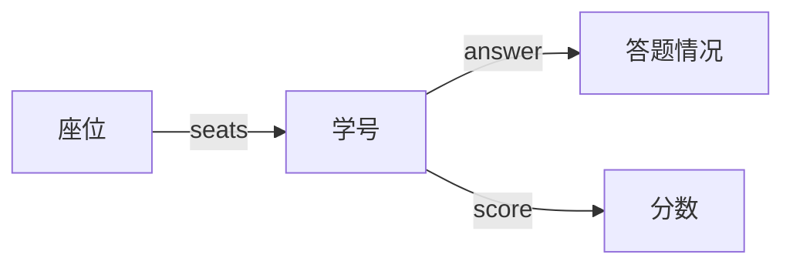
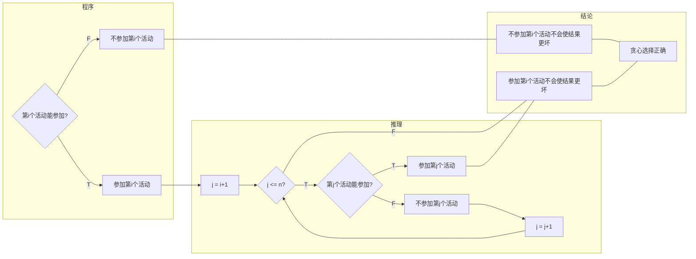

# Problems in cs101.openjudge.cn

*Updated 2025-10-09 18:21 GMT+8*  
 *Compiled by Hongfei Yan (2020 Fall)*  


> Logs:
>
> 2025/03/28: 题目从基础到高级的不同难度级别。按照目录分为三个难度等级：Easy（简单）、Medium（中等）、Tough（挑战）。

==**How to find the problems?**==
访问 http://cs101.openjudge.cn/, 登录后，点击“加入”按钮（ 表示加入"cs101"小组，只需要加入1次），然后点击 “练习”。 

有的题目是从“百练”小组 http://bailian.openjudge.cn/ 引入的，因此题目ID尽量保持末四位一致。如"装箱问题"的题目ID是01017，对应百练的1017题目。

==**What is OpenJudge? What kind of a site/resource is it?**==
OpenJudge is a project joining people interested in and taking part in programming contests. On one hand, OpenJudge is a social network dedicated to programming and programming contests. On the other hand, it is a platform where contests are held regularly, the participant's skills are reflected by their rating and the former contests can be used to prepare. 


所用的编程语言：主要选择Python语言；个别题目超时不能AC时，选择C++语言。用Python讲编程，有个特别大的好处。有的题目C++直接AC了，但是Python会超时，学生会琢磨如何优化，应用时间复杂度，更换算法等。对于理解计算机相关原理特别有帮助。问题求解的关键在于算法，而语言之间的可移植性、模块性和效率等方面的差异已经变得不那么重要了。


# Easy

#. title, algorithm, link


## 01003: Hangover

math , http://cs101.openjudge.cn/practice/01003

How far can you make a stack of cards overhang a table? If you have one card, you can create a maximum overhang of half a card length. (We're assuming that the cards must be perpendicular to the table.) With two cards you can make the top card overhang the bottom one by half a card length, and the bottom one overhang the table by a third of a card length, for a total maximum overhang of 1/2 `+` 1/3 `=` 5/6 card lengths. In general you can make *n* cards overhang by 1/2 `+` 1/3 `+` 1/4 `+` ... `+` 1/(*n* `+` 1) card lengths, where the top card overhangs the second by 1/2, the second overhangs tha third by 1/3, the third overhangs the fourth by 1/4, etc., and the bottom card overhangs the table by 1/(*n* `+` 1). This is illustrated in the figure below.


**输入**

The input consists of one or more test cases, followed by a line containing the number 0.00 that signals the end of the input. Each test case is a single line containing a positive floating-point number c whose value is at least 0.01 and at most 5.20; c will contain exactly three digits.

**输出**

For each test case, output the minimum number of cards necessary to achieve an overhang of at least c card lengths. Use the exact output format shown in the examples.

样例输入

```
1.00
3.71
0.04
5.19
0.00
```

样例输出

```
3 card(s)
61 card(s)
1 card(s)
273 card(s)
```

来源

Mid-Central USA 2001


浮点数与0比较需要 用 math.isclose(....)，而不能直接用 == 0.00判断。

在程序中，比较浮点数和0直接相等是不太可靠的。这是因为浮点数在计算机中以二进制表示，并且存在舍入误差。由于舍入误差，浮点数的精确表示可能会有微小的偏差。

当我们比较浮点数和0时，实际上是在比较它们的偏差是否小于某个误差范围。如果我们直接使用`==`运算符或类似的比较操作符进行比较，可能会由于舍入误差的存在而得到意想不到的结果。

为了解决这个问题，通常我们可以使用一个误差范围（通常称为“容差”或“epsilon”）来进行浮点数比较。例如，如果我们想要比较浮点数`x`是否接近0，可以使用以下方式进行比较：`abs(x) < epsilon`，其中`epsilon`是一个很小的正数，代表我们容忍的最大误差范围。

为了更准确地进行浮点数的比较，可以使用`math.isclose()`函数或自定义的比较函数，这些函数允许你指定一个容差值来比较浮点数的接近程度。这些函数会考虑到舍入误差，并提供更可靠的浮点数比较方式。因此，在重要的精确度要求下，建议使用这些比较方法来避免舍入误差带来的问题。

总之，浮点数比较时要小心舍入误差，最好使用误差范围进行比较，而不是直接使用等于或不等于操作符。

```python
import math

while True:
    n = float(input())
    if math.isclose(n, 0.00, rel_tol=1e-5) :
        break
    
    cnt = 0
    tot = 0
    while  True:
        cnt += 1
        tot += 1/(1+cnt)
        if tot>n:
            break
    
    print(cnt, "card(s)")
```


## E01218: THE DRUNK JAILER

math, implementation, http://cs101.openjudge.cn/practice/01218/

A certain prison contains a long hall of n cells, each right next to each other. Each cell has a prisoner in it, and each cell is locked.
One night, the jailer gets bored and decides to play a game. For round 1 of the game, he takes a drink of whiskey,and then runs down the hall unlocking each cell. For round 2, he takes a drink of whiskey, and then runs down the
hall locking every other cell (cells 2, 4, 6, ?). For round 3, he takes a drink of whiskey, and then runs down the hall. He visits every third cell (cells 3, 6, 9, ?). If the cell is locked, he unlocks it; if it is unlocked, he locks it. He
repeats this for n rounds, takes a final drink, and passes out.
Some number of prisoners, possibly zero, realizes that their cells are unlocked and the jailer is incapacitated. They immediately escape.
Given the number of cells, determine how many prisoners escape jail.

**输入**

The first line of input contains a single positive integer. This is the number of lines that follow. Each of the following lines contains a single integer between 5 and 100, inclusive, which is the number of cells n.

**输出**

For each line, you must print out the number of prisoners that escape when the prison has n cells.

样例输入

```
2
5
100
```

样例输出

```
2
10
```

来源

Greater New York 2002


题意是给定n个牢房时逃生的囚犯数量。

数学思维：关键在于理解每个开关（即每个牢房的锁）会被拨动的次数是其编号的因子个数。由于初始状态是所有牢房都是锁定的，每次拨动会改变锁的状态（锁定变为解锁，或解锁变为锁定）。因此，一个牢房最终是解锁的当且仅当其被拨动了奇数次，即其编号的因子个数为奇数。而只有完全平方数的因子个数是奇数，因为因子是成对出现的，只有完全平方数有一个独自的因子（如 4 的因子是 1, 2, 4，其中 2 是独自的）

因此，对于给定的 `n` 个牢房，逃生的囚犯数量就是 `n` 以内的完全平方数的个数，即 `int(n ** 0.5)`。

```python
for i in range(int(input())):
    print(int(int(input())**0.5))
```


计算机思维：模拟法。通过模拟开关过程来解决（虽然效率较低，但更直观）。

```python
for _ in range(int(input())):
    n = int(input())
    cells = [False] * (n + 1)  # False表示锁着，True表示开着

    for round in range(1, n + 1):
        for cell in range(round, n + 1, round):
            cells[cell] = not cells[cell]

    print(sum(cells[1:]))  # 计数开着的牢房
```


## 02159: Ancient Cipher

http://cs101.openjudge.cn/practice/02159/

Ancient Roman empire had a strong government system with various departments, including a secret service department. Important documents were sent between provinces and the capital in encrypted form to prevent eavesdropping. The most popular ciphers in those times were so called substitution cipher and permutation cipher.
Substitution cipher changes all occurrences of each letter to some other letter. Substitutes for all letters must be different. For some letters substitute letter may coincide with the original letter. For example, applying substitution cipher that changes all letters from 'A' to 'Y' to the next ones in the alphabet, and changes 'Z' to 'A', to the message "VICTORIOUS" one gets the message "WJDUPSJPVT".
Permutation cipher applies some permutation to the letters of the message. For example, applying the permutation <2, 1, 5, 4, 3, 7, 6, 10, 9, 8> to the message "VICTORIOUS" one gets the message "IVOTCIRSUO".
It was quickly noticed that being applied separately, both substitution cipher and permutation cipher were rather weak. But when being combined, they were strong enough for those times. Thus, the most important messages were first encrypted using substitution cipher, and then the result was encrypted using permutation cipher. Encrypting the message "VICTORIOUS" with the combination of the ciphers described above one gets the message "JWPUDJSTVP".
Archeologists have recently found the message engraved on a stone plate. At the first glance it seemed completely meaningless, so it was suggested that the message was encrypted with some substitution and permutation ciphers. They have conjectured the possible text of the original message that was encrypted, and now they want to check their conjecture. They need a computer program to do it, so you have to write one.

**输入**

Input contains two lines. The first line contains the message engraved on the plate. Before encrypting, all spaces and punctuation marks were removed, so the encrypted message contains only capital letters of the English alphabet. The second line contains the original message that is conjectured to be encrypted in the message on the first line. It also contains only capital letters of the English alphabet.
The lengths of both lines of the input are equal and do not exceed 100.

**输出**

Output "YES" if the message on the first line of the input file could be the result of encrypting the message on the second line, or "NO" in the other case.

样例输入

```
JWPUDJSTVP
VICTORIOUS
```

样例输出

```
YES
```

来源

Northeastern Europe 2004


https://blog.csdn.net/code12hour/article/details/81225551

密码加密，密码都是大写英文字母，有两种加密方式，替换方式和排列方式。替换就是把每个字母用别的字母替换，而且不能重复。排列方式就是把字母重新排列顺序。这两种方式混合使用。现在给你A字符串和B字符串，A是密文，问B是否是原文。

排列的解决方法比较简单，就把两个字符串都按字典序排序，看看是否相同即可。
替换的解决方式，观察每个字母的出现次数，然后就可以得到。
综合一下就是，统计每个字母的出现次数，然后排序，观察是否相同。

```python
def main():
    import sys
    input = sys.stdin.read
    data = input().strip().split()
    
    str1 = data[0]
    str2 = data[1]
    
    cnt1 = [0] * 26
    cnt2 = [0] * 26
    
    for char in str1:
        cnt1[ord(char) - ord('A')] += 1
    
    for char in str2:
        cnt2[ord(char) - ord('A')] += 1
    
    cnt1.sort()
    cnt2.sort()
    
    if cnt1 == cnt2:
        print("YES")
    else:
        print("NO")

if __name__ == "__main__":
    main()
```


## 02676: 整数的个数

http://cs101.openjudge.cn/practice/02676/

给定 k（1< k < 100）个正整数，其中每个数都是大于等于1，小于等于10的数。写程序计算给定的k个正整数中，1，5和10出现的次数。

**输入**

输入有两行：第一行包含一个正整数k，第二行包含k个正整数，每两个正整数用一个空格分开。

**输出**

输出有三行，第一行为1出现的次数，第二行为5出现的次数，第三行为10出现的次数。

样例输入

```
5
1 5 8 10 5 
```

样例输出

```
1
2
1
```

来源：计算概论05－模拟考试1


计算给定的k个正整数中1、5和10出现的次数。

```python
k = int(input())
numbers = list(map(int, input().split()))

# 初始化计数器
count_1 = 0
count_5 = 0
count_10 = 0

# 遍历列表，统计1、5和10出现的次数
for num in numbers:
    if num == 1:
        count_1 += 1
    elif num == 5:
        count_5 += 1
    elif num == 10:
        count_10 += 1

print(count_1)
print(count_5)
print(count_10)
```


```python
# 读取第一行输入，获取正整数 k
k = int(input())
# 读取第二行输入，获取 k 个正整数，并将其存储在列表中
numbers = list(map(int, input().split()))

# 统计 1 出现的次数
count_1 = numbers.count(1)
# 统计 5 出现的次数
count_5 = numbers.count(5)
# 统计 10 出现的次数
count_10 = numbers.count(10)

# 输出 1 出现的次数
print(count_1)
# 输出 5 出现的次数
print(count_5)
# 输出 10 出现的次数
print(count_10)
```


## 02689: 大小写字母互换

http://cs101.openjudge.cn/practice/02689

把一个字符串中所有出现的大写字母都替换成小写字母，同时把小写字母替换成大写字母。

**输入**

输入一行：待互换的字符串。

**输出**

输出一行：完成互换的字符串（字符串长度小于80）。

样例输入

```
If so, you already have a Google Account. You can sign in on the right. 
```

样例输出

```
iF SO, YOU ALREADY HAVE A gOOGLE aCCOUNT. yOU CAN SIGN IN ON THE RIGHT. 
```

来源：计算概论05


```python
s = input()
gap = ord('a') - ord('A')

ans = []
for i in s:
    if 'A' <= i <= 'Z':
        ans += chr(ord(i) + gap)
    elif 'a' <= i <= 'z':
        ans += chr(ord(i) - gap)
    else:
        ans += i

print(''.join(ans))
```


## 02701: 与7无关的数

math, http://cs101.openjudge.cn/practice/02701

一个正整数,如果它能被7整除，或者它的十进制表示法中某一位上的数字为7，则称其为与7相关的数。现求所有小于等于 n (n < 100) 的与7无关的正整数的平方和。

**输入**

输入为一行,正整数 n (n < 100)。

**输出**

输出一行，包含一个整数，即小于等于n的所有与7无关的正整数的平方和。

样例输入

```
21
```

样例输出

```
2336
```

来源：计算概论05


处理所有小于100的正整数输入。

```python
n = int(input())

# 初始化平方和变量
square_sum = 0

# 遍历所有小于等于n的正整数
for num in range(1, n + 1):
    # 检查是否与7相关
    if num % 7 != 0 and '7' not in str(num):  # 不被7整除且十进制表示中不含数字7
        square_sum += num ** 2  # 累加平方值

print(square_sum)
```


```python
def check(num):
    if num%7 == 0:
        return True
    
    for i in str(num):
        if i=='7':
            return True
    
    return False

n = int(input())
a = []
for i in range(n+1):
    if check(i) == False:
        a.append(i)

print(sum(i**2 for i in a))
```


## 02707: 求一元二次方程的根

math, http://cs101.openjudge.cn/practice/02707

利用公式x1 = (-b + sqrt(b\*b-4\*a\*c))/(2*a), x2 = (-b - sqrt(b\*b-4\*a\*c))/(2\*a)求一元二次方程ax^2^ + bx + c =0的根，其中a不等于0。

**输入**

第一行是待解方程的数目n。
其余n行每行含三个浮点数a, b, c（它们之间用空格隔开），分别表示方程ax^2…… + bx + c =0的系数。

**输出**

输出共有n行，每行是一个方程的根：
若是两个实根，则输出：x1=...;x2 = ...
若两个实根相等，则输出：x1=x2=...
若是两个虚根，则输出：x1=实部+虚部i; x2=实部-虚部i

所有实数部分要求精确到小数点后5位，数字、符号之间没有空格。
x1和x2的顺序：x1的实部>Re的实部||(x1的实部==x2的实部&&x1的虚部>=x2的虚部)

样例输入

```
3
1.0 3.0 1.0
2.0 -4.0 2.0
1.0 2.0 8.0
```

样例输出

```
x1=-0.38197;x2=-2.61803
x1=x2=1.00000
x1=-1.00000+2.64575i;x2=-1.00000-2.64575i
```

提示

1、需要严格按照题目描述的顺序求解x1、x2。
2、方程的根以及其它中间变量用double类型变量表示。
3、函数sqrt()在头文件math.h中。
4、要输出浮点数、双精度数小数点后5位数字，可以用下面这种形式：

printf("%.5f", num);

注意，在使用Java做此题时，可能会出现x1或x2等于-0的情形，此时，需要把负号去掉

来源

2005~2006医学部计算概论期末考试


OJ平台，浮点数计算有问题。例如：02707:求一元二次方程的根，http://cs101.openjudge.cn/practice/02707

如果输入数据是 8 7.65 9，则 $re = (-b) / (2 * a)$ 计算，得到 re = -0.478125。保留5位小数 print(f'{re:.5f}')，得到 -0.47813

但是如果 $x1 = (b*-1+(b*b-4*a*c)**0.5)/(2*a)$ 计算，得到 -0.47812499999999997+0.9467821736677344j。

实部保留5位小数 print(f'{x1.real:.5f}')，得到 -0.47812

这类题目不建议做，因为平台有问题。


```python
import math
n = int(input())
for i in range(n):
    a, b, c = map(float, input().split())
    if b == 0:
        b = -b
    delta = b ** 2 - 4 * a * c
    if delta > 0:
        x1 = (-b + math.sqrt(delta)) / (2 * a)
        x2 = (-b - math.sqrt(delta)) / (2 * a)
        print(f"x1={x1:.5f};x2={x2:.5f}")
    elif delta == 0:
        t = (-b) / (2 * a)
        print(f"x1=x2={t:.5f}")
    else:
        d = math.sqrt(-delta) / (2 * a)
        re = (-b) / (2 * a)
        print(f"x1={re:.5f}+{d:.5f}i;x2={re:.5f}-{d:.5f}i")
```


```python
import math
n = int(input())
for i in range(n):
    a, b, c = map(float, input().split())
    if b == 0:
        b = -b
    delta = b ** 2 - 4 * a * c
    if delta > 0:
        x1 = (-b + math.sqrt(delta)) / (2 * a)
        x2 = (-b - math.sqrt(delta)) / (2 * a)
        x1 = format(x1, ".5f")
        x2 = format(x2, ".5f")
        print(f"x1={x1};x2={x2}")
    elif delta == 0:
        t = (-b) / (2 * a)
        x1 = format(t, ".5f")
        print(f"x1=x2={x1}")
    else:
        d = format(math.sqrt(-delta) / (2 * a), ".5f")
        re = format((-b) / (2 * a), ".5f")
        print(f"x1={re}+{d}i;x2={re}-{d}i")
```


## 02712: 细菌繁殖 

math, http://cs101.openjudge.cn/practice/02712

一种细菌的繁殖速度是每天成倍增长。例如：第一天有10个，第二天就变成20个，第三天变成40个，第四天变成80个，……。现在给出第一天的日期和细菌数目，要你写程序求出到某一天的时候，细菌的数目。

**输入**

第一行有一个整数n，表示测试数据的数目。其后n行每行有5个整数，整数之间用一个空格隔开。第一个数表示第一天的月份，第二个数表示第一天的日期，第三个数表示第一天细菌的数目，第四个数表示要求的那一天的月份，第五个数表示要求的那一天的日期。已知第一天和要求的一天在同一年并且该年不是闰年，要求的一天一定在第一天之后。数据保证要求的一天的细菌数目在长整数（long）范围内。

**输出**

对于每一组测试数据，输出一行，该行包含一个整数，为要求的一天的细菌数。

样例输入

```
2
1 1 1 1 2
2 28 10 3 2
```

样例输出

```
2
40
```

来源

2005~2006医学部计算概论期末考试


```python
# 定义每个月的天数（非闰年）
days_in_month = [31, 28, 31, 30, 31, 30, 31, 31, 30, 31, 30, 31]


# 计算某一天是这一年的第几天
def day_of_year(month, day):
    return sum(days_in_month[:month - 1]) + day


# 主程序
n = int(input())
results = []

for _ in range(n):
    # 输入一组测试数据
    month1, day1, count1, month2, day2 = map(int, input().split())

    # 计算第一天和要求的那一天分别是这一年的第几天
    day_of_year1 = day_of_year(month1, day1)
    day_of_year2 = day_of_year(month2, day2)

    # 计算相差的天数
    days_diff = day_of_year2 - day_of_year1

    # 计算细菌数目
    bacteria_count = count1 * (2 ** days_diff)

    # 存储结果
    results.append(bacteria_count)

# 输出所有结果
for result in results:
    print(result)
```


```python
# 21 信管 黄靖扬
daylis=[31,28,31,30,31,30,31,31,30,31,30,31]

n=int(input())
for i in range(n):
    s_mon,s_day,s_num,e_mon,e_day=map(int,input().split())
    if e_mon==s_mon:
        ttlday=e_day-s_day
    else:
        bf_s_day=sum(daylis[:s_mon-1])+s_day
        bf_e_day=sum(daylis[:e_mon-1])+e_day

        ttlday=bf_e_day-bf_s_day
    
    print(2**ttlday*s_num)
```


## E02724: 生日相同

implemtation, http://cs101.openjudge.cn/pctbook/E02724/

在一个有180人的大班级中，存在两个人生日相同的概率非常大，现给出每个学生的学号，出生月日。试找出所有生日相同的学生。

**输入**

第一行为整数n，表示有n个学生，n<100。
此后每行包含一个字符串和两个整数，分别表示学生的学号（字符串长度小于10）和出生月(1<=m<=12)日(1<=d<=31)。
学号、月、日之间用一个空格分隔。

**输出**

对每组生日相同的学生，输出一行，
其中前两个数字表示月和日，后面跟着所有在当天出生的学生的学号，数字、学号之间都用一个空格分隔。
对所有的输出，要求按日期从前到后的顺序输出。
对生日相同的学号，按输入的顺序输出。

样例输入

```
5
00508192 3 2
00508153 4 5
00508172 3 2
00508023 4 5
00509122 4 5
```

样例输出

```
3 2 00508192 00508172
4 5 00508153 00508023 00509122
```

来源：计算概论化学学院期末考试


根据学生的生日（月份和日期）找到所有生日相同的学生。

```python
n = int(input())

# 创建一个字典存储生日到学号的映射
birthday_to_ids = {}

# 读取每个学生的数据并填充字典
for _ in range(n):
    student_id, month, day = input().split()
    month = int(month)
    day = int(day)
    birthday = (month, day)

    if birthday not in birthday_to_ids:
        birthday_to_ids[birthday] = []
    birthday_to_ids[birthday].append(student_id)

# 输出生日相同的学生信息
output_lines = []
for birthday in sorted(birthday_to_ids.keys()):
    students_with_same_birthday = birthday_to_ids[birthday]
    if len(students_with_same_birthday) > 1:  # 只关注有多个学生同一天生日的情况
        output_line = f"{birthday[0]} {birthday[1]} " + " ".join(students_with_same_birthday)
        output_lines.append(output_line)

for line in output_lines:
    print(line)
```


## E02733: 判断闰年

math, http://cs101.openjudge.cn/practice/02733

判断某年是否是闰年。

**输入**

输入只有一行，包含一个整数a(0 < a < 3000)

**输出**

一行，如果公元a年是闰年输出Y，否则输出N

样例输入

```
2006
```

样例输出

```
N
```

提示

公历纪年法中，能被4整除的大多是闰年，但能被100整除而不能被400整除的年份不是闰年， 能被3200整除的也不是闰年，如1900年是平年，2000年是闰年，3200年不是闰年。


```python
# 2022cs101, 高靖，城市与环境学院
#四年一闰，百年不润，四百年再润

a=int(input())

if a%4==0:
    if a%100==0:
        if a%400==0:
            print("Y")
        else:
            print("N")
    else:
        print("Y")
else:
    print("N")
```


遵循题面的约束条件实现。

```python
a = int(input())
if (a % 3200 == 0) or ((a % 100 == 0) and (a % 400 != 0)):
    print('N')
elif a % 4 == 0:
    print('Y')
else:
    print('N')
```


C++ 实现

```c++
#include <cstdlib>
#include <cstdio>
using namespace std;
int main() {
        int a;
        scanf("%d", &a);

        if ( a%4==0 ){
                if ( a%100==0 && a%400!=0 )
                        printf("N");
                else
                        printf("Y");
        }else
                printf("N");
}
```


## E02734: 十进制到八进制

stack, http://cs101.openjudge.cn/practice/02734/

把一个十进制正整数转化成八进制。

**输入**

一行，仅含一个十进制表示的整数a(0 < a < 65536)。

**输出**

一行，a的八进制表示。

样例输入

`9`

样例输出

`11`


要将一个十进制正整数转换为八进制，可以通过“除基取余法”实现。通过不断除以8并将余数压入栈中的方式来实现。然后，将栈中的元素依次出栈，构成八进制数的各个位。

```python
decimal = int(input())  # 读取十进制数

# 创建一个空栈
stack = []

# 特殊情况：如果输入的数为0，直接输出0
if decimal == 0:
    print(0)
else:
    # 不断除以8，并将余数压入栈中
    while decimal > 0:
        remainder = decimal % 8
        stack.append(remainder)
        decimal = decimal // 8

    # 依次出栈，构成八进制数的各个位
    octal = ""
    while stack:
        octal += str(stack.pop())

    print(octal)
```


## E02750: 鸡兔同笼

math, http://cs101.openjudge.cn/practice/02750

一个笼子里面关了鸡和兔子（鸡有2只脚，兔子有4只脚，没有例外）。已经知道了笼子里面脚的总数a，问笼子里面至少有多少只动物，至多有多少只动物。

**输入**

一行，一个正整数a (a < 32768)。

**输出**

一行，包含两个正整数，第一个是最少的动物数，第二个是最多的动物数，两个正整数用一个空格分开。
如果没有满足要求的答案，则输出两个0，中间用一个空格分开。

样例输入

```
20
```

样例输出

```
5 10
```


```python
num_feet = int(input())
if (num_feet%2 != 0) :
  print("{} {}".format(0,0))
elif (num_feet%4 ==0) :
  print("{} {}".format( int(num_feet/4), int(num_feet/2)) )
else :
  print("{} {}".format( num_feet//4 + 1, int(num_feet/2)) )
```

**计算思维包括数学思维，计算机思维。这就是清晰的数学思维。**


1900017722，吉祥瑞，元培学院

解题思路：设有$x$只鸡，$y$只兔子，则$2x+4y=a, x \in \mathbb{N},y \in \mathbb{N}$总数$z=x+y$。由高中学过的线性规划知识，$x=\frac{a}{2}$时$z_{max}=\frac{a}{2}$，若为4的倍数，则$x=0$时$z_{min}\frac{a}{4}$；若不是4的倍数但是2的倍数，则$x=1$时$z_{min}=\frac{a+2}{4}$。

```python
a = int(input())
if a%4 == 0:
    print(int(a/4), int(a/2))
elif a%2 == 0:
    print(int((a+2)/4), int(a/2))
else:
    print(0, 0)
```


## 02753: 菲波那契数列

math,recursion, dp, http://cs101.openjudge.cn/practice/02753

菲波那契数列是指这样的数列: 数列的第一个和第二个数都为1，接下来每个数都等于前面2个数之和。
给出一个正整数a，要求菲波那契数列中第a个数是多少。
**输入**
第1行是测试数据的组数n，后面跟着n行输入。每组测试数据占1行，包括一个正整数 $a \ (1 \le a \le 20)$
**输出**
输出有n行，每行输出对应一个输入。输出应是一个正整数，为菲波那契数列中第a个数的大小
样例输入

```
4
5
2
19
1
```

样例输出

```
5
1
4181
1
```


菲波那契（Fibonacci）数列的定义为 $F_0=0,F_1=1,F_n=F_{n-1} + F_{n-2} \ (n\ge 2)$

```python
def f(n):
    if n <= 2:
        return 1
    else:
        return f(n-1)+f(n-2)


n = int(input())
ans = []
for _ in range(n):
    num = int(input())
    ans.append(f(num))

print('\n'.join(map(str, ans)))
```


事实上，这个递归会涉及很多重复的计算。如图A所示，当n=5 时，可以得到 F(5)= F(4) + F(3)，接下来在计算 F(4)时又会有 F(4)= F(3) + F(2)。这时候如果不采取措施，F(3)将会被计算两次。可以推知，如果 n 很大，重复计算的次数将难以想象。事实上，由于没有及时保存中间计算的结果，实际复杂度会高达 $O(2^n)$，即每次都会计算 F(n-1)和 F(n-2)这两个分支，基本不能承受 n 较大的情况。

为了避免重复计算，可以开一个一维数组 dp，用以保存已经计算过的结果，其中 dp[n]记录 F(n)的结果，并用 dp[n]=-1 表示 F(n)当前还没有被计算过。然后就可以在递归当中判断dp[n]是否是-1：如果不是-1，说明已经计算过F(n),直接返回 dp[n]就是结果，否则，按照递归式进行递归。


​					图A 斐波那契数列递归图						图B 斐波那契数列记忆化搜索示意图

这样就把已经计算过的内容记录了下来，于是当下次再碰到需要计算相同的内容时，就能直接使用上次计算的结果，这可以省去大半无效计算，而这也是记忆化搜索这个名字的由来。如图B所示，通过记忆化搜索，把复杂度从 $O(2^n)$降到了 $O(n)$，也就是说，用一个 $O(n)$空间的力量就让复杂度从指数级别降低到了线性级别。

```python
def f(n):
    if n <= 2:
        return 1
    
    if dp[n] != -1:
        return dp[n]
    else:
        dp[n] = f(n-1)+f(n-2)
        return dp[n]


dp = [-1]*21
n = int(input())
ans = []
for _ in range(n):
    num = int(input())
    ans.append(f(num))

print('\n'.join(map(str, ans)))
```

通过上面的例子可以引申出一个概念：如果一个问题可以被分解为若干个子问题，且这些子问题会重复出现，那么就称这个问题拥有重叠子问题 (Overlapping Subproblems)。动态规划通过记录重叠子问题的解，来使下次碰到相同的子问题时直接使用之前记录的结果以此避免大量重复计算。因此，一个问题必须拥有重叠子问题，才能使用动态规划去解决。


```python
'''
lru_cache在OJ可以用。Python Functools – lru_cache(), 
https://www.geeksforgeeks.org/python-functools-lru_cache/

The LRU caching scheme is to remove the least recently used frame when the 
cache is full and a new page is referenced which is not there in the cache.  
https://www.geeksforgeeks.org/python-lru-cache/
'''
from functools import lru_cache 

@lru_cache(maxsize = 128) 
def f(n):
    if n <= 2:
        return 1
    else:
        return f(n-1)+f(n-2)


n = int(input())
list_1 = []
for i in range(n):
    num = int(input())
    list_1.append(f(num))
for i in list_1:
    print(i)
```


## 02757: 最长上升子序列

dp, binary search, http://cs101.openjudge.cn/practice/02757

一个数的序列*b~i~*，当*b~1~* < *b~2~* < ... < *b~S~*的时候，我们称这个序列是上升的。对于给定的一个序列(*a~1~*, *a~2~*, ..., *a~N~*)，我们可以得到一些上升的子序列(*a~i1~*, *a~i2~*, ..., *a~iK~*)，这里1  ≤   *i~1~* < *i~2~* < ... < *i~K~*  ≤   N。比如，对于序列(1, 7, 3, 5, 9, 4, 8)，有它的一些上升子序列，如(1, 7), (3, 4, 8)等等。这些子序列中最长的长度是4，比如子序列(1, 3, 5, 8).

你的任务，就是对于给定的序列，求出最长上升子序列的长度。

**输入**

输入的第一行是序列的长度N (1  ≤   N  ≤   1000)。第二行给出序列中的N个整数，这些整数的取值范围都在0到10000。

**输出**

最长上升子序列的长度。

样例输入

```
7
1 7 3 5 9 4 8
```

样例输出

```
4
```

来源：翻译自 Northeastern Europe 2002, Far-Eastern Subregion 的比赛试题


2020fall-cs101，王君宇。思路：和最大上升子序列和类似，都是需要双重循环的 dp，外循环确定每个元素 dp初始值为 1，内循环遍历小数进行转移方程。

```python
input()
b = [int(x) for x in input().split()]

n = len(b)
dp = [1]*n

for i in range(n):
    for j in range(i):
        if b[j]<b[i]:
            dp[i] = max(dp[j]+1, dp[i])
    
print(max(dp))
```


2020fall-cs101，李博海

```python
import bisect
n = int(input())
l = [int(x) for x in input().split()]
dp = [1e9]*n
for i in l:
    dp[bisect.bisect_left(dp, i)] = i
print(bisect.bisect_left(dp, 1e8))
```


2020fall-cs101，章斯岚。这里用i+1是为了防止a[0:i]可能是空列表导致runtime error。

与 OJ3532最大上升子序列和，一样，i改为1即可。

```python
dp = [0]*(10000+2)
input()
for i in map(int, input().split()):
    dp[i+1] = max(dp[0:i+1]) + 1
print(max(dp))
```


## 02767:简单密码

http://cs101.openjudge.cn/practice/02767/

Julius Caesar曾经使用过一种很简单的密码。对于明文中的每个字符，将它用它字母表中后5位对应的字符来代替，这样就得到了密文。比如字符A用F来代替。如下是密文和明文中字符的对应关系。

密文
A B C D E F G H I J K L M N O P Q R S T U V W X Y Z

明文
V W X Y Z A B C D E F G H I J K L M N O P Q R S T U 

你的任务是对给定的密文进行解密得到明文。

你需要注意的是，密文中出现的字母都是大写字母。密文中也包括非字母的字符，对这些字符不用进行解码。

**输入**

一行，给出密文，密文不为空，而且其中的字符数不超过200。

**输出**

输出一行，即密文对应的明文。

样例输入

```
NS BFW, JAJSYX TK NRUTWYFSHJ FWJ YMJ WJXZQY TK YWNANFQ HFZXJX
```

样例输出

```
IN WAR, EVENTS OF IMPORTANCE ARE THE RESULT OF TRIVIAL CAUSES
```

来源

翻译自 South Central USA 2002 的试题


```python
def decrypt_caesar_cipher(ciphertext):
    # 定义字母表
    alphabet = "ABCDEFGHIJKLMNOPQRSTUVWXYZ"
    
    # 创建一个映射字典：密文字母 -> 明文字母
    decrypt_map = {}
    shift = 5  # 密文向后移动5位
    for i in range(len(alphabet)):
        decrypt_map[alphabet[i]] = alphabet[(i - shift) % len(alphabet)]
    
    # 解密过程
    plaintext = []
    for char in ciphertext:
        if char in decrypt_map:  # 如果是大写字母，进行解密
            plaintext.append(decrypt_map[char])
        else:  # 非字母字符保持不变
            plaintext.append(char)
    
    return ''.join(plaintext)

# 主函数
if __name__ == "__main__":
    # 读取输入
    ciphertext = input().strip()
    
    # 解密并输出结果
    print(decrypt_caesar_cipher(ciphertext))
```


## 02792: 集合加法

http://cs101.openjudge.cn/practice/02792/

给出2个正整数集合A = {pi | 1 <= i <= a}，B = {qj | 1 <= j <= b}和一个正整数s。问题是：使得pi + qj= s的不同的(i, j)对有多少个。

**输入**

第1行是测试数据的组数n，后面跟着n组测试数据。

每组测试数据占5行，第1行是和s (1 <= s <= 10000)，第2行是一个正整数a (1 <= a <= 10000)，表示A中元素的数目。第3行是a个正整数，每个正整数不超过10000，表示A中的元素。第4行是一个正整数b (1 <= b <= 10000)，表示B中元素的数目。第5行是b个正整数，每个正整数不超过10000，表示B中的元素。

注意：这里的集合和数学书上定义的集合有一点点区别——集合内可能包含相等的正整数。

**输出**

n行，每行输出对应一个输入。输出应是一个非负整数。

样例输入

```
2
99
2
49 49
2
50 50
11
9
1 2 3 4 5 6 7 8 9
10
10 9 8 7 6 5 4 3 2 1
```

样例输出

```
4
9
```


如果知道 from collections import Counter。这个题目也快送分了。

```python
from collections import Counter

def calculate_pairs(arr1, arr2, target_sum):
    counter1 = Counter(arr1)
    counter2 = Counter(arr2)

    ans = 0
    for item in counter1:
        if target_sum - item in counter2:
            ans += counter1[item] * counter2[target_sum - item]

    return ans


for _ in range(int(input())):
    s = int(input())
    input()
    l1 = list(map(int, input().split()))
    input()
    l2 = list(map(int, input().split()))

    ans = calculate_pairs(l1, l2, s)
    print(ans)
```


## 02804: 词典

http://cs101.openjudge.cn/practice/02804/

你旅游到了一个国外的城市。那里的人们说的外国语言你不能理解。不过幸运的是，你有一本词典可以帮助你。

输入

首先输入一个词典，词典中包含不超过100000个词条，每个词条占据一行。每一个词条包括一个英文单词和一个外语单词，两个单词之间用一个空格隔开。而且在词典中不会有某个外语单词出现超过两次。词典之后是一个空行，然后给出一个由外语单词组成的文档，文档不超过100000行，而且每行只包括一个外语单词。输入中出现单词只包括小写字母，而且长度不会超过10。

输出

在输出中，你需要把输入文档翻译成英文，每行输出一个英文单词。如果某个外语单词不在词典中，就把这个单词翻译成“eh”。

样例输入

```
dog ogday
cat atcay
pig igpay
froot ootfray
loops oopslay

atcay
ittenkay
oopslay
```

样例输出

```
cat
eh
loops
```


```python
# 初始化一个空字典用于存储词典信息
dictionary = {}

# 读取词典部分
while True:
    line = input().strip()
    if not line:
        break
    # 按空格分割每行，分别得到英文单词和外语单词
    english, foreign = line.split()
    # 将外语单词作为键，英文单词作为值存入字典
    dictionary[foreign] = english

# 读取需要翻译的文档部分
while True:
    try:
        foreign_word = input().strip()
        if not foreign_word:
            break
        # 查找该外语单词是否在词典中
        if foreign_word in dictionary:
            print(dictionary[foreign_word])
        else:
            print("eh")
    except EOFError:
        break
```


## 02808: 校门外的树

implementation, http://cs101.openjudge.cn/practice/02808

某校大门外长度为L的马路上有一排树，每两棵相邻的树之间的间隔都是1米。我们可以把马路看成一个数轴，马路的一端在数轴0的位置，另一端在L的位置；数轴上的每个整数点，即0，1，2，……，L，都种有一棵树。
马路上有一些区域要用来建地铁，这些区域用它们在数轴上的起始点和终止点表示。已知任一区域的起始点和终止点的坐标都是整数，区域之间可能有重合的部分。现在要把这些区域中的树（包括区域端点处的两棵树）移走。你的任务是计算将这些树都移走后，马路上还有多少棵树。

**输入**

输入的第一行有两个整数L（1 <= L <= 10000）和 M（1 <= M <= 100），L代表马路的长度，M代表区域的数目，L和M之间用一个空格隔开。接下来的M行每行包含两个不同的整数，用一个空格隔开，表示一个区域的起始点和终止点的坐标。

**输出**

输出包括一行，这一行只包含一个整数，表示马路上剩余的树的数目。

样例输入

```
500 3
150 300
100 200
470 471
```

样例输出

```
298
```

来源：noip2005普及组


```python
L, m = map(int, input().split())

dp = [1]*(L+1)

for i in range(m):
    s, e = map(int, input().split())
    for j in range(s, e+1):
        dp[j] = 0

print(dp.count(1))
```


思路：运用集合的交集，一开始还在用for循环遍历然后加入元素进入集合里，后来咨询AI的时候学会了set与range函数的关系，二者可以直接一起使用来获得集合。

```python
from functools import reduce  
l,m=map(int,input().split())  
remove_list=[]  
for i in range(m):  
    j,k=map(int,input().split())  
    each_set=set()  
    for x in range(j,k+1):  
        each_set.add(x)  
    remove_list.append(each_set)  
result = reduce(lambda x, y: x | y, remove_list)  
print(l+1-len(result))
```


## 02810: 完美立方

bruteforce, http://cs101.openjudge.cn/practice/02810

形如$a^3= b^3 + c^3 + d^3$的等式被称为完美立方等式。例如$12^3= 6^3 + 8^3 + 10^3$ 。编写一个程序，对任给的正整数N (N ≤ 100)，寻找所有的四元组 (a, b, c, d)，使得 $a^3 = b^3 + c^3 + d^3$，其中 a,b,c,d 大于 1, 小于等于N，且 b ≤ c ≤ d。

**输入**

一个正整数N (N≤100)。

**输出**

每行输出一个完美立方。输出格式为：
Cube = a, Triple = (b,c,d)
其中a,b,c,d所在位置分别用实际求出四元组值代入。

请按照a的值，从小到大依次输出。当两个完美立方等式中a的值相同，则b值小的优先输出、仍相同则c值小的优先输出、再相同则d值小的先输出。

样例输入

```
24
```

样例输出

```
Cube = 6, Triple = (3,4,5)
Cube = 12, Triple = (6,8,10)
Cube = 18, Triple = (2,12,16)
Cube = 18, Triple = (9,12,15)
Cube = 19, Triple = (3,10,18)
Cube = 20, Triple = (7,14,17)
Cube = 24, Triple = (12,16,20)
```


只对b,c,d循环，用字典。

```python
# AC时间: 65ms
n = int(input())
cube = {i**3: i for i in range(2, n+1)}
reversed_cube = {v: k for k, v in cube.items()}
ans = []
for b in range(2, n):
    for c in range(b, n):
        for d in range(c, n):
            if (a := reversed_cube[b]+reversed_cube[c]+reversed_cube[d]) in cube:
                ans.append((cube[a], b, c, d))
ans.sort()
for s in ans:
    print(f"Cube = {s[0]}, Triple = ({s[1]},{s[2]},{s[3]})")
```


```python
import math		# AC时间: 202ms

n = int(input())
# 计算立方值并存储在列表中以避免重复计算
cubes = [i ** 3 for i in range(n + 1)]
ans = []
for b in range(2, n):
    for c in range(b, n):
        for d in range(c, n):
            if (a := cubes[b] + cubes[c] + cubes[d]) in cubes:
                ans.append((round(math.pow(a, 1 / 3)), b, c, d))
ans.sort()
for a, b, c, d in ans:
    print(f"Cube = {a}, Triple = ({b},{c},{d})")

```


当我们将 functools.lru_cache应用到函数上时，每次调用函数，它都会检查其参数是否已经在缓存中如果在缓存中，它将返回缓存的结果，而不需要重新计算。如果没有在缓存中，那么函数将被调用并且结果将被添加到缓存中。当缓存满了，最少使用的条目将被抛弃。

```python
# AC时间: 1352ms
from functools import lru_cache

@lru_cache(maxsize = 128)
def cube(i):
    return i**3

def solv():
    N = int(input())
    ans = []
    for a in range(2,N+1):
        for b in range(2,a):
            for c in range(b,a):
                for d in range(c,a):
                    #if a ** 3 == b ** 3 + c ** 3 + d ** 3:
                    if cube(a) == cube(b) + cube(c) + cube(d):
                        #print('Cube = %d, Triple = (%d,%d,%d)' %(a,b,c,d))
                        ans.append((a,b,c,d))
    
    return ans

for a,b,c,d in solv():
    print(f"Cube = {a}, Triple = ({b},{c},{d})")
```


```python
# AC时间:875ms
n = int(input())
cube = [i**3 for i in range(n+1)]
for a in range(3,n+1):
    for b in range(2,a):
        for c in range(b,a):
            for d in range(c,a):
                if cube[a]==cube[b]+cube[c]+cube[d]:
                    print(f"Cube = {a}, Triple = ({b},{c},{d})")
```


## 02883: Checking order

http://cs101.openjudge.cn/practice/02883/

输入长度为5的数字串，检查是否是按从小到大的顺序排列，如果是，输出Yes；否则，输出No，并输出从小到大排序后的结果。

**输入**

长度为5的一串数字；

**输出**

判断结果及排序后的结果。

样例输入

```
1 3 5 7 9
5 3 44 7 3
1 1 2 2 3
```

样例输出

```
Yes
No 3 3 5 7 44
Yes
```


```python
while True:
    try:
        # 读取输入的长度为 5 的数字串
        nums = list(map(int, input().split()))
        # 复制一份原始列表用于排序
        sorted_nums = sorted(nums)

        if nums == sorted_nums:
            print("Yes")
        else:
            print("No", " ".join(map(str, sorted_nums)))
    except EOFError:
        break
```


## E02899: 矩阵交换行

http://cs101.openjudge.cn/practice/02899/

编写一个函数，输入参数是`5*5`的二维数组，和n，m两个行下标。功能：判断n，m是否在数组范围内，如果不在，则返回0；如果在范围内，则将n行和m行交换，并返回1。
在main函数中， 生成一个`5*5`的矩阵，输入矩阵数据，并输入n，m的值。调用前面的函数。如果返回值为0，输出error。如果返回值为1，输出交换n，m后的新矩阵。

**输入**

5*5矩阵的数据，以及n和m的值。

**输出**

如果不可交换，则输出error；
如果可交换，则输出新矩阵

样例输入

```
1 2 2 1 2
5 6 7 8 3
9 3 0 5 3
7 2 1 4 6
3 0 8 2 4
0 4
```

样例输出

```
3 0 8 2 4
5 6 7 8 3
9 3 0 5 3
7 2 1 4 6
1 2 2 1 2
```

提示

不需要用while循环来反复读取文件中的测试集。
输出error格式如下：
cout<< "error" << endl;
输出矩阵格式如下：
cout<< setw(4)<< num;
输出矩阵一行后要输出cout<< endl;


```python
def swap_rows(matrix, n, m):
    # 检查 n 和 m 是否在矩阵的有效索引范围内
    if n < 0 or n >= 5 or m < 0 or m >= 5:
        return 0
    # 交换矩阵的第 n 行和第 m 行
    matrix[n], matrix[m] = matrix[m], matrix[n]
    return 1


def main():
    matrix = []
    # 读取 5 行输入，每行输入代表矩阵的一行
    for _ in range(5):
        # 将输入按空格分割成多个元素，并转换为整数列表
        row = list(map(int, input().split()))
        matrix.append(row)
    # 读取 n 和 m 的值
    n, m = map(int, input().split())
    # 调用 swap_rows 函数进行行交换操作
    result = swap_rows(matrix, n, m)
    if result == 0:
        print("error")
    else:
        # 遍历矩阵的每一行
        for row in matrix:
            # 格式化输出每行元素，每个元素宽度为 4
            formatted_row = [f"{num:4d}" for num in row]
            # 将格式化后的元素用空字符串连接起来并输出
            print("".join(formatted_row))


if __name__ == "__main__":
    main()
```


## E02910: 提取数字

http://cs101.openjudge.cn/practice/02910

输入一个字符串，长度不超过30，内有数字字符和非数字字符，请找出字符串中所有由连续数字字符组成的正整数，并按出现顺序输出。

输入

一个字符串，最大长度为100，不包含空格等空白符。

输出

按出现顺序输出字符串中包含的正整数，每个数字一行，不要输出前导0。保证输入字符串中的正整数均在int范围内。

样例输入

```
a123*456U17960?302tab5876
```

样例输出

```
123
456
17960
302
5876
```

来源

计算概论作业2006


⚠️：这个题目的测试数据有输出0，与题面描述输出正整数不一致。

```python
def extract_integers(s):
    result = []
    num = ""
    
    for char in s:
        if char.isdigit():
            num += char
        else:
            if num:
                result.append(str(int(num)))
                num = ""
    
    if num:  # Add the last number if any
        result.append(str(int(num)))
    
    print("\n".join(result))

# Read input
s = input().strip()

# Extract and output integers
extract_integers(s)
```


使用正则表达式来解决这个问题。通过匹配连续的数字字符，提取出所有的正整数，并按出现顺序输出。

```python
import re

# 输入字符串
input_string = input().strip()

# 使用正则表达式匹配连续的数字
numbers = re.findall(r'\d+', input_string)

# 输出所有正整数
for number in numbers:
    print(int(number))  # 转换为整数，去掉前导零
```

解释：

- `re.findall(r'\d+', input_string)`：这个正则表达式会匹配字符串中所有由连续数字组成的子串。
- `int(number)`：将匹配到的数字字符串转换为整数，从而去除可能存在的前导零。


## 02911: 受限完全平方数

http://cs101.openjudge.cn/practice/02911/

A，B都是四位数，且是完全平方数。C是一个4位数，且每一位的数字都相同。
已知C=A-B,求所有满足条件，且小于限制的A。

**输入**

输入一个MAX，四位数。

**输出**

从小到大输出所有的满足条件的A，且A应该小于MAX。

注意，每输出一个数后换行。


样例输入

```
无
```

样例输出

```
无
```


```python
# 生成所有四位数的完全平方数
perfect_squares = []
for i in range(32, 100):  # 32^2 = 1024 是最小的四位数完全平方数，99^2 = 9801 是最大的四位数完全平方数
    perfect_squares.append(i ** 2)

# 生成所有每一位数字都相同的四位数
same_digit_numbers = []
for digit in range(1, 10):
    same_digit_numbers.append(int(str(digit) * 4))

# 读取输入的 MAX
MAX = int(input())

# 遍历所有可能的 A 和 B
for A in perfect_squares:
    if A >= MAX:
        continue
    for B in perfect_squares:
        if A > B:
            C = A - B
            if C in same_digit_numbers:
                print(A)
```


## 02913: 加密技术

http://cs101.openjudge.cn/practice/02913/

编制程序，将输入的一行字符加密解密。加密时，每个字符依次反复加上“4962873”中的数字，如果范围超过ASCII码的032(空格)~122(‘z’),则进行模运算。解密和加密的顺序相反。编制加密解密函数，打印各个过程的结果。

例如：如果是this is a book!
密文应该是:
't'+4，'h'+9，'i'+6，'s'+2，' '+8，'i'+7，'s'+3，' '+4，'a'+9，' '+6，'b'+2，'o'+8，'o'+7，'k'+3，'!'+4

**输入**

输入一行字符串，其中包含了若干空格。

**输出**

对输入字符串进行加密，并输出加密结果。
再对输入字符串进行解密，并在换行后输出解密结果。

样例输入

```
aghi lrtq  haha
```

样例输出

```
epnk(suxz&"phke
aghi lrtq  haha
```


```python
def encrypt(text):
    # 数字序列"4962873"
    pattern = "4962873"
    encrypted_text = []
    for i, char in enumerate(text):
        # ASCII码范围限制在32到122之间，超出范围进行模运算
        shift = int(pattern[i % len(pattern)])
        new_char = chr((ord(char) + shift - 32) % (122 - 32 + 1) + 32)
        encrypted_text.append(new_char)
    return ''.join(encrypted_text)

def decrypt(encrypted_text):
    # 数字序列"4962873"
    pattern = "4962873"
    decrypted_text = []
    for i, char in enumerate(encrypted_text):
        # 解密时反向操作
        shift = int(pattern[i % len(pattern)])
        new_char = chr((ord(char) - shift - 32) % (122 - 32 + 1) + 32)
        decrypted_text.append(new_char)
    return ''.join(decrypted_text)


text = input()

encrypted = encrypt(text)
print(encrypted)

decrypted = decrypt(encrypted)
print(decrypted)
```


## 02927: 判断数字个数

hash table, http://cs101.openjudge.cn/practice/02927/

判断一行字符串中的数字出现的个数。

**输入**

输入有多行，每行一个字符串，该字符串中可以包含&^$^#@*任何符号以及空格。

**输出**

有多行。输出该字符串中每个出现过的数字，然后在冒号“:”后面输出该数字出现的次数。按数字大小，从小到大的顺序输出。一行输出一个数字及其出现次数。没有出现过的数字不输出。

样例输入

```
ldksfj857ld*&%&^%00000
138****0055end
```

样例输出

```
0:5
5:1
7:1
8:1
0:2
1:1
3:1
5:2
8:1
```

来源：06级计算概论课


```python
import sys
from collections import Counter

def count_digits_in_string(line):
    # 统计字符串中的数字出现次数
    digit_count = Counter(char for char in line if char.isdigit())
    
    # 按数字大小排序
    sorted_digit_count = sorted(digit_count.items(), key=lambda x: int(x[0]))
    
    # 输出结果
    for digit, count in sorted_digit_count:
        print(f"{digit}:{count}")

def main():
    # 读取所有输入行
    input_lines = sys.stdin.read().strip().split('\n')
    
    # 遍历每一行并处理
    for line in input_lines:
        count_digits_in_string(line)

if __name__ == "__main__":
    main()
```


## 02936: 试剂配制

http://cs101.openjudge.cn/practice/02936/

现在要配制一种试剂,有八种物质可以选择,分别编号为1,2,...,8。已知在配制试剂时，1号和2号物质不能同时选择（但可以都不选），3号和4号物质不能同时选择（但可以都不选），5号和6号物质必须同时选择或都不选择，7号和8号物质必须选择至少1种（也可以都选择）。现在的问题是，给定一种配方，其中包含1至8号物质中的1种或多种，请你写程序验证这种配方是否符合上述要求。

**输入**

输入有两行，第一行包含一个整数N，表示待验证的配方中包含的物质的种类数目。第二行包含N个1至8之间的整数，分别代表配方中包含的物质编号，按从小到大顺序给出。

**输出**

输出只有一行，其中包含一个整数，如果输入中给出的配方符合要求，则输出1，否则输出0。

样例输入

```
7
1 2 3 4 5 6 7
```

样例输出

```
0
```

来源

医学部计算概论2006期末考试题


```python
# 读取配方中物质的种类数目
N = int(input())
# 读取配方中包含的物质编号
formula = list(map(int, input().split()))

# 检查 1 号和 2 号物质是否同时存在
if 1 in formula and 2 in formula:
    print(0)
# 检查 3 号和 4 号物质是否同时存在
elif 3 in formula and 4 in formula:
    print(0)
# 检查 5 号和 6 号物质是否同时存在或同时不存在
elif (5 in formula) != (6 in formula):
    print(0)
# 检查 7 号和 8 号物质是否至少选择了一种
elif 7 not in formula and 8 not in formula:
    print(0)
else:
    # 如果所有条件都满足，输出 1
    print(1)
```


## 02940: 求和

http://cs101.openjudge.cn/practice/02940/

求Sn = a + aa + aaa + … + aa…a 的值（最后一个数中 a 的个数为 n ），其中 a 是一个1~9的数字，例如：

2 + 22 + 222 + 2222 + 22222 （此时 a=2 n=5 ）

**输入**

一行，包括两个整数，第一个为a，第2个为n（1 ≤ a, n ≤ 9），以空格分隔。

**输出**

一行，Sn的值。

样例输入

```
2  5
```

样例输出

```
24690
```

来源

医学部计算概论2006期末考试题


```python
# 读取输入的 a 和 n
a, n = map(int, input().split())

# 初始化总和为 0
Sn = 0
# 初始化当前项的值
current_num = 0

# 循环 n 次来计算每一项的值并累加到总和中
for i in range(n):
    # 计算当前项的值
    current_num = current_num * 10 + a
    # 将当前项的值累加到总和中
    Sn += current_num

# 输出总和
print(Sn)
```


## 02942: 吃糖果

dp, http://cs101.openjudge.cn/practice/02942/

名名的妈妈从外地出差回来，带了一盒好吃又精美的巧克力给名名（盒内共有 N 块巧克力，20 > N >0）。妈妈告诉名名每天可以吃一块或者两块巧克力。假设名名每天都吃巧克力，问名名共有多少种不同的吃完巧克力的方案。例如：如果N=1，则名名第1天就吃掉它，共有1种方案；如果N=2，则名名可以第1天吃1块，第2天吃1块，也可以第1天吃2块，共有2种方案；如果N=3，则名名第1天可以吃1块，剩2块，也可以第1天吃2块剩1块，所以名名共有2+1=3种方案；如果N=4，则名名可以第1天吃1块，剩3块，也可以第1天吃2块，剩2块，共有3+2=5种方案。现在给定N，请你写程序求出名名吃巧克力的方案数目。

**输入**

输入只有1行，即整数N。

**输出**

输出只有1行，即名名吃巧克力的方案数。

样例输入

```
4
```

样例输出

```
5
```

来源

医学部计算概论2006期末考试题


```python
# 读取输入的巧克力数量
n = int(input())

# 初始化 dp 数组，长度为 n，用于存储不同巧克力数量对应的方案数
dp = [0] * n

# 当 n 为 1 时，只有 1 种方案
if n >= 1:
    dp[0] = 1
# 当 n 为 2 时，有 2 种方案
if n >= 2:
    dp[1] = 2

# 从第 3 块巧克力开始，利用动态规划递推公式计算方案数
for i in range(2, n):
    dp[i] = dp[i - 1] + dp[i - 2]

# 输出吃完 n 块巧克力的方案数
print(dp[n - 1])
```


## 02946: 玩游戏

http://cs101.openjudge.cn/practice/02946/

有三个小朋友一起玩游戏。游戏从一个起始整数 k 开始，第一个小朋友会说 plus, minus , multiply 三种运算中的一种 f；第二个小朋友会说一个整数 a ，第三个小朋友必须说出 k 与 a 进行 f 运算的结果 s 。这时 s 成为第二轮游戏开始的整数，第一个小朋友再说一种运算，第二个小朋友再说一个整数，第三个小朋友说出运算结果，第二轮游戏结束时的运算结果成为第三轮的起始整数，如此下去。现在给出起始整数 k 和若干轮游戏中第一个小朋友说出的运算符以及第二个小朋友说出的整数，要求你写一个程序模拟这个游戏过程，求出最后一轮的运算结果。

**输入**

第一行包含两个整数，第一个整数是游戏的起始整数 k，第二个是游戏进行的轮数 N。
接下来 N 行，每行有一个运算符和一个整数，它们之间用一个空格隔开。

**输出**

输出只有一行，包含一个整数，即游戏最后一轮的运算结果。

样例输入

```
7 5
multiply 10
minus 5
plus 6
multiply -1
minus -5
```

样例输出

```
-66
```

来源

医学部计算概论2006期末考试题


```python
# 读取第一行输入，获取起始整数 k 和游戏轮数 N
k, N = map(int, input().split())

# 循环进行 N 轮游戏
for _ in range(N):
    # 读取每一轮的运算符和整数
    operator, a = input().split()
    a = int(a)
    # 根据运算符进行相应的运算
    if operator == "plus":
        k = k + a
    elif operator == "minus":
        k = k - a
    elif operator == "multiply":
        k = k * a

# 输出最后一轮的运算结果
print(k)
```


## 03143: 验证“歌德巴赫猜想”

math, http://cs101.openjudge.cn/practice/03143

验证“歌德巴赫猜想”，即：任意一个大于等于6的偶数均可表示成两个素数之和。

**输入**

输入只有一个正整数x。(x<=2000)

**输出**

如果x不是“**大于等于**6的偶数”，则输出一行：
Error!
否则输出这个数的**所有**分解形式，形式为：
x=y+z
其中x为待验证的数，y和z满足y+z=x，而且y<=z，y和z均是素数。
如果存在多组分解形式，则按照**y的升序**输出所有的分解，每行一个分解表达式。

注意输出**不要**有多余的空格。

样例输入

```
输入样例1:
7
输入样例2:
10
输入样例3:
100
```

样例输出

```
输出样例1:
Error!
输出样例2:
10=3+7
10=5+5
输出样例3:
100=3+97
100=11+89
100=17+83
100=29+71
100=41+59
100=47+53
```

来源：计算概论2007, XieDi

```python
pri=[0]*2001
pri[1]=1
for i in range(2,50):
    if pri[i]==0:
        for j in range(i*2,2001,i):
            pri[j]=1

t=int(input())
if t<6 or t%2!=0:
    print('Error!')
else:   
    for m in range(3,int(t/2)+1):
        if pri[m]==0 and pri[t-m]==0:
            print(f"{t}={m}+{t-m}")
```


2021fall-cs101，刘晨。

建立素数列表。判断语句（如何保证y 的升序和y<=z 的条件）。注意条件表达，格式化输出。

```python
n = int(input())
isPrime = [True]* (n+1)
for i in range(2, n+1):
    if isPrime[i]:
        for j in range(2*i, n+1, i):
            isPrime[j] = False
            
if n < 6 or n%2 != 0:
    print('Error!')
else:
    for i in range(2, n):
        if isPrime[i] and isPrime[n-i] and i <= (n-i):
            y = i
            z = n-i
            #print(y,z)
            print('%d=%d+%d'%(n, y, z))
```


## 03248: 最大公约数

math, http://cs101.openjudge.cn/practice/03248

给定两个正整数，求它们的最大公约数。

**输入**

有多组数据，每行为两个正整数，且不超过int可以表示的范围。

**输出**

行对应输出最大公约数。

样例输入

```
4 8
8 6
200 300
```

样例输出

```
4
2
100
```

提示

> 系统的测试文件中数据有很多组，因此同学们在程序里要写循环读取数据并判断是否读完文件的代码。
> 如果不知道如何处理，可以参考下面的模板：
>
> Python这样写：
>
> ```python
> while(True):
>    	try:
>        ...
>    	except EOFError:
>        break
> ```
>
> C++这样写：
>
> while(cin>>x>>y)
> {
> 求x和y最大公约数的代码
> }
>
> C这样写：
>
> while(scanf(%x %y",&x,&y)!=EOF)
> {
> 求x和y最大公约数的代码
> }


```python
# 求两个整数的最大公约数
def comfac(a, b):
    n = 1
    for i in range(1, min(a, b) + 1):
        if a % i == 0 and b % i == 0:
            n = i
    return n

while True:
    try:
        a, b = map(int, input().split())
    except:
        break
    print(comfac(a, b))
```


用math.gcd

```python
from math import gcd

while True:
    try:
        a, b = input().split()
        print(gcd(int(a), int(b)))
    except EOFError:
        break
```


自己实现gcd

```python
def gcd(a, b):
    while b:
        a, b = b, a % b
    return a

def main():
    import sys
    input = sys.stdin.read
    data = input().strip().split('\n')

    for line in data:
        a, b = map(int, line.split())
        print(gcd(a, b))

if __name__ == "__main__":
    main()
```


递归实现gcd

```python
def gcd(a, b):
    if b == 0:
        return a
    else:
        return gcd(b, a % b)

def main():
    import sys
    input = sys.stdin.read
    data = input().strip().split('\n')

    for line in data:
        a, b = map(int, line.split())
        print(gcd(a, b))

if __name__ == "__main__":
    main()
```


## 03670: 计算鞍点

matrice, http://cs101.openjudge.cn/practice/03670

给定一个5*5的矩阵，每行只有一个最大值，每列只有一个最小值，寻找这个矩阵的鞍点。
鞍点指的是矩阵中的一个元素，它是所在行的最大值，并且是所在列的最小值。
例如：在下面的例子中（第4行第1列的元素就是鞍点，值为8 ）。
11 3 5 6 9
12 4 7 8 10
10 5 6 9 11
8 6 4 7 2
15 10 11 20 25

输入

输入包含一个5行5列的矩阵

输出

如果存在鞍点，输出鞍点所在的行、列及其值，如果不存在，输出"not found"

样例输入

```
11 3 5 6 9
12 4 7 8 10
10 5 6 9 11
8  6 4 7 2
15 10 11 20 25
```

样例输出

```
4 1 8
```


证明鞍点最多只有一个： 

反证法：已知一个鞍点（x, y），是第x行最大值，第y列最小值，假设存在另一个点（x', y'），且它是第x'行最大值，那么： 

1. 它是第x'行最大值 -> 它一定大于（x', y）这个点 。
2. （x, y）是第y列的最小值 ->（x', y）一定大于（x, y）。 
3. （x, y）它是第x行最大值 ->（x, y）一定大于（x, y'）  从而有：(x', y') > (x', y) > (x, y) > (x, y')，那么（x', y'）不可能是第y'列的最小值，从而不存在第二个鞍点。


```python
mx = []
board = [[-9]*5 for _ in range(5)]

for _ in range(5):
    mx.append(list(map(int, input().split())))

for i in range(5):
    tmp = sorted(mx[i])
    row_max = tmp[-1]
    idx = mx[i].index(row_max)
    board[i][idx] = 1

for j in range(5):
    res = [sub[j] for sub in mx]
    tmp = sorted(res)
    col_min = tmp[0]
    idx = res.index(col_min)
    if board[idx][j] == 1:
        board[idx][j] = 0

for i in range(5):    
    for j in range(5):
        if board[i][j] == 0:
            print(i+1, j+1, mx[i][j])
            exit()
else:
    print("not found")
```


```python
a = [[int(x) for x in input().split()] for _ in range(5)]
for i in range(5):
    maximum = a[i][0]
    maxindex = 0
    for j in range(1, 5):
        if a[i][j] > maximum:
            maximum = a[i][j]
            maxindex = j
    for j in range(5):
        if j != i and a[j][maxindex] <= maximum:
            break
    else:
        print(i+1, maxindex+1, maximum)
        break
else:
    print('not found')
```


2021fall-cs101，欧阳韵妍。

解题思路：先找出每行的最大值，再看看这个值是不是这一列的最小值，如果同一列里面有另外一个值比这个值小，就放弃这一行的这个值。

```python
L = [[int(x) for x in input().split()] for i in range(5)]
for i in range(5):
    a = L[i].index(max(L[i]))
    for j in range(5):
        if L[j][a] < L[i][a]:
            break
    else:
        print(i+1, a+1, L[i][a])
        break
else:
    print("not found")
```


2021fall-cs101，留美琪。

通过将矩阵转置，便于找列的最小值。然后记录行最大和列最小的index，求交集。学到了转置可以用zip(*)来实现。

```python
input_matrix = [[int(i) for i in input().split()] for _ in range(5)]
 
# 转置
matrix_T = list(map(list, zip(*input_matrix)))
 
row_max_index = []
col_min_index = []
 
for i in range(5):
    row_max_index.append((i, input_matrix[i].index(max(input_matrix[i]))))
    col_min_index.append((matrix_T[i].index((min(matrix_T[i]))), i))
 
ans = list(set(row_max_index) & set(col_min_index))
 
if len(ans) != 1:
    print("not found")
else:
    ans_index = ans[0]
    row = ans_index[0]
    col = ans_index[1]
    print(row+1, col+1, input_matrix[row][col])
```


## 04018: 子串

http://cs101.openjudge.cn/practice/04018/

字符串s和t均由字母组成，若在t中除去一些字母能够得到s，我们就说s是t的一个子串。比如abc就是acbefc的子串
(acbefc去掉第二、第四、第五个字符后就得到abc)

**输入**

有若干组输入数据，每组一行，分别为字符串s和t，s与t之间用空格隔开

**输出**

对于一组s与t，若s是t的子串，则输出Yes，否则输出No

样例输入

```
sequence subsequence
abc acb
VERDI vivaVittorioEmanueleReDiItalia
```

样例输出

```
Yes
No
Yes
```


```python
while True:
    try:
        # 读取输入的一行数据
        s, t = input().split()
        # 初始化两个指针，分别指向 s 和 t 的起始位置
        i, j = 0, 0
        while i < len(s) and j < len(t):
            # 如果当前 s 和 t 指向的字符相同，则 s 的指针后移一位
            if s[i] == t[j]:
                i += 1
            # 无论是否匹配，t 的指针都后移一位
            j += 1
        # 如果 s 的指针移动到了 s 的末尾，说明 s 是 t 的子串
        if i == len(s):
            print("Yes")
        else:
            print("No")
    except EOFError:
        # 遇到文件结束符时退出循环
        break
```


## 04041: 矩阵运算

matrices, http://cs101.openjudge.cn/practice/04041/

矩阵有以下两种运算方式：矩阵乘法和矩阵转置

矩阵乘法的计算方法定义为:
对于矩阵`A[m][q]*B[q][n]`,
相乘的结果为矩阵`C[m][n]`且对于矩阵C中每一项都有
`C[i][j] = A[i][0]*B[0][j] + A[i][1]*B[1][j] + ..... + A[i][q]*B[q][j]`
注意只有当前一矩阵A的列数等于后一矩阵B的行数时两个矩阵才能相乘。

矩阵的转置定义为：
交换矩阵`C[m][q]`中所有的行列元素所得到的矩阵`C'[q][m]`称为矩阵C的转置矩阵，即`C'[i][j]=C[j][i] `(1 <= i <= q, 1 <= j <= m)。

现在给定矩阵A和B，请你计算矩阵A*矩阵B的乘积结果的转置矩阵，如果矩阵A和矩阵B不能进行乘法运算则直接计算矩阵A的转置矩阵。

**输入**

两个矩阵A和B
第一行为矩阵的大小，后面跟着输入矩阵，所有元素都是整数，矩阵的行和列大小不超过100
x1,y1
a00 a01 a02
a10 a11 a12
a20 a21 a22
a30 a31 a32

x2,y2
b00 b01 b02 b03 b04
b10 b11 b12 b13 b14
b20 b21 b22 b23 b24

**输出**

矩阵C’或A'
c00 c01 c02 c03 c04
c10 c11 c12 c13 c14
c20 c21 c22 c23 c24
c30 c31 c32 c33 c34

样例输入

```
4 3
1 2 3
4 5 6
7 8 9
10 11 12
3 5
7 8 9 10 11
4 5 6 7 8
1 2 3 4 5
```

样例输出

```
18   54   90  126
24   69  114  159
30   84  138  192
36   99  162  225
42  114  186  258
```

提示

输出格式 cout << setw(5) << c[i][j];
头文件要包含 < iomanip >


```python
import sys

def matrix_transpose(matrix):
    if not matrix:
        return []
    rows, cols = len(matrix), len(matrix[0])
    return [[matrix[j][i] for j in range(rows)] for i in range(cols)]

def matrix_multiply(A, B):
    a_rows, a_cols = len(A), len(A[0])
    b_cols = len(B[0])
    C = [[0] * b_cols for _ in range(a_rows)]
    for i in range(a_rows):
        for j in range(b_cols):
            for k in range(a_cols):
                C[i][j] += A[i][k] * B[k][j]
    return C

def print_matrix(matrix):
    for row in matrix:
        print(''.join(f'{num:5}' for num in row))

def main():
    # Read matrix A
    x1, y1 = map(int, input().split())
    A = [list(map(int, input().split())) for _ in range(x1)]
    
    # Read matrix B
    x2, y2 = map(int, input().split())
    B = [list(map(int, input().split())) for _ in range(x2)]
    
    # Calculate A * B if possible, else transpose A
    if y1 == x2:
        C = matrix_multiply(A, B)
        result = matrix_transpose(C)
    else:
        result = matrix_transpose(A)
    
    # Output the result matrix
    print_matrix(result)

if __name__ == "__main__":
    main()
```


## E04067: 回文数字（Palindrome Number）

two pointers, queue, http://cs101.openjudge.cn/practice/04067/

给出一系列非负整数，判断是否是一个回文数。回文数指的是正着写和倒着写相等的数。

**输入**

若干行，每行是一个非负整数（不超过99999999）

**输出**

对每行输入，如果其是一个回文数，输出YES。否则输出NO。

样例输入

```
11
123
0
14277241
67945497
```

样例输出

```
YES
NO
YES
YES
NO
```


回文串是算法题中常见的经典题型。本文介绍几种处理此类问题的思路，特别是当题目要求接收**不定行输入**时，可以采用多种方式实现。同时，这也是练习**队列**（deque）这一基础数据结构的良好机会。

**处理不定行输入的常用方法**

在 Python 中，处理多行输入有以下几种常见方式：

1. 使用 `try...except` 捕获输入结束（如 `EOFError`）
2. 利用 `sys.stdin` 逐行读取
3. 通过 `sys.stdin.read()` 一次性读取所有输入


双指针法

```python
def isPalindrome(s):
    if len(s) < 1:
        return False
    if len(s) == 1:
        return True

    front = 0
    back = len(s) - 1
    while front < back:
        if s[front] != s[back]:
            return False
        else:
            front += 1
            back -= 1

    return True

while True:
    try:
        s = input()
        print('YES' if isPalindrome(s) else 'NO')
    except:
        break
```


使用 deque 模拟双端队列

借助 `collections.deque` 实现从两端同时取出字符进行比较，直观体现队列的操作特性。

```python
from collections import deque

def is_palindrome(num):
    num_str = str(num)
    num_deque = deque(num_str)
    while len(num_deque) > 1:
        if num_deque.popleft() != num_deque.pop():
            return "NO"
    return "YES"

while True:
    try:
        num = int(input())
        print(is_palindrome(num))
    except EOFError:
        break
```


逐行读取

```python
import sys

for line in sys.stdin:
    s = line.strip()
    if s == s[::-1]:
        print("YES")
    else:
        print("NO")
```


一次性读取所有输入

```python
def is_palindrome(num: int) -> str:
    s = str(num)
    return "YES" if s == s[::-1] else "NO"

if __name__ == "__main__":
    import sys
    input = sys.stdin.read
    numbers = input().strip().split()
    for number in numbers:
        print(is_palindrome(int(number)))
```


## 04070: 全排列

recursion, http://cs101.openjudge.cn/practice/04070/

对于数组[1, 2, 3]，他们按照从小到大的全排列是

1 2 3

1 3 2

2 1 3

2 3 1

3 1 2

3 2 1

现在给你一个正整数n，n小于8，输出数组[1, 2, …，n]的从小到大的全排列。


**输入**

输入有多行，每行一个整数。当输入0时结束输入。

**输出**

对于每组输入，输出该组的全排列。每一行是一种可能的排列，共n个整数，每个整数用一个空格隔开，每行末尾没有空格。

样例输入

```
2
3
0
```

样例输出

```
1 2
2 1
1 2 3
1 3 2
2 1 3
2 3 1
3 1 2
3 2 1
```


```python
def dfs(n, path, used, res):
    if len(path) == n:
        res.append(path[:])
        return
    for i in range(1, n+1):
        if not used[i]:
            used[i] = True
            path.append(i)
            dfs(n, path, used, res)
            path.pop()
            used[i] = False

def print_permutations(n):
    res = []
    dfs(n, [], [False]*(n+1), res)
    for perm in sorted(res):
        print(' '.join(map(str, perm)))

nums = []
while True:
    num = int(input())
    if num == 0:
        break
    nums.append(num)

for num in nums:
    print_permutations(num)
```


## 04075: 矩阵旋转

http://cs101.openjudge.cn/practice/04075/

给定一个n*n的矩阵，求出该矩阵顺时针旋转90度后的矩阵。

**输入**

第一行为矩阵的数量M(1<=M<=100)，其后每个矩阵数据的第一行是该矩阵的行数（行数=列数）n(1<=n<=100)，后面跟着n行数据，每行是矩阵在该行的列数据，数字间由空格隔开。

**输出**

输出N个矩阵，每个矩阵由若干行构成，每行代表矩阵当前行的列数据，数字间由空格隔开，每行最后一个数字后面不输出空格。

样例输入

```
1
2
1 2
3 4
```

样例输出

```
3 1
4 2
```


对于一个 n x n 矩阵，逆时针旋转90度后的坐标变换规则如下：

- 原来的行号 i 变为新列的位置。
- 原来的列号 j 变为 n - 新行的位置 - 1。

具体来说，如果我们将矩阵逆时针旋转90度，则原坐标 `(i, j)` 的元素会移动到新坐标 `(n - j - 1, i)`。这里 `n - j - 1` 是因为数组索引是从0开始的，所以需要减去1来计算新的行位置。

```python
def rotate_matrix_90(matrix):
    n = len(matrix)
    return [[matrix[n - j - 1][i] for j in range(n)] for i in range(n)]

def print_matrix(matrix):
    for row in matrix:
        print(' '.join(map(str, row)))

def main():
    M = int(input())
    results = []
    for _ in range(M):
        n = int(input())
        matrix = [list(map(int, input().split())) for _ in range(n)]
        rotated = rotate_matrix_90(matrix)
        results.append(rotated)
    
    for result in results:
        print_matrix(result)

if __name__ == "__main__":
    main()

```

顺时针90度旋转，坐标变换的规则会有所不同。具体来说，原矩阵中的元素位置 (i, j) 在顺时针旋转90度后，将移动到新的位置 (j, n - i - 1)。这里，原来的行号 i 变成了新列的位置，而原来的列号 j 则变成了 n - 新行的位置 - 1（因为数组索引从0开始）。

应用顺时针旋转90度的转换公式 `[[matrix[j][n - i - 1] for j in range(n)] for i in range(n)]`


## 04099: 队列和栈

http://cs101.openjudge.cn/practice/04099/

队列和栈是两种重要的数据结构，它们具有push k和pop操作。push k是将数字k加入到队列或栈中，pop则是从队列和栈取一个数出来。队列和栈的区别在于取数的位置是不同的。

队列是先进先出的：把队列看成横向的一个通道，则push k是将k放到队列的最右边，而pop则是从队列的最左边取出一个数。

栈是后进先出的：把栈也看成横向的一个通道，则push k是将k放到栈的最右边，而pop也是从栈的最右边取出一个数。

假设队列和栈当前从左至右都含有1和2两个数，则执行push 5和pop操作示例图如下：

​     push 5     pop

队列 1 2 -------> 1 2 5 ------> 2 5

​     push 5     pop

栈  1 2 -------> 1 2 5 ------> 1 2

现在，假设队列和栈都是空的。给定一系列push k和pop操作之后，输出队列和栈中存的数字。若队列或栈已经空了，仍然接收到pop操作，则输出error。


**输入**

第一行为m，表示有m组测试输入，m<100。
每组第一行为n，表示下列有n行push k或pop操作。（n<150）
接下来n行，每行是push k或者pop，其中k是一个整数。
（输入保证同时在队列或栈中的数不会超过100个）

**输出**

对每组测试数据输出两行，正常情况下，第一行是队列中从左到右存的数字，第二行是栈中从左到右存的数字。若操作过程中队列或栈已空仍然收到pop，则输出error。输出应该共2*m行。

样例输入

```
2
4
push 1
push 3
pop
push 5
1
pop
```

样例输出

```
3 5
1 5
error
error
```


"若操作过程中队列或栈已空仍然收到pop，则输出error。输出应该共`2*m`行"。就是：如果错了，先输出error，然后把正确的输出，凑够`2*m`。

```python
m = int(input())
for _ in range(m):
    queue = []
    stack = []
    error = False
    n = int(input())
    for _ in range(n):
        operation = input().split()
        if operation[0] == 'push':
            queue.append(int(operation[1]))
            stack.append(int(operation[1]))
        elif operation[0] == 'pop':
            if queue:
                queue.pop(0)
            else:
                error = True
            if stack:
                stack.pop()
            else:
                error = True
    if error:
        print('error')
        print('error')
    else:
        print(' '.join(map(str, queue)))
        print(' '.join(map(str, stack)))
```


## 04109: 公共朋友-Common Friends

http://cs101.openjudge.cn/practice/04109/

小明和小红去参加party。会场中总共有n个人，这些人中有的是朋友关系，有的则相互不认识。朋友关系是相互的，即如果A是B的朋友，那么B也是A的朋友。小明和小红想知道其中某两个人有多少个公共的朋友。

**输入**

第一行为一个正整数c，代表测试数据的个数。接下来是c组测试数据。

对于每组测试数据，第一行是三个数字n(2<=n<=100)，m和k，分别表示会场中的人数，已知的朋友关系数目，问题的数目。接下来的m行，每行用两个数字i和j(1<=i,j<=n)表示了一个朋友关系，表示第i个人和第j个人是朋友关系。接下来的k行，每行用两个数字i和j(1<=i,j<=n)表示一个问题，请问第i个人和第j个人有多少公共的朋友。

**输出**

对于第i组测试数据，首先输出一行”Case i:”，接下来得k行代表了k个问题，每行输出第i个人和第j个人有多少公共的朋友。

样例输入

```
2
3 2 2
1 2
2 3
1 3
1 2
5 5 2
1 2
1 3
2 5
3 5
4 5
1 5
3 4
```

样例输出

```
Case 1:
1
0
Case 2:
2
1
```


```python
def count_common_friends(n, m, k, friend_connections, queries):
    # Create a dictionary to store friend connections
    friends_dict = {}
    for i in range(1, n + 1):
        friends_dict[i] = set()

    # Update the dictionary with friend connections
    for i, j in friend_connections:
        friends_dict[i].add(j)
        friends_dict[j].add(i)

    # Count common friends for each query
    results = []
    for i, j in queries:
        common_friends = len(friends_dict[i].intersection(friends_dict[j]))
        results.append(common_friends)

    return results


def main():
    test_cases = int(input())
    for case in range(1, test_cases + 1):
        n, m, k = map(int, input().split())
        friend_connections = []
        queries = []

        # Read friend connections
        for _ in range(m):
            i, j = map(int, input().split())
            friend_connections.append((i, j))

        # Read queries
        for _ in range(k):
            i, j = map(int, input().split())
            queries.append((i, j))

        # Count common friends and output the results
        print(f"Case {case}:")
        results = count_common_friends(n, m, k, friend_connections, queries)
        for result in results:
            print(result)


if __name__ == "__main__":
    main()
```


## 04138: 质数的和与积

math, http://cs101.openjudge.cn/practice/04138

两个质数的和是S，它们的积最大是多少？

**输入**

一个不大于10000的正整数S，为两个质数的和。

**输出**

一个整数，为两个质数的最大乘积。数据保证有解。

样例输入

```
50
```

样例输出

```
589
```

来源

《奥数典型题举一反三（小学五年级）》 (ISBN 978-7-5445-2882-5) 第三章 第二讲 例1


```python
S = int(input())

def isprime(n):
    for i in range(2, int(n**.5) + 1):
        if n%i == 0:
            return False
    else:
        return True

maxmultiple = 0
f = 2
while f<S:
    if isprime(S - f):
        maxmultiple = max(maxmultiple, f*(S-f))
    
    f += 1
    while isprime(f)==False:
        f += 1

print(maxmultiple)
```


## 04141: 砝码称重

recursion, http://cs101.openjudge.cn/practice/04141

设有1g、2g、3g、5g、10g、20g的砝码各若干枚（其总重<=1000），要求：计算用这些砝码能称出的不同重量的个数，但不包括一个砝码也不用的情况。

**输入**

一行，包括六个正整数a1,a2,a3,a4,a5,a6，表示1g砝码有a1个，2g砝码有a2个，……，20g砝码有a6个。相邻两个整数之间用单个空格隔开。

**输出**

以“Total=N”的形式输出，其中N为可以称出的不同重量的个数。

样例输入

```
1 1 0 0 0 0
```

样例输出

```
Total=3
```

提示: 样例给出的砝码可以称出1g，2g，3g三种不同的重量。

来源: NOIP1996复赛 提高组 第四题


```python
# 蒋子轩23工学院
'''
深度优先搜索算法，用于计算一组给定权重的砝码的不同重量组合的数量。

代码中的变量weights是权重列表，表示不同砝码的重量。变量max_w是一个列表，
用于表示每个砝码的最大使用数量。

函数dfs是一个递归函数，用于遍历所有可能的砝码组合。index参数表示当前考虑的砝码索引，
cur_w参数表示当前已经组合的重量。当index等于6时，表示已经尝试了所有的砝码，递归结束。
如果cur_w不等于0，则将其添加到集合w中。递归过程中，
使用一个循环遍历所有可能的使用该砝码个数，并递归调用dfs函数计算下一个砝码的组合。

在主程序部分，将输入的最大使用数量存储在max_w列表中。通过调用dfs(0,0)开始计算所有可能的
砝码重量组合。最后，输出集合w的长度，即不同重量组合的数量。
'''

weights = [1, 2, 3, 5, 10, 20]


def dfs(index, cur_w):
	# 已尝试所有可能砝码，递归结束
    if index == 6:
        if cur_w != 0:
            w.add(cur_w)
        return
    #遍历所有可能的使用该砝码个数
    for i in range(max_w[index]+1):
        dfs(index+1, cur_w+i*weights[index])


max_w = list(map(int, input().split()))
#使用set自动去重
w = set()
dfs(0, 0)
print(f'Total={len(w)}')

```


## 04146: 数字方格

math, http://cs101.openjudge.cn/practice/04146


如上图，有3个方格，每个方格里面都有一个整数a1，a2，a3。已知0 <= a1, a2, a3 <= n，而且a1 + a2是2的倍数，a2 + a3是3的倍数， a1 + a2 + a3是5的倍数。你的任务是找到一组a1，a2，a3，使得a1 + a2 + a3最大。

输入

一行，包含一个整数n (0 <= n <= 100)。

输出

一个整数，即a1 + a2 + a3的最大值。

样例输入

```
3
```

样例输出

```
5
```


```python
n = int(input())
m=0
for i in range(n, -1, -1):
    for j in range(n, -1, -1):
        for k in range(n, -1, -1):
            if (i + j) % 2 == 0 and (j + k) % 3 == 0 and (i + j + k) % 5 == 0:
                m=max(m,i+j+k)
print(m)
```


## 04147: 汉诺塔问题(Tower of Hanoi)

recursion, http://cs101.openjudge.cn/practice/04147

一、汉诺塔问题

 有三根杆子A，B，C。A杆上有N个(N>1)穿孔圆盘，盘的尺寸由下到上依次变小。要求按下列规则将所有圆盘移至C杆： 每次只能移动一个圆盘； 大盘不能叠在小盘上面。 提示：可将圆盘临时置于B杆，也可将从A杆移出的圆盘重新移回A杆，但都必须遵循上述两条规则。

 问：如何移？最少要移动多少次？

汉诺塔示意图如下：


三个盘的移动：


二、故事由来

  法国数学家爱德华·卢卡斯曾编写过一个印度的古老传说：在世界中心贝拿勒斯（在印度北部）的圣庙里，一块黄铜板上插着三根宝石针。印度教的主神梵天在创造世界的时候，在其中一根针上从下到上地穿好了由大到小的64片金片，这就是所谓的汉诺塔。不论白天黑夜，总有一个僧侣在按照下面的法则移动这些金片：一次只移动一片，不管在哪根针上，小片必须在大片上面。僧侣们预言，当所有的金片都从梵天穿好的那根针上移到另外一根针上时，世界就将在一声霹雳中消灭，而梵塔、庙宇和众生也都将同归于尽。

  不管这个传说的可信度有多大，如果考虑一下把64片金片，由一根针上移到另一根针上，并且始终保持上小下大的顺序。这需要多少次移动呢?这里需要递归的方法。假设有n片，移动次数是f(n).显然f(1)=1,f(2)=3,f(3)=7，且f(k+1)=2*f(k)+1。此后不难证明f(n)=2^n-1。n=64时， 假如每秒钟一次，共需多长时间呢？一个平年365天有31536000 秒，闰年366天有31622400秒，平均每年31556952秒，计算一下： 18446744073709551615秒 这表明移完这些金片需要5845.54亿年以上，而地球存在至今不过45亿年，太阳系的预期寿命据说也就是数百亿年。真的过了5845.54亿年，不说太阳系和银河系，至少地球上的一切生命，连同梵塔、庙宇等，都早已经灰飞烟灭。

三、解法

 解法的基本思想是递归。假设有A、B、C三个塔，A塔有N块盘，目标是把这些盘全部移到C塔。那么先把A塔顶部的N-1块盘移动到B塔，再把A塔剩下的大盘移到C，最后把B塔的N-1块盘移到C。 每次移动多于一块盘时，则再次使用上述算法来移动。

**输入**

输入为一个整数后面跟三个单字符字符串。
整数为盘子的数目，后三个字符表示三个杆子的编号。

**输出**

输出每一步移动盘子的记录。一次移动一行。
每次移动的记录为例如3:a->b 的形式，即把编号为3的盘子从a杆移至b杆。
我们约定圆盘从小到大编号为1, 2, ...n。即最上面那个最小的圆盘编号为1，最下面最大的圆盘编号为n。

样例输入

```
3 a b c
```

样例输出

```
1:a->c
2:a->b
1:c->b
3:a->c
1:b->a
2:b->c
1:a->c
```

提示：可参考如下网址：
https://www.mathsisfun.com/games/towerofhanoi.html
http://blog.csdn.net/geekwangminli/article/details/7981570
http://www.cnblogs.com/yanlingyin/archive/2011/11/14/2247594.html

来源：重庆科技学院 WJQ


```python
# https://blog.csdn.net/geekwangminli/article/details/7981570

# 将编号为numdisk的盘子从init杆移至desti杆 
def moveOne(numDisk : int, init : str, desti : str):
    print("{}:{}->{}".format(numDisk, init, desti))

#将numDisks个盘子从init杆借助temp杆移至desti杆
def move(numDisks : int, init : str, temp : str, desti : str):
    if numDisks == 1:
        moveOne(1, init, desti)
    else: 
        # 首先将上面的（numDisk-1）个盘子从init杆借助desti杆移至temp杆
        move(numDisks-1, init, desti, temp) 
        
        # 然后将编号为numDisks的盘子从init杆移至desti杆
        moveOne(numDisks, init, desti)
        
        # 最后将上面的（numDisks-1）个盘子从temp杆借助init杆移至desti杆 
        move(numDisks-1, temp, init, desti)

n, a, b, c = input().split()
move(int(n), a, b, c)
```


## 05902: 双端队列

http://cs101.openjudge.cn/practice/05902/

定义一个双端队列，进队操作与普通队列一样，从队尾进入。出队操作既可以从队头，也可以从队尾。编程实现这个数据结构。

**输入**
第一行输入一个整数t，代表测试数据的组数。
每组数据的第一行输入一个整数n，表示操作的次数。
接着输入n行，每行对应一个操作，首先输入一个整数type。
当type=1，进队操作，接着输入一个整数x，表示进入队列的元素。
当type=2，出队操作，接着输入一个整数c，c=0代表从队头出队，c=1代表从队尾出队。
n <= 1000

**输出**
对于每组测试数据，输出执行完所有的操作后队列中剩余的元素,元素之间用空格隔开，按队头到队尾的顺序输出，占一行。如果队列中已经没有任何的元素，输出NULL。

样例输入

```
2
5
1 2
1 3
1 4
2 0
2 1
6
1 1
1 2
1 3
2 0
2 1
2 0
```

样例输出

```
3
NULL
```


```python
from collections import deque

for _ in range(int(input())):
    n=int(input())
    q=deque([])
    for i in range(n):
        a,b=map(int,input().split())
        if a==1:
            q.append(b)
        else:
            if b==0:
                q.popleft()
            else:
                q.pop()
    if q:
        print(*q)
    else:
        print('NULL')
```


## 06374: 文字排版

strings, http://cs101.openjudge.cn/practice/06374

**输入**

第一行是一个整数n，表示英文短文中单词的数目. 其后是n个以空格分隔的英文单词（单词包括其前后紧邻的标点符号，且每个单词长度都不大于40个字母）。

**输出**

排版后的多行文本，每行文本字符数最多80个字符，单词之间以一个空格分隔，每行文本首尾都没有空格。

样例输入

```
84
One sweltering day, I was scooping ice cream into cones and told my four children they could "buy" a cone from me for a hug. Almost immediately, the kids lined up to make their purchases. The three youngest each gave me a quick hug, grabbed their cones and raced back outside. But when my teenage son at the end of the line finally got his turn to "buy" his ice cream, he gave me two hugs. "Keep the changes," he said with a smile. `
```


样例输出

```
One sweltering day, I was scooping ice cream into cones and told my four
children they could "buy" a cone from me for a hug. Almost immediately, the kids
lined up to make their purchases. The three youngest each gave me a quick hug,
grabbed their cones and raced back outside. But when my teenage son at the end
of the line finally got his turn to "buy" his ice cream, he gave me two hugs.
"Keep the changes," he said with a smile.`
```


```python
int(input())
L = input().split()

ans = []
tmp = L[0] + ' '
for i in L[1:]:
    if len(tmp) + len(i) > 80:
        ans.append(tmp.rstrip())
        tmp = i + ' '
    else:
        tmp += i + ' '
else:
    ans.append(tmp.rstrip())

print('\n'.join(ans))
```


## 06901: 话题焦点人物

http://cs101.openjudge.cn/practice/06901/

微博提供了一种便捷的交流平台。一条微博中，可以提及其它用户。例如Lee发出一条微博为：“期末考试顺利 @Kim @Neo”，则Lee提及了Kim和Neo两位用户。

我们收集了N(1 < N < 10000)条微博，并已将其中的用户名提取出来，用小于等于100的正整数表示。

通过分析这些数据，我们希望发现大家的话题焦点人物，即被提及最多的人（题目保证这样的人有且只有一个），并找出那些提及它的人。

**输入**

输入共两部分：
第一部分是微博数量N，1 < N < 10000。
第二部分是N条微博，每条微博占一行，表示为：
发送者序号a，提及人数k(0 < = k < = 20)，然后是k个被提及者序号b1,b2...bk；
其中a和b1,b2...bk均为大于0小于等于100的整数。相邻两个整数之间用单个空格分隔。

**输出**

输出分两行：
第一行是被提及最多的人的序号；
第二行是提及它的人的序号，从小到大输出，相邻两个数之间用单个空格分隔。同一个序号只输出一次。

样例输入

```
5
1 2 3 4
1 0
90 3 1 2 4
4 2 3 2
2 1 3
```

样例输出

```
3
1 2 4
```

来源

医学部计算概论2011年期末考试（谢佳亮）


```python
def find_topic_center_and_mentioners():
    n = int(input())
    mention_count = {}  # 记录每个人被提及的次数
    mention_relations = {}  # 记录提及关系，key为提及的人，value为提及的人的集合
    
    for _ in range(n):
        tweet = input().split()
        sender, k = int(tweet[0]), int(tweet[1])
        if k > 0:
            mentioned = list(map(int, tweet[2:]))
            for person in mentioned:
                if person not in mention_count:
                    mention_count[person] = 1
                    mention_relations[person] = set([sender])
                else:
                    mention_count[person] += 1
                    mention_relations[person].add(sender)
    
    # 找到被提及最多的人
    topic_center = max(mention_count, key=mention_count.get)
    
    # 输出结果
    print(topic_center)
    print(' '.join(map(str, sorted(mention_relations[topic_center]))))

# 调用函数处理输入数据
find_topic_center_and_mentioners()
```


## 07544: 矩阵乘法

http://cs101.openjudge.cn/practice/07544/

计算两个矩阵的乘法。`n*m`阶的矩阵A乘以`m*k`阶的矩阵B得到的矩阵C 是`n*k`阶的，且`C[i][j] = A[i][0]*B[0][j] + A[i][1]*B[1][j] + …… +A[i][m-1]*B[m-1][j]`(`C[i][j]`表示C矩阵中第i行第j列元素)。

**输入**

第一行为n, m, k，表示A矩阵是n行m列，B矩阵是m行k列，n, m, k均小于100
然后先后输入A和B两个矩阵，A矩阵n行m列，B矩阵m行k列，矩阵中每个元素的绝对值不会大于1000。

**输出**

输出矩阵C，一共n行，每行k个整数，整数之间以一个空格分开。

样例输入

```
3 2 3
1 1
1 1
1 1
1 1 1
1 1 1
```

样例输出

```
2 2 2
2 2 2
2 2 2
```


```python
# 输入矩阵的维度
n, m, k = map(int, input().split())

# 输入矩阵A
A = [list(map(int, input().split())) for _ in range(n)]

# 输入矩阵B
B = [list(map(int, input().split())) for _ in range(m)]

# 初始化结果矩阵C
C = [[0] * k for _ in range(n)]

# 进行矩阵乘法运算
for i in range(n):
    for j in range(k):
        for l in range(m):
            C[i][j] += A[i][l] * B[l][j]

# 输出结果矩阵C
for row in C:
    print(" ".join(map(str, row)))

```


## 07618: 病人排队

http://cs101.openjudge.cn/practice/07618/

病人登记看病，编写一个程序，将登记的病人按照以下原则排出看病的先后顺序：

1. 老年人（年龄 >= 60岁）比非老年人优先看病。
2. 老年人按年龄从大到小的顺序看病，年龄相同的按登记的先后顺序排序。
3. 非老年人按登记的先后顺序看病。

**输入**

第1行，输入一个小于100的正整数，表示病人的个数；
后面按照病人登记的先后顺序，每行输入一个病人的信息，包括：一个长度小于10的字符串表示病人的ID（每个病人的ID各不相同且只含数字和字母），一个整数表示病人的年龄，中间用单个空格隔开。

**输出**

按排好的看病顺序输出病人的ID，每行一个。

样例输入

```
5
021075 40
004003 15
010158 67
021033 75
102012 30
```

样例输出

```
021033
010158
021075
004003
102012
```

来源

习题(14-6)


把老人和年轻人用两个列表储存，如果不确定sort是不是稳定的可以自行编入一个数据然后用sort输出看看顺序会不会变。有一个坑点是b要提前转成int，否则后续排序的时候会按照b的字典序而不是大小来排序。

```python
# Read the number of patients
n = int(input())

# Initialize lists for elderly and non-elderly patients
elderly = []
non_elderly = []

# Read patient information
for _ in range(n):
    patient_id, age = input().split()
    age = int(age)
    if age >= 60:
        elderly.append((patient_id, age))
    else:
        non_elderly.append((patient_id, age))

# Sort elderly patients by age in descending order
elderly.sort(key=lambda x: -x[1])

# Concatenate elderly and non-elderly lists
sorted_patients = elderly + non_elderly

# Print the sorted patient IDs
for patient in sorted_patients:
    print(patient[0])
```

Python 自带的 list.sort() 方法和内置的 sorted() 函数都是使用 Timsort 算法实现的。Timsort 是一种混合排序算法，源自归并排序和插入排序，由 Tim Peters 在 2002 年为 Python 编程语言发明。它是一种稳定的排序算法。

稳定性意味着如果两个元素具有相同的值，它们在排序后的列表中的相对位置不会改变。例如，如果有一个列表，其中包含多个具有相同值的元素，稳定排序会确保这些元素在排序后保持原有的顺序。

Merge sort很重要，有的题目就是在考merge sort。例如：07622:求排列的逆序数，http://cs101.openjudge.cn/practice/07622/


## E07743: 计算矩阵边缘元素之和

implementation, http://cs101.openjudge.cn/pctbook/E07743/

输入一个整数矩阵，计算位于矩阵边缘的元素之和。所谓矩阵边缘的元素，就是第一行和最后一行的元素以及第一列和最后一列的元素。

**输入**

第一行分别为矩阵的行数m和列数n（m < 100，n < 100），两者之间以一个空格分开。
接下来输入的m行数据中，每行包含n个整数，整数之间以一个空格分开。

**输出**

输出对应矩阵的边缘元素和

样例输入

```
3 3
3 4 1
3 7 1
2 0 1
```

样例输出

```
15
```


模拟实现

```python
import sys

data = iter(sys.stdin.read().strip().split())
try:
    m = int(next(data))
    n = int(next(data))
except StopIteration:
    # 输入不足
    print(0)
    sys.exit()

# 读取矩阵（假设输入格式正确，恰好有 m*n 个整数）
matrix = [[int(next(data)) for _ in range(n)] for _ in range(m)]

total = 0
if m == 0 or n == 0:
    total = 0
elif m == 1:
    # 只有一行，边缘就是这一整行
    total = sum(matrix[0])
elif n == 1:
    # 只有一列，边缘就是这一整列
    total = sum(row[0] for row in matrix)
else:
    # 普通情况：首行 + 末行 + 中间行的首列和末列
    total += sum(matrix[0])      # 第一行
    total += sum(matrix[-1])     # 最后一行
    for i in range(1, m-1):
        total += matrix[i][0] + matrix[i][-1]

print(total)
```


模拟“沿着矩阵边缘走一圈”的过程：

- 初始位置在左上角 `(0,0)`；按照 **右 → 下 → 左 → 上** 的方向依次行走；
- 每次走到边界或已经访问过的位置，就转向；最终走完一圈，累加经过的元素。

这样就像“贴着边走”，不会重复。下面是实现：

```python
import sys

data = iter(sys.stdin.read().strip().split())
m = int(next(data))
n = int(next(data))
matrix = [[int(next(data)) for _ in range(n)] for _ in range(m)]

# 方向：右、下、左、上
dirs = [(0,1),(1,0),(0,-1),(-1,0)]

visited = [[False]*n for _ in range(m)]
total = 0

# 从 (0,0) 出发
x, y = 0, 0
d = 0  # 当前方向索引
for _ in range(2*m + 2*n - 4 if m>1 and n>1 else m*n):
    total += matrix[x][y]
    visited[x][y] = True

    # 尝试向当前方向走
    nx, ny = x + dirs[d][0], y + dirs[d][1]
    # 如果越界或已经访问，转向
    if not (0 <= nx < m and 0 <= ny < n and not visited[nx][ny]):
        d = (d + 1) % 4
        nx, ny = x + dirs[d][0], y + dirs[d][1]
    x, y = nx, ny

print(total)

```

来拆开解释一下这个循环条件，`2*m + 2*n - 4 if m > 1 and n > 1 else m*n`：

矩阵边缘元素的数量，其实就是 **一圈**：

- **正常情况（m > 1 且 n > 1）：**
  - 上边一行：`n` 个
  - 下边一行：`n` 个
  - 左边一列（除去角落）：`m - 2` 个
  - 右边一列（除去角落）：`m - 2` 个
  - 合计：`n + n + (m-2) + (m-2) = 2*m + 2*n - 4`
- **特殊情况：**
  - 如果矩阵只有 **一行 (m=1)**，边缘就是这一行，共 `n` 个元素。
  - 如果矩阵只有 **一列 (n=1)**，边缘就是这一列，共 `m` 个元素。
  - 所以可以统一写成：`m*n`（因为单行或单列时，边缘 = 全部元素）。


## 09198:括号画家

http://cs101.openjudge.cn/practice/09198/

Candela是一名漫画家，她有一个奇特的爱好，就是在纸上画括号。这一天，刚刚起床的Candela画了一排括号序列，其中包含小括号()、中括号[]和大括号{}，总长度为N。这排随意绘制的括号序列显得杂乱无章，于是Candela定义了什么样的括号序列是美观的：
(1) 空的括号序列是美观的；
(2) 若括号序列A是美观的，则括号序列(A)、[A]、{A}也是美观的；
(3) 若括号序列A、B都是美观的，则括号序列AB也是美观的；
例如 `[(){}]()` 是美观的括号序列，而 `)({)[}](` 则不是。
现在Candela想知道她画出的括号序列是不是美观的。你能帮帮她吗？

**输入**

一个括号序列，长度不超过10000。

**输出**

如果它是美观的，输出Yes，否则输出No。

样例输入

```
{}[(){}]()
```

样例输出

```
Yes
```


```python
def is_beautiful_brackets(sequence):
    stack = []
    # 对应关系字典，键为右括号，值为对应的左括号
    bracket_pairs = {')': '(', ']': '[', '}': '{'}
    
    for bracket in sequence:
        if bracket in bracket_pairs.values():
            # 若是左括号，压入栈中
            stack.append(bracket)
        elif bracket in bracket_pairs:
            # 若是右括号，检查栈顶元素是否匹配
            if stack and stack[-1] == bracket_pairs[bracket]:
                stack.pop()
            else:
                return "No"
        else:
            # 输入不合法的字符时，直接返回No
            return "No"
    # 栈为空表示括号序列美观
    return "Yes" if not stack else "No"

# 输入处理
sequence = input().strip()

# 输出结果
print(is_beautiful_brackets(sequence))
```


## 12556: 编码字符串

strings, http://cs101.openjudge.cn/practice/12556

在数据压缩中，一个常用的方法是行程长度编码压缩。对于一个待压缩的字符串，我们可以依次记录每个字符及重复的次数。例如，待压缩的字符串为"aaabbbbcbb"，压缩结果为(a,3)(b,4)(c,1)(b,2)。这种压缩对于相邻数据重复较多的情况有效，如果重复状况较少，则压缩的效率较低。

现要求根据输入的字符串，首先将字符串中所有大写字母转化为小写字母，然后将字符串进行压缩。

**输入**

一个字符串，长度大于0，且不超过1000，全部由大写或小写字母组成。

**输出**

输出为编码之后的字符串，形式为：(a,3)(b,4)(c,1)(d,2)，即每对括号内分别为小写字符及重复的次数，不含任何空格。

样例输入

```
aAABBbBCCCaaaaa
```

样例输出

```
(a,3)(b,4)(c,3)(a,5)
```

来源：cs10116 final exam


思路：遍历，如果当前字符和前一个一样，加一，否则换成新字符，旧的加到输出里，注意最后一次要加上。

```python
sentence = input().lower()
list = []
pre = sentence[0]
count = 1
for i in range(1, len(sentence)):
	if sentence[i] != pre:
		list.append('(' + pre + ',' + str(count) + ')')
		pre = sentence[i]
		count = 1
	else:
		count += 1
list.append('(' + pre + ',' + str(count) + ')')
print(''.join(list))
```

2020fall-cs101，李思哲

思路：双指针做法，d记录头c记录尾然后做差即可得到长度（重复次数），向输出的列表中直接添加格式化的字符串即可满足输出要求。

```python
# 2020fall-cs101, Sizhe Li. 
# tow pointers
a = list(input().lower()) + ["0"]
c,d = 0,-1
ans = []
for i in range(1, len(a)):
    if a[i] != a[i-1]:
        c = i - 1
        ans.append("(%s,%d)"%(a[i-1], c-d))
        d = c
print("".join(ans))
```


## 12065: 方程求解

binary search, http://cs101.openjudge.cn/practice/12065

求下面方程的根：$f(x) = x^3- 5x^2+ 10x - 80 = 0$。

**输入**

\-

**输出**

精确到小数点后9位。


解题思路：对$f(x)$求导，得到$f'(x) = 3x^2 - 10x + 10$。由一元二次方程求根公式可知方程$f'(x)$无解，因此$f'(x)>0$恒成立，一元三次方程$f(x)$关于$x$是单调递增的，且$f(0)=-80<0$而$f(10)=520>0$，则根必在$[0,10]$之间，由于$f(x)$在$[0,10]$内是单调递增的，所以可以用二分查找的办法在区间中寻找根。

​	由此可以看出二分查找的一个应用：难以求解或者无法直接求解的方程求根问题，首先求其范围，再进一步缩小范围，逼近要求的解。二分查找的好处是每次二分都将查找的范围缩小一半。

2020fall-cs101，苏荣薰。

解题思路：找到一个整数区间[a,b]，使 f(a)f(b)<0，便可由零点存在定理知[a,b]内存在 f(x)=0的一个解。然后不断二分区间套用上述方法，直到所得到的解足够要求的精度。做的时候想不到判断精度够不够的方法，上网找了恍然大悟可以用区间长度来判断，如果比要求精度小就说明已经达到所求精度。

2020fall-cs101，胡新越

```python
left = 0
right = 10
eps = 1e-12

func = lambda x:x**3 - 5*(x**2) + 10*x - 80
while right - left > eps:
    mid = (left + right)/2
    if func(mid) > 0:
    	right = mid
    else:
    	left = mid
print(format(right, ".9f"))
```

终止，逼近0，就是小于一个很小的数。

```python
left = 0
right = 10
e = 1e-12

f = lambda x:x**3 - 5*(x**2) + 10*x - 80
while True:
    x = (left + right)/2  
    y = f(x)
    
    if abs(y) < e:
        print('{:.9f}'.format(x))
        break
    
    if y < 0:
        left = x
    elif y>0:
        right = x
```

2020fall-cs101，施惟明。迭代法

```python
def f(x):
    return x*x*x-5*x*x+10*x-80
def ff(x):
    return 3*x*x-10*x+10
x =0
x0 = -10000
while abs(x-x0) > 1e-10:
    x0 = x
    x = x - f(x)/ff(x)

print('%.9f' % x)
```

2020fall-cs101，李博海

其实我这个不是二分搜索，是“迭代法”，这种解方程方法来源于以前的计算器实用技巧（甚至可以解多元任意方程组），时间复杂度未知，且迭代能否收敛看天。

```python
prex, x = 0, 5
while abs(x - prex) > 1e-11:
    prex = x
    x = (5*prex*prex - 10*prex + 80) ** (1/3)

print('{:.9f}'.format(x))
```


2020fall-cs101，阚立言。

用了大概一个小时多，写了一个使用牛顿法解方程的函数，可以解任意多项式方程，改一下代码用exec()，放进去math库或许还能解超越方程。输入表达式，初值，步长即可求解。受限于方法，一次只能求一个解。但是这个人工求导精度很差，不过通常够用了。

讨论：二分法对于初值是有要求的，如果零点不在区间内会error，但是二分法的好处精度可控，说精确到九位就是九位，而且精度可以做到最好。

牛顿法好在无论多么离谱的初值都能给算出解来，而且速度一般比二分法快，但是因为手动涉及到小量的除法，精度就不好说了（设置收敛半径过小可能出现死循环）。

不过综合各种因素看，还是牛顿法更加普适些。

```python
# Newton's method
def solve():
    global a
    #c = input()
    c = "x**3-5*x**2+10*x-80"
    #a = float(input())
    a = 4.0
    
    def f(x):
        return eval(c)
    
    def df(x,dx):
        return (f(x+dx)-f(x))/dx
    
    while abs(f(a)) >1e-10:
        if df(a,1e-10) == 0:
            a -= 1e-10
        else:
            a = a-f(a)/df(a,1e-10)
    return a

ans = solve()
print("{:.9f}".format(ans))
```


## 16529: 股票

greedy, http://cs101.openjudge.cn/practice/16529

假设小明一开始有100块钱，给出每天的股票价格，小明可以在这些天内先后进行一次买操作和一次卖操作，或者什么也不干。
问小明最后最多可以得到多少钱？

注意：1. 一定要先买后卖

2. 股票最后一定要卖掉
3. 数据量较大，如果简单枚举（买入价，卖出价）会超时


**输入**

第一行为天数N(1 <= N <= 100000)
接下来一行有N个数Pi，为每天的股票价格，0 < Pi

**输出**

最后小明可以得到最多的钱数（小数点后保留两位）。

样例输入

```
Sample Input1
5
0.1 0.8 20 0.5 0.01

Sample Output1
20000.00

Sample Input2
6
599 600 301 599 300 301

Sample Output2
199.00
```

样例输出

```
Sample Input3
5
5 4 3 2 1

Sample Output3
100.00

Sample Input4
5
5 4 3 21 1

Sample Output4
700.00
```

提示：N天内只能买进一次，卖出一次。并且可以买非整数股。

来源：cs10117 Final Exam


```python
'''
遍历数组，不断更新最小买入价格，同时计算当前价格与最小买入价格收益比，
如果这个比值大于已记录的最大差值，就更新最大差值。
'''
def max_profit(prices):
    # 保证有至少两天，否则无法完成一次买卖
    if len(prices) < 2:
        return 0.0
    
    # 初始化最小价格为第一天价格，最大利润为0
    min_price = prices[0]
    max_profit = 0.0

    # 遍历价格数组
    for price in prices:
        # 更新最小价格
        min_price = min(min_price, price)

        # 当前价格与最低购买价格比较，当前可能获得的最大利润
        profit = price / min_price

        # 更新最大利润
        max_profit = max(max_profit, profit)


    return 100 * max_profit

# 样例输入
days = int(input().strip())
prices = list(map(float, input().split()))

# 计算最大利润并输出，保留两位小数
result = max_profit(prices)
print("{:.2f}".format(result))
```


```python
n=int(input())
A=[float(x)for x in input().split()]
r=1
p=A[0]
q=A[0]
for i in range(n):#min和max是遍历算法，会超时
    if A[i]>p:
        p=A[i]
        if p/q>r:
            r=p/q
    if A[i]<q:
        p=A[i]
        q=A[i]
print("%.2f"%(r*100))
```


## E18161: 矩阵运算(先乘再加)

matrices, OOP, http://cs101.openjudge.cn/practice/18161

现有三个矩阵A, B, C，要求矩阵运算A·B+C并输出结果

矩阵运算介绍：
矩阵乘法运算必须要前一个矩阵的列数与后一个矩阵的行数相同，
如m行n列的矩阵A与n行p列的矩阵B相乘，可以得到m行p列的矩阵C，
矩阵C的每个元素都由A的对应行中的元素与B的对应列中的元素一一相乘并求和得到，
即C\[i][j] = A\[i][0]\*B\[0][j] + A\[i][1]\*B\[1][j] + …… +A\[i][n-1]*B\[n-1][j]

(C\[i][j]表示C矩阵中第i行第j列元素)。

矩阵的加法必须在两个矩阵行数列数均相等的情况下进行，
如m行n列的矩阵A与m行n列的矩阵B相加，可以得到m行n列的矩阵C，
矩阵C的每个元素都由A与B对应位置的元素相加得到，
即C\[i][j] = A\[i][j] + B\[i][j]

输入

输入分为三部分，分别是A,B,C三个矩阵的内容。
每一部分的第一行为两个整数，代表矩阵的行数row和列数col
接下来row行，每行有col个整数，代表该矩阵这一行的每个元素

输出

如果可以完成矩阵计算，输出计算结果，与输入格式类似，不需要输出行数和列数信息。
如果不能完成矩阵计算，输出"Error!"

样例输入

```
Sample Input1:
3 1
0
1
0
1 2
1 1
3 2
3 1
3 1
3 1

Sample Output1:
3 1
4 2
3 1
```

样例输出

```
Sample Input2:
1 1
0
2 1
1
3
1 1
9

Sample Output2:
Error!
```

提示

sample1 计算过程
$| 0 |$                $| 0 0 |$
$| 1 | · |1 1| = | 1 1 |$
$| 0 |$               $| 0 0 |$

$| 0 0 |$     $| 3 1 |$      $| 3 1 |$
$| 1 1 | + | 3 1 | = | 4 2 |$
$| 0 0 |$     $| 3 1 |$      $| 3 1 |$


思路：矩阵运算，如果没有学过可以百度下矩阵乘法（这是线性代数/高等代数的初步）

```python
A,B,C = [],[],[]

a,b = map(int, input().split())
for i in range(a):
    A.append(list(map(int, input().split())))

c,d = map(int, input().split())
for i in range(c):
    B.append(list(map(int, input().split())))

e,f = map(int, input().split())
for i in range(e):
    C.append(list(map(int, input().split())))

if b!=c or a!=e or d!=f:
    print("Error!")
else:
    D = [[0 for j in range(f)] for i in range(e)]
    for i in range(e):
        for j in range(f):
            for k in range(b):
                D[i][j] += A[i][k] * B [k][j]
            D[i][j] += C[i][j]

    for i in range(e):
        print(' '.join([str(j) for j in D[i]]))
```


```python
# 颜鼎堃 24工学院
class matrix():
    def __init__(self, row, col, val):
        self.row = row
        self.col = col
        self.val = val

    def __add__(self, other):
        if self.row != other.row or self.col != other.col:
            raise ValueError
        ans = [[self.val[i][j] + other.val[i][j] for j in range(self.col)] for i in range(self.row)]
        return matrix(self.row, self.col, ans)

    def __str__(self):
        ans = []
        for r in self.val:
            ans.append(" ".join(map(str, r)))
        return "\n".join(ans)

    def __mul__(self, other):
        if self.col != other.row:
            raise ValueError
        ans = [[0 for i in range(other.col)] for j in range(self.row)]
        for i in range(self.row):
            for j in range(other.col):
                for k in range(self.col):
                    ans[i][j] += self.val[i][k] * other.val[k][j]
        return matrix(self.row, other.col, ans)


A = []
for i in range(3):
    row, col = map(int, input().split())
    val = [list(map(int, input().split())) for i in range(row)]
    A.append(matrix(row, col, val))
try:
    print(A[0] * A[1] + A[2])
except ValueError:
    print("Error!")
```


2021fall-cs101，唐子尧。

```python
A=[];B = [];C=[]
a,b= map(int,input().split())
for _ in range(a):
    A.append(list(map(int,input().split())))

c,d=map(int,input().split())
for _ in range(c):
    B.append(list(map(int,input().split())))

e,f=map(int,input().split())
for _ in range(e):
    C.append(list(map(int,input().split())))

if a!=e or d!=f or b!=c:print('Error!')
else:
    for i in range(e):
        for j in range(f):
            C[i][j]+=sum(A[i][p]*B[p][j]for p in range(b))
    for i in range(e):
        print(*C[i])
```


 **`@` 运算符** 在 Python 中就是**矩阵乘法**（从 Python 3.5 开始引入 PEP 465），但它只在**支持 `__matmul__` 的对象**中有效，比如 `list` 自己封装的矩阵类。

⚠️ 标准库里的 `list` 并没有定义 `__matmul__`，所以直接对普通嵌套列表写 `A @ B` 会报错。

办法就是自己封装一个矩阵类，实现 `__matmul__` 和 `__add__` 方法。

代码：

```python
class Matrix:
    def __init__(self, data):
        self.data = data
        self.rows = len(data)
        self.cols = len(data[0]) if self.rows else 0

    def __matmul__(self, other):  # 定义 A @ B
        if self.cols != other.rows:
            raise ValueError("Matrix dimensions do not match for multiplication")
        result = [[0] * other.cols for _ in range(self.rows)]
        for i in range(self.rows):
            for j in range(other.cols):
                for k in range(self.cols):
                    result[i][j] += self.data[i][k] * other.data[k][j]
        return Matrix(result)

    def __add__(self, other):  # 定义 A + B
        if self.rows != other.rows or self.cols != other.cols:
            raise ValueError("Matrix dimensions do not match for addition")
        result = [
            [self.data[i][j] + other.data[i][j] for j in range(self.cols)]
            for i in range(self.rows)
        ]
        return Matrix(result)

    def __str__(self):  # 打印友好
        return "\n".join(" ".join(map(str, row)) for row in self.data)


# === 读入 ===
def read_matrix():
    r, c = map(int, input().split())
    data = [list(map(int, input().split())) for _ in range(r)]
    return Matrix(data)


A = read_matrix()
B = read_matrix()
C = read_matrix()

# === 计算 ===
try:
    D = A @ B + C
    print(D)  # 自动调用 __str__
except ValueError:
    print("Error!")
```

------

`A @ B` 调用 `__matmul__`，就是矩阵乘法

`(A @ B) + C` 调用 `__add__`，就是矩阵加法

如果维度不合法，抛 `ValueError`，就能捕获并输出 `"Error!"`


## 18188: 图像的均值滤波

http://cs101.openjudge.cn/practice/18188/

背景知识：

1. 像素是指由图像的小方格组成的，这些小方块都有一个明确的位置和被分配的色彩数值，小方格颜色和位置就决定该图像所呈现出来的样子，对于灰度图而言，每个小方格即存放一个数值，即为像素值。
2. 数字图像在计算机中通常以二维数组（矩阵）的形式存放，其中每个像素值，即为该数组的值。
3. 图像的均值滤波操作指在图像上对目标像素给一个模板，该模板包括了其周围的临近像素以及自身，在这里我们考虑以目标像素为中心的8个像素，这时我们用模板中的全体像素的平均值来代替原来目标像素值，得到的结果即为图像均值滤波后的结果。


题目要求：
实现图像的均值滤波：

给定一张输入图像，得到其均值滤波后的结果，得到的均值结果若是浮点数则向下取整。比如一个像素点均值为2.5，则结果为2。

边界点的像素只考虑在图像内部的。比如左上角的点邻居只有3个分别是右边，下边，和右下。


输入

首先为M和N两个正整数，表示图像有M行N列。
接下来的M行每行有N个正整数代表输入图像的像素。

输出

M行N列的二维数组，即经过均值滤波后的结果。

样例输入

```
Sample Input 1：
3 3
2 3 2
3 2 1
1 1 1

Sample Output1：
2 2 2
2 1 1
1 1 1

解释：
考虑图像每个像素：
对于下标为(0,0)点，输入像素值为2，输出计算为（2+3+3+2）/ 4 = 2.5 -> 2
对于下标为(0,1)点，输入像素值为3，输出计算为 (2+3+2+3+2+1) / 6 = 2.17->2
对于下标为(1,1)点，输入像素值为2, 输出计算为  (2+3+2+3+2+1+1+1+1) / 9 = 1.78->1
对于下标为(2,2)点，输入像素值为1，输出计算为（2+1+1+1）/ 4 = 1.25 -> 1
```

样例输出

```
Sample Input2：
3 4
2 3 2 4
3 2 1 1
1 1 1 1

Sample Output2：
2 2 2 2
2 1 1 1
1 1 1 1
```

来源

cs101-2018


```python
def mean_filter(image):
    M = len(image)
    N = len(image[0])
    result = [[0] * N for _ in range(M)]

    directions = [(-1, -1), (-1, 0), (-1, 1),
                  (0, -1), (0, 0), (0, 1),
                  (1, -1), (1, 0), (1, 1)]
    
    for i in range(M):
        for j in range(N):
            sum_val = 0
            count = 0
            for di, dj in directions:
                ni, nj = i + di, j + dj
                if 0 <= ni < M and 0 <= nj < N:
                    sum_val += image[ni][nj]
                    count += 1
            result[i][j] = sum_val // count
    
    return result

# 读取输入
M, N = map(int, input().split())
image = [list(map(int, input().split())) for _ in range(M)]

# 应用均值滤波
filtered_image = mean_filter(image)

# 输出结果
for row in filtered_image:
    print(' '.join(map(str, row)))
```


## 18211: 军备竞赛

greedy/two pointers, http://cs101.openjudge.cn/practice/18211

鸣人是木叶村的村长，最近在跟敌国进行军备竞赛，他手边有N份武器设计图，每张设计图有制作成本（大于等于零）且最多使用一次，可以选择花钱制作或是以同样的价钱卖给敌国，同时任意时刻敌国的武器不能比我国更多，鸣人的目标是在不负债的前提下武器种类比敌国越多越好。

**输入**

第一行为起始整数经费p,并且0≤p。且要求任何时刻p不能小于0.
第二行为n个整数，以空格分隔，并且0≤每个整数。代表每张设计图的制作成本，同时也是卖价，最多用一次(无法又制作又卖).

**输出**

一个整数，代表武器种类最多比敌国多多少.

样例输入

```
Sample1 Input:
10
20 30 40

Sample1 Output:
0

解释: 10元不足以制作20元的武器，所以为0，也不能先卖50元的，不能让敌国武器比木叶多

Sample2 Input:
10
15 5

Sample2 Output:
1

解释: 10元可以制作5元的武器，木叶的武器比对手多一件
```

样例输出

```
Sample3 Input:
40
20 80 60 40

Sample3 Output:
2

解释: 先制作20元的武器，再贩卖80元的武器，这时经费为100，再制作40、60的武器，木叶的武器比对手多二件
```

来源：cs101-2018


```python
# 22 信科 吴明睿
# 读取输入
p = int(input())
cost = sorted(list(map(int, input().split())))

# 初始化变量
i, j, cnt = 0, len(cost) - 1, 0

# 使用双指针方法处理成本列表
while i < j:
    if cost[i] <= p:
        # 如果当前最小成本小于或等于剩余金额，则购买并更新相关变量
        cnt += 1
        p -= cost[i]
        i += 1
    elif cnt:
        # 如果剩余金额不足以支付当前最小成本且已购数量不为零，则回退最后一个购买项
        cnt -= 1
        p += cost[j]
        j -= 1
    else:
        # 如果无法再进行任何操作则退出循环
        break

# 输出最终能够购买的数量
print(cnt + (cost[i] <= p))
```


```python
# 24n2400011491 王思杰
from collections import deque

# 读取输入
p = int(input())
w = list(map(int, input().split()))
w.sort()

# 将列表转换为 deque
w = deque(w)

a = 0  # 记录购买的物品数量
b = 0  # 记录退回的物品数量

while len(w) > 0:
    while p > 0 and len(w) > 0:
        if p >= w[0]:
            p -= w.popleft()  # 从左侧移除并更新剩余金额
            a += 1
        else:
            break

    if len(w) <= 1:  # 如果只剩下一个或没有物品，则退出循环
        break

    if a > b:
        p += w.pop()  # 从右侧移除并增加剩余金额
        b += 1
    else:
        break

print(a - b)
```


思路：类似二分双指针left, right，有钱就买（制作），没钱就卖。感谢2020fall-cs101 汤建浩，指正 cnt<0情况。

```python
p = int(input())
n = [int(x) for x in input().split()]
n.sort()

cnt = 0
left = 0
right = len(n) - 1

while left<=right:
    if n[left]<=p:
        cnt += 1
        p -= n[left]
        left += 1
    else:
        if right==left:
            break
        
        p += n[right]
        cnt -= 1
        if cnt<0:
            cnt=0
            break

        right -= 1

print(cnt)
```


## E18223: 24点

brute force, http://cs101.openjudge.cn/pctbook/E18223/

给定4个整数，判断是否能只用加减运算（即在4个数中间插入3个+或-符号，可以调换数字顺序），使得运算结果为24。

**输入**

第一行1个整数，代表m组数据（1≤m≤100）
接下来m行，每行为4个整数， Xi (1≤Xi≤10^100)，注意整数可能很大。

**输出**

共m行，每行为YES或者NO，代表是否能凑成24点。
对于如下输入，6+6+6+6=24,25-3+1+1=24，100000000000000000000000-100000000000000000000000-100000000000000000000000+100000000000000000000024=24

样例输入

```
4
6 6 6 6
3 25 1 1
100000000000000000000000 100000000000000000000000 100000000000000000000000 100000000000000000000024
2 3 4 5
```

样例输出

```
YES
YES
YES
NO
```

来源：cs101-2018


直接穷举

```python
m = int(input())

for i in range(m):
	a,b,c,d = [int(num) for num in input().split()]
	flag = False
	for j in [a, -a]:
		for k in [b, -b]:
			for l in [c, -c]:
				for m in [d, -d]:
					if j + k + l + m == 24:
						flag = True
	print('YES' if flag else 'NO')
```


example: permutations(range(3), 2) --> (0,1), (0,2), (1,0), (1,2), (2,0), (2,1)

```python
from itertools import permutations

m = int(input())
mx = [input().split() for _ in range(m)]

def v(i):
    a,b,c,d = i
    l2 = list(permutations([a,b,c,d], 4))
    for j in l2:
        a,b,c,d = j
        for u in ('+','-'):
            for j in ('+','-'):
                for k in ('+', '-'):
                    if eval(a+u+b+j+c+k+d)==24:
                        return 'YES'
    return 'NO'

for i in mx:    
    print(v(i))
```

2021fall-cs101，黄湘榆，http://cs101.openjudge.cn/practice/18223/

因为不想穷举公式，觉得穷举加减符号应该会比较简洁，所以从网上找到了operator.add和operator.sub。基本思路就是把加减符号的各种排列方式列出来储存在一个字典里，之后再用循环把字典里的每个符号组合都过一遍。之前一直WA是因为for o in output之前的else缩进错误，日后要多注意。

```python
import operator
m =int(input())
op = ["+++", "---", "++-", "+-+", "-++", "+--", "-+-", "--+"]
op_dict ={"+": operator.add, "-": operator.sub}

output = []
for i in range(m):
    a,b,c,d = [int(a) for a in input().split()]
    for o in op:
        if abs( op_dict[o[2]](op_dict[o[1]](op_dict[o[0]](a,b), c), d))==24:
            output.append("YES")
            break
    else:
        output.append("NO")

print('\n'.join(output))
```


2021fall-cs101，留美琪

调用permutation进行排列组合，同时使用set是防止数字相同时，出现排列相同情况，重复计算。运算符考虑以下4中：['+++', '++-', '+--', '---']，但是看老师录课的时候，发现枚举了8种情况，但个人感觉以上4种足够了。运算符号的主要区别在于"-"号的个数，因为数字的顺序在改变，以1,2,3,4和"++-"与"+-+"为例，1+2+3-4 =1+2-4+3，因此上述4种应该是囊括了所有情况的。（后来看到微信群里有人仅对运算符号进行排列组合，所以数字和运算符号仅需对其中一种进行组合就可以了）。

```python
# 2021fall-cs101，留美琪
import itertools
m = int(input())
for _ in range(m):
    a, b, c, d = map(int, input().split())
    res = a + b + c + d
    data = set(itertools.permutations([a,b,c,d],4))
    
    for i in data:
        res1 = i[0] + i[1] + i[2] - i[3]
        res2 = i[0] + i[1] - i[2] - i[3]
        res3 = i[0] - i[1] - i[2] - i[3]
        if res==24 or res1 == 24 or res2 == 24 or res3==24:
            print('YES')
            break
    else:
        print('NO')
```


四个数通过加减运算等价于为每个数分配正负号后求和，其符号组合共 2^4=16 种，构成全部解空间。
 本方法采用**蒙特卡洛随机采样**策略，进行 256 次随机试验，检查目标值 24 是否在结果中出现，以此近似判断解的存在性。

```python
import random

# 读取测试组数
num_tests = int(input())

for _ in range(num_tests):
    # 读取四个整数
    numbers = list(map(int, input().split()))
    
    # 构建每个数的正负选项 [[a, -a], [b, -b], [c, -c], [d, -d]]
    pos_neg_options = []
    for num in numbers:
        pos_neg_options.append([num, -num])
    
    # 存储随机模拟的结果
    simulation_results = []
    
    # 进行 256 次随机模拟
    for _ in range(256):
        total = 0
        # 对每个数，随机选择正或负
        for i in range(4):
            total += random.choice(pos_neg_options[i])
        simulation_results.append(total)
    
    # 判断 24 是否在模拟结果中出现
    print('YES' if 24 in simulation_results else 'NO')
```


## 18224: 找魔数

bute force/tow pointers, http://cs101.openjudge.cn/practice/18224

一个数如果能表示为两个完全平方数的和（两个正整数的平方和，如：2^2^+4^2^=20, 1^2^+4^2^=17），则称为魔数。要求你在一堆数字中找出魔数，并且分别以二进制、八进制、十六进制输出这个数字。

**输入**

第一行1个整数，代表m个数字（1 ≤ m ≤ 100）
接下来1行，为m个整数， X~i~ (1 ≤ X~i~ ≤ 1000)。

**输出**

每个魔数1行，以空格间隔输出该魔数的二进制、八进制、十六进制
（注：如果出现abcdef等字母，都按小写输出）

样例输入

```
4
3 9 20 17
```

样例输出

```
0b10100 0o24 0x14
0b10001 0o21 0x11
```

提示: python有函数bin, oct, hex

来源: cs101-2018


练习不同进制的输出，print(bin(num), oct(num), hex(num))

```python
l = []
i = 1
while i*i < 1000:
	l.append(i*i)
	i += 1

magics = []
for i in l:
	for j in l:
		magics.append(i+j)


m = int(input())
x = [int(i) for i in input().split()]

for num in x:
	if num in magics:
		print(bin(num), oct(num), hex(num))
```


```python
m=int(input())
s=[int(x) for x in input().split()]
for i in range(m):
    x=s[i]
    a=1
    ok=False
    while (a*a)<=x:
        for b in range(1,a+1):
            if a*a+b*b==x:
                print('{0:#b} {0:#o} {0:#x}'.format(x))
                ok=True
                break
        if ok:
            break
        a+=1
```


2020fall-cs101，颜蓓琪

这题在模拟考试的时候想到了能用双指针的做法，但是不太熟练双指针，所以上网搜了参考。

```python
# tow pointers
n=int(input())
seq=[int(x) for x in input().split()]
for i in seq:
    left,right=1,int(i**0.5)+1
    while left<=right:
        if left**2+right**2==i:
            print(str(bin(i))+' '+str(oct(i))+' '+str(hex(i)))
            break
        elif left**2+right**2>i:
            right-=1
        elif left**2+right**2<i:
            left+=1

```


## 19942: 二维矩阵上的卷积运算

matrices, OOP, http://cs101.openjudge.cn/practice/19942/

描述

二维矩阵上的卷积，是卷积神经网络中经常需要进行的一种运算。该运算在输入的二维矩阵上滑动不同的卷积核，并在每一个滑动的位置上将卷积核与输入图像对应位置的元素进行相乘并逐个求和的运算。下图很好地说明了运算的结果矩阵的每一个位置是如何计算得来的。本题中在行列方向的滑动均以1为步长进行，且输入输出均为整数。

如对第1行第1列，12 = 3\*0+3\*1+2\*2+0\*2+0\*2+1\*0+3\*0+1\*1+2\*2。


**输入**

第一行4个整数，分别代表二维矩阵的行数和列数m和n以及卷积核的行数和列数p和q
（1 <= p <= m; 1 <= q <= n）
接下来m行，每行为空格分隔的n个整数，代表二维数组中每行的数据。
接下来p行，每行为空格分隔的q个整数，代表卷积核中每行的数据。

**输出**

易知，p\*q的卷积核在m*n的矩阵上以1为步长滑动，横向一共有m+1-p个位置，纵向一共有n+1-q个位置。
因此输出共m+1-p行，每行为以空格分隔的n+1-q个整数，代表卷积运算后的结果。

样例输入

```
Sample1 Input:
5 5 3 3
3 3 2 1 0
0 0 1 3 1
3 1 2 2 3
2 0 0 2 2
2 0 0 0 1
0 1 2
2 2 0
0 1 2

Sample1 Output:
12 12 17
10 17 19
9 6 14
```

样例输出

```
Sample2 Input:
5 4 4 4
10 -8 6 9
7 -9 1 0
1 -9 2 -5
-3 6 -1 2
-10 -2 -1 -2
-9 -1 -6 10
3 -2 -5 9
-10 -3 -10 7
3 -2 -7 0 

Sample2 Output:
-46
-77
```

来源：cs101-2019 Final Exam


思路：按照输入构造两个矩阵，再用for loop进行卷积运算。

```python
m,n,p,q = map(int, input().split())
yuan=[[int(x) for x in input().split()] for _ in range(m)]
juan=[[int(x) for x in input().split()] for _ in range(p)]
answer=[[None]*(n-q+1)  for _ in range(m-p+1)]
def j(x,y):
    s=0
    for i in range(p):
        for j in range(q):
            s += juan[i][j]*yuan[i+x][j+y]
    return s

for a in range(m-p+1):
    for b in  range(n-q+1):
        answer[a][b] = str(j(a,b))
        
for i in range(m-p+1):
    print(' '.join(answer[i]))
```


OOP

```python
class Matrix():
    def __init__(self, row, col, val):
        self.row = row
        self.col = col
        self.val = val

    def __add__(self, other):
        if self.row != other.row or self.col != other.col:
            raise ValueError
        ans = [[self.val[i][j] + other.val[i][j] for j in range(self.col)] for i in range(self.row)]
        return Matrix(self.row, self.col, ans)

    def __str__(self):
        ans = []
        for r in self.val:
            ans.append(" ".join(map(str, r)))
        return "\n".join(ans)

    def __mul__(self, other):
        if self.col != other.row:
            raise ValueError
        ans = [[0 for i in range(other.col)] for j in range(self.row)]
        for i in range(self.row):
            for j in range(other.col):
                for k in range(self.col):
                    ans[i][j] += self.val[i][k] * other.val[k][j]
        return Matrix(self.row, other.col, ans)


class ConvMatrix(Matrix):
    def __init__(self, row, col, val):
        super().__init__(row, col, val)

    def conv2d(self, kernel):
        # 获取卷积核的尺寸
        k_row, k_col = len(kernel), len(kernel[0])

        # 计算输出矩阵的尺寸
        out_row = self.row - k_row + 1
        out_col = self.col - k_col + 1

        # 初始化输出矩阵
        output_val = [[0] * out_col for _ in range(out_row)]

        # 进行卷积运算
        for i in range(out_row):
            for j in range(out_col):
                for ki in range(k_row):
                    for kj in range(k_col):
                        output_val[i][j] += self.val[i + ki][j + kj] * kernel[ki][kj]

        return Matrix(out_row, out_col, output_val)


if __name__ == "__main__":
    m, n, p, q = map(int, input().split())
    M = ConvMatrix(m, n, [list(map(int, input().split())) for _ in range(m)])

    kernel = []
    for _ in range(p):
        kernel.append(list(map(int, input().split())))

    result = M.conv2d(kernel)
    for row in result.val:
        print(" ".join(map(str, row)))
```


2020fall-cs101，顾臻宜。思路：依题意，个人习惯先将一行的各列相加，再将各行相加。想清楚即可。

```python
m,n,p,q = map(int, input().split())
A = [[0 for x in range(n)] for i in range(m)]   #二维矩阵
B = [[0 for x in range(q)] for i in range(p)]   #卷积核
C = [[0 for x in range(n+1-q)] for i in range(m+1-p)]   #二维矩阵上的卷积运算
for i in range(m):
    A[i] = [int(x) for x in input().split()]
for i in range(p):
    B[i] = [int(x) for x in input().split()]

for i in range(m+1-p):
    for j in range(n+1-q):
        for s in range(p):
            for t in range(q):
                C[i][j] = C[i][j] + A[i+s][j+t] * B[s][t]

for i in range(m + 1 - p):
    print(' '.join(map(str, C[i])))
```


## 19943: 图的拉普拉斯矩阵

matrices, http://cs101.openjudge.cn/practice/19943/

在图论中，度数矩阵是一个对角矩阵 ，其中包含的信息为的每一个顶点的度数，也就是说，每个顶点相邻的边数。邻接矩阵是图的一种常用存储方式。如果一个图一共有编号为0,1,2，…n-1的n个节点，那么邻接矩阵A的大小为n*n，对其中任一元素Aij，如果节点i，j直接有边，那么Aij=1；否则Aij=0。

将度数矩阵与邻接矩阵逐位相减，可以求得图的拉普拉斯矩阵。具体可见下图示意。


现给出一个图中的所有边的信息，需要你输出该图的拉普拉斯矩阵。


**输入**

第一行2个整数，代表该图的顶点数n和边数m。
接下m行，每行为空格分隔的2个整数a和b，代表顶点a和顶点b之间有一条无向边相连，a和b均为大小范围在0到n-1之间的整数。输入保证每条无向边仅出现一次（如1 2和2 1是同一条边，并不会在数据中同时出现）。

**输出**

共n行，每行为以空格分隔的n个整数，代表该图的拉普拉斯矩阵。

样例输入

```
4 5
2 1
1 3
2 3
0 1
0 2
```

样例输出

```
2 -1 -1 0
-1 3 -1 -1
-1 -1 3 -1
0 -1 -1 2
```

来源：cs101 2019 Final Exam


2022fall-cs101，陈睿婷，化学与分子工程学院。

观察发现本质上要输出的矩阵有以下特点：对角线为一行所包含的元素个数和，以从左上到右下的对角线为对称轴，输入数据为i, j 时矩阵的i, j 以及j, i 的位置均需要-1。


2020fall-cs101，蓝克轩。思路：因为公式是L=D-A，所以接受输入时，可以一次过在对角线加1(D)，再在相应的元素减1(-A).

2020fall-cs101，郭冠廷。思路：拉普拉斯矩阵不用算两个相减,因为对角线和非对角线肯定不相关联,直接输入到同一个矩阵中即可。

```python
n, m = map(int, input().split())
ans = [[0 for i in range(n)] for j in range(n)]
for i in range(m):       
    knot1, knot2 = map(int, input().split())       
    ans[knot1][knot1] += 1       
    ans[knot2][knot2] += 1       
    ans[knot1][knot2] -= 1       
    ans[knot2][knot1] -= 1
for j in range(n):       
    print(' '.join(map(str, ans[j])))
```


```python
n,m = map(int, input().split())

D = [[0]*n for _ in range(n)]

A = [[0]*n for _ in range(n)]

for _ in range(m):
    n1,n2 = map(int, input().split())
    D[n1][n1] += 1
    D[n2][n2] += 1
    A[n1][n2] = 1
    A[n2][n1] = 1

#print(D)
#print(A)
for r in range(n):
    for c in range(n):
        D[r][c] -= A[r][c]

#print(D)


# print
for row in D:
    print(' '.join(map(str,row)))
```


## 19944: 这一天星期几

math, http://cs101.openjudge.cn/practice/19944/

在日常生活中，计算某一个具体的日期是星期几，往往需要去翻阅日历。请你帮助更快地计算出每个日期在一星期是第几天。

参考：蔡勒公式（Zeller's congruence），是一种计算任何一日属一星期中哪一日的算法，由德国数学家克里斯提安·蔡勒推算出来，可以计算1582年10月15日之后的情况。

​									$w = (y + [\frac{y}{4}] + [\frac{c}{4}] -2c + [\frac{26(m+1)}{10}] + d - 1) \bmod 7$

公式都是基于公历的置闰规则来考虑。公式中的符号含义如下：

w：星期（计算所得的数值对应的星期：0-Sunday；1-Monday；2-Tuesday；3-Wednesday；4-Thursday；5-Friday；6-Saturday

c：年份前两位数

y：年份后两位数

m：月（m的取值范围为3至14，即在蔡勒公式中，某年的1、2月要看作上一年的13、14月来计算，比如2003年1月1日要看作2002年的13月1日来计算）

d：日

[ ]：称作高斯符号，代表向下取整，即，取不大于原数的最大整数。

mod：同余（这里代表括号里的答案除以7后的余数）

**输入**

第一行1个整数n，代表输入日期的个数。
接下来n行分别为n个以8位数字表示的日期，如20190101
保证所有输入都在蔡勒公式的计算范围之内。

**输出**

共n行，每行为该日期对应的weekday名称（Sunday, Monday, Tuesday, Wednesday, Thursday, Friday, Saturday）。

样例输入

```
15
19850706
19710710
20041125
20141220
19841128
19760429
19931102
19951002
20161006
20151226
19790715
20080410
20091104
19910621
19891012
```

样例输出

```
Saturday
Saturday
Thursday
Saturday
Wednesday
Thursday
Tuesday
Monday
Thursday
Saturday
Sunday
Thursday
Wednesday
Friday
Thursday
```

提示

2020/11/13 增加说明：
当年份为整百，如果截取两位，月份为1或2时，会导致y=-1，而c比正确值大1。
如19000101，正确结果是Moday.

来源：cs101 2019 Final Exam


思路：就是套公式，但是注意，year会切分两段，但year又有可能做整体进行减法运算，所以，先判断是否运算，再切分。

2020fall-cs101-赵春源

```Python
Day = ['Sunday', 'Monday', 'Tuesday', 'Wednesday', 'Thursday', 'Friday','Saturday']
T = int(input())
while T > 0:
    x = input()
    year = int(x[0:4])
    m = int(x[4:6])
    if m < 3:
        m += 12
        year -= 1
    y = int(str(year)[2:4])
    c = int(str(year)[0:2])
    d = int(x[6:8])
    #print(y, c, m, d)
    print(Day[(y + y//4 + c//4 - 2*c + (26*(m+1))//10 + d -1 ) % 7])
    T -= 1
```


```python
import math

d = {0:'Sunday',1:'Monday',2:'Tuesday',3:'Wednesday',4:'Thursday',5:'Friday',6:'Saturday'}

def what_day(y,c,m,d):
    w = (y + math.floor(y/4)+math.floor(c/4)-2*c+ \
        math.floor(26*(m+1)/10) + d - 1)%7
    return w

n = int(input())
for _ in range(n):
    s = input()
    year = int(s[:4])
    month = int(s[4:6])
    if month==1:
        year -= 1
        month = 13
    if month==2:
        year -= 1
        month = 14
        
    day = int(s[-2:])
    
    year_s = str(year)
    wd = what_day(int(year_s[2:]), int(year_s[:2]), month, day)
    
    print(d[wd])
```


```python
import calendar
wd = ['Monday',"Tuesday","Wednesday","Thursday","Friday",
      "Saturday","Sunday"]

T = int(input())
while T > 0:
    a = input()
    (year, month, day) = map(int,(a[0:4], a[4:6], a[6:8]))
    print(wd[calendar.weekday(year,month,day)])
    T -= 1
```


## 19948: 因材施教

greedy, http://cs101.openjudge.cn/practice/19948

有一所魔法高校招入一批学生，为了贯彻因材施教的理念，学校打算根据他们的魔法等级进行分班教育。在确定班级数目的情况下，班级内学生的差异要尽可能的小，也就是各个班级内学生的魔法等级要尽可能的接近。
例如：现在有(n = 7)位学生，他们的魔法等级分别为(r = [2, 7, 9, 9, 16, 28, 45])，我们要将他们分配到(m = 3)个班级，如果按照([2, 7], [9, 9], [16, 28, 45])的方式分班，则他们的总体差异为(d = (7 - 2) + (9 - 9) + (45 - 16) = 34)。

**输入**

第一行为两个整数:学生人数n和班级数目m，1 <= m <= n <= 10^5。
第二行为n个整数：每位学生的魔法等级ri，1 <= ri <= 10^9。

**输出**

一个整数：学生的最小总体差异d。

样例输入

```
Sample1 Input
7 3
2 7 9 9 16 28 45

Sample1 Output
14

解释：最小总体差异的分班方式为([2, 7, 9, 9, 16], [28], [45])
```

样例输出

```
Sample2 Input
15 9
90 73 116 47 400 212 401 244 13 372 248 56 194 482 177

Sample2 Output
65

解释：最小总体差异的分班方式为([13], [47, 56, 73, 90], [116], [177, 194], [212], [244, 248], [372], [400, 401], [482])
```

来源：cs101 2019 Final Exam


思路：本质就是去掉m-1个最大的差值。先升序排序魔法等级，再按照差值逆序排。

```python
n,m = map(int,input().split())
r = [int(x) for x in input().split()]
r.sort()
rd = []
for i in range(len(r)-1):
    rd.append(r[i+1] - r[i])

rd.sort(reverse=True)
d = sum(rd)

for i in rd:
    d -= i
    m -= 1
    if m==1:
        break

print(d)
```


思路：无论怎么分班，最后的总体差异一定是 n-m个两两差异的和，将列表排序后两两作差，再将两两差异排序，取前 n-m个数之和即为答案取前 n-m个数之和即为答案。 

n个数俩俩做差得n-1个差，其中最大的m-1个差单独分班，剩余的分到一个班（n-1-(m-1)）=n-m.

```
n,m = map(int,input().split())
r = [int(x) for x in input().split()]
r.sort()
rd = []
for i in range(len(r)-1):
    rd.append(r[i+1] - r[i])
rd.sort()
print(sum(rd[:n-m]))
```


2021fall-cs101，黄章毅。又是非常巧妙的greedy，主要是在于分组之后内部的信息就是无用的了，正如在ants
一题中蚂蚁究竟是哪只蚂蚁并无影响，贪心方法的重点就是在于抓住问题的主要特点而忽略其次要因素，在解题时不能一味地只考虑计算机思维，一味地去模拟整个过程，还应该看一看能不能把问题抽象来看，去思考有没有数学上更加巧妙的算法。


## 19949: 提取实体

strings, http://cs101.openjudge.cn/practice/19949/

一个句子里面一些特殊的单词被称作实体，实体是存在于现实世界中并且可以与其他物体区分开来的物体，如“John has an apple .”这句话中，“John”和“apple”都是实体。

现在我们有很多个人工标注好实体的英文文档，每篇文档有很多个句子，每个句子中，每个实体的每单词都添加了“###”前缀，并且添加了“###”后缀，表明两个“###”之间的部分是实体或者是实体的一部分。例如：

1）两个“###”之间是实体：

“###John### has an ###apple### ”中有两个实体，是John和apple
2）两个“###”之间是实体的一部分，即是，连续的几个被“###”前后包裹的单词被认为是同一个实体：

“###Shelley### ###Berkley### , a Democratic representative”中有一个实体，是Shelley Berkley

“###Dominic### ###J.### ###Baranello### , an enduring power in Democratic Party”中有一个实体，是Dominic J. Baranello

请你帮助统计每篇文档里有多少个实体，暂时不考虑句子间的实体有重复的情况。

**输入**

第一行为1个整数N，代表文档里的句子数目。
接下来N行，每行代表一个英文句子，每个句子有多少单词是未知的，词与词之间用空格分隔。

**输出**

1个整数，代表该篇文档里的实体数目。

样例输入

```
Sample1 Input:
1
###John### has an ###apple### .

Sample1 Output:
2

解释： 文档中只有一个句子，该句子中有两个实体“John”和“apple”，所以输出是2 。
```

样例输出

```
Sample2 Input:
1
###Shelley### ###Berkley### , a Democratic representative of Nevada Mrs. ###Babbitt### 's daughter lives in ###Las### ###Vegas### testified about the case in July at a Congressional hearing into the recovery of art stolen during World War II .

Sample2 Output:
3

解释： 文档中仍然只有一个句子，但是现在有三个实体，“Shelley Berkley”，“Babitt”和“Las Vegas”
```

提示

2020/11/14增加说明：注意输出不是每行的实体数，是整篇文档的实体数。

来源：cs101 2019 Final Exam


```python
T = int(input())
ans = 0
while T>0:
    T -= 1
    ans += (input().replace('### ###', '')).count('###') // 2
print(ans)
```


```python
n = int(input())

cnt = 0
for _ in range(n):
    s = input()
    s = s.replace(r"### ###"," ")
    #print(s)
    while True:
        begin = s.find("###")
        if begin == -1: break
    
        end = s.find("###", begin+3)
        
        cnt += 1
        s = s[end+3:]

print(cnt)
```


## 19757: Saruman's Army

greedy, http://cs101.openjudge.cn/practice/19757

Saruman the White must lead his army along a straight path from Isengard to Helm’s Deep. To keep track of his forces, Saruman distributes seeing stones, known as palantirs, among the troops. Each palantir has a maximum effective range of *R* units, and must be carried by some troop in the army (i.e., palantirs are not allowed to “free float” in mid-air). Help Saruman take control of Middle Earth by determining the minimum number of palantirs needed for Saruman to ensure that each of his minions is within *R* units of some palantir.

输入

The input test file will contain multiple cases. Each test case begins with a single line containing an integer R, the maximum effective range of all palantirs (where 0 ≤ R ≤ 1000), and an integer n, the number of troops in Saruman’s army (where 1 ≤ n ≤ 1000). The next line contains n integers, indicating the positions x1, …, xn of each troop (where 0 ≤ xi ≤ 1000). The end-of-file is marked by a test case with R = n = −1.

输出

For each test case, print a single integer indicating the minimum number of palantirs needed.

样例输入

```
0 3
10 20 20
10 7
70 30 1 7 15 20 50
-1 -1
```

样例输出

```
2
4
```

提示

In the first test case, Saruman may place a palantir at positions 10 and 20. Here, note that a single palantir with range 0 can cover both of the troops at position 20.

In the second test case, Saruman can place palantirs at position 7 (covering troops at 1, 7, and 15), position 20 (covering positions 20 and 30), position 50, and position 70. Here, note that palantirs must be distributed among troops and are not allowed to “free float.” Thus, Saruman cannot place a palantir at position 60 to cover the troops at positions 50 and 70.

来源: Stanford Local 2006

解题思路：从最左边开始考虑。对于这个点，到距其 R 以内的区域内必须要有带有标记的点。（此点位于最左边，所以显然）带有标记的这个点一定在此点右侧（包含这个点自身)。
	于是，究竟要给哪个点加上标记呢？答案应该是从最左边的点开始，距离为R以内的最远的点。因为更左的区域没有覆盖的意义，所以应该尽可能覆盖更靠右的点。
	加上了第一个标记后，剩下的部分也用同样的办法处理。对于添加了符号的点右侧相距超过R的下一个点，采用同样的方法找到其右侧R及距离以内最远的点添加标记。在所有的点都被覆盖之前不断地重复这一过程。

```python
while True:
    R, N = map(int, input().split())
    if R == -1 and N == -1:
        break
    
    X = [int(i) for i in input().split()]
    X.sort()
    i=0
    ans = 0
    while i < N:
        s = X[i]
        i += 1
        while i < N and X[i] <= s + R:
            i += 1
        p = X[i-1]  # position labeled
        while i < N and X[i] <= p + R:
            i += 1
        
        ans += 1
    
    print(ans)
```


## 20352: 找出全部子串位置

string, http://cs101.openjudge.cn/practice/20352/

输入两个串s1,s2，找出s2在s1中所有出现的位置

两个子串的出现不能重叠。例如'aa'在 aaaa 里出现的位置只有0,2

**输入**

第一行是整数n
接下来有n行，每行两个不带空格的字符串s1,s2

**输出**

对每行，从小到大输出s2在s1中所有的出现位置。位置从0开始算
如果s2没出现过，输出 "no"
行末多输出空格没关系

样例输入

```
4
ababcdefgabdefab ab
aaaaaaaaa a
aaaaaaaaa aaa 
112123323 a
```

样例输出

```
0 2 9 14 
0 1 2 3 4 5 6 7 8 
0 3 6 
no
```

来源: Guo Wei


```python
n = int(input())
for _ in range(n):
    s1, s2 = input().split()
    positions = []
    start = 0
    while True:
        pos = s1.find(s2, start)
        if pos == -1:
            break
        positions.append(pos)
        start = pos + len(s2)
    if positions:
        for pos in positions:
            print(pos, end=" ")
        print("")
    else:
        print("no")
```


```python
# https://www.geeksforgeeks.org/naive-algorithm-for-pattern-searching/
# Naive Pattern Searching algorithm
def search(pat, txt):
    M = len(pat)
    N = len(txt)

    res = []
    # A loop to slide pat[] one by one */
    #for i in range(N - M + 1):
    i = 0
    while i < N - M + 1:
        j = 0

        # For current index i, check
        # for pattern match */
        while(j < M):
            if (txt[i + j] != pat[j]):
                i = i+j + 1
                break
            j += 1

        if (j == M):
            res.append(str(i))
            i += M

    return res


n = int(input())
for _ in range(n):
    txt, pat = input().split()
    ans = search(pat, txt)
    if ans:
        print(' '.join(ans))
    else:
        print('no')
```


```python
# https://www.geeksforgeeks.org/kmp-algorithm-for-pattern-searching/
# KMP Algorithm
def KMPSearch(pat, txt):
    M = len(pat)
    N = len(txt)
    
    res = []

    # create lps[] that will hold the longest prefix suffix
    # values for pattern
    lps = [0]*M
    j = 0 # index for pat[]

    # Preprocess the pattern (calculate lps[] array)
    computeLPSArray(pat, M, lps)

    i = 0 # index for txt[]
    pre = 0
    while (N - i) >= (M - j):
        if pat[j] == txt[i]:
            i += 1
            j += 1

        if j == M:
            #print("Found pattern at index " + str(i-j))
            cur = i - j
            if cur >= pre:
                res.append(str(cur))
                pre += M

            
            j = lps[j-1]

        # mismatch after j matches
        elif i < N and pat[j] != txt[i]:
            # Do not match lps[0..lps[j-1]] characters,
            # they will match anyway
            if j != 0:
                j = lps[j-1]
            else:
                i += 1
    
    return res


# Function to compute LPS array
def computeLPSArray(pat, M, lps):
    len = 0 # length of the previous longest prefix suffix

    lps[0] = 0 # lps[0] is always 0
    i = 1

    # the loop calculates lps[i] for i = 1 to M-1
    while i < M:
        if pat[i] == pat[len]:
            len += 1
            lps[i] = len
            i += 1
        else:
            # This is tricky. Consider the example.
            # AAACAAAA and i = 7. The idea is similar
            # to search step.
            if len != 0:
                len = lps[len-1]

                # Also, note that we do not increment i here
            else:
                lps[i] = 0
                i += 1

# =====
# if __name__ == '__main__':
#     txt = "ABABDABACDABABCABAB"
#     pat = "ABABCABAB"
#     KMPSearch(pat, txt)
# =====
# This code is contributed by Bhavya Jain
n = int(input())
for _ in range(n):
    txt, pat = input().split()
    ans = KMPSearch(pat, txt)
    if ans:
        print(' '.join(ans))
    else:
        print('no')
```


## 20731: 矩阵换行求边缘和

http://cs101.openjudge.cn/practice/20731/

输入一个整数矩阵，交换其中的两行，然后计算位于矩阵边缘的元素之和。所谓矩阵边缘的元素，就是第一行和最后一行的元素以及第一列和最后一列的元素。

**输入**

第一行分别为矩阵的行数m和列数n（m < 100，n < 100），两者之间以一个空格分开。
接下来输入的m行数据中，每行包含n个整数，整数之间以一个空格分开。
在接下来是两个整数x,y，表示需要将矩阵的第x行和第y行交换一下。

**输出**

输出交换行之后的矩阵的边缘元素和

样例输入

```
3 3
3 4 1
3 7 1
2 0 1
1 2
```

样例输出

```
18
```

来源

Guo wei


```python
# 输入矩阵的行数和列数
m, n = map(int, input().split())

# 输入矩阵
matrix = [list(map(int, input().split())) for _ in range(m)]

# 输入需要交换的两行的索引（注意输入是1-based的，需要转换为0-based）
x, y = map(int, input().split())
x -= 1
y -= 1

# 交换矩阵的第x行和第y行
matrix[x], matrix[y] = matrix[y], matrix[x]

# 计算矩阵边缘元素之和
edge_sum = 0

# 第一行
edge_sum += sum(matrix[0])

# 最后一行
if m > 1:
    edge_sum += sum(matrix[m - 1])

# 第一列和最后一列
for i in range(1, m - 1):
    edge_sum += matrix[i][0]  # 第一列
    if n > 1:
        edge_sum += matrix[i][n - 1]  # 最后一列

# 输出结果
print(edge_sum)

```


## E20742: 泰波拿契數

math, implementation, http://cs101.openjudge.cn/practice/20742/

泰波拿契数列 Tn 定义是

$T_0 = 0,\quad T_1 = 1,\quad T_2 = 1, \quad and \quad  T_{n+3} = T_n + T_{n+1} + T_{n+2} \space for \space n >= 0$.

给定n请算出Tn

n的范围:1<=n<=30


**输入**

一个正整数n

**输出**

一个正整数k

样例输入

```
4
```

样例输出

```
4
```

提示

T3 = 0 + 1 + 1 = 2
T4 = 1 + 1 + 2 = 4


```python
def tribonacci(n):
    if n == 0:
        return 0
    elif n <= 2:
        return 1
    trib = [0, 1, 1] + [0] * (n - 2)
    for i in range(3, n + 1):
        trib[i] = trib[i - 1] + trib[i - 2] + trib[i - 3]
    return trib[n]

# 读取输入并处理
n = int(input())
print(tribonacci(n))
```


## E21459: How old are you？

math, http://cs101.openjudge.cn/pctbook/E21459

在一次社团迎新活动上，小翔和小叶抽到了How old are you这个游戏，游戏规则如下：

1）1号玩家任意报出一个正整数x

2）2号玩家开始进行如下计算：如果x是奇数，那么把他乘以3再加1；如果是偶数，那么就把他除以2，按照这样的规则重复处理

3）如果最终2号玩家能够得到1，那么2号玩家获胜，否则1号玩家获胜

由于小翔知道对于任意正整数x，经过有限的变换后都能够得到1，为了讨得小叶开心，他主动选择当1号玩家。而结果，自然每次都是小叶获胜。面对这样的情况，戏精小翔面露囧色的问到：“怎么老是你？

**输入**

一个正整数x (x>1)

**输出**

从输入整数到1的变换步骤，每一步为一行，每一步中描述计算过程

样例输入

```
sample1 in
3

sample1 out
3*3+1=10
10/2=5
5*3+1=16
16/2=8
8/2=4
4/2=2
2/2=1
```

样例输出

```
sample2 in
5

sample2 out
5*3+1=16
16/2=8
8/2=4
4/2=2
2/2=1
```

提示

如果:

```
x = 2
y = 7
print(f"{x}*3+1={y}")
会输出 2*3+1=7
```

来源

cs101 2020 Final Exam


这是一个经典的 **“角谷猜想”（Collatz Conjecture）** 问题。

```python
x = int(input())

while x != 1:
    if x % 2 == 1:  # x 是奇数
        next_x = x * 3 + 1
        print(f"{x}*3+1={next_x}")
        x = next_x
    else:  # x 是偶数
        next_x = x // 2
        print(f"{x}/2={next_x}")
        x = next_x
```


## 21462: 加密的称赞

http://cs101.openjudge.cn/practice/21462/

圣诞将至，小翔想写一段话给小叶，为了体现他的别出心裁，他想运用在计概中所学知识，对这段话进
行加密。具体方法如下：

1. 小翔首先想出自己想说的话：You are so beautiful!
2. 然后把每个字符按照顺序，以逆时针转圈的方式填入一个n阶方阵（即一个n*n的矩阵），如下图

1所示

3. 最后把相应的字符转化为ASCII码，没有字符的地方用0表示，如下图2所示。


输入

第一行为n（n≤100），表示这个方阵的阶数。接下来有行，每一行n个整数，表示字符的ASCII码

输出

一行，即小翔本来想说的话

样例输入

```
sample1 in
3
104 101 109
97 0 111
110 100 115

sample1 out
handsome
```

样例输出

```
sample2 in
5
89 116 117 97 101
111 105 0 0 98
117 102 0 0 32
32 117 108 33 111
97 114 101 32 115

sample2 out
You are so beautiful!
```

提示

在openjudge中print(chr(0))是有输出的，是ASCII码为0对应的字符，本题中0表示没有输出。

来源

cs101 2020 Final Exam v0.2


这是必会的题目，涉及到加密、ASCII、旋转矩阵。虽然今年不见得还有类似题目。

```python
n = int(input())

s = [[-1]*(n+2)]
mx = s + [[-1]+ [int(x) for x in input().split()]+[-1] for _ in range(n)] + s 

row = 1
col = 1

dirL = [[1,0], [0,1], [-1,0], [0,-1]]
N = 0

drow, dcol = dirL[0]
    
for _ in range(1, n*n+1):
    if mx[row][col]!=0:
        print(chr(mx[row][col]), end='')
        mx[row][col] = -1

    if mx[row+drow][col+dcol]==-1:
        N += 1
        drow, dcol = dirL[N%4]
    
    row += drow
    col += dcol
```


## 21554: 排队做实验

greedy, http://cs101.openjudge.cn/practice/21554

某学院的学生都需要在某月的1号到2号期间完成课程实验，他们每个人的实验需要持续不同的时长。而实验室管理员要安排这些学生，按照一定顺序，在1号到2号期间全部完成实验。假设该学院的实验室同时只能容纳一名学生实验，而这些学生都非常积极，都希望被排在1号的第一个尽快完成实验。

假设该学院有n个学生，实验室管理员收到了n个学生每位需要占用实验室的时长T1,T2,...,Tn，由于学生发送预约邮件的时间比较接近，没办法完全按照先到先得的办法给学生分配实验时间（实验时间相同的话，先到先得）。管理员很犯愁，他希望有一种能让所有学生平均等待时间尽可能小的顺序，来安排这n位同学的实验时间，请问你能帮帮他吗？

**输入**

输入为2行
第一行为n，为学生人数(n<=1000)
第二行分别表示第一位学生到第n位学生的实验时长T1，T2，…，Tn，每个数据间有一个空格

**输出**

输出为2行
第一行为一种学生实验顺序，即1到n的一种排列
第二行为这种方案下的平均等待时间（精确到小数点后两位）

样例输入

```
Sample1 Input:
10
81 365 72 99 22 7 444 203 1024 203

Sample1 Output:
6 5 3 1 4 8 10 2 7 9
431.90
```

样例输出

```
Sample2 Input:
18
490 329 970 969 435 981 839 177 616 857 583 551 443 565 393 237 804 398 

Sample2 Output:
8 16 2 15 18 5 13 1 12 14 11 9 17 7 10 4 3 6
3750.89
```

提示

等待时间的定义是从时刻0开始的。第i个学生要等待前面i-1个学生都做完实验。

来源：cs101 2020 Final Exam


```python
n = int(input())
# 读取输入并直接创建排序后的列表
t = sorted(enumerate(input().split(), 1), key=lambda x: int(x[1]))

# 提取索引，即为答案
ans = [i[0] for i in t]
print(*ans)

# 计算动态规划数组dp，并计算平均值
dp, total = [0], 0
for _, value in t[:-1]:
    total += int(value)
    dp.append(total)

# 计算平均值时去掉dp的第一个元素（它是0），然后除以n得到平均数
average = (sum(dp) - dp[0]) / n
print(f'{average:.2f}')
```


```python
n = int(input())
t = [(i, int(j)) for i, j in enumerate(input().split(), 1)]
tt = t.copy()
tt.sort(key = lambda x: x[1])

ans = []
for i in tt:
    ans.append(i[0])

print(*ans)     

dp = [0]*n
dp[0] = 0
for i in range(1, n):
    dp[i] = dp[i-1] + tt[i-1][1]
    
print('{:.2f}'.format(sum(dp)/n))
```


```python
n = int(input())
time = list(map(int, input().split()))
students = sorted([(time[i], i + 1) for i in range(n)])
print(" ".join(map(lambda stu: str(stu[1]), students)))
pre_sum, total = 0, 0
for stu in students:
    total += pre_sum
    pre_sum += stu[0]
print(f"{total/n:.2f}")
```


2021fall-cs101，陈锦洋。

第三行的sorted 的使用我觉得比较精妙。贪心的思路主要体现在让用时短的人先做实验。

```python
n = int(input())
*L, = map(int,input().split())
od = sorted(range(1, n+1), key = lambda x: L[x - 1])
L.sort()
t = sum((n-i-1) * L[i] for i in range(n)) / n

print(*od)
print('{:.2f}'.format(t))
```


2021fall-cs101，梁天书。

enumerate 和zip 函数两种方法确实也比较简单，但是由于之前对这两个函数印象不是特别深，因此自己利用基本函数写了很长一段。

```python
n=int(input());i=0
time=list(map(int, input().split()))
tim=time[0:];pos=[];t=0
tim.sort()
while i < len(tim):
    if tim.count(tim[i])<2:
        a=time.index(tim[i])
        pos.append(a+1)
        t+=(n-i-1)*tim[i]
        i+=1
    else:
        b=tim.count(tim[i])
        c=-1;j=0
        while j<b:
           a=time.index(tim[i],c+1)
           pos.append(a+1)
           c=a
           t+=(n-i-j-1)*tim[i]
           j+=1
        i+=b
m=t/n
print(' '.join(str(x) for x in pos))
print(format(m,'.2f'))
```


## 21728: 排队做实验

implementation, http://cs101.openjudge.cn/practice/21728/

某学院的学生都需要在某月的1号到2号期间完成课程实验，他们每个人的实验需要持续不同的时长。而实验室管理员要安排这些学生，按照一定顺序，在1号到2号期间全部完成实验。假设该学院的实验室同时只能容纳一名学生实验，并且每位学生都很积极，都想被排在第一位早点做完实验。

假设该学院有n个学生，实验室管理员收到了n个学生s1,s2,..,sn每位需要占用实验室的时长T1,T2,...,Tn，并且准备按照学生发邮件预约实验室的先后时间，安排实验顺序，现在他想要知道所有学生的平均等待时间，以此衡量先到先得的安排是否合理，请问你能帮他求出这个平均等待时间吗？

注意：学生编号从1到n

**输入**

输入为3行
第一行为n，为学生人数(n<=1000)
第二行为n个整数，分别表示第一位学生到第n位学生的实验时长T1，T2，...，Tn，每个数据间有一个空格
第三行为n个整数，表示按先到先得排出的学生实验顺序s1,s2,...,sn,每个数据间有一个空格,si代表第i个学生

**输出**

输出为1行
第一行为这种先到先得排序方案下，所有学生的平均等待时间（精确到小数点后两位）

样例输入

```
Sample Input1:
10
81 365 72 99 22 7 444 203 1024 203
6 5 3 1 4 8 10 2 7 9

Sample Output1:
431.90
```

样例输出

```
Sample Input2:
18
490 329 970 969 435 981 839 177 616 857 583 551 443 565 393 237 804 398 
8 16 2 15 18 5 13 1 12 14 11 9 17 7 10 4 3 6

Sample Output2:
3750.89
```

提示

等待时间的定义是从时刻0开始的。第i个学生要等待前面i-1个学生都做完实验.

来源

cs101 2020 Final Exam


```python
def main():
    n = int(input())
    # Read experiment durations. There are n numbers.
    durations = list(map(int, input().split()))
    # Read the order of students. There are n numbers.
    order = list(map(int, input().split()))

    total_waiting_time = 0
    current_time = 0
    # Process students in the given order.
    for student in order:
        total_waiting_time += current_time
        # Convert student id (1-indexed) to index (0-indexed)
        current_time += durations[student - 1]

    average_waiting_time = total_waiting_time / n
    # Output the average waiting time rounded to two decimals.
    print(f"{average_waiting_time:.2f}")


if __name__ == "__main__":
    main()
```


```python
n = int(input())
t = [int(i) for i in input().split()]   #time
r = [int(i) for i in input().split()]   #rank

dp = [0]*n
dp[0] = 0
for i in range(1, n):
    dp[i] = dp[i-1] + t[r[i-1] - 1]
    
    
print('{:.2f}'.format(sum(dp)/n))
```


## 21759: P大卷王查询系统

http://cs101.openjudge.cn/routine/21759/

古人云：“开卷有益”。但是，著名的社会学家小明认为内卷是有害的，并且他正在写一篇与P大内卷现状有关的论文，需要选取具有代表性的“卷王”们进行访谈。小明现在搞到了一份长长的成绩单，拜托你写个程序，帮他找出成绩单上的“卷王”们。

小明把“卷王”定义为：学过的课程数量大于等于x门，且课程得分平均分大于y的学生。

**输入**

第1行：三个用空格分隔的整数n，x，y，1 <= n <= 100000，x >= 0，0 <= y <= 100
第2~(n+1)行：每行有用空格分隔的两个字符串和一个整数，前两个字符串分别代表课程名和学生名，最后一个整数代表这个学生在此课程中取得的成绩。输入保证课程名和学生名只包含字母，且一个学生在一个课程中不会出现两次成绩。输入不保证任何顺序。

第n+2行：一个整数m，代表查询的个数，1 <= m <= 1000

第(n+3)~(n+m+2)行：每行是一个查询字符串，代表学生名，数据保证学生名一定在前面出现过。

**输出**

输出为m行，对于每个查询，如果这个学生是卷王，输出yes；如果不是卷王，输出no，注意，输出都是小写。

样例输入

```
7 3 90
JiSuanGaiLunA XiaoWang 100
JiSuanGaiLunA XiaoZhang 98
GaoDengShuXue XiaoHong 90
GaoDengShuXue XiaoWang 99
MeiRenLiJieJiSuanJiXiTong XiaoWang 93
PythonCongRuMengDaoFangQi XiaoHong 92
JiSuanGaiLunA XiaoHong 88
3
XiaoWang
XiaoHong
XiaoZhang
```

样例输出

```
yes
no
no
```

提示: 要用字典，否则会超时

来源: 何昊高洁


```python
# gpt
def find_juanwang(n, x, y, grades, m, queries):
    # 创建一个字典用于存储学生的课程和成绩
    student_grades = {}

    # 遍历成绩单，将学生的成绩添加到字典中
    for i in range(n):
        course, student, grade = grades[i]
        if student not in student_grades:
            student_grades[student] = []
        student_grades[student].append(grade)

    # 遍历查询列表，判断每个学生是否为卷王
    results = []
    for i in range(m):
        student = queries[i]
        if student in student_grades and len(student_grades[student]) >= x:
            average_grade = sum(student_grades[student]) / len(student_grades[student])
            if average_grade > y:
                results.append("yes")
            else:
                results.append("no")
        else:
            results.append("no")

    return results

# 读取输入
n, x, y = map(int, input().split())
grades = []
for _ in range(n):
    course, student, grade = input().split()
    grade = int(grade)
    grades.append((course, student, grade))

m = int(input())
queries = []
for _ in range(m):
    query = input()
    queries.append(query)

# 调用函数进行查询
results = find_juanwang(n, x, y, grades, m, queries)

# 输出结果
for result in results:
    print(result)
```


```python
n, x, y = map(int, input().split())
grades = [input().split() for _ in range(n)]
m = int(input())
queries = [input() for _ in range(m)]

student_grades = {}
for course, student, grade in grades:
    student_grades.setdefault(student, []).append(int(grade))

results = ["yes" if student in student_grades and 
           len(student_grades[student]) >= x and 
           sum(student_grades[student]) / len(student_grades[student]) > y 
           else "no" for student in queries]

print('\n'.join(results))
```


## 22271:绿水青山之植树造林活动

http://cs101.openjudge.cn/practice/22271/

据我国史料记载，现在植被稀少的黄土高原、渭河流域也曾是森林遍布、山清水秀。楼兰古城因屯垦开荒、盲目灌溉，导致孔雀河改道而衰落。自然生态的变迁决定着人类文明的兴衰更替。习近平总书记在阐述生态与文明的关系时指出：“生态兴则文明兴，生态衰则文明衰”。

2013年4月2日，习近平总书记在参加首都义务植树活动时指出，我们必须清醒地看到，我国总体上仍然是一个缺林少绿、生态脆弱的国家，植树造林，改善生态，任重而道远。

2020年，习近平总书记在参加首都义务植树活动时强调，要牢固树立“绿水青山就是金山银山”的理念，加强生态保护和修复，扩大城乡绿色空间，为人民群众植树造林，努力打造青山常在、绿水长流、空气常新的美丽中国。

为了更科学地植树造林，需要对现有树木的种类进行统计，你能完成这个任务，为建设生态文明贡献一己之力吗？


**输入**

输入第一行给出一个正整数N（N<=100000),为树的数量。随后的N行，每行给出卫星观测到的一颗树的种类名称。种类名称是不超过30个英文字母和空格组成的字符串。

**输出**

按字典序递增输出各种树的种类名称及其所占总数的百分比，其间以空格分隔，精确到小数点后四位

样例输入

```
4
Apple
Cherry
Pear
Peach
```

样例输出

```
Apple 25.0000% 
Cherry 25.0000%
Peach 25.0000%
Pear 25.0000%
```


```python
import sys
from collections import Counter

def main():
    # 读取输入
    input_data = sys.stdin.read().strip().split('\n')
    N = int(input_data[0])  # 树的总数
    tree_names = input_data[1:]  # 每棵树的种类名称

    # 统计每种树的数量
    tree_counter = Counter(tree_names)

    # 按字典序排序
    sorted_trees = sorted(tree_counter.items())

    # 输出结果
    for tree, count in sorted_trees:
        percentage = (count / N) * 100
        print(f"{tree} {percentage:.4f}%")

if __name__ == "__main__":
    main()
```


## 22491: 冲刺GPA的贪心之路

greedy, http://cs101.openjudge.cn/practice/22491/

Hellen是大一的学生，这学期她选修了若干门课程，快期末考试了，她准备好好地利用周末复习一下功课，争取学分绩点得到最大的提高。但她这学期选的课有点多，只能利用周末复习，有时候周末还有一些事情，不是每个周末都能投入同样时间。假设某周末她可以每天复习h小时，星期六加星期日两天一共可以投入复习的时间是**2\*h**小时。为了保证所有的课程都复习到，她预计每门课程需要投入基础复习时间**0.5**小时。剩余的时间如何分配呢？

假设她一共有m门课程要考试，她发现自己对不同的课程有不同的擅长程度，比如课程A，在基础复习时间之后，**每多复习1小时**，估计会使成绩提升2.5分（只是时间收益比，非要按整数小时分配时间）；比如课程B，**每多复习1小时**，估计会使成绩提升1.5分。此外，为了尽量使各科都有提高，每门课程成绩提高总分预计为5分时，不再分配时间。

Hellen该如何分配自己的周末时间，使得复习效果达到她的最高预期？请问在这个策略和状态下，hellen最多能提高多少学分积（学分积=每门课提高的分数×学分 之和）？
备注：每门课的基础复习时间0.5小时不对提高学分积产生贡献

**输入**

输入的第一行为某周末一天可以投入的总复习时间h小时，正整数h（6<=h<=10);
第二行为课程门数，正整数m(1<=m<=10);
其余m行，每行对应一门课程，由实数s和c组成，分别为多复习一门课程一小时预计提高的分数s和该课程的学分c，中间用空格隔开。

**输出**

Hellen最多能提高多少学分积？输出为1行，保留1位小数。

样例输入

```
10
4
1.000000 1.000000
2.000000 1.000000
2.500000 1.000000
1.000000 1.000000
```

样例输出

```
20.0
```


```python
def max_gpa_increase(h, courses):
    # 总复习时间，扣除每门课的基础复习时间
    total_time = 2 * h - 0.5 * len(courses)

    # 计算每门课程的性价比：每增加一小时复习时间所能提高的分数乘以学分
    for course in courses:
        course.append(course[0] * course[1])  # 将性价比添加到每个课程的信息中

    # 按性价比从高到低排序课程
    courses.sort(key=lambda x: -x[2])

    total_increase = 0  # 初始化总分提高
    for course in courses:
        if total_time <= 0:
            break
        # 计算当前课程最多可以分配的复习时间
        max_time_for_course = min(5 / course[0], total_time)
        total_time -= max_time_for_course
        # 计算当前课程的分数提高并累加到总分提高
        total_increase += max_time_for_course * course[0] * course[1]

    return total_increase


# 输入
h = int(input())
m = int(input())
courses = []
for _ in range(m):
    s, c = map(float, input().split())
    courses.append([s, c])

# 输出
print(f"{max_gpa_increase(h, courses):.1f}")
```


## 22548: 机智的股民老张

http://cs101.openjudge.cn/practice/22548/

股民老张通过某种渠道事先知道了一支股票在未来几天的价格。老张获得了一个数组 a，其中 a[i] 是给定股票在第 i 天的价格。

现在老张希望通过选择某一天购买该股票并选择未来的另一天出售该股票来最大化他的利润。

返回老张可以从这次交易中获得的最大利润。 如果价格一直下跌，老张无法获得任何利润，则返回 0。

**输入**

由空格分开的若干非负整数，数组 a 的长度不超过 100,000，各元素 a[i] 满足 0 <= a[i] <= 10000。

**输出**

一个数，可以从这次交易中获得的最大利润

样例输入

```
7 1 5 3 6 4
```

样例输出

```
5
```

提示

在第二天买入（价格为 1），在第五天买出（价格为 6），因此收益为 5。

相反，如果输入为 7 6 5 4 3 1，则老张怎么买都不可能获得利润，因此返回 0。


隐式动态规划（Implicit Dynamic Programming）不需要使用 dp[i]显式地储存每一种可能的解。

**总结：如何选择？**

| 场景/需求          | 显式动态规划                                 | 隐式动态规划                               |
| ------------------ | -------------------------------------------- | ------------------------------------------ |
| 是否需要完整路径   | 是，显式存储所有状态，方便回溯或输出路径。   | 否，只关心最终解时，用变量优化。           |
| 状态间的依赖复杂性 | 多状态依赖（如二维、全局依赖）需要显式保存。 | 少状态依赖（如前一项、前两项）时可以隐式。 |
| 问题规模/空间限制  | 问题规模小，内存充足时可以显式存储状态。     | 状态空间较大、内存紧张时，优先隐式优化。   |
| 实现难度           | 代码更直观，但可能较为冗长。                 | 代码更紧凑，但需要更精细的优化。           |

在实际应用中，**显式动态规划**适合需要路径输出和复杂状态依赖的情况，**隐式动态规划**更适合大规模问题且仅需结果时的优化场景。


```python
*a, = map(int, input().split())
min_price = float('inf')
max_profit = 0

for price in a:
    min_price = min(min_price, price)  # 更新最小值
    max_profit = max(max_profit, price - min_price)  # 更新最大利润

print(max_profit)
```


```python
# 杨李捷飞 24工学院
a = list(map(int,input().split()))
n = len(a)
l1 = [a[0]]
for i in range(1,n):
    l1.append(min(a[i],l1[-1]))
l2 = [a[n-1]]
for i in range(n-2,-1,-1):
    l2.append(max(a[i],l2[-1]))
l2 = l2[::-1]
result = 0
for i in range(n):
    result = max(result,l2[i]-l1[i])
print(result)
```


思路：dp维护最小值，每次算出最后一天卖出时候能得到的钱，和钱的最大值比较，时刻更新

```python
# 张清州 24化学与分子工程学院
a = list(map(int,input().split()))
income = 0
stack = []
min_value = float("inf")
for i in range (len(a)):
    min_value = min(a[i],min_value)
    income = max(income,a[i]-min_value)
print(income)
```


## 23421: 小偷背包

dp, http://cs101.openjudge.cn/practice/23421

这是《算法图解》[1]书中第9章动态规划的例子：一个小贼正在一家店里偷商品。

假设一种情况如下：

一个小偷背着一个可装 4 磅东西的背包。商场有三件物品分别为：
价值 3000 美元重 4 磅的音响，价值 2000 美元重 3 磅的笔记本，价值1500美元重1磅的吉他。

问小偷应该怎样选择商品，才能使得偷取的价值最高？

[1]Grokking Algorithms by Aditya Bhargava, published by Manning Publications.   Copyright © 2016 by Manning Publications.
Simplified Chinese-language edition copyright © 2017 by Posts & Telecom Press.

**输入**

第一行是两个整数N和B，空格分隔。N表示物品件数，B表示背包最大承重。
第二行是N个整数，空格分隔。表示各个物品价格。
第三行是N个整数，空格分隔。表示各个物品重量（是与第二行物品对齐的）。

**输出**

输出一个整数。保证在满足背包容量的情况下，偷的价值最高。

样例输入

```
3 4
3000 2000 1500
4 3 1
```

样例输出

```
3500
```


```python
n,b=map(int, input().split())
price=[0]+[int(i) for i in input().split()]
weight=[0]+[int(i) for i in input().split()]
bag=[[0]*(b+1) for _ in range(n+1)]
for i in range(1,n+1):
    for j in range(1,b+1):
        if weight[i]<=j:
            bag[i][j]=max(price[i]+bag[i-1][j-weight[i]], bag[i-1][j])
        else:
            bag[i][j]=bag[i-1][j]
print(bag[-1][-1])
```


01-背包，滚动数组，https://oi-wiki.org/dp/knapsack/

```python
N, B = map(int, input().split())
values = list(map(int, input().split()))
weights = list(map(int, input().split()))

dp = [0] * (B + 1)

for i in range(N):
    prev = dp[:]  # 复制上一次的状态
    for j in range(B + 1):
        if j >= weights[i]:
            dp[j] = max(prev[j], prev[j - weights[i]] + values[i])

print(dp[B])
```


```python
# 压缩矩阵/滚动数组 方法
N,B = map(int, input().split())
*p, = map(int, input().split())
*w, = map(int, input().split())

dp=[0]*(B+1)
for i in range(N):
    for j in range(B, w[i] - 1, -1):
        dp[j] = max(dp[j], dp[j-w[i]]+p[i])
            
print(dp[-1])
```


递归的动态规划（Dynamic Programming, DP）解决方案，用于解决“小偷背包”问题。具体来说，这是一个 0-1 背包问题，目标是在不超过背包容量的情况下最大化所选物品的总价值。

```python
import math


def fn(i, s):
  # i-th item, knapsack with available capacity s

  if (s < 0):
    return -math.inf
  if (i == len(v)):
      return 0

  return max(fn(i+1, s), v[i] + fn(i+1, s-w[i]))


N, B = map(int, input().split())
*v, = map(int, input().split())
*w, = map(int, input().split())
print(fn(0, B))

```

> 这个代码实现了一个递归的动态规划（Dynamic Programming, DP）解决方案，用于解决“小偷背包”问题。具体来说，这是一个 0-1 背包问题，目标是在不超过背包容量的情况下最大化所选物品的总价值。
>
> - `i` 表示当前考虑的物品索引。
>- `s` 表示当前背包的剩余容量。
> - **基本情况**：
>   - 如果 `s < 0`，表示当前选择的物品超出了背包容量，返回负无穷大 `-math.inf`，表示这种情况不可行。
>      - 如果 `i == len(v)`，表示所有物品都已经考虑完毕，返回 0，表示没有更多的物品可以选择。
>    - **递归情况**：
>      - `fn(i+1, s)` 表示不选择第 `i` 个物品的情况。
>      - `v[i] + fn(i+1, s-w[i])` 表示选择第 `i` 个物品的情况，此时背包容量减少 `w[i]`，价值增加 `v[i]`。
>      - 返回这两种情况中的最大值。
> 
>    **代码示例**
> 
> 假设输入为：
> ```
> 3 5
> 4 5 6
> 2 3 4
> ```
> 
> 代码的执行过程如下：
> 
>1. **初始化**：
>    - `N = 3`，`B = 5`
>   - `v = [4, 5, 6]`
>    - `w = [2, 3, 4]`
> 
> 2. **递归调用**：
>    - `fn(0, 5)`：
>      - 不选择第 0 个物品：`fn(1, 5)`
>      - 选择第 0 个物品：`4 + fn(1, 3)`
>   - `fn(1, 5)`：
>      - 不选择第 1 个物品：`fn(2, 5)`
>     - 选择第 1 个物品：`5 + fn(2, 2)`
>    - `fn(2, 5)`：
>      - 不选择第 2 个物品：`fn(3, 5)`
>      - 选择第 2 个物品：`6 + fn(3, 1)`
>    - `fn(3, 5)` 和 `fn(3, 1)` 都返回 0，因为所有物品已经考虑完毕。
>
> 3. **回溯计算**：
>    - `fn(2, 5) = max(0, 6 + 0) = 6`
>    - `fn(1, 5) = max(6, 5 + 6) = 11`
>    - `fn(0, 5) = max(11, 4 + 6) = 11`
> 
> 最终输出：
> ```
> 11
> ```
> 
> **总结**
>
> 这个代码通过递归的方式解决了 0-1 背包问题，通过比较选择和不选择当前物品的情况，最终返回最大价值。递归过程中使用了负无穷大 `-math.inf` 来表示不可行的情况。


## 23554: 小朋友春游

假设你是一位老师，带着一个班级的小朋友去春游，每个小朋友身上都有一个从1开始的编号，到达公园后，你清点人数的时候发现有几位小朋友不见了，并且混入了几个其他班级的小朋友，你很着急，因为小朋友们并没有按照序号排好队，而你想要尽快知道走丢的小朋友们的编号，还想知道哪些小朋友是别的班级走散到你们班级队伍的。那么如果本班级原本小朋友的总数是n，剩余的x个小朋友的编号为一个数组，你要如何尽快知道走丢的小朋友的编号，并且找出其他班级走散的小朋友呢？
注意：

1）为了简化问题，我们假定其他班小朋友的编号一定是大于n的，并且小于等于10000，而本班小朋友编号一定小于等于n。

2）其他班的小朋友编号是有可能重复的，因为可能a班有个10号b班也有一个10号。

3）题目数据保证走丢的小朋友和其他班乱入的小朋友都最少有一个。

**输入**

输入为两行。
第一行是一个整数n，代表原本共有n个小朋友。1 <= n <= 200
第二行是一串用空格分隔的整数，代表剩下的小朋友的编号，注意我们不知道剩下的小朋友有多少个，观测到的编号也不是有序的。

**输出**

输出为两行。
第一行是一串空格分隔的整数，代表本班级走丢的小朋友的编号，按升序排列。
第二行是一串空格分隔的整数，代表其他班级乱入本班队伍的小朋友们的编号，按升序排列。

样例输入

```
Sample Input1:
10
2 6 1 8 4 10 33 1000

Sample Output1:
3 5 7 9
33 1000
```

样例输出

```
Sample Input2:
13
7 8 2 3 1 5 6 13 400 2000

Sample Output2:
4 9 10 11 12
400 2000
```

提示

tags: implementation,sort
在时间充裕的时候，例如考试后，可以思考：
能不使用排序完成吗？如何尽可能少的使用额外空间？

来源

2021fall-cs101, hy


```python
# Read input
n = int(input().strip())
remaining_children = list(map(int, input().strip().split()))

# Initialize sets
original_class = set(range(1, n + 1))
remaining_set = set(remaining_children)

# Calculate missing children
missing_children = sorted(original_class - remaining_set)

# Calculate other class children
other_class_children = sorted([child for child in remaining_children if child > n])

# Print results
print(" ".join(map(str, missing_children)))
print(" ".join(map(str, other_class_children)))
```


## 23555: 节省存储的矩阵乘法

matrices, http://cs101.openjudge.cn/practice/23555/

由于矩阵存储非常耗费空间，一个长度n宽度m的矩阵需要花费n*m的存储，因此我们选择用另一种节省空间的方法表示矩阵。一个矩阵X可以表示为三元组的序列，每个三元组代表（行号，列号，元素值），如果元素值是0则我们不存储这个三元组，这样对于0很多的大型矩阵，我们节省了很多存储空间。现在我们有两个用这种方式表示的矩阵X和Y，我们想要计算这两个矩阵的乘积，并且也用三元组形式表达，该如何完成呢。

如果不知道矩阵如何相乘，可以参考：http://cs101.openjudge.cn/practice/18161

**输入**

输入第一行是三个整数n，m1, m2，两个矩阵X，Y的维度都是n*n，m1是矩阵X中的非0元素数，m2是矩阵Y中的非0元素数。
之后是m1行，每行是一个三元组（行号，列号，元素值），代表X矩阵的元素值，注意行列编号都从0开始。
之后是m2行，每行是一个三元组（行号，列号，元素值），代表Y矩阵的元素值，注意行列编号都从0开始。

**输出**

输出是m3行，代表X和Y两个矩阵乘积中的非0元素的数目，按照先行号后列号的方式递增排序。
每行仍然是前述的三元组形式。

样例输入

```
Sample Input1:
3 3 2
0 0 1
1 0 -1
1 2 3
0 0 7
2 2 1

Sample Output1:
0 0 7
1 0 -7
1 2 3

解释：
A = [
  [ 1, 0, 0],
  [-1, 0, 3],
  [0, 0, 0]
]

B = [
  [ 7, 0, 0 ],
  [ 0, 0, 0 ],
  [ 0, 0, 1 ]
]

A*B = [
[7,0,0],
[-7,0,3],
[0,0,0]]
```

样例输出

```
Sample Input2:
2 2 4
0 0 1
1 1 1
0 0 2
0 1 3
1 0 4
1 1 5

Sample Output2:
0 0 2
0 1 3
1 0 4
1 1 5

解释：
A = [
[1,0],
[0,1]
]

B = [
[2,3],
[4,5]
]

A*B = [
[2,3],
[4,5]
]
```

提示：tags: implementation,matrices

来源：2021fall-cs101, hy


> 18161:矩阵运算。http://cs101.openjudge.cn/practice/18161
>
> 矩阵乘法运算必须要前一个矩阵的列数与后一个矩阵的行数相同，
> 如m行n列的矩阵A与n行p列的矩阵B相乘，可以得到m行p列的矩阵C，
> 矩阵C的每个元素都由A的对应行中的元素与B的对应列中的元素一一相乘并求和得到，
> 即`C[i][j] = A[i][0]*B[0][j] + A[i][1]*B[1][j] + …… +A[i][n-1]*B[n-1][j]`
>
> (`C[i][j]`表示C矩阵中第i行第j列元素)。
>
> 即，$c_{ij}=\Sigma a_{ik}b_{kj}$

输入放到矩阵里面就好了，在计算乘法之后一旦有值不是0就可以在遍历中直接把位置和值输出。

```python
# 汤伟杰，24信息管理系
n, m1, m2 = map(int, input().split())
a = [[0] * n for _ in range(n)]
b = [[0] * n for _ in range(n)]
for _ in range(m1):
    x, y, v = map(int, input().split())
    a[x][y] = v
for _ in range(m2):
    x, y, v = map(int, input().split())
    b[x][y] = v
c = [[0] * n for _ in range(n)]
for i in range(n):
    for j in range(n):
        c[i][j] = sum(a[i][k] * b[k][j] for k in range(n))
        if c[i][j] != 0:
            print(i, j, c[i][j])
```


```python
def getSparseRepresentation(A):
    posList = []
    m = len(A)
    n = len(A[0])
    for i in range(m):
        for j in range(n):
            if A[i][j] != 0:
                posList.append([i,j, A[i][j]])
    return posList

n, m1, m2 = [int(x) for x in input().split()]
A, B = [], []
for i in range(m1):
    A.append([int(x) for x in input().split()])
for i in range(m2):
    B.append([int(x) for x in input().split()])
    
res = [[0 for i in range(n)] for j in range(n)]
for xA, yA, valA in A:
    for xB, yB, valB in B:
        if yA == xB:
            res[xA][yB] += valA * valB
            
res = getSparseRepresentation(res)

for x in res:
    print(x[0], x[1], x[2]) 
```


## E23563: 多项式时间复杂度

string, implementation, http://cs101.openjudge.cn/practice/23563

在计算机科学中，算法的**时间复杂度**是一个函数，它定性描述该算法的运行时间。这是一个代表算法输入值的字符串的长度的函数。时间复杂度常用大O符号表述，**不包括这个函数的低阶项和首项系数**。使用这种方式时，时间复杂度可被称为是渐近的，亦即考察输入值大小趋近无穷时的情况。例如，如果一个算法对于任何大小为 n （满足 n > n0，n0为常数 ）的输入，它至多需要 `6n^2+5n^3`的时间运行完毕，那么它的渐近时间复杂度是 O(n^3)。

**输入**

一行，一个字符串表示此算法的整体运算次数，保证每项形如 x^b 或 ax^b，其中a、b均为非负整数；保证项与项之间以+号连接，保证至少存在一项。保证a, b <= 10^8

**输出**

一行，一个字符串 n^k 表示此算法的渐进时间复杂度为 O(n^k). 
若此算法的渐进时间复杂度为 O(1)，请输出 n^0

样例输入

```
Sample Input1:
6n^2+5n^3  

Sample Output1:
n^3  
```

样例输出

```
Sample Input2:
99n^10+n^9+0n^100

Sample Output2:
n^10
```

来源：2021fall-cs101, lyh


思路：本题核心在于一个坑，就是有可能某个较大质数的系数是0，但是这个坑在样例中体现了，那就比较好避免了。注意对比的时候变量的类型，之前的各种切分都是字符串，需要变成整型。

```python
poly=input().split('+')
ans=0
for ch in poly:
    coe,exp=ch.split('n^')
    if coe!='0' and int(exp)>ans:
        ans=int(exp)
print(f'n^{ans}')
```


字符串实现

```python
ps = input().split('+') 
ns = [(i.split('n^')) for i in ps] 
result = 0 
for i in ns: 
    if int(i[1]) > result and i[0] != '0': 
        result = int(i[1]) 
print('n^{}'.format(result)) 
```


字符串实现加排序

```python
s = input().split('+')
l = []
for x in s:
    if x[0] == 'n':
        x = '1' + x
    l.append(list(map(int, x.split('n^'))))
l.sort(key=lambda x: -x[1])
for x in l:
    if x[0] != 0:
        print(f'n^{x[1]}')
        break
```


正则表达式实现

```python
# 2022fall-cs101, 楼翔
import re
intermedia = input()
listy = [int(x) for x in re.findall(r".(?<!\+0)n\^(\d+)", intermedia)] + [0]
print("n^" + str(max(listy)))
```


思路：也是正则表达式提取幂，不过很坑的一点是前面可能有0的系数需要排除，因此错了一次。因此正则表达式先匹配一个非0系数[1-9]\d*，再使用"()"捕获组捕获后面的幂。

```python
import re 

st = input()

def findpower(st):
    pattern = r"[1-9]\d*n\^(\d*)"
    match = re.findall(pattern, st)
    if not match:
        print("n^0")
        return
    match = list(map(int,match))
    pow = max(match)
    print("n^"+str(pow))
    return

findpower(st)
```


```python
s = input().split('+')
res = 0
for i in s:
        pos = i.find('^')
        if pos == -1:
                continue

        if pos!=1 and int(i[:pos-1]) == 0:
                continue

        res = max(res, int(i[pos+1:]))

print(f"n^{res}")
```


```python
a=input().split(sep='+')
hh=[]
for i in a:
    if i[0]!='0':
        k=i.find(('n'))
        h=int(i[k+2:])
        hh.append(h)
print(f'n^{max(hh)}')
```


## E23564: 数论

math, http://cs101.openjudge.cn/practice/23564/

M函数在数论中应用广泛，这里记为μ。

无平方数因数的数（square-free integer）是指其因数中，没有一个是平方数的正整数。简言之，将一个这样的数予以质因数分解（即，一个整数写成几个质数的乘积）后，所有质因数的幂都不会大于或等于2。

对于任何正整数n，定义μ(n)的值域为{-1, 0, 1}，μ(n)的值取决于n的质因数分解：

• 如果n是一个具有偶数个质因数，且无平方质因数的正整数，那么μ(n)=1。

• 如果n是一个具有奇数个质因数，且无平方质因数的正整数，那么μ(n)=-1。

• 如果n存在平方质因数，那么μ(n)=0。

例如n=75，存在平方质因数5，75=3*(5^2)，5是75的质因数，且次数为2。

**输入**

一行，一个整数n，保证 n <= 10^6。

**输出**

一行，一个整数 μ(n)

样例输入

```
Sample Input1:
12

Sample Output1:
0

解释
n=12=2*2*3，存在平方质因数2，故μ(n)=0。

Sample Input2:
1

Sample Output2:
1

解释
1没有质因数，质因数数量为0，0是偶数，故μ(n)=1。
```

样例输出

```
Sample Input3:
25935

Sample Output3:
-1
解释
n=25935=3*5*7*13*19，含有奇数个质因数，且不存在平方质因数，故μ(n)=-1。

Sample Input4:
30013

Sample Output4:
-1
解释
30013 = 30013，有1个质因数，且不存在平方质因数，故μ(n)=-1。
```

提示：tags: number theory, math


通过搜索引擎，找到一个看起来可用的函数。
\# https://stackoverflow.com/questions/14550794/python-integer-factorization-into-primes

```python
def pFactors(n): 
  """Finds the prime factors of 'n'"""
  from math import sqrt
  pFact, limit, check, num = [], int(sqrt(n)) + 1, 2, n 

  for check in range(2, limit): 
    while num % check == 0: 
      pFact.append(check) 
      num /= check 
  if num > 1: 
    pFact.append(num) 
  return pFact 

#print(pFactors(12))
#[2, 2, 3]
#print(pFactors(1))
#[]
#print(pFactors(30013))
#[30013]
```

来源：2021fall-cs101, lyh


```python
# https://stackoverflow.com/questions/14550794/python-integer-factorization-into-primes
def pFactors(n):
    """Finds the prime factors of 'n'"""
    from math import sqrt
    pFact, limit, check, num = [], int(sqrt(n)) + 1, 2, n

    for check in range(2, limit):
        while num % check == 0:
            pFact.append(check)
            num /= check
    if num > 1:
        pFact.append(num)
    return pFact

pfacs = pFactors(int(input()))
len_list,len_set=len(pfacs),len(set(pfacs))
#print(0 if len_list > len_set else -1 if len_set % 2 else 1)
if len_list > len_set:
    print(0)
elif len_set % 2:
    print(-1)
else:
    print(1)
```


## 23566: 决战双十一

implementation, http://cs101.openjudge.cn/practice/23566

双十一来临之际，某猫推出了一系列眼花缭乱的活动。Casper希望借此机会，狠狠薅一把羊毛。他在购物车里准备了n个商品，分别来自店铺si，双十一狂欢价为pi。除了跨店的满200减30活动以外，总共m家店铺，每个都有自己的店铺券qj - xj，表示在该店铺中，商品狂欢价金额之和满qj即可减掉xj。

由于最终成交金额只有在支付页面才能看到，而Casper现在就想知道自己最终能薅到多少羊毛，希望你能帮他计算出最终的成交价。

注意每一家店铺只能使用**一张店铺券**；跨店满减计算的总价是双十一狂欢价的金额总和，**每满200减30**。

输入

第一行为两个整数n和m，分别表示有n个商品和m家店铺（1 < n <10000，1 < m < 100）

接下来n行分别是商品i的店铺si与它的双十一狂欢价pi（1 <= si <= m，1<= i<= n）

最后m行中，每一行表示第j家店铺的优惠券，用qj - xj表示，满足qj >= xj（1 <= j <= m）

输出

输出最终的成交价

样例输入

```
Sample Input1:
2 2
1 100
2 100
100-20
200-50

Sample Output1:
150

#解释：150：有两件商品，总价为100+100=200，跨店满减能减30，
针对店铺优惠券，能在第一个店铺使用，能减20，总共能减50，
所以最后成交价为150。
There are two goods, and the total price is 100 plus 100, equal to 200.
 Through the cross-store activity, the price can be reduced by 30. 
As for store coupons, we can use one in store 1, since the price is not
 less than 100, so the price can be reduced by 20.
 So the final transaction price is 200-30-20=150.
```

样例输出

```
Sample Input2:
5 3
1 100
1 150
2 30
3 40
3 20
100-10
50-5
100-20

Sample Output2:
300

#解释：300:共5件商品，总价340，跨店满减能减30；只有第一个商店能使
用店铺优惠券，能减10，所以最终成交价为340-30-10=300。
The total price of five goods is 340. Through the cross-store activity, 
the price can be reduced by 30. Since we can only use the store coupon
 in the 1st store, which can reduce 10, the final transaction price is 
340-30-10=300.
```

来源：2021fall-cs101, zzr


分别计算出各家店的金额数再来比较能否进行满减即可。

```python
n, m = map(int, input().split())

sum_price = 0
store_price = [0 for i in range(m)]

for i in range(n):
    s, p = map(int, input().split())
    sum_price += p
    store_price[s - 1] += p

minus = 30 * (sum_price // 200)
for i in range(m):
    q, x = map(int, input().split('-'))
    if store_price[i] >= q:
        minus += x

print(sum_price - minus)
```


## 24588: 后序表达式求值

http://cs101.openjudge.cn/practice/24588/

后序表达式由操作数和运算符构成。操作数是整数或小数，运算符有 + - * / 四种，其中 * / 优先级高于 + -。后序表达式可用如下方式递归定义：

1) 一个操作数是一个后序表达式。该表达式的值就是操作数的值。
2) 若a,b是后序表达式，c是运算符，则"a b c"是后序表达式。“a b c”的值是 (a) c (b),即对a和b做c运算，且a是第一个操作数，b是第二个操作数。下面是一些后序表达式及其值的例子(操作数、运算符之间用空格分隔)：

3.4       值为：3.4
5        值为：5
5 3.4 +     值为：5 + 3.4
5 3.4 + 6 /   值为：(5+3.4)/6
5 3.4 + 6 * 3 + 值为：(5+3.4)*6+3


**输入**

第一行是整数n(n<100)，接下来有n行，每行是一个后序表达式，长度不超过1000个字符

**输出**

对每个后序表达式，输出其值，保留小数点后面2位

样例输入

```
3
5 3.4 +
5 3.4 + 6 /
5 3.4 + 6 * 3 +
```

样例输出

```
8.40
1.40
53.40
```

来源: Guo wei


要解决这个问题，需要理解如何计算后序表达式。后序表达式的计算可以通过使用一个栈来完成，按照以下步骤：

1. 从左到右扫描后序表达式。
2. 遇到数字时，将其压入栈中。
3. 遇到运算符时，从栈中弹出两个数字，先弹出的是右操作数，后弹出的是左操作数。将这两个数字进行相应的运算，然后将结果压入栈中。
4. 当表达式扫描完毕时，栈顶的数字就是表达式的结果。

```python
def evaluate_postfix(expression):
    stack = []
    tokens = expression.split()
    
    for token in tokens:
        if token in '+-*/':
            # 弹出栈顶的两个元素
            right_operand = stack.pop()
            left_operand = stack.pop()
            # 执行运算
            if token == '+':
                stack.append(left_operand + right_operand)
            elif token == '-':
                stack.append(left_operand - right_operand)
            elif token == '*':
                stack.append(left_operand * right_operand)
            elif token == '/':
                stack.append(left_operand / right_operand)
        else:
            # 将操作数转换为浮点数后入栈
            stack.append(float(token))
    
    # 栈顶元素就是表达式的结果
    return stack[0]

# 读取输入行数
n = int(input())

# 对每个后序表达式求值
for _ in range(n):
    expression = input()
    result = evaluate_postfix(expression)
    # 输出结果，保留两位小数
    print(f"{result:.2f}")
```

这个程序将读取输入行数，然后对每行输入的后序表达式求值，并按要求保留两位小数输出结果。


## E24684: 直播计票

dict, sorting, http://cs101.openjudge.cn/pctbook/M24684/

直播间发起了投票活动：在屏幕上列出若干选项，观众通过发送弹幕向自己支持的选项投票。在幕后工作的你需要根据弹幕信息，向直播间的观众们展示哪个选项得票最多。

这里每个选项用一个正整数编号表示。

**输入**

输入只有一行，由若干正整数组成，每个正整数表示这条弹幕是投票给哪个选项的。

输入的正整数个数不超过100,000，且满足最多有100个不同的选项，选项的编号不超过100,000。

**输出**

输出只有一行，为得票最多的选项。若有并列第一的情况出现，则按编号从小到大依次输出所有得票数最多的选项，用空格隔开。

样例输入

```
1 10 2 3 3 10
```

样例输出

```
3 10
```


```python
from collections import defaultdict

# 读取输入并转换成整数列表
votes = list(map(int, input().split()))

# 使用字典统计每个选项的票数
vote_counts = defaultdict(int)
for vote in votes:
    vote_counts[vote] += 1

# 找出得票最多的票数
max_votes = max(vote_counts.values())

# 按编号顺序收集得票最多的选项
winners = sorted([item for item in vote_counts.items() if item[1] == max_votes])

# 输出得票最多的选项，如果有多个则并列输出
print(' '.join(str(winner[0]) for winner in winners))

```


## E25301: 生日相同

data structure/implementation, http://cs101.openjudge.cn/practice/25301

在一个有210人的大班级中，存在两个人生日相同的概率非常大，现给出每个学生的学号，出生日期。试找出所有生日相同的学生。

**输入**

第一行为整数n，表示有n个学生，n < 100 。
此后每行包含一个字符串和两个整数，分别表示学生的学号（字符串长度小于10）和出生月（1 <= m <= 12）日（1 <= d <= 31）。
学号、月、日之间用一个空格凤娥。

**输出**

对每组生日相同的学生，输出一行，
其中前两个数字表示月和日，后面跟着所有在当天出生的学生的学号，数字、学号之间都用一个空格分隔。
对所有的输出，要求按照日期从前到后的顺序输出。
对生日相同的学号，按输入的顺序输出。

样例输入

```
5
00508192 3 2
00508153 4 5
00508172 3 2
00508023 4 5
00509122 4 5
```

样例输出

```
3 2 00508192 00508172
4 5 00508153 00508023 00509122
```

来源：2016fall-cs101


用多维数组可以很直观地解出来（这里相当于是三维数组）

```python
birthday_list = [[[] for j in range(32)] for i in range(13)]
for _ in range(int(input())):
    student_id,m,d = input().split()
    m = int(m); d = int(d)
    birthday_list[m][d].append(student_id)
for month in range(1,13):
    for day in range(1,32):
        if len(birthday_list[month][day]) > 1:
            print(month, day, *birthday_list[month][day])
```


```python
'''
利用字典记录每个日期里的人的生日的学号，然后遍历一遍所有日期，把同一天生日的人输出。
或者根据日期进行排序，然后找出同一天生日的学号。

黄丽明 北京大学
implemented by 1400015420 
'''
n=int(input())
a=[]
for i in range(n):
    a.append([i for i in input().split()])
c={}
for i in range(n):
    if (int(a[i][1]),int(a[i][2])) in c:
        c[(int(a[i][1]),int(a[i][2]))].append(a[i][0])
    else : 
        c[(int(a[i][1]),int(a[i][2]))]=[a[i][0]]

b=list(c.keys())
b.sort()
for i in b:
    if len(c[i])>1:

        print(i[0],i[1],end=' ')
        re=''
        for j in c[i]:
            re+=j+' '
        print(re[:-1])
```


2022fall-cs101，万其委，物理学院。

构建（月份m，日期d）到一个正整数z 的一对一的函数映射z=(m-1)*31+d，方便排序与整理生日相同的人。

```python
n=int(input())
date=[[] for i in range(400)]
for i in range(n):
    s,m,d=input().split()
    m=int(m)
    d=int(d)
    date[(m-1)*31+d].append(s)
for i in range(1,400):
    if len(date[i])>=2:
        print("{} {}".format(i//31+1,i%31),end=" ")
        print(' '.join(date[i]))
```


```python
n = int(input())
info = [[] for i in range(1231)]
for i in range(n):
    stu, m, d = [x for x in input().split()]
    a = int(m)*100 + int(d)
    info[a].append(stu)
for j in range(1231):
    if len(info[j]) > 1:
        number = ''
        for _ in info[j]:
            number += _ + ' '
        print(int(j/100), int(j%100), number)
```


2022fall-cs101，郭祺，物理学院。

核心是第七行，用 get 和空格来针对同一键对应多个值。（可能说得不准确，但意思是那样）。

```python
n = int(input())
info = {}
for i in range(n):
    id, m, d = map(str, input().split())
    m = int(m)
    d = int(d)
    info[(m,d)] = info.get((m,d),'') + ' ' + id 
a = list(info.items())
a.sort()
for i,j in a:
    m,d = i
    if len(j.split()) > 1:
        print(str(m) + ' ' + str(d) + j)
```


## 24834: 通配符匹配

string, re, dp, http://cs101.openjudge.cn/practice/24834/

给定一个字符串s和一个字符模式p，请实现一个支持'?'和'*'的通配符匹配功能。

其中‘?’可以匹配任何单个字符，如‘a?c’可以成功匹配‘aac’,‘abc’等字符串，但不可匹配‘ac’,‘aaac’等字符串 。

‘\*’ 可以匹配任意长度字符串（包括空字符串）,如‘a\*c’可以成功匹配‘ac’,‘abdc’,‘abc’,‘aaac’等字符串，但不可匹配‘acb’，‘cac’等字符串。

两个字符串完全匹配才算匹配成功。

**输入**

输入为一个数字n表示测试字符串与字符模式对数，换行。(n ≤ 30)
后续2n行为每组匹配的s与p，每行字符串后换行。
s 非空，只包含从 a-z 的小写字母。
p 非空，只包含从 a-z 的小写字母，以及字符 ? 和 *。
字符串s和p的长度均小于50

**输出**

每一组匹配串匹配成功输出‘yes’,否则输出‘no’。

样例输入

```
3
abc
abc
abc
a*c
abc
a??c
```

样例输出

```
yes
yes
no
```


**Regular expression**相关题目: 

​	04015: 邮箱验证，24834:通配符匹配，

​	CF58A. Chat room, https://codeforces.com/problemset/problem/58/A

​	LeetCode 65. 有效数字，https://leetcode.cn/problems/valid-number/description/

​	Regulex 正则表达式在线测试工具，https://regex101.com

```python
#23n2300017735(夏天明BrightSummer)
import re

for i in range(int(input())):
    s, p = input(), input().replace("?", ".{1}").replace("*", ".*") + "$"
    print("yes" if re.match(p, s) else "no")
```


这段代码是解决“通配符匹配”问题的动态规划解法。该问题的描述是，给定一个字符串s和一个包含一些通配符的模式串p，问是否能将s通过p匹配出来。

通配符包含以下两种：

? 可以匹配任何单个字符。

\* 可以匹配任何字符序列（包括空序列）。
代码中的dp\[i][j]代表的是s的前i个字符和p的前j个字符是否能匹配。

初始化时，dp\[0][0]设为True，表示两个空字符串是可以匹配的。然后，代码处理了模式串p的前j个字符和空字符串的匹配问题。如果p的第j个字符是\*，则dp\[0][j]应该等于dp\[0][j-1]，表示*能匹配空字符串。

之后，代码对s的每一个字符和p的每一个字符进行判断。如果p的字符等于s的字符，或者p的字符为?，
那么dp\[i][j]的取值应该和dp\[i-1][j-1]一样（即上一个字符的判断结果）。

如果p的字符为\*，表示它可以匹配任意长度的字符序列，所以dp\[i][j]取决于s[i]是否被\*匹配，或者\*是否为空字符串。即dp\[i][j]应该等于dp\[i-1][j]（忽略\*的字符，即把\*看作条无字符）和dp\[i][j-1]之中的任意一个（忽略s中的当前字符，即把s的第i个字符纳入*的范围内）。

最后，打印出s长度为m，模式串p长度为n时对应的结果，如果为True则输出'yes'，否则输出'no'，
表示s和p是否可以完全匹配。

```python
# 蒋子轩23工学院
n = int(input())
for _ in range(n):
    s = input()
    p = input()
    m, n = len(s), len(p)
    #dp[i][j]为s的前i项和p的前j项能否匹配
    dp = [[False]*(n+1) for _ in range(m+1)]
    dp[0][0] = True
    #初始化s为空的情形
    for j in range(1, n+1):
        if p[j-1] == '*':
            dp[0][j] = dp[0][j-1]
    for i in range(1, m+1):
        for j in range(1, n+1):
            if p[j-1] == '?' or p[j-1] == s[i-1]:
                dp[i][j] = dp[i-1][j-1]
            #'*'可指代空或任何长度字符
            elif p[j-1] == '*':
                dp[i][j] = dp[i-1][j] or dp[i][j-1]
    print('yes' if dp[m][n] else 'no')
```


## 26999: 2023找出全部子串位置

string, naive, kmp algorithm, http://cs101.openjudge.cn/practice/26999/

输入两个串 txt, pat，找出 pat 在 txt 中所有出现的位置

例如'aa'在 aaaa 里出现的位置有0,1,2

**输入**

第一行是整数n
接下来有n行，每行两个不带空格的字符串 txt, pat。0 < len(pat) <= len(txt) < 2* 10^7

**输出**

对每行，从小到大输出 pat 在 txt 中所有的出现位置。位置从0开始算
如果 pat 没出现过，输出 "no"
行末多输出空格没关系

样例输入

```
4
ababcdefgabdefab ab
aaaaaaaaa a
aaaaaaaaa aaa 
112123323 a
```

样例输出

```
0 2 9 14 
0 1 2 3 4 5 6 7 8 
0 1 2 3 4 5 6 
no
```


```python
n = int(input())
for _ in range(n):
    s1, s2 = input().split()
    positions = []
    start = 0
    while True:
        pos = s1.find(s2, start)
        if pos == -1:
            break
        positions.append(pos)
        start = pos + 1
    if positions:
        for pos in positions:
            print(pos, end=" ")
        print("")
    else:
        print("no")
```


Naive pattern algorithm, Time Limit Exceeded

```python
# https://www.geeksforgeeks.org/naive-algorithm-for-pattern-searching/
# Naive Pattern Searching algorithm
def search(pat, txt):
    M = len(pat)
    N = len(txt)

    res = []
    # A loop to slide pat[] one by one */
    for i in range(N - M + 1):
    #i = 0
    #while i < N - M + 1:
        j = 0

        # For current index i, check
        # for pattern match */
        while(j < M):
            if (txt[i + j] != pat[j]):
                #i = i+j + 1
                break
            j += 1

        if (j == M):
            res.append(str(i))
            #i += M

    return res


n = int(input())
for _ in range(n):
    txt, pat = input().split()
    ans = search(pat, txt)
    if ans:
        print(' '.join(ans))
    else:
        print('no')
```


```python
# https://www.geeksforgeeks.org/kmp-algorithm-for-pattern-searching/
# KMP Algorithm
def KMPSearch(pat, txt):
    M = len(pat)
    N = len(txt)
    
    res = []

    # create lps[] that will hold the longest prefix suffix
    # values for pattern
    lps = [0]*M
    j = 0 # index for pat[]

    # Preprocess the pattern (calculate lps[] array)
    computeLPSArray(pat, M, lps)

    i = 0 # index for txt[]
    while (N - i) >= (M - j):
        if pat[j] == txt[i]:
            i += 1
            j += 1

        if j == M:
            #print("Found pattern at index " + str(i-j))
            cur = i - j
            res.append(str(cur))

            j = lps[j-1]

        # mismatch after j matches
        elif i < N and pat[j] != txt[i]:
            # Do not match lps[0..lps[j-1]] characters,
            # they will match anyway
            if j != 0:
                j = lps[j-1]
            else:
                i += 1
    
    return res


# Function to compute LPS array
def computeLPSArray(pat, M, lps):
    len = 0 # length of the previous longest prefix suffix

    lps[0] = 0 # lps[0] is always 0
    i = 1

    # the loop calculates lps[i] for i = 1 to M-1
    while i < M:
        if pat[i] == pat[len]:
            len += 1
            lps[i] = len
            i += 1
        else:
            # This is tricky. Consider the example.
            # AAACAAAA and i = 7. The idea is similar
            # to search step.
            if len != 0:
                len = lps[len-1]

                # Also, note that we do not increment i here
            else:
                lps[i] = 0
                i += 1


# Driver code
# if __name__ == '__main__':
#     txt = "ABABDABACDABABCABAB"
#     pat = "ABABCABAB"
#     KMPSearch(pat, txt)
# This code is contributed by Bhavya Jain
n = int(input())
for _ in range(n):
    txt, pat = input().split()
    ans = KMPSearch(pat, txt)
    if ans:
        print(' '.join(ans))
    else:
        print('no')
```


## 27273: 简单的数学题

implementation, math, http://cs101.openjudge.cn/practice/27273

小北邀请你做一道简单的数学题来活跃一下思维！在这个问题中，你要计算从1到n的所有整数的和，但是需要对2的所有次幂取负号。

例如，对于n = 4，和等于(-1) + (-2) + 3 + (-4) = -4，因为1、2和4分别是20, 21, 22。

你需要计算t组数据的答案。

**输入**

第一行为数据组数t (1  ≤  t  ≤ 100)。

接下来的t行，每一行都为一个整数n(1 ≤  n  ≤ 10^6)。

**输出**

输出t行，对于每一组数据计算的答案。

样例输入

```
2
4
18864
```

样例输出

```
-4
177869146
```

提示

tags: implementation, math
注：需要用高斯求和和等比数列来计算，枚举可能超时

来源: 2023fall tcy


```python
import math
t = int(input())
for _ in range(t):
    n = int(input())
    if n % 2 == 1:
        sumv = (1 + n - 1)*(n-1)//2 + n
    else:
        sumv = (1 + n)*n//2
    
    maxp = int(math.log2(n))
    
    for i in range(maxp+1):
        sumv -= 2*(2**i)
    
    print(sumv)
```


## 27274: 字符串提炼

implementation, http://cs101.openjudge.cn/practice/27274

一天，小北心血来潮，把自己的密码藏在了一串长长的字符串里，请你帮他找到提炼密码的方法吧。字符串s由ASCII的数字和大小写字母组成的，需要按照以下方式提炼出密码：

第一步：将字符串s的第20,21,22,...,2m**（索引从1开始，下同）**个字符提取出来。其中m=floor(log2(n))，floor(x)表示不大于x的最大整数

第二步：将提取出来的字符按以下方式重新排列：s[20], s[2m], s[21], s[2m-1], s[22], s[2m-2],...

如果经过第一步提取出的字符是0、1、2、3、4，那么重新排列后是：04132；

如果经过第一步提取出的字符是0、1、2、3、4、5，那么重新排列后是：051423。

这样，你就获得了小北的密码！

输入

一个字符串 s (字符串的长度大于0，小于 10^5)

输出

提炼出的密码 s'

样例输入

```
Sample1 input:
01a2bcd3efghijk4lmnopqrst

Sample1 output:
04132
```

样例输出

```
Sample2 input:
qwertyuiopasdfghjklzxcvbnmASDFGHJKLQWERTYUIOPZXCVBNM

Sample2 out:
qHwhri
```

提示

tags: implementation

来源: 2023fall tcy


```python
import math
s = input()

slen = len(s)
maxp = int(math.log2(slen))

extracted = ""
for i in range(maxp+1):
    extracted += s[2**i - 1]

left, right = 0, len(extracted)-1
ns = ""
while left < right:
    ns = ns + extracted[left] + extracted[right]
    left += 1
    right -= 1

if len(extracted) % 2 != 0:
    ns += extracted[right]
print(ns)
```


## 27301: 给植物浇水

Implementation, two pointers, http://cs101.openjudge.cn/practice/27301

Alice 和 Bob 打算给花园里的 n 株植物浇水。植物排成一行，从左到右进行标记，编号从 0 到 n - 1，每一株植物都需要浇特定量的水。Alice 和 Bob 每人有一个水罐，容量分别为 a 和 b，最初是满的。他们按下面描述的方式完成浇水：

- 每株植物都可以由 Alice 或者 Bob 来浇水。Alice 按从左到右的顺序从植物 0 开始浇水；Bob 按从右到左的顺序从植物 n - 1 开始浇水。二人同时开始。
- 不管植物需要多少水，浇水所耗费的时间都是一样的。
- 如果没有足够的水完全浇灌下一株植物，他 / 她会立即重新灌满浇水罐，再给下一株植物浇水。不能提前重新灌满水罐。保证 a 和 b 均大于任意一株植物需要浇水的量。
- 如果 Alice 和 Bob 到达同一株植物，那么当前水罐中水更多的人会给这株植物浇水。如果他俩水量相同，那么 Alice 会给这株植物浇水。

请你写一个程序，计算两人浇灌所有植物过程中重新灌满水罐的总次数。

**输入**

第一行为三个正整数 n, a, b，分别表示植物个数，Alice 和 Bob 的水罐容量。n <= 100
第二行为 n 个空格分隔的正整数，表示每株植物需要的浇水量。

**输出**

一个正整数，表示 Alice 和 Bob完成浇水所需要重新灌满水罐的总次数。

样例输入

```
Sample1 Input:
4 3 4
2 2 3 3

Sample1 Output:
2

解释：Alice 和 Bob 分别给第 0 和 n-1 株植物浇水后剩余水量均为 1，
不足以给第 1 和 n-2 株植物浇水，于是各重新灌满一次。
```

样例输出

```
Sample2 Input:
1 10 8
5

Sample2 Output:
0

解释：仅有一株植物，Alice 的水量更多，且足够给它浇水，
所以重新灌满次数为 0。
```

提示

tags: implementation, two pointers

来源: 2023fall zyn. https://leetcode.cn/problems/watering-plants-ii/


```python
def mininumRefill(plants, capacityA, capacityB):
    l, r = 0, len(plants) - 1
    Alice, Bob = capacityA, capacityB
    ans = 0
    while l <= r:
        if l == r:
            if Alice >= plants[l] or Bob >= plants[r]:
                break

            Alice = capacityA
            ans += 1
            if Alice >= plants[l]:
                break
            ans -= 1

            Bob = capacityB
            ans += 1
            if Bob >= plants[r]:
                break

        if Alice < plants[l]:
            Alice = capacityA
            ans += 1

        if Bob < plants[r]:
            Bob = capacityB
            ans += 1

        if Alice >= plants[l]:
            Alice -= plants[l]
            l += 1
        if Bob >= plants[r]:
            Bob -= plants[r]
            r -= 1

    return ans

n, AliceRaw, BobRaw = map(int, input().split())
*plants, = map(int, input().split())
print(mininumRefill(plants, AliceRaw, BobRaw))
```


## 28674:《黑神话：悟空》之加密

http://cs101.openjudge.cn/practice/28674/

2024年8 月 20 日，广大玩家期待已久的中国首款“3A游戏”《黑神话：悟空》如期发售。游戏内容改编自中国四大名著之一的《西游记》，在正式发布前，游戏已获得业界媒体与评论家们的普遍好评，称赞其在战斗系统、视觉设计以及世界观方面的构建。游戏上线后迅速登顶多个平台的销量榜首，两周内的全球销量超过1800万份，成为有史以来销售速度最快的游戏之一。

你的朋友小xu注意到《黑神话：悟空》至今没有盗版，她感到很好奇，在网上查询后得知《黑神话：悟空》采用“D加密”技术来为防盗版提供技术支持。D加密，全称 Denuvo Anti-Tamper，是由奥地利 Denuvo 公司推出的一种防篡改技术。Denuvo Anti-Tamper 的目标是保护游戏免受盗版和破解攻击。它的原理是在游戏程序中嵌入一些特殊的代码，这些代码会进行复杂的加密和解密操作，使得黑客无法轻易地破解游戏并且在游戏中进行修改。

小xu了解后很感兴趣，于是她开始学习了加密解密相关的技术。某一天，她猜测某一段密文只是采用了一种非常简单的加密方法完成加密：每个字母对应的密文是其在字母表中的后 k 个字母，但 **'a' 被视为 'z' 的下一个字母，从而整个字母表形成一个环**。例如，如果 k=3，那么字母 'a' 将被加密为 'd'，'z' 加密为 'c'，依此类推。

现在，请你帮助她按照她的猜测完成对密文的破译（即根据密文得出其对应的明文）。

**输入**

第一行为一个整数 k，表示加密方法中的偏移量。(1 ≤ k ≤ 108000)
第二行为一个由字母组成的字符串 s，表示需要解密的文本。(1 ≤ |s| ≤ 342)

**输出**

密文对应的明文。

样例输入

```
sample1 input:
5
LfrjXhnjshj

sample1 output:
GameScience
```

样例输出

```
sample2 input:
33
IshjrTfaoDbrvun

sample2 output:
BlackMythWukong
```

提示

tags: implementation, strings

来源

2024 TA-lxy


```python
def decrypt_caesar_cipher(k, s):
    decrypted_text = []

    for char in s:
        if 'a' <= char <= 'z':
            decrypted_char = chr((ord(char) - ord('a') - k) % 26 + ord('a'))
        elif 'A' <= char <= 'Z':
            decrypted_char = chr((ord(char) - ord('A') - k) % 26 + ord('A'))
        else:
            decrypted_char = char  # Non-alphabetic characters remain unchanged
        decrypted_text.append(decrypted_char)

    return ''.join(decrypted_text)

# Sample input
k = int(input())
s = input()

# Decrypt and print the result
print(decrypt_caesar_cipher(k, s))
```

> **Python 取模运算的核心规则**
>
> Python 的取模运算 `%` 和整除运算 `//` 遵循以下数学关系：
>
> ```
> 被除数 = (被除数 // 除数) * 除数 + (被除数 % 除数)
> ```
>
> 即：`a = (a // b) * b + (a % b)`
>
> 关键在于，Python 的 `//` 运算符执行的是**向下取整除法**（floor division），也就是结果向负无穷方向取整。
>
> ---
>
> **计算步骤：`-1 % 26`**
>
> 我们按照公式来一步步推导：
>
> 1. **计算整除部分 `//`**：`-1 // 26`
>
>    *   `-1` 除以 `26` 等于 `-0.03846...`
>    *   向下取整（向负无穷方向）是 `-1`。
>    *   所以 `-1 // 26 = -1`。
>
> 2. **代入核心公式**：
>
>    ```
>    -1 = (-1 // 26) * 26 + (-1 % 26)
>    -1 = (-1) * 26 + (-1 % 26)
>    -1 = -26 + (-1 % 26)
>    ```
>
> 3. **求解取模结果**：
>
>    ```
>    -1 % 26 = -1 - (-26)
>    -1 % 26 = -1 + 26
>    -1 % 26 = 25
>    ```
>
> ---
>
> **直观理解**
>
> 你可以把模运算想象成在“钟表”或“循环”上找位置。
>
> *   模 `26` 就像一个有 26 个刻度的圆盘，编号从 `0` 到 `25`。
> *   从 `0` 开始，`-1` 表示向后退一步。
> *   从 `0` 往后退一步，就会到达 `25`。
>
> 所以，`-1` 在模 `26` 的系统中，等价于 `25`。
>
> ---
>
> **为什么这样设计？**
>
> 这种设计确保了一个非常有用的性质：
>
> > **当除数（模数）为正数时，取模的结果总是非负的，并且落在 `[0, b)` 的区间内。**
>
> 在这个例子中，`b = 26`，所以 `-1 % 26` 的结果 `25` 落在 `[0, 26)` 区间内。
>
> 这在很多场景下非常有用，例如：
>
> *   **数组/列表索引**：你想访问一个长度为 26 的列表的最后一个元素，可以用 `lst[-1 % 26]`，它会安全地指向索引 `25`，而不会产生负索引问题（如果直接用 `-1` 可能不是你想要的）。
> *   **密码学和数学计算**：如凯撒密码中，字母移位后需要回绕到字母表开头，使用正的模结果非常方便。
>
> ---
>
> **总结**
>
> `-1 % 26 = 25` 是因为：
>
> 1.  Python 的 `//` 是向下取整，`-1 // 26 = -1`。
> 2.  代入公式 `-1 = (-1) * 26 + x`，解得 `x = 25`。
> 3.  结果 `25` 与除数 `26` 同号（都为正），并且落在 `[0, 26)` 的理想范围内。
>
> 这是 Python 取模运算的标准且一致的行为。


思路：很丑陋的直接写出来变换后的字符串，然后照着位置变换回去

```python
k=int(input())  
str=input()  
k1=-k%26  
original_lower='abcdefghijklmnopqrstuvwxyz'  
original_upper='ABCDEFGHIJKLMNOPQRSTUVWXYZ'  
shifted_lower=original_lower[k1:]+original_lower[:k1]  
shifted_upper=original_upper[k1:]+original_upper[:k1]  
#print(shifted_lower, shifted_upper)  
result=str.translate(str.maketrans(original_lower+original_upper,shifted_lower+shifted_upper))  
print(result)
```


## 28678: 角谷猜想

http://cs101.openjudge.cn/practice/28678/

所谓角谷猜想，是指对于任意一个正整数，如果是奇数，则乘3加1，如果是偶数，则除以 2，得到的结果再按照上述规则重复处理，最终总能够得到1。如，假定初始整数为5，计算过程分别为16、 8、4 、 2 、 1。

程序要求输入一个整数，将经过处理得到 1的过程输出来。

**输入**

一个正整数 n。(n ≤ 2,000,000)

**输出**

从输入整数到 1 的步骤，每一步为一行，每一部中描述计算过程。最后一行输出 "End"。如果输入为 1，直接输出 "End"。

请保证输出的数字不带小数点。

样例输入

```
sample1 input:
5

sample1 output:
5*3+1=16
16/2=8
8/2=4
4/2=2
2/2=1
End
```

样例输出

```
sample2 input:
1

sample2 output:
End
```

提示

tags: 循环结构

来源

2024 TA-wjl, https://www.luogu.com.cn/problem/B2077


与21459一样。

```python
def collatz_sequence(n):
    if n == 1:
        print("End")
        return

    while n != 1:
        if n % 2 == 1:
            next_n = 3 * n + 1
            print(f"{n}*3+1={next_n}")
        else:
            next_n = n // 2
            print(f"{n}/2={next_n}")
        n = next_n

    print("End")

# Sample input
n = int(input())

# Calculate and print the result
collatz_sequence(n)
```


递归

```python
def cal(a):
    if a % 2 == 0:
        s = int(a/2)
        print(f'{a}/2={s}')
    else:
        s = int(a*3+1)
        print(f'{a}*3+1={s}')
    if s == 1:
        print('End')
        return
    cal(s)

cal(int(input()))
```


## 28691: 字符串中的整数求和

http://cs101.openjudge.cn/practice/28691/

输入两个长度为3的字符串，每个串前两个字符是数字,后一个字符是字母。 求这两个串中的整数的和

**输入**

一行，两个字符串

**输出**

两个字符串中整数的和

样例输入

```
12B 34D
```

样例输出

```
46
```


```python
def main():
    import sys
    input = sys.stdin.read
    data = input().strip().split()

    num1 = int(data[0][:2])
    num2 = int(data[1][:2])

    result = num1 + num2
    print(result)

if __name__ == "__main__":
    main()
```


## 29455: 同构字符串

http://cs101.openjudge.cn/practice/29455/

给定两个字符串 `s` 和 `t` ，判断它们是否是同构的。

如果 `s` 中的字符可以按某种映射关系替换得到 `t` ，那么这两个字符串是同构的。

每个出现的字符都应当映射到另一个字符，同时不改变字符的顺序。不同字符不能映射到同一个字符上，相同字符只能映射到同一个字符上，字符可以映射到自己本身。

输入

第一行输入字符串s
第二行输入字符串t

输出

如果同构则输出"YES"，否则输出"NO"

样例输入

```
paper
title
```

样例输出

```
YES
```


```python
def is_isomorphic(s, t):
    if len(s) != len(t):
        return "NO"
    
    # 创建两个映射表
    s_to_t = {}
    t_to_s = {}
    
    for i in range(len(s)):
        char_s = s[i]
        char_t = t[i]
        
        # 检查 s 到 t 的映射
        if char_s in s_to_t:
            if s_to_t[char_s] != char_t:
                return "NO"
        else:
            s_to_t[char_s] = char_t
        
        # 检查 t 到 s 的映射
        if char_t in t_to_s:
            if t_to_s[char_t] != char_s:
                return "NO"
        else:
            t_to_s[char_t] = char_s
    
    return "YES"

# 输入
s = input().strip()
t = input().strip()

# 输出结果
print(is_isomorphic(s, t))
```


## 29646:细菌的战争

http://cs101.openjudge.cn/practice/29646/

有两种细菌，一种是有害菌，繁殖能力很强，每小时会繁殖一倍;另一种是有益菌，繁殖能力较弱，每小时能繁殖百分之五，繁殖后的数量向下取整，也即假设有益菌在某个小时的数量为整数m，下一个小时的数量则为(int)floor(1.05 * m)。但在单位体积内，当有害菌数量超过一百万时，多出的细菌会因为密度太大而立即死亡，直到细菌数量下降到一百万。已知每个有益菌每小时能消灭一个有害菌。给定单位体积内有書菌和有益菌的初始数量，请问多少小时后，有書菌将被有益菌消灭干净?

输入

第一行为一个整数n，表示后边有n组数据。
每组数据占一行，有两个整数，依次为有害菌和有益菌单位体积中的初始数量。整数之间用一个空格分隔。

输出

有n行，每行一个整数，为每组数据对应的有害菌将被有益菌消灭干净所用的小时数
例子输入

样例输入

```
4
364 78
289 48
952 40
966 23
```

样例输出

```
187
199
203
220
```

提示

1.每一个小时，有害菌先被消灭，后繁殖。被消灭的有害菌不能繁殖
2.有害菌的总数最大为一百万。


```python
import math


def bacteria_war(harmful: int, beneficial: int) -> int:
    hours = 0
    while harmful > 0:
        # Step 1: 有益菌消灭有害菌
        harmful = max(0, harmful - beneficial)

        # Step 2: 有害菌繁殖（在消灭之后进行）
        harmful *= 2
        harmful = min(harmful, 1_000_000)

        # Step 3: 有益菌繁殖
        beneficial = math.floor(beneficial * 1.05)

        # Step 4: 时间增加
        hours += 1
    return hours


# 主程序部分
def main():
    n = int(input())
    results = []
    for _ in range(n):
        h, b = map(int, input().split())
        results.append(bacteria_war(h, b))
    for res in results:
        print(res)


if __name__ == "__main__":
    main()

```


## E29895:分解因数

implementation, http://cs101.openjudge.cn/practice/29895/

已知正整数 n （合数）是两个不同的因数的乘积（可能有多种分解方式），试求出其中最大的那个因数（不包含自己，原题说法有疏漏）。

**输入**

输入一个正整数 n。1 <= N <= 10^10

**输出**

输出一个正整数 p，即较大的那个因数。

样例输入

```
21
```

样例输出

```
7
```

提示

implementation

来源

https://www.luogu.com.cn/problem/P1075(TA-hhy)


```python
import math

n = int(input())
for i in range(2, int(math.isqrt(n)) + 1):
    if n % i == 0:
        print(n // i)
        break
```


## E29940:机器猫斗恶龙

greedy, http://cs101.openjudge.cn/practice/29940/

机器猫出门斗恶龙了！他需要通过 n 个关卡。

每个关卡要么是与怪物战斗，扣除一定的血量；要么是营地，给机器猫增加一定的血量。

在旅途中，机器猫**任意时刻**的血量不能低于或等于 0。问机器猫至少需要多少的初始血量，才能完成任务。

血量为正整数。

**输入**

第一行，一个正整数 n，表示关卡数量。

第二行，共 n 个整数 a_i，表示每个关卡。

\- 若 a_i>0，则表示这个关卡是营地，增加 a_i 的血量
\- 若 a_i<0，则表示这个关卡是战斗，机器猫血量代价为 a_i

所有数据满足 n <= 100000, 1 <= |a_i| <= 1000。

**输出**

仅一行，一个正整数，表示机器猫需要的初始血量。

样例输入

```
sample1 input:
3
-100 -200 -300

sample1 output:
601
```

样例输出

```
sample2 input:
5
-200 -300 1000 -100 -100

sample2 output:
501

# 机器猫带着 501 点血量出门，两场战斗之后剩下 1，恢复到 1001，两场战斗之后为 801，完成任务。
```

提示

greedy

来源

https://www.luogu.com.cn/problem/B3628 (TA-tcy)


```python
n = int(input())
a = list(map(int, input().split()))

s = 0
min_s = float('inf')
for num in a:
    s += num
    if s < min_s:
        min_s = s

print(-min_s + 1)
```


# Medium

## 01002: 方便记忆的电话号码

implementation, hash table, http://cs101.openjudge.cn/practice/01002/

英文字母（除Q和Z外）和电话号码存在着对应关系，如下所示：

A,B,C -> 2

D,E,F -> 3

G,H,I -> 4

J,K,L -> 5

M,N,O -> 6

P,R,S -> 7

T,U,V -> 8

W,X,Y -> 9

标准的电话号码格式是xxx-xxxx，其中x表示0-9中的一个数字。有时为了方便记忆电话号码，我们会将电话号码的数字转变为英文字母，如把263-7422记成America。有时，我们还加上“-”作为分隔符，如把449-6753记成Hi-World。当然，我们未必要将所有的数字都转变为字母，比如474-6635可以记成iPhone-5。

总之，一个方便记忆的电话号码由数字和除Q、Z外的英文字母组成，并且可以在任意位置插入任意多的“-”符号。

现在 ，我们有一个列表，记录着许多方便记忆的电话号码。不同的方便记忆的电话号码可能对应相同的标准号码，你的任务就是找出它们。

**输入**

第一行是一个正整数n（n <= 100000），表示列表中的电话号码数。
其后n行，每行是一个方便记忆的电话号码，它由数字和除Q、Z外的英文字母、“-”符号组成，其中数字和字母的总数一定为7，字符串总长度不超过200。

**输出**

输出包括若干行，每行包括一个标准电话号码（xxx-xxxx）以及它重复出现的次数k（k >= 2），中间用空格分隔。输出的标准电话号码需按照升序排序。

如果没有重复出现的标准电话号码，则输出一行“No duplicates.”。

样例输入

```
12
4873279
ITS-EASY
888-4567
3-10-10-10
888-GLOP
TUT-GLOP
967-11-11
310-GINO
F101010
888-1200
-4-8-7-3-2-7-9-
487-3279
```

样例输出

```
310-1010 2
487-3279 4
888-4567 3 
```


```python
# 定义字母到数字的映射关系
letter_to_digit = {
    'A': '2', 'B': '2', 'C': '2',
    'D': '3', 'E': '3', 'F': '3',
    'G': '4', 'H': '4', 'I': '4',
    'J': '5', 'K': '5', 'L': '5',
    'M': '6', 'N': '6', 'O': '6',
    'P': '7', 'R': '7', 'S': '7',
    'T': '8', 'U': '8', 'V': '8',
    'W': '9', 'X': '9', 'Y': '9'
}

# 将方便记忆的电话号码转换为标准格式
def convert_to_standard(phone):
    digits = []
    for char in phone:
        if char.isdigit():  # 如果是数字，直接加入
            digits.append(char)
        elif char.isalpha():  # 如果是字母，根据映射转换为数字
            digits.append(letter_to_digit[char.upper()])
    # 标准格式化为 xxx-xxxx
    return f"{digits[0]}{digits[1]}{digits[2]}-{digits[3]}{digits[4]}{digits[5]}{digits[6]}"

n = int(input())  # 输入电话号码的数量
phone_count = {}  # 记录每个标准电话号码出现的次数

for _ in range(n):
    phone = input().strip()  # 读取一个方便记忆的电话号码
    standard_phone = convert_to_standard(phone)  # 转换为标准格式
    phone_count[standard_phone] = phone_count.get(standard_phone, 0) + 1  # 统计次数

# 找出重复的标准电话号码
duplicates = {phone: count for phone, count in phone_count.items() if count >= 2}

if duplicates:
    # 按照标准电话号码升序排序并输出
    for phone in sorted(duplicates.keys()):
        print(f"{phone} {duplicates[phone]}")
else:
    print("No duplicates.")

```


## M01008: Maya Calendar

http://cs101.openjudge.cn/practice/01008/

During his last sabbatical, professor M. A. Ya made a surprising discovery about the old Maya calendar. From an old knotted message, professor discovered that the Maya civilization used a 365 day long year, called Haab, which had 19 months. Each of the first 18 months was 20 days long, and the names of the months were pop, no, zip, zotz, tzec, xul, yoxkin, mol, chen, yax, zac, ceh, mac, kankin, muan, pax, koyab, cumhu. Instead of having names, the days of the months were denoted by numbers starting from 0 to 19. The last month of Haab was called uayet and had 5 days denoted by numbers 0, 1, 2, 3, 4. The Maya believed that this month was unlucky, the court of justice was not in session, the trade stopped, people did not even sweep the floor. For religious purposes, the Maya used another calendar in which the year was called Tzolkin (holly year). The year was divided into thirteen periods, each 20 days long. Each day was denoted by a pair consisting of a number and the name of the day. They used 20 names: imix, ik, akbal, kan, chicchan, cimi, manik, lamat, muluk, ok, chuen, eb, ben, ix, mem, cib, caban, eznab, canac, ahau and 13 numbers; both in cycles. Notice that each day has an unambiguous description. For example, at the beginning of the year the days were described as follows: 1 imix, 2 ik, 3 akbal, 4 kan, 5 chicchan, 6 cimi, 7 manik, 8 lamat, 9 muluk, 10 ok, 11 chuen, 12 eb, 13 ben, 1 ix, 2 mem, 3 cib, 4 caban, 5 eznab, 6 canac, 7 ahau, and again in the next period 8 imix, 9 ik, 10 akbal . . . Years (both Haab and Tzolkin) were denoted by numbers 0, 1, . . . , where the number 0 was the beginning of the world. Thus, the first day was: Haab: 0. pop 0 Tzolkin: 1 imix 0 Help professor M. A. Ya and write a program for him to convert the dates from the Haab calendar to the Tzolkin calendar. 

**输入**

The date in Haab is given in the following format:
NumberOfTheDay. Month Year

The first line of the input file contains the number of the input dates in the file. The next n lines contain n dates in the Haab calendar format, each in separate line. The year is smaller then 5000.

**输出**

The date in Tzolkin should be in the following format:
Number NameOfTheDay Year

The first line of the output file contains the number of the output dates. In the next n lines, there are dates in the Tzolkin calendar format, in the order corresponding to the input dates.

样例输入

```
3
10. zac 0
0. pop 0
10. zac 1995
```

样例输出

```
3
3 chuen 0
1 imix 0
9 cimi 2801
```

来源: Central Europe 1995


思路：建立两个列表，然后建立二者之间的映射即可。中间一些数学关系容易搞错。

holly year只有年、日。题面挺迷惑。类似天干和地支。

注意到日是从零开始计算的，所以直接用题目的数据就不会出现一年的最后一天要特殊判断。

```python
# 2400010762 焦玮宸 数学科学学院
Haab = {"pop": 0, "no": 1, "zip": 2, "zotz": 3, "tzec": 4, "xul": 5, "yoxkin": 6, "mol": 7, "chen": 8, "yax": 9, "zac": 10, "ceh": 11, "mac": 12, "kankin": 13, "muan": 14, "pax": 15, "koyab": 16, "cumhu": 17, "uayet": 18}
Tzolkin = {0: "imix", 1: "ik", 2: "akbal", 3: "kan", 4: "chicchan", 5: "cimi", 6: "manik", 7: "lamat", 8: "muluk", 9: "ok", 10: "chuen", 11: "eb", 12: "ben", 13: "ix", 14: "mem", 15: "cib", 16: "caban", 17: "eznab", 18: "canac", 19: "ahau"}
n = int(input())
print(n)
for _ in range(n):
    day, month, year = input().split()
    day = int(day.rstrip("."))
    total = int(year) * 365 + Haab[month] * 20 + day
    print(total % 13 + 1, Tzolkin[total % 20], total // 260)
```


```python
# 高景行 24-数学科学学院
month1 =\
    "pop, no, zip, zotz, tzec, xul, yoxkin, mol, chen, yax, zac, ceh, mac, kankin, muan, pax, koyab, cumhu".split(", ")
month2 =\
    "imix, ik, akbal, kan, chicchan, cimi, manik, lamat, muluk, ok, chuen, eb, ben, ix, mem, cib, caban, eznab, canac, ahau".split(", ")
chk1 = {}
for i in range(18): chk1[month1[i]] = i
chk1["uayet"] = 18
n = int(input()); print(n)
for i in range(n):
    x, y1, y2 = input().split()
    day = int(y2) * 365 + chk1[y1] * 20 + int(x.rstrip('.'))
    print("{} {} {}".format(day % 13 + 1, month2[day % 20], day // 260))
```


```python
# 2300011760(喜看稻菽千重浪)
A = ['pop', 'no', 'zip', 'zotz', 'tzec', 'xul', 'yoxkin', 'mol', 'chen', 'yax',
     'zac', 'ceh', 'mac', 'kankin', 'muan', 'pax', 'koyab', 'cumhu', 'uayet']
B = ['imix', 'ik', 'akbal', 'kan', 'chicchan', 'cimi', 'manik', 'lamat', 'muluk',
     'ok', 'chuen', 'eb', 'ben', 'ix', 'mem', 'cib', 'caban', 'eznab', 'canac', 'ahau']
C = ['1', '2', '3', '4', '5', '6', '7', '8', '9', '10', '11', '12', '13']
D = {}
for i in range(260):
    D[i] = C[i % 13-1]+' '+B[i % 20-1]

n = int(input())
print(n)
for _ in range(n):
    a, b, c = input().split()
    a = int(a[:-1])
    c = int(c)
    n = 365*c+A.index(b)*20+a+1
    print(D[n % 260]+' '+str((n-1)//260))
```


```python
# 23n2300012115(zinctim)

Haab_month = ['pop','no','zip','zotz','tzec','xul',
              'yoxkin','mol','chen','yax','zac','ceh',
              'mac','kankin','muan','pax','koyab','cumhu','uayet']
Tzolkin_month = ['imix','ik','akbal','kan','chicchan','cimi','manik',
                 'lamat','muluk','ok','chuen','eb','ben','ix',
                 'mem','cib','caban','eznab','canac','ahau']

def trans(d,m,y):
    global Haab_month,Tzolkin_month
    d = int(d);y = int(y)
    days = Haab_month.index(m)*20 + (d+1) + y*365
    new_month = str(Tzolkin_month[(days%260)%20-1])
    if (days%260)%13==0:
        new_date = '13'
    else:
        new_date = str((days%260)%13)
    if days%260 == 0:
        new_year = str(days//260-1)
    else:
        new_year = str(days//260)
    return new_date +' '+ new_month +' '+ new_year
    
l=[]

n = int(input())
for i in range(n):
    date , month , year = [str(x).rstrip('.') for x in input().split()]
    l.append(trans(date,month,year))
print(n)
for k in l:
    print(k)
```


## 01017: 装箱问题

greedy, http://cs101.openjudge.cn/practice/01017

一个工厂制造的产品形状都是长方体，它们的高度都是h，长和宽都相等，一共有六个型号，他们的长宽分别为1\*1, 2\*2, 3\*3, 4\*4, 5\*5, 6\*6。这些产品通常使用一个 6\*6*h 的长方体包裹包装然后邮寄给客户。因为邮费很贵，所以工厂要想方设法的减小每个订单运送时的包裹数量。他们很需要有一个好的程序帮他们解决这个问题从而节省费用。现在这个程序由你来设计。

**输入**：输入文件包括几行，每一行代表一个订单。每个订单里的一行包括六个整数，中间用空格隔开，分别为1\*1至6\*6这六种产品的数量。输入文件将以6个0组成的一行结尾。

**输出**：除了输入的最后一行6个0以外，输入文件里每一行对应着输出文件的一行，每一行输出一个整数代表对应的订单所需的最小包裹数。

解题思路：4\*4, 5\*5, 6\*6这三种的处理方式较简单，就是每一个箱子至多只能有其中1个，根据他们的数量添加箱子，再用2\*2和1\*1填补。1\*1, 2\*2, 3\*3这些就需要额外分情况讨论，若有剩余的3\*3,每4个3\*3可以填满一个箱子，剩下的3\*3用2\*2和1\*1填补装箱。剩余的2\*2，每9个可以填满一个箱子，剩下的与1\*1一起装箱。最后每36个1\*1可以填满一个箱子，剩下的为一箱子。

样例输入

```
0 0 4 0 0 1 
7 5 1 0 0 0 
0 0 0 0 0 0 
```

样例输出

```
2 
1 
```

来源：Central Europe 1996


**直接用总数把bcdef占的位置都减掉就可以了，思路就清晰起来了。**运用列表，避免多个 if else。

```python
import math
rest = [0,5,3,1]

while True:
    a,b,c,d,e,f = map(int,input().split())
    if a + b + c + d + e + f == 0:
        break
    boxes = d + e + f           #装4*4, 5*5, 6*6
    boxes += math.ceil(c/4)     #填3*3
    spaceforb = 5*d + rest[c%4] #能和4*4 3*3 一起放的2*2
    if b > spaceforb:
    	boxes += math.ceil((b - spaceforb)/9)
    spacefora = boxes*36 - (36*f + 25*e + 16*d + 9*c + 4*b)     #和其他箱子一起的填的1*1
    
    if a > spacefora:
        boxes += math.ceil((a - spacefora)/36)
    print(boxes)
```


## 01088: 滑雪

dp, dfs similar, http://cs101.openjudge.cn/practice/01088

Michael喜欢滑雪百这并不奇怪， 因为滑雪的确很刺激。可是为了获得速度，滑的区域必须向下倾斜，而且当你滑到坡底，你不得不再次走上坡或者等待升降机来载你。Michael想知道载一个区域中最长的滑坡。区域由一个二维数组给出。数组的每个数字代表点的高度。下面是一个例子

```
 1  2  3  4 5
16 17 18 19 6
15 24 25 20 7
14 23 22 21 8
13 12 11 10 9
```


一个人可以从某个点滑向上下左右相邻四个点之一，当且仅当高度减小。在上面的例子中，一条可滑行的滑坡为24-17-16-1。当然25-24-23-...-3-2-1更长。事实上，这是最长的一条。

**输入**

输入的第一行表示区域的行数R和列数C(1 ≤  R,C ≤  100)。下面是R行，每行有C个整数，代表高度h，0≤ h≤ 10000。

**输出**

输出最长区域的长度。

样例输入

```
5 5
1 2 3 4 5
16 17 18 19 6
15 24 25 20 7
14 23 22 21 8
13 12 11 10 9
```

样例输出

```
25
```

来源：USACO


```python
"""
算法基础与在线实践：
递推的顺序是，讲所有点按高度从小到大排序，然后按照高度从小到大计算所有点的L值。
计算点(i,j)时，与它相邻的比它低的点必然已经计算过，因此可以递推
"""
import heapq

rows, cols = map(int, input().split())
matrix = [list(map(int, input().split())) for _ in range(rows)]

# 使用最小堆存储元素及其坐标
heap = [(matrix[i][j], i, j) for i in range(rows) for j in range(cols)]
heapq.heapify(heap)

# 每个点的L值初始化为1
dp = [[1] * cols for _ in range(rows)]

# 定义方向数组，用于遍历上下左右
directions = [(0, 1), (0, -1), (1, 0), (-1, 0)]

# 记录最长递增路径长度
longest_path = 1

# 遍历堆中的元素，按高度从小到大处理
while heap:
    height, x, y = heapq.heappop(heap)
    for dx, dy in directions:
        nx, ny = x + dx, y + dy
        if 0 <= nx < rows and 0 <= ny < cols and matrix[nx][ny] < height:
            dp[x][y] = max(dp[x][y], dp[nx][ny] + 1)
    longest_path = max(longest_path, dp[x][y])

print(longest_path)
```


可以用 sort 代替 heapq，因为 heapq 的主要优势是动态获取最小/最大值，而这里并不需要动态插入或删除元素。我们只需按照高度从小到大处理所有点，使用排序即可实现相同的逻辑。

```python
rows, cols = map(int, input().split())
matrix = [list(map(int, input().split())) for _ in range(rows)]

# 将所有点按高度从小到大排序
points = sorted([(matrix[i][j], i, j) for i in range(rows) for j in range(cols)])

# 每个点的L值初始化为1
dp = [[1] * cols for _ in range(rows)]

# 定义方向数组，用于遍历上下左右
directions = [(0, 1), (0, -1), (1, 0), (-1, 0)]

# 记录最长递增路径长度
longest_path = 1

# 从低到高，前面的不会对后面造成影响！
for height, x, y in points:
    for dx, dy in directions:
        nx, ny = x + dx, y + dy
        if 0 <= nx < rows and 0 <= ny < cols and matrix[nx][ny] < height:
            dp[x][y] = max(dp[x][y], dp[nx][ny] + 1)
    longest_path = max(longest_path, dp[x][y])

print(longest_path)
```


dfs即可，状态相同的位置的搜索结果永远相同，故可以用数组记录（进而只用搜索一次）（其实本质就是@lru_cache(maxsize=None)，因此也可以只用这一行语句解决）

```python
import sys
sys.setrecursionlimit(1 << 30)
from functools import lru_cache
@lru_cache(maxsize=None)
def dfs(x, y):
    if d[x][y] > 0: return d[x][y] 
    ans = 1
    for nx, ny in directions:
        tx, ty = x + nx, y + ny
        if 0 <= tx < n and 0 <= ty < m and a[tx][ty] < a[x][y]:
            ans = max(ans, dfs(tx, ty) + 1)
    d[x][y] = ans
    return ans
n, m = map(int, input().split())
a = [list(map(int, input().split())) for _ in range(n)]
d = [[0] * m for _ in range(n)]
directions = [(-1, 0), (0, 1), (1, 0), (0, -1)]
ans = 1
for i in range(n):
    for j in range(m):
        ans = max(ans, dfs(i, j))
print(ans)
```


思路：dp+dfs，遍历矩阵，将尚未dfs过的地方dfs，在dp数组中记录此处数值

```python
r, c = map(int, input().split())
matrix = [list(map(int, input().split())) for _ in range(r)]
dp = [[0 for _ in range(c)] for _ in range(r)]


def dfs(x, y):
    dx = [0, 0, 1, -1]
    dy = [1, -1, 0, 0]
    for i in range(4):
        nx, ny = x + dx[i], y + dy[i]
        if 0 <= nx < r and 0 <= ny < c and matrix[x][y] > matrix[nx][ny]:
            if dp[nx][ny] == 0:
                dfs(nx, ny)
            dp[x][y] = max(dp[x][y], dp[nx][ny] + 1)
    if dp[x][y] == 0:
        dp[x][y] = 1


ans = 0
for o in range(r):
    for j in range(c):
        if not dp[o][j]:
            dfs(o, j)
        ans = max(ans, dp[o][j])
print(ans)
```


思路：辅助栈

```python
# 李佳聪 24工学院
a, b = map(int, input().split())
matrix = [[10001] * (b + 2)]
for i in range(a):
    matrix.append([10001] + list(map(int, input().split())) + [10001])
matrix.append([10001] * (b + 2))
dp = [[1 for i in range(b + 2)] for i in range(a + 2)]
stack = []
for i in range(1, a + 1):
    for j in range(1, b + 1):
        stack.append((matrix[i][j], i, j))
stack.sort(reverse=True)
dire = [(0, 1), (1, 0), (0, -1), (-1, 0)]
for high, x, y in stack:
    for xi, yi in dire:
        if matrix[x + xi][y + yi] < matrix[x][y]:
            dp[x + xi][y + yi] = max(dp[x + xi][y + yi], dp[x][y] + 1)
output = 0
for i in range(a):
    for j in range(b):
        output = max(output, dp[i][j])
print(output)

```


思路：用一个2d list作为记录经过路径长(dp)，起始都为0。然后dfs，如果如果dp\[i][j]大于0，就是已经检验过最长经过路径，所以return dp\[i][j]；否则代表是第一次检验，检查上下左右的格子，如果高度小就可以走，返回max{dp\[i][j], 四周的格的dfs + 1}。

> 【刘安澜，2020年秋】我对老师的代码进行了一个改进，因为本题说高度最大值不超过10000，所以保护圈元素取10001即可满足不超过边界，这样函数更加简洁。
>
> 【李元锋，2020年秋】正常思路是从第一个元素开始，判断滑雪最长距离，过一遍。但这里有很多重复计算的子问题，所以引入 dp函数，如果坐标周围有比自己低的坡道，判断滑哪条周围的坡道最长就滑哪条。然后直接遍历一遍二维数组即可，这里要添加保护圈以防万一滑出边界。

```python
r, c = map(int, input().split())
node = []       # height of each element
node.append( [100001 for _ in range(c+2)] )
for _ in range(r):
    node.append([100001] +[int(_) for _ in input().split()] + [100001])
    
node.append( [100001 for _ in range(c+2)] )

dp = [[0]*(c+2) for _ in range(r+2)]
dx = [-1, 0, 1, 0]
dy = [ 0, 1, 0,-1]

def dfs(i,j):
    if dp[i][j]>0:
        return dp[i][j]
    
    for k in range(4):       
        if node[i+dx[k]][j+dy[k]] < node[i][j]:
            dp[i][j] = max( dp[i][j], dfs(i+dx[k], j+dy[k])+1 )

    return dp[i][j]

ans = 0
for i in range(1, r+1):
    for j in range(1, c+1):
        ans = max( ans, dfs(i,j) )

print(ans+1)
```


> 【王康安，2020年秋】。虽然开了个叫 dp的数组，但我感觉解法其实更像贪心。刚巧昨天在 OJ上写了一道 Huffman树的题（OJ18164：剪绳子），这里我的策略就很相似。把所有区域的高度和坐标存到一个栈里，排序，每次都把栈内高度最高的区域弹出去并处理。当前这个区域是到不了那些之前已经弹出的，比当前这个区域更高的区域的，也就是说，之前那些区域都不会影响这一步的策略，具有无后效性和最优子结构性质。状态转移方程非常直白就不多说了。上代码，毕竟没有按 dfs去写所以标了注释：

```python
r,c = [int(x) for x in input().split()]
rgn = [[20000]*(c+2)] 
for i in range(r):    
    rgn.append([20000]+[int(x) for x in input().split()]+[20000])
rgn.append([20000]*(c+2))       #读入上保护圈方便处理边界情况

stack = []
for i in range(1,r+1):
    for j in range(1,c+1):        
        stack.append([rgn[i][j], i, j])
stack.sort()                    #所有节点按从小到大排序

loc = [[1,0],[-1,0],[0,1],[0,-1]]   #方向数组
dp = [[1]*(c+2) for x in range(r+2)] #dp数组初始化全为1 上保护圈只是为了和rgn数组下标保持一致

while stack != []:    
    temp = stack.pop()  #用temp数组保存出栈值该值也是当前栈内最大值
    for i in range(4):
        if rgn[temp[1]+loc[i][0]][temp[2]+loc[i][1]]<rgn[temp[1]][temp[2]]: 
            #由于是栈内最大值此条件一定成立这里仅是为了处理保护圈情况            
            dp[temp[1]+loc[i][0]][temp[2]+loc[i][1]] = \
            max(dp[temp[1]+loc[i][0]][temp[2]+loc[i][1]],dp[temp[1]][temp[2]]+1)
            #状态转移方程
out = 0
for i in range(1,r+1):    
    out = max(out,max(dp[i]))
print(out)
```


思路：这是知乎上搜的图论算法：按入度作拓扑排序，然后按拓扑排序的顺序作dp

```python
r, c = map(int, input().split())
height = []
for _ in range(0, r): height.append(list(map(int, input().split())))
from collections import deque, defaultdict


def neighbour(i, j):
    lst = []
    directions = {(1, 0), (-1, 0), (0, 1), (0, -1)}
    for dx, dy in directions:
        if 0 <= i + dx < r and 0 <= j + dy < c:
            lst.append((i + dx, j + dy))
    return lst


queue = deque()
deg = defaultdict(int)
for i in range(0, r):
    for j in range(0, c):
        deg[(i, j)] = sum([int(height[i][j] > height[x][y]) for (x, y) in neighbour(i, j)])
        if deg[(i, j)] == 0:
            queue.append((i, j))
step = 0
while queue:
    for _ in range(0, len(queue)):
        x, y = queue.popleft()
        for nx, ny in neighbour(x, y):
            if height[nx][ny] > height[x][y]:
                deg[(nx, ny)] -= 1
                if deg[(nx, ny)] == 0:
                    queue.append((nx, ny))
    step += 1
print(step)
```

> 这个代码是一个解决滑雪问题的动态规划（DP）+拓扑排序实现，解决的是一个以高度为标准的最长下降路径问题。
>
> **问题描述**
>
> 一个 $r \times c$ 的矩阵，元素表示高度。可以从一个点滑到比当前点低的相邻点（上下左右），目标是找到从某个点开始可以滑动的最长路径。
>
> **思路**
>
> 1. **拓扑排序**：
>    - 把矩阵中的每个点视为一个图中的节点。
>    - 如果某点高度大于某相邻点高度，则有一条从高点指向低点的边。
>    - 基于这个规则，我们对整个矩阵建立一个有向无环图（DAG）。
>    - DAG 的性质是可以进行拓扑排序。
> 2. **动态规划（DP）**：
>    - 在拓扑排序的基础上，用 DP 记录以每个点为起点的最长路径长度。
>    - 按拓扑排序的顺序更新 DP 值。
> 3. **实现**：
>    - 使用入度（`deg`）记录每个点的入边数量。
>    - 入度为零的点可以直接加入队列（拓扑排序的起点）。
>    - 每次处理一个点时，更新相邻点的入度，同时更新最长路径的步数。
>
> 
>
> **构建 DAG 和初始化入度**
>
> ```python
> queue = deque()
> deg = defaultdict(int)
> for i in range(0, r):
>     for j in range(0, c):
>         deg[(i, j)] = sum([int(height[i][j] > height[x][y]) for (x, y) in neighbour(i, j)])
>         if deg[(i, j)] == 0:
>             queue.append((i, j))
> ```
>
> - `deg[(i, j)]` 记录点 (i, j) 的入度，即比它低的邻居数量。
> - 入度为 0 的点加入队列 `queue`，作为拓扑排序的起点。
>
> 
>
> **拓扑排序和动态规划**
>
> ```python
> step = 0
> while queue:
>     for _ in range(0, len(queue)):
>         x, y = queue.popleft()
>         for nx, ny in neighbour(x, y):
>             if height[nx][ny] > height[x][y]:
>                 deg[(nx, ny)] -= 1
>                 if deg[(nx, ny)] == 0:
>                     queue.append((nx, ny))
>     step += 1
> ```
>
> - 每次从 `queue` 取出当前层的所有节点（拓扑排序的一层）。
> - 更新相邻节点的入度，如果某个相邻点入度变为 0，则加入 `queue`。
> - 每处理一层，路径长度（`step`）增加 1。
>
> 
>
> 算法分析
>
> 1. **时间复杂度**：
>    - 邻居函数执行 $O(r \times c)$ 次，每次计算邻居最多花费常数时间。
>    - 主循环中，每个点最多进队和出队一次，总复杂度为 $O(r \times c)$。
> 2. **空间复杂度**：
>    - 额外的空间用于存储 `deg` 和 `queue`，复杂度为 $O(r \times c)$。
>
> 
>
> **核心思想总结**
>
> - **拓扑排序** 用于处理依赖关系，确保先处理高点，再处理低点。
> - **动态规划** 在拓扑排序的基础上更新最长路径。
> - 这是一种典型的 DAG + DP 模式，非常适合解决矩阵中的路径问题。
>


## 01159: Palindrome

dp, http://cs101.openjudge.cn/practice/01159/

A palindrome is a symmetrical string, that is, a string read identically from left to right as well as from right to left. You are to write a program which, given a string, determines the minimal number of characters to be inserted into the string in order to obtain a palindrome.

As an example, by inserting 2 characters, the string "Ab3bd" can be transformed into a palindrome ("dAb3bAd" or "Adb3bdA"). However, inserting fewer than 2 characters does not produce a palindrome.

输入

Your program is to read from standard input. The first line contains one integer: the length of the input string N, 3 <= N <= 5000. The second line contains one string with length N. The string is formed from uppercase letters from 'A' to 'Z', lowercase letters from 'a' to 'z' and digits from '0' to '9'. Uppercase and lowercase letters are to be considered distinct. 

输出

Your program is to write to standard output. The first line contains one integer, which is the desired minimal number.

样例输入

```
5
Ab3bd
```

样例输出

```
2
```

来源

IOI 2000


问题是需要找到将给定字符串转换为回文所需的最少插入字符数。回文是指从左到右和从右到左读都相同的字符串。可以通过动态规划的方法来解决这个问题，具体思路是计算原字符串与其反转字符串的最长公共子序列（LCS），然后用原字符串的长度减去LCS的长度，得到所需插入的最少字符数。

方法思路

1. **问题分析**：回文的结构具有对称性，利用动态规划来找到原字符串与其反转字符串的最长公共子序列。这个子序列的长度即为原字符串中最长回文子序列的长度。
2. **动态规划**：使用一维数组优化空间复杂度，将二维动态规划数组转换为两个一维数组，交替使用以节省空间。
3. **复杂度分析**：时间复杂度为O(n²)，空间复杂度为O(n)，其中n是字符串的长度。


Python, 4564ms AC. 

```python
def min_insertions_to_palindrome(n, s):
    t = s[::-1]
    dp = [0] * (n + 1)
    
    for i in range(n):
        current_char = s[i]
        prev_prev = 0
        for j in range(1, n + 1):
            current = dp[j]
            if current_char == t[j - 1]:
                dp[j] = prev_prev + 1
            else:
                if dp[j - 1] > dp[j]:
                    dp[j] = dp[j - 1]
            prev_prev = current
    
    return n - dp[n]

# 读取输入
n = int(input())
s = input().strip()

# 计算并输出结果
print(min_insertions_to_palindrome(n, s))

```


PyPy3, 404ms. 通过将核心逻辑封装到函数中，提升代码的执行速度。

```python
n = int(input())
s = input().strip()
t = s[::-1]

dp = [0] * (n + 1)

for i in range(n):
    current_char = s[i]
    prev_prev = 0
    for j in range(1, n + 1):
        current = dp[j]
        if current_char == t[j - 1]:
            dp[j] = prev_prev + 1
        else:
            if dp[j - 1] > dp[j]:
                dp[j] = dp[j - 1]
        prev_prev = current

print(n - dp[n])

```


## M01064: 网线主管

binary search, http://cs101.openjudge.cn/practice/01064/

仙境的居民们决定举办一场程序设计区域赛。裁判委员会完全由自愿组成，他们承诺要组织一次史上最公正的比赛。他们决定将选手的电脑用星形拓扑结构连接在一起，即将它们全部连到一个单一的中心服务器。为了组织这个完全公正的比赛，裁判委员会主席提出要将所有选手的电脑等距离地围绕在服务器周围放置。

为购买网线，裁判委员会联系了当地的一个网络解决方案提供商，要求能够提供一定数量的等长网线。裁判委员会希望网线越长越好，这样选手们之间的距离可以尽可能远一些。

该公司的网线主管承接了这个任务。他知道库存中每条网线的长度（精确到厘米），并且只要告诉他所需的网线长度（精确到厘米），他都能够完成对网线的切割工作。但是，这次，所需的网线长度并不知道，这让网线主管不知所措。

你需要编写一个程序，帮助网线主管确定一个最长的网线长度，并且按此长度对库存中的网线进行切割，能够得到指定数量的网线。

输入

第一行包含两个整数N和K，以单个空格隔开。N（1 <= N <= 10000）是库存中的网线数，K（1 <= K <= 10000）是需要的网线数量。
接下来N行，每行一个数，为库存中每条网线的长度（单位：米）。所有网线的长度至少1m，至多100km。输入中的所有长度都精确到厘米，即保留到小数点后两位。

输出

网线主管能够从库存的网线中切出指定数量的网线的最长长度（单位：米）。必须精确到厘米，即保留到小数点后两位。
若无法得到长度至少为1cm的指定数量的网线，则必须输出“0.00”（不包含引号）。

样例输入

```
4 11
8.02
7.43
4.57
5.39
```

样例输出

```
2.00
```

来源

Northeastern Europe 2001


```python
def max_cable_length(cables, K):
    # 转换为整数（厘米）
    cables_cm = [int(round(c * 100)) for c in cables]
    low, high = 1, max(cables_cm) + 1  # 长度至少为1cm

    result = 0
    while low < high:
        mid = (low + high) // 2
        count = sum(cable // mid for cable in cables_cm)

        if count >= K:
            result = mid  # 尝试更长
            low = mid + 1
        else:
            high = mid

    # 输出结果以米为单位，并保留两位小数
    return f"{result / 100:.2f}" if result > 0 else "0.00"

# 输入读取部分
def main():
    N, K = map(int, input().split())
    cables = [float(input()) for _ in range(N)]
    print(max_cable_length(cables, K))


main()
```


## M01321: 棋盘问题

dfs, http://cs101.openjudge.cn/practice/01321/

在一个给定形状的棋盘（形状可能是不规则的）上面摆放棋子，棋子没有区别。要求摆放时任意的两个棋子不能放在棋盘中的同一行或者同一列，请编程求解对于给定形状和大小的棋盘，摆放k个棋子的所有可行的摆放方案C。

**输入**

输入含有多组测试数据。
每组数据的第一行是两个正整数，n k，用一个空格隔开，表示了将在一个n*n的矩阵内描述棋盘，以及摆放棋子的数目。 n <= 8 , k <= n
当为-1 -1时表示输入结束。
随后的n行描述了棋盘的形状：每行有n个字符，其中 # 表示棋盘区域， . 表示空白区域（数据保证不出现多余的空白行或者空白列）。

**输出**

对于每一组数据，给出一行输出，输出摆放的方案数目C （数据保证C<2^31）。

样例输入

```
2 1
#.
.#
4 4
...#
..#.
.#..
#...
-1 -1
```

样例输出

```
2
1
```

来源: 蔡错@pku


类似于**n皇后问题**的变种，可以使用**回溯法**来搜索所有可行的摆放方案

```python
def place_pieces(n, k, row, board, cols, count):
    # 如果已经放置了k个棋子，计数加一
    if k == 0:
        count[0] += 1
        return
    
    # 从当前行row开始尝试
    for i in range(row, n):
        # 遍历该行所有列
        for j in range(n):
            # 如果当前位置是可放棋子的地方，并且没有放置在该列，且该行还没被用过
            if board[i][j] == '#' and not cols[j]:
                # 放置棋子，标记该行和该列
                cols[j] = 1
                place_pieces(n, k - 1, i + 1, board, cols, count)
                # 回溯，撤销棋子的放置
                cols[j] = 0

def main():
    while True:
        # 读取 n 和 k
        n, k = map(int, input().split())
        if n == -1 and k == -1:
            break
        
        # 读取棋盘形状
        board = [input().strip() for _ in range(n)]
        
        # 用来记录列的状态，0 表示该列没有放棋子，1 表示该列已放置棋子
        cols = [0] * n
        count = [0]  # 计数器，存储可行的方案数
        
        place_pieces(n, k, 0, board, cols, count)
        
        print(count[0])

if __name__ == "__main__":
    main()

```


```python
# https://www.cnblogs.com/Ayanowww/p/11555193.html
'''
本题知识点：深度优先搜索 + 枚举 + 回溯

题意是要求我们把棋子放在棋盘的'#'上，但不能把两枚棋子放在同一列或者同一行上，问摆好这k枚棋子有多少种情况。

我们可以一行一行地找，当在某一行上找到一个可放入的'#'后，就开始找下一行的'#'，如果下一行没有，就再从下一行找。这样记录哪个'#'已放棋子就更简单了，只需要记录一列上就可以了。
'''
n, k, ans = 0, 0, 0
chess = [['' for _ in range(10)] for _ in range(10)]
take = [False] * 10

def dfs(h, t):
    global ans

    if t == k:
        ans += 1
        return

    if h == n:
        return

    for i in range(h, n):
        for j in range(n):
            if chess[i][j] == '#' and not take[j]:
                take[j] = True
                dfs(i + 1, t + 1)
                take[j] = False

while True:
    n, k = map(int, input().split())
    if n == -1 and k == -1:
        break

    for i in range(n):
        chess[i] = list(input())

    take = [False] * 10
    ans = 0
    dfs(0, 0)
    print(ans)

```


## 01328: Radar Installation

greedy, http://cs101.openjudge.cn/practice/01328/

Assume the coasting is an infinite straight line. Land is in one side of coasting, sea in the other. Each small island is a point locating in the sea side. And any radar installation, locating on the coasting, can only cover d distance, so an island in the sea can be covered by a radius installation, if the distance between them is at most d.

We use Cartesian coordinate system, defining the coasting is the x-axis. The sea side is above x-axis, and the land side below. Given the position of each island in the sea, and given the distance of the coverage of the radar installation, your task is to write a program to find the minimal number of radar installations to cover all the islands. Note that the position of an island is represented by its x-y coordinates.

Figure A Sample Input of Radar Installations

**输入**

The input consists of several test cases. The first line of each case contains two integers n (1<=n<=1000) and d, where n is the number of islands in the sea and d is the distance of coverage of the radar installation. This is followed by n lines each containing two integers representing the coordinate of the position of each island. Then a blank line follows to separate the cases.

The input is terminated by a line containing pair of zeros

**输出**

For each test case output one line consisting of the test case number followed by the minimal number of radar installations needed. "-1" installation means no solution for that case.

样例输入

```
3 2
1 2
-3 1
2 1

1 2
0 2

0 0
```

样例输出

```
Case 1: 2
Case 2: 1
```

来源: Beijing 2002


映射到x轴，排序，左右端点互相看看。程序逻辑解释：

1. **计算岛屿的覆盖区间**：对于每个岛屿，先根据其x和y坐标计算出在x轴上的区间范围。这是通过$\sqrt{d^2 - y^2}$来确定的。
2. **排序**：将所有岛屿的区间按照右端点进行排序，目的是尽可能让新的雷达覆盖更多的岛屿。
3. **更新覆盖范围**：逐个岛屿进行遍历，尝试更新当前雷达能够覆盖的最远点。如果当前岛屿的左端点在已经覆盖的区间之外，则必须增加一个新的雷达，并将新的覆盖范围设为当前岛屿的区间。

```python
import math

def solve(n, d, islands):
    if d < 0:
        return -1

    ranges = []
    for x, y in islands:
        if y > d:
            return -1
        delta = math.sqrt(d * d - y * y)
        ranges.append((x - delta, x + delta))

    if not ranges:
        return -1

    ranges.sort(key=lambda x:x[1])

    number = 1
    r = ranges[0][1]
    for start, end in ranges[1:]:
        if r < start:
            r = end
            number += 1

    return number

case_number = 0
while True:
    n, d = map(int, input().split())
    if n == 0 and d == 0:
        break

    case_number += 1
    islands = []
    for _ in range(n):
        islands.append(tuple(map(int, input().split())))

    result = solve(n, d, islands)
    print(f"Case {case_number}: {result}")
    input()
```


23生科-蔡奕鑫，如果按左边界升序写，小于等于时候也要更新当前最小的右边界。

```python
import math

def solve(n, d, islands):
    if d < 0:
        return -1

    #
    ranges = []
    for x, y in islands:
        if y > d:
            return -1
        delta = math.sqrt(d * d - y * y)
        ranges.append((x - delta, x + delta))

    #
    ranges.sort(key=lambda r: r[0])

    #
    cnt = 0
    last_covered = float('-inf')
    for start, end in ranges:
        if start > last_covered:
            cnt += 1
            last_covered = end
        else:
            last_covered = min(last_covered, end)

    return cnt

case_number = 1
while True:
    n, d = map(int, input().split())
    if n == 0 and d == 0:
        break

    islands = []
    for _ in range(n):
        islands.append(tuple(map(int, input().split())))

    result = solve(n, d, islands)
    print(f'Case {case_number}: {result}')
    case_number += 1
    input()
```


## 01384: Piggy-Bank

http://cs101.openjudge.cn/practice/01384/

Before ACM can do anything, a budget must be prepared and the necessary financial support obtained. The main income for this action comes from Irreversibly Bound Money (IBM). The idea behind is simple. Whenever some ACM member has any small money, he takes all the coins and throws them into a piggy-bank. You know that this process is irreversible, the coins cannot be removed without breaking the pig. After a sufficiently long time, there should be enough cash in the piggy-bank to pay everything that needs to be paid. 

But there is a big problem with piggy-banks. It is not possible to determine how much money is inside. So we might break the pig into pieces only to find out that there is not enough money. Clearly, we want to avoid this unpleasant situation. The only possibility is to weigh the piggy-bank and try to guess how many coins are inside. Assume that we are able to determine the weight of the pig exactly and that we know the weights of all coins of a given currency. Then there is some minimum amount of money in the piggy-bank that we can guarantee. Your task is to find out this worst case and determine the minimum amount of cash inside the piggy-bank. We need your help. No more prematurely broken pigs! 

**输入**

The input consists of T test cases. The number of them (T) is given on the first line of the input file. Each test case begins with a line containing two integers E and F. They indicate the weight of an empty pig and of the pig filled with coins. Both weights are given in grams. No pig will weigh more than 10 kg, that means 1 <= E <= F <= 10000. On the second line of each test case, there is an integer number N (1 <= N <= 500) that gives the number of various coins used in the given currency. Following this are exactly N lines, each specifying one coin type. These lines contain two integers each, P and W (1 <= P <= 50000, 1 <= W <=10000). P is the value of the coin in monetary units, W is it's weight in grams. 

**输出**

Print exactly one line of output for each test case. The line must contain the sentence "The minimum amount of money in the piggy-bank is X." where X is the minimum amount of money that can be achieved using coins with the given total weight. If the weight cannot be reached exactly, print a line "This is impossible.". 

样例输入

```
3
10 110
2
1 1
30 50
10 110
2
1 1
50 30
1 6
2
10 3
20 4
```

样例输出

```
The minimum amount of money in the piggy-bank is 60.
The minimum amount of money in the piggy-bank is 100.
This is impossible.
```

来源

Central Europe 1999


完全背包，从小往大推

```python
INF = float("inf")
TC = int(input())
for _ in range(TC):
    E, F = map(int, input().split())
    N = int(input())
    coins = []
    for _ in range(N):
        p, w = map(int, input().split())
        coins.append((p, w))

    amount = F - E
    dp = [0] + [INF]*amount

    for i in range(N):
        p, w = coins[i]
        for j in range(w, amount+1):
            if dp[j-w] != INF:
                dp[j] = min(dp[j], dp[j-w] + p)

    #print(dp)
    if dp[-1] != INF:
        print(f"The minimum amount of money in the piggy-bank is {dp[-1]}.")
    else:
        print(f"This is impossible.")
```


## 01724: ROADS

http://cs101.openjudge.cn/practice/01724/


这是 Dijkstra算法求最短路。该题目更倾向于是数算题目，所以题解在 

https://github.com/GMyhf/2024spring-cs201/blob/main/2024spring_dsa_problems.md


## M01852: Ants

physics, greedy , http://cs101.openjudge.cn/practice/01852

An army of ants walk on a horizontal pole of length l cm, each with a constant speed of 1 cm/s. When a walking ant reaches an end of the pole, it immediatelly falls off it. When two ants meet they turn back and start walking in opposite directions. We know the original positions of ants on the pole, unfortunately, we do not know the directions in which the ants are walking. Your task is to compute the earliest and the latest possible times needed for all ants to fall off the pole.

输入

The first line of input contains one integer giving the number of cases that follow. The data for each case start with two integer numbers: the length of the pole (in cm) and n, the number of ants residing on the pole. These two numbers are followed by n integers giving the position of each ant on the pole as the distance measured from the left end of the pole, in no particular order. All input integers are not bigger than 1000000 and they are separated by whitespace.

输出

For each case of input, output two numbers separated by a single space. The first number is the earliest possible time when all ants fall off the pole (if the directions of their walks are chosen appropriately) and the second number is the latest possible such time.

样例输入

```
2
10 3
2 6 7
214 7
11 12 7 13 176 23 191
```

样例输出

```
4 8
38 207
```

来源：Waterloo local 2004.09.19


> 秋叶拓哉等人（秋叶拓哉，岩田阳一，北川宜稔.  挑战程序设计竞赛（第2版）[M]. 巫泽俊，庄俊元，李津羽，译. 北京：人民邮电出版社，2013.7.）的解题思路：解题思路：首先很容易想到一个穷竭搜索算法，即枚举所有蚂蚁的初始朝向的组合，这可以利用递归函数实现。
> 每只蚂蚁的初始朝向都有2种可能，n只蚂蚁就是2 x 2 x … x 2=2^n^ 种。如果n比较小，这个算法还是可行的，但指数函数随着n的增长会急剧增长。
> 																					2^n^增长的趋势
>
> | n    | 1    | 5    | 10   | 20      | 30    | 100    | 10000    | 1000000    |
> | ---- | ---- | ---- | ---- | ------- | ----- | ------ | -------- | ---------- |
> | 2^n^ | 2    | 32   | 1024 | 1048576 | 10^9^ | 10^30^ | 10^3010^ | 10^301030^ |
>
> 穷竭搜索的运行时间也随之急剧增长。一般把指数阶的运行时间叫做指数时间。指数时间的算法
> 无法处理稍大规模的输入。
> 接下来，让我们来考虑比穷竭搜索更高效的算法。首先对于最短时间，看起来所有蚂蚁都朝向较近的端点走会比较好。事实上，这种情况下不会发生两只蚂蚁相遇的情况，而且也不可能在比此更短的时间内走到竿子的端点。
> 接下来，为了思考最长时间的情况，让我们看看蚂蚁相遇时会发生什么。
>
> 事实上，可以知道两只蚂蚁相遇后，当它们保持原样交错而过继续前进也不会有任何问题，因为所有蚂蚁是同时出发的。这样看来，可以认为每只蚂蚁都是独立运动的，所以要求最长时间，只要求蚂蚁到竿子端点的最大距离就好了。
> 这样，不论最长时间还是最短时间，都只要对每只蚂蚁检查一次就好了，这是O(n)时间的算法。
> 对于限制条件n≤ 10^6^, 这个算法是够用的，于是问题得解。

小蚂蚁相遇后各自改变方向，可以看作错身而过，没有区别。

```python
t = int(input())
for _ in range(t):
    L,n = map(int, input().split())
    x = map(int, input().split())
    minT = maxT = 0
    for i in x:
        minT = max(minT, min(i, L-i))
        maxT = max(maxT, max(i, L-i))
    
    print(minT, maxT)
```


## M01922: Ride to School

implementation, http://cs101.openjudge.cn/pctbook/M01922/

Many graduate students of Peking University are living in Wanliu Campus, which is 4.5 kilometers from the main campus – Yanyuan. Students in Wanliu have to either take a bus or ride a bike to go to school. Due to the bad traffic in Beijing, many students choose to ride a bike.

We may assume that all the students except "Charley" ride from Wanliu to Yanyuan at a fixed speed. Charley is a student with a different riding habit – he always tries to follow another rider to avoid riding alone. When Charley gets to the gate of Wanliu, he will look for someone who is setting off to Yanyuan. If he finds someone, he will follow that rider, or if not, he will wait for someone to follow. On the way from Wanliu to Yanyuan, at any time if a faster student surpassed Charley, he will leave the rider he is following and speed up to follow the faster one.

We assume the time that Charley gets to the gate of Wanliu is zero. Given the set off time and speed of the other students, your task is to give the time when Charley arrives at Yanyuan.

**输入**

There are several test cases. The first line of each case is N (1 <= N <= 10000) representing the number of riders (excluding Charley). N = 0 ends the input. The following N lines are information of N different riders, in such format:

Vi [TAB] Ti

Vi is a positive integer <= 40, indicating the speed of the i-th rider (kph, kilometers per hour). Ti is the set off time of the i-th rider, which is an integer and counted in seconds. In any case it is assured that there always exists a nonnegative Ti.

**输出**

Output one line for each case: the arrival time of Charley. Round up (ceiling) the value when dealing with a fraction.

样例输入

```
4
20	0
25	-155
27	190
30	240
2
21	0
22	34
0
```

样例输出

```
780
771
```

来源: Beijing 2004 Preliminary@POJ


```python
import math

while True:
    n = int(input())
    if n == 0:
        break

    max_time = float("inf")
    for _ in range(n):
        speed, time = map(int, input().split())
        if time < 0:
            continue
        arrival_time = math.ceil((4500 / speed) * 3.6 + time)
        max_time = min(max_time, arrival_time)

    print(max_time)
```

写ceil（4500/（speed/3.6））就WA，写ceil（4500/speed*3.6）就AC，计算过程会影响精度 ?

原因：
speed / 3.6 中，3.6 在二进制中无法精确表示（3.6 = 18/5 是有理数，但二进制浮点不能精确存）
所以 speed / 3.6 先产生一个小误差
再做 4500 / ...，这个误差被放大
而 4500 / speed 是两个整数相除，相对更“干净”，再乘 3.6，误差传播较小


## 02386: Lake Counting

dfs similar, http://cs101.openjudge.cn/practice/02386

Due to recent rains, water has pooled in various places in Farmer John's field, which is represented by a rectangle of N x M (1 <= N <= 100; 1 <= M <= 100) squares. Each square contains either water ('W') or dry land ('.'). Farmer John would like to figure out how many ponds have formed in his field. A pond is a connected set of squares with water in them, where a square is considered adjacent to all eight of its neighbors.

Given a diagram of Farmer John's field, determine how many ponds he has.

输入

\* Line 1: Two space-separated integers: N and M

\* Lines 2..N+1: M characters per line representing one row of Farmer John's field. Each character is either 'W' or '.'. The characters do not have spaces between them.

输出

\* Line 1: The number of ponds in Farmer John's field.

样例输入

```
10 12
W........WW.
.WWW.....WWW
....WW...WW.
.........WW.
.........W..
..W......W..
.W.W.....WW.
W.W.W.....W.
.W.W......W.
..W.......W.
```

样例输出

```
3
```

提示

OUTPUT DETAILS:

There are three ponds: one in the upper left, one in the lower left,and one along the right side.

来源: USACO 2004 November


```python
#1.dfs
import sys

# input = sys.stdin.read
sys.setrecursionlimit(20000)


def dfs(x, y):
    # 标记当前位置为已访问
    field[x][y] = '.'
    # 遍历8个方向
    for dx, dy in directions:
        nx, ny = x + dx, y + dy
        # 检查新位置是否在地图范围内且未被访问
        if 0 <= nx < n and 0 <= ny < m and field[nx][ny] == 'W':
            dfs(nx, ny)


# 一次性读取所有输入
# data = input().split()
# n, m = map(int, data[:2])
# field = [list(row) for row in data[2:2+n]]
n, m = map(int, input().split())
field = [list(input()) for _ in range(n)]
# 初始化8个方向
directions = [(-1, -1), (-1, 0), (-1, 1), (0, -1), (0, 1), (1, -1), (1, 0), (1, 1)]
# 计数器
cnt = 0

# 遍历地图
for i in range(n):
    for j in range(m):
        if field[i][j] == 'W':
            dfs(i, j)
            cnt += 1

print(cnt)

```


通过使用栈来模拟递归，可以避免因递归过深导致的栈溢出问题。

```python
def dfs(x, y):
    stack = [(x, y)]
    while stack:
        x, y = stack.pop()
        if field[x][y] != 'W':
            continue
        field[x][y] = '.'  # 标记当前位置为已访问
        for dx, dy in directions:
            nx, ny = x + dx, y + dy
            if 0 <= nx < n and 0 <= ny < m and field[nx][ny] == 'W':
                stack.append((nx, ny))

# 读取输入
n, m = map(int, input().split())
field = [list(input()) for _ in range(n)]

# 初始化8个方向
directions = [(-1, -1), (-1, 0), (-1, 1), (0, -1), (0, 1), (1, -1), (1, 0), (1, 1)]

# 计数器
cnt = 0

# 遍历地图
for i in range(n):
    for j in range(m):
        if field[i][j] == 'W':
            dfs(i, j)
            cnt += 1

print(cnt)
```


```python
#2.bfs
from collections import deque
def bfs(x,y):
    queue=deque([(x,y)])
    while queue:
    	#把各个方向走一步试万再走下一步
        x,y=queue.popleft()
        field[x][y] = '.'
        for k in range(8):
            nx, ny = x + dx[k], y + dy[k]
            if 0 <= nx < n and 0 <= ny < m \
                    and field[nx][ny] == 'W':
                #添加进队列并标记
                queue.append((nx,ny))
                field[nx][ny] = '.'
n,m=map(int,input().split())
field=[list(input()) for _ in range(n)]
cnt=0
dx=[-1,-1,-1,0,0,1,1,1]
dy=[-1,0,1,-1,1,-1,0,1]
for i in range(n):
    for j in range(m):
        if field[i][j]=='W':
            bfs(i,j)
            cnt+=1
print(cnt)
```


## M02456: Aggressive cows

binary search, http://cs101.openjudge.cn/practice/02456

Farmer John has built a new long barn, with N (2 <= N <= 100,000) stalls. The stalls are located along a straight line at positions x1,...,xN (0 <= xi <= 1,000,000,000).

His C (2 <= C <= N) cows don't like this barn layout and become aggressive towards each other once put into a stall. To prevent the cows from hurting each other, FJ want to assign the cows to the stalls, such that the minimum distance between any two of them is as large as possible. What is the largest minimum distance?

输入

\* Line 1: Two space-separated integers: N and C

\* Lines 2..N+1: Line i+1 contains an integer stall location, xi

输出

\* Line 1: One integer: the largest minimum distance

样例输入

```
5 3
1
2
8
4
9
```

样例输出

```
3
```

提示

OUTPUT DETAILS:

FJ can put his 3 cows in the stalls at positions 1, 4 and 8, resulting in a minimum distance of 3.

Huge input data,scanf is recommended.

来源: USACO 2005 February Gold


思路是：最大化牛之间的最小间距。

- 可以二分答案（最小间距 `d`）。
- `check(d)`：尝试从左到右放牛，如果能放下 `C` 头牛，则说明 `d` 可行。
- 最后得到最大可行的 `d`。

```python
from typing import List

class Solution:
    def maxDistance(self, stalls: List[int], cows: int) -> int:
        stalls.sort()
        
        def can_place(distance: int) -> bool:
            count = 1  # 第一个牛放在第一个stall
            last_pos = stalls[0]
            for pos in stalls[1:]:
                if pos - last_pos >= distance:
                    count += 1
                    last_pos = pos
                    if count >= cows:
                        return True
            return False

        left, right = 1, stalls[-1] - stalls[0] + 1  # 开区间写法
        ans = 0
        while left < right:
            mid = (left + right) // 2
            if can_place(mid):
                ans = mid
                left = mid + 1  # 能放，尝试更大
            else:
                right = mid  # 不能放，缩小范围
        return ans


# 用法示例
if __name__ == "__main__":
    N, C = map(int, input().split())
    stalls = [int(input()) for _ in range(N)]
    sol = Solution()
    print(sol.maxDistance(stalls, C))
```


```python
#蒋子轩23工学院

#判断是否能达到
def can_reach(distance):
    count = 1
    cur = stall[0]
    for i in range(1, n):
        if stall[i] - cur >= distance:
            count += 1
            cur = stall[i]
    return count >= c
#二分查找最大的能达到的距离


def binary_search():
    low = 0
    high = (stall[-1] - stall[0])//(c-1)
    while low <= high:
        mid = (low + high) // 2
        if can_reach(mid):
            low = mid + 1
        else:
            high = mid - 1
    return high


n, c = map(int, input().split())
stall = sorted([int(input()) for _ in range(n)])
print(binary_search())
```


## M02524: 宗教信仰

disjoint set, http://cs101.openjudge.cn/pctbook/M02524/

世界上有许多宗教，你感兴趣的是你学校里的同学信仰多少种宗教。

你的学校有n名学生（0 < n <= 50000），你不太可能询问每个人的宗教信仰，因为他们不太愿意透露。但是当你同时找到2名学生，他们却愿意告诉你他们是否信仰同一宗教，你可以通过很多这样的询问估算学校里的宗教数目的上限。你可以认为每名学生只会信仰最多一种宗教。


**输入**

输入包括多组数据。
每组数据的第一行包括n和m，0 <= m <= n(n-1)/2，其后m行每行包括两个数字i和j，表示学生i和学生j信仰同一宗教，学生被标号为1至n。输入以一行 n = m = 0 作为结束。

**输出**

对于每组数据，先输出它的编号（从1开始），接着输出学生信仰的不同宗教的数目上限。

样例输入

```
10 9
1 2
1 3
1 4
1 5
1 6
1 7
1 8
1 9
1 10
10 4
2 3
4 5
4 8
5 8
0 0
```

样例输出

```
Case 1: 1
Case 2: 7
```


模版题目

```python
def init_set(n):
    return list(range(n))

def get_father(x, father):
    if father[x] != x:
        father[x] = get_father(father[x], father)
    return father[x]

def join(x, y, father):
    fx = get_father(x, father)
    fy = get_father(y, father)
    if fx == fy:
        return
    father[fx] = fy

def is_same(x, y, father):
    return get_father(x, father) == get_father(y, father)

def main():
    case_num = 0
    while True:
        n, m = map(int, input().split())
        if n == 0 and m == 0:
            break
        count = 0
        father = init_set(n)
        for _ in range(m):
            s1, s2 = map(int, input().split())
            join(s1 - 1, s2 - 1, father)
        for i in range(n):
            if father[i] == i:
                count += 1
        case_num += 1
        print(f"Case {case_num}: {count}")

if __name__ == "__main__":
    main()
```


## M02692: 假币问题

brute force, http://cs101.openjudge.cn/pctbook/M02692/

赛利有12枚银币。其中有11枚真币和1枚假币。假币看起来和真币没有区别，但是重量不同。但赛利不知道假币比真币轻还是重。于是他向朋友借了一架天平。朋友希望赛利称三次就能找出假币并且确定假币是轻是重。例如:如果赛利用天平称两枚硬币，发现天平平衡，说明两枚都是真的。如果赛利用一枚真币与另一枚银币比较，发现它比真币轻或重，说明它是假币。经过精心安排每次的称量，赛利保证在称三次后确定假币。

**输入**

第一行有一个数字n，表示有n组测试用例。
对于每组测试用例：
输入有三行，每行表示一次称量的结果。赛利事先将银币标号为A-L。每次称量的结果用三个以空格隔开的字符串表示：天平左边放置的硬币 天平右边放置的硬币 平衡状态。其中平衡状态用``up'', ``down'', 或 ``even''表示, 分别为右端高、右端低和平衡。天平左右的硬币数总是相等的。

**输出**

输出哪一个标号的银币是假币，并说明它比真币轻还是重(heavy or light)。

样例输入

```
1
ABCD EFGH even 
ABCI EFJK up 
ABIJ EFGH even 
```

样例输出

```
K is the counterfeit coin and it is light. 
```

来源：East Central North America 1998，计算概论05


2023年9月8日写了一遍穷举方法。

只有一个是假币，因此我们可以考虑让每个都当一次假币，然后假设他是重的还是轻的，验证就可以了。

```python
n = int(input())

def check(coins, case):
    for item in case:
        left, right, res = item.split()

        left_total = sum(coins[i] for i in left)
        right_total = sum(coins[i] for i in right)

        if left_total == right_total and res != 'even':
            return False
        elif left_total < right_total and res != 'down':
            return False
        elif left_total > right_total and res != 'up':
            return False

    return True

for _ in range(n):
    case = [input().strip() for _ in range(3)]

    for counterfeit in 'ABCDEFGHIJKL':
        found = False
        for weight in [-1, 1]:
            coins = {coin: 0 for coin in 'ABCDEFGHIJKL'}
            coins[counterfeit] = weight

            if check(coins, case):
                found = True
                tag = "light" if weight == -1 else "heavy"
                print(f'{counterfeit} is the counterfeit coin and it is {tag}.')
                break
        if found:
            break
```


解题思路：在题目描述中，已经明确保证三次称重后能够确定假币，即输入的三组称量数据有唯一的答案。硬币有三种状态：较重的假币、较轻的假币、真币。由于只有1枚假币，且总共只有12枚银币，因此可以对所有的情况进行枚举。假币可能是任意一枚，有12种情况：且假币可能比真币重，也可能比真币轻，有两种情况。在这全部的24种情况当中，只有一种情况能够符合三组称量数据，这就是所要寻找的答案。

​		假设用0、-1和1表示真币、较轻币和较重币的重量。分别计算天平左侧与右侧的重量，若下面三个条件中有一个不满足，则说明假设不成立，当前的情况与称量数据矛盾。

​		（1）如果天平左侧较重，且称量结果为up.

​		（2）如果天平右侧较重，且称量结果为down.

​		（3）如果天平左右两侧重量相同，且称量结果为even.

解题思路：可以把银币分类，真币的重量为 0,轻假币为-1，重假币为 1，然后把秤变为条件，依次对所有银币假设为假币，总共有 24种情况，遍历一遍就可以了。如果通过三个秤(条件)，就输出当前的银币。

```python
status = [0]*12
left = ['' for _ in range(3)]
right = ['' for _ in range(3)]
result = ['' for _ in range(3)]

def Balanced():
    for j in range(3):
        leftW = rightW = 0
        for k in range(len(left[j])):
            leftW += status[ord(left[j][k]) - ord('A')]
            rightW += status[ord(right[j][k]) - ord('A')]
    
        if leftW>rightW and result[j][0]!='u':
            return False
        if leftW == rightW and result[j][0]!='e':
            return False
        if leftW<rightW and result[j][0]!='d':
            return False
    
    return True

for _ in range(int(input())):
    for i in range(3):
        left[i], right[i], result[i] = input().split()
    
    for i in range(12):
        status[i] = 0
    
    i = 0
    for i in range(12):
        status[i] = 1
        if Balanced():
            break
        
        status[i] = -1
        if Balanced():
            break
        
        status[i] = 0
    
    print('{} is the counterfeit coin and it is {}.'.format( chr(i+ord('A')), \
                    "heavy" if status[i]>0 else "light"))
```


2020fall-cs101，李逸晨

解题思路：2020fall-cs101，方磊。参考了李逸晨大佬的代码，觉得大佬的思路真的非常清晰而且解法应该是题解中最好的。

对一个轻的假币来说（重的同理），在称量中，只要它在天平左边天平右边就会下降，在天平右边天平右边就会上升，不在天平上天平两边就会平衡。只有轻的假币才会满足这种特性。

如果三个式子都成立，那么这就是假币。

```python
# https://stackabuse.com/any-and-all-in-python-with-examples/
# The method any(iterable) behaves like a series of or operators between 
#   each element of the iterable we passed.
# The all(iterable) method evaluates like a series of and operators between 
#   each of the elements in the iterable we passed.

for _ in range(int(input())):
    L = [[],[],[]]
    for i in range(3):
        L[i] = input().split()
    for f in 'ABCDEFGHIJKL':
        if all((f in i[0] and i[2]=='up') or (f in i[1] and i[2]=='down') 
               or ( f not in i[0] + i[1] and i[2]=='even') for i in L):
            print("{} is the counterfeit coin and it is {}.".format(f,'heavy'))
            break
        if all((f in i[0] and i[2]=='down') or (f in i[1] and i[2]=='up') 
               or (f not in i[0]+i[1] and i[2]=='even') for i in L):
            print("{} is the counterfeit coin and it is {}.".format(f,'light'))
            break
```


```python
s="ABCDEFGHIJKL"
for _ in range(int(input())):
    p=[list(input().split()) for _ in range(3)]
    for i in s:
        if all((i in j[0] and j[2]=="up") or (i in j[1] and j[2]=="down") or (i not in j[1] and i not in j[0] and j[2]=="even") for j in p):
            print(f"{i} is the counterfeit coin and it is heavy.")
            break
        elif all((i in j[0] and j[2]=="down") or (i in j[1] and j[2]=="up") or (i not in j[1] and i not in j[0] and j[2]=="even") for j in p):
            print(f"{i} is the counterfeit coin and it is light.")
            break
```


这个题老早就做过了，当时只会if else，但是这里我要推荐一下我的大佬室友（不是我们班的）的超强思路（我认为）：
开两个列表，记录每个硬币被怀疑的次数。如果even那么肯定是正常的，就+-一个很大的数就行了（这里我用的是114514），然后最后输出被怀疑次数最多的呢个硬币并且看看最多的是在qing还是zhong列表里，对应着假币本身的轻重

```python
# 室友是大佬，24-工学院
def main():

    l= {0:'A',1:'B',2:'C',3:'D',4:'E',5:'F',6:'G',7:'H',8:'I',9:'J',10:'K',11:'L'}
    l1= {'A':0,'B':1,'C':2,'D':3,'E':4,'F':5,'G':6,'H':7,'I':8,'J':9,'K':10,'L':11}
    s1=[]
    s2=[]
    s=[]
    qing=[0]*12
    zhong=[0]*12
    for i in range(3):
        shuru=input().split()
        s1.append(shuru[0])
        s2.append(shuru[1])
        s.append(shuru[2])
    for i in range(3):
        if s[i]=='even':
            for j in s1[i]:
                qing[l1[j]]=-114514
                zhong[l1[j]] = -114514
            for j in s2[i]:
                qing[l1[j]] = -114514
                zhong[l1[j]] = -114514
    for i in range(3):
        if s[i]=='up':
            for j in s2[i]:
                qing[l1[j]]+=1
            for j in s1[i]:
                zhong[l1[j]]+=1
        if s[i]=='down':
            for j in s1[i]:
                qing[l1[j]]+=1
            for j in s2[i]:
                zhong[l1[j]]+=1
    q=s.count('down')+s.count('up')
    for i in range(12):
        if qing[i]==q:
            print(l[i],' is the counterfeit coin and it is light.',sep='')
            break
        if zhong[i]==q:
            print(l[i], ' is the counterfeit coin and it is heavy.', sep='')
            break
n=int(input())
for i in range(n):
    main()
```


思路：很久之前做的，分类讨论进行实现即可，可以利用集合的运算以及字典优化过程。（心目中的brute force No.2，第三是装箱，第一是熄灯问题）

```python
# 李承容 物理学院 2400011499
n=int(input())
for _ in range(n):
    coins=set("ABCDEFGHIJKL")
    dic={}
    for i in range(3):
        a,b,c=map(str,input().split())
        if c=="even":
            coins=coins-set(a)-set(b)
        elif c=="up":
            for i in range(4):
                if a[i] in dic:
                    if dic[a[i]]=="light":
                        coins-=set(a[i])
                else:
                    dic[a[i]]="heavy"
                if b[i] in dic:
                    if dic[b[i]]=="heavy":
                        coins-=set(b[i])
                else:
                    dic[b[i]]="light"
            coins=coins & (set(a)|set(b))
        else:
            for i in range(4):
                if a[i] in dic:
                    if dic[a[i]]=="heavy":
                        coins-=set(a[i])
                else:
                    dic[a[i]]="light"
                if b[i] in dic:
                    if dic[b[i]]=="light":
                        coins-=set(b[i])
                else:
                    dic[b[i]]="heavy"
            coins=coins & (set(a)|set(b))
    res="".join(coins)
    print(f"{res} is the counterfeit coin and it is {dic[res]}.")
```


思路：假币在不平衡的情况下应该归属于同一边，且其不属于平衡结果中的部分，所以用集和处理

```python
# 王梓航、24物理学院
n = int(input())
for _ in range(n):
    d, e, f = set('ABCDEFGHIJKL'), set('ABCDEFGHIJKL'), set()
    for j in range(3):
        a, b, c = input().split()
        if c == 'even':
            f = f | set(a + b)
        elif c == 'up':
            d = d & set(a)
            e = e & set(b)
        else:
            d = d & set(b)
            e = e & set(a)
    g = d & f
    h = e & f
    e -= h
    d -= g
    if d:
        s = list(d)[0]
        print('{} is the counterfeit coin and it is heavy.'.format(s))
        continue
    s = list(e)[0]
    print('{} is the counterfeit coin and it is light.'.format(s))
```


使用了集合的运算，初始化重（heavy）和轻（light）两个集合，代表所有可能的重假币和轻假币，之后根据条件取交集或者补集，逐渐缩减范围，最后取两个之中的非空集合

```python
# 刘人豪 24物理学院
n = int(input())
s = {'A', 'B', 'C', 'D', 'E', 'F', 'G', 'H', 'I', 'J', 'K', 'L'}
for j in range(n):
    heavy = s.copy()
    light = s.copy()
    for _ in range(3):
        a = input().split()
        if a[2] == 'even':
            heavy = heavy - set(a[0]) - set(a[1])
            light = light - set(a[0]) - set(a[1])
        elif a[2] == 'up':
            heavy &= set(a[0])
            light &= set(a[1])
        elif a[2] == 'down':
            heavy &= set(a[1])
            light &= set(a[0])
    x = str(*(heavy ^ light))
    if x in light:
        print(f'{x} is the counterfeit coin and it is light.')
    else:
        print(f'{x} is the counterfeit coin and it is heavy.')

```


思路：之前做过一次，用的是枚举。然后现在又做了一次，感觉大脑中对枚举已经有了天然的恐惧，所以就又想了一个不枚举的方法，与群里面的那位大佬不谋而合了。注意此时不是只要只被怀疑过一遍的硬币就是假币。应该是被怀疑了最多次的硬币是假币。这在直观上很好理解：只有一枚假币，那“证据”最多的肯定“最假”。

```python
# 刘家亦 24物院
n = int(input())
idx = {'up': 1, 'down': -1}
handl = {1:'heavy', 0:'light'}
for _ in range(n):
    suspect = [[0, 0, 0] for _ in range(12)]  # 0: light, 1: equal, 2: heavy
    times = [[0, 0] for _ in range(12)]
    for _ in range(3):
        left, right, res = input().split()
        if res == 'even':
            for coin in list(left + right):
                suspect[ord(coin) - ord('A')][1] += 1  # 标记为平衡
        else:
            for coin in list(left):suspect[ord(coin) - ord('A')][1 + idx[res]] += 1  # 根据天平状态标记轻或重
            for coin in list(right):suspect[ord(coin) - ord('A')][1 - idx[res]] += 1  # 相反方向标记
    for i in range(12):
        if suspect[i][1] == 0:
            if suspect[i][2] != 0 and suspect[i][0] == 0:
                times[i] = [suspect[i][2], 1]
            elif suspect[i][0] != 0 and suspect[i][2] == 0:
                times[i] = [suspect[i][0], 0]
    i = times.index(max(times))
    print(f'{chr(ord("A") + i)} is the counterfeit coin and it is {handl[times[i][1]]}.')
```


## M02694: 波兰表达式

recursion, strings, http://cs101.openjudge.cn/pctbook/M02694/

波兰表达式是一种把运算符前置的算术表达式，例如普通的表达式2 + 3的波兰表示法为+ 2 3。波兰表达式的优点是运算符之间不必有优先级关系，也不必用括号改变运算次序，例如(2 + 3) * 4的波兰表示法为* + 2 3 4。本题求解波兰表达式的值，其中运算符包括+ - * /四个。

输入

输入为一行，其中运算符和运算数之间都用空格分隔，运算数是浮点数。

输出

输出为一行，表达式的值。
可直接用printf("%f\n", v)输出表达式的值v。

样例输入

```
* + 11.0 12.0 + 24.0 35.0
```

样例输出

```
1357.000000
```

提示

可使用atof(str)把字符串转换为一个double类型的浮点数。atof定义在math.h中。
此题可使用函数递归调用的方法求解。

来源：计算概论05


2021fall-cs101，王顾言。

这道题理解题意花了不少时间，对题目下面给出的使用递归函数求解更是迷惑。 个人觉得和 OJ.03704括号匹配 问题非常相似，手动建了个栈，一通操作后ac。 做完后去看题解，画了个流程图才理解 递归解法 绝妙之处。


2021fall-cs101，欧阳韵妍。

解题思路：关键：碰到两个数字就按照离两个数字左边最近的运算符运算，注意由于输入的是 str，需要手动定义输入的运算符对应的运算操作。注意 operate 是一层层套下去的，比如：\* + 11.0 12.0 + 24.0 35.0 就是这样的运算步骤：

（）*（）→

（（）+（））*（）→

（（11.0）+（12.0 ））* （）→

（（11.0 ）+ （12.0 ））* （（）+ （））→

（（11.0 ）+ （12.0 ））*（（24.0）+（35.0））

一个运算符相当于进行一次递归。学会了输出精确到两位小数点的方法，用”{:.2f}”.format()。


```python
'''
前缀表达式是运算符在前，操作数其后，
就是假如碰到一个运算符，其后就需要有连续的两个操作数才能运算消去，
否则就一直等待输入或者等待后面的运算结束得到操作数,
这恰好能用递归实现。
'''
# pylint: skip-file
def Exp():
    global pos
    pos += 1
    chr = calculatelist[pos]
    if chr == '+':
        return Exp() + Exp()
    elif chr == '-':
        return Exp() - Exp()
    elif chr == '*':
        return Exp() * Exp()
    elif chr == '/':
        return Exp() / Exp()
    else:
        return float(chr)


calculatelist = []
pos = -1
calculatelist = list(input().split())
result = Exp()
print(f"{result:.6f}")

```


2021fall-cs101，李文梁。

由于python 可以直接计算字符串表达式，只需要把波兰表达式转换成正常计算式即可。具体操作为递归，嵌套到从最内层开始把符号换到数字之间并计算，一层层返回即可。

```python
s = input().split()
def cal():
    cur = s.pop(0)
    if cur in "+-*/":
        return str(eval(cal() + cur + cal()))
    else:
        return cur

print(f"{float(cal()):.6f}")
```


2021fall-cs101，黄湘榆。

这题像是一道语法题。我利用了之前做24 点时学到的operator 标准库来定义一个运算符的字典，方便随时根据需求切换运算符。 
import operator 
op = {"+": operator.add, "-": operator.sub, "*": operator.mul, "/": operator.truediv} 

```python
import operator 
s = input().split() 
op = {"+": operator.add, "-": operator.sub, "*": operator.mul, 
"/": operator.truediv} 
while len(s) != 1: 
    for i in range(len(s)): 
        if s[i][0].isdecimal() and s[i+1][0].isdecimal(): 
            o = s.pop(i-1) 
            a = s.pop(i-1) 
            b = s.pop(i-1) 
            c = op[o](float(a), float(b)) 
            s.insert(i-1, str(c)) 
            break 
 
print(f"{float(s[0]):.6f}")
```


2021fall-cs101，陈锦洋。

不得不说eval 函数在这里帮了大忙。递归在这里是很好的想法。

```python
l=input().split()
def poland():
    op=l.pop(0)
    a=poland() if l[0] in '+-*/' else l.pop(0)
    b=poland() if l[0] in '+-*/' else l.pop(0)
    return eval(str(a)+op+str(b))
print(f'{poland():.6f}')
```


2021fall-cs101，陈思同。

break用的挺巧妙，悬崖勒马的感觉。明明边循环边删除，就要出错了感觉。

```python
b = ['+', '-', '*', '/']
a = input().split()
for i in range(len(a)):
    if a[i] not in b: a[i] = float(a[i])
while 1:
    if len(a) == 1:
        break
    for i in range(len(a)):
        if a[i] in b and a[i+1] not in b and a[i+2] not in b:
            if a[i] == '+': d = a[i+1] + a[i+2]
            elif a[i] == '-': d = a[i+1] - a[i+2]
            elif a[i] == '*': d = a[i+1] * a[i+2]
            elif a[i] == '/': d = a[i+1] / a[i+2]
            
            a[i] = d
            del a[i+1] 
            del a[i+1]
            break
print(f'{a[0]:.6f}')
```


2021fall-cs101，渠成锐。

思路：最一开始接触到函数递归调用就是这道题，当时惊赞题解里的做法真的是妙哉。现在学了栈这种数据结构，我发现可以写一个不用函数递归调用的版本。基本想法如下：从后往前读取表达式，碰见数字则压入栈，碰见运算符号则从栈顶弹出两个数据进行计算，将计算结果再压入栈即可。

```python
expression = input().split()
stack = []
while expression:
    a = expression.pop(-1)
    if a in ['+', '-', '*', '/']:
        c = stack.pop(-1)
        d = stack.pop(-1)
        if a == '+':
            stack.append(c + d)
        elif a == '-':
            stack.append(c - d)
        elif a == '*':
            stack.append(c * d)
        else:
            stack.append(c / d)
    else:
        stack.append(float(a))
        
print(f"{stack[0]:.6f}")
```


2021fall-cs101，周稚坤。

逆波兰是运算符号尽量往后。https://en.wikipedia.org/wiki/Reverse_Polish_notation
转化为逆波兰表达式更有利于理解“栈”的概念，通过这个题我对栈的理解有了一定加深。首先要明确逆波兰表达式的基本运算为：			（逆波兰表达式1）算符（逆波兰表达式2）=（逆1）（逆2）算符
重复操作后会发现这是一个树的结构，那么其中一种方法就是以一个树根开始一步步向上走，并将遇上的数堆到栈里。每当遇上符号，则进行一次上述运算并拿走栈上最上面的两个值，以此往复到最后自然只剩下运算结果，输出即可。

这里第一次知道eval 函数用来执行一个字符串表达式，并返回表达式的值。
尝试学习了李文梁同学的递归代码，自己认为这和“递归的本质就是不要关心递归的那个函数究竟发生了什么”有很大关联。只要记住最基本的（逆波兰表达式1）算符（逆波兰表达式2）=（逆1）（逆2）算符  就好。

```python
# http://cs101.openjudge.cn/practice/02694/

D=input().split()
D.reverse()
def STACK(D):
    stack=[]
    for i in D:
        if i in '+-*/':
            a=stack.pop()
            b=stack.pop()
            stack.append(str(eval(a+i+b)))
        else:
            stack.append(i)
    return stack[0]
print('%6f'% float(STACK(D)))
```


2022fall-cs101，余力圣，化学与分子工程学院。正则表达式解法，可以在这里验证，https://regex101.com。


```python
import re
sig = re.compile(r'[\+\-\*/][ ][^ \+\-\*/]+[ ][^ \+\-\*/]+')

def cal(s):
    par = re.search(sig, s)
    if par == None: 
        return s
    
    p = str(par.group()).split()
    #print(p)
    s = re.sub(sig, str(eval(p[1]+p[0]+p[2])), s, count=1)
    #print(s)
    #print()
    return cal(s)

x = input()
print('%f'%(float(cal(x))))
```


## 02746: 约瑟夫问题

implementation, http://cs101.openjudge.cn/practice/02746

约瑟夫问题：有ｎ只猴子，按顺时针方向围成一圈选大王（编号从１到ｎ），从第１号开始报数，一直数到ｍ，数到ｍ的猴子退出圈外，剩下的猴子再接着从1开始报数。就这样，直到圈内只剩下一只猴子时，这个猴子就是猴王，编程求输入ｎ，ｍ后，输出最后猴王的编号。

**输入**

每行是用空格分开的两个整数，第一个是 n, 第二个是 m ( 0 < m,n <=300)。最后一行是：

0 0

**输出**

对于每行输入数据（最后一行除外)，输出数据也是一行，即最后猴王的编号

样例输入

```
6 2
12 4
8 3
0 0
```

样例输出

```
5
1
7
```


最容易实现的方法是模拟法，其次是递归法，最后是递推法。

**递推法**：

在约瑟夫问题中，递推公式应该是 `a = (a + m - 1) % i + 1`。因为需要考虑从1开始编号，而不是从0开始编号。

```python
while True:
    n, m = map(int, input().split())
    if n + m == 0:
        break
    a = 1  # 初始化 a 为 0，表示从 0 开始编号
    for i in range(2, n + 1):
        a = (a + m - 1) % i + 1
    print(a)  # 最终结果需要加 1，因为编号从 1 开始
```


或者这样

```python
while True:
    n, m = map(int, input().split())
    if n + m == 0:
        break
    a = 0  # 初始化 a 为 0，表示从 0 开始编号
    for i in range(2, n + 1):
        a = (a + m) % i
    print(a + 1)  # 最终结果需要加 1，因为编号从 1 开始
```


**模拟法**：

说明：使用 队列queue 这种数据结构会方便。它有三种实现方式，我们最常用的 list 就支持，说明，https://www.geeksforgeeks.org/queue-in-python/

用list实现队列，O(n)

```python
# 先使用pop从列表中取出，如果不符合要求再append回列表，相当于构成了一个圈
def hot_potato(name_list, num):
    queue = []
    for name in name_list:
        queue.append(name)

    while len(queue) > 1:
        for i in range(num):
            queue.append(queue.pop(0))	# O(N)
        queue.pop(0)										# O(N)
    return queue.pop(0)									# O(N)


while True:
    n, m = map(int, input().split())
    if {n,m} == {0}:
        break
    monkey = [i for i in range(1, n+1)]
    print(hot_potato(monkey, m-1))

```


用内置deque，O(1)

```python
from collections import deque

# 先使用pop从列表中取出，如果不符合要求再append回列表，相当于构成了一个圈
def hot_potato(name_list, num):
    queue = deque()
    for name in name_list:
        queue.append(name)

    while len(queue) > 1:
        for i in range(num):
            queue.append(queue.popleft()) # O(1)
        queue.popleft()
    return queue.popleft()


while True:
    n, m = map(int, input().split())
    if {n,m} == {0}:
        break
    monkey = [i for i in range(1, n+1)]
    print(hot_potato(monkey, m-1))
```


```python
# 2021cs101, 留美琪，1800090104
# 先使用pop从列表中取出，如果不符合要求再append回列表，相当于构成了一个圈
while True:
    n, m = map(int, input().split())
    if {n,m} == {0}:
        break
    monkey = [i for i in range(1, n+1)]
    index = 0
    while len(monkey) != 1:
        temp = monkey.pop(0)
        index += 1
        if index == m:
            index = 0
            continue
        monkey.append(temp)
    print(monkey[0])
```


思路：因为退出圈的起点会移动m步，所以加个m-1，又因为是个圆环，需要计算mod n。

```python
while True:
    n, m = map(int, input().split())
    if n + m == 0:
        break
    mon = []    # monkey
    for i in range(1, n+1):
        mon.append(i)
    
    t = m - 1
    for j in range(n):
        if len(mon) == 1:
            print(sum(mon))
        else:
            del mon[t]
            n -= 1
            t = (t + m - 1) % n
```


**递归法**：

2020fall-cs101，李元锋。

思路：没接触编程前就听说过此题的大名了，这题可以用递归思想。首先先简化问题，考虑当n=5,m=3 的情况： (1,2,3,4,5)，第一轮报数后变成 (4,5,1,2)。如果我们可以把 (4,5,1,2)变成(1,2,3,4)，那不就可以重复这个流程直到 1了嘛。这个流程可以用公式(func(n-1,m)+m-1)%n+1给出，直接递归即可。

https://www.geeksforgeeks.org/josephus-problem-set-1-a-on-solution/

```python
def func(n,m):
    if n == 1:
        return n 
    return (func(n-1, m) + m-1) % n + 1

while True:
    n, m = map(int, input().split())
    if n+m == 0:
        break
    print(func(n, m))
```


```python
while True:
    n, m = map(int, input().split())
    if n+m == 0:
        break
    
    dp = [0] + [1]*n
    cur = 1
    while sum(dp)!=1:
        cnt = 0
        while True:
            if dp[cur] == 1:
                cnt += 1
                if cnt==m:
                    break
                
                cur += 1
                if cur>n:
                    cur = 1
            else:
                cur += 1
                if cur>n:
                    cur = 1
            
        dp[cur] = 0
        cur += 1
        if cur>n:
            cur = 1

    else:
        print(dp.index(1))
```


2022fall-cs101，刘丁硕。可以使用逆推法，从最后剩着的猴子的位置开始逆着找该猴的原位置。

```python
while True:
    try:
        a=input().split()
        if a==['0','0']:
            break
        b=1
        c=0
        while b<int(a[0]):
            b+=1
            c=(c+int(a[1]))%b
        print(c+1)
    except:
        break
```


想到python 写for 循环时一种特有的方式是直接iterate 列表的元素，而不是index。这题如果这样做，可以非常直接地实现题目的意图，不用取余，也不用考虑index 的改变。这个方法和上面的思路都不一样，而且比其中一些方法更加简单、容易理解。想到之后，我兴奋了很久。

```python
# 2022fall-cs101, 杨文可，哲学系
while True:  
    n, m = map(int, input().split()) 
    if n == 0:  
        break  
    li = list(range(1, n + 1))  
    if m == 1:  
        print(li[-1])  
    else:  
        i = 0 
        while len(li) > 1:  
            for monkey in li.copy(): 
                i += 1 
                if i == m: 
                    li.remove(monkey) 
                    i = 0 
        print(li[0])
```


## 02748: 全排列

backtracking, http://cs101.openjudge.cn/practice/02748/

给定一个由不同的小写字母组成的字符串，输出这个字符串的所有全排列。 我们假设对于小写字母有'a' < 'b' < ... < 'y' < 'z'，而且给定的字符串中的字母已经按照从小到大的顺序排列。 

**输入**

输入只有一行，是一个由不同的小写字母组成的字符串，已知字符串的长度在1到6之间。

**输出**

输出这个字符串的所有排列方式，每行一个排列。要求字母序比较小的排列在前面。字母序如下定义：

已知S = s1s2...sk , T = t1t2...tk，则S < T 等价于，存在p (1 <= p <= k)，使得
s1 = t1, s2 = t2, ..., sp - 1 = tp - 1, sp < tp成立。

样例输入

```
abc
```

样例输出

```
abc
acb
bac
bca
cab
cba
```


```python
def dfs(s, path, used, res):
    if len(path) == len(s):
        res.append(''.join(path))
        return
    for i in range(len(s)):
        if not used[i]:
            used[i] = True
            path.append(s[i])
            dfs(s, path, used, res)
            path.pop()
            used[i] = False

def print_permutations(s):
    res = []
    dfs(s, [], [False]*len(s), res)
    for perm in sorted(res):
        print(perm)

# Test the function
print_permutations(input())
```


```python
from itertools import permutations

def print_permutations(s):
    # Generate all permutations
    perms = permutations(s)

    # Sort the permutations and print each one
    for perm in sorted(perms):
        print(''.join(perm))

print_permutations(input())
```


## 02760: 数字三角形

dp/dfs similar, http://cs101.openjudge.cn/practice/02760

```
       7
     3   8
    8   1   0
  2   7   4   4
4   5   2   6   5

      (图1)
```

图1给出了一个数字三角形。从三角形的顶部到底部有很多条不同的路径。对于每条路径，把路径上面的数加起来可以得到一个和，你的任务就是找到最大的和。

注意：路径上的每一步只能从一个数走到下一层上和它最近的左边的那个数或者右边的那个数。

**输入**

输入的是一行是一个整数N (1 < N  ≤   100)，给出三角形的行数。下面的N行给出数字三角形。数字三角形上的数的范围都在0和100之间。

**输出**

输出最大的和。

样例输入

```
5
7
3 8
8 1 0 
2 7 4 4
4 5 2 6 5
```

样例输出

```
30
```

来源：翻译自 IOI 1994 的试题


**要求dp实现一次，dp+dfs实现一次**

2020fall-cs101，蓝克轩。

dp方法：用2d list记录三角形，然后从倒数第二排开始更改，将每个数改成下面两个可以加上的数的最大和，就能往上推出最大路径。

```python
n = int(input())
tri = []   # triangle

for i in range(n):
    tri.append(list(map(int, input().split()))+[0 for j in range(n-i-1)])

for i in range(n-2,-1,-1):
    for j in range(i+1):
        tri[i][j] += max(tri[i+1][j], tri[i+1][j+1])

print(tri[0][0])
```


2020fall-cs101，李嘉钰。

解题思路：从三角形的最底层开始往上走，相邻的两个数字只有值较大者可以向上走，并且和上层的数字结合，值较小者被淘汰。最后，在三角形顶端的数字就是所有路径中的最大和。

```python
n = int(input())
tri = []   # triangle

for i in range(n):    
    tri.append([int(x) for x in input().split()])

for i in range(n-1, 0, -1):    
    for x in range(len(tri[i-1])):        
        tri[i-1][x] = max(tri[i-1][x] + tri[i][x], tri[i-1][x] + tri[i][x+1])

print(tri[0][0])
```

2020fall-cs101，阚立言

解题思路：从上往下Top-down。

```python
n = int(input())
tri = [[0]+[int(_) for _ in input().split()]+[0] for i in range(n)]
for i in range(1,n):
        for key in range(1,i+2):
                tri[i][key] += max(tri[i-1][key-1], tri[i-1][key])
print(max(tri[n-1]))
```


2020fall-cs101，孙湛劼

显然贪心是行不通的，所以考虑 dp。记$S_{i,j}$ 为以第 $ (𝑖,𝑗)$  位置的元素结尾的路径的和的最大值，那么对一个 $ (𝑖,𝑗)$  位置的数，他可以接在 $(𝑖-1,𝑗-1)$ 和 $(𝑖-1,𝑗)$   的后面，那么就得到了 dp方程$𝑆_{𝑖,𝑗}=max\{𝑆_{𝑖-1,𝑗-1}, 𝑆_{𝑖-1,𝑗}\} + 𝑎_{𝑖,𝑗}$

```python
N = int (input())
S = []
for i in range (N):    
    S.append([int (x) for x in input().split()])
    
ans = [[S[0][0]]]
for i in range (1,N):    
    SS = []
    for j in range (i+1):
        if j==0:            
            SS.append(ans[i-1][0]+S[i][0])
        if 1<=j<=i-1:            
            SS.append(max(ans[i-1][j-1],ans[i-1][j])+S[i][j])
        if j==i:            
            SS.append(ans[i-1][i-1]+S[i][j])    
    ans.append(SS.copy())
    
print (max(ans[N-1]))
```

dp+dfs方法

```python
n = int(input())

node = []
node.append( [-1 for _ in range(n+2)] )
for _ in range(n):
    tmp = [int(_) for _ in input().split()]
    node.append([-1] +tmp + [-1]*(n - len(tmp)) + [-1])
    
node.append( [-1 for _ in range(n+2)] )

opt = [[0]*(n+2) for _ in range(n+2)]

def dp(i,j):
    if opt[i][j]>0:
        return opt[i][j]
    
    if node[i+1][j]==-1 or node[i+1][j+1]==-1 :
        return node[i][j]
    
    opt[i][j] = node[i][j] + max( dp(i+1, j), dp(i+1, j+1) )
    return opt[i][j]

ans = 0
for i in range(1, n+1):
    for j in range(1, n+1):
        ans = max( ans, dp(i,j) )

print(ans)
```


2020fall-cs101，章斯岚。这种题目尽量不用二维数组可以使代码简化。直接开一个一维数组就可以解决存储问题（每一层存储后都可以丢弃）

```python
a = []
dp = [0]*102
for i in range(int(input())):
    a.append(list(map(int,input().split())))
a = a[::-1] 
for i in a:
    for j in range(len(i)):
        dp[j] = max(dp[j+1], dp[j]) +i[j]
print(dp[0])
```


## 02773: 采药

dp, http://cs101.openjudge.cn/practice/02773

辰辰是个很有潜能、天资聪颖的孩子，他的梦想是称为世界上最伟大的医师。为此，他想拜附近最有威望的医师为师。医师为了判断他的资质，给他出了一个难题。医师把他带到个到处都是草药的山洞里对他说：“孩子，这个山洞里有一些不同的草药，采每一株都需要一些时间，每一株也有它自身的价值。我会给你一段时间，在这段时间里，你可以采到一些草药。如果你是一个聪明的孩子，你应该可以让采到的草药的总价值最大。”

如果你是辰辰，你能完成这个任务吗？

**输入**

输入的第一行有两个整数T（1 <= T <= 1000）和M（1 <= M <= 100），T代表总共能够用来采药的时间，M代表山洞里的草药的数目。接下来的M行每行包括两个在1到100之间（包括1和100）的的整数，分别表示采摘某株草药的时间和这株草药的价值。

**输出**

输出只包括一行，这一行只包含一个整数，表示在规定的时间内，可以采到的草药的最大总价值。

样例输入

```
70 3
71 100
69 1
1 2
```

样例输出

```
3
```

来源：NOIP 2005


解题思路：0-1背包问题(Knapsack problem)。内层循环（列）时间T，外层循环（行）药草M。

图解，可以参照《算法图解》，作何：Aditya Bhargava，译者：袁国忠。2016年出版。

```python
T, M = map(int, input().split())
dp = [ [0] + [0]*T for _ in range(M+1)]

t = [0]
v = [0]
for i in range(M):
        ti, vi = map(int, input().split())
        t.append(ti)
        v.append(vi)

for i in range(1, M+1):			# 外层循环（行）药草M
        for j in range(0, T+1):	# 内层循环（列）时间T
                if j >= t[i]:
                        dp[i][j] = max(dp[i-1][j], dp[i-1][j-t[i]] + v[i])
                else:
                        dp[i][j] = dp[i-1][j]

print(dp[M][T])
```


空间优化的一维数组解法

```python
T,M = map(int,input().split())
herb = []
for i in range(M):
    herb.append([int(x) for x in input().split()])

dp=[0]*(T+1)
for i in range(M):
    for j in range(T,0,-1):
        if j >= herb[i][0]:
            dp[j] = max(dp[j],dp[j-herb[i][0]]+herb[i][1])

print(dp[-1])
```

2021fall-cs101，陈飞宇。

背包问题的空间优化写法：事实上创建dp 时不需要用二维列表存储每增加一行数据时的所有运算结果。只需要开一个last_data 的一维列表记录“上一行”数据的运算结果即可；前面各行的数据可以丢弃。因为在背包问题的状态转移方程中只需要用到“上一行”的运算结果和当前的输入数据。

```python
#T 采药总时间，M 草药数目
T,M = map(int,input().split())
#dp[j]用于存储当采药总时间为j 时，由目前已给出的草药数据可采得的最大价值
dp = [0]*(T+1)
last_data = list(dp)
#外层循环遍历草药数据（M）
for i in range(M):
    time,value = map(int,input().split())
    #内层循环遍历采药时间（T）
    for j in range(1,T+1):
        if j >= time:
            dp[j] = max(last_data[j],value + last_data[j-time])
        else:
            dp[j] = last_data[j]
    #用last_data 将本次运算结果存起来以供下一次循环运算使用
    last_data = list(dp)
print(dp[-1])
```


记忆式搜索

```python
import math
from functools import lru_cache

@lru_cache(maxsize = None)
def fn(i, s):
  # i-th item, knapsack with available capacity s

  if (s < 0):
    return -math.inf
  if (i == len(vs)):
      return 0

  return max(fn(i+1, s), vs[i] + fn(i+1, s-ws[i]))


T, M = map(int, input().split())
ws = []
vs = []
for _ in range(M):
    t, v = map(int, input().split())
    ws.append(t)
    vs.append(v)

print(fn(0, T))
```


```python
T,M = map(int, input().split())
herb = []
for i in range(M):
    herb.append([int(x) for x in input().split()])
    
dp=[0]*(T+1)
for i in range(M):
    for j in range(T, herb[i][0] - 1, -1):
        if j >= herb[i][0]:
            dp[j] = max(dp[j], dp[j-herb[i][0]]+herb[i][1])
            
print(dp[-1])
```


```python
#T 采药总时间，M 草药数目
T,M = map(int,input().split())
#dp[j]用于存储当采药总时间为j 时，由目前已给出的草药数据可采得的最大价值
dp = [0]*(T+1)
last_data = list(dp)
#外层循环遍历草药数据（M）
for i in range(M):
    time,value = map(int,input().split())
    #内层循环遍历采药时间（T）
    for j in range(1,T+1):
        if j >= time:
            dp[j] = max(last_data[j],value + last_data[j-time])
        else:
            dp[j] = last_data[j]
    #用last_data 将本次运算结果存起来以供下一次循环运算使用
    last_data = list(dp)
print(dp[-1])
```


```python
import math
from functools import lru_cache


@lru_cache(maxsize = None)
def fn(i, s):
  # i-th item, knapsack with available capacity s

  if (s < 0):
    return -math.inf
  if (i == len(vs)):
      return 0

  return max(fn(i+1, s), vs[i] + fn(i+1, s-ws[i]))


T, M = map(int, input().split())
ws = []
vs = []
for _ in range(M):
    t, v = map(int, input().split())
    ws.append(t)
    vs.append(v)

print(fn(0, T))
```


一般来说01背包如果限制T求最大W，那么dp时求T处的最大w；但是也可以求W处的最小t，并且时刻保持t<=T，最后寻找最大的有t的W。由于W本身没有限制，无法像t一样从T往0枚举，故自设一个限制100*100（采药的数据），从10000往0枚举。

这题T<=1000，显然枚T更优，但如果数据很刁钻，比如T很大，那可能这种方法更有效。

```python
# 官祺云 24
T, n = map(int, input().split())
t, w = [0] * n, [0] * n
for i in range(n):
    t[i], w[i] = map(int, input().split())
dp = [float('inf')] * 10001
dp[0] = 0
for i in range(n):
    for j in range(10000, w[i] - 1, -1):
        if dp[j - w[i]] + t[i] <= T:
            dp[j] = min(dp[j], dp[j - w[i]] + t[i])
for i in range(10000, -1, -1):
    if dp[i] != float('inf'):
        print(i)
        break
```


使用 **二维数组** 和 **递归 + LRU Cache** 来解决问题。

1. 使用 **二维数组** 的方法：

如果你使用二维数组的动态规划方法，可以将状态转移视为 **二维的背包问题**。我们使用一个 `dp[i][j]` 数组来表示在前 `i` 个草药中，使用不超过 `j` 时间的最大价值。

动态规划转移方程：

- `dp[i][j]` 表示使用前 `i` 个草药，且时间不超过 `j` 时的最大价值。

- 对于每个草药 

  ```
  (time, value)
  ```

  ，有两种选择：

  - 不采摘它，`dp[i][j] = dp[i-1][j]`。
  - 采摘它，`dp[i][j] = dp[i-1][j-time] + value`，前提是 `j >= time`。

二维数组实现：

```python
def max_value_with_2d_array(T, M, herbs):
    # dp[i][j]表示前i个草药，时间不超过j时的最大价值
    dp = [[0] * (T + 1) for _ in range(M + 1)]

    for i in range(1, M + 1):
        time, value = herbs[i - 1]
        for j in range(T + 1):
            # 不采摘当前草药
            dp[i][j] = dp[i - 1][j]
            # 采摘当前草药，前提是时间允许
            if j >= time:
                dp[i][j] = max(dp[i][j], dp[i - 1][j - time] + value)
    
    return dp[M][T]

# 输入读取
T, M = map(int, input().split())  # 读取T和M
herbs = []

for _ in range(M):
    time, value = map(int, input().split())
    herbs.append((time, value))

# 计算并输出结果
print(max_value_with_2d_array(T, M, herbs))
```

**说明：**

1. **`dp[i][j]`**：表示前 `i` 株草药，在总时间 `j` 内能获得的最大价值。
2. 如果不采摘第 `i` 株草药，`dp[i][j]` 就等于 `dp[i-1][j]`。
3. 如果采摘第 `i` 株草药，且时间 `j` 足够，`dp[i][j]` 就等于 `dp[i-1][j-time] + value`。

最终的结果就是 `dp[M][T]`，即前 `M` 株草药，在总时间 `T` 内可以获得的最大价值。

**时间复杂度：**

- **O(M \* T)**，其中 `M` 是草药的数量，`T` 是最大时间。

------

2. 使用 **递归 + LRU Cache** 方法：

递归 + **LRU Cache**（最少最近使用缓存）是一种更灵活的解法，可以通过缓存中间计算的结果来避免重复计算。我们可以通过递归的方式，分别计算在某一时间限制下，是否选择某个草药，并且将结果缓存，以便重复使用。

**递归思路：**

- 对于每一株草药 

  ```
  (time, value)
  ```

  ，我们有两种选择：

  1. **不选择** 这株草药，计算剩余时间内能获得的最大价值。
  2. **选择** 这株草药，计算剩余时间内能获得的最大价值。

递归的基本形式是 `max_value(time_left, idx)`，表示从第 `idx` 株草药开始，在剩余时间 `time_left` 内可以获得的最大价值。

递归 + LRU Cache 实现：

```python
from functools import lru_cache

def max_value_with_recursion(T, M, herbs):
    @lru_cache(None)
    def helper(time_left, idx):
        if idx == M:  # 如果已经考虑完所有草药
            return 0
        time, value = herbs[idx]
        
        # 选择不采摘这株草药
        max_val = helper(time_left, idx + 1)
        
        # 选择采摘这株草药（前提是时间足够）
        if time_left >= time:
            max_val = max(max_val, helper(time_left - time, idx + 1) + value)
        
        return max_val
    
    return helper(T, 0)

# 输入读取
T, M = map(int, input().split())  # 读取T和M
herbs = []

for _ in range(M):
    time, value = map(int, input().split())
    herbs.append((time, value))

# 计算并输出结果
print(max_value_with_recursion(T, M, herbs))
```

说明：

1. **`helper(time_left, idx)`**：从草药 `idx` 开始，剩余时间为 `time_left`，返回能获得的最大价值。
2. **缓存机制**：使用 `@lru_cache(None)` 来缓存函数的计算结果，避免重复计算相同状态。
3. 如果剩余时间不够，就跳过当前草药，递归处理下一个草药；如果可以采摘，则递归计算剩余时间内能获得的最大价值。

时间复杂度：

- **O(M \* T)**，其中 `M` 是草药的数量，`T` 是最大时间，虽然有递归调用，但缓存机制使得每个状态只会被计算一次。

------

总结：

- **二维数组方法**：适合传统的动态规划，使用 `dp[i][j]` 来表示前 `i` 个草药，使用不超过 `j` 时间的最大价值。
- **递归 + LRU Cache 方法**：适合用递归思想求解，并通过缓存机制避免重复计算，适合不需要显式构造 DP 数组的情况。

对于这个问题，使用动态规划是最常见的解法，而递归 + LRU Cache 更加灵活，适合递归式问题的求解。


## M02783: Holiday Hotel

greedy, http://cs101.openjudge.cn/practice/02783/

Mr. and Mrs. Smith are going to the seaside for their holiday. Before they start off, they need to choose a hotel. They got a list of hotels from the Internet, and want to choose some candidate hotels which are cheap and close to the seashore. A candidate hotel M meets two requirements: 


Any hotel which is closer to the seashore than M will be more expensive than M. 

Any hotel which is cheaper than M will be farther away from the seashore than M.


**输入**

There are several test cases. The first line of each test case is an integer N (1 <= N <= 10000), which is the number of hotels. Each of the following N lines describes a hotel, containing two integers D and C (1 <= D, C <= 10000). D means the distance from the hotel to the seashore, and C means the cost of staying in the hotel. You can assume that there are no two hotels with the same D and C. A test case with N = 0 ends the input, and should not be processed.

**输出**

For each test case, you should output one line containing an integer, which is the number of all the candidate hotels.

样例输入

```
5
300 100
100 300
400 200
200 400
100 500
0
```

样例输出

```
2
```


```python
while True:
    n=int(input())
    if n==0:
        break
    hotels=[tuple(map(int,input().split())) for _ in range(n)]
    hotels.sort(key=lambda x:(x[0],x[1]))
    candidates=1
    max_cost_so_far=hotels[0][1]
    for i in range(n):
        if hotels[i][1]<max_cost_so_far:
            candidates+=1
            max_cost_so_far=hotels[i][1]
    print(candidates)
```


## M02786: Pell数列

dp, http://cs101.openjudge.cn/practice/02786/

Pell数列a1, a2, a3, ...的定义是这样的，a1 = 1, a2 = 2, ... , an = 2 * an − 1 + an - 2 (n > 2)。
给出一个正整数k，要求Pell数列的第k项模上32767是多少。

**输入**

第1行是测试数据的组数n，后面跟着n行输入。每组测试数据占1行，包括一个正整数k (1 ≤ k < 1000000)。

**输出**

n行，每行输出对应一个输入。输出应是一个非负整数。

样例输入

```
2
1
8
```

样例输出

```
1
408
```


应用题面给出的递推公式。

```python
dp = [0]*(1000000+1)
dp[1], dp[2] = 1, 2
for i in range(3, 1000000+1):
    dp[i] = (2*dp[i-1] + dp[i-2])%32767

for _ in range(int(input())):
    k = int(input())
    print(dp[k])
```


```python
#2300011786 裘思远
from functools import lru_cache

@lru_cache(maxsize=None)
def series(n):
    if n>2:
        a,b=1,2
        for i in range(n-2):
            a,b=b%32767,(a+2*b)%32767
        return b
    elif n==2:
        return 2
    else:
        return 1

n=int(input())
for _ in range(n):
    k=int(input())
    ans=series(k)
    print(ans)
```


经过计算和观察，能够发现 Pell 数列在模 32767 下的值会在某个点开始周期性地重复，具体的周期长度在很多情况下是 150。这意味着只需计算前 150 项的值，然后可以用这些值来回答任何 k 的查询，只需将 k 对 150 取模即可得到结果。

```python
#2300011786 裘思远
from functools import lru_cache

@lru_cache(maxsize=None)
def series(n):
    if n>2:
        return (series(n-1)*2+series(n-2))%32767
    elif n==2:
        return 2
    else:
        return 1

n=int(input())
for _ in range(n):
    k=int(input())%150
    ans=series(k)
    print(ans)
```


## 02806: 公共子序列

dp, http://cs101.openjudge.cn/practice/02806

我们称序列$Z = < z_1, z_2, ..., z_k >$是序列X = < x1, x2, ..., xm >的子序列当且仅当存在 **严格上升** 的序列$< i_1, i_2, ..., i_k >$，使得对j = 1, 2, ... ,k, 有$x_{i_j} = z_j$。比如Z = < a, b, f, c > 是X = < a, b, c, f, b, c >的子序列。

现在给出两个序列X和Y，你的任务是找到X和Y的最大公共子序列，也就是说要找到一个最长的序列Z，使得Z既是X的子序列也是Y的子序列。

输入

输入包括多组测试数据。每组数据包括一行，给出两个长度不超过200的字符串，表示两个序列。两个字符串之间由若干个空格隔开。

输出

对每组输入数据，输出一行，给出两个序列的最大公共子序列的长度。

样例输入

```
abcfbc         abfcab
programming    contest 
abcd           mnp
```

样例输出

```
4
2
0
```

来源: 翻译自Southeastern Europe 2003的试题


```python
while True:
    try:
        a, b = input().split()
    except EOFError:
        break
    
    alen = len(a)
    blen = len(b)
    
    dp = [[0]*(blen+1) for i in range(alen+1)]

    for i in range(1, alen+1):
        for j in range(1, blen+1):
            if a[i-1]==b[j-1]:
                dp[i][j] = dp[i-1][j-1] + 1
            else:
                dp[i][j] = max(dp[i-1][j], dp[i][j-1])


    print(dp[alen][blen])
```


## M02815: 城堡问题

bfs, dfs, bit manipulation, http://cs101.openjudge.cn/pctbook/M02815/

```
     1   2   3   4   5   6   7  
   #############################
 1 #   |   #   |   #   |   |   #
   #####---#####---#---#####---#
 2 #   #   |   #   #   #   #   #
   #---#####---#####---#####---#
 3 #   |   |   #   #   #   #   #
   #---#########---#####---#---#
 4 #   #   |   |   |   |   #   #
   #############################
           (图 1)

   #  = Wall   
   |  = No wall
   -  = No wall
```

图1是一个城堡的地形图。请你编写一个程序，计算城堡一共有多少房间，最大的房间有多大。城堡被分割成m×n(m≤50，n≤50)个方块，每个方块可以有0~4面墙。

**输入**

程序从标准输入设备读入数据。第1、2行每行1个整数，分别是南北向、东西向的方块数。在接下来的输入行里，每个方块用一个数字(0≤p≤50)描述。用一个数字表示方块周围的墙，1表示西墙，2表示北墙，4表示东墙，8表示南墙。每个方块用代表其周围墙的数字之和表示。城堡的内墙被计算两次，方块(1,1)的南墙同时也是方块(2,1)的北墙。输入的数据保证城堡至少有两个房间。

**输出**

输出2行，每行一个数，表示城堡的房间数、城堡中最大房间所包括的方块数。结果显示在标准输出设备上。

样例输入

```
4 
7 
11 6 11 6 3 10 6 
7 9 6 13 5 15 5 
1 10 12 7 13 7 5 
13 11 10 8 10 12 13 
```

样例输出

```
5
9
```

来源

1164


```python
from collections import deque

# 四个方向：西、北、东、南
dirs = [(0, -1), (-1, 0), (0, 1), (1, 0)]
walls = [1, 2, 4, 8]  # 按顺序对应西北东南

def bfs(start_r, start_c, m, n, castle, visited):
    q = deque()
    q.append((start_r, start_c))
    visited[start_r][start_c] = True
    area = 0
    
    while q:
        r, c = q.popleft()
        area += 1
        val = castle[r][c]
        
        for d, (dr, dc) in enumerate(dirs):
            nr, nc = r + dr, c + dc
            if 0 <= nr < m and 0 <= nc < n:
                # 如果这个方向没有墙，并且未访问过
                if not (val & walls[d]) and not visited[nr][nc]:
                    visited[nr][nc] = True
                    q.append((nr, nc))
    return area

def main():
    m = int(input().strip())  # 行数（南北）
    n = int(input().strip())  # 列数（东西）
    
    castle = [list(map(int, input().split())) for _ in range(m)]
    visited = [[False] * n for _ in range(m)]
    
    room_count = 0
    max_area = 0
    
    for r in range(m):
        for c in range(n):
            if not visited[r][c]:
                room_count += 1
                area = bfs(r, c, m, n, castle, visited)
                max_area = max(max_area, area)
    
    print(room_count)
    print(max_area)

if __name__ == "__main__":
    main()

```


```python
#杜浦阳2100015426
def dfs(x, y):
    stack = [(x, y)]
    room_size = 0
    while stack:
        cx, cy = stack.pop()
        if visited[cx][cy]:
            continue
        visited[cx][cy] = True
        room_size += 1

        if not (castle[cx][cy] & 1):  # 没有西墙
            stack.append((cx, cy - 1))
        if not (castle[cx][cy] & 2):  # 没有北墙
            stack.append((cx - 1, cy))
        if not (castle[cx][cy] & 4):  # 没有东墙
            stack.append((cx, cy + 1))
        if not (castle[cx][cy] & 8):  # 没有南墙
            stack.append((cx + 1, cy))
    return room_size


m = int(input())
n = int(input())
castle = []
for _ in range(m):
    castle.append(list(map(int, input().split())))

visited = [[False] * n for _ in range(m)]
room_sizes = []
max_room_size = 0

for i in range(m):
    for j in range(n):
        if not visited[i][j]:
            size = dfs(i, j)
            room_sizes.append(size)
            max_room_size = max(max_room_size, size)

print(len(room_sizes))
print(max_room_size)
```


```python
# 23n2300011075(才疏学浅)
roomarea=0
def dfs(i,j):
    global roomarea
    if colors[i][j]:
        return
    roomarea+=1
    colors[i][j]=color
    if not (rooms[i][j]&1):
        dfs(i,j-1)
    if not (rooms[i][j]&2):
        dfs(i-1,j)
    if not (rooms[i][j]&4):
        dfs(i,j+1)
    if not (rooms[i][j]&8):
        dfs(i+1,j)

n=int(input())
m=int(input())
rooms,color,maxn=[],0,0
colors=[[0]*m for _ in range(n)]
for _ in range(n):
    rooms.append([int(i) for i in input().split()])
for i in range(n):
    for j in range(m):
        if not colors[i][j]:
            color+=1
            roomarea=0
            dfs(i,j)
            maxn=max(maxn,roomarea)
print(color)
print(maxn)
```


## M02977: 生理周期

math, implementation, http://cs101.openjudge.cn/pctbook/M02977

同样的题目，参看：04148:生理周期，http://cs101.openjudge.cn/practice/04148/


## 02981: 大整数加法

implementation, http://cs101.openjudge.cn/practice/02981

求两个不超过200位的非负整数的和。

**输入**

有两行，每行是一个不超过200位的非负整数，可能有多余的前导0。

**输出**

一行，即相加后的结果。结果里不能有多余的前导0，即如果结果是342，那么就不能输出为0342。

样例输入

```
22222222222222222222
33333333333333333333
```

样例输出

```
55555555555555555555
```

来源：程序设计实习2007


```python
print(int(input()) + int(input()))
```

2020fall-cs101，王康安。练习字符串解法。

```python
s1 = list(reversed(list(map(int, list(input())))))
s2 = list(reversed(list(map(int, list(input())))))
if len(s1) > len(s2):      
    s2 += [0]*(len(s1) - len(s2))
else:      
    s1 += [0]*(len(s2) - len(s1))

sum = [0]*(len(s1) + 1)
for i in range(len(s1)):      
    sum[i+1] += (sum[i]+s1[i]+s2[i])//10      
    sum[i] = (s1[i]+s2[i]+sum[i])%10

sum.reverse()
cur = 0
while cur<len(sum) and sum[cur] == 0:      
    cur += 1
out = ''
if cur == len(sum):
    print(0)
else:
    for i in range(cur,len(sum)):            
        out += str(sum[i])
    print(out)
```


## M02992:Lab杯

implementation, math, http://cs101.openjudge.cn/pctbook/M02992

“Lab杯”乒乓球赛就要在PKU的实验室之间举行了。人工智能实验室的学生都是乒乓球的狂热分子，都强烈希望代表实验室去比赛。但是有余名额限制，他们之中只能由一个人被选作代表。

为了让选择的过程公平，他们决定打一次单循环赛，每一对学生之间都打一场五局三胜的比赛。赢得最多比赛的人就将代表实验室去比赛。现在Ava手里有一份表，表里面记录了每一场比赛的比分。她应该让谁去比赛？

**输入**

输入包含一组测试数据。第一行包含*n*（2 ≤ *n* ≤ 100），实验室里学生的数目。接下来给出一个*n* × *n*矩阵*A*。矩阵的每一个元素都是0、1、2、3中的一个。第*i*行第*j*列的元素*aij*是第*i*个学生在和第*j*个学生的比赛中赢的局数。*aij*和*aji*（*i* ≠ *j*）正好有一个是3，另外一个小于3。矩阵的所有对角线元素都是0。

**输出**

输出赢了最多比赛的学生的编号。如果有平分，选择编号最小的。

样例输入

```
4
0 0 3 2
3 0 3 1
2 2 0 2
3 3 3 0
```

样例输出

```
4
```

来源

第六届北京大学程序设计大赛暨ACM/ICPC选拔赛, ava


```python
n = int(input().strip())
matrix = []
for _ in range(n):
    row = list(map(int, input().split()))
    matrix.append(row)

# 统计每个学生赢的比赛场数
wins = [0] * n  # wins[i] 表示第i个学生赢了多少场比赛

for i in range(n):
    for j in range(n):
        if i != j:
            if matrix[i][j] == 3:
                wins[i] += 1

# 找出赢最多比赛的学生（编号最小的）
max_wins = -1
best_student = 0
for i in range(n):
    if wins[i] > max_wins:
        max_wins = wins[i]
        best_student = i

# 输出编号（从1开始）
print(best_student + 1)
```


## 03151: Pots

bfs, http://cs101.openjudge.cn/practice/03151/

You are given two pots, having the volume of **A** and **B** liters respectively. The following operations can be performed:

1. FILL(i)    fill the pot **i** (1 ≤ **i** ≤ 2) from the tap;
2. DROP(i)   empty the pot **i** to the drain;
3. POUR(i,j)  pour from pot **i** to pot **j**; after this operation either the pot **j** is full (and there may be some water left in the pot **i**), or the pot **i** is empty (and all its contents have been moved to the pot **j**).

Write a program to find the shortest possible sequence of these operations that will yield exactly **C** liters of water in one of the pots.

**输入**

On the first and only line are the numbers **A**, **B**, and **C**. These are all integers in the range from 1 to 100 and **C**≤max(**A**,**B**).

**输出**

The first line of the output must contain the length of the sequence of operations **K**. The following **K** lines must each describe one operation. If there are several sequences of minimal length, output any one of them. If the desired result can’t be achieved, the first and only line of the file must contain the word ‘**impossible**’.

样例输入

```
3 5 4
```

样例输出

```
6
FILL(2)
POUR(2,1)
DROP(1)
POUR(2,1)
FILL(2)
POUR(2,1)
```


```python
from collections import deque

a, b, c = map(int, input().split())

def bfs():
    queue = deque()
    queue.append((0, 0, []))
    visited = set()
    visited.add((0, 0))

    while queue:
        v1, v2, path = queue.popleft()
        if v1 == c or v2 == c:
            return path
        
        # FILL(1)
        if v1 < a and (a, v2) not in visited:
            queue.append((a, v2, path + ['FILL(1)']))
            visited.add((a, v2))

        # FILL(2)
        if v2 < b and (v1, b) not in visited:
            queue.append((v1, b, path + ['FILL(2)']))
            visited.add((v1, b))

        # DROP(1)
        if v1 > 0 and (0, v2) not in visited:
            queue.append((0, v2, path + ['DROP(1)']))
            visited.add((0, v2))

        # DROP(2)
        if v2 > 0 and (v1, 0) not in visited:
            queue.append((v1, 0, path + ['DROP(2)']))
            visited.add((v1, 0))

        # POUR(1,2)
        if v1 > 0 and v2 < b:
            pour_to_2 = min(v1, b - v2)
            new_v1 = v1 - pour_to_2
            new_v2 = v2 + pour_to_2
            if (new_v1, new_v2) not in visited:
                queue.append((new_v1, new_v2, path + ['POUR(1,2)']))
                visited.add((new_v1, new_v2))

        # POUR(2,1)
        if v2 > 0 and v1 < a:
            pour_to_1 = min(v2, a - v1)
            new_v1 = v1 + pour_to_1
            new_v2 = v2 - pour_to_1
            if (new_v1, new_v2) not in visited:
                queue.append((new_v1, new_v2, path + ['POUR(2,1)']))
                visited.add((new_v1, new_v2))

    return None

ans = bfs()
if ans:
    print(len(ans))
    for step in ans:
        print(step)
else:
    print('impossible')
```


## 03247: 回文素数

http://cs101.openjudge.cn/practice/03247/

一个数如果从左往右读和从右往左读数字是相同的，则称这个数是回文数，如121，1221，15651都是回文数。给定位数n，找出所有既是回文数又是素数的n位十进制数。（注：不考虑超过整型数范围的情况）。

**输入**

位数n,其中1<=n<=9。

**输出**

第一行输出满足条件的素数个数。
第二行按照从小到大的顺序输出所有满足条件的素数，两个数之间用一个空格区分。

样例输入

```
1
```

样例输出

```
4
2 3 5 7
```


```python
import math

def is_prime(num):
    if num < 2:
        return False
    if num in {2, 3, 5, 7}:
        return True
    if num % 2 == 0 or num % 5 == 0:
        return False
    for i in range(3, int(math.sqrt(num)) + 1, 2):
        if num % i == 0:
            return False
    return True

def generate_palindromes(n):
    palindromes = []
    if n == 1:
        return [2, 3, 5, 7]  # 1位数的素数回文数

    half_len = (n + 1) // 2  # 只需要构造前半部分
    start, end = 10**(half_len - 1), 10**half_len
    
    for first_half in range(start, end):
        first_half_str = str(first_half)
        if n % 2 == 0:  # 偶数位
            palindrome = int(first_half_str + first_half_str[::-1])
        else:  # 奇数位
            #palindrome = int(first_half_str + first_half_str[-2::-1])
            palindrome = int(first_half_str + first_half_str[:-1][::-1])
        
        if is_prime(palindrome):
            palindromes.append(palindrome)
    
    return palindromes

def find_palindromic_primes(n):
    primes = generate_palindromes(n)
    print(len(primes))
    print(" ".join(map(str, primes)))

# 输入
n = int(input().strip())
find_palindromic_primes(n)

```


## 03254: 约瑟夫问题No.2

implementation, http://cs101.openjudge.cn/practice/03254/

n 个小孩围坐成一圈，并按顺时针编号为1,2,…,n，从编号为 p 的小孩顺时针依次报数，由1报到m ，当报到 m 时，该小孩从圈中出去，然后下一个再从1报数，当报到 m 时再出去。如此反复，直至所有的小孩都从圈中出去。请按出去的先后顺序输出小孩的编号。

**输入**

每行是用空格分开的三个整数，第一个是n,第二个是p,第三个是m (0 < m,n < 300)。最后一行是:
0 0 0

**输出**

按出圈的顺序输出编号，编号之间以逗号间隔。

样例输入

```
8 3 4
0 0 0
```

样例输出

```
6,2,7,4,3,5,1,8
```

来源

cs10107 C++ Final Exam


> 约瑟夫问题的变种问题可以通过递推公式来解决。对于这个问题，我们需要按照指定的起始位置 \( p \) 和报数 \( m \) 来确定每个孩子出圈的顺序。递推公式可以帮助我们高效地解决这个问题。
>
> **递推公式**
>
> 对于约瑟夫问题的变种，递推公式可以表示为：
> \[ f(n, m, p) = (f(n-1, m, p) + m) \% n \]
> 其中：
>
> - \( f(n, m, p) \) 表示在 \( n \) 个孩子中，从第 \( p \) 个孩子开始报数，每数到 \( m \) 个孩子时，该孩子出圈，最后剩下的孩子的编号。
> - \( f(n-1, m, p) \) 表示在 \( n-1 \) 个孩子中，从调整后的起始位置开始报数，每数到 \( m \) 个孩子时，该孩子出圈，最后剩下的孩子的编号。
>
> **详细步骤**
>
> 1. **初始化**：
>    - 从编号为 \( p \) 的孩子开始报数。
>    - 使用一个列表来记录每个孩子出圈的顺序。
>
> 2. **递推过程**：
>    - 每次找到当前出圈的孩子后，更新起始位置，继续进行下一轮报数。
>
> 3. **输出结果**：
>    - 按照出圈顺序输出每个孩子的编号。
>
> **代码实现**
>
> 以下是使用递推公式解决这个问题的代码实现：
>
> ```python
> def josephus(n, p, m):
>     if n == 1:
>         return [1]
> 
>     out_order = []
>     pos = p - 1  # 将起始位置调整为0-based索引
>     kids = list(range(1, n + 1))  # 孩子们的编号列表
> 
>     while len(kids) > 0:
>         pos = (pos + m - 1) % len(kids)  # 计算当前出圈的孩子的位置
>         out_order.append(kids.pop(pos))  # 将出圈的孩子添加到结果列表中
> 
>     return out_order
> 
> while True:
>     n, p, m = map(int, input().split())
>     if n + p + m == 0:
>         break
>     result = josephus(n, p, m)
>     print(','.join(map(str, result)))
> ```
>
> **解释**
>
> 1. **初始化**：
>    - `pos = p - 1`：将起始位置调整为0-based索引。
>    - `kids = list(range(1, n + 1))`：创建一个包含所有孩子编号的列表。
>
> 2. **递推过程**：
>    - `pos = (pos + m - 1) % len(kids)`：计算当前出圈的孩子的位置。这里减1是因为我们从1开始报数，而列表索引是从0开始的。
>    - `out_order.append(kids.pop(pos))`：将出圈的孩子添加到结果列表中，并从孩子列表中移除。
>
> 3. **输出结果**：
>    - `print(','.join(map(str, result)))`：将结果列表中的编号用逗号连接成字符串并输出。
>
> 


用队列实现

```python
from collections import deque

while True:
    n, p, m = map(int, input().split())
    if n == p == m == 0:
        break
    queue = deque([i for i in range(p, n + 1)] + [i for i in range(1, p)])
    out = []
    while queue:
        for _ in range(m - 1):
            queue.append(queue.popleft())
        out.append(queue.popleft())
    print(*out, sep=",")
```


```python
from collections import deque
n, p, m = map(int, input().split())

def Joseph(n, p, m):
    ans = []
    lst = deque(i for i in range(1, n + 1))
    lst.rotate(1 - p)
    while lst:
        lst.rotate(1 - m)
        ans.append(lst.popleft())
    return ans

while n != 0:
    print(*Joseph(n, p, m), sep=",")
    n, p, m = map(int, input().split())
```


【付麟瑞 24数学学院】：链表写上瘾了写个链表先（竟然没超时）

```python
# 付麟瑞 24数学学院
class Node:
    def __init__(self,val,next=None):
        self.val = val
        self.next = next
while 1:
    head=a=Node(1)
    n,p,m=map(int,input().split())
    if (n,p,m)==(0,0,0):
        break
    for i in range(1,n):
        a.next=Node(i+1)
        a=a.next
    a.next=head
    ans=[]
    for i in range(p-1):
        a=a.next
    while a.next!=a:
        for i in range(1,m):
            a=a.next
        b=a.next
        a.next=b.next
        ans.append(b.val)
    ans.append(a.val)
    print(*ans,sep=',')
```


神奇，头一次知道deque的rotate用法，之前是一点都没有接触到（或许是我忘了也说不定？），太适合解这种问题了。

```python
#张洺瑜 地空学院
from collections import deque
def rotate_(n,p,m):
    if n==0:return
    queue=deque(range(1,n+1))
    queue.rotate(-p+1)
    ans=[]
    while queue:
        queue.rotate(-m+1)
        ans.append(queue.popleft())
    print(','.join(map(str,ans)))

while True:
    n,p,m=map(int,input().split())
    if n==p==m==0:
        break
    rotate_(n,p,m)
```


## 03441: 4 Values whose Sum is 0

hash table, http://cs101.openjudge.cn/practice/03441

The SUM problem can be formulated as follows: given four lists A, B, C, D of integer values, compute how many quadruplet (a, b, c, d ) ∈ A x B x C x D are such that a + b + c + d = 0 . In the following, we assume that all lists have the same size n .

**输入**

The first line of the input file contains the size of the lists n (this value can be as large as 4000). We then have n lines containing four integer values (with absolute value as large as 228 ) that belong respectively to A, B, C and D .

**输出**

For each input file, your program has to write the number quadruplets whose sum is zero.

样例输入

```
6
-45 22 42 -16
-41 -27 56 30
-36 53 -37 77
-36 30 -75 -46
26 -38 -10 62
-32 -54 -6 45
```

样例输出

```
5
```

提示

Sample Explanation: Indeed, the sum of the five following quadruplets is zero: (-45, -27, 42, 30), (26, 30, -10, -46), (-32, 22, 56, -46),(-32, 30, -75, 77), (-32, -54, 56, 30).


思路：利用dict实现，查找是O(1)，保证不超时。用两个dict记录a和b的和的组合数，还有c和d的和的组合数，结果空间爆了。只记录a和b之和的组合数，再遍历c和d之和的时候边检验是否有a和b之和的相反数，若有就加对应的组合数。

```python
n = int(input())
a = [0]*(n+1)
b = [0]*(n+1)
c = [0]*(n+1)
d = [0]*(n+1)

for i in range(n):
    a[i],b[i],c[i],d[i] = map(int, input().split())

dict1 = {}
for i in range(n):
    for j in range(n):
        if not a[i]+b[j] in dict1:
            dict1[a[i] + b[j]] = 0
        dict1[a[i] + b[j]] += 1

ans = 0
for i in range(n):
    for j in range(n):
        if -(c[i]+d[j]) in dict1:
            ans += dict1[-(c[i]+d[j])]

print(ans)
```


```python
# https://docs.python.org/3/library/array.html
import array as arr

n = int(input())
a = arr.array('i', [0]*(n+1))
b = arr.array('i', [0]*(n+1))
c = arr.array('i', [0]*(n+1))
d = arr.array('i', [0]*(n+1))

for i in range(n):
    a[i],b[i],c[i],d[i] = map(int, input().split())


dict1 = {}
for i in range(n):
    for j in range(n):
        if not a[i]+b[j] in dict1:
            dict1[a[i] + b[j]] = 0
        dict1[a[i] + b[j]] += 1

ans = 0
for i in range(n):
    for j in range(n):
        if -(c[i]+d[j]) in dict1:
            ans += dict1[-(c[i]+d[j])]

print(ans)
```


二分查找解题思路：在这本书的89页。《算法基础与在线实践》郭炜等编著，2017年。

​	可以先考虑更简单的情况：给定两组整数a、b，求出和为0的二元组的个数。思路是：给定了两数之和为0，对a中每一个数a[i]，判断-a[i]是否在b中。这样问题就转化为了一个查找问题，可以使用二分查找加快查找的速度。首先对输入元素进行排序，从小到大枚举每一个元素a[i]，使用二分查找判断-a[i]是否在数组中，然后计算出现的次数。

​	回到本题，面对四组整数之和的问题，可以将问题转化为两组整数的问题。首先枚举出a、b两组所有可能的和sum1，以及c、d两组所有可能的和sum2，将这两组和看成新的数组，然后利用上述思路，使用二分查找计算满足条件的二元组个数了。

​	为了求出满足条件的二元组的个数，需要采用变形的二分查找，在有重复元素的数组中返回小于或等于目标的最大元素，若返回元素等于目标元素，则沿着数组计数该元素出现的次数这里采用左右都是闭区间的区间规则。若 targe  ≤  mid，则 right = mid；若 targe > mid，则 left = mid + 1，两者都保证 left  ≤  target  ≤  right，并且在遇到重复的 target 时，right 会一直减少到第一次出现 target 的位置。循环终止条件为 left == right。


同学反馈，用Python，或者超时，或者爆内存。所以直接上C++。

C++教程，https://www.runoob.com/cplusplus/cpp-tutorial.html

```c++
#include <iostream>
#include <algorithm>
using namespace std;

const int MAXN = 4001;
int a[MAXN], b[MAXN], c[MAXN], d[MAXN];
int sum1[MAXN * MAXN], sum2[MAXN * MAXN];
int t = 0;

int BinarySearch(int target)
{
    int num = 0;
    int left = 0, right = t - 1;
    while(left < right){
        int mid = left + (right - left)/2;
        if (target <= sum2[mid])
            right = mid;
        else
            left = mid + 1;
    }
    while(sum2[left]==target && left<t){    // left<t 防止越界
        num++;
        left++;
    }
    return num;
}
int main()
{
    int n;
    cin >> n;
    for (int i = 0; i < n; i++)
        cin >> a[i] >> b[i] >> c[i] >> d[i];

    t = 0;
    for (int i = 0; i < n; i++)
        for (int j = 0; j < n; j++) {
            sum1[t] = a[i] + b[j];
            sum2[t] = c[i] + d[j];
            t++;
        }
    sort(sum1, sum1 + t);
    sort(sum2, sum2 + t);

    int ans = 0;
    for (int i=0; i < t; i++)
        ans += BinarySearch( -sum1[i] );

    cout << ans << '\n';
    return 0;
}
```


提交人  结果	内存	时间	代码长度	语言	提交时间
HFYan(GMyhf)	Time Limit Exceeded	53728kB	133010ms	1918 B	Python3	2020/12/18 11:15AM

```python
# https://stackoverflow.com/questions/2272819/sort-a-part-of-a-list-in-place
# 快速排序实现及其pivot的选取
# https://blog.csdn.net/qq_31903733/article/details/82945605
import random 

def quicksort(arr, start , stop): 
    if(start < stop): 
        pivotindex = partitionrand(arr, start, stop) 
        quicksort(arr , start , pivotindex - 1) 
        quicksort(arr, pivotindex + 1, stop) 

def partitionrand(arr , start, stop): 
    randpivot = random.randrange(start, stop) 
    arr[start], arr[randpivot] = arr[randpivot], arr[start] 
    return partition(arr, start, stop) 

def partition(arr,start,stop): 
    pivot = start # pivot 
    i = start + 1 # a variable to memorize where the  
                  # partition in the array starts from. 
    for j in range(start + 1, stop + 1): 
        if arr[j] <= arr[pivot]: 
            arr[i] , arr[j] = arr[j] , arr[i] 
            i = i + 1
    arr[pivot] , arr[i - 1] = arr[i - 1] , arr[pivot] 
    pivot = i - 1
    return (pivot) 
# end quicksort

def BinarySearch(target):
    num = 0;
    left = 0
    global t
    right = t - 1
    while left < right:
        mid = (left + right)//2;
        if target <= sumr2[mid]:
            right = mid
        else:
            left = mid + 1
    
    while(sumr2[left]==target and left<t):    # left<t 防止越界
        num += 1
        left += 1
    
    return num


n = int(input())
a = [0]*(n+1)
b = [0]*(n+1)
c = [0]*(n+1)
d = [0]*(n+1)

# https://docs.python.org/3/library/array.html
import array as arr
sumr1 = arr.array('i', [])
sumr2 = arr.array('i', [])

for i in range(n):
    a[i],b[i],c[i],d[i] = map(int, input().split())

t = 0;
for i in range(n):
    for j in range(n):
        sumr1.append( a[i] + b[j] )
        sumr2.append( c[i] + d[j] )
        t += 1

quicksort(sumr1, 0, t-1)
quicksort(sumr2, 0, t-1)

ans = 0
for i in range(t):
    ans += BinarySearch( -sumr1[i] )

print(ans)
```


## 03704: 括号匹配

stack, http://cs101.openjudge.cn/practice/03704

在某个字符串（长度不超过100）中有左括号、右括号和大小写字母；规定（与常见的算数式子一样）任何一个左括号都从内到外与在它右边且距离最近的右括号匹配。写一个程序，找到无法匹配的左括号和右括号，输出原来字符串，并在下一行标出不能匹配的括号。不能匹配的左括号用"$"标注，不能匹配的右括号用"?"标注.

**输入**

输入包括多组数据，每组数据一行，包含一个字符串，只包含左右括号和大小写字母，**字符串长度不超过100**
**注意：cin.getline(str,100)最多只能输入99个字符！**

**输出**

对每组输出数据，输出两行，第一行包含原始输入字符，第二行由"\$","?"和空格组成，"$"和"?"表示与之对应的左括号和右括号不能匹配。

样例输入

```
((ABCD(x)
)(rttyy())sss)(
```

样例输出

```
((ABCD(x)
$$
)(rttyy())sss)(
?            ?$
```


```python
# https://www.cnblogs.com/huashanqingzhu/p/6546598.html

lines = []
while True:
    try:
        lines.append(input())
    except EOFError:
        break
    
ans = []
for s in lines:
    stack = []
    Mark = []
    for i in range(len(s)):
        if s[i] == '(':
            stack.append(i)
            Mark += ' '
        elif s[i] == ')':
            if len(stack) == 0:
                Mark += '?'
            else:
                Mark += ' '
                stack.pop()
        else:
            Mark += ' '
    
    while(len(stack)):
        Mark[stack[-1]] = '$'
        stack.pop()
    
    print(s)
    print(''.join(map(str, Mark)))
```


## M04015: 邮箱验证

strings, RE, http://cs101.openjudge.cn/practice/04015

POJ 注册的时候需要用户输入邮箱，验证邮箱的规则包括：
1)有且仅有一个'@'符号
2)'@'和'.'不能出现在字符串的首和尾
3)'@'之后至少要有一个'.'，并且'@'不能和'.'直接相连
满足以上3条的字符串为合法邮箱，否则不合法，
编写程序验证输入是否合法

**输入**

输入包含若干行，每一行为一个代验证的邮箱地址，长度小于100

**输出**

每一行输入对应一行输出
如果验证合法，输出 YES
如果验证非法：输出 NO

样例输入

```
.a@b.com
pku@edu.cn
cs101@gmail.com
cs101@gmail
```

样例输出

```
NO
YES
YES
NO
```


这题目输入没有明确结束，需要套在try ...  except里面。测试时候，需要模拟输入结束，看你是window还是mac。If the user hits EOF (*nix: Ctrl-D, Windows: Ctrl-Z+Return), raise EOFError.

```python
while True:
    try:
        s = input()
    except EOFError:
        break
    
    if s.count('@') != 1:
        print("NO"); continue
    
    #if (s[0]=='@' or s[-1]=='@' or s[0]=='.' or s[-1]=='.'):
    if (s[0] in {'@', '.'} or s[-1] in {'@', '.'}):
        print("NO"); continue

    if (s.find("@.")!=-1 or s.find(".@")!=-1):
        print("NO"); continue

    p = s.find("@");
    q = s.find(".", p+1);
    
    '''
    if (q==-1):
        print("NO")
    else:
        print("YES")
    '''
    print('NO' if q==-1 else 'YES')
```


一次性读入，使用正则表达式。

Email地址：`^\w+([-+.]\w+)*@\w+([-.]\w+)*\.\w+([-.]\w+)*$`

```python
import sys, re

reg = r'^\w+([-+.]\w+)*@\w+([-.]\w+)*\.\w+([-.]\w+)*$'
data = sys.stdin.read().strip().splitlines()

for s in data:
    print('YES' if re.match(reg, s) else 'NO')
```


唐浴歌经济学院1900015516

题目给的要求是\[\^@\.]，也就是说正常字段只需要不是“@”和“.”即可。以前遇到的要求是：正常字段只能是大小写字母或“-”，所以也试了试[\w-]。虽然regulation需要前后match，也就是说前面加一个“^”，后面加一个“$”， 但 是.match函数本身就是从头开始检索的，所以“^”可以删去。

```python
# https://www.tutorialspoint.com/python/python_reg_expressions.htm
# https://www.geeksforgeeks.org/python-regex/

import re
while True:
    try:
        s = input()
        reg = r'^[\w-]+(\.[\w-]+)*@[\w-]+(\.[\w-]+)+$'
        print('YES' if re.match(reg, s) else 'NO')
    except EOFError:
        break
```

> ^：匹配字符串的开始。
> [\w-]+：匹配用户名部分的第一个子部分，允许字母、数字、下划线和连字符，至少有一个字符。
> (\.[\w-]+)*：匹配用户名部分的其余子部分，每个子部分由点分隔，可以有零个或多个这样的子部分。
> @：匹配单个 @ 符号。
> [\w-]+：匹配域名的第一部分，允许字母、数字、下划线和连字符，至少有一个字符。
> (\.[\w-]+)+：匹配域名的后续部分，每个部分由点分隔，至少有一个这样的部分，并且每个部分都至少包含一个字符。
> $：匹配字符串的结尾，确保整个字符串都被匹配到结尾，不允许多余的字符。


```python
# https://www.tutorialspoint.com/python/python_reg_expressions.htm
# https://www.geeksforgeeks.org/python-regex/
import re  
while True: 
    try:
        s = input()
        reg   = r'^[^@\.]+(\.[^@\.]+)*@[^@\.]+(\.[^@\.]+)+$'
        print('YES' if re.match(reg, s) else 'NO')
    except EOFError:
        break
```

> 正则表达式遵循以下规则：
>
> ^：匹配字符串的开始。
>
> `[^@\.]+`：匹配不包含 @ 和 . 的字符序列，确保用户名部分不以 @ 或 . 开始。
> `(\.[^@\.]+)*`：允许用户名部分有多个子部分，每个子部分由点分隔。
> `@`：匹配单个 @ 符号。
> `[^@\.]+`：匹配域名的第一部分，确保其不包含 @ 和 .。
> `(\.[^@\.]+)+`：匹配域名的后续部分，每个部分必须至少包含一个非 @ 和 . 的字符，并且必须至少有一个这样的部分。
> `$`：确保整个字符串都被匹配到结尾，不允许多余的字符。


**Regular expression**相关题目: 

​	04015: 邮箱验证，24834:通配符匹配，

​	CF58A. Chat room, https://codeforces.com/problemset/problem/58/A

​	LeetCode 65. 有效数字，https://leetcode.cn/problems/valid-number/description/

​	Regulex 正则表达式在线测试工具，https://regex101.com


> - **Regulex/Regex101**：提供了在线测试正则表达式的平台，可以帮助用户构建和调试正则表达式。Regex101, https://regex101.com 是一个非常流行的在线工具，支持多种正则表达式语法（包括Python），并提供详细的解释和分步调试功能。
>
> - **学习资源**：对于想要深入了解Python正则表达式的开发者，可以参考CSDN上的这篇文章, https://blog.csdn.net/weixin_43347550/article/details/105158003，它详细介绍了Python中正则表达式的使用方法，包括如何使用`re`模块进行匹配、搜索、分割和替换操作。


## 04030: 统计单词数

string, http://cs101.openjudge.cn/practice/04030

一般的文本编辑器都有查找单词的功能，该功能可以快速定位特定单词在文章中的位置，有的还能统计出特定单词在文章中出现的次数。
现在，请你编程实现这一功能，具体要求是：给定一个单词，请你输出它在给定的文章中出现的次数和第一次出现的位置。注意：匹配单词时，不区分大小写，但要求完全匹配，即给定单词必须与文章中的某一独立单词在不区分大小写的情况下完全相同 （参见样例 1） ，如果给定单词仅是文章中某一单词的一部分则不算匹配（参见样例 2） 。

**输入**

第 1 行为一个字符串，其中只含字母，表示给定单词；
第 2 行为一个字符串，其中只可能包含字母和空格，表示给定的文章。

**输出**

只有一行， 如果在文章中找到给定单词则输出两个整数， 两个整数之间用一个空格隔开，分别是单词在文章中出现的次数和第一次出现的位置（即在文章中第一次出现时，单词首字母在文章中的位置，位置从 0 开始） ；如果单词在文章中没有出现，则直接输出一个整数-1。

样例输入

```
样例 #1:
To 
to be or not to be is a question 

样例 #2:
to 
Did the Ottoman Empire lose its power at that time
```

样例输出

```
样例 #1:
2 0

样例 #2:
-1
```

提示

【输入输出样例 1 说明】
输出结果表示给定的单词 To 在文章中出现两次，第一次出现的位置为 0。

【输入输出样例 2 说明】
表示给定的单词 to 在文章中没有出现，输出整数-1。

【数据范围】
1 ≤单词长度≤10。
1 ≤文章长度≤1,000,000。


2021fall-cs101，陈勇。这道题需要先在语句两头加“ ”进行保护，然后用“ ”+关键词+“ ”进行搜素。

```python
string = ' ' + input().lower() + ' '
sentence = ' ' + input().lower() + ' '
loc = sentence.find(string)
if loc < 0:
    print(-1)
else:
    pro_stc = sentence.split()
    print(pro_stc.count(string[1:-1]), loc)
```


2021fall-cs101，吉祥瑞。注：

（1）第3行，前后加空格是一种巧妙的方法。
（2）第7行，单词总数不能用(' '+article+' ').count(' '+word+' ') 来求，例如，' a a '.count(' a ') 的结果是1而不是2，因为在计入第1个' a ' 后，就只剩下'a ' 了。
（3）样例输入首行的末尾有多余的空格，直接复制样例输入会使程序报错。
易错点：文章中单词之间可能有多个空格。

```python
word = input().lower()
article = input().lower()
first = (' '+article+' ').find(' '+word+' ')
if first == -1:
    print(-1)
else:
    print(article.split().count(word), first)
```

2021fall-cs101，吉祥瑞。直接做，纯属练习。

```python
word = input().lower()
article = input().lower()
e = tot = 0
while e < len(article):
    s = e
    while s < len(article) and article[s] == ' ':
        s += 1
    e = s
    while e < len(article) and article[e] != ' ':
        e += 1
    if article[s:e] == word:
        tot += 1
        if tot == 1:
            first = s
if tot == 0:
    print(-1)
else:
    print(tot, first)
```


```python
import re

word = input().lower()
article = input().lower()

a = re.findall(r'\b'+word+r'\b', article)
cnt = len(a)
if cnt == 0:
    print(-1)
else:
    aa  = re.search(r'\b'+word+r'\b', article)
    print(cnt, aa.start())
```


2021fall-cs101, 叶晨熙。

注：title()使每个单词都首字母大写、其余字母小写，这样只需在后面补空格，并且可以直接用count()计数。

```python
w = input().title() + ' '
s = input().title() + ' '
print([-1, str(s.count(w)) + ' ' + str(s.find(w))][s.count(w) != 0])
```


## M04110: 圣诞老人的礼物-Santa Clau’s Gifts

greedy, dp, http://cs101.openjudge.cn/practice/04110

圣诞节来临了，在城市A中圣诞老人准备分发糖果，现在有多箱不同的糖果，每箱糖果有自己的价值和重量，每箱糖果都可以拆分成任意散装组合带走。圣诞老人的驯鹿最多只能承受一定重量的糖果，请问圣诞老人最多能带走多大价值的糖果。

**输入**

第一行由两个部分组成，分别为糖果箱数正整数n(1 <= n <= 100)，驯鹿能承受的最大重量正整数w（0 < w < 10000），两个数用空格隔开。其余n行每行对应一箱糖果，由两部分组成，分别为一箱糖果的价值正整数v和重量正整数w，中间用空格隔开。

**输出**

输出圣诞老人能带走的糖果的最大总价值，保留1位小数。输出为一行，以换行符结束。

样例输入

```
4 15
100 4
412 8
266 7
591 2
```

样例输出

```
1193.0
```


解题思路：计算平均值降序取，注意每箱糖果都可以拆分成任意散装组合带走。

```python
# 2300012302	张惠雯	生命科学学院
n, w = map(int, input().split())
candies = []

for _ in range(n):
    p, q = map(int, input().split())
    for _ in range(q):
        candies.append(p / q)

candies.sort(reverse=True)

'''
Degenerate slice indices are handled gracefully: an index that is too large 
is replaced by the string size, an upper bound smaller than the lower bound 
returns an empty string." e.g.:
    
w = [1,2,3]; sum(w[:6])
Out: 6
'''
value = sum(candies[:w])

print(f"{value:.1f}")
```


```python
N, TW = map(int, input().split())	# TW = total weight
bags = []
for _ in range(N):
    v, w = map(int, input().split())
    x = v/w
    bags.append([x, v, w])

bags.sort(reverse = True)

ans = 0
for i in bags:
    if i[2] <= TW:
        ans += i[1]
        TW -= i[2]
    else:
        ans += TW * i[0]
        break

print("{:.1f}".format(ans))
```


```python
n, tw = map(int, input().split())

d = dict()
for _ in range(n):
    v, w = map(int, input().split())
    t = v/w
    if t not in d:
        d[t] = [v, w]
    else:
        d[t] = [d[t][0]+v, d[t][1]+w]

a = sorted(d, reverse=True)

ans = 0
for i in a:
    if d[i][1] <= tw:
        ans += d[i][0]
        tw -= d[i][1]
    else:
        ans = ans + tw * i
        break

print("{:.1f}".format(ans))
```


2021fall-cs101，梁天书。

还是背包问题，只是这一次可分解，于是自己在预处理过程中把所有的礼品都分解了，转化成完全背包问题解决。

```python
n,w = map(int, input().split())
gifts = []       
for _ in range(n):
    a, b = map(int, input().split())
    c = a / b
    for i in range(b):
        gifts.append([c, 1])
        
value = [[0]*(w + 1) for _ in range(len(gifts) + 1)]

for i in range(1, len(gifts) + 1):
    for j in range(w + 1):
        if j < gifts[i-1][1]:
            value[i][j] = value[i-1][j]
        else:
            value[i][j] = max(value[i-1][j-gifts[i-1][1]] + \
                              gifts[i-1][0],value[i-1][j])
ans = max(value[-1])
print(format(ans, '.1f'))
```


## M04121:股票买卖

greedy, http://cs101.openjudge.cn/pctbook/M04121/

最近越来越多的人都投身股市，阿福也有点心动了。谨记着“股市有风险，入市需谨慎”，阿福决定先来研究一下简化版的股票买卖问题。

假设阿福已经准确预测出了某只股票在未来 N 天的价格，他希望买卖两次，使得获得的利润最高。为了计算简单起见，利润的计算方式为卖出的价格减去买入的价格。

同一天可以进行多次买卖。但是在第一次买入之后，必须要先卖出，然后才可以第二次买入。

现在，阿福想知道他最多可以获得多少利润。

**输入**

输入的第一行是一个整数 T (T <= 50) ，表示一共有 T 组数据。
接下来的每组数据，第一行是一个整数 N (1 <= N <= 100, 000) ，表示一共有 N 天。第二行是 N 个被空格分开的整数，表示每天该股票的价格。该股票每天的价格的绝对值均不会超过 1,000,000 。

**输出**

对于每组数据，输出一行。该行包含一个整数，表示阿福能够获得的最大的利润。

样例输入

```
3
7
5 14 -2 4 9 3 17
6
6 8 7 4 1 -2
4
18 9 5 2
```

样例输出

```
28
2
0
```

提示

对于第一组样例，阿福可以第 1 次在第 1 天买入（价格为 5 ），然后在第 2 天卖出（价格为 14 ）。第 2 次在第 3 天买入（价格为 -2 ），然后在第 7 天卖出（价格为 17 ）。一共获得的利润是 (14 - 5) + (17 - (-2)) = 28
对于第二组样例，阿福可以第 1 次在第 1 天买入（价格为 6 ），然后在第 2 天卖出（价格为 8 ）。第 2 次仍然在第 2 天买入，然后在第 2 天卖出。一共获得的利润是 8 - 6 = 2
对于第三组样例，由于价格一直在下跌，阿福可以随便选择一天买入之后迅速卖出。获得的最大利润为 0


思路如下：

1. **一次买卖最大利润**

   - 对于每个位置 `i`，我们可以计算：
     - `left[i]`：在区间 `[0..i]` 内完成一次买卖的最大利润。
     - `right[i]`：在区间 `[i..N-1]` 内完成一次买卖的最大利润。

2. **两次买卖最大利润**

   - 遍历所有分割点 `i`，第一次交易在 `[0..i]`，第二次交易在 `[i..N-1]`，答案就是

     ```
     max_profit = max( left[i] + right[i] )
     ```

3. **边界情况**

   - 如果价格一直下降，那么最大利润为 `0`。
   - 可以允许某一次交易“不做”，即利润为 `0`。

时间复杂度：

- 计算 `left` 和 `right` 都是 `O(N)`，整体 `O(N)`，可以应对 `N = 100000` 的数据规模。

```python
def solve():
    import sys
    input = sys.stdin.readline

    T = int(input().strip())
    for _ in range(T):
        N = int(input().strip())
        prices = list(map(int, input().split()))

        if N <= 1:
            print(0)
            continue

        # 1. 从左到右，计算一次交易的最大利润
        left = [0] * N
        min_price = prices[0]
        for i in range(1, N):
            min_price = min(min_price, prices[i])
            left[i] = max(left[i - 1], prices[i] - min_price)

        # 2. 从右到左，计算一次交易的最大利润
        right = [0] * N
        max_price = prices[-1]
        for i in range(N - 2, -1, -1):
            max_price = max(max_price, prices[i])
            right[i] = max(right[i + 1], max_price - prices[i])

        # 3. 合并
        res = 0
        for i in range(N):
            res = max(res, left[i] + right[i])

        print(res)

if __name__ == "__main__":
    solve()
```


## M04123: 马走日

backtracking, http://cs101.openjudge.cn/practice/04123

马在中国象棋以日字形规则移动。

请编写一段程序，给定n*m大小的棋盘，以及马的初始位置(x，y)，要求不能重复经过棋盘上的同一个点，计算马可以有多少途径遍历棋盘上的所有点。

**输入**

第一行为整数T(T < 10)，表示测试数据组数。
每一组测试数据包含一行，为四个整数，分别为棋盘的大小以及初始位置坐标n,m,x,y。(0<=x<=n-1,0<=y<=m-1, m < 10, n < 10)

**输出**

每组测试数据包含一行，为一个整数，表示马能遍历棋盘的途径总数，0为无法遍历一次。

样例输入

```
1
5 4 0 0
```

样例输出

```
32
```


```python
maxn = 10;
sx = [-2,-1,1,2, 2, 1,-1,-2] # 马的横向移动
sy = [ 1, 2,2,1,-1,-2,-2,-1] # 马的纵向移动

ans = 0;
 
def Dfs(dep: int, x: int, y: int):
    #是否已经全部走完
    if n*m == dep:
        global ans
        ans += 1
        return
    
    #对于每个可以走的点
    for r in range(8):
        s = x + sx[r]
        t = y + sy[r]
        if chess[s][t]==False and 0<=s<n and 0<=t<m :
            chess[s][t]=True
            Dfs(dep+1, s, t)
            chess[s][t] = False; #回溯
 

for _ in range(int(input())):
    n,m,x,y = map(int, input().split())
    chess = [[False]*maxn for _ in range(maxn)]  #False表示没有走过
    ans = 0
    chess[x][y] = True
    Dfs(1, x, y)
    print(ans)
```


非递归实现

```python
def knight_tour_non_recursive(test_cases):
    # 定义马的日字形移动规则
    moves = [
        (-2, -1), (-1, -2), (1, -2), (2, -1),
        (2, 1), (1, 2), (-1, 2), (-2, 1)
    ]

    results = []

    for case in test_cases:
        n, m, start_x, start_y = case
        total_squares = n * m

        # 初始化栈
        stack = [(start_x, start_y, [(start_x, start_y)])]
        paths_count = 0

        while stack:
            x, y, path = stack.pop()

            if len(path) == total_squares:
                paths_count += 1
                continue

            for dx, dy in moves:
                nx, ny = x + dx, y + dy
                if 0 <= nx < n and 0 <= ny < m and (nx, ny) not in path:
                    stack.append((nx, ny, path + [(nx, ny)]))

        results.append(paths_count)

    return results


test_cases = []
for _ in range(int(input())):
    test_cases.append(tuple(map(int, input().split())))

results = knight_tour_non_recursive(test_cases)

for res in results:
    print(res)

```


思路:dfs有递归的意思在里面比起bfs更有记忆和储存的属性，然后面对多重可能的时候要利用好函数，增加函数的一个变量来分类。

但是需要注意：`(x + v, y + w) not in lst`,`x + v in range(n)`, 时间复杂度高，是O(n)。

```python
# 王杨玉佳 24数学科学学院
T = int(input())

for i in range(T):
    list1 = list(map(int, input().split()))
    n = list1[0]
    m = list1[1]
    x = list1[2]
    y = list1[3]

    direct = [(-1, -2), (-1, 2), (1, -2), (1, 2), (2, 1), (2, -1), (-2, 1), (-2, -1)]

    def dfs(x, y, lst, t):
        s = 0
        if t == n * m:
            return 1
        else:
            for v, w in direct:
                if (x + v, y + w) not in lst and x + v in range(n) and y + w in range(m):
                    lst.append((x + v, y + w))
                    s += dfs(x + v, y + w, lst, t + 1)
                    lst.pop()

        return s

    lst = [(x, y)]
    print(dfs(x, y, lst, 1))
```


思路：我的思路就是设一个set，在里面放上所有的未经过的点，然后再依次遍历

```python
# pylint:skip-file
# 玄泽彦 24地空学院
directions=[(1,2),(2,1),(-1,2),(-2,1),(2,-1),(1,-2),(-1,-2),(-2,-1)]


def dfs(d,t,not_visit:set):
    global num

    not_visit.remove((d,t))

    if not not_visit:
        num+=1
        not_visit.add((d,t))
    else:
        for dx,dy in directions:
            nx,ny=d+dx,t+dy
            if 0<=nx<n and 0<=ny<m and (nx,ny) in not_visit:
                dfs(nx,ny,not_visit)
        not_visit.add((d,t))
for _ in range(int(input())):
    n,m,x,y=map(int,input().split())

    num=0
    not_visited=set()
    for i in range(n):
        for j in range(m):
            not_visited.add((i,j))
    dfs(x,y,not_visited)
    print(num)
```


## M04135: 月度开销

binary search, greedy , http://cs101.openjudge.cn/practice/04135

农夫约翰是一个精明的会计师。他意识到自己可能没有足够的钱来维持农场的运转了。他计算出并记录下了接下来 *N* (1 ≤ *N* ≤ 100,000) 天里每天需要的开销。

约翰打算为连续的*M* (1 ≤ *M* ≤ *N*) 个财政周期创建预算案，他把一个财政周期命名为fajo月。每个fajo月包含一天或连续的多天，每天被恰好包含在一个fajo月里。

约翰的目标是合理安排每个fajo月包含的天数，使得开销最多的fajo月的开销尽可能少。

**输入**

第一行包含两个整数N,M，用单个空格隔开。
接下来N行，每行包含一个1到10000之间的整数，按顺序给出接下来N天里每天的开销。

**输出**

一个整数，即最大月度开销的最小值。

样例输入

```
7 5
100
400
300
100
500
101
400
```

样例输出

```
500
```

提示：若约翰将前两天作为一个月，第三、四两天作为一个月，最后三天每天作为一个月，则最大月度开销为500。其他任何分配方案都会比这个值更大。


```python
def minMaxMonthlyExpense(N, M, expenses):
    def can_split(max_expense):
        """ 判断是否能合并至多 M 个花费，使最大花费不超过 max_expense """
        months = 1  # 记录当前使用的月份数
        current_sum = 0 # 当前月的开销
        for cost in expenses:
            if current_sum + cost > max_expense:
                months += 1
                if months > M:
                    return False
                current_sum = cost
            else:
                current_sum += cost
        return True

    # 可能的最小开销范围。所以二分是在 [left, right) 区间内进行的
    left, right = max(expenses), sum(expenses) + 1
    ans = -1
    while left < right: # 二分查找最小的 "最大月度开销"
        mid = (left + right) // 2
        if can_split(mid):
            ans = mid   # 记录可行的 `mid`
            right = mid # 继续尝试更小的值
        else:
            left = mid + 1
    return ans

# 读取输入
N, M = map(int, input().split())
expenses = [int(input()) for _ in range(N)]

# 计算并输出答案
print(minMaxMonthlyExpense(N, M, expenses))
```


在所给的N天开销中寻找连续M天的最小和，即为最大月度开销的最小值。

与 `OJ08210：河中跳房子`  一样都是二分+贪心判断，但注意这道题目是最大值求最小。

参考 bisect 源码的二分查找写法，https://github.com/python/cpython/blob/main/Lib/bisect.py ，两个题目的代码均进行了规整。
因为其中涉及到 num==m 的情况，有点复杂。二者思路一样，细节有点不一样。

```python
n,m = map(int, input().split())
expenditure = []
for _ in range(n):
    expenditure.append(int(input()))

def check(x):
    num, s = 1, 0
    for i in range(n):
        if s + expenditure[i] > x:
            s = expenditure[i]
            num += 1
        else:
            s += expenditure[i]
    
    return [False, True][num > m]

# https://github.com/python/cpython/blob/main/Lib/bisect.py
lo = max(expenditure)
# hi = sum(expenditure)
hi = sum(expenditure) + 1
ans = 1
while lo < hi:
    mid = (lo + hi) // 2
    if check(mid):      # 返回True，是因为num>m，是确定不合适
        lo = mid + 1    # 所以lo可以置为 mid + 1。
    else:
        ans = mid    # 记录可行的 `mid`
        hi = mid		 # 继续尝试更小的值
        
#print(lo)
print(ans)
```


为了练习递归，写出了下面代码

```python
n, m = map(int, input().split())
expenditure = [int(input()) for _ in range(n)]

left,right = max(expenditure), sum(expenditure)

def check(x):
    num, s = 1, 0
    for i in range(n):
        if s + expenditure[i] > x:
            s = expenditure[i]
            num += 1
        else:
            s += expenditure[i]
    
    return [False, True][num > m]

res = 0

def binary_search(lo, hi):
    if lo >= hi:
        global res
        res = lo
        return
    
    mid = (lo + hi) // 2
    #print(mid)
    if check(mid):
        lo = mid + 1
        binary_search(lo, hi)
    else:
        hi = mid
        binary_search(lo, hi)
        
binary_search(left, right)
print(res)
```


2021fall-cs101，郑天宇。

一开始难以想到用二分法来解决此题，主要是因为长时间被从正面直接解决问题的思维所禁锢，忘记了**==对于有限的问题，其实可以采用尝试的方法来解决==**。这可能就是“计算思维”的生动体现吧，也可以说是计算概论课教会我们的一个全新的思考问题的方式。

2021fall-cs101，韩萱。居然还能这么做...自己真的想不出来，还是“先完成，再完美”，直接看题解比较好，不然自己想是真的做不完的。

2021fall-cs101，欧阳韵妍。

解题思路：这道题前前后后花了大概3h+（如果考试碰到这种题希望我能及时止损马上放弃），看到老师分享的叶晨熙同学的作业中提到“两球之间的最小磁力”问题的题解有助于理解二分搜索，去找了这道题的题解，看完之后果然有了一点思路，体会到了二分搜索其实就相当于一个往空隙里“插板”的问题，只不过可以运用折半的方法代替一步步挪动每个板子，从而降低时间复杂度。不过虽然有了大致思路但是还是不知道怎么具体实现，于是去仔仔细细地啃了几遍题解。def 的check 函数就是得出在确定了两板之间最多能放多少开销后的一种插板方法；两板之间能放的开销的最大值的最大值（maxmax）一开始为开销总和，两板之间能放的开销的最大值的最小值minmax）一开始为开销中的最大值，我们的目标就是尽可能缩小这个maxmax。如果通过每次减去1 来缩小maxmax 就会超时，那么这时候就使用二分方法，看看  (maxmax+minmax)//2 能不能行，如果可以，大于  (maxmax+minmax)//2的步骤就能全部省略了，maxmax 直接变为  (maxmax+minmax)//2；如果不可以，那么让minmax 变成  (maxmax+minmax)//2+1，同样可以砍掉一半【为什么可以砍掉一半可以这样想：按照check（）的定义，如果输出了False 代表板子太多了，那么“两板之间能放的开销的最大值”（这里即middle）太小了，所以最后不可能采用小于middle 的开销，即maxmax不可能为小于middle 的值，那么这时候就可以把小于middle 的值都砍掉】

感觉二分法是用于在一个大范围里面通过范围的缩小来定位的一种缩短搜素次数的方法。

2021fall-cs101，王紫琪。【月度开销】强烈建议把 欧阳韵妍 同学的思路放进题解！对于看懂代码有很大帮助（拯救了我的头发）

```python
n, m = map(int, input().split())
L = list(int(input()) for x in range(n))

def check(x):
    num, cut = 1, 0
    for i in range(n):
        if cut + L[i] > x:
            num += 1
            cut = L[i]  #在L[i]左边插一个板，L[i]属于新的fajo月
        else:
            cut += L[i]
    
    if num > m:
        return False
    else:
        return True

maxmax = sum(L)
minmax = max(L)
while minmax < maxmax:
    middle = (maxmax + minmax) // 2
    if check(middle):   #表明这种插法可行，那么看看更小的插法可不可以
        maxmax = middle
    else:
        minmax = middle + 1#这种插法不可行，改变minmax看看下一种插法可不可以

print(maxmax)
```


## M04148: 生理周期

brute force, http://cs101.openjudge.cn/practice/04148

同

01006:**Biorhythms**

http://cs101.openjudge.cn/practice/01006/

人生来就有三个生理周期，分别为体力周期、感情周期和智力周期，它们的周期长度分别为23天、28天和33天。每一个周期中有一天是高峰。在高峰这天，人会在相应的方面表现出色。例如，在智力周期的高峰，人会思维敏捷，注意力容易高度集中。因为三个周期的长度不同，所以通常三个周期的高峰不会落在同一天。对于每个人，想知道何时三个高峰落在同一天。对于每个周期，会给出从当前年份的第一天开始，到出现高峰的天数（不一定是第一次高峰出现的时间）。给定一个从当年第一天开始的天数，你的任务是输出从给定时间开始（不包括给定时间），下一次三个高峰落在同一天的时间（距给定时间的天数）。例如：给定时间为10，下次出现三个高峰同一天的时间是12，则输出2（注意这里不是3）。

**输入**

输入包含多组数据，每一组数据由四个整数组成，数据以-1 -1 -1 -1 结束。
对于四个整数p, e, i和d，p, e, i分别表示体力、情感和智力高峰出现的时间（时间从当年的第一天开始计算）。d是给定的时间，可能小于p, e或i。所有给定时间是非负的并且小于或等于365，所求的时间小于或等于21252。

**输出**

从给定时间起，下一次三个高峰同一天的时间（距离给定时间的天数）。

样例输入

```
0 0 0 0
0 0 0 100
5 20 34 325
4 5 6 7
283 102 23 320
203 301 203 40
-1 -1 -1 -1
```

样例输出

```
Case 1: the next triple peak occurs in 21252 days.
Case 2: the next triple peak occurs in 21152 days.
Case 3: the next triple peak occurs in 19575 days.
Case 4: the next triple peak occurs in 16994 days.
Case 5: the next triple peak occurs in 8910 days.
Case 6: the next triple peak occurs in 10789 days.
```

来源

East Central North America 1999


思路：思路大概就是找到取余各个周期之后都是高峰的数，且这个数要离给的天数最近，debug有两个点需要注意一个是范围应该到d+21252而不是21252，另一个是输出的格式，要仔细对比空格，大小写等等，要不然会浪费大量时间。

```python
# 赵瑞瑞 城环学院
def shenglizhouqi():
    case=1
    while True:
        p, e, i, d = map(int, input().split())
        if p == e == i == d == -1:
            break
        
        # 算出出现再周期的那一天
        p_ = p % 23
        e_ = e % 28
        i_ = i % 33
        for a in range(d + 1, d+21253):
            if a % 23 == p_ and a % 28 == e_ and a % 33 == i_:
                print(f'Case {case}: the next triple peak occurs in {a-d} days.')
                case+=1
                break
shenglizhouqi()
```


从给定的时间点开始推，同时满足三个条件

```python
num = 1
while True:
    p, e, i, d = map(int, input().split())
    if [p, e, i, d] == [-1, -1, -1, -1]:
        break

    # 从给定时间d起，下一次三个高峰同一天的时间.
    # p,e,i 接收到数据，分别对应周期取余，否则可能找到的不是d起的下一个.
    # p %= 23
    # e %= 28
    # i %= 33

    s = d + 1

    while (s - p) % 23 != 0 or (s - e) % 28 != 0 or (s - i) % 33 != 0:
        s += 1

    s -= d
    print(f'Case {num}: the next triple peak occurs in {s} days.')
    num += 1
```


没有用数学公式，直接一遍一遍加d了，计算机做加法真的好快

```python
counter = 0
while True:
        p, e, i, d = map(int, input().split())
        if [p, e, i, d] == [-1, -1, -1, -1]:
          break
        counter +=1
        p %= 23
        e %= 28
        i %= 33
        origin = d
        d += 1
        while d % 23 != p or d % 28 != e or d % 33 != i:
            d += 1
        print(f'Case {counter}: the next triple peak occurs in {d-origin} days.')
```


思路：即求出最小的n，使得n%23=p，n%28=e，n%33=i，输出n-d.由于n-d不超过23*28*33，建立一个长度为d+21253的全为0的列表，依次将满足x%23=p，x%28=e，x%33=i的dp[x]加1，最后一次循环时，若dp[x]=3且x不为0，则x就是所求的n，输出n-d即可

```python
# 柯有为 24-工学院
m = 1
while True:
    p, e, i, d = map(int, input().split())
    if p == -1:
        break
    n = 0
    dp = [0] * (d + 21253)
    for x in range(p, d + 21253, 23):
        dp[x] += 1
    for x in range(e, d + 21253, 28):
        dp[x] += 1
    for x in range(i, d + 21253, 33):
        dp[x] += 1
        if dp[x] == 3 and x != 0:
            n = x
            break
    print(f"Case {m}: the next triple peak occurs in {n - d} days.")
    m += 1
```


用整除法可以判断周期是否相同，出现负数直接加上 21252 即可。

```python
# 付耀贤 24信管系
n = 0
while True:
    a, b, c, d = map(int, input().split())
    n += 1
    if a + b + c + d >= 0:
        found = False
        for i in range(1, 21253):
            if (i - a) % 23 == 0 and (i - b) % 28 == 0 and (i - c) % 33 == 0:
                if i - d >= 0:
                    print(f"Case {n}: the next triple peak occurs in {i - d} days.")
                else:
                    print(f"Case {n}: the next triple peak occurs in {i - d + 21252} days.")
                found = True
                break
        if not found:
            print(f"Case {n}: No valid solution found within the range.")
    else:
        break
```


周期跳跃找数

```python
num = 0

while True:
    p,e,i,d = [int(x) for x in input().split()]
    if p == -1:
        break

    p = p%23 + ((d-p)//23+1)*23
    e = e%28 + ((d-e)//28+1)*28
    i = i%33 + ((d-i)//33+1)*33

    while p!=e:
        if p<e:
                p += 23
        else:
                e += 28
    while e!=i:
        if i<e:
            if (e-i)%33 == 0:
                break
            else:
                i += ((e - i) // 33 + 1)*33
        if i>e:
            e += 23*28
    num += 1
    print("Case %d: the next triple peak occurs in %d days."%(num,max(e-d,i-d)))
```


同余是数论中的一个重要概念，它描述了两个整数在除以同一个正整数时余数相同的关系。具体来说，如果两个整数 a 和 b 除以正整数 m 的余数相同，那么我们说 
a 和 b 在模 m 下同余，记作：a ≡ b(mod m)

利用中国剩余定理（Chinese Remainder Theorem, CRT）来直接求解这个问题。中国剩余定理可以帮助我们在给定模数的情况下，找到一个满足多个同余方程的解。

extended_gcd(a, b)：
使用递归方式实现扩展欧几里得算法。返回最大公约数 gcd 以及满足 a⋅x+b⋅y=gcd(a,b) 的整数 x 和 y。

> 计算模逆元是数论中的一个重要概念，特别是在密码学和计算机科学中有着广泛的应用。模逆元的定义如下：
>
> 给定两个整数 a 和 m，如果存在一个整数 \(x\) 使得
> $a \cdot x \equiv 1 \pmod{m} $
> 那么 x 就被称为 a 模 m 的逆元，记作 $a^{-1} \pmod{m}$。
>
> **原理**
>
> 模逆元存在的充要条件是 a 和 m 互质（即 $\gcd(a, m) = 1$）。这是因为如果 a 和 m 不互质，那么不存在这样的 x 使得 $a \cdot x \equiv 1 \pmod{m}$。
>
> **计算方法**
>
> **扩展欧几里得算法 (Extended Euclidean Algorithm)**
>
> 扩展欧几里得算法不仅能够计算两个整数的最大公约数，还能找到整数 x 和 y，使得
> $ a \cdot x + m \cdot y = \gcd(a, m) $
>
> 如果 $\gcd(a, m) = 1$，那么我们可以得到
> $a \cdot x + m \cdot y = 1 $
>
> 将上式两边同时对 m 取模，可以得到
> $ a \cdot x \equiv 1 \pmod{m} $
>
> 因此，x 就是 a 模 m 的逆元。
>
> **示例代码**
>
> 下面是一个使用扩展欧几里得算法计算模逆元的 Python 实现：
>
> ```python
> def extended_gcd(a, b):
>  if a == 0:
>      return b, 0, 1
>  else:
>      gcd, x1, y1 = extended_gcd(b % a, a)
>      x = y1 - (b // a) * x1
>      y = x1
>      return gcd, x, y
> 
> def mod_inverse(a, m):
>  gcd, x, y = extended_gcd(a, m)
>  if gcd != 1:
>      raise ValueError(f"No modular inverse for {a} modulo {m}")
>  else:
>      # 确保结果为正数
>      return x % m
> 
> # 示例
> a = 3
> m = 11
> try:
>  inv = mod_inverse(a, m)
>  print(f"The modular inverse of {a} modulo {m} is {inv}")
> except ValueError as e:
>  print(e)
> ```
>
> **代码解析**
>
> 1. **`extended_gcd(a, b)`**：
>    - 使用递归方式实现扩展欧几里得算法。
>    - 返回最大公约数 `gcd` 以及满足 \(a \cdot x + b \cdot y = \gcd(a, b)\) 的整数 `x` 和 `y`。
>
> 2. **`mod_inverse(a, m)`**：
>    - 调用 `extended_gcd(a, m)` 获取 `gcd`、`x` 和 `y`。
>    - 如果 `gcd` 不等于 1，则说明 \(a\) 和 \(m\) 不互质，抛出异常。
>    - 否则，返回 `x % m` 作为模逆元，确保结果为正数。
>
> 通过这种方法，我们可以有效地计算出模逆元，并且在实际应用中非常有用，尤其是在加密算法如 RSA 中。如果你有更多具体的问题或者需要进一步的解释，请告诉我！


```python
# 计算最大公约数
def gcd(a, b):
    while b:
        a, b = b, a % b
    return a

# 计算最小公倍数
def lcm(a, b):
    return a * b // gcd(a, b)

# 扩展欧几里得算法
def extended_gcd(a, b):
    if a == 0:
        return b, 0, 1
    else:
        gcd, x1, y1 = extended_gcd(b % a, a)
        x = y1 - (b // a) * x1
        y = x1
        return gcd, x, y

# 计算模逆元
def mod_inverse(a, m):
    gcd, x, y = extended_gcd(a, m)
    if gcd != 1:
        raise ValueError(f"No modular inverse for {a} modulo {m}")
    else:
        # 确保结果为正数
        return x % m

# 使用中国剩余定理求解
def find_next_triple_peak(p, e, i):
    m1, m2, m3 = 23, 28, 33
    M = lcm(lcm(m1, m2), m3)
    M1, M2, M3 = M // m1, M // m2, M // m3
    y1, y2, y3 = mod_inverse(M1, m1), mod_inverse(M2, m2), mod_inverse(M3, m3)

    n = (p * M1 * y1 + e * M2 * y2 + i * M3 * y3) % M
    return n, M

# 主程序
m = 1
while True:
    p, e, i, d = map(int, input().split())
    if p == -1 and e == -1 and i == -1 and d == -1:
        break

    # 找到从d开始的下一个三重峰值
    n, M = find_next_triple_peak(p, e, i)

    if n <= d:
        # 如果n小于d，我们需要加上最小公倍数
        n += M

    print(f"Case {m}: the next triple peak occurs in {n - d} days.")
    m += 1
```


此问题属于为**同余方程**问题。目标是找到一个最小的正整数 x 使得：

- x≡p (mod 23)
- x≡e (mod 28)
- x≡i (mod 33)

在此基础上，求得的 x 应该大于给定的天数 d，并计算它与 d 的差值。

```python
import math


# 计算最大公约数
# def gcd(a, b):
#     while b:
#         a, b = b, a % b
#     return a


# 计算最小公倍数
def lcm(a, b):
    return a * b // math.gcd(a, b)


# 计算模逆元
def mod_inverse(a, m):
    m0, x0, x1 = m, 0, 1
    if m == 1:
        return 0
    while a > 1:
        q = a // m
        m, a = a % m, m
        x0, x1 = x1 - q * x0, x0
    if x1 < 0:
        x1 += m0
    return x1


# 使用中国剩余定理求解
def find_next_triple_peak(p, e, i):
    m1, m2, m3 = 23, 28, 33
    M = lcm(lcm(m1, m2), m3)
    M1, M2, M3 = M // m1, M // m2, M // m3
    y1, y2, y3 = mod_inverse(M1, m1), mod_inverse(M2, m2), mod_inverse(M3, m3)

    n = (p * M1 * y1 + e * M2 * y2 + i * M3 * y3) % M
    return n, M


m = 1
while True:
    p, e, i, d = map(int, input().split())
    if p == -1 and e == -1 and i == -1 and d == -1:
        break

    # 找到从d开始的下一个三重峰值
    n, M = find_next_triple_peak(p, e, i)


    if n <= d:
        # 如果n小于d，我们需要加上最小公倍数
        n += M

    print(f"Case {m}: the next triple peak occurs in {n - d} days.")
    m += 1
```


## 04977: 怪盗基德的滑翔翼

dp, http://cs101.openjudge.cn/practice/04977/

怪盗基德是一个充满传奇色彩的怪盗，专门以珠宝为目标的超级盗窃犯。而他最为突出的地方，就是他每次都能逃脱中村警部的重重围堵，而这也很大程度上是多亏了他随身携带的便于操作的滑翔翼。

有一天，怪盗基德像往常一样偷走了一颗珍贵的钻石，不料却被柯南小朋友识破了伪装，而他的滑翔翼的动力装置也被柯南踢出的足球破坏了。不得已，怪盗基德只能操作受损的滑翔翼逃脱。


假设城市中一共有N幢建筑排成一条线，每幢建筑的高度各不相同。初始时，怪盗基德可以在任何一幢建筑的顶端。他可以选择一个方向逃跑，但是不能中途改变方向（因为中森警部会在后面追击）。因为滑翔翼动力装置受损，他只能往下滑行（即：只能从较高的建筑滑翔到较低的建筑）。他希望尽可能多地经过不同建筑的顶部，这样可以减缓下降时的冲击力，减少受伤的可能性。请问，他最多可以经过多少幢不同建筑的顶部（包含初始时的建筑）？


**输入**

输入数据第一行是一个整数K（K < 100），代表有K组测试数据。
每组测试数据包含两行：第一行是一个整数N(N < 100)，代表有N幢建筑。第二行包含N个不同的整数，每一个对应一幢建筑的高度h（0 < h < 10000），按照建筑的排列顺序给出。

**输出**

对于每一组测试数据，输出一行，包含一个整数，代表怪盗基德最多可以经过的建筑数量。

样例输入

```
3
8
300 207 155 299 298 170 158 65
8
65 158 170 298 299 155 207 300
10
2 1 3 4 5 6 7 8 9 10
```

样例输出

```
6
6
9
```


```python
def max_increasing_subsequence(a):
    n = len(a)
    dpu = [1] * n
    for i in range(1, n):
        for j in range(i):
            if a[i] > a[j]:
                dpu[i] = max(dpu[i], dpu[j] + 1)
    return max(dpu)

def max_decreasing_subsequence(a):
    n = len(a)
    dpd = [1] * n
    for i in range(1, n):
        for j in range(i):
            if a[i] < a[j]:
                dpd[i] = max(dpd[i], dpd[j] + 1)
    return max(dpd)

def main():
    k = int(input())
    while k:
        k -= 1
        n = int(input())
        a = list(map(int, input().split()))
        mxu = max_increasing_subsequence(a)
        mxd = max_decreasing_subsequence(a)
        print(max(mxu, mxd))

if __name__ == "__main__":
    main()
```


## M05333: Fence Repair

huffman, greedy, http://cs101.openjudge.cn/practice/05333

Farmer John wants to repair a small length of the fence around the pasture. He measures the fence and finds that he needs N (1 ≤ N ≤ 20,000) planks of wood, each having some integer length Li (1 ≤ Li ≤ 50,000) units. He then purchases a single long board just long enough to saw into the N planks (i.e., whose length is the sum of the lengths Li). FJ is ignoring the "kerf", the extra length lost to sawdust when a sawcut is made; you should ignore it, too.
FJ sadly realizes that he doesn't own a saw with which to cut the wood, so he mosies over to Farmer Don's Farm with this long board and politely asks if he may borrow a saw.

Farmer Don, a closet capitalist, doesn't lend FJ a saw but instead offers to charge Farmer John for each of the N-1 cuts in the plank. The charge to cut a piece of wood is exactly equal to its length. Cutting a plank of length 21 costs 21 cents.

Farmer Don then lets Farmer John decide the order and locations to cut the plank. Help Farmer John determine the minimum amount of money he can spend to create the N planks. FJ knows that he can cut the board in various different orders which will result in different charges since the resulting intermediate planks are of different lengths.


输入

Line 1: One integer N, the number of planks
Lines 2..N+1: Each line contains a single integer describing the length of a needed plank

输出

Line 1: One integer: the minimum amount of money he must spend to make N-1 cuts

样例输入

```
3
8
5
8
```

样例输出

```
34
```

提示

He wants to cut a board of length 21 into pieces of lengths 8, 5, and 8.

The original board measures 8+5+8=21. The first cut will cost 21, and should be used to cut the board into pieces measuring 13 and 8. The second cut will cost 13, and should be used to cut the 13 into 8 and 5. This would cost 21+13=34. If the 21 was cut into 16 and 5 instead, the second cut would cost 16 for a total of 37 (which is more than 34).

来源：USACO 2006 November Gold


与 18164: 剪绳子 一样。http://cs101.openjudge.cn/practice/18164/

```python
import heapq

def minimum_cost(planks):
    heapq.heapify(planks)  # 将木板列表转换为最小堆
    total_cost = 0

    while len(planks) > 1:
        # 取出最短的两块木板
        shortest1 = heapq.heappop(planks)
        shortest2 = heapq.heappop(planks)

        # 计算切割的成本，并将切割后得到的木板长度加入堆
        cost = shortest1 + shortest2
        total_cost += cost
        heapq.heappush(planks, cost)

    return total_cost

# 读取输入
n = int(input())
planks = []
for _ in range(n):
    length = int(input())
    planks.append(length)

# 调用函数计算最小成本
result = minimum_cost(planks)

# 输出结果
print(result)
```


解题思路：可以参看Huffman编码。

由于木板的切割顺序不确定，自由度很高，这个题目貌似很难人手。但是其实可以用略微奇特的贪心法来求解。首先，切割的方法可以参见二叉树来描述。每一个叶子节点就对应了切割出的一块块木板。叶子节点的深度就对应了为了得到对应木板所需的切割次数，开销的合计就是各叶子节点的
		木板的长度 x 节点的深度
的总和。

​	于是，此时的最佳切割方法首先应该具有如下性质:

​	最短的板与次短的板的节点应当是兄弟节点。对于最优解来讲，最短的板应当是深度最大的叶子节点之一。所以与这个叶子节点同一深度的兄弟节点一定存在，并且由于同样是最深的叶子节点，所以应该对应于次短的板。

​	不妨将L~i~按照大小顺序排列，那么最短的板应该是L~1~,而次短的则是L~2~。如果它们在二叉树中是兄弟节点，就意味着它们是从一块长度为(L~1~+L~2~)的板切割得来的。由于切割顺序是自由的，不妨当作是最后被切割。这样一来，在这次切割前就有
​	(L~1~+L~2~), L~3~, L~4~, ..., L~N~
这样的JN-1块木板存在。与以上讨论的方式相同，递归地将这N-1块木板的问题求解，就可以求出整个问题的答案。这样实现的话，虽然复杂度是0(N^2^), 对于题目的输入规模来说，已经足以在时间限制内通过了。


由于只需从板的集合里取出最短的两块，并且把长度为两块板长度之和的板加入集合中即可，因此如果使用优先队列就可以高效地实现。一共需要进行O(N)次O(logN)的操作，因此总的时间复杂度是〇(NlogN)。

```python
import sys
try: fin = open('test.in','r').readline
except: fin = sys.stdin.readline

n = int(fin())
import heapq

a = []
for _ in range(n):
    a.append(int(input()))
    
heapq.heapify(a)
ans = 0
for i in range(n-1):
    x = heapq.heappop(a)
    y = heapq.heappop(a)
    z = x + y
    heapq.heappush(a, z)
    ans += z
print(ans)
```


如果用朴素的方法实现的话，时间复杂度是O(N^2^)。

```c++
#include <iostream>
#include <cstdio>

using namespace std;

typedef long long ll;
const int MAX_N = 20000;
int L[MAX_N+1];
int N;

void solve(){
    ll ans = 0;

    while (N>1) {
        int mii1 = 0, mii2 = 1;
        if (L[mii1] > L[mii2]) swap(mii1, mii2);

        for (int i = 2; i < N; i++) {
            if (L[i] < L[mii1]) {
                mii2 = mii1;
                mii1 = i;
            }
            else if (L[i] < L[mii2]) {
                mii2 = i;
            }
        }

        int t = L[mii1] + L[mii2];
        ans += t;
        if (mii1 == N - 1) swap(mii1, mii2);
        L[mii1] = t;
        L[mii2] = L[N - 1];
        N--;
    }
    printf("%lld\n", ans);
}
int main()
{
    cin >> N;
    for (int i = 0; i<N; i++)
        cin >> L[i];
    solve();
    return 0;
}

```


## M07207: 神奇的幻方

implementation, matrices, http://cs101.openjudge.cn/practice/07207/

幻方是一个很神奇的N*N矩阵，它的每行、每列与对角线，加起来的数字和都是相同的。
我们可以通过以下方法构建一个幻方。（阶数为奇数）
1.第一个数字写在第一行的中间
2.下一个数字，都写在上一个数字的右上方：
  a.如果该数字在第一行，则下一个数字写在最后一行，列数为该数字的右一列
  b.如果该数字在最后一列，则下一个数字写在第一列，行数为该数字的上一行
  c.如果该数字在右上角，或者该数字的右上方已有数字，则下一个数字写在该数字的下方

**输入**

一个数字N（N<=20）

**输出**

按上方法构造的2N-1 * 2N-1的幻方

样例输入

```
3
```

样例输出

```
17 24 1 8 15
23 5 7 14 16
4 6 13 20 22
10 12 19 21 3
11 18 25 2 9
```


思路：

1. 创建 M×M 的矩阵，初始化为 0。
2. 从位置 `(0, M//2)` 开始放置数字 1。
3. 按规则依次放置 2 到 M² 的数字。

```python
def construct_magic_square(N):
    M = 2 * N - 1
    # 创建 M x M 的矩阵，初始为0
    magic = [[0] * M for _ in range(M)]

    # 初始位置：第一行，中间列
    row, col = 0, M // 2
    magic[row][col] = 1

    # 填充 2 到 M*M
    for num in range(2, M * M + 1):
        # 计算下一个位置：上一行，右一列（边界循环）
        next_row = (row - 1) % M
        next_col = (col + 1) % M

        # 如果目标位置已经有数字，就放在正下方
        if magic[next_row][next_col] != 0:
            next_row = (row + 1) % M  # 正下方，注意也可能越界，用 % M
            next_col = col

        # 放置当前数字
        magic[next_row][next_col] = num
        # 更新当前位置
        row, col = next_row, next_col

    return magic


def print_magic_square(magic):
    M = len(magic)
    for i in range(M):
        # 将每行数字转为字符串，用空格连接
        print(" ".join(str(magic[i][j]) for j in range(M)))


# 主程序
if __name__ == "__main__":
    N = int(input().strip())
    square = construct_magic_square(N)
    print_magic_square(square)
```


```python
# 23n2300011031
n=int(input())
t=n+n-1
l=[[0]*t for _ in range(t)]
i,j=0,n-1
for k in range(1,1+t**2):
    l[i][j]=k
    if (i==0 and j==t-1) or l[(i-1)%t][(j+1)%t]!=0:
        i,j=(i+1)%t,j
    else:
        i,j=(i-1)%t,(j+1)%t
for u in l:
    print(*u)
```


```python
# 23n2300017735(夏天明BrightSummer)
N = int(input())
mat = [[0]*(2*N-1) for j in range(2*N-1)]
pos = [0, N-1]
val = 1
while val <= (2*N-1)**2:
    mat[pos[0]%(2*N-1)][pos[1]%(2*N-1)] = val
    val += 1
    pos[0] -= 1
    pos[1] += 1
    if mat[pos[0]%(2*N-1)][pos[1]%(2*N-1)] != 0:
        pos[0] += 2
        pos[1] -= 1
for row in mat:
    print(*row)
```


## M08210: 河中跳房子/石头

binary search/greedy, http://cs101.openjudge.cn/practice/08210

每年奶牛们都要举办各种特殊版本的跳房子比赛，包括在河里从一个岩石跳到另一个岩石。这项激动人心的活动在一条长长的笔直河道中进行，在起点和离起点L远 (1 ≤ *L*≤ 1,000,000,000) 的终点处均有一个岩石。在起点和终点之间，有*N* (0 ≤ *N* ≤ 50,000) 个岩石，每个岩石与起点的距离分别为$Di (0 < Di < L)$。

在比赛过程中，奶牛轮流从起点出发，尝试到达终点，每一步只能从一个岩石跳到另一个岩石。当然，实力不济的奶牛是没有办法完成目标的。

农夫约翰为他的奶牛们感到自豪并且年年都观看了这项比赛。但随着时间的推移，看着其他农夫的胆小奶牛们在相距很近的岩石之间缓慢前行，他感到非常厌烦。他计划移走一些岩石，使得从起点到终点的过程中，最短的跳跃距离最长。他可以移走除起点和终点外的至多*M* (0 ≤ *M* ≤ *N*) 个岩石。

请帮助约翰确定移走这些岩石后，最长可能的最短跳跃距离是多少？


**输入**

第一行包含三个整数L, N, M，相邻两个整数之间用单个空格隔开。
接下来N行，每行一个整数，表示每个岩石与起点的距离。岩石按与起点距离从近到远给出，且不会有两个岩石出现在同一个位置。

**输出**

一个整数，最长可能的最短跳跃距离。

样例输入

```
25 5 2
2
11
14
17
21
```

样例输出

```
4
```

提示：在移除位于2和14的两个岩石之后，最短跳跃距离为4（从17到21或从21到25）。


```python
def maxMinJump(L, N, M, rocks):
    # 先将岩石位置排序，并加入起点和终点
    rocks = [0] + rocks + [L]

    left, right = 0, L + 1  # 可能的最小跳跃距离范围。所以二分是在 [left, right) 区间内进行的

    def canAchieve(min_dist):
        """ 判断是否能移除至多 M 个岩石，使最短跳跃距离至少为 min_dist """
        removed = 0  # 记录移除的岩石数量
        prev = 0  # 记录上一个岩石位置（起点）

        for i in range(1, len(rocks)):
            if rocks[i] - rocks[prev] < min_dist:
                removed += 1
                if removed > M:
                    return False  # 不能满足要求
            else:
                prev = i  # 更新上一个岩石位置

        return True  # 可以满足要求

    # 二分查找最长可能的最短跳跃距离
    ans = -1
    while left < right:
        mid = (left + right) // 2  # 取中间偏右值
        if canAchieve(mid):
            ans = mid   # 记录可行的 `mid`
            left = mid + 1  # 继续尝试更大的值
        else:
            right = mid

    return ans


# 读取输入
L, N, M = map(int, input().split())
rocks = [int(input()) for _ in range(N)]

# 计算并输出答案
print(maxMinJump(L, N, M, rocks))
```


二分法思路参考：https://blog.csdn.net/gyxx1998/article/details/103831426

**用两分法去推求最长可能的最短跳跃距离**。
最初，待求结果的可能范围是[0，L]的全程区间，因此暂定取其半程(L/2)，作为当前的最短跳跃距离，以这个标准进行岩石的筛选。
**筛选过程**是：
先以起点为基点，如果从基点到第1块岩石的距离小于这个最短跳跃距离，则移除第1块岩石，再看接下来那块岩石（原序号是第2块），如果还够不上最小跳跃距离，就继续移除。。。直至找到一块距离基点超过最小跳跃距离的岩石，保留这块岩石，并将它作为新的基点，再重复前面过程，逐一考察和移除在它之后的那些距离不足的岩石，直至找到下一个基点予以保留。。。
当这个筛选过程最终结束时，那些幸存下来的基点，彼此之间的距离肯定是大于当前设定的最短跳跃距离的。
这个时候要看一下被移除岩石的总数：

- 如果总数>M，则说明被移除的岩石数量太多了（已超过上限值），进而说明当前设定的最小跳跃距离(即L/2)是过大的，其真实值应该是在[0, L/2]之间，故暂定这个区间的中值(L/4)作为接下来的最短跳跃距离，并以其为标准重新开始一次岩石筛选过程。。。
- 如果总数≤M，则说明被移除的岩石数量并未超过上限值，进而说明当前设定的最小跳跃距离(即L/2)很可能过小，准确值应该是在[L/2, L]之间，故暂定这个区间的中值(3/4L)作为接下来的最短跳跃距离

```python
L,n,m = map(int,input().split())
rock = [0]
for i in range(n):
    rock.append(int(input()))
rock.append(L)

def check(x):
    num = 0
    now = 0
    for i in range(1, n+2):
        if rock[i] - now < x:
            num += 1
        else:
            now = rock[i]
            
    if num > m:
        return True
    else:
        return False

# https://github.com/python/cpython/blob/main/Lib/bisect.py
'''
2022fall-cs101，刘子鹏，元培。
源码的二分查找逻辑是给定一个可行的下界和不可行的上界，通过二分查找，将范围缩小同时保持下界可行而区间内上界不符合，
但这种最后print(lo-1)的写法的基础是最后夹出来一个不可行的上界，但其实L在这种情况下有可能是可行的
（考虑所有可以移除所有岩石的情况），所以我觉得应该将上界修改为不可能的 L+1 的逻辑才是正确。
例如：
25 5 5
1
2
3
4
5

应该输出 25
'''
# lo, hi = 0, L
lo, hi = 0, L+1	# 二分是在 [left, right) 区间内进行的
ans = -1
while lo < hi:
    mid = (lo + hi) // 2
    
    if check(mid):
        hi = mid
    else:               
        ans = mid      # 记录可行的 `mid`
        lo = mid + 1	# 继续尝试更大的值
        
#print(lo-1)
print(ans)
```


## 12558: 岛屿周长

matrice, dfs, http://cs101.openjudge.cn/practice/12558

用一个n * m的二维数组表示地图，1表示陆地，0代表海水，每一格都表示一个1*1的区域。地图中的格子只能横向或者纵向连接（不能对角连接），连接在一起的陆地称作岛屿，同时整个地图都被海水围绕。假设给出的地图中只会有一个岛屿，并且岛屿中不会有湖（即不会有水被陆地包围的情况出现）。请判断所给定的二维地图中岛屿的周长。

**输入**

第一行为n和m，表示地图的大小(1<=n<=100, 1<=m<=100)。接下来n行，每行有m个数，分别描述每一格的数值。数值之间均用空格隔开。

**输出**

只有一行，即岛屿的周长（正整数）。

样例输入

```
3 4
1 1 1 0
0 1 0 0
1 1 0 0
```

样例输出

```
14
```

来源：cs10116 final exam


解题思路：注意到正方形周长为 4，并且每个方向与其他正方形相连则少条边，直接加保护圈，写公式，遍历一遍，直接完成。

思路：某个陆地格子对周长的贡献值是 4-周围的陆地数，其余的就是普通二维数组、加保护圈。

```python
n,m = map(int,input().split())
l = [[0]*(m+2)] +[[0] +list(map(int,input().split()))+[0] for _ in range(n)]+[[0]*(m+2)]
ans = 0
for i in range(1,n+1):
    for j in range(1, m + 1):
        if l[i][j] == 1:
            ans += 4-l[i+1][j]-l[i][j+1]-l[i-1][j]-l[i][j-1]
print(ans)
```


思路：用总长度减去接触消失的长度即可，块数乘4-接触边乘2即可。

```python
# 王沛然，24物理学院
n,m=map(int,input().split())
k=0
sl=[]
for _ in range(n):
    sl.append(list(map(int,input().split())))
for i in range(n):
    for j in range(m):
        if sl[i][j]==1:
            k+=4
            if i<n-1 and sl[i+1][j]==1:
                k-=2
            if j<m-1 and sl[i][j+1]==1:
                k-=2
print(k)
```


dfs思路:

给矩阵加上保护圈，预存四个方向，遍历矩阵上为1的点，处理过的点设为-1跳过，该点周边(遍历四个方向)的点(判断在矩阵范围内)为0时，周长加一，为1时递推

```python
n, m = map(int, input().split())

# 初始化地图，外层加了一圈0
the_map = [[0] * (m + 2) for _ in range(n + 2)]
for i in range(1, n + 1):
    the_map[i][1:-1] = list(map(int, input().split()))

directions = [(-1, 0), (0, -1), (1, 0), (0, 1)]
count = 0

def dfs(x, y):
    global count
    the_map[x][y] = -1  # 标记为已访问
    for dx, dy in directions:
        nx, ny = x + dx, y + dy
        if 0 <= nx < n + 2 and 0 <= ny < m + 2:
            if the_map[nx][ny] == 0:
                count += 1
            elif the_map[nx][ny] == 1:
                dfs(nx, ny)

# 遍历地图，从每个1开始进行DFS
for i in range(1, n + 1):
    for j in range(1, m + 1):
        if the_map[i][j] == 1:
            dfs(i, j)

print(count)
```


解题思路：画一画就能发现，上下左右只要有0就周长+1。记得加保护圈0。

```python
n, m = map(int, input().split())
A = []
A.append([0 for i in range(m+2)])
for i in range(n):
    A.append([0] + [int(x) for x in input().split()] + [0])
A.append([0 for i in range(m+2)])

ans = 0
for i in range(1, n+1):
    for j in range(1, m+1):
        if A[i][j] == 1:
            if A[i-1][j]==0:
                ans += 1
            if A[i+1][j]==0:
                ans += 1
            if A[i][j-1]==0: 
                ans += 1
            if A[i][j+1]==0:
                ans += 1
print(ans)
```


```python
dx = [-1, 1, 0, 0]
dy = [0, 0, -1, 1]
n, m = map(int, input().split())
a = [[0]*(m+2)]+[[0]+[int(x) for x in input().split()]+[0] for _ in 
range(n)]+[[0]*(m+2)]
c = 0
for i in range(1, n+1):
    for j in range(1, m+1):
        if a[i][j] == 1:
            for k in range(4):
                if a[i+dx[k]][j+dy[k]] == 0:
                    c += 1
print(c)
```


dfs

```python
#gpt
def dfs(grid, i, j):
    if i < 0 or i >= len(grid) or j < 0 or j >= len(grid[0]) or grid[i][j] == 0:
        return 1
    if grid[i][j] == -1:
        return 0

    grid[i][j] = -1  # 标记已经访问过的陆地

    perimeter = 0
    perimeter += dfs(grid, i + 1, j)
    perimeter += dfs(grid, i - 1, j)
    perimeter += dfs(grid, i, j + 1)
    perimeter += dfs(grid, i, j - 1)

    return perimeter

def islandPerimeter(grid):
    perimeter = 0
    for i in range(len(grid)):
        for j in range(len(grid[0])):
            if grid[i][j] == 1:
                perimeter = dfs(grid, i, j)
                break
    return perimeter

# 读取输入
n, m = map(int, input().split())
grid = []
for _ in range(n):
    row = list(map(int, input().split()))
    grid.append(row)

# 调用函数计算岛屿周长并输出结果
print(islandPerimeter(grid))
```


## 12560: 生存游戏

matrices, http://cs101.openjudge.cn/practice/12560/

有如下生存游戏的规则：

给定一个n*m(1<=n,m<=100)的数组，每个元素代表一个细胞，其初始状态为活着(1)或死去(0)。

每个细胞会与其相邻的8个邻居（除数组边缘的细胞）进行交互，并遵守如下规则：

任何一个活着的细胞如果只有小于2个活着的邻居，那它就会由于人口稀少死去。

任何一个活着的细胞如果有2个或者3个活着的邻居，就可以继续活下去。

任何一个活着的细胞如果有超过3个活着的邻居，那它就会由于人口拥挤而死去。

任何一个死去的细胞如果有恰好3个活着的邻居，那它就会由于繁殖而重新变成活着的状态。


请写一个函数用来计算所给定初始状态的细胞经过一次更新后的状态是什么。

注意：所有细胞的状态必须同时更新，不能使用更新后的状态作为其他细胞的邻居状态来进行计算。

**输入**

第一行为n和m，而后n行，每行m个元素，用空格隔开。

**输出**

n行，每行m个元素，用空格隔开。

样例输入

```
3 4
0 0 1 1
1 1 0 0
1 1 0 1
```

样例输出

```
0 1 1 0
1 0 0 1
1 1 1 0
```

来源：cs10116 final exam


加保护圈，八个邻居步长用dx,dy对表示。

```python
dx = [-1, -1, -1, 0, 1, 1,  1,  0]
dy = [-1,  0,  1, 1, 1, 0, -1, -1]

def check(board, y, x):
    c = 0
    for i in range(8):
        nx = x + dx[i]
        ny = y + dy[i]
        c += board[ny][nx]
        
    if board[y][x] and (c<2 or c>3):
        return 0
    elif board[y][x]==0 and c==3:
        return 1
    
    return board[y][x]

n, m = map(int, input().split())

board=[]
board.append( [0 for x in range(m+2)] )
for _ in range(n):
    board.append([0] +[int(_) for _ in input().split()] + [0])
    
board.append( [0 for _ in range(m+2)] )
    
# in place solver
bn = [[0]*m for y in range(n)]
for i in range(n):
    for j in range(m):
        bn[i][j] = check(board, i+1, j+1)
        
for row in bn:
    print(*row)
```


2020fall-cs101，张一丹

1）加保护圈；2）查找，满足条件，替换。

```python
def check(board, y, x):
    c = board[y-1][x-1]+board[y-1][x]+ board[y-1][x+1]+ \
        board[y][x-1]+board[y][x+1]+ \
        board[y+1][x-1]+board[y+1][x]+board[y+1][x+1]
    if board[y][x] and (c<2 or c>3):
        return 0
    elif board[y][x]==0 and c==3:
        return 1
    
    return board[y][x]

n, m = map(int, input().split())

board=[]
board.append( [0 for x in range(m+2)] )
for y in range(n):
    board.append([0] +[int(x) for x in input().split()] + [0])
    
board.append( [0 for x in range(m+2)] )

bn = [[0]*m for y in range(n)]
for y in range(n):
    for x in range(m):
        bn[y][x] = check(board, y+1, x+1)
        
for y in range(n):
    print(' '.join([str(x) for x in bn[y] ]))
```


不加保护圈写法，用min/max.

```python
def check(board, i, j):
    r = 1
    row_s, row_e = max(0, i-r), min(n-1, i+r)
    col_s, col_e = max(0, j-r), min(m-1, j+r)
    neighbor_sum = -board[i][j]			#下面累积求和，加了自己，所以先减掉一次。
    for k in range(row_s, row_e+1):
        for l in range(col_s, col_e+1):
            neighbor_sum += board[k][l]
         
    if board[i][j] and (neighbor_sum<2 or neighbor_sum>3):
        return 0
    elif board[i][j]==0 and neighbor_sum==3:
        return 1
    
    return board[i][j]

n, m = map(int, input().split())

board=[]
for _ in range(n):
    board.append([int(_) for _ in input().split()])
    
bn = [[0]*m for y in range(n)]
for i in range(n):
    for j in range(m):
        bn[i][j] = check(board, i, j)
        
for row in bn:
    print(*row)
```


## 16531: 上机考试

matrices, http://cs101.openjudge.cn/practice/16531/

一个班的同学在M行*N列的机房考试，给出学生的座位分布和每个人的做题情况，统计做题情况与周围（上下左右）任一同学相同的学生人数。
另外，由于考试的优秀率不能超过40%，请统计这个班的优秀人数（可能为0，相同分数的同学必须要么全是优秀，要么全不是优秀）。

**输入**

第一行为两个整数，M和N
接下来M行每行N个整数，代表对应学生的编号，编号各不相同，范围由0到M*N-1
接下来M\*N行，顺序给出编号由0到n-1的同学的做题情况，1代表做对，0代表做错。

**输出**

两个整数，以空格分隔；分别代表“与周围任一同学做题情况相同的学生人数”和“班级优秀的人数”

样例输入

```
sample1 input:
2 5
0 1 2 3 4
5 6 7 8 9
1 1 1
1 0 1
0 0 0
0 0 1
0 0 0
1 1 1
1 1 1
1 1 1
1 1 1
1 1 1

sample1 output:
6 0

#编号为0 5 6 7 8 9的同学做题情况与周围同学相同，因此第一个整数是6。
全对的同学人数已经超过了40%，因此优秀的人数为0
```

样例输出

```
sample2 input:
1 3
1 0 2
0 1 0 0
0 0 0 0
0 0 0 0

sample2 output:
0 1

#并不存在与相邻同学做题情况相同的同学，并且做对一题的同学比例小于40%，因此有一人优秀
```

提示

tag: matrix
1）M*N行做题情况可能为空。因为如果所有学生做题过程中，一直没有提交，则空。
2）空行(即ASCII的回车符)。空行与全零不一样，不是“答题情况相同”。
3）考试的题目数不定。

来源

cs10117 Final Exam


思路：以座位为遍历指标，座位所对应的列表值为学号，再用学号去查找做题情况。


2022fall-cs101，陈修安，化学与分子工程学院。

引入了学号，就要把这个映射关系搞清楚。如下图所示：



因为学号从 0 开始，所以保护层用 -1。

还有一个比较 tricky 的就是合格人数的处理。因为是合格率不高于 40%，所以可以从合格人数是全员开始倒过来试。


> 【周晋飞，2020年秋】

```python
m,n = map(int,input().split())
s = [[-1]*(n+2)]
num = s + [[-1]+ [int(x) for x in input().split()]+[-1] for _ in range(m)] + s 
grade = [[int(x) for x in input().split()] for i in range(m*n)]

ans = 0
for i in range(1, m+1):
    for j in range(1, n+1):
        a = num[i][j]
        for b in [num[i-1][j], num[i+1][j], num[i][j+1], num[i][j-1]]:
            if b!=-1 and grade[b]==grade[a]:
                ans += 1
                break
            
gsum = [sum(i) for i in grade]
gsum.sort(reverse = True)
c = [i > gsum[int(m * n *0.4)] for i in gsum]
print(ans, c.count(True))
```


> 【李子安，2018年秋】

```python
# 2018fall-cs101, 李子安
import math
m,n = [int(x) for x in input().split()]
s = [[-1]*(n+2)]
l = s+[[-1]+ [int(x) for x in input().split()]+[-1] for i in range(m)]+s

c = 0
t = [[int(x) for x in input().split()] for i in range(m*n)]

for i in range(1,m+1):
    for j in range(1,n+1):
        a = t[l[i][j]]
        b = [l[i-1][j],l[i+1][j],l[i][j+1],l[i][j-1]]
        for k in b:
            if k!=-1 and t[k]==a:
                c += 1
                break

y = []
for i in range(m*n):
    x = sum(t[i])
    y.append(x)
y = sorted(y,reverse=True)

bound = math.floor(0.4*m*n)
u = 0
if m*n<=2:
    u = 0
elif m*n>2 and y[bound-1]!=y[bound]:
    u = bound
elif m*n>2 and y[bound-1]==y[bound]:
    for i in y:
        if i>y[bound-1]:
            u += 1

print(c,u)
```


## 18106: 螺旋矩阵

matrice, http://cs101.openjudge.cn/practice/18106

给定一个n(1<=n<=20)，生成一个n*n的二维数组，并用1到n^2对该数组用螺旋顺序进行填充。
如给定n=3时，生成的数组如下：
[
[ 1, 2, 3 ],
[ 8, 9, 4 ],
[ 7, 6, 5 ]
]

**输入**

一行n

**输出**

n行，每行n个元素，并用空格将数组元素隔开。

样例输入

```
3
```

样例输出

```
1 2 3
8 9 4
7 6 5
```

来源：cs101-2016 期末机考备选


思路：就是走到四个边，就转90度。

先定义方向，然后一直向前走，如果撞边（如果下一个位置不为0，代表撞边），就转向。

```python
n = int(input())
s = [[401]*(n+2)]
mx = s + [[401] + [0]*n + [401] for _ in range(n)] + s 

dirL = [[0,1], [1,0], [0,-1], [-1,0]]

row = 1
col = 1
N = 0
drow, dcol = dirL[0]

for j in range(1, n*n+1):
    mx[row][col] = j
    if mx[row+drow][col+dcol]:
        N += 1
        drow, dcol = dirL[N%4]
    
    row += drow
    col += dcol

for i in range(1, n+1):
    print(' '.join(map(str, mx[i][1:-1])))
```


## 18108: 池塘数目

matrices/dfs similar, http://cs101.openjudge.cn/practice/1980

一场暴雨之后，农田里形成了大大小小的池塘。农田用N×M个格子表示，格子有两种状态，有水('W')和无水('.')。相邻两个有水的格子属于一个池塘，一个格子被视作和它周围八个格子都相邻。

现在需要数出在农田里有多少个池塘。

**输入**

第一行是一个整数，表示一共有 T 组数据。
每组第一行包含两个整数N和M。
接下来的N行，每行有M个字符('W'或者'.')，表示格子的当前状态。字符之间没有空格。

**输出**

每组数据对应一行，输出农田里的池塘数目。

样例输入

```
2
2 2
W.
.W
10 12
W........WW.
.WWW.....WWW
....WW...WW.
.........WW.
.........W..
..W......W..
.W.W.....WW.
W.W.W.....W.
.W.W......W.
..W.......W.
```

样例输出

```
1
3
```

提示

说明：如果只有一个W，也是一个池塘。

来源：cs101-2016 期末机考备选


思路：设一个函数，将到访过的W标记，然后如果周围没有被标记的W就是新的池塘。用for loop每个地方过一遍就懂有几个池塘了。

2020fall-cs101，汪元正。解题思路：此题便是要算图中连通分支个数。

```python
dir = [[-1, 0], [1, 0], [0, -1], [0, 1], [-1, -1], [-1, 1], [1, -1], [1, 1]]
def dfs(x, y):
	if x < 0 or x >= N or y < 0 or y >= M or board[x][y] != 'W':
		return
	board[x][y] = '.'
	for i in range(len(dir)):
		dfs(x + dir[i][0], y + dir[i][1])
	
T = int(input())
while T!=0:
	T -= 1	
	N, M = map(int, input().split())
	board = []
	ans = 0
	for i in range(N):
		board.append(list(input()))
	for i in range(N):
		for j in range(M):
			if board[i][j] == 'W':
				ans += 1
				dfs(i, j)
	print(ans)
```


## M18155: 组合乘积

dfs, brute force, http://cs101.openjudge.cn/pctbook/M18155/

给定整数集合S和一个目标数T，判断是否可以从S中挑选一个非空子集，子集中的数相乘的乘积为T。

**输入**

输入为两行。
第一行为目标数T。
第二行为S中的N个元素，以空格隔开。
其中 N <= 16。

**输出**

如果可以，则输出YES，否则输出NO。

样例输入

```
Sample Input 1:
12
1 2 3 4 5

Sample Output 1:
YES
```

样例输出

```
Sample Input 2:
33
4 2 8 7 5

Sample Output 2:
NO
```

提示

tag: dfs, brute force

来源

cs101-2017 期末机考备选


```python
T = int(input())

data = input()
S = [int(ele) for ele in data.split()]

def DFS(S, T, cur_state, is_null, cur_pos):
    if is_null == False and cur_state  - T== 0:
        return True

    if cur_pos == len(S):
        return False

    if DFS(S, T, cur_state * S[cur_pos], False, cur_pos + 1):
        return True

    if DFS(S, T, cur_state, is_null, cur_pos + 1):
        return True

    return False

if DFS(S, T, 1, True, 0):
    print("YES")
else:
    print("NO")
```


分析一下题目：

- 集合 (S) 大小最多 16，直接暴力/DFS 枚举所有非空子集最多 (2^{16} = 65536)，完全可行。
- 思路：递归 DFS（或回溯），每个数可以 **选** 或 **不选**。
- 注意：必须保证至少选一个数。
- 剪枝：如果当前乘积超过目标值 (T) 且 (T > 0)，可以提前返回；另外如果 (T = 0)，要特殊处理（只要有一个数是 0 就可以）。

------

Python 实现 (DFS 回溯)

```python
def dfs(nums, idx, product, chosen, T):
    # 如果已经到达末尾
    if idx == len(nums):
        # 必须选过至少一个数
        return chosen and product == T
    
    # 不选当前数
    if dfs(nums, idx + 1, product, chosen, T):
        return True
    
    # 选当前数
    if dfs(nums, idx + 1, product * nums[idx], True, T):
        return True
    
    return False


def main():
    T = int(input().strip())
    nums = list(map(int, input().split()))
    
    if dfs(nums, 0, 1, False, T):
        print("YES")
    else:
        print("NO")

if __name__ == "__main__":
    main()
```

------

思路小结

- 用 `dfs(idx, product, chosen)` 表示考虑到第 `idx` 个数时的状态。
- `chosen` 确保至少选了一个数，避免空集乘积等于 1 时误判。
- 时间复杂度 O(2^N)，N=16 时性能足够。


## 18156: 寻找离目标数最近的两数之和

two pointers , http://cs101.openjudge.cn/practice/18156

给定一组数S（可能包含相同的数），从中选取两个数，使两数之和离目标数T最近。

**输入**

输入包含两行。
第一行为目标数T。
第二行为S中的N个数字，每个数之间以空格隔开。
注意： 2 <= N <= 100000

**输出**

输出离T最近的两数之和。
如果存在多个解，则输出数值较小的那个。

样例输入

```
14
3 7 8 3 9
```

样例输出

```
15
```

来源：cs101-2017 期末机考备选


```python
def closest_sum_to_target(T, S):
    S.sort()
    left, right = 0, len(S) - 1
    closest_sum = float('inf')
    min_diff = float('inf')

    while left < right:
        current_sum = S[left] + S[right]
        diff = abs(current_sum - T)

        if diff < min_diff or (diff == min_diff and current_sum < closest_sum):
            closest_sum = current_sum
            min_diff = diff

        if current_sum < T:
            left += 1
        else:
            right -= 1

    return closest_sum

# 输入处理部分
T = int(input())
S = list(map(int, input().split()))
print(closest_sum_to_target(T, S))
```


2020fall-cs101，王康安.

思路：先排序，一个头指针，一个尾指针，求和。如果和大于T ，尾指针左移；如果小，头指针右移。

```python
tar = int(input())  #target
s = [int(x) for x in input().split()]
s.sort()

ans = 200000
gap = 100000 - 2

h = 0               #head
t = len(s) - 1      #tail
while h < t:
    mid = s[h] + s[t]
    if mid == tar:
        ans = mid
        break
    
    if abs(mid - tar) < gap:
        gap = abs(mid - tar)
        ans = mid
    if abs(mid - tar) == gap:
        ans = min(ans, mid)
        
    if mid > tar:
        t -= 1
    elif mid < tar:
        h += 1
    
print(ans)
```


## 18159: 个位为 1 的质数个数(Sieve of Eratosthenes)

sieve, http://cs101.openjudge.cn/practice/18159/

当输入一个整数 n(2<=n<=10001),要求输出所有从 1 到这个整数之间(不包括 1 和这个整数)且个位数是 1 的素数, 如果没有则输出NULL

**输入**

第一行是一个整数T，1 < T <10001, 表示有T个数据需要测试。
接下来的T行每行有一个大于1的正整数n。
注意时间复杂度，提示不要对每一个测试数据都从头开始找一遍素数。

**输出**

注意参照样例，Cases等字符也要输出。
然后输出所有从 1 到这个整数n之间(不包括 1 和这个整数) 且个位为 1 的素数(素数之 间用空格隔开,每一行输出的最后面都没有空格),
如果没有则输出NULL。

样例输入

```
3
5
12
110
```

样例输出

```
Case1:
NULL
Case2:
11
Case3:
11 31 41 61 71 101
```

来源

cs101-2017 期末机考备选


为了优化时间复杂度，我们使用埃拉托色尼筛法 (Sieve of Eratosthenes) 预先生成所有可能的素数，并在每次测试时快速筛选出符合条件的素数。

```python
import sys

def sieve_of_eratosthenes(limit):
    """使用埃拉托色尼筛法生成从 2 到 limit 的所有素数"""
    is_prime = [True] * (limit + 1)
    is_prime[0] = is_prime[1] = False  # 0 和 1 不是素数
    for i in range(2, int(limit**0.5) + 1):
        if is_prime[i]:
            for j in range(i * i, limit + 1, i):
                is_prime[j] = False
    return is_prime

def find_primes_with_last_digit_one(is_prime, n):
    """找出从 1 到 n-1 之间，个位数是 1 的素数"""
    primes_with_one = []
    for num in range(2, n):
        if is_prime[num] and num % 10 == 1:
            primes_with_one.append(num)
    return primes_with_one

def main():
    input_data = sys.stdin.read().strip().split('\n')
    T = int(input_data[0])  # 测试数据组数
    test_cases = list(map(int, input_data[1:]))  # 每组测试数据
    
    # 找到最大的 n，以便一次性生成所有素数
    max_n = max(test_cases)
    
    # 使用埃拉托色尼筛法生成素数表
    is_prime = sieve_of_eratosthenes(max_n)
    
    # 处理每个测试用例
    for idx, n in enumerate(test_cases, start=1):
        primes = find_primes_with_last_digit_one(is_prime, n)
        print(f"Case{idx}:")
        if primes:
            print(" ".join(map(str, primes)))
        else:
            print("NULL")

if __name__ == "__main__":
    main()
```


```python
def sieve(n):
    isprime = [True]*(n+1)
    isprime[1] = False
    for i in range(2,int(n**0.5)+1):
        if isprime[i]==True:
            for j in range(2*i, n+1, i):
                isprime[j]=False
    return [str(x) for x in range(2,n) if isprime[x]]

T=int(input())
prime_l = sieve(10010)
for i in range(T):
    n = int(input())
    tmp_l = [x for x in prime_l if int(x)<n]
    primes = [x for x in tmp_l if x[-1]=='1']
    print('Case' + str(i+1) + ':')
    if primes==[]:
        print('NULL')
    else:
        print(' '.join(primes))
```


思路：不演了

```python
import bisect
Lis = [11,31,41,61,71,101,131,151,181,191,211,241,251,271,281,311,331,401,421,431,461,491,521,541,571,601,631,641,661,691,701,751,761,811,821,881,911,941,971,991,1021,1031,1051,1061,1091,1151,1171,1181,1201,1231,1291,1301,1321,1361,1381,1451,1471,1481,1511,1531,1571,1601,1621,1721,1741,1801,1811,1831,1861,1871,1901,1931,1951,2011,2081,2111,2131,2141,2161,2221,2251,2281,2311,2341,2351,2371,2381,2411,2441,2521,2531,2551,2591,2621,2671,2711,2731,2741,2791,2801,2851,2861,2971,3001,3011,3041,3061,3121,3181,3191,3221,3251,3271,3301,3331,3361,3371,3391,3461,3491,3511,3541,3571,3581,3631,3671,3691,3701,3761,3821,3851,3881,3911,3931,4001,4021,4051,4091,4111,4201,4211,4231,4241,4261,4271,4391,4421,4441,4451,4481,4561,4591,4621,4651,4691,4721,4751,4801,4831,4861,4871,4931,4951,5011,5021,5051,5081,5101,5171,5231,5261,5281,5351,5381,5431,5441,5471,5501,5521,5531,5581,5591,5641,5651,5701,5711,5741,5791,5801,5821,5851,5861,5881,5981,6011,6091,6101,6121,6131,6151,6211,6221,6271,6301,6311,6361,6421,6451,6481,6491,6521,6551,6571,6581,6661,6691,6701,6761,6781,6791,6841,6871,6911,6961,6971,6991,7001,7121,7151,7211,7321,7331,7351,7411,7451,7481,7541,7561,7591,7621,7681,7691,7741,7841,7901,7951,8011,8081,8101,8111,8161,8171,8191,8221,8231,8291,8311,8431,8461,8501,8521,8581,8641,8681,8731,8741,8761,8821,8831,8861,8941,8951,8971,9001,9011,9041,9091,9151,9161,9181,9221,9241,9281,9311,9341,9371,9391,9421,9431,9461,9491,9511,9521,9551,9601,9631,9661,9721,9781,9791,9811,9851,9871,9901,9931,9941]
t = int(input())
for _ in range(1, t + 1):
    print(f"Case{_}:")

    n = int(input())
    cut = bisect.bisect_left(Lis, n)
    if cut:
        print(" ".join(list(map(str, Lis[:cut]))))
    else:
        print("NULL")
```


## 18160: 最大连通域面积

matrix/dfs similar, http://cs101.openjudge.cn/practice/18160

一个棋盘上有棋子的地方用（'W'）表示，没有的地方用点来表示，现在要找出其中的最大连通区域，一个格子被视作和它周围八个格子都相邻。

现在需要 找出最大的连通区域的面积是多少，一个格子代表面积为1。

**输入**

输入的第一行是一个整数，表示一共有 T 组数据。
每组第一行包含两个整数N和M。
接下来的N行，每行有M个字符('W'或者'.')，表示格子的当前状态。字符之间没有空格。

**输出**

每组数据对应一行，输出最大的连通域的面积，不包含任何空格。

样例输入

```
2
2 2
W.
.W
10 12
W........WW.
.WWW.....WWW
....WW...WW.
.........WW.
.........W..
..W......W..
.W.W.....WW.
W.W.W.....W.
.W.W......W.
..W.......W.
```

样例输出

```
2
16
```

来源：cs101-2017 期末机考备选


核心思想是对每一个点找其连通域面积，再从中找出最大者。主要运用函数的自我调用达到深度优先搜索。

有个坑点，如果把每个连通面积的值存入列表，最后max列表，当面积为0会RE。改正方法是列表初始化为[0]。

> OJ的pylint是静态检查，有时候报的编译错误Compile Error不对。解决方法有两种，如下：
> 1）第一行加# pylint: skip-file
> 2）方法二：如果函数内使用全局变量（变量类型是immutable，如int），则需要在程序最开始声明一下。如果是全局变量是list类型，则不受影响。

```python
# pylint: skip-file
dire = [[-1,-1],[-1,0],[-1,1],[0,-1],[0,1],[1,-1],[1,0],[1,1]]

def dfs(x,y):
    global area
    if matrix[x][y] == '.':return
    matrix[x][y] = '.'
    area += 1
    for i in range(len(dire)):
        dfs(x+dire[i][0], y+dire[i][1])


for _ in range(int(input())):
    n,m = map(int,input().split())

    matrix = [['.' for _ in range(m+2)] for _ in range(n+2)]
    for i in range(1,n+1):
        matrix[i][1:-1] = input()

    sur = 0
    for i in range(1, n+1):
        for j in range(1, m+1):
            if matrix[i][j] == 'W':
                area = 0 
                dfs(i, j)
                sur = max(sur, area)
    print(sur)
```


```python
def dfs(matrix, row, col, visited):
    if row < 0 or row >= len(matrix) or col < 0 or col >= len(matrix[0]) \
            or matrix[row][col] != 'W' or visited[row][col]:
        return 0

    visited[row][col] = True
    size = 1

    for dr in [-1, 0, 1]:
        for dc in [-1, 0, 1]:
            size += dfs(matrix, row + dr, col + dc, visited)

    return size


def max_connected_area(matrix):
    max_area = 0
    visited = [[False for _ in range(len(matrix[0]))] for _ in range(len(matrix))]

    for row in range(len(matrix)):
        for col in range(len(matrix[0])):
            if matrix[row][col] == 'W' and not visited[row][col]:
                area = dfs(matrix, row, col, visited)
                max_area = max(max_area, area)

    return max_area


def main():
    T = int(input())
    for _ in range(T):
        N, M = map(int, input().split())
        matrix = [input().strip() for _ in range(N)]
        print(max_connected_area(matrix))


if __name__ == "__main__":
    main()
```


## M18164: 剪绳子

greedy, huffman, http://cs101.openjudge.cn/practice/18164/

小张要将一根长度为L的绳子剪成N段。准备剪的绳子的长度为L1,L2,L3...,LN，未剪的绳子长度恰好为剪后所有绳子长度的和。 

每次剪断绳子时，需要的开销是此段绳子的长度。

比如，长度为10的绳子要剪成长度为2,3,5的三段绳子。长度为10的绳子切成5和5的两段绳子时，开销为10。再将5切成长度为2和3的绳子，开销为5。因此总开销为15。


请按照目标要求将绳子剪完最小的开销时多少。

已知，1<=N <= 20000，0<=Li<= 50000

**输入**

第一行：N，将绳子剪成的段数。
第二行：准备剪成的各段绳子的长度。

**输出**

最小开销

样例输入

```
3
2 3 5
```

样例输出

```
15
```

来源：cs101-2017 期末机考备选


与 05333: Fence Repair 一样。http://cs101.openjudge.cn/practice/05333

思路： 剪绳子，实际上是 Huffman编码/树，https://zhuanlan.zhihu.com/p/42238580

```python
# OJ18164
import sys
try: fin = open('test.in','r').readline
except: fin = sys.stdin.readline

n = int(fin())
import heapq
a = list(map(int, fin().split()))
heapq.heapify(a)
ans = 0
for i in range(n-1):
    x = heapq.heappop(a)
    y = heapq.heappop(a)
    z = x + y
    heapq.heappush(a, z)
    ans += z
print(ans)
```


bisect.insort时间复杂度？sorted时间复杂度？

`bisect.insort`函数的时间复杂度为O(N)，其中N是列表的长度。在最坏情况下，需要在列表中插入元素时，需要移动N个元素来完成插入操作。

`sorted`函数的时间复杂度为O(NlogN)，其中N是列表的长度。它使用的是Timsort算法（一种混合了插入排序和归并排序的排序算法），在平均情况下具有O(NlogN)的时间复杂度。

需要注意的是，这些时间复杂度是基于比较排序的情况。如果列表中的元素具有固定长度，可以使用线性时间复杂度的排序算法，如计数排序或基数排序，来优化排序过程。但对于一般的比较排序算法，以上给出的时间复杂度是适用的。


heapq时间复杂度？

`heapq`模块中的主要操作函数的时间复杂度如下：

- `heapify`: 将列表转换为堆的时间复杂度为O(N)，其中N是列表的长度。
- `heappush`: 向堆中插入元素的时间复杂度为O(logN)，其中N是堆的大小。
- `heappop`: 从堆中弹出最小元素的时间复杂度为O(logN)，其中N是堆的大小。
- `heappushpop`: 向堆中插入元素并弹出最小元素的时间复杂度为O(logN)，其中N是堆的大小。
- `heapreplace`: 弹出最小元素并插入新元素的时间复杂度为O(logN)，其中N是堆的大小。

这些操作的时间复杂度都是基于二叉堆的实现方式。二叉堆是一种完全二叉树的数据结构，具有良好的堆特性，可以在O(logN)的时间内进行插入、删除最小元素等操作。

需要注意的是，以上给出的时间复杂度是基于堆的大小的，而不是输入列表的大小。因此，在使用`heapq`模块时，操作的时间复杂度与堆的大小相关，而不是与输入列表的大小相关。

```python
#23-叶子涵-工院
import bisect
N=int(input())
ribbons=sorted(list(map(lambda x:-int(x),input().split())))
mini=0
for i in [0]*(N-1):
    A=ribbons.pop()
    B=ribbons.pop()
    mini-=A+B
    bisect.insort(ribbons,A+B)
print(mini)
```


> 【梁天书，2021年秋】题目头一次引入堆的概念，知道了这种数据结构。正向思考剪绳子的方法就是一定先把长的剪掉。由结果进行反演时，需要把最小的两个不断相加就可以了。
>
> 【欧阳韵妍，2021年秋】这道题有两个难点：（1）如何用 greedy 理解题目：一开始能想到剪绳子就相当于拼绳子，但是没有想明白为什么大家在群里说“每次都将最小的两个拼起来”就能达到最小开销，看了  吴轩宇  同学的解题思路后豁然开朗，“一共需要的步数是一定的（n-1）【这句话是我理解为什么这道题是greedy 的关键】, 但只要我们每次控制开销最少，就达到了局部的贪婪”，感叹一句：greedy 题果然是想到就简单想不到就难。感谢  吴轩宇  同学提供的解题思路和两个学习网站，我收益匪浅。（2）为什么这道题要用 heapq：齐思远  同学的理解对我启发很大“heapq 是一个处理快一点的数据类型”，所以 heapq 只是用来简化寻找最短绳子的过程的而已。把上面两个难点想清楚后，再花点时间看看 heapq 的函数（用吴同学提供的链接https://docs.python.org/zh-cn/3/library/heapq.html）就可以写出代码了。
>
> 【陈思同，2021年秋】把切绳子反着想成组合绳子碎片；每次组合长度最短的两段即可，其实很简单。

为了练习heap数据结构，修改了测试点时间限制。下面这段代码是超时的（每次循环从数组头删两次元素）。

```python
n = int(input())
a = [int(x) for x in input().split()]
a.sort()
cost = 0
while len(a) > 1:
    cost += a[0]+a[1]
    a.append(a[0]+a[1])
    del a[0]
    del a[0]
    a.sort()
print(cost)
```


> 【黄章毅，2021年秋】感觉这题有递归和greedy 的一个结合吧，从相反的方向去思考拼绳子，只要我们将从n条绳子变成n-1 条绳子的开销最少，那么最终的开销就会最少。并且还有个感觉，就是无序的元素很容易通过一定的排序处理来实现greedy，总之还要多尝试，万一哪条路径就是正确的greedy 呢。

```python
import bisect
n,ans=int(input()),0
l=sorted([int(i) for i in input().split()])
while len(l)!=1:
    t=l.pop(0)+l.pop(0)
    bisect.insort(l,t)
    ans+=t
print(ans)
```


## 18182: 打怪兽

implementation, sortings, hash table, http://cs101.openjudge.cn/practice/18182/

Q神无聊的时候经常打怪兽。现在有一只怪兽血量是b，Q神在一些时刻可以选择一些技能打怪兽，每次释放技能都会让怪兽掉血。
现在给出一些技能t~i~,x~i~，代表这个技能可以在ti时刻使用，并且使得怪兽的血量下降x~i~。这个打怪兽游戏有个限制，每一时刻最多可以使用m个技能（一个技能只能用一次）。如果技能使用得当，那么怪兽会在哪一时刻死掉呢？

**输入**

第一行是数据组数nCases, nCases≤ 100
对于每组数据，第一行是三个整数n,m,b，n代表技能的个数，m代表每一时刻可以使用最多m个技能，b代表怪兽初始的血量。
1≤ n≤ 1000，1≤ m≤ 1000，1≤ b≤ 10^9^
接下来n行，每一行一个技能t~i~,x~i~，1≤ t~i~≤ 10^9^，1≤ x~i~≤ 10^9^

**输出**

对于每组数据，输出怪兽在哪一时刻死掉，血量小于等于0就算挂，如果不能杀死怪兽，输出alive

样例输入

```
2
1 1 10
1 5
2 2 10
1 5
1 5
```

样例输出

```
alive
1
```

提示：技能不保证按照时刻顺序输入

来源：cs101-2015 期末机考


2020fall-cs101，杨永祥，思路比较简单，时间做 key，技能为 value，然后创建字典，在遍历过程中修改 value中保存的技能伤害就可。


2020fall-cs101，成泽恺。思路：创建字典，将技能的 t~i~ 作为键，x~i~ 作为值存入，x~i~ 存成列表形式，然后每一个回合按时间从前向后遍历字典的值，按 m 判断这一时刻最多能打掉多少血，situation 初始值设为 alive，一旦血量小于等于 0，赋值为这个回合，最后输出 situation。


用了字典，注意字典本身无序，只能对 keys 或 values 排序。

用defaultdict，就不用判断key是否在字典中了。defaultdict会自动为这个键创建一个默认值。

```python
from collections import defaultdict

cases = int(input())

for _ in range(cases):
    situation = "alive"
    n, m, b = map(int, input().split())
    a = defaultdict(list)
    
    # Input coordinates
    for _ in range(n):
        x, y = map(int, input().split())
        a[x].append(y)
        
    # Process coordinates
    for x in sorted(a):
        if m >= len(a[x]):
            b -= sum(a[x])
        else:
            a[x].sort(reverse=True)
            b -= sum(a[x][:m])
        if b <= 0:
            situation = x
            break
    
    print(situation)
```


如果 `m` 比较大的话，`heapq.nlargest` 可能会比较慢。可以考虑在收集数据时直接维护一个大小为 `m` 的堆。

```python
# 韩博文，24城市与环境学院
from collections import defaultdict
import heapq

for _ in range(int(input())):
    n, m, b = map(int, input().split())
    d = defaultdict(list)

    # Collect all the damage values for each time point
    for _ in range(n):
        t, x = map(int, input().split())
        d[t].append(x)

    # Calculate the total damage for each time point using a heap
    for t in d:
        if len(d[t]) > m:
            d[t] = sum(heapq.nlargest(m, d[t]))
        else:
            d[t] = sum(d[t])

    # Sort the time points by their occurrence
    dp = sorted(d.items())

    # Apply the damage and check if the blood is depleted
    for t, damage in dp:
        b -= damage
        if b <= 0:
            print(t)
            break
    else:
        print('alive')
```

在收集数据时直接维护一个大小为 `m` 的堆，这样可以减少后续的计算开销。如果堆的大小已经达到 `m`，则使用 `heapq.heappushpop` 将新值加入堆，并弹出最小值。这样可以确保堆中始终保留最大的 `m` 个值。

```python
# 韩博文，24城市与环境学院
from collections import defaultdict
import heapq

for _ in range(int(input())):
    n, m, b = map(int, input().split())
    d = defaultdict(list)

    # Collect all the damage values for each time point and maintain a heap of size m
    for _ in range(n):
        t, x = map(int, input().split())
        if len(d[t]) < m:
            heapq.heappush(d[t], x)
        else:
            heapq.heappushpop(d[t], x)

    # Calculate the total damage for each time point
    for t in d:
        d[t] = sum(d[t])

    # Sort the time points by their occurrence
    dp = sorted(d.items())

    # Apply the damage and check if the blood is depleted
    for t, damage in dp:
        b -= damage
        if b <= 0:
            print(t)
            break
    else:
        print('alive')
```


2022fall-cs101，梁天昊。把根据 m 计算每个时间点能造成的最大伤害sum(d[i][:m]) 提到了循环前面，相较题解更简单。

```python
for _ in range(int(input())):
    n,m,b = map(int, input().split(' '))
    d = {}
    for i in range(n):
        t,x=map(int, input().split(' '))
        if t not in d.keys():
            d[t] = [x]
        else:
            d[t].append(x)
    for i in d.keys():
        d[i].sort(reverse=True)
        d[i] = sum(d[i][:m])
    dp = sorted(d.items())
    for i in dp:
        b -= i[1]
        if b<=0:
            print(i[0])
            break
    else:
        print('alive')
```


```python
nCases = int(input())
while nCases>0:
        nCases -= 1
        n,m,b = [int(i) for i in input().split()]

        skill = []
        for i in range(n):
                t,x = [int(i) for i in input().split()]
                skill.append( (t, x) )

        sort_skill = sorted(skill, key=lambda a: (a[0], -a[1]))

        if sort_skill[0][1]>=b:
                print(sort_skill[0][0])
                continue

        pre_t = sort_skill[0][0]

        first = True
        cnt = 0
        for e in sort_skill:
                if first:
                        b -= e[1]
                        cnt += 1
                        first = False
                        continue

                if e[0]==pre_t:
                        cnt += 1
                else:
                        cnt = 1
                        pre_t = e[0]
                        
                if cnt>m:
                        continue
                
                if e[1]>=b:
                        print(e[0])
                        break
                else:
                        b -= e[1]
        else:
                print('alive')
```


## M18250: 冰阔落 I

disjoint set, http://cs101.openjudge.cn/pctbook/M18250/

老王喜欢喝冰阔落。

初始时刻，桌面上有n杯阔落，编号为1到n。老王总想把其中一杯阔落倒到另一杯中，这样他一次性就能喝很多很多阔落，假设杯子的容量是足够大的。

有m 次操作，每次操作包含两个整数x与y。

若原始编号为x 的阔落与原始编号为y的阔落已经在同一杯，请输出"Yes"；否则，我们将原始编号为y 所在杯子的所有阔落，倒往原始编号为x 所在的杯子，并输出"No"。

最后，老王想知道哪些杯子有冰阔落。


**输入**

有多组测试数据，少于 5 组。
每组测试数据，第一行两个整数 n, m (n, m<=50000)。接下来 m 行，每行两个整数 x, y (1<=x, y<=n)。

**输出**

每组测试数据，前 m 行输出 "Yes" 或者 "No"。
第 m+1 行输出一个整数，表示有阔落的杯子数量。
第 m+2 行有若干个整数，从小到大输出这些杯子的编号。

样例输入

```
3 2
1 2
2 1
4 2
1 2
4 3
```

样例输出

```
No
Yes
2
1 3 
No
No
2
1 4
```

来源

Gong linyuan, Xu Yewen


并查集的普遍问题：各节点的根没有及时更新到最深的根，各个节点的更新不是及时的。这道题里只有最深层的根是有效的。

在并查集中，当一个节点的根节点更新为另一个节点时，如果该节点之后再次被更新为另一个节点的子节点，就会导致路径压缩未完全实现的情况。这可能会使得某些节点的根节点不是最深的根节点，而是更新过程中的某个中间节点。

例如：A路径压缩更新到B，但是B后来又更新为C了，导致A的根结点不是C。


```python
def find(x):
    if parent[x] != x:
        parent[x] = find(parent[x])
    return parent[x]

def union(x, y):
    root_x = find(x)
    root_y = find(y)
    if root_x != root_y:
        parent[root_y] = root_x

while True:
    try:
        n, m = map(int, input().split())
        parent = list(range(n + 1))

        for _ in range(m):
            a, b = map(int, input().split())
            if find(a) == find(b):
                print('Yes')
            else:
                print('No')
                union(a, b)

        unique_parents = set(find(x) for x in range(1, n + 1))  # 获取不同集合的根节点
        ans = sorted(unique_parents)  # 输出有冰阔落的杯子编号
        print(len(ans))
        print(*ans)

    except EOFError:
        break
```


## 19963: 买学区房

math, sortings, http://cs101.openjudge.cn/practice/19963

小明同学的家长为了让小明同学接受更好的教育，最近在考虑买某重点中学附近的房子，已知他们买房子要考虑两个因素：房子离学校的距离，以及房子的价格。现在他们有一系列备选的房子，已知这些房子距离学校的x方向距离和y方向距离，以及每栋房子的价格。小明的家长认为，只有同时满足了以下两个条件的房子H买了才是不亏的：

1.小明的家长比较精打细算，所以房子的性价比大于所有备选房子性价比的中位数（定义见下图）
2.小明的家长想攒钱，所以房子的价格小于所有备选房子价格的中位数

注：
性价比 = 房子和学校之间的交通距离 / 房子的价格
（由于该城市的街道布局接近方格状，且从学校到房子无法穿墙而过，房子H去学校的交通距离定义为，房子H距离学校的x方向距离和y方向距离的和）

现在需要你来帮小明的家长判断，一系列备选房子里，值得买的房子有多少栋。


输入

第1行为1个整数，n，代表备选房子的数目
第2行为n个房子离学校的x，y距离对，如“(x,y)”，距离均为整数
第3行为n个整数，代表每个房子的价格

输出

一个整数，代表n个房子中值得买的房子数目。

样例输入

```
Sample1 Input:
5
(100,200) (50,50) (100,300) (150,50) (50,50)
100 300 200 400 500

Sample1 Output:
2

说明：共有5个房子备选，离学校的交通距离分别是100+200=300，50+50=100，100+300=400，150+50=200，50+50=100。这些房子的性价比依次为300/100=3， 100/300=1/3， 400/200=2， 200/400=0.5， 100/500=0.2，中位数是0.5，满足第1个条件的只有第1个和第3个房子。这些房子的价格中位数是300，因此满足第2个条件的只有第1个和第3个房子。所以同时满足两个条件的有第1个和第3个房子，输出2.
```

样例输出

```
Sample2 Input:
3
(10,90) (20,180) (30,270)
100 200 300

Sample2 Output:
0

说明：共有三个房子备选，离学校的交通距离分别是10+90=100，20+180=200，30+270=300。这些房子性价比依次为100/100=1，200/200=1，300/300=1，中位数是1，没有房子满足第1个条件，因此不用考虑第二个条件，输出一定是0.
```

提示

求中位数,要先进行数据的排序（从小到大）,然后计算中位数的序号,分数据为奇数与偶数两种来求.排序时,相同的数字不能省略.
如果总数个数是奇数的话,按从小到大的顺序,取中间的那个数.
如果总数个数是偶数的话,按从小到大的顺序,取中间那两个数的平均数.

同学发现测试数据结尾多空格。可以这样来接收数据：
pairs = [i[1:-1] for i in input().split()]
distances = [ sum(map(int,i.split(','))) for i in pairs]

来源：cs101 2019 Final Exam


statistics.median可以用来做 OJ 19963 学区房

```python
import statistics
n = int(input())
distance = list(map(lambda x:sum(eval(x)),input().split()))
prize = list(map(int,input().split()))
average = list(distance[i]/prize[i] for i in range(n))
prize_median = statistics.median(prize)
average_median = statistics.median(average)
num = 0
for i in range(n):
    if average[i] > average_median and prize[i] < prize_median:
        num += 1
print(num)
```


2020fall-cs101，李忠睿

```python
n = int(input())
dis = [eval(x)[0]+eval(x)[1] for x in input().split()]
pri = [int(x) for x in input().split()]
vau = [dis[x]/pri[x] for x in range(n)]
def mid(n,lis):    
    lis = sorted(lis)
    if n%2==1:
        return lis[n//2]
    else:
        return (lis[n//2-1]+lis[n//2])/2
prim = mid(n, pri)
vaum = mid(n, vau)
sum = 0
for i in range(n):
    if vau[i]>vaum and pri[i]<prim:        
        sum +=1
print(sum)
```


```python
n = int(input())

pairs = [i[1:-1] for i in input().split()]
distances = [ sum(map(int,i.split(','))) for i in pairs]

prices = [int(x) for x in input().split()]

# ratio = distance/price
r = []
for i in range(n):
    r.append(distances[i]/prices[i])


H = zip(r,prices)
H = sorted(H, key=lambda x: (-x[0],x[1]))

#print(H)

prices.sort()    
r.sort()

import math
if n%2 == 0:
    rank = int(n/2)
    price_sq = (prices[rank-1] + prices[rank])/2
    r_sq = (r[rank-1] + r[rank])/2
else:
    rank = math.ceil(n/2)
    price_sq = prices[rank-1]
    r_sq = r[rank-1]
    
cnt = 0
for h in H:
    if h[0]>r_sq and h[1]<price_sq:
        cnt += 1 
    
print(cnt)
```


## 21532: 数学密码

Brute force, http://cs101.openjudge.cn/practice/21532

小明和同学一起去玩密室逃脱，这个密室的老板特别喜欢数学，所以他设置了一个密码门。在搜集了房间里的有价值信息后，小明总结出的信息为：三个互不相同的正整数和为231，那么这三个互不相同正整数的最大公因数就是密码。小明很快的算出了密码。

回到学校后，小明希望写一个程序，对于给定的三个互不相同的正整数的和，快速求出这三个正整数的最大公因数。

描述部分对应英文：

Xiao Ming went to play escape room with his classmates. The owner of this room is especially fond of mathematics, so he set up a password door. After collecting valuable information from the room, Xiao Ming concluded the information as follows: three mutually dissimilar positive integers and 231, then the greatest common factor of these three mutually dissimilar positive integers is the password. Xiao Ming quickly worked out the password.

After returning to school, Xiao Ming wishes to write a program to quickly find the greatest common factor of the three mutually dissimilar positive integers for a given sum of these three positive integers.

**输入**

输入为三个互不相同的正整数的和 (6 ≤ N ≤ 10^9).

**输出**

输出三个数的最大公因数.

样例输入

```
sample1 in:
231

sample1 out:
33
```

样例输出

```
sample2 in:
1234

sample2 out:
2

sample3 in:
88

sample3 out:
11
```

来源: cs101 2020 Final Exam


出这个题目的思路，来自学而思小学高年级数学的一次板书。


图 一个小学高年级数学题目


对于大于等于6的整数，可以表示为三个互不相同的正整数的和。可以从1和 2开始。由于S-3必定大于2，所以我们可以确保这三个数互不相同。

```python
n=int(input())
i = 1 + 2 + 3
while n%i != 0:
    i += 1
else:
    print(n // i)
```


这种方法体现了深刻的数学洞察力，可能不是短时间内就能想到的。在解决这类问题时，用计算机思维的枚举策略同样能够获得正确的答案（AC）。如果超时了，可以考虑改变遍历方向。OJ评测系统中题目的测试数据，通常比较弱，考试时候给出的测试数据一般不超过20组。

```python
t = int(input())

s = 1 + 2 +3

while True:
    while t%s !=0:
        s += 1
        '''
        if s > t**0.5:
            t = s
            break
        '''

    found = False
    for x in range(1, s):
        for y in range(x+1, s):
            if y==x:
                continue
            for z in range(y+1, s):
                if s - x - y != z:
                    continue
                if z==y or z==x:
                    continue
                
                #print(f'{x},{y},{z}')
                found = True
                break
            
            if found:
                break
        if found:
            break
    
    if found:
        break

print(t//s)
```


## 21577: 护林员盖房子

matrix/implementation, http://cs101.openjudge.cn/practice/21577

在一片保护林中，护林员想要盖一座房子来居住，但他不能砍伐任何树木。
现在请你帮他计算：保护林中所能用来盖房子的矩形空地的最大面积。

**输入**
保护林用一个二维矩阵来表示，长宽都不超过20（即<=20）。
第一行是两个正整数m,n，表示矩阵有m行n列。
然后是m行，每行n个整数，用1代表树木，用0表示空地。

**输出**
一个正整数，表示保护林中能用来盖房子的最大矩形空地面积。

样例输入

```
4 5
0 1 0 1 1
0 1 0 0 1
0 0 0 0 0
0 1 1 0 1
```

样例输出

```
5
```

提示

子矩阵边长可以为1，也就是说：
0 0 0 0 0
依然是一个可以盖房子的子矩阵。


> 【欧阳韵妍，2021年秋】感觉做这种矩阵题目最担心的是 for 循环太多了会超时，幸好这里用了 4 重也没有超时。这道题就是依次看看保护林中以每个空地为原点，向右向下能建多大的矩形。矩形竖向长度每向下拓宽一个单位（for k 循环），都需要重新通过 for h 循环看矩形横向长度能达到多长。这里有一个小点要注意：如果前一个长度中横向长度最长为 maxn（maxn≤n），那么下一个长度的横向长度肯定≤maxn，因为不能弄出： 


```python
# http://cs101.openjudge.cn/practice/21577
m, n = map(int, input().split())
L = [[int(x) for x in input().split()] for i in range(m)]
a = 1
for i in range(m):
    for j in range(n):
        if L[i][j] == 0:
            maxn = n #当k不断加上去时，能达到的h的最大长度
            for k in range(i, m): #竖着有多长
                for h in range(j, maxn): #横着有多长
                    if L[k][h] == 0:
                        a = max(a, (k-i+1)*(h-j+1))
                    else:
                        maxn = h
                        break
print(a)
```


思路：两遍扫描，第一遍相当于预处理。先遍历求出第 i 行第 j 列的格左相邻的 0 的个数。

然后再遍历，对第 i 行第 j 列的格，设定length和width两个属性，与其上方的格对比，求出最大的面积

```python
#代码，参考 https://blog.csdn.net/coderwait/article/details/90215607

m, n = map(int, input().split())
a = []
a.append([0]*(n+2))
for i in range(m):
    a.append([0] + [int(x) for x in input().split()] + [0])
a.append([0]*(n+2))
    
for i in range(1, m+1):
    for j in range(1, n+1):
        if a[i][j] == 0:
            a[i][j] = a[i][j-1] + 1 #宽度累加
        else:
            a[i][j] = 0    #种树了的地方因为没办法算数字,记为0

# 遍历每一个位置，向上回溯的方式，求以该位置为最右下角的树群的最大值
ans = 0
width = 0
for i in range(1, m+1):
    for j in range(1, n+1):
        if a[i][j] == 0:
            continue
        
        width = a[i][j]     #设置为档期的宽度
        ans = max(ans, width*1);
        for k in range(i-1, 0, -1):
            if a[k][j] == 0:
                break       #如果搜到树，则说明不用再往上了
            else:
                width = min(a[k][j], width) #更新可以盖房子的宽度
                ans = max(ans, width * (i - k + 1)) 

print(ans)
```


> 【韩袭怡腾，2021年秋】因为说是矩形，而且还是20×20 的，考虑到从每个点开始只往右下扩展的矩形数量是可求的，所以像这种比较小的数，直接brute force 完全没有问题，当然要注意循环的时候各个参数的取值。

```python
m,n=map(int,input().split())
s=[[int(k)for k in input().split()]  for _ in range(m)]
area=0
for i in range(m):
    for j in range(n):
        if s[i][j]==0:
           for x in range(m-i):
              for y in range(n-j):
                  he=0
                  for k in range(x+1):
                      for l in range(y+1):
                          he+=s[i+k][j+l]
                  if he==0:
                      area=max(area,(x+1)*(y+1))
print(area)
```


> 【黄章毅，2021年秋】

```python
n,m=map(int,input().split())
l=[[1]*(m+2)]+[[1]+[int(i) for i in input().split()]+[1] for j in 
range(n)]+[[1]*(m+2)]
ans=[]
for i in range(1,n+1):
    for j in range(1,m+1):
        for p in range(i,n+2):
            for q in range(j,m+2):
                for k in range(i,p+1):
                    if sum(l[k][j:q+1])!=0:
                        break
                else:
                    ans.append((p-i+1)*(q-j+1))
print(max(ans))
```


## 24755: 有多少种二叉树

http://cs101.openjudge.cn/practice/24755/

因为都是卡特兰数。解法同 

**27217: 有多少种合法的出栈顺序**

http://cs101.openjudge.cn/practice/27217/


## M25302: 最大并发量

greedy, http://cs101.openjudge.cn/practice/25302

互联网公司大家一个服务，比如社交app的后台，都会考虑用户连接服务器的并发量，就是同一时刻的最大连接数。

现在给出一些的开始时间和断开时间，问这个过程中，最大的并发量有多少。

如果一个连接在 x 时刻开始，另一个连接在 x 时刻结束，认为 x 时刻并发量是 1，而不是 2.

**输入**

第一行是 t，t <= 100，代表数据组数。
对于每组数据，第一行是 n，1 <= n <= 100，代表有 n 个连接，
接下来 n 行，每一行有两个整数 x, y ，0 <= x < y <= 10^9，代表连接的开始时间是 x，断开时间是 y。

**输出**

对于每组数据输出一行，代表最大并发量。

样例输入

```
2
2
1 2
2 3
2
1 3
2 4
```

样例输出

```
1
2
```

来源：2016fall-cs101


典型的**区间合并与并发计数问题**，适合用扫描线算法（sweep line）解决。

✅ **题意解读**

- 给你若干个连接的开始和断开时间，问在整个过程中“**同一时刻最多有多少个连接是活跃的**”。
- 特别注意：
  - 如果一个连接在 `x` 时刻开始，另一个连接在 `x` 时刻断开，`x` 时刻的并发是 **1**（不是 2）。
  - 所以我们认为：“结束先于开始”在同一时刻。

------

✅ **解决方案解析**

🧠 **核心思路：扫描线**

把每个时间点视为一个“事件”：

- 开始连接：`(x, +1)`
- 结束连接：`(y, -1)`

然后将所有事件按时间排序处理。

- 若时间相同，优先处理 `-1`（断开），避免并发误增。

⏱️ **时间复杂度**

- 每组：排序 O(n log n)，遍历 O(n)


模拟接入（+1）、断开（-1）的动态过程，而最大并发量就是这一过程中能达到的最大的数。

```python
def max_concurrent_connections(n, intervals):
    events = []
    for start, end in intervals:
        events.append((start, 1))  # 开始 +1
        events.append((end, -1))   # 结束 -1

    # 按时间排序，时间相同时结束事件在前
    events.sort(key=lambda x: (x[0], x[1]))

    current = 0
    max_concurrent = 0
    for time, delta in events:
        current += delta
        max_concurrent = max(max_concurrent, current)

    return max_concurrent

# 主程序处理多组数据
t = int(input())
for _ in range(t):
    n = int(input())
    intervals = [tuple(map(int, input().split())) for _ in range(n)]
    print(max_concurrent_connections(n, intervals))


```

✅ **总结**

- 本题是典型的**事件排序+前缀和模拟**问题；
- 考察**排序规则、扫描线思想**；
- 可作为处理“时间区间统计类问题”的模板。


2022fall-cs101, 卫家燊 思路：时刻的数值可以达到1e9，明显挨个遍历是不可以的。注意到n的数据范围特别小，所以问题得解。

注意同一时刻开始、结束的只记开始的。


2022fall-cs101, 周浩钧，光华管理学院。数学证明：若不然，则在中间取到。由连续性，取距该点最近的开始端点，易知并发量不变。因而，总可以找到开始端点合题。


2022fall-cs101, 胡靖苑，生命科学学院。思路：一开始以一段线段为出发点计算重叠，发现根本没办法做下去，卡了很久。后来转换一下思路，用一个端点作为锚点，就能精准地找到每一个重叠了。大概是因为一个重叠区间中一定有一个点会完整经历所有重叠，但是如果换成线段，到底是哪一段线段代表重叠区则
很难确定。


2022fall-cs101，张宇辰，元培学院。最主要的思路是，并发算“头”不算“尾”，所以产生最大并发的时间段一定会包括某段进程开始的时刻，于是只要对开始时刻遍历就可以了。

```python
# 注意同一时刻开始、结束的只计开始的。
t=int(input())
while t>0:
    t-=1
    n=int(input())
    a=[];b=[]
    for i in range(n):
        x,y=input().split()
        a.append(int(x))
        b.append(int(y))
    ans = 0
    for i in range(n):
        cnt=0
        for j in range(n):
            if a[i]>=a[j] and a[i]<b[j]:
                cnt+=1
        ans = max(ans, cnt)
    print(ans)
```


2022fall-cs101，陈文瀚，物理学院。一开始自己建了个10^9 大小的数组，直接MLE 了，然后思考到上下车问题，可以只看每站上下车人数来确定目前车上人数。


2022fall-cs101，林婧涵 中国语言文学系。用程序模拟接入（+1）、断开（-1）的动态过程，而最大并发量就是这一过程中能达到的最大的数。

```python
'''
将开始时间和结束时间一起进行排序，然后逐一进行判断就可以。
比如第一组例子
2
1 2
2 3
可以处理成tmp=[[1,1],[2,-1],[2,1],[3,-1]]，每个元素有两维，第一维表示时间，
第二维表示开始(1)或结束(-1)。这样进行排序后，便可以根据时间顺序，
处理当前连接数，同时更新最大值。
注意：因为要求同一时间既有断开又有开始时，优先考虑断开的，所以同一个时间，
结束的需要排在开始之前，所以结束用-1而开始用1。
排序时间O(nlogn)，按时间顺序处理一次为O(n)，总的为O(nlogn)
'''

t=int(input())
while t:
  t-=1
  n=int(input())
  arr=[]
  for i in range(n):
    b,e=map(int, input().split())
    arr.append([b,1])
    arr.append([e,-1])
  arr=sorted(arr)
  cur=0
  res=0
  for i in range(len(arr)):
    cur+=arr[i][1]
    res=res if res > cur else cur
  print(res)

# by 黄丽明 北京大学
```


```python
# 查达闻
from collections import defaultdict

for t in range(int(input())):
    time = defaultdict(int)

    for i in range(int(input())):
        start, end = map(int, input().split())
        time[start] += 1
        time[end] -= 1

    ans = temp = 0
    for i in sorted(time):
        temp += time[i]
        ans = max(ans, temp)

    print(ans)
```


2022fall-cs101，陈睿婷，化学与分子工程学院。类似CF1000B: Light it up 题（https://codeforces.com/problemset/problem/1000/B）的思路（先排序，再挨个遍历看每一刻的‘开’‘关’情况）才AC 了。 

```python
for i in range(int(input())):
    n = int(input())
    times = []
    op = 0
    answer = []
    for ii in range(n):
        a = list(map(int, input().split()))
        times.append([a[0], 1])
        times.append([a[1], -1])
    times.sort()
    for ti in times:
        if ti[1] != -1:
            op += ti[1]
        else:
            answer.append(op)
            op += ti[1]
    print(max(answer))
```


## 25815: 回文字符串

http://cs101.openjudge.cn/practice/25815/

给定一个字符串 S ，最少需要几次增删改操作可以把 S 变成一个回文字符串？

一次操作可以在任意位置插入一个字符，或者删除任意一个字符，或者把任意一个字符修改成任意其他字符。

输入

字符串 S。S 的长度不超过100, 只包含'A'-'Z'。

输出

最少的修改次数。

样例输入

```
ABAD
```

样例输出

```
1
```

来源

hihoCoder


这是一个经典的动态规划问题，可以使用动态规划来解决这个问题。定义一个二维数组 dp，其中 `dp[i][j]` 表示将字符串 S 的子串 S[i...j] 变成回文串所需要的最小操作次数。

使用状态转移方程来填充 dp 数组：

- 如果 S[i] == S[j]，那么 `dp[i][j] = dp[i+1][j-1]`，因为两端的字符已经相等，不需要进行任何操作。
- 如果 S[i] != S[j]，那么 `dp[i][j] = min(dp[i+1][j], dp[i][j-1], dp[i+1][j-1]) + 1`，可以选择删除 S[i] 或 S[j]，或者将 S[i] 或 S[j] 修改为另一个字符。

最后，`dp[0][n-1]` 就是答案，其中 n 是字符串 S 的长度。

以下是使用 Python 实现的代码：

```python
def min_operations(s):
    n = len(s)
    dp = [[0]*n for _ in range(n)]
    for i in range(n-1, -1, -1):
        for j in range(i+1, n):
            if s[i] == s[j]:
                dp[i][j] = dp[i+1][j-1]
            else:
                dp[i][j] = min(dp[i+1][j], dp[i][j-1], dp[i+1][j-1]) + 1
    return dp[0][n-1]

s = input().strip()
print(min_operations(s))
```

这段代码首先读取输入的字符串，然后调用 `min_operations` 函数计算并打印出将字符串变成回文串所需要的最小操作次数。


## 27217: 有多少种合法的出栈顺序

http://cs101.openjudge.cn/practice/27217/

栈是计算机中经典的数据结构，简单的说，栈就是限制在一端进行插入删除操作的线性表。栈有两种最重要的操作，即 pop（从栈顶弹出一个元素）和 push（将一个元素进栈）。栈的重要性不言自明，任何一门数据结构的课程都会介绍栈。宁宁同学在复习栈的基本概念时，想到了一个书上没有讲过的问题，而他自己无法给出答案，所以需要你的帮忙。宁宁考虑的是这样一个问题：一个操作数序列，1,2,...,n（图示为 1 到 3 的情况），栈 A 的深度大于 n。现在可以进行两种操作，将一个数，从操作数序列的头端移到栈的头端（对应数据结构栈的 push 操作）将一个数，从栈的头端移到输出序列的尾端（对应数据结构栈的 pop 操作）使用这两种操作，由一个操作数序列就可以得到一系列的输出序列，下图所示为由 `1 2 3` 生成序列 `2 3 1`的过程。（原始状态如上图所示)你的程序将对给定的 n，计算并输出由操作数序列 1,2,...,n 经过操作可能得到的输出序列的总数。

**输入**

输入文件只含一个整数 n（1 <= n <= 1000）。

**输出**

输出文件只有一行，即可能输出序列的总数目。

样例输入

`3`

样例输出

`5`

来源：洛谷 1044


```python
'''
递归/记忆化搜索，https://www.luogu.com.cn/problem/solution/P1044
1）二维数组f[i,j]，用下标 i 表示队列里还有几个待排的数，j 表示栈里有 j 个数，
f[i,j]表示此时的情况数
2）那么，更加自然的，只要f[i,j]有值就直接返回；
3）然后递归如何实现呢？首先，可以想到，要是数全在栈里了，就只剩1种情况了，所以：i=0时，返回1；
4）然后，有两种情况：一种栈空，一种栈不空：在栈空时，我们不可以弹出栈里的元素，只能进入，
所以队列里的数−1，栈里的数+1，即加上 f[i−1,j+1] ；另一种是栈不空，
那么此时有出栈1个或者进1个再出1个 2种情况，分别加上 f[i−1,j+1] 和 f[i,j−1] 
'''
import sys
sys.setrecursionlimit(1<<30)

def dfs(i, j, f):
    if f[i][j] != -1:
        return f[i][j]
    
    if i == 0:
        f[i][j] = 1
        return 1
    
    if j == 0:
        f[i][j] = dfs(i - 1, j + 1, f)
        return f[i][j]
    
    f[i][j] = dfs(i - 1, j + 1, f) + dfs(i, j - 1, f)
    return f[i][j]

n = int(input())
f = [[-1] * (n + 1) for _ in range(n + 1)]

result = dfs(n, 0, f)
print(result)
```


这个问题可以通过卡特兰数（Catalan number）来解决。对于一个操作数序列 `1, 2, ..., n`，经过栈的 `push` 和 `pop` 操作得到的输出序列的总数就是第 `n` 个卡特兰数。 卡特兰数的递推公式为： 

$C_n=\begin{cases} 1, & n = 0 \\ \sum_{i = 0}^{n - 1}C_iC_{n - 1 - i}, & n\gt0 \end{cases}$ 

也可以通过组合数公式来计算： 

$C_n=\frac{C_{2n}^n}{n + 1}=\frac{(2n)!}{n!(n + 1)!}$

代码实现（使用递推公式） 

```python 
n = int(input())
# 初始化卡特兰数数组
catalan = [0] * (n + 1)
# 初始化 C_0 为 1
catalan[0] = 1

# 递推计算卡特兰数
for i in range(1, n + 1):
    for j in range(i):
        catalan[i] += catalan[j] * catalan[i - 1 - j]

# 输出第 n 个卡特兰数
print(catalan[n])
```

卡特兰数（Catalan number）在计算机科学领域有着广泛的应用，下面为你详细介绍一些常见的应用场景：

1. 栈操作相关问题

- **合法出栈序列计数**：给定一个包含 `n` 个元素的操作数序列 `1, 2, ..., n`，通过栈的入栈（`push`）和出栈（`pop`）操作可以得到不同的输出序列。这些合法的输出序列的总数就是第 `n` 个卡特兰数。例如，当 `n = 3` 时，操作数序列为 `1, 2, 3`，经过栈操作可能得到的输出序列有 `1 2 3`、`1 3 2`、`2 1 3`、`2 3 1`、`3 2 1`，共 5 种，这正好是第 3 个卡特兰数的值。
- **括号匹配问题**：对于 `n` 对括号组成的合法括号序列的数量，同样可以用卡特兰数来计算。合法的括号序列要求在任意位置，左括号的数量总是不少于右括号的数量。例如，当 `n = 2` 时，合法的括号序列有 `(())` 和 `()()`，数量为 2，即第 2 个卡特兰数。

2. 二叉树相关问题

- **不同形态的二叉树计数**：给定 `n` 个节点，可以构造出的不同形态的二叉树的数量是第 `n` 个卡特兰数。这里只考虑树的拓扑结构，不考虑节点的值。例如，当 `n = 3` 时，可以构造出 5 种不同形态的二叉树。

  例如：24755:有多少种二叉树，http://cs101.openjudge.cn/practice/24755/

- **二叉搜索树（BST）的数量**：对于包含 `n` 个不同节点的二叉搜索树的数量，也是第 `n` 个卡特兰数。因为二叉搜索树的中序遍历是有序的，所以不同形态的二叉搜索树的数量与不同形态的二叉树数量相同。

3. 多边形划分问题

- **凸多边形三角划分**：将一个 `n + 2` 条边的凸多边形通过不相交的对角线划分成三角形的方案数是第 `n` 个卡特兰数。例如，对于一个五边形（`n = 3`），可以通过不同的方式用对角线将其划分为三角形，划分方案的总数为 5，即第 3 个卡特兰数。

4. 路径问题

- **格路径计数**：在一个 `n × n` 的网格中，从左下角 `(0, 0)` 走到右上角 `(n, n)`，只能向右或向上走，并且不穿过对角线（即路径上任意点的横坐标总是不小于纵坐标）的路径数量是第 `n` 个卡特兰数。

5. 表达式组合问题

- **表达式加括号的方式**：对于一个包含 `n` 个运算符的表达式，通过合理添加括号来确定运算顺序的不同方式的数量是第 `n` 个卡特兰数。例如，对于表达式 `a + b + c + d`（有 3 个运算符），添加括号的不同方式有 5 种，对应第 3 个卡特兰数。

综上所述，卡特兰数在计算机科学的多个领域都有重要的应用，它为解决许多计数问题提供了有效的方法。


## 27237: 体育游戏跳房子

bfs, http://cs101.openjudge.cn/practice/27237

跳房子是大家小时候的体育游戏之一，游戏的规则简单易懂、具有可变性。 我们在地面上画出一个个房子，然后扔石子，根据石子的落地位置确定跳到哪个房子。 我们将房子抽象为x轴上的连续的正整数坐标点，第i个房子的坐标为i，并假设房子个数无限。 我们的游戏规则如下：

1. 石子落到房子内，记为H，我们可以跳到当前坐标的3倍坐标位置。
2. 石子落到房子外，记为O，我们需跳回当前坐标折半并向下取整的坐标位置。

例如，初始在第1个房子，要想到达第6个房子，既可以HHHOO，也可以HHOHO。 请你编一个程序，给出从第n个房子到第m个房子所需要的最少跳跃次数k和石子的扔法。 若最少跳跃次数下存在多种扔法，则选取**字典序最小**的扔法。

**输入**

输入包含多组。
每组是两个正整数n和m(1≤n，m ≤1000)。
以0 0作为输入的结束

**输出**

对每组样例，第一行输出一个整数k，表示最少跳跃次数k（题目数据保证k有解且k ≤25），第二行输出相应的扔法。

样例输入

```
sample1 in：
1 6
0 0

sample1 out：
5
HHHOO
# 1->H->3->H->9->H->27->O->13->O->6
# 1->H->3->H->9->O->4->H->12->O->6
# HHHOO比HHOHO在字典序上更小。
```

样例输出

```
sample2 in:
2 4
0 0

sample2 out:
4
HHOO
```

提示

bfs

来源: 2023fall zzr. 2017 程序设计实习期末考试


```python
from collections import deque
#import heapq

def bfs(s, e):
    q = deque()
    q.append((0, s, ''))
    vis = set()
    vis.add(s)
    # q = []
    #heapq.heappush(q, (0, s, ''))

    while q:
        step, pos, path = q.popleft()
        #step, pos, path = heapq.heappop(q)
        if pos == e:
            return step, path

        if pos * 3 not in vis:
            q.append((step+1, pos*3, path+'H'))
            vis.add(pos*3)
            #heapq.heappush(q, (step+1, pos*3, path+'H'))
        if int(pos // 2) not in vis:
            vis.add(int(pos//2))
            q.append((step+1, int(pos//2), path+'O'))
            #heapq.heappush(q, (step+1, int(pos//2), path+'O'))

while True:
    n, m = map(int, input().split())
    if n == 0 and m == 0:
        break
    step, path = bfs(n, m)
    print(step)
    print(path)
```


## M27300: 模型整理

http://cs101.openjudge.cn/practice/27300/

深度学习模型（尤其是大模型）是近两年计算机学术和业界热门的研究方向。每个模型可以用 “模型名称-参数量” 命名，其中参数量的单位会使用两种：M，即百万；B，即十亿。同一个模型通常有多个不同参数的版本。例如，Bert-110M，Bert-340M 分别代表参数量为 1.1 亿和 3.4 亿的 Bert 模型，GPT3-350M，GPT3-1.3B 和 GPT3-175B 分别代表参数量为 3.5亿，13亿和 1750 亿的 GPT3 模型。参数量的数字部分取值在 [1, 1000) 区间（一个 8 亿参数的模型表示为 800M 而非 0.8B，10 亿参数的模型表示为 1B 而非 1000M）。计算机专业的学生小 A 从网上收集了一份模型的列表，他需要将它们按照名称归类排序，并且同一个模型的参数量从小到大排序，生成 “模型名称: 参数量1, 参数量2, ...” 的列表。请你帮他写一个程序实现。

**输入**

第一行为一个正整数 n（n <= 1000），表示有 n 个待整理的模型。

接下来 n 行，每行一个 “模型名称-参数量” 的字符串。模型名称是字母和数字的混合。

**输出**

每行一个 “模型名称: 参数量1, 参数量2, ...” 的字符串，符号均为英文符号，模型名称按字典序排列，参数量按从小到大排序。

样例输入

```
5
GPT-1.3B
Bert-340M
GPT-350M
Bert-110M
GPT-175B
```

样例输出

```
Bert: 110M, 340M
GPT: 350M, 1.3B, 175B
```

提示

tags: string, sort

来源: 2023fall zyn


把 **参数量都换算到统一的量纲（例如“以 B 为单位”）** 再比较

```python
from collections import defaultdict

class llm:
    def __init__(self, fullname: str) -> None:
        self.name, self.m = fullname.split('-')
        self.unit = self.m[-1]
        self.num = float(self.m[:-1])
        # 转换为统一单位：B（十亿）
        if self.unit == 'M':
            self.value = self.num / 1000
        else:
            self.value = self.num

    def __lt__(self, other):
        return self.value < other.value


d = defaultdict(list)
n = int(input())
for i in range(n):
    l = llm(input())
    d[l.name].append(l)

names = sorted(d.keys())
for i in names:
    llms = sorted(d[i])
    print(f'{i}: {", ".join([j.m for j in llms])}')

```


【戴嘉震, 24EECS】定义一个 `ParamSize` 类，继承 `str`，专门用于定义模型大小的排序。

```python
from collections import defaultdict

class ParamSize(str):
    def __lt__(self, other):
        metri_self = self[-1]
        metri_other = other[-1]
        if metri_other == metri_self:
            num_self = float(self[:-1])
            num_other = float(other[:-1])
            return num_self < num_other
        if metri_self == 'M':
            return True
        else:
            return False


models = defaultdict(list)
n = int(input())
for _ in range(n):
    s = input().split('-')
    models[s[0]].append(ParamSize(s[1]))
for key in sorted(models.keys()):
    print(f"{key}: {', '.join(sorted(models[key]))}")
```


```python
from collections import defaultdict

n = int(input())
d = defaultdict(list)
for _ in range(n):
    #name, para = input().strip().split('-')
    name, para = input().split('-')
    if para[-1]=='M':
        d[name].append((para, float(para[:-1])/1000) )
    else:
        d[name].append((para, float(para[:-1])))


sd = sorted(d)
#print(d)
for k in sd:
    paras = sorted(d[k],key=lambda x: x[1])
    #print(paras)
    value = ', '.join([i[0] for i in paras])
    print(f'{k}: {value}')
```


## M28664: 验证身份证号

dict, http://cs101.openjudge.cn/pctbook/M28664/

中华人民共和国公民的身份证号码由 18 位数字或 X 组成，其中最后一位可能是 X。
身份证号码的前6位表示行政区划代码，第7位到第 14 位表示出生日期，第 15 位到第 17 位表示顺序码，第 18 位表示校验码。
现给定若干个身份证号，请检验身份证号是否合法。如果合法，输出 YES，否则输出 NO。
保证前 17 位数字合法，因此你只需要检验第 18 位校验码是否合法即可。

校验码的计算方法如下:
\- 将前面的身份证号码 17 位数分别乘以不同的系数。从第1位到第 17 位的系数分别为7,9,10,5,8,4,2,1,6,3,7,9,10,5,8,4,2。
\- 将这 17位数字和系数相乘的结果相加。
\- 用加出来的和除以 11，看余数是多少。
\- 余数只可能有0,1,2,3,4,5,6,7,8,9,10这11个数字。其分别对应的最后一位身份证的号码为1,0,X,9,8,7,6,5,4,3,2。（即余数0对应1，余数1对应0，余数2对应X...）

**输入**

共几+1行。
第一行一个正整数n，保证1≤n≤50.
接下来几行，每一行为一个身份证号。（若最后一位为 X，则为大写字母 x）

**输出**

输出n行。
每行表示身份证号码是否合法。如果合法，输出 YES，否则输出 NO。

样例输入

```
2
371311200312247819
130631197601191234
```

样例输出

```
YES
NO
```

提示

tags: implementation

来源

2024fall-cs101: Algo DS (476)


```python
n=int(input())  
orth=[7,9,10,5,8,4,2,1,6,3,7,9,10,5,8,4,2]  
prod=[1,0,"X",9,8,7,6,5,4,3,2]  
for k in range(n):  
    iden=input()  
    res=0  
    for k in range(0,17):  
        res=(res+int(iden[k])*orth[k])%11  
    if iden[17]=="X":  
        if res==2:  
            print("YES")  
        else:  
            print("NO")  
    else:  
        if prod[res]==int(iden[17]):  
            print("YES")  
        else:  
            print("NO")
```


```python
# 定义权重数组
l = [7, 9, 10, 5, 8, 4, 2, 1, 6, 3, 7, 9, 10, 5, 8, 4, 2]

# 读取测试用例数量
n = int(input())

for _ in range(n):
    s = input()
    
    # 检查输入字符串的长度
    if len(s) != 18:
        print('NO')
        continue
    
    # 计算校验码
    x = sum(int(s[i]) * l[i] for i in range(17)) % 11
    x = (12 - x) % 11
    
    # 处理特殊情况
    if x == 10:
        x = 'X'
    
    # 比较校验码
    if s[17] == str(x):
        print('YES')
    else:
        print('NO')

```


思路：

本题涉及多个一一对应关系，使用 `zip()`、列表推导式和 `dict(zip())` 能够简洁地建立映射关系。

身份证号码的最后一位是校验码，需要单独提取并与计算结果比对。使用 `list.pop()` 适合。

代码

```python
n = int(input())
ratio = [7,9,10,5,8,4,2,1,6,3,7,9,10,5,8,4,2]
ends = [0,1,2,3,4,5,6,7,8,9,10]
pairs = [1,0,'X',9,8,7,6,5,4,3,2]
dictionary = dict(zip(ends,pairs))
for _ in range (n):
    line = list(input())
    last = line.pop()
    line = [int(i) for i in line]
    end = sum(a*b for a,b in zip(ratio,line))%11
    real_last = str((dictionary[end]))
    if last == real_last:
        print('YES')
    else:
        print('NO')
```


这段代码是一个用于验证**中国居民身份证号码**（18位）校验位的程序。

```python
# 定义加权因子字符串（通过字母编码，避免显式列表）
# 对应的权重为：[7, 9, 10, 5, 8, 4, 2, 1, 6, 3, 7, 9, 10, 5, 8, 4, 2, 1]
# 原理：ord('h') - ord('a') = 104 - 97 = 7，以此类推
WEIGHT_CODE = 'hjkfiecbgdhjkfiecb'

# 模11后对应的校验码余数表（用于验证总和模11是否应为1）
# 这是一个数学性质：合法身份证的加权总和 % 11 == 1
# 详细推导见下方说明

def verify_id_card(id_number):
    """
    验证一个18位中国居民身份证号码是否合法（仅校验位验证）
    
    参数:
        id_number (str): 18位身份证号码，最后一位可以是'X'或'x'
    
    返回:
        bool: 合法返回 True，否则返回 False
    """
    # 步骤1：检查长度是否为18位
    if len(id_number) != 18:
        return False

    # 步骤2：将输入中的 'X' 或 'x' 替换为 ':'，以便 ord(':') - 48 = 10
    # 这是一个巧妙的ASCII技巧，避免额外判断
    cleaned_id = id_number.replace('X', ':').replace('x', ':')

    # 步骤3：检查前17位是否全为数字，第18位是否为数字或':'
    if not cleaned_id[:17].isdigit() or not (cleaned_id[17].isdigit() or cleaned_id[17] == ':'):
        return False

    # 步骤4：计算加权和
    total_weighted_sum = 0
    for i in range(18):
        # 获取第i位的权重（通过字符编码转换）
        weight = ord(WEIGHT_CODE[i]) - ord('a')
        # 获取第i位的数值（字符转数字，':' 表示10）
        digit_value = ord(cleaned_id[i]) - 48  # ord('0') = 48
        total_weighted_sum += weight * digit_value
        # 每步取模防止整数溢出（可选，但安全）
        total_weighted_sum %= 11

    # 步骤5：根据数学性质，合法身份证的加权和模11必须等于1
    return total_weighted_sum == 1


def main():
    """主函数：读取多个身份证号码并验证"""
    try:
        n = int(input().strip())  # 输入测试用例数量
        for _ in range(n):
            identity = input().strip()  # 读取身份证号码
            if verify_id_card(identity):
                print('YES')
            else:
                print('NO')
    except Exception as e:
        # 防止输入异常导致程序崩溃
        print("NO")


# 运行程序
if __name__ == '__main__':
    main()
```

数学原理 ：**如果整个18位都合法，则总加权和模11恒等于 1**。

```python
(Σ_{i=0}^{17} weight[i] * digit[i]) % 11 == 1
```

> **1. `code = 'hjkfiecbgdhjkfiecb'`**
>
> - 这是一个长度为18的字符串，但它实际上代表的是身份证校验算法中的 **加权因子（Weight Factors）**。
>
> - 在身份证校验中，每一位有一个固定的加权因子，从左到右依次是：
>
>   ```
>   [7, 9, 10, 5, 8, 4, 2, 1, 6, 3, 7, 9, 10, 5, 8, 4, 2, 1]
>   ```
>
> - 但是这里用字母表示，是因为：  
>   `ord('h') - ord('a') = 107 - 97 = 10`？不对！
>
>   实际上，我们来验证一下：
>
>   - `'h'` -> `ord('h')=104` -> `104 - 97 = 7`
>   - `'j'` -> `106 - 97 = 9`
>   - `'k'` -> `107 - 97 = 10`
>   - `'f'` -> `102 - 97 = 5`
>   - `'i'` -> `105 - 97 = 8`
>   - `'e'` -> `101 - 97 = 4`
>   - `'c'` -> `99 - 97 = 2`
>   - `'b'` -> `98 - 97 = 1`
>   - `'g'` -> `103 - 97 = 6`
>   - `'d'` -> `100 - 97 = 3`
>
> 所以 `code = 'hjkfiecbgdhjkfiecb'` 实际上对应的是加权因子数组：
>
> ```
> [7,9,10,5,8,4,2,1,6,3,7,9,10,5,8,4,2,1]
> ```
>
> 即每一位的权重。
>
> ---
>
> **2. `identity = input().replace('X', ':')`**
>
> - 读入一个身份证号码字符串。
>
> - 将其中的 `'X'` 替换为 `':'`。这是关键一步，为什么？
>
>   原因：
>
>   - 身份证最后一位可能是 `'X'`（代表数字10），但在计算时需要当作 `10` 处理。
>   - `ord('X') = 88`，而 `ord('0') = 48`，所以 `ord('X') - 48 = 40`，这不对。
>   - 但 `ord(':') = 58`，而 `58 - 48 = 10`，正好！
>
>   所以这句的作用是：
>
>   > 把身份证最后一位的 `'X'` 变成一个 ASCII 码为 `58` 的字符（即 `':'`），这样在后续计算 `ord(ch) - 48` 时就能得到 `10`。
>
>   ✅ 这是一个巧妙的技巧，避免了单独判断 `'X'` 的情况。
>
> **3.`print('YES' if summ == 1 else 'NO')`**
>
> 这是因为：**当整个18位都是合法时，总加权和模11的结果恒为1**。
>
> 我们来验证一下：
>
> 假设前17位加权和为 `S`，第18位为 `a`，则总加权和为 `S + 1*a`（最后一位权重是1）。
>
> 设 `S % 11 = r`，则正确校验位应为 `check[r]`，其中 `check = [1,0,'X',9,8,7,6,5,4,3,2]`。
>
> 那么总加权和为：`S + check[r]`，模11后应为：
>
> ```
> (S + check[r]) % 11 = (r + check[r]) % 11
> ```
>
> 我们看是否恒为1：
>
> | r    | check[r] | (r + check[r]) % 11   |
> | ---- | -------- | --------------------- |
> | 0    | 1        | (0+1)%11 = 1 ✅        |
> | 1    | 0        | (1+0)%11 = 1 ✅        |
> | 2    | 'X'=10   | (2+10)%11 = 12%11=1 ✅ |
> | 3    | 9        | 12%11=1 ✅             |
> | 4    | 8        | 12%11=1 ✅             |
> | 5    | 7        | 12%11=1 ✅             |
> | 6    | 6        | 12%11=1 ✅             |
> | 7    | 5        | 12%11=1 ✅             |
> | 8    | 4        | 12%11=1 ✅             |
> | 9    | 3        | 12%11=1 ✅             |
> | 10   | 2        | 12%11=1 ✅             |
>
> **惊人发现：无论 `r` 是多少，`(r + check[r]) % 11 = 1`！**
>
> 所以，只要身份证是合法的，**总加权和模11一定等于1**。
>
> ---
>
> 验证一个18位身份证号码是否合法。利用了一个数学性质：
>
> > 合法身份证号码的每一位数字乘以其对应的加权因子（7,9,10,...,1），然后总和模11的结果**恒为1**。
>
> ---
>
> 补充说明
>
> - 加权因子：`[7,9,10,5,8,4,2,1,6,3,7,9,10,5,8,4,2,1]`
> - 模11后余数对应的校验码：`[1,0,X,9,8,7,6,5,4,3,2]`
> - 本代码通过 `replace('X', ':')` 巧妙处理 `'X'`（因为 `ord(':')-48=10`）
> - 最终判断 `(总加权和 % 11) == 1` 来决定是否合法。
>
> ---
>
> 


## 28127: 北大夺冠

hash table, http://cs101.openjudge.cn/practice/28127/

在刚刚结束的第46届国际大学生程序设计竞赛（简称ICPC），来自全球100多个国家的200多支大学队伍同场竞技。北京大学的三位选手（王展鹏、蒋凌宇、罗煜翔）获得了全球总决赛冠军，这也是北京大学历史最好成绩。


ICPC是全世界最高水平的算法竞赛，各个国家、各个大学最优秀的选手都会参加，比赛采用组队形式，3名选手，共用1台电脑，在5小时内解决10道左右非常困难的算法问题。相比真实比赛的排名规则，本题做了一些简化，请你写个程序计算最终排名。

共有 m 个提交记录，每个提交记录包含队伍名称、提交题目的编号和是否正确（即通过评测）。排序规则为：

1. 做对题目多的队伍排名靠前；
2. 做对题目数相同时，总提交次数较少的队伍排名靠前；
3. 做对题目数和总提交次数都相同时，按队伍名称的字典序排名；

按上述规则输出前 12 名的队伍信息，几点说明和提示：

1. 如果队伍总数不足 12 名，则输出所有队伍；
2. 如果队伍在某题 AC 后重复提交此题，这时的提交仍然记入总提交数，但重复 AC 同一题不会增加“做对题目数目”；

输入

第一行一个整数 M (1 ≤ M ≤ 1000) 表示提交记录数目。
接下去 M 行，每行一个提交记录，由逗号分隔的三部分组成，第一部分为队伍名称，仅有大小写字母和空格组成；第二部分为题目编号，必为大写字母A-Z之一；第三部分为评测结果，yes 表示通过，no 表示未通过。

输出

共 12 行（队伍总数不足 12 个时，输出全部队伍即可），按排名顺序依次输出每支队伍，包括名次（1开始）、队伍名称、做对题目数（重复AC同一题只计一次）、总提交次数，共四部分信息，信息之间用一个空格隔开。

样例输入

```
样例输入1
9
Peking University,A,no
Massachusetts Institute of Technology,A,yes
National Research University Higher School of Economics,A,no
University of Oxford,A,yes
Peking University,B,yes
Peking University,A,yes
University of Oxford,C,no
University of Oxford,C,no
National Research University Higher School of Economics,C,yes

样例输入2
31
University of Waterloo,C,yes
University of Waterloo,C,yes
University of Waterloo,C,yes
University of Waterloo,C,yes
University of Waterloo,C,yes
University of Waterloo,D,yes
University of Waterloo,D,no
University of Waterloo,D,yes
University of Waterloo,X,no
University of Waterloo,G,no
University of Waterloo,P,no
Peking University,A,no
Peking University,B,no
Peking University,Y,yes
Peking University,Z,no
Peking University,Y,no
Peking University,Y,yes
Peking University,Y,yes
Peking University,Z,yes
Peking University,A,yes
University of Warsaw,T,no
University of Warsaw,T,yes
University of Warsaw,F,no
University of Warsaw,F,no
University of Warsaw,F,no
University of Warsaw,F,no
University of Warsaw,F,no
University of Warsaw,F,yes
University of Warsaw,Q,no
University of Warsaw,F,no
University of Warsaw,B,no

样例输入3
14
TeamA,A,no
TeamB,B,yes
TeamC,C,no
TeamD,D,yes
TeamE,E,no
TeamF,F,yes
TeamG,G,no
TeamH,H,yes
TeamI,I,no
TeamJ,J,yes
TeamK,K,no
TeamL,L,yes
TeamM,M,no
TeamN,N,yes
```

样例输出

```
样例输出1
1 Peking University 2 3
2 Massachusetts Institute of Technology 1 1
3 National Research University Higher School of Economics 1 2
4 University of Oxford 1 3

样例输出2
1 Peking University 3 9
2 University of Warsaw 2 11
3 University of Waterloo 2 11

样例输出3
1 TeamB 1 1
2 TeamD 1 1
3 TeamF 1 1
4 TeamH 1 1
5 TeamJ 1 1
6 TeamL 1 1
7 TeamN 1 1
8 TeamA 0 1
9 TeamC 0 1
10 TeamE 0 1
11 TeamG 0 1
12 TeamI 0 1
```

来源：张老师和杜老师编程课


思路：用多个字典存储数据，方便实现同名的添加和修改，排序输出之前再合并到同一个列表里面，这样又变的有利于排序。

```python
# 李云凌 24工学院
from collections import defaultdict

m = int(input())
leaderboard = defaultdict(list)
tries = defaultdict(int)
for _ in range(m):
    team, question, result = input().split(',')
    tries[team] += 1
    if result == 'yes':
        if question not in leaderboard[team]:
            leaderboard[team].append(question)
    else:
        if team not in leaderboard:
            leaderboard[team] = []

ans = []
for key, value in leaderboard.items():
    ans.append((100-len(value), tries[key], key))
ans.sort()
for rank, (correct, tri, team) in enumerate(ans[:12], start=1):
    print(rank, team, 100-correct, tri)
```


使用 `defaultdict` 存储每支队伍的提交信息，并根据排序规则进行排名。

```python
import sys
from collections import defaultdict

def process_icpc_results(m, submissions):
    teams = defaultdict(lambda: {'solved': set(), 'attempts': defaultdict(int), 'total_attempts': 0})
    
    for record in submissions:
        team_name, problem, result = record.split(',')
        team_name = team_name.strip()
        problem = problem.strip()
        result = result.strip()
        
        teams[team_name]['attempts'][problem] += 1
        teams[team_name]['total_attempts'] += 1
        
        if result == 'yes':
            teams[team_name]['solved'].add(problem)
    
    ranking = sorted(
        teams.items(),
        key=lambda item: (-len(item[1]['solved']), item[1]['total_attempts'], item[0])
    )
    
    for rank, (team_name, data) in enumerate(ranking[:12], start=1):
        print(rank, team_name, len(data['solved']), data['total_attempts'])

if __name__ == "__main__":
    m = int(sys.stdin.readline().strip())
    submissions = [sys.stdin.readline().strip() for _ in range(m)]
    process_icpc_results(m, submissions)

```

Q: 这是什么意思： teams = defaultdict(lambda: {'solved': set(), 'attempts': defaultdict(int), 'total_attempts': 0})

> 这行代码使用了 `collections.defaultdict` 来初始化 `teams` 这个字典，它的作用是存储每个队伍的提交信息。让我们逐步解析它的结构：
>
> ```python
> teams = defaultdict(lambda: {'solved': set(), 'attempts': defaultdict(int), 'total_attempts': 0})
> ```
>
> 1. **`defaultdict(lambda: {...})`**
>
> - `defaultdict` 是 Python 标准库 `collections` 模块中的一种特殊字典，它允许在访问不存在的键时自动创建一个默认值。
> - 这里 `lambda: {...}` 指定了每个新键的默认值是一个包含多个字段的字典。
>
> 2. **该字典包含的字段：**
>
> - `'solved': set()`
>   - 这是一个 `set`（集合），用来存储该队伍成功通过评测（AC，即 "Accepted"）的题目。
>   - 由于集合的特性，重复 AC 同一题不会增加题目计数，符合比赛规则。
>
> - `'attempts': defaultdict(int)`
>   - 这是另一个 `defaultdict(int)`，用来记录该队伍每道题的提交次数。
>   - 例如，`teams["Peking University"]["attempts"]["A"]` 表示北大队伍对题目 A 的提交次数。
>
> - `'total_attempts': 0`
>   - 这是一个整数，表示该队伍的总提交次数（无论是否 AC）。
>
> **示例：**
>
> 假设有一条提交记录：
>
> ```python
> "Peking University,A,yes"
> ```
>
> 执行 `teams["Peking University"]["attempts"]["A"] += 1` 时：
>
> - 由于 `"Peking University"` 还不在 `teams` 里，`defaultdict` 会自动创建：
>
>   ```python
>   teams["Peking University"] = {'solved': set(), 'attempts': defaultdict(int), 'total_attempts': 0}
>   ```
>
> - 然后 `"A"` 题的提交次数增加：
>
>   ```python
>   teams["Peking University"]["attempts"]["A"] += 1
>   ```
>
> - `"A"` 题通过评测（`yes`），则加入 `solved` 集合：
>
>   ```python
>   teams["Peking University"]["solved"].add("A")
>   ```
>
> - 总提交次数 `total_attempts` 增加：
>
>   ```python
>   teams["Peking University"]["total_attempts"] += 1
>   ```
>
> 这样，每个队伍的提交记录都会被自动初始化并正确存储！


## M28700: 罗马数字与整数的转换

implementation, dict, greedy, http://cs101.openjudge.cn/pctbook/M28700/

罗马数字包含以下七种字符：I、V、X、L、C、D和M。 字符 数值 I 1 V 5 X 10 L 50 C 100 D 500 M 1000 例如， 整数2写做II，即为两个并列的I。12写做XII，即为X+II。 27写做XXVII, 即为 XX+V+II。

通常情况下，罗马数字中小的数字在大的数字的右边。但也存在特例，例如4不写做IIII，而是IV。I在V的左边，所表示的数等于大数5减小数1得到的数值4。同样地，数字9表示为IX。这个特殊的规则只适用于以下六种情况： I 可以放在 V (5) 和 X (10) 的左边，来表示4和9。 X 可以放在 L (50) 和 C (100) 的左边，来表示40和90。 C 可以放在 D (500) 和 M (1000) 的左边，来表示400和900。

题目要求：实现罗马数字和整数的转换。 1）如果输入是一个罗马数字，将其转换成整数； 2）如果输入是一个整数，将其转换为罗马数字。 无论是何种输入，整数在1到3999的范围内。

输入输出示例：

输入：III

输出：3

输入：4

输出：IV

输入：IX

输出：9

输入：58

输出：LVIII

输入：MCMXCIV

输出：1994

（M = 1000, CM = 900, XC = 90, IV = 4）

**输入**

一行字符（可能是罗马数字，也可能是正整数）

**输出**

如果输入是罗马数字，输出是正整数；
如果输入是正整数，输出是罗马数字。

样例输入

```
MCMXCIV
```

样例输出

```
1994
```

提示

tags: implementation
整数是正整数，数值范围1~3999。罗马数字中的字符是大写的。
可采用第一个字符判断输入是整数（0 ~ 9）还是罗马数字（不是0 ~ 9）。


思路：整数->罗⻢数字的过程中，利用字典的顺序保证优先转换大的单位

```python
#段睿瞳 信管系
value_to_roman = {
    1000: 'M', 900: 'CM', 500: 'D', 400: 'CD',
    100: 'C', 90: 'XC', 50: 'L', 40: 'XL',
    10: 'X', 9: 'IX', 5: 'V', 4: 'IV', 1: 'I'
}

# 构建反向映射：罗马字符 -> 数值
roman_to_value = {v: k for k, v in value_to_roman.items()}

s = input().strip()
ans_s = ''
ans_n = 0

if s[0] in roman_to_value:
    i = 0
    while i < len(s):
        # 检查两位组合（如 IX, XL, CM 等）
        if i + 1 < len(s) and s[i:i + 2] in roman_to_value:
            ans_n += roman_to_value[s[i:i + 2]]
            i += 2
        else:
            ans_n += roman_to_value[s[i]]
            i += 1
    print(ans_n)

else:
    num = int(s)

    for value, roman in value_to_roman.items():
        count = num // value
        ans_s += roman * count
        num -= value * count
    print(ans_s)

```


可以写一个程序，先判断输入是**数字串**还是**罗马数字串**，然后分别处理：

1. **罗马 → 整数**
   - 按照罗马数字的规则逐个字符扫描，如果当前字符比后一个字符小，则减去它，否则加上它。
2. **整数 → 罗马**
   - 用一个从大到小的映射表（如 1000→M, 900→CM, 500→D ... ），依次减去数字，拼接对应的符号。

下面给出完整 Python 实现：

```python
def roman_to_int(s: str) -> int:
    roman_map = {
        'I': 1, 'V': 5, 'X': 10, 'L': 50,
        'C': 100, 'D': 500, 'M': 1000
    }
    total = 0
    i = 0
    while i < len(s):
        # 判断是否是特殊情况
        if i + 1 < len(s) and roman_map[s[i]] < roman_map[s[i + 1]]:
            total += roman_map[s[i + 1]] - roman_map[s[i]]
            i += 2
        else:
            total += roman_map[s[i]]
            i += 1
    return total


def int_to_roman(num: int) -> str:
    val = [
        1000, 900, 500, 400,
        100, 90, 50, 40,
        10, 9, 5, 4,
        1
    ]
    syms = [
        "M", "CM", "D", "CD",
        "C", "XC", "L", "XL",
        "X", "IX", "V", "IV",
        "I"
    ]
    res = []
    for i in range(len(val)):
        while num >= val[i]:
            num -= val[i]
            res.append(syms[i])
    return "".join(res)


def main():
    s = input().strip()
    if s[0].isdigit():   # 整数输入
        num = int(s)
        print(int_to_roman(num))
    else:                # 罗马数字输入
        print(roman_to_int(s))


if __name__ == "__main__":
    main()
```


【刘存浩 25 地空】思考罗马数字怎么合理的转换为阿拉伯数字，最后想到可以倒序计数从而解决了那几种特殊情况

```python
# 罗马数字与整数互转程序
a = input().strip()

# 映射表：整数转罗马数字（按值降序排列，包含所有特例）
int_to_roman_map = [
    (1000, 'M'),
    (900, 'CM'),
    (500, 'D'),
    (400, 'CD'),
    (100, 'C'),
    (90, 'XC'),
    (50, 'L'),
    (40, 'XL'),
    (10, 'X'),
    (9, 'IX'),
    (5, 'V'),
    (4, 'IV'),
    (1, 'I')
]

# 字符映射：罗马字符到数值
roman_to_int_map = {
    'I': 1,
    'V': 5,
    'X': 10,
    'L': 50,
    'C': 100,
    'D': 500,
    'M': 1000
}

# 判断输入类型
if a[0].isdigit():
    # 输入是整数，转换为罗马数字
    num = int(a)
    result = ''
    for value, symbol in int_to_roman_map:
        count = num // value
        if count > 0:
            result += symbol * count
            num -= value * count
    print(result)
else:
    # 输入是罗马数字，转换为整数
    # 倒序遍历，记录前一个数值，用于判断加减
    total = 0
    prev_value = 0
    # 从右往左处理
    for char in reversed(a):
        current_value = roman_to_int_map[char]
        if current_value >= prev_value:
            total += current_value
        else:
            total -= current_value
        prev_value = current_value
    print(total)
```


## M28780: 零钱兑换3

http://cs101.openjudge.cn/practice/28780/

给定一组n种不同面额的硬币，以及要支付的总金额

计算并返回可以凑成总金额所需的 **最少的硬币个数** 。如果没有任何一种硬币组合能组成总金额，返回 -1。

你可以认为每种硬币的数量是无限的。

**输入**

输入为两行

第一行为两个整数n（1 ≤ n ≤ 100），m（0 ≤ m ≤ 10^6），其中n表示硬币的种类数，m表示要凑的总金额

第二行为n个整数，表示硬币的面值

**输出**

可以凑成总金额所需的最少的硬币个数。如果没有任何一种硬币组合能组成总金额，则输出 -1。

样例输入

```
sample1 input:
3 11
1 2 4

sample1 output:
4
```

样例输出

```
sample2 input:
1 3
2

sample2 output:
-1
```

提示

dp

来源

2024 TA-Lhw


完全背包，类似于剪彩 189A. Cut Ribbon，https://codeforces.com/problemset/problem/189/A


时间：16875ms

```python
n, m = map(int, input().split())
coins = list(map(int, input().split()))
dp = [float("inf")] * (m + 1)
dp[0] = 1
for i in coins:
    dp[i] = 1
for i in range(1, m + 1):
    for coin in coins:
        if i - coin >= 0:
            dp[i] = min(dp[i], dp[i - coin] + 1)

#print(dp)
if dp[m] == float("inf"):
    print(-1)
else:
    print(dp[m])
```


```python
from math import inf
n, m = map(int, input().split())
coins = list(map(int, input().split()))
dp = [0] + [inf for _ in range(m)]
for i in range(n):
    for j in range(coins[i], m + 1):
        dp[j] = min(dp[j], dp[j - coins[i]] + 1)
print(dp[m] if dp[m] != inf else -1)
```


时间：5210ms

```python
# 2400010989	韩宇宸 工学院
import bisect

# 读取输入
n, m = map(int, input().split())
face = sorted(map(int, input().split()))  # 直接排序后使用
coins = [float('inf')] * (m + 1)
coins[0] = 0  # 初始值

# 动态规划计算最小硬币数
for i in range(1, m + 1):
    w = bisect.bisect_right(face, i)

    #for k in range(w):
    #    coins[i] = min(coins[i], coins[i - face[k]] + 1)
    if w != 0:
        coins[i] = min(coins[i - face[k]] for k in range(w)) + 1

# 输出结果
print(coins[m] if coins[m] != float('inf') else -1)
```


## 29411: 整数转罗马数字

hash table, http://cs101.openjudge.cn/practice/29411/

七个不同的符号代表罗马数字，其值如下：

| 符号 | 值   |
| :--- | :--- |
| I    | 1    |
| V    | 5    |
| X    | 10   |
| L    | 50   |
| C    | 100  |
| D    | 500  |
| M    | 1000 |

罗马数字是通过添加从最高到最低的小数位值的转换而形成的。将小数位值转换为罗马数字有以下规则：

- 如果该值不是以 4 或 9 开头，请选择可以从输入中减去的最大值的符号，将该符号附加到结果，减去其值，然后将其余部分转换为罗马数字。
- 如果该值以 4 或 9 开头，使用 **减法形式**，表示从以下符号中减去一个符号，例如 4 是 5 (`V`) 减 1 (`I`): `IV` ，9 是 10 (`X`) 减 1 (`I`)：`IX`。仅使用以下减法形式：4 (`IV`)，9 (`IX`)，40 (`XL`)，90 (`XC`)，400 (`CD`) 和 900 (`CM`)。
- 只有 10 的次方（`I`, `X`, `C`, `M`）最多可以连续附加 3 次以代表 10 的倍数。你不能多次附加 5 (`V`)，50 (`L`) 或 500 (`D`)。如果需要将符号附加4次，请使用 **减法形式**。

给定一个整数，将其转换为罗马数字。


**输入**

一个整数

**输出**

一个表示罗马数字的字符串

样例输入

```
3749
```

样例输出

```
MMMDCCXLIX
```

来源

https://leetcode.cn/problems/integer-to-roman/


```python
class Solution:
    def intToRoman(self, num: int) -> str:
        roman_numerals = [
            (1000, 'M'), (900, 'CM'), (500, 'D'), (400, 'CD'),
            (100, 'C'), (90, 'XC'), (50, 'L'), (40, 'XL'),
            (10, 'X'), (9, 'IX'), (5, 'V'), (4, 'IV'), (1, 'I')
        ]

        result = []
        for value, symbol in roman_numerals:
            while num >= value:
                result.append(symbol)
                num -= value
            if num == 0:
                break

        return ''.join(result)

if __name__ == "__main__":
    sol = Solution()
    n = int(input())
    print(sol.intToRoman(n))
```


## 29458: 求逆序对数

merge sort, http://cs101.openjudge.cn/practice/29458/

给定长度为 n 数组 a

询问有多少个 1 <= i < j <= n，满足 a[i] > a[j]


**输入**

第一行一个数字 n。

第二行，一行 n 个数字，第 i 个数字表示 a[i](1 <= a[i] <= 10^9)。

**输出**

满足条件的 (i,j) 的对数。

样例输入

```
6
2 6 3 4 5 1
```

样例输出

```
8
```

提示

利用二分归并排序算法（分治）

对于70%的数据，n<=1000
对于100%的数据，n<=200000


```python
def count_inversions(arr):
    # 辅助函数：归并排序并统计逆序对
    def merge_sort(arr):
        if len(arr) <= 1:
            return arr, 0
        
        mid = len(arr) // 2
        left, inv_left = merge_sort(arr[:mid])  # 对左半部分排序并统计逆序对
        right, inv_right = merge_sort(arr[mid:])  # 对右半部分排序并统计逆序对
        
        merged, inv_split = merge(left, right)  # 合并左右两部分并统计跨越的逆序对
        
        return merged, inv_left + inv_right + inv_split
    
    # 辅助函数：合并两个有序数组并统计跨越的逆序对
    def merge(left, right):
        merged = []
        i = j = inv_count = 0
        
        while i < len(left) and j < len(right):
            if left[i] <= right[j]:
                merged.append(left[i])
                i += 1
            else:
                merged.append(right[j])
                inv_count += len(left) - i  # 左边剩余的元素都比 right[j] 大
                j += 1
        
        # 添加剩余的元素
        merged.extend(left[i:])
        merged.extend(right[j:])
        
        return merged, inv_count
    
    # 调用归并排序
    _, total_inversions = merge_sort(arr)
    return total_inversions

# 输入处理
n = int(input())
arr = list(map(int, input().split()))

# 输出结果
print(count_inversions(arr))
```


## M29917:牛顿迭代法

implementation, http://cs101.openjudge.cn/practice/29917/

用牛顿法求一个数的平方根。

要求：
初始取 1 为近似根，因此第一次迭代是过曲线上横坐标为 1 的点作切线。
迭代终止条件为，上一次迭代求出的近似根，与这一次迭代求出的更精确的近似根的差，小于等于 1E-6。
输出迭代终止时的迭代次数。

迭代公式：


**输入**

多行，每行可能是一个整数或一个小数。

**输出**

对输入的每行，输出一行，为对应的迭代次数和近似根，用空格分隔。

迭代次数为一个整数。
根为一个浮点数，保留小数点后两位。

样例输入

```
12
25
144
```

样例输出

```
6 3.46
7 5.00
8 12.00
```

提示

implementation

来源

yan


```python
import sys

for line in sys.stdin:
    line = line.strip()
    if not line:
        continue
    a = float(line)
    x = 1.0
    count = 0
    while True:
        next_x = 0.5 * (x + a / x)
        count += 1
        if abs(next_x - x) <= 1e-6:
            break
        x = next_x
    print(f"{count} {next_x:.2f}")
```


## M29918:求亲和数

implementation, brute force, http://cs101.openjudge.cn/practice/29918/

遥远的古代，人们发现某些自然数之间有特殊的关系：设有两个数a和b，若a的所有除本身以外的因数之和等于b，b的所有除本身以外的因数之和等于a，则称a、b是一对亲和数。

例如220和284：
220的真因数包括：1,2,4,5,10,11,20,22,44,55,110.
1 + 2 + 4 + 5 + 10 + 11 + 20 + 22 + 44 + 55 + 110 = 284
284的真因数包括：1,2,4,71,142.
1 + 2 + 4 + 71 + 142 = 220
所以220和284是一对亲和数。

**输入**

一个正整数n，1<=n<=100000。

**输出**

所有亲和数对"a b"，满足a和b均小于等于n。
每个亲和数对占一行，两个数之间用一个空格隔开，较小数在前，较大数在后。
对于多个亲和数对，以较小数递增的顺序输出它们。

样例输入

```
1500
```

样例输出

```
220 284
1184 1210
```

提示

implementation, brute force

来源

yan


```python
import math

def sum_of_divisors(x):
    s = 1

    for i in range(2, int(math.sqrt(x)) + 1):
        if x % i == 0:
            s += i
            if i != x // i:  # 避免平方根重复加
                s += x // i
    return s if x > 1 else 0  # 特殊情况：1没有真因数

def find_amicable_pairs(n):
    for a in range(2, n + 1):
        b = sum_of_divisors(a)

        if b > a and b <= n and sum_of_divisors(b) == a:
            print(a, b)


n = int(input())
find_amicable_pairs(n)
```


## M29947:校门外的树又来了

greedy, interval merging, http://cs101.openjudge.cn/practice/29947/

某校大门外长度为L的马路上有一排树，每两棵相邻的树之间的间隔都是1米。我们可以把马路看成一个数轴，马路的一端在数轴0的位置，另一端在L的位置；数轴上的每个整数点，即0，1，2，……，L，都种有一棵树。 马路上有一些区域要用来建地铁，这些区域用它们在数轴上的起始点和终止点表示。已知任一区域的起始点和终止点的坐标都是整数，区域之间可能有重合的部分。现在要把这些区域中的树（包括区域端点处的两棵树）移走。你的任务是计算将这些树都移走后，马路上还有多少棵树。

**输入**

输入的第一行有两个整数L（1 <= L <= 10^9）和 M（1 <= M <= 100），L代表马路的长度，M代表区域的数目，L和M之间用一个空格隔开。接下来的M行每行包含两个不同的整数，用一个空格隔开，表示一个区域的起始点和终止点的坐标。

**输出**

输出包括一行，这一行只包含一个整数，表示马路上剩余的树的数目。

样例输入

```
500 3
150 300
100 200
470 471
```

样例输出

```
298
```

来源

yan


```python
L, M = map(int, input().split())
intervals = []

for _ in range(M):
    s, e = map(int, input().split())
    if s > e:
        s, e = e, s
    intervals.append((s, e))

# 按起点排序
intervals.sort()

# 合并区间
merged = []
for s, e in intervals:
    if not merged or s > merged[-1][1] + 1:
        merged.append([s, e])
    else:
        merged[-1][1] = max(merged[-1][1], e)

# 计算被砍掉的树总数
cut = sum(e - s + 1 for s, e in merged)
remain = (L + 1) - cut

print(remain)
```


## M29949 贪婪的哥布林

greedy, http://cs101.openjudge.cn/practice/29949/

艾泽拉斯的一只地精 (Goblin，哥布林) 意外地发现了一个废弃的矿洞，里面有数堆不同的矿石（例如铋矿、镔爪矿、亚基矿等）。每一堆矿石都有其总价值和总重量。

哥布林的背包最多只能装下总重量为 W 的物品。幸运的是，这些矿石都是粉末状的，他可以从任何一堆矿石中取出任意一部分（例如取走一堆铋矿的 1/3）。

作为一名贪婪的哥布林，他希望背包里装的矿石总价值尽可能高。请你帮他计算出这个最大总价值。

**输入**

第一行包含两个整数 N 和 M (1 <= N <= 100, 1 <= M <= 10000)，分别代表矿石的堆数和背包的载重上限。
接下来 N 行，每行包含两个整数 v 和 w (1 <= v, w <= 1000)，分别代表这堆矿石的总价值和总重量。

**输出**

输出一个浮点数，代表能装入背包的最大总价值。结果保留两位小数。

样例输入

```
3 50
60 10
100 20
120 30
```

样例输出

```
240.00
```

提示

tag: greedy

来源

2025 TA-lxy


```python
n, w = map(int, input().split())
candies = []

for _ in range(n):
    p, q = map(int, input().split())
    for _ in range(q):
        candies.append(p / q)

candies.sort(reverse=True)

'''
Degenerate slice indices are handled gracefully: an index that is too large 
is replaced by the string size, an upper bound smaller than the lower bound 
returns an empty string." e.g.:

w = [1,2,3]; sum(w[:6])
Out: 6
'''
value = sum(candies[:w])

print(f"{value:.2f}")
```


# Tough


## 01011: Sticks

searching, http://cs101.openjudge.cn/practice/01011

George took sticks of the same length and cut them randomly until all parts became at most 50 units long. Now he wants to return sticks to the original state, but he forgot how many sticks he had originally and how long they were originally. Please help him and design a program which computes the smallest possible original length of those sticks. All lengths expressed in units are integers greater than zero.

**输入**

The input contains blocks of 2 lines. The first line contains the number of sticks parts after cutting, there are at most 64 sticks. The second line contains the lengths of those parts separated by the space. The last line of the file contains zero.

**输出**

The output should contains the smallest possible length of original sticks, one per line.

样例输入

```
9
5 2 1 5 2 1 5 2 1
4
1 2 3 4
0
```

样例输出

```
6
5
```

来源

Central Europe 1995


翻译：乔治拿来一组等长的木棒，将它们随机地砍断，使得每一节木棍的长度都不超过50个长度单位。然后他又想把这些木棍恢复到为裁截前的状态，但忘记了初始时有多少木棒以及木棒的初始长度。请你设计一个程序，帮助乔治计算木棒的可能最小长度。每一节木棍的长度都用大于零的整数表示。

 输入包含多组数据，每组数据包括两行。第一行是一个不超过64的整数，表示砍断之后共有多少节木棍。第二行是截断以后，所得到的各节木棍的长度。在最后一组数据之后，是一个零。

为每组数据，分别输出原始木棒的可能最小长度，每组数据占一行。


详细解释，可以参考《算法基础与在线实践》.pdf。

基本的思路就是枚举所有可能的棍子长度。对于假定的长度，看看能否将全部木棒都用完，拼成若干根棍子。因希望棍子尽可能短，枚举棍子长度的时候，就应该从小到大枚举。这实际上也就是对搜索顺序的选择。枚举的范围则是从最长的那根木棒的长度，到木棒长度和的一半。如果都不成功，那就把所有木棒拼成一根棍子。

枚举时，不必每个长度都试，对于不是木棒长度和的因子的长度可以直接否定，无须尝试。这是本题中最容易想到，也最强的剪枝。

```python
def dfs(unused, left, len):
    if unused == 0 and left == 0:
        return True
    if left == 0:
        left = len

    for i in range(N):
        if used[i] == False and length[i] <= left:
            if i > 0:
                if used[i - 1] == False and length[i] == length[i - 1]:
                    continue  # 不要在同一个位置多次尝试相同长度的木棒，剪枝1

            used[i] = True
            if dfs(unused - 1, left - length[i], len):
                return True
            used[i] = False

            # 不能仅仅通过替换最后一根木棒来达到目的，剪枝3
            # 替换第一个根棍子是没有用的，因为就算现在不用，也总会用到这根木棍，剪枝2
            
            # 如果我们进行尝试的时候，所使用的这根木棍长度恰好与为达到给定长度所需要的长度相等
            # （也就是说使用了这根木棍就可以开始新尝试），
            # 亦或此时恰好开始一次新的尝试，得到的结果是False，那么就说明这个给定长度不满足条件。 
            if length[i] == left or left == len:
                break

    return False


while True:
    N = int(input())
    if N == 0:
        break

    length = [int(x) for x in input().split()]
    length.sort(reverse=True)  # 排序是为了从长到短拿木棒进行尝试

    totalLen = sum(length)

    for L in range(length[0], totalLen//2 + 1):
        if totalLen % L:
            continue  # 不是木棒长度和的因子的长度，直接否定

        used = [False] * 65
        if dfs(N, 0, L):
            print(L)
            break
    else:
        print(totalLen)
```

> https://blog.csdn.net/zab1998/article/details/96745672
>
> 首先要枚举原来木棒的长度，那么该从几开始，到几结束呢？范围为被截成木棍的最大长度~木棍的长度和/2。而且小木棍总长度一定是大木棒的倍数，单个大木棒不能比最长的小木棍短，如果sum/2已经测试过不合适，(sum/2,sum)这个区间里面的数就不必要尝试了，因为sum不可能是其的倍数。
>
> 把小木棍排个序，从大到小开始拼接，因为长木棍拼成木棒所需木棍更少，选择范围小，复杂度较低，深度也更小，也能比较快的判断出该木棒是否能被拼出（从搜索范围较小的开始搜，尽早排除不可能的情况）。也可以想一想：多个较短的小木棒，要比和他们总和等长的的较长的小木棍拼起来更灵活，所以我们先拼接长的，留下小的（也为了后边拼接更方便），若先拼小的，留下长的，可能最后拼不成，还得把前面的拆开。
>
> 第1个剪枝：如果当前木棍与前一个木棍相等，并且前一个木棍尝试拼接时没有成功，则不用再验证，直接进行下一个木棍。
>
> 第2个剪枝：当拼接长度为零时，即从0开始拼接木棒，尝试用当前这个木棍去拼接，但是尝试了所有的木棍都没有拼接成功，即可证明这个木棍无法拼成，直接return 0。
>
> 


## 01019: Number Sequence

http://cs101.openjudge.cn/practice/01019/

A single positive integer i is given. Write a program to find the digit located in the position i in the sequence of number groups S1S2...Sk. Each group Sk consists of a sequence of positive integer numbers ranging from 1 to k, written one after another.
For example, the first 80 digits of the sequence are as follows:
11212312341234512345612345671234567812345678912345678910123456789101112345678910

**输入**

The first line of the input file contains a single integer t (1 ≤ t ≤ 10), the number of test cases, followed by one line for each test case. The line for a test case contains the single integer i (1 ≤ i ≤ 2147483647)

**输出**

There should be one output line per test case containing the digit located in the position i.

样例输入

```
2
8
3
```

样例输出

```
2
2
```

来源

Tehran 2002, First Iran Nationwide Internet Programming Contest


n * (n + 1) // 2 >= 2147483647。通过求解这个不等式，可以得到 n 的值约为 65535。第15行，print(ss) ，得到2406418995。

```python
# 23n2300017711(杜昌钰)
# 生成递增的字符串序列
sequence = ""
s = 0
ss = 0
sums = []


for j in range(1, 33000):
    sequence += str(j)  # 将当前数字转换为字符串并追加到序列中
    s += len(str(j))
    ss += s  # 累加当前数字的长度
    sums.append(ss)  # 将累加和添加到列表中

#print(ss)

# 处理测试用例
test_cases = int(input())

for _ in range(test_cases):
    x = int(input())

    if x == 1:
        print(1)
    else:
        # 在累加和列表中查找第一个大于等于 x 的元素
        for i in range(len(sums)):
            if x <= sums[i]:
                # 计算偏移量并从序列中输出数字
                offset = x - sums[i-1] - 1
                print(sequence[offset])
                break
```


用bisect

```python
import bisect
# 23n2300017711(杜昌钰)
# 生成递增的字符串序列
sequence = ""
s = 0
ss = 0
sums = []


for j in range(1, 33000):
    sequence += str(j)  # 将当前数字转换为字符串并追加到序列中
    s += len(str(j))
    ss += s  # 累加当前数字的长度
    sums.append(ss)  # 将累加和添加到列表中

# 处理测试用例
test_cases = int(input())

for _ in range(test_cases):
    x = int(input())

    if x == 1:
        print(1)
    else:
        # 在累加和列表中查找第一个大于等于 x 的元素
        # for i in range(len(sums)):
        #     if x <= sums[i]:
        #         # 计算偏移量并从序列中输出数字
        #         offset = x - sums[i-1] - 1
        #         print(sequence[offset])
        #         break
        i = bisect.bisect_left(sums, x)
        offset = x - sums[i - 1] - 1
        print(sequence[offset])
```


## 01026: Cipher

http://cs101.openjudge.cn/practice/01026/

同 http://cs101.openjudge.cn/practice/02818/

Bob and Alice started to use a brand-new encoding scheme. Surprisingly it is not a Public Key Cryptosystem, but their encoding and decoding is based on secret keys. They chose the secret key at their last meeting in Philadelphia on February 16th, 1996. They chose as a secret key a sequence of n distinct integers, a1 ; . . .; an, greater than zero and less or equal to n. The encoding is based on the following principle. The message is written down below the key, so that characters in the message and numbers in the key are correspondingly aligned. Character in the message at the position i is written in the encoded message at the position ai, where ai is the corresponding number in the key. And then the encoded message is encoded in the same way. This process is repeated k times. After kth encoding they exchange their message.

The length of the message is always less or equal than n. If the message is shorter than n, then spaces are added to the end of the message to get the message with the length n.

Help Alice and Bob and write program which reads the key and then a sequence of pairs consisting of k and message to be encoded k times and produces a list of encoded messages. 

**输入**

The input file consists of several blocks. Each block has a number 0 < n <= 200 in the first line. The next line contains a sequence of n numbers pairwise distinct and each greater than zero and less or equal than n. Next lines contain integer number k and one message of ascii characters separated by one space. The lines are ended with eol, this eol does not belong to the message. The block ends with the separate line with the number 0. After the last block there is in separate line the number 0. 

**输出**

Output is divided into blocks corresponding to the input blocks. Each block contains the encoded input messages in the same order as in input file. Each encoded message in the output file has the lenght n. After each block there is one empty line. 

样例输入

```
10
4 5 3 7 2 8 1 6 10 9
1 Hello Bob
1995 CERC
0
0
```

样例输出

```
BolHeol  b
C RCE
```

来源

Central Europe 1995


这其实就是一个移位密码算法题，只是多了个循环，密码学里面也指出过循环运算是没有效果的，所以题目估计也就考察了这一点。

https://blog.csdn.net/tigerisland45/article/details/85225299

这是一个密码编码计算题，通过置换计算密码。然而，直接通过置换计算进行模拟则容易造成TLE。置换计算有周期性，算出其循环周期，就可以使用模除来减少模拟次数。本题需要做k次置换，k值有可能很大。


```python
def move(st, t, a):
    for i in range(t):
        st = a[st]
    return st


# 计算周期，即加密多少次后导致的效果是相同的
def find_cir(a, n):
    ret = []    # 保存每个位置的周期，即循环节
    for i in range(n):
        x = a[i]
        cnt = 1
        while (x != i):
            x = a[x]
            cnt += 1
        ret.append(cnt)
    return ret


while (1):
    n = int(input())
    if (n == 0):
        break
    a = list(map(int, input().split()))
    for i in range(n):
        a[i] -= 1
    cir = find_cir(a, n)

    while (1):
        st = input().split(' ', 1)
        k = int(st[0])
        if (k == 0):
            break
        st = list(st[1])
        while (len(st) < n):
            st.append(' ')
        ans = [''] * n
        for i in range(n):
            # 取模省略了之前的多次不必要计算
            ans[move(i, k % cir[i], a)] = st[i]
        print(''.join(ans))
    print()

```


## 01035: 拼写检查

现在有一些英语单词需要做拼写检查，你的工具是一本词典。需要检查的单词，有的是词典中的单词，有的与词典中的单词相似，你的任务是发现这两种情况。单词A与单词B相似的情况有三种：

1、删除单词A的一个字母后得到单词B；

2、用任意一个字母替换单词A的一个字母后得到单词B；

3、在单词A的任意位置增加一个字母后得到单词B。

你的任务是发现词典中与给定单词相同或相似的单词。


**输入**

第一部分是词典中的单词，从第一行开始每行一个单词，以"#"结束。词典中的单词保证不重复，最多有10000个。
第二部分是需要查询的单词，每行一个，以"#"结束。最多有50个需要查询的单词。
词典中的单词和需要查询的单词均由小写字母组成，最多包含15个字符。

**输出**

按照输入的顺序，为每个需要检查的单词输出一行。如果需要检查的单词出现在词典中，输出“?x is correct"，?x代表需要检查的单词。如果需要检查的单词没有出现在词典中，则输出"?x: ?x1 ?x2 ...?xn"，其中?x代表需要检查的单词，?x1...?xn代表词典中与需要检查的单词相似的单词，这些单词中间以空格隔开。如果没有相似的单词，输出"?x:"即可。

样例输入

```
i
is
has
have
be
my
more
contest
me
too
if
award
#
me
aware
m
contest
hav
oo
or
i
fi
mre
#
```

样例输出

```
me is correct
aware: award
m: i my me
contest is correct
hav: has have
oo: too
or:
i is correct
fi: i
mre: more me
```


```python
def is_correct(word, dictionary):
    # 检查单词是否在字典中
    return word in dictionary

def similar(word, dict_word):
    # 检查word与dict_word是否相似，依据三种规则
    len_word = len(word)
    len_dict_word = len(dict_word)

    # 1. 删除一个字母
    if len_word - 1 == len_dict_word:
        for i in range(len_word):
            if word[:i] + word[i+1:] == dict_word:
                return True
    
    # 2. 替换一个字母
    if len_word == len_dict_word:
        diff_count = 0
        for i in range(len_word):
            if word[i] != dict_word[i]:
                diff_count += 1
            if diff_count > 1:
                return False
        if diff_count == 1:
            return True

    # 3. 插入一个字母
    if len_word + 1 == len_dict_word:
        for i in range(len_dict_word):
            if word == dict_word[:i] + dict_word[i+1:]:
                return True

    return False

def check_words(dictionary, queries):
    results = []
    
    for word in queries:
        if is_correct(word, dictionary):
            results.append(f"{word} is correct")
        else:
            similar_words = []
            for dict_word in dictionary:
                if similar(word, dict_word):
                    similar_words.append(dict_word)
            if similar_words:
                results.append(f"{word}: " + " ".join(similar_words))
            else:
                results.append(f"{word}:")
    
    return results

def main():
    # 读入词典部分
    dictionary = []
    while True:
        word = input().strip()
        if word == '#':
            break
        dictionary.append(word)

    # 读入查询部分
    queries = []
    while True:
        word = input().strip()
        if word == '#':
            break
        queries.append(word)

    # 检查单词
    results = check_words(dictionary, queries)
    
    # 输出结果
    for result in results:
        print(result)

if __name__ == "__main__":
    main()
```


## 01042: Gone Fishing

greedy, http://cs101.openjudge.cn/practice/01042/

John is going on a fishing trip. He has h hours available (1 <= h <= 16), and there are n lakes in the area (2 <= n <= 25) all reachable along a single, one-way road. John starts at lake 1, but he can finish at any lake he wants. He can only travel from one lake to the next one, but he does not have to stop at any lake unless he wishes to. For each i = 1,...,n - 1, the number of 5-minute intervals it takes to travel from lake i to lake i + 1 is denoted ti (0 < ti <=192). For example, t3 = 4 means that it takes 20 minutes to travel from lake 3 to lake 4. To help plan his fishing trip, John has gathered some information about the lakes. For each lake i, the number of fish expected to be caught in the initial 5 minutes, denoted fi( fi >= 0 ), is known. Each 5 minutes of fishing decreases the number of fish expected to be caught in the next 5-minute interval by a constant rate of di (di >= 0). If the number of fish expected to be caught in an interval is less than or equal to di , there will be no more fish left in the lake in the next interval. To simplify the planning, John assumes that no one else will be fishing at the lakes to affect the number of fish he expects to catch.
Write a program to help John plan his fishing trip to maximize the number of fish expected to be caught. The number of minutes spent at each lake must be a multiple of 5.

**输入**

You will be given a number of cases in the input. Each case starts with a line containing n. This is followed by a line containing h. Next, there is a line of n integers specifying fi (1 <= i <=n), then a line of n integers di (1 <=i <=n), and finally, a line of n - 1 integers ti (1 <=i <=n - 1). Input is terminated by a case in which n = 0.

**输出**

For each test case, print the number of minutes spent at each lake, separated by commas, for the plan achieving the maximum number of fish expected to be caught (you should print the entire plan on one line even if it exceeds 80 characters). This is followed by a line containing the number of fish expected.
If multiple plans exist, choose the one that spends as long as possible at lake 1, even if no fish are expected to be caught in some intervals. If there is still a tie, choose the one that spends as long as possible at lake 2, and so on. Insert a blank line between cases.

样例输入

```
2 
1 
10 1 
2 5 
2 
4 
4 
10 15 20 17 
0 3 4 3 
1 2 3 
4 
4 
10 15 50 30 
0 3 4 3 
1 2 3 
0 
```

样例输出

```
45, 5 
Number of fish expected: 31 

240, 0, 0, 0 
Number of fish expected: 480 

115, 10, 50, 35 
Number of fish expected: 724 
```

来源: East Central North America 1999


```python
# 蒋子轩23工学院
from heapq import heappush, heappop
while True:
    n = int(input())
    if n == 0:
        break
    h = int(input()) * 12
    ans = -1 #最大钓鱼数量
    res = [0] * n #每个湖上所花费的时间
    f = list(map(int, input().split()))
    d = list(map(int, input().split()))
    t = [0] + (list(map(int, input().split())) if n > 1 else [])
    #枚举第几个湖泊结束
    #对于每种情况贪心算法，它在每个湖上都试图钓尽可能多的鱼，并始终优先考虑鱼的数量多的湖。
    for i in range(n):
        now = 0 #该情况钓鱼数量
        q = []  #优先队列
        lakes = [{'id': j, 'f': f[j], 'd': d[j]} for j in range(i + 1)] 
        for lake in lakes:
            # 使得鱼的数量多的湖排在优先队列的前面（取负实现）。如果鱼的数量相同，那么ID小的湖会排在前面。
            heappush(q, (-lake['f'], lake['id']))
        tmp = [0] * n #该情况每个湖钓鱼时间
        time_left = h - sum(t[:i + 1]) #湖上剩余的时间
        while time_left > 0:
            fish_count, idx = heappop(q)
            fish_count = -fish_count #变回正数
            tmp[idx] += 1
            now += fish_count
            lakes[idx]['f'] -= lakes[idx]['d']
            if lakes[idx]['f'] < 0:
                lakes[idx]['f'] = 0
            heappush(q, (-lakes[idx]['f'], idx))
            time_left -= 1
        if now > ans:
            ans = now
            res = tmp.copy()
    print(", ".join(str(val * 5) for val in res))
    print("Number of fish expected:", ans)
    print()
```


## 01047: Round and Round We Go

http://cs101.openjudge.cn/practice/01047/

A cyclic number is an integer n digits in length which, when multiplied by any integer from 1 to n, yields a"cycle"of the digits of the original number. That is, if you consider the number after the last digit to "wrap around"back to the first digit, the sequence of digits in both numbers will be the same, though they may start at different positions.For example, the number 142857 is cyclic, as illustrated by the following table:
142857 *1 = 142857
142857 *2 = 285714
142857 *3 = 428571
142857 *4 = 571428
142857 *5 = 714285
142857 *6 = 857142

**输入**

Write a program which will determine whether or not numbers are cyclic. The input file is a list of integers from 2 to 60 digits in length. (Note that preceding zeros should not be removed, they are considered part of the number and count in determining n. Thus, "01"is a two-digit number, distinct from "1" which is a one-digit number.)

**输出**

For each input integer, write a line in the output indicating whether or not it is cyclic.

样例输入

```
142857
142856
142858
01
0588235294117647
```

样例输出

```
142857 is cyclic
142856 is not cyclic
142858 is not cyclic
01 is not cyclic
0588235294117647 is cyclic
```

来源：Greater New York 2001


给一个整数，它的长度为n，从1开始一直到n和该整数相乘，判断每次结果是否和原来的整数是循环的。 

```python
# 24-物院-彭博
def generate_rotations(s):
    return {s[i:] + s[:i] for i in range(len(s))}


while True:
    try:
        n = input()
        length, num = len(n), int(n)
        rotations = generate_rotations(n)

        flag = True
        for i in range(2, length + 1):
            n_ = str(num * i)
            if n_ not in rotations and "0" + n_ not in rotations:
                flag = False
                break

        if flag:
            print(f"{n} is cyclic")
        else:
            print(f"{n} is not cyclic")

    except EOFError:
        break

```


系统的测试文件中数据有很多组，在程序里要写循环读取数据并判断是否读完文件的代码。Python模版这样写：

```python
while(True):
	try:
    ...
	except EOFError:
    break
```


输入处理：使用 sys.stdin.read() 一次性读取所有输入数据，以提高效率。

```python
# 24-物院-彭博
import sys
def generate_rotations(s):
    return {s[i:] + s[:i] for i in range(len(s))}

# 读取所有输入
input_data = sys.stdin.read().strip()
lines = input_data.split('\n')

for line in lines:
    length, num = len(line), int(line)
    rotations = generate_rotations(line)

    flag = True
    for i in range(2, length + 1):
        n_ = str(num * i)
        if n_ not in rotations and "0" + n_ not in rotations:
            flag = False
            break

    if flag:
        print(f"{line} is cyclic")
    else:
        print(f"{line} is not cyclic")


```


思路：大整数的乘法。

```python
def calc(m, num):
    t = 0
    temp = [0] * len(num)
    for i in range(len(num)):
        temp[i] = (num[i] * m + t) % 10
        t = (num[i] * m + t) // 10
    
    # print(temp,t)
    if t > 0:
        return False
    return temp

'''
def judge(temp):
    n = len(temp)
    for i in range(n):
        k = 0
        # print(temp,num)
        if temp[i] == num[0]:
            while k < n and temp[(k + i) % n] == num[k]:
                k += 1

            if k == n:
                return True
    return False
'''

from collections import deque

def is_equal_with_rotation(lst1, lst2):
    deque1 = deque(lst1)
    deque2 = deque(lst2)
    for _ in range(len(lst1)):
        deque1.rotate(1)
        if deque1 == deque2:
            return True
    return False

while True:
    try:
        s = input()
        num = [int(digit) for digit in s]
        num.reverse()
        # print(num)

        flag = False
        for i in range(2, len(num) + 1):
            temp = calc(i, num)
            # print(temp)
            #if temp and not judge(temp):
            if temp and not is_equal_with_rotation(temp,num):
                print(s, "is not cyclic")
                flag = True
                break
            elif not temp:
                print(s, "is not cyclic")
                flag = True
                break
        if not flag:
            print(s, "is cyclic")
    except EOFError:
        break
```


> 王成睿 24物理学院：01047:Round and Round WeGo 这道题下面这种方法似乎有点问题？比如0909090909显然不是循环数但运行后输出是，而且奇怪的是提交后还AC了。是不是测试数据有点松。

https://blog.csdn.net/huanghuchuan/article/details/17879353
大意：输入一个长度为 2 to 60 的数值，判断其是否有周期性。周期性的定义根据题目中的描述。

思路：
判断n是否为周期数的方法：len为n的长度（根据题意，001 的长度为3），若满足 n*(len+1) = 9...9 (len个9)  并且 n+1 为素数时，n为周期数。

证明：
1/7 = 0.142857 142857 .....
1/11 = 0.09090909..
1/13 = 0.076923 076923 .....

规律为，当分母为素数时，所得结果都为循环小数。

以第一个式子 1/7 = 0.142857 142857 ..... 为例，因为后面小数的循环周期为6，所以不妨把它两边同时乘以 10^6 ，
所得新式子为： 10^6/7 = 142857.142857 142857 ....
又因为 1/7 = 0.142857 142857 .....  所以在 10^6/7 = 142857.142857 142857 ....  的基础上给分子减去1，
就舍去了小数点后面的数值：  10^6/7 - 1/7 = 142857
化简得：（10^6-1）/7  = 142857      于是得到： 99999/7 = 142857  所以：142857 * 7 = 99999 成立。
因此可推出判断 n 是否有周期性的公式。

观察142857，我们用1至6的数来乘:

​    1´ 142857=142857

​    2´ 142857=285714

​    3´ 142857=428571

​    4´ 142857=571428

​    5´ 142857=714285

​    6´ 142857=857142

所得得结果是1、4、2、8、5、7六个数字依原来的次序循环排列只是开头的数字变动而已。这种数我们叫做循环数，
其实这个数142857是由1/7所形成循环小数的循环节(1/7=0.142857142857142857…)。
而所有循环数也都由某质数的倒数所形成之循环小数的循环节而得来的。下一个循环数是由质数17所形成的，
1/17=0.0588235294117647…，而0588235294117647即为一循环数(2*0588235294117647=1176470588235294)。

会产生如此循环数的质数依序为7、17、19、23、29、47、59、61、97(<100)。

142857还有一个很有趣的性质。当142857乘以7时其乘积为一连串的9(142857´ 7=999999)，而0588235294117647乘以17也是一连串的9。
还有142857分成两半相加也是一连串的9(注：142+857=999)，而0588235294117647分成两半相加: 05882352+ 94117647=99999999，
这真是非常奇妙的巧合。

```python
def is_cyclic(num):
    """如果数字是循环数则返回True，否则返回False。"""
    return str(int(num) * (len(num) + 1)) == '9' * len(num)

numbers = []
while True:
    try:
        numbers.append(input())
    except:
        break
for num in numbers:
    if is_cyclic(num):
        print(f'{num} is cyclic')
    else:
        print(f'{num} is not cyclic')
```


## 01062: 昂贵的聘礼

dfs, http://cs101.openjudge.cn/practice/01062/

年轻的探险家来到了一个印第安部落里。在那里他和酋长的女儿相爱了，于是便向酋长去求亲。酋长要他用10000个金币作为聘礼才答应把女儿嫁给他。探险家拿不出这么多金币，便请求酋长降低要求。酋长说："嗯，如果你能够替我弄到大祭司的皮袄，我可以只要8000金币。如果你能够弄来他的水晶球，那么只要5000金币就行了。"探险家就跑到大祭司那里，向他要求皮袄或水晶球，大祭司要他用金币来换，或者替他弄来其他的东西，他可以降低价格。探险家于是又跑到其他地方，其他人也提出了类似的要求，或者直接用金币换，或者找到其他东西就可以降低价格。不过探险家没必要用多样东西去换一样东西，因为不会得到更低的价格。探险家现在很需要你的帮忙，让他用最少的金币娶到自己的心上人。另外他要告诉你的是，在这个部落里，等级观念十分森严。地位差距超过一定限制的两个人之间不会进行任何形式的直接接触，包括交易。他是一个外来人，所以可以不受这些限制。但是如果他和某个地位较低的人进行了交易，地位较高的的人不会再和他交易，他们认为这样等于是间接接触，反过来也一样。因此你需要在考虑所有的情况以后给他提供一个最好的方案。
为了方便起见，我们把所有的物品从1开始进行编号，酋长的允诺也看作一个物品，并且编号总是1。每个物品都有对应的价格P，主人的地位等级L，以及一系列的替代品Ti和该替代品所对应的"优惠"Vi。如果两人地位等级差距超过了M，就不能"间接交易"。你必须根据这些数据来计算出探险家最少需要多少金币才能娶到酋长的女儿。

输入

输入第一行是两个整数M，N（1 <= N <= 100），依次表示地位等级差距限制和物品的总数。接下来按照编号从小到大依次给出了N个物品的描述。每个物品的描述开头是三个非负整数P、L、X（X < N），依次表示该物品的价格、主人的地位等级和替代品总数。接下来X行每行包括两个整数T和V，分别表示替代品的编号和"优惠价格"。

输出

输出最少需要的金币数。

样例输入

```
1 4
10000 3 2
2 8000
3 5000
1000 2 1
4 200
3000 2 1
4 200
50 2 0
```

样例输出

```
5250
```

来源: 浙江


与 25561: 2022决战双十一 类似的dfs。

```python
# 2300015881 赵凌哲 光华管理学院
def dfs(num, max_level, min_level):
    if item_list[num][3]:
        return -1
    if item_list[num][1] < max_level - m or item_list[num][1] > min_level + m:
        return -1
    item_list[num][3] = True
    max_level_updated = max(max_level, item_list[num][1])
    min_level_updated = min(min_level, item_list[num][1])
    price = item_list[num][0]
    for replace_item in item_list[num][2]:
        pr = dfs(replace_item[0], max_level_updated, min_level_updated)
        if pr == -1:
            continue
        else:
            price = min(price, replace_item[1] + pr)
    item_list[num][3] = False
    return price


m, n = map(int, input().split())
item_list = []
for i in range(n):
    p, l, x = map(int, input().split())
    replace_options = []
    for j in range(x):
        t, v = map(int, input().split())
        replace_options.append([t - 1, v])
    item_list.append([p, l, replace_options, False])
print(dfs(0, item_list[0][1], item_list[0][1]))
```

 


## 01065: Wooden Sticks

greedy, binary search http://cs101.openjudge.cn/practice/01065/

There is a pile of n wooden sticks. The length and weight of each stick are known in advance. The sticks are to be processed by a woodworking machine in one by one fashion. It needs some time, called setup time, for the machine to prepare processing a stick. The setup times are associated with cleaning operations and changing tools and shapes in the machine. The setup times of the woodworking machine are given as follows: 
(a) The setup time for the first wooden stick is 1 minute. 
(b) Right after processing a stick of length l and weight w , the machine will need no setup time for a stick of length l' and weight w' if l <= l' and w <= w'. Otherwise, it will need 1 minute for setup. 
You are to find the minimum setup time to process a given pile of n wooden sticks. For example, if you have five sticks whose pairs of length and weight are ( 9 , 4 ) , ( 2 , 5 ) , ( 1 , 2 ) , ( 5 , 3 ) , and ( 4 , 1 ) , then the minimum setup time should be 2 minutes since there is a sequence of pairs ( 4 , 1 ) , ( 5 , 3 ) , ( 9 , 4 ) , ( 1 , 2 ) , ( 2 , 5 ) . 

输入

The input consists of T test cases. The number of test cases (T) is given in the first line of the input file. Each test case consists of two lines: The first line has an integer n , 1 <= n <= 5000 , that represents the number of wooden sticks in the test case, and the second line contains 2n positive integers l1 , w1 , l2 , w2 ,..., ln , wn , each of magnitude at most 10000 , where li and wi are the length and weight of the i th wooden stick, respectively. The 2n integers are delimited by one or more spaces. 

输出

The output should contain the minimum setup time in minutes, one per line. 

样例输入

```
3 
5 
4 9 5 2 2 1 3 5 1 4 
3 
2 2 1 1 2 2 
3 
1 3 2 2 3 1 
```

样例输出

```
2
1
3
```

来源: Taejon 2001


```python
def min_setup_time(sticks):
    n = len(sticks)
    check = [0]*n
    setup_time = 0
    while (0 in check):
        #print(check)
        #print(sticks)
        i = 0
        for j in range(n):
            if check[j] == 0:
                i = j
                break
        current = sticks[i]
        check[i] = 1
        setup_time += 1
        i += 1
        while  i < n:
            if  check[i]==0 and current[0]<=sticks[i][0] and  current[1]<= sticks[i][1]:
                check[i] = 1
                current = sticks[i]
            
            i +=1

    return setup_time


T = int(input())  
for _ in range(T):
    n = int(input())
    data = list(map(int, input().split()))
    sticks = [(data[i], data[i + 1]) for i in range(0, 2 * n, 2)]
    sticks.sort()
    print(min_setup_time(sticks)) 
```


```python
#dilworth和最长单调子序列
# 答案就是对l排序后求w的最长严格递减子序列（用Dilworth's theorem不难证明），
# 最长严格递减子序列有经典的nlogn的算法
# （https://en.wikipedia.org/wiki/Longest_increasing_subsequence）。
#一般有一样的都不是大问题，因为可以把(3,5) (3,6) 直接看作(3.1, 5) (3.2, 6)

import bisect

def doit():
    n = int(input())
    data = list(map(int, input().split()))
    sticks = [(data[i], data[i + 1]) for i in range(0, 2 * n, 2)]
    sticks.sort()
    f = [sticks[i][1] for i in range(n)]
    f.reverse()
    stk = []

    for i in range(n):
        t = bisect.bisect_left(stk, f[i])
        if t == len(stk):
            stk.append(f[i])
        else:
            stk[t] = f[i]

    print(len(stk))

T = int(input())
for _ in range(T):
    doit()
```


## 01067: 取石子游戏

game theory, http://cs101.openjudge.cn/practice/01067/

有两堆石子，数量任意，可以不同。游戏开始由两个人轮流取石子。游戏规定，每次有两种不同的取法，一是可以在任意的一堆中取走任意多的石子；二是可以在两堆中同时取走相同数量的石子。最后把石子全部取完者为胜者。现在给出初始的两堆石子的数目，如果轮到你先取，假设双方都采取最好的策略，问最后你是胜者还是败者。

**输入**

输入包含若干行，表示若干种石子的初始情况，其中每一行包含两个非负整数a和b，表示两堆石子的数目，a和b都不大于1,000,000,000。

**输出**

输出对应也有若干行，每行包含一个数字1或0，如果最后你是胜者，则为1，反之，则为0。

样例输入

```
2 1
8 4
4 7
```

样例输出

```
0
1
0
```

来源: NOI


```python
import math

def wythoff(a, b):
    if a > b:
        a, b = b, a  # Make sure a <= b.
    k = b - a
    ak = k * (math.sqrt(5) + 1) / 2  # ak is the k-th element in the Beatty sequence.
    return 1 if a != int(ak) else 0

while True:
    try:
        a, b = map(int, input().split())
    except:
        break

    ans = wythoff(a, b)

    print(ans)
```


## 01145: Tree Summing

http://cs101.openjudge.cn/practice/01145/

LISP was one of the earliest high-level programming languages and, with FORTRAN, is one of the oldest languages currently being used. Lists, which are the fundamental data structures in LISP, can easily be adapted to represent other important data structures such as trees. 

This problem deals with determining whether binary trees represented as LISP S-expressions possess a certain property. 
Given a binary tree of integers, you are to write a program that determines whether there exists a root-to-leaf path whose nodes sum to a specified integer. For example, in the tree shown below there are exactly four root-to-leaf paths. The sums of the paths are 27, 22, 26, and 18. 


Binary trees are represented in the input file as LISP S-expressions having the following form. 

```
empty tree ::= ()

tree 	   ::= empty tree (integer tree tree)
```

The tree diagrammed above is represented by the expression (5 (4 (11 (7 () ()) (2 () ()) ) ()) (8 (13 () ()) (4 () (1 () ()) ) ) ) 

Note that with this formulation all leaves of a tree are of the form (integer () () ) 

Since an empty tree has no root-to-leaf paths, any query as to whether a path exists whose sum is a specified integer in an empty tree must be answered negatively. 

输入

The input consists of a sequence of test cases in the form of integer/tree pairs. Each test case consists of an integer followed by one or more spaces followed by a binary tree formatted as an S-expression as described above. All binary tree S-expressions will be valid, but expressions may be spread over several lines and may contain spaces. There will be one or more test cases in an input file, and input is terminated by end-of-file. 

输出

There should be one line of output for each test case (integer/tree pair) in the input file. For each pair I,T (I represents the integer, T represents the tree) the output is the string yes if there is a root-to-leaf path in T whose sum is I and no if there is no path in T whose sum is I. 

样例输入

```
22 (5(4(11(7()())(2()()))()) (8(13()())(4()(1()()))))
20 (5(4(11(7()())(2()()))()) (8(13()())(4()(1()()))))
10 (3 
     (2 (4 () () )
        (8 () () ) )
     (1 (6 () () )
        (4 () () ) ) )
5 ()
```

样例输出

```
yes
no
yes
no
```

来源

Duke Internet Programming Contest 1992,UVA 112


树是一种数据结构，通常需要自定义节点（Node）来表示树的结构。
这个题目要求判断给定的二叉树是否存在一条从根节点到叶子节点的路径，使得路径上节点值的和等于给定的目标值。
这道题目的数据接收部分比较复杂，可以利用 eval 函数来简化处理。eval 函数可以执行字符串中的表达式，并返回表达式的结果。

```python
class TreeNode:
    def __init__(self, val=0, left=None, right=None):
        self.val = val
        self.left = left
        self.right = right


def has_path_sum(root, target_sum):
    if root is None:
        return False

    if root.left is None and root.right is None:  # The current node is a leaf node
        return root.val == target_sum

    left_exists = has_path_sum(root.left, target_sum - root.val)
    right_exists = has_path_sum(root.right, target_sum - root.val)

    return left_exists or right_exists


# Parse the input string and build a binary tree
def parse_tree(s):
    stack = []
    i = 0

    while i < len(s):
        if s[i].isdigit() or s[i] == '-':
            j = i
            while j < len(s) and (s[j].isdigit() or s[j] == '-'):
                j += 1
            num = int(s[i:j])
            node = TreeNode(num)
            if stack:
                parent = stack[-1]
                if parent.left is None:
                    parent.left = node
                else:
                    parent.right = node
            stack.append(node)
            i = j
        elif s[i] == '[':
            i += 1
        elif s[i] == ']' and s[i - 1] != '[' and len(stack) > 1:
            stack.pop()
            i += 1
        else:
            i += 1

    return stack[0] if len(stack) > 0 else None


while True:
    try:
        s = input()
    except:
        break

    s = s.split()
    target_sum = int(s[0])
    tree = ("").join(s[1:])
    tree = tree.replace('(', ',[').replace(')', ']')
    while True:
        try:
            tree = eval(tree[1:])
            break
        except SyntaxError:
            s = input().split()
            s = ("").join(s)
            s = s.replace('(', ',[').replace(')', ']')
            tree += s

    tree = str(tree)
    tree = tree.replace(',[', '[')
    if tree == '[]':
        print("no")
        continue

    root = parse_tree(tree)

    if has_path_sum(root, target_sum):
        print("yes")
    else:
        print("no")

```


## 01160: Post Office

dp, http://cs101.openjudge.cn/routine/01160/

There is a straight highway with villages alongside the highway. The highway is represented as an integer axis, and the position of each village is identified with a single integer coordinate. There are no two villages in the same position. The distance between two positions is the absolute value of the difference of their integer coordinates.

Post offices will be built in some, but not necessarily all of the villages. A village and the post office in it have the same position. For building the post offices, their positions should be chosen so that the total sum of all distances between each village and its nearest post office is minimum.

You are to write a program which, given the positions of the villages and the number of post offices, computes the least possible sum of all distances between each village and its nearest post office. 

**输入**

Your program is to read from standard input. The first line contains two integers: the first is the number of villages V, 1 <= V <= 300, and the second is the number of post offices P, 1 <= P <= 30, P <= V. The second line contains V integers in increasing order. These V integers are the positions of the villages. For each position X it holds that 1 <= X <= 10000.

**输出**

The first line contains one integer S, which is the sum of all distances between each village and its nearest post office. 

样例输入

```
10 5
1 2 3 6 7 9 11 22 44 50
```

样例输出

```
9
```

来源: IOI 2000


01160:Post Office，是 25573: 红蓝玫瑰 的升级版？变成2维了。

```python
# https://blog.csdn.net/u011262722/article/details/9298011
# uses dynamic programming to efficiently solve the problem of partitioning
# an array into p subarrays with minimum cost.
#
# dp是前i个村庄建j个邮局，dis是在i和j村庄间建邮局的最小距离
'''
【题目大意】：用数轴描述一条高速公路，有V个村庄，每一个村庄坐落在数轴的某个点上，需要选择P个村庄在其中建立邮局，
要求每个村庄到最近邮局的距离和最小。
【题目分析】：经典DP
1、考虑在V个村庄中只建立【一个】邮局的情况，显然可以知道，将邮局建立在中间的那个村庄即可。
也就是在a到b间建立一个邮局，若使消耗最小，则应该将邮局建立在（a+b)/2这个村庄上。
2、下面考虑建立【多个】邮局的问题，可以这样将该问题拆分为若干子问题，在前i个村庄中建立j个邮局的最短距离，
是在前【k】个村庄中建立【j-1】个邮局的最短距离与 在【k+1】到第i个邮局建立【一个】邮局的最短距离的和。
而建立一个邮局我们在上面已经求出。

3、状态表示，由上面的讨论，可以开两个数组
dp[i][j]:在前i个村庄中建立j个邮局的最小耗费
dis[i][j]:在第i个村庄到第j个村庄中建立1个邮局的最小耗费
那么就有转移方程：dp[i][j] = min(dp[i][j],dp[k][j-1]+dis[k+1][i])
DP的边界状态即为dp[i][1] = dis[1][i]; 所要求的结果即为dp[village_num][post office_num];

4、然后就说说求sum数组的优化问题，可以假定有6个村庄，村庄的坐标已知分别为p1,p2,p3,p4,p5,p6;
那么，如果要求sum[1][4]的话邮局需要建立在2或者3处,放在2处的消耗为p4-p2+p3-p2+p2-p1=p4-p2+p3-p1
放在3处的结果为p4-p3+p3-p2+p3-p1=p4+p3-p2-p1，可见，将邮局建在2处或3处是一样的。
现在接着求sum[1][5],现在处于中点的村庄是3，那么1-4到3的距离和刚才已经求出了，即为sum[1][4],
所以只需再加上5到3的距离即可。同样，求sum[1][6]的时候也可以用sum[1][5]加上6到中点的距离。
所以有递推关系：sum[i][j] = sum[i][j-1] + p[j] -p[(i+j)/2]

'''
v, p = map(int, input().split())
x = [0] + list(map(int, input().split()))
dis = [[0] * (v + 1) for _ in range(v + 1)]
dp = [[0] * (v + 1) for _ in range(v + 1)]
for i in range(1, v + 1):
    for j in range(i + 1, v + 1):
        dis[i][j] = dis[i][j - 1] + x[j] - x[(i + j) // 2]
for i in range(1, v + 1):
    dp[i][i] = 0
    dp[i][1] = dis[1][i]
for j in range(2, p + 1):
    for i in range(j + 1, v + 1):
        dp[i][j] = float("inf")
        for k in range(j - 1, i):
            dp[i][j] = min(dp[i][j], dp[k][j - 1] + dis[k + 1][i])
print(dp[v][p])

```


## 01191: 棋盘分割

http://cs101.openjudge.cn/practice/01191/

将一个８*８的棋盘进行如下分割：将原棋盘割下一块矩形棋盘并使剩下部分也是矩形，再将剩下的部分继续如此分割，这样割了(n-1)次后，连同最后剩下的矩形棋盘共有n块矩形棋盘。(每次切割都只能沿着棋盘格子的边进行)

原棋盘上每一格有一个分值，一块矩形棋盘的总分为其所含各格分值之和。现在需要把棋盘按上述规则分割成n块矩形棋盘，并使各矩形棋盘总分的均方差最小。
均方差$ \sigma = \sqrt{\frac{\sum_{i=1}^{n} (x_i - \bar{x})^2}{n}} $，其中平均值$ \bar{x} = \frac{\sum_{i=1}^{n} (x_i)^2}{n}$，$x_i$为第i块矩形棋盘的总分。
请编程对给出的棋盘及n，求出 $\sigma$ 的最小值。

**输入**

第1行为一个整数n(1 < n < 15)。
第2行至第9行每行为8个小于100的非负整数，表示棋盘上相应格子的分值。每行相邻两数之间用一个空格分隔。

**输出**

仅一个数，为$\sigma$ （四舍五入精确到小数点后三位）。

样例输入

```
3
1 1 1 1 1 1 1 3
1 1 1 1 1 1 1 1
1 1 1 1 1 1 1 1
1 1 1 1 1 1 1 1
1 1 1 1 1 1 1 1
1 1 1 1 1 1 1 1
1 1 1 1 1 1 1 0
1 1 1 1 1 1 0 3
```

样例输出

```
1.633
```

来源: Noi 99


因为方差公式比较复杂，可先将其变形
$$
\begin{array}{l}
\sigma^2 = \frac{1}{n}[(x_1-\bar{x})^2+(x_2-\bar{x})^2+...+(x_n - \bar{x})^2]\\
= \frac{1}{n}[(x_1^2-2x_1\bar{x}+\bar{x}^2)+(x_2^2-2x_2\bar{x}+\bar{x}^2)+...+(x_n^2-2x_n\bar{x}+\bar{x}^2)]\\
= \frac{1}{n}(\sum{x_i^2} + n\bar{x}^2 - 2\bar{x}\sum_{i=1}^{n}x_i)\\
=\frac{1}{n}\sum{x_i^2} - \bar{x}^2

\end{array}
$$

由于平均值是一定的，所以只需要让每个矩形的总分的平方和最小。


每一次分割有以下4种方法:


```python
# https://blog.csdn.net/Dante__Alighieri/article/details/38823005
# https://blog.csdn.net/qq_40774175/article/details/82704582
# 时间: 93ms
from collections import defaultdict

def f(n, x1, y1, x2, y2):
    if dp[(n, x1, y1, x2, y2)] > 0:
        return dp[(n, x1, y1, x2, y2)]
    if n == 1:
        su = 0
        for i in range(x1, x2+1):
            for j in range(y1, y2+1):
                su += l[i][j]
        dp[(n, x1, y1, x2, y2)] = su*su
        return su*su
    #mi = 10000000
    mi = float('inf')
    for i in range(x1, x2):
        mi = min(mi, f(n-1, x1, y1, i, y2)+f(1, i+1, y1, x2, y2))
        mi = min(mi, f(1, x1, y1, i, y2)+f(n-1, i+1, y1, x2, y2))
    for i in range(y1, y2):
        mi = min(mi, f(n-1, x1, y1, x2, i)+f(1, x1, i+1, x2, y2))
        mi = min(mi, f(1, x1, y1, x2, i)+f(n-1, x1, i+1, x2, y2))
    dp[(n, x1, y1, x2, y2)] = mi
    return mi


n = int(input())
l = []
for i in range(8):
    l.append([int(x) for x in input().split()])
s = 0
for i in l:
    for j in i:
        s += j
dp = defaultdict(int)

print("%.3f"%(f(n, 0,0,7,7)/n-s*s/n/n)**0.5)
```


用lru_cache维护子过程计算结果，比自己开dp空间记录，还快一点。

```python
# 时间: 62ms 如果不开lru_cache超时
#from collections import defaultdict

from functools import lru_cache 

@lru_cache(maxsize = None) 

def f(n, x1, y1, x2, y2):
#    if dp[(n, x1, y1, x2, y2)] > 0:
#        return dp[(n, x1, y1, x2, y2)]
    if n == 1:
        su = 0
        for i in range(x1, x2+1):
            for j in range(y1, y2+1):
                su += l[i][j]
#        dp[(n, x1, y1, x2, y2)] = su*su
        return su*su
    #mi = 10000000
    mi = float('inf')
    for i in range(x1, x2):
        mi = min(mi, f(n-1, x1, y1, i, y2)+f(1, i+1, y1, x2, y2))
        mi = min(mi, f(1, x1, y1, i, y2)+f(n-1, i+1, y1, x2, y2))
    for i in range(y1, y2):
        mi = min(mi, f(n-1, x1, y1, x2, i)+f(1, x1, i+1, x2, y2))
        mi = min(mi, f(1, x1, y1, x2, i)+f(n-1, x1, i+1, x2, y2))
#    dp[(n, x1, y1, x2, y2)] = mi
    return mi


n = int(input())
l = []
for i in range(8):
    l.append([int(x) for x in input().split()])
s = 0
for i in l:
    for j in i:
        s += j
# dp = defaultdict(int)

print("%.3f"%(f(n, 0,0,7,7)/n-s*s/n/n)**0.5)
```


## 01276: Cash Machine

dp, http://cs101.openjudge.cn/routine/01276/

A Bank plans to install a machine for cash withdrawal. The machine is able to deliver appropriate @ bills for a requested cash amount. The machine uses exactly N distinct bill denominations, say Dk, k=1,N, and for each denomination Dk the machine has a supply of nk bills. For example,

N=3, n1=10, D1=100, n2=4, D2=50, n3=5, D3=10

means the machine has a supply of 10 bills of @100 each, 4 bills of @50 each, and 5 bills of @10 each. 

Call cash the requested amount of cash the machine should deliver and write a program that computes the maximum amount of cash less than or equal to cash that can be effectively delivered according to the available bill supply of the machine. 

Notes:
@ is the symbol of the currency delivered by the machine. For instance, @ may stand for dollar, euro, pound etc.

**输入**

The program input is from standard input. Each data set in the input stands for a particular transaction and has the format:

cash N n1 D1 n2 D2 ... nN DN

where 0 <= cash <= 100000 is the amount of cash requested, 0 <=N <= 10 is the number of bill denominations and 0 <= nk <= 1000 is the number of available bills for the Dk denomination, 1 <= Dk <= 1000, k=1,N. White spaces can occur freely between the numbers in the input. The input data are correct. 

**输出**

For each set of data the program prints the result to the standard output on a separate line as shown in the examples below.

样例输入

```
735 3  4 125  6 5  3 350
633 4  500 30  6 100  1 5  0 1
735 0
0 3  10 100  10 50  10 10
```

样例输出

```
735
630
0
0
```

提示

The first data set designates a transaction where the amount of cash requested is @735. The machine contains 3 bill denominations: 4 bills of @125, 6 bills of @5, and 3 bills of @350. The machine can deliver the exact amount of requested cash. 

In the second case the bill supply of the machine does not fit the exact amount of cash requested. The maximum cash that can be delivered is @630. Notice that there can be several possibilities to combine the bills in the machine for matching the delivered cash.

In the third case the machine is empty and no cash is delivered. In the fourth case the amount of cash requested is @0 and, therefore, the machine delivers no cash.

来源: Southeastern Europe 2002


01276:Cash Machine 用Python读入测试数据太困难了，我找了份容易看懂的C++代码。

```c++
// https://blog.csdn.net/luckyrass/article/details/43602667
#include<string.h>
#include<iostream>
using namespace std;
#define maxn 100005
int N,cash;
int n[11],D[11];
int dp[maxn],count[maxn];
int main(){
    //让cin和scanf效率类似的代码
    //ios::sync_with_stdio(false); cin.tie(nullptr);

    while(cin >> cash >> N){
        for(int i=0; i<N; i++){
            cin >> n[i] >> D[i];
        }
        memset(dp, 0, sizeof(dp));
        for(int i=0; i<N; i++){
            memset(count,0, sizeof(count));
            for(int j=D[i]; j<=cash; j++){
                if(dp[j-D[i]] + D[i] > dp[j] && count[j-D[i]] < n[i]){
                    dp[j] = dp[j-D[i]] + D[i];
                    count[j] = count[j-D[i]] + 1;
                }
            }
        }
        cout << dp[cash] << endl;
    }
}
```


## 01661: Help Jimmy

dfs/dp, http://cs101.openjudge.cn/practice/01661

"Help Jimmy" 是在下图所示的场景上完成的游戏：

场景中包括多个长度和高度各不相同的平台。地面是最低的平台，高度为零，长度无限。

Jimmy老鼠在时刻0从高于所有平台的某处开始下落，它的下落速度始终为1米/秒。当Jimmy落到某个平台上时，游戏者选择让它向左还是向右跑，它跑动的速度也是1米/秒。当Jimmy跑到平台的边缘时，开始继续下落。Jimmy每次下落的高度不能超过MAX米，不然就会摔死，游戏也会结束。

设计一个程序，计算Jimmy到底地面时可能的最早时间。

**输入**

第一行是测试数据的组数t（0 ≤  t ≤  20）。每组测试数据的第一行是四个整数N，X，Y，MAX，用空格分隔。N是平台的数目（不包括地面），X和Y是Jimmy开始下落的位置的横竖坐标，MAX是一次下落的最大高度。接下来的N行每行描述一个平台，包括三个整数，X1[i]，X2[i]和H[i]。H[i]表示平台的高度，X1[i]和X2[i]表示平台左右端点的横坐标。1 ≤  N ≤  1000，-20000 ≤  X, X1[i], X2[i] ≤  20000，0 < H[i] < Y ≤  20000（i = 1..N）。所有坐标的单位都是米。

Jimmy的大小和平台的厚度均忽略不计。如果Jimmy恰好落在某个平台的边缘，被视为落在平台上。所有的平台均不重叠或相连。测试数据保证问题一定有解。

**输出**

对输入的每组测试数据，输出一个整数，Jimmy到底地面时可能的最早时间。

样例输入

```
1
3 8 17 20
0 10 8
0 10 13
4 14 3
```

样例输出

```
23
```

来源：POJ Monthly--2004.05.15, CEOI 2000, POJ 1661, 程序设计实习2007


```python
# 查达闻 2300011813
from functools import lru_cache

@lru_cache
def dfs(x, y, z):
    for i in range(z+1, N+1):
        if y - MaxVal > p[i][2]:
            return 1 << 30
        elif p[i][0] <= x <= p[i][1]:
            left = x - p[i][0] + dfs(p[i][0], p[i][2], i)
            right = p[i][1] - x + dfs(p[i][1], p[i][2], i)
            return min(left,right)
        
    if y <= MaxVal:
        return 0
    else:
        return 1 << 30


for _ in range(int(input())):
    N, ini_x, ini_y, MaxVal = map(int, input().split())
    
    p = []      #platform
    p.append( [0, 0, 1 << 30] ) # 1<<30 大于 20000*2*1000
    for _ in range(N):
        p.append([int(x) for x in input().split()])
    p.sort(key = lambda x:-x[2])

    print(ini_y + dfs(ini_x, ini_y, 0))
```


此题目的“子问题”是什么呢？

Jimmy 跳到一块板上后，可以有两种选择，向左走或向右走。走到左端和走到右端所需的时间，容易算出。

如果我们能知道，以左端为起点到达地面的最短时间，和以右端为起点到达地面的最短时间，那么向左走还是向右走，就很容选择了。

因此，整个问题就被分解成两个子问题，即Jimmy 所在位置下方第一块板左端为起点到地面的最短时间，和右端为起点到地面的最短时间。这两个子问题在形式上和原问题是完全一致的。

当Jimmy落在一个平台上后有两种选择（向左走或向右走），而Jimmy走到平台左边和右边的时间很容易计算，如果我们得到了以平台左边为起点及以平台右边为起点到地面的最短时间，那么选择往左走还是往右走就很容易了。这样，原问题就分解为两个子问题，这两个子问题和原问题的形式是一致的，也就找到了“状态”$dp[i][j], j = 0, 1 $（$dp[i][0]$表示以i号平台左边为起点，到地面的最短时间；$dp[i][1]$表示以i号平台右边为起点，到地面的最短时间），而“状态转移方程”如下：

$dp[i][0] = H[i] - H[m] + Min (dp[m][0] + X1[i] - X1[m], dp[m][1] + X2[m] - X1[i])$; m为i左边下面的平台的编号

$dp[i][1] = H[i] - H[m] + Min (dp[m][0] + X2[i] - X1[m], dp[m][1] + X2[m] - X2[i])$; m为i右边下面的平台的编号

```python
# Top-Down(记忆化搜索）. ref: https://www.cnblogs.com/zswbky/p/6792910.html
def dfs(i:int, a:int, x:int):
    if dp[i][a]!=-1:
        return dp[i][a]
    
    left = right = 10**8    # greater than 20000*2*1000
    
    flag = True
    for j in range(i+1, N+1):
        if p[i][2] - p[j][2] > MAX:
            flag = False
            break
        
        if p[j][0] <= x <= p[j][1]:
            left = dfs(j,0,p[j][0]) + p[i][2]-p[j][2] + x-p[j][0]
            right = dfs(j,1,p[j][1]) + p[i][2]-p[j][2] + p[j][1]-x
            flag = False
            break # 这里为什么break？如果下面一直没有平台，就一直下落，直到超出MAX，
            			# 不超出的话，循环结束时间就是起初高度
    
    dp[i][a] = min(left, right)
    if flag and p[i][2]<=MAX:
        dp[i][a] = p[i][2]
    
    return dp[i][a]

for _ in range(int(input())):
    # dp[i][j]表示第i个平台下降到地面的最小时间
    # dp[i][0]表示以i号平台左边为起点，到地面的最短时间
    # dp[i][1]表示以i号平台右边为起点，到地面的最短时间
    dp = [[-1,-1] for _ in range(1000+10)]
    
    p = []      #platform

    N,X,Y,MAX = map(int, input().split())
    p.append( [X,X,Y] )  # xi1, xi2, height
    for _ in range(N):
        p.append([int(x) for x in input().split()])
    #p.append([-2000,2000,0])
    
    p.sort(key = lambda x:-x[2])
    
    print(dfs(0,1,X))
```

简单说，是OJ01088：滑雪 的升级版，细节更复杂，都是dfs + dp。


```python
# 2021fall-cs101，秦博雅
for _ in range(int(input())):
    N,X,Y,MAX=map(int,input().split())
    plats=[[X,X,Y]]
    for __ in range(N):
        plats.append(list(map(int,input().split())))
    plats.sort(key=lambda x:x[2])
    dp=[[0]*2 for _ in range(N+1)]
    for i in range(N+1):
        countl=0
        countr=0
        for j in range(i+1):
            if plats[j][2]<plats[i][2] and plats[j][0]<=plats[i][0]<=plats[j][1] and plats[i][2]-plats[j][2]<=MAX:
                dp[i][0]=plats[i][2]-plats[j][2]+min(dp[j][0]+plats[i][0]-plats[j][0],dp[j][1]+plats[j][1]-plats[i][0])
                countl+=1
            if plats[j][2]<plats[i][2] and plats[j][0]<=plats[i][1]<=plats[j][1] and plats[i][2]-plats[j][2]<=MAX:
                dp[i][1]=plats[i][2]-plats[j][2]+min(dp[j][0]+plats[i][1]-plats[j][0],dp[j][1]+plats[j][1]-plats[i][1])
                countr+=1
        if countl==0:
            if plats[i][2]>MAX: 
                dp[i][0]=float('inf')
            else:
                dp[i][0]=plats[i][2]
        if countr==0:
            if plats[i][2]>MAX: 
                dp[i][1]=float('inf')
            else:
                dp[i][1]=plats[i][2]
    print(dp[-1][-1])
```


> 【梁天书，2021年秋】Help jimmy 这个问题很有意思，实际上是将很多个遇见挡板的问题拆分成遇见单个挡板，然后向左走或者向右走两种情况，然后进行下一步搜索。核心部分在于left 和right 的定义，写出位置转移的数学模型，判断是否可以直接降落就采用flag 的bool 类型。自己一开始犯的错误就是不知道为什么将left 和right 设置成10**8，后来明白有可能right 或者left 在计算的过程中，有可能不能向另一方向通过，因此如果left 或者right 设置太小了，就会将left 或者right的计算值给覆盖。这个题目感觉真心漂亮，和数学不大一样，数学是一条线路向前推进，一环紧密扣一环，这个题目既有是否碰上挡板的判断(flag True or False)，又有转移的数学模型，同时还采用了搜索过程，应该叫多线程工作，想到对我来说是在是一件挺困难的事。
>


## 01664: 放苹果

dp, dfs, http://cs101.openjudge.cn/practice/01664/

把M个同样的苹果放在N个同样的盘子里，允许有的盘子空着不放，问共有多少种不同的分法？（用K表示）5，1，1和1，5，1 是同一种分法。

**输入**

第一行是测试数据的数目t（0 <= t <= 20）。以下每行均包含二个整数M和N，以空格分开。1<=M，N<=10。

**输出**

对输入的每组数据M和N，用一行输出相应的K。

样例输入

```
1
7 3
```

样例输出

```
8
```

来源

lwx@POJ


将问题转化为动态规划（DP）形式，可以通过构造一个二维DP数组来解决问题，其中 `dp[m][n]` 表示将`m` 个苹果放入 `n` 个盘子的分法数。

**状态转移方程**

1. 如果没有苹果或者只有一个盘子：
   - `dp[m][n]=1`（基础情况）。
2. 如果盘子数大于苹果数：
   - `dp[m][n]=dp[m][m]`（因为多余的盘子没有意义）。
3. 一般情况下：
   - `dp[m][n]=dp[m][n−1]+dp[m−n][n]`，
   - 其中：
     - `dp[m][n−1]` 表示至少有一个盘子空着的情况。
     - `dp[m−n][n]` 表示每个盘子至少放一个苹果的情况。

```python
def apple_distribution(t, cases):
    # 最大苹果数和盘子数
    max_m = max(c[0] for c in cases)
    max_n = max(c[1] for c in cases)
    
    # 初始化DP数组
    dp = [[0] * (max_n + 1) for _ in range(max_m + 1)]
    
    # 基础情况
    for m in range(max_m + 1):
        dp[m][1] = 1  # 只有一个盘子
    for n in range(max_n + 1):
        dp[0][n] = 1  # 没有苹果
    
    # 填表
    for m in range(1, max_m + 1):
        for n in range(2, max_n + 1):
            if n > m:
                dp[m][n] = dp[m][m]  # 盘子多于苹果
            else:
                dp[m][n] = dp[m][n-1] + dp[m-n][n]
    
    # 处理每个测试用例
    results = []
    for m, n in cases:
        results.append(dp[m][n])
    
    return results

# 主函数
def main():
    t = int(input())  # 测试数据数目
    cases = []
    for _ in range(t):
        m, n = map(int, input().split())
        cases.append((m, n))
    results = apple_distribution(t, cases)
    for res in results:
        print(res)

# 样例测试
if __name__ == "__main__":
    main()
```

**时间复杂度**

- 预处理 DP 表的复杂度为 $O(M \times N)$，其中 M,N 是最大苹果数和盘子数。


dfs

```python
def count_ways(m, n):
    # 如果只有一个盘子，只能有一种分法
    if n == 1:
        return 1
    # 如果苹果数为0，只有一种分法：所有盘子空
    if m == 0:
        return 1
    # 如果盘子数大于苹果数，最多只需用前m个盘子分苹果
    if n > m:
        return count_ways(m, m)
    # 分为两种情况：至少每个盘子放一个苹果；有盘子空着
    return count_ways(m, n - 1) + count_ways(m - n, n)


t = int(input())  # 测试数据数目
results = []
for _ in range(t):
    m, n = map(int, input().split())
    results.append(count_ways(m, n))
# 输出结果
for res in results:
    print(res)
```


## 01737: A decorative fence

dp, http://cs101.openjudge.cn/practice/01737

Richard just finished building his new house. Now the only thing the house misses is a cute little wooden fence. He had no idea how to make a wooden fence, so he decided to order one. Somehow he got his hands on the ACME Fence Catalogue 2002, the ultimate resource on cute little wooden fences. After reading its preface he already knew, what makes a little wooden fence cute.
A wooden fence consists of N wooden planks, placed vertically in a row next to each other. A fence looks cute if and only if the following conditions are met:
The planks have different lengths, namely 1, 2, . . . , N plank length units.
Each plank with two neighbors is either larger than each of its neighbors or smaller than each of them. (Note that this makes the top of the fence alternately rise and fall.)
It follows, that we may uniquely describe each cute fence with N planks as a permutation a~1~, . . . , a~N~ of the numbers 1, . . . ,N such that $(any i; 1 < i < N) (a_i − a_{i−1})*(a_i − a_{i+1}) > 0$ and vice versa, each such permutation describes a cute fence.
It is obvious, that there are many different cute wooden fences made of N planks. To bring some order into their catalogue, the sales manager of ACME decided to order them in the following way: Fence A (represented by the permutation a~1~, . . . , a~N~) is in the catalogue before fence B (represented by b~1~, . . . , b~N~) if and only if there exists such i, that (any j < i) a~j~ = b~j~ and (a~i~ < b~i~). (Also to decide, which of the two fences is earlier in the catalogue, take their corresponding permutations, find the first place on which they differ and compare the values on this place.) All the cute fences with N planks are numbered (starting from 1) in the order they appear in the catalogue. This number is called their catalogue number.


After carefully examining all the cute little wooden fences, Richard decided to order some of them. For each of them he noted the number of its planks and its catalogue number. Later, as he met his friends, he wanted to show them the fences he ordered, but he lost the catalogue somewhere. The only thing he has got are his notes. Please help him find out, how will his fences look like.

**输入**

The first line of the input file contains the number K (1 <= K <= 100) of input data sets. K lines follow, each of them describes one input data set.
Each of the following K lines contains two integers N and C (1 <= N <= 20), separated by a space. N is the number of planks in the fence, C is the catalogue number of the fence.
You may assume, that the total number of cute little wooden fences with 20 planks fits into a 64-bit signed integer variable (long long in C/C++, int64 in FreePascal). You may also assume that the input is correct, in particular that C is at least 1 and it doesn抰 exceed the number of cute fences with N planks.

**输出**

For each input data set output one line, describing the C-th fence with N planks in the catalogue. More precisely, if the fence is described by the permutation a~1~, . . . , a~N~, then the corresponding line of the output file should contain the numbers a~i~ (in the correct order), separated by single spaces.

样例输入

```
2
2 1
3 3
```

样例输出

```
1 2
2 3 1
```

来源

CEOI 2002


详细解释，可以参考《算法基础与在线实践》.pdf。

```python
# http://cs101.openjudge.cn/practice/01037/
#
# https://blog.csdn.net/u014236804/article/details/38373729
# POJ1037 A decorative fence by Guo Wei

UP = 0
DOWN = 1
MAXN = 25

arr = lambda m,n,l : [ [ [0 for k in range(l)] for j in range(n)] for i in range(m) ]
#m = arr(2,3,4)

# C[i][k][DOWN] 是S(i)中以第k短的木棒打头的DOWN方案数,C[i][k][UP] 是S(i)中以第k短的木棒打头的UP方案数,第k短指i根中第k短
C = arr(MAXN, MAXN, 2)

def Init(n: int):
    C[1][1][UP] = C[1][1][DOWN] = 1
    for i in range(2, n+1):
        for k in range(1, i+1):         # 枚举第一根木棒的长度
            for M in range(k, i):       # 枚举第二根木棒的长度
                C[i][k][UP] += C[i-1][M][DOWN]
            for N in range(1, k):       # 枚举第二根木棒的长度
                C[i][k][DOWN] += C[i-1][N][UP]
        
# 总方案数是 Sum{ C[n][k][DOWN] + C[n][k][UP] } k = 1.. n;

def Print(n: int, cc: int):
    skipped = 0         #已经跳过的方案数
    seq = [0]*MAXN      #最终要输出的答案
    used = [False]*MAXN     #木棒是否用过

    for i in range(1, n+1):     # 依次确定每一个位置i的木棒序号
        oldVal = skipped
        k = 0
        No = 0      # k是剩下的木棒里的第No短的,No从1开始算
        for k in range(1, n+1):     # 枚举位置i的木棒 ，其长度为k
            oldVal = skipped
            if used[k]==False:
                No += 1      # k是剩下的木棒里的第No短的
                if i == 1:
                    skipped += C[n][No][UP] + C[n][No][DOWN]
                else:
                    if k > seq[i-1] and ( i <=2 or seq[i-2]>seq[i-1]): #合法放置
                        skipped += C[n-i+1][No][DOWN]
                    elif k < seq[i-1] and (i<=2 or seq[i-2]<seq[i-1]): #合法放置
                        skipped += C[n-i+1][No][UP]
                
                if skipped >= cc:
                    break
            
        
        used[k] = True
        seq[i] = k
        skipped = oldVal
    
    print(' '.join(map(str, seq[1:n+1])))
    '''
    for i in range(1, n+1):
        print("{}".format(seq[i]), end=' ')
    print()
    '''

Init(20);
for _ in range(int(input())):
    n, c = map(int, input().split())

    Print(n,c)
```


## 01742: Coins

dp, http://cs101.openjudge.cn/routine/01742/

People in Silverland use coins.They have coins of value A1,A2,A3...An Silverland dollar.One day Tony opened his money-box and found there were some coins.He decided to buy a very nice watch in a nearby shop. He wanted to pay the exact price(without change) and he known the price would not more than m.But he didn't know the exact price of the watch.
You are to write a program which reads n,m,A1,A2,A3...An and C1,C2,C3...Cn corresponding to the number of Tony's coins of value A1,A2,A3...An then calculate how many prices(form 1 to m) Tony can pay use these coins.

**输入**

The input contains several test cases. The first line of each test case contains two integers n(1<=n<=100),m(m<=100000).The second line contains 2n integers, denoting A1,A2,A3...An,C1,C2,C3...Cn (1<=Ai<=100000,1<=Ci<=1000). The last test case is followed by two zeros.

**输出**

For each test case output the answer on a single line.

样例输入

```
3 10
1 2 4 2 1 1
2 5
1 4 2 1
0 0
```

样例输出

```
8
4
```

来源

LouTiancheng@POJ


```python
# 23n2300010763，数院胡睿诚
'''
多重背包问题 (二进制优化)
多重背包问题通常可转化成01背包问题求解。但若将每种物品的数量拆分成多个1的话，时间复杂度会很高，
从而导致TLE。所以，需要利用二进制优化思想。即:一个正整数n，可以被分解成1,2,4,...,2^(k-1),
n-2^k+1的形式。其中，k是满足n-2^k+1>0的最大整数。
例如，假设给定价值为2，数量为10的物品，依据二进制优化思想可将10分解为1+2+4+3，则原来价值为2,
数量为10的物品可等效转化为价值分别为1*2，2*2，4*2，3*2，即价值分别为2，4，8，6，数量均为1的物品。

def sum_2(x):
    s = 0
    while x > 0:
        s += (x & 1)
        x = x >> 1
    return s

'''
import math

while True:
    n, m = map(int, input().split())
    if n == 0 and m == 0:
        break
    ls = list(map(int, input().split()))
    w = (1 << (m + 1)) - 1  # e.g., m=10, w=2047
    result = 1
    for i in range(n):
        number = ls[i + n] + 1  # e.g., number = 10
        limit = int(math.log(number, 2))  # limit = 3
        rest = number - (1 << limit)  # rest = 3
        # 处理 2 的幂次方部分
        for j in range(limit):
            shift = ls[i] * (1 << j)
            result = (result | (result << shift)) & w

        # 处理剩余部分
        if rest > 0:
            result = (result | (result << (ls[i] * rest))) & w
    # print(sum_2(result) - 1)
    print(bin(result).count('1') - 1)
```

> **`result = 1` 是必要的前提**：表示初始只有和为 `0` 的状态。
>
> **`number + 1` 的目的是确保所有二进制分解的情况被正确处理**，但前提是 `result` 的初始值为 `1`。

用了bin函数，比自己写的sum_2快了很多。

python内置函数执行特别快，如sort, find，即使用同样方法实现，也没有直接调用函数快。是因为内置函数都是C语言实现编译成可执行文件库了？

是的，Python内置函数在执行速度上通常会比用纯Python代码实现的相同功能更快。这是因为很多内置函数（如`sort`、`find`等）实际上是用C语言实现的，并且在Python解释器中以编译成的可执行文件库的形式存在。相比于纯Python代码，C语言的执行速度更快，这是由于C语言的底层实现更加高效。因此，当使用内置函数时，Python解释器可以直接调用这些C语言实现的函数，从而获得更快的执行速度。

另外，Python解释器本身也会对一些常用的操作进行优化，比如将循环展开、使用位运算等技巧，以提高执行效率。这些优化也可以帮助内置函数获得更好的性能。

需要注意的是，并不是所有的内置函数都是用C语言实现的，有一些内置函数的实现可能是用Python编写的。但是，Python标准库中的绝大部分内置函数都是用C实现的，因此它们通常具有很高的执行速度。

> AI解析：
>
> 这段代码解决的是一个变种的背包问题，具体是**多重背包问题**（Multiple Knapsack Problem）。问题的目标是计算给定若干种不同面额的硬币及其数量，Tony可以支付的所有金额的数量，要求每种金额至少支付一次，且金额的最大值不超过 `m`。
>
> 下面是对代码的详细解读。
>
> **1. 输入与问题描述**
>
> 首先，代码从输入中读取了多个测试用例，每个测试用例包含：
> - `n`：硬币的种类数。
> - `m`：Tony要支付的最大金额。
> - 接下来的一行输入包含了 `2n` 个整数，其中：
>   - `A1, A2, ..., An` 是每种硬币的面额。
>   - `C1, C2, ..., Cn` 是对应硬币的数量。
>
> 目标是计算，Tony可以支付的金额 `1` 到 `m` 之间，有多少种金额可以用手头的硬币组合起来支付。
>
> **2. 核心思想：多重背包问题**
>
> 每种硬币的数量是有限的，因此这是一个多重背包问题。常见的背包问题是物品数量无限多，但在这个问题中每种硬币的数量是有限的。解决方法之一是利用**二进制优化**，这是一种将多重物品转换成多个单一物品的方法，从而避免暴力穷举。
>
> **3. 二进制优化**
>
> 假设我们有一种面额的硬币，它的数量是 `Ci`。我们可以将这 `Ci` 个硬币按照二进制的形式拆分。例如，如果有 `Ci = 10` 个面额为 `Ai` 的硬币，可以拆成如下形式：
> - 1 个硬币
> - 2 个硬币
> - 4 个硬币
> - 3 个硬币
>
> 这种拆分方法的作用是通过减少物品的数量，避免了暴力方法中重复的操作，从而提升了算法效率。
>
> **4. 代码分析**
>
> 下面逐步分析代码中的关键部分：
>
> **主循环处理多个测试用例**
>
> ```python
> while True:
>     n, m = map(int, input().split())
>     if n == 0 and m == 0:
>         break
>     ls = list(map(int, input().split()))
> ```
> 这部分代码读取每个测试用例的输入，并判断是否结束。如果 `n` 和 `m` 都是 `0`，就停止循环。
>
> **准备数据**
>
> ```python
> w = (1 << (m + 1)) - 1  # e.g., m=10, w=2047
> result = 1
> ```
> 这里 `w` 是一个掩码，用来表示所有可能的金额。`1 << (m + 1)` 计算的是 `2^(m+1)`，减去 `1` 得到的 `w` 是一个具有 `m+1` 位的全1二进制数，用来存储可以支付的金额。
>
> `result` 是一个用于存储当前能支付的金额的状态变量，初始化为 `1`，即表示只有金额为 `0` 可以支付。
>
> **二进制优化**
>
> ```python
> for i in range(n):
>     number = ls[i + n] + 1   # e.g., number = 10
>     limit = int(math.log(number, 2))  # limit = 3
>     rest = number - (1 << limit)  # rest = 3
> ```
> 这里，对于每种硬币，首先计算出它的数量 `number`（`ls[i + n]` 是硬币的数量），然后计算 `limit`，即 `number` 可以被分解为多少个二进制的部分。`rest` 是剩下的硬币数量。
>
> **对硬币进行二进制拆分并更新状态**
>
> ```python
> for j in range(limit):
>     result = (result | (result << (ls[i] * (1 << j)))) & w
> if rest > 0:
>     result = (result | (result << (ls[i] * rest))) & w
> ```
> 对于每种硬币，按照二进制拆分的方式，更新 `result` 变量。通过 `result | (result << ...)` 操作，可以模拟在已有的金额基础上，添加新的硬币组合的所有可能支付金额。
>
> **输出结果**
>
> ```python
> print(bin(result).count('1') - 1)
> ```
> `bin(result)` 将 `result` 转换为二进制字符串，`count('1')` 统计其中 `1` 的个数，表示能支付的金额的种类数。减去 1 是因为 `result` 包含了金额 `0`，而题目要求的是从 `1` 到 `m` 的金额。
>
> **5. 完整代码示例**
>
> ```python
> import math
> 
> while True:
>     n, m = map(int, input().split())
>     if n == 0 and m == 0:
>         break
>     ls = list(map(int, input().split()))
>     
>     w = (1 << (m + 1)) - 1  # e.g., m=10, w=2047
>     result = 1  # Initially, we can only pay amount 0
>     
>     for i in range(n):
>         number = ls[i + n] + 1  # Number of coins of value ls[i]
>         limit = int(math.log(number, 2))  # The maximum number of binary splits
>         rest = number - (1 << limit)  # Remaining coins after the maximum split
>         
>         for j in range(limit):
>             result = (result | (result << (ls[i] * (1 << j)))) & w
>         
>         if rest > 0:
>             result = (result | (result << (ls[i] * rest))) & w
>     
>     # The result now contains the number of ways we can pay amounts from 1 to m
>     print(bin(result).count('1') - 1)  # Subtract 1 to exclude amount 0
> ```
>
> **6.复杂度**
>
> - 时间复杂度：由于每种硬币最多进行 `O(log Ci)` 次操作，总的时间复杂度是 `O(n * log Ci)`，其中 `Ci` 是硬币的数量。每次操作中涉及到二进制位的操作和状态更新。
> - 空间复杂度：主要是 `result` 的存储，空间复杂度是 `O(m)`。
>
> **7.总结**
>
> 这段代码解决的是多重背包问题，并通过二进制优化技巧避免了暴力方法中的重复计算，提升了效率。


## T01833: 排列

implementation , http://cs101.openjudge.cn/pctbook/T01833/

大家知道，给出正整数n，则1到n这n个数可以构成n！种排列，把这些排列按照从小到大的顺序（字典顺序）列出，如 n=3 时，列出1 2 3，1 3 2，2 1 3，2 3 1，3 1 2，3 2 1六个排列。

任务描述：
给出某个排列，求出这个排列的下k个排列，如果遇到最后一个排列，则下1排列为第1个排列，即排列1 2 3…n。
比如：n = 3，k=2 给出排列2 3 1，则它的下1个排列为3 1 2，下2个排列为3 2 1，因此答案为3 2 1。

**输入**

第一行是一个正整数m，表示测试数据的个数，下面是m组测试数据，每组测试数据第一行是2个正整数n( 1 <= n < 1024 )和k(1<=k<=64)，第二行有n个正整数，是1，2 … n的一个排列。

**输出**

对于每组输入数据，输出一行，n个数，中间用空格隔开，表示输入排列的下k个排列。

样例输入

```
3
3 1
2 3 1
3 1
3 2 1
10 2	
1 2 3 4 5 6 7 8 9 10
```

样例输出

```
3 1 2
1 2 3
1 2 3 4 5 6 7 9 8 10
```

来源

qinlu@POJ


这三个题目是相同的，tags: implementation

01833:排列

http://cs101.openjudge.cn/practice/01833/

02996:选课

http://cs101.openjudge.cn/practice/02996/

31.下一个排列

https://leetcode.cn/problems/next-permutation/


思路一：字典序

Wikipedia has a nice [article](http://en.wikipedia.org/wiki/Permutation#Generation_in_lexicographic_order) on lexicographical order generation. It also describes an algorithm to generate the next permutation.

Quoting:

The following algorithm generates the next permutation lexicographically after a given permutation. It changes the given permutation in-place.

1. Find the highest index i such that s[i] < s[i+1]. If no such index exists, the permutation is the last permutation.
2. Find the highest index j > i such that s[j] > s[i]. Such a j must exist, since i+1 is such an index.
3. Swap s[i] with s[j].
4. Reverse the order of all of the elements after index i till the last element.

即：

1）从后往前找第一组相邻的升序数对，记录左边的位置p。
2）从后往前找第一个比p位置的数大的数，将两个数交换。
3）把p位置后所有数字逆序。

举例：

1.从数列的右边向左寻找连续递增序列, 例如对于：1,3,5,4,2，其中5-4-2即为递增序列。

2.从上述序列中找一个比它前面的数（3）大的最小数（4），并将且交换这两个数。于是1,3,5,4,2->1,4,5,3,2，此时交换后的依然是递增序列。

3.新的递增序列逆序，即：1,4,5,3,2 => 1,4,2,3,5


```python
from typing import List


def nextPermutation(nums: List[int]) -> None:
    i = len(nums) - 2
    while i >= 0 and nums[i] >= nums[i + 1]:
        i -= 1
    if i >= 0:
        j = len(nums) - 1
        while j >= 0 and nums[i] >= nums[j]:
            j -= 1
        
        nums[i], nums[j] = nums[j], nums[i]
    
    left, right = i + 1, len(nums) - 1
    while left < right:
        nums[left], nums[right] = nums[right], nums[left]
        left += 1
        right -= 1


# =============================================================================
# n = int(input())
# m = int(input())
# arr = list(map(int, input().split()))
# for k in range(m):
#     nextPermutation(arr)
# print(*arr)
# =============================================================================

m = int(input())
for _ in range(m):
    n, k = map(int, input().split())
    a = list(map(int, input().split()))

    for _ in range(k):
        nextPermutation(a)

    print(*a)
```


2022fall-cs101，陈修安

```python
for i in range(int(input())):
    n, k = map(int, input().split())
    arr = [int(x) for x in input().split()]
    for j in range(k):
        for m in range(1, n):
            if arr[-m-1] < arr[-m]:
                for q in range(1, m+1):
                    if arr[-q] > arr[-m-1]:
                        arr[-m-1], arr[-q] = arr[-q], arr[-m-1]
                        arr = arr[:-m] + sorted(arr[-m:])
                        break
                break
        else:
            arr = list(range(1, n+1))
    print(' '.join(map(str, arr)))
```


```python
#2022fall-cs101，周靖杰

n=int(input())
for i in range(n):
    m,k=map(int,input().split())
    s=[int(x) for x in input().split()]
    for i in range(k):
        t=0
        for f in range(-1,-(m-1),-1):
            if s[f-1]<s[f]:
                t=1
                break
        if t:
            q=s[m+f-1:]
            M=s[m+f-1]
            q.sort()
            u=q[q.index(M)+1]
            q.remove(u)
            q.insert(0,u)
            s=s[:m+f-1]+q
        else:s.sort()
    print(" ".join([str(c) for c in s])) 
```


思路二：康托展开

```python
# 2022fall-cs101，陈勃宇
# cantor expansion

aa = [1]
c = 1
for i in range(1,1025):
    c = c * i
    aa.append(c)

for _ in range(int(input())):
    n,k = map(int,input().split())
    *cc, = map(int,input().split())
    *bb, = range(1,n + 1)
    
    d = 0
    l = n - 1
    for j in cc:
        d = d + bb.index(j) * aa[l]
        bb.remove(j)
        l -= 1
    
    d += k
    while d >= aa[n]:
        d -= aa[n]
        
    dd = []
    *bb, = range(1,n + 1)
    for p in range(n - 1,-1,-1):
        t = d // aa[p]
        dd.append(bb[t])
        del(bb[t])
        d -= t * aa[p]
    print(*dd)
```


## 01958: Strange Towers of Hanoi

http://cs101.openjudge.cn/practice/01958/

Charlie Darkbrown sits in another one of those boring Computer Science lessons: At the moment the teacher just explains the standard Tower of Hanoi problem, which bores Charlie to death!


The teacher points to the blackboard (Fig. 4) and says: "So here is the problem:

- There are three towers: A, B and C.
- There are n disks. The number n is constant while working the puzzle.
- All disks are different in size.
- The disks are initially stacked on tower A increasing in size from the top to the bottom.
- The goal of the puzzle is to transfer all of the disks from tower A to tower C.
- One disk at a time can be moved from the top of a tower either to an empty tower or to a tower with a larger disk on the top.

So your task is to write a program that calculates the smallest number of disk moves necessary to move all the disks from tower A to C."
Charlie: "This is incredibly boring—everybody knows that this can be solved using a simple recursion.I deny to code something as simple as this!"
The teacher sighs: "Well, Charlie, let's think about something for you to do: For you there is a fourth tower D. Calculate the smallest number of disk moves to move all the disks from tower A to tower D using all four towers."
Charlie looks irritated: "Urgh. . . Well, I don't know an optimal algorithm for four towers. . . "
**Problem**
So the real problem is that problem solving does not belong to the things Charlie is good at. Actually, the only thing Charlie is really good at is "sitting next to someone who can do the job". And now guess what — exactly! It is you who is sitting next to Charlie, and he is already glaring at you.
Luckily, you know that the following algorithm works for n <= 12: At first k >= 1 disks on tower A are fixed and the remaining n-k disks are moved from tower A to tower B using the algorithm for four towers.Then the remaining k disks from tower A are moved to tower D using the algorithm for three towers. At last the n - k disks from tower B are moved to tower D again using the algorithm for four towers (and thereby not moving any of the k disks already on tower D). Do this for all k ∈{1, .... , n} and find the k with the minimal number of moves.
So for n = 3 and k = 2 you would first move 1 (3-2) disk from tower A to tower B using the algorithm for four towers (one move). Then you would move the remaining two disks from tower A to tower D using the algorithm for three towers (three moves). And the last step would be to move the disk from tower B to tower D using again the algorithm for four towers (another move). Thus the solution for n = 3 and k = 2 is 5 moves. To be sure that this really is the best solution for n = 3 you need to check the other possible values 1 and 3 for k. (But, by the way, 5 is optimal. . . )

输入

There is no input.

输出

For each n (1 <= n <= 12) print a single line containing the minimum number of moves to solve the problem for four towers and n disks.

样例输入

```
No input.
```

样例输出

```
REFER TO OUTPUT.
```

来源

TUD Programming Contest 2002, Darmstadt, Germany


《短码之美》2007年，184页

汉诺塔，大家知道吗?汉诺塔由 3根柱子、大小不同的空心圆盘组成。所有圆盘最初都放在最左边的柱子上。圆盘的摆放规则是上面的圆盘必须小于下面的圆盘。把这些圆盘一个一个都移动到最右边的柱子上，如果圆盘的个数是 n，大家都知道一般需要移动 (2^n^-1)次。比如，n=3的时候，


的确是用了 2^3^-1=7 次完成了移动。那么，这次的问题不是基本的汉诺塔，而是把柱子的根数增加1根。如果柱子增加到 4根，原来需要移动 7次完成，现在只需要 5次就可以了。


如果增加圆盘个数，就应该能省下更多的步数，但是这个规则还不是很清楚。题面要求编写程序计算 4根柱子的时候，1~12 个盘子所需的最小移动次数。


有 4根柱子的时候，可以利用2根空的柱子移动圆盘，圆盘数 n是 1、2、3的时候只需顺序移动，所以各需要 1、3、5次移动。4个圆盘以上:
(1)首先移动其中的几个盘子;
(2)把剩余的圆盘移动到指定的位置;
(3)把(1)的圆盘移动到(2)的上面。
这个时候，(1)和(3)可以有 2 根空柱子可以使用，所以可以互换，但是(2)的时候只有一根空柱子。也就是说移动所需的步数与一般汉诺塔 (3 根柱子)相同。


具体地用 4个圆盘来考虑一下，如下图所示。4个圆盘的时候，①可移动2个圆盘 (3步)，②可移动2个圆盘 (3步)，③再移动2个圆盘 (3步)，总共最少需要 9步。如果①移动3个的时候，则需要 5步，②只移动一个需要 1步，③再移动3 个需要 5步，总共需要 11 步，不是最小的移动步数。但是，①只移动1个的话需要 1步，②只移动3个需7步，③再移动 1个需要1步，总共需要 9步，这才是最小步数。==在什么情况下移动步数最小不太容易看出来==，所以要像这样把 n个圆盘分成k个和 (n-k) 个来检查移动步数，找出最小移动步数的移法。


圆盘个数增加后需要增加移动步数，如果每次都计算将是很庞大的计算量，所以需要使用DP(Dynamic Programming，动态规划法)求解。

```python
d = [0] * 15
f = [float('inf')] * 15

d[1] = 1
for i in range(2, 13):
    d[i] = d[i - 1] * 2 + 1

f[1] = 1
for i in range(2, 13):
    for j in range(1, i):
        f[i] = min(f[i], f[i - j] * 2 + d[j])

for i in range(1, 13):
    print(f[i])
```

> 题目大意就是要求你解出n个盘子4座塔的Hanoi问题的最少步数，不需要输入，直接输出n为1-12的所有答案即可。我们知道，一般的三塔Hanoi问题的递推式是`d[i]=d[i-1]*2+1`，意思就是先将`i-1`个盘子放在第二个塔上，再把最后一个放在第三个塔上，再将`i-1`个盘子放在第三个塔上，当然这种方法实质上是将`i`个盘子的问题先转化为`i-1`个盘子的问题。那么做这题就可以用类似的思维，先将`i`个盘子的四塔问题转化为`i-j`个盘子的四塔问题（`1<=j<i`），令`f[i-j]`为`i-j`个盘子的四塔问题的答案，则`f[i]=min(f[i],f[i-j]*2+d[j])`。实际上也就等效于先做`i-j`个盘子的四塔问题，再做`j`个盘子的三塔问题，再做一次`i-j`个盘子的四塔问题。


```python
# 23n2300011072，蒋子轩
def hanoi_four_towers(n, source, target, auxiliary1, auxiliary2):
    if n == 0:
        return 0
    if n == 1:
        return 1
    min_moves = float('inf')
    for k in range(1, n):
        three_tower_moves = 2**(n-k)-1
        moves = hanoi_four_towers(k, source, auxiliary1, auxiliary2, target) +\
            three_tower_moves +\
            hanoi_four_towers(k, auxiliary1, target, source, auxiliary2)
        min_moves = min(min_moves, moves)
    return min_moves


for n in range(1, 13):
    print(hanoi_four_towers(n, 'A','D','B','C'))
```


## T01961: 前缀中的周期

KMP, http://cs101.openjudge.cn/practice/01961/

一个字符串的前缀是从第一个字符开始的连续若干个字符，例如"abaab"共有5个前缀，分别是a, ab, aba, abaa,  abaab。

我们希望知道一个N位字符串S的前缀是否具有循环节。换言之，对于每一个从头开始的长度为 i （i 大于1）的前缀，是否由重复出现的子串A组成，即 AAA...A （A重复出现K次,K 大于 1）。如果存在，请找出最短的循环节对应的K值（也就是这个前缀串的所有可能重复节中，最大的K值）。

**输入**

输入包括多组测试数据。每组测试数据包括两行。
第一行包括字符串S的长度N（2 <= N <= 1 000 000）。
第二行包括字符串S。
输入数据以只包括一个0的行作为结尾。

**输出**

对于每组测试数据，第一行输出 "Test case #“ 和测试数据的编号。
接下来的每一行，输出前缀长度i和重复测数K，中间用一个空格隔开。前缀长度需要升序排列。
在每组测试数据的最后输出一个空行。

样例输入

```
3
aaa
12
aabaabaabaab
0
```

样例输出

```
Test case #1
2 2
3 3

Test case #2
2 2
6 2
9 3
12 4
```


题意：给定一个长度为N的字符串S，对S的每一个前缀S[1~i]，如果它的最大循环次数大于1，则输出该前缀的长度和最大循环次数。

```python
'''
这是一个字符串匹配问题，通常使用KMP算法（Knuth-Morris-Pratt算法）来解决。
使用了 Knuth-Morris-Pratt 算法来寻找字符串的所有前缀，并检查它们是否由重复的子串组成，
如果是的话，就打印出前缀的长度和最大重复次数。
'''

# 得到字符串s的前缀值列表
def kmp_next(s):
  	# kmp算法计算最长相等前后缀
    next = [0] * len(s)
    j = 0
    for i in range(1, len(s)):
        while s[i] != s[j] and j > 0:
            j = next[j - 1]
        if s[i] == s[j]:
            j += 1
        next[i] = j
    return next


def main():
    case = 0
    while True:
        n = int(input().strip())
        if n == 0:
            break
        s = input().strip()
        case += 1
        print("Test case #{}".format(case))
        next = kmp_next(s)
        for i in range(2, len(s) + 1):
            k = i - next[i - 1]		# 可能的重复子串的长度
            if (i % k == 0) and i // k > 1:
                print(i, i // k)
        print()


if __name__ == "__main__":
    main()
```


```python
# 23n2300017735(夏天明BrightSummer)
case = 0
while n := int(input()):
    case += 1
    print(f"Test case #{case}")
    s = input()
    ans = {}
    for i in range(1, n):
        k = 1
        while (k+1)*i <= n and s[:i] == s[k*i:(k+1)*i]:
            k += 1
            if i*k not in ans:
                ans[i*k] = k
    for r in ans.items():
        print(*r)
    print()
```


## 02181: Jumping Cows

greedy, http://cs101.openjudge.cn/practice/02181/

Farmer John's cows would like to jump over the moon, just like the cows in their favorite nursery rhyme. Unfortunately, cows can not jump.

The local witch doctor has mixed up P (1 <= P <= 150,000) potions to aid the cows in their quest to jump. These potions must be administered exactly in the order they were created, though some may be skipped.

Each potion has a 'strength' (1 <= strength <= 500) that enhances the cows' jumping ability. Taking a potion during an odd time step increases the cows' jump; taking a potion during an even time step decreases the jump. Before taking any potions the cows' jumping ability is, of course, 0.

No potion can be taken twice, and once the cow has begun taking potions, one potion must be taken during each time step, starting at time 1. One or more potions may be skipped in each turn.

Determine which potions to take to get the highest jump.

**输入**

\* Line 1: A single integer, P

\* Lines 2..P+1: Each line contains a single integer that is the strength of a potion. Line 2 gives the strength of the first potion; line 3 gives the strength of the second potion; and so on.

**输出**

\* Line 1: A single integer that is the maximum possible jump.

样例输入

```
8
7
2
1
8
4
3
5
6
```

样例输出

```
17
```

来源

USACO 2003 U S Open Orange


与 26976: 摆动序列 一样的方法。

```python
# 2300010763	胡睿诚	数学科学学院
P = int(input())
potions = []
for i in range(P):
    potions.append((int(input())))
result = 0
sign = 1
for i in range(P-1):
    if (potions[i + 1] - potions[i]) * sign < 0:
        result += sign * potions[i]
        sign = -sign
if sign == 1:
    result += potions[P-1]
print(result)
```


```python
from itertools import groupby

n = int(input())
#n = 28
raw_p = [0] + [int(input()) for _ in range(n)]
#raw_p = [13,15,10,16,4,4,12,10,17,9,12,7,3,7,7,5,13,4,9,12,\
#           18,8,14,18,10,19,16,18]
#my_list = [1, 4, 4,2, 2, 3, 4, 4, 4, 5, 6, 6, 7]
p = [x[0] for x in groupby(raw_p)]

ans = 0
evenF = False
n = len(p) - 1
for i in range(1, n):
    if ans == 0 and p[i] > p[i+1]:
        ans += p[i]
        evenF = False
        #print('+', p[i], end='')
        continue
    
    if p[i] <= p[i-1] and p[i] <= p[i+1]:
        ans -= p[i]
        evenF = True
        #print('-', p[i], end='')
        if i==n-1:
            ans += p[i+1]
            break
        continue
    
    if evenF and i==n-1 and p[i] <= p[i+1]:
        ans += p[i+1]
        #print('+', p[i], end='')
        evenF = False
        break
    
    if p[i] >= p[i-1] and p[i] >= p[i+1]:
        ans += p[i]
        evenF = False
        #print('+', p[i], end='')

#print()
print(ans)
```


## 02229: Sumsets

http://cs101.openjudge.cn/practice/02229/

Farmer John commanded his cows to search for different sets of numbers that sum to a given number. The cows use only numbers that are an integer power of 2. Here are the possible sets of numbers that sum to 7:

1)1+1+1+1+1+1+1

2)1+1+1+1+1+2

3)1+1+1+2+2

4)1+1+1+4

5)1+2+2+2

6)1+2+4


Help FJ count all possible representations for a given integer N (1 <= N <= 1,000,000).

**输入**

A single line with a single integer, N.

输出

The number of ways to represent N as the indicated sum. Due to the potential huge size of this number, print only last 9 digits (in base 10 representation).

样例输入

```
7
```

样例输出

```
6
```

来源

USACO 2005 January Silver


```python
# 按照整数划分来做
'''
递推式：
如果i为奇数：那么它一定可以由f[i-1]转移过来，是前面的那个数所有方案里都加了一个1

如果i为偶数：它可以看成是f[i-2]中的方案加了一个2，或者是f[i/2]的方案里乘了一个2；
所以应该是f[i-2]和f[i/2]的和

'''
MOD = 10**9
N = int(input())
dp = [1] + [0]*N
for i in range(1, N+1):
    if i & 1:
        dp[i] = dp[i-1]
    else:
        dp[i] = (dp[i-2] + dp[i//2]) % MOD # 

print(dp[-1])
```


```python
# 完全背包来做，还要保证幂次方有序

import math

N = int(input())
ln = int(math.log2(N))
dp = [1] + [0]*N
MOD = 10**9
items = []
for i in range(ln+1):
    items.append(pow(2, i))
    
for i in items:
    for j in range(i, N+1):
        dp[j] = (dp[j] + dp[j-i]) % MOD

print(dp[-1])
```


## 02287: Tian Ji -- The Horse Racing

greedy, dfs http://cs101.openjudge.cn/practice/02287

Here is a famous story in Chinese history.

That was about 2300 years ago. General Tian Ji was a high official in the country Qi. He likes to play horse racing with the king and others.

Both of Tian and the king have three horses in different classes, namely, regular, plus, and super. The rule is to have three rounds in a match; each of the horses must be used in one round. The winner of a single round takes two hundred silver dollars from the loser.

Being the most powerful man in the country, the king has so nice horses that in each class his horse is better than Tian's. As a result, each time the king takes six hundred silver dollars from Tian.

Tian Ji was not happy about that, until he met Sun Bin, one of the most famous generals in Chinese history. Using a little trick due to Sun, Tian Ji brought home two hundred silver dollars and such a grace in the next match.

It was a rather simple trick. Using his regular class horse race against the super class from the king, they will certainly lose that round. But then his plus beat the king's regular, and his super beat the king's plus. What a simple trick. And how do you think of Tian Ji, the high ranked official in China?


Were Tian Ji lives in nowadays, he will certainly laugh at himself. Even more, were he sitting in the ACM contest right now, he may discover that the horse racing problem can be simply viewed as finding the maximum matching in a bipartite graph. Draw Tian's horses on one side, and the king's horses on the other. Whenever one of Tian's horses can beat one from the king, we draw an edge between them, meaning we wish to establish this pair. Then, the problem of winning as many rounds as possible is just to find the maximum matching in this graph. If there are ties, the problem becomes more complicated, he needs to assign weights 0, 1, or -1 to all the possible edges, and find a maximum weighted perfect matching...

However, the horse racing problem is a very special case of bipartite matching. The graph is decided by the speed of the horses -- a vertex of higher speed always beat a vertex of lower speed. In this case, the weighted bipartite matching algorithm is a too advanced tool to deal with the problem.

In this problem, you are asked to write a program to solve this special case of matching problem.

**输入**

The input consists of up to 50 test cases. Each case starts with a positive integer n ( n<=1000) on the first line, which is the number of horses on each side. The next n integers on the second line are the speeds of Tian's horses. Then the next n integers on the third line are the speeds of the king's horses. The input ends with a line that has a single `0' after the last test case.

**输出**

For each input case, output a line containing a single number, which is the maximum money Tian Ji will get, in silver dollars.

样例输入

```
3
92 83 71
95 87 74
2
20 20
20 20
2
20 19
22 18
0
```

样例输出

```
200
0
0
```

来源：Shanghai 2004


2020fall-cs101，顾臻宜。解题思路：以max 赢max，以min 赢min，以min 输max；不断del更新。一开始看群里讨论以为分行输入是指一行田忌一行国王交替进行，就是不AC；出门吹了会冷风之后回来又试了一次田忌所有的数据分行输完、再国王，AC了。

对第33行田忌小马 对 国王大马 的解释。if 田忌大马等于国王大马 and 田忌小马等于国王小马 的情况。1）此时用田忌小马 对 国王大马，至少不亏，所以采取这步。2）因为此时，如果是 田忌大马 对 国王大马，得0分；田忌小马 对 国王小马，得0分。如果用 田忌小马 对 国王大马，得-1分；田忌大马 对 国王小马，可能得1分；-1+1，是不亏的。但是后续可能更有优势，因为可以用 田忌大马 对 国王次大马。

2021fall-cs101，欧阳韵妍。对于我来说比较困难的就是当两人的马速度相等时该如何处理，一开始老是想着要直接把相等时的情况考虑清楚，后来看了一眼题解才发现可以先把相等的情况放一放，先去比较最小的马，通过把最小的马拉出来和王的最大的马比较来破解相等的情况。这道题让我学会了间接破解困境。

```python
for _ in range(50):
    n = int(input())
    if n==0:
        break
    A = [[], []]
    for _ in range(n):							# 田忌赛马这个题目，测试数据更新过，已经不用这么复杂来接收。常用读入数据的方法就可以。
        for x in input().split():
            A[0].append(int(x))
        if len(A[0]) == n:
            break
    for _ in range(n):
        for y in input().split():
            A[1].append(int(y))
        if len(A[1]) == n:
            break
    
    A[0].sort(reverse=True)
    A[1].sort(reverse=True)
    
    answer = 0
    
    for _ in range(n):
        if A[0][0] > A[1][0]:
            answer += 1
            del A[0][0]
            del A[1][0]
        else:
            if A[0][-1] > A[1][-1]:
                answer += 1
                del A[0][-1]
                del A[1][-1]
            else:
                if A[0][-1] < A[1][0]:
                    answer -= 1
                del A[0][-1]
                del A[1][0]
    
    print(200*answer)
```


找到恰好能赢的马，如果找不到就拿他对决对方最强的。

2021fall-cs101，陈贝宁。

粗略的证明如下：首先看双方最小的马，如果我们能赢，那么我们的所有马都能赢，为了节省实力，用最小的马比；如果不能赢（输or平），那么就用这匹马当炮灰，输掉对面最大的马；但是这里有个问题：如果我们最大的马能赢对面最大的马，那么那小马输大马、大马赢小马（-1+1）就比拿大马赢大马、小马平小马（+1+0）要亏，所以要插入判断一下我们的大马能不能赢。

这里还用到了双指针，虽然用del更省事但是主要是怕出乱子。

```python
while True:
    n = int(input())
    if n==0: 
        break
    
    *Tian, = map(int, input().split())
    *King, = map(int, input().split())
    Tian.sort()
    King.sort()
    
    lTian = 0; rTian = n - 1
    lKing = 0; rKing = n - 1
    ans = 0
    while lTian <= rTian:
        if Tian[lTian] > King[lKing]:
            ans += 1;
            lTian += 1
            lKing += 1
        elif Tian[rTian] > King[rKing]:
            ans += 1
            rTian -= 1
            rKing -= 1
        else:
            if Tian[lTian] < King[rKing]:
                ans -= 1
            
            lTian += 1
            rKing -= 1
    
    print(ans*200)
```


2021fall-cs101，吉祥瑞。

解题思路：贪心方法不好想，于是改用DP（受《算法图解》中画格子的方法的启发）。第一步，转化为连线问题，设田忌赢、平局、输对应线的权重为2、1、0，权重和为c，有n匹马，则田忌得到的钱为$200(c-n)$，因为，如果赢x局，平y局，则得钱$200x-200(n-x-y)=200(2x+y-n)=200(c-n)$。第二步，预处理，对马的速度降序排序。第三步，设只考虑田忌的前i 匹马和齐王的前j 匹马的情况下的最大权重和为$c[i][j] $，则$c[i][j] = max(c[i-1][j], c[i][j-1], c[i-1][j-1]+w)$ ，其中w 是i 和j 的连线的权重，注意设好边界条件$c[0][0] = c[i][0] = c[0][j] = 0 $。

闫先生评：《算法图解》的 OJ23421.小偷背包，可以 OJ02773.采药，还可以 OJ02287.田忌赛马。高！

```python
while True:
    n = int(input())
    if n == 0:
        break
    a = sorted([int(x) for x in input().split()], reverse=True)
    b = sorted([int(x) for x in input().split()], reverse=True)
    c = [[0]*(n+1) for _ in range(n+1)]
    for i in range(1, n+1):
        for j in range(1, n+1):
            if a[i-1] > b[j-1]:
                c[i][j] = max(c[i-1][j], c[i][j-1], c[i-1][j-1]+2)
            elif a[i-1] == b[j-1]:
                c[i][j] = max(c[i-1][j], c[i][j-1], c[i-1][j-1]+1)
            else:
                c[i][j] = max(c[i-1][j], c[i][j-1], c[i-1][j-1])
    print((c[n][n]-n)*200)
```


田忌最快马与王最快马一样，是下面程序（3）的情况。为什么程序中不用考虑田忌最慢马与王最慢马一样的情况？考虑田忌最慢马与王最慢马一样的情况：

1）最快一样的都对掉，最慢一样的对掉。极端情况是俩俩匹配的都相等，则最后得0分。但是

2）如果田忌最慢对掉王最快，-1，田忌最快对王次快，+1。这样下去，最后结果可能是 >=0，有优势。

因为优势，所以不用考虑田忌最慢马与王最慢马一样的情况，相当于pass。此时，只要田忌最慢对掉王最快。保持优势，进入下一轮循环，还会重新来判断田忌最快和王最快。

```c++
//田忌赛马 — 贪心算法1
#include <bits/stdc++.h>
using namespace std;
int main() {
    int n, tian[1010], king[1010];
    while (scanf("%d", &n) && n) {
        for(int i=0; i<n; ++i)
            scanf("%d", &tian[i]);
        for(int i=0; i<n; ++i)
            scanf("%d", &king[i]);
        sort(tian, tian+n);
        sort(king, king+n);
        
        int ans = 0, max1 = n-1, max2 = n-1, min1 = 0, min2 = 0, cnt = 0;
        while((cnt++) < n) {
            if(tian[max1] > king[max2]) { // （1）田忌最快马比齐威王最快马快
                ans += 200; // 直接比
                max1--;
                max2--;
            } else if(tian[max1] < king[max2]) { // （2）田忌最快马比齐威王最快马慢
                ans -= 200; // 用田忌最慢的马比
                min1++;
                max2--;
            } else { // （3）田忌的最快马和齐威王的最快马速度一样快
                if(tian[min1] > king[min2]) { // 1）田忌最慢马比齐威王最慢马快
                    ans += 200; // 直接比
                    min1++;
                    min2++;
                } else { // 田忌最慢马比齐威王最快马慢
                     if(tian[min1] < king[max2])  // 2）田忌最慢马比齐威王最快马慢
                        ans -= 200; // 用田忌最慢的马比
                    
                     min1++;
                     max2--;  
                }
            }
        }
        printf("%d\n", ans);
    }
    return 0;
}
```


dfs

```python
# 赵时阳-数院23

from functools import lru_cache
import sys
sys.setrecursionlimit(1 << 30)


def compare(a, b):
    if a > b:
        return 1
    elif a == b:
        return 0
    else:
        return -1

while True:
    n = int(input())
    if n == 0: 
        break

    tian_values = list(map(int, input().split()))
    king_values = list(map(int, input().split()))
    tian_values.sort()
    king_values.sort()

    @lru_cache(maxsize=2048)
    def dfs(start, end, i):
        if i < n:
            tian_value = tian_values[i]
            king_value_start = king_values[start]
            x1 = dfs(start + 1, end, i + 1) + compare(tian_value, king_value_start)
            
            king_value_end = king_values[end]
            x2 = dfs(start, end - 1, i + 1) + compare(tian_value, king_value_end)  
            x = max(x1, x2)
            return x
        else:
            return 0

    result = dfs(0, n - 1, 0)
    print(200 * result)

```

> `dfs(start, end, i)` 函数：这是一个深度优先搜索函数，用来寻找最佳的马匹匹配方案。它使用了@lru_cache装饰器来缓存中间结果，减少不必要的计算。
>
> - 参数`start`和`end`分别表示当前考虑的国王马匹的起始和结束索引。
> - 参数`i`表示当前正在考虑的田忌马匹的索引。
> - 函数尝试两种情况：一是让田忌的当前马匹与国王的最低速马匹比赛；二是让田忌的当前马匹与国王的最高速马匹比赛。根据比赛结果选择得分更高的方案。


> 让我们分析这段代码的时间复杂度。
>
> **代码分析**
>
> 1. **`dfs`函数**:
>    - `dfs` 是一个递归函数，使用了 `@lru_cache`（一个带有缓存功能的函数装饰器）。
>    - 每次调用时，它接受 `start`、`end` 和 `i` 作为参数，其中：
>      - `start` 和 `end` 是范围的两端指针。
>      - `i` 是当前正在处理的田忌的马匹索引。
>    - 递归终止条件是当 `i >= n` 时返回 0。
>
> 2. **参数空间**:
>    - `start` 的可能值范围是 `[0, n-1]`。
>    - `end` 的可能值范围是 `[0, n-1]`。
>    - `i` 的可能值范围是 `[0, n-1]`。
>    - 总状态数 = $ n \times n \times n$ = O(n^3) 。
>
> 3. **递归每步的复杂度**:
>    - 每个状态只需要进行一次简单的比较和递归调用，不涉及额外循环，因此单次递归调用是  O(1) 。
>
> 4. **缓存的作用**:
>    - 使用 `lru_cache`，避免了对重复状态的重复计算，因此每个状态最多计算一次。
>
> **总时间复杂度**
>
> - 每个状态的计算复杂度为  O(1) ，总共有 O(n^3) 个状态。
> - 因此，该算法的时间复杂度为 O(n^3) 。
>
> **空间复杂度**
>
> - **递归栈空间**:
>   - 递归调用深度最多为  O(n) 。
> - **缓存空间**:
>   - 缓存的状态数为  O(n^3) 。
> - 总空间复杂度为  O(n^3) 。
>
> **代码的优化潜力**
>
> 如果  n  较大（例如  n > 100 ），时间复杂度  O(n^3)  可能过高，可以考虑使用动态规划优化，减少维度或重复计算。


```python
from functools import lru_cache
import sys

sys.setrecursionlimit(1 << 30)

def compare(a, b):
    if a > b:
        return 1
    elif a == b:
        return 0
    else:
        return -1

while True:
    n = int(input())
    if n == 0:
        break

    tian_values = sorted(map(int, input().split()))
    king_values = sorted(map(int, input().split()))

    @lru_cache(maxsize=4096)
    def dfs(start, end, i):
        if i == n:
            return 0
        # 当前田忌的马匹
        tian_value = tian_values[i]
        # 齐王马匹的两种选择：前端或后端
        return max(
            dfs(start + 1, end, i + 1) + compare(tian_value, king_values[start]),
            dfs(start, end - 1, i + 1) + compare(tian_value, king_values[end])
        )

    # 计算结果并输出
    result = dfs(0, n - 1, 0)
    print(200 * result)
```


```c
#include <stdio.h>
#include <string.h>

#define MAX_N 1000 // 你可能需要根据问题限制修改这个值
#define WIN 200 // 每场胜利所得到的分数

int tian_values[MAX_N], king_values[MAX_N];
int dp[MAX_N][MAX_N];

int compare(int a, int b) {
    if (a > b) return 1;
    else if (a == b) return 0;
    else return -1;
}

int dfs(int start, int end, int i, int n) {
    if (i >= n) return 0; // 基础情况

    if (dp[start][end] != -1) return dp[start][end]; // 若已计算过此子问题则直接返回结果

    int tian_value = tian_values[i];
    int king_value_start = king_values[start];
    int x1 = dfs(start + 1, end, i + 1, n) + compare(tian_value, king_value_start);
    
    int king_value_end = king_values[end];
    int x2 = dfs(start, end - 1, i + 1, n) + compare(tian_value, king_value_end);

    dp[start][end] = (x1 > x2) ? x1 : x2; // 存储计算结果
    return dp[start][end];
}

int main() {
    int n, i;
    while (scanf("%d", &n) && n) {
        memset(dp, -1, sizeof(dp)); // 初始化dp数组

        for (i = 0; i < n; i++) scanf("%d", &tian_values[i]);
        for (i = 0; i < n; i++) scanf("%d", &king_values[i]);

        for (i = 0; i < n; i++) {
            for (int j = i; j < n; j++) {
                if (tian_values[i] > tian_values[j]) {
                    int temp = tian_values[i];
                    tian_values[i] = tian_values[j];
                    tian_values[j] = temp;
                }
                if (king_values[i] > king_values[j]) {
                    int temp = king_values[i];
                    king_values[i] = king_values[j];
                    king_values[j] = temp;
                }
            }
        }

        int result = dfs(0, n - 1, 0, n);
        printf("%d\n", result * WIN);
    }
    return 0;
}

```


```python
"""
侯树宽 24元培学院
思路：用二分查找让能赢的马都以最小的优势赢，剩下的马都是平局和输的，
减去平局数即为输的局数
"""
from bisect import bisect_left
while True:
    n = int(input())
    if n == 0:
        break
    tians = [int(x) for x in input().split()]
    kings = [int(x) for x in input().split()]
    tians.sort()
    kings.sort()
    ties = []
    count = 0
    for p1head in range(n):
        a = bisect_left(kings,tians[p1head])
        if a:
            count += 1
            kings.pop(a-1)
        else:
            ties.append(tians[p1head])
    p2 = 0
    for i in range(len(ties)):
        if ties[i] < kings[p2]:
            count -= 1
        else:
            p2 += 1

    print(count*200)
```


思路：我们的思路是能赢就赢，因此先看田和国王的最快的马和最慢的马，如果此时田能赢，就赢，如果不能赢或平局，就用田的最慢的马来消耗国王最快的马（在平局的情况下，最坏的可能是一正一负，但此时对国王的消耗最大 此后赢得可能性将提高），直到能赢为止。在这种思路下我们程序的逻辑就相当简单了，只需要额外考虑田和国王剩下的马的速度都一样的情况（即样例2），此时剩下的比赛将全部平局

```python
# 谭皓文 24工院
def sai(tian, king, num):
    money = 0
    i = 0;
    j = 0;
    k = num - 1;
    l = num - 1
    while True:
        if tian[k] > king[l]:
            k -= 1;
            l -= 1;
            money += 200
        elif tian[i] > king[j]:
            i += 1;
            j += 1;
            money += 200
        else:
            if tian[i] == tian[k] == king[j] == king[l]:
                return money
            else:
                i += 1;
                l -= 1;
                money -= 200
        if i > k:
            break
    return money


while True:
    n = int(input())
    if n == 0:
        break
    t = sorted(list(map(int, input().split())))
    k = sorted(list(map(int, input().split())))
    print(sai(t, k, n))
```


思路：

- 感谢信科24级程沐阳同学
- 在我为平局情况抓耳挠腮时，哥们告诉我：最优情况只能出现在以下情况中：
  1. 田1对王1，田2对王2，田3对王3......
  2. 田2对王1，田3对王2，田4对王3......
  3. 田3对王1，田4对王2，田5对王3......
  4. ......
- 我一想，确实有道理，瞬间感觉像被扇了一巴掌一样，在饭桌上掏出电脑完成了本题
- 甚至只有8行

```python
# 颜鼎堃 24工学院
while(n := int(input())):
    tian = sorted(map(int, input().split()))
    wang = sorted(map(int, input().split()))
    ans = [0 for i in range(n)]
    for i in range(n):
        for j in range(n):
            ans[i] += (tian[(j + i) % n]-wang[j]) // abs(tian[(j + i) % n]-wang[j]) if tian[(j + i) % n] != wang[j] else 0
    print(200 * max(ans))
```

> 1. **输入处理**
>
>    ```python
>    while(n := int(input())):
>    ```
>
>    - 这是一个无限循环，每次读取一个整数 `n`，表示马的数量。
>    - `n := int(input())` 是 Python 3.8 引入的赋值表达式（walrus operator），可以在条件语句中同时赋值和判断。
>    - 当 `n` 为 0 时，输入结束，循环终止。
>
> 2. **计算每种匹配方式的得分**
>
>    - 外层循环 `i` 表示不同的匹配方式，共有 `n` 种。
>    - 内层循环 `j` 遍历每一对马的比拼。
>    - `tian[(j + i) % n]` 表示田忌的第 `(j + i) % n` 匹马。
>    - `wang[j]` 表示国王的第 `j` 匹马。
>    - 计算得分：
>      - 如果 `tian[(j + i) % n] > wang[j]`，得分为 1。
>      - 如果 `tian[(j + i) % n] < wang[j]`，得分为 -1。
>      - 如果 `tian[(j + i) % n] == wang[j]`，得分为 0。
>    - 使用 `(tian[(j + i) % n] - wang[j]) // abs(tian[(j + i) % n] - wang[j])` 来计算得分，当两者相等时返回 0。


## 02318:TOYS

binary search, http://cs101.openjudge.cn/practice/02318/

Calculate the number of toys that land in each bin of a partitioned toy box. Mom and dad have a problem - their child John never puts his toys away when he is finished playing with them. They gave John a rectangular box to put his toys in, but John is rebellious and obeys his parents by simply throwing his toys into the box. All the toys get mixed up, and it is impossible for John to find his favorite toys. John's parents came up with the following idea. They put cardboard partitions into the box. Even if John keeps throwing his toys into the box, at least toys that get thrown into different bins stay separated. The following diagram shows a top view of an example toy box.  For this problem, you are asked to determine how many toys fall into each partition as John throws them into the toy box.

输入

The input file contains one or more problems(< 15). The first line of a problem consists of six integers, n m x1 y1 x2 y2. The number of cardboard partitions is n (0 < n <= 5000) and the number of toys is m (0 < m <= 5000). The coordinates of the upper-left corner and the lower-right corner of the box are (x1,y1) and (x2,y2), respectively. The following n lines contain two integers per line, Ui Li, indicating that the ends of the i-th cardboard partition is at the coordinates (Ui,y1) and (Li,y2). You may assume that the cardboard partitions do not intersect each other and that they are specified in sorted order from left to right. The next m lines contain two integers per line, Xj Yj specifying where the j-th toy has landed in the box. The order of the toy locations is random. You may assume that no toy will land exactly on a cardboard partition or outside the boundary of the box. The input is terminated by a line consisting of a single 0.

输出

The output for each problem will be one line for each separate bin in the toy box. For each bin, print its bin number, followed by a colon and one space, followed by the number of toys thrown into that bin. Bins are numbered from 0 (the leftmost bin) to n (the rightmost bin). Separate the output of different problems by a single blank line.

样例输入

```
5 6 0 10 60 0
3 1
4 3
6 8
10 10
15 30
1 5
2 1
2 8
5 5
40 10
7 9
4 10 0 10 100 0
20 20
40 40
60 60
80 80
 5 10
15 10
25 10
35 10
45 10
55 10
65 10
75 10
85 10
95 10
0
```

样例输出

```
0: 2
1: 1
2: 1
3: 1
4: 0
5: 1

0: 2
1: 2
2: 2
3: 2
4: 2
```

提示

As the example illustrates, toys that fall on the boundary of the box are "in" the box.

来源

Rocky Mountain 2003


思路：使用几何直线插值 + 二分查找

```python
def compute_bin(toy_x, toy_y, y1, y2, partitions):
    # 二分查找找到 toy 落在哪个 bin 中
    left, right = 0, len(partitions)
    while left < right:
        mid = (left + right) // 2
        u, l = partitions[mid]
        # 计算直线 (u,y1) 到 (l,y2) 在 toy_y 高度的 x 坐标
        part_x = u + (l - u) * (y1 - toy_y) / (y1 - y2)
        if toy_x < part_x:
            right = mid
        else:
            left = mid + 1
    return left

def main():
    import sys
    input_lines = sys.stdin.read().splitlines()
    idx = 0
    output = []
    
    while idx < len(input_lines):
        line = input_lines[idx].strip()
        idx += 1
        if line == '0':
            break
        if not line:
            continue
        n, m, x1, y1, x2, y2 = map(int, line.split())
        partitions = []
        for _ in range(n):
            u, l = map(int, input_lines[idx].split())
            partitions.append((u, l))
            idx += 1
        toys = []
        for _ in range(m):
            x, y = map(int, input_lines[idx].split())
            toys.append((x, y))
            idx += 1
        
        bin_counts = [0] * (n + 1)
        for tx, ty in toys:
            bin_index = compute_bin(tx, ty, y1, y2, partitions)
            bin_counts[bin_index] += 1
        
        for i, count in enumerate(bin_counts):
            output.append(f"{i}: {count}")
        output.append("")  # blank line between problems

    print("\n".join(output).strip())  # strip the last blank line

if __name__ == "__main__":
    main()
```

✅ 特点

- 使用几何公式计算每个 partition 的插值点（玩具落点对应的分隔板x位置）。
- 用二分查找高效查找所属的 bin（隔间）。
- 完整处理多个测试用例，以空行分隔输出。


## 02385: Apple Catching

dp, http://cs101.openjudge.cn/practice/02385/

It is a little known fact that cows love apples. Farmer John has two apple trees (which are conveniently numbered 1 and 2) in his field, each full of apples. Bessie cannot reach the apples when they are on the tree, so she must wait for them to fall. However, she must catch them in the air since the apples bruise when they hit the ground (and no one wants to eat bruised apples). Bessie is a quick eater, so an apple she does catch is eaten in just a few seconds.

Each minute, one of the two apple trees drops an apple. Bessie, having much practice, can catch an apple if she is standing under a tree from which one falls. While Bessie can walk between the two trees quickly (in much less than a minute), she can stand under only one tree at any time. Moreover, cows do not get a lot of exercise, so she is not willing to walk back and forth between the trees endlessly (and thus misses some apples).

Apples fall (one each minute) for T (1 <= T <= 1,000) minutes. Bessie is willing to walk back and forth at most W (1 <= W <= 30) times. Given which tree will drop an apple each minute, determine the maximum number of apples which Bessie can catch. Bessie starts at tree 1.

**输入**

\* Line 1: Two space separated integers: T and W

\* Lines 2..T+1: 1 or 2: the tree that will drop an apple each minute.

**输出**

\* Line 1: The maximum number of apples Bessie can catch without walking more than W times.

样例输入

```
7 2
2
1
1
2
2
1
1
```

样例输出

```
6
```

提示

INPUT DETAILS:

Seven apples fall - one from tree 2, then two in a row from tree 1, then two in a row from tree 2, then two in a row from tree 1. Bessie is willing to walk from one tree to the other twice.

OUTPUT DETAILS:

Bessie can catch six apples by staying under tree 1 until the first two have dropped, then moving to tree 2 for the next two, then returning back to tree 1 for the final two.

来源: USACO 2004 November


```python
#gpt
'''
dp[i][j] 表示在第i分钟，移动了j次可以接到的最大苹果数量。根据题意，Bessie初始在1号树下，
只有当j为偶数时，它在1号树下；当j为奇数时，它在2号树下。

初始化dp数组为0，然后按照时间顺序逐一遍历各分钟，在每一分钟，它可以选择待在原地，也可以选择移动。
'''
T, W = map(int, input().split())
trees = [0] + [int(input()) for _ in range(T)]
dp = [[0]*(W+1) for _ in range(T+1)]
for i in range(1, T + 1):
    for j in range(min(i, W) + 1):
        if j % 2 + 1 == trees[i]: # 在树下
            dp[i][j] = max(dp[i][j], dp[i-1][j] + 1) #本来就在
            if j > 0:
                dp[i][j] = max(dp[i][j], dp[i-1][j-1] + 1) #在上一分钟结束时刻移动到这里
        else:
            dp[i][j] = dp[i-1][j] # 不在树下
            if j > 0:
                dp[i][j] = max(dp[i][j], dp[i-1][j-1]) #在上一分钟结束时刻离开这里
print(max(dp[T]))
```


## 02406: 字符串乘方

strings, KMP, http://cs101.openjudge.cn/practice/02406/

给定两个字符串a和b,我们定义a*b为他们的连接。例如，如果a=”abc” 而b=”def”， 则a*b=”abcdef”。 如果我们将连接考虑成乘法，一个非负整数的乘方将用一种通常的方式定义：a^0=””(空字符串)，a^(n+1)=a*(a^n)。

**输入**

每一个测试样例是一行可打印的字符作为输入，用s表示。s的长度至少为1，且不会超过一百万。最后的测试样例后面将是一个点号作为一行。

**输出**

对于每一个s，你应该打印最大的n，使得存在一个a，让s=a^n

样例输入

```
abcd
aaaa
ababab
.
```

样例输出

```
1
4
3
```

提示

本问题输入量很大，请用scanf代替cin，从而避免超时。

来源

Waterloo local 2002.07.01


364ms.

```python
while True:
    s = input().strip()
    if s == '.':
        break
    len_s = len(s)
    max_power = 1
    for i in range(1, len_s // 2 + 1):
        if len_s % i == 0:
            a = s[:i]
            if a * (len_s // i) == s:
                max_power = max(max_power, len_s // i)
    print(max_power)
```


内置函数更快，94ms.

```python
import sys


def find_max_power(s):
    n = len(s)
    for i in range(1, n // 2 + 1):
        if n % i == 0:
            a = s[:i]
            #if s == a * (len_s // i):  # 判断是否能重复构成原字符串
            #if s.count(a) * len(a) == n:
            if s.startswith(a * (n // i)):
                return n // i
    return 1  # 如果没有找到合适的周期，返回 1


def main():
    input = sys.stdin.read
    data = input().splitlines()

    for s in data:
        s = s.strip()
        if s == '.':
            break
        print(find_max_power(s))


if __name__ == "__main__":
    main()
```


KMP 1570ms

你需要找到最大的 \( n \) 使得字符串 \( s \) 可以被分解成 \( a^n \)，即 \( s \) 由某个子串 \( a \) 重复 \( n \) 次构成。

**解题思路**

1. **枚举可能的周期长度**：  
   - 设字符串长度为 `len_s`，枚举 `i` 作为可能的周期（`i` 必须是 `len_s` 的因子）。
2. **检查周期是否有效**：  
   - 取 `a = s[:i]`，然后验证 `s == a * (len_s // i)`。
3. **优化**：  
   - 如果找到了最长的 `i` 满足上述条件，直接返回 `len_s // i` 作为 `n`。

**优化实现**

- 采用 **KMP 的前缀函数（pi 数组）** 来高效求解 `a` 的长度：
  - **pi[len_s]** 给出字符串 `s` 的最长相同前后缀长度 `l`。
  - **最小周期 `p = len_s - l`**（如果 `len_s % p == 0`，则 `s` 是 `a^n`）。
  - **最终 `n = len_s / p`**。

```python
import sys

def compute_prefix_function(s):
    """ 计算 KMP 前缀函数（pi 数组）"""
    n = len(s)
    pi = [0] * n
    j = 0  # 当前匹配的最长前后缀
    for i in range(1, n):
        while j > 0 and s[i] != s[j]:
            j = pi[j - 1]
        if s[i] == s[j]:
            j += 1
        pi[i] = j
    return pi

def find_max_n(s):
    """ 计算最大的 n，使得存在 a 使得 s = a^n """
    len_s = len(s)
    pi = compute_prefix_function(s)
    p = len_s - pi[-1]  # 最小周期长度
    if len_s % p == 0:
        return len_s // p
    return 1

def main():
    input = sys.stdin.read
    data = input().splitlines()
    
    for s in data:
        s = s.strip()
        if s == '.':
            break
        print(find_max_n(s))

if __name__ == "__main__":
    main()
```

**优化点**

1. **O(n) 复杂度求解**：  
   - 直接用 **KMP 前缀函数** 计算最小周期，避免 `O(n^2)` 复杂度的字符串拼接和重复计算。
2. **高效 I/O 处理**：  
   - 使用 `sys.stdin.read()` 处理大规模输入，避免 `input()` 带来的性能损失。

这种方法的 **时间复杂度为 O(n)**，可以轻松处理长度为百万的字符串。


## 02431: Expedition

data structure/heap , http://cs101.openjudge.cn/practice/02431

A group of cows grabbed a truck and ventured on an expedition deep into the jungle. Being rather poor drivers, the cows unfortunately managed to run over a rock and puncture the truck's fuel tank. The truck now leaks one unit of fuel every unit of distance it travels.

To repair the truck, the cows need to drive to the nearest town (no more than 1,000,000 units distant) down a long, winding road. On this road, between the town and the current location of the truck, there are N (1 <= N <= 10,000) fuel stops where the cows can stop to acquire additional fuel (1..100 units at each stop).

The jungle is a dangerous place for humans and is especially dangerous for cows. Therefore, the cows want to make the minimum possible number of stops for fuel on the way to the town. Fortunately, the capacity of the fuel tank on their truck is so large that there is effectively no limit to the amount of fuel it can hold. The truck is currently L units away from the town and has P units of fuel (1 <= P <= 1,000,000).

Determine the minimum number of stops needed to reach the town, or if the cows cannot reach the town at all.

**输入**

\* Line 1: A single integer, N

\* Lines 2..N+1: Each line contains two space-separated integers describing a fuel stop: The first integer is the distance from the town to the stop; the second is the amount of fuel available at that stop.

\* Line N+2: Two space-separated integers, L and P

**输出**

\* Line 1: A single integer giving the minimum number of fuel stops necessary to reach the town. If it is not possible to reach the town, output -1.

样例输入

```
4
4 4
5 2
11 5
15 10
25 10
```

样例输出

```
2
```

提示

INPUT DETAILS:

The truck is 25 units away from the town; the truck has 10 units of fuel. Along the road, there are 4 fuel stops at distances 4, 5, 11, and 15 from the town (so these are initially at distances 21, 20, 14, and 10 from the truck). These fuel stops can supply up to 4, 2, 5, and 10 units of fuel, respectively.

OUTPUT DETAILS:

Drive 10 units, stop to acquire 10 more units of fuel, drive 4 more units, stop to acquire 5 more units of fuel, then drive to the town.

来源：USACO 2005 U S Open Gold

```python
import heapq

N = int(input())
rawL = [list(map(int, input().split())) for _ in range(N)]
rawL.append([0, 0])
rawL.sort()

L, P = map(int, input().split())

N += 1

que = []
ans = 0
pos = L
tank = P

for i in range(N - 1, -1, -1):
    d = pos - rawL[i][0]  # 接下去要前进的距离
    
    while tank - d < 0:  # 不断加油直到油量足够行驶到下一个加油站
        if not que:
            print(-1)
            exit()

        tank += -heapq.heappop(que)
        ans += 1

    tank -= d
    pos = rawL[i][0]
    heapq.heappush(que, -rawL[i][1])

print(ans)

```


## 02533: Longest Ordered Subsequence

dp, http://cs101.openjudge.cn/practice/02533

A numeric sequence of *ai* is ordered if a~1~ < a~2~ < ... < a~N~. Let the subsequence of the given numeric sequence (a~1~, a~2~, ..., a~N~) be any sequence$ (a_{i_1}, a_{i_2}, ..., a_{i_K})$, where 1 <= i~1~ < i~2~ < ... < i~K~ <= *N*. For example, sequence (1, 7, 3, 5, 9, 4, 8) has ordered subsequences, e. g., (1, 7), (3, 4, 8) and many others. All longest ordered subsequences are of length 4, e. g., (1, 3, 5, 8).

Your program, when given the numeric sequence, must find the length of its longest ordered subsequence.

**输入**

The first line of input file contains the length of sequence N. The second line contains the elements of sequence - N integers in the range from 0 to 10000 each, separated by spaces. 1 <= N <= 1000

**输出**

Output file must contain a single integer - the length of the longest ordered subsequence of the given sequence.

样例输入

```
7
1 7 3 5 9 4 8
```

样例输出

```
4
```

来源

Northeastern Europe 2002, Far-Eastern Subregion


```python
n = int(input())
*b, = map(int, input().split())
dp = [1]*n

for i in range(1, n):
    for j in range(i):
        if b[j] < b[i]:
            dp[i] = max(dp[i], dp[j]+1)

print(max(dp))
```


bisect用法，Maintain lists in sorted order, https://pymotw.com/2/bisect/

```python
import bisect
n = int(input())
*lis, = map(int, input().split())
dp = [1e9]*n
for i in lis:
    dp[bisect.bisect_left(dp, i)] = i
print(bisect.bisect_left(dp, 1e8))
```


## 02659: Bomb Game

matrices, http://cs101.openjudge.cn/practice/02659/

Bosko and Susko are playing an interesting game on a board made of rectangular fields arranged in A rows and B columns.

When the game starts, Susko puts its virtual pillbox in one field one the board. Then Bosko selects fields on which he will throw his virtual bombs. After each bomb, Susko will tell Bosko whether his pillbox is in the range of this bomb or not.

The range of a bomb with diameter P (P is always odd), which is thrown in field (R, S), is a square area. The center of the square is in the field (R, S), and the side of the square is parallel to the sides of the board and with length P.

After some bombs have been thrown, Bosko should find out the position of Susko's pillbox. However, the position may be not unique, and your job is to help Bosko to calculate the number of possible positions.

**输入**

First line of input contains three integers: A, B and K, $1 \leq A, B, K \leq100$. A represents the number of rows, B the number of columns and K the number of thrown bombs.

Each of the next K lines contains integers R, S, P and T, describing a bomb thrown in the field at R-th row and S-th column with diameter $P, 1 \leq R \leq A, 1 \leq S \leq B, 1 \leq P \leq 99$, P is odd. If the pillbox is in the range of this bomb, T equals to 1; otherwise it is 0.

**输出**

Output the number of possible fields, which Susko's pillbox may stay in.

样例输入

```
5 5 3
3 3 3 1
3 4 1 0
3 4 3 1
```

样例输出

```
5
```

来源

Croatia OI 2002 National – Juniors


矩阵遍历时候，用min,max避免索引越界，左侧是max(0,...)，右侧是min(...,n-1)

```python
def max_count(matrix):
    maximum = max(max(row) for row in matrix)
    count = sum(row.count(maximum) for row in matrix)
    return count

def calculate_possible_positions(A, B, K, bombs):
    positions = [[0] * B for _ in range(A)]

    for (R, S, P, T) in bombs:
        for i in range(max(0, R - (P - 1) // 2), min(A, R + (P + 1) // 2)):
            for j in range(max(0, S - (P - 1) // 2), min(B, S + (P + 1) // 2)):
                if T == 1 :
                    positions[i][j] += 1
    
                elif T == 0:
                    positions[i][j] -= 1

    #for row in positions:
    #    print(row)
    return max_count(positions)

A, B, K = map(int, input().split())
bombs = []
for _ in range(K):
    R, S, P, T = map(int, input().split())
    bombs.append((R - 1, S - 1, P, T))

result = calculate_possible_positions(A, B, K, bombs)
print(result)
```


## T02663: 完美覆盖

dp, http://cs101.openjudge.cn/practice/02663/

一张普通的国际象棋棋盘，它被分成 8 乘 8 (8 行 8 列) 的 64 个方格。设有形状一样的多米诺牌，每张牌恰好覆盖棋盘上相邻的两个方格，即一张多米诺牌是一张 1 行 2 列或者 2 行 1 列的牌。那么，是否能够把 32 张多米诺牌摆放到棋盘上，使得任何两张多米诺牌均不重叠，每张多米诺牌覆盖两个方格，并且棋盘上所有的方格都被覆盖住？我们把这样一种排列称为棋盘被多米诺牌完美覆盖。这是一个简单的排列问题，同学们能够很快构造出许多不同的完美覆盖。但是，计算不同的完美覆盖的总数就不是一件容易的事情了。不过，同学们 发挥自己的聪明才智，还是有可能做到的。
现在我们通过计算机编程对 3 乘 n 棋盘的不同的完美覆盖的总数进行计算。


任务
对 3 乘 n 棋盘的不同的完美覆盖的总数进行计算。

输入

一次输入可能包含多行，每一行分别给出不同的 n 值 ( 即 3 乘 n 棋盘的列数 )。当输入 -1 的时候结束。

n 的值最大不超过 30.

输出

针对每一行的 n 值，输出 3 乘 n 棋盘的不同的完美覆盖的总数。 

样例输入

```
2
8
12
-1
```

样例输出

```
3
153
2131
```


参考：https://segmentfault.com/a/1190000013500389?utm_source=tag-newest

**思路**

首先，列数n肯定要是偶数，因为n*3/2得是整数。

然后我们来想递推公式。因为n是偶数，所以n-1, n-3这种奇数列，必然无法完全覆盖。我们不考虑。

首先，f(n)可以由f(n-2)推得，则剩下的两列还有三种方法。


所以f(n)至少要等于3 * f(n-2).

那么f(n)可不可以由f(n-4)推得呢？对于剩下的4列，如果是上图中任两种情况的组合，那它实际上就还是f(n-2)中的情况，因此重合了。必须要找到一种**无法被拆成完美2列**的4列图形。也就是说，单看两列时是参差不齐的。这时才不与f(n-2)的情形重合。

那么有没有这种图形呢？见下图：


同理，6列的类似图形是这样：


可以看出这种图形的特点：为了避免能被拆成2列的图形，在内部要有参差不齐。方法就是一行平躺，然后其余两行两边竖着放，中间横着放。尝试几次后就会发现只有这种方案。

> 因为平躺的那行可以在上面也可以在下面，因此无法分割的4列、6列、8列……的排列方法都是有两种。

由此，我们便能写出递推公式：

```javascript
f(2) = 3,
f(4) = 3 * f(2) + 2 * 1,
f(6) = 3 * f(4) + 2 * (f(2) + 1), // 后半部分是不可拆分4列和不可拆分6列的形状数量。
f(n) = 3 * f(n-2) + 2 * (f(n-4) + f(n-6) + ... + f(2) + 1)
     = f(n-2) + 2 * (f(n-2) + f(n-4) + ... + f(2) + 1)
```


**优化**

上面程序已经能通过。但递归写法会造成重复计算。可以用一个数组保存计算结果。
另外既然答案要求f(0) = 1，则可以将递推公式写成：

```undefined
f(n) = 3 * f(n-2) + 2 * (f(n-4) + f(n-6) + ... + f(0))
```

将f(n)与f(n-2)相减可得

```undefined
f(n) = 4 * f(n-2) - f(n-4)
```

这下就简单多了。


```python
import sys

def compute_tilings(max_n):
    # 预计算 f[0..max_n]
    f = [0] * (max_n + 1)
    f[0] = 1
    if max_n >= 2:
        f[2] = 3
    # 只对偶数 n 进行递推
    for n in range(4, max_n + 1, 2):
        f[n] = 4 * f[n-2] - f[n-4]
    return f

def main():
    # 读入所有的 n 值
    ns = []
    for line in sys.stdin:
        line = line.strip()
        if not line:
            continue
        n = int(line)
        if n == -1:
            break
        ns.append(n)
    if not ns:
        return

    max_n = max(ns)
    # 最大不超过 30，且偶数部分可预计算
    dp = compute_tilings(max_n if max_n % 2 == 0 else max_n-1)

    # 输出结果
    for n in ns:
        # 奇数列无法覆盖
        if n % 2 == 1:
            print(0)
        else:
            print(dp[n])

if __name__ == "__main__":
    main()

```


## 02698: 八皇后问题解输出

dfs and similar, http://cs101.openjudge.cn/practice/02698

在国际象棋棋盘上放置八个皇后，要求每两个皇后之间不能直接吃掉对方。

输入：无输入。

输出：按给定顺序和格式输出所有八皇后问题的解（见Sample Output）。

样例输入

```

```

样例输出

```
No. 1
1 0 0 0 0 0 0 0 
0 0 0 0 0 0 1 0 
0 0 0 0 1 0 0 0 
0 0 0 0 0 0 0 1 
0 1 0 0 0 0 0 0 
0 0 0 1 0 0 0 0 
0 0 0 0 0 1 0 0 
0 0 1 0 0 0 0 0 
No. 2
1 0 0 0 0 0 0 0 
0 0 0 0 0 0 1 0 
0 0 0 1 0 0 0 0 
0 0 0 0 0 1 0 0 
0 0 0 0 0 0 0 1 
0 1 0 0 0 0 0 0 
0 0 0 0 1 0 0 0 
0 0 1 0 0 0 0 0 
No. 3
1 0 0 0 0 0 0 0 
0 0 0 0 0 1 0 0 
0 0 0 0 0 0 0 1 
0 0 1 0 0 0 0 0 
0 0 0 0 0 0 1 0 
0 0 0 1 0 0 0 0 
0 1 0 0 0 0 0 0 
0 0 0 0 1 0 0 0 
...以下省略
```

提示：此题可使用函数递归调用的方法求解。

来源：计算概论05


说明：1）02754.八皇后，描述的更详细一些。

2）2698.八皇后问题，只是给了样例，但这两个的顺序不太一样。需要参照样例判断输出。


思路：dfs实现的八皇后，答案转置输出.

```python
def is_safe(board, row, col):
    # 检查当前位置是否安全
    # 检查同一列是否有皇后
    for i in range(row):
        if board[i][col] == 1:
            return False
    # 检查左上方是否有皇后
    i = row - 1
    j = col - 1
    while i >= 0 and j >= 0:
        if board[i][j] == 1:
            return False
        i -= 1
        j -= 1
    # 检查右上方是否有皇后
    i = row - 1
    j = col + 1
    while i >= 0 and j < 8:
        if board[i][j] == 1:
            return False
        i -= 1
        j += 1
    return True

def solve_n_queens(board, row, solutions):
    # 递归回溯求解八皇后问题
    if row == 8:
        # 找到一个解，将解添加到结果列表
        solutions.append([board[i].copy() for i in range(8)])
        return
    for col in range(8):
        if is_safe(board, row, col):
            # 当前位置安全，放置皇后
            board[row][col] = 1
            # 继续递归放置下一行的皇后
            solve_n_queens(board, row + 1, solutions)
            # 回溯，撤销当前位置的皇后
            board[row][col] = 0

# 初始化棋盘
board = [[0] * 8 for _ in range(8)]
solutions = []
# 求解八皇后问题
solve_n_queens(board, 0, solutions)
# 输出结果

def transpose_matrix(matrix):
    return [[matrix[j][i] for j in range(len(matrix))] for i in range(len(matrix[0]))]

for i, solution in enumerate(solutions):
    print(f"No. {i+1}")
    for row in transpose_matrix(solution):
        print(' '.join(map(str, row)))
```


```python
ans = []
def queen(A, cur=0):				#考虑放第cur行的皇后
    if cur == len(A):				#如果已经放了n个皇后，一组新的解产生了
        #ans.append(''.join([str(x+1) for x in A])) 
        ans.append(A[:])
        return 
    
    for col in range(len(A)): 		#将当前皇后逐一放置在不同的列，每列对应一组解
        for row in range(cur):		#逐一判定，与前面的皇后是否冲突
            if A[row] == col or abs(col - A[row]) == cur - row:
                break
        else:                       #若都不冲突
            A[cur] = col            #放置新皇后，在cur行，col列			
            queen(A, cur+1)			#对下一个皇后位置进行递归
            
queen([None]*8)  
for m in range(92):
    print("No.",m+1)
    output = [[0 for i in range(8)] for j in range(8)]
    for x in range(8):
        output[ ans[m][x] ][x] = 1
    for n in range(8):
        print(" ".join(map(str, output[n])))
```


## 02706: 麦森数

快速幂，http://cs101.openjudge.cn/routine/02706/

形如2\^p-1的素数称为麦森数，这时P一定也是个素数。但反过来不一定，即如果P是个素数。2^p-1不一定也是素数。到1998年底，人们已找到了37个麦森数。最大的一个是P=3021377，它有909526位。麦森数有许多重要应用，它与完全数密切相关。
任务：从文件中输入P (1000<P<3100000) ,计算 2^p-1 的位数和最后500位数字（用十进制高精度数表示）

**输入**

文件中只包含一个整数P (1000<P<3100000)

**输出**

第1行：十进制高精度数 2^p-1 的位数。
第2-11行：十进制高精度数 2^p-1的最后500位数字。（每行输出50位，共输出10行，不足500位时高位补0）
不必验证 2^p-1与P是否为素数。

样例输入

```
1279
```

样例输出

```
386
00000000000000000000000000000000000000000000000000
00000000000000000000000000000000000000000000000000
00000000000000104079321946643990819252403273640855
38615262247266704805319112350403608059673360298012
23944173232418484242161395428100779138356624832346
49081399066056773207629241295093892203457731833496
61583550472959420547689811211693677147548478866962
50138443826029173234888531116082853841658502825560
46662248318909188018470682222031405210266984354887
32958028878050869736186900714720710555703168729087
```

来源

联赛复赛试题2003


```python
# 23数院 胡睿诚
from math import log10, ceil
M = 10**500
MAXP = 3100000

p = int(input())
print(int(p*log10(2)) + 1)
#print(ceil(p*0.3010299956639812))

a = [2]
for _ in range(len(bin(MAXP)) - 2):
    a.append((a[-1]**2) % M)

s = 1
i = 0
for j in reversed(bin(p)[2:]):
    if j == '1':
        s = (s*a[i]) % M
    i += 1

ans = list(str(s-1))
l = len(ans)
if l < 500:
    ans = ['0']*(500-l)+ans
for i in range(0, 500, 50):
    print(''.join(ans[i:i+50]))
```


```python
from math import log10, ceil
# 定义一个常量 M 用于取模运算，M 为 10 的 500 次方
M = 10**500
# 定义一个常量 MAXP 表示 p 的最大值
MAXP = 3100000

# 从用户输入中读取 p 的值
p = int(input())
# 计算 2^p - 1 的位数，因为 2^p - 1 的位数和 2^p 的位数相同，所以使用公式 int(p * log10(2)) + 1 计算
print(int(p*log10(2)) + 1)
# 另一种计算位数的方式，注释掉了，这里使用了近似值 0.3010299956639812 代替 log10(2)
#print(ceil(p*0.3010299956639812))

# 初始化一个列表 a，用于存储 2 的幂次取模 M 的结果，初始值为 2
a = [2]
# 循环次数为 MAXP 的二进制表示的长度减 2，因为 bin 函数返回的字符串以 '0b' 开头
for _ in range(len(bin(MAXP)) - 2):
    # 计算列表 a 中最后一个元素的平方并对 M 取模，将结果添加到列表 a 中
    a.append((a[-1]**2) % M)

# 初始化结果 s 为 1
s = 1
# 初始化索引 i 为 0
i = 0
# 反转 p 的二进制表示（去掉开头的 '0b'），并遍历每一位
for j in reversed(bin(p)[2:]):
    if j == '1':
        # 如果当前位为 1，则将 s 乘以 a[i] 并对 M 取模
        s = (s*a[i]) % M
    # 索引 i 加 1
    i += 1

# 将计算结果 s 减 1 并转换为列表
ans = list(str(s-1))
# 获取结果列表的长度
l = len(ans)
# 如果结果列表的长度小于 500，在列表前面补 0 直到长度为 500
if l < 500:
    ans = ['0']*(500-l)+ans
# 按每行 50 位输出结果
for i in range(0, 500, 50):
    print(''.join(ans[i:i+50]))
```


## 02711: 合唱队形

dp, http://cs101.openjudge.cn/practice/02711

N位同学站成一排，音乐老师要请其中的(N-K)位同学出列，使得剩下的K位同学不交换位置就能排成合唱队形。
合唱队形是指这样的一种队形：设K位同学从左到右依次编号为1, 2, …, K，他们的身高分别为T1, T2, …, TK，则他们的身高满足T1 < T2 < … < Ti , Ti > Ti+1 > … > TK (1 <= i <= K)。
你的任务是，已知所有N位同学的身高，计算最少需要几位同学出列，可以使得剩下的同学排成合唱队形。

**输入**

输入的第一行是一个整数N（2 <= N <= 100），表示同学的总数。第一行有n个整数，用空格分隔，第i个整数Ti（130 <= Ti <= 230）是第i位同学的身高（厘米）。

**输出**

输出包括一行，这一行只包含一个整数，就是最少需要几位同学出列。

样例输入

```
8
186 186 150 200 160 130 197 220
```

样例输出

```
4
```

来源: 2005~2006医学部计算概论期末考试


```python
n = int(input())
*h, = map(int, input().split())

dp = [1]*n

for i in range(1, n) :
    for j in range(i):
        if h[j] < h[i]:
            dp[i] = max(dp[i], dp[j] + 1)


*rev_h, = reversed(h)
rdp = [1]*n

for i in range(1, n) :
    for j in range(i):
        if rev_h[j] < rev_h[i]:
            rdp[i] = max(rdp[i], rdp[j] + 1)

u = 0
zip_dp = zip(dp, list(reversed(rdp)))
*u, = map(lambda x: x[0]+x[1], zip_dp)

ans = n - (max(u) - 1)
print(ans)
```


## 02745: 显示器

implementation, http://cs101.openjudge.cn/practice/02745

你的一个朋友买了一台电脑。他以前只用过计算器，因为电脑的显示器上显示的数字的样子和计算器是不一样，所以当他使用电脑的时候会比较郁闷。为了帮助他，你决定写一个程序把在电脑上的数字显示得像计算器上一样。

输入

输入包括若干行，每行表示一个要显示的数。每行有两个整数s和n (1 <= s <= 10, 0 <= n <= 99999999)，这里n是要显示的数，s是要显示的数的尺寸。

如果某行输入包括两个0，表示输入结束。这行不需要处理。

输出

显示的方式是：用s个'-'表示一个水平线段，用s个'|'表示一个垂直线段。这种情况下，每一个数字需要占用s+2列和2s+3行。另外，在两个数字之间要输出一个空白的列。在输出完每一个数之后，输出一个空白的行。注意：输出中空白的地方都要用空格来填充。

样例输入

```
2 12345
3 67890
0 0
```

样例输出

```
      --   --        -- 
   |    |    | |  | | 
   |    |    | |  | | 
      --   --   --   -- 
   | |       |    |    |
   | |       |    |    |
      --   --        -- 

 ---   ---   ---   ---   --- 
|         | |   | |   | |   |
|         | |   | |   | |   |
|         | |   | |   | |   |
 ---         ---   --- 
|   |     | |   |     | |   |
|   |     | |   |     | |   |
|   |     | |   |     | |   |
 ---         ---   ---   ---
```

提示

数字(digit)指的是0，或者1，或者2……或者9。
数(number)由一个或者多个数字组成。


数字笔画分解图，参考自 https://www.freesion.com/article/44691012318/

把数字0~9的笔画顺序以一倍大小（即s=1的情况）写出来，即


由上表可知，每个数字均可由下面程序中定义的a、b、c、d、e组成。

```python
# 2021fall-cs101, 2000017793, 高骞
while True:
    s,n = input().split()
    if {s,n} == {'0'}:
        break
    else:
        s = int(s)
        a = ' '*(s+2)
        b = ' '+'-'*s+' '
        c = '|'+' '*(s+1)
        d = ' '*(s+1)+'|'
        e = '|'+' '*s+'|'
        dic = {'1':[a,d,a,d,a],'2':[b,d,b,c,b],'3':[b,d,b,d,b],'4':[a,e,b,d,a],'5':[b,c,b,d,b],
        '6':[b,c,b,e,b],'7':[b,d,a,d,a],'8':[b,e,b,e,b],'9':[b,e,b,d,b],'0':[b,e,a,e,b]}
        lis_1,lis_2,lis_3,lis_4,lis_5 = [],[],[],[],[]
        for i in range(len(n)):
            lis = dic[n[i]]
            lis_1.append(lis[0])
            lis_2.append(lis[1])
            lis_3.append(lis[2])
            lis_4.append(lis[3])
            lis_5.append(lis[4])
        lis_0 = [' '.join(lis_1),' '.join(lis_2),' '.join(lis_3),' '.join(lis_4),' '.join(lis_5)]
        for i in range(2*s+3):
            if i == 0:
                print(lis_0[0])
            elif i < s+1:
                print(lis_0[1])
            elif i == s+1:
                print(lis_0[2])
            elif i < 2*s+2:
                print(lis_0[3])
            else:
                print(lis_0[4])
        print()
```


## M02749: 分解因数

recursion, http://cs101.openjudge.cn/practice/02749

给出一个正整数a，要求分解成若干个正整数的乘积，即a = a1 * a2 * a3 * ... * an，并且1 < a1 <= a2 <= a3 <= ... <= an，问这样的分解的种数有多少。注意到a = a也是一种分解。
**输入**
第1行是测试数据的组数n，后面跟着n行输入。每组测试数据占1行，包括一个正整数a (1 < a < 32768)
**输出**
n行，每行输出对应一个输入。输出应是一个正整数，指明满足要求的分解的种数

样例输入

```
2
2
20
```

样例输出

```
1
4
```


```python
# 蒋子轩23工学院
def decompositions(n,minfactor):
    if n==1:
        return 1
    count=0
    for i in range(minfactor,n+1):
        if n%i==0:
        #递归，只找更大的因数，避免重复
            count+=decompositions(n//i,i)
    return count
n=int(input())
for _ in range(n):
    x=int(input())
    print(decompositions(x,2))
```


## 02754: 八皇后

dfs and similar, http://cs101.openjudge.cn/practice/02754

描述：会下国际象棋的人都很清楚：皇后可以在横、竖、斜线上不限步数地吃掉其他棋子。如何将8个皇后放在棋盘上（有8 * 8个方格），使它们谁也不能被吃掉！这就是著名的八皇后问题。
		对于某个满足要求的8皇后的摆放方法，定义一个皇后串a与之对应，即$a=b_1b_2...b_8~$,其中$b_i$为相应摆法中第i行皇后所处的列数。已经知道8皇后问题一共有92组解（即92个不同的皇后串）。
		给出一个数b，要求输出第b个串。串的比较是这样的：皇后串x置于皇后串y之前，当且仅当将x视为整数时比y小。

​	八皇后是一个古老的经典问题：**如何在一张国际象棋的棋盘上，摆放8个皇后，使其任意两个皇后互相不受攻击。**该问题由一位德国**国际象棋排局家** **Max Bezzel** 于 1848年提出。严格来说，那个年代，还没有“德国”这个国家，彼时称作“普鲁士”。1850年，**Franz Nauck** 给出了第一个解，并将其扩展成了“ **n皇后** ”问题，即**在一张 n** x **n 的棋盘上，如何摆放 n 个皇后，使其两两互不攻击**。历史上，八皇后问题曾惊动过“数学王子”高斯(Gauss)，而且正是 Franz Nauck 写信找高斯请教的。

**输入**

第1行是测试数据的组数n，后面跟着n行输入。每组测试数据占1行，包括一个正整数b(1 ≤  b ≤  92)

**输出**

输出有n行，每行输出对应一个输入。输出应是一个正整数，是对应于b的皇后串。

样例输入

```
2
1
92
```

样例输出

```
15863724
84136275
```


使用一维数组来表示棋盘是一种常见的优化方法，特别是对于 n 皇后问题。一维数组的每个元素表示每一行的皇后所在的列。这样可以减少空间复杂度，并且使代码更加简洁和高效。题面里直接就是优化表述。

```python
# 02754 八皇后, http://cs101.openjudge.cn/practice/02754/
list1 = []

def queen(s):
    if len(s) == 8:
        list1.append(s)
        return
    for i in range(1, 9):
        if all(str(i) != s[j] and abs(len(s) - j) != abs(i - int(s[j])) for j in range(len(s))):
            queen(s + str(i))

queen('')
samples = int(input())
for k in range(samples):
    print(list1[int(input()) - 1])

"""
abs(len(s) - j) != abs(i - int(s[j])) for j in range(len(s)) 是一个生成器表达式，
用于检查当前尝试放置的皇后是否与已经放置的皇后在同一条对角线上。具体解释如下：

- len(s) 表示当前已经放置的皇后的数量，即当前正在尝试放置的皇后的行号。
- j 是已经放置的皇后的列号。
- i 是当前尝试放置的皇后的列号。
- s[j] 是已经放置的皇后所在的列号。

对于每一个已经放置的皇后，检查以下条件：
- abs(len(s) - j) 计算当前尝试放置的皇后与已经放置的皇后之间的行差。
- abs(i - int(s[j])) 计算当前尝试放置的皇后与已经放置的皇后之间的列差。

如果行差和列差相等，说明两皇后在同一条对角线上，返回 `False`，否则返回 `True`。
"""

```

Note: 

1）string类型是不可变的，作为参数传递给函数时，实际上是复制了一份，可以避免由于共享引用导致的数据污染问题。这样就会避免八皇后使用列表的浅拷贝问题。

2）因为列表是可变对象，当一个列表被传递给函数时，是传递该列表的引用。如果在函数内部直接修改了这个列表，那么这些修改也会影响到原始列表。

但是列表很方便，允许原地修改，可以提高性能并简化代码。使用时候注意浅拷贝问题就好。


> 全排列、八皇后，可以对照着学习。全排列I, https://sunnywhy.com/sfbj/4/3/132，02754 八皇后, http://cs101.openjudge.cn/practice/02754/
>
> ```python
> # 全排列I, https://sunnywhy.com/sfbj/4/3/132
> list1 = []
> 
> def sequ(s, nums):
>     if len(s) == nums:
>         list1.append(s)
>         return
>     for i in range(1, nums + 1):
>         if str(i) not in s:
>             sequ(s + str(i), nums)
> 
> num = int(input())
> sequ('', num)
> for k in list1:
>     print(' '.join(k))
> ```
>
> 
>
> 


思路：与全排列完全类似，一位一位向后排，只是多了额外的位置条件；注意在函数调用过程中要谨慎使用break，逻辑错误很容易导致递归出现问题，还很难检查。

02748: 全排列, recursion, http://cs101.openjudge.cn/practice/02748
04070: 全排列,recursion, http://cs101.openjudge.cn/practice/04070/

```python
def queens(numlst,seq,ans):
    if len(seq)==8:
        ans.append(seq.copy())
        return
    for i in range(8):
        if numlst[i]:
            q=1
            for j in range(len(seq)):
                if abs(seq[j]-numlst[i])==abs(-j+len(seq)):
                    q=0 
                    break
            if q==1:
                para=numlst[i]
                numlst[i]=False
                seq.append(para)
                queens(numlst,seq,ans) 
                numlst[i]=para
                seq.pop()
    return
n=int(input())
nums=[i for i in range(1,9)]
for _ in range(n):
    p=int(input())
    solutions=[]
    queens(nums,[],solutions)
    print(*solutions[p-1],sep="")
```


思路：用dfs算法，判断两个皇后不在同一斜线的方法是保证两个皇后所在坐标的行差不等于列差。

```python
# 赵昱安 2200011450
answer = []

def Queen(s):
    for col in range(1, 9):
        for j in range(len(s)):
            if (str(col) == s[j] or # 两个皇后不能在同一列
                    abs(col - int(s[j])) == abs(len(s) - j)): # 两个皇后不能在同一斜线
                break
        else:
            if len(s) == 7:
                answer.append(s + str(col))
            else:
                Queen(s + str(col))

Queen('')

n = int(input())
for _ in range(n):
    a = int(input())
    print(answer[a - 1])

```


先给出两个dfs回溯实现的八皇后，接着给出两个stack迭代实现的八皇后。

八皇后思路：回溯算法通过尝试不同的选择，逐步构建解决方案，并在达到某个条件时进行回溯，以找到所有的解决方案。从第一行第一列开始放置皇后，然后在每一行的不同列都放置，如果与前面不冲突就继续，有冲突则回到上一行继续下一个可能性。

```python
def solve_n_queens(n):
    solutions = []  # 存储所有解决方案的列表
    queens = [-1] * n  # 存储每一行皇后所在的列数
    
    def backtrack(row):
        if row == n:  # 找到一个合法解决方案
            solutions.append(queens.copy())
        else:
            for col in range(n):
                if is_valid(row, col):  # 检查当前位置是否合法
                    queens[row] = col  # 在当前行放置皇后
                    backtrack(row + 1)  # 递归处理下一行
                    queens[row] = -1  # 回溯，撤销当前行的选择
    
    def is_valid(row, col):
        for r in range(row):
            if queens[r] == col or abs(row - r) == abs(col - queens[r]):
                return False
        return True
    
    backtrack(0)  # 从第一行开始回溯
    
    return solutions


# 获取第 b 个皇后串
def get_queen_string(b):
    solutions = solve_n_queens(8)
    if b > len(solutions):
        return None
    queen_string = ''.join(str(col + 1) for col in solutions[b - 1])
    return queen_string


test_cases = int(input())  # 输入的测试数据组数
for _ in range(test_cases):
    b = int(input())  # 输入的 b 值
    queen_string = get_queen_string(b)
    print(queen_string)
```


```python
def is_safe(board, row, col):
    # 检查当前位置是否安全
    # 检查同一列是否有皇后
    for i in range(row):
        if board[i] == col:
            return False
    # 检查左上方是否有皇后
    i = row - 1
    j = col - 1
    while i >= 0 and j >= 0:
        if board[i] == j:
            return False
        i -= 1
        j -= 1
    # 检查右上方是否有皇后
    i = row - 1
    j = col + 1
    while i >= 0 and j < 8:
        if board[i] == j:
            return False
        i -= 1
        j += 1
    return True

def queen_dfs(board, row):
    if row == 8:
        # 找到第b个解，将解存储到result列表中
        ans.append(''.join([str(x+1) for x in board]))
        return
    for col in range(8):
        if is_safe(board, row, col):
            # 当前位置安全，放置皇后
            board[row] = col
            # 继续递归放置下一行的皇后
            queen_dfs(board, row + 1)
            # 回溯，撤销当前位置的皇后
            board[row] = 0

ans = []
queen_dfs([None]*8, 0)
#print(ans)
for _ in range(int(input())):
    print(ans[int(input()) - 1])
```


如果要使用栈来实现八皇后问题，可以采用迭代的方式，模拟递归的过程。在每一步迭代中，使用栈来保存状态，并根据规则进行推进和回溯。

```python
def queen_stack(n):
    stack = []  # 用于保存状态的栈
    solutions = [] # 存储所有解决方案的列表

    stack.append((0, tuple()))  # 初始状态为第一行，所有列都未放置皇后,栈中的元素是 (row, queens) 的元组

    while stack:
        row, cols = stack.pop() # 从栈中取出当前处理的行数和已放置的皇后位置
        if row == n:    # 找到一个合法解决方案
            solutions.append(cols)
        else:
            for col in range(n):
                if is_valid(row, col, cols): # 检查当前位置是否合法
                    stack.append((row + 1, cols + (col,)))

    return solutions[::-1]

def is_valid(row, col, queens):
    for r, c in enumerate(queens):
        if c == col or abs(row - r) == abs(col - c):
            return False
    return True

# 获取第 b 个皇后串
def get_queen_string(b, solutions):
    if b > len(solutions):
        return None

    queen_string = ''.join(str(col + 1) for col in solutions[b - 1])
    return queen_string

solutions = queen_stack(8)
# 读取输入数据
test_cases = int(input())  # 输入的测试数据组数
for _ in range(test_cases):
    b = int(input())  # 输入的 b 值

    queen_string = get_queen_string(b, solutions)
    print(queen_string)
```


```python
def solve_n_queens(n):
    stack = []  # 用于保存状态的栈
    solutions = []  # 存储所有解决方案的列表

    stack.append((0, [-1] * n))  # 初始状态为第一行，所有列都未放置皇后

    while stack:
        row, queens = stack.pop()

        if row == n:  # 找到一个合法解决方案
            solutions.append(queens.copy())
        else:
            for col in range(n):
                if is_valid(row, col, queens):  # 检查当前位置是否合法
                    new_queens = queens.copy()
                    new_queens[row] = col  # 在当前行放置皇后
                    stack.append((row + 1, new_queens))  # 推进到下一行

    return solutions


def is_valid(row, col, queens):
    for r in range(row):
        if queens[r] == col or abs(row - r) == abs(col - queens[r]):
            return False
    return True


# 获取第 b 个皇后串
def get_queen_string(b):
    solutions = solve_n_queens(8)
    if b > len(solutions):
        return None
    b = len(solutions) + 1 - b

    queen_string = ''.join(str(col + 1) for col in solutions[b - 1])
    return queen_string


test_cases = int(input())  # 输入的测试数据组数
for _ in range(test_cases):
    b = int(input())  # 输入的 b 值
    queen_string = get_queen_string(b)
    print(queen_string)

```


详细步骤（参考 https://www.jianshu.com/p/deb028537af2）：
1）判断新的皇后是否与已经存在的皇后打架，加入是第一个则不用判断直接加入。


​																						第1个皇后

2）第二行新生成的皇后，然后与第一行判断是否打架，是的话，向右移动一个格子，否则添加上去。


​																						第2个皇后

3）第三行从左至右从第一个格子开始，判断是否与上面所有的皇后打架，是的话，向右移动一个格子，否则添加上去。


​																						第3个皇后


​																						第3个皇后

。。。

。。。

 8）到第八行，新生成一个皇后，判断是否与上面所有的皇后打架，没有则添加。有则向右移动一个格子。当移动至一个不打架的格子，则一个解法已经生成。向后则寻找第二个方案，将第8行的皇后删除（for循环的下一列），新生成的皇后在刚才最后一个皇后的右边，为什么在右边呢？因为左边刚才已经判断过都失败了，所以新生成的在右边，然后在判断是否与上边的皇后打架。


​																						终于找完了8个皇后

9）当向右移动最后一个格子而且与上边的皇后打架，则删除掉此皇后（for循环的下一列），然后把上一行的皇后向右移动一个格子（for循环的下一列），第8行从左向右从0开始生成一个新的皇后。然后 步骤8）.


​																						第92种解法

10）直到第一行的皇后走到第一行的最后一个，第二行也找到最后一个格子的皇后，而且失败，则是所有解法都寻找完成。

在开始寻找第93种解法的时候，是这样子


判断两个棋子是否同一斜线，https://www.cnblogs.com/spmt/p/10607457.html

任意两个棋子不能在同一斜线上，可以把整个棋盘当作是一个$XOY$平面，原点在棋盘的左上角，斜率为 $\pm 1$，$x$ 为列号，$y$ 为行号，推出斜线的表达式为 $y = \pm x + c$ , $c$ 为常数。即同一斜线上的两个棋子行号与列号之和或者之差相等，$x_1+y_1=x_2+y_2$ 或者 $x_1-y_1=x_2-y_2$。变换得 $x_1-x_2=y_2-y_1$ 或者 $x_1-x_2=y_1-y_2$，就是 $|x_1-x_2|=y_1-y_2$。即判断两个棋子是否在同一斜线上，只要判断出两个棋子的列号之差绝对值是否等于两个棋子的行号之差。如下图：


这里在记录解的时候，不能直接引用数组，否则最终解集中的解都是重复的，要进行拷贝，另外开辟出一个数组空间用解集记录。

```python
ans = []
def queen_dfs(A, cur=0):          #考虑放第cur行的皇后
    if cur == len(A):             #如果已经放了n个皇后，一组新的解产生了
        ans.append(''.join([str(x+1) for x in A])) #注意避免浅拷贝
        return 
    
    for col in range(len(A)):     #将当前皇后逐一放置在不同的列，每列对应一组解
        for row in range(cur):    #逐一判定，与前面的皇后是否冲突
            #因为预先确定所有皇后一定不在同一行，所以只需要检查是否同列，或者在同一斜线上
            if A[row] == col or abs(col - A[row]) == cur - row:
                break
        else:                     #若都不冲突
            A[cur] = col          #放置新皇后，在cur行，col列
            queen_dfs(A, cur+1)	  #对下一个皇后位置进行递归
            
queen_dfs([None]*8)   
for _ in range(int(input())):
    print(ans[int(input()) - 1])
```

```python
# 2021fall-cs101, TA_HU Yang
result = []
def dfs (former=[],i = 0,col_selected =[], a_diag =set(),b_diag =set()):
    if i == 8:
        result.append(former)
        return
    for j in range(8):
        if j not in col_selected and i-j not in a_diag and i+j not in b_diag:
            dfs(former+[j+1], i+1, col_selected+[j], a_diag|{i-j},b_diag|{i+j})
            
dfs()
n = int(input())
for i in range(n):
    index = int(input())
    print(''.join(map(str,result[index-1])))
```


```python
"""
当使用回溯法解决 N 皇后问题时，在每一行中依次尝试放置皇后，
然后回溯处理不符合条件的情况。
"""
result = []

def is_valid(former, row, col):
    for i in range(row):
        if former[i] == col or abs(i - row) == abs(former[i] - col):
            return False
    return True

def backtrack(former=[], row=0):
    if row == 8:
        result.append(former[:])
        return
    for col in range(8):
        if is_valid(former, row, col):
            former.append(col)
            backtrack(former, row + 1)
            former.pop()

backtrack()
n = int(input())
for i in range(n):
    index = int(input())
    print("".join(str(x+1) for x in result[index - 1]))
```


2020fall-cs101，李博海。思路：queen_dfs_non_recursive

```python
def queen_dfs_non_recursive():
    stack = [([None] * 8, 0)]
    while stack:
        A, cur = stack.pop()
        if cur == len(A):
            ans.append(''.join([str(x+1) for x in A]))
            continue
        
        for col in range(len(A)-1, -1, -1): # push child nodes to stack by reverse order 
            for row in range(cur):
                if A[row]==col or abs(col-A[row])==cur-row:
                    break
            else:
                A[cur] = col
                stack.append((A[:], cur+1))

ans = []
queen_dfs_non_recursive() # with proper dfs order
for _ in range(int(input())):
    print(ans[int(input()) - 1])
```


c not in [a, a-2, a+2.... ] 不能在对角线上

```python
#OJ eight queens

A = []
for a in range(1,9):
    for b in range(1,9):
        if b not in [a, a-1, a+1]:
            for c in range(1,9):
                if c not in [a,a-2,a+2, b,b-1,b+1]:
                    for d in range(1,9):
                        if d not in [a,a-3,a+3,b,b-2,b+2,c,c-1,c+1]:
                            for e in range(1,9):
                                if e not in[a,a-4,a+4,b,b-3,b+3,c,c-2,c+2,d,d-1,d+1]:
                                    for f in range(1,9):
                                        if f not in [a,a-5,a+5,b,b-4,b+4,c,c-3,c+3,d,d-2,d+2,e,e-1,e+1]:
                                            for g in range(1,9):
                                                if g not in [a,a-6,a+6,b,b-5,b+5,c,c-4,c+4,d,d-3,d+3,e,e-2,e+2,f,f-1,f+1]:
                                                    for h in range(1,9):
                                                        if h not in [a,a-7,a+7,b,b-6,b+6,c,c-5,c+5,d,d-4,d+4,e,e-3,e+3,f,f-2,f+2,g,g-1,g+1]:
                                                            A.append(''.join( map(str, [a,b,c,d,e,f,g,h] )))
for _ in range(int(input())):
    print(A[int(input()) - 1])
```

2020fall-cs101，蓝克轩。

思路：本的想法是对角线一个是差不变，一个是和不变，可是做起来太复杂了，看了解答才发现可以直接利用斜率的绝对值=1，即绝对值(列差)=行差。另外，还发现就是由于棋盘是对称的，可以只生成一半的解，再用99999999减去前半部的解求得后半部的解。

```python
ans=[[] for j in range(46)]
num=0
def queen(a,step):
    global num
    if num>45:
        return 0
    if step==8:
        ans[num]=a[:]
        num+=1
        return 0
    for col in range(8):
        a[step]=col
        safe=True
        for before in range(step):
            if a[before]==col or abs(col-a[before])==step-before:
                safe=False
                break
        if safe:
            queen(a,step+1)

queen([None for i in range(8)],0)
for _ in range(int(input())):
    a=int(input())-1
    print("".join((str(x+1) for x in ans[a]) if a<46 else (str(8-x) for x in ans[91-a])))
```


2021fall-cs101, 陈锦洋。

值得注意的是第三行的定义全局变量，我以前大概知道有这么一回事，但用了dfs 后才算碰到一个需要它的场合。Global 告诉函数下面提及的这些变量是全局变量，这样不管函数第几层调用自己，都可以对全局变量直接修改。Return 可加可不加，加上可以让函数少跑几步。q[:]不能替换为q，不然只是一个指向q 的变量，会和q 一起同步变化。第六行和第八行是一对，表示一个后的放置与移除。可想而知，当所有位置都遍历后，棋盘上是空空如也的。但正如泰戈尔说：“**==天空中没有鸟的痕迹，但我已飞过==**。”棋盘上没有我走过的痕迹，但我已经通过循环+递归把所有可能性都走了一遍。这一点和“马走日”是一样的。Dfs 是深度优先搜索，所以就必然会要自己调用自己（递归）；而bfs 是宽度优先搜索，只要准备一个列表queue 就可以了。

```python
q = []
ans = [0]
i = -1

def queens():
    global i, ans, q
    if i == 7: 
        ans += q[:], 
        return
    
    for k in range(1,9):
        q += k,
        i += 1
        
        if all(q[i]!=q[j] and i-j!=abs(q[i]-q[j]) for j in range(i)): 
            queens()
        
        q.pop()
        i-=1

queens()
for _ in [0]*int(input()):
    print(*ans[int(input())], sep='')
```


2021fall-cs101，李文梁。

纵向排除很简单，直接现有字符串不包含该数字即可斜向排除可以遍历前面几个数，位置之差不能等于数字之差的绝对值我用的相等 求和 再用或 取反，相当于纵向和斜向整体NOR（如果紧凑，把6、8、11行合并到上一行写，可以八行解决八皇后）

2022fall-cs101, 项天歌，物理学院。看了答案代码，发现可以用这种类似dp 的算法，存储前几位尚未矛盾的皇后位置，对之后的皇后位置遍历达到排除或存储的目的，用函数的自我调用深度优先搜索找出所有的解。


```python
a=[]
def q(l,n):
    for i in "12345678":
        if not(i in n or sum(abs(int(i) - int(n[j])) == l - j for j in range(l))):
            if l > 6:
                a.append(n + i)
            else:
                q(l + 1, n + i)
q(0, "")
for _ in range(int(input())):
    print(a[int(input()) - 1])
```


2022fall-cs101，鞠志翔，工学院。

听说这题用什么dfs+回溯，但都没有用就做完了，好像不讲武德。感觉是一道组合数学的题，所以进口了一个好使的函数permutations ，排列过程的本身即可避免皇后共水平线或竖直线；然后再对着8！组数检验是否共斜线即可。

2022fall-cs101，张博康，化学与分子工程学院。

可以直接对8 的全排列使用对角线约束条件（任两数字差不等于其位置差）筛一遍即可。

```python
s=[1,2,3,4,5,6,7,8]
result=[]
final_result=[]
from itertools import  permutations 
for i in permutations(s,8):      
    result.append(i)               
 
for k in result:
    n=0                  
    for i in range(8):
        for j in range(8):
            if  i!=j and abs(i-j)==abs(k[i]-k[j]):  
                n+=1                                       
    if n==0:
        final_result.append(k)                                
                
for i in range(int(input())):
    k=int(input())
    s=final_result[k-1]
    print(''.join(map(str,s)))
```


八皇后的递归写法，如果不容易理解，可以先把穷举的方法掌握了。

在八皇后问题中，每个皇后放在不同的行且不同的列，因此可以使用排列 (`permutation`) 来建立解空间。每种排列代表每行中的一个皇后所在的列。通过检查排列是否满足对角线的约束（即两个皇后不能在同一对角线上），可以筛选出合法的解。

```python
# 02754:八皇后 http://cs101.openjudge.cn/practice/02754/   穷举法
from itertools import permutations

def solve_n_queens(n):
    solutions = []
    cols = range(n)

    # 生成每一行皇后位置的排列
    for perm in permutations(cols):
        # 检查是否有两个皇后在同一对角线上
        if n == len(set(perm[i] + i for i in cols)) == len(set(perm[i] - i for i in cols)):
            # 如果满足条件，加入解
            solutions.append(perm)

    return solutions

solutions = solve_n_queens(8)

for _ in range(int(input())):
    n = int(input())
    queen_string = ''.join(str(col + 1) for col in solutions[n - 1])
    print(queen_string)

```

> 具体来说，排列 `(c1, c2, ..., cn)` 表示第 1 行的皇后在第 `c1` 列，第 2 行的皇后在第 `c2` 列，以此类推。
>
> **对角线检查**
>
> 为了确保没有两个皇后在同一对角线上，我们需要检查以下两种类型的对角线：
>
> 1. **主对角线**（从左上到右下）：对于位置 `(i, j)`，主对角线上的其他位置 `(i', j')` 满足 `i - j = i' - j'`。
> 2. **副对角线**（从右上到左下）：对于位置 `(i, j)`，副对角线上的其他位置 `(i', j')` 满足 `i + j = i' + j'`。
>
> **具体实现**
>
> 在代码中，我们使用集合来检查对角线冲突：
>
> 1. **主对角线检查**：使用 `set(perm[i] + i for i in cols)` 来检查主对角线上的冲突。
> 2. **副对角线检查**：使用 `set(perm[i] - i for i in cols)` 来检查副对角线上的冲突。
>
> 如果这两个集合的大小都等于 `n`，说明没有两个皇后在同一对角线上。
>
> 通过对角线检查，我们可以确保生成的排列中没有两个皇后在同一对角线上。这种方法利用了集合的唯一性特性，高效地检查了对角线冲突。
>
> 
>
> 详细解释一下主对角线和副对角线的原理。
>
> **主对角线**（从左上到右下）
>
> 对于位置 `(i, j)`，主对角线上的其他位置 `(i', j')` 满足 `i - j = i' - j'`。这是因为主对角线上的所有位置在直角坐标系中具有相同的 `i - j` 值。
>
> **举例说明**
>
> 考虑一个 4x4 的棋盘，我们标记出所有的主对角线：
>
> ```
> (0,0) (0,1) (0,2) (0,3)
> (1,0) (1,1) (1,2) (1,3)
> (2,0) (2,1) (2,2) (2,3)
> (3,0) (3,1) (3,2) (3,3)
> ```
>
> 对于每个位置 `(i, j)`，计算 `i - j` 的值：
>
> - `(0,0)` -> `0 - 0 = 0`
> - `(0,1)` -> `0 - 1 = -1`
> - `(0,2)` -> `0 - 2 = -2`
> - `(0,3)` -> `0 - 3 = -3`
> - `(1,0)` -> `1 - 0 = 1`
> - `(1,1)` -> `1 - 1 = 0`
> - `(1,2)` -> `1 - 2 = -1`
> - `(1,3)` -> `1 - 3 = -2`
> - `(2,0)` -> `2 - 0 = 2`
> - `(2,1)` -> `2 - 1 = 1`
> - `(2,2)` -> `2 - 2 = 0`
> - `(2,3)` -> `2 - 3 = -1`
> - `(3,0)` -> `3 - 0 = 3`
> - `(3,1)` -> `3 - 1 = 2`
> - `(3,2)` -> `3 - 2 = 1`
> - `(3,3)` -> `3 - 3 = 0`
>
> 可以看到，主对角线上的位置具有相同的 `i - j` 值。例如，主对角线 `(0,0), (1,1), (2,2), (3,3)` 上的所有位置的 `i - j` 值都是 0。
>
> **副对角线（从右上到左下）**
>
> 对于位置 `(i, j)`，副对角线上的其他位置 `(i', j')` 满足 `i + j = i' + j'`。这是因为副对角线上的所有位置在直角坐标系中具有相同的 `i + j` 值。
>
> **举例说明**
>
> 继续考虑同一个 4x4 的棋盘，我们标记出所有的副对角线：
>
> ```
> (0,0) (0,1) (0,2) (0,3)
> (1,0) (1,1) (1,2) (1,3)
> (2,0) (2,1) (2,2) (2,3)
> (3,0) (3,1) (3,2) (3,3)
> ```
>
> 对于每个位置 `(i, j)`，计算 `i + j` 的值：
>
> - `(0,0)` -> `0 + 0 = 0`
> - `(0,1)` -> `0 + 1 = 1`
> - `(0,2)` -> `0 + 2 = 2`
> - `(0,3)` -> `0 + 3 = 3`
> - `(1,0)` -> `1 + 0 = 1`
> - `(1,1)` -> `1 + 1 = 2`
> - `(1,2)` -> `1 + 2 = 3`
> - `(1,3)` -> `1 + 3 = 4`
> - `(2,0)` -> `2 + 0 = 2`
> - `(2,1)` -> `2 + 1 = 3`
> - `(2,2)` -> `2 + 2 = 4`
> - `(2,3)` -> `2 + 3 = 5`
> - `(3,0)` -> `3 + 0 = 3`
> - `(3,1)` -> `3 + 1 = 4`
> - `(3,2)` -> `3 + 2 = 5`
> - `(3,3)` -> `3 + 3 = 6`
>
> 可以看到，副对角线上的位置具有相同的 `i + j` 值。例如，副对角线 `(0,3), (1,2), (2,1), (3,0)` 上的所有位置的 `i + j` 值都是 3。


## 02757: 最⻓上升⼦序列

dp, http://cs101.openjudge.cn/practice/02757

与这个题目相同：

02533: Longest Ordered Subsequence

dp, http://cs101.openjudge.cn/practice/02533


## 02766: 最大子矩阵

kadane, http://cs101.openjudge.cn/practice/02766/

已知矩阵的大小定义为矩阵中所有元素的和。给定一个矩阵，你的任务是找到最大的非空(大小至少是1 * 1)子矩阵。

比如，如下4 * 4的矩阵

0 -2 -7 0
9 2 -6 2
-4 1 -4 1
-1 8 0 -2

的最大子矩阵是

9 2
-4 1
-1 8

这个子矩阵的大小是15。

**输入**

输入是一个N * N的矩阵。输入的第一行给出N (0 < N <= 100)。再后面的若干行中，依次（首先从左到右给出第一行的N个整数，再从左到右给出第二行的N个整数……）给出矩阵中的N2个整数，整数之间由空白字符分隔（空格或者空行）。已知矩阵中整数的范围都在[-127, 127]。

**输出**

输出最大子矩阵的大小。

样例输入

```
4
0 -2 -7 0 9 2 -6 2
-4 1 -4  1 -1

8  0 -2
```

样例输出

```
15
```

来源：翻译自 Greater New York 2001 的试题


这个问题是一个经典的“最大子矩阵和”问题，属于二维动态规划的应用场景。解决的核心思想是将二维问题降为多个一维的“最大子段和”问题（Kadane 算法），从而降低复杂度。

------

✅ 解题思路（二维 Kadane 变种）

1. 固定两个行索引 `top` 和 `bottom`，将这两行之间（包含）的矩阵压缩成一个一维数组 `temp_col_sum`，其中每个元素是这几行中该列的和。
2. 在这个一维数组上应用“最大子段和”算法（Kadane）求出最大和。
3. 枚举所有可能的 `top` 和 `bottom` 组合，更新全局最大值。

------

✅ 代码实现（Python）

```python
'''
为了找到最大的非空子矩阵，可以使用动态规划中的Kadane算法进行扩展来处理二维矩阵。
基本思路是将二维问题转化为一维问题：可以计算出从第i行到第j行的列的累计和，
这样就得到了一个一维数组。然后对这个一维数组应用Kadane算法，找到最大的子数组和。
通过遍历所有可能的行组合，我们可以找到最大的子矩阵。
'''
def max_submatrix(matrix, n):
    def kadane(arr):
      	# max_ending_here 用于追踪到当前元素为止包含当前元素的最大子数组和。
        # max_so_far 用于存储迄今为止遇到的最大子数组和。
        max_end_here = max_so_far = arr[0]
        for x in arr[1:]:
          	# 对于每个新元素，我们决定是开始一个新的子数组（仅包含当前元素 x），
            # 还是将当前元素添加到现有的子数组中。这一步是 Kadane 算法的核心。
            max_end_here = max(x, max_end_here + x)
            max_so_far = max(max_so_far, max_end_here)
        return max_so_far

    max_sum = float('-inf')

    for top in range(n):
        temp_col_num = [0] * n
        for bottom in range(top, n):
            for col in range(n):
                temp_col_num[col] += matrix[bottom][col]
            max_sum = max(max_sum, kadane(temp_col_num))
    return max_sum

# 输入处理
import sys
data = sys.stdin.read().split()
n = int(data[0])
numbers = list(map(int, data[1:]))
matrix = [numbers[i * n:(i + 1) * n] for i in range(n)]

max_sum = max_submatrix(matrix, n)
print(max_sum)
```

------

✅ 时间复杂度分析

- 外层双重循环（`top` 和 `bottom`）：O(n²)
- 内层 Kadane：O(n)
- 总体时间复杂度：**O(n³)**，对于 `n <= 100` 是可接受的。


## 02787: 算24

recursion, http://cs101.openjudge.cn/practice/02787

给出4个小于10个正整数，你可以使用加减乘除4种运算以及括号把这4个数连接起来得到一个表达式。现在的问题是，是否存在一种方式使得得到的表达式的结果等于24。

这里加减乘除以及括号的运算结果和运算的优先级跟我们平常的定义一致（这里的除法定义是实数除法）。

比如，对于5，5，5，1，我们知道5 * (5 – 1 / 5) = 24，因此可以得到24。又比如，对于1，1，4，2，我们怎么都不能得到24。

**输入**

输入数据包括多行，每行给出一组测试数据，包括4个小于10的正整数。最后一组测试数据中包括4个0，表示输入的结束，这组数据不用处理。

**输出**

对于每一组测试数据，输出一行，如果可以得到24，输出“YES”；否则，输出“NO”。

样例输入

```
5 5 5 1
1 1 4 2
0 0 0 0
```

样例输出

```
YES
NO
```


```python
#gpt
'''
在这个优化的代码中，我们使用了递归和剪枝策略。首先按照题目的要求，输入的4个数字保持不变，
不进行排序。在每一次运算中，我们首先尝试加法和乘法，因为它们的运算结果更少受到数字大小的影响。
然后，我们根据数字的大小关系尝试减法和除法，只进行必要的组合运算，避免重复运算。

值得注意的是，这种优化策略可以减少冗余计算，但对于某些输入情况仍需要遍历所有可能的组合。
因此，在最坏情况下仍然可能需要较长的计算时间。
'''

def find(nums):
    if len(nums) == 1:
        return abs(nums[0] - 24) <= 0.000001

    for i in range(len(nums)):
        for j in range(i+1, len(nums)):
            a = nums[i]
            b = nums[j]
            remaining_nums = []

            for k in range(len(nums)):
                if k != i and k != j:
                    remaining_nums.append(nums[k])

            # 尝试加法和乘法运算
            if find(remaining_nums + [a + b]) or find(remaining_nums + [a * b]):
                return True

            # 尝试减法运算
            if a > b and find(remaining_nums + [a - b]):
                return True
            if b > a and find(remaining_nums + [b - a]):
                return True

            # 尝试除法运算
            if b != 0 and find(remaining_nums + [a / b]):
                return True
            if a != 0 and find(remaining_nums + [b / a]):
                return True

    return False

while True:
    card = [int(x) for x in input().split()]
    if sum(card) == 0:
        break

    print("YES" if find(card) else "NO")
```


加速，打表

```python
#gpt
'''
在这个优化的代码中，我们使用了递归和剪枝策略。首先按照题目的要求，输入的4个数字保持不变，
不进行排序。在每一次运算中，我们首先尝试加法和乘法，因为它们的运算结果更少受到数字大小的影响。
然后，我们根据数字的大小关系尝试减法和除法，只进行必要的组合运算，避免重复运算。

值得注意的是，这种优化策略可以减少冗余计算，但对于某些输入情况仍需要遍历所有可能的组合。
因此，在最坏情况下仍然可能需要较长的计算时间。
'''

from functools import lru_cache 

@lru_cache(maxsize = None)
def find(nums):
    if len(nums) == 1:
        return abs(nums[0] - 24) <= 0.000001

    for i in range(len(nums)):
        for j in range(i+1, len(nums)):
            a = nums[i]
            b = nums[j]
            remaining_nums = []

            for k in range(len(nums)):
                if k != i and k != j:
                    remaining_nums.append(nums[k])

            # 尝试加法和乘法运算
            if find(tuple(remaining_nums + [a + b])) or find(tuple(remaining_nums + [a * b])):
                return True

            # 尝试减法运算
            if a > b and find(tuple(remaining_nums + [a - b])):
                return True
            if b > a and find(tuple(remaining_nums + [b - a])):
                return True

            # 尝试除法运算
            if b != 0 and find(tuple(remaining_nums + [a / b])):
                return True
            if a != 0 and find(tuple(remaining_nums + [b / a])):
                return True

    return False

while True:
    card = [int(x) for x in input().split()]
    if sum(card) == 0:
        break

    print("YES" if find(tuple(card)) else "NO")
```


## 02797: 最短前缀

http://cs101.openjudge.cn/practice/02797/

一个字符串的前缀是从该字符串的第一个字符起始的一个子串。例如 "carbon"的字串是: "c", "ca", "car", "carb", "carbo", 和 "carbon"。注意到这里我们不认为空串是字串, 但是每个非空串是它自身的字串. 我们现在希望能用前缀来缩略的表示单词。例如, "carbohydrate" 通常用"carb"来缩略表示. 现在给你一组单词, 要求你找到唯一标识每个单词的最短前缀
在下面的例子中，"carbohydrate" 能被缩略成"carboh", 但是不能被缩略成"carbo" (或其余更短的前缀) 因为已经有一个单词用"carbo"开始
一个精确匹配会覆盖一个前缀匹配，例如，前缀"car"精确匹配单词"car". 因此 "car" 是 "car"的缩略语是没有二义性的 , “car”不会被当成"carriage"或者任何在列表中以"car"开始的单词.

**输入**

输入包括至少2行，至多1000行. 每行包括一个以小写字母组成的单词，单词长度至少是1，至多是20.

**输出**

输出的行数与输入的行数相同。每行输出由相应行输入的单词开始，后面跟着一个空格接下来是相应单词的没有二义性的最短前缀标识符。

样例输入

```
carbohydrate
cart
carburetor
caramel
caribou
carbonic
cartilage
carbon
carriage
carton
car
carbonate
```

样例输出

```
carbohydrate carboh
cart cart
carburetor carbu
caramel cara
caribou cari
carbonic carboni
cartilage carti
carbon carbon
carriage carr
carton carto
car car
carbonate carbona
```

来源: 翻译自Rocky Mountain 2004


```python
words = []
while True:
    try:
        words.append(input())
    except EOFError:
        break
n = len(words)
sorted_words = sorted(words)
buffer = set()
pre_dict = dict()
for i, w in enumerate(sorted_words):
    for j in range(len(w)):
        pre = w[:j+1]
        if (pre in buffer):
            continue
        if i+1 < n and sorted_words[i+1].startswith(pre):
            buffer.add(pre)
        else:
            break
    pre_dict[w] = w[:j+1]
for w in words:
    print(w, pre_dict[w])
```


```python
# 蒋子轩
# 字典树
def insert(root, word):
    # 将单词插入字典树
    node = root
    for char in word:
        if char not in node:
            node[char] = {}  # 如果字符不存在，则在当前节点下创建一个新节点
        node = node[char]   # 移动到下一个节点
        node['count'] = node.get('count', 0) + 1  # 更新节点上的计数
def find_prefix(root, word):
    # 在字典树中为单词找到独特的最短前缀
    node = root
    prefix = ""
    for char in word:
        if node[char].get('count', 1) == 1:
            return prefix + char  # 如果该节点的计数为1，则返回当前前缀加上该字符
        prefix += char  # 否则，将字符添加到前缀中
        node = node[char]  # 继续遍历下一个字符
    return prefix
root = {}

words = []
while True:
    try:
        words.append(input())
    except EOFError:
        break
        
for word in words:
    insert(root, word)
for word in words:
    prefix = find_prefix(root, word)
    print(f"{word} {prefix}")
```


## 02802: 小游戏

bfs, http://cs101.openjudge.cn/practice/02802/ 

一天早上，你起床的时候想：“我编程序这么牛，为什么不能靠这个赚点小钱呢？”因此你决定编写一个小游戏。

游戏在一个分割成w * h个正方格子的矩形板上进行。如图所示，每个正方格子上可以有一张游戏卡片，当然也可以没有。

当下面的情况满足时，我们认为两个游戏卡片之间有一条路径相连：

路径只包含水平或者竖直的直线段。路径不能穿过别的游戏卡片。但是允许路径临时的离开矩形板。下面是一个例子： 


这里在 (1, 3)和 (4, 4)处的游戏卡片是可以相连的。而在 (2, 3) 和 (3, 4) 处的游戏卡是不相连的，因为连接他们的每条路径都必须要穿过别的游戏卡片。

你现在要在小游戏里面判断是否存在一条满足题意的路径能连接给定的两个游戏卡片。

**输入**

输入包括多组数据。一个矩形板对应一组数据。每组数据包括的第一行包括两个整数w和h (1 <= w, h <= 75)，分别表示矩形板的宽度和长度。下面的h行，每行包括w个字符，表示矩形板上的游戏卡片分布情况。使用‘X’表示这个地方有一个游戏卡片；使用空格表示这个地方没有游戏卡片。

之后的若干行上每行上包括4个整数x1, y1, x2, y2 (1 <= x1, x2 <= w, 1 <= y1, y2 <= h)。给出两个卡片在矩形板上的位置（注意：矩形板左上角的坐标是(1, 1)）。输入保证这两个游戏卡片所处的位置是不相同的。如果一行上有4个0，表示这组测试数据的结束。

如果一行上给出w = h = 0，那么表示所有的输入结束了。

**输出**

对每一个矩形板，输出一行“Board #n:”，这里n是输入数据的编号。然后对每一组需要测试的游戏卡片输出一行。这一行的开头是“Pair m: ”，这里m是测试卡片的编号（对每个矩形板，编号都从1开始）。接下来，如果可以相连，找到连接这两个卡片的所有路径中包括线段数最少的路径，输出“k segments.”，这里k是找到的最优路径中包括的线段的数目；如果不能相连，输出“impossible.”。

每组数据之后输出一个空行。

样例输入

```
5 4
XXXXX
X   X
XXX X
 XXX 
2 3 5 3
1 3 4 4
2 3 3 4
0 0 0 0
0 0
```

样例输出

```
Board #1:
Pair 1: 4 segments.
Pair 2: 3 segments.
Pair 3: impossible.
```

来源：翻译自Mid-Central European Regional Contest 1999的试题


刘思昊 24工学院。提供了hack数据，会导致很多之前AC的程序WA。

原因应该是左下那条路先到达终点下面的那个点并且抢占了inq位置，导致后来的左上路线没法进入queue。

使用defaultdict记录seg，以相同方向到达同一个点是如果seg>=原来的则不值得讨论无需入列，否则还需进一步讨论

> sample2 input:
>
> ```
> 8 8
> XXXXXXXX
> XX     X
> X XXXX X
> X  XXX X
> XX   X X
> XXXX X X
> XXXX   X
> XXXXXXXX
> 2 2 5 4
> 0 0 0 0
> 0 0
> ```
>
> Sample2 output:
>
> ```
> Board #1:
> Pair 1: 4 segments.
> ```
>
> 
>
> Sample3 input:
>
> ```
> 8 9
> XXXXXXXX
> XX     X
> X XXXX X
> X XXXX X
> X  X X X
> XX   X X
> XXXX X X
> XXXX   X
> XXXXXXXX
> 2 2 5 4
> 0 0 0 0
> 0 0
> ```
>
> Sample3 output:
>
> ```
> Board #1:
> Pair 1: 4 segments.
> ```


bfs

这个题目比较麻烦，因为外圈还可以走，需要在输入矩阵包一圈。另外，就是行列与我们平时练习行列刚好反着。

因为没有走到end之前的线段最短，不能保证总的线段最短。需要穷举队列，找到的最短都append到ans列表，最后min(ans)。

```python
from collections import deque
from collections import defaultdict

def bfs(start, end, grid, h, w):
    queue = deque([start])
    in_queue = defaultdict(lambda: float('inf'))
    dirs = [(0, -1), (-1, 0), (0, 1), (1, 0)]
    min_x = float('inf')
    while queue:
        x, y, d, seg = queue.popleft()

        for i, (dx, dy) in enumerate(dirs):
            nx, ny = x + dx, y + dy

            new_seg = seg if i == d else seg + 1
            if (nx, ny) == end:
                min_x = min(min_x, new_seg)
                continue

            if (0 <= nx < h + 2 and 0 <= ny < w + 2 and new_seg<in_queue[(nx,ny,i)]
                    and grid[nx][ny] != 'X'):
                    in_queue[(nx, ny, i)] = new_seg
                    queue.append((nx, ny, i, new_seg))

    return min_x


board_num = 1
while True:
    w, h = map(int, input().split())
    if w == h == 0:
        break

    grid = [' ' * (w + 2)] + [' ' + input() + ' ' for _ in range(h)] + [' ' * (w + 2)]
    print(f"Board #{board_num}:")
    pair_num = 1
    while True:
        y1, x1, y2, x2 = map(int, input().split())
        if x1 == y1 == x2 == y2 == 0:
            break

        start = (x1, y1, -1, 0)
        end = (x2, y2)

        seg = bfs(start, end, grid, h, w)
        if seg == float('inf'):
            print(f"Pair {pair_num}: impossible.")
        else:
            print(f"Pair {pair_num}: {seg} segments.")
        pair_num += 1

    print()
    board_num += 1
```


其实所有求最短、最长的问题都能用heapq实现，在图搜索中搭配bfs尤其好用。

> 利用heap优先队列的做法，因为每次都取当前队列中线段最小值前进，可以保证最后总的线段最短。这个实际上是Dijkstra。

```python
# 23 工学院 苏王捷
import heapq
from collections import defaultdict

num1 = 1
while True:
    w, h = map(int, input().split())
    if w == 0 and h == 0:
        break
    print(f"Board #{num1}:")
    martix = [[" "] * (w + 2)] + [[" "] + list(input()) + [" "] for _ in range(h)] + [[" "] * (w + 2)]
    dir = [(0, 1), (0, -1), (1, 0), (-1, 0)]
    num2 = 1
    while True:
        x1, y1, x2, y2 = map(int, input().split())
        if x1 == 0 and x2 == 0 and y1 == 0 and y2 == 0:
            break
        queue, flag = [], False
        in_queue = defaultdict(lambda: float("inf"))
        heapq.heappush(queue, (0, x1, y1, -1))
        martix[y2][x2] = " "
        in_queue[(-1, x1, y1)] = 0
        while queue:
            step, x, y, dirs = heapq.heappop(queue)
            if x == x2 and y == y2:
                flag = True
                break
            for i, (dx, dy) in enumerate(dir):
                px, py = x + dx, y + dy
                new_step = step + (dirs != i)
                if 0 <= px <= w + 1 and 0 <= py <= h + 1 and new_step < in_queue[(i, px, py)] and martix[py][px] != "X":
                    in_queue[(i, px, py)] = new_step
                    heapq.heappush(queue, (new_step, px, py, i))
        if flag:
            print(f"Pair {num2}: {step} segments.")
        else:
            print(f"Pair {num2}: impossible.")
        martix[y2][x2] = "X"
        num2 += 1
    print()
    num1 += 1

```


以下两份代码，在hack数据上都会WA。

> ```python
> # 23 工学院 苏王捷
> import heapq
> 
> num1 = 1
> while True:
>     w, h = map(int, input().split())
>     if w == 0 and h == 0:
>         break
>     print(f"Board #{num1}:")
>     martix = [[" "] * (w + 2)] + [[" "] + list(input()) + [" "] for _ in range(h)] + [[" "] * (w + 2)]
>     dir = [(0, 1), (0, -1), (1, 0), (-1, 0)]
>     num2 = 1
>     while True:
>         x1, y1, x2, y2 = map(int, input().split())
>         if x1 == 0 and x2 == 0 and y1 == 0 and y2 == 0:
>             break
>         queue, flag = [], False
>         in_queue = set()
>         heapq.heappush(queue, (0, x1, y1, -1))
>         martix[y2][x2] = " "
>         in_queue.add((-1, x1, y1))
>         while queue:
>             step, x, y, dirs = heapq.heappop(queue)
>             if x == x2 and y == y2:
>                 flag = True
>                 break
>             for i, (dx, dy) in enumerate(dir):
>                 px, py = x + dx, y + dy
>                 if 0 <= px <= w + 1 and 0 <= py <= h + 1 and (i, px, py) not in in_queue and martix[py][px] != "X":
>                     in_queue.add((i, px, py))
>                     heapq.heappush(queue, (step + (dirs != i), px, py, i))
>         if flag:
>             print(f"Pair {num2}: {step} segments.")
>         else:
>             print(f"Pair {num2}: impossible.")
>         martix[y2][x2] = "X"
>         num2 += 1
>     print()
>     num1 += 1
> 
> ```
>
> 
>
> bfs
>
> ```python
> from collections import deque
> 
> 
> def bfs(start, end, grid, h, w):
>     queue = deque([start])
>     in_queue = set()
>     dirs = [(0, -1), (-1, 0), (0, 1), (1, 0)]
> 
>     ans = []
>     while queue:
>         x, y, d_i_r, seg = queue.popleft()
>         # print(x,y,end)
>         if (x, y) == end:
>             # return seg
>             ans.append(seg)
>             break
> 
>         for i, (dx, dy) in enumerate(dirs):
>             nx, ny = x + dx, y + dy
> 
>             if 0 <= nx < h + 2 and 0 <= ny < w + 2 and ((nx, ny, i) not in in_queue):
>                 new_dir = i
>                 new_seg = seg if new_dir == d_i_r else seg + 1
>                 if (nx, ny) == end:
>                     # return new_seg
>                     ans.append(new_seg)
>                     continue
> 
>                 if grid[nx][ny] != 'X':
>                     in_queue.add((nx, ny, i))
>                     queue.append((nx, ny, new_dir, new_seg))
> 
>     if len(ans) == 0:
>         return -1
>     else:
>         return min(ans)
> 
> 
> board_num = 1
> while True:
>     w, h = map(int, input().split())
>     if w == h == 0:
>         break
> 
>     # grid = [[' '] * (w + 2)] + \
>     # [[' '] + list(input()) + [' '] for _ in range(h)] + \
>     # [[' '] * (w + 2)]
>     grid = [' ' * (w + 2)] + [' ' + input() + ' ' for _ in range(h)] + [' ' * (w + 2)]
>     print(f"Board #{board_num}:")
>     pair_num = 1
>     while True:
>         y1, x1, y2, x2 = map(int, input().split())
>         if x1 == y1 == x2 == y2 == 0:
>             break
> 
>         start = (x1, y1, -1, 0)
>         end = (x2, y2)
> 
>         seg = bfs(start, end, grid, h, w)
>         if seg == -1:
>             print(f"Pair {pair_num}: impossible.")
>         else:
>             print(f"Pair {pair_num}: {seg} segments.")
>         pair_num += 1
> 
>     print()
>     board_num += 1
> ```
>


《算法基础。。》上面讲到4.3例题：小游戏，书上给出的是dfs。但是经过同学和助教调试，发现dfs与先沿着哪个邻居出发有关，导致剪枝可能失效。因为可能拿不到一个相对较好的结果，便于比较剪枝。所以最好用bfs完成。

dfs写的的代码，可以通过hack的数据，因为有回溯。但是dfs可能在其他情况超时。

```python
import sys
sys.setrecursionlimit(1000000)
d=[(0,-1),(0,1),(-1,0),(1,0)]
H,L,ha,la,hb,lb,MIN=0,0,0,0,0,0,0
b=0
def dfs(h,l,dire,step):
    global H,L,hb,lb,MIN,b
    if h==hb and l==lb:
        if step<MIN:
            MIN=step
        return
    if step>=MIN:
        return
    for i in d:
        hh,ll=h+i[0],l+i[1]
        if hh>=0 and hh<=H+1 and ll>=0 and ll<=L+1 and b[hh][ll]==' ':
            b[hh][ll]='X'
            if dire!=i:
                dfs(hh,ll,i,step+1)
            else:
                dfs(hh,ll,i,step)
            b[hh][ll]=' '
            
k1=0
while True:
    k1+=1
    L,H=map(int,input().split())
    if L==0:
        break
    print("Board #{}:".format(k1))
    b=[[' ']*(L+2)]
    for _ in range(H):
        b.append([' ']+list(input())+[' '])
    b.append([' ']*(L+2))
    k2=0
    while True:
        k2+=1
        la,ha,lb,hb=map(int,input().split())
        MIN=float('inf')
        if la==0:
            break
        b[hb][lb]=' '
        dfs(ha,la,(0,0),0)
        b[hb][lb]='X'
        if MIN==float('inf'):
            print("Pair {}: impossible.".format(k2))
        else:
            print("Pair {}: {} segments.".format(k2,MIN))
    print()
```


## 02806: 公共子序列

dp, http://cs101.openjudge.cn/practice/02806

我们称序列Z = < z1, z2, ..., zk >是序列X = < x1, x2, ..., xm >的子序列当且仅当存在 **严格上升** 的序列< i1, i2, ..., ik >，使得对j = 1, 2, ... ,k, 有xij = zj。比如Z = < a, b, f, c > 是X = < a, b, c, f, b, c >的子序列。

现在给出两个序列X和Y，你的任务是找到X和Y的最大公共子序列，也就是说要找到一个最长的序列Z，使得Z既是X的子序列也是Y的子序列。

**输入**

输入包括多组测试数据。每组数据包括一行，给出两个长度不超过200的字符串，表示两个序列。两个字符串之间由若干个空格隔开。

**输出**

对每组输入数据，输出一行，给出两个序列的最大公共子序列的长度。

样例输入

```
abcfbc         abfcab
programming    contest 
abcd           mnp
```

样例输出

```
4
2
0
```

来源：翻译自Southeastern Europe 2003的试题


这题目输入没有明确结束，需要套在try ...  except里面。测试时候，需要模拟输入结束，看你是window还是mac。If the user hits EOF (*nix: Ctrl-D, Windows: Ctrl-Z+Return), raise EOFError.

```python
while True:
    try:
        a, b = input().split()
    except EOFError:
        break
    
    alen = len(a)
    blen = len(b)
    
    dp = [[0]*(blen+1) for i in range(alen+1)]

    for i in range(1, alen+1):
        for j in range(1, blen+1):
            if a[i-1]==b[j-1]:
                dp[i][j] = dp[i-1][j-1] + 1
            else:
                dp[i][j] = max(dp[i-1][j], dp[i][j-1])


    print(dp[alen][blen])
```


## 02811: 熄灯问题

brute force, http://cs101.openjudge.cn/practice/02811

有一个由按钮组成的矩阵，其中每行有6个按钮，共5行。每个按钮的位置上有一盏灯。当按下一个按钮后，该按钮以及周围位置(上边、下边、左边、右边)的灯都会改变一次。即，如果灯原来是点亮的，就会被熄灭；如果灯原来是熄灭的，则会被点亮。在矩阵角上的按钮改变3盏灯的状态；在矩阵边上的按钮改变4盏灯的状态；其他的按钮改变5盏灯的状态。


在上图中，左边矩阵中用X标记的按钮表示被按下，右边的矩阵表示灯状态的改变。对矩阵中的每盏灯设置一个初始状态。请你按按钮，直至每一盏等都熄灭。与一盏灯毗邻的多个按钮被按下时，一个操作会抵消另一次操作的结果。在下图中，第2行第3、5列的按钮都被按下，因此第2行、第4列的灯的状态就不改变。


请你写一个程序，确定需要按下哪些按钮，恰好使得所有的灯都熄灭。根据上面的规则，我们知道

1）第2次按下同一个按钮时，将抵消第1次按下时所产生的结果。因此，每个按钮最多只需要按下一次；

2）各个按钮被按下的顺序对最终的结果没有影响；

3）对第1行中每盏点亮的灯，按下第2行对应的按钮，就可以熄灭第1行的全部灯。如此重复下去，可以熄灭第1、2、3、4行的全部灯。同样，按下第1、2、3、4、5列的按钮，可以熄灭前5列的灯。

**输入**

5行组成，每一行包括6个数字（0或1）。相邻两个数字之间用单个空格隔开。0表示灯的初始状态是熄灭的，1表示灯的初始状态是点亮的。

**输出**

5行组成，每一行包括6个数字（0或1）。相邻两个数字之间用单个空格隔开。其中的1表示需要把对应的按钮按下，0则表示不需要按对应的按钮。

样例输入

```
0 1 1 0 1 0
1 0 0 1 1 1
0 0 1 0 0 1
1 0 0 1 0 1
0 1 1 1 0 0
```

样例输出

```
1 0 1 0 0 1
1 1 0 1 0 1
0 0 1 0 1 1
1 0 0 1 0 0
0 1 0 0 0 0
```


2020fall-cs101，曲诤博。题本来是很难的，还好题干中给了提示，最后的难点有两个，一个是如何生成 0，1 排列组合的所有 64 个 list，这里我用了迭代的方法，还有一个就是如何实现题干的方法，这里用了一下深拷贝，之后就没啥问题了。

2020fall-cs101，顾臻宜。解题思路：A 记开关实时亮暗，B记开关操作与否。一旦确定第1 行的操作，剩
余第2、3、4、5 行的操作就确定；枚举第1 行（共2^6^=64 种可能）。
小知识：二维数组需要深度拷贝：import copy；A=copy.deepcopy(X)。

```python
X = [[0,0,0,0,0,0,0,0]]
Y = [[0,0,0,0,0,0,0,0]]
for _ in range(5):
    X.append([0] + [int(x) for x in input().split()] + [0])
    Y.append([0 for x in range(8)])    
X.append([0,0,0,0,0,0,0,0])
Y.append([0,0,0,0,0,0,0,0])

import copy
for a in range(2):
    Y[1][1] = a
    for b in range(2):
        Y[1][2] = b
        for c in range(2):
            Y[1][3] = c
            for d in range(2):
                Y[1][4] = d
                for e in range(2):
                    Y[1][5] = e
                    for f in range(2):
                        Y[1][6] = f
                        
                        A = copy.deepcopy(X)
                        B = copy.deepcopy(Y)
                        for i in range(1, 7):
                            if B[1][i] == 1:
                                A[1][i] = abs(A[1][i] - 1)
                                A[1][i-1] = abs(A[1][i-1] - 1)
                                A[1][i+1] = abs(A[1][i+1] - 1)
                                A[2][i] = abs(A[2][i] - 1)
                        for i in range(2, 6):
                            for j in range(1, 7):
                                if A[i-1][j] == 1:
                                    B[i][j] = 1
                                    A[i][j] = abs(A[i][j] - 1)
                                    A[i-1][j] = abs(A[i-1][j] - 1)
                                    A[i+1][j] = abs(A[i+1][j] - 1)
                                    A[i][j-1] = abs(A[i][j-1] - 1)
                                    A[i][j+1] = abs(A[i][j+1] - 1)
                        if A[5][1]==0 and A[5][2]==0 and A[5][3]==0 and A[5][4]==0 and A[5][5]==0 and A[5][6]==0:
                            for i in range(1, 6):
                                print(" ".join(repr(y) for y in [B[i][1],B[i][2],B[i][3],B[i][4],B[i][5],B[i][6] ]))
```


2020fall-cs101，李元锋。思路：最难的一题，暴力一定超时。从第一行开始，注意到如果要消除第一行的灯，必然要按它下面的灯，这样就可以把枚举情况降至 2^6^。先用 iterations模块生成所有 6个(0,1)组合的 list，然后根据 list判断下一步做什么，以此类推。最后生成答案即可。

2020fall-cs101，李宗远

```python
from copy import deepcopy
from itertools import product
rmap = {0:1, 1:0}
matrix_backup = [[0] * 8] + [[0, *map(int, input().split()), 0] for i in range(5)] \
    + [[0] * 8]
    
for test in product(range(2), repeat=6):
    matrix = deepcopy(matrix_backup)
    triggers = [list(test)]  
    for i in range(1, 6):         
        for j in range(1, 7):
            if triggers[i - 1][j - 1]:
                matrix[i][j] = rmap[matrix[i][j]]
                matrix[i - 1][j] = rmap[matrix[i - 1][j]]
                matrix[i + 1][j] = rmap[matrix[i + 1][j]]
                matrix[i][j - 1] = rmap[matrix[i][j - 1]]
                matrix[i][j + 1] = rmap[matrix[i][j + 1]]
        triggers.append(matrix[i][1:7])
    if matrix[5][1:7] == [0, 0, 0, 0, 0, 0]:
        for trigger in triggers[:-1]:
            print(' '.join(map(str, trigger)))   
```


我们称这 mn 个灯构成的方阵为棋盘。不妨设n不超过 m。

设操作 M 为：对于某一种初始棋盘，依次按第二列、第三列、.、第 m 列使得前 m-1 列的灯都熄灭，只留第 m列可能有灯还亮。时间复杂度：O(mn)

在一个本来全部熄灭的棋盘上，先任意按第一列的灯(一共 2^n 种按法)然后做操作 M，会在第 m 列得到一种亮/灭分布(一共也是 2^n种可能情形)

我们声称，操作 M 可以看成第一列的 2^n 种按灯方式($F_2$上的n维线性空间 W)到第 m 列的 2^n种亮/灭分布(F上的n维线性空间 W)的一个函数，目这个函数是一个线性映射。

1. 取V 的标准基，对其中每一个向量运行操作 M，得到W 中的n个向量。如1.果他们线性相关，则题目不可做。事实上，此时必存在一种棋盘无法被全部熄灭，而对于可以被全部熄灭的棋盘，熄灭方法也不唯一。这一步的复杂度为 `m*n*n`
2. 经过第一步之后，我们得到了这个线性映射的一个矩阵表示。如果题目可做的话，这个矩阵是可逆的。在 O(n^3)时间内，我们可以取它的逆。
3. 现在考虑原题，我们看到初始的棋盘，运行操作 M，并记录我们按下的所有灯(记为 X)。得到 W 中的一个向量。用第二步中取出的逆矩阵作用在这个向量上，得到V中的一个向量，记为 u。
4. 对u运行操作 M，并记录我们按下的所有灯(记为 Y)
5. x+u+Y 即为所求的按灯方式。

```python
#费雨缪 20数学科学学院。Time Complexity: O(mn^2)
n = 5; m = 6
Board = [[0 for i in range(m+2)]]
for i in range(n):
    Board.append([0] + [int(x) for x in input().split()] + [0])
Board += [[0 for i in range(m+2)]]

Ans = [[0]*m for i in range(n)]

def click(i, j):
    Ans[i][j] = 1 - Ans[i][j]
    for x, y in [(i-1, j), (i, j-1), (i, j), (i, j+1), (i+1, j)]:
        Board[x+1][y+1] = 1 - Board[x+1][y+1]
    return

def play():
    for j in range(1, m):
        for i in range(n):
            if (Board[i+1][j] == 1):
                click(i, j)

play()
for i in range(n):
    if (Board[i+1][m] == 1):
        click(i, 0)

play()
for i in range(n):
    print(' '.join(str(x) for x in Ans[i]))
```


https://www.cnblogs.com/drzrunze/p/15618477.html 发现了一个熄灯问题的线代解法。


思路：枚举第一行的所有情况，在每个情况开始的时候重置grid，注意do也要重置。在第一行确定之后，下面每一行的操作都确定了，想让每一行的灯灭掉，必须按它正下方的开关，全部操作结束后检查最后一行是不是还有亮灯，若否则找到了答案。

```python
# 张清州 24化学与分子工程学院
original_grid = [list(map(int, input().split())) for _ in range(5)]
def toggle(grid, x, y):
    grid[x][y] ^= 1  # 反转当前位置的灯
    directions = [(0, 1), (0, -1), (1, 0), (-1, 0)]  # 定义四个方向
    for dx, dy in directions:
        nx, ny = x + dx, y + dy
        if 0 <= nx < 5 and 0 <= ny < 6:  # 确保索引不越界
            grid[nx][ny] ^= 1  # 反转邻居灯的状态

for mask in range(64):  # 枚举所有第一行灯的操作（2^6 = 64种）
    grid = [row[:] for row in original_grid]  # 复制原始网格
    do = [[0] * 6 for _ in range(5)]  # 记录每个灯是否被点击的操作矩阵

    for j in range(6):  # 枚举第一行的每一列
        if (mask >> j) & 1:  # 如果第j列被选择按下开关
            toggle(grid, 0, j)  # 点击第一行的第j列
            do[0][j] = 1  # 记录操作

    for i in range(1, 5):  # 对于第二行到第五行，根据上一行的状态决定操作
        for j in range(6):
            if grid[i-1][j] == 1:  # 如果上一行的灯是亮着的（需要按下开关）
                toggle(grid, i, j)  # 按下当前行的第j列的开关
                do[i][j] = 1  # 记录操作

    # 如果最后一行的灯全灭，说明找到了解决方案
    if all(grid[4][j] == 0 for j in range(6)):
        for row in do:
            print(" ".join(map(str, row)))  # 输出操作序列
        break  # 找到答案后跳出循环
```


​	(问的GPT，这个游戏从小就没想出来)题目有提示是上一行的灯可以通过操作下一行对应位置来关闭，gpt说可以对第一行开关灯共64种情况枚举，每一种情况会造成一种第一行的灯的初始开关状态，接着按题目提示的方式对后续关灯的操作方式是唯一的。自己想不到。

​	其中在第一行的64种gpt使用的位运算来转换成0和1数值串来填充，很巧。

```python
#GPT
dx,dy=[0,0,-1,1,0],[0,-1,0,0,1]
def press(light,x,y):
    for i in range(5):
        nx,ny=x+dx[i],y+dy[i]
        if 0<=nx<5 and 0<=ny<6:
            light[nx][ny]^=1 #异或，0^1=1,1^1=0
def doit():
    for first_row in range(64):
        s=[row[:] for row in light]  #不能用.copy()->仅用于一维列表
        solution=[[0]*6 for _ in range(5)]
        for j in range(6):   #第一行有64种开关方式，逐一遍历
            if (first_row >> j)&1:
                solution[0][j]=1
                press(s,0,j)

        for i in range(1,5):
            for j in range(6):
                if s[i-1][j]==1: #根据上一行开着的灯按下一行的按钮
                    solution[i][j]=1
                    press(s,i,j)

        if all(s[4][j]==0 for j in range(6)): #检查最后一行是不是已经熄灭
            for i in solution:
                print(*i)

light=[[int(i) for i in input().split()] for _ in range(5)]
doit()
```


感觉这题就是线性代数，总共有30*30的转移矩阵A。由于开关按两次是一样的，因此可以直接算如何从全暗到输入的状态，答案相同。得到的是线性方程组Ax=b，其中x待解，b是现在的状态。需要特别注意的是这个是在线性空间{0, 1}和加法a plus b=(a+b)%2下的方程组，因此在消元的时候要%2

如果用numpy会短很多，虽然oj不让用就是了

```python
# 陈虹骏 24物理学院
from copy import deepcopy#其实不需要deepcopy
n=5
m=6
b=[]
def elim(list0, list1, i):
    s=list1[i]/list0[i]
    for k in range(n*m+1):
        list1[k]-=list0[k]*s
        list1[k]=round(list1[k])
        list1[k]%=2
        
for i in range(n):
    b+=list(map(int, input().split()))
#得到转移矩阵（系数矩阵）
mat=[[0 for i in range(m*n)] for j in range(m*n)]
for i in range(m*n):
    mat[i][i]=1
    if i%m!=0:
        mat[i][i-1]=1
    if i%m!=m-1:
        mat[i][i+1]=1
    if i//m!=0:
        mat[i][i-m]=1
    if i//m!=n-1:
        mat[i][i+m]=1
#得到增广矩阵
a=[]
for i in range(m*n):
    a.append([])
    a[i]=mat[i]+[b[i]]
#高斯消元
for i in range(n*m):
    #寻找主元
    for j in range(i, n*m):
        if a[j][i]!=0:
            a[i], a[j]=a[j], a[i]
            break
        
    #消元
    for j in range(i+1, n*m):
        elim(a[i], a[j], i)
#回代
for i in range(n*m-1, -1, -1):
    a[i][n*m]/=a[i][i]
    a[i][i]=1
    
    for j in range(0, i):
        a[j][n*m]-=a[j][i]*a[i][n*m]
        a[j][i]=0

#得到解
ans=[]
for i in range(n*m):
    ans.append(int(a[i][n*m])%2)
#输出
for i in range(n):
    print(*ans[m*i:m*(i+1)])

```


```python
#小加强版，允许自由设置行数和列数。并且在遇到多解的问题时会算出所有的解。其实还可以再优化，算行和算列是等价的，因此应该算行数和列数中小的那一个，枚举情况数为2**min(m,n)
# 李冠黎 24工学院
import copy
result=[]
def dfs(tmp,k):
    global result
    if k==n:
        act=[tmp]+[[0]*n for _ in range(m-1)]
        if calculate(act):
            result.append(copy.deepcopy(act))
        return
    else:
        for i in range(2):
            tmp.append(i)
            dfs(tmp,k+1)
            tmp.pop()

def calculate(act):
    ext=copy.deepcopy(mtr)
    for j in range(n):
        open_light(0,j,act,ext)
    for i in range(m-1):
        act[i+1]=copy.deepcopy(ext[i])
        for j in range(n):
            open_light(i+1,j,act,ext)
    if check(ext):
        return True
    else:
        return False

def check(ext):
    for i in range(m):
        for j in range(n):
            if ext[i][j]==1:
                return False
    return True

def open_light(x,y,act,ext):
    if act[x][y]==1:
        ext[x][y]=abs(ext[x][y]-1)
        for i in range(4):
            tx,ty=x+dic[i][0],y+dic[i][1]
            if 0<=tx<m and 0<=ty<n:
                ext[tx][ty] = abs(ext[tx][ty] - 1)

dic=[[0,1],[0,-1],[1,0],[-1,0]]
m,n=5,6
mtr=[list(map(int,input().split())) for _ in range(m)]

dfs([],0)

for _ in range(len(result)):
    for i in range(len(result[_])):
        print(*result[_][i])
    print()
```


## 02812: 恼人的青蛙

http://cs101.openjudge.cn/practice/02812

在韩国，有一种小的青蛙。每到晚上，这种青蛙会跳越稻田，从而踩踏稻子。农民在早上看到被踩踏的稻子，希望找到造成最大损害的那只青蛙经过的路径。每只青蛙总是沿着一条直线跳越稻田，而且每次跳跃的距离都相同。 

如下图所示，稻田里的稻子组成一个栅格，每棵稻子位于一个格点上。而青蛙总是从稻田的一侧跳进稻田，然后沿着某条直线穿越稻田，从另一侧跳出去 

如下图所示，可能会有多只青蛙从稻田穿越。青蛙的每一跳都恰好踩在一棵水稻上，将这棵水稻拍倒。有些水稻可能被多只青蛙踩踏。当然，农民所见到的是图4中的情形，并看不到图3中的直线，也见不到别人家田里被踩踏的水稻。 


根据图4，农民能够构造出青蛙穿越稻田时的行走路径，并且只关心那些在穿越稻田时至少踩踏了3棵水稻的青蛙。因此，每条青蛙行走路径上至少包括3棵被踩踏的水稻。而在一条青蛙行走路径的直线上，也可能会有些被踩踏的水稻不属于该行走路径 ①不是一条行走路径：只有两棵被踩踏的水稻； ②是一条行走路径，但不包括（2，6）上的水道； ③不是一条行走路径：虽然有3棵被踩踏的水稻，但这三棵水稻之间的距离间隔不相等。 请你写一个程序，确定：在一条青蛙行走路径中，最多有多少颗水稻被踩踏。例如，图4的答案是7，因为第6行上全部水稻恰好构成一条青蛙行走路径。

**输入**

从标准输入设备上读入数据。第一行上两个整数R、C，分别表示稻田中水稻的行数和列数，1≤R、C≤5000。第二行是一个整数N，表示被踩踏的水稻数量， 3≤N≤5000。在剩下的N行中，每行有两个整数，分别是一颗被踩踏水稻的行号(1~R)和列号(1~C)，两个整数用一个空格隔开。而且，每棵被踩踏水稻只被列出一次。

**输出**

从标准输出设备上输出一个整数。如果在稻田中存在青蛙行走路径，则输出包含最多水稻的青蛙行走路径中的水稻数量，否则输出0。

样例输入

```
6 7
14 
2 1 
6 6 
4 2 
2 5 
2 6 
2 7 
3 4 
6 1 
6 2 
2 3 
6 3 
6 4 
6 5 
6 7 
```

样例输出

```
7
```

来源: 1054


```python
import array
def is_valid(x, y):
    return 0 < x <= R and 0 < y <= C
R, C = map(int, input().split())
N = int(input())
#紧凑数组，省内存
flag = [array.array("B", [0] * (C + 1)) for _ in range(R + 1)]
points = [tuple(map(int, input().split())) for _ in range(N)]
for x, y in points:
    flag[x][y] = 1
#排序，先按行升序，再按列升序
points.sort()
max_count = 2
for i in range(N):
    x1, y1 = points[i]
    for j in range(i + 1, N):
        x2, y2 = points[j]
        dx, dy = x2 - x1, y2 - y1
        # x1,y1只是途径点而非起始点，跳过本次循环
        if is_valid(x1-dx, y1-dy):
            continue
        # 行越界，跳出整个循环
        if not (0 < x1 + dx * (max_count - 1) <= R):
            break
        # 列越界，跳出本次循环
        if not (0< y1 + dy * (max_count - 1) <= C):
            continue
        cnt = 2
        while is_valid(x2 + dx, y2 + dy):
            x2 += dx
            y2 += dy
            if not flag[x2][y2]:
                break
            cnt += 1
        else:
            max_count = max(max_count, cnt)
print(max_count if max_count > 2 else 0)
```


## 02818: 密码

http://cs101.openjudge.cn/practice/02818/

同 http://cs101.openjudge.cn/practice/01026/

Bob 和 Alice 开始使用一种全新的编码系统。它是一种基于一组私有钥匙的。他们选择了n个不同的数a1 ， . . .，an, 它们都大于0小于等于n。 机密过程如下：待加密的信息放置在这组加密钥匙下，信息中的字符和密钥中的数字一一对应起来。信息中位于i位置的字母将被写到加密信息的第ai个位置, ai 是位于i位置的密钥。加密信息如此反复加密，一共加密 k 次。

信息长度小于等于n。如果信息比 n 短, 后面的位置用空格填补直到信息长度为n。 

请你帮助 Alice 和 Bob 写一个程序，读入密钥，然后读入加密次数 k 和要加密的信息，按加密规则将信息加密。 

**输入**

输入包括几块。每块第一行有一个数字n, 0 < n <= 200. 接下来的行包含n个不同的数字。数字都是大于0小于等于n的。下面每行包含一个k和一个信息字符串，它们之间用空格格开。每行以换行符结束，换行符不是要加密的信息。每个块的最后一行只有一个0。 最后一个块后有一行，该行只有一个0。 

**输出**

输出有多个块，每个块对应一个输入块。每个块包含输入中的信息经过加密后的字符串，顺序与输入顺序相同。所有加密后的字符串的长度都是 n。 每一个块后有一个空行。 

样例输入

```
10
4 5 3 7 2 8 1 6 10 9
1 Hello Bob
1995 CERC
0
0
```

样例输出

```
BolHeol  b
C RCE
```

来源：01026: Cipher


## 02979: 陪审团的人选

dp, http://cs101.openjudge.cn/practice/02979

在遥远的国家佛罗布尼亚，嫌犯是否有罪，须由陪审团决定。陪审团是由法官从公众中挑选的。先随机挑选n个人作为陪审团的候选人，然后再从这n个人中选m人组成陪审团。选m人的办法是：

控方和辩方会根据对候选人的喜欢程度，给所有候选人打分，分值从0到20。为了公平起见，法官选出陪审团的原则是：选出的m个人，必须满足辩方总分和控方总分的差的绝对值最小。如果有多种选择方案的辩方总分和控方总分的之差的绝对值相同，那么选辩控双方总分之和最大的方案即可。

**输入**

输入包含多组数据。每组数据的第一行是两个整数n和m，n是候选人数目，m是陪审团人数。注意，1≤ n≤ 200, 1≤ m≤ 20 而且 m≤ n。接下来的n行，每行表示一个候选人的信息，它包含2个整数，先后是控方和辩方对该候选人的打分。候选人按出现的先后从1开始编号。两组有效数据之间以空行分隔。最后一组数据n=m=0

**输出**

对每组数据，先输出一行，表示答案所属的组号,如 'Jury #1', 'Jury #2', 等。接下来的一行要象例子那样输出陪审团的控方总分和辩方总分。再下来一行要以升序输出陪审团里每个成员的编号，两个成员编号之间用空格分隔。每组输出数据须以一个空行结束。

样例输入

```
4 2 
1 2 
2 3 
4 1 
6 2 
0 0 
```

样例输出

```
Jury #1 
Best jury has value 6 for prosecution and value 4 for defence: 
 2 3 
```

来源：Southwestern European Regional Contest 1996, POJ 1015, 程序设计实习2007


【思路】：为叙述问题方便，现将任一选择方案中，辩方总分和控方总分之差简称为“辩控差”，辩方总分和控方总分之和称为“辩控和”。

 设$f[j][k]$表示，选第j个人，使其辩控差为k的所有方案中，辩控和最大。

 设p为控方分数, d为辩方分数，$v(i)=p[i]-d[i], s(i)=p[i]+d[i]$

 有转移式：  $ f[j][k] = max(f[j-1][k-v(i)] + s(i))$

 转移式表示第j个人选i，且i必须要满足在$f[j-1][k-v(i)]$的最优选择中没有出现过。

 用$path[j][k]$记录差值为k时所选的第j个人，一方面检查i是否出现过，一方面方便构造解。

 差值会为负值，因此将差值全部偏移N个单位。

```python
# 陪审团的人选, http://cs101.openjudge.cn/practice/02979/
maxn = 400 + 10     # -20 X m <= maxn <= 20 X m, where 1<=m<=20

cnt = 0
while True:
    try:
        n, m = map(int, input().split())
    except ValueError:      #跳过空行
        continue
    
    if n + m == 0:
        break
        
    p = [0]     # 控方分数
    d = [0]     # 辩方分数
    for _ in range(n):
        tp, td = map(int, input().split())
        p.append(tp)
        d.append(td)

    cnt += 1
    
    if n == m:
        prosecution = sum(p)
        defence = sum(d)
        print('Jury #{}'.format(cnt))
        print("Best jury has value {} for prosecution and value {} for defence:".format(prosecution, defence))
        print(' '.join(map(str, range(1,n+1))))
        continue
               
    #f = []     转移方程：f[j][k]=f[j-1][x]+d[i]+p[i]; 且k=x+p[i]-d[i], f[j-1][x]是满足条件的最大值
    #path = []  记录j个人评审差为k,这种情况下的前一个人j-1是谁

    result = [None] * maxn    
    f = [[-1]*5*maxn for _ in range(m+1)]
    path = [[0]*5*maxn for _ in range(m+1)]


    minP_D = 20 * m   # 避免下标为负,所以推广到零以上.题目中的辩控差为0，对应于程序中的辩控差为20*m
    f[0][minP_D] = 0  # 初始化条件. 选0个人使得辩控差为nMinP_D的方案，其辩控和就是0
 
    for j in range(m):  # 每次循环选出第j个人，共要选出m人
        for k in range(minP_D*2 + 1):   # 可能的辩控差为[0，nMinP_D*2]
             if f[j][k] >= 0:       # 方案 f(j,k)可行
                 for i in range(1, n+1):    # 在方案f(j,k)的基础上，挑下一个人，逐个试
                     if (f[j][k] + p[i] + d[i]) > (f[j+1][k+p[i]-d[i]]):
                        t1 = j
                        t2 = k
                        # 第i个人是否已经在方案f(j,k)中被选上了
                        while (t1 > 0) and (path[t1][t2] != i): 
                            t2 = t2 - p[path[t1][t2]] + d[path[t1][t2]]
                            t1 -= 1
                        
                        # 说明第i个人在方案f(j,k)中没有被选上，那么就选它
                        # 形成方案f(j+1,k+p[i]-d[i])
                        if t1 == 0:
                            # 记录新方案的辩控和
                            f[j+1][k+p[i]-d[i]] = f[j][k] + p[i] + d[i]
                            # 选了第i 个人，就要将其记录在path里
                            path[j+1][k+p[i]-d[i]] = i
    #i = minP_D
    j = k = 0
    # determine minimum possible |D(J)-P(J)|
    # 找选了m个人，且实际辩控差绝对值最小的方案。最终方案的程序中辩控差为k
    while (f[m][minP_D+j] < 0) and (f[m][minP_D-j] < 0):
        j += 1
        
    if f[m][minP_D+j] > f[m][minP_D-j]:                   # 计算k
        k = minP_D + j
    else:
        k = minP_D - j

    # sum(pi) + sum(di) = f(j,k)             (1)
    # sum(pi) - sum(di) = k - minP_D         (2)
    # sum(pi) = ((1) + (2)) // 2
    # sum(di) = ((1) - (2)) // 2
    prosecution = (k - minP_D + f[m][k]) // 2 
    defence = (minP_D - k + f[m][k]) // 2
    
    print('Jury #{}'.format(cnt))
    print("Best jury has value {} for prosecution and value {} for defence:".format(prosecution, defence))
    
    # 最终方案f(m, k)的最后一个人选记录在Path[m][k]中，
    # 那么从Path[m][k]出发，顺藤摸瓜就能找出方案f(m, k)的所有人选
    for i in range(1, m+1):
        result[i] = path[m - i + 1][k]
        a = result[i]
        b = p[a] - d[a]
        k = k - b
        
    ans = []
    for i in range(1, m+1):
        if result[i] != None:
            ans.append(result[i])

    ans = sorted(ans)   # 按人选编号从小到大排序，以便按要求输出
    print(' '.join(map(str, ans)))
```


## 02945: 拦截导弹

dp, greedy http://cs101.openjudge.cn/practice/02945/

某国为了防御敌国的导弹袭击，开发出一种导弹拦截系统。但是这种导弹拦截系统有一个缺陷：虽然它的第一发炮弹能够到达任意的高度，但是以后每一发炮弹都不能高于前一发的高度。某天，雷达捕捉到敌国的导弹来袭，并观测到导弹依次飞来的高度，请计算这套系统最多能拦截多少导弹。拦截来袭导弹时，必须按来袭导弹袭击的时间顺序，不允许先拦截后面的导弹，再拦截前面的导弹。

输入

输入有两行，
第一行，输入雷达捕捉到的敌国导弹的数量k（k<=25），
第二行，输入k个正整数，表示k枚导弹的高度，按来袭导弹的袭击时间顺序给出，以空格分隔。

输出

输出只有一行，包含一个整数，表示最多能拦截多少枚导弹。

样例输入

```
8
300 207 155 300 299 170 158 65
```

样例输出

```
6
```

来源

医学部计算概论2006期末考试题


使用动态规划（Dynamic Programming）来计算最长非递增子序列的长度。

 `dp[i]` 表示以第 `i` 个导弹为结尾的最长非递增子序列的长度。

对于每个导弹高度，遍历之前的所有导弹高度，更新 `dp` 数组。

```python
def max_intercepted_missiles(k, heights):
    # Initialize the dp array
    dp = [1] * k

    # Fill the dp array
    for i in range(1, k):
        for j in range(i):
            if heights[i] <= heights[j]:
                dp[i] = max(dp[i], dp[j] + 1)

    # The result is the maximum value in dp array
    return max(dp)


if __name__ == "__main__":

    k = int(input())
    heights = list(map(int, input().split()))

    result = max_intercepted_missiles(k, heights)
    print(result)
```


```python
"""
与这个题目思路相同：
28389: 跳高，http://cs101.openjudge.cn/practice/28389

拦截导弹 求最长不升LNIS，可以相等所以用 bisect right。如果求最长上升LIS，用 bisect_left
"""

from bisect import bisect_right

def min_testers_needed(scores):
    scores.reverse()  # 反转序列以找到最长下降子序列的长度
    lis = []  # 用于存储最长上升子序列

    for score in scores:
        pos = bisect_right(lis, score)
        if pos < len(lis):
            lis[pos] = score
        else:
            lis.append(score)

    return len(lis)


N = int(input())
scores = list(map(int, input().split()))

result = min_testers_needed(scores)
print(result)
```


## 02995: 登山

dp , http://cs101.openjudge.cn/practice/02995

五一到了，PKU-ACM队组织大家去登山观光，队员们发现山上一个有N个景点，并且决定按照顺序来浏览这些景点，即每次所浏览景点的编号都要大于前一个浏览景点的编号。同时队员们还有另一个登山习惯，就是不连续浏览海拔相同的两个景点，并且一旦开始下山，就不再向上走了。队员们希望在满足上面条件的同时，尽可能多的浏览景点，你能帮他们找出最多可能浏览的景点数么？

**输入**

Line 1： N (2 <= N <= 1000) 景点数
Line 2： N个整数，每个景点的海拔

**输出**

最多能浏览的景点数

样例输入

```
8
186 186 150 200 160 130 197 220
```

样例输出

```
4
```

来源：第六届北京大学程序设计大赛暨ACM/ICPC选拔赛


```python
n = int(input())
*h, = map(int, input().split())

dp = [1]*n

for i in range(1, n) :
    for j in range(i):
        if h[j] < h[i]:
            dp[i] = max(dp[i], dp[j] + 1)


*rev_h, = reversed(h)
rdp = [1]*n

for i in range(1, n) :
    for j in range(i):
        if rev_h[j] < rev_h[i]:
            rdp[i] = max(rdp[i], rdp[j] + 1)

u = 0
zip_dp = zip(dp, list(reversed(rdp)))
*u, = map(lambda x: x[0]+x[1], zip_dp)

print(max(u) - 1)
```


2021fall-cs101，邱天。20行开始，也可以写成这样。

看这个壮观的待完成清单。我这周把所有的必作题目都补齐了！就剩一些选做题目我还得再研究研究。我下周六最后一个朋友过生日，之后我就要隔绝社交开始倒时差了哈哈哈，要不然凌晨3-5点（留学生时差）考试太难受了。

```python
'''
u = 0
zip_dp = zip(dp, list(reversed(ddp)))
*u, = map(lambda x: x[0]+x[1], zip_dp)
'''
rddp = ddp[::-1]
output = []
for i in range(n):
    output.append(dp[i] + rddp[i])

print(max(output) - 1)
```


## 02996: 选课

two pointers, http://cs101.openjudge.cn/practice/02996

教务网站如期的在选课之日出问题了，这次的问题是登陆窗口的验证码无法显示了，同学们只能靠猜验证码来登陆选课。教务的登陆系统刚刚经过改进，改进后的验证码均为1..N的一个排列。一般的同学们在试验的时候都是按照所有排列的字典序逐个试验，但是TN发掘这样试验很乏味，所以他决定每次尝试前一个排列后面的第M个排列。

但是一段时间之后他发现，寻找一个排列后面的第M个排列并不是一件容易的事情，所以他希望你帮助他。

**输入**

Line 1： N (1 <= N <= 10000)
Line 2： M (1 <= M <= 100)
Line 3： 1..N的一个排列

**输出**

所求的排列

样例输入

```
5
3
1 2 3 4 5
```

样例输出

```
1 2 4 5 3
```

来源: 第六届北京大学程序设计大赛暨ACM/ICPC选拔赛


```python
# https://leetcode.cn/problems/next-permutation/
'''
方法一：两遍扫描
思路及解法

注意到下一个排列总是比当前排列要大，除非该排列已经是最大的排列。我们希望找到一种方法，
能够找到一个大于当前序列的新序列，且变大的幅度尽可能小。具体地：

我们需要将一个左边的「较小数」与一个右边的「较大数」交换，以能够让当前排列变大，从而得到下一个排列。

同时我们要让这个「较小数」尽量靠右，而「较大数」尽可能小。当交换完成后，「较大数」
右边的数需要按照升序重新排列。这样可以在保证新排列大于原来排列的情况下，使变大的幅度尽可能小。

以排列 [4,5,2,6,3,1] 为例：

我们能找到的符合条件的一对「较小数」与「较大数」的组合为 2 与 3，满足「较小数」尽量靠右，而「较大数」尽可能小。

当我们完成交换后排列变为 [4,5,3,6,2,1]，此时我们可以重排「较小数」右边的序列，序列变为 [[4,5,3,1,2,6]。

具体地，我们这样描述该算法，对于长度为 n 的排列 a：

首先从后向前查找第一个顺序对 (i,i+1)，满足 a[i]<a[i+1]。这样「较小数」即为 a[i]。此时 [i+1,n) 必然是下降序列。

如果找到了顺序对，那么在区间 [i+1,n) 中从后向前查找第一个元素 j 满足 a[i]<a[j]。这样「较大数」即为 a[j]。

交换 a[i] 与 a[j]，此时可以证明区间 [i+1,n) 必为降序。我们可以直接使用双指针反转区间 [i+1,n) 使其变为升序，
而无需对该区间进行排序。
'''
from typing import List

def nextPermutation(nums: List[int]) -> None:
    i = len(nums) - 2
    while i >= 0 and nums[i] >= nums[i + 1]:
        i -= 1
    if i >= 0:
        j = len(nums) - 1
        while j >= 0 and nums[i] >= nums[j]:
            j -= 1
        
        nums[i], nums[j] = nums[j], nums[i]
    
    left, right = i + 1, len(nums) - 1
    while left < right:
        nums[left], nums[right] = nums[right], nums[left]
        left += 1
        right -= 1


n = int(input())
m = int(input())
arr = list(map(int, input().split()))
for k in range(m):
    nextPermutation(arr)
print(*arr)
```


## 03376: Best Cow Line, Gold

greedy, two pointers , http://cs101.openjudge.cn/practice/03376

FJ is about to take his N (1 ≤  N ≤  30,000) cows to the annual "Farmer of the Year" competition. In this contest every farmer arranges his cows in a line and herds them past the judges.

The contest organizers adopted a new registration scheme this year: simply register the initial letter of every cow in the order they will appear (e.g., If FJ takes Bessie, Sylvia, and Dora in that order, he just registers BSD). After the registration phase ends, every group is judged in increasing lexicographic order (i.e., alphabetical order) according to the string of the initials of the cows' names.

FJ is very busy this year and has to hurry back to his farm, so he wants to be judged as early as possible. He decides to rearrange his cows, who have already lined up, before registering them.

FJ marks a location for a new line of the competing cows. He then proceeds to marshal the cows from the old line to the new one by repeatedly sending either the first or last cow in the (remainder of the) original line to the end of the new line. When he's finished, FJ takes his cows for registration in this new order.

Given the initial order of his cows, determine the least lexicographic string of initials he can make this way.

输入

\* Line 1: A single integer: N

\* Lines 2..N+1: Line i+1 contains a single initial ('A'..'Z') of the cow in the ith position in the original line

输出

The least lexicographic string he can make. Every line (except perhaps the last one) contains the initials of 80 cows ('A'..'Z') in the newline.

样例输入

```
6
A
C
D
B
C
B
```

样例输出

```
ABCBCD
```

提示

INPUT DETAILS:

FJ has 6 cows in this order: ACDBCB

OUTPUT DETAILS:

```
  Step   Original     New
   #1     ACDBCB
   #2      CDBCB     A
   #3      CDBC      AB
   #4      CDB       ABC
   #5      CD        ABCB
   #6       D        ABCBC
   #7                ABCBCD
```

来源：DEC07

解题思路：

字典序是指从前到后比较两个字符串大小的方法。首先比较第1个字符，如果不同则第1个字符较小的字符串更小，如
果相同则继续比较第2个字符⋯⋯如此继续，来比较整个字符串的大小。

从字典序的性质上看，无论m末尾有多大，只要前面部分的较小就可以。所以我们可以试一下
如下贪心算法：
■不断取的开头和末尾中较小的一个字符放到m末尾。
这个算法已经接近正确了，只是针对的开头和末尾字符相同的情形还没有定义。在这种情形下,
因为我们希望能够尽早使用更小的字符，所以就要比较下一个字符的大小。下一个字符也有可能
相同，因此就有如下算法：
■按照字典序比较S和将反转后的字符串S'
■如果S较小，就从S的开头取出一个文字，追加到T的末尾。
■如果S较小，就从S的末尾取出一个文字，追加到T的末尾。
(如果相同则，则继续比较）
根据前面提到的性质，字典序比较类的问题经常能用得上贪心法。

Python超时，C++可以AC。

```python
# Time Limit Exceeded
n = int(input())
S = []
for _ in range(n):
    S.append(input())

a = 0
b = len(S) - 1
ans = []
cnt = 0
while a <= b:
    bLeft = False
    for i in range(b-a+1):
        if S[a+i] < S[b-i]:
            bLeft = True
            break
        elif S[a+i] > S[b-i]:
            bLeft = False
            break
    
    cnt += 1
    if bLeft:
        #print(S[a], end='')
        ans.append(S[a])
        a += 1
    else:
        #print(S[b], end='')
        ans.append(S[b])
        b -= 1
    if cnt%80 == 0:
        ans.append('\n')
    
print(''.join(ans))                 
```


```c++
#include <iostream>
#include <cstdio>
using namespace std;

const int MAX_N = 30000;
char S[MAX_N+1];
int N;

void solve(){
    int a = 0, b = N - 1;

    int cnt = 0;
    while (a <= b) {
        bool left = false;
        for (int i = 0; a + i <= b; i++){
            if (S[a +i] < S[b - i]){
                left = true;
                break;
            }
            else if (S[a +i] > S[b -i]){
                left = false;
                break;
            }
        }

        cnt ++;
        if (left) putchar(S[a++]);
        else putchar(S[b--]);
        if (cnt%80 == 0)
            putchar('\n');
    }
    
}
int main()
{
    cin >> N;
    for (int i = 0; i<N; i++)
        cin >> S[i];
    solve();
    return 0;
}
```


## 03406: 书架

greedy, http://cs101.openjudge.cn/practice/03406/

John最近买了一个书架用来存放奶牛养殖书籍，但书架很快被存满了，只剩最顶层有空余。

John共有N头奶牛(1 ≤ N ≤ 20,000)，每头奶牛有自己的高度Hi(1 ≤ Hi ≤ 10,000)，N头奶牛的总高度为S。书架高度为B(1 ≤ B ≤ S < 2,000,000,007).

为了到达书架顶层，奶牛可以踩着其他奶牛的背，像叠罗汉一样，直到他们的总高度不低于书架高度。当然若奶牛越多则危险性越大。为了帮助John到达书架顶层，找出使用奶牛数目最少的解决方案吧。

**输入**

第1行：空格隔开的整数N和B
第2~N+1行：第i+1行为整数Hi

**输出**

能达到书架高度所使用奶牛的最少数目

样例输入

```
6 40
6
18
11
13
19
11
```

样例输出

```
3
```

```python
n, B = map(int, input().split())
h = []
for _ in range(n):
    h.append(int(input()))

h.sort(reverse=True)
i = 0
s = 0
while i <= n:
    s += h[i]
    i += 1
    if s >= B:
        break
    
print(i)
```


二分查找

```python
# 蒋子轩23工学院
def min_cows_to_reach(N, B):
	# 二分查找变形，找大于等于B的最小索引
    left, right = 1, N
    while left < right:  #注意不能取等
        mid = (left + right) // 2 #左偏
        if prefix_sum[mid]>=B:  #等于时继续向左找
            right = mid   #注意不-1，
        else:
            left = mid + 1
    return left  #return不取等的那个
N, B = map(int, input().split())
cows = [int(input()) for _ in range(N)]
#优先选择高的
cows.sort(reverse=True)
#计算前缀和
prefix_sum = [0] * (len(cows) + 1)
for i in range(1, len(cows)+1):
    prefix_sum[i] = prefix_sum[i-1] + cows[i-1]
print(min_cows_to_reach(N, B))
```


## 03468: 电池的寿命

greedy, http://cs101.openjudge.cn/practice/03468/

小S新买了一个掌上游戏机，这个游戏机由两节5号电池供电。为了保证能够长时间玩游戏，他买了很多5号电池，这些电池的生产商不同，质量也有差异，因而使用寿命也有所不同，有的能使用5个小时，有的可能就只能使用3个小时。显然如果他只有两个电池一个能用5小时一个能用3小时，那么他只能玩3个小时的游戏，有一个电池剩下的电量无法使用，但是如果他有更多的电池，就可以更加充分地利用它们，比如他有三个电池分别能用3、3、5小时，他可以先使用两节能用3个小时的电池，使用半个小时后再把其中一个换成能使用5个小时的电池，两个半小时后再把剩下的一节电池换成刚才换下的电池（那个电池还能用2.5个小时），这样总共就可以使用5.5个小时，没有一点浪费。

现在已知电池的数量和电池能够使用的时间，请你找一种方案使得使用时间尽可能的长。

**输入**

输入包含多组数据。每组数据包括两行，第一行是一个整数*N* (2 ≤ *N* ≤ 1000)，表示电池的数目，接下来一行是*N*个正整数表示电池能使用的时间。

**输出**

对每组数据输出一行，表示电池能使用的时间，保留到小数点后1位。

样例输入

```
2
3 5
3
3 3 5
```

样例输出

```
3.0
5.5
```


通过分析可以发现，理想的最优结果是所有电池总电量的一半。一个很明显达不到理想结果的例子是当寿命最长的电池寿命高于其他所有电池寿命之和时，此时最优结果是其他所有电池寿命之和。猜测其他情况下，理想的最优结果是成立的，即:
(1)情况一：寿命最长的电池寿命高于其他所有电池寿命之和，此时答案是其他所有电池寿命之和;
(2)情况二：寿命最长的电池寿命小于或等于其他所有电池寿命之和，此时猜测答案就是总的电量/2。

```python
while True:
    try:
        n=int(input())
        l=list(map(int,input().split()))
        l.sort()
        maxi=l.pop()
        sumi=sum(l)
        if sumi<maxi:
            num=sumi
        else:
            num=(sumi+maxi)/2
        print(f"{num:.1f}")
    except:
        break
```


## 03532: 最大上升子序列和

dp, http://cs101.openjudge.cn/practice/03532

一个数的序列bi，当b~1~ < b~2~ < ... < b~S~的时候，我们称这个序列是上升的。对于给定的一个序列(a~1~, a~2~, ...,a~N~)，我们可以得到一些上升的子序列(a~i1~, a~i2~, ..., a~iK~)，这里1 <= i1 < i2 < ... < iK <= N。比如，对于序列(1, 7, 3, 5, 9, 4, 8)，有它的一些上升子序列，如(1, 7), (3, 4, 8)等等。这些子序列中序列和最大为18，为子序列(1, 3, 5, 9)的和.

你的任务，就是对于给定的序列，求出最大上升子序列和。注意，最长的上升子序列的和不一定是最大的，比如序列(100, 1, 2, 3)的最大上升子序列和为100，而最长上升子序列为(1, 2, 3)

**输入**

输入的第一行是序列的长度N (1 <= N <= 1000)。第二行给出序列中的N个整数，这些整数的取值范围都在0到10000（可能重复）。

**输出**

最大上升子序列和

样例输入

```
7
1 7 3 5 9 4 8
```

样例输出

```
18
```


思路：从第一个数开始逐次递推，考虑第 i个数的情况时，再从第一个数开始逐个检验，如果第 i个数大于前 i个数中的第 j个数，那么将前 j个数的最大上升子序列和再加上第 i个数，即构成前 i个数上升子序列和的一种情况，再取这些情况中的最大值，即得到前 i个数的最大上升子序列和。最后依次递推，即可得到整个序列的最大上升子序列和。

主要思路就是记录把每个数作为序列最后一位时的序列和，取 max。即，以每一项为末项的最大上升子序列和。

2020fall-cs101，邹思清。感觉跟我之前做的dp不太一样。之前的dp大多是计算n位之前满足的答案，而这道题使用的递推公式也不仅仅是相邻几项，而且还使用了max，做的时候没有想到，又学到新方法了。

```python
input()
b = [int(x) for x in input().split()]

n = len(b)
dp = [0]*n

for i in range(n):
    dp[i] = b[i]
    for j in range(i):
        if b[j]<b[i]:
            dp[i] = max(dp[j]+b[i], dp[i])
    
print(max(dp))
```

2020fall-cs101，李东航

```python
import copy
n = int(input())
a = list(map(int, input().split()))
dp = copy.deepcopy(a)
for i in range(n):    
    for j in range(i):        
        if a[j] < a[i]:            
            dp[i] = max(dp[j] + a[i], dp[i])

print(max(dp))
```

2020fall-cs101，章斯岚。这里用i+1是为了防止a[0:i]可能是空列表导致runtime error

```python
dp = [0]*(10000+2)
input()
for i in map(int, input().split()):
    dp[i+1] = max(dp[0:i+1]) + i
print(max(dp))
```


## 04005: 拼点游戏

greedy, http://cs101.openjudge.cn/practice/04005

C和S两位同学一起玩拼点游戏。有一堆白色卡牌和一堆蓝色卡牌，每张卡牌上写了一个整数点数。C随机抽取n张白色卡牌，S随机抽取n张蓝色卡牌，他们进行n回合拼点，每次两人各出一张卡牌，点数大者获得三颗巧克力，小者获得一颗巧克力，如果点数相同，每人各得二颗巧克力，使用过的卡牌不得重复使用。已知C和S取到的卡牌点数，请编程计算S最多和最少能得到多少颗巧克力。

**输入**

输入包含多组测试数据。
每组测试数据的第一行是一个整数n(1<=n<=1000)，接下来一行是n个整数，表示C抽到的白色卡牌的点数，下一行也是n个整数，表示S抽到的蓝色卡牌的点数。 
输入的最后以一个0表示结束。

**输出**

对每组数据，输出一行，内容是两个整数用空格格开，分别表示S最多和最少可获得的巧克力数。

样例输入

```
3
92 83 71
95 87 74
2
20 20
20 20
2
20 19
22 18
0
```

样例输出

```
9 5
4 4
4 4
```


思路：田忌赛马

```python
def get_max_profit(a1, a2):
    la1 = 0
    ra1 = len(a1) - 1
    la2 = 0
    ra2 = len(a2) - 1
    ans_max = 0
    ans_min = 0

    while la2 <= ra2:
        if a2[la2] > a1[la1]:
            ans_max += 3
            ans_min += 1
            la1 += 1
            la2 += 1
        elif a2[ra2] > a1[ra1]:
            ans_max += 3
            ans_min += 1
            ra1 -= 1
            ra2 -= 1
        else:
            if a2[la2] < a1[ra1]:
                ans_max += 1
                ans_min += 3
            elif a2[la2] == a1[ra1]:
                ans_max += 2
                ans_min += 2

            la2 += 1
            ra1 -= 1

    return ans_max, ans_min


while True:
    n = int(input())
    if n == 0:
        break

    *C, = map(int, input().split())
    *S, = map(int, input().split())
    C.sort()
    S.sort()

    ans_max, _ = get_max_profit(C, S)
    _, ans_min = get_max_profit(S, C)

    print(ans_max, ans_min)
```


## 04036: 计算系数

http://cs101.openjudge.cn/practice/04036/

给定一个多项式(ax + by)k，请求出多项式展开后xnym项的系数。

**输入**

共一行，包含 5 个整数，分别为 a，b，k，n，m，每两个整数之间用一个空格隔开。

**输出**

输出共 1 行，包含一个整数，表示所求的系数，这个系数可能很大，输出对 10007 取模后的结果。

样例输入

```
1 1 3 1 2 
```

样例输出

```
3 
```

提示

对于 30%的数据，有 0≤k≤10； 
对于 50%的数据，有 a = 1，b = 1； 
对于 100%的数据，有 0≤k≤1,000，0≤n, m≤k，且 n + m = k，0≤a，b≤1,000,000。


```python
import math
a, b, k, n, m = map(int, input().split());
print((pow(a, n, 10007) * pow(b, m, 10007) * math.comb(k, m)) % 10007)
```


## 04087: 数据筛选

data structure, http://cs101.openjudge.cn/practice/04087/

总时间限制: 10000ms 单个测试点时间限制:  5000ms 内存限制: **3000kB**

描述

小张需要从一批数量庞大的正整数中挑选出第k小的数，因为数据量太庞大，挑选起来很费劲，希望你能编程帮他进行挑选。

**输入**

第一行第一个是数据的个数n(10<=n<=106)，第二个是需要挑选出的数据的序号k(1<=k<=105)，n和k以空格分隔； 第二行以后是n个数据T(1<=T<=109)，数据之间以空格或者换行符分隔。

**输出**

第k小数（如果有相同大小的也进行排序，例如对1,2,3,8,8，第4小的为8，第5小的也为8）。

样例输入

`10 5 1  3  8 20 2  9 10 12  8 9 `

样例输出

`8`


```python
import array										# Memory Limit Exceed
import heapq

n, k = map(int, input().split())

q = []
cnt = 0

while True:
    x = array.array('i', map(int, input().split()))
    cnt += len(x)
    for i in x:
        heapq.heappush(q, -i)
        if len(q) > k:
            heapq.heappop(q)
    if cnt >= n:
        break

print(-q[0])
```


该程序的功能是从输入的一组整数中找到第 k 大的数。它使用优先队列来维护当前遍历到的最大的 k 个数，每次将新的数插入到队列中，如果队列的大小超过了 k，则将最大的数移除。最后输出优先队列的顶部元素，即第 k 大的数。

```c++
#include <iostream>								// time: 340ms
#include <queue>
using namespace std;

int main() {

	int n,k,num;
	cin>>n>>k;

	priority_queue<int> q;

	for (int i=0; i<n; ++i) {
		cin>>num;
		q.push(num);
		if (q.size() > k)
			q.pop();
	}

	cout<<q.top()<<endl;

	return 0;
}
```


## 04100: 进程检测

http://cs101.openjudge.cn/practice/04100/

有n个任务进程p1，p2，…，pn，对于任务pi，开始时间是s[i]，截止时间是d[i]。开始时间和截止时间均为非负整数，且不超过100。有一个监测程序Test来测试正在运行的任务进程。Test每次测试的时间很短，可以忽略不计。换句话说，如果Test在时刻t进行测试，那么对于满足s[i]<=t<=d[i]的所有进程pi同时完成测试。要求每个进程pi至少用test完成测试一次。通过合理的安排test程序测试的时间，既可以满足每个进程pi至少用test完成测试一次的要求，又使得test测试的次数最少。给定n个任务进程的起止时间，给出test测试的最少次数。

输入

第一行为k，表示有k组测试输入，k<100。
每组第一行为n，表示有n个进程，n<50。
接下来n行，每行是用空格隔开的两个非负整数，第i行的分别是第i个进程的起止时间s[i]和d[i]， 1<=i<=n。s[i]和d[i]均可用int类型存下。

输出

对每组测试数据输出一行，每行一个数字是Test程序执行的最少次数。

样例输入

```
2
2
1 3
2 4
3
1 3
2 3
4 5
```

样例输出

```
1
2
```


【尹显齐25】发现M04100用M16528的代码可以AC。与16528本质一样，16528有end<60约束，4100没有写t的范围，可能数据范围更小。

```python
import sys
#from itertools import islice
from collections import namedtuple

# 使用 namedtuple 简化类定义
Pro = namedtuple('Pro', ['s', 'd'])


def main():
    input = sys.stdin.read
    data = input().split()

    k = int(data[0])
    results = []

    index = 1
    for _ in range(k):
        n = int(data[index])
        index += 1

        ex = [Pro(int(data[index + 2 * i]), int(data[index + 2 * i + 1])) for i in range(n)]
        index += 2 * n

        ex.sort(key=lambda x: x.s)

        m = ex[-1].s
        t = 1

        for i in range(n - 2, -1, -1):
            if ex[i].d >= m:
                continue
            else:
                m = ex[i].s
                t += 1

        results.append(t)

    for result in results:
        print(result)


if __name__ == "__main__":
    main()
```


## 04102: 宠物小精灵之收服

dp, http://cs101.openjudge.cn/practice/04102/

宠物小精灵是一部讲述小智和他的搭档皮卡丘一起冒险的故事。


一天，小智和皮卡丘来到了小精灵狩猎场，里面有很多珍贵的野生宠物小精灵。小智也想收服其中的一些小精灵。然而，野生的小精灵并不那么容易被收服。对于每一个野生小精灵而言，小智可能需要使用很多个精灵球才能收服它，而在收服过程中，野生小精灵也会对皮卡丘造成一定的伤害（从而减少皮卡丘的体力）。当皮卡丘的体力小于等于0时，小智就必须结束狩猎（因为他需要给皮卡丘疗伤），而使得皮卡丘体力小于等于0的野生小精灵也不会被小智收服。当小智的精灵球用完时，狩猎也宣告结束。

我们假设小智遇到野生小精灵时有两个选择：收服它，或者离开它。如果小智选择了收服，那么一定会扔出能够收服该小精灵的精灵球，而皮卡丘也一定会受到相应的伤害；如果选择离开它，那么小智不会损失精灵球，皮卡丘也不会损失体力。

小智的目标有两个：主要目标是收服尽可能多的野生小精灵；如果可以收服的小精灵数量一样，小智希望皮卡丘受到的伤害越小（剩余体力越大），因为他们还要继续冒险。

现在已知小智的精灵球数量和皮卡丘的初始体力，已知每一个小精灵需要的用于收服的精灵球数目和它在被收服过程中会对皮卡丘造成的伤害数目。请问，小智该如何选择收服哪些小精灵以达到他的目标呢？

**输入**

输入数据的第一行包含三个整数：N(0 < N < 1000)，M(0 < M < 500)，K(0 < K < 100)，分别代表小智的精灵球数量、皮卡丘初始的体力值、野生小精灵的数量。
之后的K行，每一行代表一个野生小精灵，包括两个整数：收服该小精灵需要的精灵球的数量，以及收服过程中对皮卡丘造成的伤害。

**输出**

输出为一行，包含两个整数：C，R，分别表示最多收服C个小精灵，以及收服C个小精灵时皮卡丘的剩余体力值最多为R。

样例输入

```
样例输入1：
10 100 5
7 10
2 40
2 50
1 20
4 20

样例输入2：
10 100 5
8 110
12 10
20 10
5 200
1 110
```

样例输出

```
样例输出1：
3 30

样例输出2：
0 100
```

提示

对于样例输入1：小智选择：(7,10) (2,40) (1,20) 这样小智一共收服了3个小精灵，皮卡丘受到了70点伤害，剩余100-70=30点体力。所以输出3 30
对于样例输入2：小智一个小精灵都没法收服，皮卡丘也不会收到任何伤害，所以输出0 100


二维费用01背包

- `dp` 是一个二维列表，`dp[i][j]` 表示在收服了 `i` 个小精灵且皮卡丘剩余 `j` 体力的情况下，小智还剩下的精灵球数量。
- `dp[0][M] = N` 表示初始状态，没有收服任何小精灵，皮卡丘的初始体力为 `M`，小智有 `N` 个精灵球。

```python
N, M, K = map(int, input().split())
dp = [[-1] * (M + 1) for i in range(K + 1)]
dp[0][M] = N
for i in range(K):
    cost, dmg = map(int, input().split())
    for p in range(M):
        for q in range(i + 1, 0, -1):
            if p + dmg <= M and dp[q - 1][p + dmg] != -1:
                dp[q][p] = max(dp[q][p], dp[q - 1][p + dmg] - cost)


def find():
    for i in range(K, -1, -1):
        for j in range(M, -1, -1):
            if dp[i][j] != -1:
                return i, j


captured, remaining_life = find()
print(captured, remaining_life)
```


```python
# 官祺云 24 物理学院
"""
四个参数：个数K，限制N，限制M，值num。如果以MN为限制去找最大num，那么K*N*M会TLE。
这时注意到num也有限制num<=K，故可以选择把num改成其中一个限制，去寻找最小的N，
时间就会变成K*M*K，就不会TLE
"""
N, M, K = map(int, input().split())
n = [0] * K
m = [0] * K

dp = [[float('inf')] * (M + 1) for i in range(K + 1)]
dp[0][0] = 0
for i in range(K):
    cost, dmg = map(int, input().split())
    for j in range(M, dmg - 1, -1):
        for k in range(i + 1, 0, -1):
            if dp[k - 1][j - dmg] + cost <= N:
                dp[k][j] = min(dp[k][j], dp[k - 1][j - dmg] + cost)


def find():
    for i in range(K, -1, -1):
        for j in range(M + 1):
            if dp[i][j] != float('inf'):
                return i, M - j


captured, remaining_life = find()
print(captured, remaining_life)
```


```python
# 1984ms AC
N, M, K = map(int, input().split())

# 初始化DP数组
dp = [[float('inf')] * (K + 1) for _ in range(N + 1)]
for i in range(N + 1):
    dp[i][0] = 0  # 当不收服任何小精灵时，皮卡丘的体力消耗为0

# 读取每个小精灵的信息
for i in range(1, K + 1):
    u, v = map(int, input().split())
    for j in range(N, u - 1, -1):  # 从后向前遍历以避免重复计算
        for r in range(i, 0, -1):
            if dp[j - u][r - 1] != float('inf'):
                dp[j][r] = min(dp[j][r], dp[j - u][r - 1] + v)

# 找到最大收服数量
max_captured = 0
min_energy_used = M
for i in range(K, -1, -1):
    if dp[N][i] < M:
        max_captured = i
        min_energy_used = M - dp[N][i]
        break

# 输出结果
print(max_captured, min_energy_used)
```


66ms AC

```python
# 刘思昊，24工学院
n, m, k = map(int, input().split())
wild_pokemon = []
for _ in range(k):
    balls, damage = map(int, input().split())
    wild_pokemon.append((balls, damage))

# 按伤害升序排序
wild_pokemon.sort(key=lambda x: x[1])

# 初始化 DP 数组
dp = [[0, 0] for _ in range(n + 1)]  # dp[i] = [最大收服数, 总伤害]

for balls, damage in wild_pokemon:
    for i in range(n, balls - 1, -1):
        prev_num, prev_damage = dp[i - balls]
        if prev_damage + damage >= m:  # 超过体力限制，跳过
            continue
        # 更新 DP：选择更优方案
        if prev_num + 1 > dp[i][0]:
            dp[i] = [prev_num + 1, prev_damage + damage]
        elif prev_num + 1 == dp[i][0]:
            dp[i][1] = min(dp[i][1], prev_damage + damage)


max_captured, total_damage = dp[-1]
print(max_captured, m - total_damage)
```

> 思路是 **动态规划 + 贪心**，并通过对小精灵列表按伤害值 (`hp`) 升序排序来优化结果。以下是对其正确性的分析和改进建议：
>
> **算法说明**
>
> 1. **排序优化**:
>
>    - 按照伤害值升序排列小精灵后，优先考虑那些对皮卡丘伤害较小的小精灵。
>    - 这种排序确保了在尽量收服更多小精灵的情况下，皮卡丘的剩余体力尽可能多。
>
> 2. **动态规划**:
>
>    - `dp[i] = [num, hp]`：表示使用了 `i` 个精灵球时，最多能收服的精灵数 `num` 和相应情况下皮卡丘所受的总伤害 `hp`。
>
>    - 状态转移公式：
>
>      - 如果当前精灵可以被收服（即精灵球数足够，且皮卡丘体力不至于小于等于 0）：
>
>        ```python
>        dp[i] = max(dp[i], [dp[i-ball][0] + 1, dp[i-ball][1] + hp])
>        ```
>
>        在数量相等时比较伤害值，取伤害值更小的方案。
>
> 3. **复杂度分析**:
>
>    - 预排序的时间复杂度为 $O(K \log K)$。
>    - 动态规划部分的复杂度为 $O(K \times N)$，因为每个小精灵需要遍历精灵球的使用情况。
>
> **正确性分析**
>
> 该算法的思想与经典的 **0-1 背包问题** 类似，目的是在有限资源（精灵球和皮卡丘体力）的约束下，优化两个目标：
>
> - 收服小精灵的数量（主目标）；
> - 剩余体力的最大化（次目标）。
>
> **排序的贪心性**
>
> 排序确保了优先考虑对皮卡丘伤害较小的小精灵，减少了高伤害精灵对后续选择的影响。因为动态规划的顺序遍历会保留最优解，所以排序不会影响结果的正确性。


## 04103: 踩方格

dfs, http://cs101.openjudge.cn/practice/04103

有一个方格矩阵，矩阵边界在无穷远处。我们做如下假设：
a.  每走一步时，只能从当前方格移动一格，走到某个相邻的方格上；
b.  走过的格子立即塌陷无法再走第二次；
c.  只能向北、东、西三个方向走；
请问：如果允许在方格矩阵上走n步，共有多少种不同的方案。2种走法只要有一步不一样，即被认为是不同的方案。

**输入**

允许在方格上行走的步数n(n <= 20)

**输出**

计算出的方案数量

样例输入

```
2
```

样例输出

```
7
```


```python
n = int(input())
step = [[1, 0], [-1, 0], [0, 1]]
num = 1


def dfs(x, y, m, visited):
    global num
    if m == 0:
        return
    visited.append([x, y])
    num -= 1
    for j in range(3):
        if [x+step[j][0], y+step[j][1]] not in visited:
            num += 1
            lista = []
            lista += visited
            dfs(x+step[j][0], y+step[j][1], m-1, lista)


dfs(0, 0, n, [])
print(num)
```


## 04115: 鸣人和佐助

bfs, http://cs101.openjudge.cn/practice/04115/

佐助被大蛇丸诱骗走了，鸣人在多少时间内能追上他呢？


已知一张地图（以二维矩阵的形式表示）以及佐助和鸣人的位置。地图上的每个位置都可以走到，只不过有些位置上有大蛇丸的手下，需要先打败大蛇丸的手下才能到这些位置。鸣人有一定数量的查克拉，每一个单位的查克拉可以打败一个大蛇丸的手下。假设鸣人可以往上下左右四个方向移动，每移动一个距离需要花费1个单位时间，打败大蛇丸的手下不需要时间。如果鸣人查克拉消耗完了，则只可以走到没有大蛇丸手下的位置，不可以再移动到有大蛇丸手下的位置。佐助在此期间不移动，大蛇丸的手下也不移动。请问，鸣人要追上佐助最少需要花费多少时间？

**输入**

输入的第一行包含三个整数：M，N，T。代表M行N列的地图和鸣人初始的查克拉数量T。0 < M,N < 200，0 ≤ T < 10
后面是M行N列的地图，其中@代表鸣人，+代表佐助。*代表通路，#代表大蛇丸的手下。

**输出**

输出包含一个整数R，代表鸣人追上佐助最少需要花费的时间。如果鸣人无法追上佐助，则输出-1。

样例输入

```
样例输入1
4 4 1
#@##
**##
###+
****

样例输入2
4 4 2
#@##
**##
###+
****
```

样例输出

```
样例输出1
6

样例输出2
4
```


思路：稍复杂的bfs问题。visited需要维护经过时的最大查克拉数，只有大于T值时候才能通过，然后就是常见bfs。

```python
# 夏天明 元培学院

from collections import deque

M, N, T = map(int, input().split())
graph = [list(input()) for i in range(M)]
direc = [(0,1), (1,0), (-1,0), (0,-1)]
start, end = None, None
for i in range(M):
    for j in range(N):
        if graph[i][j] == '@':
            start = (i, j)
def bfs():
    q = deque([start + (T, 0)])
    visited = [[-1]*N for i in range(M)]
    visited[start[0]][start[1]] = T
    while q:
        x, y, t, time = q.popleft()
        time += 1
        for dx, dy in direc:
            if 0<=x+dx<M and 0<=y+dy<N:
                if (elem := graph[x+dx][y+dy]) == '*' and t > visited[x+dx][y+dy]:
                    visited[x+dx][y+dy] = t
                    q.append((x+dx, y+dy, t, time))
                elif elem == '#' and t > 0 and t-1 > visited[x+dx][y+dy]:
                    visited[x+dx][y+dy] = t-1
                    q.append((x+dx, y+dy, t-1, time))
                elif elem == '+':
                    return time
    return -1
print(bfs())
```


```python
# 2300011075	苏王捷	工学院
'''
这段代码是一个迷宫求解的问题。主要使用了广度优先搜索算法来找到从起点到终点的最短路径。

首先，代码导入了deque模块来实现队列数据结构。
然后，定义了一个Node类，表示迷宫中的一个节点。它有四个属性：x和y表示节点的坐标，
tools表示节点当前拥有的工具数，steps表示从起点到达该节点的步数。

接下来，读取输入的迷宫信息，包括迷宫的大小M和N，以及可以使用的工具数T。maze是一个二维列表，
表示迷宫的格子，其中'@'表示起点，'+'表示终点，'*'表示障碍物。

创建了一个visit列表，用于记录节点是否被访问过。visit是一个三维列表，
三个维度分别表示行、列和工具数。

定义了directions列表，包含四个方向的偏移量。

通过遍历迷宫，找到起点和终点的位置，并设置起点节点的属性。

使用广度优先搜索算法，通过一个队列queue来依次处理节点。从起点开始，判断四个方向的相邻节点：
如果是'*'表示可以直接通过，将其加入队列并标记为已访问；如果是'#'表示需要使用一个工具，
才能通过，判断当前节点是否还有工具可用，如果有则减少一个工具，并将该节点加入队列并标记为已访问。

如果队列为空，即无法到达终点，则输出"-1"；如果找到终点，输出步数，并将flag标记为1，退出循环。

最后，判断flag是否为0，如果是说明无法找到终点，输出"-1"。
'''

from collections import deque


class Node:
    def __init__(self, x, y, tools, steps):
        self.x = x
        self.y = y
        self.tools = tools
        self.steps = steps


M, N, T = map(int, input().split())
maze = [list(input()) for _ in range(M)]
visit = [[[0]*(T+1) for _ in range(N)] for _ in range(M)]
directions = [[-1, 0], [1, 0], [0, -1], [0, 1]]
start = end = None
flag = 0
for i in range(M):
    for j in range(N):
        if maze[i][j] == '@':
            start = Node(i, j, T, 0)
            visit[i][j][T] = 1
        if maze[i][j] == '+':
            end = (i, j)
            maze[i][j] = '*'
            
queue = deque([start])
while queue:
    node = queue.popleft()
    if (node.x, node.y) == end:
        print(node.steps)
        flag = 1
        break
    for direction in directions:
        nx, ny = node.x+direction[0], node.y+direction[1]
        if 0 <= nx < M and 0 <= ny < N:
            if maze[nx][ny] == '*':
                if not visit[nx][ny][node.tools]:
                    queue.append(Node(nx, ny, node.tools, node.steps+1))
                    visit[nx][ny][node.tools] = 1
            elif maze[nx][ny] == '#':
                if node.tools > 0 and not visit[nx][ny][node.tools-1]:
                    queue.append(Node(nx, ny, node.tools-1, node.steps+1))
                    visit[nx][ny][node.tools-1] = 1
                    
if not flag:
    print("-1")

```


用一个特殊的bfs，除了记录位置，还要记录剩下的查克拉数量，某个位置能走的前提是，这次走到这个位置所剩下的查克拉，要比上一次来的时候多（初始为-1），其他的和正常bfs相同

```python
# 钟明衡 物理学院
m, n, t = map(int, input().split())
M = [input() for _ in range(m)]
x = y = f = 0
for i in range(m):
    for j in range(n):
        if M[i][j] == '@':
            x, y = i, j
            f = 1
            break
    if f:
        break
s, e = 0, 1
l = [(x, y, t)]
g = [[-1]*n for i in range(m)]
g[x][y] = t
c = 0
dx, dy = [1, 0, -1, 0], [0, 1, 0, -1]
while s != e:
    c += 1
    for i in range(s, e):
        for j in range(4):
            x, y, k = l[i][0]+dx[j], l[i][1]+dy[j], l[i][2]
            if x in (-1, m) or y in (-1, n):
                continue
            if M[x][y] == '+':
                print(c)
                exit()
            elif M[x][y] == '#':
                if k-1 > g[x][y]:
                    g[x][y] = k-1
                    l.append((x, y, k-1))
            elif M[x][y] == '*':
                if k > g[x][y]:
                    g[x][y] = k
                    l.append((x, y, k))
    s, e = e, len(l)
print(-1)

```


主要是对bfs作修改，在过程中点是可以重复走的，只有查克拉数大于之前该点的查克拉数才能再次走该点，这样能保证不丢失解，用时就是看第几层遇到了‘+’

```python
# 王昊 光华管理学院
def dijkstra(g, start_x, start_y, T):
    queue = [(start_x, start_y, T)]
    cost = 0
    energy = [[-1] * N for _ in range(M)]
    energy[start_x][start_y] = T
    directions = [(0, 1), (0, -1), (1, 0), (-1, 0)]

    start, end = 0, 1
    while start != end:
        cost += 1
        for i in range(start, end):
            current_x, current_y, currentEng = queue[i]
            for x, y in directions:
                next_x = current_x + x
                next_y = current_y + y

                if 0 <= next_x < M and 0 <= next_y < N:
                    if g[next_x][next_y] == '+':
                        print(cost)
                        exit()
                    elif g[next_x][next_y] == '#':
                        if currentEng - 1 > energy[next_x][next_y]:
                            energy[next_x][next_y] = currentEng - 1
                            queue.append((next_x, next_y, currentEng - 1))
                    elif g[next_x][next_y] == '*':
                        if currentEng > energy[next_x][next_y]:
                            energy[next_x][next_y] = currentEng
                            queue.append((next_x, next_y, currentEng))
        start, end = end, len(queue)


M, N, T = map(int, input().split())
g = []
start_x = 0
start_y = 0
for i in range(M):
    g.append(list(input()))
    if '@' in g[i]:
        start_x = i
        start_y = g[i].index('@')

dijkstra(g, start_x, start_y, T)
print(-1)
```


bfs时在visited里面存储能量值（不同能量值可能多次通过同一位置）。

```python
# 高铭泽 物理学院
from collections import deque

dire = [(-1, 0), (0, -1), (1, 0), (0, 1)]
flag = 0
ans = 0


def bfs(x, y, t):
    visited = set()
    global ans, flag
    q = deque()
    q.append((t, x, y, 0))
    while q:
        t, x, y, ans = q.popleft()
        for dx, dy in dire:
            nx = x + dx
            ny = y + dy
            if 0 <= nx < m and 0 <= ny < n:
                if g[nx][ny] != "#":
                    nt = t
                else:
                    nt = t - 1
                if nt >= 0 and (nt, nx, ny) not in visited:

                    newans = ans + 1
                    if g[nx][ny]=="+":
                        flag = 1
                        return flag,newans
                    q.append((nt, nx, ny, newans))
                    visited.add((nt, nx, ny))
    return flag,ans


m, n, t = map(int, input().split())
g = []
for i in range(m):
    g.append(list(input()))
for i in range(m):
    for j in range(n):
        if g[i][j] == "@":
            x = i
            y = j
flag,newans=bfs(x, y, t)
if flag:
    print(newans)
else:
    print(-1)
```


思路：使用bfs，令有visited字典保存走过位置的最大chakra，防止冗余

```python
#段明远 元培
from collections import deque
di = [1,0,0,-1]; dj = [0,1,-1,0]

def bfs(mat, M, N, T):
    found = 0
    for i in range(M):
        if found:
            break
        for j in range(N):
            if mat[i][j] == '@':
                naruto_i = i
                naruto_j = j
                found = 1
                break

    if mat[naruto_i][naruto_j] == '+':
        return 0

    queue = deque([(naruto_i, naruto_j, T)])
    step = 0
    visited = {(naruto_i, naruto_j): T}
    while queue:
        step += 1
        for _ in range(len(queue)):
            i, j, chakra = queue.popleft()
            for k in range(4):
                if 0<=i+di[k]<M and 0<=j+dj[k]<N and (chakra or mat[i+di[k]][j+dj[k]] != '#') and visited.get((i+di[k], j+dj[k]), -1) < chakra:
                    if mat[i+di[k]][j+dj[k]] == '+':
                        return step
                    queue.append((i+di[k], j+dj[k], chakra - int(mat[i+di[k]][j+dj[k]] == '#')))
                    visited[(i+di[k], j+dj[k])] = chakra - int(mat[i+di[k]][j+dj[k]] == '#')
    return -1

M, N, T = map(int, input().split())
mat = []
for i in range(M):
    mat.append(list(input()))
ans = bfs(mat, M, N, T)
print(ans)
```


思路：heap+bfs

```python
# 23物院宋昕杰
from heapq import *
m, n, t = map(int, input().split())
matrix = [[-1]*(n + 2)] + [[-1] + list(input()) + [-1] for _ in range(m)] + [[-1]*(n + 2)]
heap = []
x, y = 0, 0
for i in range(1, m + 1):
    for j in range(1, n + 1):
        if matrix[i][j] == '@':
            x, y = i, j
            break
heap.append((0, x, y, t))
heapify(heap)
searched = {}
while heap:
    time, x, y, left = heappop(heap)
    if matrix[x][y] == '+':
        print(time)
        exit()
    elif matrix[x][y] == '#':
        left -= 1
        if left < 0:
            continue
    if matrix[x][y] == -1:
        continue
    if (x, y) in searched:
        if searched[(x, y)] >= left:
            continue
    searched[(x, y)] = left
    time += 1
    heappush(heap, (time, x + 1, y, left))
    heappush(heap, (time, x - 1, y, left))
    heappush(heap, (time, x, y + 1, left))
    heappush(heap, (time, x, y - 1, left))
print(-1)
```


## 04116: 拯救行动

bfs, http://cs101.openjudge.cn/practice/04116/

公主被恶人抓走，被关押在牢房的某个地方。牢房用N*M (N, M <= 200)的矩阵来表示。矩阵中的每项可以代表道路（@）、墙壁（#）、和守卫（x）。
英勇的骑士（r）决定孤身一人去拯救公主（a）。我们假设拯救成功的表示是“骑士到达了公主所在的位置”。由于在通往公主所在位置的道路中可能遇到守卫，骑士一旦遇到守卫，必须杀死守卫才能继续前进。
现假设骑士可以向上、下、左、右四个方向移动，每移动一个位置需要1个单位时间，杀死一个守卫需要花费额外的1个单位时间。同时假设骑士足够强壮，有能力杀死所有的守卫。

给定牢房矩阵，公主、骑士和守卫在矩阵中的位置，请你计算拯救行动成功需要花费最短时间。

**输入**

第一行为一个整数S，表示输入的数据的组数（多组输入）
随后有S组数据，每组数据按如下格式输入
1、两个整数代表N和M, (N, M <= 200).
2、随后N行，每行有M个字符。"@"代表道路，"a"代表公主，"r"代表骑士，"x"代表守卫, "#"代表墙壁。

**输出**

如果拯救行动成功，输出一个整数，表示行动的最短时间。
如果不可能成功，输出"Impossible"

样例输入

```
2
7 8
#@#####@
#@a#@@r@
#@@#x@@@
@@#@@#@#
#@@@##@@
@#@@@@@@
@@@@@@@@ 
13 40
@x@@##x@#x@x#xxxx##@#x@x@@#x#@#x#@@x@#@x
xx###x@x#@@##xx@@@#@x@@#x@xxx@@#x@#x@@x@
#@x#@x#x#@@##@@x#@xx#xxx@@x##@@@#@x@@x@x
@##x@@@x#xx#@@#xxxx#@@x@x@#@x@@@x@#@#x@#
@#xxxxx##@@x##x@xxx@@#x@x####@@@x#x##@#@
#xxx#@#x##xxxx@@#xx@@@x@xxx#@#xxx@x#####
#x@xxxx#@x@@@@##@x#xx#xxx@#xx#@#####x#@x
xx##@#@x##x##x#@x#@a#xx@##@#@##xx@#@@x@x
x#x#@x@#x#@##@xrx@x#xxxx@##x##xx#@#x@xx@
#x@@#@###x##x@x#@@#@@x@x@@xx@@@@##@@x@@x
x#xx@x###@xxx#@#x#@@###@#@##@x#@x@#@@#@@
#@#x@x#x#x###@x@@xxx####x@x##@x####xx#@x
#x#@x#x######@@#x@#xxxx#xx@@@#xx#x#####@
```

样例输出

```
13
7
```

 

```python
# 用时间来扩展bfs的下一个节点
#from collections import deque
from heapq import heappush, heappop

dx = [-1, 1, 0, 0]
dy = [0, 0, -1, 1]


def bfs(matrix, start):
    n, m = len(matrix), len(matrix[0])
    visited = [[False for _ in range(m)] for _ in range(n)]
    #q = deque([(start[0], start[1], 0)])
    q = []
    heappush(q, (0, start[0], start[1]))
    visited[start[0]][start[1]] = True
    while len(q) != 0:
        #x, y, time = q.popleft()
        time, x, y = heappop(q)
        for i in range(4):
            nx, ny = x + dx[i], y + dy[i]
            if 0 <= nx < n and 0 <= ny < m and not visited[nx][ny]:
                if matrix[nx][ny] == "a":
                    #ans.append(time+1)
                    return time + 1
                elif matrix[nx][ny] == "@":
                    #q.append((nx, ny, time + 1))
                    heappush(q, (time + 1, nx, ny))
                    visited[nx][ny] = True
                elif matrix[nx][ny] == "x":
                    #q.append((nx, ny, time + 2))
                    heappush(q, (time + 2, nx, ny))
                    visited[nx][ny] = True

    return "Impossible"


S = int(input())
for _ in range(S):
    N, M = map(int, input().split())
    matrix = [list(input()) for _ in range(N)]
    start = None
    ans = []
    for i in range(N):
        for j in range(M):
            if matrix[i][j] == "r":
                start = (i, j)
                break
    print(bfs(matrix, start))
    # if ans == []:
    #     print("Impossible")
    # else:
    #     print(min(ans))

```


## 04117: 简单的整数划分问题

dp，recursion , http://cs101.openjudge.cn/practice/04117

将正整数n 表示成一系列正整数之和，n=n1+n2+…+nk, 其中n1>=n2>=…>=nk>=1 ，k>=1 。
正整数n 的这种表示称为正整数n 的划分。正整数n 的不同的划分个数称为正整数n 的划分数。

**输入**

标准的输入包含若干组测试数据。每组测试数据是一个整数N(0 < N <= 50)。

**输出**

对于每组测试数据，输出N的划分数。

样例输入

```
5
```

样例输出

```
7
```

提示：5, 4+1, 3+2, 3+1+1, 2+2+1, 2+1+1+1, 1+1+1+1+1


使用动态规划（Dynamic Programming, DP）来求解整数的划分问题。动态规划是一种将复杂问题分解成较小子问题求解的方法。对于整数划分问题，可以定义一个二维的DP数组，其中`dp[i][j]`表示数字`i`划分为不超过`j`的数的划分方式数量。

动态规划状态转移方程可以这样定义：对于`dp[i][j]`，如果`i < j`，那么`dp[i][j] = dp[i][i]`，因为最大的数不能超过`i`；如果`i >= j`，那么`dp[i][j] = dp[i][j-1] + dp[i-j][j]`，这是因为划分数可以分为两部分，一部分是所有划分中不包含`j`的（即`dp[i][j-1]`），另一部分是至少包含一个`j`的，我们从`i`中去掉一个`j`，再找剩下的`i-j`的划分数，因此是`dp[i-j][j]`。

```python
def partition_count(n):
    # 初始化dp数组，dp[i][j] 表示数字i划分成不超过j的数的划分方式数
    dp = [[0] * (n + 1) for _ in range(n + 1)]

    # 数字0没有实质内容的划分，所以设置dp[0][j]为1
    for j in range(n + 1):
        dp[0][j] = 1

    # 填充dp数组
    for i in range(1, n + 1):
        for j in range(1, n + 1):
            if i < j:
                dp[i][j] = dp[i][i]
            else:
                dp[i][j] = dp[i][j - 1] + dp[i - j][j]

    # 返回dp[n][n]即为n的划分数
    return dp[n][n]

# 输入处理部分
try:
    while True:
        N = int(input())
        print(partition_count(N))
except EOFError:
    pass
```


```python
# https://blog.csdn.net/a1097304791/article/details/82915853
'''
记n的m划分的个数为 f(n,m)，即数字 n 可以被划分成不超过 m 的数的划分数。
例如，当n=4时，有5个划分，即{4},{3,1},{2,2},{2,1,1},{1,1,1,1}
注意：4=1+3和4=3+1被认为时同一个划分。
根据n和m的关系，考虑以下几种情况：

(一)当n=1时，无论m的值为多少(m >0)，只有一种划分，即{1}。
(二)当 m=1时，无论n的值为多少，只有一种划分，即n个1，{1,1,1,...,1}。

(三)当 n = m 时，根据划分中是否包含n，可以分为以下两种情况:
(1)划分中包含n的情况，只有一个，即{n}。
(2)划分中不包含n的情况，这时划分中最大的数字也一定比n小，即n的所有(n-1)划分。
因此 f(n,n)=1+f(n,n-1)。

(四)当 n<m 时，由于划分中不可能出现负数，因此就相当于 f(n,n)。

(五)当 n>m 时，根据划分中是否包含最大值m，可以分为以下两种情况:
(1)划分中包含m的情况，即 {m,{x1,x2,.··,xi}}，其中 {x1,x2,...,xi}的和为n-m，
因此这种情况下为f(n-m,m)。
(2)划分中不包含m的情况，则划分中所有值都比m小，即n的(m-1)划分，个数为 f(n,m-1)。
因此f(n,m)=f(n-m,m)+f(n,m-1)。

综上所述：
f(n,m)=1:(n=1|m=1)
f(n,n):(n<m)
1+f(n,m-1):(n=m)
f(n-m,m)+f(n,m-1):(n>m)
'''

def partition_count(n):
    dp = [[0]*(n+1) for _ in range(n+1)]
    
    for i in range(1, n+1):
        dp[i][1] = 1
        dp[1][i] = 1

    
    for i in range(2, n+1):
        for j in range(2, n+1):
            if i > j:
                dp[i][j] = dp[i-j][j] + dp[i][j-1]
            elif i == j:
                dp[i][j] = 1 + dp[i][j-1]
            else:
                dp[i][j] = dp[i][i]
                
    return dp[n][n]


while True:
    try:
        N = int(input())
        result = partition_count(N)
        print(result)
    except EOFError:
        break

```


思路：简单的整数划分问题【递推+思维】 https://blog.csdn.net/a1097304791/article/details/82915853

这道题的动规思路，下面的论述比较清晰一些：https://www.cnblogs.com/huashanqingzhu/p/7295329.html?utm_source=itdadao&utm_medium=referral


f(n, m)   =1; 　　　　　　　　　　 (n=1 or m=1)
              =f(n, n); 　　　　　　　　 (n<m)
              =1+ f(n, m-1); 　　 　　     (n=m)
              =f(n-m,m)+f(n,m-1);　　    (n>m)


recursion

The Python functools module provides a decorator lru_cache which can be used to add a least recently used cache to a function. This can be very useful for recursive functions where the same subproblems are solved multiple times, as it can significantly speed up the function by storing the results of previous computations.

@lru_cache(maxsize=None) is a decorator that adds a cache to the function f. The maxsize argument determines the maximum size of the cache. If maxsize is set to None, the cache can grow without bound.

```python
from functools import lru_cache

@lru_cache(maxsize=None)
def f(n, m):
    if n == 1 or m == 1:
        return 1
    elif n == m:
        return f(n, n - 1) + 1
    elif n < m:
        return f(n, n)
    elif n > m:
        return f(n - m, m) + f(n, m - 1)

while True:
    try:
        n = int(input())
    except EOFError:
        break

    print(f(n, n))
```

dp：

2020fall-cs101，李博海。OJ04117简单整数划分可以对应到完全背包，OJ04119复杂整数划分的不重复整数可以对应到01背包。当然背包问题求的最大值，而这里求的是“选取物品刚好为n的方法数”。

```python
while True:
    try:
        n = int(input())
    except EOFError:
        break

    dp = [[0]*(n+1) for i in range(n+1)]
    
    for i in range(0, n+1):		# f(n, m) =1, where n=1 or m=1
        dp[i][1] = 1
        dp[0][i] = 1
    
    for i in range(1, n+1):
        for j in range(2, n+1):
            if i >= j:
                dp[i][j] = dp[i][j-1] + dp[i-j][j]
            else:
                dp[i][j] = dp[i][j-1]
    
    print(dp[n][n])
```


```python
while True:
    try:
        n = int(input())
    except EOFError:
        break

    dp = [[0] * (n + 1) for i in range(n + 1)]

    for i in range(0, n + 1):  # f(n, m) =1, where n=1 or m=1
        dp[i][1] = 1
        dp[0][i] = 1
        dp[1][i] = 1

    for i in range(1, n + 1):
        for j in range(2, n + 1):
            if i >= j:
                dp[i][j] = dp[i][j - 1] + dp[i - j][j]
            else:
                dp[i][j] = dp[i][i]

    print(dp[n][n])
```


```python
def dp(n,k):
    if n<k:
        return 0
    elif k==1:
        return 1
    elif n<=k+1:
        return 1
    else:
        return dp(n-1,k-1)+dp(n-k,k)

while True:
    try:
        n = int(input())
        cou = 0
        for i in range(1,n+1):
            cou+=dp(n,i)
        print(cou)
    except EOFError:
        break
```

**函数含义**

- `dp(n,k)` 就是计算 **pk(n)，即把 n 划分成 k 部分的个数**。

**各个判断条件对应数学定义**

- `if n<k: return 0`
  如果要把 n 划分成比 n 还多的部分（每部分≥1），不可能，返回 0。
  ⇒pk(n)=0 当 n<k。

- `elif k==1: return 1`
  把 n 分成 1 部分，只有一种划分：(n)。
  ⇒p1(n)=1。

- `elif n<=k+1: return 1`
  例如：n=5,k=4，只能分成 (2,1,1,1)，只有一种。
  当 n 很小且接近 k 时，只能有一种划分。

- `else: return dp(n-1,k-1)+dp(n-k,k)`
  这正是题目里给的递推公式：

  pk(n)=pk−1(n−1)+pk(n−k)


## 04118: 开餐馆

dp, http://cs101.openjudge.cn/practice/04118

北大信息学院的同学小明毕业之后打算创业开餐馆.现在共有n 个地点可供选择。小明打算从中选择合适的位置开设一些餐馆。这 n 个地点排列在同一条直线上。我们用一个整数序列 $m_1, m_2, ... m_n$  来表示他们的相对位置。由于地段关系,开餐馆的利润会有所不同。我们用$p_i$ 表示在 $m_i$ 处开餐馆的利润。为了避免自己的餐馆的内部竞争,餐馆之间的距离必须大于k。请你帮助小明选择一个总利润最大的方案。

**输入**

标准的输入包含若干组测试数据。输入第一行是整数 $T (1 \leq T \leq 10^3)$ ，表明有T组测试数据。紧接着有T组连续的测试。每组测试数据有3行,
第1行：地点总数 $n (n < 100)$, 距离限制 $k (0 < k < 10^3)$.
第2行：n 个地点的位置 $m_1 , m_2, ... m_n$ ( $0 < m_i < 10^6$ 且为整数，升序排列)
第3行：n 个地点的餐馆利润 $p_1 , p_2, ... p_n$ ( $0 < p_i < 10^3$ 且为整数)

**输出**

对于每组测试数据可能的最大利润

样例输入

```
2
3 11
1 2 15
10 2 30
3 16
1 2 15
10 2 30
```

样例输出

```
40
30
```


为每个地点计算出在其上开餐馆所能获得的最大利润，然后通过遍历和选择相隔至少为 \( k \) 的位置来确保利润最大化。使用一个 DP 数组 `dp[i]`，其中 `dp[i]` 表示到第 `i` 个位置为止的最大利润。

思路

1. 初始化 `dp[i] = prof[i]`，即第 `i` 位置开餐馆的初始利润。
2. 对于每一个地点 i ，遍历前面所有地点  j ，检查：
   - 如果  loc[i] - loc[j] > k ，即位置差大于距离限制  k ，则可以选择在  j  和  i  两个位置开餐馆。
   - 更新 `dp[i]` 为 `dp[j] + prof[i]` 的最大值。

105ms AC

```python
def max_profit(n, k, loc, prof):
    dp = prof[:]  # Initialize dp with profits at each location

    for i in range(n):
        for j in range(i):
            if loc[i] - loc[j] > k:  # Check if the distance is greater than k
                dp[i] = max(dp[i], dp[j] + prof[i])

    return max(dp)

for _ in range(int(input())):
    n, k = map(int, input().strip().split())
    locations = list(map(int, input().strip().split()))
    profits = list(map(int, input().strip().split()))

    print(max_profit(n, k, locations, profits))
```


33ms AC。二分查找来优化这一过程。

```python
from bisect import bisect_left

def max_profit(n, k, m, p):
    # dp[i] 表示前 i 个地点能获得的最大利润
    dp = [0] * (n + 1)

    for i in range(1, n + 1):
        # 使用二分查找找到位置与 m[i-1] 至少差 k 的最大 j 值
        j = bisect_left(m, m[i-1] - k)  # 找到第一个小于 m[i-1] - k 的位置

        # 在 i 位置开餐馆的最大利润 (开和不开的最大值)
        dp[i] = max(dp[i-1], p[i-1] + dp[j])

    return dp[n]

# 主程序处理输入
t = int(input())
for _ in range(t):
    n, k = map(int, input().split())
    m = list(map(int, input().split()))
    p = list(map(int, input().split()))
    print(max_profit(n, k, m, p))

```


## 04119: 复杂的整数划分问题

dp, http://cs101.openjudge.cn/practice/04119

将正整数n 表示成一系列正整数之和，n=n1+n2+…+nk, 其中n1>=n2>=…>=nk>=1 ，k>=1 。
正整数n 的这种表示称为正整数n 的划分。

输入

标准的输入包含若干组测试数据。每组测试数据是一行输入数据,包括两个整数N 和 K。
(0 < N <= 50, 0 < K <= N)

输出

对于每组测试数据，输出以下三行数据:
第一行: N划分成K个正整数之和的划分数目
第二行: N划分成若干个不同正整数之和的划分数目
第三行: N划分成若干个奇正整数之和的划分数目

样例输入

```
5 2
```

样例输出

```
2
3
3
```

提示

第一行: 4+1, 3+2,
第二行: 5，4+1，3+2
第三行: 5，1+1+3， 1+1+1+1+1+1


```python
# https://blog.csdn.net/hejnhong/article/details/105211551
def divide_k(n, k):
    # dp[i][j]为将i划分为j个正整数的划分方法数量
    dp = [[0]*(k+1) for _ in range(n+1)]
    for i in range(n+1):
        dp[i][1] = 1
    for i in range(1, n+1):
        for j in range(1, k+1):
            if i >= j:
                # dp[i-1][j-1]为包含1的划分的数量
                # 若不包含1，我们对每个数-1仍为正整数，划分数量为dp[i-j][j]
                dp[i][j] = dp[i-j][j]+dp[i-1][j-1]
    return dp[n][k]


def divide_dif(n):
    # dp[i][j]表示将数字 i 划分，其中最大的数字不大于 j 的方法数量
    dp = [[0] * (n + 1) for _ in range(n + 1)]
    for i in range(1, n + 1):
        for j in range(1, n + 1):
            # 比i大的数没用
            if i < j:
                dp[i][j] = dp[i][i]
            # 多了一种：不划分
            elif i == j:
                dp[i][j] = dp[i][j - 1] + 1
            # 用/不用j
            else:
                dp[i][j] = dp[i][j - 1] + dp[i - j][j - 1]
    return dp[n][n]


# 关于分拆数的一个结论，https://zhuanlan.zhihu.com/p/21440865
# 一个数的奇分拆总是等于互异分拆
def divide_odd(n):
    # dp[i][j]整数i的划分里最大的数是j
    dp = [[0] * (n + 1) for _ in range(n + 1)]
    dp[0][0] = 1
    for i in range(1, n + 1):
        for j in range(1, n + 1):
            if j % 2 == 0:
                dp[i][j] = dp[i][j-1]
            else:
                if i < j:
                    dp[i][j] = dp[i][i]
                elif i == j:
                    dp[i][j] = dp[i][j - 1] + 1
                # 用/不用j
                else:
                    dp[i][j] = dp[i][j - 1] + dp[i - j][j]

    return dp[n][n]


while True:
    try:
        n, k = map(int, input().split())
        print(divide_k(n, k))
        print(divide_dif(n))
        print(divide_odd(n))
    except EOFError:
        break

```


关于分拆数的一个结论，https://zhuanlan.zhihu.com/p/21440865


2020fall-cs101，李博海。OJ04117简单整数划分可以对应到完全背包，OJ04119复杂整数划分的不重复整数可以对应到01背包。当然背包问题求的最大值，而这里求的是“选取物品刚好为n的方法数”。

划分为不重复整数和奇数，既可以枚举整数或奇数做0-1背包。

把work2的注释放开，会超时。work2，work3计算值相等。

```python
# ref: https://www.cnblogs.com/huashanqingzhu/p/7300766.html
#   https://blog.csdn.net/qq_35479641/article/details/51951595

while True:
    try:
# N划分成K个正整数之和
# 设dp[n][k]表示数n划分成k个正整数之和时的划分数。 
#   划分分两种情况：

#   划分中不包含1：则要求每个数都大于1，可以先拿出k个1分到每一份，之后在n-k中再划分k份，即dp[n-k][k]。
#   划分中包含1：则从n中减去1，然后从n-1中再划分k-1份, 则划分数为dp[n-1][k-1]。
# 动态转移方程：dp[n][k]=dp[n-k][k]+dp[n-1][k-1]。        
        N,K = map(int, input().split())
        dp = [[0]*(K+1) for i in range(N+1)]
        for i in range(0, N+1):     #将i分成1个数只有一种方案
            dp[i][1] = 1
        
        for i in range(1, N+1):
            for j in range(2, K+1):
                if j <= i:
                    dp[i][j] = dp[i-1][j-1] + dp[i-j][j]
                    
        print(dp[N][K])

# N划分成若干个不同正整数之和
# 划分分两种情况：
#   划分中每个数都小于m：则划分数为dp[n][m-1]。
#   划分中至少有一个数等于m：则从n中减去m，然后从n-m中再划分，且再划分的数中每个数要小于m, 则划分数为dp[n-m][m-1]。
# 动态转移方程：dp[n][m]=dp[n][m-1]+dp[n-m][m-1]。

        """
        #work2
        dp2 = [[0]*(N+1) for i in range(N+1)]
        dp2[0] = [1 for j in range(N+1)]
        
        for i in range(N+1):
            for j in range(1,N+1):
                if j <= i:
                    dp2[i][j] = dp2[i][j-1] + dp2[i-j][j-1]
                else:
                    dp2[i][j] = dp2[i][i]
                    
        print(dp2[N][N])
        """

# N划分成若干个奇正整数之和的划分数目
        dp3 = [[0]*(N+1) for i in range(N+1)]
        for i in range(0, N+1):
            dp3[i][1] = 1           #将i分成1个数只有一种方案
            if i&1:
                dp3[0][i] = 1       #预处理第0层
        
        for i in range(1, N+1):
            for j in range(2, N+1):
                if j & 1 :
                    if j <= i:
                        dp3[i][j] = dp3[i-j][j] + dp3[i][j-1]
                    else:
                        dp3[i][j] = dp3[i][i]
                else:   #当前非奇数
                    dp3[i][j] = dp3[i][j-1]

        print(dp3[N][N])
        print(dp3[N][N])
        
    except EOFError:
        break
```


## T04124:海贼王之伟大航路

tsp, http://cs101.openjudge.cn/practice/04124/

“我是要成为海贼王的男人！”，路飞一边喊着这样的口号，一边和他的伙伴们一起踏上了伟大航路的艰险历程。


路飞他们伟大航路行程的起点是罗格镇，终点是拉夫德鲁（那里藏匿着“唯一的大秘宝”——ONE PIECE）。而航程中间，则是各式各样的岛屿。

因为伟大航路上的气候十分异常，所以来往任意两个岛屿之间的时间差别很大，从A岛到B岛可能需要1天，而从B岛到A岛则可能需要1年。当然，任意两个岛之间的航行时间虽然差别很大，但都是已知的。

现在假设路飞一行从罗格镇（起点）出发，遍历伟大航路中间所有的岛屿（但是已经经过的岛屿不能再次经过），最后到达拉夫德鲁（终点）。假设他们在岛上不作任何的停留，请问，他们最少需要花费多少时间才能到达终点？

输入

输入数据包含多行。
第一行包含一个整数N(2 < N ≤ 16)，代表伟大航路上一共有N个岛屿（包含起点的罗格镇和终点的拉夫德鲁）。其中，起点的编号为1，终点的编号为N。
之后的N行每一行包含N个整数，其中，第i(1 ≤ i ≤ N)行的第j(1 ≤ j ≤ N)个整数代表从第i个岛屿出发到第j个岛屿需要的时间t(0 < t < 10000)。第i行第i个整数为0。

输出

输出为一个整数，代表路飞一行从起点遍历所有中间岛屿（不重复）之后到达终点所需要的最少的时间。

样例输入

```
样例输入1：
4
0 10 20 999
5 0 90 30
99 50 0 10
999 1 2 0

样例输入2：
5
0 18 13 98 8
89 0 45 78 43 
22 38 0 96 12
68 19 29 0 52
95 83 21 24 0
```

样例输出

```
样例输出1：
100

样例输出2：
137
```

提示

提示：
对于样例输入1：路飞选择从起点岛屿1出发，依次经过岛屿3，岛屿2，最后到达终点岛屿4。花费时间为20+50+30=100。
对于样例输入2：可能的路径及总时间为：
1,2,3,4,5: 18+45+96+52=211
1,2,4,3,5: 18+78+29+12=137
1,3,2,4,5: 13+38+78+52=181
1,3,4,2,5: 13+96+19+43=171
1,4,2,3,5: 98+19+45+12=174
1,4,3,2,5: 98+29+38+43=208
所以最短的时间花费为137
单纯的枚举在N=16时需要14!次运算，一定会超时。


这道题是一个典型的 **旅行商问题 (TSP)** ——
 要求从起点（岛屿 1）出发，经过所有中间岛屿（每个只走一次），最终到达终点（岛屿 N），求最小花费。

- 起点固定为 1；终点固定为 N；中间点必须都经过；图是有向带权图。

N ≤ 16，显然不能枚举所有排列 (14! ≈ 8.7e10)。
 用 **状态压缩 DP**，复杂度 O(N·2^N)，N=16 时大约 16 * 2^16 ≈ 1M，完全可行。

> 备注：有时人们会口头说“O(N·2^N)”来表示“每个状态只处理 O(N) 的转移”，但更严格的写法应是 $O(N^2\cdot 2^N)$（因为总的状态数是 $N\cdot 2^N$，而每个状态又可能花 O(N) 转移）。为了避免歧义，建议用 $O(N^2\cdot 2^N)$。

------

**思路**：TSP 的经典解法——Held–Karp 动态规划算法

设 `dp[mask][i]` = 从起点 1 出发，经过集合 `mask` 中的所有点，最后停在 `i` 点的最小花费。

- `mask` 用二进制表示，mask 的第 j 位为 1 表示 j 已经访问过。

- 初始状态：`dp[1<<0][0] = 0` （起点是 0 号点，即岛屿 1）。

- 状态转移：

  ```
  dp[mask | (1<<j)][j] = min(dp[mask | (1<<j)][j],
                             dp[mask][i] + cost[i][j])
  ```

  其中 j 是还没访问过的新点。

最终答案是：

```
dp[(1<<N)-1][N-1]
```

表示所有点都访问过，最后停在终点 N-1。

------

**Python实现**

```python
import sys

def solve():
    data = sys.stdin.read().strip().split()
    if not data:
        return
    it = iter(data)
    N = int(next(it))
    cost = [[int(next(it)) for _ in range(N)] for _ in range(N)]

    INF = 10**12
    # dp[mask][i]: 已访问mask，最后在i的最小花费
    dp = [[INF] * N for _ in range(1 << N)]
    dp[1][0] = 0  # 起点(编号0)

    for mask in range(1 << N):
        for i in range(N):
            if dp[mask][i] == INF:
                continue
            for j in range(N):
                if mask >> j & 1:  # j 已经访问过
                    continue
                new_mask = mask | (1 << j)
                dp[new_mask][j] = min(dp[new_mask][j],
                                      dp[mask][i] + cost[i][j])

    print(dp[(1 << N) - 1][N - 1])

if __name__ == "__main__":
    solve()
```


## 04129: 变换的迷宫

bfs, http://cs101.openjudge.cn/practice/04129

你现在身处一个R*C 的迷宫中，你的位置用"S" 表示，迷宫的出口用"E" 表示。

迷宫中有一些石头，用"#" 表示，还有一些可以随意走动的区域，用"." 表示。

初始时间为0 时，你站在地图中标记为"S" 的位置上。你每移动一步（向上下左右方向移动）会花费一个单位时间。你必须一直保持移动，不能停留在原地不走。

当前时间是K 的倍数时，迷宫中的石头就会消失，此时你可以走到这些位置上。在其余的时间里，你不能走到石头所在的位置。

求你从初始位置走到迷宫出口最少需要花费多少个单位时间。

如果无法走到出口，则输出"Oop!"。

**输入**

第一行是一个正整数 T，表示有 T 组数据。
每组数据的第一行包含三个用空格分开的正整数，分别为 R、C、K。
接下来的 R 行中，每行包含了 C 个字符，分别可能是 "S"、"E"、"#" 或 "."。
其中，0 < T <= 20，0 < R, C <= 100，2 <= K <= 10。

**输出**

对于每组数据，如果能够走到迷宫的出口，则输出一个正整数，表示最少需要花费的单位时间，否则输出 "Oop!"。

样例输入

```
1
6 6 2
...S..
...#..
.#....
...#..
...#..
..#E#.
```

样例输出

```
7
```


Below is a Python implementation that solves the problem in $O(R \times C \times K)$ time per test case using a breadth‑first search over the state space $(r, c, t \bmod K)$.  We keep track of the earliest time we can arrive at each $(r,c)$ with a given $t \bmod K$, and only step onto a rock cell (‘\#’) if the absolute time after moving is a multiple of \(K\).

```python
import sys
from collections import deque

def solve():
    input = sys.stdin.readline
    T = int(input())
    for _ in range(T):
        R, C, K = map(int, input().split())
        maze = [list(input().rstrip('\n')) for _ in range(R)]
        
        # Find S and E
        for i in range(R):
            for j in range(C):
                if maze[i][j] == 'S':
                    sr, sc = i, j
                elif maze[i][j] == 'E':
                    er, ec = i, j
        
        # dist[r][c][m] = minimum absolute time to reach (r,c) with time mod K == m
        INF = 10**18
        dist = [[[INF]*K for _ in range(C)] for __ in range(R)]
        
        dq = deque()
        dist[sr][sc][0] = 0
        dq.append((sr, sc, 0))  # at time 0
        
        ans = None
        while dq:
            r, c, m = dq.popleft()
            t = dist[r][c][m]
            # If we've reached the exit, record and break (BFS ensures minimal time)
            if (r, c) == (er, ec):
                ans = t
                break
            
            for dr, dc in ((1,0),(-1,0),(0,1),(0,-1)):
                nr, nc = r+dr, c+dc
                nt = t + 1
                nm = nt % K
                if not (0 <= nr < R and 0 <= nc < C):
                    continue
                cell = maze[nr][nc]
                # If it's a rock, only allowed if nt % K == 0
                if cell == '#' and nm != 0:
                    continue
                # '.' or 'S' or 'E' always ok
                if dist[nr][nc][nm] > nt:
                    dist[nr][nc][nm] = nt
                    dq.append((nr, nc, nm))
        
        if ans is None:
            print("Oop!")
        else:
            print(ans)


if __name__ == "__main__":
    solve()
```

说明

1. **状态定义**  
   我们把每个位置 $(r,c)$ 的状态拆成 $K$ 个子状态，对应「当前时间模 \(K\) 的值」。  
   $
     \text{state} = (r, c, m),\quad m = t \bmod K.
   $

2. **转移条件**  
   - 从 $(r,c,m)$ 可以移动到上下左右的 $(r',c')$，所需时间加 1，得到新的时间 $t' = t+1$，新的模数 $m' = (m+1)\bmod K$。  
   - 如果目标格是 “\#” 石头，则只有当 $m' = 0$（即 $t'$ 恰好是 $K$ 的倍数）时才允许进入。  
   - 其他格（“.”、“S”、“E”）则随时可走。

3. **最短路**  
   由于每一步代价均为 1，且我们用 BFS（双端队列）按层次遍历，首次到达出口 \((er,ec)\) 的时间即为最少时间。

4. **复杂度**  
   状态数为 $O(R \times C \times K)$，每个状态处理四个方向，整体复杂度 $O(RCK)$，对于 $R,C\le100$、$K\le10$ 足够高效。

这样就可以正确地输出最少移动时间，若无法到达出口则输出 `"Oop!"`。


在不同的时间访问同一个地点的意义不同，但是在模k相同的时间访问同一个地点的意义是一样的。

容易想到广搜，但是数据大，会超时，需要剪枝。由于每过k单位时间，石头就会消失一次，那么当我们站在某点 (x,y) 时，时间为 t+k 和  t  时，它们之后行走面临的情境是完全一样的，那就意味着，对于某个状态的时间，我们可以取模后作为 visited\[x]\[y]\[time] 的第三个变量，如果取模后的值代入发现已经访问过，那说明之前已经有更优越的情况出现过，不必再继续搜索了。

起点、终点可以当空地。用三维数组。

> 由于石头时有时无，所以应当允许重复到达相同位置(比如和终点之间只隔了个石头但是暂时过不去，在那里来回逛等到石头没了直接过去就可能比绕路省时)，但是如果真的无解会导致q里一直有元素，程序结束不了，所以考虑用 `visited`记录每次到达时的时间，如果在K的整数倍之前到过这里，情况就与之前重复，所以不允许再去，这样就处理了无解的情况。
>
> 用 visited记录每次到达时的时间，取模，如果在K的整数倍之前到过这里，情况就与之前重复

```python
import heapq
from math import inf

# 四个基本方向：右、下、左、上
DIRECTIONS = [(0, 1), (1, 0), (-1, 0), (0, -1)]

def find_shortest_path(grid, start, end, dimensions, cycle_length):
    """
    寻找从起点到终点的最短路径。
    
    :param grid: 地图信息（0为空地，1为石头）
    :param start: 起点坐标 (x, y)
    :param end: 终点坐标 (x, y)
    :param dimensions: 地图尺寸 (rows, cols)
    :param cycle_length: 穿过石头的时间周期
    :return: 最短时间或 "Oop!" 表示无法到达
    """
    rows, cols = dimensions
    visited = [[[False] * cols for _ in range(rows)] for _ in range(cycle_length)]
    priority_queue = [(0,) + start]  # 初始时间为0加上起点坐标
    
    while priority_queue:
        time, x, y = heapq.heappop(priority_queue)
        if (x, y) == end:  # 到达终点
            return time
        
        for dx, dy in DIRECTIONS:
            nx, ny = x + dx, y + dy
            new_time = time + 1
            
            if not (0 <= nx < rows and 0 <= ny < cols):  # 检查是否在地图内
                continue
                
            if grid[nx][ny] == 1 and new_time % cycle_length == 0 and not visited[new_time % cycle_length][nx][ny]:  # 穿石头
                visited[new_time % cycle_length][nx][ny] = True
                heapq.heappush(priority_queue, (new_time, nx, ny))
            elif grid[nx][ny] == 0 and not visited[new_time % cycle_length][nx][ny]:  # 普通空地
                visited[new_time % cycle_length][nx][ny] = True
                heapq.heappush(priority_queue, (new_time, nx, ny))
                
    return "Oop!"

def main():
    test_cases = int(input())
    results = []
    
    for _ in range(test_cases):
        rows, cols, cycle_length = map(int, input().split())
        grid = []
        start = None
        end = None
        
        for i in range(rows):
            line = input()
            row = []
            for j, char in enumerate(line):
                if char == "S":
                    start = (i, j)
                    row.append(0)  # 起点当空地
                elif char == "E":
                    end = (i, j)
                    row.append(0)  # 终点当空地
                elif char == "#":
                    row.append(1)  # 石头
                else:
                    row.append(0)  # 空地
            grid.append(row)
            
        result = find_shortest_path(grid, start, end, (rows, cols), cycle_length)
        results.append(result)

    for result in results:
        print(result)

if __name__ == "__main__":
    main()
```


思路：模版bfs的变化

关键是要注意到每间隔周期到达同一个地方是等价的，只需要将到达这个地方余数为0-T-1的路径加入队列，也可以建三元的集合来判断。注意time的关系细节，⚠️#注意如果漏了可以=‘S’的情况会报错，可以回到起点再出发！！！

```python
# 黄鹤鸣、24光华管理学院
# 我的题解，反思此处用集合set（）更完美？
from collections import deque


def bfs(matrix, n, m, k, start, end):
    directions = [(-1, 0), (1, 0), (0, -1), (0, 1)]
    queue = deque([(start[0], start[1], 0)])
    visited = [[[-1] * k for _ in range(m)] for _ in range(n)]
    visited[start[0]][start[1]][0] = 0
    while queue:
        x, y, time = queue.popleft()
        if (x, y) == end:
            return time
        for dx, dy in directions:
            cx, cy = x + dx, y + dy
            if 0 <= cx < n and 0 <= cy < m and visited[cx][cy][(time + 1) % k] == -1:
                if (time + 1) % k == 0:  # 注意⚠️这里是time+1
                    visited[cx][cy][(time + 1) % k] = 0
                    queue.append((cx, cy, time + 1))
                else:
                    # 注意⚠️此处如果漏了可以=‘S’的情况会报错
                    if matrix[cx][cy] != '#':
                        visited[cx][cy][(time + 1) % k] = 0
                        queue.append((cx, cy, time + 1))
    return 'Oop!'


for _ in range(int(input())):
    R, C, K = map(int, input().split())
    board = [input() for _ in range(R)]
    start = None
    end = None
    for i in range(R):
        for j in range(C):
            if board[i][j] == 'S':
                start = (i, j)
            if board[i][j] == 'E':
                end = (i, j)
    print(bfs(board, R, C, K, start, end))
```


```python
# 三维visited。蒋子轩 23工学院
from collections import deque

def bfs(x, y):
    visited = {(0, x, y)}
    dx = [0, 0, 1, -1]
    dy = [1, -1, 0, 0]
    queue = deque([(0, x, y)])
    while queue:
        time, x, y = queue.popleft()
        for i in range(4):
            nx, ny = x + dx[i], y + dy[i]
            temp = (time + 1) % k
            if 0 <= nx < r and 0 <= ny < c and (temp, nx, ny) not in visited:
                cur = maze[nx][ny]
                if cur == 'E':
                    return time + 1
                elif cur != '#' or temp == 0:
                    queue.append((time + 1, nx, ny))
                    visited.add((temp, nx, ny))
    return 'Oop!'


t = int(input())
for _ in range(t):
    r, c, k = map(int, input().split())
    maze = [list(input()) for _ in range(r)]
    for i in range(r):
        for j in range(c):
            if maze[i][j] == 'S':
                print(bfs(i, j))
```


```python
from collections import deque

# 优化初始化函数
arr2 = lambda m, n: [[' ' for _ in range(n)] for _ in range(m)]
arr3 = lambda m, n, l: [[[False for _ in range(l)] for _ in range(n)] for _ in range(m)]

N = 100
K = 10


class Node:
    def __init__(self, r=0, c=0, t=0):
        self.row = r
        self.col = c
        self.time = t


dr = [-1, 1, 0, 0]
dc = [0, 0, -1, 1]

data = input().split()


def solve():
    idx = 0
    t = int(data[idx])
    idx += 1
    for _ in range(t):
        r, c, k = map(int, input().split())
        idx += 3
        maze = arr2(r, c)
        vis = arr3(r, c, k)
        q = deque()

        for i in range(r):
            maze[i] = list(input())

        start_nodes = []
        end_pos = None
        for i in range(r):
            for j in range(c):
                if maze[i][j] == 'S':
                    start_nodes.append(Node(i, j))
                    vis[i][j][0] = True
                elif maze[i][j] == 'E':
                    end_pos = (i, j)

        while q or start_nodes:
            if start_nodes:
                q.extend(start_nodes)
                start_nodes.clear()

            node = q.popleft()
            if node.row == end_pos[0] and node.col == end_pos[1]:
                print(node.time)
                break

            for i in range(4):
                nrow = node.row + dr[i]
                ncol = node.col + dc[i]

                if nrow < 0 or nrow >= r or ncol < 0 or ncol >= c:
                    continue

                new_time = (node.time + 1) % k
                if vis[nrow][ncol][new_time]:
                    continue

                if new_time != 0 and maze[nrow][ncol] == '#':
                    continue

                vis[nrow][ncol][new_time] = True
                q.append(Node(nrow, ncol, node.time + 1))

        if not q:
            print("Oop!")


solve()
```


```python
arr2 = lambda m,n : [ [' ' for j in range(n)] for i in range(m) ]
arr3 = lambda m,n,l : [ [ [False for k in range(l)] for j in range(n)] for i in range(m) ]

N = 100
K = 10

class Node:
    def __init__(self, r=0, c=0, t=0):
        self.row = r
        self.col = c
        self.time = t
        
dr = [-1, 1, 0, 0]
dc = [0, 0, -1, 1]

for _ in range(int(input())):
    maze = arr2(N, N)       # 注意不同数据组之间的初始化
    vis = arr3(N, N, K)
    q = []
    r,c,k = map(int, input().split())
    for i in range(r):
        maze[i][:c] = list(input())

    tr = tc = cnt = 0;
    for i in range(r):
        for j in range(c):
            if maze[i][j] == 'S':
                q.append(Node(i, j))
                vis[i][j][0] = True
                cnt += 1
                if cnt == 2: break
            elif maze[i][j] == 'E':
                tr = i
                tc = j
                cnt += 1
                if cnt == 2: break
            
    while(len(q)):
        t = q[0] # t : Node
        if t.row == tr and t.col == tc: break
        q.pop(0)
        for i in range(4):
            nrow = t.row + dr[i]
            ncol = t.col + dc[i]

            if nrow < 0 or nrow >= r or ncol < 0 or ncol >= c:
                 continue
                    
            # 剪枝很容易能知道，由于每过k单位时间，石头就会消失一次，那么当我们站在某点 (x,y) 时，
            # 时间为 t+k 和  t  时，它们之后行走面临的情境是完全一样的，那就意味着，
            # 对于某个状态的时间，我们可以取模后作为 visited[x][y][time] 的第三个变量，
            # 如果取模后的值代入发现已经访问过，那说明之前已经有更优越的情况出现过，不必再继续搜索了. 
            if vis[nrow][ncol][(t.time + 1) % k]:
                 continue
             
            # 时间是K 的倍数时，迷宫中的石头就会消失
            if (t.time + 1) % k and maze[nrow][ncol] == '#': 
                 continue;
            vis[nrow][ncol][(t.time + 1) % k] = True
            q.append(Node(nrow, ncol, t.time + 1))

    if len(q) == 0:
        print("Oop!")
    else:
        print(q[0].time)
```


首先易得：对于由正方形网格上的点组成的闭合环路周长必定为偶数个正方形边长
推论：对于地图上任意一点，不存在两条长度奇偶性不同的路径；即到达某点的所有路径奇偶性相同
又：对于第t步，只要其周围存在点不是墙，就可以在两点中反复横跳在该点达到第t+2n步
故：若存在n，使得t+2n+1 = mK，则该点可进入该墙 @1
我们将上述过程抽象为一步考虑进 一个点可到达的点 则不过是在传统Dijkstra中加入一些路径而已
所以本法与其它方法不同，只需2维Visited即可，也不会重复遍历某点，时间与空间上均较优（地图较大时尤为显著）
94ms 3916kB
注意：在实现@1的判断时注意一些边界条件，否则容易犯逻辑错误

```python
# 姜歆宇 元培
import heapq
from math import inf
directions = [(1,0),(0,1),(-1,0),(0,-1)]
def check(x,y,s):
    if M[x][y] == 1: #本来就在墙上当然不能再进入其它墙
        return False
    if k == 2 and s != 0: #这样不会被四面围堵（除非在原点）
        return True
    for dx,dy in directions: #被四面围堵就不能反复横跳了
        if 0 <= (nx:=x+dx) < a and 0 <= (ny:=y+dy) < b and M[nx][ny] == 0:
            return True
    return False

def best_way(points): 
    while points:
        s,x,y = heapq.heappop(points)
        if x == ex and y == ey:
            return s
        for dx,dy in directions:
            if 0 <= (nx:=x+dx) < a and 0 <= (ny:=y+dy) < b: 
                if M[nx][ny] == 1 and check(x,y,s):
                    if S[nx][ny] > (ns:=(1+s//k)*k) and s%2 != ns%2: #奇偶性不同故可以穿             
                        S[nx][ny] = ns
                        if not C[nx][ny]: 
                            heapq.heappush(points,(ns,nx,ny))
                            C[nx][ny] = True
                    elif S[nx][ny] > (ns:=ns+k) and s%2 != ns%2: #注意k为奇数时k与2k奇偶性不同
                        S[nx][ny] = ns
                        if not C[nx][ny]: 
                            heapq.heappush(points,(ns,nx,ny))
                            C[nx][ny] = True
                elif M[nx][ny] == 0 and S[nx][ny] > (ns:=s+1): 
                    S[nx][ny] = ns
                    if not C[nx][ny]:
                        heapq.heappush(points,(ns,nx,ny))
                        C[nx][ny] = True
    return "Oop!"
                    
Ans = []
T = int(input())
for t in range(T):
    a,b,k = map(int,input().split())
    M = [[0]*b for _ in range(a)]
    for i in range(a):
        l = input()
        for j in range(b):
            if l[j] == 'S':
                sx,sy = i,j
            elif l[j] == 'E':
                ex,ey = i,j
            elif l[j] == '#':
                M[i][j] = 1

    S = [[inf]*b for _ in range(a)]
    S[sx][sy] = 0
    C = [[False]*b for _ in range(a)]
    C[sx][sy] = True
    Ans.append(best_way([(0,sx,sy)]))

for ans in Ans:
    print(ans)
```


难得有一次想写代码的思路了，毕竟难得想出与众不同的优性能算法，希望会加入题解里
但是用时还是太长了，有想法但思路不严谨debug困难是这样的
希望期末不会死在debug上（还是要吐槽OJ没有测试数据，这次变换的迷宫是自己写的随机生成器刷了几十条数据才找出bug

```python
import random
T = random.randint(4,6)
print(T)
for t in range(T):
 R = random.randint(2,100)
 C = random.randint(2,100)
 K = random.randint(2,20)
 print(f'{R} {C} {K}')
 l = ['.','#','.','.','#']
 M = [[0]*C for _ in range(R)]
 for i in range(R):
     for j in range(C):
         M[i][j] = random.choice(l)
M[0][0] = 'S'
M[-1][-1] = 'E'

for i in range(R):
    print(''.join(M[i]))
```

1
59 75 2
S.#.....#.#..##......#.###.##.#...#.###..#.##.##.##...#...#.....##..###....
.#####...#.#.......#..#.###.#.....#.#.##.#....#..##.###........#.#..#...#.#
.####.#.###...#.....#..#.###..###.#..#####.#.#..##.###..##.#.#.....#.#.#...
.#....#.##..##..#..#....#.###.#.##..#......#..#.#.....#....##...####.....#.
..##.#...#.#.#....#....#.###.#.##....#..#.###..#.#....#.####.....#.##.###..
#.#...###..##....#..#......#..#.#.##..##..#.##...#.....#......#.#####...#.#
.####..#..##..###.###...##.#....#.##.##...###....#..#.#...##..#.#.#.#.#.#..
....#..#.............###...#####..#..#..###.......####..#..##...####.....#.
.#...##..#.##.#.#.#..###..#..##.###....###....#.......##.##.#.##...###...#.
.##.....##.#.#..#.#.#.......##..#.#.####..#...#........#....#...#.#.....#..
##..#.##.##.....#.#.##.##......##..#.#.##...#.#..###...#......##..#....#.##
#..#..##..#..####...##.##....#.#..#...######...#.#.#........##.#..#...#.#.#
.##.#....#..#.#.#..#.####..##..##...#....###.#.#.#.###....##....#...##.#.#.
.#.###....#....#....#....##..#.###.#...#....#.###.#..#.#.....##.####..#.#..
..###....#.##..###.#..#..#...#.#.....##.#.#..#.#..#.##.##.#.######....#....
......#........##.###..#.#..#..#.#.##.#.......###...##..#.##...####....#...
#.#..#...######..###.##...#.#..###......#.#.#.#.##.######..#..#.....#....#.
.#..####.#...#....#...#.#.....#.#####...#...#.....#..##.....#.........##...
.###.##.######.#........#.##...#.##.###...#.##..##...#.##..#....#...#.#..#.
#.#.#.#.##..#...##....#.#.....#...#.........#.#.#...#.##..#..#..........#.#
###..####....#..##....#.#.#.######...###..#.##.#.#..............##...#..#..
##.####.####.##.#.##............#.#.......#....##..#.###..#...#...##..##.#.
####.......##...##..#..........###.#..##..###.#...##...#........#....#.#..#
......#....##..###...##..##.#...#.#.##......###...#.######.#.#.#..#..###...
......##.#####...#.####.###....#.##.#.#......#..#..#........####..##.#.....
.##..##..#.##...#...#..##..#..###.#..##.##..#....#...#.#..#..#.####.#.#.###
.#..#.#..#.##....##..#...#..##....####...###.#..##.....#......#..#..###.#..
.#.....##..##..#.##.#.##...##.##...##..#.######.##...#.#..#......#.#...##..
..##..#...####..###..#..#.#.#..#.##.#..##..####.#...###..##..#.##.....#.#..
..######...#..###..######.###..####..#......###.#.....#.###..######.#.#....
....##.####.##..##..##..##...#.......#.#....#..##.#..#.#.#..#.##.##..##.#..
#.##....#..##.##.#...#.##..###......#....####...####....#..#.....##..#..###
##.#...#....#..#..#.#.#####......###...#.#..#..#..##.#.#..#...#..#..#......
.###.#.##......##.#.####.##..#.#..##.##.#..#.#..#.....###.#...#..#.#..#....
......#.###..#.#..#.#.#..#..#.##..#..##.......####......#........#......#.#
...#.....##...#.#....#..##.#........#..##....#..#....#....###....#.#.#....#
....#.#..###.#####.######.#...##.####....##.#.###.#..#.#..#..##..##.......#
.....##..#..##.#.....##...#..#.##.....####..####.#.#..#..........#.....#.##
##.....#.##.#..#..###.#....##..###...##....###.....#.#.#..###..#.#...#...#.
..#.#.#..##.......#.##.#..#.##.#....##...###.###.#..#......#.....#...##...#
..#.....##.###.##.#...#...#..#.#.......#...#..#######..#..#...##.###.##.##.
#.###.#.....#..###..#...##.#.#...##.#..#.##..#...#.####....#.#..#####......
##.....#.#.##.........#.##.#.#.#.#...#..#.#...#..#.#.....#.##.##...#..#.##.
#.#..#.#..#...###.#.###.#.####.#.###.#.#####..##...##..#.##..#.#..#.#..#.#.
.#.#.#.###..........#..#..###......####..####.##..#...##.#.##...####...##.#
.##...#...#......##...#.##.##.#..##...###..#########.##..##.####...#.#.##..
##.##...........#..#..#.##...#..#.##..#..#.#......###.#.#####.#...#...#.#..
#.##.##.#..#...###...#.#.#.##....###...#.#.#.#.#.##..#..#####.#.#.........#
#.##...#####...#...###..##.##..#.#.#..####.#.##.#..##.####.......#..#...#..
.###.######.....######.##.#.#.#..#......##.#...#.#.....#.....######...##..#
......#.#.#.#####..###.###....##.#.#....#......##.......#.##...#..####....#
#.#...#......###..#......#..###.#..#..#..#.#.....#......#..#.#..##...##....
.#.#.#......#..##.#..#.##.#.#.#.....#......#.#.##.....#....#..#.#.#.....#.#
#.#..#..#.#.##..##.#..##..#...###..#.####...#.#.....####......####......#.#
#...#.....#.#.......##...##.###.#..#.##...#######.##...#....#...##........#
.#.##...##...#...#.#.#....##...##.#..#...#....#..#.#...#......#.##.####.##.
....#..#...#....#.###..#.#.#.##.###...#...#.#..#.##.#...###.###..##...##.#.
..#..#...#...#...#....#..#...#.#..###....####..#...#.#.#.###.........#...#.
....#.#..#.##..#.#..##.......#..#.#.#...#.....#..#...####..#..#.#....#....E
这组数据才发现是k=2导致bug


【昂奕, 24化学与分子工程学院】

思路：Dijkstra,但是有一些问题:

探路探到石头的时候，如果由最短路径走到一块可能未消失的石头上的时间(w+1)通过若干次加二可以得到k的整数倍，就说明可以在石头旁边徘徊来等到它消失然后走上去。
如果可以走上去，就入队并更新相应的时间，如果不行，就不入队
走上去的条件可以证明为`not (w%2==0 and k%2==0)`
但是如果某个'.'或者四面被石头包围，就不能这样徘徊，得单独考虑。
对于一般的'.',不能入队的条件是k>2 and 四面包围
对于S，不能入队(也就是开场就死)的条件是四面包围
对于E，它即使被包围也得入队,不然就走不到了，入队了也没关系,反正走到它就返回了

特别鸣谢:元培 姜歆宇,没有他的编测试数据的程序,我这题通宵都AC不了(哭)。

```python
import heapq
MAXN=float('inf')

def dead(x0,y0):
    return mat[x0-1][y0]==mat[x0][y0-1]==mat[x0+1][y0]==mat[x0][y0+1]=='#' and mat[x0][y0]=='.' and k>2

def dij(s,mat):
    global k
    weight=[[MAXN]*len(mat[0]) for __ in range(len(mat))]
    q=[s]
    weight[s[1]][s[2]]=0
    d=[(-1,0),(1,0),(0,-1),(0,1)]

    while q:
        w,x,y=heapq.heappop(q)
        #print((w,x,y))
        if mat[x][y]=='E':
            return w
        for dx,dy in d:
            nx,ny=x+dx,y+dy
            if 1<=nx<len(mat)-1 and 1<=ny<len(mat[0])-1 :
                if mat[nx][ny] in {'.','E','S'} and weight[nx][ny]>w+1 and not dead(nx,ny):
                    weight[nx][ny]=w+1
                    heapq.heappush(q,(w+1,nx,ny))
                elif mat[nx][ny]=='#' and not(w%2==0 and k%2==0) and mat[x][y]!='#':

                    tmp=w+1#找到到这个#的最短路径长
                    while tmp%k!=0:
                        tmp+=2

                    if weight[nx][ny]>tmp:#更新最短路径,入队
                        weight[nx][ny]=tmp
                        heapq.heappush(q,(tmp,nx,ny))
    return 'Oop!'

t=int(input())
for _ in range(t):
    n,m,k=map(int,input().split())
    mat=['#'*(m+2)]
    s,x0,y0=(),0,0
    for i in range(n):
        mat.append(['#']+list(input())+['#'])
        if 'S' in mat[i]:
            x0,y0=i,mat[i].index('S')
            s=(0,x0,y0)
    mat.append(['#']*(m+2))
    #for _ in mat:
    #    print(*_)
    if mat[x0-1][y0]==mat[x0][y0-1]==mat[x0+1][y0]==mat[x0][y0+1]=='#':
        print('Oop!')
    else:
        print(dij(s,mat))
```


## 04130: Saving Tang Monk

dijkstra, http://cs101.openjudge.cn/practice/04130/

《Journey to the West》(also 《Monkey》) is one of the Four Great Classical Novels of Chinese literature. It was written by Wu Cheng'en during the Ming Dynasty. In this novel, Monkey King Sun Wukong, pig Zhu Bajie and Sha Wujing, escorted Tang Monk to India to get sacred Buddhism texts. 

During the journey, Tang Monk was often captured by demons. Most of demons wanted to eat Tang Monk to achieve immortality, but some female demons just wanted to marry him because he was handsome. So, fighting demons and saving Monk Tang is the major job for Sun Wukong to do.

Once, Tang Monk was captured by the demon White Bones. White Bones lived in a palace and she cuffed Tang Monk in a room. Sun Wukong managed to get into the palace. But to rescue Tang Monk, Sun Wukong might need to get some keys and kill some snakes in his way. 

The palace can be described as a matrix of characters. Each character stands for a room. In the matrix, 'K' represents the original position of Sun Wukong, 'T' represents the location of Tang Monk and 'S' stands for a room with a snake in it. Please note that there are only one 'K' and one 'T', and at most five snakes in the palace. And, '.' means a clear room as well '#' means a deadly room which Sun Wukong couldn't get in. 

There may be some keys of different kinds scattered in the rooms, but there is at most one key in one room. There are at most 9 kinds of keys. A room with a key in it is represented by a digit(from '1' to '9'). For example, '1' means a room with a first kind key, '2' means a room with a second kind key, '3' means a room with a third kind key... etc. To save Tang Monk, Sun Wukong must get ALL kinds of keys(in other words, at least one key for each kind). 

For each step, Sun Wukong could move to the adjacent rooms(except deadly rooms) in 4 directions(north,west,south and east), and each step took him one minute. If he entered a room in which a living snake stayed, he must kill the snake. Killing a snake also took one minute. If Sun Wukong entered a room where there is a key of kind N, Sun would get that key if and only if he had already got keys of kind 1,kind 2 ... and kind N-1. In other words, Sun Wukong must get a key of kind N before he could get a key of kind N+1 (N>=1). If Sun Wukong got all keys he needed and entered the room in which Tang Monk was cuffed, the rescue mission is completed. If Sun Wukong didn't get enough keys, he still could pass through Tang Monk's room. Since Sun Wukong was a impatient monkey, he wanted to save Tang Monk as quickly as possible. Please figure out the minimum time Sun Wukong needed to rescue Tang Monk.

**输入**

There are several test cases.

For each case, the first line includes two integers N and M(0 < N <= 100, 0 <= M <= 9), meaning that the palace is a N * N matrix and Sun Wukong needed M kinds of keys(kind 1, kind 2, ... kind M). 

Then the N*N matrix follows.

The input ends with N = 0 and M = 0.

**输出**

For each test case, print the minimum time (in minute) Sun Wokong needed to save Tang Monk. If it's impossible for Sun Wokong to complete the mission, print "impossible".

样例输入

```
3 1
K.S
##1
1#T
3 1
K#T
.S#
1#.
3 2
K#T
.S.
21.
0 0
```

样例输出

```
5
impossible
8
```


<mark>这个题目测试数据不足，新增一组</mark>,【蔡沐轩 24数学学院】提供。

样例输入2

```
4 2
K.S2
.#S#
.#S1
.1#T
0 0
```

样例输出2

```
17
```

样例输入3，【24-物院-吕金浩】提供

```
4 2
K.S2
.#S#
.#S1
.1#T
0 0
```

样例输出3

```
6
```


实现了先进行一次简单的 BFS 检查是否所有必须到达的点（唐僧以及所有钥匙）都可达，若有未达点则直接输出 "impossible"，否则再利用 Dijkstra 算法求最短救援时间。请注意以下几点：

- 我们用 BFS 预处理时，仅判断是否有路径到达目标点和各个钥匙（标号 1～m），忽略杀蛇额外耗时问题，但蛇房间并非障碍；
- 若预处理失败则直接输出 “impossible”，避免后续 Dijkstra 扩展大量状态；
- Dijkstra 部分采用状态编码，将（已取钥匙数、蛇杀记）合并成一个整数，并利用二维字典降低内存开销；

下面是完整程序，34272kB，3076ms AC。

```python
import sys
import heapq
from collections import deque

def solve():
    data = sys.stdin.read().splitlines()
    if not data:
        return
    line_index = 0
    # 四个方向：上、下、左、右
    directions = [(-1, 0), (1, 0), (0, -1), (0, 1)]
    results = []
    
    while line_index < len(data):
        if not data[line_index].strip():
            line_index += 1
            continue
        parts = data[line_index].split()
        line_index += 1
        n = int(parts[0])
        m = int(parts[1])
        if n == 0 and m == 0:
            break
        
        # 读入迷宫
        g = []
        xs = ys = xe = ye = None
        snake_index = {}
        snake_count = 0
        for i in range(n):
            row = list(data[line_index].strip())
            line_index += 1
            for j, ch in enumerate(row):
                if ch == 'K':
                    xs, ys = i, j
                elif ch == 'T':
                    xe, ye = i, j
                elif ch == 'S':
                    snake_index[(i, j)] = snake_count
                    snake_count += 1
            g.append(row)
        
        # 预处理：BFS 判断目标和所有钥匙是否可达（忽略杀蛇额外时间）
        reachable = [[False]*n for _ in range(n)]
        # flag[0] 表示唐僧所在房间可达，flag[1..m] 表示钥匙1..m可达
        flag = [False]*(m+1)
        q = deque([(xs, ys)])
        reachable[xs][ys] = True
        while q:
            x0, y0 = q.popleft()
            for dx, dy in directions:
                x1, y1 = x0 + dx, y0 + dy
                if not (0 <= x1 < n and 0 <= y1 < n):
                    continue
                if g[x1][y1] == '#':
                    continue
                if not reachable[x1][y1]:
                    reachable[x1][y1] = True
                    q.append((x1, y1))
                    if g[x1][y1].isdigit():
                        key_val = int(g[x1][y1])
                        if 1 <= key_val <= m:
                            flag[key_val] = True
                    elif x1 == xe and y1 == ye:
                        flag[0] = True
        # 如果目标房间或任一必须钥匙不可达，直接输出 "impossible"
        if not (flag[0] and all(flag[1:])):
            results.append("impossible")
            continue
        
        # 若预处理通过，则利用 Dijkstra 求最短时间
        # 状态编码：将 (已取钥匙数, 蛇杀记) 合并为一个整数
        def encode(keys, smask):
            return keys * (1 << snake_count) + smask
        
        # 在每个格子上用字典记录状态编码对应的最短耗时，降低内存占用
        visited = [[{} for _ in range(n)] for _ in range(n)]
        init_state = encode(0, 0)
        visited[xs][ys][init_state] = 0
        heap = [(0, xs, ys, 0, 0)]  # (耗时, x, y, keys, snake_mask)
        ans = -1
        while heap:
            t, x, y, keys, smask = heapq.heappop(heap)
            state_code = encode(keys, smask)
            if visited[x][y].get(state_code, float('inf')) < t:
                continue
            if x == xe and y == ye and keys == m:
                ans = t
                break
            for dx, dy in directions:
                nx, ny = x + dx, y + dy
                if not (0 <= nx < n and 0 <= ny < n):
                    continue
                if g[nx][ny] == '#':
                    continue
                nkeys = keys
                nsmask = smask
                nt = t + 1  # 每走一步耗时1分钟
                cell = g[nx][ny]
                # 若该房间有蛇且尚未杀死，则需额外1分钟，并更新蛇状态
                if cell == 'S':
                    idx = snake_index[(nx, ny)]
                    if not (smask & (1 << idx)):
                        nt += 1
                        nsmask = smask | (1 << idx)
                # 若该房间有钥匙且正是下一个需要的钥匙，则拾取钥匙
                if cell.isdigit():
                    k = int(cell)
                    if keys < m and k == keys + 1:
                        nkeys = keys + 1
                new_state = encode(nkeys, nsmask)
                if new_state not in visited[nx][ny] or nt < visited[nx][ny][new_state]:
                    visited[nx][ny][new_state] = nt
                    heapq.heappush(heap, (nt, nx, ny, nkeys, nsmask))
        results.append("impossible" if ans == -1 else str(ans))
    
    sys.stdout.write("\n".join(results))
    
if __name__ == '__main__':
    solve()
```

说明

1. **预处理 BFS**  
   程序首先从起点 (K) 开始进行 BFS，记录每个位置是否能到达。若在扩展过程中遇到房间内的数字（钥匙）或唐僧所在的房间 (T)，就在 flag 数组中做标记。若最终 flag 中任一必需项未被标记，则说明无法救出唐僧，直接输出 "impossible"。

2. **Dijkstra 算法**  
   仅在预处理通过时才继续用 Dijkstra 算法求解最短时间。状态采用 (x, y, keys, snake_mask) 表示，其中 keys 与 snake_mask 经过 encode() 合并编码，利用每个位置的字典记录该状态的最小耗时，从而降低内存使用。

这种改法可以在提前判断不可达情况后避免不必要的状态扩展，有助于降低内存和时间开销。


【蔡沐轩 24数学学院】：23344kB, 3254ms

```python
from collections import deque
from heapq import *

directions=[(1,0),(0,1),(-1,0),(0,-1)]
while 1:
    n,m=map(int,input().split())
    if n==0 and m==0:break
    g=[list(input()) for _ in range(n)]
    s=[(0,0)]*5
    k=0
    for i in range(n):
        for j in range(n):
            if g[i][j]=='K':xs,ys=i,j;g[i][j]='.'
            elif g[i][j]=='T':xe,ye=i,j;g[i][j]='.'
            elif g[i][j]=='S':g[i][j]+=str(k);k+=1

    #先进行一遍BFS，判断是否输出“impossible”，防止超时/超内存
    inq=[[False]*n for _ in range(n)]
    flag=[False]*(m+1)
    q=deque([(xs,ys)])
    inq[xs][ys]=0
    while q:
        x0,y0=q.popleft()
        for d in directions:
            x1,y1=x0+d[0],y0+d[1]
            if not(0<=x1<n and 0<=y1<n) or g[x1][y1]=='#':continue
            elif not inq[x1][y1]:
                q.append((x1,y1))
                inq[x1][y1]=True
                if g[x1][y1].isdigit():flag[int(g[x1][y1])]=True
                elif x1==xe and y1==ye:flag[0]=True
    if not all(flag):
        print("impossible")
        continue

    inq=[[set() for _ in range(n)] for _ in range(n)]
    q=[(1,xs,ys,0)]#四个元素分别记录时间、坐标、状态
    inq[xs][ys].add(0)
    flag=False
    # dijkstra算法
    while q:
        t0,x0,y0,sk0=heappop(q)
        s0,k0=sk0&31,sk0>>5
        if x0==xe and y0==ye and k0==m:
            print(t0 - 1)
            flag=True
            break
        for d in directions:
            x1,y1=x0+d[0],y0+d[1]
            if not(0<=x1<n and 0<=y1<n) or g[x1][y1]=='#':continue
            elif g[x1][y1]=='.':s1,k1,t1=s0,k0,t0+1
            elif g[x1][y1][0]=='S':
                if (1<<int(g[x1][y1][1]))&s0:s1,k1,t1=s0,k0,t0+1
                else:s1,k1,t1=s0|(1<<int(g[x1][y1][1])),k0,t0+2
            elif g[x1][y1].isdigit():
                if int(g[x1][y1])==k0+1:s1,k1,t1=s0,k0+1,t0+1
                else:s1,k1,t1=s0,k0,t0+1
            sk1=s1+(k1<<5)
            if sk1 not in inq[x1][y1]:
                heappush(q,(t1,x1,y1,sk1))
                inq[x1][y1].add(sk1)
```


下面程序无法AC样例2数据

> **使用 Dijkstra 算法**
>
> - 由于移动代价 `1` 和 `2`（杀蛇）不同，普通 BFS 可能导致错误的路径计算。
> - 使用 **优先队列 `heapq`**，保证总是扩展当前最短时间的路径。
>
> **正确处理蛇的状态**
>
> - `snake_mask` 需要记录哪些蛇已被杀，以避免重复计算杀蛇时间。
>
> **钥匙获取逻辑**
>
> - 必须按照 **从 `1` 到 `M`** 的顺序依次获取钥匙，不能跳过。
>

```python
import heapq
import sys

input = sys.stdin.read
DIRS = [(-1, 0), (1, 0), (0, -1), (0, 1)]  # 4 个方向：上、下、左、右

class Node:
    def __init__(self, x, y, time, key, snake):
        self.x = x  # 当前位置
        self.y = y  # 当前位置
        self.time = time  # 当前耗费时间
        self.key = key  # 当前拿到的钥匙数量
        self.snake = snake  # 当前杀死的蛇的状态（用 bitmask 记录）

    def __lt__(self, other):
        return self.time < other.time  # 优先队列需要按照时间排序（Dijkstra）

def bfs(maze, N, M):
    # 记录初始位置和蛇的位置
    x0, y0, snake_count = 0, 0, 0
    snake_map = [[-1] * N for _ in range(N)]  # 记录蛇的编号
    for i in range(N):
        for j in range(N):
            if maze[i][j] == 'K':  # 孙悟空的起点
                x0, y0 = i, j
            elif maze[i][j] == 'S':  # 记录蛇的位置
                snake_map[i][j] = snake_count
                snake_count += 1

    # Dijkstra 需要的优先队列
    queue = []
    heapq.heappush(queue, Node(x0, y0, 0, 0, 0))

    # 记录访问状态：memo[x][y][key_count] 表示在 (x, y) 拥有 key_count 把钥匙的最短时间
    INF = float('inf')
    memo = [[[INF] * (M + 1) for _ in range(N)] for _ in range(N)]
    memo[x0][y0][0] = 0  # 初始状态

    while queue:
        node = heapq.heappop(queue)

        # 遍历四个方向
        for dx, dy in DIRS:
            nx, ny = node.x + dx, node.y + dy
            if 0 <= nx < N and 0 <= ny < N:
                cell = maze[nx][ny]
                new_time = node.time + 1
                new_key = node.key
                new_snake_mask = node.snake

                if cell == '#':  # 死亡房间，不能进入
                    continue
                elif cell == 'S':  # 遇到蛇
                    snake_id = snake_map[nx][ny]
                    if (node.snake & (1 << snake_id)):  # 已杀死，正常通行
                        pass
                    else:  # 需要额外 1 分钟杀死蛇
                        new_time += 1
                        new_snake_mask |= (1 << snake_id)
                elif cell.isdigit():  # 遇到钥匙
                    key_id = int(cell)
                    if key_id == node.key + 1:  # 必须按顺序拾取
                        new_key += 1
                elif cell == 'T' and new_key == M:  # 唐僧，并且钥匙足够
                    return new_time

                # 如果新的状态更优，则更新
                if new_time < memo[nx][ny][new_key]:
                    memo[nx][ny][new_key] = new_time
                    heapq.heappush(queue, Node(nx, ny, new_time, new_key, new_snake_mask))

    return "impossible"  # 无法到达

# 读取输入
def main():
    input_data = input().strip().split("\n")
    index = 0
    results = []
    
    while index < len(input_data):
        # 读取 N, M
        N, M = map(int, input_data[index].split())
        if N == 0 and M == 0:
            break
        
        # 读取宫殿地图
        maze = [list(input_data[i]) for i in range(index + 1, index + 1 + N)]
        results.append(str(bfs(maze, N, M)))

        # 更新索引
        index += N + 1

    # 输出结果
    print("\n".join(results))

if __name__ == "__main__":
    main()

```

> **复杂度分析**
>
> - 时间复杂度：O(N^2 * 2^M)
>   - `N^2` 是宫殿的格子数
>   - `2^M` 是钥匙状态的可能性
>   - 由于 `heapq` 优化，每个状态扩展操作是 `O(log (N^2 * 2^M))`
> - 空间复杂度：O(N^2 * 2^M)
>   - 主要存储 `memo[x][y][key_count]`，每个 `(x, y)` 状态最多 `M+1` 种钥匙状态


下面程序无法AC样例2数据

> 
>
> ```python
> # 2300011335	邓锦文
> import heapq
> import sys
> 
> input = sys.stdin.readline
> 
> class Node:
>     def __init__(self, x, y, time, key, snake):
>         self.x = x
>         self.y = y
>         self.time = time
>         self.key = key
>         self.snake = snake # 用二进制位表示经过的蛇
> 
>     def __lt__(self, other):
>         return self.time < other.time
> 
> 
> def bfs(maze, n, m):
>     x0, y0, count = 0, 0, 0
>     snakes = [[0] * n for _ in range(n)]
>     for i in range(n):
>         for j in range(n):
>             if maze[i][j] == 'K':
>                 x0, y0 = i, j
>             if maze[i][j] == 'S':
>                 snakes[i][j] = count
>                 count += 1
> 
>     dirs = [(-1, 0), (0, -1), (1, 0), (0, 1)]
>     inf = float('inf')
>     memo = [[[inf] * (m + 1) for _ in range(n)] for _ in range(n)]
>     queue = []
>     heapq.heappush(queue, Node(x0, y0, 0, 0, 0))
>     memo[x0][y0][0] = 0
>     while queue:
>         node = heapq.heappop(queue)
>         for dx, dy in dirs:
>             nx, ny = node.x + dx, node.y + dy
>             if 0 <= nx < n and 0 <= ny < n:
>                 if maze[nx][ny] == '#':
>                     continue
>                 elif maze[nx][ny] == 'S':
>                     if node.snake & (1 << snakes[nx][ny]):
>                         if node.time + 1 < memo[nx][ny][node.key]:
>                             memo[nx][ny][node.key] = node.time + 1
>                             heapq.heappush(queue, Node(nx, ny, node.time + 1, node.key, node.snake))
>                     else:
>                         if node.time + 2 < memo[nx][ny][node.key]:
>                             memo[nx][ny][node.key] = node.time + 2
> 
>                             # snake：表示经过蛇的情况，这里使用位运算
>                             # 将当前位置的蛇加入到 node.snake 中，表示经过了当前位置的蛇。
>                             heapq.heappush(queue, Node(nx, ny, node.time + 2,
>                                                        node.key, node.snake | (1 << snakes[nx][ny])))
>                 elif maze[nx][ny].isdigit():
>                     if int(maze[nx][ny]) == node.key + 1:
>                         if node.time + 1 < memo[nx][ny][node.key + 1]:
>                             memo[nx][ny][node.key + 1] = node.time + 1
>                             heapq.heappush(queue, Node(nx, ny, node.time + 1, node.key + 1, node.snake))
>                     else:
>                         if node.time + 1 < memo[nx][ny][node.key]:
>                             memo[nx][ny][node.key] = node.time + 1
>                             heapq.heappush(queue, Node(nx, ny, node.time + 1, node.key, node.snake))
>                 elif maze[nx][ny] == 'T' and node.key == m:
>                     return node.time + 1
>                 else:
>                     if node.time + 1 < memo[nx][ny][node.key]:
>                         memo[nx][ny][node.key] = node.time + 1
>                         heapq.heappush(queue, Node(nx, ny, node.time + 1, node.key, node.snake))
>     return 'impossible'
> 
> 
> result = []
> while True:
>     n, m = map(int, input().split())
>     if n == m == 0:
>         break
>     maze = [list(input()) for _ in range(n)]
>     result.append(bfs(maze, n, m))
> for tmp in result:
>     print(tmp)
> 
> ```
>
> 


## 04133: 垃圾炸弹

matrices, http://cs101.openjudge.cn/practice/04133

2018年俄罗斯世界杯（2018 FIFA World Cup）开踢啦！为了方便球迷观看比赛，莫斯科街道上很多路口都放置了的直播大屏幕，但是人群散去后总会在这些路口留下一堆垃圾。为此俄罗斯政府决定动用一种最新发明——“垃圾炸弹”。这种“炸弹”利用最先进的量子物理技术，爆炸后产生的冲击波可以完全清除波及范围内的所有垃圾，并且不会产生任何其他不良影响。炸弹爆炸后冲击波是以正方形方式扩散的，炸弹威力（扩散距离）以d给出，表示可以传播d条街道。

例如下图是一个d=1的“垃圾炸弹”爆炸后的波及范围。


假设莫斯科的布局为严格的1025*1025的网格状，由于财政问题市政府只买得起一枚“垃圾炸弹”，希望你帮他们找到合适的投放地点，使得一次清除的垃圾总量最多（假设垃圾数量可以用一个非负整数表示，并且除设置大屏幕的路口以外的地点没有垃圾）。

**输入**

第一行给出“炸弹”威力d(1 <= d <= 50)。第二行给出一个数组n(1 <= n <= 20)表示设置了大屏幕(有垃圾)的路口数目。接下来n行每行给出三个数字x, y, i, 分别代表路口的坐标(x, y)以及垃圾数量i. 点坐标(x, y)保证是有效的（区间在0到1024之间），同一坐标只会给出一次。

**输出**

输出能清理垃圾最多的投放点数目，以及能够清除的垃圾总量。

样例输入

```
1
2
4 4 10
6 6 20
```

样例输出

```
1 30
```


将每个垃圾周围区域加上垃圾数量，表示该点炸弹清理数，再遍历矩阵统计最大清理数及其出现次数。

```python
'''
遍历方式计算出在每个点投掷炸弹能清理的垃圾数量，并用max_point存储垃圾数量的最大值，
res存储清理垃圾数量最大时的点的数量。最后输出结果。
'''
d = int(input())
n = int(input())
square = [[0]*1025 for _ in range(1025)]
for _ in range(n):
    x, y, k = map(int, input().split())
    #for i in range(x-d if x-d >= 0 else 0, x+d+1 if x+d <= 1024 else 1025):
      #for j in range(y-d if y-d >= 0 else 0, y+d+1 if y+d <= 1024 else 1025):
    for i in range(max(x-d, 0), min(x+d+1, 1025)):
        for j in range(max(y-d, 0), min(y+d+1, 1025)):
          square[i][j] += k

res = max_point = 0
for i in range(0, 1025):
  for j in range(0, 1025):
    if square[i][j] > max_point:
      max_point = square[i][j]
      res = 1
    elif square[i][j] == max_point:
      res += 1
print(res, max_point)
```


```python
d = int(input())
n = int(input())
board = [[0] * 1025 for _ in range(1025)]
for _ in range(n):
    x, y, k = map(int, input().split())
    for i in range(max(0, x - d), min(1025, x + d + 1)):
        for j in range(max(0, y - d), min(1025, y + d + 1)):
            board[i][j] += k
maxk = max(max(l) for l in board)
num = sum(l.count(maxk) for l in board)
print(num, maxk)
```


```python
d = int(input())
n = int(input())
c = {}
for i in range(n):
    x, y, z = map(int,input().split())
    for p in range(max(0, x - d), min(1024, x + d) + 1):
        for q in range(max(0, y - d), min(1024, y + d) + 1):
            c[(p, q)] = c.setdefault((p, q), 0) + z
a = list(c.values())
s = max(a)
print(a.count(s), s)
```


## 04136: 矩形分割

binary search, http://cs101.openjudge.cn/practice/04136

平面上有一个大矩形，其左下角坐标（0，0），右上角坐标（R,R)。大矩形内部包含一些小矩形，小矩形都平行于坐标轴且互不重叠。所有矩形的顶点都是整点。要求画一根平行于y轴的直线x=k（k是整数) ，使得这些小矩形落在直线左边的面积必须大于等于落在右边的面积，且两边面积之差最小。并且，要使得大矩形在直线左边的的面积尽可能大。注意：若直线穿过一个小矩形，将会把它切成两个部分，分属左右两侧。

**输入**

第一行是整数R，表示大矩形的右上角坐标是(R,R) (1 <= R <= 1,000,000)。
接下来的一行是整数N,表示一共有N个小矩形(0 < N <= 10000)。
再接下来有N 行。每行有4个整数，L,T, W 和 H, 表示有一个小矩形的左上角坐标是(L,T),宽度是W，高度是H (0<=L,T <= R, 0 < W,H <= R). 小矩形不会有位于大矩形之外的部分。

**输出**

输出整数n，表示答案应该是直线 x=n。 如果必要的话，x=R也可以是答案。

样例输入

```
1000
2
1 1 2 1
5 1 2 1
```

样例输出

```
5
```


```python
'''
1）题面要求：要使得大矩形在直线左边的的面积尽可能大。所以如果当前位置的小矩形高度为0，
则将位置向右移动。
2）逻辑首先计算每一列的小矩形的面积（宽度是1）在数组a中的高度分布，然后使用二分搜索
找到最优的直线位置，最后从最优位置开始向右搜索第一个高度不为0的小矩形位置。
最终输出的结果是一个最优的直线位置。
'''
R = int(input())
a = [0] * R
n = int(input())
for i in range(n):
	L, T, W, H = map(int, input().split())
	for j in range(L, L + W):
		a[j] += H
le = 0
ri = R
while True:
	if le >= ri:
		break
	else:
		mi = (le + ri) // 2
		x = sum(a[:mi])
		y = sum(a[mi:])
		if x >= y:
			ri = mi
		else:
			le = mi + 1
while True:
	if le == R:
		print(le)
		break
	elif a[le] == 0: #如果当前位置的小矩形高度为0，则将位置向右移动。
		le += 1
	else:
		print(le)
		break
```


## 04137: 最小新整数

stack, greedy, http://cs101.openjudge.cn/practice/04137/

给定一个十进制正整数n(0 < n < 1000000000)，每个数位上数字均不为0。n的位数为m。
现在从m位中删除k位(0<k < m)，求生成的新整数最小为多少？
例如: n = 9128456, k = 2, 则生成的新整数最小为12456

**输入**

第一行t, 表示有t组数据；
接下来t行，每一行表示一组测试数据，每组测试数据包含两个数字n, k。

**输出**

t行，每行一个数字，表示从n中删除k位后得到的最小整数。

样例输入

```
2
9128456 2
1444 3
```

样例输出

```
12456
1
```


```python
# 蒋子轩23工学院
def removeKDigits(num, k):
    stack = []
    for digit in num:
        while k and stack and stack[-1] > digit:
            stack.pop()
            k -= 1
        stack.append(digit)
    # 如果还未删除k位，从尾部继续删除
    while k:
        stack.pop()
        k -= 1
    return int(''.join(stack))
t = int(input())
results = []
for _ in range(t):
    n, k = input().split()
    results.append(removeKDigits(n, int(k)))
for result in results:
    print(result)
```


单调栈是一种特殊的栈结构，其中的元素按照某种特定的顺序（如递增或递减）排列。在计算机科学中，单调栈常用于解决一类与数组或序列相关的优化问题，比如寻找下一个更大或更小的元素等。

**单调栈的应用场景**

1. **寻找下一个更大的元素**：给定一个数组，对于每个元素，找到它右边第一个比它大的元素的位置。这类问题可以使用单调递减栈来高效解决。
2. **寻找下一个更小的元素**：类似地，如果需要找到每个元素右边第一个比它小的元素的位置，则可以使用单调递增栈。
3. **直方图中的最大矩形**：这是一个经典的问题，涉及到计算直方图中最大的矩形面积，可以使用单调栈来有效求解。
4. **滑动窗口的最大值**：虽然这个问题通常使用双端队列来解决，但也可以通过单调栈的变形来处理。

**单调栈的工作原理**

- **入栈操作**：当一个新的元素需要加入到栈中时，根据栈的性质（递增或递减），将所有不符合条件的栈顶元素弹出，然后再将新元素压入栈中。
- **出栈操作**：通常情况下，出栈操作是自动发生的，即在执行入栈操作时，为了保持栈的单调性，会自动移除不满足条件的栈顶元素。

**实现示例**

这里以一个简单的例子说明如何使用单调栈来解决问题。假设我们需要找到数组 `[4, 5, 2, 25]` 中每个元素右边第一个更大的数。

```python
def next_greater_element(nums):
    stack = []
    result = [0] * len(nums)
    
    for i in range(len(nums)):
        # 当栈不为空且当前考察的元素大于栈顶元素时
        while stack and nums[i] > nums[stack[-1]]:
            index = stack.pop()
            result[index] = nums[i]
        # 将当前元素的索引压入栈中
        stack.append(i)
    
    # 对于栈中剩余的元素，它们没有更大的元素
    while stack:
        index = stack.pop()
        result[index] = -1
    
    return result

nums = [4, 5, 2, 25]
print(next_greater_element(nums))  # 输出: [5, 25, 25, -1]
```

在这个例子中，我们维护了一个单调递减的栈，当遇到比栈顶元素大的数时，就找到了栈顶元素的“下一个更大的数”，然后将其从栈中弹出，并记录结果。最后，对于那些在栈中没有匹配到更大数的元素，它们的结果设置为 `-1`，表示没有更大的数。


## 04144: 畜栏保留问题

greedy, http://cs101.openjudge.cn/practice/04144/

农场有N头牛，每头牛会在一个特定的时间区间[A, B]（包括A和B）在畜栏里挤奶，且一个畜栏里同时只能有一头牛在挤奶。现在农场主希望知道最少几个畜栏能满足上述要求，并要求给出每头牛被安排的方案。对于多种可行方案，主要输出一种即可。

**输入**

输入的第一行包含一个整数N(1 ≤ N ≤ 50, 000)，表示有N牛头；接下来N行每行包含两个数，分别表示这头牛的挤奶时间\[Ai, Bi](1 ≤ A≤ B ≤ 1, 000, 000)。

**输出**

输出的第一行包含一个整数，表示最少需要的畜栏数；接下来N行，第i+1行描述了第i头牛所被分配的畜栏编号（从1开始）。

样例输入

```
5
1 10
2 4
3 6
5 8
4 7
```

样例输出

```
4
1
2
3
2
4
```

来源: http://poj.org/problem?id=3190


```python
# 时间调度问题
# cows元素：（start, end, index，）
import heapq
max_num = 1
n = int(input())
cows = []
number = [0]*n  # 记录每一只牛所在的畜栏
for i in range(n):
    cows.append(list(map(int, input().split())))
for i in range(n):
    cows[i].append(i)  # 为每只牛添加编号后再排序

cows.sort(key=lambda x: x[0]) # 先按开始时间排序
column = []  # 创建列表【畜栏】
heapq.heappush(column, [cows[0][1], 0]) # 初始时只有一个元素，即为第一只牛的结束时间
number[cows[0][2]] = 1  # 第一只牛默认在第一个畜栏

for i in range(1, len(cows)):  # 对之后的每只牛遍历
    k = heapq.heappop(column)
    if k[0] < cows[i][0]: # 最早结束的已经结束，新的牛可使用该畜栏
        heapq.heappush(column, [cows[i][1], k[1]])
        number[cows[i][2]] = k[1]+1
    else:
        heapq.heappush(column, k)
        heapq.heappush(column, [cows[i][1], max_num])
        max_num += 1
        number[cows[i][2]] = max_num

print(len(column))  # 【畜栏】的长度即为畜栏数量
for i in number:
    print(i)
```


## 04145: 放弃考试

binary search, http://cs101.openjudge.cn/practice/04145

在一门课程中，一共有n场考试。假如你在i场考试中可以答对*bi*道题中的*ai*道，那么你的累计平均分定义为：100·Σ*ai*/Σ*bi*。已知你这i场考试的答题情况，并且允许你放弃其中的k场考试，请你确定你最高能够得到多少的累计平均分。

假设该课程一共有3门考试，你的答题情况为5/5，0/1和2/6。如果你每门都参加，你的累计平均分为100·(5+0+2)/(5+1+6)= 50分。如果你放弃第3场考试，你的累计平均分则提高到了100·(5+0)/(5+1)= 83.33 ≈ 83分。

**输入**

有多组测试数据，每组测试数据包括3行。
每组测试数据第一行有两个数n和k，接下来一行有n个数ai，最后一行n个数bi。
(1 ≤ k < n ≤ 1000) (1 ≤ ai ≤ bi ≤ 1, 000, 000, 000)。
输入的最后一行为0 0，不作处理。

**输出**

输出最高的累计平均分。（四舍五入到整数）

样例输入

```
3 1
5 0 2
5 1 6
4 2
1 2 7 9
5 6 7 9
0 0
```

样例输出

```
83
100
```

来源: http://poj.org/problem?id=2976


```python
# 蒋子轩23工学院
def can_achieve(target,a,b,k):
    diffs=[a[i]-target*b[i] for i in range(len(a))]
    diffs.sort()
    #放弃k场考试后可以达到target
    return sum(diffs[k:])>=0
def max_avg_score(k,a,b):
    l,r=0,100
    while r-l>1e-5:
    	#非整数二分
        m=(l+r)/2
        if can_achieve(m,a,b,k):
            l=m
        else:
            r=m
    return m*100
while True:
    n,k=map(int,input().split())
    if n==0 and k==0:
        break
    a = list(map(int, input().split()))
    b = list(map(int, input().split()))
    print(f'{max_avg_score(k,a,b):.0f}')
```


## 05585: 晶矿的个数

matrices/dfs similar, http://cs101.openjudge.cn/practice/05585

在某个区域发现了一些晶矿，已经探明这些晶矿总共有分为两类，为红晶矿和黑晶矿。现在要统计该区域内红晶矿和黑晶矿的个数。假设可以用二维地图m[][]来描述该区域，若m[i][j]为#表示该地点是非晶矿地点，若m[i][j]为r表示该地点是红晶矿地点，若m[i][j]为b表示该地点是黑晶矿地点。一个晶矿是由相同类型的并且上下左右相通的晶矿点组成。现在给你该区域的地图，求红晶矿和黑晶矿的个数。

**输入**

第一行为k，表示有k组测试输入。
每组第一行为n，表示该区域由n*n个地点组成，3 <= n<= 30
接下来n行，每行n个字符，表示该地点的类型。

**输出**

对每组测试数据输出一行，每行两个数字分别是红晶矿和黑晶矿的个数，一个空格隔开。

样例输入

```
2
6
r##bb#
###b##
#r##b#
#r##b#
#r####
######
4
####
#rrb
#rr#
##bb
```

样例输出

```
2 2
1 2
```


```python
dire = [[-1,0], [1,0], [0,-1], [0,1]]

def dfs(x, y, c):
    m[x][y] = '#'
    for i in range(len(dire)):
        tx = x + dire[i][0]
        ty = y + dire[i][1]
        if m[tx][ty] == c:
            dfs(tx, ty, c)

for _ in range(int(input())):
    n = int(input())
    m = [[0 for _ in range(n+2)] for _ in range(n+2)]

    for i in range(1, n+1):
        m[i][1:-1] = input()

    r = 0 ; b=0
    for i in range(1, n+1):
        for j in range(1, n+1):
            if m[i][j] == 'r':
                dfs(i, j, 'r')
                r += 1
            if m[i][j] == 'b':
                dfs(i,j,'b')
                b += 1
    print(r, b)
```


通过使用栈来模拟递归，可以避免因递归过深导致的栈溢出问题。

```python
import sys

# 定义方向数组
dire = [[-1, 0], [1, 0], [0, -1], [0, 1]]

def dfs(x, y, c):
    stack = [(x, y)]
    while stack:
        x, y = stack.pop()
        if m[x][y] != c:
            continue
        m[x][y] = '#'
        for dx, dy in dire:
            tx, ty = x + dx, y + dy
            if m[tx][ty] == c:
                stack.append((tx, ty))

# 处理多组测试数据
t = int(input())
for _ in range(t):
    n = int(input())
    
    # 初始化矩阵并添加边界
    m = [['.'] * (n + 2) for _ in range(n + 2)]
    for i in range(1, n + 1):
        m[i][1:-1] = list(input().strip())

    r = 0
    b = 0

    # 遍历矩阵
    for i in range(1, n + 1):
        for j in range(1, n + 1):
            if m[i][j] == 'r':
                dfs(i, j, 'r')
                r += 1
            elif m[i][j] == 'b':
                dfs(i, j, 'b')
                b += 1

    print(r, b)
```


## 07622: 求排列的逆序数

http://cs101.openjudge.cn/practice/07622/

在Internet上的搜索引擎经常需要对信息进行比较，比如可以通过某个人对一些事物的排名来估计他（或她）对各种不同信息的兴趣，从而实现个性化的服务。

对于不同的排名结果可以用逆序来评价它们之间的差异。考虑1,2,…,n的排列$i_1，i_2，…，i_n$，如果其中存在j,k，满足 j < k 且 $i_j > i_k$， 那么就称(ij,ik)是这个排列的一个逆序。

一个排列含有逆序的个数称为这个排列的逆序数。例如排列 263451 含有8个逆序(2,1),(6,3),(6,4),(6,5),(6,1),(3,1),(4,1),(5,1)，因此该排列的逆序数就是8。显然，由1,2,…,n 构成的所有n!个排列中，最小的逆序数是0，对应的排列就是1,2,…,n；最大的逆序数是n(n-1)/2，对应的排列就是n,(n-1),…,2,1。逆序数越大的排列与原始排列的差异度就越大。

现给定1,2,…,n的一个排列，求它的逆序数。

**输入**

第一行是一个整数n，表示该排列有n个数（n <= 100000)。
第二行是n个不同的正整数，之间以空格隔开，表示该排列。

**输出**

输出该排列的逆序数。

样例输入

```
6
2 6 3 4 5 1
```

样例输出

```
8
```

提示

1. 利用二分归并排序算法（分治）；
2. 注意结果可能超过int的范围，需要用long long存储。

来源

习题(15-4)


```python
mininum=0
def mergesort(arr):
    global mininum
    if len(arr) > 1:
        mid = len(arr) // 2
        left = arr[:mid]
        right = arr[mid:]

        mergesort(left)
        mergesort(right)

        Lptr = Rptr = ptr = 0
        while len(left) > Lptr and len(right) > Rptr:
            if left[Lptr] <= right[Rptr]:
                arr[ptr] = left[Lptr]
                Lptr += 1
            else:
                arr[ptr] = right[Rptr]
                Rptr += 1
                mininum += len(left) - Lptr
            ptr += 1

        while len(left) > Lptr:
            arr[ptr] = left[Lptr]
            ptr += 1
            Lptr += 1
        while len(right) > Rptr:
            arr[ptr] = right[Rptr]
            ptr += 1
            Rptr += 1


n = int(input())
arr = list(map(int, input().split()))
mergesort(arr)
print(mininum)
```


挺巧方法，就是insert是O(n)，慢了。1254ms

```python
from bisect import bisect_left

n = int(input())
lst = list(map(int, input().split()))
dp = []
res = 0

for i in range(n - 1, -1, -1):
    p = bisect_left(dp, lst[i])
    res += p
    dp.insert(p, lst[i])

print(res)

```


尹显齐25物院：当时基本上没学过算法，看着提示里的“二分归并排序算法”也不知道在说什么，然后自己想了一个新方法，代码好像还短很多，当时想到兴奋了一整个晚上。

思路：考虑前 $i-1$ 个数组成的有序数列，此时处理第 $i$ 个数，我们为了找到这个新增的数所添加的逆序数对数，只需要计算比它大的数有多少就可以。同时我们还要继续维护数列的有序，使这种方法能对 $i+1$ 个数使用。此时我们发现，二分插入可以同时做到这两点，这就是巧妙之处。此方法时间复杂度同样为为 $\mathcal{O}(n\log n)$ 。

代码

```python
import bisect
n = int(input())
nums = list(map(int,input().split()))
n1 = [nums[0]]
a = 0
for i in nums[1:]:
	index = bisect.bisect(n1,i)
	n1.insert(index,i)
	a += len(n1) - index - 1
print(a)
```


## 08758: 2的幂次方表示

http://cs101.openjudge.cn/practice/08758/

任何一个正整数都可以用2的幂次方表示。例如：

  $137=2^7+2^3+2^0$

同时约定方次用括号来表示，即ab可表示为a(b)。由此可知，137可表示为：

  2(7)+2(3)+2(0)

进一步：$7=2^2+2+2^0（2^1用2表示）$

​    3=2+20

所以最后137可表示为：

  2(2(2)+2+2(0))+2(2+2(0))+2(0)

又如：

  $1315=2^{10}+2^8+2^5+2+1$

所以1315最后可表示为：

  2(2(2+2(0))+2)+2(2(2+2(0)))+2(2(2)+2(0))+2+2(0)

**输入**

一个正整数n（n≤20000）。

**输出**

一行，符合约定的n的0，2表示（在表示中不能有空格）。

样例输入

```
137
```

样例输出

```
2(2(2)+2+2(0))+2(2+2(0))+2(0)
```

来源：NOIP1998复赛 普及组 第一题


编写一个函数，该函数接受一个整数`n`作为输入，并返回它的2的幂次方表示。我们将遵循以下步骤：

1. 首先，我们需要找到表示该数字所需的最大2的幂次方，即找到满足`2^x <= n`的最大的`x`。
2. 然后，我们递归地应用相同的过程来表示余数`n - 2^x`。
3. 在每一步中，我们将幂次也表示为2的幂次方。

基于上述思路，以下是Python代码：

```python
def power_of_two_representation(n):
    # 函数用于找到小于或等于n的最大2的幂次
    def find_max_power(n):
        power = 0
        while (1 << power) <= n:
            power += 1
        return power - 1

    # 函数用于将幂次表示为2的幂次方的表示
    def represent_power(power):
        if power == 1:
            return '2'
        elif power == 0:
            return '2(0)'
        else:
            return '2(' + power_of_two_representation(power) + ')'

    # 特殊情况：如果n是0，直接返回空字符串
    if n == 0:
        return ''

    result = ''
    while n > 0:
        max_power = find_max_power(n)
        # 如果结果字符串不为空，添加加号
        if result:
            result += '+'
        # 把最大幂次转换为2的幂次方的表示
        result += represent_power(max_power)
        # 减去已经表示的数，继续寻找余数的表示
        n -= 1 << max_power

    return result

print(power_of_two_representation(int(input())))
```

当你运行这个代码时，它将打印出题目所要求的137的2的幂次方表示。这段代码定义了两个辅助函数`find_max_power`和`represent_power`来递归地构建答案。主要的逻辑在`power_of_two_representation`函数中，它使用了位运算符`<<`来快速计算2的幂，并用字符串拼接来构建2的幂次方表示。


## 09267: 核电站

dfs, dp, http://cs101.openjudge.cn/practice/09267/

一个核电站有 N 个放核物质的坑，坑排列在一条直线上。如果连续 M 个坑中放入核物质，则会发生爆炸，于是，在某些坑中可能不放核物质。

任务：对于给定的 N 和 M ，求不发生爆炸的放置核物质的方案总数。

输入

只有一行，两个正整数 N，M (1 < N < 50, 2 <= M <= 5)。

输出

一个正整数 S，表示方案总数。

样例输入

```
4 3
```

样例输出

```
13
```


参考：https://blog.csdn.net/weixin_50624971/article/details/117337552

这题和放苹果挺类似的，都是要分情况讨论i和m的大小关系
case1：如果i<m
这说明在这段区间里怎么放都不会炸，那么状态转移方程就是：a[i]=2\*a[i-1].（乘2是因为每个坑有放和不放两种情况）
case2：如果i==m
情况同case1，只是要减去区间全放（会炸）的情况，那么状态转移方程就是：a[i]=2\*a[i-1]-1.
case3：如果i>m
这是就要考虑会炸的情况了。我们采用减法的方式——即从总情况里减去会炸的情况。
如果第i位是不能放的，那么说明i-m这段区间肯定全放了，而且i-m-1这一位一定是0，因为如果该位是1的话就会在之前被处理掉，所以如果i为不能放，那么i-m-1这段区间的所有可能都需要从答案里减掉。那么状态转移方程就是：a[i]=2*a[i-1]-a[i-1-m]

```python
# 23n1900014516
n, m = map(int, input().split())
DP = [0] * 60
DP[0] = 1 #DP[i]是第i个位置的方案数。

for i in range(1, n + 1):
    if i < m: #达不到连续放置m个的情况
        DP[i] = DP[i - 1] * 2  # 从第1个到第m-1个，方案都可以选择放/不放
    elif i == m: #第m个要小心了
        DP[i] = DP[i - 1] * 2 - 1
    else:#i>m
        DP[i] = DP[i - 1] * 2 - DP[i - m - 1]
print(DP[n])
```


```python
from functools import lru_cache

@lru_cache(maxsize=None)
def dfs(i, j, n, m):
    if j == m:
        return 0  # 如果有连续的m个坑都有物质，此方案不可行
    if i == n:
        return 1  # 如果能到n，说明之前没有连续的m个坑都有物质，此方案可行
    
    # 不在第i个坑放置物质
    no_place = dfs(i + 1, 0, n, m)
    # 在第i个坑放置物质
    place = dfs(i + 1, j + 1, n, m)
    
    # 计算总数
    return no_place + place

if __name__ == "__main__":
    n, m = map(int, input().split())
    result = dfs(0, 0, n, m)
    print(result)
```


```python
n = 0
m = 0
ans = 0
memo = {}

def dfs(i, j):
    if j == m:
        return 0  # 如果有连续的m个坑都有物质，此方案不可行
    if i == n:
        return 1  # 如果能到n，说明之前没有连续的m个坑都有物质，此方案可行
    if (i, j) in memo:
        return memo[(i, j)]
    ans = dfs(i+1, 0)  # 第i个坑里没有物质，之后的坑里是否放物质与前面没有联系了
    ans += dfs(i+1, j+1)  # 前i个坑中最后连续j个坑里都有物质
    memo[(i, j)] = ans
    return ans

if __name__ == "__main__":
    res = 0
    n, m = map(int, input().split())
    res = dfs(0, 0)  # 从第0个坑里开始放
    print(res)
```


## 12029: 水淹七军

bfs, dfs, http://cs101.openjudge.cn/practice/12029/

随着最后通牒的递出，C国的总攻也开始了，由于C国在地形上的优势，C国总司令下令采用水攻，剿灭A国最后的有生力量。 
地形图是一个M*N的矩阵，矩阵上每一个点都对应着当前点的高度。C国总司令将选择若干个点进行放水。根据水往低处流的特性，水可以往四个方向的流动，被淹的地方的水面高度便和放水点的高度一样。然而，A国不是一马平川的，所以总会有地方是淹没不到的。你的任务很简单，判断一下A国司令部会不会被淹没掉。 
我们将给你完整的地形图，然后给出A国司令部所在位置，给出C国将在哪几个点进行放水操作。你所需要的，就是给出A国司令部会不会被水淹。

**输入**

第一行：一个整数K，代表数据组数。 
对于每一组数据： 
第1行：符合题目描述的两个整数，M(0 < M <= 200)、N(0 < N <= 200)。 
第2行至M+1行：每行N个数，以空格分开，代表这个矩阵上的各点的高度值H(0 <= H <= 1000)。 
第M+2行：两个整数I(0 < I <= M)、J(0 < J <= N)，代表司令部所在位置。 
第M+3行：一个整数P(0 < P <= M * N)，代表放水点个数。 
第M+4行至M+P+4行：每行两个整数X(0 < X <= M)、Y(0 < Y <= N)，代表放水点。

**输出**

对于每组数据，输出一行，如果被淹则输出Yes，没有则输出No。

样例输入

```
1
5 5
1 1 1 1 1
1 0 0 0 1
1 0 1 0 1
1 0 0 0 1
1 1 1 1 1
3 3
2
1 1
2 2
```

样例输出

```
No
```

提示

样例中左上角的位置是(1, 1),右上角的位置是(1, 5), 右下角的位置是(5, 5)


根据样例，可以这样理解：如果司令部与周围水等高，不算淹没。

不用visited的原因，有的点在某些情况下也需要重新遍历。比如之前淹没的高度为h，之后放水的高度H>h，此时就需要重新淹没。即可以不用visited，直接用water_height矩阵（每次洪泛更新），只要扩展点的高度小于当前water_height_value。


bfs实现

```python
from collections import deque
import sys
input = sys.stdin.read

# 判断坐标是否有效
def is_valid(x, y, m, n):
    return 0 <= x < m and 0 <= y < n

# 广度优先搜索模拟水流
def bfs(start_x, start_y, start_height, m, n, h, water_height):
    dx = [-1, 1, 0, 0]
    dy = [0, 0, -1, 1]
    q = deque([(start_x, start_y, start_height)])
    water_height[start_x][start_y] = start_height

    while q:
        x, y, height = q.popleft()
        for i in range(4):
            nx, ny = x + dx[i], y + dy[i]
            if is_valid(nx, ny, m, n) and h[nx][ny] < height:
                if water_height[nx][ny] < height:
                    water_height[nx][ny] = height
                    q.append((nx, ny, height))

# 主函数
def main():
    data = input().split()  # 快速读取所有输入数据
    idx = 0
    k = int(data[idx])
    idx += 1
    results = []

    for _ in range(k):
        m, n = map(int, data[idx:idx + 2])
        idx += 2
        h = []
        for i in range(m):
            h.append(list(map(int, data[idx:idx + n])))
            idx += n
        water_height = [[0] * n for _ in range(m)]

        i, j = map(int, data[idx:idx + 2])
        idx += 2
        i, j = i - 1, j - 1

        p = int(data[idx])
        idx += 1

        for _ in range(p):
            x, y = map(int, data[idx:idx + 2])
            idx += 2
            x, y = x - 1, y - 1
            if h[x][y] <= h[i][j]:
                continue
            bfs(x, y, h[x][y], m, n, h, water_height)

        results.append("Yes" if water_height[i][j] > 0 else "No")

    sys.stdout.write("\n".join(results) + "\n")

if __name__ == "__main__":
    main()
```


dfs实现

```python
import sys

sys.setrecursionlimit(300000)
input = sys.stdin.read


# 判断坐标是否有效
def is_valid(x, y, m, n):
    return 0 <= x < m and 0 <= y < n


# 深度优先搜索模拟水流
def dfs(x, y, water_height_value, m, n, h, water_height):
    dx = [-1, 1, 0, 0]
    dy = [0, 0, -1, 1]

    for i in range(4):
        nx, ny = x + dx[i], y + dy[i]
        if is_valid(nx, ny, m, n) and h[nx][ny] < water_height_value:
            if water_height[nx][ny] < water_height_value:
                water_height[x][y] = water_height_value
                dfs(nx, ny, water_height_value, m, n, h, water_height)


# 主函数
def main():
    data = input().split()  # 快速读取所有输入数据
    idx = 0
    k = int(data[idx])
    idx += 1
    results = []

    for _ in range(k):
        m, n = map(int, data[idx:idx + 2])
        idx += 2
        h = []
        for i in range(m):
            h.append(list(map(int, data[idx:idx + n])))
            idx += n
        water_height = [[0] * n for _ in range(m)]

        i, j = map(int, data[idx:idx + 2])
        idx += 2
        i, j = i - 1, j - 1

        p = int(data[idx])
        idx += 1

        for _ in range(p):
            x, y = map(int, data[idx:idx + 2])
            idx += 2
            x, y = x - 1, y - 1
            if h[x][y] <= h[i][j]:
                continue

            dfs(x, y, h[x][y], m, n, h, water_height)

        results.append("Yes" if water_height[i][j] > 0 else "No")

    sys.stdout.write("\n".join(results) + "\n")


if __name__ == "__main__":
    main()
```


dfs的迭代写法

```python
import sys

direction = [(1, 0), (0, 1), (-1, 0), (0, -1)]


def dfs(matrix, x, y, target_x, target_y):
    m, n = len(matrix), len(matrix[0])
    h = matrix[x][y]
    stack = [(x, y)]
    visited = [[False for _ in range(n)] for _ in range(m)]

    while stack:
        x, y = stack.pop()
        if x == target_x and y == target_y:
            return True
        visited[x][y] = True
        for dx, dy in direction:
            nx, ny = x + dx, y + dy
            if 0 <= nx < m and 0 <= ny < n:  # 确保新坐标在矩阵范围内
                if not visited[nx][ny] and matrix[nx][ny] < h:  # 允许流向等高或更低的位置
                    stack.append((nx, ny))

    return False


# 读取并处理输入
data = sys.stdin.read().split()
k = int(data[0])
id = 1
ans = []

for _ in range(k):
    m, n = int(data[id]), int(data[id + 1])
    id += 2
    matrix = [list(map(int, data[id + i * n:id + (i + 1) * n])) for i in range(m)]
    id += m * n
    a, b = int(data[id]) - 1, int(data[id + 1]) - 1
    id += 2
    p = int(data[id])
    id += 1
    pos = [(int(data[id + i * 2]) - 1, int(data[id + i * 2 + 1]) - 1) for i in range(p)]
    id += p * 2

    result = any(dfs(matrix, x, y, a, b) for x, y in pos)
    ans.append("Yes" if result else "No")

sys.stdout.write("\n".join(ans) + "\n")
```


```python
# 颜鼎堃(24n2400011125)
from sys import stdin
from collections import deque
get = map(int, stdin.read().split())
DIRECTIONS = ((0, 1), (0, -1), (1, 0), (-1, 0))
def bfs(x, y):
    if (x, y) == (I, J):
        return True
    h = mat[x][y]
    queue = deque()
    queue.append((x, y))
    while queue:
        px, py = queue.popleft()
        for dx, dy in DIRECTIONS:
            nx, ny = px + dx, py + dy
            if mat[nx][ny] < h:
                if (nx, ny) == (I, J):
                    return True
                queue.append((nx, ny))
                mat[nx][ny] = h
for _ in range(next(get)):
    yes = False
    M, N = next(get), next(get)
    mat = [[1e9 for i in range(N + 2)]] + [[1e9] + [0 for i in range(N)] + [1e9] for j in range(M)] + [[1e9 for i in range(N + 2)]]
    for i in range(1, 1 + M):
        for j in range(1, 1 + N):
            mat[i][j] = next(get)
    I, J = next(get), next(get)
    for i in range(next(get)):
        if yes:
            next(get)
            next(get)
        else:
            if bfs(next(get), next(get)):
                yes = True
    print("Yes" if yes else "No")
```


## 12559: 最大最小整数

greedy, strings, sortings, math http://cs101.openjudge.cn/practice/12559


假设有n个正整数，将它们连成一片，将会组成一个新的大整数。现需要求出，能组成的最大最小整数。

比如，有4个正整数，23，9，182，79，连成的最大整数是97923182，最小的整数是18223799。

**输入**

第一行包含一个整数n，1<=n<=1000。
第二行包含n个正整数，相邻正整数间以空格隔开。

**输出**

输出为一行，为这n个正整数能组成的最大的多位整数和最小的多位整数，中间用空格隔开。

样例输入

```
Sample1 in:
4
23 9 182 79

Sample1 out:
97923182 18223799
```

样例输出

```
Sample2 in:
2
11 113

Sample2 out:
11311 11113
```

提示

位数不同但前几位相同的时候。例如： 898 8987，大整数是898+8987，而不是8987+898。

来源：cs10116 final exam


思路：先拼接出最小值：即字典序最小；要保证每一个小的字符串，左移到合适位置，需要两两比较（刚好是冒泡排序）。这个题目是个不容易的，字符串处理题目。

求minimum时，对相邻两strA[k]与A[k+1]，比较A[k]+A[k+1]与A[k+1]+A[k]的大小，若A[k+1]+A[k]大，颠倒A[k]与A[k+1]；最多交换len(A)-1次。求maximum时，颠倒求minimum时的有序序列即可。使用冒泡排序，循环(n-1)次。

把这些数当成字符串处理，然后采用类似冒泡排序的做法排出大小。

```python
# O(n^2)
n = int(input())
nums = input().split()
for i in range(n - 1):
    for j in range(i+1, n):
        #print(i,j)
        if nums[i] + nums[j] < nums[j] + nums[i]:
            nums[i], nums[j] = nums[j], nums[i]

ans = "".join(nums)
nums.reverse()
print(ans + " " + "".join(nums))
```


```python
# 两倍长度是正确的。O(nlogn)
from math import ceil
input()
lt = input().split()

max_len = len(max(lt, key = lambda x:len(x)))
lt.sort(key = lambda x: x * ceil(2*max_len/len(x)))
lt1 = lt[::-1]
print(''.join(lt1),''.join(lt))
```

> 
>
> 2020fall-cs101，黄旭
>
> 思路：这道题的关键应该是找到排序的方式，前一个数和后一个数比较，如果位数不足，就要重新从第一位开始比，所以说我就先取这个数列的最大位数，然后把每个数都扩充到相同位数进行比较，就可以了。
>
> ```python
> # 虽然能AC，但实际上不对。两倍长度是正确的。
> from math import ceil
> input()
> lt = input().split()
> 
> max_len = len(max(lt, key = lambda x:len(x)))
> lt.sort(key = lambda x: tuple([int(i) for i in x]) * ceil(max_len/len(x)))
> lt1 = lt[::-1]
> print(''.join(lt1),''.join(lt))
> ```
>


2020fall-cs101，蓝克轩。

在比较的部分卡了一下，因为python 2的sort有个cmp而python3没有，上网查了下，需要用functools里的cmp_to_key化成key的函数就可以了。

```python
import functools
def compare(x, y):
	return(int(x+y) - int(y+x))
def compare_(x, y):
	return(int(y+x) - int(x+y))

n = int(input())
L = list(map(str, input().split()))
L = sorted(L, key=functools.cmp_to_key(compare_))
print(''.join(x for x in L), end=' ')
L = sorted(L, key=functools.cmp_to_key(compare))
print(''.join(x for x in L))
```


```python
# 2024 焦玮宸 数学科学学院
from functools import cmp_to_key
def cmp(a, b):
    if int(a + b) > int(b + a):
        return 1
    elif int(a + b) < int(b + a):
        return -1
    else:
        return 0

_ = int(input())
nums = sorted(list(input().split()),key=cmp_to_key(cmp))
print("".join(nums[::-1]), "".join(nums))
```

**时间复杂度分析**

1. **读取输入**：
   - 读取 `n` 和 `s` 的时间复杂度是 \(O(n)\)，其中 \(n\) 是输入的数字个数。

2. **排序**：
   - `sort` 方法的时间复杂度通常是 \(O(n log n)\)，其中 \(n\) 是列表的长度。
   - 自定义比较函数 `cmp_max` 的时间复杂度是 \(O(1)\)（假设字符串拼接操作的时间复杂度为常数，因为字符串长度是固定的）。
   - 因此，整个排序操作的时间复杂度是 \(O(n log n)\)。

3. **生成最大值和最小值**：
   - `join` 操作的时间复杂度是 \(O(n)\)，因为需要遍历整个列表。
   - `reverse` 操作的时间复杂度也是 \(O(n)\)。

**综合时间复杂度**

- 读取输入：\(O(n)\)
- 排序：\(O(n log n)\)
- 生成最大值和最小值：\(O(n)\)

因此，整个程序的时间复杂度是 \(O(n log n)\)。


构造一个映射f，对每一个数A，若其位数是a，定义$f(A)=A/10^a-1$；下证：将所有这些数字按照f(a)从大到小排序之后，组成的就是最大数！
这是因为：首先，对于两个相邻的数A和B，若他们的位数分别是a和b，则AB大于BA等价于$10^b*A+B > 10^a*B+A$；
这又等价于$(10^b-1)A > (10^a-1)B$，亦即f(A)大于f(B)！
因此，在达到最大数时，f(a)一定是单调递减的（否则可交换使其变得更大，矛盾）；同样的，在达到最小数时，f(a)一定是单调递增的；证毕！

```python
# 李彦臻 2300010821 数学科学学院
_ = input()
nums = input().split()

# 使用列表推导式直接创建包含原数字和其对应f(A)值的元组列表
function_values = [(A, int(A) / (10 ** len(A) - 1)) for A in nums]

# 按照f(A)值排序，使用sorted函数并指定key参数
sorted_by_value = sorted(function_values, key=lambda x: x[1])

# 提取排序后的数字部分
sorted_nums = [num for num, _ in sorted_by_value]

# 生成最小值和最大值的字符串
minv = ''.join(sorted_nums)
maxv = ''.join(sorted_nums[::-1])  # 直接反转列表得到最大值

print(f"{maxv} {minv}")

```


> 如何比较两个数在拼接后的大小关系，并据此对多个数进行排序。我们可以通过逐步分析来理解这句话。
>
> **一、问题背景**
> 假设我们有两个数  A  和  B ，它们的位数分别为  a  和  b 。我们需要比较两种拼接方式  AB  和  BA  的大小。
>
> **拼接方式**
>
> 1. **拼接方式  AB **：
>    -  A  有  a  位， B  有  b  位。 AB  表示将  B  拼接到  A  的末尾。
>    -  数学上，表示为：$ AB = A \times 10^b + B $。
> 2. **拼接方式  BA **：表示为：$ BA = B \times 10^a + A $。
>
> **何时 AB  更大**
> 为了判断 \( AB \) 是否大于 \( BA \)，我们进行如下推导：
> $
> AB > BA \implies A \times 10^b + B > B \times 10^a + A
> $
>
> 移项整理：
> $
> A \times 10^b - A > B \times 10^a - B
> $
>
> 提取公因式：
> $
> A (10^b - 1) > B (10^a - 1)
> $
>
> 两边同时除以 $ (10^a - 1) $ 和 $ (10^b - 1) $：
> $
> \frac{A}{10^a - 1} > \frac{B}{10^b - 1}
> $
>
> **结论**
> 从上述推导可以看出，当$\frac{A}{10^a - 1}$ 较大时， AB  会大于  BA 。也就是说，如果 $\frac{A}{10^a - 1}$ 较大，那么将  A  排在前面时，整个拼接后的数会更大。
>
> **二、排序策略**
> 基于这一结论，我们可以对多个数进行排序，使得拼接后的结果最大。具体步骤如下：
>
> 1. **计算每个数的比值**：对于每个数 \( A \)，计算 $\frac{A}{10^a - 1}$，其中  a  是  A  的位数。
> 2. **排序**：根据计算的比值对数进行降序排序。
> 3. **拼接**：按照排序后的顺序拼接这些数。
>
> **示例**
> 假设我们有三个数：123, 45, 678。
>
> 1. **计算比值**：
>    - 123 的位数  a = 3 ，比值 $\frac{123}{10^3 - 1} = \frac{123}{999} \approx 0.1231$
>    - 45 的位数  b = 2 ，比值 $\frac{45}{10^2 - 1} = \frac{45}{99} \approx 0.4545$
>    - 678 的位数 c = 3 ，比值 $\frac{678}{10^3 - 1} = \frac{678}{999} \approx 0.6786$
>
> 2. **排序**：
>    - 比值从大到小排序：678, 45, 123
>
> 3. **拼接**：
>    - 按照排序后的顺序拼接：67845123
>
> 因此，拼接后的最大数是 67845123。
>


## 12757: 阿尔法星人翻译官

implementation, http://cs101.openjudge.cn/practice/12757

阿尔法星人为了了解地球人，需要将地球上所有的语言转换为他们自己的语言，其中一个小模块是要将地球上英文表达的数字转换为阿尔法星人也理解的阿拉伯数字。 请你为外星人设计这个模块，即给定一个用英文表示的整数，将其转换成用阿拉伯数字表示的整数。这些数的范围从－999,999,999到＋999,999,999。 下列单词是你的程序中将遇到的所有有关数目的英文单词：

negative, zero, one, two, three, four, five, six, seven, eight, nine, ten, eleven, twelve, thirteen, fourteen, fifteen, sixteen, seventeen, eighteen, nineteen, twenty, thirty, forty, fifty, sixty, seventy, eighty, ninety, hundred, thousand, million

**输入**

输入一行，由几个表示数目的英文单词组成(长度不超多200)。注意：负号将由单词negative表示。
当数的大小超过千时，并不用完全单词hundred表示。例如1600将被写为"one thousand six hundred", 而不是"sixteen hundred"。

**输出**

输出一行，表示答案。

样例输入

```
negative seven hundred twenty nine
```

样例输出

```
-729
```

其他参考样例：
six ：6
one million one hundred one：1000101
eight hundred fourteen thousand twenty two：814022


同学们在没有测试数据的情况下，发现了后台测试数据的问题。联系OpenJudge管理员，答复结果：

1）数据里没有one thousand thousand 这样的。

2）原先有一组数据不是特别好nine hundred thirteen million six hundred fifty one thousand thirty eight hundred ten，改为nine hundred thirteen million six hundred fifty one thousand eight hundred ten

这题就恶心在 hundred 可能在千和百万之前，所以要暂时储存出现的一百，等后边出现千或百万
的时候就好处理了。

英语中数字是三位为一个周期念的，故每次碰到 thousand、million 就乘一下加到数字中去。

```python
tokens = [str(i) for i in input().split()]
dic={"zero":0, "one":1, "two":2, "three":3, "four":4, "five":5, "six":6, 
     "seven":7, "eight":8, "nine":9, "ten":10, "eleven":11, "twelve":12, 
     "thirteen":13, "fourteen":14, "fifteen":15, "sixteen":16, "seventeen":17, 
     "eighteen":18, "nineteen":19, "twenty":20, "thirty":30, "forty":40, 
     "fifty":50, "sixty":60, "seventy":70, "eighty":80, "ninety":90, 
     "hundred":100, "thousand":1000, "million":1000000}

sign = 1
if tokens[0]=="negative":
    sign = -1
    del tokens[0]

total = 0
tmp = 0
for i in tokens:
    if i in ("thousand", "million"):
        total += tmp*dic[i]
        tmp = 0
        continue
    if i == "hundred":
        tmp *= dic[i]
    else:
        tmp += dic[i]
        
print( sign * (total + tmp) )
```

2021fall-cs101，李佳霖。对上面程序解读：可以把hundred，thousand，million 这些看成是计量单位，而其他的具体的数当作系数。由于这道题不需要考虑如one thousand million 而只存在one hundred million 这样的情况，因此可以把thousand 和million 看成是一类。t 作为累计计数单位，对具体的数字进行加和处理。而遇到hundred 时便进行释放，成100 处理；遇到thousand 和million则需要考虑前面是否存在hundred million 这样的情况，并做对应的加和处理。最终输出带有正负号的数字。

2021fall-cs101，龚靖淞。one thousand million就是one billion来着。

2021fall-cs101，侯勇启。思路：用字典实现即可，易知不会出现thousand million 这样的数据，只会存在hundred million 和hundred thousand 数据，从而每次遍历到thousand、million 都可以结算；用cnt 滚动记录阶段值，结算后清零。


递归实现

```python
# 焦玮宸 24数学科学学院
dictionary = {'zero': 0, 'one': 1, 'two': 2, 'three': 3, 'four': 4, 'five': 5, 'six': 6, 'seven': 7, 'eight': 8, 'nine': 9, 'ten': 10, 'eleven': 11, 'twelve': 12, 'thirteen': 13, 'fourteen': 14, 'fifteen': 15, 'sixteen': 16, 'seventeen': 17, 'eighteen': 18, 'nineteen': 19, 'twenty': 20, 'thirty': 30, 'forty': 40, 'fifty': 50, 'sixty': 60, 'seventy': 70, 'eighty': 80, 'ninety': 90}
def convert(words):
    if words[0] == "negative":
        return -convert(words[1:])
    if "million" in words:
        ind = words.index("million")
        return convert(words[:ind]) * (10 ** 6) + (convert(words[ind + 1:]) if ind < len(words) - 1 else 0)
    if "thousand" in words:
        ind = words.index("thousand")
        return convert(words[:ind]) * (10 ** 3) + (convert(words[ind + 1:]) if ind < len(words) - 1 else 0)
    if "hundred" in words:
        ind = words.index("hundred")
        return convert(words[:ind]) * (10 ** 2) + (convert(words[ind + 1:]) if ind < len(words) - 1 else 0)
    return sum(list(map(lambda s: dictionary[s], words)))


print(convert(list(input().split())))
```


## 16528: 充实的寒假生活

greedy/dp, cs10117 Final Exam, http://cs101.openjudge.cn/practice/16528/

寒假马上就要到了，龙傲天同学获得了从第0天开始到第60天结束为期61天超长寒假，他想要尽可能丰富自己的寒假生活。
现提供若干个活动的起止时间，请计算龙同学这个寒假至多可以参加多少个活动？注意所参加的活动不能有任何时间上的重叠，在第x天结束的活动和在第x天开始的活动不可同时选择。

**输入**

第一行为整数n，代表接下来输入的活动个数(n < 10000)
紧接着的n行，每一行都有两个整数，第一个整数代表活动的开始时间，第二个整数代表全结束时间

**输出**

输出至多参加的活动个数

样例输入

```
5
0 0
1 1
2 2
3 3
4 4
```

样例输出

```
5
```

来源：cs10117 Final Exam


与4100题目一样。

数据量过小，可以$O(nm)$dp。这个+1，设置的很巧妙。

```python
# 高景行 24数学科学学院
n = int(input())
a = []
for i in range(n):
    x, y = map(int, input().split())
    a.append((x + 1, y + 1))
a = sorted(a, key = lambda _: _[0])
dp = [0] * 65
for i in range(n):
    for j in range(a[i][1], 62):
        dp[j] = max(dp[j], dp[a[i][0] - 1] + 1)
print(dp[61])
```


**要求dp实现一次，greedy实现一次。**这个题目，初看用不了dp，数据预处理一下就可以了，因为dp不排斥数据预处理。


2020fall-cs101-苏荣薰，Greedy解题思路：只要按照结束时间排序，然后参加第一个活动，接下来的活动能参加就参加。因为这样的话不会使结果更坏，能参加尽量多的活动。假设最优解并不包括第一个结束的活动，那么最优解中第一个活动必然可以替换成第一个结束的活动，选择参加第一个结束的活动不会使结果更坏。

解题思路：随时间减少，可参加的活动数量也减少，因此应当以结束时间排序（如果选最先开始的，最短时间的活动都会出现问题）。排序后第一个活动一定能参加，使用贪心算法，选择开始时间晚于上一次结束时间的事件，次数加 1。

区间问题，Greedy。按照结束时间排序，然后看找下一个起始时间不超过结束时间的区间，一直贪心。

```python
n = int(input())
m = [[int(x) for x in input().split()] for i in range(n)]
for i in range(n):
    m[i][0], m[i][1] = m[i][1], m[i][0]
m.sort()
y = 1
a = m[0][0]
for i in range(n-1):
    if m[i+1][1]>a:
        y += 1
        a = m[i+1][0]
print(y)
```

Greedy

```python
n = int(input())
s = [[int(x) for x in input().split()] for _ in range(n)]
s.sort(key = lambda x:x[1])

m = s[0][1]
a = 1
for i in range(1,n):
    if s[i][0] > m:
        a += 1
        m = s[i][1]

print(a)
```


dp解法，“最大上升子序列和”思路。dp前，数据预处理，如果开始时间一样，保留结束时间最早的活动。因为至少可以参加一个活动，所以dp初始化为1.

```python
n = int(input())
act = [None]*61
for _ in range(n):
    s,e = map(int, input().split())
    if act[s]==None:
        act[s] = e
    elif act[s] > e:
        act[s] = e

dp = [1]*61
for i in range(61):
    if act[i]!=None:
        for j in range(i):
            if act[j]!=None and act[j]<i:
                dp[i] = max(dp[i], dp[j]+1)
print(max(dp))
```


dp，就是把不可能的情况剔除了，从头扫描一遍。字典中保存的是，如果结束时间一样，保留开始时间晚的。另外，单独处理开始时间是0的活动。

体会：dp类题目，除了递推公式，开始前的的数据预处理还是挺重要的。例如：OJ16528 充实的寒假生活，字典中保存的是，如果结束时间一样，保留开始时间晚的。

2020fall-cs101，蔡清远。本题dp应该有两个思路：一是以时间作为状态转移变量，dp[t]表示前t天内所能参加的最大活动数，时间复杂度 O(max(T))，而这样做需要巧妙的数据预处理，即构建一个活动结束时间与最晚开始时间的映射表（此处包含一步贪心，开始时间晚使任务覆盖时间更短，不会使结果更坏）。二是以考虑的活动数作为状态转移变量，在对活动结束时间排序后，dp[i]代表考虑前i个活动时，所能参加的最大活动数，时间复杂度 O(n^2^)，即使考虑到可以用二分搜索简化，时间复杂度也为 O(nlogn)。因此，就本题数据范围而言，无疑应当使用第一种方法。

```python
n = int(input())
event = [-1] * 61
for x in range(n):
    start, end = map(int, input().split())
    event[end] = max(event[end], start)
    
dp = [0]*61
for t in range(61):
    if event[t] == -1:
        dp[t] = max(dp[t], dp[t-1])
    else:
        dp[t] = max(dp[t], dp[t-1], dp[event[t] -1] +1)	#不取这次活动，取这次活动。类似背包

print(dp[60])
```


```python
n = int(input())
activity = {}
for _ in range(n):
    s,e = map(int, input().split())
    if e not in activity:
        activity[e] = s
    elif activity[e] < s:
        activity[e] = s

ans = end = 0
for i in range(0,61):
    if (ans==0) and (i in activity) and (activity[i]==0):
        ans = 1
        end = i
        continue

    if (i in activity) and (activity[i]>end):
        ans += + 1
        end = i

print(ans)
```


2020fall-cs101，赵春源代码，安磊解说思路。

借鉴了赵春源同学的代码。res[i]代表截止到前 i天参加的活动数。ans[i]代表第 i个活动参加时可以参加的活动总数。假设某个活动开始的时间为 k，则它的前 k天举办的最大活动数再加上 1即为考虑了该活动之后的活动总数。如果这个活动是从第零天开始的，那么只能参加这一个活动，ans即等于 1。如此递推即可。需要注意的是在参加了第 i个活动之后，必须更新第 i个活动截止日期之前的活动总数。

```python
n = int(input())
lis = []
for i in range(n):    
    a,b = map(int,input().split())    
    lis.append((a,b))
lis.sort(key = lambda x:x[0])
res = [0] * 61
ans = [0] * n
for i in range(n):
    if lis[i][0] > 0:        
        ans[i] = max(res[:lis[i][0]]) + 1
    else:        
        ans[i] = 1    
    
    res[lis[i][1]] = max(ans[i],res[lis[i][1]])
    
print(max(ans))
```

2021fall-cs101，吉祥瑞

http://cs101.openjudge.cn/practice/16528/

解题思路：贪心策略是按结束时间从早到晚遍历每个活动，若能参加就参加。原理如下图。



```python
n = int(input())
se = [[int(x) for x in input().split()] for _ in range(n)]
se.sort(key=(lambda x: x[1]))
s = 1
r = se[0][1]
for i in range(1, n):
    if se[i][0] > r:
        s += 1
        r = se[i][1]
print(s)
```

注：用到了二维列表。`r`用来标记已参加的活动的结束时间。


## 16530: 改卷子 v0.2

string, http://cs101.openjudge.cn/practice/16530/

闫老师希望将所有学生的卷子按姓名分成两摞，交给两位助教批改。假设每位考生姓名由大写字母组成。
你想出来一个好办法：你给出一个字符串，然后让闫老师将每位同学姓名的每个字母依次与该字符串比较。为了使这个过程更简单，你认为这个字符串应该尽可能的短。
现在有n位学生，请你找出这样一个字符串S，使得学生姓名小于或等于S的有一半，而另一半学生姓名大于S。如果有多个字符串满足最短长度，那么就取字母排序最小的那个字符串。

**输入**

每组数据以n开始，代表n个学生。(n >= 2 && n <= 1000 && n为偶数)。
接下来n行为学生姓名。每个名字都由大写字母组成，长度小于30个字母。

**输出**

针对每组数据，一行输出一个符合条件的最短字符串（大写字母）。

样例输入

```
Sample Input1:
2
LARHONDA
LARSEN

Sample Output1:
LARI

Sample Iutput2:
4
SAM
FRED
JOE
MARGARET

Sample Output2:
K
```

样例输出

```
Sample Iutput3:
2
A
C

Sample Output3:
A

Sample Iutput4:
2
AYZZ
AZ

Sample Output4:
AYZZ
```

来源: cs10117 Final Exam

```python
n = int(input())
words = []
for i in range(n):
    words.append(input())

words.sort()
k = n//2
mid, afterMid = words[k-1:k+1]
ok = False
rst = ""
temp = ""
cur = 0
length = len(mid)
while cur < length:
    for i in range(26):
        rst = temp
        rst += chr(i+65)
        if mid <= rst <afterMid:
            ok = True
            break
    if ok:
        break
    temp += mid[cur]
    cur += 1

print(rst)
```


## 16532: 北大杯台球比赛

matrices, http://cs101.openjudge.cn/practice/16532

北大杯台球比赛进入白热化的黑八大战环节，台球桌尺寸为16x5，以台球桌左上角建立坐标系如下图所示：


```
0——1——2——3——4——5——6——7——8——...——16——   x轴
|  |  |  |  |  |  |  |  |       |
1——.——.——.——.——.——.——.——.——...——.
|  |  |  |  |  |  |  |  |       |
2——.——.——.——.——.——.——.——.——...——.
|  |  |  |  |  |  |  |  |       |
3——.——.——.——.——.——.——.——.——...——.
|  |  |  |  |  |  |  |  |       |
4——.——.——.——.——.——.——.——.——...——.
|  |  |  |  |  |  |  |  |       |
5——.——.——.——.——.——.——.——.——...——.
|

y轴
```


  y轴

其中（0，0）（8，0）（16，0）（0，5）（8，5）（16，5）是台球桌上的六个入袋口，台球只有运动到这六个网格顶点时才能进球。
现在已知台球桌上仅剩下一个白色母球和一个黑球，并且知道他们的x,y坐标（均为整数）。击球时只能击打白色母球，且击球方向只有左上（-1，-1）、左下（-1，1）、右上（1，-1）、右下（1，1）四种方向。
击球后白色母球会沿击球方向运动，若碰到球桌壁则会发生反弹，若碰到黑球则会发生完全弹性碰撞导致动能完全传递（即白球静止，黑球获得白球的速度继续运动）。球向以上4个方向移动一次就会消耗一单位能量。 请计算最后的胜负情况。

**输入**

输入为四行
第一行为白色母球的坐标
第二行为黑球的坐标
第三行为击球方向
第四行为击球力度，即施加给白球的初始动能是多少单位

输入保证两球的坐标落在球桌内，不会在球壁上,且不重复，保证击球方向为上述四方向之一，保证击球能量>=0

**输出**

输出为一行
假如白球入库输出-1，黑球入库则输出1，无球入库则输出0

样例输入

```
Sample1 Input:
1 1
2 2
-1 -1
10
Sample1 Output:
-1
```

样例输出

```
Sample2 Input:
2 2
1 1
-1 -1
10
Sample2 Output:
1

Sample3 Input:
2 2
1 1
-1 -1
0
Sample3 Output:
0
```

来源：cs10117 Final Exam


黑球碰撞之后和白球一样运动（也可以理解为换了个颜色继续向前走，速度不变），碰撞墙壁能量也不变，只是方向改变。

```python
wx, wy = [int(i) for i in input().split()]
bx, by = [int(i) for i in input().split()]
dirx, diry = [int(i) for i in input().split()]
energy = int(input())

bags = [[0,0],[8,0],[16,0],[0,5],[8,5],[16,5]]

cnt = 0
BallInBag = 0
for i in range(0,energy):
    wx = wx + dirx
    wy = wy + diry

    #go in bag
    if [wx,wy] in bags:
        BallInBag = 1
        '''
        if cnt%2 == 0:
            print(-1)
        else:
            print(1)
        '''
        print((-1)**(cnt+1))
        break
    #record how many times white and black ball hit  
    if wx == bx and wy == by:
        cnt = cnt+1 
    #reflect 
    if (wx == 0 and dirx == -1) or (wx == 16 and dirx == 1):
        dirx = -dirx
    if (wy == 0 and diry == -1) or (wy == 5 and diry == 1):
        diry = -diry

if BallInBag == 0:
    print(0)
```


## 18146: 乌鸦坐飞机

implementation, http://cs101.openjudge.cn/practice/18146

黑虎阿福有 k 窝乌鸦，他想要让这些乌鸦坐飞机。黑虎阿福拥有 n 架飞机，每架飞机上的座位排布都是相同的，如下所示：
1 2 | 3 4 5 6 | 7 8
即1-2、3-4、4-5、5-6、7-8号座位是相邻的。
所有的乌鸦都要求：与自己的座位相邻的座位上，不能有不来自同一窝的乌鸦坐在上面。
试判断黑虎阿福能否成功地让这些乌鸦坐飞机。

**输入**

第一行有2个整数，n 和 k ( 1 ≤ n ≤ 10000, 1 ≤ k ≤ 100 ) ，分别为飞机数和乌鸦的窝数；
第二行有 k 个整数 a1、a2、……、ak ( 1 ≤ ai ≤ 10000 ) ，其中 ai 是第 i 窝乌鸦的只数。

**输出**

如果这些乌鸦能符合要求地坐飞机，输出YES；
如果不能，输出NO。

样例输入

```
Sample Input1：
1 2
4 4

Sample Output1:
YES
```

样例输出

```
Sample Input2：
1 2
1 7

Sample Output2:
NO
```

来源：cs101-2018 邱子龙


```python
# 蒋子轩23工学院
n, _ = map(int, input().split())
a = list(map(int, input().split()))
cnt = [0]*4
for i in a:
    cnt[i % 4] += 1
# add为空位数
add = cnt[1]+cnt[3]  # 余1或3的必定会造成一个空位
# 余2的优先放1、2和7、8，或和余1的组合放中间，不会增加空位数
t = cnt[2]-2*n-cnt[1]
if t > 0:  # 若还有余2的没能放好
    # 分类讨论余2的至少造成多少个空位
    add += t//3*2
    if t % 3 == 1:
        add += 2
    if t % 3 == 2:
        add += 4
print('YES' if sum(a)+add <= n*8 else 'NO')
```


```python
n, k = map(int, input().split())
inp = list(map(int, input().split()))

# print('inp = ', inp)

a = n*2  # 12 / 78 这种两个连着的位置的数目，易知12必须来自同一窝，78也必须来自同一窝
b = n  # 3456 Z这种4个连着的位置的数目，易知3456必须来自同一窝

# 考虑到相邻的位置要坐来自同一窝的乌鸦，首先分配4连座
# b代表剩余未分配的4连座数目
for i in range(k):
    x = inp[i]//4  # x代表第i窝乌鸦的数目是4的多少倍
    y = min(x,b)  # y代表第i窝乌鸦还能分配出去的4连座数目
    b -= y  # b代表把第i窝分配到4连座之后，还剩下未分配的4连座数目
    inp[i] -= (y*4)  # 第i窝乌鸦的数目减掉已分配4连座的乌鸦数目
    if b==0: break
    
# 由于4连座不能拆成两个2连座，先当成一个2连座
# a是剩余未分配的2连座数目
a += b
for i in range(k):
    x = inp[i]//2  # x代表第i窝乌鸦的中未分配的数目是2的多少倍
    y = min(x,a)  # y代表第i窝乌鸦还能分配出去的2连座数目
    a -= y  # a代表把第i窝分配到2连座之后，还剩下未分配的2连座数目
    inp[i] -= (y*2) # 第i窝乌鸦的数目减掉已分配2连座的乌鸦数目
    if a==0: break
    
# sum(inp)是剩余未分配的乌鸦总数，若能分配开应该是0
# b是剩余的4连座，由于之前把b当成2连座加入a分配了，此时b剩下两个座位，但是只能坐一只来自不同窝的乌鸦
# a是剩余的2连座，只能坐一只来自不同窝的乌鸦
# a + b是剩余未分配的座位数，也就是能坐下的乌鸦数目，这里答案的写法只考虑了此时一只乌鸦分配到一个空的2连座或者一个已经有两个人的4连座上，所以是sum(inp) <= (a+b)
# 若飞机座位太少，可能每窝乌鸦都剩下好多只，必然有a = b = 0，此时也是不满足条件的
if sum(inp) <= (a+b):
    print ("YES")
else:
    print ("NO")
```


## 18176: 2050年成绩计算

http://cs101.openjudge.cn/practice/18176/

总时间限制: 100ms

随着人工智能技术和基因编辑技术的普及，2050年的学生成绩计算与目前2018年的规则很不一样。课程成绩要求是t-prime，才是有效成绩，否则按照零分计算。 现在需要统计每位学生在一个学期中，所有有效成绩课程的平均分，需要你的帮忙。 （素数是指除了1和它本身以外,不能被任何整数整除的数。 类似地，如果整数t恰好有且仅有三个不同的正除数，我们将称为它为t-prime。）  

**输入**

第一行位两个整数，m个学生（1≤m≤2000），n门课（1≤n≤100，每个学生选课数可以不一样） 接下来m行，每行代表学生选课获得成绩。成绩由空格分隔，成绩是整数 Xi (1≤Xi≤10^8)。

**输出**

共m行，每行对应一位学生有效成绩课程的平均分（小数点后保留两位）。如果该生所有选课有效成绩是零分，则输出零。 对如下样例，第一个学生所有成绩都不是t-prime，因此输出0，注意这里不保留两位小数。 第二位学生只有4分是有效分数，故输出4/3 = 1.33 第三位学生只有两门课有成绩，4和25均为t-prime，因此输出平均值14.50

样例输入

```
3 3
100 120 2
3 4 5
4 25
```

样例输出

```
0
1.33
14.50
```

提示: Sieve of Eratosthenes

来源: cs101-2018


```python
from math import sqrt
N = 10005

s = [True] * N
p = 2
while p * p <= N:
	if s[p]:
		for i in range(p * 2, N, p):
			s[i] = False
	p += 1

m, n = [int(i) for i in input().split()]

for i in range(m):
	x = [int(i) for i in input().split()]
	sum = 0
	for num in x:
		root = int(sqrt(num))
		if num > 3 and s[root] and num == root * root:
			sum += num
	sum /= len(x)
	if sum == 0:
		print(0)
	else:
		print('%.2f' % sum)
```


## 19164: 移动办公

http://cs101.openjudge.cn/practice/19164/

假设你经营着一家公司，公司在北京和南京各有一个办公地点。公司只有你一个人，所以你只能每月选择在一个城市办公。在第i个月，如果你在北京办公，你能获得Pi的营业额，如果你在南京办公，你能获得Ni的营业额。但是，如果你某个月在一个城市办公，下个月在另一个城市办公，你需要支付M的交通费。那么，该怎样规划你的行程（可在任何一个城市开始），才能使得总收入（总营业额减去总交通费）最大？

**输入**

输入的第一行有两个整数T（1 <= T <= 100）和M（1 <= M <= 100），T代表总共的月数，M代表交通费。接下来的T行每行包括两个在1到100之间（包括1和100）的的整数，分别表示某个月在北京和在南京办公获得的营业额。

**输出**

输出只包括一行，这一行只包含一个整数，表示可以获得的最大总收入。

样例输入

```
4 3
10 9
2 8
9 5
8 2
```

样例输出

```
31
```


与这个dp类似。1195C. Basketball Exercise

dp, 1400, https://codeforces.com/problemset/problem/1195/C

```python
# 23 苏王捷

t,m=map(int,input().split())
p,n=[0]*(t+1),[0]*(t+1)
for i in range(1,t+1):
    p[i],n[i]=map(int,input().split())
dpp,dpn=[0]*(t+1),[0]*(t+1)
dpp[1],dpn[1]=p[1],n[1]
for i in range(2,t+1):
    dpp[i]=max(dpp[i-1]+p[i],dpn[i-1]+p[i]-m)
    dpn[i]=max(dpn[i-1]+n[i],dpp[i-1]+n[i]-m)
print(max(dpp[t],dpn[t]))
```


## 19929:环形穿梭车调度

http://cs101.openjudge.cn/practice/19929/

随着双十一的到来，为了适应激增的快递量，特曼物流公司引进了一种自动化物流系统——穿梭车系统。某中转中心的环形穿梭车系统如图所示，它由一条环形轨道、一辆穿梭车、m个进货口、n个出货口组成。环形轨道两侧各有一条长直道，进出货口分别位于两条直道上，A侧为等距离排列的m个进货口，从左往右依次编号为1,2,…,m；B侧为等距离排列的n个出货口，从左往右依次编号为1,2,…,n。穿梭车内有一个货栈，它的容量是无限的，但只有一个进出货口。当一个货物进入时，车内原有货物必须全部向里移动一位，并将新的货物放在货栈最外侧；出货时，只有位于最外侧的货物可以被送出，送出后里面的货物必须全部向外移动一位。穿梭车沿逆时针运行，不能停止或倒退。某天晚上，中转中心马上就要停工了，但是还有很多包裹没有送出。现在A侧每个进货口均还有一个货物，每个货物都要通过穿梭车到达其目标出货口。1,2,…,m号进货口的货物目标出货口分别为A1,A2,…,Am（可以有重复），每个货物的重量分别为W1,W2,…,Wm（都是正整数）。现在穿梭车从1号进货口左侧开始运行，到达每个进货口时可以选择将货物送入车内，也可以继续前进；到达每个出货口时，可以将货物送出，也可以继续前进。由于时间紧张，穿梭车运行一圈回到出发点后，系统必须停止运行。现在请你调度这个穿梭车系统，合理安排穿梭车取货的位置，使穿梭车在这一圈能送出的货物总重量最大。


输入

第一行为两个正整数m,n，以空格分隔。其中m,n<=500
第二行为m个正整数，分别为A1,A2,…,Am，它们都不超过n，并且有可能相等。
第三行为m个正整数，分别为W1,W2,…,Wm，它们都不超过500

输出

一个整数：穿梭车能送出的货物总重量最大值。

样例输入

```
5 3
1 2 3 2 1
5 4 3 4 2
```

样例输出

```
13
```

来源

by cs101-2019 19光华 刘韫滕


```python
n,m=map(int,input().split())
a=[0]+list(map(int,input().split()))
b=[0]+list(map(int,input().split()))
dp=[[0]*(m+1) for _ in range(n+1)]
for i in range(1,n+1):
    for j in range(1,m+1):
        dp[i][j]=dp[i-1][j]
    dp[i][a[i]]=max(dp[i-1][:a[i]+1])+b[i]
print(max(dp[n]))
```


## 19930: 寻宝

bfs, http://cs101.openjudge.cn/practice/19930

Billy获得了一张藏宝图，图上标记了普通点（0），藏宝点（1）和陷阱（2）。按照藏宝图，Billy只能上下左右移动，每次移动一格，且途中不能经过陷阱。现在Billy从藏宝图的左上角出发，请问他是否能到达藏宝点？如果能，所需最短步数为多少？

**输入**

第一行为两个整数m,n，分别表示藏宝图的行数和列数。(m<=50,n<=50)
此后m行，每行n个整数（0，1，2），表示藏宝图的内容。

**输出**

如果不能到达，输出‘NO’。
如果能到达，输出所需的最短步数（一个整数）。

样例输入

```
样例输入1：
3 4
0 0 2 0
0 2 1 0
0 0 0 0

样例输出1：
5
```

样例输出

```
样例输入2：
2 2
0 2
2 1

样例输出2:
NO
```

提示

每张藏宝图有且仅有一个藏宝点。
输入保证左上角（起点）不是陷阱。

来源：by cs101-2009 邵天泽


其实所有求最短、最长的问题都能用heapq实现，在图搜索中搭配bfs尤其好用。

```python
#23 工学院 苏王捷
import heapq
def bfs(x,y):
    d=[[-1,0],[1,0],[0,1],[0,-1]]
    queue=[]
    heapq.heappush(queue,[0,x,y])
    check=set()
    check.add((x,y))
    while queue:
        step,x,y=map(int,heapq.heappop(queue))
        if martix[x][y]==1:
            return step
        for i in range(4):
            dx,dy=x+d[i][0],y+d[i][1]
            if martix[dx][dy]!=2 and (dx,dy) not in check:
                heapq.heappush(queue,[step+1,dx,dy])
                check.add((dx,dy))
    return "NO"
            
m,n=map(int,input().split())
martix=[[2]*(n+2)]+[[2]+list(map(int,input().split()))+[2] for i in range(m)]+[[2]*(n+2)]
print(bfs(1,1))
```


找最短路径，是bfs，借助队列queue实现，head和tail分别指向队列的头和尾。

```python
q = []

step = [[0, 1], [1, 0], [-1, 0], [0, -1]]
vis = [[0] * 52 for _ in range(52)]
g = []

m, n = map(int, input().split())
for i in range(m):
    g.append([int(x) for x in input().split()])

def check(x, y):
    if (x < 0 or y < 0 or x >= m or y >= n):
        return False
    if (vis[x][y] or g[x][y] == 2):
        return False
    return True


q.append((0, 0))
head = 0
tail = 1
level = 0
while (head < tail):
    # i = head
    # j = tail
    for k in range(head, tail):
        x, y = q[head]
        head += 1
        if (g[x][y] == 1):
            print(level)
            exit(0)     
        for z in range(4):
            newx = x + step[z][0]
            newy = y + step[z][1]
            if (check(newx, newy)):
                vis[newx][newy] = 1
                q.append((newx, newy))
                tail += 1
    level += 1
print('NO')
```


## 19959: 倍数求和

http://cs101.openjudge.cn/practice/19959/

输入一个数正整数n (n <= 10^12),求式子


的值。也就是求k在[1,n]内的所有倍数和。

输入

第一行为一个正整数n，n<=10^12

输出

计算式子的值

样例输入

```
Sample1 Input:
9

Sample1 Output:
130

解释: k=1时,x取1，2，3，4，5，6，7，8，9，合计45；k=2时，x取2，4，6，8，合计20；k=3时，x取3，6，9，合计18；k=4时，x取4，8，合计12；k=5、6、7、8、9时，x分别取5，6，7，8，9，合计35；式子的值即总和为130
```

样例输出

```
Sample2 Input:
15

Sample2 Output:
406

Sample3 Input:
1

Sample3 Output:
1
```

来源

cs101-2019 周畅


```python
def calculate_sum(n):
    # 快速计算 1 到 n 的和
    def sum_range(x):
        return x * (x + 1) // 2

    # 主要逻辑
    result = sum_range(n)
    k = n // 2
    temp1 = 2

    while k >= 1:
        temp2 = (n // k) + 1
        # 当前范围和
        range_sum = sum_range(temp2 - 1) - sum_range(temp1 - 1)
        # 更新结果
        result += range_sum * (k * (k + 1)) // 2
        # 更新 k 和 temp1
        k = n // temp2
        temp1 = temp2

    return result

# 输入
n = int(input())
print(calculate_sum(n))
```

> 该解法高效地计算了以下数学表达式的总和：
> $
> S = \sum_{k=1}^{n} \sum_{\text{x是k的倍数}} x
> $
> 它利用了数学优化方法，使得时间复杂度降至 $ O(\sqrt{n}) $。
>
> ---
>
> **关键概念**
>
> 1. **`sum_range(x)` 计算 1 到 x 的和**
>
>    ```python
>    def sum_range(x):
>        return x * (x + 1) // 2
>    ```
>
>    - 该函数返回从 1 到 \( x \) 的所有整数的和，利用了求和公式：
>      $
>      1 + 2 + \dots + x = \frac{x(x+1)}{2}
>      $
>
> 2. **第一步：初始化 `result`**
>
>    ```python
>    result = sum_range(n)
>    ```
>
>    - 由于所有数（1 到  n ）都至少被 1 整除一次，首先将其总和加到 `result` 中：
>      $
>      S = 1 + 2 + \dots + n = \frac{n(n+1)}{2}
>      $
>
> 3. **核心优化：合并计算多个 `k` 值的贡献**
>
>    ```python
>    k = n // 2
>    temp1 = 2
>    ```
>
>    - `k = n // 2` 表示当前处理的 `k` 取值，初始设为 \( n // 2 \)。
>    - `temp1 = 2` 作为区间下界。
>
> ---
>
> **核心循环**
>
> ```python
> while k >= 1:
>     temp2 = (n // k) + 1
> ```
>
> - `temp2` 计算 `n // k` 变化的下一段边界。
> - 关键思想是：当 \( k \) 在一定范围内时，`n // k` 的值是恒定的。
> - 例如，若 `n = 9`：
>   - `k = 1` 时：`n // 1 = 9`
>   - `k = 2` 时：`n // 2 = 4`
>   - `k = 3,4` 时：`n // k = 3`
>   - `k = 5,6,7,8,9` 时：`n // k = 1`
>   - 这些可以被分段处理，而非单独计算每个 `k`。
>
> ---
>
> **计算当前 `k` 对 `result` 的贡献**
>
> ```python
> range_sum = sum_range(temp2 - 1) - sum_range(temp1 - 1)
> ```
>
> - `range_sum` 计算区间 `[temp1, temp2-1]` 内的整数和，表示 `k` 在 `[temp1, temp2-1]` 内的所有 `x` 贡献的总和。
> - 计算方式：用 `sum_range(temp2-1)` 减去 `sum_range(temp1-1)`，即：
>   $
>   \sum_{x=temp1}^{temp2-1} x = \sum_{x=1}^{temp2-1} x - \sum_{x=1}^{temp1-1} x
>   $
>
> ---
>
> **更新 `result`**
>
> ```python
> result += range_sum * (k * (k + 1)) // 2
> ```
>
> - `range_sum` 是某段 `k` 范围的整数之和。
> - `(k * (k + 1)) // 2` 是 `k` 的倍数和公式：
>   $
>   k \cdot (1 + 2 + \dots + \lfloor n/k \rfloor) = k \times \frac{\lfloor n/k \rfloor \times (\lfloor n/k \rfloor + 1)}{2}
>   $
> - 将两者相乘，即得到 `k` 在该范围对最终 `result` 的贡献。
>
> ---
>
> **更新 `k` 和 `temp1`**
>
> ```python
> k = n // temp2
> temp1 = temp2
> ```
>
> - 由于 `temp2` 是 `n // k + 1`，`k` 更新为 `n // temp2`，即 `k` 直接跳到下一个区间的最大 `k`。
> - `temp1 = temp2`，下次迭代时新的 `temp1` 代表当前区间的起点。
>
> ---
>
> **时间复杂度分析**
>
> - 由于 `k` 每次按 `n // k` 变化，`k` 变化的次数大约是 `O(√n)`（因为 `n // k` 主要变化在 `√n` 左右）。
> - 因此，该解法的时间复杂度为 **`O(√n)`**，远优于 `O(n)` 的朴素解法。
>
> ---
>
> **示例分析**
>
> #### **输入 `n = 9`**
>
> **计算过程**
>
> 1. `sum_range(9) = 45`，初始化 `result = 45`
> 2. 进入循环：
>    - `k=4, temp1=2`
>    - `temp2=5`，计算 `[2, 4]` 的 `range_sum = sum_range(4) - sum_range(1) = 10 - 1 = 9`
>    - 贡献 `9 × (4×5/2) = 9 × 10 = 90`
>    - 更新 `result = 45 + 90 = 135`
>    - `k = 9//5 = 1, temp1 = 5`
> 3. 继续：
>    - `temp2 = 10`
>    - `range_sum = sum_range(9) - sum_range(4) = 45 - 10 = 35`
>    - 贡献 `35 × (1×2/2) = 35 × 1 = 35`
>    - `result = 135 + 35 = 130`
> 4. 终止循环。
>
> 最终输出：
>
> ```
> 130
> ```
>
> ---
>
> **总结**
>
> - 该方法利用数学优化，跳过了 `O(n)` 的计算，实现 `O(√n)` 复杂度。
> - 通过 `sum_range(x)` 快速求和，避免逐个遍历 `k`。
> - 通过 `temp1` 和 `temp2` 分段处理，确保 `k` 只计算关键区间。
> - 适用于 `n` 最大到 \( 10^{12} \)，高效且实用。
>
> 该解法比直接暴力求解 **快很多**，是一个巧妙的数学优化方法！ 🚀


```python
def main():
    import sys
    input_data = sys.stdin.read().strip()
    if not input_data:
        return
    n = int(input_data)
    ans = 0
    k = 1
    # Process intervals where floor(n/k) remains constant.
    while k <= n:
        m = n // k         # For current k, m is floor(n/k)
        r = n // m         # r is the maximum k with the same floor(n/k)
        # Sum of k in the interval [k, r]
        sum_k = (k + r) * (r - k + 1) // 2
        # For each k, the sum of its multiples up to n is k * (1+2+...+floor(n/k))
        # and the inner sum equals m*(m+1)//2.
        ans += sum_k * (m * (m + 1) // 2)
        k = r + 1

    print(ans)

if __name__ == "__main__":
    main()
```

> Explanation
>
> 1. **Understanding the Problem:**
>    - For each integer \( k \) from 1 to \( n \), we need to sum up all multiples of \( k \) that are less than or equal to \( n \).
>    - The multiples of \( k \) are $ k, 2k, 3k, \dots, \lfloor \frac{n}{k} \rfloor \cdot k $.
>    - The sum for a fixed \( k \) is $ k \times \frac{\lfloor \frac{n}{k} \rfloor (\lfloor \frac{n}{k} \rfloor + 1)}{2} $.
>
> 2. **Optimization:**
>    - Since \( n \) can be as large as \( 10^{12} \), iterating from 1 to \( n \) is not feasible.
>    - We optimize by grouping intervals where $ \lfloor \frac{n}{k} \rfloor $ remains constant.
>    - For a given $ m = \lfloor \frac{n}{k} \rfloor $, the value of \( k \) remains constant for \( k \) in the interval \([L, R]\) where $ L = \lfloor \frac{n}{m+1} \rfloor + 1 $ and $ R = \lfloor \frac{n}{m} \rfloor $.
>
> 3. **Algorithm:**
>    - Use a while-loop to process segments of \( k \) where $ \lfloor \frac{n}{k} \rfloor $ is constant.
>    - Compute the sum of \( k \) over each segment using the arithmetic sum formula.
>    - Multiply the segment sum by $ \frac{m(m+1)}{2} $ (the sum of numbers from 1 to  m ).
>    - Add to the final answer and move  k  to the next segment.
>
> 4. **Input/Output:**
>    - The program reads the input number  n  and prints the computed result.
>
> This solution efficiently computes the desired sum even for very large values of  n .


## 19960: 恩尼格玛

http://cs101.openjudge.cn/practice/19960/

Frank老师在计算概论的第一堂课上让同学们观看了“模仿游戏”这部电影。看完以后，Hitler同学对其中的恩尼格玛加密机产生了浓厚的兴趣。在网上查阅资料以后，他决定从简单的情况入手（输入文本只包含abcdef六个字母），用电脑实现一个恩尼格玛加密机。
加密机的原理如下（参照示意图）：


三个转子上都有线路，彼此相连；反射器将六个槽位两两相连；输入某一字母后经过左中右三个转子到达反射器，再返回，依次通过右中左三个转子，最后得到加密字母（全小写）。（如图中，输入b得到d）

注意：每输入一个字母，左边的转子都会向下转一位，左边的转子转了一圈以后中间的转子向下转一位，中间的转子转一圈以后最右边的转子向下转一位


输入

前18行，每行2个数字，以空格隔开，表示转子进出的初始线路连接（1-6行是左转子，7-12行是中间转子，13-18行是右转子）
第19-21行，每行2个数字，以空格隔开，表示反射器中两两连接的情况
最后一行是待加密的字符串（只含有abcdef六个字母，全小写）

输出

加密后的字符串（全小写）

样例输入

```
1 6
2 3
3 5
4 4
5 2
6 1
1 3
2 1
3 4
4 2
5 6
6 5
1 5
2 1
3 4
4 6
5 3
6 2
1 6
2 3
4 5
abcdefabcdefabcdef
```

样例输出

```
caecaeccbffefdabbc

解释：处理完第一个字符'a'以后，左转子变为（2 1；3 4；4 6；5 5；6 3；1 2），
中间转子、右转子不变
```

来源

cs101-2019 张昊骞


相当于左转子向下转一次后，行标号均加一 (1 6 -> 2 7(2 1)); (2 3 -> 3 4)

字母a，始终找左转子的第一行，但是经过之前左转子向下转一位，第一行会被原来的第六行替代，此时左转子第一行线路是(1 2)。它由第六行的 6 1 -> 1 2而来。如果能明白输入ab，输出ca应该能明白了。

```python
def rotate(a):
    return (a % 6) + 1  # 返回加1后的结果，自动回绕到1

def update_rotation(dic):
    return {rotate(k): rotate(v) for k, v in dic.items()}  # 一次性更新字典

# 初始化字典
rotL, rotM, rotR = {}, {}, {}
rerotL, rerotM, rerotR = {}, {}, {}
ref, alpha = {}, {}

# 读取输入并初始化旋转字典
for i in range(6):
    come, go = map(int, input().split())
    rotL[come] = go
    rerotL[go] = come

for i in range(6):
    come, go = map(int, input().split())
    rotM[come] = go
    rerotM[go] = come

for i in range(6):
    come, go = map(int, input().split())
    rotR[come] = go
    rerotR[go] = come

# 读取参考交换字典
for i in range(3):
    come, go = map(int, input().split())
    ref[come] = go
    ref[go] = come

# 字母到数字的映射和反向映射
for i in ['a', 'b', 'c', 'd', 'e', 'f']:
    alpha[i] = ord(i) - 96
    alpha[ord(i) - 96] = i

# 处理输入字符串
string = list(input())
output = []
time = 0

for i in string:
    code = alpha[i]
    # 执行多次旋转操作并存入输出列表
    output.append(alpha[rerotL[rerotM[rerotR[ref[rotR[rotM[rotL[code]]]]]]]])

    # 更新字典
    rotL = update_rotation(rotL)
    rerotL = update_rotation(rerotL)
    time += 1

    # 每6次旋转更新 rotM, rerotM
    if time % 6 == 0:
        rotM = update_rotation(rotM)
        rerotM = update_rotation(rerotM)

    # 每36次旋转更新 rotR, rerotR
    if time % 36 == 0:
        rotR = update_rotation(rotR)
        rerotR = update_rotation(rerotR)

# 输出最终加密后的字符串
print(''.join(output))
```


```python
def rotate(a):
    return (a % 6) + 1  # 返回加1后的结果，自动回绕到1

def update_rotation(dic):
    return {rotate(k): rotate(v) for k, v in dic.items()}  # 一次性更新字典

# 初始化字典
rotL, rotM, rotR = {}, {}, {}
rerotL, rerotM, rerotR = {}, {}, {}
ref, alpha = {}, {}

# 读取输入并初始化旋转字典
for i in range(6):
    come, go = map(int, input().split())
    rotL[come] = go
    rerotL[go] = come

for i in range(6):
    come, go = map(int, input().split())
    rotM[come] = go
    rerotM[go] = come

for i in range(6):
    come, go = map(int, input().split())
    rotR[come] = go
    rerotR[go] = come

# 读取参考交换字典
for i in range(3):
    come, go = map(int, input().split())
    ref[come] = go
    ref[go] = come

# 字母到数字的映射和反向映射
for i in ['a', 'b', 'c', 'd', 'e', 'f']:
    alpha[i] = ord(i) - 96
    alpha[ord(i) - 96] = i

# 处理输入字符串
string = list(input())
output = []
time = 0

for i in string:
    code = alpha[i]
    # 执行多次旋转操作并存入输出列表
    output.append(alpha[rerotL[rerotM[rerotR[ref[rotR[rotM[rotL[code]]]]]]]])

    # 更新字典
    rotL = update_rotation(rotL)
    rerotL = update_rotation(rerotL)
    time += 1

    # 每6次旋转更新 rotM, rerotM
    if time % 6 == 0:
        rotM = update_rotation(rotM)
        rerotM = update_rotation(rerotM)

    # 每36次旋转更新 rotR, rerotR
    if time % 36 == 0:
        rotR = update_rotation(rotR)
        rerotR = update_rotation(rerotR)

# 输出最终加密后的字符串
print(''.join(output))
```


## 19961: 最大点数(外太空2048)

http://cs101.openjudge.cn/practice/19961/

2048是一款不用念诗能够实现时间跳跃的小游戏（参考https://2048game.com），只需玩5分钟，就可以跳到两小时后的世界。J同学在进行了上百次时间穿越后，得到灵感设计了一款新游戏，规则如下。
接近原2048规则（重力作用）中移动方块和增加点数的方法不变，棋盘从4*4变成m*n型，开始时棋盘上即摆放了一些不同点数的方块，但每次移动后不会生成新的方块。在有限的操作次数（往上/下/左/右方向上移动一次记为一次操作）内，得到更高点数（即所有方块中点数最高者）。

Note: 我们的2048，是在外太空玩的，不符合重力作用，规则如下图。


**输入**

第一行：整数m与n（2 <= m, n <= 10）,最大操作次数p（1 <= p <= 6）。空格分隔。
之后m行：空格分隔的n个整数，代表每一格上方块的点数（2, 4, 8, 16, ..., 1024）。若为0，则表示此格没有方块。这m行输入保证不全为0（即不会输入空棋盘）。

**输出**

一个整数，代表p次操作内能得到的最高点数。

样例输入

```
Sample1 Input:
4 4 2
2 4 512 16
2 128 16 16
2 8 256 0
2 512 256 2

Sample1 Output:
1024

解释：第一步，向下移动，变成
0 4 0 0
0 128 512 0
4 8 16 32
4 512 512 2
第二步，向左移动，将第4行两个512拼合得到1024。


Sample2 Input:
2 4 2
2 2 4 4
0 0 8 2

Sample2 Output:
16
# 一步2 2 4 4 -> 4 4 4 -> 8 4，得0 0 8 4，第二步向下就有16。
```

样例输出

```
Sample3 Input:
2 3 6
2 4 4
32 16 8

Sample3 Output:
64

# 第一步，向右移动，第二步，向下移动，第三步，向左移动，第四步，向左移动。
后两步无论怎样移动最大值都是64。

Sample4 Input:
4 3 5
32 256 128
256 128 64
32 64 128
256 128 256

Sample4 Output:
256

# 此局面如何移动都不会变，故最大值为256。
```

提示

在太空，没有阻力，所以都是完全非弹性碰撞。
碰撞后，尾部算起的相同的两个数字先黏结。因为在外太空没有能量损失，
黏结后，如果尾部算起还有两个数字相同，可以继续黏结。如样例2所示。

来源: cs101-2019 胡康德龙


辛苦了一下午加一晚上。

```python
# 23工学院 谢宇翔
import copy
import sys
sys.setrecursionlimit(1<<30)
m,n,p=map(int,input().split())
matrix=[]
for _ in range(m):
    matrix.append(list(map(int,input().split())))

def add(lst):
    for i in range(len(lst)-1):
        if lst[i]!=0:
            for j in range(i+1,len(lst)):
                if lst[i]==lst[j]:
                    lst[i],lst[j]=0,2*lst[i]
                    break
                elif lst[j]==0:
                    pass
                else:
                    break
    ans=[]
    count=0
    for i in lst:
        if i!=0:
            ans.append(i)
            count+=1
    return [0]*(len(lst)-count)+ans
            
        
def move(matrix,dirc):
    new=copy.deepcopy(matrix)
    if dirc=="right":
        for i in range(m):
            newrow=add(new[i])
            new[i]=newrow
    elif dirc=="down":
        for j in range(n):
            temp=[new[i][j] for i in range(m)]
            newline=add(temp)
            for k in range(m):
                new[k][j]=newline[k]
    elif dirc=="left":
        for i in range(m):
            temp=[new[i][j] for j in range(n-1,-1,-1)]
            newrow=add(temp)
            for k in range(n):
                new[i][n-1-k]=newrow[k]
    else:
        for j in range(n):
            temp=[new[i][j] for i in range(m-1,-1,-1)]
            newline=add(temp)
            for k in range(m):
                new[m-1-k][j]=newline[k]
    return new
result=0
def calculate(matrix,num):
    global result
    if num==p:
        result=max(result,max(max(matrix[i]) for i in range(m)))
        return
    calculate(move(matrix,"up"),num+1)
    calculate(move(matrix,"down"),num+1)
    calculate(move(matrix,"left"),num+1)
    calculate(move(matrix,"right"),num+1)
calculate(matrix,0)
print(result)
    
```


```python
# 2023，蒋子轩
def slide_and_combine(board, reverse=False, vertical=False):
    result = []
    for line in zip(*board) if vertical else board:
        if reverse:
            line = line[::-1]
        new_line = [i for i in line if i != 0]
        i = len(new_line) - 1
        while i>0:
            if new_line[i] == new_line[i - 1]:
                new_line[i - 1] *= 2
                del new_line[i]
            i -= 1
        new_line += [0] * (len(line) - len(new_line))
        result.append(new_line[::-1] if reverse else new_line)
    return list(zip(*result)) if vertical else result
def max_score(board, moves):
    if moves == 0:
        return max(max(row) for row in board)
    best_score = max(max(row) for row in board)
    for vertical, reverse in [(False, False), (False, True), (True, False), (True, True)]:
        new_board = slide_and_combine(board, reverse, vertical)
        best_score = max(best_score, max_score(new_board, moves - 1))
    return best_score
m, n, moves = map(int, input().split())
board = [list(map(int, input().split())) for _ in range(m)]
print(max_score(board, moves))
```


```python
# 23 黄原明 化院
# 测试数据小，可以任人摆布？直接枚举？
from itertools import product
from copy import deepcopy
m,n,p=map(int,input().split())
board=[list(map(int,input().split())) for i in range(m)]
def turn(board,dirt):
    if dirt==2:
        changed = 0
        while True:
            c = 0
            for i in range(m):
                for j in range(n - 1, 0, -1):
                    if board[i][j] > 0 and board[i][j - 1] == 0:
                        board[i][j], board[i][j - 1] = 0, board[i][j]
                        c = 1
            changed = c
            if not c:
                break
        for i in range(m):
            for j in range(n - 1, 0, -1):
                if board[i][j] == board[i][j - 1]:
                    board[i][j - 1] *= 2
                    board[i][j] = 0
                    changed = 1
        while True:
            c = 0
            for i in range(m):
                for j in range(n - 1, 0, -1):
                    if board[i][j] > 0 and board[i][j - 1] == 0:
                        board[i][j], board[i][j - 1] = 0, board[i][j]
                        c = 1
            if not c:
                break
        return changed
    elif dirt==3:
        changed = 0
        while True:
            c = 0
            for i in range(m):
                for j in range(0,n-1):
                    if board[i][j] > 0 and board[i][j+1] == 0:
                        board[i][j], board[i][j+1] = 0, board[i][j]
                        c = 1
            changed = c
            if not c:
                break
        for i in range(m):
            for j in range(0,n-1):
                if board[i][j] == board[i][j+1]:
                    board[i][j+1] *= 2
                    board[i][j] = 0
                    changed = 1
        while True:
            c = 0
            for i in range(m):
                for j in range(0,n-1):
                    if board[i][j] > 0 and board[i][j+1] == 0:
                        board[i][j], board[i][j+1] = 0, board[i][j]
                        c = 1
            if not c:
                break
        return changed
    elif dirt==0:
        changed = 0
        while True:
            c = 0
            for i in range(m-1,0,-1):
                for j in range(n):
                    if board[i][j] > 0 and board[i-1][j] == 0:
                        board[i][j], board[i-1][j] = 0, board[i][j]
                        c = 1
            changed = c
            if not c:
                break
        for i in range(m-1,0,-1):
            for j in range(n):
                if board[i][j] == board[i-1][j]:
                    board[i-1][j] *= 2
                    board[i][j] = 0
                    changed = 1
        while True:
            c = 0
            for i in range(m-1,0,-1):
                for j in range(n):
                    if board[i][j] > 0 and board[i-1][j] == 0:
                        board[i][j], board[i-1][j] = 0, board[i][j]
                        c = 1
            if not c:
                break
        return changed
    elif dirt == 1:
        changed = 0
        while True:
            c = 0
            for i in range(0,m-1):
                for j in range(n):
                    if board[i][j] > 0 and board[i+1][j] == 0:
                        board[i][j], board[i+1][j] = 0, board[i][j]
                        c = 1
            changed = c
            if not c:
                break
        for i in range(0,m-1):
            for j in range(n):
                if board[i][j] == board[i+1][j]:
                    board[i+1][j] *= 2
                    board[i][j] = 0
                    changed = 1
        while True:
            c = 0
            for i in range(0,m-1):
                for j in range(n):
                    if board[i][j] > 0 and board[i+1][j] == 0:
                        board[i][j], board[i+1][j] = 0, board[i][j]
                        c = 1
            if not c:
                break
        return changed

#用枚举法解，这样最多4096种情况
max_=0
for i in product(range(4),repeat=p):
    mx=deepcopy(board)
    i=list(i)
    for dirt in i:
        turn(mx,dirt)
    max__=0
    for a in range(m):
        for b in range(n):
            if mx[a][b]>max__:
                max__=mx[a][b]
    if max__>max_:
        max_=max__
print(max_)
```


## 20027: 字符串问题

http://cs101.openjudge.cn/practice/20027

已知一个全是小写字母的字符串 a，现在想寻找一个与 a 长度相等的字符串 b，使得若按字典序排列，全是小写字母且长度与a相同的字符串恰好有 k 个排在 a 之后、b 之前。

**输入**

两行，第一行为字符串 a，第二行为正整数 k，数据保证此题有解

**输出**

要求的字符串b

样例输入

```
Sample1 Input:
a
1

Sample1 Output:
c
```

样例输出

```
Sample2 Input:
aaz
10

Sample2 Output:
abk
```

来源：cs101-2019 王楚惟


```python
# 胡睿诚。用26进制数，比字符串好办
st = input()
l = len(st)
num = 0
for i in range(l):
    num += (26**i)*(ord(st[l-1-i])-97)
num += int(input())+1
ans = ''
while num:
    ans = chr(num%26+97)+ans
    num //= 26
print('a'*(l-len(ans))+ans)
```


下面给出一种 Python 解法，思路是将字符串看作 26 进制数字，然后令

$b=a+(k+1)$

```python
def str_to_num(s):
    """将字符串s转换为对应的26进制数字（a->0, b->1, ...）"""
    num = 0
    for c in s:
        num = num * 26 + (ord(c) - ord('a'))
    return num

def num_to_str(num, length):
    """将数字num转换为固定长度length的26进制字符串"""
    s = ['a'] * length
    for i in range(length-1, -1, -1):
        s[i] = chr((num % 26) + ord('a'))
        num //= 26
    return "".join(s)

if __name__ == '__main__':
    a = input().strip()
    k = int(input().strip())
    num_a = str_to_num(a)
    num_b = num_a + (k + 1)  # a 与 b 之间正好有 k 个字符串
    b = num_to_str(num_b, len(a))
    print(b)
```


```python
l = list(input())

k = int(input())
for _ in range(k+1):
    for j in range(len(l)-1, -1, -1):
        if l[j] < 'z':
            #l[j] += 1
            l[j] = chr(ord(l[j])+1)
            break
        else:
            l[j] = 'a'
    #print('k={},l={}'.format(k,l))
    
print(''.join(l))
```


## 20052: 最大点数（重力作用2048）

dfs, matrices, http://cs101.openjudge.cn/practice/20052/

2048是一款不用念诗能够实现时间跳跃的小游戏（参考https://2048game.com），只需玩5分钟，就可以跳到两小时后的世界。J同学在进行了上百次时间穿越后，得到灵感设计了一款新游戏，规则如下。
保持原2048规则（重力作用）中移动方块和增加点数的方法不变，棋盘从4*4变成m*n型，开始时棋盘上即摆放了一些不同点数的方块，但每次移动后不会生成新的方块。在有限的操作次数（往上/下/左/右方向上移动一次记为一次操作）内，得到更高点数（即所有方块中点数最高者）。示例图如下：


**输入**

第一行：整数m与n（2 <= m, n <= 10）,最大操作次数p（1 <= p <= 6）。空格分隔。
之后m行：空格分隔的n个整数，代表每一格上方块的点数（2, 4, 8, 16, ..., 1024）。若为0，则表示此格没有方块。这m行输入保证不全为0（即不会输入空棋盘）。

**输出**

一个整数，代表p次操作内能得到的最高点数。

样例输入

```
Sample1 Input:
4 4 2
2 4 512 16
2 128 16 16
2 8 256 0
2 512 256 2

Sample1 Output:
1024

解释：第一步，向下移动，变成
0 4 0 0
0 128 512 0
4 8 16 32
4 512 512 2
第二步，向左移动，将第4行两个512拼合得到1024。
```

样例输出

```
Sample2 Input:
2 3 6
2 4 4
32 16 8

Sample2 Output:
64

解释：第一步，向右移动，第二步，向下移动，第三步，向左移动，第四步，向左移动。后两步无论怎样移动最大值都是64。

Sample3 Input:
4 3 5
32 256 128
256 128 64
32 64 128
256 128 256

Sample3 Output:
256

解释：此局面如何移动都不会变，故最大值为256。
```

提示

注：请注意移动方向不同会导致方块的合并方向不同。如对于4 4 4 0，向左移动时得到8 4 0 0，而向右移动时得到0 0 4 8。
同时，单次操作内同一行（列）中不允许连续合并，如32 16 8 8向左移动得到32 16 16 0，而非直接得到64 0 0 0，又如2 2 2 2经一次左移后得到4 4 0 0而非8 0 0 0。

来源

cs101-2019 胡康德龙


```python
# pylint: skip-file
def move_left(board):
    m, n = len(board), len(board[0])
    new_board = []
    for row in board:
        # 压缩：去除0，保留非0数值
        filtered = [x for x in row if x != 0]
        merged = []
        skip = False
        i = 0
        while i < len(filtered):
            if i + 1 < len(filtered) and filtered[i] == filtered[i + 1]:
                # 合并，注意每行内只允许合并一次
                merged.append(filtered[i] * 2)
                i += 2
            else:
                merged.append(filtered[i])
                i += 1
        # 补0到尾部
        merged += [0] * (n - len(merged))
        new_board.append(merged)
    return new_board


def reverse_board(board):
    # 将每一行反转（用于模拟向右移动）
    return [row[::-1] for row in board]


def transpose(board):
    return [list(x) for x in zip(*board)]


def move_right(board):
    # 向右移动：先反转->左移->再反转
    reversed_board = reverse_board(board)
    moved = move_left(reversed_board)
    return reverse_board(moved)


def move_up(board):
    # 向上移动：转置->左移->再转置
    trans = transpose(board)
    moved = move_left(trans)
    return transpose(moved)


def move_down(board):
    # 向下移动：转置->右移->再转置
    trans = transpose(board)
    moved = move_right(trans)
    return transpose(moved)


def get_max_tile(board):
    return max(max(row) for row in board)


def dfs(board, moves_left):
    global answer
    current_max = get_max_tile(board)
    answer = max(answer, current_max)
    if moves_left == 0:
        return

    # 对四个方向进行移动
    for move_func in [move_left, move_right, move_up, move_down]:
        new_board = move_func(board)
        # 若该操作没有产生变化，则无需再搜索
        if new_board == board:
            continue
        dfs(new_board, moves_left - 1)


if __name__ == '__main__':
    m, n, p = map(int, input().split())
    board = []
    for i in range(m):
        row = list(map(int, input().split()))
        board.append(row)

    answer = 0
    dfs(board, p)
    print(answer)


```

> `transpose`、`move_up` 和 `move_down` 是为了方便操作二维列表（棋盘）进行的矩阵变换。
>
> ---
>
> **1. `transpose`（矩阵转置）**
>
> **作用**：交换行和列，将 **m×n** 的棋盘转换成 **n×m**。
>
> ```python
> def transpose(board):
>     return [list(x) for x in zip(*board)]
> ```
>
> **示例**
>
> ```python
> board = [
>     [2, 4, 8],
>     [16, 32, 64]
> ]
> 
> new_board = transpose(board)
> ```
>
> **原始棋盘**：
>
> ```
> 2   4   8
> 16 32  64
> ```
>
> **转置后**：
>
> ```
> 2  16
> 4  32
> 8  64
> ```
>
> **原因**：
>
> - `zip(*board)` 取出 `board` 每一列，返回的是元组 `(2,16)`, `(4,32)`, `(8,64)`
>
> - `list(x) for x in ...` 把元组转成列表，得到：
>
>   ```python
>   [[2, 16],
>    [4, 32],
>    [8, 64]]
>   ```
>
> ---
>
> **2. `move_up`（向上移动）**
>
> **逻辑**：
>
> 1. **转置**（`transpose(board)`） → 让列变成行
> 2. **左移**（`move_left(transposed_board)`） → 模拟向左移动
> 3. **再转置回来**（`transpose(moved_board)`） → 还原列
>
> ```python
> def move_up(board):
>     transposed = transpose(board)  # 先转置，让列变成行
>     moved = move_left(transposed)  # 在横向执行 move_left
>     return transpose(moved)  # 还原回来
> ```
>
> **3. `move_down`（向下移动）**
>
> **逻辑**：
>
> 1. **转置**（`transpose(board)`） → 让列变成行
> 2. **右移**（`move_right(transposed_board)`） → 模拟向右移动
> 3. **再转置回来**（`transpose(moved_board)`） → 还原列
>
> ```python
> def move_down(board):
>     transposed = transpose(board)  # 先转置，让列变成行
>     moved = move_right(transposed)  # 在横向执行 move_right
>     return transpose(moved)  # 还原回来
> ```
>
> **总结**
>
> - `transpose(board)`: 行列互换（用于把列变成行处理）
> - `move_up`: 先转置 → `move_left` → 转置回来
> - `move_down`: 先转置 → `move_right` → 转置回来
>
> 这样就能用 **`move_left` 和 `move_right`** 统一处理所有方向！


## 20089: NBA门票

dp, http://cs101.openjudge.cn/practice/20089/

六月，巨佬甲正在加州进行暑研工作。恰逢湖人和某东部球队进NBA总决赛的对决。而同为球迷的老板大发慈悲给了甲若干美元的经费，让甲同学用于购买球票。然而由于球市火爆，球票数量也有限。共有七种档次的球票（对应价格分别为50 100 250 500 1000 2500 5000美元）而同学甲购票时这七种票也还分别剩余（n1，n2，n3，n4，n5，n6，n7张）。现由于甲同学与同伴关系恶劣。而老板又要求甲同学必须将所有经费恰好花完，请给出同学甲可买的最少的球票数X。

**输入**

第一行老板所发的经费N,其中50≤N≤1000000。

第二行输入n1-n7，分别为七种票的剩余量，用空格隔开

**输出**

假若余票不足或者有余额，则输出’Fail’

而假定能刚好花完，则输出同学甲所购买的最少的票数X。

样例输入

```
Sample1 Input：
5500
3 3 3 3 3 3 3 

Sample1 Output：
2
```

样例输出

```
Sample2 Input：
125050
1 2 3 1 2 5 20

Smaple2 Output：
Fail
```

来源: cs101-2019 龚世棋


```python
# 蒋子轩23工学院
# 多重背包中的最优解问题
n = int(input())
if n % 50 != 0:
    print('Fail')
    exit()
n //= 50
nums = list(map(int, input().split()))
price = [1, 2, 5, 10, 20, 50, 100]
dp = [float('inf')] * (n + 1)
dp[0] = 0
for i in range(7):
#for i in range(6, -1, -1):
    cur_price = price[i]
    cur_num = nums[i]
    k = 1
    while cur_num > 0:  #二进制分组优化，时间缩短了将近两个数量级。
      									#相同物品避免重复工作，「二进制分组」提高效率。
        use_num = min(cur_num, k)
        cur_num -= use_num
        for j in range(n, cur_price * use_num - 1, -1):
            dp[j] = min(dp[j], dp[j - cur_price * use_num] + use_num)
        k *= 2
if dp[-1] == float('inf'):
    print('Fail')
else:
    print(dp[-1])
```


同上面几乎一样代码，如果不二进制优化，pypy可以过，python超时。

```python
# 蒋子轩23工学院
# 多重背包中的最优解问题
n = int(input())
if n % 50 != 0:
    print('Fail')
    exit()
n //= 50
nums = list(map(int, input().split()))
price = [1, 2, 5, 10, 20, 50, 100]
dp = [float('inf')] * (n + 1)
dp[0] = 0
for i in range(6, -1, -1):
    cur = price[i]
    for k in range(n, cur-1, -1):
        for j in range(1, nums[i]+1):
            if k >= cur*j:
                dp[k] = min(dp[k], dp[k-cur*j] + j)
            else:
                break
if dp[-1] == float('inf'):
    print('Fail')
else:
    print(dp[-1])
```


2023/12/24，现在能说的是：NBA门票那题，题解的方法不适用于一般情况；在本题是否正确还有待验证，有正确的可能，但是感觉证明只能来讨论，会比较麻烦。

因此有了新题目，27441:NBA门票价格变了，http://cs101.openjudge.cn/practice/27441/ 下面代码没有找到找解。

```python
# 2200015481, 陈涛
n=int(input())
tickets=list(map(int,input().split()))
price=[50,100,250,500,1000,2500,5000]
dp={0:0}
path={0:[0,0,0,0,0,0,0]}
for i in range(n):
    if i in dp:
        for k in range(7):
            if path[i][k]<tickets[k]:
                if i+price[k] in dp:
                    if dp[i]+1<dp[i+price[k]]:
                        dp[i+price[k]]=dp[i]+1
                        path[i+price[k]]=path[i][:]
                        path[i+price[k]][k]+=1
                else:
                    dp[i+price[k]]=dp[i]+1
                    path[i+price[k]]=path[i][:]
                    path[i+price[k]][k]+=1
if n in dp:
    print(dp[n])
else:
    print('Fail')
```


greedy解法有问题。例如：

10500
0 0 0 0 3 1 2

应该是$10500=1*5000+1*2500+3*1000$，但是下面程序输出Fail

```python
# 
def dfs(money, loc):
    if money == 0:
        return 0

    for i, cnt in enumerate(barrel[loc:], loc):
        n = min(cnt, money // price[i])
        if n == 0:
            continue

        result = dfs(money - n * price[i], i + 1)
        if result != "Fail":
            return n + result

    return "Fail"


N = int(input())
if N % 50:
    print("Fail")
else:
    N //= 50
    barrel = [int(i) for i in input().split()]
    price = [100, 50, 20, 10, 5, 2, 1]
    barrel.reverse()
    print(dfs(N, 0))
```

greedy紧急修复版本，还是不对。例如：

10500
10 0 0 0 3 1 2

```python
def dfs(money, loc):
    if money == 0:
        return 0
    for i, cnt in enumerate(barrel[loc:], loc):
        n_max = min(cnt, money//price[i])
        if n_max == 0:
            continue
        for n in range(n_max, 0, -1):
            if (a := dfs(money - n*price[i], i+1)) != "Fail":
                return n + a
    return "Fail"

N = int(input())
if N % 50:
    print("Fail")
else:
    N //= 50
    barrel = [int(i) for i in input().split()]
    price = [100,50,20,10,5,2,1]
    barrel.reverse()
    print(dfs(N, 0))
```


```python
# 23n2300010763, 胡睿诚
cost = [1,2,5,10,20,50,100]

from functools import lru_cache


@lru_cache(maxsize=None)
def dfs(money,rest):
    l = len(rest)
    t = cost[l-1]
    if l == 1:
        if money % t == 0 and money <= t * rest[0]:
            return money // t
        return 100000
    new_rest = tuple(rest[i] for i in range(l-1))
    limit = min(rest[l-1],money//t)
    return min(dfs(money-j*t,new_rest)+j for j in range(limit,-1,-1))


N = int(input())
if N % 50 != 0:
    print('Fail')
else:
    N = N // 50
    info = tuple(map(int,input().split()))
    k = dfs(N,info)
    if k == 100000:
        print('Fail')
    else:
        print(k)
```


```python
# 2300011031, 黄源森
def changeMaking():
    n = int(input())
    if n % 50 != 0:
        print('Fail')
        return
    else:
        n = n // 50

    t = list(map(int, input().split()))
    l = [1, 2, 5, 10, 20, 50, 100]
    dp = {0: 0}

    for i in range(6, -1, -1):
        next_dp = {}
        for key in dp:
            for j in range(t[i] + 1):
                if key + j * l[i] > n:
                    break
                if key + j * l[i] in next_dp:
                    next_dp[key + j * l[i]] = min(next_dp[key + j * l[i]], dp[key] + j)
                else:
                    next_dp[key + j * l[i]] = dp[key] + j
        for u in next_dp:
            if u in dp:
                dp[u] = min(dp[u], next_dp[u])
            else:
                dp[u] = next_dp[u]

    try:
        print(dp[n])
    except:
        print('Fail')

changeMaking()
```


```python
# gpt4 translated version of the C++ code
'''
This code should address the Runtime Error. Major adjustments include:

Input for the nti array is corrected to handle Python's 0-based index and to 
allow for proper input splitting and mapping into integers.
We create a copy of the nti list in the Anss objects before altering them, 
avoiding direct mutation of list elements that could lead to unexpected results.
When calculating the minimum index, get_min now returns the index within 
the tmp list rather than the num attribute, which allows us to properly 
identify and use the best temporary Anss object.
'''
class Anss:
    def __init__(self):
        self.n = int(1e9)
        self.num = 0
        self.nti = [0] * 8  # Python uses 0-based indexing.

def alter(n):
    return {1: 1, 2: 2, 5: 3, 10: 4, 20: 5, 50: 6, 100: 7}.get(n, -1)

def get_min(tmp):
    if not tmp:
        return -1
    ans_index = 0
    for i in range(1, len(tmp)):
        if tmp[ans_index].n > tmp[i].n:
            ans_index = i
    return ans_index

q = int(input())
if q % 50 != 0:
    print("Fail")
else:
    q //= 50
    ans = [Anss() for _ in range(q + 1)]
    ans[0].nti = [0] + list(map(int, input().split()))
    ans[0].n = 0
    ans[0].num = 0
    for i in range(1, q + 1):
        tmp = []
        for j in (1, 2, 5, 10, 20, 50, 100):
            if i - j >= 0 and ans[i - j].nti[alter(j)] > 0:
                new_anss = Anss()
                new_anss.n = ans[i - j].n
                new_anss.num = ans[i - j].num
                new_anss.nti = ans[i - j].nti.copy()
                new_anss.nti[alter(j)] -= 1
                new_anss.n += 1
                tmp.append(new_anss)
        min_index = get_min(tmp)
        if min_index == -1:
            ans[i].num = i
        else:
            ans[i] = tmp[min_index]
            ans[i].num = i

    if ans[q].n > 1e8:
        print("Fail")
    else:
        print(ans[q].n)

```


C++

```c++
#include<cstdio>
#include<vector>
int q,n[8];
struct anss
{
	int n=1e9,num,nti[8]={0,0,0,0,0,0,0,0};//1 2 5 10 20 50 100 num==下标 
}ans[21000];
std::vector<anss> tmp;
int min()
{
	if (tmp.size()==0) return -1;
	int ans=0;
	for(int i=1;i<tmp.size();i++)
	if (tmp[ans].n>tmp[i].n) ans=i;
	return tmp[ans].num;
}
int alter(int n)
{
	if (n==1) return 1; 
	if (n==2) return 2;
	if (n==5) return 3;
	if (n==10) return 4;
	if (n==20) return 5;
	if (n==50) return 6;
	if (n==100) return 7;
	return -1;
}
int main()
{
	scanf("%d",&q);

	if (q%50!=0)
	{
		printf("Fail");
		return 0;
	}
	else q/=50;
	for(int i=1;i<=7;i++) scanf("%d",&ans[0].nti[i]);
	ans[0].n=0;
	ans[0].num=0;
	for(int i=1;i<=q;i++)
	{
		if(i-1>=0 && ans[i-1].nti[1]>0) tmp.push_back(ans[i-1]);
		if(i-2>=0 && ans[i-2].nti[2]>0) tmp.push_back(ans[i-2]);
		if(i-5>=0 && ans[i-5].nti[3]>0) tmp.push_back(ans[i-5]);
		if(i-10>=0 && ans[i-10].nti[4]>0) tmp.push_back(ans[i-10]);
		if(i-20>=0 && ans[i-20].nti[5]>0) tmp.push_back(ans[i-20]);
		if(i-50>=0 && ans[i-50].nti[6]>0) tmp.push_back(ans[i-50]);
		if(i-100>=0 && ans[i-100].nti[7]>0)	tmp.push_back(ans[i-100]);
		int best=min();
		if (best==-1)
		{
			ans[i].num=i;
		}
		else
		{
			ans[i]=ans[best];
			ans[i].num=i;
			ans[i].n++;
			ans[i].nti[alter(i-best)]--;
		}
		tmp.clear();
	}
	if (ans[q].n>1e8) printf("Fail");
	else printf("%d",ans[q].n);
}
```


## 20106: 走山路

bfs + heap, Dijkstra, http://cs101.openjudge.cn/practice/20106/

某同学在一处山地里，地面起伏很大，他想从一个地方走到另一个地方，并且希望能尽量走平路。
现有一个m*n的地形图，图上是数字代表该位置的高度，"#"代表该位置不可以经过。
该同学每一次只能向上下左右移动，每次移动消耗的体力为移动前后该同学所处高度的差的绝对值。现在给出该同学出发的地点和目的地，需要你求出他最少要消耗多少体力。

**输入**

第一行是m,n,p，m是行数，n是列数，p是测试数据组数
接下来m行是地形图
再接下来n行每行前两个数是出发点坐标（前面是行，后面是列），后面两个数是目的地坐标（前面是行，后面是列）（出发点、目的地可以是任何地方，出发点和目的地如果有一个或两个在"#"处，则将被认为是无法达到目的地）

**输出**

n行，每一行为对应的所需最小体力，若无法达到，则输出"NO"

样例输入

```
4 5 3
0 0 0 0 0
0 1 1 2 3
# 1 0 0 0
0 # 0 0 0
0 0 3 4
1 0 1 4
3 4 3 0
```

样例输出

```
2
3
NO

解释：
第一组：从左上角到右下角，要上1再下来，所需体力为2
第二组：一直往右走，高度从0变为1，再变为2，再变为3，消耗体力为3
第三组：左下角周围都是"#"，不可以经过，因此到不了
```

来源: cs101-2019 张翔宇


Dijkstra 算法的本质是贪心策略，每次扩展的是当前路径代价最小的节点，要维护该贪心性。

```python
import heapq		#260ms

def find_min_cost_path(n, m, mat, queries):
    directions = [(1, 0), (0, 1), (0, -1), (-1, 0)]
    results = []

    for x, y, xx, yy in queries:
        if mat[x][y] == '#' or mat[xx][yy] == '#':
            results.append("NO")
            continue

        dist = {(x, y): 0}  # Distance dictionary to keep track of minimum cost to each node
        heap = [(0, x, y)]  # Priority queue: (cost, row, col)
        found = False

        while heap:
            cost, i, j = heapq.heappop(heap)

            # If the target is reached, record the result and exit the loop
            if (i, j) == (xx, yy):
                results.append(cost)
                found = True
                break

            # Explore all possible moves
            for di, dj in directions:
                ni, nj = i + di, j + dj

                if 0 <= ni < n and 0 <= nj < m and mat[ni][nj] != '#':
                    new_cost = cost + abs(int(mat[ni][nj]) - int(mat[i][j]))

                    # Update the cost if it's lower than any previously recorded cost
                    if (ni, nj) not in dist or new_cost < dist[(ni, nj)]:
                        dist[(ni, nj)] = new_cost
                        heapq.heappush(heap, (new_cost, ni, nj))

        if not found:
            results.append("NO")

    return results

# Input processing
n, m, p = map(int, input().split())
mat = [input().split() for _ in range(n)]
queries = [tuple(map(int, input().split())) for _ in range(p)]

# Solve the problem and output results
answers = find_min_cost_path(n, m, mat, queries)
print("\n".join(map(str, answers)))

```


这里学会了如何优化进行剪枝，heapq是最小堆，只要是非负权值的最短路径问题，就可以使用Dijkstra算法，不断用全局中最小的进行更新，把含权值的最短路径问题给推出来。**贪心思想**：Dijkstra 的核心是贪心扩展——每次优先访问当前代价最小的节点，并通过该节点更新其他节点的代价，从而保证扩展的节点顺序是代价从小到大的。**剪枝的具体实现**

**1. 劣路径的剪枝**：剪枝可以避免无效的路径计算，从而显著减少搜索空间。

```python
if effort > min_effort[x][y]:
    continue
```

​	•	如果当前路径的累计代价 effort 已经大于记录的最优代价 `min_effort[x][y]`，则说明这条路径已经不是最优的，继续扩展它是没有意义的，直接跳过（剪枝）。**剪枝原理**：节点的最优代价是按贪心原则逐步更新的。一旦 `effort > min_effort[x][y]`，说明当前路径已被更优的路径取代。

**2. 路径更新的剪枝**：

```python
if total_effort < min_effort[nx][ny]:
    min_effort[nx][ny] = total_effort
    heapq.heappush(pq, (total_effort, nx, ny))
```

​	•	只有当新路径的累计代价 total_effort 小于已知的代价 min_effort[nx] [ny] 时，才更新邻居节点的代价并加入堆中。
​	•	如果新路径的代价不优于当前最优代价，则直接忽略，避免对无意义的路径进行扩展。

**3. 起点或终点为阻碍的剪枝**：如果起点或终点是不可通行的（#），直接输出 NO，不再进行路径搜索。

```python
if terrain[sx][sy] == '#' or terrain[ex][ey] == '#':
    results.append('NO')
```

使用 heapq 最小堆管理优先级队列，使得插入和取出操作的时间复杂度为 O(log n) ，保证算法整体高效。

```python
import heapq

def min_effort_dijkstra(terrain, m, n, start, end):
    directions = [(-1, 0), (1, 0), (0, -1), (0, 1)]
    pq = [(0, start[0], start[1])]
    min_effort = [[float('inf')] * n for _ in range(m)]
    min_effort[start[0]][start[1]] = 0

    while pq:
        effort, x, y = heapq.heappop(pq)
        if (x, y) == end:
            return effort
        if effort > min_effort[x][y]:
            continue
        for dx, dy in directions:
            nx, ny = x + dx, y + dy

            if 0 <= nx < m and 0 <= ny < n and terrain[nx][ny] != '#':
                next_effort = abs(int(terrain[nx][ny]) - int(terrain[x][y]))
                total_effort = effort + next_effort

                if total_effort < min_effort[nx][ny]:
                    min_effort[nx][ny] = total_effort
                    heapq.heappush(pq, (total_effort, nx, ny))
    return 'NO'

m, n, p = map(int, input().split())
terrain = [input().strip().split() for _ in range(m)]

results = []
for _ in range(p):
    sx, sy, ex, ey = map(int, input().split())
    if terrain[sx][sy] == '#' or terrain[ex][ey] == '#':
        results.append('NO')
    else:
        results.append(min_effort_dijkstra(terrain, m, n, (sx, sy), (ex, ey)))

print("\n".join(map(str, results)))
```


```python
# 23 苏王捷		1681ms

import heapq
m, n, p = map(int, input().split())
martix = [list(input().split())for i in range(m)]
dir = [(-1, 0), (1, 0), (0, 1), (0, -1)]
for _ in range(p):
    sx, sy, ex, ey = map(int, input().split())
    if martix[sx][sy] == "#" or martix[ex][ey] == "#":
        print("NO")
        continue
    in_queue, heap, ans = set(), [], []
    heapq.heappush(heap, (0, sx, sy))
    in_queue.add((sx, sy, -1))
    while heap:
        tire, x, y = heapq.heappop(heap)
        if x == ex and y == ey:
            ans.append(tire)
        for i in range(4):
            dx, dy = dir[i]
            x1, y1 = dx+x, dy+y
            if 0 <= x1 < m and 0 <= y1 < n and martix[x1][y1] != "#" and (x1, y1, i) not in in_queue:
                t1 = tire+abs(int(martix[x][y])-int(martix[x1][y1]))
                heapq.heappush(heap, (t1, x1, y1))
                in_queue.add((x1, y1, i))
    print(min(ans) if ans else "NO")
```


```python
# 胡睿诚	174ms

import heapq
m, n, p = map(int, input().split())
info = []
for _ in range(m):
    info.append(list(input().split()))
directions = [(-1, 0), (1, 0), (0, 1), (0, -1)]


def dijkstra(start_r, start_c, end_r, end_c):
    pos = []
    dist = [[float('inf')] * n for _ in range(m)]
    if info[start_r][start_c] == '#':
        return 'NO'
    dist[start_r][start_c] = 0
    heapq.heappush(pos, (0, start_r, start_c))
    while pos:
        d, r, c = heapq.heappop(pos)
        if r == end_r and c == end_c:
            return d
        h = int(info[r][c])
        for dr, dc in directions:
            nr = r + dr
            nc = c + dc
            if 0 <= nr < m and 0 <= nc < n and info[nr][nc] != '#':
                if dist[nr][nc] > d + abs(int(info[nr][nc]) - h):
                    dist[nr][nc] = d + abs(int(info[nr][nc]) - h)
                    heapq.heappush(pos, (dist[nr][nc], nr, nc))
    return 'NO'


for _ in range(p):
    x, y, z, w = map(int, input().split())
    print(dijkstra(x, y,z,w))
```


```python
from collections import deque	# 1178ms
def bfs(x, y):
    # 定义方向的偏移量
    directions = [(0, -1), (0, 1), (1, 0), (-1, 0)]
    # 初始化队列，将起点加入队列
    queue = deque([(x, y)])
    # 初始化距离字典，将起点的距离设为0，其他节点设为无穷大
    distances = {(x, y): 0}	# 不用heap，则需要用二维表

    while queue:
        # 弹出队列中的节点
        current_x, current_y = queue.popleft()

        # 遍历四个方向上的相邻节点
        for dx, dy in directions:
            new_x, new_y = current_x + dx, current_y + dy

            # 判断新节点是否在合法范围内
            if 0 <= new_x < m and 0 <= new_y < n:
                # 判断新节点是否为墙
                if d[new_x][new_y] != '#':
                    # 计算新节点的距离
                    new_distance = distances[(current_x, current_y)] + abs(int(d[new_x][new_y]) - int(d[current_x][current_y]))

                    # 如果新节点的距离小于已记录的距离，则更新距离字典和队列
                    if (new_x, new_y) not in distances or new_distance < distances[(new_x, new_y)]:
                        distances[(new_x, new_y)] = new_distance
                        queue.append((new_x, new_y))

    return distances

# 读取输入
m, n, p = map(int, input().split())
d = []
for _ in range(m):
    row = input().split()
    d.append(row)

for _ in range(p):
    # 读取起点和终点坐标
    x1, y1, x2, y2 = map(int, input().split())

    # 判断起点和终点是否为墙
    if d[x1][y1] == '#' or d[x2][y2] == '#':
        print('NO')
        continue

    # 使用BFS计算最短距离
    distances = bfs(x1, y1)

    # 输出结果，如果终点在距离字典中，则输出对应的最短距离，否则输出'NO'
    if (x2, y2) in distances:
        print(distances[(x2, y2)])
    else:
        print('NO')
```


注意 line 11: visited.add(..)，在heappop之后，保证最优的才入v。加入剪枝，时间可以缩小到201ms。

heappop的时候，才能入visited，这样才能保证最短的优先访问，否则最短路径可能加不进inq。

```python
# 23 蒋子轩	211ms
from heapq import heappop, heappush

def bfs(x1, y1):
    q = [(0, x1, y1)]
    visited = set()
    while q:
        t, x, y = heappop(q)
        if (x, y) in visited:	# 剪枝，因为heappush会导致重复入队
          continue
        visited.add((x, y))
        if x == x2 and y == y2:
            return t
        for dx, dy in dir:
            nx, ny = x+dx, y+dy
            if 0 <= nx < m and 0 <= ny < n and \
                    ma[nx][ny] != '#' and (nx, ny) not in visited:
                nt = t+abs(int(ma[nx][ny])-int(ma[x][y]))
                heappush(q, (nt, nx, ny))
    return 'NO'


m, n, p = map(int, input().split())
ma = [list(input().split()) for _ in range(m)]
dir = [(1, 0), (-1, 0), (0, 1), (0, -1)]
for _ in range(p):
    x1, y1, x2, y2 = map(int, input().split())
    if ma[x1][y1] == '#' or ma[x2][y2] == '#':
        print('NO')
        continue
    print(bfs(x1, y1))
```


C++

```c++
#include <iostream>
#include <vector>
#include <queue>
#include <cstring>
#include <climits>
#include <cstdlib>
using namespace std;

typedef pair<int, int> pii;
typedef pair<int, pii> piii; // (cost, (row, col))

int main() {
    int m, n, p;
    cin >> m >> n >> p;

    vector<vector<string>> mat(m, vector<string>(n));
    for (int i = 0; i < m; ++i) {
        for (int j = 0; j < n; ++j) {
            cin >> mat[i][j];
        }
    }

    vector<vector<int>> queries(p, vector<int>(4));
    for (int i = 0; i < p; ++i) {
        for (int j = 0; j < 4; ++j) {
            cin >> queries[i][j];
        }
    }

    const int directions[4][2] = {{1, 0}, {0, 1}, {0, -1}, {-1, 0}};
    vector<string> results;

    auto isValid = [&](int x, int y) {
        return x >= 0 && x < m && y >= 0 && y < n && mat[x][y] != "#";
    };

    for (const auto &query : queries) {
        int sx = query[0], sy = query[1];
        int ex = query[2], ey = query[3];

        if (!isValid(sx, sy) || !isValid(ex, ey)) {
            results.push_back("NO");
            continue;
        }

        priority_queue<piii, vector<piii>, greater<piii>> pq;
        pq.push({0, {sx, sy}});
        vector<vector<int>> dist(m, vector<int>(n, INT_MAX));
        dist[sx][sy] = 0;
        bool found = false;

        while (!pq.empty()) {
            auto [cost, pos] = pq.top();
            pq.pop();

            int i = pos.first, j = pos.second;

            if (i == ex && j == ey) {
                results.push_back(to_string(cost));
                found = true;
                break;
            }

            for (const auto& dir : directions) {
                int ni = i + dir[0], nj = j + dir[1];

                if (isValid(ni, nj)) {
                    int current_height = stoi(mat[i][j]);
                    int new_height = stoi(mat[ni][nj]);
                    int new_cost = cost + abs(current_height - new_height);

                    if (new_cost < dist[ni][nj]) {
                        dist[ni][nj] = new_cost;
                        pq.push({new_cost, {ni, nj}});
                    }
                }
            }
        }

        if (!found) {
            results.push_back("NO");
        }
    }

    for (const string &result : results) {
        cout << result << endl;
    }

    return 0;
}
```


【昂奕,化学与分子工程学院】

**Dijkstra算法**

* 读作/'daikstrə/,不是dijiekestra...
* 这个算法用于以下情景:一个加权的图(图的每条连线都有一个权重),要求A到B点权重代数和的最小值.
* 例如,几座城市之间修了一些路,每条路有一个长度,要求A城到B城最短的路是多长.
* 对于一般的图,都是如下做法:
  1. 构建邻接表(每个节点跟其他哪些节点连在一起,列一张表).
  2. 构建小顶堆q存储即将遍历的点
  3. 一边遍历一边探路一边更新最小距离(就是bfs)
* 看起来很抽象.直接上代码:

```python
import heapq

def dijkstra(n, edges, s, t):
    graph = [[] for _ in range(n)]
    for u, v, w in edges:
        graph[u].append((v, w))
        graph[v].append((u, w))#构建邻接表
    pq = [(0, s)]  # (distance, node)
    visited = set()
    distances = [float('inf')] * n
    distances[s] = 0
    while pq:#遍历节点
        dist, node = heapq.heappop(pq)
        if node == t:return dist
        if node in visited:
            continue
        visited.add(node)
        for neighbor, weight in graph[node]:#走到一个节点-->探路边上的邻居
            if neighbor not in visited:
                new_dist = dist + weight	#更新距离
                if new_dist < distances[neighbor]:
                    distances[neighbor] = new_dist
                    heapq.heappush(pq, (new_dist, neighbor))
    return -1

```

* 这段代码更抽象了,也不够贴近生活实际.
* 在CS101中,我们见到的更多是基于矩阵的Dijkstra算法,因此我们来看看,如果遍历的是矩阵这种特殊的图,Dijkstra算法长什么样.
* Dijkstra的本质是bfs,所以我们拿bfs的代码简单改一下就好了.以下是将一个普通bfs修改为Dijkstra的过程:(注:以下的权重和/权值和就比如说走山路那题的体力消耗量)

  1. 把函数名从bfs改成Dijkstra(确信)
  2. 用小顶堆代替原先的队列q,q中的元素为(w,x,y)元组,其中w是权值和,x,y是坐标.这样每次访问的都是q中权值和最小的点.(实际上这叫优先队列)每次都访问权值和最小的点,使得第一次到终点时的权值和就是全局最小的权值和,也就是第一次到终点的时候就可以直接break而不需要再从其他路径到终点来更新最小权值和.
     **注意:heapq的元素如果是元组,会依次按元组中第一,第二...个元素的大小作为该元组的大小比较的依据.所以为了让q按权重和排序,q中的点应表示为`(w,x,y)`,其中`w=weight[x][y]`,是该点到起点的最小权重和**
  3. 建立一个与mat一样大的weight矩阵存储起点到每个点的最小权重和,每个点初值赋为无穷大,除了起点是0(权值和既需要存在这个矩阵里,也要存在q中的元组里,两个地方都需要用到这个权值和)
  4. 开始bfs, `while q`...这段不变
  5. 探路,`for dx,dy in d `... 这段,入q条件改成:nx,ny在矩阵范围内,起点到nx,ny的权重和小于`weight[nx][ny]`(之前的路径走出的起点到nx,ny的权重和)
  6. 在入堆的同时更新`weight[nx][ny]`
* 代码如下:

```python
import heapq

def dijkstra(s,mat,e):#s,e分别是起点和终点.起点s=(0,x0,y0),终点e=(xe,ye).
    MAXN=float('inf')
    weight=[[MAXN]*len(mat[0]) for _ in range(len(mat))]
    q=[s]
    weight[s[1]][s[2]]=0
    d=[(-1,0),(1,0),(0,-1),(0,1)]
  
    #开始bfs
    while q:
        w,x,y=heapq.heappop(q)
      
        #先处理到终点的情况
        if (x,y)==e:
            return weight[x][y]
      
        #然后探路
        for dx,dy in d:
            nx,ny=x+dx,y+dy
            if 0<=nx<len(mat) and 0<=ny<len(mat[0]):#不用not in visited
                new_w=weight[x][y]+______#这段填上点(x,y)到(nx,ny)的权重,如走山路就是abs(int(mat[nx][ny])-int(mat[x][y]))即(x,y)和(nx,ny)的高度差绝对值
                if new_w<weight[nx][ny]:
                    weight[nx][ny]=new_w
                    heapq.heappush(q,(new_w,nx,ny))

    return -1
```

(上面这些能讲明白吗...www)


## 20123: 7-友好数

brute force, math, dfs similar, http://cs101.openjudge.cn/practice/20123/

黑板上写了一个正整数N，其首位不为0，位数不超过10^5。

N被称为7-友好数，如果可以擦掉若干位，使得剩下的数字构成的数为7的倍数。

要求不能擦掉所有数字，但允许只剩下一个数字0。

请你编写程序，判断N是不是7-友好数。

**输入**

一个正整数N，其位数 ≤ 10^5。

**输出**

如果N是7-友好数，那么输出YES ； 否则输出 NO

样例输入

```
输入样例1：
123364315

输出样例1：
YES

解释：可以使得剩下的数为35，因此满足要求。
```

样例输出

```
输入样例2：
31116

输出样例2：
NO
```

来源：cs101-2019 金及凯


```python
#20123:7-友好数，http://cs101.openjudge.cn/practice/20123/
#
# 陈威宇：>=7位就一定YES了，因为所有后缀%7有两个相等的（抽屉原理），
# 取这两个后缀里长的那个去掉短的那个即可？
'''
通过递归地尝试不同的子串来寻找符合条件的解.
`dfs(n, i)` 函数是进行深度优先搜索的核心部分。它接受两个参数：`n`代表当前搜索到的子串，
`i`代表当前处理到的位置索引。在函数内部，通过不断拼接字符来生成不同的子串，
然后检查是否满足能够被7整除的条件。

'''
def dfs(n, i):
    global bo
    if len(n) > 0 and int(n) % 7 == 0:
        bo = True
    if bo:
        return
    if i >= l:
        return
    dfs(n, i+1)
    dfs(n+s[i], i+1)


s = input()
l = len(s)
if l >= 7:
    print('YES')
    exit()
bo = False
dfs('', 0)
if bo:
    print('YES')
else:
    print('NO')

```


## 20138: 求解多元一次方程组

http://cs101.openjudge.cn/practice/20138

现在需要求解给定的多元一次方程组，方程的数量保证与未知数相等，且有唯一解。方程组会按照如下图所示的增广矩阵的形式给出。请依次给出每个未知数的解。


**输入**

第一行输入正整数n，表示未知数个数（2=接下来n行，每行输入n+1个整数，表示增广矩阵的各个元素

**输出**

一共n行，按如下格式输出每个未知数的解，结果保留两位小数，未知数的顺序与增广矩阵中从左到右的顺序相同。

样例输入

```
3
2 3 1 6
1 -1 2 -1
1 2 -1 5
```

样例输出

```
x1 = 2.00
x2 = 1.00
x3 = -1.00
```

来源：cs101-2019 高靖松

```python
n=int(input())
mat=[]
ans=[]
for i in range(n):
    mat.append([float(x) for x in input().split()])
for i in range(n):
    if mat[i][i]==0:
        for j in range(i+1,n):
            if mat[j][i]!=0:
                mat[i],mat[j]=mat[j][:],mat[i][:]
                break
    mat[i]=[x/mat[i][i] for x in mat[i]]
    for j in range(i+1,n):
        k=mat[j][i]/mat[i][i]
        mat[j]=[mat[j][x]-k*mat[i][x] for x in range(n+1)]
for i in range(n-1,-1,-1):
    ans.append(mat[i][-1]/mat[i][i])
    for j in range(i):
        mat[j][-1]-=mat[j][i]*ans[-1]
ans.reverse()
for i in range(n):
    print('x{} = {:.2f}'.format(i+1,ans[i]))
```


## 20140: 今日化学论文

http://cs101.openjudge.cn/practice/20140/

常凯申同学发现自己今日化学论文字数抄上限了，决定采取如下的压缩方法萌混过关：

把连续的x个字符串s记为[xs]。(1 <= x <= 100)

但这样的方法当然骗不过lwh老师啦。老师非常生气，但出于好奇，还是想看一看常凯申同学写了什么。
请你帮老师还原出原始的论文。

**输入**

仅一行，由小写英文字母、数字和[]组成的字符串（其中不含空格）

**输出**

一行，原始的字符串。

样例输入

```
[2b[3a]c]
```

样例输出

```
baaacbaaac
```

来源: cs101-2019 柏敬尧v0.2


```python
s = input()
stack = []
for i in range(len(s)):
    stack.append(s[i])
    if stack[-1] == "]":
        stack.pop()
        helpstack = []
        while stack[-1] != "[":
            helpstack.append(stack.pop())
        stack.pop()
        numstr = ""
        while helpstack[-1] in "0123456789":
            numstr += str(helpstack.pop())
        helpstack = helpstack*int(numstr)
        while helpstack != []:
            stack.append(helpstack.pop())
print(*stack, sep="")

```


本地调试可以用sys.stderr.write(checkpoint)。如果精神不集中写程序太难受了，调试的print忘记注释造成WA，会耽误很久。

递归实现，避免使用全局变量。

```python
import sys

def recursive_decode(s, idx):
    stack = []
    numstr = ""

    while idx < len(s):
        sys.stderr.write(s)
        sys.stderr.write(s[idx])
        if s[idx] == "[":
            decoded_str, next_idx = recursive_decode(s, idx + 1)
            stack.extend(decoded_str)
            idx = next_idx
        elif s[idx] == "]":
            num = int(numstr)
            return stack * num, idx
        elif s[idx].isdigit():
            numstr += s[idx]
        else:
            stack.append(s[idx])
        idx += 1

    return stack, idx


s = input()
#s = "[2b[3a]c]"
decoded_str, _ = recursive_decode(s, 0)
print(*decoded_str, sep="")
```


## 20741: 两座孤岛最短距离

dfs, bfs, dijkstra, http://cs101.openjudge.cn/practice/20741/

给一个由1跟0组成的方形地图，1代表土地，0代表水域

相邻(上下左右4个方位当作相邻)的1组成孤岛

现在你可以将0转成1，搭建出一个链接2个孤岛的桥

请问最少要将几个0转成1，才能建成链接孤岛的桥。

题目中恰好有2个孤岛(顾答案不会是0)

**输入**

一个正整数n，代表几行输入
n行0跟1字串

**输出**

一个正整数k，代表最短距离

样例输入

```
3
110
000
001
```

样例输出

```
2
```

提示

样例输入中的两个孤岛最短距离为2


dfs + bfs

将第一个边缘作为多个起点，可以同时存入bfs的队列q中，由于这几个起点是同步开始搜索的，所以第一个搜到的一定对应最短值。

这道题目其实基本思路很好想，但是想要优化到不超时还是需要下功夫的。首先，只需要将找到的第一个孤岛打上标记，第二个不用管。其次，可以直接在找到第一个孤岛之后直接开始bfs，不用再次遍历列表了。

```python
from collections import deque

def dfs(x, y, grid, n, queue, directions):
    """ Mark the connected component starting from (x, y) as visited using DFS. """
    grid[x][y] = 2  # Mark as visited
    queue.append((x, y))
    for dx, dy in directions:
        nx, ny = x + dx, y + dy
        if 0 <= nx < n and 0 <= ny < n and grid[nx][ny] == 1:
            dfs(nx, ny, grid, n, queue, directions)

def bfs(grid, n, queue, directions):
    """ Perform BFS to find the shortest path to another component. """
    distance = 0
    while queue:
        for _ in range(len(queue)):
            x, y = queue.popleft()
            for dx, dy in directions:
                nx, ny = x + dx, y + dy
                if 0 <= nx < n and 0 <= ny < n:
                    if grid[nx][ny] == 1:
                        return distance
                    elif grid[nx][ny] == 0:
                        grid[nx][ny] = 2  # Mark as visited
                        queue.append((nx, ny))
        distance += 1
    return distance

def main():
    n = int(input())
    grid = [list(map(int, input())) for _ in range(n)]
    directions = [(1, 0), (-1, 0), (0, 1), (0, -1)]
    queue = deque()

    # Start DFS from the first '1' found and use BFS from there
    for i in range(n):
        for j in range(n):
            if grid[i][j] == 1:
                dfs(i, j, grid, n, queue, directions)
                return bfs(grid, n, queue, directions)

if __name__ == "__main__":
    print(main())

```


```python
from collections import deque


class Solution:
    def shortestBridge(self, grid) -> int:
        m, n = len(grid), len(grid[0])
        points = deque()

        def dfs(points, grid, m, n, i, j):
            if i < 0 or i == m or j < 0 or j == n or grid[i][j] == 2:
                return
            if grid[i][j] == 0:
                points.append((i, j))
                return

            grid[i][j] = 2
            dfs(points, grid, m, n, i - 1, j)
            dfs(points, grid, m, n, i + 1, j)
            dfs(points, grid, m, n, i, j - 1)
            dfs(points, grid, m, n, i, j + 1)

        flag = False
        for i in range(m):
            if flag:
                break
            for j in range(n):
                if grid[i][j] == 1:
                    dfs(points, grid, m, n, i, j)
                    flag = True
                    break

        x, y, count = 0, 0, 0
        while points:
            count += 1
            n_points = len(points)
            while n_points > 0:
                point = points.popleft()
                r, c = point[0], point[1]
                for k in range(4):
                    x, y = r + direction[k], c + direction[k + 1]
                    if x >= 0 and y >= 0 and x < m and y < n:
                        if grid[x][y] == 2:
                            continue
                        if grid[x][y] == 1:
                            return count
                        points.append((x, y))
                        grid[x][y] = 2
                n_points -= 1

        return 0


direction = [-1, 0, 1, 0, -1]

n = int(input())
grid = []
for i in range(n):
    row = list(map(int, list(input())))
    grid.append(row)

print(Solution().shortestBridge(grid))
```


```python
import collections
def main():
    n=int(input())
    #grid=[[0]*(n+2)]
    grid=[]
    for i in range(n):
        p=list(int(x) for x in input())
        #p.insert(0,0)
        #p.append(0)
        grid.append(p)
    grid.append([0]*(n+2))
    visited = [[False for _ in range(n)] for _ in range(n)]
    dirs = [(-1, 0), (0, 1), (1, 0), (0, -1)]

    sr, sc = -1, -1
    for r in range(n):
        for c in range(n):
            if grid[r][c] == 1:
                sr, sc = r, c
                break
    q = collections.deque()
    q.append((sr, sc))
    visited[sr][sc] = True
    while q:
        r, c = q.popleft()
        for dr, dc in dirs:
            nr = r + dr
            nc = c + dc
            if 0 <= nr < n and 0 <= nc < n:
                if grid[nr][nc] == 1 and visited[nr][nc] == False:
                    visited[nr][nc] = True
                    q.append((nr, nc))

    #------------ 计算最短距离。多源bfs
    for r in range(n):
        for c in range(n):
            if visited[r][c] == True and grid[r][c] == 1:
                q.append((r, c))
    step = 0
    while q:
        curLen = len(q)
        for _ in range(curLen):
            r, c = q.popleft()
            for dr, dc in dirs:
                nr = r + dr
                nc = c + dc
                if 0 <= nr < n and 0 <= nc < n and visited[nr][nc] == False:
                    visited[nr][nc] = True
                    if grid[nr][nc] == 1:
                        return step
                    q.append((nr, nc))
        step += 1
    return step
print(main())
```


思路：这题时间卡的超极严。。。简直是不能做任何多的一点操作，要用Dijkstra算法并且还要最简化。权值判断即为从1到1为0，1到0和0到0为1。

用 Dijkstra算法时，由于每次处理的都是当前步数最小的，说明刚开始是先处理同一个岛上的点，假如出现从 0 到 1 的情况时，说明已经到另一个岛上了，可以直接返回当前步数。

```python
# 俞天麒 24物理学院
import heapq
n=int(input())
land=[]
dir=[[0,1],[0,-1],[1,0],[-1,0]]
for i in range(n):
    land.append(input())
visited=[[True]*(len(land[i])) for i in range(len(land))]
def find(x1,y1):
    pos=[]
    heapq.heappush(pos,(0,x1,y1))
    visited[x1][y1]=False
    while pos:
        step,x,y=heapq.heappop(pos)
        #print(step,x,y)
        if land[x][y]=="1" and step!=0:
            return step
        for dx,dy in dir:
            nx,ny=x+dx,y+dy
            if 0<=nx<n and 0<=ny<len(land[nx]) and visited[nx][ny]:
                visited[nx][ny]=False
                if land[nx][ny]==land[x][y] and land[x][y]!="0":
                    heapq.heappush(pos,(step,nx,ny))
                else:
                    heapq.heappush(pos,(step+1,nx,ny))
mark=False
for i in range(n):
    for j in range(len(land[i])):
        if land[i][j]=="1":
            print(find(i,j)-1)
            exit()
```


```python
#吴迪、24物理学院
"""
Dijstra算法的短代码优化版本，其实没有必要把所有1都找出来，只要找到一个1，以之为出发点，
遇到1步数不变，遇到0步数+1，这样同一个岛内的step都是一样的，一个岛就相当于一个点
"""
n=int(input())
ma=[list(map(int,input())) for _ in range(n)]
m,dire=len(ma[0]),[(1,0),(-1,0),(0,1),(0,-1)]
for i in range(n):
    for j in range(m):
        if ma[i][j]==1:
            x1,y1=i,j
import heapq
def dijkstra(x1,y1):
    q,visited=[],[[False]*m for _ in range(n)]
    heapq.heappush(q,(0,x1,y1))
    while q:
        step,x,y=heapq.heappop(q)
        if visited[x][y]:
            continue
        visited[x][y] = True
        if ma[x][y]==1 and step!=0:
            return step
        for dx,dy in dire:
            if 0<=x+dx<n and 0<=y+dy<m and not visited[x+dx][y+dy]:
                heapq.heappush(q,(step+1-ma[x+dx][y+dy],x+dx,y+dy))
print(dijkstra(x1,y1))

```


思路：一个bfs找第一个岛，另一个从第一个岛找第二个岛。基本都是按套路来，只是visited可以共享，感觉是唯一一个优化

```python
# 王梓航，24物理学院
import heapq
dir = [(-1,0),(1,0),(0,1),(0,-1)]
n = int(input())
a = [list(map(int,list(input()))) for _ in range(n)]
m = len(a[0])
first=set([])
for i in range(n):
    for j in range(m):
        if a[i][j]==1:
            visited=[[False]*m for _ in range(n)]
            visited[i][j]=True
            queue=[]
            heapq.heappush(queue,(i,j))
            first.add((i,j))
            while queue:
                x,y=heapq.heappop(queue)
                for dx,dy in dir:
                    px,py=x+dx,y+dy
                    if 0<=px<n and 0<=py<m and not visited[px][py] and a[px][py]==1:
                        visited[px][py]=True
                        first.add((px,py))
                        heapq.heappush(queue,[px,py])
            queue = []
            for p, q in first:
                heapq.heappush(queue, [0, p, q])
            while queue:
                count, x, y = heapq.heappop(queue)
                count += 1
                for dx, dy in dir:
                    px, py = x + dx, y + dy
                    if 0 <= px < n and 0 <= py < m and not visited[px][py]:
                        visited[px][py] = True
                        heapq.heappush(queue, [count, px, py])
                        if a[px][py] == 1:
                            print(count-1)
                            exit(0)
```


先通过一次DFS遍历第一座孤岛，存储其所有点的坐标，随后使之“沉没”。在扫描到陆地（必属于第二座孤岛）后，计算其与之前存储的所有点间最短路径的长度，取最小值即可。

```c++
// 周晟昱 24工学院
#include <algorithm>
#include <cmath>
#include <iostream>
#include <utility>
#include <vector>

int n, ans = 1000000000;
std::vector<std::vector<int>> mp;
std::vector<std::pair<int, int>> land1;

void build_island(const int &x, const int &y)
{
    if (mp[x][y] == 0)
        return;
    land1.push_back(std::make_pair(x, y));
    mp[x][y] = 0;
    if (x - 1 >= 0)
        build_island(x - 1, y);
    if (x + 1 < n)
        build_island(x + 1, y);
    if (y - 1 >= 0)
        build_island(x, y - 1);
    if (y + 1 < n)
        build_island(x, y + 1);
}

int main()
{
    char c;
    std::cin >> n;
    mp.resize(n, std::vector<int>(n, 0));
    for (int i = 0; i < n; ++i)
        for (int j = 0; j < n; ++j)
        {
            std::cin >> c;
            mp[i][j] = c - '0';
        }
    bool flag = true;
    for (int i = 0; i < n; ++i)
        for (int j = 0; j < n; ++j)
            if (mp[i][j])
            {
                if (flag)
                {
                    build_island(i, j);
                    flag = false;
                }
                else
                    for (auto &[a, b] : land1)
                        ans = std::min(ans, std::abs(i - a) + std::abs(j - b) - 1);
            }
    std::cout << ans << std::endl;
    return 0;
}
```


思路：

- 学语法千日用语法一时，`yield`表达式真好使
- 把两个岛的边界找出来，存起来，找曼哈顿距离最小值，可过
- 可以转成集合避免重复计算耽误时间

```python
# 颜鼎堃 24工学院
DIRECTIONS = ((0, 1), (0, -1), (1, 0), (-1, 0))
def dfs(x, y):
    stack = [(x, y)]
    while stack:
        x1, y1 = stack.pop()
        isl[x1][y1] = "0"
        for dx, dy in DIRECTIONS:
            nx, ny = x1 + dx, y1 + dy
            if isl[nx][ny] == "1":
                stack.append((nx, ny))
            else:
                yield (x1, y1)
                    
                
n = int(input())
isborder = []
cnt = 0
isl = [["0" for i in range(n+2)]] + [["0"] + list(input()) + ["0"] for i in range(n)] + [["0" for i in range(n+2)]]
for i in range(1, 1 + n):
    while "1" in isl[i]:
        cnt += 1
        isborder.append(set(dfs(i, isl[i].index("1"))))
        if cnt == 2:
            break
    if cnt == 2:
        break
print(min([abs(a - c) + abs(b - d) - 1 for a, b in isborder[0] for c, d in isborder[1]]))
```


## 20744: 土豪购物

dp, http://cs101.openjudge.cn/practice/20744/

给一个整数组成的数列，其中每个数字代表商品价值(可能为负)

土豪买东西的方法是 "从第n个到第k个商品我全要了!!!" (n<=k)，

换句话说土豪一定会买下连续的几个商品


买完以后土豪会看心情最多放回去其中一个商品(可以不放回)

但土豪不能空手而归，他至少要带回去一个商品

请问聪明的(?)土豪可以买到最大价值总和为多少的商品?

样例:

商品价值:1,-5,0,3 输出:4 最大价值总和是买[1,-5,0,3]，并放回-5后的总和

商品价值:-2,-2,-2 输出:-2 最大价值总和是买[-2]，不放回的总和(至少要带回去一个商品)


**输入**

一个逗号分隔，由整数组成的商品价值

**输出**

一个整数

样例输入

```
1,-5,0,3
```

样例输出

```
4
```

提示

最大价值总和是买[1,-5,0,3]，并放回-5后的总和


定义多个dp数组。类似于 1195C. Basketball Exercise, dp, 1400, https://codeforces.com/problemset/problem/1195/C ，25573: 红蓝玫瑰，dp, greedy, http://cs101.openjudge.cn/practice/25573/

```python
a = list(map(int, input().split(',')))
dp1 = [0] * len(a);
dp2 = [0] * len(a)
dp1[0] = a[0];
dp2[0] = a[0]
for i in range(1, len(a)):
    dp1[i] = max(dp1[i - 1] + a[i], a[i])
    dp2[i] = max(dp1[i - 1], dp2[i - 1] + a[i], a[i])
print(max(dp2))
```

> 这个问题可以用动态规划（Dynamic Programming, DP）来解决，通过设计两个 DP 数组，我们可以高效地计算出土豪购买商品的最大价值总和。
>
> 以下是问题解读和代码逻辑的详细说明：
>
> ------
>
> **问题分析**
>
> 土豪需要购买连续的一段商品，且他最多可以放回去其中一个商品，但至少要购买一个商品。为了求得最大价值总和，我们需要处理两种情况：
>
> 1. **不放回任何商品**：直接计算出某一段商品的连续子数组和。
> 2. **放回一个商品**：在计算连续子数组和的同时，尝试从中移除一个商品，观察是否能够使总和更大。
>
> ------
>
> **解法设计**
>
> 使用两个 DP 数组分别处理上述两种情况：
>
> 1. `dp1[i]` 表示 **以第 i 个商品结尾的连续子数组最大和**，不考虑放回商品。
>    - 状态转移公式：`dp1[i] = max(dp1[i - 1] + a[i], a[i])`
>    - 解释：当前商品 `a[i]` 要么加入之前的子数组，要么单独成为一个新的子数组。
> 2. `dp2[i]` 表示 **以第 i 个商品结尾的连续子数组最大和**，允许放回其中一个商品。
>    - 状态转移公式：`dp2[i] = max(dp1[i - 1], dp2[i - 1] + a[i], a[i])`
>    - 解释：
>      - `dp1[i - 1]` 表示选择前面的子数组，但不加当前商品。
>      - `dp2[i - 1] + a[i]` 表示当前商品加入到之前可能已经放回一个商品的子数组。
>      - `a[i]` 表示单独选择当前商品。
>
> 最终答案是 `dp2` 数组中的最大值。因为 `dp2` 考虑了放回一个商品的情况，所以它能提供最大的可能价值。
>
> ------
>
> **时间复杂度**
>
> - **时间复杂度**: O(n)，因为只需要线性遍历数组一次。
> - **空间复杂度**: O(n)（可以进一步优化到 O(1)）。
>
> ------
>
> **关键点总结**
>
> - `dp1` 用于计算不放回商品时的最大和。
> - `dp2` 在 `dp1` 的基础上扩展，允许放回一个商品。
> - 土豪不能空手而归，因此需要注意初始条件设置和最终答案选择。


好巧妙的解法，构造两个数组，一个都不放回，一个允许放回一次。这个思路可以多学习一下。在答案的基础上把空间复杂度优化到O(n)

```python
# 俞天麒 24物理学院
a=list(map(int,input().split(",")))
n=len(a)
dp1,dp2=a[0],a[0]
ans=0
for i in range(1,n):
    dp1,dp2=max(a[i],dp1+a[i]),max(dp1,dp2+a[i])
    ans=max(ans,dp2)
print(ans)
```


需要考虑两种情况：

1. 不放回商品时的最大连续子数组和（Kadane算法）。
2. 放回一个商品时的最大连续子数组和。

由于我们可以选择放回任何一个商品，因此需要考虑放回每一个商品对最大连续子数组和的影响。我们可以通过两次遍历数组来解决这个问题：

- 第一次遍历从左到右计算以每个元素结尾的最大子数组和。
- 第二次遍历从右到左计算以每个元素开始的最大子数组和。

然后，我们遍历数组，对于每个位置，我们尝试放回该位置的商品，并检查如果放回这个商品后，左边子序列的最大和加上右边子序列的最大和是否会比当前的最大值还要大。

```python
def kadane(nums):
    max_ending_here = max_so_far = nums[0]
    for x in nums[1:]:
        max_ending_here = max(x, max_ending_here + x)
        max_so_far = max(max_so_far, max_ending_here)
    return max_so_far

def max_sum_shopping(values):
    # 不放回商品的情况下的最大价值总和
    max_without_deletion = kadane(values)

    # 如果整个数列的和都是负的，则土豪只能选择一个价值最大的商品
    if max_without_deletion < 0:
        return max(values)

    # 准备两个数组来存储从左到右和从右到左的最大子数组和
    left_max_sums = [0] * len(values)
    right_max_sums = [0] * len(values)

    # 从左到右的最大子数组和
    current = 0
    for i in range(len(values)):
        current = max(0, current + values[i])
        left_max_sums[i] = current

    # 从右到左的最大子数组和
    current = 0
    for i in range(len(values) - 1, -1, -1):
        current = max(0, current + values[i])
        right_max_sums[i] = current

    # 放回一个商品时的最大价值总和
    max_with_deletion = 0
    for i in range(1, len(values) - 1):
        max_with_deletion = max(max_with_deletion, left_max_sums[i - 1] + right_max_sums[i + 1])

    # 返回放回一个商品和不放回一个商品两种情况下的最大价值
    return max(max_with_deletion, max_without_deletion)

# 读取输入并处理
values_str = input().strip()
values = list(map(int, values_str.split(',')))
print(max_sum_shopping(values))
```

.


思路：遍历所有的商品，更新最小值，当前和加上现在遍历的商品，在已获得的最大值、当前和、当前和减去最小值三个量之间更新已获得的最大值，如果当前和小于0，说明前面的所有商品加入考虑也不会得到更优的情况，于是重新开始，重置当前和和最小值，最后输出最大值。

```python
# 张清州 24化学与分子工程学院
items = list(map(int, input().split(',')))
n = len(items)
max_sum = float('-inf')
current_sum = 0
min_element = float('inf')
for i in range(n):
    current_sum += items[i]
    min_element = min(min_element, items[i])
    max_sum = max(max_sum, current_sum, current_sum - min_element)
    if current_sum < 0:
        current_sum = 0
        min_element = float('inf')
print(max_sum)
```

M20744: 土豪购物，这是 Kadane's Algorithm 变形啊。另外，E22548: 机智的股⺠老张，感觉也是变形。


## 21458: 健身房

dp，http://cs101.openjudge.cn/routine/21458/

小嘤是大不列颠及北爱尔兰联合王国大力士，为了完成增肌计划，他需要选择一些训练组进行训练：有n个训练组，每天做第i个训练需要耗费ti分钟，每天坚持做第i个训练一个月后预计可增肌wi千克。因为会导致效果变差，小嘤一天不会做相同的训练组多次。由于小嘤是强迫症，他希望每天用于健身的时间**恰好**为**T** 分钟，他希望在一个月后获得最多的增肌量，请帮助小嘤计算：他训练一个月后最大增肌量是多少呢？

对应英文描述：

Boingo, a bodybuilder from the United Kingdom of Great Britain and Northern Ireland, needs to choose a number of training sets in order to complete his muscle building program: there are **n** training groups, and it takes **ti** minutes per day to do the  i-th training set, and It's expected to gain  **wi** kilograms of muscle after doing the first **i** training set every day for one month. Boingo would not do the same training set more than once a day because it's not effective. Since Boingo is obsessive-compulsive, he wants to spend **exactly**  **t** minutes per day working out, he wants to gain the maximum amount of muscle mass after one month of training, please help him.

**输入**

第一行两个整数 T,n。

第 2 行到第 n+1 行，每行两个整数 ti,wi。

保证 0 < ti ≤ T ≤ 10^3, 0 < n ≤ 10^3, 0 < wi < 20。

**输出**

如果不存在满足条件的训练计划，输出-1。

如果存在满足条件的训练计划，输出一个整数，表示训练一个月后的最大增肌量。

样例输入

```
sample1 in
6 4
2 1
4 7
3 5
3 5

sample1 out
10
```

样例输出

```
sample2 in
700 4
450 5
340 1
690 10
9 2

sample2 out
-1
样例2解释：无法找出一种方案满足训练时间恰好等于T.
```

来源：cs101 2020 Final Exam


“恰好”型dp。类似方法：最开始的设为0，其余的都为设为负无穷。。。 https://zhuanlan.zhihu.com/p/560690993?utm_id=0

```python
# 23n2300011031,黄源森
t,n=map(int,input().split())
dp=[0]+[-1]*(t+1)
for i in range(n):
    k,w=map(int,input().split())
    for j in range(t,k-1,-1):
        if dp[j-k]!=-1:
            dp[j]=max(dp[j-k]+w,dp[j])
print(dp[t])
```


01恰好背包

```python
def max_muscle_gain(T, n, trainings):
    # 定义一个很大的负数作为无效值
    INF = -10 ** 9

    # 初始化 dp 数组
    dp = [[INF] * (T + 1) for _ in range(n + 1)]

    # 设置初始条件
    for i in range(n + 1):
        dp[i][0] = 0  # 时间为 0 时，增肌量为 0

    # 动态规划转移
    for i in range(1, n + 1):
        ti, wi = trainings[i - 1]
        for j in range(T + 1):
            dp[i][j] = dp[i - 1][j]  # 不选择第 i 个训练组
            if j >= ti:
                dp[i][j] = max(dp[i][j], dp[i - 1][j - ti] + wi)  # 选择第 i 个训练组

    # 输出结果
    if dp[n][T] < 0:
        return -1
    else:
        return dp[n][T]


# 读取输入
T, n = map(int, input().split())
trainings = [tuple(map(int, input().split())) for _ in range(n)]

# 计算并输出结果
result = max_muscle_gain(T, n, trainings)
print(result)
```

> 明确状态定义是动态规划（DP）问题的关键步骤之一。状态定义直接影响到初始化和状态转移方程的设计。下面我详细解释一下如何通过状态定义来指导初始化和状态转移。
>
> **状态定义**
>
> 首先，我们需要明确 `dp` 数组的含义。在这个问题中，我们可以定义 `dp[i][j]` 为从前 `i` 个训练组中选择若干个训练组，并且总时间为 `j` 时的最大增肌量。
>
> **初始化**
>
> 根据状态定义，我们需要初始化 `dp` 数组的边界条件：
>
> - `dp[0][j] = -INF`，当没有训练组可以选择时，任何非零时间的增肌量都应该是无效的（用 `-INF` 表示）。
> - `dp[i][0] = 0`，当时间为 0 时，无论有多少训练组，增肌量都是 0。
>
> **状态转移方程**
>
> 状态转移方程描述了如何从已知状态推导出新状态。在这个问题中，对于每个训练组 `i` 和时间 `j`，有两种选择：
>
> - 不选择第 `i` 个训练组，此时 `dp[i][j] = dp[i-1][j]`。
> - 选择第 `i` 个训练组，此时 `dp[i][j] = dp[i-1][j-t[i]] + w[i]`，前提是 `j >= t[i]`。
>
> 


```python
#等价于必须装满的01背包问题  渠成锐
t,n=map(int,input().split())
dp=[[0]+[-1]*(t+1000) for i in range(n)]
#+1000是为了防止负向索引 
#第1列为0，表示背包大小为0时的合法解均为0
wl=[]#重量，也即用时
vl=[]#价值，也即增肌量
for _ in range(n):
    a,b=map(int,input().split())
    wl.append(a)
    vl.append(b)
for i in range(n):
    w=wl[i]
    v=vl[i]
    for j in range(1,t+1):
        if dp[i-1][j-w]>=0:#如果子问题的解合法
            dp[i][j]=max(dp[i-1][j-w]+v,dp[i-1][j])
        else:
            dp[i][j]=dp[i-1][j]#不合法则继承上一行的状态
print(dp[n-1][t])
```


```python
T, n = map(int, input().split())
dp = [ ([0] + [-1]*T) for _ in range(n + 1)]

t = [0]
w = [0]
for i in range(n):
        ti, wi = map(int, input().split())
        t.append(ti)
        w.append(wi)

for i in range(1, n+1):
        for j in range(0, T+1):
                if j >= t[i] and dp[i - 1][j - t[i]] != -1:
                        dp[i][j] = max(dp[i-1][j], dp[i-1][j-t[i]] + w[i])
                else:
                        dp[i][j] = dp[i-1][j]

print(dp[n][T])
```


## 21535: 打怪兽II

greedy, http://cs101.openjudge.cn/practice/21535/

Q神在打败了怪兽之后，耗费了很多的魔法值，只剩下了 w 点魔法值，并且只能释放一个技能。
但是，Q神得到了一件可以强化技能魔法权杖，这个魔法权杖对Q神的技能，具有增幅效果（强化后的技能伤害等于原技能伤害加上强化值）。
与此同时，怪兽也得到了进一步的加强，每一个怪兽都有一个大小为 x 的魔法护盾和大小为 y 的生命值。
1）如果经过强化后的技能伤害小于怪兽的魔法护盾，那么Q神就无法战胜这个怪兽，
2）如果强化后的技能伤害大于等于怪兽的魔法护盾，那么Q神就可以击败这个怪兽，但是会消耗 y 点魔法值。
**如果魔法值小于 y，则无法释放技能，自然不能打败怪兽。**

Q神想知道自己最多能打败多少只怪兽。

**输入**

第一行为两个整数 n 和 w，其中 n 表示怪兽的数量, w 表示剩余魔法值
第二行为两个整数 P 和 Q，其中 P 表示技能的基础伤害，Q表示增幅效果
接下来的 n 行，每行两个整数 xi 和 yi，分别表示第 i 只怪兽的魔法护盾值和生命值

数据范围：0 <= n,w <= 5000，0 <= P,Q <= 200
0 <= x <= 1000，0 <= y <= 70

**输出**

一个整数，表示Q神最多能打败的怪兽的数量.

样例输入

```
sample1 in:
10 13
108 76
33 6
36 18
102 19
98 5
114 11
0 5
39 12
108 6
99 0
34 4

sample1 out:
3
```

样例输出

```
sample2 in:
5 14
25 99
150 18
57 16
131 11
197 0
96 17

sample2 out:
0

sample3 in:
3 4
38 64
184 9
70 1
57 3

sample3 out:
2
```

来源

cs101 2020 Final Exam


```python
def main():
    # Read the input
    n, w = map(int, input().split())
    P, Q = map(int, input().split())
    # The amplified skill damage
    damage = P + Q

    monsters = []
    for i in range(n):
        x, y = map(int, input().split())
        if damage >= x:
            monsters.append(y)

    # Sort monsters by the magic cost (y) in ascending order
    monsters.sort()

    # Count how many monsters we can defeat
    count = 0
    for cost in monsters:
        if w >= cost:
            w -= cost
            count += 1
        else:
            break

    print(count)


if __name__ == '__main__':
    main()

```


## 21608: 你和你比较熟悉的同学

bfs/dfs and similar, http://cs101.openjudge.cn/practice/21608

2020年秋季学期，Henry老师讲授北京大学《计算概论B》课程，其中12班127人，13班37人。临近期末，12月18日做了一个简单的问卷调查。以这种方式做为一次点名，同时也希望了解学生们的一些情况。

问卷内容是：写出自己和脑海中的班里（包括12班、和13班）的另外4名同学的名字。每位同学的**名字用一个不重复的正整数表示**。如果认识的同学少于4个，也可以少填写。**每位同学最多提交1次问卷调查**。

根据收集到的结果，形成了一张班级社会网络图 G = (V, E)，如下所示。V是顶点的集合，E是边的集合 。在这个有向图G中，每位同学是一个顶点，边是认识关系。**注意认识关系是单向的**，即甲认识乙，不代表乙认识甲。

Henry老师想知道在有向图G中，找最大有向子树，所包含的顶点的个数。

【说明：对于一个点，计算从这个点（包括自己）开始沿着有向边能到达的点的数量。】


**输入格式**

输入第一行为一个数字 $n （ 1 < n \leq 200$ )，表示调查问卷反馈人数。

第$2\sim n+1$ 行是同学之间的认识关系。
每一行中，分号之前是提交问卷同学名字，之后是认识的同学名字。
-1表示没有熟悉的同学。
分号及整数，由空格分隔。

**输出格式**

输出一个整数。表示找到的最大有向子树，所包含的顶点的个数。

 样例输入1

```
sample1 in:
5
53 : -1
118 : 119 136 137
92 : 107 93 102 91
102 : -1
130 : 66 132 135 103
```

 样例输出1

```
5
说明：表示从一个点出发，沿着有向边走，最多5个点连通。
130->66,130->132,130->135,130->103. 五个点包括：130、66、132、135和103.
```

 样例输入2

```
13
53 : -1
118 : 119 136 137
92 : 107 93 102 91
102 : -1
130 : 66 132 135 103
42 : 39 40 41
39 : 42 40 41 127
43 : 94
134 : 135 132 131 128
136 : 119 118 176 139
17 : 16 39 42
96 : 81 102 162 101
141 : 142
```

样例输出2

```
7
说明：17->16,17->39,17->42; 39->40,39->41,39->127. 
七个点包括：17、16、39、42、40、41和127.
```

来源：cs101 2020


解题思路：需要求的是能够接触到的所有节点的最大值，而不是一条线走到底的最大值。bfs, dfs都可以过。dfs可以练习递归写法，非递归写法。如果有两人互相认识，可能会导致搜索在两人间互为循环，所以要用记录已经搜索到的元素。


```Python
# OJ 21608
# https://www.codespeedy.com/breadth-first-search-algorithm-in-python/
def bfs(graph, initial):    
    visited = []    
    queue = [initial]
 
    while queue:        
        node = queue.pop(0)
        if node not in visited:            
            visited.append(node)
            
            if node not in graph:
                continue
            
            for nei in graph[node]:       # neighbour
                queue.append(nei)
    return visited

# https://stackoverflow.com/questions/43430309/depth-first-search-dfs-code-in-python
# https://www.codespeedy.com/depth-first-search-algorithm-in-python/
def dfs(graph, node, visited):
    if node not in visited:
        visited.append(node)
        if node not in graph:
                return visited
        
        for nei in graph[node]:         # neighbour
            dfs(graph, nei, visited)
    return visited

def dfs_Non_recursion(graph, initial):
    visited = [initial]
    stack = [initial]
    while stack:
        node = stack[-1]
        if node not in visited:
            visited.append(node)
        
        if node not in graph:
            stack.pop()
            continue
        
        remove_from_stack = True       
        for nei in graph[node]:         # neighbour
            if nei not in visited:
                stack.append(nei)
                remove_from_stack = False
                break
        if remove_from_stack:
            stack.pop()
    return visited

## create graph
graph = {}
ids = set()

for _ in range(int(input())):
    ln = input().split(':')
    u = int(ln[0].rstrip())
    ids.add(u)
    if u not in graph:
        neighbours = [int(_) for _ in ln[1].split()]
        graph[u] = neighbours

## bfs travel
maxp = 0
for i in ids:
    bfs_path = bfs(graph, i)
    if -1 in bfs_path:
        bfs_path.remove(-1)
    maxp = max(maxp, len(bfs_path))
    #print(len(bfs_path), bfs_path)
#print(maxp)

## dfs_Non_recursion travel
maxp = 0
for i in ids:
    dfs_path = dfs_Non_recursion(graph, i)
    if -1 in dfs_path:
        dfs_path.remove(-1)
    maxp = max(maxp, len(dfs_path))
    #print(len(bfs_path), bfs_path)
print(maxp)

## dfs travel
maxp = 0
for i in ids:
    dfs_path = dfs(graph, i, [])
    if -1 in dfs_path:
        dfs_path.remove(-1)
    maxp = max(maxp, len(dfs_path))
    #print(len(dfs_path), dfs_path)
#print(maxp)
```


2021fall-cs101，黄章毅。

这个题目的bfs 采用集合来储存数据，可以通过集合的减法直接减掉visited 里的元素，并且加入元素也比较方便，这得益于在做Kefa and Park 一题时，在codeforces 上看其他同学，AC 的代码时，感觉这样处理更加方便直观，于是就在这个题重新写尝试了一下。

```python
# http://cs101.openjudge.cn/practice/21608
d,ans={-1:set()},[]
for _ in range(int(input())):
    l=input().split()
    d[int(l[0])]=set([int(i) for i in l[2:]])   
def bfs(i):
    queue,visited=[i],{i}
    while queue:
        node=queue.pop(0)
        visited.add(node)
        queue=queue+list(d.get(node,set())-visited)
    if len(d.get(node,set())-visited)==0:
        ans.append(len(visited-{-1}))
for i in d.keys():
    bfs(i)
print(max(ans))
```


## 22067: 快速堆猪

辅助栈, http://cs101.openjudge.cn/practice/22067/

题解在

https://github.com/GMyhf/2024spring-cs201/blob/main/2024spring_dsa_problems.md 


这题目用不到 单调栈。**单调栈的定义**：单调栈是一种特殊的栈结构，其内的元素按照某种顺序（如递增或递减）排列。当新元素入栈时，会将栈内所有不符合这种顺序的元素弹出，以保证栈内的元素始终满足所设定的顺序。单调栈通常用于解决某些特定的问题，比如下一个更大元素问题、直方图中最大的矩形等。

可以创建两个栈：一个用于存储所有的元素，另一个用于追踪最小值。当向主栈中 `push` 元素时，同时检查是否需要更新最小值栈；当从主栈中 `pop` 元素时，也检查是否需要从最小值栈中移除相应的最小值。

```python
class MinStack:
    def __init__(self):
        self.stack = []          # 主栈
        self.min_stack = []      # 辅助栈，用来保存每个状态下的最小值

    def push(self, x):
        self.stack.append(x)
        if not self.min_stack or x <= self.min_stack[-1]:
            self.min_stack.append(x)

    def pop(self):
        if self.stack:  # 如果主栈非空才执行pop
            top = self.stack.pop()
            if top == self.min_stack[-1]:
                self.min_stack.pop()

    def min(self):
        if self.min_stack:
            return self.min_stack[-1]
        else:
            return None  # 栈为空时返回None

# 使用 MinStack 类
min_stack = MinStack()

while True:
    try:
        command = input().strip()
        if command.startswith('push'):
            value = int(command.split()[1])
            min_stack.push(value)
        elif command.startswith('pop'):
            min_stack.pop()  # 空栈时不进行任何操作
        elif command.startswith('min'):
            min_value = min_stack.min()
            if min_value is not None:
                print(min_value)  # 只有在栈非空时才打印最小值
    except EOFError:
        break
```

这段代码实现了更健壮的最小值追踪机制，确保即使有多个相同的最小值被连续添加和移除，也能正确地保持最小值信息。


## 22509: 解方程

http://cs101.openjudge.cn/practice/22509/

求解方程 x^2 + x + 1 + log2(x) = y ，这里log2表示以2为底的对数，x^2是x的平方。对于输入的正整数y，求x


**输入**

多组测试用例，每组一行，为一个正整数y(10≤y≤100000000)

输出

对于每组测试用例，输出解x(四舍五入精确到小数点后4位)

样例输入

```
10
49
```

样例输出

```
2.3333
6.2532
```

提示

计算log2可使用代码:
from math import log2

来源：陈鑫


要解决这个问题，需要找到方程 `x^2 + x + 1 + log2(x) = y` 的数值解。这不是一个可以解析求解的方程，因此需要使用数值方法来寻找解，比如牛顿法或者二分查找法。

由于 `x > 0`（因为 `log2(x)` 在 `x <= 0` 时是未定义的），且函数 `x^2 + x + 1` 和 `log2(x)` 都是单调增加的，我们可以利用这一点使用二分查找法在一个足够大的区间内查找解。

下面是一个使用二分查找法来求解方程的 Python 实现：

```python
from math import log2

def find_x(y):
    # 定义方程
    def equation(x):
        return x**2 + x + 1 + log2(x)

    # 二分查找解
    left, right = 0, y  # x的解显然在0和y之间，因为当x=y时，x^2 + x + 1 + log2(x) > y
    while right - left > 1e-8:  # 精确到小数点后8位
        mid = (left + right) / 2
        if equation(mid) < y:
            left = mid
        else:
            right = mid
    return (left + right) / 2

# 主程序开始
# 读取输入并计算答案
results = []
try:
    while True:
        y = int(input())
        x = find_x(y)
        results.append(x)
except EOFError:
    pass

# 输出结果
for x in results:
    print(f"{x:.4f}")
```

这段代码首先定义了要解的方程，然后通过二分查找法查找方程的根。最后，它读取输入并输出每个输入 `y` 对应的解 `x`，四舍五入到小数点后四位。输入是通过标准输入连续提供的，直到 EOF（文件结束符）。

由于方程的解对于给定的 `y` 是唯一的，二分查找在这里是适合且高效的方法。


## 22161: 哈夫曼编码树

http://cs101.openjudge.cn/practice/22161/

根据字符使用频率（权值）生成一棵唯一的哈夫曼编码树。生成树时需要遵循以下规则以确保唯一性：

选取最小的两个节点合并时，节点比大小的规则是:

1) 权值小的节点算小。权值相同的两个节点，字符集里最小字符小的，算小。

例如 （{'c','k'},12) 和 ({'b','z'},12)，后者小。

2) 合并两个节点时，小的节点必须作为左子节点
3) 连接左子节点的边代表0,连接右子节点的边代表1

然后对输入的串进行编码或解码


**输入**

第一行是整数n，表示字符集有n个字符。
接下来n行，每行是一个字符及其使用频率（权重）。字符都是英文字母。
再接下来是若干行，有的是字母串，有的是01编码串。

**输出**

对输入中的字母串，输出该字符串的编码
对输入中的01串,将其解码，输出原始字符串

样例输入

```
3
g 4
d 8
c 10
dc
110
```

样例输出

```
110
dc
```

提示: 数据规模很小，不用在乎效率

来源: 郭炜


```python
import heapq

class Node:
    def __init__(self, weight, char=None):
        self.weight = weight
        self.char = char
        self.left = None
        self.right = None

    def __lt__(self, other):
        if self.weight == other.weight:
            return self.char < other.char
        return self.weight < other.weight

def build_huffman_tree(characters):
    heap = []
    for char, weight in characters.items():
        heapq.heappush(heap, Node(weight, char))

    while len(heap) > 1:
        left = heapq.heappop(heap)
        right = heapq.heappop(heap)
        merged = Node(left.weight + right.weight)
        merged.left = left
        merged.right = right
        heapq.heappush(heap, merged)

    return heap[0]

def encode_huffman_tree(root):
    codes = {}

    def traverse(node, code):
        if node.char:
            codes[node.char] = code
        else:
            traverse(node.left, code + '0')
            traverse(node.right, code + '1')

    traverse(root, '')
    return codes

def huffman_encoding(codes, string):
    encoded = ''
    for char in string:
        encoded += codes[char]
    return encoded

def huffman_decoding(root, encoded_string):
    decoded = ''
    node = root
    for bit in encoded_string:
        if bit == '0':
            node = node.left
        else:
            node = node.right

        if node.char:
            decoded += node.char
            node = root
    return decoded

# 读取输入
n = int(input())
characters = {}
for _ in range(n):
    char, weight = input().split()
    characters[char] = int(weight)

#string = input().strip()
#encoded_string = input().strip()

# 构建哈夫曼编码树
huffman_tree = build_huffman_tree(characters)

# 编码和解码
codes = encode_huffman_tree(huffman_tree)

strings = []
while True:
    try:
        line = input()
        if line:
            strings.append(line)
        else:
            break
    except EOFError:
        break

results = []
#print(strings)
for string in strings:
    if string[0] in ('0','1'):
        results.append(huffman_decoding(huffman_tree, string))
    else:
        results.append(huffman_encoding(codes, string))

for result in results:
    print(result)
```


## 23558: 有界的深度优先搜索

dfs, http://cs101.openjudge.cn/practice/23558/


深度优先搜索 (Depth-first Search, DFS) 是一种常用的搜索算法，可以对树或图的节点进行遍历。其过程简要来说是对每一个可能的分支路径深入到不能再深入为止，而且**每个节点只能访问一次**。在人工智能中，我们有时会将问题抽象为一个用图表示的状态空间，图中的每个节点表示一种状态，节点之间的边表示状态间可以发生转换（简单起见，这里我们认为边是无向的）。例如在下图中，共有0-6七个状态。从节点0开始用DFS算法遍历该图，假设一个节点连接的多个其他节点遍历的顺序为按编号从小到大，则节点的遍历序列为 0 -> 1 -> 2 -> 3 -> 4 -> 5 -> 6


一些实际问题的状态空间可能很大甚至是无限的，此时DFS算法会沿某条路径无穷地搜索下去，以至于算法无法正常结束。针对这个问题，我们可以使用一种改进的有界深度优先搜索 (Depth-limited Search, DLS) 算法。DLS与DFS的唯一不同点在于其有一个最大深度 L ，**在搜索过程中，如果当前路径的搜索深度超过了 L，则认为当前分支不能继续向下并直接返回**。注意，当前分支向下的各节点还可能通过其他路径到达。仍以上图为例，假设最大搜索深度 L=2 ，则其遍历序列为 0 -> 1 -> 2 ->(达到深度界限返回)-> 4 -> 5 -> 6。下图是另一个例子，红色线代表了搜索的顺序。DLS搜索可能无法完全探索状态空间，但能保证正常结束。对于一个给定的图和深度 L ，请你实现DLS算法，并输出从给定节点开始DLS搜索产生的遍历序列。在此问题背景下，**遍历序列中不需要包含那些与初始节点不连通的节点**。


**输入**

第一行是三个正整数 n, m, L，表示图的节点个数、边数和最大搜索深度。节点的编号为0到n-1。 n <= 100

接下来 m 行，每行为空格分隔的2个整数 a和 b ，代表顶点 a 和顶点 b 之间有一条无向边相连。输入边不会重复，例如输入 a, b 后，后面的行都不会出现 a, b 和 b, a 。

接下来一行是一个0到n-1的整数，代表搜索的开始节点 start 。

**输出**

一行由空格分隔的数字（节点编号），即使用DLS算法从 start 节点开始，遍历得到的节点访问序列。对于同一个节点连接的多个其他节点，遍历的顺序为按编号从小到大。

样例输入

```
Sample Input1:
7 7 2
0 1
1 2
2 3
2 4
0 4
0 5
5 6
0

Sample Output1:
0 1 2 4 5 6
```

样例输出

```
Sample Input2:
6 8 3
1 0
0 2
1 2
0 4
2 3
4 3
4 5
3 5
1

Sample Output2:
1 0 2 3 4 5

Sample Input3:
6 5 6
0 2
0 1
1 5
0 3
2 3
4

Sample Output3:
4

说明：因为没有结点与4连通。
```

提示：tags: dfs

来源：2021fall-cs101, zyn


```python
def dls(n, m, L, edges, start):
    # 构建图的邻接表
    graph = {i: [] for i in range(n)}
    for a, b in edges:
        graph[a].append(b)
        graph[b].append(a)
    
    # 按节点编号从小到大排序邻接表
    for node in graph:
        graph[node].sort()
    
    # 深度限制搜索 (DLS)
    visited = []
    def dfs(node, depth):
        if depth > L:
            return
        visited.append(node)
        for neighbor in graph[node]:
            if neighbor not in visited:
                dfs(neighbor, depth + 1)
    
    dfs(start, 0)
    return visited

# 输入
n, m, L = map(int, input().split())
edges = [tuple(map(int, input().split())) for _ in range(m)]
start = int(input())

# 调用函数并输出结果
result = dls(n, m, L, edges, start)
print(" ".join(map(str, result)))
```

> 7 9 3
> 1 0
> 0 2
> 1 2
> 0 4
> 2 3
> 4 3
> 4 5
> 3 5
> 3 6
> 1
>
> 访问不到6。题面要求“遍历的顺序为按编号从小到大”，访问了0，就到不了6，深度超过3了。


```python
# 有界的深度优先搜索
n, m, l = map(int, input().split())
graph = dict()
visited = [False] * n
for _ in range(m):
    s, e = map(int, input().split())
    if s not in graph.keys():
        graph[s] = [e]
    else:
        graph[s].append(e)
        
    if e not in graph.keys():
        graph[e] = [s]
    else:
        graph[e].append(s)

for i in graph:
    graph[i].sort()

route = []
def dfs(cur, depth):
    if visited[cur] or depth > l:
        return
    visited[cur] = True
    route.append(cur)
    
    if cur not in graph.keys():
        return
    
    for next in graph[cur]:
        dfs(next, depth+1)

start = int(input())
dfs(start, 0)
#print(' '.join([str(x) for x in route]))
print(*route)
```


## 23568: 幸福的寒假生活

http://cs101.openjudge.cn/practice/23568/

p大计划延长2021-2022学年度的寒假——从1月7日到2月20日共45天。Casper和Emily得知这个消息后非常激动，迫不及待地开始规划起寒假日程，希望能从中获得满满的幸福。

现在，可供Casper选择的有n个浪漫计划，包括开始日期和结束日期，以及通过参加这个计划能得到的幸福值，请计算Casper在这个假期能够获得的最大幸福值。

注意所有参加的计划不能有任何时间上的重叠，在第x天结束的计划和在第x天开始的计划不可同时选择；此外，由于Emily必须在2月21日返校，所以不能参加在2月20日之后结束的计划。

**输入**

第一行包含一个整数n，表示有n个浪漫计划（n<200）

紧接着的n行，每一行由3个部分组成，首先是第 i 个计划开始的日期 si，然后是结束日期 ei，最后是Casper和Emily在这个计划中能获得的幸福值 vi，以空格分隔。输入保证每个计划的时长都在1天至10天的范围内，且计划的开始日期都在寒假范围内。

**输出**

输出他们所能获得的最大幸福值

样例输入

```
Sample Input1:
3
1.8 1.27 100
1.23 1.27 20
2.4 2.8 81

Sample Output1:
181
```

样例输出

```
Sample Input2:
5
1.8 1.27 100
1.10 1.19 90
1.23 1.27 20
2.4 2.8 81
2.10 2.23 100

Sample Output2:
191
```

提示

tag: dp
先把日期映射到[0,44]​​​的区间上，然后利用动态规划算法求解，子问题可以考虑为：前i个计划下所能得到的最大幸福值

来源: 2021fall-cs101, zzr


这个dp需要先做数据预处理，两个考点。

```python
# 2023 蒋子轩
def date_to_index(date):
    month,day=map(int,date.split('.'))
    return (month-1)*31+day-6
data=[]
dp=[0]*46
n=int(input())
for _ in range(n):
    start,end,happiness=input().split()
    start,end,happiness=date_to_index(start),date_to_index(end),int(happiness)
    data.append((start,end,happiness))
for i in range(1,46):
    dp[i]=dp[i-1]
    for start,end,happiness in data:
        if end==i:
            dp[i]=max(dp[i],dp[start-1]+happiness)
print(dp[-1])
```


## 23660: 7的倍数取法有多少种

dfs, dp, http://cs101.openjudge.cn/practice/23660/

在n个不同的正整数里，任意取若干个，不能重复取,要求它们的和是7的倍数，问有几种取法。

输入

第一行是整数t，表示有t组数据(t<10)。接下来有t行，每行是一组数据，每组数据第一个数是n（1 <= n <= 16），表示要从n个整数里取数,接下来就是n个整数。

输出

对每组数据，输出一行，表示取法的数目（一个都不取也算一种取法）。 

样例输入

```
3
3 1 2 4
5 1 2 3 4 5
12 1 2 3 4 5 6 7 8 9 10 11 12
```

样例输出

```
2
5
586
```

来源：郭炜


这是一个组合问题，可以使用递归的方式来解决。

首先，定义一个递归函数 `count_combinations`，接受三个参数：当前位置 `index`，当前和 `current_sum`，以及取法数目 `count`。在每一次递归调用中，我们有两种选择：取当前位置的数或者不取。如果取了当前位置的数，那么递归调用时更新 `index` 为下一个位置，`current_sum` 加上当前位置的数值，并且 `count` 不变。如果不取当前位置的数，那么递归调用时更新 `index` 为下一个位置，`current_sum` 不变，并且 `count` 不变。递归的终止条件是当 `index` 超过了数组的长度时，我们检查 `current_sum` 是否是7的倍数。如果是，就将 `count` 加1。

下面是相应的实现：

```python
def count_combinations(numbers, index, current_sum, count):
    if index >= len(numbers):
        if current_sum % 7 == 0:
            return count + 1
        else:
            return count
    
    # 选择取当前位置的数
    count = count_combinations(numbers, index + 1, current_sum + numbers[index], count)
    
    # 选择不取当前位置的数
    count = count_combinations(numbers, index + 1, current_sum, count)
    
    return count


# 主程序
t = int(input())
for _ in range(t):
    data = list(map(int, input().split()))
    n = data[0]
    numbers = data[1:]
    
    result = count_combinations(numbers, 0, 0, 0)
    print(result)
```

对于给定的每组数据，我们调用 `count_combinations` 函数，初始时 `index` 为0，`current_sum` 为0，`count` 为0。然后打印最终的结果即可。


针对这个问题，可以使用动态规划来优化计算过程，避免重复计算。

我们可以使用一个二维数组 `dp` 来记录每个位置的状态。`dp[i][j]` 表示从前 `i` 个数中选取若干个数，它们的和对 7 取余等于 `j` 的取法数目。

动态规划的状态转移方程如下：

```
dp[i][j] = dp[i-1][(j - numbers[i]) % 7] + dp[i-1][j]
```

其中 `numbers[i]` 表示第 `i` 个数。

下面是相应的实现：

```python
# 主程序
t = int(input())
for _ in range(t):
    data = list(map(int, input().split()))
    n = data[0]
    numbers = data[1:]
    
    # 初始化动态规划数组
    dp = [[0] * 7 for _ in range(n+1)]
    dp[0][0] = 1
    
    for i in range(1, n+1):
        for j in range(7):
            dp[i][j] = dp[i-1][(j - numbers[i-1]) % 7] + dp[i-1][j]
    
    result = dp[n][0]
    print(result)
```

使用动态规划的方法，时间复杂度为 O(n*7)，其中 n 是数字的个数。相比于递归的方法，动态规划可以避免重复计算，提高了算法的效率。


进一步优化

```python
# 主程序
t = int(input())
for _ in range(t):
    data = list(map(int, input().split()))
    n = data[0]
    numbers = data[1:]
    
    # 初始化动态规划数组
    dp = [[0] * 7 for _ in range(n+1)]
    dp[0][0] = 1
    
    for i in range(1, n+1):
        for j in range(7):
            dp[i][j] = dp[i-1][(j - numbers[i-1]%7 + 7) % 7] + dp[i-1][j]
    
    result = dp[n][0]
    print(result)
```


## 23806: 三数之和

http://cs101.openjudge.cn/practice/23806/

给你一个包含 n 个整数的输入，判断其中是否存在三个元素 a，b，c ，使得 a + b + c = 0 ？请你找出所有和为 0 的三元组的个数。
注意：重复的三元组记作一个。暴力解会导致时间超时。

**输入**

n个整数，n<=3000

**输出**

满足条件的三元组的个数

样例输入

```
-1 0 1 2 -1 -4
```

样例输出

```
2
```

提示

满足条件的三元组分别是[-1,-1,2]和[-1,0,1]，共计2个

可以采用排序的方式解答

来源: 计算概论B 2021 期末考试


```python
def threeSum(nums):
    nums.sort()  # 先对数组排序
    result = []
    n = len(nums)

    for i in range(n - 2):
        # 跳过重复的元素
        if i > 0 and nums[i] == nums[i - 1]:
            continue

        # 双指针
        left = i + 1
        right = n - 1

        while left < right:
            total = nums[i] + nums[left] + nums[right]

            if total < 0:
                left += 1
            elif total > 0:
                right -= 1
            else:
                result.append([nums[i], nums[left], nums[right]])

                # 跳过重复的元素
                while left < right and nums[left] == nums[left + 1]:
                    left += 1
                while left < right and nums[right] == nums[right - 1]:
                    right -= 1

                left += 1
                right -= 1

    return len(result)

*nums, = map(int, input().split())
#nums = [-1, 0, 1, 2, -1, -4]
count = threeSum(nums)
print(count)  
```


```python
"""
集合（set）可以自动去除重复的三元组，而查找的时间复杂度仍为O(1)，
并且空间复杂度也不会超过O(n)。
"""
def threeSum(nums):
    nums.sort()
    res = set()
    for i in range(len(nums) - 2):
        if i > 0 and nums[i] == nums[i - 1]:
            continue
        d = {}
        for x in nums[i + 1:]:
            if x not in d:
                d[-nums[i] - x] = 1
            else:
                res.add((nums[i], -nums[i] - x, x))
    return len(res)

n = list(map(int, input().split()))
print(threeSum(n))
```


## 23937: 逃出迷宫

http://cs101.openjudge.cn/practice/23937/

"Boom!" 小锅一觉醒来发现自己落入了一个N*N(2 <= N <= 20)的迷宫之中，为了逃出这座迷宫，小锅需要从左上角(0, 0)处的入口跑到右下角(N-1, N-1)处的出口逃出迷宫。由于小锅每一步都想缩短和出口之间的距离，所以**他只会向右和向下走**。假设我们知道迷宫的地图（以0代表通路，以1代表障碍），请你编写一个程序，判断小锅能否从入口跑到出口？

例如，对于下图所示的迷宫：


小锅可以如下图红线所示从迷宫左上角的入口抵达迷宫右下角的出口：


输入

第一行为一个整数N，代表迷宫的大小
接下来N行为迷宫地图，迷宫地块之间以空格分隔
输入保证(0, 0)和(N - 1, N - 1)处可以通过

输出

一行字符串，如果能跑到出口则输出Yes，否则输出No

样例输入

```
5
0 0 1 1 0
0 0 0 0 0
0 1 1 1 0
0 1 1 1 0
0 1 1 1 0
```

样例输出

```
Yes
```

提示

用递归解。设计函数ok(r,c)，返回True或False，表示从位置(r,c)出发能否走到终点。
从(r,c）出发可以想办法往前走一步，然后看问题变成什么

题目说了只能走到0的格子，不能走到1的格子


这是模版题目，涉及到 递归/dfs/回溯。一旦出现模版题目，最多是中等难度，要求必须会。

```python
def dfs(mx, visited, x, y):
    # 如果到达右下角，返回True
    if x == n - 1 and y == n - 1:
        return True

    # 定义向右和向下的移动方向
    directions = [(0, 1), (1, 0)]

    for dx, dy in directions:
        nx = x + dx
        ny = y + dy
        # 检查新坐标是否在矩阵范围内，是否已经访问过，以及是否可以通过
        if 0 <= nx < n and 0 <= ny < n and not visited[nx][ny] and mx[nx][ny] == 0:
            visited[nx][ny] = True
            if dfs(mx, visited, nx, ny):
                return True
            visited[nx][ny] = False

    return False

# 读取输入
n = int(input())
mx = [list(map(int, input().split())) for _ in range(n)]

# 初始化访问标记数组
visited = [[False] * n for _ in range(n)]

# 起始点 (0, 0) 必须是可以通过的
if mx[0][0] == 1:
    print('No')
else:
    visited[0][0] = True
    if dfs(mx, visited, 0, 0):
        print('Yes')
    else:
        print('No')
```


通过使用栈来模拟递归，可以避免因递归过深导致的栈溢出问题。

```python
# 读取输入
n = int(input())
mx = [list(map(int, input().split())) for _ in range(n)]

# 初始化访问标记数组
visited = [[False] * n for _ in range(n)]

# 起始点 (0, 0) 必须是可以通过的
if mx[0][0] == 1:
    print('No')
else:
    # 使用栈来模拟递归
    stack = [(0, 0)]
    visited[0][0] = True

    while stack:
        x, y = stack.pop()
        
        # 如果到达右下角，返回True
        if x == n - 1 and y == n - 1:
            print('Yes')
            break

        # 定义向右和向下的移动方向
        directions = [(0, 1), (1, 0)]

        for dx, dy in directions:
            nx = x + dx
            ny = y + dy
            # 检查新坐标是否在矩阵范围内，是否已经访问过，以及是否可以通过
            if 0 <= nx < n and 0 <= ny < n and not visited[nx][ny] and mx[nx][ny] == 0:
                visited[nx][ny] = True
                stack.append((nx, ny))
    else:
        print('No')
```


## T24390: 黑白棋子

bitmask, bfs, http://cs101.openjudge.cn/practice/24390/

N枚棋子排成一排，其中有黑子也有白子。

你可以任意选择一枚棋子释放魔法，这个魔法会让该棋子和与它相邻的棋子一起改变颜色（黑变白，白变黑）。

给定初始时每个棋子的颜色，请你计算最少释放几次魔法，可以让所有棋子颜色变一致。

**输入**

第一行包含一个整数N。
第二行包含长度为N的01串，代表棋子的颜色。0代表黑子，1代表白字。

1 <= N <= 20

**输出**

一个整数代表答案

样例输入

```
5
01101
```

样例输出

```
2
```

提示

输入保证可以做到所有棋子颜色变一致。

来源

张老师和杜老师编程课


这是一个 **最小操作数使序列全相同** 的问题，操作规则是「翻转一个点及其相邻点」。

约束条件：N ≤ 20，规模很小，可以用 **状态搜索 / 枚举** 来做。

------

思路解析

1. **状态表示**
   用一个长度为 (N) 的 01 串表示当前棋子颜色。操作就是对某个位置 (i) 做 `flip(i)`：
   - 翻转 (i)，以及 (i-1)、(i+1)（如果存在）。
2. **目标**
   变成全 0（全黑）或全 1（全白）。
3. **算法选择**
   - N ≤ 20，所有可能状态最多 (2^{20} = 1,048,576)，完全可行。
   - 可以用 **BFS**（最少步数）从初始状态出发，直到到达目标状态。

------

Python 实现

```python
from collections import deque


def solve():
    N = int(input().strip())
    s = input().strip()

    # 初始状态转成整数（二进制掩码）
    start = int(s, 2)
    print(f"start = {start}")
    target1 = 0  # 全 0
    target2 = (1 << N) - 1  # 全 1

    # 预先计算每个位置的翻转掩码
    masks = []
    for i in range(N):
        mask = 1 << i
        if i > 0:
            mask |= 1 << (i - 1)
        if i < N - 1:
            mask |= 1 << (i + 1)
        masks.append(mask)

    # BFS
    q = deque([(start, 0)])
    visited = {start}

    while q:
        state, step = q.popleft()
        if state == target1 or state == target2:
            print(step)
            return
        for mask in masks:
            nxt = state ^ mask  # 翻转操作，就是「0→1，1→0」，等价于 XOR 1
            if nxt not in visited:
                visited.add(nxt)
                q.append((nxt, step + 1))


if __name__ == "__main__":
    solve()

```


## 24591: 中序表达式转后序表达式

http://cs101.openjudge.cn/practice/24591/

中序表达式是运算符放在两个数中间的表达式。乘、除运算优先级高于加减。可以用"()"来提升优先级 --- 就是小学生写的四则算术运算表达式。中序表达式可用如下方式递归定义：

1）一个数是一个中序表达式。该表达式的值就是数的值。

2) 若a是中序表达式，则"(a)"也是中序表达式(引号不算)，值为a的值。
3) 若a,b是中序表达式，c是运算符，则"acb"是中序表达式。"acb"的值是对a和b做c运算的结果，且a是左操作数，b是右操作数。

输入一个中序表达式，要求转换成一个后序表达式输出。

**输入**

第一行是整数n(n<100)。接下来n行，每行一个中序表达式，数和运算符之间没有空格，长度不超过700。

**输出**

对每个中序表达式，输出转成后序表达式后的结果。后序表达式的数之间、数和运算符之间用一个空格分开。

样例输入

```
3
7+8.3 
3+4.5*(7+2)
(3)*((3+4)*(2+3.5)/(4+5)) 
```

样例输出

```
7 8.3 +
3 4.5 7 2 + * +
3 3 4 + 2 3.5 + * 4 5 + / *
```

来源: Guo wei


Shunting Yard 算法是一种用于将中缀表达式转换为后缀表达式的算法。它由荷兰计算机科学家 Edsger Dijkstra 在1960年代提出，用于解析和计算数学表达式。

Shunting Yard 算法的主要思想是使用两个栈（运算符栈和输出栈）来处理表达式的符号。算法按照运算符的优先级和结合性，将符号逐个处理并放置到正确的位置。最终，输出栈中的元素就是转换后的后缀表达式。

以下是 Shunting Yard 算法的基本步骤：

1. 初始化运算符栈和输出栈为空。
2. 从左到右遍历中缀表达式的每个符号。
   - 如果是操作数（数字），则将其添加到输出栈。
   - 如果是左括号，则将其推入运算符栈。
   - 如果是运算符：
     - 如果运算符的优先级大于运算符栈顶的运算符，或者运算符栈顶是左括号，则将当前运算符推入运算符栈。
     - 否则，将运算符栈顶的运算符弹出并添加到输出栈中，直到满足上述条件（或者运算符栈为空）。
     - 将当前运算符推入运算符栈。
   - 如果是右括号，则将运算符栈顶的运算符弹出并添加到输出栈中，直到遇到左括号。将左括号弹出但不添加到输出栈中。
3. 如果还有剩余的运算符在运算符栈中，将它们依次弹出并添加到输出栈中。
4. 输出栈中的元素就是转换后的后缀表达式。


```python
def infix_to_postfix(expression):
    precedence = {'+':1, '-':1, '*':2, '/':2}
    stack = []
    postfix = []
    number = ''

    for char in expression:
        if char.isnumeric() or char == '.':
            number += char
        else:
            if number:
                num = float(number)
                postfix.append(int(num) if num.is_integer() else num)
                number = ''
            if char in '+-*/':
                while stack and stack[-1] in '+-*/' and precedence[char] <= precedence[stack[-1]]:
                    postfix.append(stack.pop())
                stack.append(char)
            elif char == '(':
                stack.append(char)
            elif char == ')':
                while stack and stack[-1] != '(':
                    postfix.append(stack.pop())
                stack.pop()

    if number:
        num = float(number)
        postfix.append(int(num) if num.is_integer() else num)

    while stack:
        postfix.append(stack.pop())

    return ' '.join(str(x) for x in postfix)

n = int(input())
for _ in range(n):
    expression = input()
    print(infix_to_postfix(expression))
```


```python
import re

def expProcessor(fpexp):
    temp = re.findall('[0-9.a-zA-Z]+|[**]+|[//]+|[+\-*/()]?|[not]?|[and]?|[or]?|[True]?|[False]?|.',\
    fpexp)
    fplist = [i for i in temp if i not in ["", " "]]

    i = 1
    while i < len(fplist):
        if (fplist[i] == "-") and (fplist[i - 1] in ["(", "+", "-", "*", "/", "**", "//", "not", "and", "or"]):
            fplist[i + 1] = "-" + fplist[i + 1]
            fplist.pop(i)
        else:
            i += 1

    return fplist

def priority(x):
    if x == '*' or x == '/':
        return 2
    if x == '+' or x == '-':
        return 1
    return 0

def is_numeric(string):
    try:
        int(string)
        return True
    except ValueError:
        try:
            float(string)
            return True
        except ValueError:
            return False

def infix_trans(infix):
    postfix = []
    op_stack = []
    for char in infix:
        if is_numeric(char):
            postfix.append(char)
        else:
            if char == '(':
                op_stack.append(char)
            elif char == ')':
                while op_stack and op_stack[-1] != '(':
                    postfix.append(op_stack.pop())
                op_stack.pop()
            else:
                while op_stack and priority(op_stack[-1]) >= priority(char) and op_stack[-1] != '(':
                    postfix.append(op_stack.pop())
                op_stack.append(char)
    while op_stack:
        postfix.append(op_stack.pop())
    return postfix

n = int(input())
for _ in range(n):
    s = input()
    fp = expProcessor(s)
    pp = infix_trans(fp)
    print(' '.join(pp))
```


```python
def infix_to_postfix(expression):
    def get_precedence(op):
        precedences = {'+': 1, '-': 1, '*': 2, '/': 2}
        return precedences[op] if op in precedences else 0

    def is_operator(c):
        return c in "+-*/"

    def is_number(c):
        return c.isdigit() or c == '.'

    output = []
    stack = []
    
    number_buffer = []
    
    def flush_number_buffer():
        if number_buffer:
            output.append(''.join(number_buffer))
            number_buffer.clear()

    for c in expression:
        if is_number(c):
            number_buffer.append(c)
        elif c == '(':
            flush_number_buffer()
            stack.append(c)
        elif c == ')':
            flush_number_buffer()
            while stack and stack[-1] != '(':
                output.append(stack.pop())
            stack.pop()  # popping '('
        elif is_operator(c):
            flush_number_buffer()
            while stack and get_precedence(c) <= get_precedence(stack[-1]):
                output.append(stack.pop())
            stack.append(c)

    flush_number_buffer()
    while stack:
        output.append(stack.pop())

    return ' '.join(output)

# Read number of expressions
n = int(input())

# Read each expression and convert it
for _ in range(n):
    infix_expr = input()
    postfix_expr = infix_to_postfix(infix_expr)
    print(postfix_expr)
```


## 25353: 排队

Greedy, http://cs101.openjudge.cn/practice/25353/

有 N 名同学从左到右排成一排，第 i 名同学的身高为 hi。现在张老师想改变排队的顺序，他能进行任意多次（包括0次）如下操作：

\- 如果两名同学相邻，并且他们的身高之差不超过 D，那么老师就能交换他俩的顺序。

请你帮张老师算一算，通过以上操作，字典序最小的所有同学（从左到右）身高序列是什么？

输入

第一行包含两个正整数 $N, D (1≤N≤10^5, 1≤D≤10^9)$。
接下去 N 行，每行一个正整数 hi (1<=hi<=109) 表示从左到右每名同学的身高。

输出

输出 N 行，第 i 行表示答案中第 i 名同学的身高。

样例输入

```
5 3
7
7
3
6
2
```

样例输出

```
6
7
7
2
3
```

提示

【样例解释】
一种交换位置的过程如下：
`7 7 3 6 2-> 7 7 6 3 2-> 7 7 6 2 3-> 7 6 7 2 3-> 6 7 7 2 3`

【数据范围和约定】
对于 10% 的数据，满足 N≤100；
对于另外 20% 的数据，满足 N≤5000；
对于全部数据，满足 $1≤N≤10_5, 1≤D≤10^9, 1≤h_i≤10^9$。


贪心法。从最左侧的输入高度找起，按照约束条件都找出来，加入暂存列表、排序、同时标志改为True。循环找接下来还没有入选的。


402ms

```python
#  苏王捷 2300011075
N, D = map(int, input().split())
height = [0]*N
check = [False]*N
for i in range(N):
    height[i] = int(input())

height_new = []
while False in check:
    i, l = 0, len(height)
    buffer = []
    while i < l:
        if check[i]:
            i += 1
            continue
        if len(buffer) == 0:
            buffer.append(height[i])
            maxh = height[i]
            minh = height[i]
            check[i] = True
            continue

        maxh = max(height[i], maxh)
        minh = min(height[i], minh)
        if maxh-height[i] <= D and height[i]-minh <= D:
            buffer.append(height[i])
            check[i] = True
        i += 1
    buffer.sort()
    height_new.extend(buffer)

print(*height_new, sep='\n')
```

代码使用的 `buffer` 确实是一种 **局部清空** 技巧。这种技术在问题求解过程中，通过 **逐步处理和清空局部数据**，避免了不必要的全局状态存储，从而简化了算法逻辑，同时还能在一定程度上提升效率。


339ms

```python
N, D = map(int, input().split())
h = [int(input()) for _ in range(N)]
used = [0] * N

while 0 in used:
    free = []
    for i in range(N):
        if used[i]:
            continue
        if not free:
            minv = h[i]
            maxv = h[i]
        else:
            if h[i] > maxv:
                maxv = h[i]
            if h[i] < minv:
                minv = h[i]

        if maxv - minv > 2*D:
            break

        if (h[i] + D >= maxv and h[i] - D <= minv):
            free.append(h[i])
            used[i] = 1
    free.sort()
    for v in free:
        print(v)
```


贪心：字典序最小必要第一位上最小；同时注意到有类似图的“联通”性质——与最高mx和最低mn距离都不超过d的同学可以移到最前面——将这些人放入tmp数组，进行sort排序。
每次需要把放入tmp数组的人从待选列表中去除，用链表可以实现，去除只需把i的pre连到i的next上即可。

```python
#徐前 25物理学院
n, d = map(int, input().split())
q = [[int(input()), i - 1, i + 1] for i in range(n)]  # hi, pre, next
start = [0]  # 用列表包一层，方便函数里改
tail = n

def remove(i):
    if i == start[0]:
        start[0] = q[i][2]
    else:
        q[q[i][1]][2] = q[i][2]
    if q[i][2] != tail:
        q[q[i][2]][1] = q[i][1]

ans = []
while start[0] != tail:
    tmp = []
    i = start[0]
    mn = mx = q[i][0]
    while i != tail:
        x = q[i][0]
        if mx - d <= x <= mn + d:
            tmp.append(x)
            nxt = q[i][2]
            remove(i)
            i = nxt
        else:
            i = q[i][2]
        mn = min(mn, x)
        mx = max(mx, x)
        if mx - mn > 2 * d:
            break
    ans.extend(sorted(tmp))

print(*ans, sep='\n')

```


上面这份代码里用二维数组 `q[i] = [hi, pre, next]` 来模拟链表，是“手工链表”了。可以用面向对象（OOP）的方式封装成一个 `Node` 类和一个 `LinkedList` 类，代码会更直观，也方便维护。下面是 OOP 风格：

```python
class Node:
    def __init__(self, value, idx):
        self.value = value
        self.prev = idx - 1
        self.next = idx + 1

class LinkedList:
    def __init__(self, n):
        self.nodes = []
        for i in range(n):
            val = int(input())
            self.nodes.append(Node(val, i))
        self.start = 0
        self.tail = n  # 哨兵

    def remove(self, idx):
        """从链表中移除节点 idx"""
        node = self.nodes[idx]
        if idx == self.start:           # 删除头节点
            self.start = node.next
        else:                           # 左邻居指向右邻居
            self.nodes[node.prev].next = node.next
        if node.next != self.tail:      # 右邻居不是哨兵
            self.nodes[node.next].prev = node.prev
        # 注意：tail 永远保持 n，不要改！

    def iterate(self, d):
        """执行贪心逻辑，返回结果列表"""
        ans = []
        start, tail = self.start, self.tail
        while start != tail:
            tmp = []
            mn = mx = self.nodes[start].value
            i = start
            while i != tail:
                x = self.nodes[i].value
                if mx - d <= x <= mn + d:
                    tmp.append(x)
                    nxt = self.nodes[i].next
                    self.remove(i)
                    i = nxt
                else:
                    i = self.nodes[i].next
                mn = min(mn, x)
                mx = max(mx, x)
                if mx - mn > 2 * d:
                    break
            ans.extend(sorted(tmp))
            start, tail = self.start, self.tail
        return ans


if __name__ == "__main__":
    n, d = map(int, input().split())
    ll = LinkedList(n)
    ans = ll.iterate(d)
    print(*ans, sep='\n')
```


278ms。第16行：可以移到最前端的都pop掉了，剩下的pop后重新补到列表尾部，恰好实现了一轮筛选，并且剩下的保持原来的排列顺序。这样写的话，必须遍历完整。    

```python
from collections import deque

n, d = map(int, input().split())
h = deque(int(input()) for _ in range(n))
ans = []

while h:
    inlist = []
    max_val = h[0]
    min_val = h[0]
    
    # 一次遍历完成所有必要的计算
    for _ in range(len(h)):
        height = h.popleft()
        if abs(height - max_val) <= d and abs(height - min_val) <= d:
            inlist.append(height)
        else:
            h.append(height)
        
        if height < min_val:
            min_val = height
        if height > max_val:
            max_val = height
        
    
    ans += sorted(inlist)

print(*ans, sep='\n')
```


<mark>下面这个代码在这组数据下不对。但是交到OJ上居然能过</mark>。

```
8 3
7
7
3
6
2
10
11
12
```

会输出

```
6
7
7
11
12
2
3
10
```


```python
from collections import deque

n, d = map(int, input().split())
h = deque(int(input()) for _ in range(n))

ans = []
while h:
    inlist = []
    # 用队首初始化当前块的最小/最大值
    cur_min = cur_max = h[0]

    # 这一轮完整扫一遍剩余同学
    for _ in range(len(h)):
        x = h.popleft()

        # 能否并入当前“可自由重排”的集合：
        # 条件等价于并入后整体直径 <= D
        if abs(x - cur_min) <= d and abs(x - cur_max) <= d:
            inlist.append(x)
        else:
            # 放回队尾，下轮再处理
            h.append(x)

        # 无论收不收，这一轮的“已见元素”极值都要更新
        # （关键！保持与原 AC 思路一致）
        if x < cur_min: cur_min = x
        if x > cur_max: cur_max = x
        if cur_max - cur_min > 2*d:
            break

    # 这一轮收集到的集合内部可以任意排序，取最小字典序=>升序
    inlist.sort()
    ans.extend(inlist)

print(*ans, sep="\n")

```

**不变量 1：** 若两人身高差 > D，则他们的相对先后次序**永远无法互换**（哪怕中间人再多，想要换序必然要相邻一次，而那次不允许交换）。

**不变量 2：** 对于任意集合 S，若 max⁡(S)−min⁡(S)≤D，则 S 内任意两人都可相邻交换，因而**集合内部可任意重排**。

本算法每一轮从队首值出发，**尽可能扩张一个“直径 ≤ D”的集合**（`inlist`）。

- 对于被拒的元素 y：此时已收集合有某个元素 x 使 ∣x−y∣>D。于是 y **过不去**整个已收集合，必然在最终答案中排在它们之后——把 y 旋到队尾，正是“延后处理”。
- 对于被收的元素，因集合直径 ≤ D，它与集合内所有人都能两两交换，**可被放到前缀的任意位置**；取升序即可得到该轮能放到最前的一段的最小字典序。

完成一轮后，剩余元素重复同样过程；由于所有“过不去”的人都被延后，最终得到的整体序列是**满足所有“不可逆对”（差>D）顺序约束下的最小字典序**。


## 25561: 2022决战双十一

brute force, dfs, http://cs101.openjudge.cn/practice/25561/

又是一年双十一，某猫一如既往推出一系列活动，去年尝到甜头的Casper希望今年继续。今年他希望从m个店铺中购买n个商品，每个商品可能在一个或多个店铺中以不同的标价出售。此次跨店满减的活动升级为每满300减50，此外每个店铺也可能有多张不同档位的店铺券”q-x“，希望你能够帮助Casper算出他最少花多少钱买到这n个商品（**每个商品只买一件**）

注意，**每一家店铺的店铺券只能用一张**，对于任意一张店铺券”q-x“，他表示在当前商铺购买的所有商品标价达到q时，最终应付款可以减x。

而**跨店满减活动可以叠加使用**，它是指所有商品标价之和每满300，可以减去50。

**输入**

第一行为两个整数 n 和 m ，分别表示有 n 个商品和 m 个店铺（1 < n < 9，1 < m < 6）

接下来 n 行分别是 n 个商品的相关价格，其中第 i 行表示出售商品 i 的店铺及其标价，具体形式为s_i: p(i,s_i)，其中 s_i 为店铺编号（1 <= s_i <= m），p(i,s_i) 为这个店铺关于这件商品的报价，每个店铺的标价用空格分开。

最后 m 行中，每一行表示一个店铺的优惠券，用 q-x 表示，满足 q >= x，每张优惠券间用空格分开。

**输出**

最低的成交价

样例输入

```
Sample Input1:
2 2
1:100 2:120
1:300 2:350
200-30 400-70
100-80

Sample Output1:
260
```

样例输出

```
Sample Input2:
3 2
1:100 2:120
1:300
2:180
100-20 200-50 300-90 400-140
200-100 250-80

Sample Output2:
310
```

提示

tags: brute force, dfs

样例1：260 = (120 - 80) + (300 - 30) - 50
商品1在店铺2购买，商品2在店铺1购买，总的标价为420，通过满减可以减50；在店铺1的标价之和为300，可以用200-30的店铺券，在店铺2的标价之和为120，可以用100-80的店铺券

样例2：310 = (300 - 90) + (120 + 180 - 100) - 100
商品1在店铺2购买，商品2在店铺1购买，商品3在店铺2购买，总的标价为600，通过满减可以减100；在店铺1购买物品的标价之和为300，可以用300-90的店铺券，店铺2标价之和为300，可以用200-100的店铺券

来源: 2022fall, zzr


dfs暴力枚举

```python
# 张俊龙，工学院
result = float("inf")
n, m = map(int, input().split())
store_prices = [input().split() for _ in range(n)]
you= [input().split() for _ in range(m)]
la=[0]*m
def dfs(i,sum1):
    global result
    if i==n:
        jian=0
        for i2 in range(m):
            store_j=0
            for k in you[i2]:
                a,b=map(int,k.split('-'))
                if la[i2]>=a:
                    store_j=max(store_j,b)
            jian+=store_j
        result=min(result,sum1-(sum1//300)*50-jian)
        return
    for i1 in store_prices[i]:
        idx,p=map(int,i1.split(':'))
        la[idx-1]+=p
        dfs(i+1,sum1+p)
        la[idx-1]-=p
dfs(0,0)
print(result)
```


```python
# 2022决战双十一, http://cs101.openjudge.cn/practice/25561/
result = float("inf")
n, m = map(int, input().split())
store_prices = [input().split() for _ in range(n)]
coupons = [input().split() for _ in range(m)]

def dfs(store_prices, coupons, items=0, total_price=0, each_store_price=[0] * m):
    global result
    if items == n:
        # 查看店铺券使用情况
        coupon_price = 0
        for i in range(m):
            # 在这个店铺可以减的金额
            #store_p = max([int(coupon.split('-')[1]) for coupon in store_coupon if each_store_price[i] >= int(coupon.split('-')[0])], default=0)           
            store_p = 0
            for coupon in coupons[i]:
                a, b = map(int, coupon.split('-'))
                if each_store_price[i] >= a:
                    store_p = max(store_p, b)
            
            coupon_price += store_p

        result = min(result, total_price - (total_price // 300) * 50 - coupon_price)
        return

    for i in store_prices[items]:
        idx, p = map(int, i.split(':'))
        each_store_price[idx - 1] += p
        dfs(store_prices, coupons, items + 1, total_price + p, each_store_price)
        each_store_price[idx - 1] -= p


dfs(store_prices, coupons)
print(result)
```


```python
# 2023fall-cs101: Stretcher 薛晋
def plans(n, price, count, all_plans, plan):  # 递归列出所有购买方案
    if count == n + 1:
        all_plans.append(plan[:])
        return
    for i in price[count].keys():
        plan.append(i)
        plans(n, price, count + 1, all_plans, plan)
        plan.pop()
    return


def buy(n, m, price, coupon):
    all_plans = list()  # 列出所有购买方案
    plans(n, price, 1, all_plans, [])
    # for i in all_plans:
    #     print(i)
    final_price = list()  # 每个方案的最终价格
    for plan in all_plans:  # 对每个购买方案
        totals_rsp = list()  # 每个店铺的总价
        prices = [price[i][plan[i - 1]] for i in range(1, n + 1)]  # 每个商品的价格
        total = sum(prices)  # 所有商品的总价
        total -= total // 300 * 50  # 跨店满减
        for i in range(1, m + 1):  # 对每个店铺
            prices_rsp = [price[j + 1][plan[j]]
                          for j in range(n) if plan[j] == i]  # 每个商品在该店铺的价格
            totals_rsp.append(sum(prices_rsp))  # 该店铺的总价
        store = 0
        for total_rsp in totals_rsp:
            store += 1
            discount = 0
            for j in coupon[store]:
                if total_rsp >= j[0]:
                    discount = max(j[1], discount)
            total -= discount
        final_price.append(total)
    # print(final_price)
    return min(final_price)


n, m = map(int, input().split())
price = dict()
coupon = dict()
for i in range(n):
    price_i = dict()
    price_raw = list(input().split())
    for j in price_raw:
        price_i[int(list(j.split(':'))[0])] = int(list(j.split(':'))[1])
    price[i + 1] = price_i
for i in range(m):
    coupon_i = list()
    coupon_raw = list(input().split())
    for j in range(len(coupon_raw)):
        coupon_i.append(tuple(map(int, coupon_raw[j].split('-'))))
    coupon[i + 1] = coupon_i
# print(n, m, price, coupon)
print(buy(n, m, price, coupon))
```


最多有$5^8=3*10^5$种情况，直接暴力枚举即可，利用itertools.product生成所有方案。思路不难实现，只是处理输入有点烦

```python
# 卢殷文 24物院
import itertools

inf=10**9
n,m=map(int,input().split())
p=[[inf]*m for _ in range(n)]
q=[[] for _ in range(m)]
for i in range(n):
    *sold,=input().split()
    for s in sold:
        si=int(s[0])-1
        pi=int(s[2:])
        p[i][si]=pi
for j in range(m):
    *quan,=input().split()
    for s in quan:
        a,b=map(int,s.split('-'))
        q[j].append([a,b])
plans=itertools.product(range(m),repeat=n)
final_money=inf
for plan in plans:
    money=[0]*m
    for i in range(n):
        money[plan[i]]+= p[i][plan[i]]
    final=sum(money)
    final-=final//300*50
    for j in range(m):
        maxq=0
        for qq in q[j]:
            if money[j]>=qq[0]:
                maxq=max(qq[1],maxq)
        final-=maxq
    if final<final_money:
        final_money=final
print(final_money)
```


有点像八皇后的感觉，有点难写的可能是dfs终点时钱数和折扣的计算，采用的方法是提前建一个shop列表把此前在每个店铺花的钱都存起来。

```python
# 李承容 2400011499 物理学院
def dfs(goo,shops,cou):
    global mn
    if goo==[]:
        cheaper=[0]*m
        for y in range(m):
            for x in cou[y]:
                if shops[y]>=x[0]:
                    cheaper[y]=max(cheaper[y],x[1])
        q=sum(shops)//300
        mn=min(sum(shops)-sum(cheaper)-q*50,mn)
        return
    for i in range(len(goo[0])):
        shops[goo[0][i][0]-1]+=goo[0][i][1]
        dfs(goo[1:len(goo)],shops,cou)
        shops[goo[0][i][0]-1]-=goo[0][i][1]
n,m=map(int,input().split())
good=[[] for _ in range(n)]
coupon=[[] for _ in range(m)]
for i in range(n):
    prodx=list(input().split())
    good[i]=[tuple(map(int,x.split(":"))) for x in prodx]
for j in range(m):
    cou=list(input().split())
    coupon[j]=[tuple(map(int,y.split("-"))) for y in cou]
mn=float("inf")
dfs(good,[0 for _ in range(m)],coupon)
print(mn)
```


## 25566: CPU 调度

http://cs101.openjudge.cn/practice/25566/

进程（Process）是运行中的程序。你平时使用计算机时打开的每一个不同的窗口，都对应着一个进程。一个进程通常需要进行两类操作：读写数据和计算。前者需要占用内存或硬盘中的某个文件，而后者需要独占所有进程共享的 CPU 资源。CPU 在每个时间周期内可以选择一个进程为其执行计算操作，这被称为 CPU 调度。假设现在有一组进程，每个进程 i 需要先累计占用 compute[i] 个 CPU 周期（不一定连续）进行计算，计算完成后需要 write[i] 个时间周期将结果写文件，随后进程结束。所有进程写的文件均不同，即写的过程可以同步进行。请你计算如何调度 CPU 能够使所有进程都结束的时间最早？


样例解释

样例 1 和样例 2 的一种最优调度如下图所示，其中 x 代表占用 CPU 进行计算，〇 代表写文件，√ 代表该时刻进程结束。注意最优调度不一定唯一且例子所举的方法不一定与正确算法相关。

样例 1：


样例 2：


**输入**

第一行是一个正整数 n (1 <= n <= 200)，表示进程的个数。

接下来 n 行，每行为空格分隔的 2 个正整数 compute[i] 和 write[i] ，表示每个进程 i 需要的 CPU 计算时间和写文件时间。

**输出**

一个正整数，表示所有进程完结的最早时间。假设时间从 0 开始。

样例输入

```
Sample Input1:
3
1 2
4 3
3 1

Sample Output1:
9
```

样例输出

```
Sample Input1:
4
1 2
2 1
3 2
2 1

Sample Output2:
9
```

提示

tags: greedy

来源: 2022fall-cs101, zyn


可以考虑有一个进程的读写数据实际特别长，那自然是它越早开始越好。而且它读写的时候，其他进程还可以并行计算。

为什么只需要按照写文件时间排序？
计算时间 (compute[i]) 是占用 CPU 的独占时间，调度顺序只会影响当前的 CPU 执行时间。
写文件时间 (write[i]) 可以与其他任务的计算时间重叠，因此 尽早开始写文件时间更长的任务，能最大程度地减少所有进程的完成时间。
因此，贪心策略的核心就是：按照写文件时间从大到小排序。

```python
def earliest_completion_time():
    n = int(input())  # 输入进程数
    tasks = []  # 存储每个进程的 (compute, write)

    for _ in range(n):
        compute, write = map(int, input().split())
        tasks.append((compute, write))

    # 按 write 从大到小排序，如果相等则按 compute 从大到小排序
    tasks.sort(key=lambda x: -x[1])

    current_time = 0  # 当前的 CPU 时间
    total_time = 0    # 所有进程的最早完成时间

    for compute, write in tasks:
        current_time += compute  # 执行计算任务
        total_time = max(total_time, current_time + write)  # 计算完成后写文件，并更新最早完成时间

    print(total_time)

earliest_completion_time()
```


Greedy不容易一下想到正确策略，但是感觉还摸的着，可以尝试。

写可以并行，优先选择写文件时间较长的进程，以减少总的等待时间。计算不能并行，ans1 += l\[i][0] 时间较短的进程应该尽早执行，以便尽快释放CPU资源。按照写文件时间（x[1]）降序排列，如果写文件时间相同，则按照计算时间（x[0]）升序排列。l.sort(key=lambda x: (-x[1], x[0]))

```python
n = int(input())
l = []
for _ in range(n):
    l.append(list(map(int, input().split())))
l.sort(key=lambda x: (-x[1], x[0]))
ans1 = ans2 = 0
for i in range(n):
    ans1 += l[i][0]
    ans2 = max(ans2, ans1+l[i][1])
print(ans2)
```


## 25570: 洋葱

matrices, http://cs101.openjudge.cn/practice/25570/

“如果你愿意一层一层一层地剥开我的心，你会发现，你会讶异，你是我最压抑最深处的秘密”

我们将洋葱抽象为一个n*n的矩阵，绕着矩阵最外侧环绕一圈，即得到一个“层”，然后将这个“层”中所有元素去掉，得到一个子矩阵，重复上述操作，即可得到若干个“层”。显然，若n为奇数，则位于其中心的那一个元素也构成一个“层”。

现在给小明一个n*n的矩阵，小明想找到这个矩阵的“最大层”。“最大层”即为该矩阵每个“层”中数字之和最大的那个。

**输入**

第一行一个正整数n (n <= 100)
接下来n行，每行n个整数，代表矩阵中各个位置的数，均为不大于10000的非负整数

**输出**

一个整数，代表矩阵的“最大层”中的各数之和

样例输入

```
5
1 0 1 0 1
0 1 1 1 0
0 1 7 1 0
0 1 1 1 0
1 0 1 0 1
```

样例输出

```
8

解释：
在样例中，该矩阵共有三个“层”
1+0+1+0+1+0+0+0+1+0+1+0+1+0+0+0=6
1+1+1+1+1+1+1+1=8
7

所以“最大层”中的各数之和是8
```

提示

tags: matrices

来源：2022fall-cs101, gdr


思路：

- 旋转矩阵的另一个版本罢了
- 通过`N // 4`紧凑地表示出所处层数

```python
# 颜鼎堃 24工学院
DIRECTIONS = ((0, 1), (1, 0), (0, -1), (-1, 0))
n = int(input())
N = 0
onion = [[-1e9 for i in range(n + 2)]] + [[-1e9] + list(map(int, input().split())) + [-1e9] for i in range(n)] + [[-1e9 for i in range(n + 2)]]
dx, dy = DIRECTIONS[0]
x, y = 1, 0
layer = [0 for i in range(n // 2 + 1)]
for i in range(1, 1 + n * n):
    if onion[x + dx][y + dy] == -1e9:
        N += 1
        dx, dy = DIRECTIONS[N % 4]
    x, y = x + dx, y + dy
    layer[N // 4] += onion[x][y]
    onion[x][y] = -1e9
print(max(layer))
```


```python
# 汤伟杰，24信息管理系
def dfs(n, s, x, y):
    # 递归的终止条件
    if n == 1:
        return s[x][y]  # 如果只剩一个元素，直接返回该元素值
    if n == 0:
        return 0  # 空矩阵返回0

    # 记录当前边缘的累加和
    curr = 0
    # 定义方向向量：右、下、左、上
    directions = [(0, 1), (1, 0), (0, -1), (-1, 0)]

    # 遍历边缘的元素，总共需要遍历 4 * (n - 1) 个元素
    for i in range(4 * (n - 1)):
        dx, dy = directions[(i // (n - 1)) % 4]  # 根据当前索引计算方向
        x += dx
        y += dy
        curr += s[x][y]

    # 递归到下一层，矩阵缩小一圈，起始坐标向内移动一格
    return max(curr, dfs(n - 2, s, x + 1, y + 1))


# 输入部分
n = int(input())
s = [list(map(int, input().split())) for _ in range(n)]

# 初始调用 dfs
result = dfs(n, s, 0, 0)
print(result)
```


思路：和螺旋矩阵类似，只要见过一次就不新鲜了

```python
# 刘家亦、物院
import math
n = int(input())
matrix = [list(map(int, input().split())) for _ in range(n)]
directions = [(0, 1), (1, 0), (0, -1), (-1, 0)]
sums = [0] * math.ceil(n / 2)
if n % 2 == 1:
    sums[-1] = matrix[math.ceil(n / 2) - 1][math.ceil(n / 2) - 1]
for layer in range(math.ceil(n / 2)):
    i, j = layer, layer
    for di, dj in directions:
        for _ in range(n - layer * 2 - 1):
            sums[layer] += matrix[i][j]
            i += di
            j += dj
print(max(sums))
```


逐层检索找到最大即可

```python
# 李天笑、24物理学院
n = int(input())
matrix = [list(map(int, input().split())) for _ in range(n)]
ans = float('-inf')
for i in range((n + 1) // 2):
    cur_ans = 0
    if i != n - 1 - i:
        cur_ans += sum(matrix[i][i: n - i])
        cur_ans += sum(matrix[n - 1 - i][i: n - i])
        for j in range(i + 1, n - i - 1):
            cur_ans += matrix[j][n - i - 1]
            cur_ans += matrix[j][i]
    if i == n - 1 - i:
        cur_ans += sum(matrix[i][i: n - i])
        
        
    ans = max(cur_ans, ans)
print(ans)
```


思路：不需要存把"洋葱"存下来,读一行比一行

```python
#杨馨尧, 24物理学院
n = int(input())
buffer = [0] * ((n+1)//2+1)
for i in range(1, n+1):
    line = [0]+list(map(int, input().split()))
    for j in range(1, n+1):
        k = min(i, j, (n+1)-i, (n+1)-j)
        buffer[k] += line[j]
print(max(buffer))

```


> 曼哈顿距离，也被称为城市街区距离（City block distance）、L1距离或出租车几何，是衡量在标准坐标系上两点之间的距离的一种方法。它定义为两个点在各个维度上的绝对差值之和。
>
> 对于二维平面上的两个点 \(A(x_1, y_1)\) 和 \(B(x_2, y_2)\)，它们之间的曼哈顿距离可以通过下面的公式计算：
>
> \[d(A, B) = |x_1 - x_2| + |y_1 - y_2|\]
>
> 这个概念可以推广到更高维度的空间。例如，在n维空间中，对于两个点 \(A(x_1, x_2, ..., x_n)\) 和 \(B(y_1, y_2, ..., y_n)\)，它们之间的曼哈顿距离为：
>
> \[d(A, B) = |x_1 - y_1| + |x_2 - y_2| + ... + |x_n - y_n|\]
>
> 曼哈顿距离的名字来源于美国纽约市曼哈顿区的街道布局，那里大多数道路要么是东西走向，要么是南北走向，形成网格状。因此，如果要从一个地方到达另一个地方，你不能直接走斜线（就像欧几里得距离那样），而是必须沿着这些垂直或水平的道路移动，这正是曼哈顿距离所模拟的情况。
>
> 曼哈顿距离的应用非常广泛，包括但不限于计算机视觉、聚类分析、路径规划等领域。例如，在图像处理中，它可以用来度量两个像素点的颜色差异；在机器学习中，它可以作为不同类型的聚类算法的距离度量标准；在机器人技术中，它可以用作导航算法中的代价函数等。

2022fall-cs101，张宇辰，元培学院。看了一下OJ里大家的代码长度，我这个解法应该差不多是最简洁也是最干净的，老师如果觉得还行可以考虑收入题解。

将Matrix中的每个数归到第某圈洋葱的和即可。

```python
from math import ceil
n = int(input()) 
matrix = [0 for _ in range(n)] 
for i in range(n): 
    matrix[i] = [int(_) for _ in input().split()] 
ans = [0] * ceil(n/2) 
for i in range(n): 
    for j in range(n): 
        ans[min(i, j, n-1-i, n-1-j)] += matrix[i][j] 
print(max(ans))
```


> `ans = [0] * ceil(n/2)`：创建一个长度为`ceil(n/2)`的列表，所有元素初始值都为0。这个列表用于存储特定模式下元素之和的结果。之所以使用`ceil(n/2)`是因为对于任意一对对称位置(i, j)和(n-1-i, n-1-j)，它们会映射到同一个索引上；对于奇数大小的矩阵，中心元素也会单独映射到一个索引。
>
> 在这道题中，`min(i, j, n-1-i, n-1-j)` 的使用是为了确定当前元素属于哪一个“层”。这里的“层”指的是从外到内围绕着矩阵中心的环形区域。每一层都包括了距离矩阵边缘相同距离的所有元素。
>
> 让我们来具体分析一下 `min(i, j, n-1-i, n-1-j)`：
>
> - `i` 是当前行索引。
> - `j` 是当前列索引。
> - `n-1-i` 是从矩阵底边到当前元素的距离。
> - `n-1-j` 是从矩阵右边到当前元素的距离。
>
> 通过取这四个值中的最小值，我们可以得到当前元素离最近的边界有多远，这个距离实际上就对应了它所在的“层”的编号（假设最外层为第0层）。例如，在一个5x5的矩阵中：
>
> - 如果元素位于角落（比如 (0,0)），那么 `min(0, 0, 4, 4)` 将给出 0，表示这是最外层。
> - 对于靠近中心但不在最中心的元素（比如 (1,2)），`min(1, 2, 3, 2)` 将给出 1，意味着这是第二层。
> - 中心元素 (对于奇数大小的矩阵)，如 (2,2)，将给出 `min(2, 2, 2, 2)`，即也是 2，这将是最后一层（如果 n = 5）。
>
> 因此，当你遍历整个矩阵时，`min(i, j, n-1-i, n-1-j)` 可以帮助你识别出每个元素所属的层，并正确地将它们累加到对应的层总和中。在代码中，`ans[min(i, j, n-1-i, n-1-j)] += matrix[i][j]` 这一行就是基于上述逻辑工作的，确保每个元素都被加到了正确的层中，最终可以找到“最大层”的和。
>
> 在提供的例子中，矩阵有三个不同的“层”，分别是：
>
> - 最外层：由所有边界上的元素组成，其元素之和为6。
> - 第二层：由内部一层的元素组成，其元素之和为8。
> - 中心层：仅包含中心元素7。
>
> 所以，“最大层”的元素之和是8。


思路：懒得费尽心思想什么很多东西了

```python
# 李欣妤、24地空学院
import math
n = int(input())
onion = []
for i in range(n):
    onion.append(list(map(int, input().split())))
layers = math.ceil(n/2)
sums = []
def sum_layer(onion, l_u, r_d):
    sum = 0
    for i in range(l_u, r_d + 1):
        sum += onion[l_u][i]  # 上
        sum += onion[r_d][i]  # 下
        sum += onion[i][l_u]  # 左
        sum += onion[i][r_d]  # 右
    # 减去四个角，因为它们被加了两次
    sum -= onion[l_u][l_u]
    sum -= onion[r_d][r_d]
    sum -= onion[r_d][l_u]
    sum -= onion[l_u][r_d]
    if l_u == r_d:
        sum += onion[l_u][r_d]
    return sum

for i in range(layers):
    sums.append(sum_layer(onion, i, n - 1 - i))
print(max(sums))
```


```python
def max_layer_sum(n, matrix):
    # 初始化结果数组，长度为半径+1，因为索引是从0开始的
    layer_sums = [0] * ((n + 1) // 2)
    
    # 遍历矩阵中的每个元素
    for i in range(n):
        for j in range(n):
            # 对于奇数尺寸矩阵，最后一层可能只有一个中心元素
            layer_index = min(i, j, n - 1 - i, n - 1 - j)
            layer_sums[layer_index] += matrix[i][j]
    
    # 返回所有层中元素和的最大值
    return max(layer_sums)

# 获取输入
n = int(input())
matrix = [list(map(int, input().split())) for _ in range(n)]

# 调用函数并打印结果
print(max_layer_sum(n, matrix))
```


```python
def max_layer_sum(n, matrix):
    # 初始化结果列表，用于存储每一层的和
    layer_sums = []

    # 计算每一层的和
    for layer in range((n + 1) // 2):
        layer_sum = 0
        # 上边缘
        for i in range(layer, n - layer):
            layer_sum += matrix[layer][i]
        # 右边缘
        for i in range(layer + 1, n - layer):
            layer_sum += matrix[i][n - layer - 1]
        # 下边缘
        for i in range(layer + 1, n - layer):
            layer_sum += matrix[n - layer - 1][n - i - 1]
        # 左边缘
        for i in range(layer + 1, n - layer - 1):
            layer_sum += matrix[n - i - 1][layer]

        # 添加当前层的和到结果列表
        layer_sums.append(layer_sum)

    # 返回最大层的和
    return max(layer_sums)

# 输入处理
n = int(input())
matrix = [list(map(int, input().split())) for _ in range(n)]

# 输出最大层的和
print(max_layer_sum(n, matrix))
```

> 根据给定的层号 layer\text{layer}，我们可以确定当前层的边界：
>
> - 每一层由矩阵的 **上边缘、右边缘、下边缘、左边缘** 组成。
>
> - 对于层号 
>
>   layer\text{layer}
>
>   ，它的边界定义如下：
>
>   - **上边缘**: 行号为 layer\text{layer}，列号从 layer\text{layer} 到 n−layer−1n - \text{layer} - 1。
>   - **右边缘**: 列号为 n−layer−1n - \text{layer} - 1，行号从 layer+1\text{layer} + 1 到 n−layer−1n - \text{layer} - 1。
>   - **下边缘**: 行号为 n−layer−1n - \text{layer} - 1，列号从 n−layer−2n - \text{layer} - 2 到 layer\text{layer}（从右往左）。
>   - **左边缘**: 列号为 layer\text{layer}，行号从 n−layer−2n - \text{layer} - 2 到 layer+1\text{layer} + 1（从下往上）。
>
> 通过这些边界，可以完整地遍历某一层的所有元素。
>
> ------
>
> ### 举例说明
>
> 假设 n=5n = 5，矩阵如下：
>
> ```
> 1  2  3  4  5
> 6  7  8  9  10
> 11 12 13 14 15
> 16 17 18 19 20
> 21 22 23 24 25
> ```
>
> #### Layer = 0
>
> - 上边缘：`1 2 3 4 5`
> - 右边缘：`10 15 20 25`
> - 下边缘：`24 23 22 21`
> - 左边缘：`16 11 6`
>
> #### Layer = 1
>
> - 上边缘：`7 8 9`
> - 右边缘：`14 19`
> - 下边缘：`18 17 16`
> - 左边缘：`12`
>
> #### Layer = 2 (中心)
>
> - 上边缘：`13`


思路：额，感觉正常遍历即可。（10分钟）

```python
# 王沛然，24物理学院
n=int(input())
sl=[]
for _ in range(n):
    sl.append(list(map(int,input().split())))
nl=[]
while True:
    if n==0:
        break
    elif n==1:
        nl.append(sl[0][0])
        break
    z=0
    z+=sum(sl[0])+sum(sl[n-1])
    for i in range(1,n-1):
        z+=sl[i][0]+sl[i][n-1]
        del sl[i][0]
        del sl[i][n-2]
    del sl[0]
    del sl[n-2]
    nl.append(z)
    n-=2
    continue
print(max(nl))
```


删除每行的头部和尾部元素，复杂度是O(n)。所以换用deque，deque套deque，构造matrix，还挺方便。

```python
from collections import deque

n = int(input())
sl = deque()
for _ in range(n):
    sl.append(deque(map(int, input().split())))

nl = []

while True:
    if n == 0:
        break
    elif n == 1:
        nl.append(sl[0][0])  # 只剩一个元素时，直接添加并结束
        break

    # 计算当前矩阵外圈的元素和
    z = sum(sl[0]) + sum(sl[-1])  # 顶部和底部行
    for i in range(1, n - 1):
        z += sl[i][0] + sl[i][-1]  # 左右两列

    # 添加当前外圈的总和
    nl.append(z)

    # 去除当前外圈
    sl.popleft()  # 删除顶部行
    sl.pop()      # 删除底部行
    for i in range(len(sl)):
        sl[i].popleft()  # 删除每行的左侧元素
        sl[i].pop()      # 删除每行的右侧元素

    # 矩阵维度减小
    n -= 2

# 输出结果
print(max(nl))

```


## 25572: 螃蟹采蘑菇

http://cs101.openjudge.cn/practice/25572/

“采蘑菇的小螃蟹，背着一个大竹框”

一只螃蟹小呆想要从迷宫中的一个地方走到另一个地方采蘑菇，请你帮小呆判断一下它能否到达

迷宫所在的区域为一个n*n的格子矩阵，0的格子表示路，1的格子表示不能穿过的墙体，整个区域的外围也由墙体包围不能穿过。

小呆的身体占据相邻的两个格子，且小呆只能沿前后左右四个方向平移，不能斜着走也不能旋转，用两个数字5表示小呆的初始位置，用一个数字9表示蘑菇的位置，即小呆想要到达的地方（只要小呆两侧身体的任意一侧能够到达蘑菇的位置即可认为能够到达）

**输入**

第一行一个正整数n ( n < 30 )，表示迷宫区域的大小
接下来n行，每行n个整数，代表迷宫各个位置的情况。

**输出**

如果小呆能够到达终点，则输出yes
否则输出no

样例输入

```
Sample Input1:
6
0 0 0 0 0 9
0 0 1 0 1 1
0 0 0 0 0 0
0 0 0 1 0 0
0 0 0 1 0 0
0 0 0 1 5 5

Sample Output1:
yes
```

样例输出

```
Sample Input2:
6
0 0 0 0 0 9
0 0 1 0 1 1
0 0 0 0 0 0
0 0 0 1 0 0
0 0 0 1 0 5
0 0 0 1 0 5

Sample Output2:
no
```

提示 tags: bfs, dfs

来源: 2022fall-cs101, gdr


bfs，只是多加了一些东西，没有本质区别。

```python
from collections import deque

# 定义四个方向：右、下、左、上
dire = [(0, 1), (1, 0), (0, -1), (-1, 0)]

def bfs(a, x1, y1, x2, y2):
    visit = set()  # 使用集合来避免重复访问
    queue = deque([(x1, y1, x2, y2)])
    visit.add((x1, y1, x2, y2))  # 初始点加入访问集合

    while queue:
        xa, ya, xb, yb = queue.popleft()
        # 遍历四个方向
        for xi, yi in dire:
            # 计算新位置
            nx1, ny1 = xa + xi, ya + yi
            nx2, ny2 = xb + xi, yb + yi

            # 判断新位置是否合法
            if 0 <= nx1 < a and 0 <= ny1 < a and 0 <= nx2 < a and 0 <= ny2 < a:
                if (nx1, ny1, nx2, ny2) not in visit and Matrix[nx1][ny1] != 1 and Matrix[nx2][ny2] != 1:
                    # 加入队列并标记访问
                    queue.append((nx1, ny1, nx2, ny2))
                    visit.add((nx1, ny1, nx2, ny2))
                    # 检查是否到达目标
                    if Matrix[nx1][ny1] == 9 or Matrix[nx2][ny2] == 9:
                        return True
    return False

# 读取输入
a = int(input())
Matrix = [list(map(int, input().split())) for _ in range(a)]

# 找到第一个和第二个 '5' 的位置
x1, y1, x2, y2 = -1, -1, -1, -1
found_first = False

for i in range(a):
    for j in range(a):
        if Matrix[i][j] == 5:
            if not found_first:
                x1, y1 = i, j
                Matrix[i][j] = 0  # 标记为已访问
                found_first = True
            else:
                x2, y2 = i, j
                Matrix[i][j] = 0  # 标记为已访问
                break
    if x2 != -1:  # 如果第二个 5 已经找到
        break

# 运行 BFS 检查是否可以从 (x1, y1) 到 (x2, y2)
check = bfs(a, x1, y1, x2, y2)
print('yes' if check else 'no')

```


思路:一位信科学长告诉我的，别管有几个点要移动，每个点都去判定就行，果真能行，这题就变成了一题很简单的bfs，之前做过一次，还是参照着解答，写了type1 type2区分横的竖的，如今看来没必要

```python
# 马凱权 24元培学院
from collections import deque

move = [(0, 1), (0, -1), (1, 0), (-1, 0)]


def bfs(s_x1, s_y1, s_x2, s_y2):

    if not ((abs(s_x1 - s_x2) == 1 and s_y1 == s_y2) or (s_x1 == s_x2 and abs(s_y1 - s_y2) == 1)):
        return False

    q = deque()
    q.append((s_x1, s_y1, s_x2, s_y2))
    inq = set()
    inq.add((s_x1, s_y1, s_x2, s_y2))

    while q:
        x1, y1, x2, y2 = q.popleft()

        if maze[x1][y1] == 9 or maze[x2][y2] == 9:
            return True

        for dx, dy in move:
            nx1, ny1 = x1 + dx, y1 + dy
            nx2, ny2 = x2 + dx, y2 + dy

            if 0 <= nx1 < n and 0 <= ny1 < n and 0 <= nx2 < n and 0 <= ny2 < n:
                if maze[nx1][ny1] != 1 and maze[nx2][ny2] != 1:
                    if (nx1, ny1, nx2, ny2) not in inq:
                        inq.add((nx1, ny1, nx2, ny2))
                        q.append((nx1, ny1, nx2, ny2))

    return False


n = int(input())
maze = [list(map(int, input().split())) for _ in range(n)]
a = []
for i in range(n):
    for j in range(n):
        if maze[i][j] == 5:
            a.append([i, j])


if len(a) == 2:
    result = bfs(a[0][0], a[0][1], a[1][0], a[1][1])
    print('yes' if result else 'no')
else:
    print('no')

```


```python
# 23n2300011427 高铭泽 物理学院，25572:螃蟹采蘑菇
from collections import deque

n = int(input())
mat = []
for i in range(n):
    mat.append(list(map(int, input().split())))
a = []
for i in range(n):
    for j in range(n):
        if mat[i][j] == 5:
            a.append([i, j])
lx = a[1][0] - a[0][0]
ly = a[1][1] - a[0][1]
dire = [[-1, 0], [0, 1], [1, 0], [0, -1]]
v = [[0] * n for i in range(n)]


def bfs(x, y):
    v[x][y] = 1
    quene = deque([(x, y)])
    while quene:
        x, y = quene.popleft()
        if (mat[x][y] == 9 and mat[x + lx][y + ly] != 1) or \
                (mat[x][y] != 1 and mat[x + lx][y + ly] == 9):
            return 'yes'
        for i in range(4):
            dx = x + dire[i][0]
            dy = y + dire[i][1]
            if 0 <= dx < n and 0 <= dy < n and 0 <= dx + lx < n \
                    and 0 <= dy + ly < n and v[dx][dy] == 0 \
                    and mat[dx][dy] != 1 and mat[dx + lx][dy + ly] != 1:
                quene.append([dx, dy])
                v[dx][dy] = 1
    return 'no'


print(bfs(a[0][0], a[0][1]))

```


```python
# 蒋子轩，25572:螃蟹采蘑菇
def dfs(x,y):
    if matrix[x][y]==9:
        print('yes')
        exit()
    for k in range(4):
        nx,ny=x+dx[k],y+dy[k]
        if 0<=nx<n and 0<=ny<n and (nx,ny) not in visited and matrix[nx][ny]!=1:
            if type==1:
                if nx==n-1 or matrix[nx+1][ny]==1:
                    continue
                if matrix[nx+1][ny]==9:
                    print('yes')
                    exit()
            else:
                if ny==n-1 or matrix[nx][ny+1]==1:
                    continue
                if matrix[nx][ny+1]==9:
                    print('yes')
                    exit()
            visited.add((nx,ny))
            dfs(nx,ny)
n=int(input())
dx=[1,0,0,-1]
dy=[0,1,-1,0]
matrix=[list(map(int,input().split())) for _ in range(n)]
visited=set()
for i in range(n):
    for j in range(n):
        if matrix[i][j]==5:
            if i<n-1 and matrix[i+1][j]==5:
                type=1
            else:
                type=2
            dfs(i,j)
            print('no')
            exit()
```


思路：bfs,先遍历矩阵找到两个起点，再找出两者关系，之后只对其中一个进行重点关注

```python
from collections import deque

n=int(input())
maze=[list(map(int,input().split())) for _ in range(n)]
start=[]
for i in range(n):
    for j in range(n):
        if maze[i][j]==5:
            start.append((i,j))
delta_x=start[1][0]-start[0][0]
delta_y=start[1][1]-start[0][1]
visited=set()
visited.add((start[0][0],start[0][1]))

def is_valid(r,c):
    if 0<=r<n and 0<=c<n and (r,c) not in visited and maze[r][c]!=1 and 0<=r+delta_x<n and 0<=c+delta_y<n and maze[r+delta_x][c+delta_y]!=1:
        return 1
    else:
        return 0

dx=[0,0,1,-1]
dy=[1,-1,0,0]
stack=deque()
stack.append((start[0][0],start[0][1]))
while stack:
    front_x,front_y=stack.popleft()
    if maze[front_x][front_y]==9 or maze[front_x+delta_x][front_y+delta_y]==9:
        print('yes')
        exit()
    for i in range(4):
        nx,ny=front_x+dx[i],front_y+dy[i]
        if is_valid(nx,ny):
            visited.add((nx,ny))
            stack.append((nx,ny))
print('no')
```


```python
from collections import deque
directions=[[0,1],[0,-1],[1,0],[-1,0]]
o=int(input())
a=[list(map(int,input().split())) for _ in range(o)]
def bfs(e,f,g,h,end1,end2):
    q=deque()
    ind=set()
    q.append((e,f,g,h))
    ind.add((e,f,g,h))
    while q:
        m,n,j,k=q.popleft()
        if (m==end1 and n==end2) or (j==end1 and k==end2):
            return "yes"
        for dx,dy in directions:
            km=m+dx;kn=n+dy
            kj=j+dx;kk=k+dy
            if 0<=km<o and 0<=kn<o and 0<=kj<o and 0<=kk<o and a[km][kn]!=1 and a[kj][kk]!=1 and (km,kn,kj,kk) not in ind:
                q.append((km,kn,kj,kk))
                ind.add((km,kn,kj,kk))
    return "no"
b=[]
end_1=0
end_2=0
for i in range(o):
    for j in range(o):
        if a[i][j]==5:
            b.append(i)
            b.append(j)
        elif a[i][j]==9:
            end_1=i;end_2=j
aa,bb,cc,dd=b
print(bfs(aa,bb,cc,dd,end_1,end_2))
```


思路：只把前面那个点入队，并通过位置关系考虑另一个点

```python
# 彭凌越 24光华管理学院
from collections import deque
n = int(input())
mat = []
for i in range(n):
    mat.append(list(map(int, input().split())))
a = []
for i in range(n):
    for j in range(n):
        if mat[i][j] == 5:
            a.append([i, j])
lx = a[1][0] - a[0][0]
ly = a[1][1] - a[0][1]
dire = [[-1, 0], [0, 1], [1, 0], [0, -1]]
v = set()


def bfs(x, y):
    v.add((x,y))
    q = deque([(x, y)])
    while q:
        x, y = q.popleft()
        if (mat[x][y] == 9 and mat[x + lx][y + ly] != 1) or mat[x][y] != 1 and mat[x + lx][y + ly] == 9:
            return 'yes'
        for i in range(4):
            dx = x + dire[i][0]
            dy = y + dire[i][1]
            if 0 <= dx < n and 0 <= dy < n and 0 <= dx + lx < n and 0 <= dy + ly < n and (dx,dy) not in v and mat[dx][dy] != 1 and mat[dx + lx][dy + ly] != 1:
                q.append((dx, dy))
                v.add((dx,dy))
    return 'no'


print(bfs(a[0][0], a[0][1]))
```


思路：普通的bfs，只是需要一次性处理两个坐标

```python
from collections import deque

move = [(1,0),(-1,0),(0,1),(0,-1)]

def in_matrix(x,y):
    if 0 <= x < n and 0 <= y < n and matrix[x][y] != 1:
        return True
    return False

def is_end(x,y):
    if matrix[x][y] == 9:
        return True
    return False

def can(x1,y1,x2,y2):
    queue = deque([(x1,y1,x2,y2)])
    visited = set()
    while queue:
        x,y,xx,yy = queue.popleft()
        visited.add((x,y,xx,yy))
        for t in range(4):
            dx, dy = move[t]
            nx,ny,nxx,nyy = x + dx,y + dy,xx + dx,yy + dy
            if in_matrix(nx,ny) and in_matrix(nxx,nyy) and (nx,ny,nxx,nyy) not in visited:
                queue.append((nx,ny,nxx,nyy))
                if is_end(nx,ny) or is_end(nxx,nyy):
                    return 'yes'
    return 'no'


n = int(input())
matrix = [list(map(int, input().split())) for _ in range(n)]
start = []
for i in range(n):
    for j in range(n):
        if matrix[i][j] == 5:
            start.append((i,j))
            for t in range(4):
                dx,dy = move[t]
                ni,nj = i + dx,j +dy
                if in_matrix(ni,nj) and matrix[ni][nj] == 5:
                    start.append((ni,nj))
                    break
            break
result = can(start[0][0],start[0][1],start[1][0],start[1][1])
print(result)
```


1*2的人只记录其中一个位置即可，另一个位置只在判断能否移动时才发挥作用

```python
from collections import deque

def chk():
    for i in range(n):
        for j in range(n):
            if a[i][j] == 5:
                for nx, ny in directions:
                    tx, ty = i + nx, j + ny
                    if 0 <= tx < n and 0 <= ty < n and a[tx][ty] == 5:
                        return i, j, nx, ny

n = int(input())
a = [list(map(int, input().split())) for _ in range(n)]
directions = [(-1, 0), (1, 0), (0, -1), (0, 1)]
sx, sy, adjustx, adjusty = chk()
flag = [[False] * n for _ in range(n)]
flag[sx][sy] = True
q = deque([(sx, sy)])
while q:
    x, y = q.popleft()
    if a[x][y] == 9 or a[x + adjustx][y + adjusty] == 9:
        print("yes")
        exit(0)
    for nx, ny in directions:
        tx, ty = x + nx, y + ny
        tx2, ty2 = tx + adjustx, ty + adjusty
        if 0 <= tx < n and 0 <= ty < n and 0 <= tx2 < n and 0 <= ty2 < n and\
                not flag[tx][ty] and a[tx][ty] != 1 and a[tx2][ty2] != 1:
            flag[tx][ty] = True
            q.append((tx, ty))
print("no")
```


## 25573: 红蓝玫瑰

dp, greedy, http://cs101.openjudge.cn/practice/25573/

“玫瑰的红，容易受伤的梦，握在手中却流失于指缝，又落空”


有n (n<500000)支玫瑰从左到右排成一排，它们的颜色是红色或蓝色，红色玫瑰用R表示，蓝色玫瑰用B表示

作为魔法女巫的你，掌握两种魔法：

魔法1：对一支玫瑰施加颜色反转咒语

魔法2：对从左数前k支玫瑰同时施加颜色反转咒语（每次施法时的k值可以不同）

颜色反转咒语将使红玫瑰变成蓝玫瑰，蓝玫瑰变成红玫瑰


请你求出，最少使用多少次魔法，能使得这一排玫瑰全都变为红玫瑰

输入

一个字符串，由R和B组成

输出

一个整数，最少使用多少次魔法

样例输入

```
Sample Input1:
RRRRRBR

Sample Output1:
1
```

样例输出

```
Sample Input2:
RRRBBBRRRBBB

Sample Output2:
4

解释：先使用魔法2令k=12，得到BBBRRRBBBRRR，然后使用魔法2令k=9，得到RRRBBBRRRRRR，
然后使用魔法2令k=6，得到BBBRRRRRRRRR，然后使用魔法2令k=3，得到RRRRRRRRRRRR。
共使用了4次魔法
```

提示

tags: dp, greedy

来源：2022fall-cs101, gdr


25573: 红蓝玫瑰，有点像 蒋子轩23工学院 推荐的CF那两个dp题目：698A-vacations，1195C-Basketball Exercise。

2022fall-cs101，姜鑫。

思路的关键是建了两个一维dp，一个是前n朵玫瑰全变红，记为Rn，一个是前n朵玫瑰全变蓝，记为Bn。
如果n+1朵玫瑰是红色，R(n+1)=Rn,B(n+1)可以通过魔法一由前n朵全是蓝色的玫瑰变来，也可以通过魔法二由前n朵全是红色的玫瑰变来。所以B(n+1)=min(Rn,Bn)+1。
如果n+1朵玫瑰是蓝色就反过来。最后对R1，B1赋个值就可以快乐dp了。

```python
r=list(input())
n=len(r)
R=[0]*n
B=[0]*n
if r[0]=="R":R[0]=0;B[0]=1
else:R[0]=1;B[0]=0
for i in range(n-1):
    if r[i+1]=="R":
        R[i+1]=R[i]
        B[i+1]=min(R[i],B[i])+1
    else:
        R[i+1]=min(R[i],B[i])+1
        B[i+1]=B[i]
print(R[-1])
```


```python
# 22-化院-余力圣, greedy

s = list(input()); n=len(s); ans=0; t=0
for i in range(n-1,-1,-1):
    b = ['B', 'R'][t%2]
    if s[i]==b and s[i-1]!=b: ans += 1
    if s[i]==b and s[i-1]==b: ans += 1; t+=1
print(ans)
```


```python
#22-地空-罗浩宇，dp玫瑰简单易懂
s=input();n=len(s)
dp=[[0 for i in range(2)] for j in range(n)]

######dp[i][0/1]表示前i个考虑完之后，并且前i个都是R/B需要的最少次数

if s[0]=='R':
    dp[0][0],dp[0][1]=0,1
else:
    dp[0][0],dp[1][0]=1,0
for i in range(1, n):
    if s[i]=='R':
        dp[i][0],dp[i][1]=min(dp[i-1][0],dp[i-1][1]+2), min(dp[i-1][0],dp[i-1][1])+1
    else:
        dp[i][0],dp[i][1]=min(dp[i-1][0],dp[i-1][1])+1, min(dp[i-1][0]+2,dp[i-1][1])
print(dp[n-1][0])
```


```python
#红蓝玫瑰  【黄昌浩 生命科学学院 22秋】

#载入输入。设置变量ans，记录使用的魔法总数。
roses = list(input())
ans = 0

#设置变量flag，记录“反转”状态。（重要）
#“反转”：剩余序列中全部花的颜色被魔法2反转。
#若flag为0，则未反转。序列中R对应R，B对应B。若flag为1，则反转。则序列中R和B实际上变成B和R。
flag = 0

#代码主体。从后往前遍历。
#若遍历到R（i.e.未反转的R或反转的B），直接删除。因为我们必定不用对序列末端的R施用任何魔法了。
#若遍历到B（i.e.未反转的B或反转的R），考虑是否只有一朵B。若只有一朵，用一次魔法1，将其变成R。故ans+=1后，
#直接删除。若不止一朵，则用魔法2将剩余全部花反转。反转后，由于最后一朵花变成了“R”，即将其删除。
#遍历完所有花，ans的值即是魔法的总数。
while roses:
    if roses[-1] == ['R', 'B'][flag]:
        roses.pop()
    else:
        if len(roses) > 1:
            if roses[-2] == ['R', 'B'][flag]:
                roses.pop()
                ans += 1
                continue
        roses.pop()
        ans += 1
        flag ^= 1
print(ans)
```


```python
'''
greedy，从后往前遍历，看当前这个和他的前面那个，如果这两个相同，并且都需要变化，那就使用一次魔法2，
用magic来记录当前这个位置使用过的魔法2，方便后续判断；
如果这两个不同，也就是当前这个需要被改变，而前面那个不需要，那么就是用魔法1，改变当前这一个
'''

def judge(c,m):
    if c=="B":
        return m==1
    if c=="R":
        return m==0

s=input()
L=len(s)
cnt=0
magic=0

for i in range(L-1,-1,-1):
    if judge(s[i],magic)==True:
        continue
    if i>0 and s[i]==s[i-1]:
        magic = 1 - magic
    cnt += 1
print(cnt)
```


```python
#21-元培-闫钰乔
roses = list(input())
n = len(roses)
dp = [[0,0] for _ in range(n)]
for i in range(n):
    if roses[i] == 'R':
        dp[i][0] = dp[i-1][0]
        dp[i][1] = min(dp[i-1][1],dp[i-1][0])+1
    else:
        dp[i][0] = min(dp[i-1][1],dp[i-1][0])+1
        dp[i][1] = dp[i-1][1]
print(dp[n-1][0])
```


## 25684: 食堂找座位

http://cs101.openjudge.cn/practice/25684/

同学们爱相约着一起去食堂吃饭并一起离开，但食堂位置有限，时常发现找不到座位。
假设现有 m ( 1 <= m <= 1000) 组同学计划一起吃饭，食堂总共有 c ( 1 <= c <= 10000 )个位置。
已知每组同学的人数 n、到达食堂时刻 s、吃饭用时 d( 0 <= s, d <= 10^6)。
例，n=3, s=4, d=5: 该组同学在时刻4寻找3个座位，如果找到则在 [4,9) 时刻占用座位吃饭，时刻9 已离开座位。
请你通过代码判断这 m 组同学是否都能找到座位。

**输入**

第一行为2个整数，分别表示前往食堂的同学组数m和食堂座位总数c。
接下来n行，每行为3个整数，分别表示一组同学的人数n、到达时刻s、吃饭用时d。

**输出**

一个字符，若所有同学都能找到位置为Y，否则为N。

样例输入

```
Sample Input1:
2 3
2 1 4
3 5 3

Sample Output1:
Y
```

样例输出

```
Sample Input2:
2 3
2 1 4
2 1 4

Sample Output2:
N
```

提示

tags: implementation,sort

来源

2022fall-cs101, pyn


```python
line = input().split()
m, c = int(line[0]), int(line[1])
chairs = []
for i in range(int(1e6)):
    chairs.append(0)

for i in range(m):
    line = input().split()
    n, s, d = int(line[0]), int(line[1]), int(line[2])
    for i in range(s,s+d):
        chairs[i] += n

check = False
for i in chairs:
    if i > c:
        check = True
if check:
    print('N')
else:
    print('Y')
```


## 26646: 建筑修建

greedy, http://cs101.openjudge.cn/practice/26646/

小雯打算对一个线性街区进行开发，街区的坐标为[0,m)。

现在有n个开发商要承接建筑的修建工作，第i个承包商打算修建宽度为y[i]的建筑，并保证街区包含了x[i]这个整数坐标。

建筑为一个左闭右开的区间，为了方便规划建筑的左侧必须为整数坐标，且左右边界不能超出街区范围。

例如，当m=7, x[i]=5, y[i]=3时，[3,6),[4,7)是仅有的两种合法建筑，[2,5),[5,8)则是不合法的建筑。

两个开发商修建的建筑不能有重叠。例如，[3,5)+[4,6)是不合法的，而[3,5)+[5,7)则是合法的。

小雯想要尽量满足更多开发商的修建工作，请问在合理安排的情况下，最多能满足多少个开发商的需求？

**输入**

第一行两个整数n,m（n, m ≤ 1000）

之后n行，每行两个整数表示开发商的计划，其中第i行的整数为x[i],y[i]。

输入保证x[i]从小到大排列，且都在[0,m)之间。并且保证y[i] > 0。

**输出**

一个整数，表示最多能满足多少个开发商的需求。

样例输入

```
3 5
0 1
3 2
3 2
```

样例输出

```
2
```


```python
# 23n2300011072(X)
def generate_intervals(x, width, m):
    temp = []
    for start in range(max(0, x-width+1), min(m, x+1)):
        end = start+width
        if end <= m:
            temp.append((start, end))
    return temp


n, m = map(int, input().split())
plans = [tuple(map(int, input().split())) for _ in range(n)]
intervals = []
for x, width in plans:
    intervals.extend(generate_intervals(x, width, m))
intervals.sort(key=lambda x: (x[1], x[0]))
cnt = 0
last_end = 0
for start, end in intervals:
    if start >= last_end:
        last_end = end
        cnt += 1
print(cnt)
```


## 26971: 分发糖果

greedy, http://cs101.openjudge.cn/practice/26971/

`n` 个孩子站成一排。给你一个整数数组 `ratings` 表示每个孩子的评分。

你需要按照以下要求，给这些孩子分发糖果：

- 每个孩子至少分配到 `1` 个糖果。
- 相邻两个孩子评分更高的孩子会获得更多的糖果。

请你给每个孩子分发糖果，计算并返回需要准备的 **最少糖果数目** 。

**输入**

第一行包含一个整数n。1 <= n <= 2 * 10^4
第二行包含n个整数，相邻整数间以空格隔开。0 <= ratings[i] <= 2 * 10^4

**输出**

一个整数

样例输入

```
Sample1 input:
3
1 0 2
Sample1 output:
5
```

样例输出

```
Sample2 input:
3
1 2 2
Sample2 output:
4
```

提示

tags: greedy

来源: LeetCode 135.分发糖果：https://leetcode.cn/problems/candy/ 


```python
def candy(ratings):
    n = len(ratings)
    left = [0] * n
    for i in range(n):
        if i > 0 and ratings[i] > ratings[i - 1]:
            left[i] = left[i - 1] + 1
        else:
            left[i] = 1

    right = ret = 0
    for i in range(n - 1, -1, -1):
        if i < n - 1 and ratings[i] > ratings[i + 1]:
            right += 1
        else:
            right = 1
        ret += max(left[i], right)

    return ret

input()
*ratings, = map(int, input().split())
print(candy(ratings))
```


## 26976: 摆动序列

greedy, http://cs101.openjudge.cn/practice/26976/

如果连续数字之间的差严格地在正数和负数之间交替，则数字序列称为 **摆动序列 。**第一个差（如果存在的话）可能是正数或负数。仅有一个元素或者含两个不等元素的序列也视作摆动序列。

- 例如，[1, 7, 4, 9, 2, 5] 是一个 **摆动序列** ，因为差值 (6, -3, 5, -7, 3) 是正负交替出现的。

- 相反，[1, 4, 7, 2, 5]，[1, 7, 4, 5, 5]，不是摆动序列，第一个序列是因为它的前两个差值都是正数，第二个序列是因为它的最后一个差值为零。

**子序列** 可以通过从原始序列中删除一些（也可以不删除）元素来获得，剩下的元素保持其原始顺序。

给你一个整数数组 nums ，返回 nums 中作为 **摆动序列** 的 **最长子序列的长度** 。

**输入**

第一行包含一个整数n。1 <= n <= 1000

第二行包含n个整数，相邻整数间以空格隔开。0 <= nums[i] <= 1000

**输出**

一个整数

样例输入

```
sample1 input:
6
1 7 4 9 2 5
sample1 output:
6

sample2 input:
10
1 17 5 10 13 15 10 5 16 8
sample2 output:
7
```

样例输出

```
sample3 input:
9
1 2 3 4 5 6 7 8 9
sample3 output:
2
```

提示

tags: greedy

来源: LeetCode 376. 摆动序列: https://leetcode.cn/problems/wiggle-subsequence/


与 02181: Jumping Cows 一样的方法。

一个一个比较过去，摆动了就计数，不摆就跳过（记得处理==0情况）

```python
# 23n2300010763, 胡睿诚

def sgn(x):
    if x == 0:
        return 0
    elif x > 0:
        return 1
    elif x < 0:
        return -1


n = int(input())
nums = list(map(int,input().split()))
delta = [sgn(nums[i+1]-nums[i]) for i in range(n-1)]

result = 1
pre = 0
for i in range(n-1):
    if delta[i] * pre < 0 or (pre == 0 and delta[i] != 0):
        result += 1
        pre = delta[i]
print(result)
```


dp


```python
# 高景行 24数学科学学院
n = int(input())
a = list(map(int, input().split()))
dp = [[1, 1] for _ in range(n)]
# dp[i][0] 最长摆动序列长度 (最后一个 < 上一个)
# dp[i][1] 最长摆动序列长度 (最后一个 > 上一个)
ans = 1
for i in range(1, n):
    if a[i] < a[i - 1]:
        dp[i][0] = dp[i - 1][1] + 1
        dp[i][1] = dp[i - 1][1]
    elif a[i] > a[i - 1]:
        dp[i][1] = dp[i - 1][0] + 1
        dp[i][0] = dp[i - 1][0]
    else:
        dp[i][1] = dp[i - 1][1]
        dp[i][0] = dp[i - 1][0]
print(max(dp[n - 1][0], dp[n - 1][1]))
```


```python
def wiggleMaxLength(nums):
    n = len(nums)
    if n < 2:
        return n
    
    prevdiff = nums[1] - nums[0]
    ret = (2 if prevdiff != 0 else 1)
    for i in range(2, n):
        diff = nums[i] - nums[i - 1]
        if (diff > 0 and prevdiff <= 0) or (diff < 0 and prevdiff >= 0):
            ret += 1
            prevdiff = diff
    
    return ret

input()
*nums, = map(int, input().split())
ans = wiggleMaxLength(nums)
print(ans)
```


```python
# 苦行僧, 搞那么复杂干嘛，又波峰又波谷，贪心，动规，完全没必要，统计变化次数就好了
def wiggleMaxLength(nums):
    n = len(nums)
    if n == 1:
        return 1

    direction = None

    res = 0 
    
    for i in range(1, n):
        if nums[i] == nums[i-1]:  # 无变化
            continue
        
        # 有变化：升高了
        elif nums[i] - nums[i-1] > 0:
            # 如果上一次也是升高，不要算进去，因为其实不是摆动
            if direction == 1:
                continue
            
            direction = 1
            res += 1
        
        # 有变化：降低了
        else:
            # 如果上一次也是降低，不要算进去，因为其实不是摆动
            if direction == 0:
                continue
            
            direction = 0
            res += 1
    

    return res+1 # 因为统计的是变化的次数,最终的结果是序列的长度,所以需要+1.


input()
*nums, = map(int, input().split())
ans = wiggleMaxLength(nums)
print(ans)
```


## 26977: 接雨水

stack, dp, math, http://cs101.openjudge.cn/practice/26977/

给定 n 个非负整数表示每个宽度为 1 的柱子的高度图，计算按此排列的柱子，下雨之后能接多少雨水。

示例：


height = [0,1,0,2,1,0,1,3,2,1,2,1]

由数组表示的高度图，在这种情况下，可以接 6 个单位的雨水（蓝色部分表示雨水）。

**输入**

第一行包含一个整数n。1 <= n <= 2 * 10^4
第二行包含n个整数，相邻整数间以空格隔开。0 <= ratings[i] <= 2 * 10^5

**输出**

一个整数

样例输入

```
sample1 input:
12
0 1 0 2 1 0 1 3 2 1 2 1

sample1 output:
6
```

样例输出

```
sample2 input:
6
4 2 0 3 2 5

sample2 output:
9
```

提示

tags: stack, dp, math

来源: 42.接雨水，https://leetcode.cn/problems/trapping-rain-water/


```python
# DP
from typing import List

def trap(height: List[int]) -> int:
    if not height:
        return 0
    
    n = len(height)
    leftMax = [height[0]] + [0] * (n - 1)
    for i in range(1, n):
        leftMax[i] = max(leftMax[i - 1], height[i])

    rightMax = [0] * (n - 1) + [height[n - 1]]
    for i in range(n - 2, -1, -1):
        rightMax[i] = max(rightMax[i + 1], height[i])

    ans = sum(min(leftMax[i], rightMax[i]) - height[i] for i in range(n))
    return ans

input()
*h, = map(int, input().split())
#h = [0,1,0,2,1,0,1,3,2,1,2,1]
ans = trap(h)
print(ans)
```


```python
# 用于计算接雨水问题的函数，采用了单调栈的思想
def trap6(height):
    total_sum = 0
    stack = []
    current = 0
    while current < len(height):
        while stack and height[current] > height[stack[-1]]:
            h = height[stack[-1]]
            stack.pop()
            if not stack:
                break
            distance = current - stack[-1] - 1
            min_val = min(height[stack[-1]], height[current])
            total_sum += distance * (min_val - h)
        stack.append(current)
        current += 1
    return total_sum

input()
*h, = map(int, input().split())
#h = [0,1,0,2,1,0,1,3,2,1,2,1]
ans = trap6(h)
print(ans)
```


## 26978: 滑动窗口最大值

heap, queue, http://cs101.openjudge.cn/practice/26978/

给你一个整数数组 nums，有一个大小为 k 的滑动窗口从数组的最左侧移动到数组的最右侧。你只可以看到在滑动窗口内的 k 个数字。滑动窗口每次只向右移动一位。

返回 滑动窗口中的最大值 。


示例 1：

```
输入：nums = [1,3,-1,-3,5,3,6,7], k = 3
输出：[3,3,5,5,6,7]
解释：
滑动窗口的位置                最大值
---------------               -----
[1  3  -1] -3  5  3  6  7       3
 1 [3  -1  -3] 5  3  6  7       3
 1  3 [-1  -3  5] 3  6  7       5
 1  3  -1 [-3  5  3] 6  7       5
 1  3  -1  -3 [5  3  6] 7       6
 1  3  -1  -3  5 [3  6  7]      7
```

示例 2：

```
输入：nums = [1], k = 1
输出：[1]
```

**输入**

第一行包含两个整数n,k。1 <= n,k <= 10^5
第二行包含n个整数，相邻整数间以空格隔开。-10^4 <= nums[i] <= 10^4

**输出**

滑动窗口中的最大值,相邻整数间以空格隔开。

样例输入

```
sample1 input:
8 3
1 3 -1 -3 5 3 6 7

sample1 output:
3 3 5 5 6 7
```

样例输出

```
sample2 input:
1 1
1

sample2 output:
1
```

提示

tags: heap, queue

来源: 239.滑动窗口最大值，https://leetcode.cn/problems/sliding-window-maximum


单调队列：可以使用一个队列存储所有还没有被移除的下标。在队列中，这些下标按照从小到大的顺序被存储，并且它们在数组 `nums` 中对应的值是严格单调递减的。

```python
from typing import List
import collections

def maxSlidingWindow(nums: List[int], k: int) -> List[int]:

    n = len(nums)
    q = collections.deque()
    for i in range(k):
        while q and nums[i] >= nums[q[-1]]:
            q.pop()
        q.append(i)

    ans = [nums[q[0]]]
    for i in range(k, n):
        while q and nums[i] >= nums[q[-1]]:
            q.pop()
        q.append(i)
        while q[0] <= i - k:
            q.popleft()
        ans.append(nums[q[0]])
    
    return ans


n,k = map(int, input().split())
*nums, = map(int, input().split())
#nums = [1,3,-1,-3,5,3,6,7]
#k = 3
ans = maxSlidingWindow(nums, k)
print(' '.join(map(str, ans)))
```


## 27093: 排队又来了

http://cs101.openjudge.cn/practice/27093/

题面含义与 25353: 排队 一致，但是提供了更大的测试数据，O(n^2)会超时。

25353:排队

http://cs101.openjudge.cn/practice/25353/

2023年选北京大学计算概论B课程学生 郭绍阳 同学题解。

https://www.cnblogs.com/guoshaoyang/p/17824372.html


内存 31800KB，时间1086ms

```python
# OJ25353 排队，23-数院-胡睿诚
# 树状数组数组下标从1开始，便于理解low_bit
from collections import defaultdict
import bisect

N,D = map(int,input().split())
#N, D = 5, 3
*info, = map(int, input().split())
#info = [7, 7, 3, 6, 2]

# 内存开不了1e9那么大，使用“离散化”技巧。
# 离散化，把无限空间中有限的个体映射到有限的空间中去，以此提高算法的时空效率。
# 通俗的说，离散化是在不改变数据相对大小的条件下，对数据进行相应的缩小。

# 注意这里用set是因为我们每次只存储当前高度所对应（可能多个）点的层数最大值
heights = sorted(list(set(info)))

ass = {}
for i, h in enumerate(heights, 1):
    ass[h] = i  # 只是为了方便找到高度h排第几个

l = len(heights)
tree_l = [-1] * (l+1)   # 树状数组下标是1开始有效
tree_r = [-1] * (l+1)
#两个树状数组，分别记录从小到大和从大到小第i高的高度点所对应的层数
#这里用了变形的树状数组，不是来处理区间和而是来处理区间最大值
#这种树状数组的有效性依赖于每次修改都会把数改大，否则修改操作需要(logn)^2复杂度
ans = defaultdict(list)  # 存储分层结果：每层有哪些高度

# 树状数组辅助函数
def low_bit(x):
    return x & (-x)

def update(i, v, tree):
    while i <= l:
        tree[i] = max(v, tree[i])
        i += low_bit(i)

def get_max(i, tree):
    res = -1
    while i > 0:
        res = max(res, tree[i])
        i -= low_bit(i)
    return res


for h in info:  # 按照输入的顺序（即队伍顺序）扫描
    index = ass[h]
    left = bisect.bisect_right(heights, h-D-1) #left下标是0开始计算
    right = l - bisect.bisect_left(heights, h+D+1)
    storey = 1 + max(get_max(left, tree_l), get_max(right, tree_r))
    #递推关系。分别找到小于h-D与大于h+D的高度所对应层数的最大值
    update(index, storey, tree_l)
    update(l+1-index, storey, tree_r)
    #更新高度h对应的点的层数最大值
    ans[storey].append(h)  # 加入结果中

res = []
for storey in sorted(ans.keys()):
    res.extend(sorted(ans[storey]))
print(' '.join(map(str, res)))
```


这份代码使用了树状数组（Fenwick Tree）来维护每个身高的“层数”，并通过离散化技巧来处理大范围的身高值。下面是代码的时间复杂度分析和详细解释。

**时间复杂度分析**

1. **离散化**：
   - 对身高进行排序：`O(N log N)`
   - 构建离散化映射：`O(N)`

2. **树状数组操作**：
   - 每次更新操作：`O(log N)`
   - 每次查询操作：`O(log N)`

3. **主循环**：
   - 遍历每个身高：`O(N)`
   - 对每个身高进行两次查询和两次更新：`O(log N)`

综上所述，总的时间复杂度为：`O(N log N)` 

**代码详细解释**

1. **读取输入**：

   ```python
   N, D = map(int, input().split())
   *info, = map(int, input().split())
   ```

2. **离散化**：

   - 将身高去重并排序，构建离散化映射。

   ```python
   heights = sorted(list(set(info)))
   ass = {}
   for i, h in enumerate(heights, 1):
       ass[h] = i
   ```

3. **初始化树状数组**：

   - `tree_l` 和 `tree_r` 分别记录从小到大和从大到小第 `i` 高的高度点所对应的层数。

   ```python
   l = len(heights)
   tree_l = [-1] * (l + 1)
   tree_r = [-1] * (l + 1)
   ans = defaultdict(list)
   ```

4. **树状数组辅助函数**：

   - `low_bit`：计算最低有效位。
   - `update`：更新树状数组中的值。
   - `get_max`：查询树状数组中的最大值。

   ```python
   def low_bit(x):
       return x & (-x)
   
   def update(i, v, tree):
       while i <= l:
           tree[i] = max(v, tree[i])
           i += low_bit(i)
   
   def get_max(i, tree):
       res = -1
       while i > 0:
           res = max(res, tree[i])
           i -= low_bit(i)
       return res
   ```

5. **主循环**：

   - 遍历每个身高，计算其层数并更新树状数组。

   ```python
   for h in info:
       index = ass[h]
       left = bisect.bisect_right(heights, h - D - 1)
       right = l - bisect.bisect_left(heights, h + D + 1)
       storey = 1 + max(get_max(left, tree_l), get_max(right, tree_r))
       update(index, storey, tree_l)
       update(l + 1 - index, storey, tree_r)
       ans[storey].append(h)
   ```

6. **输出结果**：

   - 按层排序并输出结果。

   ```python
   res = []
   for storey in sorted(ans.keys()):
       res.extend(sorted(ans[storey]))
   print(' '.join(map(str, res)))
   ```


## 27103: 最短的愉悦旋律长度

greedy, http://cs101.openjudge.cn/practice/27103/

江凯同学推荐了计概A的一个题目，题面如下：

在去年的计概期末，大家知道了P大富哥李哥，而李哥有个好朋友陈哥。

与李哥不同，陈哥喜欢钻研音乐，他创造了一种特殊的音乐，这种音乐可以包含 M种 不同的音符(1<=M<=10000)，因此，每个音符都可以唯一编码为1到10000之间的一个整数。陈哥创作的每首乐曲都可以看做由 N个 (1<=N<=100000)这种音符所组成的音符序列。

例如，可以利用3种音符组成如下的音符序列：1,2,2,3,2,3,3,1

根据陈哥敏感的音乐细胞，他发现，针对每首给定的音符序列，有些子序列（不一定连续）会出现在该序列中，而有些子序列则不会出现在该序列中。

例如，对于上面例子中的音符序列，子序列"1,2,2,1"就出现在该序列中，而子序列“2,1,3”就没有出现在该序列中。

热心的陈哥告诉你：正如子序列"1,2,2,1"一样，子序列中的数不需要在原始音符序列中“连续出现”，只要其遵循原本在音符序列中的先后次序，即使子序列的各个数之间穿插有其他数字，也可认为这个子序列出现于音符序列中。

现在，给定一首已经创作完成的包含 N个 音符的音符序列，陈哥想用 M种 不同的音符构造一个子序列，使之“不出现”在给定的乐曲序列中。李哥想将其称为“崭新的旋律”，但陈哥还是喜欢称为“愉悦的旋律”，请问这个“愉悦的旋律”的最短长度是多少？

输入

第1行输入两个整数 N 和 M ，接下来1行输入音符序列。

输出

输出一行，包含一个整数，代表最短的“愉悦的旋律”的长度。

样例输入

```
14 5
1 5 3 2 5 1 3 4 4 2 5 1 2 3
```

样例输出

```
3

样例解释：
所有长度为1和2的可能的子序列都出现了，但长度为3的子序列"2,2,4"却没有出现。
```

提示

只需要告诉陈哥最短的“愉悦的旋律”的长度就行。

来源：计概A 2023


思路：如果没有n+1套，谁导致n+1套凑不齐

```python
N, M = map(int, input().split())
*melody, = map(int, input().split())

cnt = 1
note = set()
for i in melody:
    note.add(i)
    if len(note) == M:
        cnt += 1
        note.clear()

print(cnt)
```

> 要去寻找这个“未出现的序列"的最短长度，不妨这样去看待一个问题，以M=3为例，既有3种音符 123。首先这样去想，长度为1的子序列，是不是 1和2和3？长度为2的子序列 是不是[123]和[123]两个集合中任选一个？按照前后顺序排起来？长度为3的子序列，是不是集合[123] 和[123] 和[123]三个集合从前往后，每次取一个，按照前后顺序排起来？采用分块出现的思想，那么本题就很清晰了，例如，对于1523444512533，可以分成几个部分，15234/4451253/3，发现，第一个分隔号前，已经出现了1,2,3,4,5一次全部数字，第一个分隔号到第二个分隔号，又出现了1,2,3,4,5，完整的一次？那么我们可以肯定，长度为1和为2的全部子序列已经可以得到，所以只有长度为3的子序列没有被全部枚举，答案就是3。


## 27104: 世界杯只因

greedy/dp, http://cs101.openjudge.cn/practice/27104/

卡塔尔世界杯正在火热进行中，P大富哥李哥听闻有一种叫"肤白·态美·宇宙无敌·世界杯·预测鸡"的鸡品种（以下简称为只因）有概率能准确预测世界杯赛果，一口气买来无数只只因，并把它们塞进了N个只因窝里，但只因窝实在太多了，李哥需要安装摄像头来观测里面的只因的预测行为。

具体来说，李哥的只因窝可以看作分布在一条直线上的N个点，编号为1到N。由于每个只因窝的结构不同，在编号为i的只因窝处安装摄像头，观测范围为a_i，其中a是长为N的整数列，表示若在此安装摄像头，可以观测到编号在 [ i - a_i , i + a_i ]（闭区间）内的所有只因窝。

李哥觉得摄像头成本高，决定抠门一下，请你来帮忙看看最少需要安装多少个摄像头，才能观测到全部N个只因窝。作为回报，他会请你喝一杯芋泥波波牛乳茶。

输入

第一行：一个正整数，代表有N个只因窝。
第二行给出数列a：N个非负整数，第i个数代表a_i，也就是在第i个只因窝装摄像头能观测到的区间的半径。

数据保证 N ≤ 500000，0 ≤ a_i ≤ N

输出

一个整数，即最少需要装的摄像头数量。

样例输入

```
10
2 0 1 1 0 3 1 0 2 0
```

样例输出

```
3
```

提示：彩蛋：只因们很喜欢那个穿着蓝白球衣长得像黄金矿工的10号

来源：计概A 2022期末


```python
# 计概B不A不C故没AC			224ms
def min_cameras_to_cover_all(ranges):
    n = len(ranges)
    ptr = 0
    num = 0

    mx = max(ranges)
    while ptr < n:
        # 假设下一个指针位置为当前指针加上当前观测范围再加一
        nxt = ptr + ranges[ptr] + 1

        # 遍历一个以当前指针为中心的大窗口，考虑到最大观测范围mx的影响
        for i in range(max(0, ptr - mx), min(n, ptr + mx + 1)):
            if 0 <= i < n and i - ranges[i] <= ptr and i + ranges[i] + 1 > nxt:
                nxt = i + ranges[i] + 1  # 更新最远可达位置

        num += 1  # 每次循环代表安装了一个摄像头
        ptr = nxt  # 移动到最远可达位置继续搜索

    return num


# 输入处理
if __name__ == "__main__":
    _ = int(input())  # 忽略第一行的N值
    ranges = list(map(int, input().strip().split()))
    print(min_cameras_to_cover_all(ranges))
```


```python
# 数院胡睿诚			660ms
# 1）按照区间左端点从小到大排序。
# 2）从前往后依次枚举每个区间，在所有能覆盖当前目标区间起始位置start的区间之中，
#   选择右端点最大的区间。
#   假设右端点最大的区间是第 i 个区间，右端点为 ri；
#   最后将目标区间的start更新成 ri + 1。

def calculate_min_coverage(n, points):
    clips = [(max(0, i-point), min(n-1, i+point))
             for i, point in enumerate(points)]
    clips.sort()

    st, ed = 0, n-1
    res = 0

    current_index = 0
    while current_index < n:
        maxR = -float("inf")
        while current_index < n and clips[current_index][0] <= st:
            maxR = max(maxR, clips[current_index][1])
            current_index += 1
        if maxR < st:
            break
        res += 1
        if maxR >= ed:
            break
        st = maxR + 1
    return res


N = int(input())
points = list(map(int, input().split()))
print(calculate_min_coverage(N, points))
```


```python
def calculate_min_coverage(n, points):	# 831ms
    # 将每个点的可覆盖范围转化为区间 [max(0, i - points[i]), min(n, i + points[i] + 1))
    clips = [(max(0, i - points[i]), min(n, i + points[i] + 1)) for i in range(n)]
    clips.sort()  # 按区间左端点从小到大排序

    st, ed = 0, n  # st: 当前目标起始位置, ed: 结束位置是n（全覆盖范围）
    res = 0        # 记录安装摄像头的数量
    current_index = 0  # 当前枚举到的区间索引

    while st < ed:
        maxR = -1  # 当前轮次中能覆盖的最远右端点
        # 遍历所有左端点 <= st 的区间，并找到覆盖范围最远的区间
        while current_index < n and clips[current_index][0] <= st:
            maxR = max(maxR, clips[current_index][1])
            current_index += 1
        
        # 如果无法推进覆盖范围，说明无法覆盖目标区域，返回 -1
        if maxR <= st:
            return -1
        
        res += 1  # 安装一个摄像头
        st = maxR  # 更新目标区间的起始位置
        
        # 如果当前区间的右端点已经覆盖到ed，结束循环
        if st >= ed:
            break
    
    return res

# 输入与输出处理
if __name__ == "__main__":
    N = int(input())
    points = list(map(int, input().split()))
    print(calculate_min_coverage(N, points))
```

> **修正与优化内容**
>
> 1. **修复覆盖范围计算**：
>    - 原代码 `min(n-1, i+point)` 的右端点不准确，应为 `min(n, i + point + 1)`。
>    - 因为 `i + point` 是闭区间的最远点，但我们需要将其扩展到 **右开区间** `min(n, i + point + 1)` 才能确保边界覆盖完整。
> 2. **终止条件调整**：
>    - 原代码中，`ed` 被赋值为 `n-1`，但实际上目标是覆盖 `[0, n)`，因此 `ed` 应为 `n`。
> 3. **无法推进的判断**：
>    - 在循环中，如果 `maxR <= st`，说明当前无法覆盖目标区域的起点，立即返回 `-1`。
> 4. **边界简化**：
>    - 避免混乱地使用 `break` 和多个终止条件，确保逻辑清晰，使用 `st >= ed` 作为主要终止条件。
>
> ------
>
> **代码核心思路**
>
> 1. **排序区间**：
>    按照区间的左端点从小到大排序。
> 2. **贪心选择右端点**：
>    对于所有能覆盖当前目标位置 `st` 的区间，选择右端点最大的区间。
> 3. **更新目标位置**：
>    每次选择完区间后，将目标位置 `st` 更新为当前区间的右端点。
> 4. **终止条件**：
>    - 如果当前目标位置 `st` 已经覆盖到 `n`，说明所有位置都被覆盖。
>    - 如果无法找到一个区间推进覆盖范围，返回 `-1`。
>
> ------
>
> **复杂度分析**
>
> - **时间复杂度**：O(Nlog⁡N)O(N \log N)O(NlogN)
>   - 排序区间的复杂度为 O(Nlog⁡N)O(N \log N)O(NlogN)。
>   - 遍历区间的复杂度为 O(N)O(N)O(N)。
> - **空间复杂度**：O(N)O(N)O(N)
>   - 存储区间需要 O(N)O(N)O(N) 空间。


如果做了数据预处理，相当于用了字典/桶，减少了数据，也自然排了序。所以时间会缩小。后面程序都不用动。

```python
 # 数院胡睿诚
# 1）按照区间左端点从小到大排序。
# 2）从前往后依次枚举每个区间，在所有能覆盖当前目标区间起始位置start的区间之中，
#   选择右端点最大的区间。
#   假设右端点最大的区间是第 i 个区间，右端点为 ri；
#   最后将目标区间的start更新成 ri + 1。

def calculate_min_coverage(n, points):
    #clips = [(max(0, i-point), min(n-1, i+point))
    #         for i, point in enumerate(points)]
    # 数据预处理，计算每个起点的最远结束点。
    ends = [0]*n
    for i in range(n):
        left_index = max(i - points[i], 0)
        ends[left_index] = max(ends[left_index], i + points[i])
    
    clips = [(i, ends[i]) for i in range(n)]
    
    
    #clips.sort()

    st, ed = 0, n-1
    res = 0

    current_index = 0
    while current_index < n:
        maxR = -float("inf")
        while current_index < n and clips[current_index][0] <= st:
            maxR = max(maxR, clips[current_index][1])
            current_index += 1
        if maxR < st:
            break
        res += 1
        if maxR >= ed:
            break
        st = maxR + 1
    return res


N = int(input())
points = list(map(int, input().split()))
print(calculate_min_coverage(N, points))

```


```python
# 数院胡睿诚					time: 897ms
# 就是从左往右扫，一轮一轮的扫

# 比如现在这一轮结束之后第一个没被盖住的是x,你就继续扫能盖住x的，
# 在所有能盖住x的里面挑右端点最靠右边的，把它选进来，然后更新第一个没被盖住的点，进入下一轮
#
# 其实这个算法对于任给一族区间要找最小覆盖的问题都对

N = int(input())
a = list(map(int, input().split()))
intervals = [(max(0, i-a[i]), min(N-1, i+a[i])) for i in range(N)]
intervals.sort()

ans = 0
right = 0
temp = -1
index = 0
while index < N and right < N:
    while index < N and intervals[index][0] <= right:
        temp = max(temp, intervals[index][1])
        index += 1
    right = temp + 1
    ans += 1

print(ans)

```


gpt优化

```python
# 胡睿诚
# 区间覆盖问题的解法，它的目的是为了找到最小数量的区间，使整个给定范围都被这些区间覆盖。

def min_interval_cover(N, points):
    # 创建区间并按照左端点排序
    intervals = [(max(0, i-point), min(N-1, i+point)) for i, point in enumerate(points)]
    intervals.sort()

    # 最小覆盖区间数量
    cover_count = 0
    # 当前未被覆盖的最右位置
    uncovered = 0
    # 能覆盖当前最右位置的最远右端点
    max_right = -1
    # 当前区间的索引
    current_index = 0

    while current_index < N and uncovered < N:
        # 寻找能覆盖uncovered位置的区间，更新最远右端点
        while current_index < N and intervals[current_index][0] <= uncovered:
            max_right = max(max_right, intervals[current_index][1])
            current_index += 1
        # 更新未被覆盖的位置
        uncovered = max_right + 1
        # 增加区间数量
        cover_count += 1

    return cover_count

N = int(input())
points = list(map(int, input().split()))
print(min_interval_cover(N, points))
```


桶排序

```python
#夏天明2300017735;				time: 537ms
#罗景轩2300012610
n = int(input())
a = list(map(int, input().split()))
ends = [0]*n
for i in range(n):
    ends[max(i - a[i], 0)] = max(ends[max(i - a[i], 0)], i + a[i] + 1)
    
l, r = -1, 0
ans = 0
while r < n:
    l, r = r, max(ends[l + 1: r + 1])
    ans += 1
print(ans)
```


Gpt优化

```python
# 夏天明2300017735; 罗景轩2300012610
# 贪心算法来求解区间覆盖问题

def calculate_min_coverage(n, intervals):
    # 计算每个起点的最远结束点。
    ends = [0]*n
    for i in range(n):
        left_index = max(i - intervals[i], 0)
        ends[left_index] = max(ends[left_index], i + intervals[i] + 1)
    
    
    # 初始化左边和右边的边界指针以及区间计数器。
    left_boundary, right_boundary = -1, 0
    cover_count = 0
    
    # 用贪心算法寻找最少的区间覆盖完全部点。
    #while right_boundary < n:
        # 获取当前最大覆盖范围。
    #    new_right_boundary = max(ends[left_boundary + 1: right_boundary + 1])
        
    # 优化：跟踪当前的最大值，而不是对列表进行切片
    current_max = 0
    while right_boundary < n:
        # 只在必要时扫描ends数组，确定新的右边界。
        if right_boundary >= current_max:
            for i in range(left_boundary + 1, right_boundary + 1):
                current_max = max(current_max, ends[i])
        new_right_boundary = current_max
    
        
        
        # 更新左边界和右边界。
        left_boundary, right_boundary = right_boundary, new_right_boundary
        # 更新覆盖区间计数。
        cover_count += 1
    
    return cover_count


n = int(input())
intervals = list(map(int, input().split()))
print(calculate_min_coverage(n, intervals))

```


苏王捷思路：用最小堆实现对监视范围最左端从小到大的排序，然后依次取出，找到能接上前一段并且最右端最远的监视范围，ans+1，继续直到最右端=n

```python
# 苏王捷							time: 2049ms
# 用最小堆实现对监视范围最左端从小到大的排序，然后依次取出，
# 找到能接上前一段并且最右端最远的监视范围，ans+1，继续直到最右端=n
import heapq
n=int(input())
l=[0]+list(map(int,input().split()))
queue=[]
for i in range(1,n+1):
    heapq.heappush(queue,[max(1,i-l[i]),min(i+l[i],n)])
right=ans=0
while right<n:
    tmpright=right
    camera=heapq.heappop(queue)
    while camera[0]<=right+1:
        if camera[1]>tmpright:
            tmpright=camera[1]
        if tmpright==n:
            break
        if queue:
            camera=heapq.heappop(queue)
        else:
            break
    heapq.heappush(queue,camera)
    if tmpright!=right:
        ans+=1
        right=tmpright
print(ans)

```


## 27122: 两球之间的磁力

binary search/greedy, http://cs101.openjudge.cn/practice/27122/

在代号为 C-137 的地球上，Rick 发现如果他将两个球放在他新发明的篮子里，它们之间会形成特殊形式的磁力。Rick 有 `n` 个空的篮子，第 `i` 个篮子的位置在 `position[i]` ，Morty 想把 `m` 个球放到这些篮子里，使得任意两球间 **最小磁力** 最大。

已知两个球如果分别位于 `x` 和 `y` ，那么它们之间的磁力为 `|x - y|` 。


**示例 1：**


**输入**

第一行是整数数组长度 n 和一个整数 m。
第二行是一个整数数组。

**输出**

最大化的最小磁力。

样例输入

```
sample1 in:
5 3
1 2 3 4 7

sample1 out:
3
解释：将 3 个球分别放入位于 1，4 和 7 的三个篮子，两球间的磁力分别为 [3, 3, 6]。最小磁力为 3 。我们没办法让最小磁力大于 3 。
```

样例输出

```
sample2 input:
6 2
5 4 3 2 1 1000000000

sample2 output:
999999999
解释：我们使用位于 1 和 1000000000 的篮子时最小磁力最大。
```

提示

n == position.length
2 <= n <= 10^5
1 <= position[i] <= 10^9
所有 position 中的整数 互不相同 。
2 <= m <= position.length

来源：LeetCode 1552


```python
n,m = map(int, input().split())
*position, = map(int, input().split())
position.sort()

def check(x):
    cnt, pre = 1, position[0]
    for i in range(1,n):
        if position[i] - pre >= x:
            cnt += 1
            pre = position[i]
    
    return cnt >= m

# https://github.com/python/cpython/blob/main/Lib/bisect.py
lo = 1
hi = position[-1] - position[0] + 1
ans = 1
while lo < hi:
    mid = (lo + hi) // 2
    if check(mid):     
        ans = mid       # 如果cnt==m, mid就是答案
        lo = mid + 1    
    else:
        hi = mid
print(ans)
```


## 27141: 完美的爱

http://cs101.openjudge.cn/practice/27141/

一天，小帅和小美来到一处世外桃源，映入眼帘的是岛主为二人准备好的n个礼物，排成一排。但是岛主说他们只能选 一部分的礼物带走，具体规则如下 :

如果他们能从这n个礼物中选出连续相邻的若干个礼物，且这些礼物的平均价值是520，那么他们就可以带走这些礼物。

那么问题来了，他们这次能带走总价值最多为多少的礼物呢。

**输入**

第一行为一个正整数n，n<10^5
第二行为n个整数，表示每个礼物的价值

**输出**

总价值(整数 )

样例输入

```
10
520 521 519 12 124 512 520 519 518 522
```

样例输出

```
1560
```

来源

2023 课程微信群


超时代码

```python
def find_max_value(n, gifts):
    prefix_sum = [0] * (n + 1)
    for i in range(n):
        prefix_sum[i + 1] = prefix_sum[i] + gifts[i]

    max_value = 0
    for i in range(n):
        for j in range(i + 1, n + 1):
            subarray_sum = prefix_sum[j] - prefix_sum[i]
            subarray_length = j - i
            if subarray_sum / subarray_length == 520:
                max_value = max(max_value, subarray_sum)

    return max_value

# 读取输入
n = int(input())
gifts = list(map(int, input().split()))

# 计算结果
result = find_max_value(n, gifts)
print(result)
```


为了使用滑动窗口优化这段代码，我们需要改变策略来寻找平均值为520的子数组。原始代码中嵌套循环的时间复杂度是O(n^2)，这在处理大量数据时会非常慢。我们可以通过维护一个滑动窗口，并且只遍历一次数组（线性时间）来优化它。

但是，对于这个问题来说，直接应用传统的滑动窗口并不合适，因为我们要找的是一个平均值等于特定值的连续子数组，而不是简单的最大或最小和。这里的关键在于转换问题：我们可以将原问题转化为求解前缀和的问题，然后利用哈希表存储已经访问过的前缀和及其对应的索引，从而快速判断是否存在满足条件的子数组。

下面是优化后的代码实现：

```python
from collections import defaultdict

def find_max_value(n, gifts):
    target_average = 520
    # 计算需要的偏移量使得目标变为0
    gifts_offset = [x - target_average for x in gifts]

    prefix_sum = 0
    max_length = 0
    sum_indices = defaultdict(list)
    sum_indices[0].append(-1)  # 初始化，表示从开始到-1的和为0

    for i, gift in enumerate(gifts_offset):
        prefix_sum += gift
        if prefix_sum in sum_indices:
            # 如果当前前缀和之前出现过，说明存在一个子数组其元素平均值为target_average
            length = i - sum_indices[prefix_sum][0]  # 取最早的索引来获得最长的子数组
            max_length = max(max_length, length)
        sum_indices[prefix_sum].append(i)

    # 计算最大子数组的总和
    max_value = max_length * target_average if max_length > 0 else 0
    return max_value


# 读取输入
n = int(input())
gifts = list(map(int, input().split()))

# 计算结果
result = find_max_value(n, gifts)
print(result)
```

> - **gifts_offset**：将每个礼物的价值减去目标平均值520，这样做的目的是让目标变成找到一个和为0的子数组。
> - **prefix_sum**：这是从前到当前位置所有元素的累积和。
> - **sum_indices**：这是一个字典，用来记录每个前缀和第一次出现的位置。如果同一个前缀和再次出现，则意味着在这两个位置之间的子数组的平均值就是目标平均值。
> - **max_length**：用于跟踪最长的有效子数组长度。
> - **max_value**：最后计算的最大子数组的总和。
>
> 这种方法确保了算法能够在O(n)时间内完成，极大地提高了效率。请注意，这里的`max_value`实际上是基于`max_length`和`target_average`计算得出的，因为真正关心的是最长的子数组，而不是具体的数值总和。


## 27205: 护林员盖房子 加强版

matrix/implementation, http://cs101.openjudge.cn/practice/27205

在一片保护林中，护林员想要盖一座房子来居住，但他不能砍伐任何树木。
现在请你帮他计算：保护林中所能用来盖房子的矩形空地的最大面积。

**输入**
保护林用一个二维矩阵来表示，长宽都不超过1000（即<=1000）。
第一行是两个正整数m,n，表示矩阵有m行n列。
然后是m行，每行n个整数，用1代表树木，用0表示空地。

**输出**
一个正整数，表示保护林中能用来盖房子的最大矩形空地面积。

样例输入

```
4 5
0 1 0 1 1
0 1 0 0 1
0 0 0 0 0
0 1 1 0 1
```

样例输出

```
5
```

提示

子矩阵边长可以为1，也就是说：
0 0 0 0 0
依然是一个可以盖房子的子矩阵。


思路：化成直方图最大矩形问题的解法。

```python
# ref: https://zhuanlan.zhihu.com/p/162834671

def maximalRectangle(matrix) -> int:
    # 求出行数n和列数m
    n = len(matrix)
    if n == 0:
        return 0

    m = len(matrix[0])
    # 存储每一层的高度
    height = [0 for _ in range(m+1)]
    res = 0
    # 遍历以哪一层作为底层
    for i in range(n):
        sk = [-1]
        for j in range(m+1):
            # 计算j位置的高度，如果遇到0则置为0，否则递增
            h = 0 if j == m or matrix[i][j] == '1' else height[j] + 1
            height[j] = h
            # 单调栈维护长度
            while len(sk) > 1 and h < height[sk[-1]]:
                res = max(res, (j-sk[-2]-1) * height[sk[-1]])
                sk.pop()
            sk.append(j)
    return res
    
    
m, n = map(int, input().split())
a = []
for i in range(m):
    a.extend([input().split()])

print(maximalRectangle(a))
```


## T27256: 当前队列中位数

data structures, OOP, http://cs101.openjudge.cn/practice/27256/

请参看 2024spring_dsa_problems.md 的 T27256: 当前队列中位数题目。


## 27306: 植物观察

disjoint set, bfs, http://cs101.openjudge.cn/practice/27306/

周末，小明和他的朋友们去野外观察植物，并拍了 n 张植物的照片回来。社团的前辈告诉他们，照片上所有这些植物都属于两个不同种类 A、B 中的某一种。由于是新手，小明很难直接判断每张照片上的植物属于哪个种类。但是，如果把植物的照片两两组合对比来看，小明能够判断其中一些组合的两个植物是属于相同还是不同的种类。经过一番研究，小明最终得出了 m 组这样的结论。他希望知道，这 m 组结论是否可能同时成立。具体来说，是否存在一种给每个植物分类为 A 或 B 的方法，使得小明的每组结论对于两个植物种类相同或不同的判断均正确。

**输入**

第一行为两个整数，分别是植物的数量 n 和结论的个数 m。n <= 100, m <= 10000


接下来 m 行，每行为一个结论，包括三个整数，前两个整数表示植物的编号（从 0 到 n-1），第三个整数表示小明的判断，0 代表相同，1 代表不同。

**输出**

如果所有结论可能同时成立，输出 “YES”，否则输出 “NO”。

样例输入

```
Sample1 Input:
3 3
0 1 0
1 2 1
0 2 1

Sample1 Output:
YES

解释：分类方案：植物0：A，植物1：A，植物2：B，能够使所有结论同时成立。
```

样例输出

```
Sample2 Input:
3 3
0 1 0
1 2 1
0 2 0

Sample2 Output:
NO

解释：所有结论不可能同时成立。
```

提示

tag: disjoint set, bfs

来源

2023fall zyn


```python
class UnionFind:
    def __init__(self, n):
        self.parent = list(range(n))
        self.rank = [0] * n

    def find(self, x):
        if self.parent[x] != x:
            self.parent[x] = self.find(self.parent[x])
        return self.parent[x]

    def union(self, x, y):
        root_x = self.find(x)
        root_y = self.find(y)
        if root_x != root_y:
            if self.rank[root_x] > self.rank[root_y]:
                self.parent[root_y] = root_x
            elif self.rank[root_x] < self.rank[root_y]:
                self.parent[root_x] = root_y
            else:
                self.parent[root_y] = root_x
                self.rank[root_x] += 1

def can_classify_plants(n, relations):
    uf = UnionFind(n * 2)
    for x, y, relation in relations:
        if relation == 0:  # Same group
            if uf.find(x) == uf.find(y + n) or uf.find(y) == uf.find(x + n):
                return "NO"
            uf.union(x, y)
            uf.union(x + n, y + n)
        else:  # Different groups
            if uf.find(x) == uf.find(y):
                return "NO"
            uf.union(x, y + n)
            uf.union(y, x + n)
    return "YES"

# Input
n, m = map(int, input().split())
relations = [tuple(map(int, input().split())) for _ in range(m)]

# Output
print(can_classify_plants(n, relations))

```


## 27310: 积木

implementation, brute force, http://cs101.openjudge.cn/practice/27310

为了提高她的词汇量，奶牛 Bessie 拿来了一套共四块积木，每块积木都是一个正方体，六面各写着一个字母。她正在将积木排成一排，使积木顶部的字母拼出单词，以此来学习拼写。

给定 Bessie 四块积木上的字母，以及她想要拼写的单词列表，请判断她可以使用积木成功拼写列表中的哪些单词。

**输入**

输入的第一行包含 N（1 ≤ N ≤ 10），为 Bessie 想要拼写的单词数。以下四行，每行包含一个包含六个大写字母的字符串，表示 Bessie 的一块积木六面上的字母。以下 N 行包含 Bessie 想要拼写的 N 个单词。每一个均由 1 到 4 个大写字母组成。

**输出**

对于 Bessie 的列表中的每一个单词，如果她可以拼写这个单词则输出 YES，否则输出 NO。

样例输入

```
6
MOOOOO
OOOOOO
ABCDEF
UVWXYZ
COW
MOO
ZOO
MOVE
CODE
FARM
```

样例输出

```
YES
NO
YES
YES
NO
NO

解释：在这个例子中，Bessie 可以拼写 COW，ZOO 和 MOVE。令人难过地，她无法拼出 MOO，
因为唯一包含 M 的积木不能同时用于 O。她无法拼出 FARM，因为没有包含字母 R 的积木。
她无法拼出 CODE，因为 C，D 和 E 属于同一块积木。
```

提示

tags: implementation, brute force

来源

2023fall cwy. http://usaco.org/index.php?page=viewproblem2&cpid=1205&lang=en


```python
from collections import defaultdict
from itertools import permutations

a = defaultdict(int)
b = defaultdict(int)
c = defaultdict(int)
d = defaultdict(int)
n = int(input())

for i in input():
    a[i] += 1
for i in input():
    b[i] += 1
for i in input():
    c[i] += 1
for i in input():
    d[i] += 1

dicts = [a, b, c, d]

def check(word):
    for perm in permutations(dicts, len(word)):
        for i, d in enumerate(perm):
            if word[i] not in d:
                break
        else:
            return 'YES'
    else:
        return 'NO'

for _ in range(n):
    word = input()
    print(check(word))
```


## 27373: 最大整数

http://cs101.openjudge.cn/practice/27373

假设有n个正整数，要求从中选取几个组成一个位数不超过m的新正整数，现需要求出最大可能数值是多少。

比如有4个数，993，923，3817，3807，组成新数不超过7位，那么新数最大值为9933817。

**输入**

第一行m表示新数的最大位数，m<=200。第二行n表示整数的数量，n <= 1000。接下来一行有n个整数，每个整数的位数不超过20。

**输出**

输出为一行，为这n个正整数能组成的不超过m位的最大整数值。

样例输入

```
Sample1 Input:
4
4
23 9 182 79

Sample1 Output:
9182
```

样例输出

```
Sample2 Input:
5
4
8 765 43 21

Sample2 Output:
84321
```

提示

tags: dp，greedy，string，sort

来源：2023fall pyn


卢卓然，23级生命科学学院

思路：这道题的tag很对，dp, greedy, string, sort都有成分，是非常综合、非常好、当然也非常难的一道题。

首先关于bubble sort和string的成分，是这道题中的“最大整数”模型。要做此题，要先明白这个模型：给定一个序列，输出这些数字随意拼接所能产生的最大整数。借助冒泡排序实现这一点。

```python
for i in range(n):
    for j in range(n-1-i):
        if l[j] + l[j+1] > l[j+1] + l[j]:
            l[j],l[j+1] = l[j+1],l[j]
```

然后，关于dp的部分，是0-1背包的变形。`dp[i][j]`状态定义为在`l`的前i个数中随意选择，满足拼凑起来不超过j位，得到的整数的最大可能数值。那么`dp[n][m]`即为所求。

接着，dp数组的建立，dp数组初始化最好用`''`，也就是空字符串。因为如果用0，会把0看作数字后续操作中进行拼接，这显然是不对的。

dp状态转移方程。如果`weight[i-1]>j`，说明不能选第i个数字，否则会超位数。否则，可以选第i个也可以不选。这时需要取选第i个和不选第i个的更大的值。对于不选第i个的情况，很好理解，就是`dp[i-1][j]`。而对于选第i个的情况，为什么是`int(l[i-1]+dp[i-1][j-weight[i-1]])`就需要解释一下了。

对列表l进行排序后，结果是对任意两个相邻的字符串型的数字，i+j<j+i。但是这样的排序，能否保证对于这个列表的任意一个子列，其顺序是这个子列中数字所组成的最大整数呢？

```
from 23 元培 夏天明
是的，因为不难验证由i+j≤j+i所定义的i与j的关系i€j满足：
1）若i€j，j€k，则i€k
2）对任意的i，i€i
3）若i€j，j€i，则i=j
4）对任意的i，j，都有i€j和j€i至少成立一个
这意味着€是全序，所以由冒泡排序原理知道，可以将整个列表排成有序列.
```

所以，`l`是一个全序集。那么对于选第i个数的情况，根据0-1背包的思路，需要找到“前i-1个数里，拼接后总位数不超过[j-weight[i]]的数字组合”，这些数字组合里的数和第j个数一起构成数字组合。因为`l`是一个全序集，所以要想保证值最大，就还需要这些数**按照l中的相对位置的相反顺序**进行排布，也就是说，第i个数的位置一定在前i-1个数的数字组合之前，也就是在i个数的整体数字组合的最前面。所以前i-1个数的数字组合仍然是挨在一起的。而这些前i-1个数的数字组合中，值最大的那个就是`dp[i-1][j-weight[i]]`对应的数字组合。所以才有这样的递推关系，这个分析过程也可以看作是一种greedy。

至此，代码的主要逻辑都已分析完毕。代码开头的函数f是为了处理dp数组中空字符串不能转化为整型的问题。


```python
def f(string):
    if string=='':
        return 0
    else:
        return int(string)
m=int(input())#最大位数
n=int(input())#正整数数量
l=input().split()
#冒泡排序
for i in range(n):
    for j in range(n-1-i):
        if l[j] + l[j+1] > l[j+1] + l[j]:
            l[j],l[j+1] = l[j+1],l[j]
weight=[]#每个元素的位数
for num in l:
    weight.append(len(num))
#dp[i][j]在前i数中选择，不超过j位，最大可能数值
dp=[['']*(m+1) for _ in range(n+1)]
for k in range(m+1):
    dp[0][k]=''#无法组成整数
for q in range(n+1):
    dp[q][0]=''#无法组成整数
for i in range(1,n+1):
    for j in range(1,m+1):
        if weight[i-1]>j:#不能选第i个，因为会超位数
            dp[i][j]=dp[i-1][j]
        else:#可以选第i个也可以不选
                dp[i][j]=str(max(f(dp[i-1][j]),int(l[i-1]+dp[i-1][j-weight[i-1]])))
print(dp[n][m])
```


思路：先对数据进行预处理，再进行dp，由于一个数只能用一次，所以添加了一个temp来缓存。可以用滚动数组反向更新优化temp。

```python
# 谭宇睿 工学院
limit = int(input())
n = int(input())
lst = list(map(str, input().split()))


def sorting(a, b):
    if int(a + b) > int(b + a):
        return True
    else:
        return False


for i in range(n):
    for j in range(i, n):
        if not sorting(lst[i], lst[j]):
            lst[i], lst[j] = lst[j], lst[i]

dp = [0] * (limit + 1)  # dp[i]表示i位数时最大值
temp = [0] * (limit + 1)
for j in lst:
    for i in range(len(j), limit + 1):
        dp[i] = max(dp[i], int(str(temp[i - len(j)]) + j))
    temp[:] = dp
print(dp[limit])
```


上面谭宇睿同学的代码是一个关于“拼接数字”问题的求解，目的是找出一个给定长度 `limit` 的最大拼接数字。这个问题涉及到排序和动态规划，目标是通过给定的数字列表拼接出一个最大值。

**问题分析**

1. **排序**：通过将数字按某种规则排序，使得拼接后的结果最大。
2. **动态规划**：用 `dp[i]` 表示拼接出长度为 `i` 的最大值，通过动态更新来填充 `dp` 数组。

**优化点**

1. **排序优化**：当前的排序使用了 `sorting(a, b)` 函数，这会比较每一对数字 `a` 和 `b` 的拼接结果。直接使用 Python 的 `sorted` 和自定义排序函数可以避免额外的嵌套循环。
2. **动态规划的优化**：目前的 `dp` 更新方式通过数组 `temp` 复制，效率较低。可以直接使用 `dp` 数组来减少空间消耗并优化性能。
3. **避免重复操作**：`sorting(a, b)` 是基于 `a + b` 和 `b + a` 来做比较，Python 的内置排序可以通过 `key` 来实现，这样可以直接使用。

**代码优化**

```python
import math
limit = int(input())
n = int(input())
lst = list(map(str, input().split()))

# 两倍长度是正确的。
max_len = len(max(lst, key = lambda x:len(x)))
lst.sort(key = lambda x: x * math.ceil(2*max_len/len(x)), reverse = True)


# 动态规划部分优化
dp = [0] * (limit + 1)  # dp[i]表示长度为i的最大拼接值
for num in lst:
    for i in range(limit, len(num) - 1, -1):  # 反向更新，避免重复计算
        dp[i] = max(dp[i], dp[i - len(num)] * (10 ** len(num)) + int(num))

print(dp[limit])
```

> **代码解析**
>
> 1. **排序部分优化**：
>    - 使用 `x*math.ceil(2*max_len/len(x))` 来模拟比较拼接后的字符串，这样能够避免自定义的排序函数，提高了代码简洁性和效率。 使得字符串扩展成一个更长的形式，确保通过这种扩展后，排序结果是正确的。
> 2. **动态规划部分优化**：
>    - 直接在 `dp` 数组中进行更新，避免使用额外的 `temp` 数组。
>    - 采用反向更新的方法：从 `limit` 倒推到 `len(num)`，这样可以保证每个数字只参与一次计算。
>
> **时间复杂度分析**
>
> - **排序部分**：使用 `sorted` 进行排序，时间复杂度是 $O(n \log n)$，其中 `n` 是数字个数。由于每个数字被扩展成一个较长的字符串（最多 10 位），实际上比较的时间复杂度为 $O(n \log n)$。
> - **动态规划部分**：对于每个数字，更新 `dp` 数组最多需要遍历 `limit` 次，因此时间复杂度是 $O(n \times limit)$。
>
> 所以，整体时间复杂度是 $O(n \log n + n \times limit)$，其中 `n` 是数字个数，`limit` 是目标拼接的最大长度。


【戴德音】一定要排序吗，感觉dp可以直接找最大的数值，像背包问题一样？

【陈俊逸】在考虑第三个数的时候不能确定插在前面中间还是末尾合适。比如，要组成一个很长的数，但是我给你的数都是个位数，而且是无序的。那你肯定得先把9排到前面，然后再去排小的数字。排一遍序，就保证了我后面考虑的数一定是放在最前面或者最后面，能确保这个解是最大的，所以他要提前排个序。


什么是“无后效性”？
无后效性是动态规划问题的一条重要性质，具体指的是：
> **当前状态的最优解只依赖于之前的状态，而与未来如何决策无关。**
> 换句话说，当前决策一旦做出，不会影响未来阶段的最优性。这种性质确保了动态规划可以通过分阶段最优递推全局最优解。

27373: 最大整数。http://cs101.openjudge.cn/practice/27373
**排序是确保无后效性成立的前提**：
1. 排序可以将问题转化为“选择数字拼接”的问题，消除了后续顺序对当前决策的影响。
2. 如果不排序，未来的拼接顺序会影响当前状态，动态规划的无后效性将被破坏。


dp[j]表示能凑到j位数的字符串中这个多位数最大的那个构造（不存在则为某个自定初值）。注意如果j位是可以构造的，那么构造所用的顺序一定是按照A+B>B+A排序好的顺序才使得数最大（之前作业题），故做dp前要先这样排序再做。最后位数从大到小即可。

```python
from functools import cmp_to_key
def cmp(x, y): # -1:不交换，x在y前；1:交换，y在x前
    if x + y > y + x: return -1
    return 1
m = int(input())
n = int(input())
s = input().split()
s = sorted(s, key = cmp_to_key(cmp))
ans = [""] + ["!"] * m
for i in range(n):
    for j in range(m, len(s[i]) - 1, -1):
        if ans[j - len(s[i])] != "!":
            if ans[j] == "!" or ans[j - len(s[i])] + s[i] > ans[j]: ans[j] = ans[j - len(s[i])] + s[i]
for j in range(m, -1, -1):
    if ans[j] != "!":
        print(ans[j])
        break
```


```python
m = int(input())
n = int(input())
arr = list(input().split())
arr.sort(key=lambda x: int(x)/(10**len(x)-1), reverse=True)
dp = [0]*(m+1)
for number in arr:
    for j in range(m, len(number)-1, -1):
        if dp[j-len(number)] == 0:
            dp[j] = max(dp[j], int(number))
        else:
            dp[j] = max(dp[j], int(str(dp[j-len(number)])+number))

print(dp[m])
```


## 27384: 候选人追踪

http://cs101.openjudge.cn/practice/27384/

超大型偶像团体HIHO314159总选举刚刚结束了。制作人小Hi正在复盘分析投票过程。 

小Hi获得了N条投票记录，每条记录都包含一个时间戳Ti以及候选人编号Ci，代表有一位粉丝在Ti时刻投了Ci一票。 

给定一个包含K名候选人集合S={S1, S2, ... SK}，小Hi想知道从投票开始(0时刻)，到最后一张票投出的时刻(max{Ti})，期间有多少时间得票最多的前K名候选人恰好是S中的K名候选人。

注意这里对前K名的要求是"严格"的，换句话说，S中的每一名候选人得票都要大于任何一名S之外的候选人。S集合内名次先后不作要求。 

注：HIHO314159这个团体有314159名团员，编号是1~314159。

输入

第一行包含两个整数N和K。

第二行包含2N个整数：T1, C1, T2, C2, ... TN, CN。 

第三行包含K个整数：S1, S2, ... SK。 

对于30%的数据，1 ≤ N, K ≤ 100 

对于60%的数据，1 ≤ N, K ≤ 1000 

对于100%的数据, 1 ≤ N, K ≤ 314159 1 ≤ Ti ≤ 1000000 1 ≤ Ci, SK ≤ 314159

输出

一个整数，表示前K名恰好是S一共持续了多少时间。

样例输入

```
10 2  
3 1 4 1 5 1 4 3 6 5 8 3 7 5 8 5 9 1 10 5  
1 5
```

样例输出

```
3
```

来源：HC


```python
import heapq

maxn = 320000
cnt = [0] * maxn
n, k = 0, 0
vis = [False] * maxn

n, k = map(int, input().split())
*records, = map(int, input().split())
arr = [(records[i], records[i+1]) for i in range(0, 2*n, 2)]

Q = []
candidates = list(map(int, input().split()))
for i in range(k):
    heapq.heappush(Q, (0, candidates[i]))
    vis[candidates[i]] = True

arr = sorted(arr[:n])
if k == 314159:
    print(arr[n-1][0])
    exit()

rmx = 0
rs = 0
for i in range(n):
    c = arr[i][1]
    cnt[c] += 1
    if vis[c]:
        while cnt[Q[0][1]]: # 懒更新，每次只更新到堆中的最小值是实际的最小值
            f = heapq.heappop(Q)
            f = (f[0] + cnt[f[1]], f[1])
            heapq.heappush(Q, f)
            cnt[f[1]] = 0
    else:
        rmx = max(rmx, cnt[c])
    if i != n-1 and arr[i+1][0] != arr[i][0] and Q[0][0] > rmx:
        rs += arr[i+1][0] - arr[i][0]

print(rs)
```


```python
# 23n2300011335 邓锦文
n,k = map(int,input().split())
lst = list(map(int,input().split()))
arr = sorted([[lst[2*i],lst[2*i+1]] for i in range(n)])
vote = [0 for _ in range(314160)]
s = list(map(int,input().split()))
mark_dict = {}
for i in range(k):
    mark_dict[s[i]] = 0
if k == 314159:
    print(arr[-1][0])
    exit()
most,least = 0,0
ans = 0
for j in range(n):
    v = arr[j][1]
    if v in mark_dict:
        mark_dict[v] += 1
        if least == mark_dict[v]-1:
            least = min(mark_dict.values())
    else:
        vote[v] += 1
        most = max(most,vote[v])
    if j < n-1 and arr[j+1][0] != arr[j][0] and least > most:
        ans += arr[j+1][0]-arr[j][0]
print(ans)
```


```python
#文敉浩 2300011027
import bisect
n, k = map(int, input().split())
votes = []
entry = input().split()
S = [int(x) for x in input().split()]
rst=0
for _ in range(n):
    t, c = int(entry[2*_]), int(entry[2*_+1])
    votes.append((t, c))
votes.sort()
if len(S)==314159:
    print(votes[-1][0])
    exit()
vote_num = [0]*314160
score = [0]*(len(S)+1)
for i in range(len(votes)-1):
    vote_num[votes[i][1]]-=1
    if vote_num[votes[i][1]]<score[-1]:
        position = bisect.bisect_left(score,vote_num[votes[i][1]]+1)
        score[position]-=1
    if votes[i+1][0]>votes[i][0]:
        
        if score[-2]==score[-1]:
            continue
        ok = True
        for j in S:
            position = bisect.bisect_left(score,vote_num[j])
            if not (position<len(score)-1 and score[position]==vote_num[j]):
                ok = False
                break
        if ok:
            rst+=votes[i+1][0]-votes[i][0]
print(rst)
```


## 27401: 最佳凑单

dp, sparse bucket, http://cs101.openjudge.cn/practice/27401/

消费者为了享受商家发布的满减优惠，常常需要面临凑单问题。

假设有n件商品，每件的价格分别为p1,p2,…,pn，每件商品最多只能买1件。为了享受优惠，需要凑单价为t。那么我们要找到一种凑单方式，使得凑单价格不小于t（从而享受优惠），同时尽量接近t。被称为“最佳凑单”

如果不存在任何一种凑单方式，使得凑单价格不小于t（即无法享受优惠），那么最佳凑单不存在。

比如当前还差10元享受满减，可选的小件商品有5件，价格分别为3元、5元、8元、8元和9元，每件商品最多只能买1件。那么当前的最佳凑单就是11元（3元+8元）。


输入

第一行输入商品数n（n <= 100），和需要凑单价t。
第二行输入每件商品的价格。

输出

如果可以凑单成功，则输出最佳凑单的价格 。
如果无法凑单成功，则输出0。

样例输入

```
Sample1 Input:
5 10 
3 5 8 8 9

Sample1 Output:
11
```

样例输出

```
Sample2 Input:
10 89
90 10 10 10 10 5 5 3 4 1

Sample2 Output:
90
```

提示 tag: dp


```python
# 23n1900014516 王宇佳	城市与环境学院, 27401:最佳凑单
n, v = map(int, input().split()) # 商品数，凑单价
a = list(map(int, input().split())) # 商品价格
sum_a = sum(a)
dp = [[-float("inf")] * (sum_a + 1) for _ in range(n + 1)]
dp[0][0] = 0

for i in range(1, n + 1):  # 商品数
    for j in range(sum_a + 1):  # 价格，也是重量
        if a[i - 1] <= j:
            dp[i][j] = max(dp[i - 1][j], dp[i - 1][j - a[i - 1]] + a[i - 1])
        else:
            dp[i][j] = dp[i - 1][j]

if sum_a < v:
    print("0")
else:
    for k in range(v,sum_a+1):
        if dp[n][k] > 0:
            print(dp[n][k])
            break
```


```python
# 稀疏桶
a, b = map(int, input().split())
c = {0}
for i in map(int, input().split()):
    for j in c.copy():
        if j < b: c.add(i + j)
for i in sorted(c):
    if i >= b: print(i);exit()
print(0)
```


## 27528: 跳台阶

dp, http://cs101.openjudge.cn/practice/27528/

理科教学楼总共有N级台阶，狄贵同学每一步可以走的台阶数目可以是1、2、3、... 、N-1、N中的任意一个。 请问狄贵可以有多少种不同的走法走上这N级台阶。

输入

总共一行输入，输入台阶的阶数N。 其中，1 <= N <= 25。

输出

多少种不同的走法走上N级台阶。

样例输入

```
3
```

样例输出

```
4
```


设$dp_i$为上$i$级台阶的方案数，则有$dp_0=1,dp_i=\sum_{j=0}^{i-1}dp_j(i\ge1)$，据此计算即可。

```python
# 周晟昱 24工学院
dp = [0] * (int(input()) + 1)
dp[0] = 1
for i in range(1, len(dp)):
    dp[i] = sum(dp[:i])
print(dp[-1])
```


```python
def count_ways(N):
    if N == 1:
        return 1
    dp = [0] * (N + 1)
    dp[0] = 1  # Base case: 1 way to stay at the ground (0 steps)
    
    for i in range(1, N + 1):
        for j in range(1, i + 1):
            dp[i] += dp[i - j]
    
    return dp[N]

if __name__ == "__main__":
    import sys
    input = sys.stdin.read
    N = int(input().strip())
    print(count_ways(N))
```


## 27623: 取石子-较少那堆石子数目的整数倍

http://cs101.openjudge.cn/practice/27623/

有两堆石子,两个人轮流去取。每次取的时候,只能从较多的那堆石子里取,并且取的数目必须是 较少的那堆石子数目的整数倍，最后谁能够把一堆石子取空谁就算赢。 

比如初始的时候两堆石子的数目是25和7。 25 7 --> 11 7 --> 4 7 --> 4 3 --> 1 3 --> 1 0 选手1取 选手2取 选手1取 选手2取 选手1取 最后选手1（先取的）获胜，在取的过程中选手2都只有唯一的一种取法。 给定初始时石子的数目，如果两个人都采取最优策略，请问先手能否获胜。 

**输入**

输入包含多数数据。每组数据一行，包含两个正整数a和b，表示初始时石子的数目。( a,b <= 10^9 )
输入以两个0表示结束。

**输出**

如果先手胜，输出"win"，否则输出"lose"。

样例输入

```
34 12 
15 24 
0 0 
```

样例输出

```
win 
lose 
```

提示

假设石子数目为(a,b)且a >= b,如果[a/b] >= 2则先手必胜,如果[a/b]<2,那么先手只有唯一的 一种取法。[a/b]表示a除以b取整后的值。

来源：https://zhuanlan.zhihu.com/p/435100856


题目描述的这个问题是一个经典的博弈论问题，可以根据给定的规则来决定先手是否必胜。下面是对这个问题的一个简单分析和一个基于分析的简单代码实现。分析：

对于任何一个状态(a,b)，其中 a >=b：

1. 如果 a 是 b 的整数倍，那么先手可以直接取完 a，因此先手必胜。
2. 如果 a 是 b 的整数倍加上一个余数 r，即 $a=k∗b+r$，其中 k >=2，则先手可以取走 k - 1 倍的 b，使得对方面对的是$(b + r, b)$，这是一个对称状态，因此先手必胜。对称状态意味着接下来无论对手如何操作，先手都可以复制对手的操作，直到最后取走所有石子。
3. 如果 a < 2∗*b*，即 a 无法一次性取到 2 倍以上的 b，则游戏会继续进行。在这种情况下，先手的目标是通过取走一定数量的石子，使得剩下的数量变为(new_a, new_b)其中 new_a < 2∗new_b，这样就转移到了后手。如果后手也面临同样的情况，则他会做出同样的操作，游戏将继续这样进行，直到某一方无法继续这样的操作，即 a/b>=2的时候，那一方就会输。


每一步相除所得的商都大于1，即对于每一局的初状态（a，b），a > b，都满足：a/b > 1。对这种情况，我们的策略是取走（a/b－1）*b，这样就得到新状态（a  mod  b + b，b），接下来，对手就没有选择，只能取走b，剩下（a  mod  b，b），而这就是下一局的初状态，这样就保证下一局的初状态肯定由自己取，这种情况下先取者必胜。   

```python
def dfs(a, b):
    # 优先达到条件者获胜
    if a // b >= 2 or a == b:
        return True
    else:
        # 继续回溯，如果后手先遇到，则后手胜利
        return not dfs(b, a - b)

while True:
    a, b = map(int, input().split())
    if a == 0 and b == 0:
        break
    
    # 保证多的石子在前
    if b > a:
        a, b = b, a
    
    # 调用回溯，直到遇到第一次 a/b >= 2
    if dfs(a, b):
        print("win")
    else:
        print("lose")
```


```cpp
#include<bits/stdc++.h> 
using namespace std; 
bool Dfs(int a, int b) { 
    //优先达到条件者获胜 
    if (a / b >= 2 || a == b) { 
       return true; 
     } else { 
     //继续回溯，如果后手先遇到，则后手胜利 
     return !Dfs(b, a - b); 
     } 
} 
int main() { 
    //定义输入的a，b两堆石子 
    int a, b; 
    //持续获得输入 
    while ((cin >> a >> b) && !(a == 0 && b == 0)) { 
     //保证多的石子在前 
    if (b > a) { 
       swap(a, b); 
    } 
    //调用回溯，直到遇到第一次a/b>=2 
    if (Dfs(a, b)) 
       cout << "win" << endl; 
    else 
       cout << "lose" << endl; 
    } 
    return 0; 
}
 
```


## 27699: Wide Swap

http://cs101.openjudge.cn/practice/27699/

给出一个元素集合为 $\{1,2,\dots,N\}$ $(1\leq N\leq 500,000)$ 的排列 $P$，当有 $i,j$ $(1\leq i<j\leq N)$ 满足 $j-i\geq K$ $(1\leq K\leq N-1)$ 且 $|P_{i}-P_{j}|=1$时，可以交换 $P_{i}$ 和 $P_{j}$。

求：可能排列中字典序最小的排列。

**输入**

N K

**输出**

P1 P2 ... PN

样例输入

```
sample1 input:
4 2
4 2 3 1

sample1 output:
2
1
4
3

解释：4 2 3 1  -  4 1 3 2  -  3 1 4 2  -  2 1 4 3 

sample2 input:
5 1
5 4 3 2 1

sample2 output:
1
2
3
4
5
```

样例输出

```
sample3 input:
8 3
4 5 7 8 3 1 2 6

sample3 output:
1
2
6
7
5
3
4
8
```

提示

约束

$ 2≦N≦500,000 $

$ 1≦K≦N-1 $

$ P $ 是$ 1,\ 2,\ ...,\ N $ 的排列。

来源: https://www.luogu.com.cn/problem/AT_agc001_f


```c++
// https://www.cnblogs.com/PinkRabbit/p/AGC001F.html
#include <cstdio>
#include <algorithm>
#include <queue>

const int Inf = 0x3f3f3f3f;
const int MN = 500005, MS = 1 << 20 | 7;

int N, K, P[MN], Ans[MN];

#define li (i << 1)
#define ri (li | 1)
#define mid ((l + r) >> 1)
#define ls li, l, mid
#define rs ri, mid + 1, r
int mxp[MS];
void Build(int i, int l, int r) {
	if (l == r) return mxp[i] = l, void();
	Build(ls), Build(rs);
	mxp[i] = P[mxp[li]] > P[mxp[ri]] ? mxp[li] : mxp[ri];
}
void Del(int i, int l, int r, int p) {
	if (l == r) return mxp[i] = 0, void();
	p <= mid ? Del(ls, p) : Del(rs, p);
	mxp[i] = P[mxp[li]] > P[mxp[ri]] ? mxp[li] : mxp[ri];
}
int Qur(int i, int l, int r, int a, int b) {
	if (r < a || b < l) return 0;
	if (a <= l && r <= b) return mxp[i];
	int v1 = Qur(ls, a, b), v2 = Qur(rs, a, b);
	return P[v1] > P[v2] ? v1 : v2;
}

int inq[MN];
std::priority_queue<int> pq;
inline void check(int id) {
	if (inq[id]) return ;
	if (Qur(1, 1, N, id - K + 1, id + K - 1) == id)
		pq.push(id), inq[id] = 1;
}

int main() {
	scanf("%d%d", &N, &K);
	for (int i = 1; i <= N; ++i) scanf("%d", &P[i]);
	P[0] = -Inf;
	Build(1, 1, N);
	for (int i = 1; i <= N; ++i) check(i);
	for (int i = N; i >= 1; --i) {
		int u = pq.top(); pq.pop();
		Ans[u] = i;
		Del(1, 1, N, u);
		int pos;
		if ((pos = Qur(1, 1, N, u - K + 1, u - 1))) check(pos);
		if ((pos = Qur(1, 1, N, u + 1, u + K - 1))) check(pos);
	}
	for (int i = 1; i <= N; ++i) printf("%d\n", Ans[i]);
	return 0;
}

```


## 28389: 跳高

http://cs101.openjudge.cn/practice/28389

体育老师组织学生进行跳高训练，查看其相对于上一次训练中跳高的成绩是否有所进步。为此，他组织同学们按学号排成一列进行测试。本次测验使用的老式测试仪，只能判断同学跳高成绩是否高于某一预设值，且由于测试仪器构造的问题，其横杠只能向上移动。由于老师只关心同学是否取得进步，因此老师只将跳高的横杠放在该同学上次跳高成绩的位置，查看同学是否顺利跃过即可。为了方便进行上次成绩的读取，同学们需按照顺序进行测验，因此对于某个同学，当现有的跳高测试仪高度均高于上次该同学成绩时，体育老师需搬出一个新的测试仪进行测验。已知同学们上次测验的成绩，请问体育老师至少需要使用多少台测试仪进行测验？

由于采用的仪器精确度很高，因此测试数据以毫米为单位，同学们的成绩为正整数，最终测试数据可能很大，但不超过10000，且可能存在某同学上次成绩为0。

输入

输入共两行，第一行为一个数字N，N<=100000，表示同学的数量。第二行为N个数字，表示同学上次测验的成绩（从1号到N号排列）。

输出

一个正整数，表示体育老师最少需要的测试仪数量。

样例输入

```
5
1 7 3 5 2
```

样例输出

```
3
```

提示

1.50%的数据中，N<=5000.100%的数据中，N<=100000.
2.可通过观察规律将题目转化为学过的问题进行求解。
3.对于10w的数据，朴素算法可能会超时，可以采用二分法进行搜索上的优化。


**Dilworth定理**，最小的链覆盖数等于最长反链长度。https://oi-wiki.org/math/order-theory/

```python
"""
Dilworth定理:
Dilworth定理表明，任何一个有限偏序集的最长反链(即最长下降子序列)的长度，
等于将该偏序集划分为尽量少的链(即上升子序列)的最小数量。
因此，计算序列的最长下降子序列长度，即可得出最少需要多少台测试仪。
"""

from bisect import bisect_left

def min_testers_needed(scores):
    scores.reverse()  # 反转序列以找到最长下降子序列的长度
    lis = []  # 用于存储最长上升子序列

    for score in scores:
        pos = bisect_left(lis, score)
        if pos < len(lis):
            lis[pos] = score
        else:
            lis.append(score)

    return len(lis)


N = int(input())
scores = list(map(int, input().split()))

result = min_testers_needed(scores)
print(result)
```


## 28700: 罗马数字与整数的转换

http://cs101.openjudge.cn/practice/28700/

罗马数字包含以下七种字符：I、V、X、L、C、D和M。 字符 数值 I 1 V 5 X 10 L 50 C 100 D 500 M 1000 例如， 整数2写做II，即为两个并列的I。12写做XII，即为X+II。 27写做XXVII, 即为 XX+V+II。

通常情况下，罗马数字中小的数字在大的数字的右边。但也存在特例，例如4不写做IIII，而是IV。I在V的左边，所表示的数等于大数5减小数1得到的数值4。同样地，数字9表示为IX。这个特殊的规则只适用于以下六种情况： I 可以放在 V (5) 和 X (10) 的左边，来表示4和9。 X 可以放在 L (50) 和 C (100) 的左边，来表示40和90。 C 可以放在 D (500) 和 M (1000) 的左边，来表示400和900。

题目要求：实现罗马数字和整数的转换。 1）如果输入是一个罗马数字，将其转换成整数； 2）如果输入是一个整数，将其转换为罗马数字。 无论是何种输入，整数在1到3999的范围内。

输入输出示例：

输入：III

输出：3

输入：4

输出：IV

输入：IX

输出：9

输入：58

输出：LVIII

输入：MCMXCIV

输出：1994

（M = 1000, CM = 900, XC = 90, IV = 4）

**输入**

一行字符（可能是罗马数字，也可能是正整数）

**输出**

如果输入是罗马数字，输出是正整数；
如果输入是正整数，输出是罗马数字。

样例输入

```
MCMXCIV
```

样例输出

```
1994
```

提示

tags: implementation
整数是正整数，数值范围1~3999。罗马数字中的字符是大写的。
可采用第一个字符判断输入是整数（0~9）还是罗马数字（不是0~9）。

来源

2024 TA-xjk


定义一个字典，映射罗马字符到对应的整数值。遍历输入的罗马数字字符，如果当前字符的值小于下一个字符的值，则表示应该减去当前字符的值;否则加上当前字符的值。

定义一个包含罗马数字及其对应值的列表，按从大到小的顺序排列使用循环和整除操作，将整数分解为相应的罗马字符，直到将其完全转换。

```python
# 定义罗马数字和整数的映射关系
roman_to_int_map = {
    'I': 1, 'V': 5, 'X': 10, 'L': 50, 'C': 100, 'D': 500, 'M': 1000
}

# 定义整数到罗马数字的映射列表 (从大到小顺序)
int_to_roman_map = [
    (1000, 'M'), (900, 'CM'), (500, 'D'), (400, 'CD'),
    (100, 'C'), (90, 'XC'), (50, 'L'), (40, 'XL'),
    (10, 'X'), (9, 'IX'), (5, 'V'), (4, 'IV'), (1, 'I')
]


# 罗马数字转整数
def roman_to_int(s):
    total = 0
    prev_value = 0
    for char in s:
        value = roman_to_int_map[char]
        if value > prev_value:
            total += value - 2 * prev_value  # 处理特殊情况，如IV, IX
        else:
            total += value
        prev_value = value
    return total


# 整数转罗马数字
def int_to_roman(num):
    result = []
    for value, symbol in int_to_roman_map:
        while num >= value:
            result.append(symbol)
            num -= value
    return ''.join(result)


# 主函数，判断输入是罗马数字还是整数
def main():
    # 输入处理
    input_data = input().strip()

    # 判断输入是整数还是罗马数字
    if input_data.isdigit():
        # 输入是整数
        num = int(input_data)
        print(int_to_roman(num))
    else:
        # 输入是罗马数字
        print(roman_to_int(input_data))


# 调用主函数
if __name__ == "__main__":
    main()
```


## 28701: 炸鸡排

greedy, http://cs101.openjudge.cn/practice/28701/

小P买了n块鸡排，想将它们做成美味的炸鸡排，其中第i块鸡排需要t[i]秒炸熟。小P只有一个炸锅，炸锅内可以放置k(k≤n)块鸡排。小P是个完美主义者，他要求任意时刻炸锅内必须恰有k块鸡排。他可以在任意时刻改变锅内正在炸的鸡排，只需保证已经熟了的鸡排不能继续留在锅中。小P希望知道炸鸡排最多可以持续多少时间。

例如，小P的三块鸡排需要分别需要1,1,1的时间炸熟，炸锅内需要放置2块鸡排，那么他决定在第一个0.5秒炸1和2两块鸡排，第二个0.5秒炸2和3两块鸡排，第三个0.5秒炸1和3两块鸡排，共持续了1.5秒。

**输入**

第一行输入两个正整数n和k，k≤n
第二行输入n个正整数，代表n块鸡排分别需要炸熟的时间t[1],t[2]...t[n]
输入数据保证，n≤1000，0＜t[i]≤1000000

**输出**

输出一个双精度浮点数，代表炸鸡排最多可以持续的时间，结果保留三位小数。

样例输入

```
4 2
5 1 1 2
```

样例输出

```
4.000

# 第1秒，放置1和2
第2秒，放置1和3
第3、4秒，放置1和4
至此，2，3，4已经全部熟了，无法继续进行
```

提示

Greedy

来源

2024 TA-xjk


思路：最理想情况是每块鸡排都炸完,用时为所有鸡排用时的平均值
如果耗时最长的鸡排比其他鸡排的平均用时更长,说明无论其他鸡排怎么摆都会使那块鸡排炸不完,
那索性那块鸡排就一直放那炸,考虑剩下的鸡排
否则就可以达到最理想情况:平均用时

```python
# 24n2400011339 官祺云 物院
n, k = map(int, input().split())
t = list(map(int, input().split()))
t.sort()
s = sum(t)
while True:
    if t[-1] > s / k:
        s -= t.pop()
        k -= 1
    else:
        print(f'{s / k:.3f}')
        break
```


```python
import sys

def main():
    input = sys.stdin.read
    data = input().split()
    
    n = int(data[0])
    k = int(data[1])
    times = [int(data[2 + i]) for i in range(n)]
    
    # 计算总炸制时间
    total_time = sum(times)
    
    # 对炸制时间进行排序
    times.sort()
    
    # 初始最大持续时间为总炸制时间除以 k
    max_time = total_time / k
    
    # 如果最长的炸制时间大于或等于 max_time，则需要调整 k 的值
    if times[-1] > max_time:
        for i in range(n - 1, -1, -1):
            if times[i] <= max_time:
                break
            total_time -= times[i]
            k -= 1
            max_time = total_time / k
    
    # 输出结果，保留三位小数
    print(f"{max_time:.3f}")

if __name__ == "__main__":
    main()
```


思路：

很容易看出当各个时间 $t_{i}$ 差距不太大时，所有鸡排都能被炸完，此时最长用时一定为 
$$
T_{0} = \dfrac{\sum_{i=1}^n t_{i}}{k}
$$
那么什么时候差距“太大”呢？根据示例的启发我们可以想到，假设有 $m$ 块鸡排一直在炸，剩下 $n-m$ 块差距不太大的鸡排，可以用最佳方法炸完，其用时为
$$
T_{m} = \dfrac{\sum_{i=m+1}^n t_{i}}{k-m}
$$
此时若剩下的 $m$ 块鸡排均未被炸完，则它们就是“时间充分大的”，由于并没有比一直炸更好的处理方式，所以此时的时间就是最优的。
显然，有 $m<k$ ,于是可以从 $k-1$ 开始枚举。这就是本题思路。

```python
# 尹显齐25物院
[n,k] = map(int,input().split())
nums = sorted(list(map(int,input().split())),reverse = True)
yes = 1
for i in range(k-1,0,-1):
    if nums[i-1] > sum(nums[i:])/(k-i):
        time = sum(nums[i:])/(k-i)
        yes = 0
        break
if yes:
    time = sum(nums)/k
print(f"{time:.3f}")
```


## 28776: 国王游戏

greedy, http://cs101.openjudge.cn/practice/28776

恰逢 H 国国庆，国王邀请 n 位大臣来玩一个有奖游戏。首先，他让每个大臣在左、右手上面分别写下一个整数，国王自己也在左、右手上各写一个整数。然后，让这 n 位大臣排成一排，国王站在队伍的最前面。排好队后，所有的大臣都会获得国王奖赏的若干金币，每位大臣获得的金币数分别是：排在该大臣前面的所有人的左手上的数的乘积除以他自己右手上的数，然后向下取整得到的结果。

国王不希望某一个大臣获得特别多的奖赏，所以他想请你帮他重新安排一下队伍的顺序，使得获得奖赏最多的大臣，所获奖赏尽可能的少。注意，国王的位置始终在队伍的最前面。

输入

第一行包含一个整数 n，表示大臣的人数。

第二行包含两个整数 a 和 b，之间用一个空格隔开，分别表示国王左手和右手上的整数。

接下来 n 行，每行包含两个整数 a 和 b，之间用一个空格隔开，分别表示每个大臣左手和右手上的整数。

1 <= n <= 100, 1 <= a,b <= 10。

输出

一个整数，表示重新排列后的队伍中获奖赏最多的大臣所获得的金币数。
提示：使用C或C++的同学需要实现高精度乘法，否则数据会溢出。

样例输入

```
sample1 input:
3 
1 1 
2 3 
7 4 
4 6

sample1 output:
2

# 
按 1、2、3 这样排列队伍，获得奖赏最多的大臣所获得金币数为 2；
按 1、3、2 这样排列队伍，获得奖赏最多的大臣所获得金币数为 2；
按 2、1、3 这样排列队伍，获得奖赏最多的大臣所获得金币数为 2；
按 2、3、1这样排列队伍，获得奖赏最多的大臣所获得金币数为 9；
按 3、1、2这样排列队伍，获得奖赏最多的大臣所获得金币数为 2；
按 3、2、1 这样排列队伍，获得奖赏最多的大臣所获得金币数为 9。
因此，奖赏最多的大臣最少获得 2 个金币，答案输出 2。
```

样例输出

```
sample2 input:
18
10 2
5 2
8 8
8 7
4 2
8 1
7 7
10 1
8 5
4 10
2 6
1 1
1 9
1 7
4 7
1 9
4 8
8 9
4 6

sample2 output:
3262236444
```

提示

greedy

来源

2024 TA-Wjl, https://www.luogu.com.cn/problem/P1080


考虑最后一个大臣，其获得的钱数是所有人左手上的数的乘积（一个定值），除以自己左手和右手的乘积，所以要让他左手右手的乘积最大，所以就有了排序的key。不过这题很奇怪，用floor来取整会wa，用整除就可以。

大臣获得的金币是自己以及前面所有左手乘积除以自己的左右手乘积，从这个思路出发按左右手乘积升序排列即可获得最大值的最小值~~，且该值在最后一个大臣处取到~~。不是最后一个是maxmin，反例：国王1 1，三个大臣，6 1;4 2;1 10。

> 这个greedy思路感觉最好理解。这种情况下左右手成绩最大的一定在最后，才能让获得的金币尽可能小。

考虑所有人左手的总乘积$\Pi$一定，最后一个人的奖赏就是$\Pi$/(a*b)，所以只要按左右手乘积排序就行。不难证明，这样的排序下任何换位的行为都会增大最大值。

对于任何一个人，他都是在最后一个时获利最大，而对于任何一种情况下的最后一人，他的获利都是左手们的总乘积除以自己的左右手乘积。

```python
"""
直接想很难想到贪心策略，不妨逆推一下，我们先假设有了一个排列，然后看怎么换排列中大臣的顺序能得到更优的结果

首先，交换第i个大臣和第j个大臣(i<j)，不会影响1~i-1中的大臣的结果和第j+1~n中的大臣的结果
设1到i-1所有大臣的左手的乘积为x_1(包括国王)，i+1到j-1中所有大臣的左手乘积为x_2，第i个大臣右手的数为r_i,左手为l_i，第j个大臣右手的数为r_j左手为l_j。
不交换i和j:
第i个大臣获得金币:w_1[i] = x_1 / r_i
第j个大臣获得金币:w_1[j] = x_1 * x_2 * l_i / r_j
ans = max(ans, w_1[i], w_1[j])
交换i和j:
第i个大臣获得金币:w_2[i] = x_1 * x_2 * l_j / r_i
第j个大臣获得金币:w_2[j] = x_1 / r_j
ans = max(ans, w2[i], w2[j])
显然w_2[i]>w_1[i], w_1[j]>w_2[j]
ans = max(ans, w_2[i],w_1[j])

若w_1[j]>w_2[i](即此时要交换i和j,才能得到ans最优情况,取w_2[i]而不是w1[j]):
化简可得l_i * r_i > l_j * r_j
也就是说，当一个大臣左右手乘积>后面的大臣的左右手乘积时,交换这两个大臣，可以得到最大答案的最小值。
"""
from typing import List
def Solution(n:int, a:int, b:int, lst:List[List]) -> int:
    lst.sort(key=lambda x: (x[0] * x[1]))
    ans = 0
    for i in range(n):
        ans = max(ans, a // lst[i][1])
        a *= lst[i][0]
    return ans
if __name__ == "__main__":
    n = int(input())
    a, b = map(int, input().split())
    lst = []
    for i in range(n):
        lst.append([int(_) for _ in input().split()])
    # 时间复杂度O(nlogn)，空间复杂度O(n)

    print(Solution(n, a, b, lst))
```


黄鹤鸣、光华管理学院

**分析**: 考虑两个大臣  $p_1, p_2$ ，它们站在国王  $p_0$  的身后，则这两个大臣有两种排列方案：

1.初始

| person | left  | right |
| ------ | ----- | ----- |
| $p_0$  | $a_0$ | $b_0$ |
| $p_1$  | $a_1$ | $b_1$ |
| $p_2$  | $a_2$ | $b_2$ |

2.调整

| person | left  | right |
| ------ | ----- | ----- |
| $p_0$  | $a_0$ | $b_0$ |
| $p_2$  | $a_2$ | $b_2$ |
| $p_1$  | $a_1$ | $b_1$ |

对于第一种情况，答案 $ ans_1 = \max\left(\frac{a_0}{b_1}, \frac{a_0 a_1}{b_2}\right) $

对于第二种情况，答案 $ ans_2 = \max\left(\frac{a_0}{b_2}, \frac{a_0 a_2}{b_1}\right) $

显然， $ \frac{a_0 a_1}{b_2} > \frac{a_0}{b_2} $， $ \frac{a_0 a_2}{b_1} > \frac{a_0}{b_1} $

倘若第一种情况更优， $ ans_1 < ans_2 $， $\because \frac{a_0 a_2}{b_1} > \frac{a_0}{b_1} $， $\therefore \frac{a_0 a_2}{b_1} $ 必须  $> \frac{a_0 a_1}{b_2} $

通过上图可以证明，通过按照a*b的升序排列，每次调整可以使得两个数字中的最大值降低，使得最后序列中的最大值达到最低，后遍历每个元素result=max(result,a0//numbers[i][1])得到这个存在的最大值。此处要注意不能使用math.floor！！！math.floor() 将操作数转为浮点数后，可能导致精度问题，尤其当输入是大整数时。你可能期待 result 是整数类型，但使用 math.floor() 会将结果变为浮点数，导致后续的逻辑出错。

```python
n=int(input())
a0,b0=map(int,input().split())
numbers=[]
for _ in range(n):
    a,b=map(int,input().split())
    numbers.append((a,b))
numbers.sort(key=lambda x:(x[0]*x[1]))
result=0
for i in range(n):
    result=max(result,a0//numbers[i][1])
    a0*=numbers[i][0]
print(result)
```


黄泓博、24工学院，国王游戏就是一个冒泡排序

```python
def multiply(index):
    # 初始化乘积m为kl
    m = kl
    # 计算从q数组中前index个元素的第一个值的乘积
    for x in range(index):
        m *= q[x][0]
    return m

# 读取输入n，表示后续会有n对整数输入
n = int(input())
# 读取两个整数kl, kr
kl, kr = map(int, input().split())
# 初始化列表q用于存储每对整数，res用于保存最终结果
q, res = [], 0

# 读取n对整数并存入q列表
for _ in range(n):
    l, r = map(int, input().split())
    q.append([l, r])

# 对q进行排序，先按第一个元素升序排序，再按第二个元素升序排序
q.sort(key=lambda x: x[0])
q.sort(key=lambda x: x[1])

# 对q中的元素进行某种形式的调整（这部分逻辑看起来比较复杂，可能需要进一步检查其正确性）
for i in range(1, n):
    curl, curr = q[i]
    for j in range(i-1, -1, -1):
        jl, jr = q[j]
        if max(multiply(j+1)//curr, multiply(j)//jr) > max(multiply(j)//curr, ((multiply(j+1)//jl)*curl)//jr):
            q[j+1], q[j] = q[j], q[j+1]
        else:
            break

# 遍历q计算最大结果
for i in range(n):
    res = max(res, multiply(i)//q[i][1])

# 输出结果
print(res)
```


# Other

## 29886:黑神话·悟空

http://cs101.openjudge.cn/practice/29886/

**T9:【附加题】《黑神话·悟空》**

状态dp, http://jsgl_liding.openjudge.cn/2024midtermtestv1/9/

在以小说《西游记》为背景设定的《黑神话·悟空》游戏中，你将扮演一位“天命人”，为了探寻昔日传说的真相，踏上一条充满危险与惊奇的西游之路。

现在你来到了盘丝洞，你需要战胜这里的所有 boss，boss 的力量是参差不齐的，只有当你的法力值大于等于 boss 的力量才能战胜它。boss 的力量用整数数组 `power` 表示，其中 `power[i]` 是第 `i` 个 boss 的力量。

虽然扮演的是“天命人”，但也需要从零开始，你的**初始法力值为 0**。在这里，你只有通过做任务——打小蜘蛛才能获得法力值的提升，每**做完一个任务你可以获得 `gain` 点法力值，初始 `gain` 值为 1**。

你打败 boss 后它会恼羞成怒，吞掉你所有的法力值，换句话说，你的**法力值将被清零**，但同时你会得到一个名叫金花玉萼的道具，使用后可以使 **`gain` 值增加 1**，之后你做一次任务将可以获得更多的法力值。

显然，你可以先拼命做任务直到可以一次性打败所有 boss，但你讨厌蜘蛛并想速速通关，希望做最少的任务就可以打败所有 boss。

因此你的目标是：以最少的任务量打败盘丝洞里所有的 boss。请根据怪物力量 `power` 数组计算打败所有 boss 所需要的最少任务量。

**输入**

一个整数数组 power，数字用空格隔开，第 i 个数字表示第 i 个 boss 的力量

**输出**

一个数字，表示打败所有 boss 所需要的最少任务量

样例输入

```
输入1:
3 1 4

输入2:
1 1 4

输入3:
1 2 4 9
```

样例输出

```
输出1:
4
解释1: 打败所有 boss 的最佳方法是:
- 做第 1 次任务: gain 值为 1，获得 1 点法力值（总共 1 点），击杀第 2 个 boss，击杀之后法力值清零，gain 值加 1。
- 做第 2 次任务: gain 值为 2，获得 2 点法力值（总共 2 点）。
- 做第 3 次任务: gain 值为 2，获得 2 点法力值（总共 4 点），击杀第 3 个 boss，击杀之后法力值清零，gain 值加 1。
- 做第 4 次任务: gain 值为 3，获得 3 点法力值（总共 3 点），击杀第 1 个 boss。
至此，需要做 4 次任务才能最快击杀全部 boss。可以证明，4 次是最少需要的任务量。

输出2:
4
解释2: 打败所有 boss 的最佳方法是:
- 做第 1 次任务: gain 值为 1，获得 1 点法力值（总共 1 点），击杀第 1 个 boss，击杀之后法力值清零，gain 值加 1。
- 做第 2 次任务: gain 值为 2，获得 2 点法力值（总共 2 点），击杀第 2 个 boss，击杀之后法力值清零，gain 值加 1。
- 做第 3 次任务: gain 值为 3，获得 3 点法力值（总共 3 点）。
- 做第 4 次任务: gain 值为 3，获得 3 点法力值（总共 6 点），击杀第 3 个 boss。
可以证明，4 次是最少需要的任务量。

输出3:
6
解释3: 打败所有 boss 的最佳方法是:
- 做第 1 次任务: gain 值为 1，获得 1 点法力值（总共 1 点），击杀第 1 个 boss，击杀之后法力值清零，gain 值加 1。
- 做第 2 次任务: gain 值为 2，获得 2 点法力值（总共 2 点），击杀第 2 个 boss，击杀之后法力值清零，gain 值加 1。
- 做第 3 次任务: gain 值为 3，获得 3 点法力值（总共 3 点）。
- 做第 4 次任务: gain 值为 3，获得 3 点法力值（总共 6 点）。
- 做第 5 次任务: gain 值为 3，获得 3 点法力值（总共 9 点），击杀第 4 个 boss，击杀之后法力值清零，gain 值加 1。
- 做第 6 次任务：gain 值为 4，获得 4 点法力值（总共 4 点），击杀第 3 个 boss。
可以证明，6 次是最少需要的任务量。
```

提示

1 <= power.length <= 19
1 <= power[i] <= 10^9
你需要考虑较优的时间、空间复杂度

来源

leetcode 2403，题解 https://doocs.github.io/leetcode/lc/2403。本题数据有加强，递归方法会被卡。


这个问题本质上是 **动态规划 / 状压 DP**，来源是 LeetCode 2403（Minimum Time to Kill All Monsters），只不过这里的背景换成了《黑神话·悟空》。

------

**问题抽象**

- 有 `n` 个 boss，每个 boss 有力量 `power[i]`。
- 初始 **gain = 1**，每次做任务能获得 `gain` 点法力值。
- 击杀一个 boss 需要攒到 ≥ `power[i]` 点法力值。
- 击杀后：
  - 法力值清零
  - `gain += 1`
- 目标：最少任务次数。

------

**关键思路**

1. **顺序无关，但顺序影响代价**
   因为 gain 会逐步增加，所以顺序选择很重要。打小 boss 先，可以更快提升 gain，从而更快打大 boss。

2. **状态压缩 DP**

   - 用一个 bitmask 表示已经打掉了哪些 boss。

   - 状态：`dp[mask] = 打掉 mask 中所有 boss 所需的最少任务数`

   - 转移：从当前状态 `mask`，尝试击杀一个未击杀的 boss `j`：

     - 当前 gain = `popcount(mask) + 1`（已经杀了多少个 boss，gain 就是多少+1）。

     - 要杀 `power[j]`，需要做 `ceil(power[j] / gain)` 次任务。

     - 于是：

       ```
       dp[mask | (1<<j)] = min(dp[mask | (1<<j)], dp[mask] + ceil(power[j]/gain))
       ```

3. **复杂度**

   - 状态数 `2^n`，转移时最多 `n` 次，复杂度 `O(n * 2^n)`。
   - `n ≤ 19`，所以大约 `19 * 2^19 ≈ 1e7`，可行。

------

**Python 实现**

```python
from math import ceil
from functools import lru_cache

def min_tasks(power):
    n = len(power)
    INF = 10**18
    dp = [INF] * (1 << n)
    dp[0] = 0

    for mask in range(1 << n):
        # 已经击杀的 boss 数量
        killed = bin(mask).count("1")
        gain = killed + 1
        for j in range(n):
            if not (mask >> j) & 1:
                need = (power[j] + gain - 1) // gain  # 等价于 ceil(power[j]/gain)
                nxt = mask | (1 << j)
                dp[nxt] = min(dp[nxt], dp[mask] + need)
    
    return dp[(1 << n) - 1]

if __name__ == "__main__":
    import sys
    power = list(map(int, sys.stdin.read().split()))
    print(min_tasks(power))
```

------


# NOTES

## 什么是复杂度
​	在设计满足问题要求的算法时，复杂度的估算是非常重要的。我们不可能把每个想到的算法都去实现一遍看看是否足够快。应当通过估算算法的复杂度来判断所想的算法是否足够高效。在分析复杂度时，我们通常考虑它与什么成正比，并称之为算法的阶。例如程序执行了四重循环，每重n次，运行时间与n^4^成正比。我们将与n^4^成正比写作O(n^4^), 将对应的运行时间写作O(n^4^)时间。

​	这里介绍的大O号，严格来说并不是通过正比关系定义的，不过刚开始时这样理解也无妨。另外，我们也常常省略“时间”二字，用O(n^4^)来表示与n^4^成正比的运行时间。

## 关于运行时间
​	程序的运行时间不光取决于复杂度，也会受诸如循环体的复杂性等因素的影响。但是，因此造成的差距多数情况下最多也就几十倍。另一方面，忽略其余因素，n=1000时，O(n^3^)时间的算法和O(n^2^)时间的算法的差距就是1000倍。因此要缩短程序的运行时间，主要应该从复杂度人手。
估算出算法的复杂度后，只要将数值可能的最大值代入复杂度的渐近式中，就能简单地判断算法是否能够满足运行时间限制的要求。例如，考虑O(n^2^)时间的算法，假设题目描述中的限制条件为n≤1000, 将n=1000代入n^2^就得到了1000000。在这个数值的基础上，我们就可以结合下表进行判断了。
​														假设时间限制为1秒

| 1000000   | 游刃有余                     |
| --------- | ---------------------------- |
| 10000000  | 勉勉强强                     |
| 100000000 | 很悬，仅限循环体常简单的情况 |

## 编码规范

PEP 8 — the Style Guide for Python Code, https://pep8.org/

Python 编码规范(Google), https://www.runoob.com/w3cnote/google-python-styleguide.html

## 一维数组可以浅拷贝，二维数组用列表解析创建、复制需要深拷贝

需要清楚，浅拷贝shallow copy会在什么情况下出现问题，二维数组复制需要深拷贝deepcopy。

==二维数组的创建需要用列表解析方式创建，如下面第15行。如果复制需要用深拷贝，如下面第41和42行。记住，python语法就是这样，确实不如C++方便。==

举例：

```python
row =3; col = 4

# 1D array
A1 = [0] * col
A1_copy = A1[:]
A1_copy[1] = 1

# two methods to output
print("#1D array")
print(A1)
print(A1_copy)
print(' '.join(map(str, A1_copy)), sep='\n')
print()

# 2D array    
matrix = [[-1] * col for _ in range(row)]

# two methods to output
print("#2D array")
print("#method1 output")
for i in range(row):
    print(matrix[i])
print()

# ' '.join(row) for row in matrix) returns a string for every row, 
#   e.g. A B when row is ["A", "B"].
#
# *(' '.join(row) for row in matrix), sep='\n') unpacks the generator 
#   returning the sequence 'A B', 'C D', so that print('A B', 'C D', sep='\n') 
#   is called for the example matrix given.
print("#method2 output")
print( *(' '.join(map(str, row)) for row in matrix), sep='\n')
print()

print("#change one element")
matrix[0][1] = 2
for i in range(row):
    print(matrix[i])
print()

import copy
mx_copy = copy.deepcopy(matrix)     # matrix copied
print( *(' '.join(map(str, row)) for row in mx_copy), sep='\n')
print()
```


程序运行，输出结果

```
#1D array
[0, 0, 0, 0]
[0, 1, 0, 0]
0 1 0 0

#2D array
#method1 output
[-1, -1, -1, -1]
[-1, -1, -1, -1]
[-1, -1, -1, -1]

#method2 output
-1 -1 -1 -1
-1 -1 -1 -1
-1 -1 -1 -1

#change one element
[-1, 2, -1, -1]
[-1, -1, -1, -1]
[-1, -1, -1, -1]

-1 2 -1 -1
-1 -1 -1 -1
-1 -1 -1 -1
```


如：

OJ.12560 生存游戏，矩阵创建时候，注意避免浅拷贝创建。

OJ.02754 八皇后，发现一个解的时候，注意避免浅拷贝。


## 需要先申请到内存空间，才能使用

指针是内存地址，类似门牌号，要找人得到具体物理位置，门牌号里面找不到。

例如：ma=[[0]\*(m+2)]*(n+2) 只是一个指针，还没有拿到空间。

在Python中，变量 `ma` 的赋值 `[[0]*(m+2)]*(n+2)` 只是创建了一个指向空间的引用，并没有实际申请到内存空间。

需要注意的是，这种方式创建二维列表时，内层列表的元素实际上是共享的，它们指向同一块内存空间。这意味着如果你修改了其中一个内层列表的元素，会影响到其他内层列表中对应位置的元素。

如果你想创建独立的内层列表，可以使用列表推导式来实现，例如：

```
ma = [[0] * (m + 2) for _ in range(n + 2)]
```

这样每个内层列表都会有自己独立的内存空间，避免了共享元素的问题。


## 变量名起的有意义

可以按照题面描述中用到的符号，起变量名，或者起有意义的变量名。

避免程序写长后，混淆使用变量名。尤其是二维数组的行列变量，注意不要混淆

## 数据结构dict, set时间复杂度是O(1)

dict, set的时间复杂度低，能用的时候优先使用。

## 通常使用split()，而不是split(' ')

对于codeforces，或者openjudge，接收输入，通常不需要自己指定分隔符。

## 函数默认参数

可以参考 OJ 1756 八皇后的递归函数，第一次调用，使用了默认参数。def queen(A, cur=0):

## 精确到小数点后9位

print(f'{x:.9f}')	# x 是变量

## enumerate函数

The basic syntax is is *enumerate(sequence, start=0)*

The output object includes a counter like so: (0, thing[0]), (1, thing[1]), (2, thing[2]),！

如在 OJ.21554 排队做实验 中使用。

## 浮点数判断相等

通常是 return abs(f1 - f2) <= allowed_error 。例如：OJ12065方程求解，可以allowed_error = 1e-12

## 不同进制输出

例如：http://cs101.openjudge.cn/practice/18224/  找魔数的输出。print(bin(num), oct(num), hex(num))

## **在终端中调试Python程序**

打开终端窗口，并进入到程序所在的目录。

输入python -m pdb 文件名.py，其中文件名.py是您的程序文件名。

运行命令后，终端会进入pdb调试器的交互界面。可以看到一个 (Pdb) 提示符。

可以使用 pdb 提供的命令来进行调试，例如：

l：显示当前代码的上下文环境，即查看当前位置附近的代码。

n：执行下一行代码。

s：进入函数内部。

p 变量名：打印变量的值。

c：继续执行程序直到下一个断点或程序结束。


# References

[1]. Student assignments, fall 2020, fall 2021, fall 2022, fall 2023.

[2]. https://csrgxtu.github.io/2015/03/20/Writing-Mathematic-Fomulars-in-Markdown/

[3]. 数据类型操作时间复杂度，https://www.ics.uci.edu/~pattis/ICS-33/lectures/complexitypython.txt

[4]. 《算法基础与在线实践》，刘家瑛、郭炜、李文新 编著，2017年。

[5]. 《挑战程序设计竞赛》第2版，秋叶拓哉、岩田阳一、北川宜稔 著，2012年。

[6]. Offline Judge for CS101, https://github.com/madeyexz/Offline_Judge_for_CS101