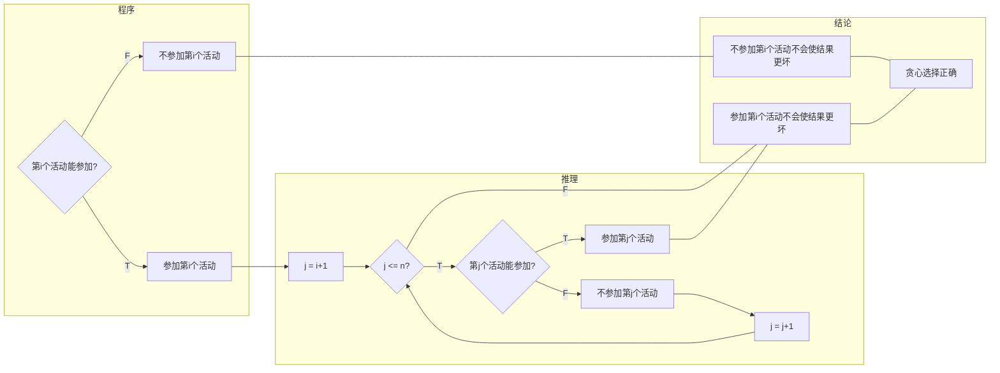

# Programming Problems in cs101.openjudge.cn

Updated 1749 GMT+8 May 25, 2022

2020 fall, Complied by Hongfei Yan

==**How to find the problems?**==
访问 http://cs101.openjudge.cn/, 登录后，点击“加入”按钮（ 表示加入"cs101"小组，只需要加入1次），然后点击 “练习”。 

有的题目是从“百练”小组 http://bailian.openjudge.cn/ 引入的，因此题目ID尽量保持末四位一致。如"装箱问题"的题目ID是01017，对应百练的1017题目。

==**What is OpenJudge? What kind of a site/resource is it?**==
OpenJudge is a project joining people interested in and taking part in programming contests. On one hand, OpenJudge is a social network dedicated to programming and programming contests. On the other hand, it is a platform where contests are held regularly, the participant's skills are reflected by their rating and the former contests can be used to prepare. 


所用的编程语言：主要选择Python语言；个别题目超时不能AC时，选择C++语言。用Python讲编程，有个特别大的好处。有的题目C++直接AC了，但是Python会超时，学生会琢磨如何优化，应用时间复杂度，更换算法等。对于理解计算机相关原理特别有帮助。问题求解的关键在于算法，而语言之间的可移植性、模块性和效率等方面的差异已经变得不那么重要了。


# ==Basic Exercises==

#. title, algorithm, link


## 01852: Ants

physics/greedy , http://cs101.openjudge.cn/practice/00854

An army of ants walk on a horizontal pole of length l cm, each with a constant speed of 1 cm/s. When a walking ant reaches an end of the pole, it immediatelly falls off it. When two ants meet they turn back and start walking in opposite directions. We know the original positions of ants on the pole, unfortunately, we do not know the directions in which the ants are walking. Your task is to compute the earliest and the latest possible times needed for all ants to fall off the pole.

输入

The first line of input contains one integer giving the number of cases that follow. The data for each case start with two integer numbers: the length of the pole (in cm) and n, the number of ants residing on the pole. These two numbers are followed by n integers giving the position of each ant on the pole as the distance measured from the left end of the pole, in no particular order. All input integers are not bigger than 1000000 and they are separated by whitespace.

输出

For each case of input, output two numbers separated by a single space. The first number is the earliest possible time when all ants fall off the pole (if the directions of their walks are chosen appropriately) and the second number is the latest possible such time.

样例输入

```
2
10 3
2 6 7
214 7
11 12 7 13 176 23 191
```

样例输出

```
4 8
38 207
```

来源：Waterloo local 2004.09.19


解题思路：首先很容易想到一个穷竭搜索算法，即枚举所有蚂蚁的初始朝向的组合，这可以利用递归函数实现。
每只蚂蚁的初始朝向都有2种可能，n只蚂蚁就是2 x 2 x … x 2=2^n^ 种。如果n比较小，这个算法还是可行的，但指数函数随着n的增长会急剧增长。
																					2^n^增长的趋势

| n    | 1    | 5    | 10   | 20      | 30    | 100    | 10000    | 1000000    |
| ---- | ---- | ---- | ---- | ------- | ----- | ------ | -------- | ---------- |
| 2^n^ | 2    | 32   | 1024 | 1048576 | 10^9^ | 10^30^ | 10^3010^ | 10^301030^ |

穷竭搜索的运行时间也随之急剧增长。一般把指数阶的运行时间叫做指数时间。指数时间的算法
无法处理稍大规模的输入。
接下来，让我们来考虑比穷竭搜索更高效的算法。首先对于最短时间，看起来所有蚂蚁都朝向较近的端点走会比较好。事实上，这种情况下不会发生两只蚂蚁相遇的情况，而且也不可能在比此更短的时间内走到竿子的端点。
接下来，为了思考最长时间的情况，让我们看看蚂蚁相遇时会发生什么。

事实上，可以知道两只蚂蚁相遇后，当它们保持原样交错而过继续前进也不会有任何问题，因为所有蚂蚁是同时出发的。这样看来，可以认为每只蚂蚁都是独立运动的，所以要求最长时间，只要求蚂蚁到竿子端点的最大距离就好了。
这样，不论最长时间还是最短时间，都只要对每只蚂蚁检查一次就好了，这是O(n)时间的算法。
对于限制条件n≤ 10^6^, 这个算法是够用的，于是问题得解。

```python
t = int(input())
for _ in range(t):
    L,n = map(int, input().split())
    x = map(int, input().split())
    minT = maxT = 0
    for i in x:
        minT = max(minT, min(i, L-i))
        maxT = max(maxT, max(i, L-i))
    
    print(minT, maxT)
```


## 02694: 波兰表达式

recursion/strings, http://cs101.openjudge.cn/practice/02694

波兰表达式是一种把运算符前置的算术表达式，例如普通的表达式2 + 3的波兰表示法为+ 2 3。波兰表达式的优点是运算符之间不必有优先级关系，也不必用括号改变运算次序，例如(2 + 3) * 4的波兰表示法为* + 2 3 4。本题求解波兰表达式的值，其中运算符包括+ - * /四个。

输入

输入为一行，其中运算符和运算数之间都用空格分隔，运算数是浮点数。

输出

输出为一行，表达式的值。
可直接用printf("%f\n", v)输出表达式的值v。

样例输入

```
* + 11.0 12.0 + 24.0 35.0
```

样例输出

```
1357.000000
```

提示

可使用atof(str)把字符串转换为一个double类型的浮点数。atof定义在math.h中。
此题可使用函数递归调用的方法求解。

来源：计算概论05


2021fall-cs101，王顾言。

这道题理解题意花了不少时间，对题目下面给出的使用递归函数求解更是迷惑。 个人觉得和 OJ.03704括号匹配 问题非常相似，手动建了个栈，一通操作后ac。 做完后去看题解，画了个流程图才理解 递归解法 绝妙之处。


2021fall-cs101，欧阳韵妍。

解题思路：关键：碰到两个数字就按照离两个数字左边最近的运算符运算，注意由于输入的是 str，需要手动定义输入的运算符对应的运算操作。注意 operate 是一层层套下去的，比如：\* + 11.0 12.0 + 24.0 35.0 就是这样的运算步骤：

（）*（）→

（（）+（））*（）→

（（11.0）+（12.0 ））* （）→

（（11.0 ）+ （12.0 ））* （（）+ （））→

（（11.0 ）+ （12.0 ））*（（24.0）+（35.0））

一个运算符相当于进行一次递归。学会了输出精确到两位小数点的方法，用”{:.2f}”.format()。


```python
'''
# http://cs101.openjudge.cn/practice/02694/
前缀表达式是运算符在前，操作数其后，
就是假如碰到一个运算符，其后就需要有连续的两个操作数才能运算消去，
否则就一直等待输入或者等待后面的运算结束得到操作数,
这恰好能用递归实现。
'''
calculatelist=[]

pos=-1
def Exp():
    global pos
    pos+=1
    chr=calculatelist[pos]
    if chr=='+' :
        return Exp()+Exp()
    elif chr=='-' :
        return Exp()-Exp()
    elif chr=='*' :
        return Exp()*Exp()
    elif chr=='/' :
        return Exp()/Exp()
    else:
        return float(chr)
def main():
    global calculatelist
    calculatelist=list(input().split())
    result=Exp()
    print("{:.6f}".format(result))
    
if __name__=='__main__' :
    main()
```


2021fall-cs101，李文梁。

由于python 可以直接计算字符串表达式，只需要把波兰表达式转换成正常计算式即可。具体操作为递归，嵌套到从最内层开始把符号换到数字之间并计算，一层层返回即可。

```python
# http://cs101.openjudge.cn/practice/02694/
s = input().split()
def cal():
    cur = s.pop(0)
    if cur in "+-*/":
        return str(eval(cal() + cur + cal()))
    else:
        return cur
print("%.6f" % float(cal()))
```


2021fall-cs101，黄湘榆。

这题像是一道语法题。我利用了之前做24 点时学到的operator 标准库来定义一个运算符的字典，方便随时根据需求切换运算符。 
import operator 
op = {"+": operator.add, "-": operator.sub, "*": operator.mul, "/": operator.truediv} 

```python
# http://cs101.openjudge.cn/practice/02694/
import operator 
s = input().split() 
op = {"+": operator.add, "-": operator.sub, "*": operator.mul, 
"/": operator.truediv} 
while len(s) != 1: 
    for i in range(len(s)): 
        if s[i][0].isdecimal() and s[i+1][0].isdecimal(): 
            o = s.pop(i-1) 
            a = s.pop(i-1) 
            b = s.pop(i-1) 
            c = op[o](float(a), float(b)) 
            s.insert(i-1, str(c)) 
            break 
 
print("{:.6f}".format(float(s[0]))) 
```


2021fall-cs101，陈锦洋。

不得不说eval 函数在这里帮了大忙。递归在这里是很好的想法。

```python
l=input().split()
def poland():
    op=l.pop(0)
    a=poland() if l[0] in '+-*/' else l.pop(0)
    b=poland() if l[0] in '+-*/' else l.pop(0)
    return eval(str(a)+op+str(b))
print('{:.6f}'.format(poland()))
```


2021fall-cs101，陈思同。

break用的挺巧妙，悬崖勒马的感觉。明明边循环边删除，就要出错了感觉。

```python
# http://cs101.openjudge.cn/practice/02694/
b = ['+', '-', '*', '/']
a = input().split()
for i in range(len(a)):
    if a[i] not in b: a[i] = float(a[i])
while 1:
    if len(a) == 1:
        break
    for i in range(len(a)):
        if a[i] in b and a[i+1] not in b and a[i+2] not in b:
            if a[i] == '+': d = a[i+1] + a[i+2]
            elif a[i] == '-': d = a[i+1] - a[i+2]
            elif a[i] == '*': d = a[i+1] * a[i+2]
            elif a[i] == '/': d = a[i+1] / a[i+2]
            
            a[i] = d
            del a[i+1] 
            del a[i+1]
            break
print('%.6f'% a[0])
```


2021fall-cs101，渠成锐。

思路：最一开始接触到函数递归调用就是这道题，当时惊赞题解里的做法真的是妙哉。现在学了栈这种数据结构，我发现可以写一个不用函数递归调用的版本。基本想法如下：从后往前读取表达式，碰见数字则压入栈，碰见运算符号则从栈顶弹出两个数据进行计算，将计算结果再压入栈即可。

```python
# http://cs101.openjudge.cn/practice/02694/
expression = input().split()
stack = []
while expression:
    a = expression.pop(-1)
    if a in ['+', '-', '*', '/']:
        c = stack.pop(-1)
        d = stack.pop(-1)
        if a == '+':
            stack.append(c + d)
        elif a == '-':
            stack.append(c - d)
        elif a == '*':
            stack.append(c * d)
        else:
            stack.append(c / d)
    else:
        stack.append(float(a))
        
print("{:.6f}".format(stack[0]))
```


2021fall-cs101，周稚坤。

逆波兰是运算符号尽量往后。https://en.wikipedia.org/wiki/Reverse_Polish_notation
转化为逆波兰表达式更有利于理解“栈”的概念，通过这个题我对栈的理解有了一定加深。首先要明确逆波兰表达式的基本运算为：			（逆波兰表达式1）算符（逆波兰表达式2）=（逆1）（逆2）算符
重复操作后会发现这是一个树的结构，那么其中一种方法就是以一个树根开始一步步向上走，并将遇上的数堆到栈里。每当遇上符号，则进行一次上述运算并拿走栈上最上面的两个值，以此往复到最后自然只剩下运算结果，输出即可。

这里第一次知道eval 函数用来执行一个字符串表达式，并返回表达式的值。
尝试学习了李文梁同学的递归代码，自己认为这和“递归的本质就是不要关心递归的那个函数究竟发生了什么”有很大关联。只要记住最基本的（逆波兰表达式1）算符（逆波兰表达式2）=（逆1）（逆2）算符  就好。

```python
# http://cs101.openjudge.cn/practice/02694/

D=input().split()
D.reverse()
def STACK(D):
    stack=[]
    for i in D:
        if i in '+-*/':
            a=stack.pop()
            b=stack.pop()
            stack.append(str(eval(a+i+b)))
        else:
            stack.append(i)
    return stack[0]
print('%6f'% float(STACK(D)))
```


## 02707: 求一元二次方程的根

math, http://cs101.openjudge.cn/practice/02707

利用公式x1 = (-b + sqrt(b\*b-4\*a\*c))/(2*a), x2 = (-b - sqrt(b\*b-4\*a\*c))/(2\*a)求一元二次方程ax^2^ + bx + c =0的根，其中a不等于0。

**输入**

第一行是待解方程的数目n。
其余n行每行含三个浮点数a, b, c（它们之间用空格隔开），分别表示方程ax^2…… + bx + c =0的系数。

**输出**

输出共有n行，每行是一个方程的根：
若是两个实根，则输出：x1=...;x2 = ...
若两个实根相等，则输出：x1=x2=...
若是两个虚根，则输出：x1=实部+虚部i; x2=实部-虚部i

所有实数部分要求精确到小数点后5位，数字、符号之间没有空格。
x1和x2的顺序：x1的实部>Re的实部||(x1的实部==x2的实部&&x1的虚部>=x2的虚部)

样例输入

```
3
1.0 3.0 1.0
2.0 -4.0 2.0
1.0 2.0 8.0
```

样例输出

```
x1=-0.38197;x2=-2.61803
x1=x2=1.00000
x1=-1.00000+2.64575i;x2=-1.00000-2.64575i
```

提示

1、需要严格按照题目描述的顺序求解x1、x2。
2、方程的根以及其它中间变量用double类型变量表示。
3、函数sqrt()在头文件math.h中。
4、要输出浮点数、双精度数小数点后5位数字，可以用下面这种形式：

printf("%.5f", num);

注意，在使用Java做此题时，可能会出现x1或x2等于-0的情形，此时，需要把负号去掉

来源

2005~2006医学部计算概论期末考试


```python
import math
n = int(input())
for i in range(n):
    a, b, c = map(float, input().split())
    if b == 0:
        b = -b
    delta = b ** 2 - 4 * a * c
    if delta > 0:
        x1 = (-b + math.sqrt(delta)) / (2 * a)
        x2 = (-b - math.sqrt(delta)) / (2 * a)
        x1 = format(x1, ".5f")
        x2 = format(x2, ".5f")
        print(f"x1={x1};x2={x2}")
    elif delta == 0:
        t = (-b) / (2 * a)
        x1 = format(t, ".5f")
        print(f"x1=x2={x1}")
    else:
        d = format(math.sqrt(-delta) / (2 * a), ".5f")
        re = format((-b) / (2 * a), ".5f")
        print(f"x1={re}+{d}i;x2={re}-{d}i")
```


## 02733: 判断闰年

math, http://cs101.openjudge.cn/practice/02733

判断某年是否是闰年。

**输入**

输入只有一行，包含一个整数a(0 < a < 3000)

**输出**

一行，如果公元a年是闰年输出Y，否则输出N

**样例输入**

```
2006
```

**样例输出**

```
N
```

提示

公历纪年法中，能被4整除的大多是闰年，但能被100整除而不能被400整除的年份不是闰年， 能被3200整除的也不是闰年，如1900年是平年，2000年是闰年，3200年不是闰年。


```python
a = int(input())
if (a%3200 == 0) or ((a%100 == 0) and (a%400!= 0)):
    print('N')
elif a%4 == 0:
    print('Y')
else:
    print('N')
```


## 02750: 鸡兔同笼

math, http://cs101.openjudge.cn/practice/02750

一个笼子里面关了鸡和兔子（鸡有2只脚，兔子有4只脚，没有例外）。已经知道了笼子里面脚的总数a，问笼子里面至少有多少只动物，至多有多少只动物。

**输入**

一行，一个正整数a (a < 32768)。

**输出**

一行，包含两个正整数，第一个是最少的动物数，第二个是最多的动物数，两个正整数用一个空格分开。
如果没有满足要求的答案，则输出两个0，中间用一个空格分开。

样例输入

```
20
```

样例输出

```
5 10
```


```python
num_feet = int(input())
if (num_feet%2 != 0) :
  print("{} {}".format(0,0))
elif (num_feet%4 ==0) :
  print("{} {}".format( int(num_feet/4), int(num_feet/2)) )
else :
  print("{} {}".format( num_feet//4 + 1, int(num_feet/2)) )
```

**计算思维包括数学思维，计算机思维。这就是清晰的数学思维。**


1900017722，吉祥瑞，元培学院

解题思路：设有$x$只鸡，$y$只兔子，则$2x+4y=a, x \in \mathbb{N},y \in \mathbb{N}$总数$z=x+y$。由高中学过的线性规划知识，$x=\frac{a}{2}$时$z_{max}=\frac{a}{2}$，若为4的倍数，则$x=0$时$z_{min}\frac{a}{4}$；若不是4的倍数但是2的倍数，则$x=1$时$z_{min}=\frac{a+2}{4}$。

```python
a = int(input())
if a%4 == 0:
    print(int(a/4), int(a/2))
elif a%2 == 0:
    print(int((a+2)/4), int(a/2))
else:
    print(0, 0)
```


## 02746: 约瑟夫问题

implementation, http://cs101.openjudge.cn/practice/02746

约瑟夫问题：有ｎ只猴子，按顺时针方向围成一圈选大王（编号从１到ｎ），从第１号开始报数，一直数到ｍ，数到ｍ的猴子退出圈外，剩下的猴子再接着从1开始报数。就这样，直到圈内只剩下一只猴子时，这个猴子就是猴王，编程求输入ｎ，ｍ后，输出最后猴王的编号。

**输入**

每行是用空格分开的两个整数，第一个是 n, 第二个是 m ( 0 < m,n <=300)。最后一行是：

0 0

**输出**

对于每行输入数据（最后一行除外)，输出数据也是一行，即最后猴王的编号

样例输入

```
6 2
12 4
8 3
0 0
```

样例输出

```
5
1
7
```


```python
# 2021cs101, 留美琪，1800090104
# 先使用pop从列表中取出，如果不符合要求再append回列表，相当于构成了一个圈
while True:
    n, m = map(int, input().split())
    if {n,m} == {0}:
        break
    monkey = [i for i in range(1, n+1)]
    index = 0
    while len(monkey) != 1:
        temp = monkey.pop(0)
        index += 1
        if index == m:
            index = 0
            continue
        monkey.append(temp)
    print(monkey[0])
```


思路：因为退出圈的起点会移动m步，所以加个m-1，又因为是个圆环，需要计算mod n。

```python
while True:
    n, m = map(int, input().split())
    if n + m == 0:
        break
    mon = []    # monkey
    for i in range(1, n+1):
        mon.append(i)
    
    t = m - 1
    for j in range(n):
        if len(mon) == 1:
            print(sum(mon))
        else:
            del mon[t]
            n -= 1
            t = (t + m - 1) % n
```


2020fall-cs101，李元锋。

思路：没接触编程前就听说过此题的大名了，这题可以用递归思想。首先先简化问题，考虑当n=5,m=3 的情况： (1,2,3,4,5)，第一轮报数后变成 (4,5,1,2)。如果我们可以把 (4,5,1,2)变成(1,2,3,4)，那不就可以重复这个流程直到 1了嘛。这个流程可以用公式(func(n-1,m)+m-1)%n+1给出，直接递归即可。

```python
def func(n,m):
    if n == 1:
        return n 
    return (func(n-1, m) + m-1) % n + 1

while True:
    n, m = map(int, input().split())
    if n+m == 0:
        break
    print(func(n, m))
```


```python
while True:
    n, m = map(int, input().split())
    if n+m == 0:
        break
    
    dp = [0] + [1]*n
    cur = 1
    while sum(dp)!=1:
        cnt = 0
        while True:
            if dp[cur] == 1:
                cnt += 1
                if cnt==m:
                    break
                
                cur += 1
                if cur>n:
                    cur = 1
            else:
                cur += 1
                if cur>n:
                    cur = 1
            
        dp[cur] = 0
        cur += 1
        if cur>n:
            cur = 1

    else:
        print(dp.index(1))
```


## 02757: 最长上升子序列

dp, http://cs101.openjudge.cn/practice/02757

一个数的序列*b~i~*，当*b~1~* < *b~2~* < ... < *b~S~*的时候，我们称这个序列是上升的。对于给定的一个序列(*a~1~*, *a~2~*, ..., *a~N~*)，我们可以得到一些上升的子序列(*a~i1~*, *a~i2~*, ..., *a~iK~*)，这里1  ≤   *i~1~* < *i~2~* < ... < *i~K~*  ≤   N。比如，对于序列(1, 7, 3, 5, 9, 4, 8)，有它的一些上升子序列，如(1, 7), (3, 4, 8)等等。这些子序列中最长的长度是4，比如子序列(1, 3, 5, 8).

你的任务，就是对于给定的序列，求出最长上升子序列的长度。

**输入**

输入的第一行是序列的长度N (1  ≤   N  ≤   1000)。第二行给出序列中的N个整数，这些整数的取值范围都在0到10000。

**输出**

最长上升子序列的长度。

样例输入

```
7
1 7 3 5 9 4 8
```

样例输出

```
4
```

来源：翻译自 Northeastern Europe 2002, Far-Eastern Subregion 的比赛试题


2020fall-cs101，王君宇。思路：和最大上升子序列和类似，都是需要双重循环的 dp，外循环确定每个元素 dp初始值为 1，内循环遍历小数进行转移方程。

```python
input()
b = [int(x) for x in input().split()]

n = len(b)
dp = [1]*n

for i in range(n):
    for j in range(i):
        if b[j]<b[i]:
            dp[i] = max(dp[j]+1, dp[i])
    
print(max(dp))
```


2020fall-cs101，李博海

```python
import bisect
n = int(input())
l = [int(x) for x in input().split()]
dp = [1e9]*n
for i in l:
    dp[bisect.bisect_left(dp, i)] = i
print(bisect.bisect_left(dp, 1e8))
```


2020fall-cs101，章斯岚。这里用i+1是为了防止a[0:i]可能是空列表导致runtime error。

与 OJ3532最大上升子序列和，一样，i改为1即可。

```python
dp = [0]*(10000+2)
input()
for i in map(int, input().split()):
    dp[i+1] = max(dp[0:i+1]) + 1
print(max(dp))
```


## 02808: 校门外的树

implementation, http://cs101.openjudge.cn/practice/02808

某校大门外长度为L的马路上有一排树，每两棵相邻的树之间的间隔都是1米。我们可以把马路看成一个数轴，马路的一端在数轴0的位置，另一端在L的位置；数轴上的每个整数点，即0，1，2，……，L，都种有一棵树。
马路上有一些区域要用来建地铁，这些区域用它们在数轴上的起始点和终止点表示。已知任一区域的起始点和终止点的坐标都是整数，区域之间可能有重合的部分。现在要把这些区域中的树（包括区域端点处的两棵树）移走。你的任务是计算将这些树都移走后，马路上还有多少棵树。

**输入**

输入的第一行有两个整数L（1 <= L <= 10000）和 M（1 <= M <= 100），L代表马路的长度，M代表区域的数目，L和M之间用一个空格隔开。接下来的M行每行包含两个不同的整数，用一个空格隔开，表示一个区域的起始点和终止点的坐标。

**输出**

输出包括一行，这一行只包含一个整数，表示马路上剩余的树的数目。

样例输入

```
500 3
150 300
100 200
470 471
```

样例输出

```
298
```

来源：noip2005普及组


```python
L, m = map(int, input().split())

dp = [1]*(L+1)

for i in range(m):
    s, e = map(int, input().split())
    for j in range(s, e+1):
        dp[j] = 0

print(dp.count(1))
```


## 02981: 大整数加法

math/strings, http://cs101.openjudge.cn/practice/02981

求两个不超过200位的非负整数的和。

**输入**

有两行，每行是一个不超过200位的非负整数，可能有多余的前导0。

**输出**

一行，即相加后的结果。结果里不能有多余的前导0，即如果结果是342，那么就不能输出为0342。

样例输入

```
22222222222222222222
33333333333333333333
```

样例输出

```
55555555555555555555
```

来源：程序设计实习2007

```python
print(int(input()) + int(input()))
```

2020fall-cs101，王康安。练习字符串解法。

```python
s1 = list(reversed(list(map(int, list(input())))))
s2 = list(reversed(list(map(int, list(input())))))
if len(s1) > len(s2):      
    s2 += [0]*(len(s1) - len(s2))
else:      
    s1 += [0]*(len(s2) - len(s1))

sum = [0]*(len(s1) + 1)
for i in range(len(s1)):      
    sum[i+1] += (sum[i]+s1[i]+s2[i])//10      
    sum[i] = (s1[i]+s2[i]+sum[i])%10

sum.reverse()
cur = 0
while cur<len(sum) and sum[cur] == 0:      
    cur += 1
out = ''
if cur == len(sum):
    print(0)
else:
    for i in range(cur,len(sum)):            
        out += str(sum[i])
    print(out)
```


## 03087: 邮箱验证

Strings, http://cs101.openjudge.cn/practice/03087/

描述

POJ 注册的时候需要用户输入邮箱，验证邮箱的规则包括：
1)有且仅有一个'@'符号
2)'@'和'.'不能出现在字符串的首和尾
3)'@'之后至少要有一个'.'，并且'@'不能和'.'直接相连
满足以上3条的字符串为合法邮箱，否则不合法，
编写程序验证输入是否合法

**输入**

输入包含若干行，每一行为一个代验证的邮箱地址，长度小于100

**输出**

每一行输入对应一行输出
如果验证合法，输出 YES
如果验证非法：输出 NO

样例输入

```
.a@b.com
pku@edu.cn
cs101@gmail.com
cs101@gmail
```

样例输出

```
NO
YES
YES
NO
```


```python
while True:
    try:
        s = input()
    except EOFError:
        break
    
    if s.count('@') != 1:
        print("NO"); continue
    
    #if (s[0]=='@' or s[-1]=='@' or s[0]=='.' or s[-1]=='.'):
    if (s[0] in {'@', '.'} or s[-1] in {'@', '.'}):
        print("NO"); continue

    if (s.find("@.")!=-1 or s.find(".@")!=-1):
        print("NO"); continue

    p = s.find("@");
    q = s.find(".", p+1);
    
    '''
    if (q==-1):
        print("NO")
    else:
        print("YES")
    '''
    print('NO' if q==-1 else 'YES')
```


唐浴歌经济学院1900015516

题目给的要求时\[\^@\.]，也就是说正常字段只需要不是“@”和“.”即可。以前遇到的要求是：正常字段只能是大小写字母或“-”，所以也试了试[\w-]。虽然regulation需要前后match，也就是说前面加一个“^”，后面加一个“$”， 但 是.match函数本身就是从头开始检索的，所以“^”可以删去。

```python
# https://www.tutorialspoint.com/python/python_reg_expressions.htm
# https://www.geeksforgeeks.org/python-regex/

import re
while True:
    try:
        s = input()
        reg = r'[\w-]+(\.[\w-]+)*@[\w-]+(\.[\w-]+)+$'
        print('YES' if re.match(reg, s) else 'NO')
    except EOFError:
        break
```


```python
# https://www.tutorialspoint.com/python/python_reg_expressions.htm
# https://www.geeksforgeeks.org/python-regex/
import re  
while True: 
    try:
        s = input()
        reg   = r'[^@\.]+(\.[^@\.]+)*@[^@\.]+(\.[^@\.]+)+$'
        print('YES' if re.match(reg, s) else 'NO')
    except EOFError:
        break
```


## 03143: 验证“歌德巴赫猜想”

math, http://cs101.openjudge.cn/practice/03143

验证“歌德巴赫猜想”，即：任意一个大于等于6的偶数均可表示成两个素数之和。

**输入**

输入只有一个正整数x。(x<=2000)

**输出**

如果x不是“**大于等于**6的偶数”，则输出一行：
Error!
否则输出这个数的**所有**分解形式，形式为：
x=y+z
其中x为待验证的数，y和z满足y+z=x，而且y<=z，y和z均是素数。
如果存在多组分解形式，则按照**y的升序**输出所有的分解，每行一个分解表达式。

注意输出**不要**有多余的空格。

样例输入

```
输入样例1:
7
输入样例2:
10
输入样例3:
100
```

样例输出

```
输出样例1:
Error!
输出样例2:
10=3+7
10=5+5
输出样例3:
100=3+97
100=11+89
100=17+83
100=29+71
100=41+59
100=47+53
```

来源：计算概论2007, XieDi

```python
pri=[0]*2001
pri[1]=1
for i in range(2,50):
    if pri[i]==0:
        for j in range(i*2,2001,i):
            pri[j]=1

t=int(input())
if t<6 or t%2!=0:
    print('Error!')
else:   
    for m in range(3,int(t/2)+1):
        if pri[m]==0 and pri[t-m]==0:
            print(f"{t}={m}+{t-m}")
```


2021fall-cs101，刘晨。

建立素数列表。判断语句（如何保证y 的升序和y<=z 的条件）。注意条件表达，格式化输出。

```python
n = int(input())
isPrime = [True]* (n+1)
for i in range(2, n+1):
    if isPrime[i]:
        for j in range(2*i, n+1, i):
            isPrime[j] = False
            
if n < 6 or n%2 != 0:
    print('Error!')
else:
    for i in range(2, n):
        if isPrime[i] and isPrime[n-i] and i <= (n-i):
            y = i
            z = n-i
            #print(y,z)
            print('%d=%d+%d'%(n, y, z))
```


## 03670: 计算鞍点

matrice, http://cs101.openjudge.cn/practice/03670

 给定一个5*5的矩阵，每行只有一个最大值，每列只有一个最小值，寻找这个矩阵的鞍点。
鞍点指的是矩阵中的一个元素，它是所在行的最大值，并且是所在列的最小值。
例如：在下面的例子中（第4行第1列的元素就是鞍点，值为8 ）。
11 3 5 6 9
12 4 7 8 10
10 5 6 9 11
8 6 4 7 2
15 10 11 20 25

输入

输入包含一个5行5列的矩阵

输出

如果存在鞍点，输出鞍点所在的行、列及其值，如果不存在，输出"not found"

样例输入

```
11 3 5 6 9
12 4 7 8 10
10 5 6 9 11
8  6 4 7 2
15 10 11 20 25
```

样例输出

```
4 1 8
```


证明鞍点最多只有一个： 

反证法：已知一个鞍点（x, y），是第x行最大值，第y列最小值，假设存在另一个点（x', y'），且它是第x'行最大值，那么： 

1. 它是第x'行最大值 -> 它一定大于（x', y）这个点 。
2. （x, y）是第y列的最小值 ->（x', y）一定大于（x, y）。 
3. （x, y）它是第x行最大值 ->（x, y）一定大于（x, y'）  从而有：(x', y') > (x', y) > (x, y) > (x, y')，那么（x', y'）不可能是第y'列的最小值，从而不存在第二个鞍点。


```python
mx = []
board = [[-9]*5 for _ in range(5)]

for _ in range(5):
    mx.append(list(map(int, input().split())))

for i in range(5):
    tmp = sorted(mx[i])
    row_max = tmp[-1]
    idx = mx[i].index(row_max)
    board[i][idx] = 1

for j in range(5):
    res = [sub[j] for sub in mx]
    tmp = sorted(res)
    col_min = tmp[0]
    idx = res.index(col_min)
    if board[idx][j] == 1:
        board[idx][j] = 0

for i in range(5):    
    for j in range(5):
        if board[i][j] == 0:
            print(i+1, j+1, mx[i][j])
            exit()
else:
    print("not found")
```


```python
a = [[int(x) for x in input().split()] for _ in range(5)]
for i in range(5):
    maximum = a[i][0]
    maxindex = 0
    for j in range(1, 5):
        if a[i][j] > maximum:
            maximum = a[i][j]
            maxindex = j
    for j in range(5):
        if j != i and a[j][maxindex] <= maximum:
            break
    else:
        print(i+1, maxindex+1, maximum)
        break
else:
    print('not found')
```


2021fall-cs101，欧阳韵妍。

解题思路：先找出每行的最大值，再看看这个值是不是这一列的最小值，如果同一列里面有另外一个值比这个值小，就放弃这一行的这个值。

```python
L = [[int(x) for x in input().split()] for i in range(5)]
for i in range(5):
    a = L[i].index(max(L[i]))
    for j in range(5):
        if L[j][a] < L[i][a]:
            break
    else:
        print(i+1, a+1, L[i][a])
        break
else:
    print("not found")
```


2021fall-cs101，留美琪。

通过将矩阵转置，便于找列的最小值。然后记录行最大和列最小的index，求交集。学到了转置可以用zip(*)来实现。

```python
input_matrix = [[int(i) for i in input().split()] for _ in range(5)]
 
# 转置
matrix_T = list(map(list, zip(*input_matrix)))
 
row_max_index = []
col_min_index = []
 
for i in range(5):
    row_max_index.append((i, input_matrix[i].index(max(input_matrix[i]))))
    col_min_index.append((matrix_T[i].index((min(matrix_T[i]))), i))
 
ans = list(set(row_max_index) & set(col_min_index))
 
if len(ans) != 1:
    print("not found")
else:
    ans_index = ans[0]
    row = ans_index[0]
    col = ans_index[1]
    print(row+1, col+1, input_matrix[row][col])
```


## 03704: 括号匹配

stack, http://cs101.openjudge.cn/practice/03704

在某个字符串（长度不超过100）中有左括号、右括号和大小写字母；规定（与常见的算数式子一样）任何一个左括号都从内到外与在它右边且距离最近的右括号匹配。写一个程序，找到无法匹配的左括号和右括号，输出原来字符串，并在下一行标出不能匹配的括号。不能匹配的左括号用"$"标注，不能匹配的右括号用"?"标注.

**输入**

输入包括多组数据，每组数据一行，包含一个字符串，只包含左右括号和大小写字母，**字符串长度不超过100**
**注意：cin.getline(str,100)最多只能输入99个字符！**

**输出**

对每组输出数据，输出两行，第一行包含原始输入字符，第二行由"\$","?"和空格组成，"$"和"?"表示与之对应的左括号和右括号不能匹配。

样例输入

```
((ABCD(x)
)(rttyy())sss)(
```

样例输出

```
((ABCD(x)
$$
)(rttyy())sss)(
?            ?$
```


```python
# https://www.cnblogs.com/huashanqingzhu/p/6546598.html

lines = []
while True:
    try:
        lines.append(input())
    except EOFError:
        break
    
ans = []
for s in lines:
    stack = []
    Mark = []
    for i in range(len(s)):
        if s[i] == '(':
            stack.append(i)
            Mark += ' '
        elif s[i] == ')':
            if len(stack) == 0:
                Mark += '?'
            else:
                Mark += ' '
                stack.pop()
        else:
            Mark += ' '
    
    while(len(stack)):
        Mark[stack[-1]] = '$'
        stack.pop()
    
    print(s)
    print(''.join(map(str, Mark)))
```


## 04030: 统计单词数

string, http://cs101.openjudge.cn/practice/04030

 一般的文本编辑器都有查找单词的功能，该功能可以快速定位特定单词在文章中的位置，有的还能统计出特定单词在文章中出现的次数。
现在，请你编程实现这一功能，具体要求是：给定一个单词，请你输出它在给定的文章中出现的次数和第一次出现的位置。注意：匹配单词时，不区分大小写，但要求完全匹配，即给定单词必须与文章中的某一独立单词在不区分大小写的情况下完全相同 （参见样例 1） ，如果给定单词仅是文章中某一单词的一部分则不算匹配（参见样例 2） 。

**输入**

第 1 行为一个字符串，其中只含字母，表示给定单词；
第 2 行为一个字符串，其中只可能包含字母和空格，表示给定的文章。

**输出**

只有一行， 如果在文章中找到给定单词则输出两个整数， 两个整数之间用一个空格隔开，分别是单词在文章中出现的次数和第一次出现的位置（即在文章中第一次出现时，单词首字母在文章中的位置，位置从 0 开始） ；如果单词在文章中没有出现，则直接输出一个整数-1。

样例输入

```
样例 #1:
To 
to be or not to be is a question 

样例 #2:
to 
Did the Ottoman Empire lose its power at that time
```

样例输出

```
样例 #1:
2 0

样例 #2:
-1
```

提示

【输入输出样例 1 说明】
输出结果表示给定的单词 To 在文章中出现两次，第一次出现的位置为 0。

【输入输出样例 2 说明】
表示给定的单词 to 在文章中没有出现，输出整数-1。

【数据范围】
1 ≤单词长度≤10。
1 ≤文章长度≤1,000,000。


2021fall-cs101，陈勇。这道题需要先在语句两头加“ ”进行保护，然后用“ ”+关键词+“ ”进行搜素。

```python
string = ' ' + input().lower() + ' '
sentence = ' ' + input().lower() + ' '
loc = sentence.find(string)
if loc < 0:
    print(-1)
else:
    pro_stc = sentence.split()
    print(pro_stc.count(string[1:-1]), loc)
```


2021fall-cs101，吉祥瑞。注：

（1）第3行，前后加空格是一种巧妙的方法。
（2）第7行，单词总数不能用(' '+article+' ').count(' '+word+' ') 来求，例如，' a a '.count(' a ') 的结果是1而不是2，因为在计入第1个' a ' 后，就只剩下'a ' 了。
（3）样例输入首行的末尾有多余的空格，直接复制样例输入会使程序报错。
易错点：文章中单词之间可能有多个空格。

```python
word = input().lower()
article = input().lower()
first = (' '+article+' ').find(' '+word+' ')
if first == -1:
    print(-1)
else:
    print(article.split().count(word), first)
```

2021fall-cs101，吉祥瑞。直接做，纯属练习。

```python
word = input().lower()
article = input().lower()
e = tot = 0
while e < len(article):
    s = e
    while s < len(article) and article[s] == ' ':
        s += 1
    e = s
    while e < len(article) and article[e] != ' ':
        e += 1
    if article[s:e] == word:
        tot += 1
        if tot == 1:
            first = s
if tot == 0:
    print(-1)
else:
    print(tot, first)
```


```python
import re

word = input().lower()
article = input().lower()

a = re.findall(r'\b'+word+r'\b', article)
cnt = len(a)
if cnt == 0:
    print(-1)
else:
    aa  = re.search(r'\b'+word+r'\b', article)
    print(cnt, aa.start())
```


2021fall-cs101, 叶晨熙。

注：title()使每个单词都首字母大写、其余字母小写，这样只需在后面补空格，并且可以直接用count()计数。

```python
w = input().title() + ' '
s = input().title() + ' '
print([-1, str(s.count(w)) + ' ' + str(s.find(w))][s.count(w) != 0])
```


## 04110: 圣诞老人的礼物-Santa Clau’s Gifts

greedy/dp, http://cs101.openjudge.cn/practice/04110

圣诞节来临了，在城市A中圣诞老人准备分发糖果，现在有多箱不同的糖果，每箱糖果有自己的价值和重量，每箱糖果都可以拆分成任意散装组合带走。圣诞老人的驯鹿最多只能承受一定重量的糖果，请问圣诞老人最多能带走多大价值的糖果。

**输入**

第一行由两个部分组成，分别为糖果箱数正整数n(1 <= n <= 100)，驯鹿能承受的最大重量正整数w（0 < w < 10000），两个数用空格隔开。其余n行每行对应一箱糖果，由两部分组成，分别为一箱糖果的价值正整数v和重量正整数w，中间用空格隔开。

**输出**

输出圣诞老人能带走的糖果的最大总价值，保留1位小数。输出为一行，以换行符结束。

样例输入

```
4 15
100 4
412 8
266 7
591 2
```

样例输出

```
1193.0
```


解题思路：计算平均值降序取，注意每箱糖果都可以拆分成任意散装组合带走。

```python
N, TW = map(int, input().split())	# TW = total weight
bags = []
for _ in range(N):
    v, w = map(int, input().split())
    x = v/w
    bags.append([x, v, w])

bags.sort(reverse = True)

ans = 0
for i in bags:
    if i[2] <= TW:
        ans += i[1]
        TW -= i[2]
    else:
        ans += TW * i[0]
        break

print("{:.1f}".format(ans))
```


```python
n, tw = map(int, input().split())

d = dict()
for _ in range(n):
    v, w = map(int, input().split())
    t = v/w
    if t not in d:
        d[t] = [v, w]
    else:
        d[t] = [d[t][0]+v, d[t][1]+w]

a = sorted(d, reverse=True)

ans = 0
for i in a:
    if d[i][1] <= tw:
        ans += d[i][0]
        tw -= d[i][1]
    else:
        ans = ans + tw * i
        break

print("{:.1f}".format(ans))
```


2021fall-cs101，梁天书。

还是背包问题，只是这一次可分解，于是自己在预处理过程中把所有的礼品都分解了，转化成完全背包问题解决。

```python
n,w = map(int, input().split())
gifts = []       
for _ in range(n):
    a, b = map(int, input().split())
    c = a / b
    for i in range(b):
        gifts.append([c, 1])
        
value = [[0]*(w + 1) for _ in range(len(gifts) + 1)]

for i in range(1, len(gifts) + 1):
    for j in range(w + 1):
        if j < gifts[i-1][1]:
            value[i][j] = value[i-1][j]
        else:
            value[i][j] = max(value[i-1][j-gifts[i-1][1]] + \
                              gifts[i-1][0],value[i-1][j])
ans = max(value[-1])
print(format(ans, '.1f'))
```


## 04147: 汉诺塔问题(Tower of Hanoi)

recursion, http://cs101.openjudge.cn/practice/04147

一、汉诺塔问题

 有三根杆子A，B，C。A杆上有N个(N>1)穿孔圆盘，盘的尺寸由下到上依次变小。要求按下列规则将所有圆盘移至C杆： 每次只能移动一个圆盘； 大盘不能叠在小盘上面。 提示：可将圆盘临时置于B杆，也可将从A杆移出的圆盘重新移回A杆，但都必须遵循上述两条规则。

 问：如何移？最少要移动多少次？

汉诺塔示意图如下：


三个盘的移动：


二、故事由来

  法国数学家爱德华·卢卡斯曾编写过一个印度的古老传说：在世界中心贝拿勒斯（在印度北部）的圣庙里，一块黄铜板上插着三根宝石针。印度教的主神梵天在创造世界的时候，在其中一根针上从下到上地穿好了由大到小的64片金片，这就是所谓的汉诺塔。不论白天黑夜，总有一个僧侣在按照下面的法则移动这些金片：一次只移动一片，不管在哪根针上，小片必须在大片上面。僧侣们预言，当所有的金片都从梵天穿好的那根针上移到另外一根针上时，世界就将在一声霹雳中消灭，而梵塔、庙宇和众生也都将同归于尽。

  不管这个传说的可信度有多大，如果考虑一下把64片金片，由一根针上移到另一根针上，并且始终保持上小下大的顺序。这需要多少次移动呢?这里需要递归的方法。假设有n片，移动次数是f(n).显然f(1)=1,f(2)=3,f(3)=7，且f(k+1)=2*f(k)+1。此后不难证明f(n)=2^n-1。n=64时， 假如每秒钟一次，共需多长时间呢？一个平年365天有31536000 秒，闰年366天有31622400秒，平均每年31556952秒，计算一下： 18446744073709551615秒 这表明移完这些金片需要5845.54亿年以上，而地球存在至今不过45亿年，太阳系的预期寿命据说也就是数百亿年。真的过了5845.54亿年，不说太阳系和银河系，至少地球上的一切生命，连同梵塔、庙宇等，都早已经灰飞烟灭。

三、解法

 解法的基本思想是递归。假设有A、B、C三个塔，A塔有N块盘，目标是把这些盘全部移到C塔。那么先把A塔顶部的N-1块盘移动到B塔，再把A塔剩下的大盘移到C，最后把B塔的N-1块盘移到C。 每次移动多于一块盘时，则再次使用上述算法来移动。

**输入**

输入为一个整数后面跟三个单字符字符串。
整数为盘子的数目，后三个字符表示三个杆子的编号。

**输出**

输出每一步移动盘子的记录。一次移动一行。
每次移动的记录为例如3:a->b 的形式，即把编号为3的盘子从a杆移至b杆。
我们约定圆盘从小到大编号为1, 2, ...n。即最上面那个最小的圆盘编号为1，最下面最大的圆盘编号为n。

样例输入

```
3 a b c
```

样例输出

```
1:a->c
2:a->b
1:c->b
3:a->c
1:b->a
2:b->c
1:a->c
```

提示：可参考如下网址：
https://www.mathsisfun.com/games/towerofhanoi.html
http://blog.csdn.net/geekwangminli/article/details/7981570
http://www.cnblogs.com/yanlingyin/archive/2011/11/14/2247594.html

来源：重庆科技学院 WJQ

```python
# https://blog.csdn.net/geekwangminli/article/details/7981570

# 将编号为numdisk的盘子从init杆移至desti杆 
def moveOne(numDisk : int, init : str, desti : str):
    print("{}:{}->{}".format(numDisk, init, desti))

#将numDisks个盘子从init杆借助temp杆移至desti杆
def move(numDisks : int, init : str, temp : str, desti : str):
    if numDisks == 1:
        moveOne(1, init, desti)
    else: 
        # 首先将上面的（numDisk-1）个盘子从init杆借助desti杆移至temp杆
        move(numDisks-1, init, desti, temp) 
        
        # 然后将编号为numDisks的盘子从init杆移至desti杆
        moveOne(numDisks, init, desti)
        
        # 最后将上面的（numDisks-1）个盘子从temp杆借助init杆移至desti杆 
        move(numDisks-1, temp, init, desti)

n, a, b, c = input().split()
move(int(n), a, b, c)
```


## 06374: 文字排版

strings, http://cs101.openjudge.cn/practice/06374

- 输入

  第一行是一个整数n，表示英文短文中单词的数目. 其后是n个以空格分隔的英文单词（单词包括其前后紧邻的标点符号，且每个单词长度都不大于40个字母）。

- 输出

  排版后的多行文本，每行文本字符数最多80个字符，单词之间以一个空格分隔，每行文本首尾都没有空格。

- 样例输入

  ```
  84
  One sweltering day, I was scooping ice cream into cones and told my four children they could "buy" a cone from me for a hug. Almost immediately, the kids lined up to make their purchases. The three youngest each gave me a quick hug, grabbed their cones and raced back outside. But when my teenage son at the end of the line finally got his turn to "buy" his ice cream, he gave me two hugs. "Keep the changes," he said with a smile. `
  ```

  

- 样例输出

  ```
  One sweltering day, I was scooping ice cream into cones and told my four
  children they could "buy" a cone from me for a hug. Almost immediately, the kids
  lined up to make their purchases. The three youngest each gave me a quick hug,
  grabbed their cones and raced back outside. But when my teenage son at the end
  of the line finally got his turn to "buy" his ice cream, he gave me two hugs.
  "Keep the changes," he said with a smile.`
  ```

  

```python
int(input())
L = input().split()

ans = []
tmp = L[0] + ' '
for i in L[1:]:
    if len(tmp) + len(i) > 80:
        ans.append(tmp.rstrip())
        tmp = i + ' '
    else:
        tmp += i + ' '
else:
    ans.append(tmp.rstrip())

print('\n'.join(ans))
```


## 12556: 编码字符串

strings, http://cs101.openjudge.cn/practice/12556

在数据压缩中，一个常用的方法是行程长度编码压缩。对于一个待压缩的字符串，我们可以依次记录每个字符及重复的次数。例如，待压缩的字符串为"aaabbbbcbb"，压缩结果为(a,3)(b,4)(c,1)(b,2)。这种压缩对于相邻数据重复较多的情况有效，如果重复状况较少，则压缩的效率较低。

现要求根据输入的字符串，首先将字符串中所有大写字母转化为小写字母，然后将字符串进行压缩。

**输入**

一个字符串，长度大于0，且不超过1000，全部由大写或小写字母组成。

**输出**

输出为编码之后的字符串，形式为：(a,3)(b,4)(c,1)(d,2)，即每对括号内分别为小写字符及重复的次数，不含任何空格。

样例输入

```
aAABBbBCCCaaaaa
```

样例输出

```
(a,3)(b,4)(c,3)(a,5)
```

来源：cs10116 final exam


思路：遍历，如果当前字符和前一个一样，加一，否则换成新字符，旧的加到输出里，注意最后一次要加上。

```python
sentence = input().lower()
list = []
pre = sentence[0]
count = 1
for i in range(1, len(sentence)):
	if sentence[i] != pre:
		list.append('(' + pre + ',' + str(count) + ')')
		pre = sentence[i]
		count = 1
	else:
		count += 1
list.append('(' + pre + ',' + str(count) + ')')
print(''.join(list))
```

2020fall-cs101，李思哲

思路：双指针做法，d记录头c记录尾然后做差即可得到长度（重复次数），向输出的列表中直接添加格式化的字符串即可满足输出要求。

```python
# 2020fall-cs101, Sizhe Li. 
# tow pointers
a = list(input().lower()) + ["0"]
c,d = 0,-1
ans = []
for i in range(1, len(a)):
    if a[i] != a[i-1]:
        c = i - 1
        ans.append("(%s,%d)"%(a[i-1], c-d))
        d = c
print("".join(ans))
```


## 12558: 岛屿周长

matrice, http://cs101.openjudge.cn/practice/12558

用一个n * m的二维数组表示地图，1表示陆地，0代表海水，每一格都表示一个1*1的区域。地图中的格子只能横向或者纵向连接（不能对角连接），连接在一起的陆地称作岛屿，同时整个地图都被海水围绕。假设给出的地图中只会有一个岛屿，并且岛屿中不会有湖（即不会有水被陆地包围的情况出现）。请判断所给定的二维地图中岛屿的周长。

**输入**

第一行为n和m，表示地图的大小(1<=n<=100, 1<=m<=100)。接下来n行，每行有m个数，分别描述每一格的数值。数值之间均用空格隔开。

**输出**

只有一行，即岛屿的周长（正整数）。

样例输入

```
3 4
1 1 1 0
0 1 0 0
1 1 0 0
```

样例输出

```
14
```

来源：cs10116 final exam


解题思路：注意到正方形周长为 4，并且每个方向与其他正方形相连则少条边，直接加保护圈，写公式，遍历一遍，直接完成。

思路：某个陆地格子对周长的贡献值是 4-周围的陆地数，其余的就是普通二维数组、加保护圈。

```python
n,m = map(int,input().split())
l = [[0]*(m+2)] +[[0] +list(map(int,input().split()))+[0] for _ in range(n)]+[[0]*(m+2)]
ans = 0
for i in range(1,n+1):
    for j in range(1, m + 1):
        if l[i][j] == 1:
            ans += 4-l[i+1][j]-l[i][j+1]-l[i-1][j]-l[i][j-1]
print(ans)
```


解题思路：画一画就能发现，上下左右只要有0就周长+1。记得加保护圈0。

```python
n, m = map(int, input().split())
A = []
A.append([0 for i in range(m+2)])
for i in range(n):
    A.append([0] + [int(x) for x in input().split()] + [0])
A.append([0 for i in range(m+2)])

ans = 0
for i in range(1, n+1):
    for j in range(1, m+1):
        if A[i][j] == 1:
            if A[i-1][j]==0:
                ans += 1
            if A[i+1][j]==0:
                ans += 1
            if A[i][j-1]==0: 
                ans += 1
            if A[i][j+1]==0:
                ans += 1
print(ans)
```


```python
dx = [-1, 1, 0, 0]
dy = [0, 0, -1, 1]
n, m = map(int, input().split())
a = [[0]*(m+2)]+[[0]+[int(x) for x in input().split()]+[0] for _ in 
range(n)]+[[0]*(m+2)]
c = 0
for i in range(1, n+1):
    for j in range(1, m+1):
        if a[i][j] == 1:
            for k in range(4):
                if a[i+dx[k]][j+dy[k]] == 0:
                    c += 1
print(c)
```


## 12560: 生存游戏

matrices, http://cs101.openjudge.cn/practice/12560/

有如下生存游戏的规则：

给定一个n*m(1<=n,m<=100)的数组，每个元素代表一个细胞，其初始状态为活着(1)或死去(0)。

每个细胞会与其相邻的8个邻居（除数组边缘的细胞）进行交互，并遵守如下规则：

任何一个活着的细胞如果只有小于2个活着的邻居，那它就会由于人口稀少死去。

任何一个活着的细胞如果有2个或者3个活着的邻居，就可以继续活下去。

任何一个活着的细胞如果有超过3个活着的邻居，那它就会由于人口拥挤而死去。

任何一个死去的细胞如果有恰好3个活着的邻居，那它就会由于繁殖而重新变成活着的状态。


请写一个函数用来计算所给定初始状态的细胞经过一次更新后的状态是什么。

注意：所有细胞的状态必须同时更新，不能使用更新后的状态作为其他细胞的邻居状态来进行计算。

**输入**

第一行为n和m，而后n行，每行m个元素，用空格隔开。

**输出**

n行，每行m个元素，用空格隔开。

样例输入

```
3 4
0 0 1 1
1 1 0 0
1 1 0 1
```

样例输出

```
0 1 1 0
1 0 0 1
1 1 1 0
```

来源：cs10116 final exam


加保护圈，八个邻居步长用dx,dy对表示。

```python
dx = [-1, -1, -1, 0, 1, 1,  1,  0]
dy = [-1,  0,  1, 1, 1, 0, -1, -1]

def check(board, y, x):
    c = 0
    for i in range(8):
        nx = x + dx[i]
        ny = y + dy[i]
        c += board[ny][nx]
        
    if board[y][x] and (c<2 or c>3):
        return 0
    elif board[y][x]==0 and c==3:
        return 1
    
    return board[y][x]

n, m = map(int, input().split())

board=[]
board.append( [0 for x in range(m+2)] )
for _ in range(n):
    board.append([0] +[int(_) for _ in input().split()] + [0])
    
board.append( [0 for _ in range(m+2)] )
    
# in place solver
bn = [[0]*m for y in range(n)]
for i in range(n):
    for j in range(m):
        bn[i][j] = check(board, i+1, j+1)
        
for row in bn:
    print(*row)
```


2020fall-cs101，张一丹

1）加保护圈；2）查找，满足条件，替换。

```python
def check(board, y, x):
    c = board[y-1][x-1]+board[y-1][x]+ board[y-1][x+1]+ \
        board[y][x-1]+board[y][x+1]+ \
        board[y+1][x-1]+board[y+1][x]+board[y+1][x+1]
    if board[y][x] and (c<2 or c>3):
        return 0
    elif board[y][x]==0 and c==3:
        return 1
    
    return board[y][x]

n, m = map(int, input().split())

board=[]
board.append( [0 for x in range(m+2)] )
for y in range(n):
    board.append([0] +[int(x) for x in input().split()] + [0])
    
board.append( [0 for x in range(m+2)] )

bn = [[0]*m for y in range(n)]
for y in range(n):
    for x in range(m):
        bn[y][x] = check(board, y+1, x+1)
        
for y in range(n):
    print(' '.join([str(x) for x in bn[y] ]))
```


不加保护圈写法，用min/max.

```python
def check(board, i, j):
    r = 1
    row_s, row_e = max(0, i-r), min(n-1, i+r)
    col_s, col_e = max(0, j-r), min(m-1, j+r)
    neighbor_sum = -board[i][j]			#下面累积求和，加了自己，所以先减掉一次。
    for k in range(row_s, row_e+1):
        for l in range(col_s, col_e+1):
            neighbor_sum += board[k][l]
         
    if board[i][j] and (neighbor_sum<2 or neighbor_sum>3):
        return 0
    elif board[i][j]==0 and neighbor_sum==3:
        return 1
    
    return board[i][j]

n, m = map(int, input().split())

board=[]
for _ in range(n):
    board.append([int(_) for _ in input().split()])
    
bn = [[0]*m for y in range(n)]
for i in range(n):
    for j in range(m):
        bn[i][j] = check(board, i, j)
        
for row in bn:
    print(*row)
```


## 12065: 方程求解

binary search, http://cs101.openjudge.cn/practice/12065

求下面方程的根：$f(x) = x^3- 5x^2+ 10x - 80 = 0$。

**输入**

\-

**输出**

精确到小数点后9位。


解题思路：对$f(x)$求导，得到$f'(x) = 3x^2 - 10x + 10$。由一元二次方程求根公式可知方程$f'(x)$无解，因此$f'(x)>0$恒成立，一元三次方程$f(x)$关于$x$是单调递增的，且$f(0)=-80<0$而$f(10)=520>0$，则根必在$[0,10]$之间，由于$f(x)$在$[0,10]$内是单调递增的，所以可以用二分查找的办法在区间中寻找根。

​	由此可以看出二分查找的一个应用：难以求解或者无法直接求解的方程求根问题，首先求其范围，再进一步缩小范围，逼近要求的解。二分查找的好处是每次二分都将查找的范围缩小一半。

2020fall-cs101，苏荣薰。

解题思路：找到一个整数区间[a,b]，使 f(a)f(b)<0，便可由零点存在定理知[a,b]内存在 f(x)=0的一个解。然后不断二分区间套用上述方法，直到所得到的解足够要求的精度。做的时候想不到判断精度够不够的方法，上网找了恍然大悟可以用区间长度来判断，如果比要求精度小就说明已经达到所求精度。

2020fall-cs101，胡新越

```python
left = 0
right = 10
eps = 1e-12

func = lambda x:x**3 - 5*(x**2) + 10*x - 80
while right - left > eps:
    mid = (left + right)/2
    if func(mid) > 0:
    	right = mid
    else:
    	left = mid
print(format(right, ".9f"))
```

终止，逼近0，就是小于一个很小的数。

```python
left = 0
right = 10
e = 1e-12

f = lambda x:x**3 - 5*(x**2) + 10*x - 80
while True:
    x = (left + right)/2  
    y = f(x)
    
    if abs(y) < e:
        print('{:.9f}'.format(x))
        break
    
    if y < 0:
        left = x
    elif y>0:
        right = x
```

2020fall-cs101，施惟明。迭代法

```python
def f(x):
    return x*x*x-5*x*x+10*x-80
def ff(x):
    return 3*x*x-10*x+10
x =0
x0 = -10000
while abs(x-x0) > 1e-10:
    x0 = x
    x = x - f(x)/ff(x)

print('%.9f' % x)
```

2020fall-cs101，李博海

其实我这个不是二分搜索，是“迭代法”，这种解方程方法来源于以前的计算器实用技巧（甚至可以解多元任意方程组），时间复杂度未知，且迭代能否收敛看天。

```python
prex, x = 0, 5
while abs(x - prex) > 1e-11:
    prex = x
    x = (5*prex*prex - 10*prex + 80) ** (1/3)

print('{:.9f}'.format(x))
```


2020fall-cs101，阚立言。

用了大概一个小时多，写了一个使用牛顿法解方程的函数，可以解任意多项式方程，改一下代码用exec()，放进去math库或许还能解超越方程。输入表达式，初值，步长即可求解。受限于方法，一次只能求一个解。但是这个人工求导精度很差，不过通常够用了。

讨论：二分法对于初值是有要求的，如果零点不在区间内会error，但是二分法的好处精度可控，说精确到九位就是九位，而且精度可以做到最好。

牛顿法好在无论多么离谱的初值都能给算出解来，而且速度一般比二分法快，但是因为手动涉及到小量的除法，精度就不好说了（设置收敛半径过小可能出现死循环）。

不过综合各种因素看，还是牛顿法更加普适些。

```python
# Newton's method
def solve():
    global a
    #c = input()
    c = "x**3-5*x**2+10*x-80"
    #a = float(input())
    a = 4.0
    
    def f(x):
        return eval(c)
    
    def df(x,dx):
        return (f(x+dx)-f(x))/dx
    
    while abs(f(a)) >1e-10:
        if df(a,1e-10) == 0:
            a -= 1e-10
        else:
            a = a-f(a)/df(a,1e-10)
    return a

ans = solve()
print("{:.9f}".format(ans))
```


## 16529: 股票

greedy, http://cs101.openjudge.cn/practice/16529

假设小明一开始有100块钱，给出每天的股票价格，小明可以在这些天内先后进行一次买操作和一次卖操作，或者什么也不干。
问小明最后最多可以得到多少钱？

注意：1. 一定要先买后卖

2. 股票最后一定要卖掉
3. 数据量较大，如果简单枚举（买入价，卖出价）会超时


**输入**

第一行为天数N(1 <= N <= 100000)
接下来一行有N个数Pi，为每天的股票价格，0 < Pi

**输出**

最后小明可以得到最多的钱数（小数点后保留两位）。

样例输入

```
Sample Input1
5
0.1 0.8 20 0.5 0.01

Sample Output1
20000.00

Sample Input2
6
599 600 301 599 300 301

Sample Output2
199.00
```

样例输出

```
Sample Input3
5
5 4 3 2 1

Sample Output3
100.00

Sample Input4
5
5 4 3 21 1

Sample Output4
700.00
```

提示：N天内只能买进一次，卖出一次。并且可以买非整数股。

来源：cs10117 Final Exam


```python
n=int(input())
A=[float(x)for x in input().split()]
r=1
p=A[0]
q=A[0]
for i in range(n):#min和max是遍历算法，会超时
    if A[i]>p:
        p=A[i]
        if p/q>r:
            r=p/q
    if A[i]<q:
        p=A[i]
        q=A[i]
print("%.2f"%(r*100))
```


## 18161: 矩阵运算

matrices, http://cs101.openjudge.cn/practice/18161

现有三个矩阵A, B, C，要求矩阵运算A·B+C并输出结果

矩阵运算介绍：
矩阵乘法运算必须要前一个矩阵的列数与后一个矩阵的行数相同，
如m行n列的矩阵A与n行p列的矩阵B相乘，可以得到m行p列的矩阵C，
矩阵C的每个元素都由A的对应行中的元素与B的对应列中的元素一一相乘并求和得到，
即C\[i][j] = A\[i][0]\*B\[0][j] + A\[i][1]\*B\[1][j] + …… +A\[i][n-1]*B\[n-1][j]

(C\[i][j]表示C矩阵中第i行第j列元素)。

矩阵的加法必须在两个矩阵行数列数均相等的情况下进行，
如m行n列的矩阵A与m行n列的矩阵B相加，可以得到m行n列的矩阵C，
矩阵C的每个元素都由A与B对应位置的元素相加得到，
即C\[i][j] = A\[i][j] + B\[i][j]

输入

输入分为三部分，分别是A,B,C三个矩阵的内容。
每一部分的第一行为两个整数，代表矩阵的行数row和列数col
接下来row行，每行有col个整数，代表该矩阵这一行的每个元素

输出

如果可以完成矩阵计算，输出计算结果，与输入格式类似，不需要输出行数和列数信息。
如果不能完成矩阵计算，输出"Error!"

样例输入

```
Sample Input1:
3 1
0
1
0
1 2
1 1
3 2
3 1
3 1
3 1

Sample Output1:
3 1
4 2
3 1
```

样例输出

```
Sample Input2:
1 1
0
2 1
1
3
1 1
9

Sample Output2:
Error!
```

提示

sample1 计算过程
$| 0 |$                $| 0 0 |$
$| 1 | · |1 1| = | 1 1 |$
$| 0 |$               $| 0 0 |$

$| 0 0 |$     $| 3 1 |$      $| 3 1 |$
$| 1 1 | + | 3 1 | = | 4 2 |$
$| 0 0 |$     $| 3 1 |$      $| 3 1 |$


思路：矩阵运算，如果没有学过可以百度下矩阵乘法（这是线性代数/高等代数的初步）

```python
A,B,C = [],[],[]

a,b = map(int, input().split())
for i in range(a):
    A.append(list(map(int, input().split())))

c,d = map(int, input().split())
for i in range(c):
    B.append(list(map(int, input().split())))

e,f = map(int, input().split())
for i in range(e):
    C.append(list(map(int, input().split())))

if b!=c or a!=e or d!=f:
    print("Error!")
else:
    D = [[0 for j in range(f)] for i in range(e)]
    for i in range(e):
        for j in range(f):
            for k in range(b):
                D[i][j] += A[i][k] * B [k][j]
            D[i][j] += C[i][j]

    for i in range(e):
        print(' '.join([str(j) for j in D[i]]))
```

2021fall-cs101，唐子尧。

```python
A=[];B = [];C=[]
a,b= map(int,input().split())
for _ in range(a):
    A.append(list(map(int,input().split())))

c,d=map(int,input().split())
for _ in range(c):
    B.append(list(map(int,input().split())))

e,f=map(int,input().split())
for _ in range(e):
    C.append(list(map(int,input().split())))

if a!=e or d!=f or b!=c:print('Error!')
else:
    for i in range(e):
        for j in range(f):
            C[i][j]+=sum(A[i][p]*B[p][j]for p in range(b))
    for i in range(e):
        print(*C[i])
```


## 18106: 螺旋矩阵

matrice, http://cs101.openjudge.cn/practice/18106

给定一个n(1<=n<=20)，生成一个n*n的二维数组，并用1到n^2对该数组用螺旋顺序进行填充。
如给定n=3时，生成的数组如下：
[
[ 1, 2, 3 ],
[ 8, 9, 4 ],
[ 7, 6, 5 ]
]

**输入**

一行n

**输出**

n行，每行n个元素，并用空格将数组元素隔开。

样例输入

```
3
```

样例输出

```
1 2 3
8 9 4
7 6 5
```

来源：cs101-2016 期末机考备选


思路：就是走到四个边，就转90度。

先定义方向，然后一直向前走，如果撞边（如果下一个位置不为0，代表撞边），就转向。

```python
n = int(input())
s = [[401]*(n+2)]
mx = s + [[401] + [0]*n + [401] for _ in range(n)] + s 

dirL = [[0,1], [1,0], [0,-1], [-1,0]]

row = 1
col = 1
N = 0
drow, dcol = dirL[0]

for j in range(1, n*n+1):
    mx[row][col] = j
    if mx[row+drow][col+dcol]:
        N += 1
        drow, dcol = dirL[N%4]
    
    row += drow
    col += dcol

for i in range(1, n+1):
    print(' '.join(map(str, mx[i][1:-1])))
```


## 18182: 打怪兽

implementation/sortings/data structures, http://cs101.openjudge.cn/practice/18182/

Q神无聊的时候经常打怪兽。现在有一只怪兽血量是b，Q神在一些时刻可以选择一些技能打怪兽，每次释放技能都会让怪兽掉血。
现在给出一些技能t~i~,x~i~，代表这个技能可以在ti时刻使用，并且使得怪兽的血量下降x~i~。这个打怪兽游戏有个限制，每一时刻最多可以使用m个技能（一个技能只能用一次）。如果技能使用得当，那么怪兽会在哪一时刻死掉呢？

**输入**

第一行是数据组数nCases, nCases≤ 100
对于每组数据，第一行是三个整数n,m,b，n代表技能的个数，m代表每一时刻可以使用最多m个技能，b代表怪兽初始的血量。
1≤ n≤ 1000，1≤ m≤ 1000，1≤ b≤ 10^9^
接下来n行，每一行一个技能t~i~,x~i~，1≤ t~i~≤ 10^9^，1≤ x~i~≤ 10^9^

**输出**

对于每组数据，输出怪兽在哪一时刻死掉，血量小于等于0就算挂，如果不能杀死怪兽，输出alive

样例输入

```
2
1 1 10
1 5
2 2 10
1 5
1 5
```

样例输出

```
alive
1
```

提示：技能不保证按照时刻顺序输入

来源：cs101-2015 期末机考


2020fall-cs101，杨永祥，思路比较简单，时间做 key，技能为 value，然后创建字典，在遍历过程中修改 value中保存的技能伤害就可。


2020fall-cs101，成泽恺。思路：创建字典，将技能的 t~i~ 作为键，x~i~ 作为值存入，x~i~ 存成列表形式，然后每一个回合按时间从前向后遍历字典的值，按 m 判断这一时刻最多能打掉多少血，situation 初始值设为 alive，一旦血量小于等于 0，赋值为这个回合，最后输出 situation。

```python
cases = int(input())
for i in range(cases):    
    situation = "alive"
    n,m, b= map(int, input().split())
    a={}
    for i in range(n):
        x,y = map(int,input().split())
        if x not in a:
            a[x] = [y]
        else:
            a[x].append(y)
        
    c = sorted(a)
    for i in c:
        if m >= len(a[i]):
            b -= sum(a[i])
        else:
            a[i] = sorted(a[i], reverse=True)
            b -= sum(a[i][:m])
        if b <= 0:
            situation = i
            break
    
    print(situation)
```


```python
nCases = int(input())
while nCases>0:
        nCases -= 1
        n,m,b = [int(i) for i in input().split()]

        skill = []
        for i in range(n):
                t,x = [int(i) for i in input().split()]
                skill.append( (t, x) )

        sort_skill = sorted(skill, key=lambda a: (a[0], -a[1]))

        if sort_skill[0][1]>=b:
                print(sort_skill[0][0])
                continue

        pre_t = sort_skill[0][0]

        first = True
        cnt = 0
        for e in sort_skill:
                if first:
                        b -= e[1]
                        cnt += 1
                        first = False
                        continue

                if e[0]==pre_t:
                        cnt += 1
                else:
                        cnt = 1
                        pre_t = e[0]
                        
                if cnt>m:
                        continue
                
                if e[1]>=b:
                        print(e[0])
                        break
                else:
                        b -= e[1]
        else:
                print('alive')
```


## 18211: 军备竞赛

greedy/two pointers, http://cs101.openjudge.cn/practice/18211

鸣人是木叶村的村长，最近在跟敌国进行军备竞赛，他手边有N份武器设计图，每张设计图有制作成本（大于等于零）且最多使用一次，可以选择花钱制作或是以同样的价钱卖给敌国，同时任意时刻敌国的武器不能比我国更多，鸣人的目标是在不负债的前提下武器种类比敌国越多越好。

**输入**

第一行为起始整数经费p,并且0≤p。且要求任何时刻p不能小于0.
第二行为n个整数，以空格分隔，并且0≤每个整数。代表每张设计图的制作成本，同时也是卖价，最多用一次(无法又制作又卖).

**输出**

一个整数，代表武器种类最多比敌国多多少.

样例输入

```
Sample1 Input:
10
20 30 40

Sample1 Output:
0

解释: 10元不足以制作20元的武器，所以为0，也不能先卖50元的，不能让敌国武器比木叶多

Sample2 Input:
10
15 5

Sample2 Output:
1

解释: 10元可以制作5元的武器，木叶的武器比对手多一件
```

样例输出

```
Sample3 Input:
40
20 80 60 40

Sample3 Output:
2

解释: 先制作20元的武器，再贩卖80元的武器，这时经费为100，再制作40、60的武器，木叶的武器比对手多二件
```

来源：cs101-2018


思路：类似二分双指针left, right，有钱就买（制作），没钱就卖。感谢2020fall-cs101 汤建浩，指正 cnt<0情况。

```python
p = int(input())
n = [int(x) for x in input().split()]
n.sort()

cnt = 0
left = 0
right = len(n) - 1

while left<=right:
    if n[left]<=p:
        cnt += 1
        p -= n[left]
        left += 1
    else:
        if right==left:
            break
        
        p += n[right]
        cnt -= 1
        if cnt<0:
            cnt=0
            break

        right -= 1

print(cnt)
```


## 18223: 24点

brute force, http://cs101.openjudge.cn/practice/18223

给定4个整数，判断是否能只用加减运算（即在4个数中间插入3个+或-符号，可以调换数字顺序），使得运算结果为24。

**输入**

第一行1个整数，代表m组数据（1≤m≤100）
接下来m行，每行为4个整数， Xi (1≤Xi≤10^100)，注意整数可能很大。

**输出**

共m行，每行为YES或者NO，代表是否能凑成24点。
对于如下输入，6+6+6+6=24,25-3+1+1=24，100000000000000000000000-100000000000000000000000-100000000000000000000000+100000000000000000000024=24

样例输入

```
4
6 6 6 6
3 25 1 1
100000000000000000000000 100000000000000000000000 100000000000000000000000 100000000000000000000024
2 3 4 5
```

样例输出

```
YES
YES
YES
NO
```

来源：cs101-2018

```python
m = int(input())

for i in range(m):
	a,b,c,d = [int(num) for num in input().split()]
	flag = False
	for j in [a, -a]:
		for k in [b, -b]:
			for l in [c, -c]:
				for m in [d, -d]:
					if j + k + l + m == 24:
						flag = True
	print('YES' if flag else 'NO')
```


example: permutations(range(3), 2) --> (0,1), (0,2), (1,0), (1,2), (2,0), (2,1)

```python
from itertools import permutations

m = int(input())
mx = [input().split() for _ in range(m)]

def v(i):
    a,b,c,d = i
    l2 = list(permutations([a,b,c,d], 4))
    for j in l2:
        a,b,c,d = j
        for u in ('+','-'):
            for j in ('+','-'):
                for k in ('+', '-'):
                    if eval(a+u+b+j+c+k+d)==24:
                        return 'YES'
    return 'NO'

for i in mx:    
    print(v(i))
```

2021fall-cs101，黄湘榆，http://cs101.openjudge.cn/practice/18223/

因为不想穷举公式，觉得穷举加减符号应该会比较简洁，所以从网上找到了operator.add和operator.sub。基本思路就是把加减符号的各种排列方式列出来储存在一个字典里，之后再用循环把字典里的每个符号组合都过一遍。之前一直WA是因为for o in output之前的else缩进错误，日后要多注意。

```python
import operator
m =int(input())
op = ["+++", "---", "++-", "+-+", "-++", "+--", "-+-", "--+"]
op_dict ={"+": operator.add, "-": operator.sub}

output = []
for i in range(m):
    a,b,c,d = [int(a) for a in input().split()]
    for o in op:
        if abs( op_dict[o[2]](op_dict[o[1]](op_dict[o[0]](a,b), c), d))==24:
            output.append("YES")
            break
    else:
        output.append("NO")

print('\n'.join(output))
```


2021fall-cs101，留美琪

调用permutation进行排列组合，同时使用set是防止数字相同时，出现排列相同情况，重复计算。运算符考虑以下4中：['+++', '++-', '+--', '---']，但是看老师录课的时候，发现枚举了8种情况，但个人感觉以上4种足够了。运算符号的主要区别在于"-"号的个数，因为数字的顺序在改变，以1,2,3,4和"++-"与"+-+"为例，1+2+3-4 =1+2-4+3，因此上述4种应该是囊括了所有情况的。（后来看到微信群里有人仅对运算符号进行排列组合，所以数字和运算符号仅需对其中一种进行组合就可以了）。

```python
# 2021fall-cs101，留美琪
import itertools
m = int(input())
for _ in range(m):
    a, b, c, d = map(int, input().split())
    res = a + b + c + d
    data = set(itertools.permutations([a,b,c,d],4))
    
    for i in data:
        res1 = i[0] + i[1] + i[2] - i[3]
        res2 = i[0] + i[1] - i[2] - i[3]
        res3 = i[0] - i[1] - i[2] - i[3]
        if res==24 or res1 == 24 or res2 == 24 or res3==24:
            print('YES')
            break
    else:
        print('NO')
```


## 18224: 找魔数

bute force/tow pointers, http://cs101.openjudge.cn/practice/18224

一个数如果能表示为两个完全平方数的和（两个正整数的平方和，如：2^2^+4^2^=20, 1^2^+4^2^=17），则称为魔数。要求你在一堆数字中找出魔数，并且分别以二进制、八进制、十六进制输出这个数字。

输入

第一行1个整数，代表m个数字（1 ≤ m ≤ 100）
接下来1行，为m个整数， X~i~ (1 ≤ X~i~ ≤ 1000)。

输出

每个魔数1行，以空格间隔输出该魔数的二进制、八进制、十六进制
（注：如果出现abcdef等字母，都按小写输出）

样例输入

```
4
3 9 20 17
```

样例输出

```
0b10100 0o24 0x14
0b10001 0o21 0x11
```

来源：cs101-2018


练习不同进制的输出，print(bin(num), oct(num), hex(num))

```python
l = []
i = 1
while i*i < 1000:
	l.append(i*i)
	i += 1

magics = []
for i in l:
	for j in l:
		magics.append(i+j)


m = int(input())
x = [int(i) for i in input().split()]

for num in x:
	if num in magics:
		print(bin(num), oct(num), hex(num))
```


```python
m=int(input())
s=[int(x) for x in input().split()]
for i in range(m):
    x=s[i]
    a=1
    ok=False
    while (a*a)<=x:
        for b in range(1,a+1):
            if a*a+b*b==x:
                print('{0:#b} {0:#o} {0:#x}'.format(x))
                ok=True
                break
        if ok:
            break
        a+=1
```


2020fall-cs101，颜蓓琪

这题在模拟考试的时候想到了能用双指针的做法，但是不太熟练双指针，所以上网搜了参考。

```python
# tow pointers
n=int(input())
seq=[int(x) for x in input().split()]
for i in seq:
    left,right=1,int(i**0.5)+1
    while left<=right:
        if left**2+right**2==i:
            print(str(bin(i))+' '+str(oct(i))+' '+str(hex(i)))
            break
        elif left**2+right**2>i:
            right-=1
        elif left**2+right**2<i:
            left+=1

```


## 19942: 二维矩阵上的卷积运算v0.2

matrices, http://cs101.openjudge.cn/practice/19942/

描述

二维矩阵上的卷积，是卷积神经网络中经常需要进行的一种运算。该运算在输入的二维矩阵上滑动不同的卷积核，并在每一个滑动的位置上将卷积核与输入图像对应位置的元素进行相乘并逐个求和的运算。下图很好地说明了运算的结果矩阵的每一个位置是如何计算得来的。本题中在行列方向的滑动均以1为步长进行，且输入输出均为整数。

如对第1行第1列，12 = 3\*0+3\*1+2\*2+0\*2+0\*2+1\*0+3\*0+1\*1+2\*2。


**输入**

第一行4个整数，分别代表二维矩阵的行数和列数m和n以及卷积核的行数和列数p和q
（1 <= p <= m; 1 <= q <= n）
接下来m行，每行为空格分隔的n个整数，代表二维数组中每行的数据。
接下来p行，每行为空格分隔的q个整数，代表卷积核中每行的数据。

**输出**

易知，p\*q的卷积核在m*n的矩阵上以1为步长滑动，横向一共有m+1-p个位置，纵向一共有n+1-q个位置。
因此输出共m+1-p行，每行为以空格分隔的n+1-q个整数，代表卷积运算后的结果。

样例输入

```
Sample1 Input:
5 5 3 3
3 3 2 1 0
0 0 1 3 1
3 1 2 2 3
2 0 0 2 2
2 0 0 0 1
0 1 2
2 2 0
0 1 2

Sample1 Output:
12 12 17
10 17 19
9 6 14
```

样例输出

```
Sample2 Input:
5 4 4 4
10 -8 6 9
7 -9 1 0
1 -9 2 -5
-3 6 -1 2
-10 -2 -1 -2
-9 -1 -6 10
3 -2 -5 9
-10 -3 -10 7
3 -2 -7 0 

Sample2 Output:
-46
-77
```

来源：cs101-2019 Final Exam


思路：按照输入构造两个矩阵，再用for loop进行卷积运算。

```python
m,n,p,q = map(int, input().split())
yuan=[[int(x) for x in input().split()] for _ in range(m)]
juan=[[int(x) for x in input().split()] for _ in range(p)]
answer=[[None]*(n-q+1)  for _ in range(m-p+1)]
def j(x,y):
    s=0
    for i in range(p):
        for j in range(q):
            s += juan[i][j]*yuan[i+x][j+y]
    return s

for a in range(m-p+1):
    for b in  range(n-q+1):
        answer[a][b] = str(j(a,b))
        
for i in range(m-p+1):
    print(' '.join(answer[i]))
```


2020fall-cs101，顾臻宜。OJ 19942 二维矩阵上的卷积运算.

思路：依题意，个人习惯先将一行的各列相加，再将各行相加。想清楚即可。

```python
m,n,p,q = map(int, input().split())
A = [[0 for x in range(n)] for i in range(m)]   #二维矩阵
B = [[0 for x in range(q)] for i in range(p)]   #卷积核
C = [[0 for x in range(n+1-q)] for i in range(m+1-p)]   #二维矩阵上的卷积运算
for i in range(m):
    A[i] = [int(x) for x in input().split()]
for i in range(p):
    B[i] = [int(x) for x in input().split()]

for i in range(m+1-p):
    for j in range(n+1-q):
        for s in range(p):
            for t in range(q):
                C[i][j] = C[i][j] + A[i+s][j+t] * B[s][t]

for i in range(m + 1 - p):
    print(' '.join(map(str, C[i])))
```


## 19943: 图的拉普拉斯矩阵

matrices, http://cs101.openjudge.cn/practice/19943/

在图论中，度数矩阵是一个对角矩阵 ，其中包含的信息为的每一个顶点的度数，也就是说，每个顶点相邻的边数。邻接矩阵是图的一种常用存储方式。如果一个图一共有编号为0,1,2，…n-1的n个节点，那么邻接矩阵A的大小为n*n，对其中任一元素Aij，如果节点i，j直接有边，那么Aij=1；否则Aij=0。

将度数矩阵与邻接矩阵逐位相减，可以求得图的拉普拉斯矩阵。具体可见下图示意。


现给出一个图中的所有边的信息，需要你输出该图的拉普拉斯矩阵。


**输入**

第一行2个整数，代表该图的顶点数n和边数m。
接下m行，每行为空格分隔的2个整数a和b，代表顶点a和顶点b之间有一条无向边相连，a和b均为大小范围在0到n-1之间的整数。输入保证每条无向边仅出现一次（如1 2和2 1是同一条边，并不会在数据中同时出现）。

**输出**

共n行，每行为以空格分隔的n个整数，代表该图的拉普拉斯矩阵。

样例输入

```
4 5
2 1
1 3
2 3
0 1
0 2
```

样例输出

```
2 -1 -1 0
-1 3 -1 -1
-1 -1 3 -1
0 -1 -1 2
```

来源：cs101 2019 Final Exam


2020fall-cs101，蓝克轩。思路：因为公式是L=D-A，所以接受输入时，可以一次过在对角线加1(D)，再在相应的元素减1(-A).

2020fall-cs101，郭冠廷。思路：拉普拉斯矩阵不用算两个相减,因为对角线和非对角线肯定不相关联,直接输入到同一个矩阵中即可。

```python
n, m = map(int, input().split())
ans = [[0 for i in range(n)] for j in range(n)]
for i in range(m):       
    knot1, knot2 = map(int, input().split())       
    ans[knot1][knot1] += 1       
    ans[knot2][knot2] += 1       
    ans[knot1][knot2] -= 1       
    ans[knot2][knot1] -= 1
for j in range(n):       
    print(' '.join(map(str, ans[j])))
```


```python
n,m = map(int, input().split())

D = [[0]*n for _ in range(n)]

A = [[0]*n for _ in range(n)]

for _ in range(m):
    n1,n2 = map(int, input().split())
    D[n1][n1] += 1
    D[n2][n2] += 1
    A[n1][n2] = 1
    A[n2][n1] = 1

#print(D)
#print(A)
for r in range(n):
    for c in range(n):
        D[r][c] -= A[r][c]

#print(D)


# print
for row in D:
    print(' '.join(map(str,row)))
```


## 19944: 这一天星期几v0.2

math, http://cs101.openjudge.cn/practice/19944/

在日常生活中，计算某一个具体的日期是星期几，往往需要去翻阅日历。请你帮助更快地计算出每个日期在一星期是第几天。

参考：蔡勒公式（Zeller's congruence），是一种计算任何一日属一星期中哪一日的算法，由德国数学家克里斯提安·蔡勒推算出来，可以计算1582年10月15日之后的情况。

​									$w = (y + [\frac{y}{4}] + [\frac{c}{4}] -2c + [\frac{26(m+1)}{10}] + d - 1) \bmod 7$

公式都是基于公历的置闰规则来考虑。公式中的符号含义如下：

w：星期（计算所得的数值对应的星期：0-Sunday；1-Monday；2-Tuesday；3-Wednesday；4-Thursday；5-Friday；6-Saturday

c：年份前两位数

y：年份后两位数

m：月（m的取值范围为3至14，即在蔡勒公式中，某年的1、2月要看作上一年的13、14月来计算，比如2003年1月1日要看作2002年的13月1日来计算）

d：日

[ ]：称作高斯符号，代表向下取整，即，取不大于原数的最大整数。

mod：同余（这里代表括号里的答案除以7后的余数）

**输入**

第一行1个整数n，代表输入日期的个数。
接下来n行分别为n个以8位数字表示的日期，如20190101
保证所有输入都在蔡勒公式的计算范围之内。

**输出**

共n行，每行为该日期对应的weekday名称（Sunday, Monday, Tuesday, Wednesday, Thursday, Friday, Saturday）。

样例输入

```
15
19850706
19710710
20041125
20141220
19841128
19760429
19931102
19951002
20161006
20151226
19790715
20080410
20091104
19910621
19891012
```

样例输出

```
Saturday
Saturday
Thursday
Saturday
Wednesday
Thursday
Tuesday
Monday
Thursday
Saturday
Sunday
Thursday
Wednesday
Friday
Thursday
```

提示

2020/11/13 增加说明：
当年份为整百，月份为1或2时，会导致y=-1，而c比正确值大1。
如19000101，正确结果是Moday.

来源：cs101 2019 Final Exam


思路：就是套公式，但是注意，year会切分两段，但year又有可能做整体进行减法运算，所以，先判断是否运算，再切分。

2020fall-cs101-赵春源

```Python
Day = ['Sunday', 'Monday', 'Tuesday', 'Wednesday', 'Thursday', 'Friday','Saturday']
T = int(input())
while T > 0:
    x = input()
    year = int(x[0:4])
    m = int(x[4:6])
    if m < 3:
        m += 12
        year -= 1
    y = int(str(year)[2:4])
    c = int(str(year)[0:2])
    d = int(x[6:8])
    #print(y, c, m, d)
    print(Day[(y + y//4 + c//4 - 2*c + (26*(m+1))//10 + d -1 ) % 7])
    T -= 1
```


```python
import math

d = {0:'Sunday',1:'Monday',2:'Tuesday',3:'Wednesday',4:'Thursday',5:'Friday',6:'Saturday'}

def what_day(y,c,m,d):
    w = (y + math.floor(y/4)+math.floor(c/4)-2*c+ \
        math.floor(26*(m+1)/10) + d - 1)%7
    return w

n = int(input())
for _ in range(n):
    s = input()
    year = int(s[:4])
    month = int(s[4:6])
    if month==1:
        year -= 1
        month = 13
    if month==2:
        year -= 1
        month = 14
        
    day = int(s[-2:])
    
    year_s = str(year)
    wd = what_day(int(year_s[2:]), int(year_s[:2]), month, day)
    
    print(d[wd])
```


## 19949: 提取实体v0.2

strings, http://cs101.openjudge.cn/practice/19949/

一个句子里面一些特殊的单词被称作实体，实体是存在于现实世界中并且可以与其他物体区分开来的物体，如“John has an apple .”这句话中，“John”和“apple”都是实体。

现在我们有很多个人工标注好实体的英文文档，每篇文档有很多个句子，每个句子中，每个实体的每单词都添加了“###”前缀，并且添加了“###”后缀，表明两个“###”之间的部分是实体或者是实体的一部分。例如：

1）两个“###”之间是实体：

“###John### has an ###apple### ”中有两个实体，是John和apple
2）两个“###”之间是实体的一部分，即是，连续的几个被“###”前后包裹的单词被认为是同一个实体：

“###Shelley### ###Berkley### , a Democratic representative”中有一个实体，是Shelley Berkley

“###Dominic### ###J.### ###Baranello### , an enduring power in Democratic Party”中有一个实体，是Dominic J. Baranello

请你帮助统计每篇文档里有多少个实体，暂时不考虑句子间的实体有重复的情况。

**输入**

第一行为1个整数N，代表文档里的句子数目。
接下来N行，每行代表一个英文句子，每个句子有多少单词是未知的，词与词之间用空格分隔。

**输出**

1个整数，代表该篇文档里的实体数目。

样例输入

```
Sample1 Input:
1
###John### has an ###apple### .

Sample1 Output:
2

解释： 文档中只有一个句子，该句子中有两个实体“John”和“apple”，所以输出是2 。
```

样例输出

```
Sample2 Input:
1
###Shelley### ###Berkley### , a Democratic representative of Nevada Mrs. ###Babbitt### 's daughter lives in ###Las### ###Vegas### testified about the case in July at a Congressional hearing into the recovery of art stolen during World War II .

Sample2 Output:
3

解释： 文档中仍然只有一个句子，但是现在有三个实体，“Shelley Berkley”，“Babitt”和“Las Vegas”
```

提示

2020/11/14增加说明：注意输出不是每行的实体数，是整篇文档的实体数。

来源：cs101 2019 Final Exam


```python
T = int(input())
ans = 0
while T>0:
    T -= 1
    ans += (input().replace('### ###', '')).count('###') // 2
print(ans)
```


```python
n = int(input())

cnt = 0
for _ in range(n):
    s = input()
    s = s.replace(r"### ###"," ")
    #print(s)
    while True:
        begin = s.find("###")
        if begin == -1: break
    
        end = s.find("###", begin+3)
        
        cnt += 1
        s = s[end+3:]

print(cnt)
```


## 19963: 买学区房 v0.3

sortings/math, http://cs101.openjudge.cn/practice/19963

小明同学的家长为了让小明同学接受更好的教育，最近在考虑买某重点中学附近的房子，已知他们买房子要考虑两个因素：房子离学校的距离，以及房子的价格。现在他们有一系列备选的房子，已知这些房子距离学校的x方向距离和y方向距离，以及每栋房子的价格。小明的家长认为，只有同时满足了以下两个条件的房子H买了才是不亏的：

1.小明的家长比较精打细算，所以房子的性价比大于所有备选房子性价比的中位数（定义见下图）
2.小明的家长想攒钱，所以房子的价格小于所有备选房子价格的中位数

注：
性价比 = 房子和学校之间的交通距离 / 房子的价格
（由于该城市的街道布局接近方格状，且从学校到房子无法穿墙而过，房子H去学校的交通距离定义为，房子H距离学校的x方向距离和y方向距离的和）

现在需要你来帮小明的家长判断，一系列备选房子里，值得买的房子有多少栋。


输入

第1行为1个整数，n，代表备选房子的数目
第2行为n个房子离学校的x，y距离对，如“(x,y)”，距离均为整数
第3行为n个整数，代表每个房子的价格

输出

一个整数，代表n个房子中值得买的房子数目。

样例输入

```
Sample1 Input:
5
(100,200) (50,50) (100,300) (150,50) (50,50)
100 300 200 400 500

Sample1 Output:
2

说明：共有5个房子备选，离学校的交通距离分别是100+200=300，50+50=100，100+300=400，150+50=200，50+50=100。这些房子的性价比依次为300/100=3， 100/300=1/3， 400/200=2， 200/400=0.5， 100/500=0.2，中位数是0.5，满足第1个条件的只有第1个和第3个房子。这些房子的价格中位数是300，因此满足第2个条件的只有第1个和第3个房子。所以同时满足两个条件的有第1个和第3个房子，输出2.
```

样例输出

```
Sample2 Input:
3
(10,90) (20,180) (30,270)
100 200 300

Sample2 Output:
0

说明：共有三个房子备选，离学校的交通距离分别是10+90=100，20+180=200，30+270=300。这些房子性价比依次为100/100=1，200/200=1，300/300=1，中位数是1，没有房子满足第1个条件，因此不用考虑第二个条件，输出一定是0.
```

提示

求中位数,要先进行数据的排序（从小到大）,然后计算中位数的序号,分数据为奇数与偶数两种来求.排序时,相同的数字不能省略.
如果总数个数是奇数的话,按从小到大的顺序,取中间的那个数.
如果总数个数是偶数的话,按从小到大的顺序,取中间那两个数的平均数.

同学发现测试数据结尾多空格。可以这样来接收数据：
pairs = [i[1:-1] for i in input().split()]
distances = [ sum(map(int,i.split(','))) for i in pairs]

来源：cs101 2019 Final Exam


statistics.median可以用来做 OJ 19963 学区房

2020fall-cs101，李忠睿

```python
n = int(input())
dis = [eval(x)[0]+eval(x)[1] for x in input().split()]
pri = [int(x) for x in input().split()]
vau = [dis[x]/pri[x] for x in range(n)]
def mid(n,lis):    
    lis = sorted(lis)
    if n%2==1:
        return lis[n//2]
    else:
        return (lis[n//2-1]+lis[n//2])/2
prim = mid(n, pri)
vaum = mid(n, vau)
sum = 0
for i in range(n):
    if vau[i]>vaum and pri[i]<prim:        
        sum +=1
print(sum)
```


```python
n = int(input())

pairs = [i[1:-1] for i in input().split()]
distances = [ sum(map(int,i.split(','))) for i in pairs]

prices = [int(x) for x in input().split()]

# ratio = distance/price
r = []
for i in range(n):
    r.append(distances[i]/prices[i])


H = zip(r,prices)
H = sorted(H, key=lambda x: (-x[0],x[1]))

#print(H)

prices.sort()    
r.sort()

import math
if n%2 == 0:
    rank = int(n/2)
    price_sq = (prices[rank-1] + prices[rank])/2
    r_sq = (r[rank-1] + r[rank])/2
else:
    rank = math.ceil(n/2)
    price_sq = prices[rank-1]
    r_sq = r[rank-1]
    
cnt = 0
for h in H:
    if h[0]>r_sq and h[1]<price_sq:
        cnt += 1 
    
print(cnt)
```


## 19757: Saruman's Army

greedy, http://cs101.openjudge.cn/practice/19757

Saruman the White must lead his army along a straight path from Isengard to Helm’s Deep. To keep track of his forces, Saruman distributes seeing stones, known as palantirs, among the troops. Each palantir has a maximum effective range of *R* units, and must be carried by some troop in the army (i.e., palantirs are not allowed to “free float” in mid-air). Help Saruman take control of Middle Earth by determining the minimum number of palantirs needed for Saruman to ensure that each of his minions is within *R* units of some palantir.

输入

The input test file will contain multiple cases. Each test case begins with a single line containing an integer R, the maximum effective range of all palantirs (where 0 ≤ R ≤ 1000), and an integer n, the number of troops in Saruman’s army (where 1 ≤ n ≤ 1000). The next line contains n integers, indicating the positions x1, …, xn of each troop (where 0 ≤ xi ≤ 1000). The end-of-file is marked by a test case with R = n = −1.

输出

For each test case, print a single integer indicating the minimum number of palantirs needed.

样例输入

```
0 3
10 20 20
10 7
70 30 1 7 15 20 50
-1 -1
```

样例输出

```
2
4
```

提示

In the first test case, Saruman may place a palantir at positions 10 and 20. Here, note that a single palantir with range 0 can cover both of the troops at position 20.

In the second test case, Saruman can place palantirs at position 7 (covering troops at 1, 7, and 15), position 20 (covering positions 20 and 30), position 50, and position 70. Here, note that palantirs must be distributed among troops and are not allowed to “free float.” Thus, Saruman cannot place a palantir at position 60 to cover the troops at positions 50 and 70.

来源: Stanford Local 2006

解题思路：从最左边开始考虑。对于这个点，到距其以内的区域内必须要有带有标记的点。（此点位于最左边，所以显然）带有标记的这个点一定在此点右侧（包含这个点自身)。
	于是，究竟要给哪个点加上标记呢？答案应该是从最左边的点开始，距离为R以内的最远的点。因为更左的区域没有覆盖的意义，所以应该尽可能覆盖更靠右的点。
	加上了第一个标记后，剩下的部分也用同样的办法处理。对于添加了符号的点右侧相距超过R的下一个点，采用同样的方法找到其右侧R及距离以内最远的点添加标记。在所有的点都被覆盖之前不断地重复这一过程。

```python
while True:
    R, N = map(int, input().split())
    if R == -1 and N == -1:
        break
    
    X = [int(i) for i in input().split()]
    X.sort()
    i=0
    ans = 0
    while i < N:
        s = X[i]
        i += 1
        while i < N and X[i] <= s + R:
            i += 1
        p = X[i-1]  # position labeled
        while i < N and X[i] <= p + R:
            i += 1
        
        ans += 1
    
    print(ans)
```


## 21532: 数学密码

Brute force, http://cs101.openjudge.cn/practice/21532

小明和同学一起去玩密室逃脱，这个密室的老板特别喜欢数学，所以他设置了一个密码门。在搜集了房间里的有价值信息后，小明总结出的信息为：三个互不相同的正整数和为231，那么这三个互不相同正整数的最大公因数就是密码。小明很快的算出了密码。

回到学校后，小明希望写一个程序，对于给定的三个互不相同的正整数的和，快速求出这三个正整数的最大公因数。

描述部分对应英文：

Xiao Ming went to play escape room with his classmates. The owner of this room is especially fond of mathematics, so he set up a password door. After collecting valuable information from the room, Xiao Ming concluded the information as follows: three mutually dissimilar positive integers and 231, then the greatest common factor of these three mutually dissimilar positive integers is the password. Xiao Ming quickly worked out the password.

After returning to school, Xiao Ming wishes to write a program to quickly find the greatest common factor of the three mutually dissimilar positive integers for a given sum of these three positive integers.

**输入**

输入为三个互不相同的正整数的和 (6 ≤ N ≤ 109).

**输出**

输出三个数的最大公因数.

样例输入

```
sample1 in:
231

sample1 out:
33
```

样例输出

```
sample2 in:
1234

sample2 out:
2

sample3 in:
88

sample3 out:
11
```

来源: cs101 2020 Final Exam

```python
n=int(input())
i = 1 + 2 + 3
while n%i != 0:
    i += 1
else:
    print(n // i)
```


```python
t = int(input())

s = 1 + 2 +3

while True:
    while t%s !=0:
        s += 1
        '''
        if s > t**0.5:
            t = s
            break
        '''

    found = False
    for x in range(1, s):
        for y in range(x+1, s):
            if y==x:
                continue
            for z in range(y+1, s):
                if s - x - y != z:
                    continue
                if z==y or z==x:
                    continue
                
                #print(f'{x},{y},{z}')
                found = True
                break
            
            if found:
                break
        if found:
            break
    
    if found:
        break

print(t//s)
```


## 21554: 排队做实验v0.2

greedy, http://cs101.openjudge.cn/practice/21554

某学院的学生都需要在某月的1号到2号期间完成课程实验，他们每个人的实验需要持续不同的时长。而实验室管理员要安排这些学生，按照一定顺序，在1号到2号期间全部完成实验。假设该学院的实验室同时只能容纳一名学生实验，而这些学生都非常积极，都希望被排在1号的第一个尽快完成实验。

假设该学院有n个学生，实验室管理员收到了n个学生每位需要占用实验室的时长T1,T2,...,Tn，由于学生发送预约邮件的时间比较接近，没办法完全按照先到先得的办法给学生分配实验时间（实验时间相同的话，先到先得）。管理员很犯愁，他希望有一种能让所有学生平均等待时间尽可能小的顺序，来安排这n位同学的实验时间，请问你能帮帮他吗？

描述部分对应英文：

All the students of a certain college need to complete their course experiments between the 1st and the 2nd of a certain month, and each of them needs to last for a different length of time. The lab manager has to arrange for all these students to complete their experiments in a certain order between the 1st and the 2nd. Suppose that the college's lab can only accommodate one student at a time, and that all of these students are very motivated and want to be the first in line to complete the experiment as soon as possible.

Assume that there are n students in the college and the lab manager has received the duration each of the n students needs to occupy the lab T1,T2,...,Tn. There is no way to assign lab times to students on a first-come, first-served basis because the students send their appointment emails close together. The administrator is very worried, he wants to have a sequence that can make the average waiting time for all students as small as possible to arrange the lab time for these n students.

输入

输入为2行
第一行为n，为学生人数(n<=1000)
第二行分别表示第一位学生到第n位学生的实验时长T1，T2，…，Tn，每个数据间有一个空格

输出

输出为2行
第一行为一种学生实验顺序，即1到n的一种排列
第二行为这种方案下的平均等待时间（精确到小数点后两位）

样例输入

```
Sample1 Input:
10
81 365 72 99 22 7 444 203 1024 203

Sample1 Output:
6 5 3 1 4 8 10 2 7 9
431.90
```

样例输出

```
Sample2 Input:
18
490 329 970 969 435 981 839 177 616 857 583 551 443 565 393 237 804 398 

Sample2 Output:
8 16 2 15 18 5 13 1 12 14 11 9 17 7 10 4 3 6
3750.89
```


```python
n = int(input())
t = [(i, int(j)) for i, j in enumerate(input().split(), 1)]
tt = t.copy()
tt.sort(key = lambda x: x[1])

ans = []
for i in tt:
    ans.append(i[0])

print(*ans)     

dp = [0]*n
dp[0] = 0
for i in range(1, n):
    dp[i] = dp[i-1] + tt[i-1][1]
    
print('{:.2f}'.format(sum(dp)/n))
```


2021fall-cs101，陈锦洋。

第三行的sorted 的使用我觉得比较精妙。贪心的思路主要体现在让用时短的人先做实验。

```python
n = int(input())
*L, = map(int,input().split())
od = sorted(range(1, n+1), key = lambda x: L[x - 1])
L.sort()
t = sum((n-i-1) * L[i] for i in range(n)) / n

print(*od)
print('{:.2f}'.format(t))
```


2021fall-cs101，梁天书。

enumerate 和zip 函数两种方法确实也比较简单，但是由于之前对这两个函数印象不是特别深，因此自己利用基本函数写了很长一段。

```python
n=int(input());i=0
time=list(map(int, input().split()))
tim=time[0:];pos=[];t=0
tim.sort()
while i < len(tim):
    if tim.count(tim[i])<2:
        a=time.index(tim[i])
        pos.append(a+1)
        t+=(n-i-1)*tim[i]
        i+=1
    else:
        b=tim.count(tim[i])
        c=-1;j=0
        while j<b:
           a=time.index(tim[i],c+1)
           pos.append(a+1)
           c=a
           t+=(n-i-j-1)*tim[i]
           j+=1
        i+=b
m=t/n
print(' '.join(str(x) for x in pos))
print(format(m,'.2f'))
```


## 23421: 小偷背包

dp, http://cs101.openjudge.cn/practice/23421

这是《算法图解》[1]书中的例子：一个小贼正在一家店里偷商品。

假设一种情况如下：

一个小偷背着一个可装4磅东西的背包。商场有三件物品分别为：
价值3000美元重4磅的音响，价值2000美元重3磅的笔记本，价值1500美元重1磅的吉他。

问小偷应该怎样选择商品，才能使得偷取的价值最高？


[1]Grokking Algorithms by Aditya Bhargava, published by Manning Publications.  Copyright © 2016 by Manning Publications.
Simplified Chinese-language edition copyright © 2017 by Posts & Telecom Press.

**输入**

第一行是两个整数N和B，空格分隔。N表示物品件数，B表示背包最大承重。
第二行是N个整数，空格分隔。表示各个物品价格。
第三行是N个整数，空格分隔。表示各个物品重量（是与第二行物品对齐的）。

**输出**

输出一个整数。保证在满足背包容量的情况下，偷的价值最高。

样例输入

```
3 4
3000 2000 1500
4 3 1
```

样例输出

```
3500
```


```python
n,b=map(int, input().split())
price=[0]+[int(i) for i in input().split()]
weight=[0]+[int(i) for i in input().split()]
bag=[[0]*(b+1) for _ in range(n+1)]
for i in range(1,n+1):
    for j in range(1,b+1):
        if weight[i]<=j:
            bag[i][j]=max(price[i]+bag[i-1][j-weight[i]], bag[i-1][j])
        else:
            bag[i][j]=bag[i-1][j]
print(bag[-1][-1])
```


```python
# 压缩矩阵/滚动数组 方法
N,B = map(int, input().split())
*p, = map(int, input().split())
*w, = map(int, input().split())

dp=[0]*(B+1)
for i in range(N):
    for j in range(B, w[i] - 1, -1):
        dp[j] = max(dp[j], dp[j-w[i]]+p[i])
            
print(dp[-1])
```


# ==OPTIONAL PROBLEMS==


## 01011: Sticks

搜索, http://cs101.openjudge.cn/practice/01011

George took sticks of the same length and cut them randomly until all parts became at most 50 units long. Now he wants to return sticks to the original state, but he forgot how many sticks he had originally and how long they were originally. Please help him and design a program which computes the smallest possible original length of those sticks. All lengths expressed in units are integers greater than zero.

**输入**

The input contains blocks of 2 lines. The first line contains the number of sticks parts after cutting, there are at most 64 sticks. The second line contains the lengths of those parts separated by the space. The last line of the file contains zero.

**输出**

The output should contains the smallest possible length of original sticks, one per line.

样例输入

```
9
5 2 1 5 2 1 5 2 1
4
1 2 3 4
0
```

样例输出

```
6
5
```

来源

Central Europe 1995


详细解释，可以参考《算法基础与在线实践》.pdf。

基本的思路就是枚举所有可能的棍子长度。对于假定的长度，看看能否将全部木棒都用完，拼成若干根棍子。因希望棍子尽可能短，枚举棍子长度的时候，就应该从小到大枚举。这实际上也就是对搜索顺序的选择。枚举的范围则是从最长的那根木棒的长度，到木棒长度和的一半。如果都不成功，那就把所有木棒拼成一根棍子。

枚举时，不必每个长度都试，对于不是木棒长度和的因子的长度可以直接否定，无须尝试。这是本题中最容易想到，也最强的剪枝。

```python
N = L = 0
used = []
length = []

def Dfs(R, M):
    if R==0 and M==0:
        return True
    if M==0:
        M = L
    
    for i in range(N):
        if used[i]==False and length[i] <= M:
            if i > 0:
                if used[i-1]==False and length[i]==length[i-1]:
                    continue	# 不要在同一个位置多次尝试相同长度的木棒，剪枝1
            
            used[i] = True
            if (Dfs(R - 1, M - length[i])):
                return True
            else:
                used[i] = False
                
                # 不能仅仅通过替换最后一根木棒来达到目的，剪枝3   
                # 替换第一个根棍子是没有用的，因为就算现在不用，也总会用到这根木棍，剪枝2
                if length[i]==M or M==L:
                    return False

    return False

while True:
    N = int(input())
    if N==0:
        break

    length = [int(x) for x in input().split()]
    length.sort(reverse = True)				# 排序是为了从长到短拿木棒进行尝试
       
    totalLen = sum(length)
    
    for L in range(length[0], totalLen//2 + 1):
        if totalLen % L:
            continue		# 不是木棒长度和的因子的长度，直接否定
        
        used = [False]*65
        if Dfs(N, L):
            print(L)
            break

    else:
        print(totalLen)
```


## 01017: 装箱问题

greedy, http://cs101.openjudge.cn/practice/01017

一个工厂制造的产品形状都是长方体，它们的高度都是h，长和宽都相等，一共有六个型号，他们的长宽分别为1\*1, 2\*2, 3\*3, 4\*4, 5\*5, 6\*6。这些产品通常使用一个 6\*6*h 的长方体包裹包装然后邮寄给客户。因为邮费很贵，所以工厂要想方设法的减小每个订单运送时的包裹数量。他们很需要有一个好的程序帮他们解决这个问题从而节省费用。现在这个程序由你来设计。

**输入**：输入文件包括几行，每一行代表一个订单。每个订单里的一行包括六个整数，中间用空格隔开，分别为1*1至6*6这六种产品的数量。输入文件将以6个0组成的一行结尾。

**输出**：除了输入的最后一行6个0以外，输入文件里每一行对应着输出文件的一行，每一行输出一个整数代表对应的订单所需的最小包裹数。

解题思路：4\*4, 5\*5, 6\*6这三种的处理方式较简单，就是每一个箱子至多只能有其中1个，根据他们的数量添加箱子，再用2\*2和1\*1填补。1\*1, 2\*2, 3\*3这些就需要额外分情况讨论，若有剩余的3\*3,每4个3\*3可以填满一个箱子，剩下的3\*3用2\*2和1\*1填补装箱。剩余的2\*2，每9个可以填满一个箱子，剩下的与1\*1一起装箱。最后每36个1\*1可以填满一个箱子，剩下的为一箱子。

样例输入

```
0 0 4 0 0 1 
7 5 1 0 0 0 
0 0 0 0 0 0 
```

样例输出

```
2 
1 
```

来源：Central Europe 1996


**直接用总数把bcdef占的位置都减掉就可以了，思路就清晰起来了。**

```python
import math
rest = [0,5,3,1]

while True:
    a,b,c,d,e,f = map(int,input().split())
    if a + b + c + d + e + f == 0:
        break
    boxes = d + e + f           #装4*4, 5*5, 6*6
    boxes += math.ceil(c/4)     #填3*3
    spaceforb = 5*d + rest[c%4] #能和4*4 3*3 一起放的2*2
    if b > spaceforb:
    	boxes += math.ceil((b - spaceforb)/9)
    spacefora = boxes*36 - (36*f + 25*e + 16*d + 9*c + 4*b)     #和其他箱子一起的填的1*1
    
    if a > spacefora:
        boxes += math.ceil((a - spacefora)/36)
    print(boxes)
```


## 01088: 滑雪

dp/dfs similar, http://cs101.openjudge.cn/practice/01088

Michael喜欢滑雪百这并不奇怪， 因为滑雪的确很刺激。可是为了获得速度，滑的区域必须向下倾斜，而且当你滑到坡底，你不得不再次走上坡或者等待升降机来载你。Michael想知道载一个区域中最长的滑坡。区域由一个二维数组给出。数组的每个数字代表点的高度。下面是一个例子

```
 1  2  3  4 5
16 17 18 19 6
15 24 25 20 7
14 23 22 21 8
13 12 11 10 9
```


一个人可以从某个点滑向上下左右相邻四个点之一，当且仅当高度减小。在上面的例子中，一条可滑行的滑坡为24-17-16-1。当然25-24-23-...-3-2-1更长。事实上，这是最长的一条。

**输入**

输入的第一行表示区域的行数R和列数C(1 ≤  R,C ≤  100)。下面是R行，每行有C个整数，代表高度h，0≤ h≤ 10000。

**输出**

输出最长区域的长度。

样例输入

```
5 5
1 2 3 4 5
16 17 18 19 6
15 24 25 20 7
14 23 22 21 8
13 12 11 10 9
```

样例输出

```
25
```

来源：USACO

思路：用一个2d list作为记录经过路径长(dp)，起始都为0。然后dfs，如果如果dp\[i][j]大于0，就是已经检验过最长经过路径，所以return dp\[i][j]；否则代表是第一次检验，检查上下左右的格子，如果高度小就可以走，返回max{dp\[i][j], 四周的格的dfs + 1}。

2020fall-cs101，刘安澜。我对老师的代码进行了一个改进，因为本题说高度最大值不超过10000，所以保护圈元素取10001即可满足不超过边界，这样函数更加简洁。

2020fall-cs101，李元锋。正常思路是从第一个元素开始，判断滑雪最长距离，过一遍。但这里有很多重复计算的子问题，所以引入 dp函数，如果坐标周围有比自己低的坡道，判断滑哪条周围的坡道最长就滑哪条。然后直接遍历一遍二维数组即可，这里要添加保护圈以防万一滑出边界。

```python
r, c = map(int, input().split())
node = []       # height of each element
node.append( [100001 for _ in range(c+2)] )
for _ in range(r):
    node.append([100001] +[int(_) for _ in input().split()] + [100001])
    
node.append( [100001 for _ in range(c+2)] )

dp = [[0]*(c+2) for _ in range(r+2)]
dx = [-1, 0, 1, 0]
dy = [ 0, 1, 0,-1]

def dfs(i,j):
    if dp[i][j]>0:
        return dp[i][j]
    
    for k in range(4):       
        if node[i+dx[k]][j+dy[k]] < node[i][j]:
            dp[i][j] = max( dp[i][j], dfs(i+dx[k], j+dy[k])+1 )

    return dp[i][j]

ans = 0
for i in range(1, r+1):
    for j in range(1, c+1):
        ans = max( ans, dfs(i,j) )

print(ans+1)
```


2020fall-cs101，王康安。虽然开了个叫 dp的数组，但我感觉解法其实更像贪心。刚巧昨天在 oj上写了一道 Huffman树的题（18164：剪绳子），这里我的策略就很相似。把所有区域的高度和坐标存到一个栈里，排序，每次都把栈内高度最高的区域弹出去并处理。当前这个区域是到不了那些之前已经弹出的，比当前这个区域更高的区域的，也就是说，之前那些区域都不会影响这一步的策略，具有无后效性和最优子结构性质。状态转移方程非常直白就不多说了。上代码，毕竟没有按 dfs去写所以标了注释：

```python
r,c = [int(x) for x in input().split()]
rgn = [[20000]*(c+2)] 
for i in range(r):    
    rgn.append([20000]+[int(x) for x in input().split()]+[20000])
rgn.append([20000]*(c+2))       #读入上保护圈方便处理边界情况

stack = []
for i in range(1,r+1):
    for j in range(1,c+1):        
        stack.append([rgn[i][j], i, j])
stack.sort()                    #所有节点按从小到大排序

loc = [[1,0],[-1,0],[0,1],[0,-1]]   #方向数组
dp = [[1]*(c+2) for x in range(r+2)] #dp数组初始化全为1 上保护圈只是为了和rgn数组下标保持一致

while stack != []:    
    temp = stack.pop()  #用temp数组保存出栈值该值也是当前栈内最大值
    for i in range(4):
        if rgn[temp[1]+loc[i][0]][temp[2]+loc[i][1]]<rgn[temp[1]][temp[2]]: 
            #由于是栈内最大值此条件一定成立这里仅是为了处理保护圈情况            
            dp[temp[1]+loc[i][0]][temp[2]+loc[i][1]] = \
            max(dp[temp[1]+loc[i][0]][temp[2]+loc[i][1]],dp[temp[1]][temp[2]]+1)
            #状态转移方程
out = 0
for i in range(1,r+1):    
    out = max(out,max(dp[i]))
print(out)
```


## 01182: 食物链

并查集, http://cs101.openjudge.cn/practice/01182

动物王国中有三类动物A,B,C，这三类动物的食物链构成了有趣的环形。A吃B， B吃C，C吃A。
现有N个动物，以1－N编号。每个动物都是A,B,C中的一种，但是我们并不知道它到底是哪一种。
有人用两种说法对这N个动物所构成的食物链关系进行描述：
第一种说法是"1 X Y"，表示X和Y是同类。
第二种说法是"2 X Y"，表示X吃Y。
此人对N个动物，用上述两种说法，一句接一句地说出K句话，这K句话有的是真的，有的是假的。当一句话满足下列三条之一时，这句话就是假话，否则就是真话。
1） 当前的话与前面的某些真的话冲突，就是假话；
2） 当前的话中X或Y比N大，就是假话；
3） 当前的话表示X吃X，就是假话。
你的任务是根据给定的N（1 <= N <= 50,000）和K句话（0 <= K <= 100,000），输出假话的总数。

**输入**

第一行是两个整数N和K，以一个空格分隔。
以下K行每行是三个正整数 D，X，Y，两数之间用一个空格隔开，其中D表示说法的种类。
若D=1，则表示X和Y是同类。
若D=2，则表示X吃Y。

**输出**

只有一个整数，表示假话的数目。

样例输入

```
100 7
1 101 1 
2 1 2
2 2 3 
2 3 3 
1 1 3 
2 3 1 
1 5 5
```

样例输出

```
3
```

来源

Noi 01


《挑战程序设计竞赛（第2版）》的2.4.4并查集，也有讲到。

```python
# 并查集，https://zhuanlan.zhihu.com/p/93647900/
'''
我们设[0,n)区间表示同类，[n,2*n)区间表示x吃的动物，[2*n,3*n)表示吃x的动物。

如果是关系1：
　　将y和x合并。将y吃的与x吃的合并。将吃y的和吃x的合并。
如果是关系2：
　　将y和x吃的合并。将吃y的与x合并。将y吃的与吃x的合并。
原文链接：https://blog.csdn.net/qq_34594236/article/details/72587829
'''
# p = [0]*150001

def find(x):	# 并查集查询
    if p[x] == x:
        return x
    else:
        p[x] = find(p[x])	# 父节点设为根节点。目的是路径压缩。
        return p[x]

n,k = map(int, input().split())

p = [0]*(3*n + 1)
for i in range(3*n+1):	#并查集初始化
    p[i] = i

ans = 0
for _ in range(k):
    a,x,y = map(int, input().split())
    if x>n or y>n:
        ans += 1; continue
    
    if a==1:
        if find(x+n)==find(y) or find(y+n)==find(x):
            ans += 1; continue
        
        # 合并
        p[find(x)] = find(y)				
        p[find(x+n)] = find(y+n)
        p[find(x+2*n)] = find(y+2*n)
    else:
        if find(x)==find(y) or find(y+n)==find(x):
            ans += 1; continue
        p[find(x+n)] = find(y)
        p[find(y+2*n)] = find(x)
        p[find(x+2*n)] = find(y+n)

print(ans)
```


## 01661: Help Jimmy

dfs/dp, http://cs101.openjudge.cn/practice/01661

"Help Jimmy" 是在下图所示的场景上完成的游戏：

场景中包括多个长度和高度各不相同的平台。地面是最低的平台，高度为零，长度无限。

Jimmy老鼠在时刻0从高于所有平台的某处开始下落，它的下落速度始终为1米/秒。当Jimmy落到某个平台上时，游戏者选择让它向左还是向右跑，它跑动的速度也是1米/秒。当Jimmy跑到平台的边缘时，开始继续下落。Jimmy每次下落的高度不能超过MAX米，不然就会摔死，游戏也会结束。

设计一个程序，计算Jimmy到底地面时可能的最早时间。

**输入**

第一行是测试数据的组数t（0 ≤  t ≤  20）。每组测试数据的第一行是四个整数N，X，Y，MAX，用空格分隔。N是平台的数目（不包括地面），X和Y是Jimmy开始下落的位置的横竖坐标，MAX是一次下落的最大高度。接下来的N行每行描述一个平台，包括三个整数，X1[i]，X2[i]和H[i]。H[i]表示平台的高度，X1[i]和X2[i]表示平台左右端点的横坐标。1 ≤  N ≤  1000，-20000 ≤  X, X1[i], X2[i] ≤  20000，0 < H[i] < Y ≤  20000（i = 1..N）。所有坐标的单位都是米。

Jimmy的大小和平台的厚度均忽略不计。如果Jimmy恰好落在某个平台的边缘，被视为落在平台上。所有的平台均不重叠或相连。测试数据保证问题一定有解。

**输出**

对输入的每组测试数据，输出一个整数，Jimmy到底地面时可能的最早时间。

样例输入

```
1
3 8 17 20
0 10 8
0 10 13
4 14 3
```

样例输出

```
23
```

来源：POJ Monthly--2004.05.15, CEOI 2000, POJ 1661, 程序设计实习2007


此题目的“子问题”是什么呢？

Jimmy 跳到一块板上后，可以有两种选择，向左走或向右走。走到左端和走到右端所需的时间，容易算出。

如果我们能知道，以左端为起点到达地面的最短时间，和以右端为起点到达地面的最短时间，那么向左走还是向右走，就很容选择了。

因此，整个问题就被分解成两个子问题，即Jimmy 所在位置下方第一块板左端为起点到地面的最短时间，和右端为起点到地面的最短时间。这两个子问题在形式上和原问题是完全一致的。

当Jimmy落在一个平台上后有两种选择（向左走或向右走），而Jimmy走到平台左边和右边的时间很容易计算，如果我们得到了以平台左边为起点及以平台右边为起点到地面的最短时间，那么选择往左走还是往右走就很容易了。这样，原问题就分解为两个子问题，这两个子问题和原问题的形式是一致的，也就找到了“状态”$dp[i][j], j = 0, 1 $（$dp[i][0]$表示以i号平台左边为起点，到地面的最短时间；$dp[i][1]$表示以i号平台右边为起点，到地面的最短时间），而“状态转移方程”如下：

$dp[i][0] = H[i] - H[m] + Min (dp[m][0] + X1[i] - X1[m], dp[m][1] + X2[m] - X1[i])$; m为i左边下面的平台的编号

$dp[i][1] = H[i] - H[m] + Min (dp[m][0] + X2[i] - X1[m], dp[m][1] + X2[m] - X2[i])$; m为i右边下面的平台的编号

```python
# Top-Down(记忆化搜索）. ref: https://www.cnblogs.com/zswbky/p/6792910.html
def dfs(i:int, a:int, x:int):
    if dp[i][a]!=-1:
        return dp[i][a]
    
    left = right = 10**8    # greater than 20000*2*1000
    
    flag = True
    for j in range(i+1, N+1):
        if p[i][2] - p[j][2] > MAX:
            flag = False
            break
        
        if p[j][0] <= x <= p[j][1]:
            left = dfs(j,0,p[j][0]) + p[i][2]-p[j][2] + x-p[j][0]
            right = dfs(j,1,p[j][1]) + p[i][2]-p[j][2] + p[j][1]-x
            flag = False
            break # 这里为什么break？如果下面一直没有平台，就一直下落，直到超出MAX，
            			# 不超出的话，循环结束时间就是起初高度
    
    dp[i][a] = min(left, right)
    if flag and p[i][2]<=MAX:
        dp[i][a] = p[i][2]
    
    return dp[i][a]

for _ in range(int(input())):
    # dp[i][j]表示第i个平台下降到地面的最小时间
    # dp[i][0]表示以i号平台左边为起点，到地面的最短时间
    # dp[i][1]表示以i号平台右边为起点，到地面的最短时间
    dp = [[-1,-1] for _ in range(1000+10)]
    
    p = []      #platform

    N,X,Y,MAX = map(int, input().split())
    p.append( [X,X,Y] )  # xi1, xi2, height
    for _ in range(N):
        p.append([int(x) for x in input().split()])
    #p.append([-2000,2000,0])
    
    p.sort(key = lambda x:-x[2])
    
    print(dfs(0,1,X))
```

简单说，是OJ.01088滑雪 的升级版，细节更复杂，都是dfs + dp。


```python
# 2021fall-cs101，秦博雅
for _ in range(int(input())):
    N,X,Y,MAX=map(int,input().split())
    plats=[[X,X,Y]]
    for __ in range(N):
        plats.append(list(map(int,input().split())))
    plats.sort(key=lambda x:x[2])
    dp=[[0]*2 for _ in range(N+1)]
    for i in range(N+1):
        countl=0
        countr=0
        for j in range(i+1):
            if plats[j][2]<plats[i][2] and plats[j][0]<=plats[i][0]<=plats[j][1] and plats[i][2]-plats[j][2]<=MAX:
                dp[i][0]=plats[i][2]-plats[j][2]+min(dp[j][0]+plats[i][0]-plats[j][0],dp[j][1]+plats[j][1]-plats[i][0])
                countl+=1
            if plats[j][2]<plats[i][2] and plats[j][0]<=plats[i][1]<=plats[j][1] and plats[i][2]-plats[j][2]<=MAX:
                dp[i][1]=plats[i][2]-plats[j][2]+min(dp[j][0]+plats[i][1]-plats[j][0],dp[j][1]+plats[j][1]-plats[i][1])
                countr+=1
        if countl==0:
            if plats[i][2]>MAX: 
                dp[i][0]=float('inf')
            else:
                dp[i][0]=plats[i][2]
        if countr==0:
            if plats[i][2]>MAX: 
                dp[i][1]=float('inf')
            else:
                dp[i][1]=plats[i][2]
    print(dp[-1][-1])
```


2021fall-cs101，梁天书。

Help jimmy 这个问题很有意思，实际上是将很多个遇见挡板的问题拆分成遇见单个挡板，然后向左走或者向右走两种情况，然后进行下一步搜索。核心部分在于left 和right 的定义，写出位置转移的数学模型，判断是否可以直接降落就采用flag 的bool 类型。自己一开始犯的错误就是不知道为什么将left 和right 设置成10**8，后来明白有可能right 或者left 在计算的过程中，有可能不能向另一方向通过，因此如果left 或者right 设置太小了，就会将left 或者right的计算值给覆盖。这个题目感觉真心漂亮，和数学不大一样，数学是一条线路向前推进，一环紧密扣一环，这个题目既有是否碰上挡板的判断(flag True or False)，又有转移的数学模型，同时还采用了搜索过程，应该叫多线程工作，想到对我来说是在是一件挺困难的事。


## 01737: A decorative fence

dp, http://cs101.openjudge.cn/practice/01737

Richard just finished building his new house. Now the only thing the house misses is a cute little wooden fence. He had no idea how to make a wooden fence, so he decided to order one. Somehow he got his hands on the ACME Fence Catalogue 2002, the ultimate resource on cute little wooden fences. After reading its preface he already knew, what makes a little wooden fence cute.
A wooden fence consists of N wooden planks, placed vertically in a row next to each other. A fence looks cute if and only if the following conditions are met:
The planks have different lengths, namely 1, 2, . . . , N plank length units.
Each plank with two neighbors is either larger than each of its neighbors or smaller than each of them. (Note that this makes the top of the fence alternately rise and fall.)
It follows, that we may uniquely describe each cute fence with N planks as a permutation a~1~, . . . , a~N~ of the numbers 1, . . . ,N such that $(any i; 1 < i < N) (a_i − a_{i−1})*(a_i − a_{i+1}) > 0$ and vice versa, each such permutation describes a cute fence.
It is obvious, that there are many different cute wooden fences made of N planks. To bring some order into their catalogue, the sales manager of ACME decided to order them in the following way: Fence A (represented by the permutation a~1~, . . . , a~N~) is in the catalogue before fence B (represented by b~1~, . . . , b~N~) if and only if there exists such i, that (any j < i) a~j~ = b~j~ and (a~i~ < b~i~). (Also to decide, which of the two fences is earlier in the catalogue, take their corresponding permutations, find the first place on which they differ and compare the values on this place.) All the cute fences with N planks are numbered (starting from 1) in the order they appear in the catalogue. This number is called their catalogue number.


After carefully examining all the cute little wooden fences, Richard decided to order some of them. For each of them he noted the number of its planks and its catalogue number. Later, as he met his friends, he wanted to show them the fences he ordered, but he lost the catalogue somewhere. The only thing he has got are his notes. Please help him find out, how will his fences look like.

**输入**

The first line of the input file contains the number K (1 <= K <= 100) of input data sets. K lines follow, each of them describes one input data set.
Each of the following K lines contains two integers N and C (1 <= N <= 20), separated by a space. N is the number of planks in the fence, C is the catalogue number of the fence.
You may assume, that the total number of cute little wooden fences with 20 planks fits into a 64-bit signed integer variable (long long in C/C++, int64 in FreePascal). You may also assume that the input is correct, in particular that C is at least 1 and it doesn抰 exceed the number of cute fences with N planks.

**输出**

For each input data set output one line, describing the C-th fence with N planks in the catalogue. More precisely, if the fence is described by the permutation a~1~, . . . , a~N~, then the corresponding line of the output file should contain the numbers a~i~ (in the correct order), separated by single spaces.

样例输入

```
2
2 1
3 3
```

样例输出

```
1 2
2 3 1
```

来源

CEOI 2002


详细解释，可以参考《算法基础与在线实践》.pdf。

```python
# http://cs101.openjudge.cn/practice/01037/
#
# https://blog.csdn.net/u014236804/article/details/38373729
# POJ1037 A decorative fence by Guo Wei

UP = 0
DOWN = 1
MAXN = 25

arr = lambda m,n,l : [ [ [0 for k in range(l)] for j in range(n)] for i in range(m) ]
#m = arr(2,3,4)

# C[i][k][DOWN] 是S(i)中以第k短的木棒打头的DOWN方案数,C[i][k][UP] 是S(i)中以第k短的木棒打头的UP方案数,第k短指i根中第k短
C = arr(MAXN, MAXN, 2)

def Init(n: int):
    C[1][1][UP] = C[1][1][DOWN] = 1
    for i in range(2, n+1):
        for k in range(1, i+1):         # 枚举第一根木棒的长度
            for M in range(k, i):       # 枚举第二根木棒的长度
                C[i][k][UP] += C[i-1][M][DOWN]
            for N in range(1, k):       # 枚举第二根木棒的长度
                C[i][k][DOWN] += C[i-1][N][UP]
        
# 总方案数是 Sum{ C[n][k][DOWN] + C[n][k][UP] } k = 1.. n;

def Print(n: int, cc: int):
    skipped = 0         #已经跳过的方案数
    seq = [0]*MAXN      #最终要输出的答案
    used = [False]*MAXN     #木棒是否用过

    for i in range(1, n+1):     # 依次确定每一个位置i的木棒序号
        oldVal = skipped
        k = 0
        No = 0      # k是剩下的木棒里的第No短的,No从1开始算
        for k in range(1, n+1):     # 枚举位置i的木棒 ，其长度为k
            oldVal = skipped
            if used[k]==False:
                No += 1      # k是剩下的木棒里的第No短的
                if i == 1:
                    skipped += C[n][No][UP] + C[n][No][DOWN]
                else:
                    if k > seq[i-1] and ( i <=2 or seq[i-2]>seq[i-1]): #合法放置
                        skipped += C[n-i+1][No][DOWN]
                    elif k < seq[i-1] and (i<=2 or seq[i-2]<seq[i-1]): #合法放置
                        skipped += C[n-i+1][No][UP]
                
                if skipped >= cc:
                    break
            
        
        used[k] = True
        seq[i] = k
        skipped = oldVal
    
    print(' '.join(map(str, seq[1:n+1])))
    '''
    for i in range(1, n+1):
        print("{}".format(seq[i]), end=' ')
    print()
    '''

Init(20);
for _ in range(int(input())):
    n, c = map(int, input().split())

    Print(n,c)
```


## 02287: Tian Ji -- The Horse Racing

greedy, http://cs101.openjudge.cn/practice/02287

Here is a famous story in Chinese history.

That was about 2300 years ago. General Tian Ji was a high official in the country Qi. He likes to play horse racing with the king and others.

Both of Tian and the king have three horses in different classes, namely, regular, plus, and super. The rule is to have three rounds in a match; each of the horses must be used in one round. The winner of a single round takes two hundred silver dollars from the loser.

Being the most powerful man in the country, the king has so nice horses that in each class his horse is better than Tian's. As a result, each time the king takes six hundred silver dollars from Tian.

Tian Ji was not happy about that, until he met Sun Bin, one of the most famous generals in Chinese history. Using a little trick due to Sun, Tian Ji brought home two hundred silver dollars and such a grace in the next match.

It was a rather simple trick. Using his regular class horse race against the super class from the king, they will certainly lose that round. But then his plus beat the king's regular, and his super beat the king's plus. What a simple trick. And how do you think of Tian Ji, the high ranked official in China?


Were Tian Ji lives in nowadays, he will certainly laugh at himself. Even more, were he sitting in the ACM contest right now, he may discover that the horse racing problem can be simply viewed as finding the maximum matching in a bipartite graph. Draw Tian's horses on one side, and the king's horses on the other. Whenever one of Tian's horses can beat one from the king, we draw an edge between them, meaning we wish to establish this pair. Then, the problem of winning as many rounds as possible is just to find the maximum matching in this graph. If there are ties, the problem becomes more complicated, he needs to assign weights 0, 1, or -1 to all the possible edges, and find a maximum weighted perfect matching...

However, the horse racing problem is a very special case of bipartite matching. The graph is decided by the speed of the horses -- a vertex of higher speed always beat a vertex of lower speed. In this case, the weighted bipartite matching algorithm is a too advanced tool to deal with the problem.

In this problem, you are asked to write a program to solve this special case of matching problem.

**输入**

The input consists of up to 50 test cases. Each case starts with a positive integer n ( n<=1000) on the first line, which is the number of horses on each side. The next n integers on the second line are the speeds of Tian's horses. Then the next n integers on the third line are the speeds of the king's horses. The input ends with a line that has a single `0' after the last test case.

**输出**

For each input case, output a line containing a single number, which is the maximum money Tian Ji will get, in silver dollars.

样例输入

```
3
92 83 71
95 87 74
2
20 20
20 20
2
20 19
22 18
0
```

样例输出

```
200
0
0
```

来源：Shanghai 2004


2020fall-cs101，顾臻宜。解题思路：以max 赢max，以min 赢min，以min 输max；不断del更新。一开始看群里讨论以为分行输入是指一行田忌一行国王交替进行，就是不AC；出门吹了会冷风之后回来又试了一次田忌所有的数据分行输完、再国王，AC了。

对第33行田忌小马 对 国王大马 的解释。if 田忌大马等于国王大马 and 田忌小马等于国王小马 的情况。1）此时用田忌小马 对 国王大马，至少不亏，所以采取这步。2）因为此时，如果是 田忌大马 对 国王大马，得0分；田忌小马 对 国王小马，得0分。如果用 田忌小马 对 国王大马，得-1分；田忌大马 对 国王小马，可能得1分；-1+1，是不亏的。但是后续可能更有优势，因为可以用 田忌大马 对 国王次大马。

2021fall-cs101，欧阳韵妍。对于我来说比较困难的就是当两人的马速度相等时该如何处理，一开始老是想着要直接把相等时的情况考虑清楚，后来看了一眼题解才发现可以先把相等的情况放一放，先去比较最小的马，通过把最小的马拉出来和王的最大的马比较来破解相等的情况。这道题让我学会了间接破解困境。

```python
for _ in range(50):
    n = int(input())
    if n==0:
        break
    A = [[], []]
    for _ in range(n):							# 田忌赛马这个题目，测试数据更新过，已经不用这么复杂来接收。常用读入数据的方法就可以。
        for x in input().split():
            A[0].append(int(x))
        if len(A[0]) == n:
            break
    for _ in range(n):
        for y in input().split():
            A[1].append(int(y))
        if len(A[1]) == n:
            break
    
    A[0].sort(reverse=True)
    A[1].sort(reverse=True)
    
    answer = 0
    
    for _ in range(n):
        if A[0][0] > A[1][0]:
            answer += 1
            del A[0][0]
            del A[1][0]
        else:
            if A[0][-1] > A[1][-1]:
                answer += 1
                del A[0][-1]
                del A[1][-1]
            else:
                if A[0][-1] < A[1][0]:
                    answer -= 1
                del A[0][-1]
                del A[1][0]
    
    print(200*answer)
```


2021fall-cs101，陈贝宁。

粗略的证明如下：首先看双方最小的马，如果我们能赢，那么我们的所有马都能赢，为了节省实力，用最小的马比；如果不能赢（输or平），那么就用这匹马当炮灰，输掉对面最大的马；但是这里有个问题：如果我们最大的马能赢对面最大的马，那么那小马输大马、大马赢小马（-1+1）就比拿大马赢大马、小马平小马（+1+0）要亏，所以要插入判断一下我们的大马能不能赢。

这里还用到了双指针，虽然用del更省事但是主要是怕出乱子。

```python
while True:
    n = int(input())
    if n==0: 
        break
    
    *Tian, = map(int, input().split())
    *King, = map(int, input().split())
    Tian.sort()
    King.sort()
    
    lTian = 0; rTian = n - 1
    lKing = 0; rKing = n - 1
    ans = 0
    while lTian <= rTian:
        if Tian[lTian] > King[lKing]:
            ans += 1;
            lTian += 1
            lKing += 1
        elif Tian[rTian] > King[rKing]:
            ans += 1
            rTian -= 1
            rKing -= 1
        else:
            if Tian[lTian] < King[rKing]:
                ans -= 1
            
            lTian += 1
            rKing -= 1
    
    print(ans*200)
```


2021fall-cs101，吉祥瑞。

解题思路：贪心方法不好想，于是改用DP（受《算法图解》中画格子的方法的启发）。第一步，转化为连线问题，设田忌赢、平局、输对应线的权重为2、1、0，权重和为c，有n匹马，则田忌得到的钱为$200(c-n)$，因为，如果赢x局，平y局，则得钱$200x-200(n-x-y)=200(2x+y-n)=200(c-n)$。第二步，预处理，对马的速度降序排序。第三步，设只考虑田忌的前i 匹马和齐王的前j 匹马的情况下的最大权重和为$c[i][j] $，则$c[i][j] = max(c[i-1][j], c[i][j-1], c[i-1][j-1]+w)$ ，其中w 是i 和j 的连线的权重，注意设好边界条件$c[0][0] = c[i][0] = c[0][j] = 0 $。

闫先生评：《算法图解》的 OJ23421.小偷背包，可以 OJ02773.采药，还可以 OJ02287.田忌赛马。高！

```python
while True:
    n = int(input())
    if n == 0:
        break
    a = sorted([int(x) for x in input().split()], reverse=True)
    b = sorted([int(x) for x in input().split()], reverse=True)
    c = [[0]*(n+1) for _ in range(n+1)]
    for i in range(1, n+1):
        for j in range(1, n+1):
            if a[i-1] > b[j-1]:
                c[i][j] = max(c[i-1][j], c[i][j-1], c[i-1][j-1]+2)
            elif a[i-1] == b[j-1]:
                c[i][j] = max(c[i-1][j], c[i][j-1], c[i-1][j-1]+1)
            else:
                c[i][j] = max(c[i-1][j], c[i][j-1], c[i-1][j-1])
    print((c[n][n]-n)*200)
```


## 02431: Expedition

data structure/heap , http://cs101.openjudge.cn/practice/02431

A group of cows grabbed a truck and ventured on an expedition deep into the jungle. Being rather poor drivers, the cows unfortunately managed to run over a rock and puncture the truck's fuel tank. The truck now leaks one unit of fuel every unit of distance it travels.

To repair the truck, the cows need to drive to the nearest town (no more than 1,000,000 units distant) down a long, winding road. On this road, between the town and the current location of the truck, there are N (1 <= N <= 10,000) fuel stops where the cows can stop to acquire additional fuel (1..100 units at each stop).

The jungle is a dangerous place for humans and is especially dangerous for cows. Therefore, the cows want to make the minimum possible number of stops for fuel on the way to the town. Fortunately, the capacity of the fuel tank on their truck is so large that there is effectively no limit to the amount of fuel it can hold. The truck is currently L units away from the town and has P units of fuel (1 <= P <= 1,000,000).

Determine the minimum number of stops needed to reach the town, or if the cows cannot reach the town at all.

**输入**

\* Line 1: A single integer, N

\* Lines 2..N+1: Each line contains two space-separated integers describing a fuel stop: The first integer is the distance from the town to the stop; the second is the amount of fuel available at that stop.

\* Line N+2: Two space-separated integers, L and P

**输出**

\* Line 1: A single integer giving the minimum number of fuel stops necessary to reach the town. If it is not possible to reach the town, output -1.

样例输入

```
4
4 4
5 2
11 5
15 10
25 10
```

样例输出

```
2
```

提示

INPUT DETAILS:

The truck is 25 units away from the town; the truck has 10 units of fuel. Along the road, there are 4 fuel stops at distances 4, 5, 11, and 15 from the town (so these are initially at distances 21, 20, 14, and 10 from the truck). These fuel stops can supply up to 4, 2, 5, and 10 units of fuel, respectively.

OUTPUT DETAILS:

Drive 10 units, stop to acquire 10 more units of fuel, drive 4 more units, stop to acquire 5 more units of fuel, then drive to the town.

来源：USACO 2005 U S Open Gold

```python
import sys
import heapq

N = int(input())
rawL = []
for _ in range(N):
    rawL.append(list(map(int, input().split())))

rawL.append([0,0])
rawL.sort()
rawL.sort()
    
A = []
B = []
for i in rawL:
    a, b = i
    A.append(a)
    B.append(b)

L, P = map(int, input().split())


N += 1

que = []

ans = 0
pos = L
tank = P

for i in range(N-1, -1, -1):
    # 接下去要前进的距离
    d = pos - A[i]
    # 不断加油直到油量足够行驶到下一个加油站
    while tank - d < 0:
        if len(que) == 0:
            print(-1)
            sys.exit()

        tank += -1 * heapq.heappop(que)
        ans += 1
        
    tank -= d
    pos = A[i]
    heapq.heappush(que, -1 * B[i])

print(ans)
```


## 02533: Longest Ordered Subsequence

dp, http://cs101.openjudge.cn/practice/02533

A numeric sequence of *ai* is ordered if a~1~ < a~2~ < ... < a~N~. Let the subsequence of the given numeric sequence (a~1~, a~2~, ..., a~N~) be any sequence$ (a_{i_1}, a_{i_2}, ..., a_{i_K})$, where 1 <= i~1~ < i~2~ < ... < i~K~ <= *N*. For example, sequence (1, 7, 3, 5, 9, 4, 8) has ordered subsequences, e. g., (1, 7), (3, 4, 8) and many others. All longest ordered subsequences are of length 4, e. g., (1, 3, 5, 8).

Your program, when given the numeric sequence, must find the length of its longest ordered subsequence.

**输入**

The first line of input file contains the length of sequence N. The second line contains the elements of sequence - N integers in the range from 0 to 10000 each, separated by spaces. 1 <= N <= 1000

**输出**

Output file must contain a single integer - the length of the longest ordered subsequence of the given sequence.

样例输入

```
7
1 7 3 5 9 4 8
```

样例输出

```
4
```

来源

Northeastern Europe 2002, Far-Eastern Subregion


bisect用法，Maintain lists in sorted order, https://pymotw.com/2/bisect/

```python
import bisect
n = int(input())
*lis, = map(int, input().split())
dp = [1e9]*n
for i in lis:
    dp[bisect.bisect_left(dp, i)] = i
print(bisect.bisect_left(dp, 1e8))
```


## 02692: 假币问题

brute force, http://cs101.openjudge.cn/practice/02692

赛利有12枚银币。其中有11枚真币和1枚假币。假币看起来和真币没有区别，但是重量不同。但赛利不知道假币比真币轻还是重。于是他向朋友借了一架天平。朋友希望赛利称三次就能找出假币并且确定假币是轻是重。例如:如果赛利用天平称两枚硬币，发现天平平衡，说明两枚都是真的。如果赛利用一枚真币与另一枚银币比较，发现它比真币轻或重，说明它是假币。经过精心安排每次的称量，赛利保证在称三次后确定假币。

**输入**

第一行有一个数字n，表示有n组测试用例。
对于每组测试用例：
输入有三行，每行表示一次称量的结果。赛利事先将银币标号为A-L。每次称量的结果用三个以空格隔开的字符串表示：天平左边放置的硬币 天平右边放置的硬币 平衡状态。其中平衡状态用``up'', ``down'', 或 ``even''表示, 分别为右端高、右端低和平衡。天平左右的硬币数总是相等的。

**输出**

输出哪一个标号的银币是假币，并说明它比真币轻还是重(heavy or light)。

样例输入

```
1
ABCD EFGH even 
ABCI EFJK up 
ABIJ EFGH even 
```

样例输出

```
K is the counterfeit coin and it is light. 
```

来源：East Central North America 1998，计算概论05


解题思路：在题目描述中，已经明确保证三次称重后能够确定假币，即输入的三组称量数据有唯一的答案。硬币有三种状态：较重的假币、较轻的假币、真币。由于只有1枚假币，且总共只有12枚银币，因此可以对所有的情况进行枚举。假币可能是任意一枚，有12种情况：且假币可能比真币重，也可能比真币轻，有两种情况。在这全部的24种情况当中，只有一种情况能够符合三组称量数据，这就是所要寻找的答案。

​		假设用0、-1和1表示真币、较轻币和较重币的重量。分别计算天平左侧与右侧的重量，若下面三个条件中有一个不满足，则说明假设不成立，当前的情况与称量数据矛盾。

​		（1）如果天平左侧较重，且称量结果为up.

​		（2）如果天平右侧较重，且称量结果为down.

​		（3）如果天平左右两侧重量相同，且称量结果为even.

解题思路：可以把银币分类，真币的重量为 0,轻假币为-1，重假币为 1，然后把秤变为条件，依次对所有银币假设为假币，总共有 24种情况，遍历一遍就可以了。如果通过三个秤(条件)，就输出当前的银币。

```python
status = [0]*12
left = ['' for _ in range(3)]
right = ['' for _ in range(3)]
result = ['' for _ in range(3)]

def Balanced():
    for j in range(3):
        leftW = rightW = 0
        for k in range(len(left[j])):
            leftW += status[ord(left[j][k]) - ord('A')]
            rightW += status[ord(right[j][k]) - ord('A')]
    
        if leftW>rightW and result[j][0]!='u':
            return False
        if leftW == rightW and result[j][0]!='e':
            return False
        if leftW<rightW and result[j][0]!='d':
            return False
    
    return True

for _ in range(int(input())):
    for i in range(3):
        left[i], right[i], result[i] = input().split()
    
    for i in range(12):
        status[i] = 0
    
    i = 0
    for i in range(12):
        status[i] = 1
        if Balanced():
            break
        
        status[i] = -1
        if Balanced():
            break
        
        status[i] = 0
    
    print('{} is the counterfeit coin and it is {}.'.format( chr(i+ord('A')), \
                    "heavy" if status[i]>0 else "light"))
```


2020fall-cs101，李逸晨

解题思路：2020fall-cs101，方磊。参考了李逸晨大佬的代码，觉得大佬的思路真的非常清晰而且解法应该是题解中最好的。

对一个轻的假币来说（重的同理），在称量中，只要它在天平左边天平右边就会下降，在天平右边天平右边就会上升，不在天平上天平两边就会平衡。只有轻的假币才会满足这种特性。

如果三个式子都成立，那么这就是假币。

```python
# https://stackabuse.com/any-and-all-in-python-with-examples/
# The method any(iterable) behaves like a series of or operators between 
#   each element of the iterable we passed.
# The all(iterable) method evaluates like a series of and operators between 
#   each of the elements in the iterable we passed.

for _ in range(int(input())):
    L = [[],[],[]]
    for i in range(3):
        L[i] = input().split()
    for f in 'ABCDEFGHIJKL':
        if all((f in i[0] and i[2]=='up') or (f in i[1] and i[2]=='down') 
               or ( f not in i[0] + i[1] and i[2]=='even') for i in L):
            print("{} is the counterfeit coin and it is {}.".format(f,'heavy'))
            break
        if all((f in i[0] and i[2]=='down') or (f in i[1] and i[2]=='up') 
               or (f not in i[0]+i[1] and i[2]=='even') for i in L):
            print("{} is the counterfeit coin and it is {}.".format(f,'light'))
            break
```


## 02698: 八皇后问题解输出

dfs and similar, http://cs101.openjudge.cn/practice/02698

在国际象棋棋盘上放置八个皇后，要求每两个皇后之间不能直接吃掉对方。

输入：无输入。

输出：按给定顺序和格式输出所有八皇后问题的解（见Sample Output）。

样例输入

```

```

样例输出

```
No. 1
1 0 0 0 0 0 0 0 
0 0 0 0 0 0 1 0 
0 0 0 0 1 0 0 0 
0 0 0 0 0 0 0 1 
0 1 0 0 0 0 0 0 
0 0 0 1 0 0 0 0 
0 0 0 0 0 1 0 0 
0 0 1 0 0 0 0 0 
No. 2
1 0 0 0 0 0 0 0 
0 0 0 0 0 0 1 0 
0 0 0 1 0 0 0 0 
0 0 0 0 0 1 0 0 
0 0 0 0 0 0 0 1 
0 1 0 0 0 0 0 0 
0 0 0 0 1 0 0 0 
0 0 1 0 0 0 0 0 
No. 3
1 0 0 0 0 0 0 0 
0 0 0 0 0 1 0 0 
0 0 0 0 0 0 0 1 
0 0 1 0 0 0 0 0 
0 0 0 0 0 0 1 0 
0 0 0 1 0 0 0 0 
0 1 0 0 0 0 0 0 
0 0 0 0 1 0 0 0 
...以下省略
```

提示：此题可使用函数递归调用的方法求解。

来源：计算概论05


说明：1）02754.八皇后，描述的更详细一些。

2）2698.八皇后问题，只是给了样例，但这两个的顺序不太一样。需要参照样例判断输出。


思路：dfs实现的八皇后，答案转置输出.

```python
ans = []
def queen(A, cur=0):				#考虑放第cur行的皇后
    if cur == len(A):				#如果已经放了n个皇后，一组新的解产生了
        #ans.append(''.join([str(x+1) for x in A])) 
        ans.append(A[:])
        return 
    
    for col in range(len(A)): 		#将当前皇后逐一放置在不同的列，每列对应一组解
        for row in range(cur):		#逐一判定，与前面的皇后是否冲突
            if A[row] == col or abs(col - A[row]) == cur - row:
                break
        else:                       #若都不冲突
            A[cur] = col            #放置新皇后，在cur行，col列			
            queen(A, cur+1)			#对下一个皇后位置进行递归
            
queen([None]*8)  
for m in range(92):
    print("No.",m+1)
    output = [[0 for i in range(8)] for j in range(8)]
    for x in range(8):
        output[ ans[m][x] ][x] = 1
    for n in range(8):
        print(" ".join(map(str, output[n])))
```


## 02745: 显示器

implementation, http://cs101.openjudge.cn/practice/02745

你的一个朋友买了一台电脑。他以前只用过计算器，因为电脑的显示器上显示的数字的样子和计算器是不一样，所以当他使用电脑的时候会比较郁闷。为了帮助他，你决定写一个程序把在电脑上的数字显示得像计算器上一样。

输入

输入包括若干行，每行表示一个要显示的数。每行有两个整数s和n (1 <= s <= 10, 0 <= n <= 99999999)，这里n是要显示的数，s是要显示的数的尺寸。

如果某行输入包括两个0，表示输入结束。这行不需要处理。

输出

显示的方式是：用s个'-'表示一个水平线段，用s个'|'表示一个垂直线段。这种情况下，每一个数字需要占用s+2列和2s+3行。另外，在两个数字之间要输出一个空白的列。在输出完每一个数之后，输出一个空白的行。注意：输出中空白的地方都要用空格来填充。

样例输入

```
2 12345
3 67890
0 0
```

样例输出

```
      --   --        -- 
   |    |    | |  | | 
   |    |    | |  | | 
      --   --   --   -- 
   | |       |    |    |
   | |       |    |    |
      --   --        -- 

 ---   ---   ---   ---   --- 
|         | |   | |   | |   |
|         | |   | |   | |   |
|         | |   | |   | |   |
 ---         ---   --- 
|   |     | |   |     | |   |
|   |     | |   |     | |   |
|   |     | |   |     | |   |
 ---         ---   ---   ---
```

提示

数字(digit)指的是0，或者1，或者2……或者9。
数(number)由一个或者多个数字组成。


数字笔画分解图，参考自 https://www.freesion.com/article/44691012318/

把数字0~9的笔画顺序以一倍大小（即s=1的情况）写出来，即


由上表可知，每个数字均可由下面程序中定义的a、b、c、d、e组成。

```python
# 2021fall-cs101, 2000017793, 高骞
while True:
    s,n = input().split()
    if {s,n} == {'0'}:
        break
    else:
        s = int(s)
        a = ' '*(s+2)
        b = ' '+'-'*s+' '
        c = '|'+' '*(s+1)
        d = ' '*(s+1)+'|'
        e = '|'+' '*s+'|'
        dic = {'1':[a,d,a,d,a],'2':[b,d,b,c,b],'3':[b,d,b,d,b],'4':[a,e,b,d,a],'5':[b,c,b,d,b],
        '6':[b,c,b,e,b],'7':[b,d,a,d,a],'8':[b,e,b,e,b],'9':[b,e,b,d,b],'0':[b,e,a,e,b]}
        lis_1,lis_2,lis_3,lis_4,lis_5 = [],[],[],[],[]
        for i in range(len(n)):
            lis = dic[n[i]]
            lis_1.append(lis[0])
            lis_2.append(lis[1])
            lis_3.append(lis[2])
            lis_4.append(lis[3])
            lis_5.append(lis[4])
        lis_0 = [' '.join(lis_1),' '.join(lis_2),' '.join(lis_3),' '.join(lis_4),' '.join(lis_5)]
        for i in range(2*s+3):
            if i == 0:
                print(lis_0[0])
            elif i < s+1:
                print(lis_0[1])
            elif i == s+1:
                print(lis_0[2])
            elif i < 2*s+2:
                print(lis_0[3])
            else:
                print(lis_0[4])
        print()
```


## 02754: 八皇后

dfs and similar, http://cs101.openjudge.cn/practice/02754

描述：会下国际象棋的人都很清楚：皇后可以在横、竖、斜线上不限步数地吃掉其他棋子。如何将8个皇后放在棋盘上（有8 * 8个方格），使它们谁也不能被吃掉！这就是著名的八皇后问题。
		对于某个满足要求的8皇后的摆放方法，定义一个皇后串a与之对应，即$a=b_1b_2...b_8~$,其中$b_i$为相应摆法中第i行皇后所处的列数。已经知道8皇后问题一共有92组解（即92个不同的皇后串）。
		给出一个数b，要求输出第b个串。串的比较是这样的：皇后串x置于皇后串y之前，当且仅当将x视为整数时比y小。

​	八皇后是一个古老的经典问题：**如何在一张国际象棋的棋盘上，摆放8个皇后，使其任意两个皇后互相不受攻击。**该问题由一位德国**国际象棋排局家** **Max Bezzel** 于 1848年提出。严格来说，那个年代，还没有“德国”这个国家，彼时称作“普鲁士”。1850年，**Franz Nauck** 给出了第一个解，并将其扩展成了“ **n皇后** ”问题，即**在一张 n** x **n 的棋盘上，如何摆放 n 个皇后，使其两两互不攻击**。历史上，八皇后问题曾惊动过“数学王子”高斯(Gauss)，而且正是 Franz Nauck 写信找高斯请教的。

**输入**

第1行是测试数据的组数n，后面跟着n行输入。每组测试数据占1行，包括一个正整数b(1 ≤  b ≤  92)

**输出**

输出有n行，每行输出对应一个输入。输出应是一个正整数，是对应于b的皇后串。

样例输入

```
2
1
92
```

样例输出

```
15863724
84136275
```


八皇后思路：回溯法。从第一行第一列开始放置皇后，然后在每一行的不同列都放置，如果与前面不冲突就继续，有冲突则回到上一行继续下一个可能性。

详细步骤（参考 https://www.jianshu.com/p/deb028537af2）：
1）判断新的皇后是否与已经存在的皇后打架，加入是第一个则不用判断直接加入。


​																						第1个皇后

2）第二行新生成的皇后，然后与第一行判断是否打架，是的话，向右移动一个格子，否则添加上去。


​																						第2个皇后

3）第三行从左至右从第一个格子开始，判断是否与上面所有的皇后打架，是的话，向右移动一个格子，否则添加上去。


​																						第3个皇后


​																						第3个皇后

。。。

。。。

 8）到第八行，新生成一个皇后，判断是否与上面所有的皇后打架，没有则添加。有则向右移动一个格子。当移动至一个不打架的格子，则一个解法已经生成。向后则寻找第二个方案，将第8行的皇后删除（for循环的下一列），新生成的皇后在刚才最后一个皇后的右边，为什么在右边呢？因为左边刚才已经判断过都失败了，所以新生成的在右边，然后在判断是否与上边的皇后打架。


​																						终于找完了8个皇后

9）当向右移动最后一个格子而且与上边的皇后打架，则删除掉此皇后（for循环的下一列），然后把上一行的皇后向右移动一个格子（for循环的下一列），第8行从左向右从0开始生成一个新的皇后。然后 步骤8）.


​																						第92种解法

10）直到第一行的皇后走到第一行的最后一个，第二行也找到最后一个格子的皇后，而且失败，则是所有解法都寻找完成。

在开始寻找第93种解法的时候，是这样子


判断两个棋子是否同一斜线，https://www.cnblogs.com/spmt/p/10607457.html

任意两个棋子不能在同一斜线上，可以把整个棋盘当作是一个XOY平面，原点在棋盘的左上角，斜线的斜率为1或者-1，X为列号，Y为行号，推出斜线的表达式为Y=X+n或者Y=-X+n（n为常数，斜线确定下来之后n就确定了），进而可以推导出Y-X=n或者Y+X=n。也就是说在同一斜线上的两个棋子行号与列号之和或者之差相等。X1+Y1=X2+Y2或者X1-Y1=X2-Y2。再进行变换能够得到X1-X2=Y2-Y1或者X1-X2=Y1-Y2，也就是说|X1-Y1|=Y1-Y2。即判断两个棋子是否在同一斜线上，只要判断出两个棋子的列号之差是否等于两个棋子的行号之差的绝对值就行了。如下图：


```python
ans = []
def queen_dfs(A, cur=0):          #考虑放第cur行的皇后
    if cur == len(A):             #如果已经放了n个皇后，一组新的解产生了
        ans.append(''.join([str(x+1) for x in A])) #注意避免浅拷贝
        return 
    
    for col in range(len(A)):     #将当前皇后逐一放置在不同的列，每列对应一组解
        for row in range(cur):    #逐一判定，与前面的皇后是否冲突
            #因为预先确定所有皇后一定不在同一行，所以只需要检查是否同列，或者在同一斜线上
            if A[row] == col or abs(col - A[row]) == cur - row:
                break
        else:                     #若都不冲突
            A[cur] = col          #放置新皇后，在cur行，col列
            queen_dfs(A, cur+1)	  #对下一个皇后位置进行递归
            
queen_dfs([None]*8)   
for _ in range(int(input())):
    print(ans[int(input()) - 1])
```

```python
# 2021fall-cs101, TA_HU Yang
result = []
def dfs (former=[],i = 0,col_selected =[], a_diag =set(),b_diag =set()):
    if i == 8:
        result.append(former)
        return
    for j in range(8):
        if j not in col_selected and i-j not in a_diag and i+j not in b_diag:
            dfs(former+[j+1], i+1, col_selected+[j], a_diag|{i-j},b_diag|{i+j})
            
dfs()
n = int(input())
for i in range(n):
    index = int(input())
    print(''.join(map(str,result[index-1])))
```


2020fall-cs101，李博海。思路：queen_dfs_non_recursive

```python
def queen_dfs_non_recursive():
    stack = [([None] * 8, 0)]
    while stack:
        A, cur = stack.pop()
        if cur == len(A):
            ans.append(''.join([str(x+1) for x in A]))
            continue
        
        for col in range(len(A)-1, -1, -1): # push child nodes to stack by reverse order 
            for row in range(cur):
                if A[row]==col or abs(col-A[row])==cur-row:
                    break
            else:
                A[cur] = col
                stack.append((A[:], cur+1))

ans = []
queen_dfs_non_recursive() # with proper dfs order
for _ in range(int(input())):
    print(ans[int(input()) - 1])
```


c not in [a, a-2, a+2.... ] 不能在对角线上

```python
#OJ eight queens

A = []
for a in range(1,9):
    for b in range(1,9):
        if b not in [a, a-1, a+1]:
            for c in range(1,9):
                if c not in [a,a-2,a+2, b,b-1,b+1]:
                    for d in range(1,9):
                        if d not in [a,a-3,a+3,b,b-2,b+2,c,c-1,c+1]:
                            for e in range(1,9):
                                if e not in[a,a-4,a+4,b,b-3,b+3,c,c-2,c+2,d,d-1,d+1]:
                                    for f in range(1,9):
                                        if f not in [a,a-5,a+5,b,b-4,b+4,c,c-3,c+3,d,d-2,d+2,e,e-1,e+1]:
                                            for g in range(1,9):
                                                if g not in [a,a-6,a+6,b,b-5,b+5,c,c-4,c+4,d,d-3,d+3,e,e-2,e+2,f,f-1,f+1]:
                                                    for h in range(1,9):
                                                        if h not in [a,a-7,a+7,b,b-6,b+6,c,c-5,c+5,d,d-4,d+4,e,e-3,e+3,f,f-2,f+2,g,g-1,g+1]:
                                                            A.append(''.join( map(str, [a,b,c,d,e,f,g,h] )))
for _ in range(int(input())):
    print(A[int(input()) - 1])
```

2020fall-cs101，蓝克轩。

思路：本的想法是对角线一个是差不变，一个是和不变，可是做起来太复杂了，看了解答才发现可以直接利用斜率的绝对值=1，即绝对值(列差)=行差。另外，还发现就是由于棋盘是对称的，可以只生成一半的解，再用99999999减去前半部的解求得后半部的解。

```python
ans=[[] for j in range(46)]
num=0
def queen(a,step):
    global num
    if num>45:
        return 0
    if step==8:
        ans[num]=a[:]
        num+=1
        return 0
    for col in range(8):
        a[step]=col
        safe=True
        for before in range(step):
            if a[before]==col or abs(col-a[before])==step-before:
                safe=False
                break
        if safe:
            queen(a,step+1)

queen([None for i in range(8)],0)
for _ in range(int(input())):
    a=int(input())-1
    print("".join((str(x+1) for x in ans[a]) if a<46 else (str(8-x) for x in ans[91-a])))
```


2021fall-cs101, 陈锦洋。

值得注意的是第三行的定义全局变量，我以前大概知道有这么一回事，但用了dfs 后才算碰到一个需要它的场合。Global 告诉函数下面提及的这些变量是全局变量，这样不管函数第几层调用自己，都可以对全局变量直接修改。Return 可加可不加，加上可以让函数少跑几步。q[:]不能替换为q，不然只是一个指向q 的变量，会和q 一起同步变化。第六行和第八行是一对，表示一个后的放置与移除。可想而知，当所有位置都遍历后，棋盘上是空空如也的。但正如泰戈尔说：“**==天空中没有鸟的痕迹，但我已飞过==**。”棋盘上没有我走过的痕迹，但我已经通过循环+递归把所有可能性都走了一遍。这一点和“马走日”是一样的。Dfs 是深度优先搜索，所以就必然会要自己调用自己（递归）；而bfs 是宽度优先搜索，只要准备一个列表queue 就可以了。

```python
q = []
ans = [0]
i = -1

def queens():
    global i, ans, q
    if i == 7: 
        ans += q[:], 
        return
    
    for k in range(1,9):
        q += k,
        i += 1
        
        if all(q[i]!=q[j] and i-j!=abs(q[i]-q[j]) for j in range(i)): 
            queens()
        
        q.pop()
        i-=1

queens()
for _ in [0]*int(input()):
    print(*ans[int(input())], sep='')
```


2021fall-cs101，李文梁。

纵向排除很简单，直接现有字符串不包含该数字即可斜向排除可以遍历前面几个数，位置之差不能等于数字之差的绝对值我用的相等 求和 再用或 取反，相当于纵向和斜向整体NOR（如果紧凑，把6、8、11行合并到上一行写，可以八行解决八皇后）

```python
a=[]
def q(l,n):
    for i in "12345678":
        if not(i in n or sum(abs(int(i) - int(n[j])) == l - j for j in range(l))):
            if l > 6:
                a.append(n + i)
            else:
                q(l + 1, n + i)
q(0, "")
for _ in range(int(input())):
    print(a[int(input()) - 1])
```


## 02760: 数字三角形

dp/dfs similar, http://cs101.openjudge.cn/practice/02760

```
       7
     3   8
    8   1   0
  2   7   4   4
4   5   2   6   5

      (图1)
```

图1给出了一个数字三角形。从三角形的顶部到底部有很多条不同的路径。对于每条路径，把路径上面的数加起来可以得到一个和，你的任务就是找到最大的和。

注意：路径上的每一步只能从一个数走到下一层上和它最近的左边的那个数或者右边的那个数。

**输入**

输入的是一行是一个整数N (1 < N  ≤   100)，给出三角形的行数。下面的N行给出数字三角形。数字三角形上的数的范围都在0和100之间。

**输出**

输出最大的和。

样例输入

```
5
7
3 8
8 1 0 
2 7 4 4
4 5 2 6 5
```

样例输出

```
30
```

来源：翻译自 IOI 1994 的试题


**要求dp实现一次，dp+dfs实现一次**

2020fall-cs101，蓝克轩。

dp方法：用2d list记录三角形，然后从倒数第二排开始更改，将每个数改成下面两个可以加上的数的最大和，就能往上推出最大路径。

```python
n = int(input())
tri = []   # triangle

for i in range(n):
    tri.append(list(map(int, input().split()))+[0 for j in range(n-i-1)])

for i in range(n-2,-1,-1):
    for j in range(i+1):
        tri[i][j] += max(tri[i+1][j], tri[i+1][j+1])

print(tri[0][0])
```


2020fall-cs101，李嘉钰。

解题思路：从三角形的最底层开始往上走，相邻的两个数字只有值较大者可以向上走，并且和上层的数字结合，值较小者被淘汰。最后，在三角形顶端的数字就是所有路径中的最大和。

```python
n = int(input())
tri = []   # triangle

for i in range(n):    
    tri.append([int(x) for x in input().split()])

for i in range(n-1, 0, -1):    
    for x in range(len(tri[i-1])):        
        tri[i-1][x] = max(tri[i-1][x] + tri[i][x], tri[i-1][x] + tri[i][x+1])

print(tri[0][0])
```

2020fall-cs101，阚立言

解题思路：从上往下Top-down。

```python
n = int(input())
tri = [[0]+[int(_) for _ in input().split()]+[0] for i in range(n)]
for i in range(1,n):
        for key in range(1,i+2):
                tri[i][key] += max(tri[i-1][key-1], tri[i-1][key])
print(max(tri[n-1]))
```


2020fall-cs101，孙湛劼

显然贪心是行不通的，所以考虑 dp。记$S_{i,j}$ 为以第 $ (𝑖,𝑗)$  位置的元素结尾的路径的和的最大值，那么对一个 $ (𝑖,𝑗)$  位置的数，他可以接在 $(𝑖-1,𝑗-1)$ 和 $(𝑖-1,𝑗)$   的后面，那么就得到了 dp方程$𝑆_{𝑖,𝑗}=max\{𝑆_{𝑖-1,𝑗-1}, 𝑆_{𝑖-1,𝑗}\} + 𝑎_{𝑖,𝑗}$

```python
N = int (input())
S = []
for i in range (N):    
    S.append([int (x) for x in input().split()])
    
ans = [[S[0][0]]]
for i in range (1,N):    
    SS = []
    for j in range (i+1):
        if j==0:            
            SS.append(ans[i-1][0]+S[i][0])
        if 1<=j<=i-1:            
            SS.append(max(ans[i-1][j-1],ans[i-1][j])+S[i][j])
        if j==i:            
            SS.append(ans[i-1][i-1]+S[i][j])    
    ans.append(SS.copy())
    
print (max(ans[N-1]))
```

dp+dfs方法

```python
n = int(input())

node = []
node.append( [-1 for _ in range(n+2)] )
for _ in range(n):
    tmp = [int(_) for _ in input().split()]
    node.append([-1] +tmp + [-1]*(n - len(tmp)) + [-1])
    
node.append( [-1 for _ in range(n+2)] )

opt = [[0]*(n+2) for _ in range(n+2)]

def dp(i,j):
    if opt[i][j]>0:
        return opt[i][j]
    
    if node[i+1][j]==-1 or node[i+1][j+1]==-1 :
        return node[i][j]
    
    opt[i][j] = node[i][j] + max( dp(i+1, j), dp(i+1, j+1) )
    return opt[i][j]

ans = 0
for i in range(1, n+1):
    for j in range(1, n+1):
        ans = max( ans, dp(i,j) )

print(ans)
```


2020fall-cs101，章斯岚。这种题目尽量不用二维数组可以使代码简化。直接开一个一维数组就可以解决存储问题（每一层存储后都可以丢弃）

```python
a = []
dp = [0]*102
for i in range(int(input())):
    a.append(list(map(int,input().split())))
a = a[::-1] 
for i in a:
    for j in range(len(i)):
        dp[j] = max(dp[j+1], dp[j]) +i[j]
print(dp[0])
```


## 02773: 采药

dp, http://cs101.openjudge.cn/practice/02773

辰辰是个很有潜能、天资聪颖的孩子，他的梦想是称为世界上最伟大的医师。为此，他想拜附近最有威望的医师为师。医师为了判断他的资质，给他出了一个难题。医师把他带到个到处都是草药的山洞里对他说：“孩子，这个山洞里有一些不同的草药，采每一株都需要一些时间，每一株也有它自身的价值。我会给你一段时间，在这段时间里，你可以采到一些草药。如果你是一个聪明的孩子，你应该可以让采到的草药的总价值最大。”

如果你是辰辰，你能完成这个任务吗？

**输入**

输入的第一行有两个整数T（1 <= T <= 1000）和M（1 <= M <= 100），T代表总共能够用来采药的时间，M代表山洞里的草药的数目。接下来的M行每行包括两个在1到100之间（包括1和100）的的整数，分别表示采摘某株草药的时间和这株草药的价值。

**输出**

输出只包括一行，这一行只包含一个整数，表示在规定的时间内，可以采到的草药的最大总价值。

样例输入

```
70 3
71 100
69 1
1 2
```

样例输出

```
3
```

来源：NOIP 2005


解题思路：0-1背包问题(Knapsack problem)。内层循环（列）时间T，外层循环（行）药草M。

图解，可以参照《算法图解》，作何：Aditya Bhargava，译者：袁国忠。2016年出版。

```python
T, M = map(int, input().split())
dp = [ [0] + [0]*T for _ in range(M+1)]

t = [0]
v = [0]
for i in range(M):
        ti, vi = map(int, input().split())
        t.append(ti)
        v.append(vi)

for i in range(1, M+1):			# 外层循环（行）药草M
        for j in range(0, T+1):	# 内层循环（列）时间T
                if j >= t[i]:
                        dp[i][j] = max(dp[i-1][j], dp[i-1][j-t[i]] + v[i])
                else:
                        dp[i][j] = dp[i-1][j]

print(dp[M][T])
```


空间优化的一维数组解法

```python
T,M = map(int,input().split())
herb = []
for i in range(M):
    herb.append([int(x) for x in input().split()])

dp=[0]*(T+1)
for i in range(M):
    for j in range(T,0,-1):
        if j >= herb[i][0]:
            dp[j] = max(dp[j],dp[j-herb[i][0]]+herb[i][1])

print(dp[-1])
```

2021fall-cs101，陈飞宇。

背包问题的空间优化写法：事实上创建dp 时不需要用二维列表存储每增加一行数据时的所有运算结果。只需要开一个last_data 的一维列表记录“上一行”数据的运算结果即可；前面各行的数据可以丢弃。因为在背包问题的状态转移方程中只需要用到“上一行”的运算结果和当前的输入数据。

```python
#T 采药总时间，M 草药数目
T,M = map(int,input().split())
#dp[j]用于存储当采药总时间为j 时，由目前已给出的草药数据可采得的最大价值
dp = [0]*(T+1)
last_data = list(dp)
#外层循环遍历草药数据（M）
for i in range(M):
    time,value = map(int,input().split())
    #内层循环遍历采药时间（T）
    for j in range(1,T+1):
        if j >= time:
            dp[j] = max(last_data[j],value + last_data[j-time])
        else:
            dp[j] = last_data[j]
    #用last_data 将本次运算结果存起来以供下一次循环运算使用
    last_data = list(dp)
print(dp[-1])
```


## 02806: 公共子序列

dp, http://cs101.openjudge.cn/practice/02806

我们称序列Z = < z1, z2, ..., zk >是序列X = < x1, x2, ..., xm >的子序列当且仅当存在 **严格上升** 的序列< i1, i2, ..., ik >，使得对j = 1, 2, ... ,k, 有xij = zj。比如Z = < a, b, f, c > 是X = < a, b, c, f, b, c >的子序列。

现在给出两个序列X和Y，你的任务是找到X和Y的最大公共子序列，也就是说要找到一个最长的序列Z，使得Z既是X的子序列也是Y的子序列。

输入

输入包括多组测试数据。每组数据包括一行，给出两个长度不超过200的字符串，表示两个序列。两个字符串之间由若干个空格隔开。

输出

对每组输入数据，输出一行，给出两个序列的最大公共子序列的长度。

样例输入

```
abcfbc         abfcab
programming    contest 
abcd           mnp
```

样例输出

```
4
2
0
```

来源：翻译自Southeastern Europe 2003的试题

```python
while True:
    try:
        a, b = input().split()
    except EOFError:
        break
    
    alen = len(a)
    blen = len(b)
    
    dp = [[0]*(blen+1) for i in range(alen+1)]

    for i in range(1, alen+1):
        for j in range(1, blen+1):
            if a[i-1]==b[j-1]:
                dp[i][j] = dp[i-1][j-1] + 1
            else:
                dp[i][j] = max(dp[i-1][j], dp[i][j-1])


    print(dp[alen][blen])
```


## 02811: 熄灯问题

brute force, http://cs101.openjudge.cn/practice/02811

有一个由按钮组成的矩阵，其中每行有6个按钮，共5行。每个按钮的位置上有一盏灯。当按下一个按钮后，该按钮以及周围位置(上边、下边、左边、右边)的灯都会改变一次。即，如果灯原来是点亮的，就会被熄灭；如果灯原来是熄灭的，则会被点亮。在矩阵角上的按钮改变3盏灯的状态；在矩阵边上的按钮改变4盏灯的状态；其他的按钮改变5盏灯的状态。


在上图中，左边矩阵中用X标记的按钮表示被按下，右边的矩阵表示灯状态的改变。对矩阵中的每盏灯设置一个初始状态。请你按按钮，直至每一盏等都熄灭。与一盏灯毗邻的多个按钮被按下时，一个操作会抵消另一次操作的结果。在下图中，第2行第3、5列的按钮都被按下，因此第2行、第4列的灯的状态就不改变。


请你写一个程序，确定需要按下哪些按钮，恰好使得所有的灯都熄灭。根据上面的规则，我们知道

1）第2次按下同一个按钮时，将抵消第1次按下时所产生的结果。因此，每个按钮最多只需要按下一次；

2）各个按钮被按下的顺序对最终的结果没有影响；

3）对第1行中每盏点亮的灯，按下第2行对应的按钮，就可以熄灭第1行的全部灯。如此重复下去，可以熄灭第1、2、3、4行的全部灯。同样，按下第1、2、3、4、5列的按钮，可以熄灭前5列的灯。

**输入**

5行组成，每一行包括6个数字（0或1）。相邻两个数字之间用单个空格隔开。0表示灯的初始状态是熄灭的，1表示灯的初始状态是点亮的。

**输出**

5行组成，每一行包括6个数字（0或1）。相邻两个数字之间用单个空格隔开。其中的1表示需要把对应的按钮按下，0则表示不需要按对应的按钮。

样例输入

```
0 1 1 0 1 0
1 0 0 1 1 1
0 0 1 0 0 1
1 0 0 1 0 1
0 1 1 1 0 0
```

样例输出

```
1 0 1 0 0 1
1 1 0 1 0 1
0 0 1 0 1 1
1 0 0 1 0 0
0 1 0 0 0 0
```

2020fall-cs101，曲诤博。题本来是很难的，还好题干中给了提示，最后的难点有两个，一个是如何生成 0，1 排列组合的所有 64 个 list，这里我用了迭代的方法，还有一个就是如何实现题干的方法，这里用了一下深拷贝，之后就没啥问题了。

2020fall-cs101，顾臻宜。解题思路：A 记开关实时亮暗，B记开关操作与否。一旦确定第1 行的操作，剩
余第2、3、4、5 行的操作就确定；枚举第1 行（共2^6^=64 种可能）。
小知识：二维数组需要深度拷贝：import copy；A=copy.deepcopy(X)。

```python
X = [[0,0,0,0,0,0,0,0]]
Y = [[0,0,0,0,0,0,0,0]]
for _ in range(5):
    X.append([0] + [int(x) for x in input().split()] + [0])
    Y.append([0 for x in range(8)])    
X.append([0,0,0,0,0,0,0,0])
Y.append([0,0,0,0,0,0,0,0])

import copy
for a in range(2):
    Y[1][1] = a
    for b in range(2):
        Y[1][2] = b
        for c in range(2):
            Y[1][3] = c
            for d in range(2):
                Y[1][4] = d
                for e in range(2):
                    Y[1][5] = e
                    for f in range(2):
                        Y[1][6] = f
                        
                        A = copy.deepcopy(X)
                        B = copy.deepcopy(Y)
                        for i in range(1, 7):
                            if B[1][i] == 1:
                                A[1][i] = abs(A[1][i] - 1)
                                A[1][i-1] = abs(A[1][i-1] - 1)
                                A[1][i+1] = abs(A[1][i+1] - 1)
                                A[2][i] = abs(A[2][i] - 1)
                        for i in range(2, 6):
                            for j in range(1, 7):
                                if A[i-1][j] == 1:
                                    B[i][j] = 1
                                    A[i][j] = abs(A[i][j] - 1)
                                    A[i-1][j] = abs(A[i-1][j] - 1)
                                    A[i+1][j] = abs(A[i+1][j] - 1)
                                    A[i][j-1] = abs(A[i][j-1] - 1)
                                    A[i][j+1] = abs(A[i][j+1] - 1)
                        if A[5][1]==0 and A[5][2]==0 and A[5][3]==0 and A[5][4]==0 and A[5][5]==0 and A[5][6]==0:
                            for i in range(1, 6):
                                print(" ".join(repr(y) for y in [B[i][1],B[i][2],B[i][3],B[i][4],B[i][5],B[i][6] ]))
```


2020fall-cs101，李元锋。思路：最难的一题，暴力一定超时。从第一行开始，注意到如果要消除第一行的灯，必然要按它下面的灯，这样就可以把枚举情况降至 2^6^。先用 iterations模块生成所有 6个(0,1)组合的 list，然后根据 list判断下一步做什么，以此类推。最后生成答案即可。

2020fall-cs101，李宗远

```python
from copy import deepcopy
from itertools import product
rmap = {0:1, 1:0}
matrix_backup = [[0] * 8] + [[0, *map(int, input().split()), 0] for i in range(5)] \
    + [[0] * 8]
    
for test in product(range(2), repeat=6):
    matrix = deepcopy(matrix_backup)
    triggers = [list(test)]  
    for i in range(1, 6):         
        for j in range(1, 7):
            if triggers[i - 1][j - 1]:
                matrix[i][j] = rmap[matrix[i][j]]
                matrix[i - 1][j] = rmap[matrix[i - 1][j]]
                matrix[i + 1][j] = rmap[matrix[i + 1][j]]
                matrix[i][j - 1] = rmap[matrix[i][j - 1]]
                matrix[i][j + 1] = rmap[matrix[i][j + 1]]
        triggers.append(matrix[i][1:7])
    if matrix[5][1:7] == [0, 0, 0, 0, 0, 0]:
        for trigger in triggers[:-1]:
            print(' '.join(map(str, trigger)))   
```


## 02979: 陪审团的人选

dp, http://cs101.openjudge.cn/practice/02979

在遥远的国家佛罗布尼亚，嫌犯是否有罪，须由陪审团决定。陪审团是由法官从公众中挑选的。先随机挑选n个人作为陪审团的候选人，然后再从这n个人中选m人组成陪审团。选m人的办法是：

控方和辩方会根据对候选人的喜欢程度，给所有候选人打分，分值从0到20。为了公平起见，法官选出陪审团的原则是：选出的m个人，必须满足辩方总分和控方总分的差的绝对值最小。如果有多种选择方案的辩方总分和控方总分的之差的绝对值相同，那么选辩控双方总分之和最大的方案即可。

**输入**

输入包含多组数据。每组数据的第一行是两个整数n和m，n是候选人数目，m是陪审团人数。注意，1≤ n≤ 200, 1≤ m≤ 20 而且 m≤ n。接下来的n行，每行表示一个候选人的信息，它包含2个整数，先后是控方和辩方对该候选人的打分。候选人按出现的先后从1开始编号。两组有效数据之间以空行分隔。最后一组数据n=m=0

**输出**

对每组数据，先输出一行，表示答案所属的组号,如 'Jury #1', 'Jury #2', 等。接下来的一行要象例子那样输出陪审团的控方总分和辩方总分。再下来一行要以升序输出陪审团里每个成员的编号，两个成员编号之间用空格分隔。每组输出数据须以一个空行结束。

样例输入

```
4 2 
1 2 
2 3 
4 1 
6 2 
0 0 
```

样例输出

```
Jury #1 
Best jury has value 6 for prosecution and value 4 for defence: 
 2 3 
```

来源：Southwestern European Regional Contest 1996, POJ 1015, 程序设计实习2007


【思路】

 设d\[j][k]表示该选第j个人且辩方与控方之差为k时最大的辩控和。

 设p为辩方分数, d为控方分数，v(i)=p[i]-d[i], S(i)=p[i]+d[i]

 有转移式：   d\[j][k] = max{ d\[j-1][k-v(i)] + S(i) }

 转移式表示第j个人选i，且i必须要满足在d\[j-1][k-v(i)]的最优选择中没有出现过。

 用path\[j][k]记录差值为k时所选的第j个人，一方面检查i是否出现过，一方面方便构造解。

 差值会为负值，因此将差值全部偏移N个单位。

```python
# 陪审团的人选, http://cs101.openjudge.cn/practice/02979/
maxn = 400 + 10     # -20 X m <= maxn <= 20 X m, where 1<=m<=20

cnt = 0
while True:
    try:
        n, m = map(int, input().split())
    except ValueError:      #跳过空行
        continue
    
    if n + m == 0:
        break
        
    p = [0]     # 辩方分数
    d = [0]     # 控方分数
    for _ in range(n):
        tp, td = map(int, input().split())
        p.append(tp)
        d.append(td)

    cnt += 1
    
    if n == m:
        prosecution = sum(p)
        defence = sum(d)
        print('Jury #{}'.format(cnt))
        print("Best jury has value {} for prosecution and value {} for defence:".format(prosecution, defence))
        print(' '.join(map(str, range(1,n+1))))
        continue
               
    #f = []     转移方程：f[j][k]=f[j-1][x]+d[i]+p[i]; 且k=x+p[i]-d[i], f[j-1][x]是满足条件的最大值
    #path = []  记录j个人评审差为k,这种情况下的前一个人j-1是谁

    result = [None] * maxn    
    f = [[-1]*5*maxn for _ in range(m+1)]
    path = [[0]*5*maxn for _ in range(m+1)]


    minP_D = 20 * m   # 避免下标为负,所以推广到零以上.题目中的辩控差为0，对应于程序中的辩控差为20*m
    f[0][minP_D] = 0  # 初始化条件. 选0个人使得辩控差为nMinP_D的方案，其辩控和就是0
 
    for j in range(m):  # 每次循环选出第j个人，共要选出m人
        for k in range(minP_D*2 + 1):   # 可能的辩控差为[0，nMinP_D*2]
             if f[j][k] >= 0:       # 方案 f(j,k)可行
                 for i in range(1, n+1):    # 在方案f(j,k)的基础上，挑下一个人，逐个试
                     if (f[j][k] + p[i] + d[i]) > (f[j+1][k+p[i]-d[i]]):
                        t1 = j
                        t2 = k
                        # 第i个人是否已经在方案f(j,k)中被选上了
                        while (t1 > 0) and (path[t1][t2] != i): 
                            t2 = t2 - p[path[t1][t2]] + d[path[t1][t2]]
                            t1 -= 1
                        
                        # 说明第i个人在方案f(j,k)中没有被选上，那么就选它
                        # 形成方案f(j+1,k+p[i]-d[i])
                        if t1 == 0:
                            # 记录新方案的辩控和
                            f[j+1][k+p[i]-d[i]] = f[j][k] + p[i] + d[i]
                            # 选了第i 个人，就要将其记录在path里
                            path[j+1][k+p[i]-d[i]] = i
    #i = minP_D
    j = k = 0
    # determine minimum possible |D(J)-P(J)|
    # 找选了m个人，且实际辩控差绝对值最小的方案。最终方案的程序中辩控差为k
    while (f[m][minP_D+j] < 0) and (f[m][minP_D-j] < 0):
        j += 1
        
    if f[m][minP_D+j] > f[m][minP_D-j]:                   # 计算k
        k = minP_D + j
    else:
        k = minP_D - j

    # sum(pi) + sum(di) = f(j,k)             (1)
    # sum(pi) - sum(di) = k - minP_D         (2)
    # sum(pi) = ((1) + (2)) // 2
    # sum(di) = ((1) - (2)) // 2
    prosecution = (k - minP_D + f[m][k]) // 2 
    defence = (minP_D - k + f[m][k]) // 2
    
    print('Jury #{}'.format(cnt))
    print("Best jury has value {} for prosecution and value {} for defence:".format(prosecution, defence))
    
    # 最终方案f(m, k)的最后一个人选记录在Path[m][k]中，
    # 那么从Path[m][k]出发，顺藤摸瓜就能找出方案f(m, k)的所有人选
    for i in range(1, m+1):
        result[i] = path[m - i + 1][k]
        a = result[i]
        b = p[a] - d[a]
        k = k - b
        
    ans = []
    for i in range(1, m+1):
        if result[i] != None:
            ans.append(result[i])

    ans = sorted(ans)   # 按人选编号从小到大排序，以便按要求输出
    print(' '.join(map(str, ans)))
```


## 02995: 登山

dp , http://cs101.openjudge.cn/practice/02995

五一到了，PKU-ACM队组织大家去登山观光，队员们发现山上一个有N个景点，并且决定按照顺序来浏览这些景点，即每次所浏览景点的编号都要大于前一个浏览景点的编号。同时队员们还有另一个登山习惯，就是不连续浏览海拔相同的两个景点，并且一旦开始下山，就不再向上走了。队员们希望在满足上面条件的同时，尽可能多的浏览景点，你能帮他们找出最多可能浏览的景点数么？

**输入**

Line 1： N (2 <= N <= 1000) 景点数
Line 2： N个整数，每个景点的海拔

**输出**

最多能浏览的景点数

样例输入

```
8
186 186 150 200 160 130 197 220
```

样例输出

```
4
```

来源

第六届北京大学程序设计大赛暨ACM/ICPC选拔赛

```python
n = int(input())
*h, = map(int, input().split())

dp = [1]*n

for i in range(1, n) :
    for j in range(i):
        if h[j] < h[i]:
            dp[i] = max(dp[i], dp[j] + 1)


*rev_h, = reversed(h)
rdp = [1]*n

for i in range(1, n) :
    for j in range(i):
        if rev_h[j] < rev_h[i]:
            rdp[i] = max(rdp[i], rdp[j] + 1)

u = 0
zip_dp = zip(dp, list(reversed(rdp)))
*u, = map(lambda x: x[0]+x[1], zip_dp)

print(max(u) - 1)
```

2021fall-cs101，邱天。20行开始，也可以写成这样。

看这个壮观的待完成清单。我这周把所有的比作题目都补齐了！就剩一些选做题目我还得再研究研究。我下周六最后一个朋友过生日，之后我就要隔绝社交开始倒时差了哈哈哈，要不然凌晨3-5点（留学生时差）考试太难受了。

```python
'''
u = 0
zip_dp = zip(dp, list(reversed(ddp)))
*u, = map(lambda x: x[0]+x[1], zip_dp)
'''
rddp = ddp[::-1]
output = []
for i in range(n):
    output.append(dp[i] + rddp[i])

print(max(output) - 1)
```


## 03441: 4 Values whose Sum is 0

binary search, http://cs101.openjudge.cn/practice/03441

The SUM problem can be formulated as follows: given four lists A, B, C, D of integer values, compute how many quadruplet (a, b, c, d ) ∈ A x B x C x D are such that a + b + c + d = 0 . In the following, we assume that all lists have the same size n .

**输入**

The first line of the input file contains the size of the lists n (this value can be as large as 4000). We then have n lines containing four integer values (with absolute value as large as 228 ) that belong respectively to A, B, C and D .

**输出**

For each input file, your program has to write the number quadruplets whose sum is zero.

样例输入

```
6
-45 22 42 -16
-41 -27 56 30
-36 53 -37 77
-36 30 -75 -46
26 -38 -10 62
-32 -54 -6 45
```

样例输出

```
5
```

提示

Sample Explanation: Indeed, the sum of the five following quadruplets is zero: (-45, -27, 42, 30), (26, 30, -10, -46), (-32, 22, 56, -46),(-32, 30, -75, 77), (-32, -54, 56, 30).


思路：利用dict实现，查找是O(1)，保证不超时。用两个dict记录a和b的和的组合数，还有c和d的和的组合数，结果空间爆了。只记录a和b之和的组合数，再遍历c和d之和的时候边检验是否有a和b之和的相反数，若有就加对应的组合数。

```python
n = int(input())
a = [0]*(n+1)
b = [0]*(n+1)
c = [0]*(n+1)
d = [0]*(n+1)

for i in range(n):
    a[i],b[i],c[i],d[i] = map(int, input().split())

dict1 = {}
for i in range(n):
    for j in range(n):
        if not a[i]+b[j] in dict1:
            dict1[a[i] + b[j]] = 0
        dict1[a[i] + b[j]] += 1

ans = 0
for i in range(n):
    for j in range(n):
        if -(c[i]+d[j]) in dict1:
            ans += dict1[-(c[i]+d[j])]

print(ans)
```


```python
# https://docs.python.org/3/library/array.html
import array as arr

n = int(input())
a = arr.array('i', [0]*(n+1))
b = arr.array('i', [0]*(n+1))
c = arr.array('i', [0]*(n+1))
d = arr.array('i', [0]*(n+1))

for i in range(n):
    a[i],b[i],c[i],d[i] = map(int, input().split())


dict1 = {}
for i in range(n):
    for j in range(n):
        if not a[i]+b[j] in dict1:
            dict1[a[i] + b[j]] = 0
        dict1[a[i] + b[j]] += 1

ans = 0
for i in range(n):
    for j in range(n):
        if -(c[i]+d[j]) in dict1:
            ans += dict1[-(c[i]+d[j])]

print(ans)
```


二分查找解题思路：在这本书的89页。《算法基础与在线实践》郭炜等编著，2017年。

​		可以先考虑更简单的情况：给定两组整数a、b，求出和为0的二元组的个数。思路是：给定了两数之和为0，对a中每一个数a[i]，判断-a[i]是否在b中。这样问题就转化为了一个查找问题，可以使用二分查找加快查找的速度。首先对输入元素进行排序，从小到大枚举每一个元素a[i]，使用二分查找判断-a[i]是否在数组中，然后计算出现的次数。

​		回到本题，面对四组整数之和的问题，可以将问题转化为两组整数的问题。首先枚举出a、b两组所有可能的和sum1，以及c、d两组所有可能的和sum2，将这两组和看成新的数组，然后利用上述思路，使用二分查找计算满足条件的二元组个数了。

​		为了求出满足条件的二元组的个数，需要采用变形的二分查找，在有重复元素的数组中返回小于或等于目标的最大元素，若返回元素等于目标元素，则沿着数组计数该元素出现的次数这里采用左右都是闭区间的区间规则。若 targe  ≤  mid，则 right = mid；若 targe > mid，则 left = mid + 1，两者都保证 left  ≤  target  ≤  right，并且在遇到重复的 target 时，right 会一直减少到第一次出现 target 的位置。循环终止条件为 left == right。


同学反馈，用Python，或者超时，或者爆内存。所以直接上C++。

C++教程，https://www.runoob.com/cplusplus/cpp-tutorial.html

```c++
#include <iostream>
#include <algorithm>
using namespace std;

const int MAXN = 4001;
int a[MAXN], b[MAXN], c[MAXN], d[MAXN];
int sum1[MAXN * MAXN], sum2[MAXN * MAXN];
int t = 0;

int BinarySearch(int target)
{
    int num = 0;
    int left = 0, right = t - 1;
    while(left < right){
        int mid = left + (right - left)/2;
        if (target <= sum2[mid])
            right = mid;
        else
            left = mid + 1;
    }
    while(sum2[left]==target && left<t){    // left<t 防止越界
        num++;
        left++;
    }
    return num;
}
int main()
{
    int n;
    cin >> n;
    for (int i = 0; i < n; i++)
        cin >> a[i] >> b[i] >> c[i] >> d[i];

    t = 0;
    for (int i = 0; i < n; i++)
        for (int j = 0; j < n; j++) {
            sum1[t] = a[i] + b[j];
            sum2[t] = c[i] + d[j];
            t++;
        }
    sort(sum1, sum1 + t);
    sort(sum2, sum2 + t);

    int ans = 0;
    for (int i=0; i < t; i++)
        ans += BinarySearch( -sum1[i] );

    cout << ans << '\n';
    return 0;
}
```


提交人  结果	内存	时间	代码长度	语言	提交时间
HFYan(GMyhf)	Time Limit Exceeded	53728kB	133010ms	1918 B	Python3	2020/12/18 11:15AM

```python
# https://stackoverflow.com/questions/2272819/sort-a-part-of-a-list-in-place
# 快速排序实现及其pivot的选取
# https://blog.csdn.net/qq_31903733/article/details/82945605
import random 

def quicksort(arr, start , stop): 
    if(start < stop): 
        pivotindex = partitionrand(arr, start, stop) 
        quicksort(arr , start , pivotindex - 1) 
        quicksort(arr, pivotindex + 1, stop) 

def partitionrand(arr , start, stop): 
    randpivot = random.randrange(start, stop) 
    arr[start], arr[randpivot] = arr[randpivot], arr[start] 
    return partition(arr, start, stop) 

def partition(arr,start,stop): 
    pivot = start # pivot 
    i = start + 1 # a variable to memorize where the  
                  # partition in the array starts from. 
    for j in range(start + 1, stop + 1): 
        if arr[j] <= arr[pivot]: 
            arr[i] , arr[j] = arr[j] , arr[i] 
            i = i + 1
    arr[pivot] , arr[i - 1] = arr[i - 1] , arr[pivot] 
    pivot = i - 1
    return (pivot) 
# end quicksort

def BinarySearch(target):
    num = 0;
    left = 0
    global t
    right = t - 1
    while left < right:
        mid = (left + right)//2;
        if target <= sumr2[mid]:
            right = mid
        else:
            left = mid + 1
    
    while(sumr2[left]==target and left<t):    # left<t 防止越界
        num += 1
        left += 1
    
    return num


n = int(input())
a = [0]*(n+1)
b = [0]*(n+1)
c = [0]*(n+1)
d = [0]*(n+1)

# https://docs.python.org/3/library/array.html
import array as arr
sumr1 = arr.array('i', [])
sumr2 = arr.array('i', [])

for i in range(n):
    a[i],b[i],c[i],d[i] = map(int, input().split())

t = 0;
for i in range(n):
    for j in range(n):
        sumr1.append( a[i] + b[j] )
        sumr2.append( c[i] + d[j] )
        t += 1

quicksort(sumr1, 0, t-1)
quicksort(sumr2, 0, t-1)

ans = 0
for i in range(t):
    ans += BinarySearch( -sumr1[i] )

print(ans)
```


## 03376: Best Cow Line, Gold

greedy, two pointers , http://cs101.openjudge.cn/practice/03376

FJ is about to take his N (1 ≤  N ≤  30,000) cows to the annual "Farmer of the Year" competition. In this contest every farmer arranges his cows in a line and herds them past the judges.

The contest organizers adopted a new registration scheme this year: simply register the initial letter of every cow in the order they will appear (e.g., If FJ takes Bessie, Sylvia, and Dora in that order, he just registers BSD). After the registration phase ends, every group is judged in increasing lexicographic order (i.e., alphabetical order) according to the string of the initials of the cows' names.

FJ is very busy this year and has to hurry back to his farm, so he wants to be judged as early as possible. He decides to rearrange his cows, who have already lined up, before registering them.

FJ marks a location for a new line of the competing cows. He then proceeds to marshal the cows from the old line to the new one by repeatedly sending either the first or last cow in the (remainder of the) original line to the end of the new line. When he's finished, FJ takes his cows for registration in this new order.

Given the initial order of his cows, determine the least lexicographic string of initials he can make this way.

输入

\* Line 1: A single integer: N

\* Lines 2..N+1: Line i+1 contains a single initial ('A'..'Z') of the cow in the ith position in the original line

输出

The least lexicographic string he can make. Every line (except perhaps the last one) contains the initials of 80 cows ('A'..'Z') in the newline.

样例输入

```
6
A
C
D
B
C
B
```

样例输出

```
ABCBCD
```

提示

INPUT DETAILS:

FJ has 6 cows in this order: ACDBCB

OUTPUT DETAILS:

```
  Step   Original     New
   #1     ACDBCB
   #2      CDBCB     A
   #3      CDBC      AB
   #4      CDB       ABC
   #5      CD        ABCB
   #6       D        ABCBC
   #7                ABCBCD
```

来源：DEC07

解题思路：

字典序是指从前到后比较两个字符串大小的方法。首先比较第1个字符，如果不同则第1个字符较小的字符串更小，如
果相同则继续比较第2个字符⋯⋯如此继续，来比较整个字符串的大小。

从字典序的性质上看，无论m末尾有多大，只要前面部分的较小就可以。所以我们可以试一下
如下贪心算法：
■不断取的开头和末尾中较小的一个字符放到m末尾。
这个算法已经接近正确了，只是针对的开头和末尾字符相同的情形还没有定义。在这种情形下,
因为我们希望能够尽早使用更小的字符，所以就要比较下一个字符的大小。下一个字符也有可能
相同，因此就有如下算法：
■按照字典序比较S和将反转后的字符串S'
■如果S较小，就从S的开头取出一个文字，追加到T的末尾。
■如果S较小，就从S的末尾取出一个文字，追加到T的末尾。
(如果相同则，则继续比较）
根据前面提到的性质，字典序比较类的问题经常能用得上贪心法。

Python超时，C++可以AC。

```python
# Time Limit Exceeded
n = int(input())
S = []
for _ in range(n):
    S.append(input())

a = 0
b = len(S) - 1
ans = []
cnt = 0
while a <= b:
    bLeft = False
    for i in range(b-a+1):
        if S[a+i] < S[b-i]:
            bLeft = True
            break
        elif S[a+i] > S[b-i]:
            bLeft = False
            break
    
    cnt += 1
    if bLeft:
        #print(S[a], end='')
        ans.append(S[a])
        a += 1
    else:
        #print(S[b], end='')
        ans.append(S[b])
        b -= 1
    if cnt%80 == 0:
        ans.append('\n')
    
print(''.join(ans))                 
```


```c++
#include <iostream>
#include <cstdio>
using namespace std;

const int MAX_N = 30000;
char S[MAX_N+1];
int N;

void solve(){
    int a = 0, b = N - 1;

    int cnt = 0;
    while (a <= b) {
        bool left = false;
        for (int i = 0; a + i <= b; i++){
            if (S[a +i] < S[b - i]){
                left = true;
                break;
            }
            else if (S[a +i] > S[b -i]){
                left = false;
                break;
            }
        }

        cnt ++;
        if (left) putchar(S[a++]);
        else putchar(S[b--]);
        if (cnt%80 == 0)
            putchar('\n');
    }
    
}
int main()
{
    cin >> N;
    for (int i = 0; i<N; i++)
        cin >> S[i];
    solve();
    return 0;
}
```


## 03532: 最大上升子序列和

dp, http://cs101.openjudge.cn/practice/03532

一个数的序列bi，当b~1~ < b~2~ < ... < b~S~的时候，我们称这个序列是上升的。对于给定的一个序列(a~1~, a~2~, ...,a~N~)，我们可以得到一些上升的子序列(a~i1~, a~i2~, ..., a~iK~)，这里1 <= i1 < i2 < ... < iK <= N。比如，对于序列(1, 7, 3, 5, 9, 4, 8)，有它的一些上升子序列，如(1, 7), (3, 4, 8)等等。这些子序列中序列和最大为18，为子序列(1, 3, 5, 9)的和.

你的任务，就是对于给定的序列，求出最大上升子序列和。注意，最长的上升子序列的和不一定是最大的，比如序列(100, 1, 2, 3)的最大上升子序列和为100，而最长上升子序列为(1, 2, 3)

**输入**

输入的第一行是序列的长度N (1 <= N <= 1000)。第二行给出序列中的N个整数，这些整数的取值范围都在0到10000（可能重复）。

**输出**

最大上升子序列和

样例输入

```
7
1 7 3 5 9 4 8
```

样例输出

```
18
```


思路：从第一个数开始逐次递推，考虑第 i个数的情况时，再从第一个数开始逐个检验，如果第 i个数大于前 i个数中的第 j个数，那么将前 j个数的最大上升子序列和再加上第 i个数，即构成前 i个数上升子序列和的一种情况，再取这些情况中的最大值，即得到前 i个数的最大上升子序列和。最后依次递推，即可得到整个序列的最大上升子序列和。

主要思路就是记录把每个数作为序列最后一位时的序列和，取 max。即，以每一项为末项的最大上升子序列和。

2020fall-cs101，邹思清。感觉跟我之前做的dp不太一样。之前的dp大多是计算n位之前满足的答案，而这道题使用的递推公式也不仅仅是相邻几项，而且还使用了max，做的时候没有想到，又学到新方法了。

```python
input()
b = [int(x) for x in input().split()]

n = len(b)
dp = [0]*n

for i in range(n):
    dp[i] = b[i]
    for j in range(i):
        if b[j]<b[i]:
            dp[i] = max(dp[j]+b[i], dp[i])
    
print(max(dp))
```

2020fall-cs101，李东航

```python
import copy
n = int(input())
a = list(map(int, input().split()))
dp = copy.deepcopy(a)
for i in range(n):    
    for j in range(i):        
        if a[j] < a[i]:            
            dp[i] = max(dp[j] + a[i], dp[i])

print(max(dp))
```

2020fall-cs101，章斯岚。这里用i+1是为了防止a[0:i]可能是空列表导致runtime error

```python
dp = [0]*(10000+2)
input()
for i in map(int, input().split()):
    dp[i+1] = max(dp[0:i+1]) + i
print(max(dp))
```


## 04117: 简单的整数划分问题

dp，recursion , http://cs101.openjudge.cn/practice/04117

将正整数n 表示成一系列正整数之和，n=n1+n2+…+nk, 其中n1>=n2>=…>=nk>=1 ，k>=1 。
正整数n 的这种表示称为正整数n 的划分。正整数n 的不同的划分个数称为正整数n 的划分数。

**输入**

标准的输入包含若干组测试数据。每组测试数据是一个整数N(0 < N <= 50)。

**输出**

对于每组测试数据，输出N的划分数。

样例输入

```
5
```

样例输出

```
7
```

提示：5, 4+1, 3+2, 3+1+1, 2+2+1, 2+1+1+1, 1+1+1+1+1


思路：简单的整数划分问题【递推+思维】 https://blog.csdn.net/a1097304791/article/details/82915853

这道题的动规思路，下面的论述比较清晰一些：https://www.cnblogs.com/huashanqingzhu/p/7295329.html?utm_source=itdadao&utm_medium=referral


f(n, m)   =1; 　　　　　　　　　　 (n=1 or m=1)
              =f(n, n); 　　　　　　　　 (n<m)
              =1+ f(n, m-1); 　　 　　     (n=m)
              =f(n-m,m)+f(n,m-1);　　    (n>m)


recursion

```python
def f(n, m):
    if n==1 or m==1:
        return 1
    elif n==m:
        return f(n, n-1)+1
    elif n < m:
        return f(n, n)
    elif n > m:
        return f(n-m, m)+f(n, m-1)
 
while True:
    try:
        n = int(input())
    except EOFError:
        break
    
    print(f(n, n))
```

dp：

2020fall-cs101，李博海。OJ7115简单整数划分可以对应到完全背包，OJ7219复杂整数划分的不重复整数可以对应到01背包。当然背包问题求的最大值，而这里求的是“选取物品刚好为n的方法数”。

```python
while True:
    try:
        n = int(input())
    except EOFError:
        break

    dp = [[0]*(n+1) for i in range(n+1)]
    
    for i in range(0, n+1):		# f(n, m) =1, where n=1 or m=1
        dp[i][1] = 1
        dp[0][i] = 1
    
    for i in range(1, n+1):
        for j in range(2, n+1):
            if i >= j:
                dp[i][j] = dp[i][j-1] + dp[i-j][j]
            else:
                dp[i][j] = dp[i][j-1]
    
    print(dp[n][n])
```


## 04119: 复杂的整数划分问题

dp, http://cs101.openjudge.cn/practice/04119

将正整数n 表示成一系列正整数之和，n=n1+n2+…+nk, 其中n1>=n2>=…>=nk>=1 ，k>=1 。
正整数n 的这种表示称为正整数n 的划分。

输入

标准的输入包含若干组测试数据。每组测试数据是一行输入数据,包括两个整数N 和 K。
(0 < N <= 50, 0 < K <= N)

输出

对于每组测试数据，输出以下三行数据:
第一行: N划分成K个正整数之和的划分数目
第二行: N划分成若干个不同正整数之和的划分数目
第三行: N划分成若干个奇正整数之和的划分数目

样例输入

```
5 2
```

样例输出

```
2
3
3
```

提示

第一行: 4+1, 3+2,
第二行: 5，4+1，3+2
第三行: 5，1+1+3， 1+1+1+1+1+1


2020fall-cs101，李博海。OJ04117简单整数划分可以对应到完全背包，OJ04119复杂整数划分的不重复整数可以对应到01背包。当然背包问题求的最大值，而这里求的是“选取物品刚好为n的方法数”。

划分为不重复整数和奇数，既可以枚举整数或奇数做0-1背包。

把work2的注释放开，会超时。work2，work3计算值相等。

```python
# ref: https://www.cnblogs.com/huashanqingzhu/p/7300766.html
#   https://blog.csdn.net/qq_35479641/article/details/51951595

while True:
    try:
# N划分成K个正整数之和
# 设dp[n][k]表示数n划分成k个正整数之和时的划分数。 
#   划分分两种情况：

#   划分中不包含1：则要求每个数都大于1，可以先拿出k个1分到每一份，之后在n-k中再划分k份，即dp[n-k][k]。
#   划分中包含1：则从n中减去1，然后从n-1中再划分k-1份, 则划分数为dp[n-1][k-1]。
# 动态转移方程：dp[n][k]=dp[n-k][k]+dp[n-1][k-1]。        
        N,K = map(int, input().split())
        dp = [[0]*(K+1) for i in range(N+1)]
        for i in range(0, N+1):     #将i分成1个数只有一种方案
            dp[i][1] = 1
        
        for i in range(1, N+1):
            for j in range(2, K+1):
                if j <= i:
                    dp[i][j] = dp[i-1][j-1] + dp[i-j][j]
                    
        print(dp[N][K])

# N划分成若干个不同正整数之和
# 划分分两种情况：
#   划分中每个数都小于m：则划分数为dp[n][m-1]。
#   划分中至少有一个数等于m：则从n中减去m，然后从n-m中再划分，且再划分的数中每个数要小于m, 则划分数为dp[n-m][m-1]。
# 动态转移方程：dp[n][m]=dp[n][m-1]+dp[n-m][m-1]。

        """
        #work2
        dp2 = [[0]*(N+1) for i in range(N+1)]
        dp2[0] = [1 for j in range(N+1)]
        
        for i in range(N+1):
            for j in range(1,N+1):
                if j <= i:
                    dp2[i][j] = dp2[i][j-1] + dp2[i-j][j-1]
                else:
                    dp2[i][j] = dp2[i][i]
                    
        print(dp2[N][N])
        """

# N划分成若干个奇正整数之和的划分数目
        dp3 = [[0]*(N+1) for i in range(N+1)]
        for i in range(0, N+1):
            dp3[i][1] = 1           #将i分成1个数只有一种方案
            if i&1:
                dp3[0][i] = 1       #预处理第0层
        
        for i in range(1, N+1):
            for j in range(2, N+1):
                if j & 1 :
                    if j <= i:
                        dp3[i][j] = dp3[i-j][j] + dp3[i][j-1]
                    else:
                        dp3[i][j] = dp3[i][i]
                else:   #当前非奇数
                    dp3[i][j] = dp3[i][j-1]

        print(dp3[N][N])
        print(dp3[N][N])
        
    except EOFError:
        break
```


## 04123: 马走日

dfs, http://cs101.openjudge.cn/practice/04123

马在中国象棋以日字形规则移动。

请编写一段程序，给定n*m大小的棋盘，以及马的初始位置(x，y)，要求不能重复经过棋盘上的同一个点，计算马可以有多少途径遍历棋盘上的所有点。

**输入**

第一行为整数T(T < 10)，表示测试数据组数。
每一组测试数据包含一行，为四个整数，分别为棋盘的大小以及初始位置坐标n,m,x,y。(0<=x<=n-1,0<=y<=m-1, m < 10, n < 10)

**输出**

每组测试数据包含一行，为一个整数，表示马能遍历棋盘的途径总数，0为无法遍历一次。

样例输入

```
1
5 4 0 0
```

样例输出

```
32
```


```python
maxn = 10;
sx = [-2,-1,1,2, 2, 1,-1,-2]
sy = [ 1, 2,2,1,-1,-2,-2,-1]

ans = 0;
 
def Dfs(dep: int, x: int, y: int):
    #是否已经全部走完
    if n*m == dep:
        global ans
        ans += 1
        return
    
    #对于每个可以走的点
    for r in range(8):
        s = x + sx[r]
        t = y + sy[r]
        if chess[s][t]==False and 0<=s<n and 0<=t<m :
            chess[s][t]=True
            Dfs(dep+1, s, t)
            chess[s][t] = False; #回溯
 

for _ in range(int(input())):
    n,m,x,y = map(int, input().split())
    chess = [[False]*maxn for _ in range(maxn)]  #False表示没有走过
    ans = 0
    chess[x][y] = True
    Dfs(1, x, y)
    print(ans)
```


## 04129: 变换的迷宫

bfs, http://cs101.openjudge.cn/practice/04129

你现在身处一个R*C 的迷宫中，你的位置用"S" 表示，迷宫的出口用"E" 表示。

迷宫中有一些石头，用"#" 表示，还有一些可以随意走动的区域，用"." 表示。

初始时间为0 时，你站在地图中标记为"S" 的位置上。你每移动一步（向上下左右方向移动）会花费一个单位时间。你必须一直保持移动，不能停留在原地不走。

当前时间是K 的倍数时，迷宫中的石头就会消失，此时你可以走到这些位置上。在其余的时间里，你不能走到石头所在的位置。

求你从初始位置走到迷宫出口最少需要花费多少个单位时间。

如果无法走到出口，则输出"Oop!"。

**输入**

第一行是一个正整数 T，表示有 T 组数据。
每组数据的第一行包含三个用空格分开的正整数，分别为 R、C、K。
接下来的 R 行中，每行包含了 C 个字符，分别可能是 "S"、"E"、"#" 或 "."。
其中，0 < T <= 20，0 < R, C <= 100，2 <= K <= 10。

**输出**

对于每组数据，如果能够走到迷宫的出口，则输出一个正整数，表示最少需要花费的单位时间，否则输出 "Oop!"。

样例输入

```
1
6 6 2
...S..
...#..
.#....
...#..
...#..
..#E#.
```

样例输出

```
7
```


容易想到广搜，但是数据大，会超时，需要剪枝。由于每过k单位时间，石头就会消失一次，那么当我们站在某点 (x,y) 时，时间为 t+k 和  t  时，它们之后行走面临的情境是完全一样的，那就意味着，对于某个状态的时间，我们可以取模后作为 visited\[x]\[y]\[time] 的第三个变量，如果取模后的值代入发现已经访问过，那说明之前已经有更优越的情况出现过，不必再继续搜索了.   思路参考：https://blog.csdn.net/dhc65376/article/details/101555903

```python
arr2 = lambda m,n : [ [' ' for j in range(n)] for i in range(m) ]
arr3 = lambda m,n,l : [ [ [False for k in range(l)] for j in range(n)] for i in range(m) ]

N = 100
K = 10

class Node:
    def __init__(self, r=0, c=0, t=0):
        self.row = r
        self.col = c
        self.time = t
        
dr = [-1, 1, 0, 0]
dc = [0, 0, -1, 1]

for _ in range(int(input())):
    maze = arr2(N, N)       # 注意不同数据组之间的初始化
    vis = arr3(N, N, K)
    q = []
    r,c,k = map(int, input().split())
    for i in range(r):
        maze[i][:c] = list(input())

    tr = tc = cnt = 0;
    for i in range(r):
        for j in range(c):
            if maze[i][j] == 'S':
                q.append(Node(i, j))
                vis[i][j][0] = True
                cnt += 1
                if cnt == 2: break
            elif maze[i][j] == 'E':
                tr = i
                tc = j
                cnt += 1
                if cnt == 2: break
            
    while(len(q)):
        t = q[0] # t : Node
        if t.row == tr and t.col == tc: break
        q.pop(0)
        for i in range(4):
            nrow = t.row + dr[i]
            ncol = t.col + dc[i]

            if nrow < 0 or nrow >= r or ncol < 0 or ncol >= c:
                 continue
                    
            # 剪枝很容易能知道，由于每过k单位时间，石头就会消失一次，那么当我们站在某点 (x,y) 时，
            # 时间为 t+k 和  t  时，它们之后行走面临的情境是完全一样的，那就意味着，
            # 对于某个状态的时间，我们可以取模后作为 visited[x][y][time] 的第三个变量，
            # 如果取模后的值代入发现已经访问过，那说明之前已经有更优越的情况出现过，不必再继续搜索了. 
            if vis[nrow][ncol][(t.time + 1) % k]:
                 continue
             
            # 时间是K 的倍数时，迷宫中的石头就会消失
            if (t.time + 1) % k and maze[nrow][ncol] == '#': 
                 continue;
            vis[nrow][ncol][(t.time + 1) % k] = True
            q.append(Node(nrow, ncol, t.time + 1))

    if len(q) == 0:
        print("Oop!")
    else:
        print(q[0].time)
```


## 04135: 月度开销

binary search/greedy , http://cs101.openjudge.cn/practice/04135

农夫约翰是一个精明的会计师。他意识到自己可能没有足够的钱来维持农场的运转了。他计算出并记录下了接下来 *N* (1 ≤ *N* ≤ 100,000) 天里每天需要的开销。

约翰打算为连续的*M* (1 ≤ *M* ≤ *N*) 个财政周期创建预算案，他把一个财政周期命名为fajo月。每个fajo月包含一天或连续的多天，每天被恰好包含在一个fajo月里。

约翰的目标是合理安排每个fajo月包含的天数，使得开销最多的fajo月的开销尽可能少。

**输入**

第一行包含两个整数N,M，用单个空格隔开。
接下来N行，每行包含一个1到10000之间的整数，按顺序给出接下来N天里每天的开销。

**输出**

一个整数，即最大月度开销的最小值。

样例输入

```
7 5
100
400
300
100
500
101
400
```

样例输出

```
500
```

提示：若约翰将前两天作为一个月，第三、四两天作为一个月，最后三天每天作为一个月，则最大月度开销为500。其他任何分配方案都会比这个值更大。


和 OJ.08210河中跳房子/石头  一样都是二分+贪心判断，但注意这道题目是最大值求最小.

OJ.04135月度开销，和 OJ08210.河中跳房子/石头，规整了代码，参考了bisect源码的二分查找写法。
因为其中涉及到 num==m 的情况，有点复杂。二者思路一样，细节有点不一样。

```python
n,m = map(int, input().split())
expenditure = []
for _ in range(n):
    expenditure.append(int(input()))

def check(x):
    num, s = 1, 0
    for i in range(n):
        if s + expenditure[i] > x:
            s = expenditure[i]
            num += 1
        else:
            s += expenditure[i]
    
    return [False, True][num > m]

# https://github.com/python/cpython/blob/main/Lib/bisect.py
lo = max(expenditure)
hi = sum(expenditure)
while lo < hi:
    mid = (lo + hi) // 2
    if check(mid):      # 返回True，是因为num>m，是确定不合适
        lo = mid + 1    # 所以lo可以置为 mid + 1。
    else:
        hi = mid
        
print(lo)
```


为了练习递归，写出了下面代码

```python
n, m = map(int, input().split())
expenditure = [int(input()) for _ in range(n)]

left,right = max(expenditure), sum(expenditure)

def check(x):
    num, s = 1, 0
    for i in range(n):
        if s + expenditure[i] > x:
            s = expenditure[i]
            num += 1
        else:
            s += expenditure[i]
    
    return [False, True][num > m]

res = 0

def binary_search(lo, hi):
    if lo >= hi:
        global res
        res = lo
        return
    
    mid = (lo + hi) // 2
    #print(mid)
    if check(mid):
        lo = mid + 1
        binary_search(lo, hi)
    else:
        hi = mid
        binary_search(lo, hi)
        
binary_search(left, right)
print(res)
```


2021fall-cs101，郑天宇。

一开始难以想到用二分法来解决此题，主要是因为长时间被从正面直接解决问题的思维所禁锢，忘记了**==对于有限的问题，其实可以采用尝试的方法来解决==**。这可能就是“计算思维”的生动体现吧，也可以说是计算概论课教会我们的一个全新的思考问题的方式。

2021fall-cs101，韩萱。居然还能这么做...自己真的想不出来，还是“先完成，再完美”，直接看题解比较好，不然自己想是真的做不完的。

2021fall-cs101，欧阳韵妍。

解题思路：这道题前前后后花了大概3h+（如果考试碰到这种题希望我能及时止损马上放弃），看到老师分享的叶晨熙同学的作业中提到“两球之间的最小磁力”问题的题解有助于理解二分搜索，去找了这道题的题解，看完之后果然有了一点思路，体会到了二分搜索其实就相当于一个往空隙里“插板”的问题，只不过可以运用折半的方法代替一步步挪动每个板子，从而降低时间复杂度。不过虽然有了大致思路但是还是不知道怎么具体实现，于是去仔仔细
细地啃了几遍题解。def 的check 函数就是得出在确定了两板之间最多能放多少开销后的一种插板方法；两板之间能放的开销的最大值的最大值（maxmax）一开始为开销总和，两板之间能放的开销的最大值的最小值minmax）一开始为开销中的最大值，我们的目标就是尽可能缩小这个maxmax。如果通过每次减去1 来缩小maxmax 就会超时，那么这时候就使用二分方法，看看  (maxmax+minmax)//2 能不能行，如果可以，大于  (maxmax+minmax)//2的步骤就能全部省略了，maxmax 直接变为  (maxmaxminmax)//2；如果不可以，那么让
minmax 变成  (maxmax+minmax)//2+1，同样可以砍掉一半【为什么可以砍掉一半可以这样想：按照check（）的定义，如果输出了False 代表板子太多了，那么“两板之间能放的开销的最大值”（这里即middle）太小了，所以最后不可能采用小于middle 的开销，即maxmax不可能为小于middle 的值，那么这时候就可以把小于middle 的值都砍掉】感觉二分法是用于在一个大范围里面通过范围的缩小来定位的一种缩短搜素次数的方法。

2021fall-cs101，王紫琪。【月度开销】强烈建议把 欧阳韵妍 同学的思路放进题解！对于看懂代码有很大帮助（拯救了我的头发）

```python
n, m = map(int, input().split())
L = list(int(input()) for x in range(n))

def check(x):
    num, cut = 1, 0
    for i in range(n):
        if cut + L[i] > x:
            num += 1
            cut = L[i]  #在L[i]左边插一个板，L[i]属于新的fajo月
        else:
            cut += L[i]
    
    if num > m:
        return False
    else:
        return True

maxmax = sum(L)
minmax = max(L)
while minmax < maxmax:
    middle = (maxmax + minmax) // 2
    if check(middle):   #表明这种插法可行，那么看看更小的插法可不可以
        maxmax = middle
    else:
        minmax = middle + 1#这种插法不可行，改变minmax看看下一种插法可不可以

print(maxmax)
```


## 05333: Fence Repair

greedy , http://cs101.openjudge.cn/practice/05333

Farmer John wants to repair a small length of the fence around the pasture. He measures the fence and finds that he needs N (1 ≤ N ≤ 20,000) planks of wood, each having some integer length Li (1 ≤ Li ≤ 50,000) units. He then purchases a single long board just long enough to saw into the N planks (i.e., whose length is the sum of the lengths Li). FJ is ignoring the "kerf", the extra length lost to sawdust when a sawcut is made; you should ignore it, too.
FJ sadly realizes that he doesn't own a saw with which to cut the wood, so he mosies over to Farmer Don's Farm with this long board and politely asks if he may borrow a saw.

Farmer Don, a closet capitalist, doesn't lend FJ a saw but instead offers to charge Farmer John for each of the N-1 cuts in the plank. The charge to cut a piece of wood is exactly equal to its length. Cutting a plank of length 21 costs 21 cents.

Farmer Don then lets Farmer John decide the order and locations to cut the plank. Help Farmer John determine the minimum amount of money he can spend to create the N planks. FJ knows that he can cut the board in various different orders which will result in different charges since the resulting intermediate planks are of different lengths.


输入

Line 1: One integer N, the number of planks
Lines 2..N+1: Each line contains a single integer describing the length of a needed plank

输出

Line 1: One integer: the minimum amount of money he must spend to make N-1 cuts

样例输入

```
3
8
5
8
```

样例输出

```
34
```

提示

He wants to cut a board of length 21 into pieces of lengths 8, 5, and 8.

The original board measures 8+5+8=21. The first cut will cost 21, and should be used to cut the board into pieces measuring 13 and 8. The second cut will cost 13, and should be used to cut the 13 into 8 and 5. This would cost 21+13=34. If the 21 was cut into 16 and 5 instead, the second cut would cost 16 for a total of 37 (which is more than 34).

来源：USACO 2006 November Gold

解题思路：可以参看Huffman编码。

由于木板的切割顺序不确定，自由度很高，这个题目貌似很难人手。但是其实可以用略微奇特的贪心法来求解。首先，切割的方法可以参见二叉树来描述。每一个叶子节点就对应了切割出的一块块木板。叶子节点的深度就对应了为了得到对应木板所需的切割次数，开销的合计就是各叶子节点的
		木板的长度x 节点的深度
的总和。

​	于是，此时的最佳切割方法首先应该具有如下性质:

​	最短的板与次短的板的节点应当是兄弟节点。对于最优解来讲，最短的板应当是深度最大的叶子节点之一。所以与这个叶子节点同一深度的兄弟节点一定存在，并且由于同样是最深的叶子节点，所以应该对应于次短的板。

​	不妨将L~i~按照大小顺序排列，那么最短的板应该是L~1~,而次短的则是L~2~。如果它们在二叉树中是兄弟节点，就意味着它们是从一块长度为(L~1~+L~2~)的板切割得来的。由于切割顺序是自由的，不妨当作是最后被切割。这样一来，在这次切割前就有
​	(L~1~+L~2~), L~3~, L~4~, ..., L~N~
这样的JN-1块木板存在。与以上讨论的方式相同，递归地将这N-1块木板的问题求解，就可以求出整个问题的答案。这样实现的话，虽然复杂度是0(N^2^), 对于题目的输入规模来说，已经足以在时间限制内通过了。


由于只需从板的集合里取出最短的两块，并且把长度为两块板长度之和的板加人集合中即可，因此如果使用优先队列就可以高效地实现。一共需要进行O(N)次O(logN)的操作，因此总的时间复杂度是〇(NlogN)。

```python
import sys
try: fin = open('test.in','r').readline
except: fin = sys.stdin.readline

n = int(fin())
import heapq

a = []
for _ in range(n):
    a.append(int(input()))
    
heapq.heapify(a)
ans = 0
for i in range(n-1):
    x = heapq.heappop(a)
    y = heapq.heappop(a)
    z = x + y
    heapq.heappush(a, z)
    ans += z
print(ans)
```


如果用朴素的方法实现的话，时间复杂度是O(N^2^)。

```c++
#include <iostream>
#include <cstdio>

using namespace std;

typedef long long ll;
const int MAX_N = 20000;
int L[MAX_N+1];
int N;

void solve(){
    ll ans = 0;

    while (N>1) {
        int mii1 = 0, mii2 = 1;
        if (L[mii1] > L[mii2]) swap(mii1, mii2);

        for (int i = 2; i < N; i++) {
            if (L[i] < L[mii1]) {
                mii2 = mii1;
                mii1 = i;
            }
            else if (L[i] < L[mii2]) {
                mii2 = i;
            }
        }

        int t = L[mii1] + L[mii2];
        ans += t;
        if (mii1 == N - 1) swap(mii1, mii2);
        L[mii1] = t;
        L[mii2] = L[N - 1];
        N--;
    }
    printf("%lld\n", ans);
}
int main()
{
    cin >> N;
    for (int i = 0; i<N; i++)
        cin >> L[i];
    solve();
    return 0;
}

```


## 05585: 晶矿的个数

matrices/dfs similar, http://cs101.openjudge.cn/practice/05585

在某个区域发现了一些晶矿，已经探明这些晶矿总共有分为两类，为红晶矿和黑晶矿。现在要统计该区域内红晶矿和黑晶矿的个数。假设可以用二维地图m[][]来描述该区域，若m[i][j]为#表示该地点是非晶矿地点，若m[i][j]为r表示该地点是红晶矿地点，若m[i][j]为b表示该地点是黑晶矿地点。一个晶矿是由相同类型的并且上下左右相通的晶矿点组成。现在给你该区域的地图，求红晶矿和黑晶矿的个数。

**输入**

第一行为k，表示有k组测试输入。
每组第一行为n，表示该区域由n*n个地点组成，3 <= n<= 30
接下来n行，每行n个字符，表示该地点的类型。

**输出**

对每组测试数据输出一行，每行两个数字分别是红晶矿和黑晶矿的个数，一个空格隔开。

样例输入

```
2
6
r##bb#
###b##
#r##b#
#r##b#
#r####
######
4
####
#rrb
#rr#
##bb
```

样例输出

```
2 2
1 2
```


```python
dire = [[-1,0], [1,0], [0,-1], [0,1]]

def dfs(x, y, c):
    m[x][y] = '#'
    for i in range(len(dire)):
        tx = x + dire[i][0]
        ty = y + dire[i][1]
        if m[tx][ty] == c:
            dfs(tx, ty, c)

for _ in range(int(input())):
    n = int(input())
    m = [[0 for _ in range(n+2)] for _ in range(n+2)]

    for i in range(1, n+1):
        m[i][1:-1] = input()

    r = 0 ; b=0
    for i in range(1, n+1):
        for j in range(1, n+1):
            if m[i][j] == 'r':
                dfs(i, j, 'r')
                r += 1
            if m[i][j] == 'b':
                dfs(i,j,'b')
                b += 1
    print(r, b)
```


## 08210: 河中跳房子/石头

binary search, http://cs101.openjudge.cn/practice/08210

每年奶牛们都要举办各种特殊版本的跳房子比赛，包括在河里从一个岩石跳到另一个岩石。这项激动人心的活动在一条长长的笔直河道中进行，在起点和离起点L远 (1 ≤ *L*≤ 1,000,000,000) 的终点处均有一个岩石。在起点和终点之间，有*N* (0 ≤ *N* ≤ 50,000) 个岩石，每个岩石与起点的距离分别为$Di (0 < Di < L)$。

在比赛过程中，奶牛轮流从起点出发，尝试到达终点，每一步只能从一个岩石跳到另一个岩石。当然，实力不济的奶牛是没有办法完成目标的。

农夫约翰为他的奶牛们感到自豪并且年年都观看了这项比赛。但随着时间的推移，看着其他农夫的胆小奶牛们在相距很近的岩石之间缓慢前行，他感到非常厌烦。他计划移走一些岩石，使得从起点到终点的过程中，最短的跳跃距离最长。他可以移走除起点和终点外的至多*M* (0 ≤ *M* ≤ *N*) 个岩石。

请帮助约翰确定移走这些岩石后，最长可能的最短跳跃距离是多少？


**输入**

第一行包含三个整数L, N, M，相邻两个整数之间用单个空格隔开。
接下来N行，每行一个整数，表示每个岩石与起点的距离。岩石按与起点距离从近到远给出，且不会有两个岩石出现在同一个位置。

**输出**

一个整数，最长可能的最短跳跃距离。

样例输入

```
25 5 2
2
11
14
17
21
```

样例输出

```
4
```

提示：在移除位于2和14的两个岩石之后，最短跳跃距离为4（从17到21或从21到25）。


二分法思路参考：https://blog.csdn.net/gyxx1998/article/details/103831426

**用两分法去推求最长可能的最短跳跃距离**。
最初，待求结果的可能范围是[0，L]的全程区间，因此暂定取其半程(L/2)，作为当前的最短跳跃距离，以这个标准进行岩石的筛选。
**筛选过程**是：
先以起点为基点，如果从基点到第1块岩石的距离小于这个最短跳跃距离，则移除第1块岩石，再看接下来那块岩石（原序号是第2块），如果还够不上最小跳跃距离，就继续移除。。。直至找到一块距离基点超过最小跳跃距离的岩石，保留这块岩石，并将它作为新的基点，再重复前面过程，逐一考察和移除在它之后的那些距离不足的岩石，直至找到下一个基点予以保留。。。
当这个筛选过程最终结束时，那些幸存下来的基点，彼此之间的距离肯定是大于当前设定的最短跳跃距离的。
这个时候要看一下被移除岩石的总数：

- 如果总数>M，则说明被移除的岩石数量太多了（已超过上限值），进而说明当前设定的最小跳跃距离(即L/2)是过大的，其真实值应该是在[0, L/2]之间，故暂定这个区间的中值(L/4)作为接下来的最短跳跃距离，并以其为标准重新开始一次岩石筛选过程。。。
- 如果总数≤M，则说明被移除的岩石数量并未超过上限值，进而说明当前设定的最小跳跃距离(即L/2)很可能过小，准确值应该是在[L/2, L]之间，故暂定这个区间的中值(3/4L)作为接下来的最短跳跃距离

```python
L,n,m = map(int,input().split())
rock = [0]
for i in range(n):
    rock.append(int(input()))
rock.append(L)

def check(x):
    num = 0
    now = 0
    for i in range(1, n+2):
        if rock[i] - now < x:
            num += 1
        else:
            now = rock[i]
            
    if num > m:
        return True
    else:
        return False

# https://github.com/python/cpython/blob/main/Lib/bisect.py
lo, hi = 0, L
while lo < hi:
    mid = (lo + hi) // 2
    
    if check(mid):
        hi = mid
    else:               # 返回False，有可能是num==m
        lo = mid + 1    # 如果num==m, mid就是答案
        
print(lo-1)
```


## 12559: 最大最小整数 v0.3

strings/sortings, http://cs101.openjudge.cn/practice/12559


假设有n个正整数，将它们连成一片，将会组成一个新的大整数。现需要求出，能组成的最大最小整数。

比如，有4个正整数，23，9，182，79，连成的最大整数是97923182，最小的整数是18223799。

**输入**

第一行包含一个整数n，1<=n<=1000。
第二行包含n个正整数，相邻正整数间以空格隔开。

**输出**

输出为一行，为这n个正整数能组成的最大的多位整数和最小的多位整数，中间用空格隔开。

样例输入

```
Sample1 in:
4
23 9 182 79

Sample1 out:
97923182 18223799
```

样例输出

```
Sample2 in:
2
11 113

Sample2 out:
11311 11113
```


思路：先拼接出最小值：即字典序最小；要保证每一个小的字符串，左移到合适位置，需要两两比较（刚好是冒泡排序）。这个题目是个不容易的，字符串处理题目。

求minimum时，对相邻两strA[k]与A[k+1]，比较A[k]+A[k+1]与A[k+1]+A[k]的大小，若A[k+1]+A[k]大，颠倒A[k]与A[k+1]；最多交换len(A)-1次。求maximum时，颠倒求minimum时的有序序列即可。使用冒泡排序，循环(n-1)次。

把这些数当成字符串处理，然后采用类似冒泡排序的做法排出大小。

```python
n = int(input())
nums = input().split()
for i in range(n - 1):
    for j in range(i+1, n):
        #print(i,j)
        if nums[i] + nums[j] < nums[j] + nums[i]:
            nums[i], nums[j] = nums[j], nums[i]

ans = "".join(nums)
nums.reverse()
print(ans + " " + "".join(nums))
```


2020fall-cs101，黄旭

思路：这道题的关键应该是找到排序的方式，前一个数和后一个数比较，如果位数不足，就要重新从第一位开始比，所以说我就先取这个数列的最大位数，然后把每个数都扩充到相同位数进行比较，就可以了。

```python
from math import ceil
input()
lt = input().split()

max_len = len(max(lt, key = lambda x:len(x)))
lt.sort(key = lambda x: tuple([int(i) for i in x]) * ceil(max_len/len(x)))
lt1 = lt[::-1]
print(''.join(lt1),''.join(lt))
```


2020fall-cs101，蓝克轩。

在比较的部分卡了一下，因为python 2的sort有个cmp而python3没有，上网查了下，需要用functools里的cmp_to_key化成key的函数就可以了。

```python
import functools
def compare(x, y):
	return(int(x+y) - int(y+x))
def compare_(x, y):
	return(int(y+x) - int(x+y))

n = int(input())
L = list(map(str, input().split()))
L = sorted(L, key=functools.cmp_to_key(compare_))
print(''.join(x for x in L), end=' ')
L = sorted(L, key=functools.cmp_to_key(compare))
print(''.join(x for x in L))
```


## 12757: 阿尔法星人翻译官

implementation, http://cs101.openjudge.cn/practice/12757

阿尔法星人为了了解地球人，需要将地球上所有的语言转换为他们自己的语言，其中一个小模块是要将地球上英文表达的数字转换为阿尔法星人也理解的阿拉伯数字。 请你为外星人设计这个模块，即给定一个用英文表示的整数，将其转换成用阿拉伯数字表示的整数。这些数的范围从－999,999,999到＋999,999,999。 下列单词是你的程序中将遇到的所有有关数目的英文单词：

negative, zero, one, two, three, four, five, six, seven, eight, nine, ten, eleven, twelve, thirteen, fourteen, fifteen, sixteen, seventeen, eighteen, nineteen, twenty, thirty, forty, fifty, sixty, seventy, eighty, ninety, hundred, thousand, million

**输入**

输入一行，由几个表示数目的英文单词组成(长度不超多200)。注意：负号将由单词negative表示。
当数的大小超过千时，并不用完全单词hundred表示。例如1600将被写为"one thousand six hundred", 而不是"sixteen hundred"。

**输出**

输出一行，表示答案。

样例输入

```
negative seven hundred twenty nine
```

样例输出

```
-729
```

其他参考样例：
six ：6
one million one hundred one：1000101
eight hundred fourteen thousand twenty two：814022


同学们在没有测试数据的情况下，发现了后台测试数据的问题。联系OpenJudge管理员，答复结果：

1）数据里没有one thousand thousand 这样的。

2）原先有一组数据不是特别好nine hundred thirteen million six hundred fifty one thousand thirty eight hundred ten，改为nine hundred thirteen million six hundred fifty one thousand eight hundred ten

```python
tokens = [str(i) for i in input().split()]
dic={"zero":0, "one":1, "two":2, "three":3, "four":4, "five":5, "six":6, 
     "seven":7, "eight":8, "nine":9, "ten":10, "eleven":11, "twelve":12, 
     "thirteen":13, "fourteen":14, "fifteen":15, "sixteen":16, "seventeen":17, 
     "eighteen":18, "nineteen":19, "twenty":20, "thirty":30, "forty":40, 
     "fifty":50, "sixty":60, "seventy":70, "eighty":80, "ninety":90, 
     "hundred":100, "thousand":1000, "million":1000000}

sign = 1
if tokens[0]=="negative":
    sign = -1
    del tokens[0]

total = 0
tmp = 0
for i in tokens:
    if i in ("thousand", "million"):
        total += tmp*dic[i]
        tmp = 0
        continue
    if i == "hundred":
        tmp *= dic[i]
    else:
        tmp += dic[i]
        
print( sign * (total + tmp) )
```

2021fall-cs101，李佳霖。对上面程序解读：可以把hundred，thousand，million 这些看成是计量单位，而其他的具体的数当作系数。由于这道题不需要考虑如one thousand million 而只存在one hundred million 这样的情况，因此可以把thousand 和million 看成是一类。t 作为累计计数单位，对具体的数字进行加和处理。而遇到hundred 时便进行释放，成100 处理；遇到thousand 和million则需要考虑前面是否存在hundred million 这样的情况，并做对应的加和处理。最终输出带有正负号的数字。

2021fall-cs101，龚靖淞。one thousand million就是one billion来着。

2021fall-cs101，侯勇启。思路：用字典实现即可，易知不会出现thousand million 这样的数据，只会存在hundred million 和hundred thousand 数据，从而每次遍历到thousand、million 都可以结算；用cnt 滚动记录阶段值，结算后清零。


## 16528: 充实的寒假生活

greedy/dp, cs10117 Final Exam, http://cs101.openjudge.cn/practice/16528/

寒假马上就要到了，龙傲天同学获得了从第0天开始到第60天结束为期61天超长寒假，他想要尽可能丰富自己的寒假生活。
现提供若干个活动的起止时间，请计算龙同学这个寒假至多可以参加多少个活动？注意所参加的活动不能有任何时间上的重叠，在第x天结束的活动和在第x天开始的活动不可同时选择。

**输入**

第一行为整数n，代表接下来输入的活动个数(n < 10000)
紧接着的n行，每一行都有两个整数，第一个整数代表活动的开始时间，第二个整数代表全结束时间

**输出**

输出至多参加的活动个数

样例输入

```
5
0 0
1 1
2 2
3 3
4 4
```

样例输出

```
5
```

来源：cs10117 Final Exam


**要求dp实现一次，greedy实现一次。**这个题目，初看用不了dp，数据预处理一下就可以了，因为dp不排斥数据预处理。


2020fall-cs101-苏荣薰，Greedy解题思路：只要按照结束时间排序，然后参加第一个活动，接下来的活动能参加就参加。因为这样的话不会使结果更坏，能参加尽量多的活动。假设最优解并不包括第一个结束的活动，那么最优解中第一个活动必然可以替换成第一个结束的活动，选择参加第一个结束的活动不会使结果更坏。

解题思路：随时间减少，可参加的活动数量也减少，因此应当以结束时间排序（如果选最先开始的，最短时间的活动都会出现问题）。排序后第一个活动一定能参加，使用贪心算法，选择开始时间晚于上一次结束时间的事件，次数加 1。

Greedy

```python
n = int(input())
m = [[int(x) for x in input().split()] for i in range(n)]
for i in range(n):
    m[i][0], m[i][1] = m[i][1], m[i][0]
m.sort()
y = 1
a = m[0][0]
for i in range(n-1):
    if m[i+1][1]>a:
        y += 1
        a = m[i+1][0]
print(y)
```

Greedy

```python
n = int(input())
s = [[int(x) for x in input().split()] for _ in range(n)]
s.sort(key = lambda x:x[1])

m = s[0][1]
a = 1
for i in range(1,n):
    if s[i][0] > m:
        a += 1
        m = s[i][1]

print(a)
```


dp解法，“最大上升子序列和”思路。dp前，数据预处理，如果开始时间一样，保留结束时间最早的活动。因为至少可以参加一个活动，所以dp初始化为1.

```python
n = int(input())
act = [None]*61
for _ in range(n):
    s,e = map(int, input().split())
    if act[s]==None:
        act[s] = e
    elif act[s] > e:
        act[s] = e

dp = [1]*61
for i in range(61):
    if act[i]!=None:
        for j in range(i):
            if act[j]!=None and act[j]<i:
                dp[i] = max(dp[i], dp[j]+1)
print(max(dp))
```


dp，就是把不可能的情况剔除了，从头扫描一遍。字典中保存的是，如果结束时间一样，保留开始时间晚的。另外，单独处理开始时间是0的活动。

体会：dp类题目，除了递推公式，开始前的的数据预处理还是挺重要的。例如：OJ16528 充实的寒假生活，字典中保存的是，如果结束时间一样，保留开始时间晚的。

2020fall-cs101，蔡清远。本题dp应该有两个思路：一是以时间作为状态转移变量，dp[t]表示前t天内所能参加的最大活动数，时间复杂度 O(max(T))，而这样做需要巧妙的数据预处理，即构建一个活动结束时间与最晚开始时间的映射表（此处包含一步贪心，开始时间晚使任务覆盖时间更短，不会使结果更坏）。二是以考虑的活动数作为状态转移变量，在对活动结束时间排序后，dp[i]代表考虑前i个活动时，所能参加的最大活动数，时间复杂度 O(n^2^)，即使考虑到可以用二分搜索简化，时间复杂度也为 O(nlogn)。因此，就本题数据范围而言，无疑应当使用第一种方法。

```python
n = int(input())
event = [-1] * 61
for x in range(n):
    start, end = map(int, input().split())
    event[end] = max(event[end], start)
    
dp = [0]*61
for t in range(61):
    if event[t] == -1:
        dp[t] = max(dp[t], dp[t-1])
    else:
        dp[t] = max(dp[t], dp[t-1], dp[event[t] -1] +1)	#不取这次活动，取这次活动。类似背包

print(dp[60])
```


```python
n = int(input())
activity = {}
for _ in range(n):
    s,e = map(int, input().split())
    if e not in activity:
        activity[e] = s
    elif activity[e] < s:
        activity[e] = s

ans = end = 0
for i in range(0,61):
    if (ans==0) and (i in activity) and (activity[i]==0):
        ans = 1
        end = i
        continue

    if (i in activity) and (activity[i]>end):
        ans += + 1
        end = i

print(ans)
```


2020fall-cs101，赵春源代码，安磊解说思路。

借鉴了赵春源同学的代码。res[i]代表截止到前 i天参加的活动数。ans[i]代表第 i个活动参加时可以参加的活动总数。假设某个活动开始的时间为 k，则它的前 k天举办的最大活动数再加上 1即为考虑了该活动之后的活动总数。如果这个活动是从第零天开始的，那么只能参加这一个活动，ans即等于 1。如此递推即可。需要注意的是在参加了第 i个活动之后，必须更新第 i个活动截止日期之前的活动总数。

```python
n = int(input())
lis = []
for i in range(n):    
    a,b = map(int,input().split())    
    lis.append((a,b))
lis.sort(key = lambda x:x[0])
res = [0] * 61
ans = [0] * n
for i in range(n):
    if lis[i][0] > 0:        
        ans[i] = max(res[:lis[i][0]]) + 1
    else:        
        ans[i] = 1    
    
    res[lis[i][1]] = max(ans[i],res[lis[i][1]])
    
print(max(ans))
```

2021fall-cs101，吉祥瑞

http://cs101.openjudge.cn/practice/16528/

解题思路：贪心策略是按结束时间从早到晚遍历每个活动，若能参加就参加。原理如下图。



```python
n = int(input())
se = [[int(x) for x in input().split()] for _ in range(n)]
se.sort(key=(lambda x: x[1]))
s = 1
r = se[0][1]
for i in range(1, n):
    if se[i][0] > r:
        s += 1
        r = se[i][1]
print(s)
```

注：用到了二维列表。`r`用来标记已参加的活动的结束时间。


## 16530: 改卷子 v0.2

string, http://cs101.openjudge.cn/practice/16530/

闫老师希望将所有学生的卷子按姓名分成两摞，交给两位助教批改。假设每位考生姓名由大写字母组成。
你想出来一个好办法：你给出一个字符串，然后让闫老师将每位同学姓名的每个字母依次与该字符串比较。为了使这个过程更简单，你认为这个字符串应该尽可能的短。
现在有n位学生，请你找出这样一个字符串S，使得学生姓名小于或等于S的有一半，而另一半学生姓名大于S。如果有多个字符串满足最短长度，那么就取字母排序最小的那个字符串。

**输入**

每组数据以n开始，代表n个学生。(n >= 2 && n <= 1000 && n为偶数)。
接下来n行为学生姓名。每个名字都由大写字母组成，长度小于30个字母。

**输出**

针对每组数据，一行输出一个符合条件的最短字符串（大写字母）。

样例输入

```
Sample Input1:
2
LARHONDA
LARSEN

Sample Output1:
LARI

Sample Iutput2:
4
SAM
FRED
JOE
MARGARET

Sample Output2:
K
```

样例输出

```
Sample Iutput3:
2
A
C

Sample Output3:
A

Sample Iutput4:
2
AYZZ
AZ

Sample Output4:
AYZZ
```

来源: cs10117 Final Exam

```python
n = int(input())
words = []
for i in range(n):
    words.append(input())

words.sort()
k = n//2
mid, afterMid = words[k-1:k+1]
ok = False
rst = ""
temp = ""
cur = 0
length = len(mid)
while cur < length:
    for i in range(26):
        rst = temp
        rst += chr(i+65)
        if mid <= rst <afterMid:
            ok = True
            break
    if ok:
        break
    temp += mid[cur]
    cur += 1

print(rst)
```


## 16531: 上机考试

matrices, http://cs101.openjudge.cn/practice/16531/ , cs10117 Final Exam

一个班的同学在M行*N列的机房考试，给出学生的座位分布和每个人的做题情况，统计做题情况与周围（上下左右）任一同学相同的学生人数。
另外，由于考试的优秀率不能超过40%，请统计这个班的优秀人数（可能为0，相同分数的同学必须要么全是优秀，要么全不是优秀）。

**输入**

第一行为两个整数，M和N
接下来M行每行N个整数，代表对应学生的编号，编号各不相同，范围由0到M*N-1
接下来M\*N行，顺序给出编号由0到n-1的同学的做题情况，1代表做对，0代表做错。

**输出**

两个整数，以空格分隔；分别代表“与周围任一同学做题情况相同的学生人数”和“班级优秀的人数”

样例输入

```
样例一输入
2 5
0 1 2 3 4
5 6 7 8 9
1 1 1
1 0 1
0 0 0
0 0 1
0 0 0
1 1 1
1 1 1
1 1 1
1 1 1
1 1 1

样例一输出
6 0

样例一解释：
编号为0 5 6 7 8 9的同学做题情况与周围同学相同，因此第一个整数是6。
全对的同学人数已经超过了40%，因此优秀的人数为0
```

样例输出

```
样例二输入：
1 3
1 0 2
0 1 0 0
0 0 0 0
0 0 0 0

样例二输出；
0 1

样例二解释：
并不存在与相邻同学做题情况相同的同学，并且做对一题的同学比例小于40%，因此有一人优秀
```

提示：M*N行做题情况可能为空。因为如果所有学生做题过程中，一直没有提交，则空。

来源：cs10117 Final Exam

代码参考：2018fall-cs101, 李子安；2020fall-cs101, 周晋飞

```python
m,n = map(int,input().split())
s = [[-1]*(n+2)]
num = s + [[-1]+ [int(x) for x in input().split()]+[-1] for _ in range(m)] + s 
grade = [[int(x) for x in input().split()] for i in range(m*n)]

ans = 0
for i in range(1, m+1):
    for j in range(1, n+1):
        a = num[i][j]
        for b in [num[i-1][j], num[i+1][j], num[i][j+1], num[i][j-1]]:
            if b!=-1 and grade[b]==grade[a]:
                ans += 1
                break
            
gsum = [sum(i) for i in grade]
gsum.sort(reverse = True)
c = [i > gsum[int(m * n *0.4)] for i in gsum]
print(ans, c.count(True))
```


```python
# 2018fall-cs101, 李子安
import math
m,n = [int(x) for x in input().split()]
s = [[-1]*(n+2)]
l = s+[[-1]+ [int(x) for x in input().split()]+[-1] for i in range(m)]+s

c = 0
t = [[int(x) for x in input().split()] for i in range(m*n)]

for i in range(1,m+1):
    for j in range(1,n+1):
        a = t[l[i][j]]
        b = [l[i-1][j],l[i+1][j],l[i][j+1],l[i][j-1]]
        for k in b:
            if k!=-1 and t[k]==a:
                c += 1
                break

y = []
for i in range(m*n):
    x = sum(t[i])
    y.append(x)
y = sorted(y,reverse=True)

bound = math.floor(0.4*m*n)
u = 0
if m*n<=2:
    u = 0
elif m*n>2 and y[bound-1]!=y[bound]:
    u = bound
elif m*n>2 and y[bound-1]==y[bound]:
    for i in y:
        if i>y[bound-1]:
            u += 1

print(c,u)
```


## 16532: 北大杯台球比赛

matrices, http://cs101.openjudge.cn/practice/16532

北大杯台球比赛进入白热化的黑八大战环节，台球桌尺寸为16x5，以台球桌左上角建立坐标系如下图所示：


```
0——1——2——3——4——5——6——7——8——...——16——   x轴
|  |  |  |  |  |  |  |  |       |
1——.——.——.——.——.——.——.——.——...——.
|  |  |  |  |  |  |  |  |       |
2——.——.——.——.——.——.——.——.——...——.
|  |  |  |  |  |  |  |  |       |
3——.——.——.——.——.——.——.——.——...——.
|  |  |  |  |  |  |  |  |       |
4——.——.——.——.——.——.——.——.——...——.
|  |  |  |  |  |  |  |  |       |
5——.——.——.——.——.——.——.——.——...——.
|

y轴
```


  y轴

其中（0，0）（8，0）（16，0）（0，5）（8，5）（16，5）是台球桌上的六个入袋口，台球只有运动到这六个网格顶点时才能进球。
现在已知台球桌上仅剩下一个白色母球和一个黑球，并且知道他们的x,y坐标（均为整数）。击球时只能击打白色母球，且击球方向只有左上（-1，-1）、左下（-1，1）、右上（1，-1）、右下（1，1）四种方向。
击球后白色母球会沿击球方向运动，若碰到球桌壁则会发生反弹，若碰到黑球则会发生完全弹性碰撞导致动能完全传递（即白球静止，黑球获得白球的速度继续运动）。球向以上4个方向移动一次就会消耗一单位能量。 请计算最后的胜负情况。

**输入**

输入为四行
第一行为白色母球的坐标
第二行为黑球的坐标
第三行为击球方向
第四行为击球力度，即施加给白球的初始动能是多少单位

输入保证两球的坐标落在球桌内，不会在球壁上,且不重复，保证击球方向为上述四方向之一，保证击球能量>=0

**输出**

输出为一行
假如白球入库输出-1，黑球入库则输出1，无球入库则输出0

样例输入

```
Sample1 Input:
1 1
2 2
-1 -1
10
Sample1 Output:
-1
```

样例输出

```
Sample2 Input:
2 2
1 1
-1 -1
10
Sample2 Output:
1

Sample3 Input:
2 2
1 1
-1 -1
0
Sample3 Output:
0
```

来源：cs10117 Final Exam

```python
wx, wy = [int(i) for i in input().split()]
bx, by = [int(i) for i in input().split()]
dirx, diry = [int(i) for i in input().split()]
energy = int(input())

bags = [[0,0],[8,0],[16,0],[0,5],[8,5],[16,5]]

cnt = 0
BallInBag = 0
for i in range(0,energy):
    wx = wx + dirx
    wy = wy + diry

    #go in bag
    if [wx,wy] in bags:
        BallInBag = 1
        '''
        if cnt%2 == 0:
            print(-1)
        else:
            print(1)
        '''
        print((-1)**(cnt+1))
        break
    #record how many times white and black ball hit  
    if wx == bx and wy == by:
        cnt = cnt+1 
    #reflect 
    if (wx == 0 and dirx == -1) or (wx == 16 and dirx == 1):
        dirx = -dirx
    if (wy == 0 and diry == -1) or (wy == 5 and diry == 1):
        diry = -diry

if BallInBag == 0:
    print(0)
```


## 18108: 池塘数目

matrices/dfs similar, http://cs101.openjudge.cn/practice/1980

一场暴雨之后，农田里形成了大大小小的池塘。农田用N×M个格子表示，格子有两种状态，有水('W')和无水('.')。相邻两个有水的格子属于一个池塘，一个格子被视作和它周围八个格子都相邻。

现在需要数出在农田里有多少个池塘。

输入

第一行是一个整数，表示一共有 T 组数据。
每组第一行包含两个整数N和M。
接下来的N行，每行有M个字符('W'或者'.')，表示格子的当前状态。字符之间没有空格。

输出

每组数据对应一行，输出农田里的池塘数目。

样例输入

```
2
2 2
W.
.W
10 12
W........WW.
.WWW.....WWW
....WW...WW.
.........WW.
.........W..
..W......W..
.W.W.....WW.
W.W.W.....W.
.W.W......W.
..W.......W.
```

样例输出

```
1
3
```

提示

说明：如果只有一个W，也是一个池塘。

来源：cs101-2016 期末机考备选


思路：设一个函数，将到访过的W标记，然后如果周围没有被标记的W就是新的池塘。用for loop每个地方过一遍就懂有几个池塘了。

2020fall-cs101，汪元正。解题思路：此题便是要算图中连通分支个数。

```python
dir = [[-1, 0], [1, 0], [0, -1], [0, 1], [-1, -1], [-1, 1], [1, -1], [1, 1]]
def dfs(x, y):
	if x < 0 or x >= N or y < 0 or y >= M or board[x][y] != 'W':
		return
	board[x][y] = '.'
	for i in range(len(dir)):
		dfs(x + dir[i][0], y + dir[i][1])
	
T = int(input())
while T!=0:
	T -= 1	
	N, M = map(int, input().split())
	board = []
	ans = 0
	for i in range(N):
		board.append(list(input()))
	for i in range(N):
		for j in range(M):
			if board[i][j] == 'W':
				ans += 1
				dfs(i, j)
	print(ans)
```


## 18146: 乌鸦坐飞机

implementation, http://cs101.openjudge.cn/practice/18146

黑虎阿福有 k 窝乌鸦，他想要让这些乌鸦坐飞机。黑虎阿福拥有 n 架飞机，每架飞机上的座位排布都是相同的，如下所示：
1 2 | 3 4 5 6 | 7 8
即1-2、3-4、4-5、5-6、7-8号座位是相邻的。
所有的乌鸦都要求：与自己的座位相邻的座位上，不能有不来自同一窝的乌鸦坐在上面。
试判断黑虎阿福能否成功地让这些乌鸦坐飞机。

**输入**

第一行有2个整数，n 和 k ( 1 ≤ n ≤ 10000, 1 ≤ k ≤ 100 ) ，分别为飞机数和乌鸦的窝数；
第二行有 k 个整数 a1、a2、……、ak ( 1 ≤ ai ≤ 10000 ) ，其中 ai 是第 i 窝乌鸦的只数。

**输出**

如果这些乌鸦能符合要求地坐飞机，输出YES；
如果不能，输出NO。

样例输入

```
Sample Input1：
1 2
4 4

Sample Output1:
YES
```

样例输出

```
Sample Input2：
1 2
1 7

Sample Output2:
NO
```

来源：cs101-2018 邱子龙


```python
n, k = map(int, input().split())
inp = list(map(int, input().split()))

# print('inp = ', inp)

a = n*2  # 12 / 78 这种两个连着的位置的数目，易知12必须来自同一窝，78也必须来自同一窝
b = n  # 3456 Z这种4个连着的位置的数目，易知3456必须来自同一窝

# 考虑到相邻的位置要坐来自同一窝的乌鸦，首先分配4连座
# b代表剩余未分配的4连座数目
for i in range(k):
    x = inp[i]//4  # x代表第i窝乌鸦的数目是4的多少倍
    y = min(x,b)  # y代表第i窝乌鸦还能分配出去的4连座数目
    b -= y  # b代表把第i窝分配到4连座之后，还剩下未分配的4连座数目
    inp[i] -= (y*4)  # 第i窝乌鸦的数目减掉已分配4连座的乌鸦数目
    
# 由于4连座不能拆成两个2连座，先当成一个2连座
# a是剩余未分配的2连座数目
a += b
for i in range(k):
    x = inp[i]//2  # x代表第i窝乌鸦的中未分配的数目是2的多少倍
    y = min(x,a)  # y代表第i窝乌鸦还能分配出去的2连座数目
    a -= y  # a代表把第i窝分配到2连座之后，还剩下未分配的2连座数目
    inp[i] -= (y*2) # 第i窝乌鸦的数目减掉已分配2连座的乌鸦数目
    
# sum(inp)是剩余未分配的乌鸦总数，若能分配开应该是0
# b是剩余的4连座，由于之前把b当成2连座加入a分配了，此时b剩下两个座位，但是只能坐一只来自不同窝的乌鸦
# a是剩余的2连座，只能坐一只来自不同窝的乌鸦
# a + b是剩余未分配的座位数，也就是能坐下的乌鸦数目，这里答案的写法只考虑了此时一只乌鸦分配到一个空的2连座或者一个已经有两个人的4连座上，所以是sum(inp) <= (a+b)
# 若飞机座位太少，可能每窝乌鸦都剩下好多只，必然有a = b = 0，此时也是不满足条件的
if sum(inp) <= (a+b):
    print ("YES")
else:
    print ("NO")
```


## 18156: 寻找离目标数最近的两数之和

two pointers , http://cs101.openjudge.cn/practice/18156

给定一组数S（可能包含相同的数），从中选取两个数，使两数之和离目标数T最近。

**输入**

输入包含两行。
第一行为目标数T。
第二行为S中的N个数字，每个数之间以空格隔开。
注意： 2 <= N <= 100000

**输出**

输出离T最近的两数之和。
如果存在多个解，则输出数值较小的那个。

样例输入

```
14
3 7 8 3 9
```

样例输出

```
15
```

来源：cs101-2017 期末机考备选


2020fall-cs101，王康安.

思路：先排序，一个头指针，一个尾指针，求和。如果和大于T ，尾指针左移；如果小，头指针右移。

```python
tar = int(input())  #target
s = [int(x) for x in input().split()]
s.sort()

ans = 200000
gap = 100000 - 2

h = 0               #head
t = len(s) - 1      #tail
while h < t:
    mid = s[h] + s[t]
    if mid == tar:
        ans = mid
        break
    
    if abs(mid - tar) < gap:
        gap = abs(mid - tar)
        ans = mid
    if abs(mid - tar) == gap:
        ans = min(ans, mid)
        
    if mid > tar:
        t -= 1
    elif mid < tar:
        h += 1
    
print(ans)
```


## 18160: 最大连通域面积

matrix/dfs similar, http://cs101.openjudge.cn/practice/18160

一个棋盘上有棋子的地方用（'W'）表示，没有的地方用点来表示，现在要找出其中的最大连通区域，一个格子被视作和它周围八个格子都相邻。

现在需要 找出最大的连通区域的面积是多少，一个格子代表面积为1。

**输入**

输入的第一行是一个整数，表示一共有 T 组数据。
每组第一行包含两个整数N和M。
接下来的N行，每行有M个字符('W'或者'.')，表示格子的当前状态。字符之间没有空格。

**输出**

每组数据对应一行，输出最大的连通域的面积，不包含任何空格。

样例输入

```
2
2 2
W.
.W
10 12
W........WW.
.WWW.....WWW
....WW...WW.
.........WW.
.........W..
..W......W..
.W.W.....WW.
W.W.W.....W.
.W.W......W.
..W.......W.
```

样例输出

```
2
16
```

来源：cs101-2017 期末机考备选

```python
dire = [[-1,-1],[-1,0],[-1,1],[0,-1],[0,1],[1,-1],[1,0],[1,1]]

area = 0
def dfs(x,y):
    global area
    if matrix[x][y] == '.':return
    matrix[x][y] = '.'
    area += 1
    for i in range(len(dire)):
        dfs(x+dire[i][0], y+dire[i][1])


for _ in range(int(input())):
    n,m = map(int,input().split())

    matrix = [['.' for _ in range(m+2)] for _ in range(n+2)]
    for i in range(1,n+1):
        matrix[i][1:-1] = input()

    sur = 0
    for i in range(1, n+1):
        for j in range(1, m+1):
            if matrix[i][j] == 'W':
                area = 0 
                dfs(i, j)
                sur = max(sur, area)
    print(sur)
```


## 18164: 剪绳子

greedy/huffman, http://cs101.openjudge.cn/practice/18164/

小张要将一根长度为L的绳子剪成N段。准备剪的绳子的长度为L1,L2,L3...,LN，未剪的绳子长度恰好为剪后所有绳子长度的和。 

每次剪断绳子时，需要的开销是此段绳子的长度。

比如，长度为10的绳子要剪成长度为2,3,5的三段绳子。长度为10的绳子切成5和5的两段绳子时，开销为10。再将5切成长度为2和3的绳子，开销为5。因此总开销为15。


请按照目标要求将绳子剪完最小的开销时多少。

已知，1<=N <= 20000，0<=Li<= 50000

**输入**

第一行：N，将绳子剪成的段数。
第二行：准备剪成的各段绳子的长度。

**输出**

最小开销

样例输入

```
3
2 3 5
```

样例输出

```
15
```

来源：cs101-2017 期末机考备选


思路： 剪绳子，实际上是 Huffman编码/树，https://zhuanlan.zhihu.com/p/42238580

```python
# OJ18164
import sys
try: fin = open('test.in','r').readline
except: fin = sys.stdin.readline

n = int(fin())
import heapq
a = list(map(int, fin().split()))
heapq.heapify(a)
ans = 0
for i in range(n-1):
    x = heapq.heappop(a)
    y = heapq.heappop(a)
    z = x + y
    heapq.heappush(a, z)
    ans += z
print(ans)
```


2021fall-cs101，梁天书。

题目头一次引入堆的概念，知道了这种数据结构。正向思考剪绳子的方法就是一定先把长的剪掉。由结果进行反演时，需要把最小的两个不断相加就可以了。


2021fall-cs101，欧阳韵妍。

解题思路：这道题有两个难点：（1）如何用 greedy 理解题目：一开始能想到剪绳子就相当于拼绳子，但是没有想明白为什么大家在群里说“每次都将最小的两个拼起来”就能达到最小开销，看了  吴轩宇  同学的解题思路后豁然开朗，“一共需要的步数是一定的（n-1）【这句话是我理解为什么这道题是greedy 的关键】, 但只要我们每次控制开销最少，就达到了局部的贪婪”，感叹一句：greedy 题果然是想到就简单想不到就难。感谢  吴轩宇  同学提供的解题思路和两个学习网站，我收益匪浅。（2）为什么这道题要用 heapq：齐思远  同学的理解对我启发很大“heapq 是一个处理快一点的数据类型”，所以 heapq 只是用来简化寻找最短绳子的过程的而已。把上面两个难点想清楚后，再花点时间看看 heapq 的函数（用吴同学提供的链接https://docs.python.org/zh-cn/3/library/heapq.html）就可以写出代码了。


2021fall-cs101，陈思同。

思路：把切绳子反着想成组合绳子碎片；每次组合长度最短的两段即可，其实很简单。

```python
n = int(input())
a = [int(x) for x in input().split()]
a.sort()
cost = 0
while len(a) > 1:
    cost += a[0]+a[1]
    a.append(a[0]+a[1])
    del a[0]
    del a[0]
    a.sort()
print(cost)
```


2021fall-cs101，黄章毅。

感觉这题有递归和greedy 的一个结合吧，从相反的方向去思考拼绳子，只要我们将从n条绳子变成n-1 条绳子的开销最少，那么最终的开销就会最少。并且还有个感觉，就是无序的元素很容易通过一定的排序处理来实现greedy，总之还要多尝试，万一哪条路径就是正确的greedy 呢。

```python
import bisect
n,ans=int(input()),0
l=sorted([int(i) for i in input().split()])
while len(l)!=1:
    t=l.pop(0)+l.pop(0)
    bisect.insort(l,t)
    ans+=t
print(ans)
```


## 19930: 寻宝

bfs, http://cs101.openjudge.cn/practice/19930

Billy获得了一张藏宝图，图上标记了普通点（0），藏宝点（1）和陷阱（2）。按照藏宝图，Billy只能上下左右移动，每次移动一格，且途中不能经过陷阱。现在Billy从藏宝图的左上角出发，请问他是否能到达藏宝点？如果能，所需最短步数为多少？

**输入**

第一行为两个整数m,n，分别表示藏宝图的行数和列数。(m<=50,n<=50)
此后m行，每行n个整数（0，1，2），表示藏宝图的内容。

**输出**

如果不能到达，输出‘NO’。
如果能到达，输出所需的最短步数（一个整数）。

样例输入

```
样例输入1：
3 4
0 0 2 0
0 2 1 0
0 0 0 0

样例输出1：
5
```

样例输出

```
样例输入2：
2 2
0 2
2 1

样例输出2:
NO
```

提示

每张藏宝图有且仅有一个藏宝点。
输入保证左上角（起点）不是陷阱。

来源：by cs101-2009 邵天泽


找最短路径，是bfs，借助队列queue实现，head和tail分别指向队列的头和尾。

```python
q = []

step = [[0, 1], [1, 0], [-1, 0], [0, -1]]
vis = [[0] * 52 for _ in range(52)]
g = []

m, n = map(int, input().split())
for i in range(m):
    g.append([int(x) for x in input().split()])

def check(x, y):
    if (x < 0 or y < 0 or x >= m or y >= n):
        return False
    if (vis[x][y] or g[x][y] == 2):
        return False
    return True


q.append((0, 0))
head = 0
tail = 1
level = 0
while (head < tail):
    # i = head
    # j = tail
    for k in range(head, tail):
        x, y = q[head]
        head += 1
        if (g[x][y] == 1):
            print(level)
            exit(0)     
        for z in range(4):
            newx = x + step[z][0]
            newy = y + step[z][1]
            if (check(newx, newy)):
                vis[newx][newy] = 1
                q.append((newx, newy))
                tail += 1
    level += 1
print('NO')
```


## 19948: 因材施教

greedy, http://cs101.openjudge.cn/practice/19948

有一所魔法高校招入一批学生，为了贯彻因材施教的理念，学校打算根据他们的魔法等级进行分班教育。在确定班级数目的情况下，班级内学生的差异要尽可能的小，也就是各个班级内学生的魔法等级要尽可能的接近。
例如：现在有(n = 7)位学生，他们的魔法等级分别为(r = [2, 7, 9, 9, 16, 28, 45])，我们要将他们分配到(m = 3)个班级，如果按照([2, 7], [9, 9], [16, 28, 45])的方式分班，则他们的总体差异为(d = (7 - 2) + (9 - 9) + (45 - 16) = 34)。

**输入**

第一行为两个整数:学生人数n和班级数目m，1 <= m <= n <= 10^5。
第二行为n个整数：每位学生的魔法等级ri，1 <= ri <= 10^9。

**输出**

一个整数：学生的最小总体差异d。

样例输入

```
Sample1 Input
7 3
2 7 9 9 16 28 45

Sample1 Output
14

解释：最小总体差异的分班方式为([2, 7, 9, 9, 16], [28], [45])
```

样例输出

```
Sample2 Input
15 9
90 73 116 47 400 212 401 244 13 372 248 56 194 482 177

Sample2 Output
65

解释：最小总体差异的分班方式为([13], [47, 56, 73, 90], [116], [177, 194], [212], [244, 248], [372], [400, 401], [482])
```

来源：cs101 2019 Final Exam


思路：本质就是去掉m-1个最大的差值。先升序排序魔法等级，再按照差值逆序排。

```python
n,m = map(int,input().split())
r = [int(x) for x in input().split()]
r.sort()
rd = []
for i in range(len(r)-1):
    rd.append(r[i+1] - r[i])

rd.sort(reverse=True)
d = sum(rd)

for i in rd:
    d -= i
    m -= 1
    if m==1:
        break

print(d)
```


思路：无论怎么分班，最后的总体差异一定是 n-m个两两差异的和，将列表排序后两两作差，再将两两差异排序，取前 n-m个数之和即为答案取前 n-m个数之和即为答案。 

n个数俩俩做差得n-1个差，其中最大的m-1个差单独分班，剩余的分到一个班（n-1-(m-1)）=n-m.

```
n,m = map(int,input().split())
r = [int(x) for x in input().split()]
r.sort()
rd = []
for i in range(len(r)-1):
    rd.append(r[i+1] - r[i])
rd.sort()
print(sum(rd[:n-m]))
```


2021fall-cs101，黄章毅。又是非常巧妙的greedy，主要是在于分组之后内部的信息就是无用的了，正如在ants
一题中蚂蚁究竟是哪只蚂蚁并无影响，贪心方法的重点就是在于抓住问题的主要特点而忽略其次要因素，在解题时不能一味地只考虑计算机思维，一味地去模拟整个过程，还应该看一看能不能把问题抽象来看，去思考有没有数学上更加巧妙的算法。


## 20138: 求解多元一次方程组

http://cs101.openjudge.cn/practice/20138

现在需要求解给定的多元一次方程组，方程的数量保证与未知数相等，且有唯一解。方程组会按照如下图所示的增广矩阵的形式给出。请依次给出每个未知数的解。


**输入**

第一行输入正整数n，表示未知数个数（2=接下来n行，每行输入n+1个整数，表示增广矩阵的各个元素

**输出**

一共n行，按如下格式输出每个未知数的解，结果保留两位小数，未知数的顺序与增广矩阵中从左到右的顺序相同。

样例输入

```
3
2 3 1 6
1 -1 2 -1
1 2 -1 5
```

样例输出

```
x1 = 2.00
x2 = 1.00
x3 = -1.00
```

来源：cs101-2019 高靖松

```python
n=int(input())
mat=[]
ans=[]
for i in range(n):
    mat.append([float(x) for x in input().split()])
for i in range(n):
    if mat[i][i]==0:
        for j in range(i+1,n):
            if mat[j][i]!=0:
                mat[i],mat[j]=mat[j][:],mat[i][:]
                break
    mat[i]=[x/mat[i][i] for x in mat[i]]
    for j in range(i+1,n):
        k=mat[j][i]/mat[i][i]
        mat[j]=[mat[j][x]-k*mat[i][x] for x in range(n+1)]
for i in range(n-1,-1,-1):
    ans.append(mat[i][-1]/mat[i][i])
    for j in range(i):
        mat[j][-1]-=mat[j][i]*ans[-1]
ans.reverse()
for i in range(n):
    print('x{} = {:.2f}'.format(i+1,ans[i]))
```


## 21577: 护林员盖房子

matrix/implementation, http://cs101.openjudge.cn/practice/21577

在一片保护林中，护林员想要盖一座房子来居住，但他不能砍伐任何树木。
现在请你帮他计算：保护林中所能用来盖房子的矩形空地的最大面积。

**输入**
保护林用一个二维矩阵来表示，长宽都不超过20（即<=20）。
第一行是两个正整数m,n，表示矩阵有m行n列。
然后是m行，每行n个整数，用1代表树木，用0表示空地。

**输出**
一个正整数，表示保护林中能用来盖房子的最大矩形空地面积。

样例输入

```
4 5
0 1 0 1 1
0 1 0 0 1
0 0 0 0 0
0 1 1 0 1
```

样例输出

```
5
```

提示

子矩阵边长可以为1，也就是说：
0 0 0 0 0
依然是一个可以盖房子的子矩阵。


2021fall-cs101，欧阳韵妍。

解题思路：感觉做这种矩阵题目最担心的是 for 循环太多了会超时，幸好这里用了 4 重也没有超时。这道题就是依次看看保护林中以每个空地为原点，向右向下能建多大的矩形。矩形竖向长度每向下拓宽一个单位（for k 循环），都需要重新通过 for h 循环看矩形横向长度能达到多长。这里有一个小点要注意：如果前一个长度中横向长度最长为 maxn（maxn≤n），那么下一个长度的横向长度肯定≤maxn，因为不能弄出： 


```python
# http://cs101.openjudge.cn/practice/21577
m, n = map(int, input().split())
L = [[int(x) for x in input().split()] for i in range(m)]
a = 1
for i in range(m):
    for j in range(n):
        if L[i][j] == 0:
            maxn = n #当k不断加上去时，能达到的h的最大长度
            for k in range(i, m): #竖着有多长
                for h in range(j, maxn): #横着有多长
                    if L[k][h] == 0:
                        a = max(a, (k-i+1)*(h-j+1))
                    else:
                        maxn = h
                        break
print(a)
```


思路：两遍扫描，第一遍相当于预处理。先遍历求出第 i 行第 j 列的格左相邻的 0 的个数。

然后再遍历，对第 i 行第 j 列的格，设定length和width两个属性，与其上方的格对比，求出最大的面积

#代码，参考 https://blog.csdn.net/coderwait/article/details/90215607

```python
m, n = map(int, input().split())
a = []
a.append([0]*(n+2))
for i in range(m):
    a.append([0] + [int(x) for x in input().split()] + [0])
a.append([0]*(n+2))
    
for i in range(1, m+1):
    for j in range(1, n+1):
        if a[i][j] == 0:
            a[i][j] = a[i][j-1] + 1 #宽度累加
        else:
            a[i][j] = 0    #种树了的地方因为没办法算数字,记为0

# 遍历每一个位置，向上回溯的方式，求以该位置为最右下角的树群的最大值
ans = 0
width = 0
for i in range(1, m+1):
    for j in range(1, n+1):
        if a[i][j] == 0:
            continue
        
        width = a[i][j]     #设置为档期的宽度
        ans = max(ans, width*1);
        for k in range(i-1, 0, -1):
            if a[k][j] == 0:
                break       #如果搜到树，则说明不用再往上了
            else:
                width = min(a[k][j], width) #更新可以盖房子的宽度
                ans = max(ans, width * (i - k + 1)) 

print(ans)
```


2021fall-cs101，韩袭怡腾。

因为说是矩形，而且还是20×20 的，考虑到从每个点开始只往右下扩展的矩形数量是可求的，所以像这种比较小的数，直接brute force 完全没有问题，当然要注意循环的时候各个参数的取值。

```python
m,n=map(int,input().split())
s=[[int(k)for k in input().split()]  for _ in range(m)]
area=0
for i in range(m):
    for j in range(n):
        if s[i][j]==0:
           for x in range(m-i):
              for y in range(n-j):
                  he=0
                  for k in range(x+1):
                      for l in range(y+1):
                          he+=s[i+k][j+l]
                  if he==0:
                      area=max(area,(x+1)*(y+1))
print(area)
```


2021fall-cs101，黄章毅。

```python
n,m=map(int,input().split())
l=[[1]*(m+2)]+[[1]+[int(i) for i in input().split()]+[1] for j in 
range(n)]+[[1]*(m+2)]
ans=[]
for i in range(1,n+1):
    for j in range(1,m+1):
        for p in range(i,n+2):
            for q in range(j,m+2):
                for k in range(i,p+1):
                    if sum(l[k][j:q+1])!=0:
                        break
                else:
                    ans.append((p-i+1)*(q-j+1))
print(max(ans))
```


## 21608: 你和你比较熟悉的同学

bfs/dfs and similar, http://cs101.openjudge.cn/practice/21608

2020年秋季学期，Henry老师讲授北京大学《计算概论B》课程，其中12班127人，13班37人。临近期末，12月18日做了一个简单的问卷调查。以这种方式做为一次点名，同时也希望了解学生们的一些情况。

问卷内容是：写出自己和脑海中的班里（包括12班、和13班）的另外4名同学的名字。每位同学的**名字用一个不重复的正整数表示**。如果认识的同学少于4个，也可以少填写。**每位同学最多提交1次问卷调查**。

根据收集到的结果，形成了一张班级社会网络图 G = (V, E)，如下所示。V是顶点的集合，E是边的集合 。在这个有向图G中，每位同学是一个顶点，边是认识关系。**注意认识关系是单向的**，即甲认识乙，不代表乙认识甲。

Henry老师想知道在有向图G中，找最大有向子树，所包含的顶点的个数。

【说明：对于一个点，计算从这个点（包括自己）开始沿着有向边能到达的点的数量。】


**输入格式**

输入第一行为一个数字 $n （ 1 < n \leq 200$ )，表示调查问卷反馈人数。

第$2\sim n+1$ 行是同学之间的认识关系。
每一行中，分号之前是提交问卷同学名字，之后是认识的同学名字。
-1表示没有熟悉的同学。
分号及整数，由空格分隔。

**输出格式**

输出一个整数。表示找到的最大有向子树，所包含的顶点的个数。

 样例输入1

```
sample1 in:
5
53 : -1
118 : 119 136 137
92 : 107 93 102 91
102 : -1
130 : 66 132 135 103
```

 样例输出1

```
5
说明：表示从一个点出发，沿着有向边走，最多5个点连通。
130->66,130->132,130->135,130->103. 五个点包括：130、66、132、135和103.
```

 样例输入2

```
13
53 : -1
118 : 119 136 137
92 : 107 93 102 91
102 : -1
130 : 66 132 135 103
42 : 39 40 41
39 : 42 40 41 127
43 : 94
134 : 135 132 131 128
136 : 119 118 176 139
17 : 16 39 42
96 : 81 102 162 101
141 : 142
```

样例输出2

```
7
说明：17->16,17->39,17->42; 39->40,39->41,39->127. 
七个点包括：17、16、39、42、40、41和127.
```


解题思路：bfs, dfs都可以过。dfs可以练习递归写法，非递归写法。

```Python
# OJ 21608
# https://www.codespeedy.com/breadth-first-search-algorithm-in-python/
def bfs(graph, initial):    
    visited = []    
    queue = [initial]
 
    while queue:        
        node = queue.pop(0)
        if node not in visited:            
            visited.append(node)
            
            if node not in graph:
                continue
            
            for nei in graph[node]:       # neighbour
                queue.append(nei)
    return visited

# https://stackoverflow.com/questions/43430309/depth-first-search-dfs-code-in-python
# https://www.codespeedy.com/depth-first-search-algorithm-in-python/
def dfs(graph, node, visited):
    if node not in visited:
        visited.append(node)
        if node not in graph:
                return visited
        
        for nei in graph[node]:         # neighbour
            dfs(graph, nei, visited)
    return visited

def dfs_Non_recursion(graph, initial):
    visited = [initial]
    stack = [initial]
    while stack:
        node = stack[-1]
        if node not in visited:
            visited.append(node)
        
        if node not in graph:
            stack.pop()
            continue
        
        remove_from_stack = True       
        for nei in graph[node]:         # neighbour
            if nei not in visited:
                stack.append(nei)
                remove_from_stack = False
                break
        if remove_from_stack:
            stack.pop()
    return visited

## create graph
graph = {}
ids = set()

for _ in range(int(input())):
    ln = input().split(':')
    u = int(ln[0].rstrip())
    ids.add(u)
    if u not in graph:
        neighbours = [int(_) for _ in ln[1].split()]
        graph[u] = neighbours

## bfs travel
maxp = 0
for i in ids:
    bfs_path = bfs(graph, i)
    if -1 in bfs_path:
        bfs_path.remove(-1)
    maxp = max(maxp, len(bfs_path))
    #print(len(bfs_path), bfs_path)
#print(maxp)

## dfs_Non_recursion travel
maxp = 0
for i in ids:
    dfs_path = dfs_Non_recursion(graph, i)
    if -1 in dfs_path:
        dfs_path.remove(-1)
    maxp = max(maxp, len(dfs_path))
    #print(len(bfs_path), bfs_path)
print(maxp)

## dfs travel
maxp = 0
for i in ids:
    dfs_path = dfs(graph, i, [])
    if -1 in dfs_path:
        dfs_path.remove(-1)
    maxp = max(maxp, len(dfs_path))
    #print(len(dfs_path), dfs_path)
#print(maxp)
```


2021fall-cs101，黄章毅。

这个题目的bfs 采用集合来储存数据，可以通过集合的减法直接减掉visited 里的元素，并且加入元素也比较方便，这得益于在做Kefa and Park 一题时，在codeforces 上看其他同学，AC 的代码时，感觉这样处理更加方便直观，于是就在这个题重新写尝试了一下。

```python
# http://cs101.openjudge.cn/practice/21608
d,ans={-1:set()},[]
for _ in range(int(input())):
    l=input().split()
    d[int(l[0])]=set([int(i) for i in l[2:]])   
def bfs(i):
    queue,visited=[i],{i}
    while queue:
        node=queue.pop(0)
        visited.add(node)
        queue=queue+list(d.get(node,set())-visited)
    if len(d.get(node,set())-visited)==0:
        ans.append(len(visited-{-1}))
for i in d.keys():
    bfs(i)
print(max(ans))
```


# ==Notes==

## 什么是复杂度
​	在设计满足问题要求的算法时，复杂度的估算是非常重要的。我们不可能把每个想到的算法都去实现一遍看看是否足够快。应当通过估算算法的复杂度来判断所想的算法是否足够高效。在分析复杂度时，我们通常考虑它与什么成正比，并称之为算法的阶。例如程序执行了四重循环，每重n次，运行时间与n^4^成正比。我们将与n^4^成正比写作O(n^4^), 将对应的运行时间写作O(n^4^)时间。

​	这里介绍的大O号，严格来说并不是通过正比关系定义的，不过刚开始时这样理解也无妨。另外，我们也常常省略“时间”二字，用O(n^4^)来表示与n^4^成正比的运行时间。

## 关于运行时间
​	程序的运行时间不光取决于复杂度，也会受诸如循环体的复杂性等因素的影响。但是，因此造成的差距多数情况下最多也就几十倍。另一方面，忽略其余因素，n=1000时，O(n^3^)时间的算法和O(n^2^)时间的算法的差距就是1000倍。因此要缩短程序的运行时间，主要应该从复杂度人手。
估算出算法的复杂度后，只要将数值可能的最大值代入复杂度的渐近式中，就能简单地判断算法是否能够满足运行时间限制的要求。例如，考虑O(n^2^)时间的算法，假设题目描述中的限制条件为n≤1000, 将n=1000代入n^2^就得到了1000000。在这个数值的基础上，我们就可以结合下表进行判断了。
​														假设时间限制为1秒

| 1000000   | 游刃有余                     |
| --------- | ---------------------------- |
| 10000000  | 勉勉强强                     |
| 100000000 | 很悬，仅限循环体常简单的情况 |

## 编码规范

PEP 8 — the Style Guide for Python Code, https://pep8.org/

Python 编码规范(Google), https://www.runoob.com/w3cnote/google-python-styleguide.html

## 一维数组可以浅拷贝，二维数组用列表解析创建、复制需要深拷贝

需要清楚，浅拷贝shallow copy会在什么情况下出现问题，二维数组复制需要深拷贝deepcopy。

==二维数组的创建需要用列表解析方式创建，如下面第15行。如果复制需要用深拷贝，如下面第41和42行。记住，python语法就是这样，确实不如C++方便。==

举例：

```python
row =3; col = 4

# 1D array
A1 = [0] * col
A1_copy = A1[:]
A1_copy[1] = 1

# two methods to output
print("#1D array")
print(A1)
print(A1_copy)
print(' '.join(map(str, A1_copy)), sep='\n')
print()

# 2D array    
matrix = [[-1] * col for _ in range(row)]

# two methods to output
print("#2D array")
print("#method1 output")
for i in range(row):
    print(matrix[i])
print()

# ' '.join(row) for row in matrix) returns a string for every row, 
#   e.g. A B when row is ["A", "B"].
#
# *(' '.join(row) for row in matrix), sep='\n') unpacks the generator 
#   returning the sequence 'A B', 'C D', so that print('A B', 'C D', sep='\n') 
#   is called for the example matrix given.
print("#method2 output")
print( *(' '.join(map(str, row)) for row in matrix), sep='\n')
print()

print("#change one element")
matrix[0][1] = 2
for i in range(row):
    print(matrix[i])
print()

import copy
mx_copy = copy.deepcopy(matrix)     # matrix copied
print( *(' '.join(map(str, row)) for row in mx_copy), sep='\n')
print()
```


程序运行，输出结果

```
#1D array
[0, 0, 0, 0]
[0, 1, 0, 0]
0 1 0 0

#2D array
#method1 output
[-1, -1, -1, -1]
[-1, -1, -1, -1]
[-1, -1, -1, -1]

#method2 output
-1 -1 -1 -1
-1 -1 -1 -1
-1 -1 -1 -1

#change one element
[-1, 2, -1, -1]
[-1, -1, -1, -1]
[-1, -1, -1, -1]

-1 2 -1 -1
-1 -1 -1 -1
-1 -1 -1 -1
```


如：

OJ.12560 生存游戏，矩阵创建时候，注意避免浅拷贝创建。

OJ.02754 八皇后，发现一个解的时候，注意避免浅拷贝。


## 变量名起的有意义

可以按照题面描述中用到的符号，起变量名，或者起有意义的变量名。

避免程序写长后，混淆使用变量名。尤其是二维数组的行列变量，注意不要混淆

## 数据结构dict, set时间复杂度是O(1)

dict, set的时间复杂度低，能用的时候优先使用。

## 通常使用split()，而不是split(' ')

对于codeforces，或者openjudge，接收输入，通常不需要自己指定分隔符。

## 函数默认参数

可以参考 OJ 1756 八皇后的递归函数，第一次调用，使用了默认参数。def queen(A, cur=0):

## 精确到小数点后9位

print('{:.9f}'.format(x))

## enumerate函数

The basic syntax is is *enumerate(sequence, start=0)*

The output object includes a counter like so: (0, thing[0]), (1, thing[1]), (2, thing[2]),！

如在 OJ.21554 排队做实验 中使用。

## 浮点数判断相等

通常是 return abs(f1 - f2) <= allowed_error 。例如：OJ12065方程求解，可以allowed_error = 1e-12

## 不同进制输出

例如：http://cs101.openjudge.cn/practice/18224/  找魔数的输出。print(bin(num), oct(num), hex(num))


# References

[1]. Student assignments, fall 2020, fall 2021.

[2]. https://csrgxtu.github.io/2015/03/20/Writing-Mathematic-Fomulars-in-Markdown/

[3]. 数据类型操作时间复杂度，https://www.ics.uci.edu/~pattis/ICS-33/lectures/complexitypython.txt

[4]. 《算法基础与在线实践》，刘家瑛、郭炜、李文新 编著，2017年。

[5]. 《挑战程序设计竞赛》第2版，秋叶拓哉、岩田阳一、北川宜稔 著，2012年。

[6]. Offline Judge for CS101, https://github.com/madeyexz/Offline_Judge_for_CS101

[7]. Offline_Judge_for_cs101, https://github.com/000lbh/Offline_Judge_for_cs101.   deprecated